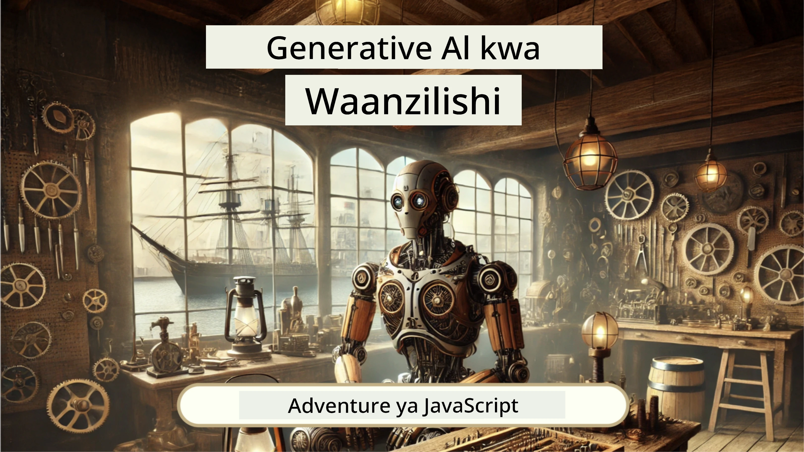
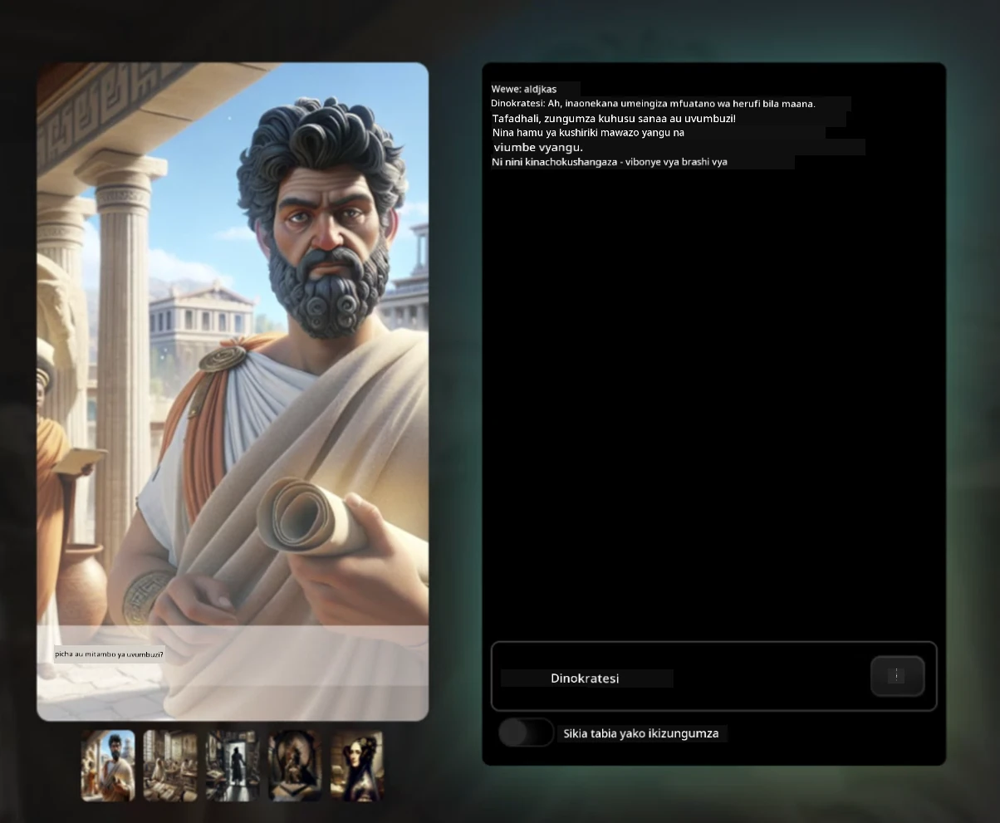
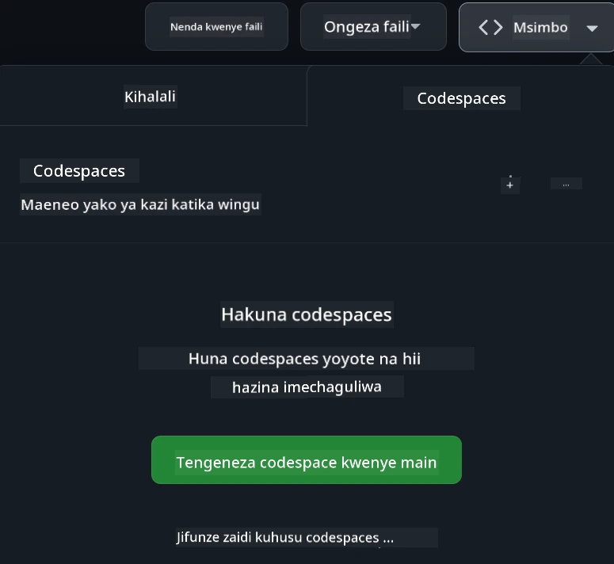

[](https://github.com/microsoft/Web-Dev-For-Beginners/blob/master/LICENSE)
[](https://GitHub.com/microsoft/Web-Dev-For-Beginners/graphs/contributors/)
[](https://GitHub.com/microsoft/Web-Dev-For-Beginners/issues/)
[](https://GitHub.com/microsoft/Web-Dev-For-Beginners/pulls/)
[](http://makeapullrequest.com) 

[](https://GitHub.com/microsoft/Web-Dev-For-Beginners/watchers/)
[](https://GitHub.com/microsoft/Web-Dev-For-Beginners/network/)
[](https://GitHub.com/microsoft/Web-Dev-For-Beginners/stargazers/)

[](https://discord.gg/nTYy5BXMWG)

# Maendeleo ya Wavuti kwa Waanzilishi - Mtaala

Jifunze misingi ya maendeleo ya wavuti kupitia kozi yetu ya kina ya wiki 12 inayotolewa na Wakili wa Wingu wa Microsoft. Kila somo kati ya 24 linaingia kwa undani katika JavaScript, CSS, na HTML kwa mradi wa vitendo kama vile terrariums, nyongeza za kivinjari, na michezo ya anga. Shirikiana na maswali, mijadala, na kazi za vitendo. Boreshaji ujuzi wako na kuimarisha ufahamu wako kwa njia yetu bora ya kufundisha inayozingatia miradi. Anza safari yako ya kuprogramu leo!

Jiunge na Jamii ya Discord ya Azure AI Foundry

[](https://discord.gg/nTYy5BXMWG)

Fuata hatua hizi kuanza kutumia rasilimali hizi:
1. **Chimba Hifadhi**: Bonyeza [](https://GitHub.com/microsoft/Web-Dev-For-Beginners/fork)
2. **Nakili Hifadhi**:   `git clone https://github.com/microsoft/Web-Dev-For-Beginners.git`
3. [**Jiunge na Discord ya Azure AI Foundry na ukutane na wataalamu na wapenzi wa maendeleo**](https://discord.com/invite/ByRwuEEgH4)

### 🌐 Msaada wa Lugha Nyingi

#### Unaungwa mkono kupitia Kitendo cha GitHub (Kiotomatiki & Kila Mara Kisivyocha)

<!-- CO-OP TRANSLATOR LANGUAGES TABLE START -->
[Kiarabu](../ar/README.md) | [Kibengali](../bn/README.md) | [Kibulgaria](../bg/README.md) | [Kiburma (Myanmar)](../my/README.md) | [Kichina (Rahisi)](../zh-CN/README.md) | [Kichina (Marefu, Hong Kong)](../zh-HK/README.md) | [Kichina (Marefu, Macau)](../zh-MO/README.md) | [Kichina (Marefu, Taiwan)](../zh-TW/README.md) | [Kikroeshia](../hr/README.md) | [Kicheki](../cs/README.md) | [Kideni](../da/README.md) | [Kiholanzi](../nl/README.md) | [Kiestoniani](../et/README.md) | [Kifini](../fi/README.md) | [Kifaransa](../fr/README.md) | [Kijerumani](../de/README.md) | [Kigiriki](../el/README.md) | [Kiheberi](../he/README.md) | [Kihindi](../hi/README.md) | [Kihungari](../hu/README.md) | [Kiindonesia](../id/README.md) | [Kitaliano](../it/README.md) | [Kijapani](../ja/README.md) | [Kikannada](../kn/README.md) | [Kikorea](../ko/README.md) | [Kilithuania](../lt/README.md) | [Kimelayu](../ms/README.md) | [Kimalayalam](../ml/README.md) | [Kimarathi](../mr/README.md) | [Kinepali](../ne/README.md) | [Pidgin ya Nijeria](../pcm/README.md) | [Kinorwe](../no/README.md) | [Kiajemi (Farsi)](../fa/README.md) | [Kipolandi](../pl/README.md) | [Kireno (Brazil)](../pt-BR/README.md) | [Kireno (Ureno)](../pt-PT/README.md) | [Kipunabi (Gurmukhi)](../pa/README.md) | [Kiromania](../ro/README.md) | [Kirusi](../ru/README.md) | [Kiserbia (Sirilik)](../sr/README.md) | [Kislovakia](../sk/README.md) | [Kislovenia](../sl/README.md) | [Kihispania](../es/README.md) | [Kiswahili](./README.md) | [Kiswidi](../sv/README.md) | [Kitagalogi (Filipino)](../tl/README.md) | [Kitamili](../ta/README.md) | [Kitelugu](../te/README.md) | [Kithai](../th/README.md) | [Kituruki](../tr/README.md) | [Kiukrania](../uk/README.md) | [Kiurdu](../ur/README.md) | [Kivietinamu](../vi/README.md)

> **Unapendelea Kunakili Moja kwa Moja?**

> Hifadhi hii ina tafsiri za lugha zaidi ya 50 ambazo huongeza sana ukubwa wa kupakua. Ili kunakili bila tafsiri, tumia sparse checkout:
> ```bash
> git clone --filter=blob:none --sparse https://github.com/microsoft/Web-Dev-For-Beginners.git
> cd Web-Dev-For-Beginners
> git sparse-checkout set --no-cone '/*' '!translations' '!translated_images'
> ```
> Hii inakupa kila kitu unachohitaji kumaliza kozi kwa download ya kasi zaidi.
<!-- CO-OP TRANSLATOR LANGUAGES TABLE END -->

**Ikiwa unataka kuwa na lugha za tafsiri za ziada zinazoungwa mkono zimo [hapa](https://github.com/Azure/co-op-translator/blob/main/getting_started/supported-languages.md)**

[](https://open.vscode.dev/microsoft/Web-Dev-For-Beginners)

#### 🧑‍🎓 _Je, wewe ni mwanafunzi?_

Tembelea [**ukurasa wa Kituo cha Wanafunzi**](https://docs.microsoft.com/learn/student-hub/?WT.mc_id=academic-77807-sagibbon) ambapo utapata rasilimali kwa wanaoanza, vifurushi vya Wanafunzi na hata njia za kupata vocha ya cheti bure. Huu ni ukurasa unayotaka kuweka alama na kuangalia mara kwa mara tunapo badilisha maudhui kila mwezi.

### 📣 Tangazo - Changamoto mpya za Hali ya Wakala wa GitHub Copilot za kukamilisha!

Changamoto mpya imeongezwa, tafuta "Changamoto ya Wakala wa GitHub Copilot 🚀" katika sura nyingi. Hii ni changamoto mpya kwako kumaliza ukitumia GitHub Copilot na hali ya Wakala. Ikiwa hujawahi kutumia hali ya Wakala hapo awali ina uwezo wa si tu kuandika maandishi bali pia kuunda na kuhariri faili, kuendesha amri na zaidi.

### 📣 Tangazo - _Mradi Mpya wa kujenga ukitumia AI ya Kizazi_

Mradi mpya wa Msaidizi wa AI umeongezwa hivi karibuni, angalia [mradi](./9-chat-project/README.md)

### 📣 Tangazo - _Mtaala Mpya_ juu ya AI ya Kizazi kwa JavaScript umeachiliwa tu

Usikose mtaala wetu mpya wa AI ya Kizazi!

Tembelea [https://aka.ms/genai-js-course](https://aka.ms/genai-js-course) kuanza!



- Masomo yanayogusa kila kitu kutoka mwanzo hadi RAG.
- Shirikiana na wahusika wa kihistoria ukitumia GenAI na programu yetu ya mwenzaji.
- Hadithi ya kufurahisha na yenye mvuto, utasafiri kwa wakati!




Kila somo linajumuisha kazi ya kukamilisha, kipimo cha uelewa na changamoto ya kukuongoza katika mada kama:
- Kutoa maagizo na uhandisi wa maagizo
- Uundaji wa programu za maandishi na picha
- Programu za utafutaji

Tembelea [https://aka.ms/genai-js-course](https://aka.ms/genai-js-course) kuanza!


## 🌱 Kuanzia

> **Walimu**, tumetoa [mapendekezo kadhaa](for-teachers.md) juu ya jinsi ya kutumia mtaala huu. Tunapenda maoni yako [katika jukwaa letu la mijadala](https://github.com/microsoft/Web-Dev-For-Beginners/discussions/categories/teacher-corner)!

**[Wajifunza](https://aka.ms/student-page/?WT.mc_id=academic-77807-sagibbon)**, kwa kila somo, anza kwa mtihani wa kabla ya somo na fuata kwa kusoma nyenzo za somo, kukamilisha shughuli mbalimbali na thibitisha uelewa wako kwa mtihani wa baada ya somo.

Ili kuboresha uzoefu wako wa kujifunza, ungana na wenzako kufanya miradi pamoja! Mijadala inahimizwa katika [jukwaa letu la mijadala](https://github.com/microsoft/Web-Dev-For-Beginners/discussions) ambapo timu yetu ya wasimamizi itakuwa tayari kujibu maswali yako.

Ili kuendeleza elimu yako, tunapendekeza sana kuchunguza [Microsoft Learn](https://learn.microsoft.com/users/wirelesslife/collections/p1ddcy5jwy0jkm?WT.mc_id=academic-77807-sagibbon) kwa nyenzo za ziada za kujifunzia.

### 📋 Kuweka mazingira yako

Mtaala huu una mazingira ya maendeleo tayari kwa matumizi! Unapoanza unaweza kuchagua kuendesha mtaala huu katika [Codespace](https://github.com/features/codespaces/) (_mazingira ya kivinjari, pasipo hitaji kufunga programu_), au kwa kompyuta yako mwenyewe ukitumia mhariri wa maandishi kama [Visual Studio Code](https://code.visualstudio.com/?WT.mc_id=academic-77807-sagibbon).

#### Tengeneza hifadhi yako
Ili kuhifadhi kazi yako kwa urahisi, inashauriwa kutengeneza nakala yako ya hifadhi hii. Unaweza kufanya hivyo kwa kubonyeza kitufe cha **Tumia kiolezo hiki** juu ya ukurasa. Hii itaunda hifadhi mpya katika akaunti yako ya GitHub yenye nakala ya mtaala huu.

Fuata hatua hizi:
1. **Chimba Hifadhi**: Bonyeza kitufe cha "Fork" juu-kulia wa ukurasa huu.
2. **Nakili Hifadhi**:   `git clone https://github.com/microsoft/Web-Dev-For-Beginners.git`

#### Kuendesha mtaala huu katika Codespace

Katika nakala yako ya hifadhi uliyotengeneza, bonyeza kitufe cha **Code** na chagua **Fungua na Codespaces**. Hii itaunda Codespace mpya kwako kufanya kazi.



#### Kuendesha mtaala huu kafaida ya kompyuta yako mwenyewe

Ili kuendesha mtaala huu kwenye kompyuta yako, utahitaji mhariri wa maandishi, kivinjari na zana ya amri. Somo letu la kwanza, [Utangulizi wa Lugha za Programu na Zana za Biashara](../../1-getting-started-lessons/1-intro-to-programming-languages), litakuongoza kupitia chaguzi mbalimbali za kila chombo ili uchague kinachokufaa zaidi.

Tunapendekeza kutumia [Visual Studio Code](https://code.visualstudio.com/?WT.mc_id=academic-77807-sagibbon) kama mhariri wako, ambao pia una [Terminali](https://code.visualstudio.com/docs/terminal/basics/?WT.mc_id=academic-77807-sagibbon) iliyojengwa ndani. Unaweza kupakua Visual Studio Code [hapa](https://code.visualstudio.com/?WT.mc_id=academic-77807-sagibbon).


1. Nakili hifadhi yako kwenye kompyuta yako. Unaweza kufanya hivyo kwa kubonyeza kitufe cha **Code** na kunakili URL:

    [CodeSpace](./images/createcodespace.png)
Kisha, fungua [Terminal](https://code.visualstudio.com/docs/terminal/basics/?WT.mc_id=academic-77807-sagibbon) ndani ya [Visual Studio Code](https://code.visualstudio.com/?WT.mc_id=academic-77807-sagibbon) na endesha amri ifuatayo, ukibadilisha `<your-repository-url>` na URL uliyokuwa nayo:

    ```bash 
    git clone <your-repository-url>
    ```

2. Fungua folda ndani ya Visual Studio Code. Unaweza kufanya hivi kwa kubonyeza **File** > **Open Folder** na kuchagua folda uliyokuwa umeikopa.

> Mapendekezo ya nyongeza za Visual Studio Code:
>
> * [Live Server](https://marketplace.visualstudio.com/items?itemName=ritwickdey.LiveServer&WT.mc_id=academic-77807-sagibbon) - kuangalia ukurasa wa HTML ndani ya Visual Studio Code
> * [Copilot](https://marketplace.visualstudio.com/items?itemName=GitHub.copilot&WT.mc_id=academic-77807-sagibbon) - kusaidia kuandika msimbo kwa haraka

## 📂 Kila somo linajumuisha:

- sketchnote ya hiari
- video ya ziada ya hiari
- mtihani wa kuandaa kabla ya somo
- somo lililoandikwa
- kwa masomo ya mradi, mwongozo wa hatua kwa hatua wa jinsi ya kujenga mradi
- ukaguzi wa maarifa
- changamoto
- usomaji wa ziada
- kazi ya nyumbani
- [mtihani wa baada ya somo](https://ff-quizzes.netlify.app/web/)

> **Kumbuka kuhusu mitihani**: Mitihani yote iko katika folda ya Quiz-app, mitihani 48 jumla ya maswali matatu kila moja. Inapatikana [hapa](https://ff-quizzes.netlify.app/web/), programu ya mtihani inaweza kuendeshwa kwa ndani au kusambazwa kwenye Azure; fuata maagizo katika folda ya `quiz-app`.

## 🗃️ Masomo

|     |                       Jina la Mradi                       |                            Dhana Zinazofundishwa                             | Malengo ya Kujifunza                                                                                                                 |                                                         Somo Linalohusiana                                                          |         Mwandishi          |
| :-: | :------------------------------------------------------: | :--------------------------------------------------------------------: | ----------------------------------------------------------------------------------------------------------------------------------- | :----------------------------------------------------------------------------------------------------------------------------: | :---------------------: |
| 01  |                     Kuanzisha                      |           Utangulizi wa Uprogramu na Zana za Kazi           | Jifunze misingi ya lugha nyingi za programu na kuhusu programu zinazosaidia waendelezaji wa kitaalamu kufanya kazi zao | [Utangulizi wa Lugha za Programu na Zana za Kazi](./1-getting-started-lessons/1-intro-to-programming-languages/README.md) |         Jasmine         |
| 02  |                     Kuanzisha                      |             Misingi ya GitHub, ikiwa ni pamoja na kufanya kazi na timu             | Jinsi ya kutumia GitHub katika mradi wako, jinsi ya kushirikiana na wengine kwenye msimbo wa chanzo                                                    |                            [Utangulizi wa GitHub](./1-getting-started-lessons/2-github-basics/README.md)                             |          Floor          |
| 03  |                     Kuanzisha                      |                             Ufikivu                              | Jifunze misingi ya ufikivu wa wavuti                                                                                               |                       [Misingi ya Ufikivu](./1-getting-started-lessons/3-accessibility/README.md)                       |       Christopher       |
| 04  |                        Misingi ya JS                         |                         Aina za Data za JavaScript                          | Misingi ya aina za data za JavaScript                                                                                                 |                                       [Aina za Data](./2-js-basics/1-data-types/README.md)                                        |         Jasmine         |
| 05  |                        Misingi ya JS                         |                         Kazi na Mbinu                          | Jifunze kuhusu kazi na mbinu za kusimamia mtiririko wa mantiki ya programu                                                             |                              [Kazi na Mbinu](./2-js-basics/2-functions-methods/README.md)                               | Jasmine na Christopher |
| 06  |                        Misingi ya JS                         |                        Kufanya Maamuzi kwa JS                        | Jifunze jinsi ya kuunda masharti katika msimbo wako ukitumia mbinu za kufanya maamuzi                                                           |                                 [Kufanya Maamuzi](./2-js-basics/3-making-decisions/README.md)                                  |         Jasmine         |
| 07  |                        Misingi ya JS                         |                            Msururu na Mizunguko                            | Fanya kazi na data kupitia msururu na mizunguko katika JavaScript                                                                                 |                                   [Msururu na Mizunguko](./2-js-basics/4-arrays-loops/README.md)                                    |         Jasmine         |
| 08  |       [Terrarium](./3-terrarium/solution/README.md)       |                            HTML Katika Vitendo                            | Jenga HTML kuunda terrarium ya mtandaoni, ukizingatia kujenga mpangilio                                                         |                                 [Utangulizi wa HTML](./3-terrarium/1-intro-to-html/README.md)                                 |           Jen           |
| 09  |       [Terrarium](./3-terrarium/solution/README.md)       |                            CSS Katika Vitendo                             | Jenga CSS kuibeba terrarium ya mtandaoni, ukizingatia misingi ya CSS ikiwa ni pamoja na kuifanya ukurasa uwe responsive                     |                                  [Utangulizi wa CSS](./3-terrarium/2-intro-to-css/README.md)                                  |           Jen           |
| 10  |            [Terrarium](./3-terrarium/solution/README.md)            |                 Funguo za JavaScript, uendeshaji wa DOM                  | Tengeneza JavaScript ili kufanya terrarium ifanye kazi kama kiolesura cha buruta/acha, ukizingatia funguo na uendeshaji wa DOM             |                  [Funguo za JavaScript, uendeshaji wa DOM](./3-terrarium/3-intro-to-DOM-and-closures/README.md)                   |           Jen           |
| 11  |          [Typing Game](./4-typing-game/solution/README.md)          |                          Jenga Mchezo wa Kuandika                           | Jifunze jinsi ya kutumia matukio ya kibodi kuendesha mantiki ya programu yako ya JavaScript                                                          |                                [Uprogramu unaoendeshwa na Matukio](./4-typing-game/typing-game/README.md)                                |       Christopher       |
| 12  | [Green Browser Extension](./5-browser-extension/solution/README.md) |                         Kufanya kazi na Vivinjari                          | Jifunze jinsi vinjari vinavyofanya kazi, historia yao, na jinsi ya kuanzisha vipengele vya kwanza vya kiendelezi cha kivinjari                               |                               [Kuhusu Vivinjari](./5-browser-extension/1-about-browsers/README.md)                                |           Jen           |
| 13  | [Green Browser Extension](./5-browser-extension/solution/README.md) | Kujenga fomu, kuita API na kuhifadhi vigezo kwenye hifadhi ya ndani | Tengeneza vipengele vya JavaScript vya kiendelezi chako cha kivinjari kuitumia API kwa kutumia vigezo vilivyosubiriwa katika hifadhi ya ndani                      |                [APIs, Fomu, na Hifadhi ya Ndani](./5-browser-extension/2-forms-browsers-local-storage/README.md)                 |           Jen           |
| 14  | [Green Browser Extension](./5-browser-extension/solution/README.md) |          Mchakato wa nyuma katika kivinjari, utendaji wa wavuti          | Tumia michakato ya kivinjari ya nyuma kusimamia ikoni ya kiendelezi; jifunze kuhusu utendaji wa wavuti na baadhi ya marekebisho ili kufanya   |             [Kazi za Nyuma na Utendaji](./5-browser-extension/3-background-tasks-and-performance/README.md)              |           Jen           |
| 15  |           [Space Game](./6-space-game/solution/README.md)           |             Maendeleo ya Juu zaidi ya Mchezo kwa JavaScript             | Jifunze kuhusu Urithi ukitumia Madarasa na Muundo pamoja na mfano wa Pub/Sub, kama maandalizi ya kujenga mchezo              |                      [Utangulizi wa Maendeleo ya Mchezo Cha Juu](./6-space-game/1-introduction/README.md)                       |          Chris          |
| 16  |           [Space Game](./6-space-game/solution/README.md)           |                           Kuchora kwenye turubai                            | Jifunze kuhusu API ya Canvas, inayotumika kuchora vipengele kwenye skrini                                                                       |                                [Kuchora kwenye Canvas](./6-space-game/2-drawing-to-canvas/README.md)                                |          Chris          |
| 17  |           [Space Game](./6-space-game/solution/README.md)           |                   Kuweka vipengele kuzunguka kwenye skrini                    | Gundua jinsi vipengele vinaweza kupata mwendo kwa kutumia kuratibu za Cartesian na API ya Canvas                                            |                           [Kusogeza Vipengele Kizunguka](./6-space-game/3-moving-elements-around/README.md)                           |          Chris          |
| 18  |           [Space Game](./6-space-game/solution/README.md)           |                          Kugundua mgongano                           | Fanya vipengele kuwa na mgongano na kutoa athari kwa kila mmoja kwa kutumia kufungia vitufe na toa kazi ya kupumzika ili kuhakikisha utendaji wa mchezo    |                              [Ugunduzi wa Mgongano](./6-space-game/4-collision-detection/README.md)                              |          Chris          |
| 19  |           [Space Game](./6-space-game/solution/README.md)           |                             Kuhifadhi alama                              | Fanya hesabu za kijumla kulingana na hali na utendakazi wa mchezo                                                                |                                    [Kuhifadhi Alama](./6-space-game/5-keeping-score/README.md)                                    |          Chris          |
| 20  |           [Space Game](./6-space-game/solution/README.md)           |                     Kumaliza na kuanzisha upya mchezo                     | Jifunze kuhusu kumaliza na kuanzisha upya mchezo, ikiwa ni pamoja na kusafisha mali na kuweka upya thamani za vigezo                              |                                [Hali ya Kumaliza](./6-space-game/6-end-condition/README.md)                                 |          Chris          |
| 21  |         [Banking App](./7-bank-project/solution/README.md)          |                 Violezo vya HTML na Njia katika App ya Wavuti                 | Jifunze jinsi ya kuunda muundo wa tovuti ya kurasa nyingi ukitumia uelekeaji na violezo vya HTML                             |                            [Violezo vya HTML na Njia](./7-bank-project/1-template-route/README.md)                             |          Yohan          |
| 22  |         [Banking App](./7-bank-project/solution/README.md)          |                  Jenga Fomu ya Kuingia na Kusajili                   | Jifunze kuhusu ujenzi wa fomu na kushughulikia utambuzi                                                                          |                                           [Fomu](./7-bank-project/2-forms/README.md)                                           |          Yohan          |
| 23  |         [Banking App](./7-bank-project/solution/README.md)          |                   Mbinu za Kupata na Kutumia Data                   | Jinsi data inavyopita ndani na nje ya app yako, jinsi ya kuipata, kuhifadhi na kuiondoa                                                 |                                            [Data](./7-bank-project/3-data/README.md)                                            |          Yohan          |
| 24  |         [Banking App](./7-bank-project/solution/README.md)          |                      Dhana za Usimamizi wa Hali                      | Jifunze jinsi app yako inavyoshikilia hali na jinsi ya kuisimamia kitaalamu                                                              |                                [Usimamizi wa Hali](./7-bank-project/4-state-management/README.md)                                |          Yohan          |
| 25 | [Browser/VScode Code](../../8-code-editor) | Kufanya kazi na VScode | Jifunze jinsi ya kutumia mhariri wa msimbo | [Tumia mhariri wa msimbo wa VScode](./8-code-editor/1-using-a-code-editor/README.md) | Chris |
| 26 | [AI Assistants](./9-chat-project/README.md) | Kufanya kazi na AI | Jifunze jinsi ya kujenga msaidizi wako mwenye akili bandia | [Mradi wa Msaidizi wa AI](./9-chat-project/README.md) | Chris |

## 🏫 Pedagogia

Mtaala wetu umeundwa kwa misingi miwili muhimu ya kielimu:
* kujifunza kwa mradi
* mitihani ya mara kwa mara

Programu hii inafundisha misingi ya JavaScript, HTML, na CSS, pamoja na zana na mbinu za hivi karibuni zinazotumiwa na waendelezaji wa wavuti wa sasa. Wanafunzi watapata fursa ya kupata uzoefu wa vitendo kwa kujenga mchezo wa kuandika, terrarium ya kidijitali, kiendelezi cha kivinjari chenye uangalifu wa mazingira, mchezo wa kawaida wa wavamizi wa anga, na app ya benki kwa biashara. Mwisho wa mfululizo, wanafunzi watakuwa na ufahamu imara wa maendeleo ya wavuti.

> 🎓 Unaweza kuchukua masomo machache ya kwanza katika mtaala huu kama [Njia ya Kujifunza](https://docs.microsoft.com/learn/paths/web-development-101/?WT.mc_id=academic-77807-sagibbon) kwenye Microsoft Learn!

Kwa kuhakikisha kuwa maudhui yanaendana na miradi, mchakato unakuwa wa kuvutia zaidi kwa wanafunzi na uhifadhi wa dhana utaimarishwa. Pia tuliandika masomo kadhaa ya kuanzisha misingi ya JavaScript ili kuanzisha dhana, yakiwa na video kutoka kwa mkusanyiko wa video wa "[Mfululizo wa Waanzilishi kwa: JavaScript](https://channel9.msdn.com/Series/Beginners-Series-to-JavaScript/?WT.mc_id=academic-77807-sagibbon)", baadhi ya waandishi wake walichangia mtaala huu.

Zaidi ya hayo, mtihani wa hali ya chini kabla ya darasa huweka nia ya mwanafunzi kuelekea kujifunza mada, wakati mtihani wa pili baada ya darasa huhakikisha uhifadhi zaidi. Mtaala huu uliundwa kuwa na ufanisi na furaha na unaweza kuchukuliwa kwa jumla au sehemu. Miradi inaanza ndogo na kuwa ngumu zaidi mwishoni mwa mzunguko wa wiki 12.

Ingawa tumejaribu kuepuka kuanzisha mifumo ya JavaScript badala yake tunalenga ujuzi wa msingi unaohitajika kama msanifu wa wavuti kabla ya kutumia mfumo, hatua inayofuata bora ya kumaliza mtaala huu itakuwa kujifunza kuhusu Node.js kupitia mkusanyiko mwingine wa video: "[Mfululizo wa Waanzilishi kwa: Node.js](https://channel9.msdn.com/Series/Beginners-Series-to-Nodejs/?WT.mc_id=academic-77807-sagibbon)".

> Tembelea [Kanuni zetu za Maadili](CODE_OF_CONDUCT.md) na miongozo ya [Michango](CONTRIBUTING.md). Tunakaribisha maoni yako yenye kujenga!


## 🧭 Ufikiaji wa Offline

Unaweza kuendesha nyaraka hizi bila mtandao kwa kutumia [Docsify](https://docsify.js.org/#/). Kopia hifadhi hii, [weka Docsify](https://docsify.js.org/#/quickstart) kwenye kompyuta yako ya karibu, kisha katika folda kuu ya hifadhi hii, andika `docsify serve`. Tovuti itakuwa ikihudumiwa kwenye bandari 3000 kwenye localhost yako: `localhost:3000`.

## 📘 PDF

PDF ya masomo yote inaweza kupatikana [hapa](https://microsoft.github.io/Web-Dev-For-Beginners/pdf/readme.pdf).


## 🎒 Kozi Nyingine
Timu yetu hutengeneza kozi zingine! Angalia:

<!-- CO-OP TRANSLATOR OTHER COURSES START -->
### LangChain
[](https://aka.ms/langchain4j-for-beginners)
[](https://aka.ms/langchainjs-for-beginners?WT.mc_id=m365-94501-dwahlin)
[](https://github.com/microsoft/langchain-for-beginners?WT.mc_id=m365-94501-dwahlin)
---

### Azure / Edge / MCP / Wakala
[](https://github.com/microsoft/AZD-for-beginners?WT.mc_id=academic-105485-koreyst)
[](https://github.com/microsoft/edgeai-for-beginners?WT.mc_id=academic-105485-koreyst)
[](https://github.com/microsoft/mcp-for-beginners?WT.mc_id=academic-105485-koreyst)
[](https://github.com/microsoft/ai-agents-for-beginners?WT.mc_id=academic-105485-koreyst)

---
 
### Mfululizo wa AI Inayotengeneza
[](https://github.com/microsoft/generative-ai-for-beginners?WT.mc_id=academic-105485-koreyst)
[-9333EA?style=for-the-badge&labelColor=E5E7EB&color=9333EA)](https://github.com/microsoft/Generative-AI-for-beginners-dotnet?WT.mc_id=academic-105485-koreyst)
[-C084FC?style=for-the-badge&labelColor=E5E7EB&color=C084FC)](https://github.com/microsoft/generative-ai-for-beginners-java?WT.mc_id=academic-105485-koreyst)
[-E879F9?style=for-the-badge&labelColor=E5E7EB&color=E879F9)](https://github.com/microsoft/generative-ai-with-javascript?WT.mc_id=academic-105485-koreyst)

---
 
### Kujifunza Msingi
[](https://aka.ms/ml-beginners?WT.mc_id=academic-105485-koreyst)
[](https://aka.ms/datascience-beginners?WT.mc_id=academic-105485-koreyst)
[](https://aka.ms/ai-beginners?WT.mc_id=academic-105485-koreyst)
[](https://github.com/microsoft/Security-101?WT.mc_id=academic-96948-sayoung)
[](https://aka.ms/webdev-beginners?WT.mc_id=academic-105485-koreyst)
[](https://aka.ms/iot-beginners?WT.mc_id=academic-105485-koreyst)
[](https://github.com/microsoft/xr-development-for-beginners?WT.mc_id=academic-105485-koreyst)

---
 
### Mfululizo wa Copilot
[](https://aka.ms/GitHubCopilotAI?WT.mc_id=academic-105485-koreyst)
[](https://github.com/microsoft/mastering-github-copilot-for-dotnet-csharp-developers?WT.mc_id=academic-105485-koreyst)
[](https://github.com/microsoft/CopilotAdventures?WT.mc_id=academic-105485-koreyst)
<!-- CO-OP TRANSLATOR OTHER COURSES END -->

## Kupata Msaada

Kama unashindwa au una maswali yoyote kuhusu kujenga programu za AI. Jiunge na wanafunzi wenzako na waendelezaji wenye uzoefu katika mijadala kuhusu MCP. Ni jamii inayounga mkono ambapo maswali yanakaribishwa na maarifa hushirikiwa kwa huru.

[](https://discord.gg/nTYy5BXMWG)

Kama una maoni juu ya bidhaa au makosa wakati wa kujenga tembelea:

[](https://aka.ms/foundry/forum)

## Leseni

Hifadhidata hii imelindwa chini ya leseni ya MIT. Angalia faili la [LICENSE](../../LICENSE) kwa maelezo zaidi.

---

<!-- CO-OP TRANSLATOR DISCLAIMER START -->
**Kidokezo cha Kutokujali**:  
Nyaraka hii imetafsiriwa kwa kutumia huduma ya utafsiri ya AI [Co-op Translator](https://github.com/Azure/co-op-translator). Ingawa tunajitahidi kuwa sahihi, tafadhali fahamu kwamba tafsiri za kiotomatiki zinaweza kuwa na makosa au kasoro. Nyaraka asilia katika lugha yake ya asili inapaswa kuzingatiwa kama chanzo cha mamlaka. Kwa taarifa muhimu, utafsiri wa kitaalamu wa binadamu unashauriwa. Hatutawajibika kwa kutoelewana au tafsiri za makosa zitokanazo na matumizi ya tafsiri hii.
<!-- CO-OP TRANSLATOR DISCLAIMER END -->