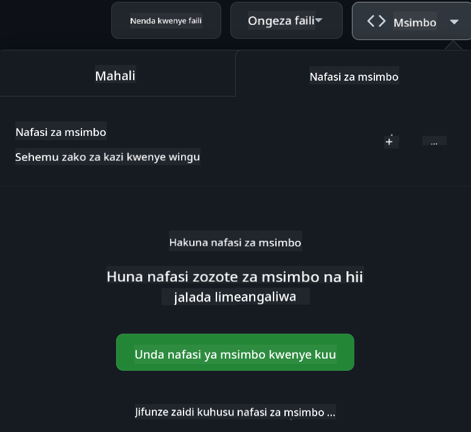

<!--
CO_OP_TRANSLATOR_METADATA:
{
  "original_hash": "caf2ca695e9d259153d24a5cf3e07ef5",
  "translation_date": "2025-10-11T11:21:00+00:00",
  "source_file": "README.md",
  "language_code": "sw"
}
-->
[](https://github.com/microsoft/Web-Dev-For-Beginners/blob/master/LICENSE)
[](https://GitHub.com/microsoft/Web-Dev-For-Beginners/graphs/contributors/)
[](https://GitHub.com/microsoft/Web-Dev-For-Beginners/issues/)
[](https://GitHub.com/microsoft/Web-Dev-For-Beginners/pulls/)
[](http://makeapullrequest.com)

[](https://GitHub.com/microsoft/Web-Dev-For-Beginners/watchers/)
[](https://GitHub.com/microsoft/Web-Dev-For-Beginners/network/)
[](https://GitHub.com/microsoft/Web-Dev-For-Beginners/stargazers/)

[](https://discord.gg/zxKYvhSnVp?WT.mc_id=academic-000002-leestott)

# Maendeleo ya Wavuti kwa Kompyuta - Mtaala

Jifunze misingi ya maendeleo ya wavuti kupitia kozi yetu ya wiki 12 iliyoandaliwa na Microsoft Cloud Advocates. Kila somo kati ya masomo 24 linachunguza JavaScript, CSS, na HTML kupitia miradi ya vitendo kama terrariums, viendelezi vya kivinjari, na michezo ya anga. Shirikiana na maswali, mijadala, na kazi za vitendo. Boresha ujuzi wako na uimarisha maarifa yako kwa kutumia mbinu yetu ya kujifunza kwa miradi. Anza safari yako ya programu leo!

Jiunge na Jumuiya ya Azure AI Foundry Discord

[](https://discord.com/invite/ByRwuEEgH4)

Fuata hatua hizi kuanza kutumia rasilimali hizi:
1. **Fork Hifadhi**: Bonyeza [](https://GitHub.com/microsoft/Web-Dev-For-Beginners/fork)
2. **Clone Hifadhi**:   `git clone https://github.com/microsoft/Web-Dev-For-Beginners.git`
3. [**Jiunge na Azure AI Foundry Discord na kutana na wataalamu na watengenezaji wenzako**](https://discord.com/invite/ByRwuEEgH4)

### 🌐 Msaada wa Lugha Nyingi

#### Inasaidiwa kupitia GitHub Action (Imejiendesha & Daima Imeboreshwa)

<!-- CO-OP TRANSLATOR LANGUAGES TABLE START -->
[Arabic](../ar/README.md) | [Bengali](../bn/README.md) | [Bulgarian](../bg/README.md) | [Burmese (Myanmar)](../my/README.md) | [Chinese (Simplified)](../zh/README.md) | [Chinese (Traditional, Hong Kong)](../hk/README.md) | [Chinese (Traditional, Macau)](../mo/README.md) | [Chinese (Traditional, Taiwan)](../tw/README.md) | [Croatian](../hr/README.md) | [Czech](../cs/README.md) | [Danish](../da/README.md) | [Dutch](../nl/README.md) | [Estonian](../et/README.md) | [Finnish](../fi/README.md) | [French](../fr/README.md) | [German](../de/README.md) | [Greek](../el/README.md) | [Hebrew](../he/README.md) | [Hindi](../hi/README.md) | [Hungarian](../hu/README.md) | [Indonesian](../id/README.md) | [Italian](../it/README.md) | [Japanese](../ja/README.md) | [Korean](../ko/README.md) | [Lithuanian](../lt/README.md) | [Malay](../ms/README.md) | [Marathi](../mr/README.md) | [Nepali](../ne/README.md) | [Norwegian](../no/README.md) | [Persian (Farsi)](../fa/README.md) | [Polish](../pl/README.md) | [Portuguese (Brazil)](../br/README.md) | [Portuguese (Portugal)](../pt/README.md) | [Punjabi (Gurmukhi)](../pa/README.md) | [Romanian](../ro/README.md) | [Russian](../ru/README.md) | [Serbian (Cyrillic)](../sr/README.md) | [Slovak](../sk/README.md) | [Slovenian](../sl/README.md) | [Spanish](../es/README.md) | [Swahili](./README.md) | [Swedish](../sv/README.md) | [Tagalog (Filipino)](../tl/README.md) | [Tamil](../ta/README.md) | [Thai](../th/README.md) | [Turkish](../tr/README.md) | [Ukrainian](../uk/README.md) | [Urdu](../ur/README.md) | [Vietnamese](../vi/README.md)
<!-- CO-OP TRANSLATOR LANGUAGES TABLE END -->

**Ikiwa ungependa lugha za ziada ziongezwe, orodha ya lugha zinazosaidiwa inapatikana [hapa](https://github.com/Azure/co-op-translator/blob/main/getting_started/supported-languages.md)**

[](https://open.vscode.dev/microsoft/Web-Dev-For-Beginners)

#### 🧑‍🎓 _Je, wewe ni mwanafunzi?_

Tembelea [**Ukurasa wa Hub ya Wanafunzi**](https://docs.microsoft.com/learn/student-hub/?WT.mc_id=academic-77807-sagibbon) ambapo utapata rasilimali za kompyuta, vifurushi vya wanafunzi, na hata njia za kupata vocha ya cheti bila malipo. Huu ni ukurasa wa kuweka alama na kuangalia mara kwa mara kwani tunabadilisha maudhui kila mwezi.

### 📣 Tangazo - _Mradi Mpya wa Kujenga kwa kutumia AI ya Kizazi_

Mradi mpya wa Msaidizi wa AI umeongezwa, angalia [mradi](./09-chat-project/README.md)

### 📣 Tangazo - _Mtaala Mpya_ wa AI ya Kizazi kwa JavaScript umetolewa

Usikose mtaala wetu mpya wa AI ya Kizazi!

Tembelea [https://aka.ms/genai-js-course](https://aka.ms/genai-js-course) kuanza!


- Masomo yanayofunika kila kitu kutoka misingi hadi RAG.
- Shirikiana na wahusika wa kihistoria kwa kutumia GenAI na programu yetu ya msaidizi.
- Hadithi ya kuvutia na ya kufurahisha, utasafiri kupitia wakati!


Kila somo linajumuisha kazi ya kukamilisha, ukaguzi wa maarifa, na changamoto ya kukuongoza kujifunza mada kama:
- Kuunda maelezo na uhandisi wa maelezo
- Uundaji wa programu za maandishi na picha
- Programu za utafutaji

Tembelea [https://aka.ms/genai-js-course](../../[https:/aka.ms/genai-js-course) kuanza!

## 🌱 Kuanzisha

> **Walimu**, tumetoa [mapendekezo kadhaa](for-teachers.md) ya jinsi ya kutumia mtaala huu. Tunapenda maoni yako [katika jukwaa letu la majadiliano](https://github.com/microsoft/Web-Dev-For-Beginners/discussions/categories/teacher-corner)!

**[Wanafunzi](https://aka.ms/student-page/?WT.mc_id=academic-77807-sagibbon)**, kwa kila somo, anza na jaribio la awali la somo na endelea kusoma nyenzo za somo, kukamilisha shughuli mbalimbali, na angalia uelewa wako kwa jaribio la baada ya somo.

Ili kuboresha uzoefu wako wa kujifunza, ungana na wenzako kufanya kazi kwenye miradi pamoja! Majadiliano yanahimizwa katika [jukwaa letu la majadiliano](https://github.com/microsoft/Web-Dev-For-Beginners/discussions) ambapo timu yetu ya wasimamizi itapatikana kujibu maswali yako.

Ili kuendeleza elimu yako, tunapendekeza sana kuchunguza [Microsoft Learn](https://learn.microsoft.com/users/wirelesslife/collections/p1ddcy5jwy0jkm?WT.mc_id=academic-77807-sagibbon) kwa nyenzo za ziada za masomo.

### 📋 Kuweka mazingira yako

Mtaala huu una mazingira ya maendeleo tayari! Unapoanza, unaweza kuchagua kuendesha mtaala katika [Codespace](https://github.com/features/codespaces/) (_mazingira yanayotegemea kivinjari, hakuna haja ya kusakinisha_), au kwa ndani kwenye kompyuta yako kwa kutumia mhariri wa maandishi kama [Visual Studio Code](https://code.visualstudio.com/?WT.mc_id=academic-77807-sagibbon).

#### Unda hifadhi yako
Ili kuokoa kazi yako kwa urahisi, inashauriwa kwamba uunde nakala yako mwenyewe ya hifadhi hii. Unaweza kufanya hivyo kwa kubonyeza kitufe cha **Tumia kiolezo** juu ya ukurasa. Hii itaunda hifadhi mpya katika akaunti yako ya GitHub na nakala ya mtaala.

Fuata hatua hizi:
1. **Fork Hifadhi**: Bonyeza kitufe cha "Fork" kwenye kona ya juu-kulia ya ukurasa huu.
2. **Clone Hifadhi**:   `git clone https://github.com/microsoft/Web-Dev-For-Beginners.git`

#### Kuendesha mtaala katika Codespace

Katika nakala yako ya hifadhi hii uliyounda, bonyeza kitufe cha **Code** na uchague **Open with Codespaces**. Hii itaunda Codespace mpya kwako kufanya kazi ndani yake.



#### Kuendesha mtaala kwa ndani kwenye kompyuta yako

Ili kuendesha mtaala huu kwa ndani kwenye kompyuta yako, utahitaji mhariri wa maandishi, kivinjari, na zana ya mstari wa amri. Somo letu la kwanza, [Utangulizi wa Lugha za Programu na Zana za Kazi](../../1-getting-started-lessons/1-intro-to-programming-languages), litakuelekeza kupitia chaguo mbalimbali kwa kila moja ya zana hizi ili uchague kinachokufaa zaidi.

Pendekezo letu ni kutumia [Visual Studio Code](https://code.visualstudio.com/?WT.mc_id=academic-77807-sagibbon) kama mhariri wako, ambao pia una [Terminal](https://code.visualstudio.com/docs/terminal/basics/?WT.mc_id=academic-77807-sagibbon) iliyojengwa ndani. Unaweza kupakua Visual Studio Code [hapa](https://code.visualstudio.com/?WT.mc_id=academic-77807-sagibbon).

1. Clone hifadhi yako kwenye kompyuta yako. Unaweza kufanya hivyo kwa kubonyeza kitufe cha **Code** na kunakili URL:

    [CodeSpace](./images/createcodespace.png)

    Kisha, fungua [Terminal](https://code.visualstudio.com/docs/terminal/basics/?WT.mc_id=academic-77807-sagibbon) ndani ya [Visual Studio Code](https://code.visualstudio.com/?WT.mc_id=academic-77807-sagibbon) na endesha amri ifuatayo, ukibadilisha `<your-repository-url>` na URL uliyokopi:

    ```bash 
    git clone <your-repository-url>
    ```

2. Fungua folda katika Visual Studio Code. Unaweza kufanya hivyo kwa kubonyeza **File** > **Open Folder** na kuchagua folda uliyoclone.

>  Viendelezi vya Visual Studio Code vinavyopendekezwa:
>
> * [Live Server](https://marketplace.visualstudio.com/items?itemName=ritwickdey.LiveServer&WT.mc_id=academic-77807-sagibbon) - kuonyesha kurasa za HTML ndani ya Visual Studio Code
> * [Copilot](https://marketplace.visualstudio.com/items?itemName=GitHub.copilot&WT.mc_id=academic-77807-sagibbon) - kusaidia kuandika msimbo haraka

## 📂 Kila somo linajumuisha:

- sketchnote ya hiari
- video ya ziada ya hiari
- jaribio la kujiandaa kabla ya somo
- somo lililoandikwa  
- kwa masomo yanayotegemea miradi, mwongozo wa hatua kwa hatua jinsi ya kujenga mradi  
- ukaguzi wa maarifa  
- changamoto  
- usomaji wa ziada  
- kazi ya nyumbani  
- [jaribio baada ya somo](https://ff-quizzes.netlify.app/web/)  

> **Maelezo kuhusu majaribio**: Majaribio yote yamewekwa kwenye folda ya Quiz-app, jumla ya majaribio 48 yenye maswali matatu kila moja. Yanapatikana [hapa](https://ff-quizzes.netlify.app/web/). Programu ya jaribio inaweza kuendeshwa ndani ya kompyuta au kupelekwa kwenye Azure; fuata maelekezo kwenye folda ya `quiz-app`.

## 🗃️ Masomo  

|     |                       Jina la Mradi                       |                            Dhana Zinazofundishwa                             | Malengo ya Kujifunza                                                                                                                 |                                                         Somo Lililounganishwa                                                          |         Mwandishi          |  
| :-: | :------------------------------------------------------: | :--------------------------------------------------------------------: | ----------------------------------------------------------------------------------------------------------------------------------- | :----------------------------------------------------------------------------------------------------------------------------: | :---------------------: |  
| 01  |                     Kuanza                      |           Utangulizi wa Uprogramu na Zana za Kazi           | Jifunze misingi ya lugha nyingi za programu na kuhusu programu zinazosaidia watengenezaji wa kitaalamu kufanya kazi zao | [Utangulizi wa Lugha za Uprogramu na Zana za Kazi](./1-getting-started-lessons/1-intro-to-programming-languages/README.md) |         Jasmine         |  
| 02  |                     Kuanza                      |             Misingi ya GitHub, ikijumuisha kufanya kazi na timu             | Jinsi ya kutumia GitHub katika mradi wako, jinsi ya kushirikiana na wengine kwenye msingi wa msimbo                                                    |                            [Utangulizi wa GitHub](./1-getting-started-lessons/2-github-basics/README.md)                             |          Floor          |  
| 03  |                     Kuanza                      |                             Ufikiaji                              | Jifunze misingi ya ufikiaji wa wavuti                                                                                               |                       [Misingi ya Ufikiaji](./1-getting-started-lessons/3-accessibility/README.md)                       |       Christopher       |  
| 04  |                        Misingi ya JS                         |                         Aina za Takwimu za JavaScript                          | Misingi ya aina za takwimu za JavaScript                                                                                                 |                                       [Aina za Takwimu](./2-js-basics/1-data-types/README.md)                                        |         Jasmine         |  
| 05  |                        Misingi ya JS                         |                         Kazi na Mbinu                          | Jifunze kuhusu kazi na mbinu za kudhibiti mtiririko wa mantiki wa programu                                                             |                              [Kazi na Mbinu](./2-js-basics/2-functions-methods/README.md)                               | Jasmine na Christopher |  
| 06  |                        Misingi ya JS                         |                        Kufanya Maamuzi na JS                        | Jifunze jinsi ya kuunda masharti katika msimbo wako kwa kutumia mbinu za kufanya maamuzi                                                           |                                 [Kufanya Maamuzi](./2-js-basics/3-making-decisions/README.md)                                  |         Jasmine         |  
| 07  |                        Misingi ya JS                         |                            Arrays na Loops                            | Fanya kazi na takwimu kwa kutumia arrays na loops katika JavaScript                                                                                 |                                   [Arrays na Loops](./2-js-basics/4-arrays-loops/README.md)                                    |         Jasmine         |  
| 08  |       [Terrarium](./3-terrarium/solution/README.md)       |                            HTML kwa Vitendo                            | Jenga HTML ili kuunda terrarium mtandaoni, ukizingatia kujenga mpangilio                                                         |                                 [Utangulizi wa HTML](./3-terrarium/1-intro-to-html/README.md)                                 |           Jen           |  
| 09  |       [Terrarium](./3-terrarium/solution/README.md)       |                            CSS kwa Vitendo                             | Jenga CSS ili kuunda mtindo wa terrarium mtandaoni, ukizingatia misingi ya CSS ikijumuisha kufanya ukurasa uwe msikivu                     |                                  [Utangulizi wa CSS](./3-terrarium/2-intro-to-css/README.md)                                  |           Jen           |  
| 10  |            [Terrarium](./3-terrarium/solution/README.md)            |                 JavaScript Closures, Manipulisho ya DOM                  | Jenga JavaScript ili kufanya terrarium ifanye kazi kama kiolesura cha buruta/dondosha, ukizingatia closures na manipulisho ya DOM             |                  [JavaScript Closures, Manipulisho ya DOM](./3-terrarium/3-intro-to-DOM-and-closures/README.md)                   |           Jen           |  
| 11  |          [Mchezo wa Kuandika](./4-typing-game/solution/README.md)          |                          Jenga Mchezo wa Kuandika                           | Jifunze jinsi ya kutumia matukio ya kibodi kuendesha mantiki ya programu yako ya JavaScript                                                          |                                [Programu Inayoendeshwa na Matukio](./4-typing-game/typing-game/README.md)                                |       Christopher       |  
| 12  | [Kiendelezi Kijani cha Kivinjari](./5-browser-extension/solution/README.md) |                         Kufanya Kazi na Vivinjari                          | Jifunze jinsi vivinjari vinavyofanya kazi, historia yake, na jinsi ya kuunda vipengele vya kwanza vya kiendelezi cha kivinjari                               |                               [Kuhusu Vivinjari](./5-browser-extension/1-about-browsers/README.md)                                |           Jen           |  
| 13  | [Kiendelezi Kijani cha Kivinjari](./5-browser-extension/solution/README.md) | Kujenga fomu, kuita API na kuhifadhi vigezo kwenye hifadhi ya ndani | Jenga vipengele vya JavaScript vya kiendelezi chako cha kivinjari ili kuita API kwa kutumia vigezo vilivyohifadhiwa kwenye hifadhi ya ndani                      |                [APIs, Fomu, na Hifadhi ya Ndani](./5-browser-extension/2-forms-browsers-local-storage/README.md)                 |           Jen           |  
| 14  | [Kiendelezi Kijani cha Kivinjari](./5-browser-extension/solution/README.md) |          Michakato ya nyuma ya kivinjari, utendaji wa wavuti          | Tumia michakato ya nyuma ya kivinjari kudhibiti ikoni ya kiendelezi; jifunze kuhusu utendaji wa wavuti na baadhi ya uboreshaji wa kufanya   |             [Kazi za Nyuma na Utendaji](./5-browser-extension/3-background-tasks-and-performance/README.md)              |           Jen           |  
| 15  |           [Mchezo wa Anga](./6-space-game/solution/README.md)           |             Maendeleo ya Mchezo ya Juu Zaidi na JavaScript             | Jifunze kuhusu Urithi kwa kutumia Darasa na Muundo na muundo wa Pub/Sub, kama maandalizi ya kujenga mchezo              |                      [Utangulizi wa Maendeleo ya Juu ya Mchezo](./6-space-game/1-introduction/README.md)                       |          Chris          |  
| 16  |           [Mchezo wa Anga](./6-space-game/solution/README.md)           |                           Kuchora kwenye canvas                            | Jifunze kuhusu API ya Canvas, inayotumika kuchora vipengele kwenye skrini                                                                       |                                [Kuchora kwenye Canvas](./6-space-game/2-drawing-to-canvas/README.md)                                |          Chris          |  
| 17  |           [Mchezo wa Anga](./6-space-game/solution/README.md)           |                   Kusogeza vipengele kwenye skrini                    | Gundua jinsi vipengele vinavyoweza kupata mwendo kwa kutumia kuratibu za cartesian na API ya Canvas                                            |                           [Kusogeza Vipengele](./6-space-game/3-moving-elements-around/README.md)                           |          Chris          |  
| 18  |           [Mchezo wa Anga](./6-space-game/solution/README.md)           |                          Kugundua mgongano                           | Fanya vipengele vigongane na kuathiriana kwa kutumia vibonyezo na toa kazi ya kupoa ili kuhakikisha utendaji wa mchezo    |                              [Kugundua Mgongano](./6-space-game/4-collision-detection/README.md)                              |          Chris          |  
| 19  |           [Mchezo wa Anga](./6-space-game/solution/README.md)           |                             Kuhesabu alama                              | Fanya mahesabu ya hesabu kulingana na hali ya mchezo na utendaji                                                                |                                    [Kuhesabu Alama](./6-space-game/5-keeping-score/README.md)                                    |          Chris          |  
| 20  |           [Mchezo wa Anga](./6-space-game/solution/README.md)           |                     Kumaliza na kuanzisha tena mchezo                     | Jifunze kuhusu kumaliza na kuanzisha tena mchezo, ikijumuisha kusafisha mali na kuweka upya thamani za vigezo                              |                                [Hali ya Kumaliza](./6-space-game/6-end-condition/README.md)                                 |          Chris          |  
| 21  |         [Programu ya Benki](./7-bank-project/solution/README.md)          |                 Violezo vya HTML na Njia katika Programu ya Wavuti                 | Jifunze jinsi ya kuunda muundo wa usanifu wa tovuti yenye kurasa nyingi kwa kutumia njia na violezo vya HTML                             |                            [Violezo vya HTML na Njia](./7-bank-project/1-template-route/README.md)                             |          Yohan          |  
| 22  |         [Programu ya Benki](./7-bank-project/solution/README.md)          |                  Jenga Fomu ya Kuingia na Usajili                   | Jifunze kuhusu kujenga fomu na kushughulikia taratibu za uthibitishaji                                                                          |                                           [Fomu](./7-bank-project/2-forms/README.md)                                           |          Yohan          |  
| 23  |         [Programu ya Benki](./7-bank-project/solution/README.md)          |                   Mbinu za Kupata na Kutumia Takwimu                   | Jinsi takwimu zinavyotiririka ndani na nje ya programu yako, jinsi ya kuzipata, kuzihifadhi, na kuziondoa                                                 |                                            [Takwimu](./7-bank-project/3-data/README.md)                                            |          Yohan          |  
| 24  |         [Programu ya Benki](./7-bank-project/solution/README.md)          |                      Dhana za Usimamizi wa Hali                      | Jifunze jinsi programu yako inavyohifadhi hali na jinsi ya kuisimamia kwa njia ya programu                                                              |                                [Usimamizi wa Hali](./7-bank-project/4-state-management/README.md)                                |          Yohan          |  
| 25 | [Msimbo wa Kivinjari/VScode](../../8-code-editor) | Kufanya kazi na VScode | Jifunze jinsi ya kutumia mhariri wa msimbo | [Tumia Mhariri wa Msimbo wa VScode](./8-code-editor/1-using-a-code-editor/README.md) | Chris |  
| 26 | [Wasaidizi wa AI](./9-chat-project/README.md) | Kufanya kazi na AI | Jifunze jinsi ya kujenga msaidizi wako wa AI | [Mradi wa Msaidizi wa AI](./9-chat-project/README.md) | Chris |  

## 🏫 Pedagogi  

Mtaala wetu umeundwa kwa kuzingatia kanuni mbili kuu za pedagogi:  
* kujifunza kwa msingi wa miradi  
* majaribio ya mara kwa mara  

Programu inafundisha misingi ya JavaScript, HTML, na CSS, pamoja na zana na mbinu za kisasa zinazotumiwa na watengenezaji wa wavuti wa leo. Wanafunzi watapata fursa ya kupata uzoefu wa vitendo kwa kujenga mchezo wa kuandika, terrarium ya mtandaoni, kiendelezi cha kivinjari kinachojali mazingira, mchezo wa mtindo wa space-invader, na programu ya benki kwa biashara. Mwisho wa mfululizo, wanafunzi watakuwa na uelewa mzuri wa maendeleo ya wavuti.  

> 🎓 Unaweza kuchukua masomo machache ya kwanza katika mtaala huu kama [Njia ya Kujifunza](https://docs.microsoft.com/learn/paths/web-development-101/?WT.mc_id=academic-77807-sagibbon) kwenye Microsoft Learn!  

Kwa kuhakikisha kuwa maudhui yanalingana na miradi, mchakato unakuwa wa kuvutia zaidi kwa wanafunzi na uhifadhi wa dhana utaimarishwa. Pia tuliandika masomo kadhaa ya kuanzisha misingi ya JavaScript ili kuanzisha dhana, tukifuatana na video kutoka kwa mkusanyiko wa "[Mfululizo wa Wanaoanza: JavaScript](https://channel9.msdn.com/Series/Beginners-Series-to-JavaScript/?WT.mc_id=academic-77807-sagibbon)" wa mafunzo ya video, baadhi ya waandishi wake walichangia mtaala huu.  

Zaidi ya hayo, jaribio lenye shinikizo la chini kabla ya darasa linaweka nia ya mwanafunzi kuelekea kujifunza mada, wakati jaribio la pili baada ya darasa linahakikisha uhifadhi zaidi. Mtaala huu uliundwa kuwa rahisi na wa kufurahisha na unaweza kuchukuliwa kwa ukamilifu au sehemu. Miradi huanza ndogo na kuwa ngumu zaidi mwishoni mwa mzunguko wa wiki 12.  

Ingawa tumekusudia kuepuka kuanzisha mifumo ya JavaScript ili kuzingatia ujuzi wa msingi unaohitajika kama mtengenezaji wa wavuti kabla ya kupitisha mfumo, hatua nzuri inayofuata baada ya kukamilisha mtaala huu itakuwa kujifunza kuhusu Node.js kupitia mkusanyiko mwingine wa video: "[Mfululizo wa Wanaoanza: Node.js](https://channel9.msdn.com/Series/Beginners-Series-to-Nodejs/?WT.mc_id=academic-77807-sagibbon)".  

> Tembelea [Kanuni za Maadili](CODE_OF_CONDUCT.md) na miongozo ya [Kuchangia](CONTRIBUTING.md). Tunakaribisha maoni yako ya kujenga!  

## 🧭 Ufikiaji wa Nje ya Mtandao  

Unaweza kuendesha nyaraka hizi nje ya mtandao kwa kutumia [Docsify](https://docsify.js.org/#/). Fork repo hii, [sakinisha Docsify](https://docsify.js.org/#/quickstart) kwenye kompyuta yako, kisha kwenye folda ya mizizi ya repo hii, andika `docsify serve`. Tovuti itahudumiwa kwenye bandari 3000 kwenye localhost yako: `localhost:3000`.  

## 📘 PDF  

PDF ya masomo yote inaweza kupatikana [hapa](https://microsoft.github.io/Web-Dev-For-Beginners/pdf/readme.pdf).  

## 🎒 Kozi Nyingine  

Timu yetu inazalisha kozi nyingine! Angalia:  

- [MCP kwa Wanaoanza](https://aka.ms/mcp-for-beginners)  
- [Edge AI kwa Wanaoanza](https://aka.ms/edgeai-for-beginners)  
- [Wakala wa AI kwa Wanaoanza](https://aka.ms/ai-agents-beginners)  
- [AI ya Kizazi kwa Wanaoanza .NET](https://github.com/microsoft/Generative-AI-for-beginners-dotnet)  
- [AI ya Kizazi na JavaScript](https://github.com/microsoft/generative-ai-with-javascript)  
- [AI ya Kizazi na Java](https://github.com/microsoft/Generative-AI-for-beginners-java)  
- [AI kwa Wanaoanza](https://aka.ms/ai-beginners)  
- [Sayansi ya Takwimu kwa Wanaoanza](https://aka.ms/datascience-beginners)  
- [ML kwa Wanaoanza](https://aka.ms/ml-beginners)  
- [Usalama wa Mtandao kwa Wanaoanza](https://github.com/microsoft/Security-101)  
- [Web Dev kwa Wanaoanza](https://aka.ms/webdev-beginners)  
- [IoT kwa Wanaoanza](https://aka.ms/iot-beginners)  
- [Maendeleo ya XR kwa Anayeanza](https://github.com/microsoft/xr-development-for-beginners)
- [Kumiliki GitHub Copilot kwa Matumizi ya Kijumuishi](https://github.com/microsoft/Mastering-GitHub-Copilot-for-Paired-Programming)
- [Kumiliki GitHub Copilot kwa Waendelezaji wa C#/.NET](https://github.com/microsoft/mastering-github-copilot-for-dotnet-csharp-developers)
- [Chagua Safari Yako ya Copilot](https://github.com/microsoft/CopilotAdventures)

## Kupata Msaada

Ikiwa utakwama au una maswali kuhusu kujenga programu za AI, jiunge:

[](https://aka.ms/foundry/discord)

Ikiwa una maoni kuhusu bidhaa au unakutana na makosa wakati wa kujenga, tembelea:

[](https://aka.ms/foundry/forum)

## Leseni

Hifadhi hii imesajiliwa chini ya leseni ya MIT. Tazama faili ya [LICENSE](../../LICENSE) kwa maelezo zaidi.

---

**Kanusho**:  
Hati hii imetafsiriwa kwa kutumia huduma ya tafsiri ya AI [Co-op Translator](https://github.com/Azure/co-op-translator). Ingawa tunajitahidi kuhakikisha usahihi, tafsiri za kiotomatiki zinaweza kuwa na makosa au kutokuwa sahihi. Hati ya asili katika lugha yake ya awali inapaswa kuchukuliwa kama chanzo cha mamlaka. Kwa taarifa muhimu, tafsiri ya kitaalamu ya binadamu inapendekezwa. Hatutawajibika kwa kutoelewana au tafsiri zisizo sahihi zinazotokana na matumizi ya tafsiri hii.