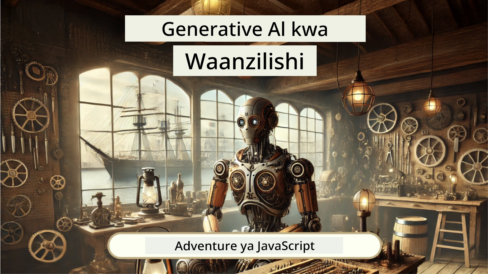
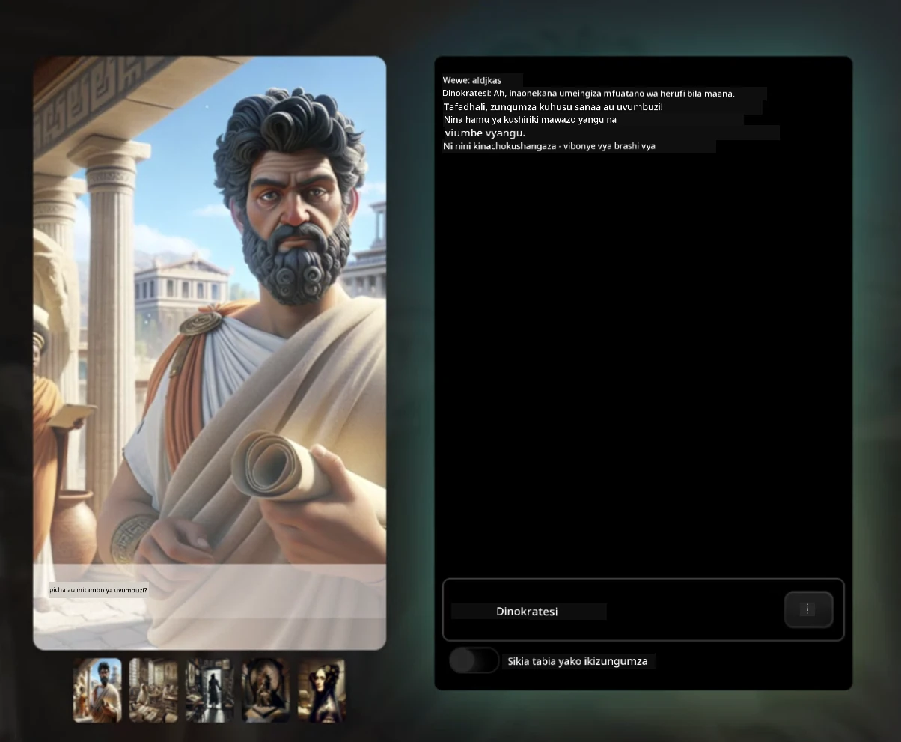
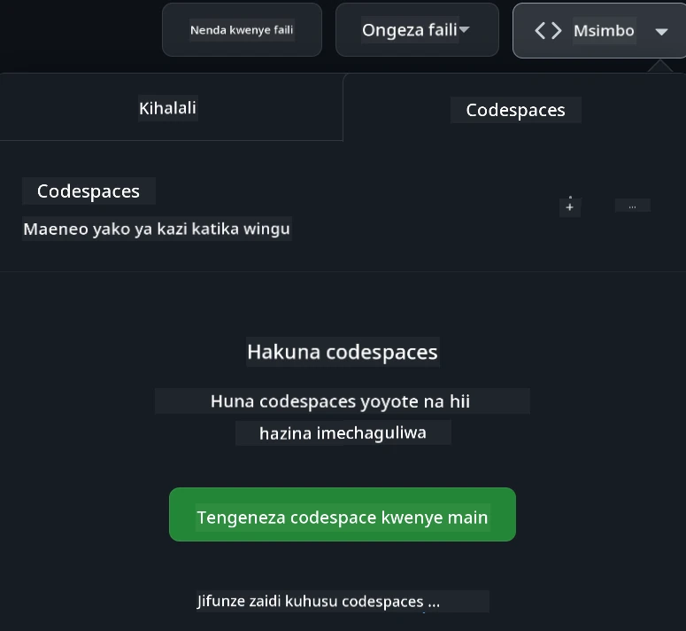

[](https://github.com/microsoft/Web-Dev-For-Beginners/blob/master/LICENSE)
[](https://GitHub.com/microsoft/Web-Dev-For-Beginners/graphs/contributors/)
[](https://GitHub.com/microsoft/Web-Dev-For-Beginners/issues/)
[](https://GitHub.com/microsoft/Web-Dev-For-Beginners/pulls/)
[](http://makeapullrequest.com) 

[](https://GitHub.com/microsoft/Web-Dev-For-Beginners/watchers/)
[](https://GitHub.com/microsoft/Web-Dev-For-Beginners/network/)
[](https://GitHub.com/microsoft/Web-Dev-For-Beginners/stargazers/)

[](https://discord.gg/nTYy5BXMWG)

# Maendeleo ya Wavuti kwa Waanzilishi - Mtaala

Jifunze misingi ya maendeleo ya wavuti kupitia kozi yetu kamili ya wiki 12 inayotolewa na Microsoft Cloud Advocates. Kila somo kati ya 24 linachunguza JavaScript, CSS, na HTML kupitia miradi ya vitendo kama vile terrariums, nyongeza za kivinjari, na michezo ya anga. Shirikiana na maswali ya mtihani, mijadala, na kazi za vitendo. Boresha ujuzi wako na uboresha kumbukumbu yako kwa kutumia mfumo wetu mzuri wa kujifunza unaotegemea miradi. Anza safari yako ya kuandika msimbo leo!

Jiunge na Jamii ya Azure AI Foundry kwenye Discord

[](https://discord.gg/nTYy5BXMWG)

Fuata hatua hizi kuanza kutumia rasilimali hizi:
1. **Fanya Nakala ya Hifadhi**: Bonyeza [](https://GitHub.com/microsoft/Web-Dev-For-Beginners/fork)
2. **Nakili Hifadhi**:   `git clone https://github.com/microsoft/Web-Dev-For-Beginners.git`
3. [**Jiunge na Azure AI Foundry Discord na ukutane na wataalamu na watengenezaji wenzako**](https://discord.com/invite/ByRwuEEgH4)

### 🌐 Msaada wa Lugha Nyingi

#### Inasaidiwa kupitia GitHub Action (Moja kwa moja & daima Inayosasishwa)

<!-- CO-OP TRANSLATOR LANGUAGES TABLE START -->
[Arabic](../ar/README.md) | [Bengali](../bn/README.md) | [Bulgarian](../bg/README.md) | [Burmese (Myanmar)](../my/README.md) | [Chinese (Simplified)](../zh-CN/README.md) | [Chinese (Traditional, Hong Kong)](../zh-HK/README.md) | [Chinese (Traditional, Macau)](../zh-MO/README.md) | [Chinese (Traditional, Taiwan)](../zh-TW/README.md) | [Croatian](../hr/README.md) | [Czech](../cs/README.md) | [Danish](../da/README.md) | [Dutch](../nl/README.md) | [Estonian](../et/README.md) | [Finnish](../fi/README.md) | [French](../fr/README.md) | [German](../de/README.md) | [Greek](../el/README.md) | [Hebrew](../he/README.md) | [Hindi](../hi/README.md) | [Hungarian](../hu/README.md) | [Indonesian](../id/README.md) | [Italian](../it/README.md) | [Japanese](../ja/README.md) | [Kannada](../kn/README.md) | [Khmer](../km/README.md) | [Korean](../ko/README.md) | [Lithuanian](../lt/README.md) | [Malay](../ms/README.md) | [Malayalam](../ml/README.md) | [Marathi](../mr/README.md) | [Nepali](../ne/README.md) | [Nigerian Pidgin](../pcm/README.md) | [Norwegian](../no/README.md) | [Persian (Farsi)](../fa/README.md) | [Polish](../pl/README.md) | [Portuguese (Brazil)](../pt-BR/README.md) | [Portuguese (Portugal)](../pt-PT/README.md) | [Punjabi (Gurmukhi)](../pa/README.md) | [Romanian](../ro/README.md) | [Russian](../ru/README.md) | [Serbian (Cyrillic)](../sr/README.md) | [Slovak](../sk/README.md) | [Slovenian](../sl/README.md) | [Spanish](../es/README.md) | [Swahili](./README.md) | [Swedish](../sv/README.md) | [Tagalog (Filipino)](../tl/README.md) | [Tamil](../ta/README.md) | [Telugu](../te/README.md) | [Thai](../th/README.md) | [Turkish](../tr/README.md) | [Ukrainian](../uk/README.md) | [Urdu](../ur/README.md) | [Vietnamese](../vi/README.md)

> **Ungependa Kwenye Nakala Kwenye Kompyuta?**
>
> Hifadhi hii ina tafsiri za lugha 50+ ambazo huongeza sana ukubwa wa kupakua. Ili kukopa bila tafsiri, tumia sparse checkout:
>
> **Bash / macOS / Linux:**
> ```bash
> git clone --filter=blob:none --sparse https://github.com/microsoft/Web-Dev-For-Beginners.git
> cd Web-Dev-For-Beginners
> git sparse-checkout set --no-cone '/*' '!translations' '!translated_images'
> ```
>
> **CMD (Windows):**
> ```cmd
> git clone --filter=blob:none --sparse https://github.com/microsoft/Web-Dev-For-Beginners.git
> cd Web-Dev-For-Beginners
> git sparse-checkout set --no-cone "/*" "!translations" "!translated_images"
> ```
>
> Hii itakupa kila kitu unachohitaji kukamilisha kozi kwa usakinishaji wa haraka zaidi.
<!-- CO-OP TRANSLATOR LANGUAGES TABLE END -->

**Ikiwa unataka lugha za ziada za tafsiri kuungwa mkono zimetajwa [hapa](https://github.com/Azure/co-op-translator/blob/main/getting_started/supported-languages.md)**

[](https://open.vscode.dev/microsoft/Web-Dev-For-Beginners)

#### 🧑‍🎓 _Je, wewe ni mwanafunzi?_

Tembelea [**ukurasa wa Kituo cha Wanafunzi**](https://docs.microsoft.com/learn/student-hub/?WT.mc_id=academic-77807-sagibbon) ambapo utapata rasilimali za wanaoanza, vifurushi vya wanafunzi na hata njia za kupata vocha ya cheti bure. Huu ndio ukurasa unaotaka kuweka kama alama na kuangalia mara kwa mara tunapobadilisha maudhui kila mwezi.

### 📣 Tangazo - Changamoto Mpya za Mode ya GitHub Copilot Agent kukamilisha!

Changamoto Mpya imeongezwa, tafuta "GitHub Copilot Agent Challenge 🚀" katika sura nyingi. Hiyo ni changamoto mpya kwako kukamilisha ukiwa unatumia GitHub Copilot na Mode ya Agent. Ikiwa hujawahi kutumia Mode ya Agent hapo awali, ina uwezo si tu wa kuandika maandishi bali pia kuunda na kuhariri mafaili, kuendesha amri na mengineyo.

### 📣 Tangazo - _Mradi Mpya wa kujenga kwa kutumia AI ya Kizazi_

Mradi mpya wa Msaidizi wa AI umeongezwa, angalia [mradi](./9-chat-project/README.md)

### 📣 Tangazo - _Mtaala Mpya_ kuhusu AI ya Kizazi kwa JavaScript umeachiliwa

Usikose mtaala wetu mpya wa AI ya Kizazi!

Tembelea [https://aka.ms/genai-js-course](https://aka.ms/genai-js-course) kuanza!



- Masomo yanayohusisha kila kitu tangu misingi hadi RAG.
- Shirikiana na wahusika wa kihistoria ukitumia GenAI na programu yetu ya mpenzi.
- Hadithi ya kufurahisha na kuvutia, utasafiri kwa wakati!




Kila somo linajumuisha kazi za kukamilisha, mtihani wa maarifa na changamoto ya kukuongoza kujifunza mada kama:
- Kutoa maagizo na uhandisi wa maagizo
- Kutengeneza programu za maandishi na picha
- Programu za utafutaji

Tembelea [https://aka.ms/genai-js-course](https://aka.ms/genai-js-course) kuanza!


## 🌱 Kuanzia

> **Walimu**, tumetoa [mapendekezo kadhaa](for-teachers.md) juu ya jinsi ya kutumia mtaala huu. Tunapenda maoni yako [katika jukwaa letu la majadiliano](https://github.com/microsoft/Web-Dev-For-Beginners/discussions/categories/teacher-corner)!

**[Wanafunzi](https://aka.ms/student-page/?WT.mc_id=academic-77807-sagibbon)**, kwa kila somo, anza na mtihani kabla ya mihadhara na fuata kwa kusoma nyenzo za mihadhara, kukamilisha shughuli mbalimbali na hakikisha unaelewa kupitia mtihani baada ya mihadhara.

Ili kuboresha uzoefu wako wa kujifunza, ungana na wenzako kufanya miradi pamoja! Majadiliano yanahimizwa katika [jukwaa letu la majadiliano](https://github.com/microsoft/Web-Dev-For-Beginners/discussions) ambapo timu yetu ya wasimamizi itakuwepo kujibu maswali yako.

Ili kuendeleza elimu yako, tunapendekeza sana kuchunguza [Microsoft Learn](https://learn.microsoft.com/users/wirelesslife/collections/p1ddcy5jwy0jkm?WT.mc_id=academic-77807-sagibbon) kwa nyenzo zaidi za kusoma.

### 📋 Kuandaa mazingira yako

Mtaala huu una mazingira ya maendeleo tayari! Unapoanza unaweza kuchagua kuendesha mtaala katika [Codespace](https://github.com/features/codespaces/) (_mazingira ya kivinjari, yasiyo na usakinishaji yanayohitajika_), au eneo la karibu kwenye kompyuta yako ukitumia mhariri wa maandishi kama [Visual Studio Code](https://code.visualstudio.com/?WT.mc_id=academic-77807-sagibbon).

#### Tengeneza hifadhi yako
Ili iwe rahisi kuhifadhi kazi yako, inapendekezwa kutengeneza nakala yako mwenyewe ya hifadhi hii. Unaweza kufanya hivyo kwa kubonyeza kitufe cha **Use this template** juu ya ukurasa. Hii itatengeneza hifadhi mpya katika akaunti yako ya GitHub yenye nakala ya mtaala.

Fuata hatua hizi:
1. **Fanya Nakala ya Hifadhi**: Bonyeza kitufe cha "Fork" upande wa juu-mwenye kulia wa ukurasa huu.
2. **Nakili Hifadhi**:   `git clone https://github.com/microsoft/Web-Dev-For-Beginners.git`

#### Kuendesha mtaala katika Codespace

Katika nakala yako ya hifadhi uliyotengeneza, bonyeza kitufe cha **Code** kisha chagua **Open with Codespaces**. Hii itatengeneza Codespace mpya utakaoweza kufanya kazi ndani yake.



#### Kuendesha mtaala eneo la karibu kwenye kompyuta yako

Ili kuendesha mtaala huu eneo la karibu kwenye kompyuta yako, utahitaji mhariri wa maandishi, kivinjari na zana za mstari wa amri. Somo letu la kwanza, [Utangulizi wa Lugha za Programu na Zana za Kazi](../../1-getting-started-lessons/1-intro-to-programming-languages), litakuongoza kupitia chaguzi mbalimbali za kila zana ili kuchagua kama inakufaa.

Pendekezo letu ni kutumia [Visual Studio Code](https://code.visualstudio.com/?WT.mc_id=academic-77807-sagibbon) kama mhariri wako, ambao pia una [Terminali](https://code.visualstudio.com/docs/terminal/basics/?WT.mc_id=academic-77807-sagibbon) iliyojengwa ndani. Unaweza kupakua Visual Studio Code [hapa](https://code.visualstudio.com/?WT.mc_id=academic-77807-sagibbon).
1. Nakili hazina yako kwenye kompyuta yako. Unaweza kufanya hivi kwa kubofya kitufe cha **Code** kisha kunakili URL:

    [CodeSpace](./images/createcodespace.png)

    Kisha, fungua [Terminal](https://code.visualstudio.com/docs/terminal/basics/?WT.mc_id=academic-77807-sagibbon) ndani ya [Visual Studio Code](https://code.visualstudio.com/?WT.mc_id=academic-77807-sagibbon) na endesha amri ifuatayo, ukibadilisha `<your-repository-url>` na URL uliyoinakili hivi karibuni:

    ```bash 
    git clone <your-repository-url>
    ```

2. Fungua folda katika Visual Studio Code. Unaweza kufanya hivi kwa kubofya **File** > **Open Folder** na kuchagua folda uliyoinakili hivi karibuni.


>  Virahisi vinavyopendekezwa vya Visual Studio Code:
>
> * [Live Server](https://marketplace.visualstudio.com/items?itemName=ritwickdey.LiveServer&WT.mc_id=academic-77807-sagibbon) - kutazama mapokeo ya kurasa za HTML ndani ya Visual Studio Code
> * [Copilot](https://marketplace.visualstudio.com/items?itemName=GitHub.copilot&WT.mc_id=academic-77807-sagibbon) - kusaidia kuandika msimbo haraka zaidi

## 📂 Kila somo linajumuisha:

- sketchnote hiari
- video ya ziada ya hiari
- zoezi la kuwajalia kabla ya somo
- somo lililoandikwa
- kwa masomo yanayotegemea miradi, miongozo ya hatua kwa hatua ya jinsi ya kujenga mradi
- ukaguzi wa maarifa
- changamoto
- usomaji wa ziada
- kazi ya nyumbani
- [zoezi la baada ya somo](https://ff-quizzes.netlify.app/web/)

> **Kumbukumbu kuhusu mazoezi ya maswali**: Mazoezi yote yapo katika folda ya Quiz-app, jumla ya mazoezi 48 yenye maswali matatu kila moja. Yapatikana [hapa](https://ff-quizzes.netlify.app/web/), programu ya mazoezi inaweza kuendeshwa kwa ndani au kutolewa Azure; fuata maelekezo katika folda `quiz-app`.

## 🗃️ Masomo

|     |                       Jina la Mradi                         |                            Mada Zinazofundishwa                             | Malengo ya Kujifunza                                                                                                                 |                                                         Somo Lililohusishwa                                                          |         Mwandishi         |
| :-: | :----------------------------------------------------------: | :-----------------------------------------------------------------------: | ---------------------------------------------------------------------------------------------------------------------------------- | :---------------------------------------------------------------------------------------------------------------------------------: | :-----------------------: |
| 01  |                         Kuanzia                            |           Utangulizi wa Programu na Vifaa vya Kazi           | Jifunze misingi ya lugha nyingi za programu na kuhusu programu zinazosaidia waendelezaji wa kitaalamu kufanya kazi zao  | [Utangulizi wa Lugha za Programu na Vifaa vya Kazi](./1-getting-started-lessons/1-intro-to-programming-languages/README.md) |         Jasmine         |
| 02  |                         Kuanzia                            |             Msingi wa GitHub, ikijumuisha kazi ya timu             | Jinsi ya kutumia GitHub katika mradi wako, jinsi ya kushirikiana na wengine katika msimbo wa programu                                                    |              [Utangulizi wa GitHub](./1-getting-started-lessons/2-github-basics/README.md)                             |          Floor          |
| 03  |                         Kuanzia                            |                             Upatikanaji                              | Jifunze misingi ya upatikanaji wa wavuti                                                                                               |                       [Misingi ya Upatikanaji](./1-getting-started-lessons/3-accessibility/README.md)                       |       Christopher       |
| 04  |                        Misingi ya JS                         |                         Aina za Data za JavaScript                          | Misingi ya aina za data za JavaScript                                                                                                 |                                       [Aina za Data](./2-js-basics/1-data-types/README.md)                                        |         Jasmine         |
| 05  |                        Misingi ya JS                         |                         Kazi na Mbinu                          | Jifunze kuhusu kazi na mbinu za kusimamia mtiririko wa mantiki ya programu                                                             |                              [Kazi na Mbinu](./2-js-basics/2-functions-methods/README.md)                               | Jasmine na Christopher |
| 06  |                        Misingi ya JS                         |                        Kufanya Maamuzi na JS                        | Jifunze jinsi ya kuunda masharti katika msimbo wako kwa kutumia mbinu za kufanya maamuzi                                                           |                                 [Kufanya Maamuzi](./2-js-basics/3-making-decisions/README.md)                                  |         Jasmine         |
| 07  |                        Misingi ya JS                         |                            Array na Loops                            | Fanya kazi na data kwa kutumia array na loops katika JavaScript                                                                                 |                                   [Array na Loops](./2-js-basics/4-arrays-loops/README.md)                                    |         Jasmine         |
| 08  |       [Terrarium](./3-terrarium/solution/README.md)       |                            HTML Katika Vitendo                            | Jenga HTML ili kuunda terrarium mtandaoni, ukizingatia ujenzi wa mpangilio                                                         |                                 [Utangulizi wa HTML](./3-terrarium/1-intro-to-html/README.md)                                 |           Jen           |
| 09  |       [Terrarium](./3-terrarium/solution/README.md)       |                            CSS Katika Vitendo                             | Jenga CSS kuunda mtindo wa terrarium mtandaoni, ukizingatia misingi ya CSS ikiwa pamoja na kufanya ukurasa uwe wa responsive                     |                                  [Utangulizi wa CSS](./3-terrarium/2-intro-to-css/README.md)                                  |           Jen           |
| 10  |            [Terrarium](./3-terrarium/solution/README.md)            |                 Jifunze JavaScript Closures, na uendeshaji DOM                  | Jenga JavaScript ili terrarium ifanye kazi kama interface ya buruta/acha, ukizingatia closures na uendeshaji wa DOM             |                  [JavaScript Closures, uendeshaji wa DOM](./3-terrarium/3-intro-to-DOM-and-closures/README.md)                   |           Jen           |
| 11  |          [Typing Game](./4-typing-game/solution/README.md)          |                          Jenga Mchezo wa Kuandika                           | Jifunze jinsi ya kutumia matukio ya keyboard kuendesha mantiki ya app yako ya JavaScript                                                          |                                [Programu Dhirio kwa Matukio](./4-typing-game/typing-game/README.md)                                |       Christopher       |
| 12  | [Green Browser Extension](./5-browser-extension/solution/README.md) |                         Kazi na Vivinjari                          | Jifunze jinsi vivinjari vinavyofanya kazi, historia yao, na jinsi ya kuunda vipengele vya awali vya kiendelezi cha kivinjari                               |                               [Kuhusu Vivinjari](./5-browser-extension/1-about-browsers/README.md)                                |           Jen           |
| 13  | [Green Browser Extension](./5-browser-extension/solution/README.md) | Jenga fomu, piga API na hifadhi mabadiliko kwenye hifadhi ya ndani | Jenga vipengele vya JavaScript vya kiendelezi chako cha kivinjari kupiga API kwa kutumia mabadiliko yaliyohifadhiwa kwenye hifadhi ya ndani                      |                [API, Fomu, na Hifadhi ya Ndani](./5-browser-extension/2-forms-browsers-local-storage/README.md)                 |           Jen           |
| 14  | [Green Browser Extension](./5-browser-extension/solution/README.md) |          Michakato ya nyuma katika kivinjari, utendaji wa wavuti          | Tumia michakato ya nyuma ya kivinjari kusimamia ikoni ya kiendelezi; jifunze kuhusu utendaji wa wavuti na baadhi ya mbinu za kuboresha kufanya kazi vizuri   |             [Kazi za Nyuma na Utendaji](./5-browser-extension/3-background-tasks-and-performance/README.md)              |           Jen           |
| 15  |           [Space Game](./6-space-game/solution/README.md)           |             Maendeleo ya Mchezo Zaidi kwa JavaScript             | Jifunze kuhusu Urithi kwa kutumia madarasa na muundo pamoja na muundo wa Pub/Sub, tayari kwa kujenga mchezo              |                      [Utangulizi kwa Maendeleo ya Mchezo Zaidi](./6-space-game/1-introduction/README.md)                       |          Chris          |
| 16  |           [Space Game](./6-space-game/solution/README.md)           |                           Kuchora kwenye Canvas                            | Jifunze kuhusu API ya Canvas, inayotumika kuchora vipengele kwenye skrini                                                                       |                                [Kuchora kwenye Canvas](./6-space-game/2-drawing-to-canvas/README.md)                                |          Chris          |
| 17  |           [Space Game](./6-space-game/solution/README.md)           |                   Kuhamisha vipengele kwenye skrini                    | Gundua jinsi vipengele vinaweza kupata mwendo kwa kutumia koordineti za Cartesian na API ya Canvas                                            |                           [Kuhamisha Vipengele](./6-space-game/3-moving-elements-around/README.md)                           |          Chris          |
| 18  |           [Space Game](./6-space-game/solution/README.md)           |                          Ugunduzi wa Mgongano                           | Fanya vipengele vikagongane na kujibu kwa kila mmoja kwa kutumia vitufe vya kuandika na toa kazi ya hifadhi ili kuhakikisha utendaji mzuri wa mchezo    |                              [Ugunduzi wa Mgongano](./6-space-game/4-collision-detection/README.md)                              |          Chris          |
| 19  |           [Space Game](./6-space-game/solution/README.md)           |                             Kuhifadhi alama                              | Fanya mahesabu ya hisabati kulingana na hali na utendaji wa mchezo                                                                |                                    [Kuhifadhi alama](./6-space-game/5-keeping-score/README.md)                                    |          Chris          |
| 20  |           [Space Game](./6-space-game/solution/README.md)           |                     Kumaliza na kuanza upya mchezo                     | Jifunze kuhusu kumaliza na kuanza upya mchezo, ikijumuisha kusafisha mali na kuweka tena thamani za mabadiliko                              |                                [Hali ya Kumaliza](./6-space-game/6-end-condition/README.md)                                 |          Chris          |
| 21  |         [Banking App](./7-bank-project/solution/README.md)          |                 Violezo vya HTML na Njia katika Programu ya Wavuti                 | Jifunze jinsi ya kuunda miundo ya tovuti yenye kurasa nyingi kwa kutumia njia na violezo vya HTML                             |                            [Violezo vya HTML na Njia](./7-bank-project/1-template-route/README.md)                             |          Yohan          |
| 22  |         [Banking App](./7-bank-project/solution/README.md)          |                  Jenga Fomu ya Kuingia na Usajili                   | Jifunze kuhusu ujenzi wa fomu na kushughulikia taratibu za uthibitishaji                                                                          |                                           [Fomu](./7-bank-project/2-forms/README.md)                                           |          Yohan          |
| 23  |         [Banking App](./7-bank-project/solution/README.md)          |                   Mbinu za Kupata na Kutumia Data                   | Jinsi data inavyoingia na kutoka kwenye app yako, jinsi ya kuipata, kuihifadhi, na kuitupa                                                 |                                            [Data](./7-bank-project/3-data/README.md)                                            |          Yohan          |
| 24  |         [Banking App](./7-bank-project/solution/README.md)          |                      Misingi ya Usimamizi wa Hali                      | Jifunze jinsi app yako inavyohifadhi hali na jinsi ya kuisimamia kwa njia ya programu                                                              |                                [Usimamizi wa Hali](./7-bank-project/4-state-management/README.md)                                |          Yohan          |
| 25 | [Browser/VScode Code](../../8-code-editor) | Kazi na VScode | Jifunze jinsi ya kutumia mhariri wa msimbo | [Tumia Mhariri wa VScode](./8-code-editor/1-using-a-code-editor/README.md) | Chris |
| 26 | [AI Assistants](./9-chat-project/README.md) | Kazi na AI | Jifunze jinsi ya kujenga msaidizi wako wa AI | [Mradi wa Msaidizi wa AI](./9-chat-project/README.md) | Chris |

## 🏫 Mbinu ya Kufundishia

Mtaala wetu umeundwa kwa misingi miwili muhimu ya kielimu:
* kujifunza kupitia miradi
* mazoezi ya mara kwa mara

Mpango huu hufundisha misingi ya JavaScript, HTML, na CSS, pamoja na zana na mbinu za hivi karibuni zinazotumiwa na waendelezaji wa wavuti wa leo. Wanafunzi watapata fursa ya kupata uzoefu wa vitendo kwa kujenga mchezo wa kuandika, terrarium wa kidijitali, kiendelezi cha kivinjari rafiki wa mazingira, mchezo wa wavamizi wa anga, na programu ya benki kwa biashara. Mwisho wa mfululizo huu, wanafunzi watakuwa na uelewa mzuri wa maendeleo ya wavuti.

> 🎓 Unaweza kuchukua masomo machache ya kwanza katika mtaala huu kama [Njia ya Kujifunza](https://docs.microsoft.com/learn/paths/web-development-101/?WT.mc_id=academic-77807-sagibbon) kwenye Microsoft Learn!

Kwa kuhakikisha kuwa maudhui yanaendana na miradi, mchakato unakuwa wa kuvutia zaidi kwa wanafunzi na kuhifadhi dhana kutaboreshwa. Pia tuliandika masomo kadhaa ya mwanzo juu ya misingi ya JavaScript ili kuanzisha dhana, yanayounganishwa na video kutoka kwa mkusanyiko wa "[Mfululizo wa Waanzilishi kwa: JavaScript](https://channel9.msdn.com/Series/Beginners-Series-to-JavaScript/?WT.mc_id=academic-77807-sagibbon)", ambapo baadhi ya waandishi wake walichangia mtaala huu.

Aidha, zoezi la nyepesi kabla ya darasa hutoa nia kwa mwanafunzi kuelekea kujifunza mada, wakati zoezi la pili baada ya darasa linahakikisha uhifadhi wa zaidi. Mtaala huu umetengenezwa kuwa rahisi na wa kufurahisha na unaweza kuchukuliwa kwa mkamilifu au sehemu. Miradi huanza midogo na kuwa changamoto zaidi mwishoni mwa mzunguko wa wiki 12.

Ingawa tuliepuka kuanzisha mifumo ya JavaScript ili kuzingatia ujuzi wa msingi unaohitajika kama msanidi wa wavuti kabla ya kutumia mfumo, hatua nzuri inayofuata kumalizia mtaala huu ni kujifunza kuhusu Node.js kupitia mkusanyiko mwingine wa video: "[Mfululizo wa Waanzilishi kwa: Node.js](https://channel9.msdn.com/Series/Beginners-Series-to-Nodejs/?WT.mc_id=academic-77807-sagibbon)".

> Tembelea [Kanuni zetu za Maadili](CODE_OF_CONDUCT.md) na mwongozo wa [Kushiriki](CONTRIBUTING.md). Tunakaribisha maoni yako ya kujenga!


## 🧭 Ufikiaji wa Kupatikana Bila Mtandao

Unaweza kuendesha nyaraka hii bila mtandao kwa kutumia [Docsify](https://docsify.js.org/#/). Fanya fork ya repo hii, [sakinisha Docsify](https://docsify.js.org/#/quickstart) kwenye kompyuta yako, kisha katika folda ya mizizi ya repo hii, andika `docsify serve`. Tovuti itapelekwa kwenye bandari 3000 kwenye localhost yako: `localhost:3000`.

## 📘 PDF
PDF ya masomo yote inapatikana [hapa](https://microsoft.github.io/Web-Dev-For-Beginners/pdf/readme.pdf).


## 🎒 Kozi Nyingine

Timu yetu hutoa kozi nyingine! Angalia:

<!-- CO-OP TRANSLATOR OTHER COURSES START -->
### LangChain
[](https://aka.ms/langchain4j-for-beginners)
[](https://aka.ms/langchainjs-for-beginners?WT.mc_id=m365-94501-dwahlin)
[](https://github.com/microsoft/langchain-for-beginners?WT.mc_id=m365-94501-dwahlin)
---

### Azure / Edge / MCP / Agents
[](https://github.com/microsoft/AZD-for-beginners?WT.mc_id=academic-105485-koreyst)
[](https://github.com/microsoft/edgeai-for-beginners?WT.mc_id=academic-105485-koreyst)
[](https://github.com/microsoft/mcp-for-beginners?WT.mc_id=academic-105485-koreyst)
[](https://github.com/microsoft/ai-agents-for-beginners?WT.mc_id=academic-105485-koreyst)

---
 
### Mfululizo wa AI ya Kizazi
[](https://github.com/microsoft/generative-ai-for-beginners?WT.mc_id=academic-105485-koreyst)
[-9333EA?style=for-the-badge&labelColor=E5E7EB&color=9333EA)](https://github.com/microsoft/Generative-AI-for-beginners-dotnet?WT.mc_id=academic-105485-koreyst)
[-C084FC?style=for-the-badge&labelColor=E5E7EB&color=C084FC)](https://github.com/microsoft/generative-ai-for-beginners-java?WT.mc_id=academic-105485-koreyst)
[-E879F9?style=for-the-badge&labelColor=E5E7EB&color=E879F9)](https://github.com/microsoft/generative-ai-with-javascript?WT.mc_id=academic-105485-koreyst)

---
 
### Kujifunza Msingi
[](https://aka.ms/ml-beginners?WT.mc_id=academic-105485-koreyst)
[](https://aka.ms/datascience-beginners?WT.mc_id=academic-105485-koreyst)
[](https://aka.ms/ai-beginners?WT.mc_id=academic-105485-koreyst)
[](https://github.com/microsoft/Security-101?WT.mc_id=academic-96948-sayoung)
[](https://aka.ms/webdev-beginners?WT.mc_id=academic-105485-koreyst)
[](https://aka.ms/iot-beginners?WT.mc_id=academic-105485-koreyst)
[](https://github.com/microsoft/xr-development-for-beginners?WT.mc_id=academic-105485-koreyst)

---
 
### Mfululizo wa Copilot
[](https://aka.ms/GitHubCopilotAI?WT.mc_id=academic-105485-koreyst)
[](https://github.com/microsoft/mastering-github-copilot-for-dotnet-csharp-developers?WT.mc_id=academic-105485-koreyst)
[](https://github.com/microsoft/CopilotAdventures?WT.mc_id=academic-105485-koreyst)
<!-- CO-OP TRANSLATOR OTHER COURSES END -->

## Kupata Msaada

Ikiwa unaenda kikwazo au una maswali yoyote kuhusu ujenzi wa programu za AI. Jiunge na wanafunzi wenzako na watengenezaji wenye uzoefu katika mijadala kuhusu MCP. Ni jamii ya kusaidia ambapo maswali yanakaribishwa na maarifa hushirikiwa kwa uhuru.

[](https://discord.gg/nTYy5BXMWG)

Ikiwa una maoni kuhusu bidhaa au makosa wakati wa kujenga tembelea:

[](https://aka.ms/foundry/forum)

## Leseni

Hazina hii inalindwa chini ya leseni ya MIT. Tazama faili la [LICENSE](../../LICENSE) kwa maelezo zaidi.

---

<!-- CO-OP TRANSLATOR DISCLAIMER START -->
**Sekela**:
Hati hii imetafsiriwa kwa kutumia huduma ya tafsiri ya AI [Co-op Translator](https://github.com/Azure/co-op-translator). Ingawa tunajitahidi kufikia usahihi, tafadhali fahamuni kwamba tafsiri za moja kwa moja zinaweza kuwa na makosa au upungufu. Hati asilia katika lugha yake ya asili inapaswa kuzingatiwa kama chanzo chenye mamlaka. Kwa taarifa muhimu, tafsiri ya kitaalamu ya binadamu inapendekezwa. Hatubebwi dhamana kwa kutoelewana au tafsiri potofu zinazotokana na matumizi ya tafsiri hii.
<!-- CO-OP TRANSLATOR DISCLAIMER END -->