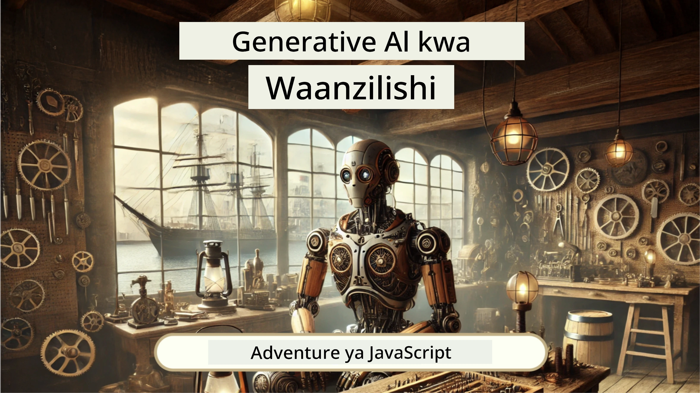
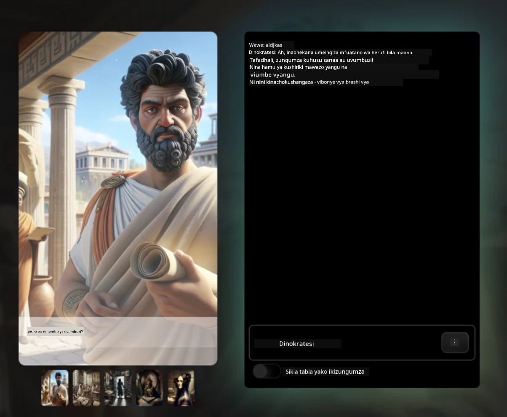
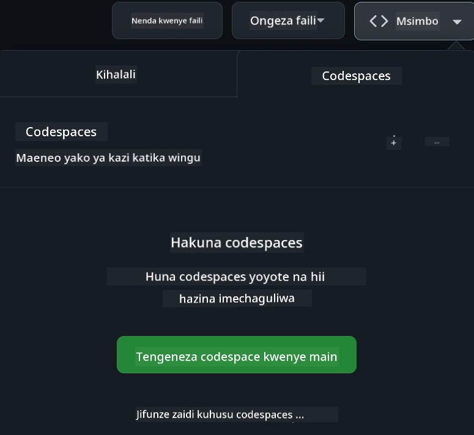

[](https://github.com/microsoft/Web-Dev-For-Beginners/blob/master/LICENSE)
[](https://GitHub.com/microsoft/Web-Dev-For-Beginners/graphs/contributors/)
[](https://GitHub.com/microsoft/Web-Dev-For-Beginners/issues/)
[](https://GitHub.com/microsoft/Web-Dev-For-Beginners/pulls/)
[](http://makeapullrequest.com) 

[](https://GitHub.com/microsoft/Web-Dev-For-Beginners/watchers/)
[](https://GitHub.com/microsoft/Web-Dev-For-Beginners/network/)
[](https://GitHub.com/microsoft/Web-Dev-For-Beginners/stargazers/)

[](https://discord.gg/nTYy5BXMWG)

# Maendeleo ya Wavuti kwa Waanzilishi - Mtaala

Jifunze misingi ya maendeleo ya wavuti kwa kozi yetu kamili ya wiki 12 iliyotolewa na Microsoft Cloud Advocates. Kila somo kati ya 24 linaangazia JavaScript, CSS, na HTML kupitia miradi ya vitendo kama vile terrariums, nyongeza za kivinjari, na michezo ya anga. Shirikiana kupitia maswali ya kujitathmini, mijadala, na majukumu ya vitendo. Boresha ujuzi wako na ўboresha ukumbuzi wako wa maarifa kwa njia yetu madhubuti inayotegemea miradi. Anza safari yako ya kuandika msimbo leo!

Jiunge na Azure AI Foundry Discord na kutana na wataalamu na wajasiriamali wenzako.

[](https://discord.gg/nTYy5BXMWG)

Fuata hatua hizi kuanza kutumia rasilimali hizi:
1. **Fungua Nakala ya Hifadhi**: Bonyeza [](https://GitHub.com/microsoft/Web-Dev-For-Beginners/fork)
2. **Nakili Hifadhi**:   `git clone https://github.com/microsoft/Web-Dev-For-Beginners.git`
3. [**Jiunge na Azure AI Foundry Discord na kutana na wataalamu na wajasiriamali wenzako**](https://discord.com/invite/ByRwuEEgH4)

### 🌐 Msaada wa Lugha Nyingi

#### Unaungwa Mkono Kupitia GitHub Action (Otomatiki & Daima Ikiwa Hivi Karibuni)

<!-- CO-OP TRANSLATOR LANGUAGES TABLE START -->
[Arabuni](../ar/README.md) | [Kibengali](../bn/README.md) | [Kibulgaria](../bg/README.md) | [Kiburma (Myanmar)](../my/README.md) | [Kichina (Rahisi)](../zh-CN/README.md) | [Kichina (Kiasili, Hong Kong)](../zh-HK/README.md) | [Kichina (Kiasili, Macau)](../zh-MO/README.md) | [Kichina (Kiasili, Taiwan)](../zh-TW/README.md) | [Kikroeshia](../hr/README.md) | [Kicheki](../cs/README.md) | [Kidenmaki](../da/README.md) | [Kiholanzi](../nl/README.md) | [Kiestoniani](../et/README.md) | [Kifini](../fi/README.md) | [Kifaransa](../fr/README.md) | [Kijerumani](../de/README.md) | [Kigiriki](../el/README.md) | [Kiebrania](../he/README.md) | [Kihindi](../hi/README.md) | [Kihungari](../hu/README.md) | [Kiindonesia](../id/README.md) | [Kiitaliano](../it/README.md) | [Kijapani](../ja/README.md) | [Kikannada](../kn/README.md) | [Kikhemeri](../km/README.md) | [Kikorea](../ko/README.md) | [Kilithuania](../lt/README.md) | [Kimalayi](../ms/README.md) | [Kimalayalam](../ml/README.md) | [Kimarathi](../mr/README.md) | [Kinepali](../ne/README.md) | [Pijin ya Nigeria](../pcm/README.md) | [Kinorwe](../no/README.md) | [Kiajemi (Fasi)](../fa/README.md) | [Kipolandi](../pl/README.md) | [Kireno (Brazil)](../pt-BR/README.md) | [Kireno (Ureno)](../pt-PT/README.md) | [Kipunjabi (Gurmukhi)](../pa/README.md) | [Kiromania](../ro/README.md) | [Kirusi](../ru/README.md) | [Kiserbia (Cyrillic)](../sr/README.md) | [Kislovakia](../sk/README.md) | [Kislovenia](../sl/README.md) | [Kihispania](../es/README.md) | [Kiswahili](./README.md) | [Kiswidi](../sv/README.md) | [Kitagalog (Filipino)](../tl/README.md) | [Kitamili](../ta/README.md) | [Kitelugu](../te/README.md) | [Kithai](../th/README.md) | [Kituruki](../tr/README.md) | [Kiukrania](../uk/README.md) | [Kiurdu](../ur/README.md) | [Kivietinamu](../vi/README.md)

> **Unapendelea Kunakili Kwenye Kifaa Chako?**
>
> Hifadhi hii ina tafsiri zaidi ya 50 za lugha zinazoongeza ukubwa wa kupakua. Ili kunakili bila tafsiri, tumia sparse checkout:
>
> **Bash / macOS / Linux:**
> ```bash
> git clone --filter=blob:none --sparse https://github.com/microsoft/Web-Dev-For-Beginners.git
> cd Web-Dev-For-Beginners
> git sparse-checkout set --no-cone '/*' '!translations' '!translated_images'
> ```
>
> **CMD (Windows):**
> ```cmd
> git clone --filter=blob:none --sparse https://github.com/microsoft/Web-Dev-For-Beginners.git
> cd Web-Dev-For-Beginners
> git sparse-checkout set --no-cone "/*" "!translations" "!translated_images"
> ```
>
> Hii inakupa kila kitu unachohitaji kukamilisha kozi kwa upakuaji wa kasi zaidi.
<!-- CO-OP TRANSLATOR LANGUAGES TABLE END -->

**Ikiwa unataka kupata tafsiri za ziada, lugha zinazoungwa mkono ziko hapa. [here](https://github.com/Azure/co-op-translator/blob/main/getting_started/supported-languages.md)**

[](https://open.vscode.dev/microsoft/Web-Dev-For-Beginners)

#### 🧑‍🎓 _Je, wewe ni mwanafunzi?_

Tembelea [**ukurasa wa Kituo cha Wanafunzi**](https://docs.microsoft.com/learn/student-hub/?WT.mc_id=academic-77807-sagibbon) ambapo utapata rasilimali za waanzilishi, vifurushi vya wanafunzi na hata njia za kupata vocha ya cheti bure. Huu ni ukurasa ungependa kuweka alama na kuangalia mara kwa mara kwani hubadilishwa kila mwezi.

### 📣 Taarifa - Changamoto Mpya za Mode ya GitHub Copilot Agent za Kukamilisha!

Changamoto Mpya imeongezwa, tazama "Changamoto ya GitHub Copilot Agent 🚀" katika sura nyingi. Hii ni changamoto mpya ya kukamilisha ukitumia GitHub Copilot na mode ya Agent. Ikiwa hujawahi kutumia mode ya Agent, inauwezo wa si tu kuunda maandishi bali pia kuunda na kuhariri faili, kuendesha amri na zaidi.

### 📣 Taarifa - _Mradi Mpya wa Kujenga kwa Kutumia AI ya Kuumbilia_

Mradi mpya wa Msaidizi wa AI umeongezwa, angalia [mradi](./9-chat-project/README.md)

### 📣 Taarifa - _Mtaala Mpya_ juu ya AI ya Kuumbilia kwa JavaScript umebuniwa

Usikose mtaala wetu mpya wa AI ya Kuumbilia!

Tembelea [https://aka.ms/genai-js-course](https://aka.ms/genai-js-course) kuanza!



- Masomo yanayoshughulikia kila kitu kutoka misingi hadi RAG.
- Shiriki na wahusika wa kihistoria kwa kutumia GenAI na programu yetu ya rafiki.
- Hadithi ya kufurahisha na ya kuchochea, utasafiri wakati!




Kila somo linajumuisha kazi ya kukamilisha, ukaguzi wa maarifa na changamoto itakayokuongoza kujifunza mada kama:
- Kuwahimiza na uhandisi wa kuhimiza
- Uzalishaji wa programu za maandishi na picha
- Programu za utafutaji

Tembelea [https://aka.ms/genai-js-course](https://aka.ms/genai-js-course) kuanza!


## 🌱 Kuanzisha

> **Walimu**, tumetoa [mapendekezo kadhaa](for-teachers.md) juu ya jinsi ya kutumia mtaala huu. Tunapenda maoni yako [katika jukwaa letu la mijadala](https://github.com/microsoft/Web-Dev-For-Beginners/discussions/categories/teacher-corner)!

**[Wajifunzaji](https://aka.ms/student-page/?WT.mc_id=academic-77807-sagibbon)**, kwa kila somo, anza na jaribio la kabla ya mhadhara na fuata kwa kusoma vifaa vya mhadhara, kukamilisha shughuli mbalimbali na thibitisha uelewa wako kwa jaribio la baada ya mhadhara.

Ili kuboresha uzoefu wako wa kujifunza, ungana na wenzako kufanya miradi pamoja! Mijadala inahimizwa katika [jukwaa letu la mijadala](https://github.com/microsoft/Web-Dev-For-Beginners/discussions) ambapo timu yetu ya wasimamizi itakuwepo kujibu maswali yako.

Ili kuendeleza elimu yako, tunapendekeza sana kuchunguza [Microsoft Learn](https://learn.microsoft.com/users/wirelesslife/collections/p1ddcy5jwy0jkm?WT.mc_id=academic-77807-sagibbon) kwa vifaa zaidi vya kujifunzia.

### 📋 Kuweka mazingira yako

Mtaala huu una mazingira ya maendeleo tayari! Unapoanza unaweza kuchagua kuendesha mtaala katika [Codespace](https://github.com/features/codespaces/) (_mazingira ya kivinjari, yasiyo na haja ya ufungaji_), au sehemu yako ya kazi kwenye kompyuta ukitumia mhariri wa maandishi kama [Visual Studio Code](https://code.visualstudio.com/?WT.mc_id=academic-77807-sagibbon).

#### Tengeneza hifadhi yako
Ili kuhifadhi kazi yako kwa urahisi, inashauriwa utengeneze nakala yako ya hifadhi hii. Unaweza kufanya hivi kwa kubonyeza kitufe cha **Tumia templeti hii** juu ya ukurasa. Hii itaunda hifadhi mpya kwenye akaunti yako ya GitHub pamoja na nakala ya mtaala.

Fuata hatua hizi:
1. **Fungua Nakala ya Hifadhi**: Bonyeza kitufe cha "Fork" upande wa juu kulia wa ukurasa huu.
2. **Nakili Hifadhi**:   `git clone https://github.com/microsoft/Web-Dev-For-Beginners.git`

#### Kuendesha mtaala katika Codespace

Katika nakala yako ya hifadhi uliyotengeneza, bonyeza kitufe cha **Msimbo** na chagua **Fungua na Codespaces**. Hii itaunda Codespace mpya kwa ajili yako kufanya kazi ndani yake.



#### Kuendesha mtaala kwa sehemu yako ya kazi kwenye kompyuta

Ili kuendesha mtaala huu kwenye kompyuta yako, utahitaji mhariri wa maandishi, kivinjari na chombo cha amri. Somo letu la kwanza, [Utangulizi wa Lugha za Programu na Vifaa vya Kazi](../../1-getting-started-lessons/1-intro-to-programming-languages), litakuongoza kupitia chaguzi mbalimbali kwa kila chombo kwa ajili ya kuchagua kinachofaa kwako.

Mapendekezo yetu ni kutumia [Visual Studio Code](https://code.visualstudio.com/?WT.mc_id=academic-77807-sagibbon) kama mhariri wako, ambao pia una [Terminali](https://code.visualstudio.com/docs/terminal/basics/?WT.mc_id=academic-77807-sagibbon) iliyojengwa ndani. Unaweza kupakua Visual Studio Code [hapa](https://code.visualstudio.com/?WT.mc_id=academic-77807-sagibbon).
1. Nakili hifadhidata yako kwenye kompyuta yako. Unaweza kufanya hivi kwa kubofya kitufe cha **Code** na kunakili URL:

    [CodeSpace](./images/createcodespace.png)

    Kisha, fungua [Terminal](https://code.visualstudio.com/docs/terminal/basics/?WT.mc_id=academic-77807-sagibbon) ndani ya [Visual Studio Code](https://code.visualstudio.com/?WT.mc_id=academic-77807-sagibbon) na endesha amri ifuatayo, ukibadilisha `<your-repository-url>` na URL uliyoinakili hivi karibuni:

    ```bash 
    git clone <your-repository-url>
    ```

2. Fungua folda ndani ya Visual Studio Code. Unaweza kufanya hivi kwa kubofya **File** > **Open Folder** na kuchagua folda uliyoinakili hivi karibuni.


>  Upanuzi wa Visual Studio Code unaopendekezwa:
>
> * [Live Server](https://marketplace.visualstudio.com/items?itemName=ritwickdey.LiveServer&WT.mc_id=academic-77807-sagibbon) - kuangalia mapema kurasa za HTML ndani ya Visual Studio Code
> * [Copilot](https://marketplace.visualstudio.com/items?itemName=GitHub.copilot&WT.mc_id=academic-77807-sagibbon) - kusaidia kuandika code haraka zaidi

## 📂 Kila somo linajumuisha:

- sketchnote hiari
- video ya ziada hiari
- mtihani wa kuwasha kabla ya somo
- somo lililoandikwa
- kwa masomo yanayotegemea mradi, miongozo hatua kwa hatua jinsi ya kujenga mradi
- ukaguzi wa maarifa
- changamoto
- usomaji wa ziada
- kazi ya nyumbani
- [mtihani baada ya somo](https://ff-quizzes.netlify.app/web/)

> **Kumbuka kuhusu mitihani**: Mitihani yote ipo katika folda ya Quiz-app, mitihani 48 yote yenye maswali matatu kila moja. Inapatikana [hapa](https://ff-quizzes.netlify.app/web/) programu ya mtihani inaweza kuendeshwa kwa ndani au kuwekwa kwenye Azure; fuata maelekezo katika folda ya `quiz-app`.

## 🗃️ Masomo

|     |                       Jina la Mradi                        |                            Maudhui Yanayofundishwa                             | Malengo ya Kujifunza                                                                                                                 |                                                         Somo Lililohusishwa                                                          |         Mwandishi          |
| :-: | :---------------------------------------------------------: | :--------------------------------------------------------------------------: | ----------------------------------------------------------------------------------------------------------------------------------- | :----------------------------------------------------------------------------------------------------------------------------: | :------------------------: |
| 01  |                     Kuanzia Mwanzo                          |           Utangulizi wa Uprogramu na Zana za Kitaalamu                     | Jifunze msingi wa lugha nyingi za programu na kuhusu programu zinazowasaidia waendelezaji wa kitaalamu kufanya kazi zao             | [Utangulizi wa Lugha za Programu na Zana za Kitaalamu](./1-getting-started-lessons/1-intro-to-programming-languages/README.md) |          Jasmine           |
| 02  |                     Kuanzia Mwanzo                          |             Misingi ya GitHub, ikijumuisha kazi na timu                    | Jinsi ya kutumia GitHub katika mradi wako, jinsi ya kushirikiana na wengine kwenye msimbo wa programu                                |                            [Utangulizi wa GitHub](./1-getting-started-lessons/2-github-basics/README.md)                             |           Floor            |
| 03  |                     Kuanzia Mwanzo                          |                             Upatikanaji                              | Jifunze misingi ya upatikanaji wa wavuti                                                                                             |                       [Misingi ya Upatikanaji](./1-getting-started-lessons/3-accessibility/README.md)                       |       Christopher          |
| 04  |                        Misingi ya JS                        |                         Aina za Data za JavaScript                       | Misingi ya aina za data za JavaScript                                                                                                |                                       [Aina za Data](./2-js-basics/1-data-types/README.md)                                        |          Jasmine           |
| 05  |                        Misingi ya JS                        |                         Funguo na Mbinu                                  | Jifunze kuhusu funguo na mbinu za kudhibiti mtiririko wa mantiki ya programu                                                        |                              [Funguo na Mbinu](./2-js-basics/2-functions-methods/README.md)                               | Jasmine na Christopher    |
| 06  |                        Misingi ya JS                        |                        Kufanya Maamuzi kwa JS                            | Jifunze jinsi ya kuunda masharti katika msimbo wako kwa kutumia mbinu za kufanya maamuzi                                              |                                 [Kufanya Maamuzi](./2-js-basics/3-making-decisions/README.md)                                  |          Jasmine           |
| 07  |                        Misingi ya JS                        |                            Mipangilio na Mizunguko                      | Fanya kazi na data kwa kutumia mipangilio na mizunguko ndani ya JavaScript                                                           |                                   [Mipangilio na Mizunguko](./2-js-basics/4-arrays-loops/README.md)                                    |          Jasmine           |
| 08  |       [Terrarium](./3-terrarium/solution/README.md)       |                            HTML katika Vitendo                         | Jenga HTML ya kuunda terrarium mtandaoni, ukizingatia uundaji wa mpangilio                                                         |                                 [Utangulizi wa HTML](./3-terrarium/1-intro-to-html/README.md)                                 |            Jen            |
| 09  |       [Terrarium](./3-terrarium/solution/README.md)       |                            CSS katika Vitendo                          | Jenga CSS ya kupanga terrarium mtandaoni, ukizingatia misingi ya CSS ikijumuisha kufanya ukurasa uwe wa kukabiliana na vifaa mbalimbali |                                  [Utangulizi wa CSS](./3-terrarium/2-intro-to-css/README.md)                                  |            Jen            |
| 10  |            [Terrarium](./3-terrarium/solution/README.md)            |                 Funga JavaScript, uendeshaji DOM                       | Jenga JavaScript ili kufanya terrarium ifanye kazi kama kiolesura cha kukausha na kuachia, ukizingatia fungo na uendeshaji DOM       |                  [Fungo JavaScript, uendeshaji DOM](./3-terrarium/3-intro-to-DOM-and-closures/README.md)                   |            Jen            |
| 11  |          [Typing Game](./4-typing-game/solution/README.md)          |                          Jenga Mchezo wa Kuandika Haraka                | Jifunze jinsi ya kutumia matukio ya kibodi kuendesha mantiki ya programu yako ya JavaScript                                          |                                [Uprogramu Iendayo Kwa Matukio](./4-typing-game/typing-game/README.md)                                |       Christopher         |
| 12  | [Green Browser Extension](./5-browser-extension/solution/README.md) |                         Kazi na Vivinjari (Browsers)                   | Jifunze jinsi vivinjari vinavyofanya kazi, historia yao, na jinsi ya kuanzisha vipengele vya kwanza vya kiendelezi cha kivinjari  |                               [Kuhusu Vivinjari](./5-browser-extension/1-about-browsers/README.md)                                |            Jen            |
| 13  | [Green Browser Extension](./5-browser-extension/solution/README.md) | Kujenga fomu, kuitisha API na kuhifadhi vigezo katika hifadhi ya ndani | Tengeneza vipengele vya JavaScript vya kiendelezi chako cha kivinjari kuitisha API kwa kutumia vigezo vilivyo hifadhiwa katika hifadhi ya ndani |                [APIs, Fomu, na Hifadhi ya Ndani](./5-browser-extension/2-forms-browsers-local-storage/README.md)                 |            Jen            |
| 14  | [Green Browser Extension](./5-browser-extension/solution/README.md) |          Mchakato wa nyuma wa kivinjari, utendaji wa wavuti          | Tumia michakato ya nyuma ya kivinjari kudhibiti ikoni ya kiendelezi; jifunze kuhusu utendaji wa wavuti na baadhi ya maboresho ya kufanya |             [Kazi za Nyuma na Utendaji](./5-browser-extension/3-background-tasks-and-performance/README.md)              |            Jen            |
| 15  |           [Space Game](./6-space-game/solution/README.md)           |             Maendeleo ya Mchezo wa Juu zaidi kwa JavaScript           | Jifunze kuhusu Urithi kwa kutumia Mifumo (Classes) na Muundo pamoja na muundo wa Pub/Sub, kujiandaa kwa kujenga mchezo                |                      [Utangulizi wa Maendeleo ya Mchezo wa Juu](./6-space-game/1-introduction/README.md)                       |           Chris           |
| 16  |           [Space Game](./6-space-game/solution/README.md)           |                           Kuchora kwenye kanvas                        | Jifunze kuhusu API ya Canvas, inayotumika kuchora vipengele kwenye skrini                                                            |                                [Kuchora kwenye Kanvas](./6-space-game/2-drawing-to-canvas/README.md)                                |           Chris           |
| 17  |           [Space Game](./6-space-game/solution/README.md)           |                   Kuhamisha vipengele kwenye skrini                   | Gundua jinsi vipengele vinavyopata mwendo kwa kutumia uratibu wa kartsiani na API ya Canvas                                          |                           [Kuhamisha Vipengele](./6-space-game/3-moving-elements-around/README.md)                           |           Chris           |
| 18  |           [Space Game](./6-space-game/solution/README.md)           |                          Ugundaji wa mgongano                          | Fanya vipengele vigonjane na kujibu kwa kila mmoja kwa kutumia vitufe vya kibodi na toa kazi ya kupumzika kuhakikisha utendaji wa mchezo |                              [Ugundaji wa Mgongano](./6-space-game/4-collision-detection/README.md)                              |           Chris           |
| 19  |           [Space Game](./6-space-game/solution/README.md)           |                             Kuhifadhi alama                             | Fanya mahesabu ya kihisabati kulingana na hali na utendaji wa mchezo                                                                 |                                    [Kuhifadhi Alama](./6-space-game/5-keeping-score/README.md)                                    |           Chris           |
| 20  |           [Space Game](./6-space-game/solution/README.md)           |                     Kuisha na kuanza upya mchezo                      | Jifunze kuhusu kumaliza na kuanzisha upya mchezo, ikiwa ni pamoja na kusafisha mali na kuweka upya vigezo                          |                                [Hali ya Mwisho](./6-space-game/6-end-condition/README.md)                                 |           Chris           |
| 21  |         [Banking App](./7-bank-project/solution/README.md)          |                 Templeti za HTML na Njia za Web App                   | Jifunze jinsi ya kuunda muundo wa tovuti ya kurasa nyingi kwa kutumia njia za kuingia na templeti za HTML                             |                            [Templeti za HTML na Njia](./7-bank-project/1-template-route/README.md)                             |           Yohan           |
| 22  |         [Banking App](./7-bank-project/solution/README.md)          |                  Jenga Fomu ya Kuingia na Usajili                     | Jifunze kuhusu kujenga fomu na kushughulikia utambuzi                                                                              |                                           [Fomu](./7-bank-project/2-forms/README.md)                                           |           Yohan           |
| 23  |         [Banking App](./7-bank-project/solution/README.md)          |                   Mbinu za Kupata na Kutumia Data                     | Jinsi data inavyotiririka ndani na nje ya programu yako, jinsi ya kuipata, kuihifadhi, na kuiondoa                              |                                            [Data](./7-bank-project/3-data/README.md)                                            |           Yohan           |
| 24  |         [Banking App](./7-bank-project/solution/README.md)          |                      Misingi ya Usimamizi wa Hali                      | Jifunze jinsi programu yako inavyoendelea kuweka hali na jinsi ya kuisimamia kwa njia za programu                                    |                                [Usimamizi wa Hali](./7-bank-project/4-state-management/README.md)                                |           Yohan           |
| 25 | [Browser/VScode Code](../../8-code-editor) | Kazi na VScode | Jifunze jinsi ya kutumia mhariri wa msimbo | [Tumia Mhariri wa Code wa VScode](./8-code-editor/1-using-a-code-editor/README.md) | Chris |
| 26 | [AI Assistants](./9-chat-project/README.md) | Kazi na AI | Jifunze jinsi ya kujenga msaidizi wako wa AI | [Mradi wa Msaidizi wa AI](./9-chat-project/README.md) | Chris |

## 🏫 Pedagojia

Mtaala wetu umeundwa kwa kanuni mbili za msingi za kifundisho:
* kujifunza kwa njia ya mradi
* mitihani mara kwa mara

Mpango hufundisha misingi ya JavaScript, HTML, na CSS, pamoja na zana na mbinu za kisasa zinazotumiwa na waendelezaji wa wavuti wa sasa. Wanafunzi watapata fursa ya kupata uzoefu wa vitendo kwa kujenga mchezo wa kuandika haraka, terrarium ya mtandaoni, kiendelezi kivinjari kinachohifadhi mazingira, mchezo wa kuwasiliana na wahasidi wa anga, na programu ya benki kwa biashara. Mwishoni mwa mfululizo huo, wanafunzi watakuwa na uelewa thabiti wa maendeleo ya wavuti.

> 🎓 Unaweza kuchukua masomo ya kwanza kadhaa katika mtaala huu kama [Njia ya Kujifunza](https://docs.microsoft.com/learn/paths/web-development-101/?WT.mc_id=academic-77807-sagibbon) kwenye Microsoft Learn!

Kwa kuhakikisha kwamba maudhui yanahusiana na miradi, mchakato huu hufanya kuwa wa kuvutia zaidi kwa wanafunzi na kukumbuka kwa dhana kutaimarishwa. Pia tuliandika masomo kadhaa ya kuanzisha katika misingi ya JavaScript ili kuanzisha dhana, yakiwa na video kutoka kwa mkusanyiko wa mafundisho ya video ya "[Mfululizo wa Waanzilishi wa: JavaScript](https://channel9.msdn.com/Series/Beginners-Series-to-JavaScript/?WT.mc_id=academic-77807-sagibbon)" ambayo baadhi ya waandishi wake walichangia mtaala huu.

Zaidi ya hayo, mtihani wa chini kabla ya darasa huweka nia ya mwanafunzi kuelekea kujifunza mada, wakati mtihani wa pili baada ya darasa unahakikisha kukumbukwa zaidi. Mtaala huu uliundwa kuwa rahisi na wa kufurahisha na unaweza kuchukuliwa kwa jumla au sehemu tu. Miradi inaanza midogo na kuwa ngumu zaidi mwishoni mwa mzunguko wa wiki 12.

Ingawa tumekwepa kwa makusudi kuanzisha mifumo ya JavaScript ili kuzingatia ujuzi wa msingi unaohitajika kama mendelezaji wa wavuti kabla ya kutumia mfumo, hatua nzuri inayofuata kukamilisha mtaala huu itakuwa kujifunza kuhusu Node.js kupitia mkusanyiko mwingine wa video: "[Mfululizo wa Waanzilishi wa: Node.js](https://channel9.msdn.com/Series/Beginners-Series-to-Nodejs/?WT.mc_id=academic-77807-sagibbon)".

> Tembelea miongozo yetu ya [Kanuni za Maadili](CODE_OF_CONDUCT.md) na [Kushiriki](CONTRIBUTING.md). Tunakaribisha maoni yako yenye kujenga!


## 🧭 Ufikiaji wa Nje ya Mtandao

Unaweza kuendesha nyaraka hii ukiwa nje ya mtandao kwa kutumia [Docsify](https://docsify.js.org/#/). Tengeneza nakala ya hifadhidata hii, [weka Docsify](https://docsify.js.org/#/quickstart) kwenye kompyuta yako ya ndani, kisha katika folda kuu ya hifadhidata hii, andika `docsify serve`. Tovuti itaendeshwa kwenye mlimbwende 3000 kwenye localhost yako: `localhost:3000`.

## 📘 PDF
PDF ya masomo yote inapatikana [hapa](https://microsoft.github.io/Web-Dev-For-Beginners/pdf/readme.pdf).


## 🎒 Kozi Nyingine

Timu yetu hutengeneza kozi nyingine! Angalia:

<!-- CO-OP TRANSLATOR OTHER COURSES START -->
### LangChain
[](https://aka.ms/langchain4j-for-beginners)
[](https://aka.ms/langchainjs-for-beginners?WT.mc_id=m365-94501-dwahlin)
[](https://github.com/microsoft/langchain-for-beginners?WT.mc_id=m365-94501-dwahlin)
---

### Azure / Edge / MCP / Agents
[](https://github.com/microsoft/AZD-for-beginners?WT.mc_id=academic-105485-koreyst)
[](https://github.com/microsoft/edgeai-for-beginners?WT.mc_id=academic-105485-koreyst)
[](https://github.com/microsoft/mcp-for-beginners?WT.mc_id=academic-105485-koreyst)
[](https://github.com/microsoft/ai-agents-for-beginners?WT.mc_id=academic-105485-koreyst)

---
 
### Mfululizo wa AI Inayozalisha
[](https://github.com/microsoft/generative-ai-for-beginners?WT.mc_id=academic-105485-koreyst)
[-9333EA?style=for-the-badge&labelColor=E5E7EB&color=9333EA)](https://github.com/microsoft/Generative-AI-for-beginners-dotnet?WT.mc_id=academic-105485-koreyst)
[-C084FC?style=for-the-badge&labelColor=E5E7EB&color=C084FC)](https://github.com/microsoft/generative-ai-for-beginners-java?WT.mc_id=academic-105485-koreyst)
[-E879F9?style=for-the-badge&labelColor=E5E7EB&color=E879F9)](https://github.com/microsoft/generative-ai-with-javascript?WT.mc_id=academic-105485-koreyst)

---
 
### Mafunzo ya Msingi
[](https://aka.ms/ml-beginners?WT.mc_id=academic-105485-koreyst)
[](https://aka.ms/datascience-beginners?WT.mc_id=academic-105485-koreyst)
[](https://aka.ms/ai-beginners?WT.mc_id=academic-105485-koreyst)
[](https://github.com/microsoft/Security-101?WT.mc_id=academic-96948-sayoung)
[](https://aka.ms/webdev-beginners?WT.mc_id=academic-105485-koreyst)
[](https://aka.ms/iot-beginners?WT.mc_id=academic-105485-koreyst)
[](https://github.com/microsoft/xr-development-for-beginners?WT.mc_id=academic-105485-koreyst)

---
 
### Mfululizo wa Copilot
[](https://aka.ms/GitHubCopilotAI?WT.mc_id=academic-105485-koreyst)
[](https://github.com/microsoft/mastering-github-copilot-for-dotnet-csharp-developers?WT.mc_id=academic-105485-koreyst)
[](https://github.com/microsoft/CopilotAdventures?WT.mc_id=academic-105485-koreyst)
<!-- CO-OP TRANSLATOR OTHER COURSES END -->

## Kupata Msaada

Ikiwa unashikwa au una maswali yoyote kuhusu kujenga programu za AI. Ungana na wanafunzi wenzako na waendelezaji waliobobea katika majadiliano kuhusu MCP. Ni jamii yenye msaada ambapo maswali yanakaribishwa na maarifa yanashirikiwa kwa uhuru.

[](https://discord.gg/nTYy5BXMWG)

Ikiwa una maoni au hitilafu wakati wa kujenga tembelea:

[](https://aka.ms/foundry/forum)

## Leseni

Hifadhidata hii ina leseni chini ya leseni ya MIT. Tazama faili la [LICENSE](../../LICENSE) kwa maelezo zaidi.

---

<!-- CO-OP TRANSLATOR DISCLAIMER START -->
**Maandishi ya Kukataa**:  
Hati hii imetafsiriwa kwa kutumia huduma ya utafsiri wa AI [Co-op Translator](https://github.com/Azure/co-op-translator). Ingawa tunajitahidi kwa usahihi, tafadhali fahamu kuwa tafsiri za moja kwa moja zinaweza kuwa na makosa au upotoshaji. Hati asili katika lugha yake ya asili inapaswa kuchukuliwa kama chanzo cha mamlaka. Kwa taarifa muhimu, tafsiri ya kitaalamu ya binadamu inashauriwa. Hatuwezi kuwajibika kwa maelewano au tafsiri potofu yoyote inayotokana na matumizi ya tafsiri hii.
<!-- CO-OP TRANSLATOR DISCLAIMER END -->