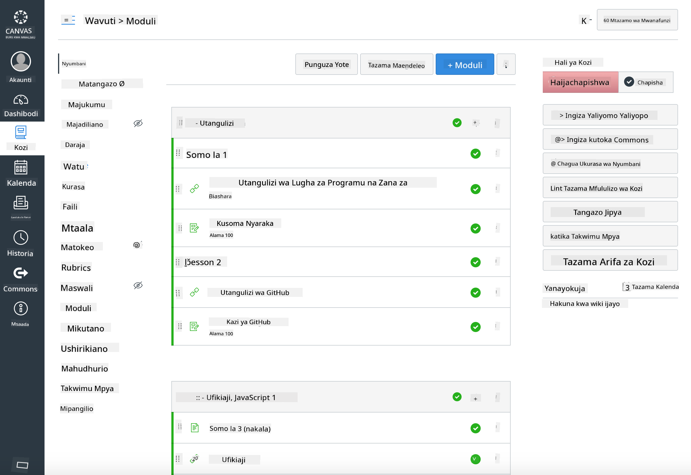

<!--
CO_OP_TRANSLATOR_METADATA:
{
  "original_hash": "75cb51f7ca9ea0b097ef4a1287e9290c",
  "translation_date": "2025-08-28T03:22:14+00:00",
  "source_file": "for-teachers.md",
  "language_code": "sw"
}
-->
## Kwa Walimu

Je, ungependa kutumia mtaala huu darasani kwako? Tafadhali jisikie huru kufanya hivyo!

Kwa kweli, unaweza kuutumia moja kwa moja ndani ya GitHub kwa kutumia GitHub Classroom.

Ili kufanya hivyo, fanya fork ya repo hii. Utahitaji kuunda repo kwa kila somo, kwa hivyo utahitaji kutoa kila folda na kuiweka kwenye repo tofauti. Kwa njia hiyo, [GitHub Classroom](https://classroom.github.com/classrooms) itaweza kuchukua kila somo moja moja.

Maelezo haya [kamili](https://github.blog/2020-03-18-set-up-your-digital-classroom-with-github-classroom/) yatakupa mwongozo wa jinsi ya kuandaa darasa lako.

## Kutumia katika Moodle, Canvas au Blackboard

Mtaala huu unafanya kazi vizuri katika mifumo hii ya Usimamizi wa Kujifunza! Tumia [faili ya kupakia Moodle](../../../../../../../teaching-files/webdev-moodle.mbz) kwa maudhui kamili, au jaribu [faili ya Common Cartridge](../../../../../../../teaching-files/webdev-common-cartridge.imscc) ambayo ina baadhi ya maudhui. Moodle Cloud haiungi mkono usafirishaji kamili wa Common Cartridge, kwa hivyo ni bora kutumia faili ya kupakua ya Moodle ambayo inaweza kupakiwa kwenye Canvas. Tafadhali tujulishe jinsi tunavyoweza kuboresha uzoefu huu.

  
> Mtaala katika darasa la Moodle

  
> Mtaala katika Canvas

## Kutumia repo kama ilivyo

Ikiwa ungependa kutumia repo hii kama ilivyo sasa, bila kutumia GitHub Classroom, hilo linawezekana pia. Utahitaji kuwajulisha wanafunzi wako somo gani la kufanyia kazi pamoja.

Katika muundo wa mtandaoni (Zoom, Teams, au nyinginezo) unaweza kuunda vyumba vya vikundi kwa ajili ya majaribio, na kuwaelekeza wanafunzi ili kuwasaidia kujiandaa kujifunza. Kisha waalike wanafunzi kwenye majaribio na wawasilishe majibu yao kama 'issues' kwa wakati fulani. Unaweza kufanya vivyo hivyo na kazi za nyumbani ikiwa unataka wanafunzi wafanye kazi kwa kushirikiana waziwazi.

Ikiwa unapendelea muundo wa faragha zaidi, waombe wanafunzi wako wafanye fork ya mtaala, somo kwa somo, kwenye repo zao za GitHub kama repo za faragha, na wakupe ufikiaji. Kisha wanaweza kukamilisha majaribio na kazi za nyumbani kwa faragha na kukuwasilishia kupitia issues kwenye repo yako ya darasa.

Kuna njia nyingi za kufanya hili lifanye kazi katika muundo wa darasa la mtandaoni. Tafadhali tujulishe ni njia gani inakufaa zaidi!

## Tafadhali tupe maoni yako!

Tunataka kufanya mtaala huu ufanye kazi kwa ajili yako na wanafunzi wako. Ungana nasi katika [Teacher corner](https://github.com/microsoft/Web-Dev-For-Beginners/discussions/categories/teacher-corner) na fungua [**issue mpya**](https://github.com/microsoft/Web-Dev-For-Beginners/issues/new/choose) kwa maombi yoyote, hitilafu na maoni.

---

**Kanusho**:  
Hati hii imetafsiriwa kwa kutumia huduma ya kutafsiri ya AI [Co-op Translator](https://github.com/Azure/co-op-translator). Ingawa tunajitahidi kuhakikisha usahihi, tafadhali fahamu kuwa tafsiri za kiotomatiki zinaweza kuwa na makosa au kutokuwa sahihi. Hati asilia katika lugha yake ya awali inapaswa kuzingatiwa kama chanzo cha mamlaka. Kwa taarifa muhimu, tafsiri ya kitaalamu ya binadamu inapendekezwa. Hatutawajibika kwa kutoelewana au tafsiri zisizo sahihi zinazotokana na matumizi ya tafsiri hii.