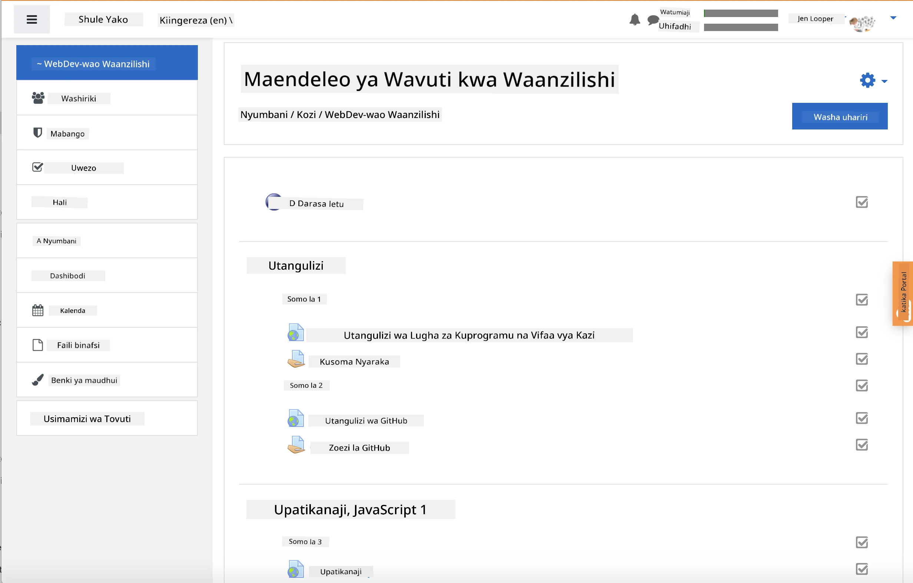
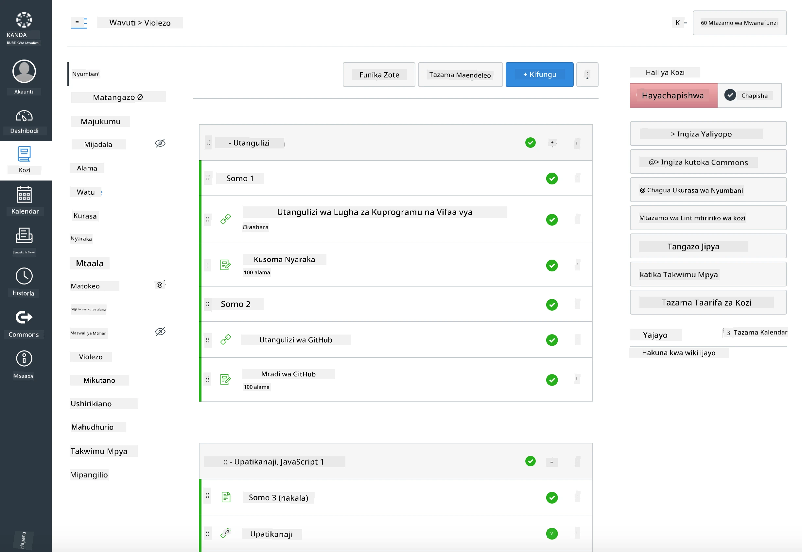

<!--
CO_OP_TRANSLATOR_METADATA:
{
  "original_hash": "71009af209f81cc01a1f2d324200375f",
  "translation_date": "2025-10-03T10:25:17+00:00",
  "source_file": "for-teachers.md",
  "language_code": "sw"
}
-->
### Kwa Walimu

Unakaribishwa kutumia mtaala huu darasani kwako. Unafanya kazi vizuri na GitHub Classroom na majukwaa maarufu ya LMS, na pia unaweza kutumika kama hifadhi ya pekee na wanafunzi wako.

### Kutumia na GitHub Classroom

Ili kusimamia masomo na kazi kwa kila kundi, tengeneza hifadhi moja kwa kila somo ili GitHub Classroom iweze kuambatanisha kila kazi kwa uhuru.

- Fork hifadhi hii kwenye shirika lako.
- Tengeneza hifadhi tofauti kwa kila somo kwa kutoa kila folda ya somo na kuiweka kwenye hifadhi yake.
  - Chaguo A: Tengeneza hifadhi tupu (moja kwa kila somo) na nakili maudhui ya folda ya somo kwenye kila moja.
  - Chaguo B: Tumia mbinu inayohifadhi historia ya Git (mfano, kugawa folda kuwa hifadhi mpya) ikiwa unahitaji historia ya mabadiliko.
- Katika GitHub Classroom, tengeneza kazi kwa kila somo na elekeza kwenye hifadhi ya somo husika.
- Mapendekezo ya mipangilio:
  - Uonekano wa hifadhi: binafsi kwa kazi za wanafunzi.
  - Tumia msimbo wa kuanzia kutoka tawi la msingi la hifadhi ya somo.
  - Ongeza templeti za masuala na maombi ya kuvuta kwa majaribio na mawasilisho.
  - Kwa hiari, weka upimaji wa kiotomatiki na majaribio ikiwa masomo yako yanajumuisha hayo.
- Miongozo inayosaidia:
  - Majina ya hifadhi kama lesson-01-intro, lesson-02-html, nk.
  - Lebo: quiz, assignment, needs-review, late, resubmission.
  - Alama/toleo kwa kila kundi (mfano, v2025-term1).

Kidokezo: Epuka kuhifadhi hifadhi ndani ya folda zinazolinganishwa (mfano, OneDrive/Google Drive) ili kuzuia migogoro ya Git kwenye Windows.

### Kutumia na Moodle, Canvas, au Blackboard

Mtaala huu unajumuisha pakiti zinazoweza kuingizwa kwa kazi za kawaida za LMS.

- Moodle: Tumia faili ya kupakia Moodle [Moodle upload file](../../../../../../../teaching-files/webdev-moodle.mbz) kupakia kozi nzima.
- Common Cartridge: Tumia faili ya Common Cartridge [Common Cartridge file](../../../../../../../teaching-files/webdev-common-cartridge.imscc) kwa utangamano mpana wa LMS.
- Vidokezo:
  - Moodle Cloud ina msaada mdogo wa Common Cartridge. Pendekeza faili ya Moodle hapo juu, ambayo pia inaweza kupakiwa kwenye Canvas.
  - Baada ya kuingiza, hakiki moduli, tarehe za mwisho, na mipangilio ya majaribio ili kuendana na ratiba ya muhula wako.

> Mtaala katika darasa la Moodle

> Mtaala katika Canvas

### Kutumia hifadhi moja kwa moja (bila Classroom)

Ikiwa unapendelea kutotumia GitHub Classroom, unaweza kuendesha kozi moja kwa moja kutoka hifadhi hii.

- Muundo wa mtandaoni/sambamba (Zoom/Teams):
  - Endesha mazoezi mafupi yanayoongozwa na mwalimu; tumia vyumba vya vikundi kwa majaribio.
  - Tangaza muda maalum wa majaribio; wanafunzi wanawasilisha majibu kama Masuala ya GitHub.
  - Kwa kazi za ushirikiano, wanafunzi hufanya kazi kwenye hifadhi za somo za umma na kufungua maombi ya kuvuta.
- Muundo wa binafsi/usio sambamba:
  - Wanafunzi wanagawa kila somo kwenye hifadhi zao **binafsi** na kukuongeza kama mshirika.
  - Wanawasilisha kupitia Masuala (majaribio) na Maombi ya Kuvuta (kazi) kwenye hifadhi ya darasa lako au hifadhi zao binafsi.

### Mazoea Bora

- Toa somo la utangulizi kuhusu Git/GitHub, Masuala, na PRs.
- Tumia orodha za ukaguzi katika Masuala kwa majaribio/kazi za hatua nyingi.
- Ongeza CONTRIBUTING.md na CODE_OF_CONDUCT.md kuweka kanuni za darasa.
- Ongeza maelezo ya ufikivu (maandishi mbadala, manukuu) na toa PDF zinazoweza kuchapishwa.
- Toa toleo la maudhui yako kwa kila muhula na zuia hifadhi za somo baada ya kuchapisha.

### Maoni na Msaada

Tunataka mtaala huu ufanye kazi kwako na wanafunzi wako. Tafadhali fungua suala jipya katika hifadhi hii kwa hitilafu, maombi, au maboresho, au anza majadiliano katika Kona ya Walimu.

---

**Kanusho**:  
Hati hii imetafsiriwa kwa kutumia huduma ya kutafsiri ya AI [Co-op Translator](https://github.com/Azure/co-op-translator). Ingawa tunajitahidi kuhakikisha usahihi, tafadhali fahamu kuwa tafsiri za kiotomatiki zinaweza kuwa na makosa au kutokuwa sahihi. Hati ya asili katika lugha yake ya awali inapaswa kuzingatiwa kama chanzo cha mamlaka. Kwa taarifa muhimu, tafsiri ya kitaalamu ya binadamu inapendekezwa. Hatutawajibika kwa kutoelewana au tafsiri zisizo sahihi zinazotokana na matumizi ya tafsiri hii.