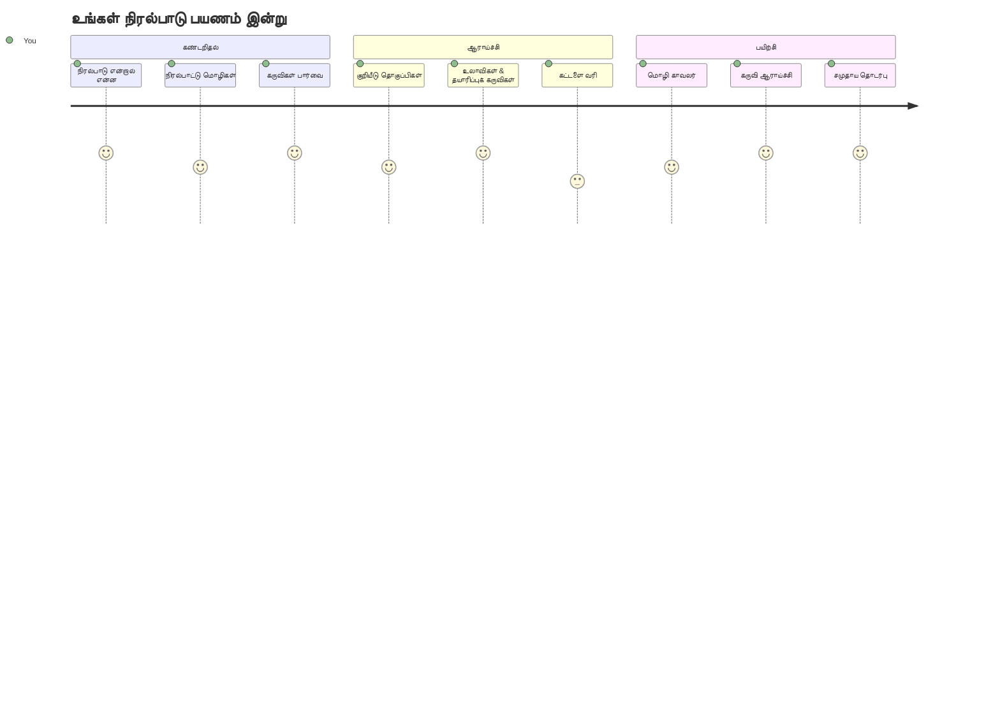
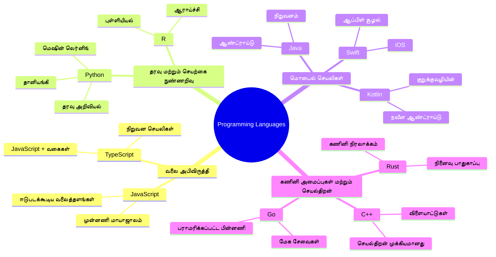
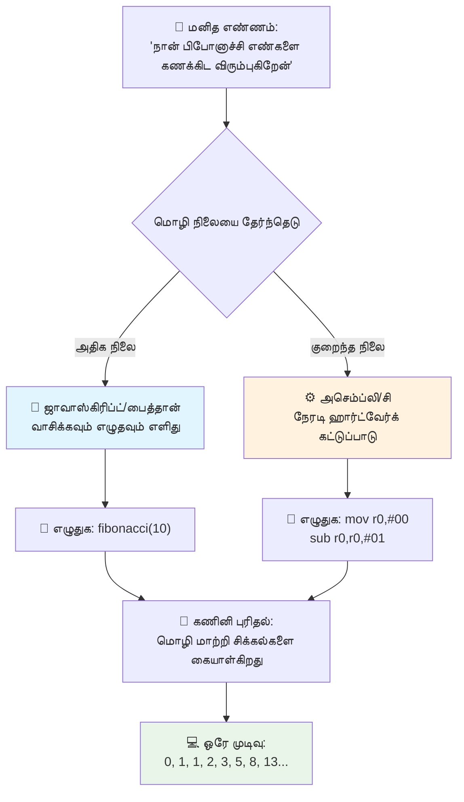
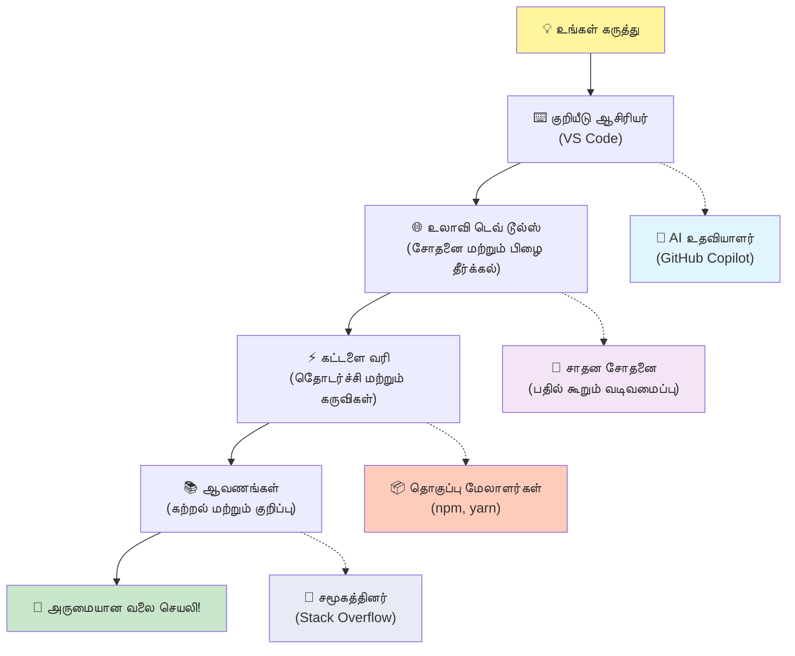
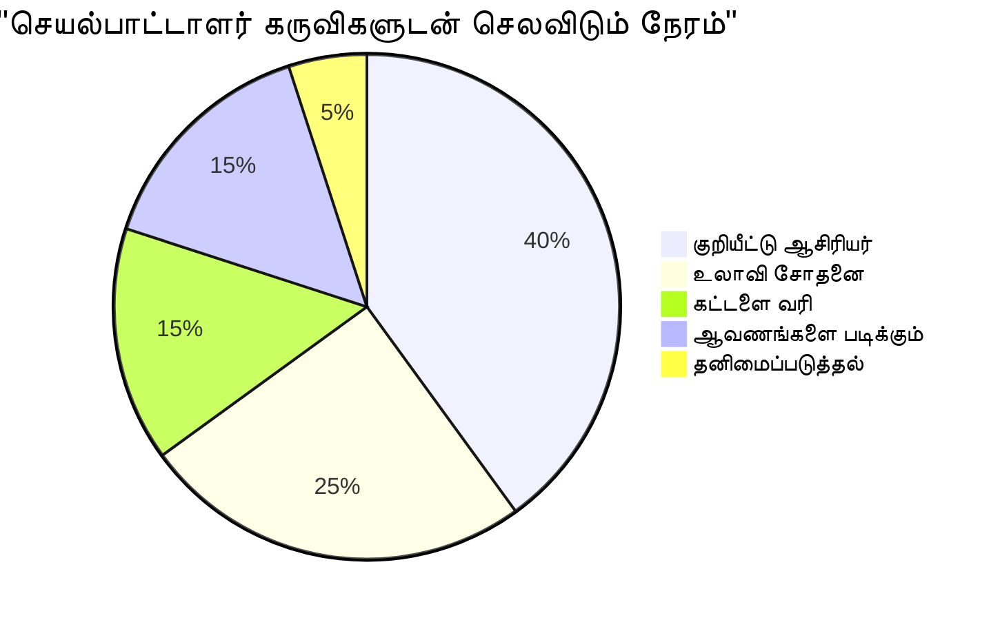
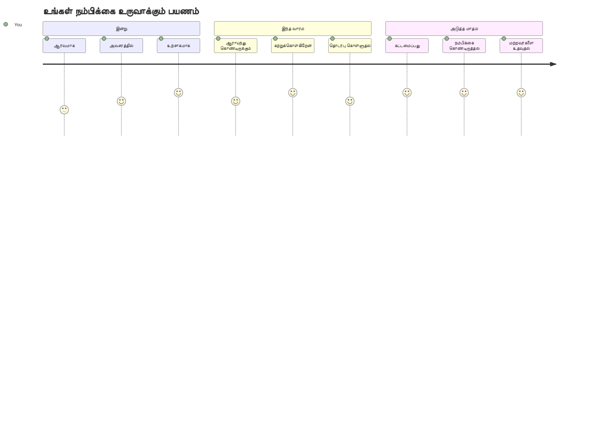

<!--
CO_OP_TRANSLATOR_METADATA:
{
  "original_hash": "d45ddcc54eb9232a76d08328b09d792e",
  "translation_date": "2026-01-07T13:56:32+00:00",
  "source_file": "1-getting-started-lessons/1-intro-to-programming-languages/README.md",
  "language_code": "ta"
}
-->
# நிரலாக்க மொழிகள் மற்றும் நவீன டெவலப்பர் கருவிகளின் அறிமுகம்
 
வணக்கம், எதிர்கால டெவலப்பர்! 👋 நான் உனக்காக அன்றாடம் என்னை அதிர்ச்சிக்கு உட்படுகின்ற ஒரு விஷயத்தைச் சொல்லலாமா? நிரலாக்கம் என்பது கணினிகளுக்கே மட்டும் அல்ல – அது உங்கள் ஆச்சரியமான யோசனைகளை உயிரோட்டம் கொடுக்கும் உண்மையான அதிசய சக்திகளைப் பெறுவது!

நீங்கள் உங்கள் பிடித்த செயலியை பயன்படுத்தும் அந்த நிமிடத்தை நினைக்கிறீர்களா? ஒரு பொத்தானை தொட்டவுடனேயே ஏதாவது அதிசயமானது நடக்கிறது, அதனால் நீங்கள் "வாவ், அவர்கள் இதை எப்படி செய்தார்கள்?" என்று நினைக்கிறீர்கள். அந்த வெகு-அதெப்படி செய்தவர், ஒருவன் நீங்கள் போலவே இருக்கும் – பத்தி espresso மூன்றாவது கப் குடித்து 2 AM-க்கு தனது பிடித்த காபிக் கடையில் உட்கார்ந்திருக்கும் – அந்தக் குறியீட்டை எழுதுபவர். இப்போது உங்களுக்கு அதிர்ச்சியானது என்னவென்றால்: இந்த பாடத்தைக் கடைசியில் நீங்கள் அவர்கள் எப்படி அதைச் செய்தார்கள் என்று புரிந்து கொள்வதோடு, நீங்கள் அதை உங்கள் அருவில் முயற்சிக்கவேண்டும் என்ற ஆசைஉண்டாகும்!

பிரமாதம், நீங்கள் மெழுகுவிக்கும் போது நிரலாக்கம் இப்போது நெருக்கமானதாக தோன்றினால் நான் மிகுந்த அணுகப்படுகிறேன். நான் தொடங்கும்போது, உண்மையில் நீங்கள் ஒரு கணித நிபுணராக இருக்க வேண்டும் அல்லது நீங்கள் ஐந்து வயதாக இருந்தே நிரலாக்கம் செய்திருப்பதாக கண்டேன். ஆனால் என்னை முழுமையாக மாற்றியது என்னவெனில்: நிரலாக்கம் என்பது ஒரு புதிய மொழியில் உரையாடல் கற்றுக் கொள்வதுபோலவே உள்ளது. நீங்கள் "வணக்கம்" மற்றும் "நன்றி" இலிருந்து துவங்கி, காபி ஆர்டர் செய்வதற்கும் காய்ச்சலை தொடங்குகிறீர்கள், பிறகு நீண்ட தத்துவ உரையாடல்கள் நடக்கின்றன! இங்கே நீங்கள் கணினிகளோடு உரையாடுகிறீர்கள், மற்றும் உண்மையில்? அவர்கள் மிகுந்த பொறுமையுடன் உரையாடுகிறார்கள் – உங்கள் பிழைகளைத் தீர்மானிக்க மாட்டார்கள் மற்றும் எப்போதும் மீண்டும் முயற்சிக்க உற்சாகமாக இருப்பார்கள்!

இன்று, நவீன வலைத் தள மேம்பாட்டை சாத்தியமாக்கும் அதிசய கருவிகளை நாம் ஆராயப்போகிறோம். நான் பேசுகிறேன் Netflix, Spotify மற்றும் உங்கள் பிடித்த சினிமா செயலி நிறுவனத்தின் டெவலப்பர்கள் தினமும் பயன்படுத்தும் அதே எடிட்டர்கள், உலாவிகள் மற்றும் வேலை முறைகள் பற்றி. மற்றும் நீங்கள் சந்தோஷமாக டான்ஸ் செய்யப்போகும் பகுதி இது: இந்த தொழில்முறை தர மாதிரி, தொழில்நுட்ப அங்கீகாரம் பெற்ற கருவிகள் பெரும்பாலான பகுதியும் முழுமையாக இலவசம்!


> சுருக்கக்குறிப்பு: [Tomomi Imura](https://twitter.com/girlie_mac) அவர்களின் படைப்பு


## உங்களுக்கு ஏற்கனவே தெரிந்துள்ளதை காண்போம்!

மகிழ்ச்சியான விஷயங்களில் தாவுவதற்கு முன், நான் ஆச்சரியமாக இருக்கிறேன் – இந்த நிரலாக்க உலகம் பற்றி நீங்கள் ஏது அறிந்திருக்கிறீர்கள்? மற்றும் கேளுங்கள், இந்தக் கேள்விகளைப் பார்த்து "நான் இதுவரை ஒருபோதும் இதைப் பற்றி கூட புரியவில்லை" என நீங்கள் எண்ணினாலும் அது சரிதான், அது சிறந்தது! அதாவது நீங்கள் சரியான இடத்தில் உள்ளீர்கள். இந்த வினாடி வினா கேள்வியை உடற்பயிற்சி முன்பு உதிர்த்தலாக நினைக்கவும் – நாம் உங்கள் மூளையின் தசைகளை வெற்றிகரமாக வெப்பப்படுத்துகிறோம்!

[முந்தைய பாட தேர்வை எடுக்கவும்](https://forms.office.com/r/dru4TE0U9n?origin=lprLink)


## நாம் ஒன்றாக செல்லப்போகும் சாகசம்

சரி, நான் இந்த நாளில் நாம் ஆராயப்போகும் விஷயங்கள் பற்றி உண்மையில் உற்சாகமாக குதூகலிக்கிறேன்! ஐயோ, சில கருத்துக்கள் புரியும்போது உங்களுடைய முகத்தை பார்க்க விரும்புகிறேன். இங்கே நாம் ஒன்றாக பயணிக்கப்போகும் அதிசயம்:

- **நிரலாக்கம் உண்மையில் என்ன (என்னவென்றால் இது மிக அற்புதமானது!)** – நீங்கள் சுற்றியுள்ள அனைத்தையும் இயக்கும் மறைமுக அதிசய சக்தி என்று குறியீடு எப்படி வேலை செய்கிறது என்பதை காண்போம், திங்கட்கிழமை காலை என்பது அறியும் அலாரம் இருந்து உங்கள் Netflix பரிந்துரைகளை சரியான முறையில் உருவாக்கும் அல்கோரிதம் வரை
- **நிரலாக்க மொழிகளும் அவற்றின் அற்புதமான தன்மைகளும்** – ஒவ்வொரு நபரும் பல வல்லுனர் சக்திகள் மற்றும் சிக்கல்களை தீர்க்கும் விதமாகவே இருக்கும் ஒரு விழாவில் நடந்து செல்ல்வதை கற்பனை செய்யுங்கள். நிரலாக்க மொழிகள் உலகம் அப்படியே இருக்கிறது, நீங்கள் அவர்கள் அனைவரையும் சந்திக்க பிடிக்கும்!
- **டிஜிட்டல் அதிசயம் எவ்வாறு நடக்கிறது என்ற அடிப்படை கட்டிடம்** – இதை உத்தமமான படைப்பாற்றல் LEGO சேட்டாக கருதுங்கள். இந்த துண்டுகள் எப்படி பொருந்துகின்றன என்பதை புரிந்தால், நீங்கள் உங்கள் கனவுகளுக்கேற்ற ஒன்றை உருவாக்க முடியும் என்று நீங்கள் உணர்வீர்கள்
- **தொழில்முறை கருவிகள், நீங்கள் செவ்வணக்கு கைகளைப் பெறுவதாக உணர்த்தும்** – நான் மிகுந்த நாடகராக இருக்கவில்லை – இந்த கருவிகள் உங்களுக்கு அதிசய சக்திகள் உண்டு என்று உணர்த்தும், மற்றும் சிறந்த பகுதி? தொழில்முறை நிபுணர்கள் பயன்படுத்தும் அதே கருவிகள்!

> 💡 **வேறு ஒரு விஷயம்**: இன்று எல்லாவற்றையும் நினைவில் வைக்க முயற்சிக்க வேண்டாம்! இப்போது, நீங்கள் சாத்தியமானதற்கான உற்சாகத்தை உணர வேண்டும். விவரங்கள் இயல்பாக நமது பயிற்சியில் நிலைத்திருக்கும் – அதுவே உண்மையான கற்றல்!

> நீங்கள் இந்த பாடத்தை [Microsoft Learn](https://docs.microsoft.com/learn/modules/web-development-101/introduction-programming/?WT.mc_id=academic-77807-sagibbon) இல் எடுக்கலாம்!

## நிரலாக்கம் என்பது *என்ன*?

சரி, ஒரு கோடிக் கேள்வியைச் சமாளிப்போம்: நிரலாக்கம் உண்மையில் என்ன?

நான் இன்று உங்களுக்காக ஒரு கதை சொல்கிறேன், இது என்னைப் முழுமையாக மாற்றியது. கடந்த வாரம், நான் என் அம்மாவுக்கு எங்கள் புதுவிதமான ஸ்மார்ட் டிவி ரிமோட்டை எப்படி பயன்படுத்துவது என்பதைக் கூற முயன்றேன். "சிவப்பு பொத்தானை அழுத்து, ஆனால் பெரிய சிவப்பு பொத்தானை அல்ல, இடதுபுற的小ை சிவப்பு பொத்தானை... இல்லை, உங்கள் இன்னும் இடது... சரி, இப்போது இரண்டு நொடிகள் பிடித்து வையுங்கள், ஒரு நொடி அல்ல, முப்பு நொடி அல்ல..." என்றபடியே சொன்னேன். பரிச்சயமா? 😅

அதுவே நிரலாக்கம்! இது ஒரு சக்திவாய்ந்தவற்றுக்கு முற்றிலும் விரிவான மற்றுமொரு படி படியாக கொடுக்கும் கலை. நீங்கள் உங்கள் அம்மாவிடம் விளக்குகிறீர்கள் (யார் "எந்த சிவப்பு பொத்தானா?!" என்று கேட்கலாம்), நீங்கள் ஒரு கணினிக்கே விளக்குகிறீர்கள் (எனினும் அது நீங்கள் சொன்னதையே தவறாக இருந்தாலும் அதைச் செய்கிறது).

நான் முதலில் இது கற்றுக்கொண்ட போது என்னை அதிர்ச்சியடைய செய்தது என்னவென்றால்: கணினிகள் அடிப்படையில் மிகவும் எளிமையாக இருக்கின்றன. அவை உண்மையாக இரண்டு விஷயங்களையே புரிந்துகொள்கின்றன – 1 மற்றும் 0, அதாவது "ஆம்" மற்றும் "இல்லை" அல்லது "இயக்கு" மற்றும் "நிறுத்து." அதுவே! ஆனால் அங்கே அது அதிசயம் ஆகிறது – நாம் 1 மற்றும் 0 இல் பேச வேண்டியதில்லை, நாம் The Matrix இல் இருப்பதுபோல் அல்ல. அதற்காக **நிரலாக்க மொழிகள்** உதவுகின்றன. அவை உலகின் சிறந்த மொழிபெயர்ப்பாளர் போல உங்கள் சாதாரண மனித எண்ணங்களை கணினியின் மொழியாக மாற்றுகின்றன.

மற்றும் என்னை ஒவ்வொரு காலை விழிக்கும் பின் உண்மையாக அதிர்ச்சி படைக்கும் விஷயம் என்னவென்றால்: உங்கள் வாழ்க்கையின் *எல்லா* டிஜிட்டல் பகுதியும் ஒருவன் இங்கே உங்களைப்போல் இருக்கின்றவர், காபிக் பாட்டிலுடன் பைஜாமாவில் உட்கார்ந்து தனது லேப்டாபில் குறியீடு தட்டச்சு செய்தவர் என்பதிலிருந்து துவங்கியது. உங்களை தோற்றமின்றி காட்டும் அந்த Instagram வடிவமைப்பு? ஒருவன் அதை குறியீடு செய்தார். உங்கள் புதிய பிடித்த பாடலுக்குச் சென்ற பரிந்துரை? ஒருவன் அந்த அல்கோரிதத்தை உருவாக்கினார். நண்பர்களுடன் உணவுப் பில்லுகளைப் பங்கிட உதவும் செயலி? ஆம், ஒருவர் "இதாவே இடையூறு, நான் இதை சரி செய்ய முடியும்" என்று எண்ணினார், பின்னர் அவர்கள் செய்தார்கள்!

நீங்கள் நிரலாக்கத்தை கற்றுக்கொண்டால், புதிய திறமையை மட்டுமல்ல, இந்த அற்புதமான சிக்கல் தீர்ப்பாளர்களின் சமூகத்தில் கலந்து கொள்கிறீர்கள், அவர்கள் தினமும் "ஒருவர் ஒருசிறியதாக இருக்க உதவும் ஒன்றை நான் கட்டியிருக்கலாமா?" என்று எண்ணுகிறார்கள். உண்மையில், அதன்முதல் மிக வேடிக்கையான விஷயம் எதுவும் இல்லை.

✅ **பயனுள்ள தகவல் தேடல்**: உங்கள் இலவச நேரத்தில் ஆராய வேண்டிய ஒரு அற்புதமான விஷயம் – உலகின் முதல் கணினி நிரலாக்கவர் யார் என்று நினைக்கிறீர்கள்? நான் ஒரு குறிப்பு தருகிறேன்: அது நீங்கள் எதிர்பார்க்கும் நபர் அல்லலாம்! அந்த நபர் பின்னணியில் உள்ள கதை மிகவும் சுவாரஸ்யமானது மற்றும் நிரலாக்கம் எப்போதும் படைப்பாற்றல் சிக்கல் தீர்வு மற்றும் அவதானம் தவிர உள்ள தத்துவமாக இருந்தது என்று காட்டுகிறது.

### 🧠 **தனி நேரம்: நீங்கள் எப்படி உணர்கிறீர்கள்?**

**ஒரு கணம் சிந்தியுங்கள்:**
- "கணினிகளுக்கு உத்தரவுகளை வழங்குவது" என்ற கருத்து உங்களுக்கு இப்போது புரிகிறதா?
- நிரலாக்கத்துடன் எந்த ஒரு தினசரி பணியை தானாகச் செய்வதாக நினைக்கிறீர்கள்?
- இந்த முழு நிரலாக்க விஷயத்துக்கு தொடர்புள்ள உங்கள் மனதில் எழும் கேள்விகள் என்ன?

> **நினைவில் வையுங்கள்**: சில கருத்துக்கள் இப்போது தெளிவாக இல்லாவிட்டாலும் அது இயல்பானது. நிரலாக்கம் ஒரு புதிய மொழியை கற்றுக்கொள்ளுவது போல – உங்கள் மூளை இந்த நரம்பியல் பாதைகளை கட்டமைக்க காலம் எடுக்கும். நீங்கள் அருமையாக செய்து கொண்டிருக்கிறீர்கள்!

## நிரலாக்க மொழிகள் பல்வேறு வகையான அற்புத சக்திகள் போல உள்ளன

சரி, இது வித்தியாசமாகக் கேட்கப்பட்டாலும் என்னைத் தொடருங்கள் – நிரலாக்க மொழிகள் பல்வேறு வகையான இசைப்பாணிகளுக்கு மிகவும் ஒத்தவை. நினைத்துப் பார்க்கவும்: ஜாஸ், மென்மையான மற்றும் உடனடி, ராக் சக்திவாய்ந்த மற்றும் நேர்மையாக, கிளாசிக்கல் அழகான மற்றும் கட்டமைக்கபட்ட, ஹிப்-ஹாப் படைப்பாற்றல் மற்றும் வெளிப்பாட்டுள்ள. ஒவ்வொரு பாணிக்கும் தனித்துவம், ஒரு உற்சாகமான ரசிகர் சமூகம் உள்ளது, மற்றும் ஒவ்வொன்றும் வெவ்வேறு மன நிலைகளுக்கும் நிகழ்வுகளுக்கும் உகந்தது.

நிரலாக்க மொழிகளும் அதே மாதிரியாய் செயல்படுகின்றன! நீங்கள் ஒரு மகிழ்ச்சியான மொபைல் கேம் கட்டக்க இசை மொழியை அதே மொழியில் பயன்படுத்த மாட்டீர்கள் எனவே நீங்கள் பருவமழை தரவுகளை கையாள கீழ்த்தரம் இதழ்களை பயன்படுத்த மாட்டீர்கள், தலைசிறந்த யோகா வகுப்பில் டெத் மெட்டல் இசை பயன்படுத்த மாட்டீர்கள் (அதுவும், பெரும்பாலும்! 😄).

ஆனால் என்னைக் அச்சமடையவைக்கும் விஷயம் என்னவென்றால்: இந்த மொழிகள் உலகின் மிக பொறுமையான, மூளைசெய்கின்ற மொழிபெயர்க்கும் நண்பர் போல நீங்கள் அருகில் இருப்பவர் போலவே இருக்கின்றன. நீங்கள் உங்கள் இயல்பான மனித மூளைக்கு பொருத்தமான கருத்துக்களை வெளிப்படுத்தலாம், அவர்கள் அதனை கணினிகள் பேசும் 1 மற்றும் 0 என்ற மொழியாக மாற்றும் மிகப் பெரிய சிக்கலை கையாள்வார்கள். இது உங்கள் "மனித படைப்பு" மற்றும் "கணினி தர்க்கம்" ஆகிய இரண்டிற்குமான மிகத் தமிழ்நாடு நண்பர் போலவே இருக்கிறது – அவர்கள் ஒருபோதும் சோர்வு அடைய மாட்டார்கள், காப்பி விருந்து தேவையில்லை, மற்றும் ஒன்றை இருமுறை கேட்டுக்கொண்டால் தீர்மானிக்க மாட்டார்கள்!

### பிரபலமான நிரலாக்க மொழிகள் மற்றும் அவற்றின் பயன்பாடுகள்


| மொழி | சிறந்தது | ஏன் பிரசித்தி? |
|----------|----------|------------------|
| **JavaScript** | வலை மேம்பாடு, பயனர் இடைமுகங்கள் | உலாவிகளில் இயங்குகிறது மற்றும் இடைமுக வலைத்தளங்களை இயக்குகிறது |
| **Python** | தரவு அறிவியல், தானாக செயல், செயற்கை நுண்ணறிவு | படிக்க மற்றும் கற்றுக்க எளிதானது, சக்திவாய்ந்த நூலகங்கள் |
| **Java** | நிறுவன பயன்பாடுகள், Android செயலிகள் | தளமற்றது, பெரிய அமைப்புகளுக்கு வலுவானது |
| **C#** | Windows பயன்பாடுகள், கேம் மேம்பாடு | Microsoft இன் வலுவான சூழல் ஆதரவு |
| **Go** | மேக சேவைகள், பின்புற அமைப்புகள் | வேகமான, எளிய, நவீன கணினிக்கு வடிவமைக்கப்பட்டது |

### உயர் நிலை மற்றும் கீழ் நிலை மொழிகள்

சரி, இது உண்மையில் நான் ஆரம்பத்தில் நேற்று நாளையேன் இடித்தேன் கருத்து, எனவே நான் விளக்கம் தருகிறேன் – இது எனக்குப் புரியச் செய்தது, உங்களுக்கும் உதவும் என்று நம்புகிறேன்!

நீங்கள் அந்நாட்டுக்கு பயணம் செய்யலாம், அங்கு நீங்கள் மொழி பேசமாட்டீர்கள் மற்றும் அருகிலுள்ள கழிப்பறையை கண்டுபிடிக்க விரும்புகிறீர்கள் (நாம் எல்லோரும் இருந்தோம், சரியா? 😅):

- **கீழ் நிலை நிரலாக்கம்** என்பது அந்த நாட்டின் அப்பாவின் பழமையான வர்ணனைக்காரம் போல் இருக்கிறது, நீங்கள் பழக்கவழக்கங்களை, உள்ளூர் இன அழைப்புக்களை மற்றும் உள்ளூர் நகைச்சுவைகளைப் பயன்படுத்தி பழைய பழமையான பழமையான மகள் பேசுகிறீர்கள். மிகவும் பாதிக்கக்கூடியதும் மிகச் சிறந்ததும்... ஆனால் நீங்கள் சொந்தமாய் பேசும் போது மட்டுமே! ஆனால் நீங்கள் வெறும் கழிப்பறையை தேடினால் அது சிரமம் அளிக்கும்.

- **உயர் நிலை நிரலாக்கம்** என்பது அற்புதமான உள்ளூர் நண்பர் போல ஆக்கம் – நீங்கள் "எனக்கு கழிப்பறை மிகவும் தேவை" என்று சீரான ஆங்கிலத்தில் சொல்லுங்கள், அவர்கள் அனைத்து கலாச்சார மொழிபெயர்ப்பையும் செய்து, உங்கள் அங்கீகாரம் இல்லாத மூளைக்கே பொருந்தும் வழிகளை வழங்குவர்.

நிரலாக்க பின்னணியில்:
- **கீழ் நிலை மொழிகள்** (Assembly அல்லது C போன்ற) கணினியின் இயந்திரத்துடன் மிக விரிவான உரையாடலை அனுமதிக்கின்றன, ஆனால் நீங்கள் இயந்திரம் போல் நினைக்க வேண்டும், அது பெரிய அறிவியல் மாற்றம்!
- **உயர் நிலை மொழிகள்** (JavaScript, Python, அல்லது C# போன்ற) நீங்கள் மனிதராக நினைக்கவும் அனுமதிக்கின்றன, அவர்கள் பின்னணியில் இயந்திரம் பேச கூடிய பணியை நிர்வகிக்கின்றனர். மேலும், அவர்கள் உங்கள் நிலையை நினைவில் வைக்கும் அற்புதமான சமூகங்களைக் கொண்டிருக்கின்றனர் மற்றும் உண்மையிலேயே உதவ விரும்புகிறவர்கள்!

நான் உங்களுக்கு எந்த மொழிகளைத் தொடங்கச் சொல்வேன் என்று கணிக்கிறீர்களா? 😉 உயர் நிலை மொழிகள் பயிற்சி சக்கரங்கள் போன்றவை, அவற்றை நீக்க விரும்பாதீர்கள், ஏனெனில் அவைகள் முழு அனுபவத்தை மிக விரும்பத்தக்கவுமாக்கும்!


### நான் உங்களுக்கு உயர் நிலை மொழிகள் ஏன் மிகவும் நண்பர்களாக இருக்கின்றன என்று காட்டுகிறேன்

சரி, நான் இனிமேல் உங்களுக்கு இருக்கக்கூடியதை காட்டப்போகிறேன், அது நான் உயர் நிலை மொழிகளுடன் காதலித்து விட்டதற்கான காரணத்தை சரியாக விளக்குகிறது, ஆனால் முதலில் – நீங்கள் எனக்கு ஏதாவது வாக்குறுதி கொடுக்க வேண்டும். அந்த முதல் குறியீட்டு எடுத்துக்காட்டை பார்த்தபோது பயப்படாதீர்கள்! அது பயங்கரமாக தோன்ற வேண்டுமானால் நல்லது. அதுவே நான் குறிப்பிடும் புள்ளி!

நாம் இரண்டு முற்றிலும் தனித்துவமான பாணிகளில் எழுதப்பட்ட ஒரே வேலை பார்க்க போகிறோம். இரண்டும் Fibonacci தொடர் என்று அழைக்கப்படுகின்றது – இது ஒரு அழகான கணித முறைமையாகும், இதில் ஒவ்வொரு எண், அதன் முன் இரண்டு எண்களின் கூட்டுத்தொகை: 0, 1, 1, 2, 3, 5, 8, 13... (வேடிக்கை விஷயம்: இந்த முறைமை இயற்கையில் எங்கும் உள்ளது – சூரியபூ வற்றின் விதைகள் சுழற்சி, ரேம்பிளிக் வடிவங்கள், பிரபஞ்ச உருவாக்கம்!)

வேறுபாட்டைப் பார்க்க தயாரா? வாருங்கள்!

**உயர் நிலை மொழி (JavaScript) – மனித நண்பர்:**

```javascript
// படி 1: அடிப்படையான பைபொனாச்சி அமைப்பு
const fibonacciCount = 10;
let current = 0;
let next = 1;

console.log('Fibonacci sequence:');
```

**இந்த குறியீடு என்ன செய்கிறது:**
- **காற்காணொளி** எத்தனை Fibonacci எண்கள் உருவாக்க விரும்புகிறோம் என்பதை குறிப்பிட ஒரு நிலையானைக் குறிப்பிடுங்கள்
- **இரட்டை மாறிலிகளை தொடங்குங்கள்** தொடர் உள்ள தற்போதைய மற்றும் அடுத்த எண்களை கண்காணிக்க
- **துவக்க மதிப்புகளை அமைக்கவும்** (0 மற்றும் 1) Fibonacci முறைமை வரையறுக்க
- **வெளியீடு தலைப்பை காட்சிப்படுத்தவும்**

```javascript
// படி 2: ஒரு வட்டத்தில் தொடரை உருவாக்கு
for (let i = 0; i < fibonacciCount; i++) {
  console.log(`Position ${i + 1}: ${current}`);
  
  // தொடரில் அடுத்த எண்ணை கணக்கிடு
  const sum = current + next;
  current = next;
  next = sum;
}
```

**இதில் என்ன நடக்கிறது:**
- **ஒவ்வொரு இடத்திலும்** `for` லூப் பயன்படுத்தி திரும்பிச் செல்லவும்
- **எல்லா எண்களையும் அவர்களின் இடம் மற்றும் வடிவமைப்புடன் காட்சியிடவும்**
- **அடுத்த Fibonacci எண்ணை** தற்போதைய மற்றும் அடுத்த மதிப்புகளை சேர்த்து கணக்கிடவும்
- **மாறிலிகளை புதுப்பித்து** அடுத்த சுற்றுக்கு செல்லவும்

```javascript
// படி 3: நவீன செயல்பாட்டு அணுகுமுறை
const generateFibonacci = (count) => {
  const sequence = [0, 1];
  
  for (let i = 2; i < count; i++) {
    sequence[i] = sequence[i - 1] + sequence[i - 2];
  }
  
  return sequence;
};

// பயன்பாட்டு உதாரணம்
const fibSequence = generateFibonacci(10);
console.log(fibSequence);
```

**மேலே நாம்:**
- **நவீன அம்பு செயல்பாட்டு மொழிச் சின்னத்துடன்** மறுபயன்படுத்தக்கூடிய செயல்பாட்டை உருவாக்கினோம்
- **ஒரு வரிசையை உருவாக்கி** முழு தொடரைப் பதித்ததற்கு பதிலாக சேமிக்கிறோம்
- **வரிசை அட்டவணையை பயன்படுத்தி** புதிய எண்ணை கடந்த மதிப்புகளிலிருந்து கணக்கிடுகிறோம்
- **முழு தொடரை திரும்ப வழங்குகிறோம்** எங்கள் நிரலின் பிற பகுதிகளில் போன்றதாக சக்திவாய்ந்த பயன்பாட்டிற்கு

**கீழ் நிலை மொழி (ARM Assembly) – கணினி நண்பர்:**

```assembly
 area ascen,code,readonly
 entry
 code32
 adr r0,thumb+1
 bx r0
 code16
thumb
 mov r0,#00
 sub r0,r0,#01
 mov r1,#01
 mov r4,#10
 ldr r2,=0x40000000
back add r0,r1
 str r0,[r2]
 add r2,#04
 mov r3,r0
 mov r0,r1
 mov r1,r3
 sub r4,#01
 cmp r4,#00
 bne back
 end
```

JavaScript பதிப்பு ஆங்கிலவாதங்களைப் போல வாசிக்கின்றது, ஆனால் Assembly பதிப்பு இரகசிய கட்டளைகளை பயன்படுத்தி கணினி செயலி நேரடியாகக் கட்டுப்படுத்துகிறது. இரண்டும் ஒன்றே வேலை செய்கின்றன, ஆனால் உயர் நிலை மொழி மனிதர்களால் புரிந்து, எழுதவும் பராமரிக்கவும் எளிதாக உள்ளது.

**உங்களுக்குத் தெரியும் முக்கிய வித்தியாசங்கள்:**
- **வாசனை திறன்**: JavaScript `fibonacciCount` போன்ற விவரமான பெயர்களை பயன்படுத்துகிறது, Assembly `r0`, `r1` போன்ற இரகசிய குறிச்சொற்களை பயன்படுத்துகிறது
- **கருத்துக்கள்**: உயர் நிலை மொழிகள் குறியீட்டை தானாகவே ஆவணப்படுத்தும் விளக்கக் கருத்துக்களை ஊக்குவிக்கின்றன  
- **மைப்பு**: ஜாவாஸ்கிரிப்டின் தர்க்கப் பாய்மாறு பிரச்சினைகளை மனிதர்கள் படி படியாக சிந்திப்பதுபோல் உள்ளது  
- **பராமரிப்பு**: வெவ்வேறு தேவைகளுக்கு ஜாவாஸ்கிரிப்ட் பதிப்பை புதுப்பிப்பது தெளிவாகவும் எளிதாகவும் இருக்கும்  

✅ **பைபோனாச்சி தொடருக்கான விளக்கம்**: இந்த அற்புதமான எண்ணுக்கட்டமைப்பு (ஒவ்வொரு எண் அதற்கு முன்னோரும் முந்தையதும் கூட்டுத்தொகை: 0, 1, 1, 2, 3, 5, 8...) இயற்கையில் உண்மையாக *எங்கும்* காணப்படும்! நாங்கள் இதைப்பார்க்கலாம் வெண்டைப்பூவின் சுழற்சிகளிலும், பைன்கோன் வடிவங்களிலும், நௌடிலஸ் சிப்புகளின் வளைவிலும், மர கிளைகளின் வளர்ச்சியிலும். இயற்கையின் அழகுமிக்க வடிவமைப்புகளை கணிதமும் குறியீட்டும் எவ்வாறு எங்கள் எண்ணைக்குள் கொண்டு சேர்த்து மீண்டும் உருவாக்குகின்றன என்பது பெரிதே வியக்கத்தக்கது!  


## மந்திரத்தை உருவாக்கும் கட்டுமானக் கூறுகள்

சரி, இப்போது நீங்கள் நிகழ்ச்சியில் காணும் நிரலை பார்த்துவிட்டீர்கள், இப்போது எழுதியுள்ள ஒவ்வொரு நிரலையும் உருவாக்கும் அடிப்படைக் கூறுகளைப் பார்க்கலாம். இதை உங்கள் மிகவும் பிடித்த சமையல் செய்முறையின் அவசியமான பொருட்களாக நினைத்து கொள்ளுங்கள் – ஒவ்வொன்றின் செயலை நீங்கள் புரிந்துகொண்டால், நீங்கள் எவ்வித மொழியிலும் குறியீடு படிக்கவும் எழுதவும் முடியும்!

இது கணினி நிரலைக் கற்றூட்டும் பாகமாகும். பள்ளியில் நீங்கள் பெயர்ச்சொற்கள், செயற்பாடுகள் மற்றும் வாக்கியங்களை எப்படி உருவாக்குவது என்று கற்றது நினைவிலிருக்கிறதா? நிரல் மொழிகளுக்கும் அப்படி தான் ஒரு இலக்கணம் இருக்கும், அது ஆங்கில இலக்கணத்தைவிட எவ்வளவு தர்க்கபூர்வமாகவும் கருணையாகவும் இருக்கும் என்று அறிந்தால் ஆச்சரியமாகும்! 😄

### பட்டியல்கள்: படி படியாக வழிகாட்டுதல்கள்

**பட்டியல்கள்** - இவை உங்கள் கணினியுடன் உரையாடும் தனிப்பட்ட வாக்கியங்களைப் போல இருக்கின்றன. ஒவ்வொரு பட்டியலும் கணினியிடம் ஒரு குறிப்பிட்ட செயலைச் செய்யச் சொல்வதாகும்; "இங்கே இடப்பக்கம் திரும்பு," "சிகنالுக்கு நிறுத்து," "அந்த இடத்தில் வாகனத்தை நிறுத்து."  

பட்டியல்கள் மிகவும் வாசிக்க எளிதாயிருக்கின்றன என்பது எனக்கு மிகவும் பிடிக்கும். இதைப் பாருங்கள்:

```javascript
// ஒற்றை செயல்களை நிறைவேற்றும் அடிப்படைக் கூற்றுகள்
const userName = "Alex";                    
console.log("Hello, world!");              
const sum = 5 + 3;                         
```
  
**இந்தக் கோடுகள் என்ன செய்கின்றன:**  
- பயனர் பெயரைச் சேமிக்க ஒரு நிலையான மாறி அறிவிக்கிறது  
- கான்சோல் வெளியீட்டில் வரவேற்பு செய்தியை காட்டுகிறது  
- ஒரு கணித செயல்பாட்டின் முடிவை கணக்கிடுகிறது மற்றும் சேமிக்கிறது  

```javascript
// வலைப்பக்கங்களுடன் தொடர்புகொண்டு செயல்படும் கருத்துக்கள்
document.title = "My Awesome Website";      
document.body.style.backgroundColor = "lightblue";
```
  
**படிநிலை ஒரு நிலையில், இங்கே என்ன நடக்கிறது:**  
- உலாவி டேப் தலைப்பில் தோன்றும் இணையதளத்தின் தலைப்பை மாற்றுகிறது  
- முழு பக்கம் பின்னணி நிறத்தை மாற்றுகிறது  

### மாறிலிகள்: உங்கள் நிரலின் நினைவகத் தளம்

சரி, **மாறிலிகள்** எனக்கு மிகவும் பிடித்த கருத்துக்கள்; ஏன் என்றால் அவை நீங்கள் தினமும் பயன்படுத்தும் காரியங்களைப் போன்றவை!  

உங்கள் தொலைபேசி தொடர்புகளு பட்டியலை நினைத்துக் கொள்ளுங்கள். நீங்கள் எல்லா எண்ணுகளையும் நினைத்திருக்க மாட்டீர்கள் – அதற்கு பதிலாக "அம்மா," "உறவினர்," அல்லது " இரவு 2 மணி வரை பிச் டெலிவரி செய்பவன்" என்றும் சேமித்து, உங்கள் தொலைபேசி அந்த எண்களை நினைத்துக் கொள்கிறது. மாறிலிகள் போல் செயல் செய்கின்றன! அவை உங்கள் நிரலுக்கு தகவல்களை வைத்திருத்து பின்னர் புரிந்து கொண்டு மாற்றுவதற்கு பெயர்கள் கொண்ட கண்டெயினர்கள் போல.  

மாறிலிகள் பரிமாற்றம் அடிக்கடி நடைபெறுகிறது என்று கூர்ந்து கவனிக்கவும் (ஆகையால் "மாறிலி" என்ற பெயர்!). உதாரணமாக, நீங்கள் நல்ல বিজன்யை கண்டுப்பிடித்தால் அது தொடர்பான எண்ணை புதுப்பிப்பது போல, மாறிலிகள் உங்கள் நிரல் அறிவதைப் பொறுத்து அல்லது சூழ்வுகள் மாறும்போது புதுப்பிக்கப்படலாம்!  

அதன் எளிமையான உதாரணத்தை பார்ப்போம்:  

```javascript
// படி 1: அடிப்படை மாறிகளை உருவாக்குதல்
const siteName = "Weather Dashboard";        
let currentWeather = "sunny";               
let temperature = 75;                       
let isRaining = false;                      
```
  
**இந்த கருத்துக்களை புரிந்துகொள்ள:**  
- நிலையான மதிப்புகளை `const` மாறிலிகளில் சேமிக்க (உதா: தளத்தின் பெயர்)  
- நிரல் முழுவதும் மாறக்கூடிய மதிப்புகளுக்கு `let` பயன்படுத்த  
- வெவ்வேறு தரவுத் தொகைகளை ஒதுக்கிட: எழுத்துக்கள் (text), எண்கள், மற்றும் பூல்கள் (true/false)  
- ஒவ்வொரு மாறிலியும் என்ன வெள்ளையை உள்ளடக்கியுள்ளதாக விளக்கும் பொருத்தமான பெயர்களைத் தேர்ந்தெடுக்க  

```javascript
// படி 2: தொடர்புடைய தரவை குழுவாக்க பொருட்களுடன் பணியாற்றுதல்
const weatherData = {                       
  location: "San Francisco",
  humidity: 65,
  windSpeed: 12
};
```
  
**மேலே, நாம்:**  
- பயனுள்ள வானிலை தகவல்களை ஒன்றிணைக்க ஒரு பொருளை உருவாக்கினோம்  
- பல தரவுகளைக் கொண்ட ஒரு மாறியிலுள்ள தொகை உருவாக்கினோம்  
- ஒவ்வொரு தகவலையும் தெளிவாக குறியிடுவதற்காக முக்கியம்-மதிப்புத் தகவல்களைப் பயன்படுத்தினோம்  

```javascript
// படி 3: மாறிகளைக் பயன்படுத்துதல் மற்றும் புதுப்பித்தல்
console.log(`${siteName}: Today is ${currentWeather} and ${temperature}°F`);
console.log(`Wind speed: ${weatherData.windSpeed} mph`);

// மாறக்கூடிய மாறிகளை புதுப்பித்தல்
currentWeather = "cloudy";                  
temperature = 68;                          
```
  
**ஒவ்வொரு பகுதிக்கும் புரிதல்:**  
- `${}` இலக்கணத்துடன் உள்ளடக்கி வடிவகுெல்வைச் பயன்படுத்தி தகவல்களை வெளிப்படுத்த  
- பொருள் பண்புகளை புள்ளி குறியீட்டினால் அணுகு (`weatherData.windSpeed`)  
- `let` வழங்கிய மாறிகளை மாறும் சூழ்நிலைக்கு ஏற்ப புதுப்பிக்க  
- பல மாறிகளைக் கூடி பொருளான செய்திகளை உருவாக்க  

```javascript
// படி 4: சுத்தமான குறியீட்டிற்கு நவீன உருவகப்படியான தனி பகுப்பறிதல்
const { location, humidity } = weatherData; 
console.log(`${location} humidity: ${humidity}%`);
```
  
**புரிந்துகொள்ள வேண்டியது:**  
- தரவுகள் உட்படுதல் பயன்படுத்தி குறிப்பிட்ட உபவகுப்புகளை தனித்தெடுக்க  
- பொருள் முக்கிய அமைப்புகளோடு புதிய மாறுகளை தன்னங்கி செய்  
- தொடர்ச்சியான புள்ளி குறியீட்டை தவிர்த்து குறியீடை எளியமாக்கு  

### கட்டுப்பாட்டு ஓட்டம்: உங்கள் நிரலை சிந்திக்க கற்பிக்க

சரி, இங்கே நிரல் மிகப் பரபரப்பும் ஆச்சரியத்துடனும் வந்துவிடுகிறது! **கட்டுப்பாட்டு ஓட்டம்** என்பது உங்கள் நிரல் எப்படி ஞானமிக்க முடிவுகளை எடுக்கும் என்பதை கற்பிக்கும் செயல், நீங்கள் தினமும் சிந்திக்காமல் செய்வதைப் போல.

சொல்லுங்கள், இன்று காலை நீங்கள் "மழை பெய்கிறால் குடை எடுத்துக்குவேன். குளிரானால் ஜாக்கெட் அணிவேன். தாமதமாக இருந்தால் காலை உணவை தவிர்த்து காபி எடுப்பேன்" என்ற வரிசையில் தான் நடந்திருக்க வேண்டும். உங்கள் மூளை இதுபோன்று ஐப்போதும் பல தடவைகள் if-then நியமத்தை பின்பற்றுகிறது!  

இதுவே நிரல்களை அறிவொளி பலமாகவும் உயிருடன் இருப்பதாக உணர முடியத்தக்க வகையில் மாற்றுகிறது. அவர்கள் பாதுகாப்பாக ஒரு சூழ்நிலையைப் பார்வையிட முடிவெடுத்து சரியான முறையில் பதிலளிக்க முடியும். உங்கள் நிரலுக்கு ஒருதரம் சிந்திப்பதற்கும் தேர்வெடுக்கத் தகும் மூளை கொடுப்பது போல!  

ஏன் இவ்விதமாக வேலை செய்கிறது என்பதை காண செயற்கையாக செய்யட்டும்:  

```javascript
// படி 1: அடிப்படையான நிலைத்திறன் லாஜிக்
const userAge = 17;

if (userAge >= 18) {
  console.log("You can vote!");
} else {
  const yearsToWait = 18 - userAge;
  console.log(`You'll be able to vote in ${yearsToWait} year(s).`);
}
```
  
**இந்தக் கோடு என்ன செய்கிறது:**  
- பயனரின் வயது வாக்குச்சட்டதலை நிரூபிக்கிறதா என சரிபார்க்கிறது  
- சூழ்நிலை முடிவின்படி வெவ்வேறு குறியீடு தொகுதிகளை இயக்குகிறது  
- 18-ஐக் குறைவானவர்கள் வாக்குரிமைக்காக எவ்வளவு காத்திருக்கப்போகிறார்கள் என்று கணக்கிடி வெளிக்காட்டுகிறது  
- ஒவ்வொரு சூழ்நிலைக்குமான குறிப்பிட்ட மற்றும் உதவிக்குறிப்புகளை வழங்குகிறது  

```javascript
// படி 2: தருக்கக் காணிகள் கொண்ட பல நிலைகள்
const userAge = 17;
const hasPermission = true;

if (userAge >= 18 && hasPermission) {
  console.log("Access granted: You can enter the venue.");
} else if (userAge >= 16) {
  console.log("You need parent permission to enter.");
} else {
  console.log("Sorry, you must be at least 16 years old.");
}
```
  
**இங்கே நிறைவாக என்ன நடக்கிறது:**  
- பல சூழ்நிலைகளையும் `&&` (மற்றும்) இயக்கியில் இணைக்கிறது  
- பல நிலைகளுக்கு `else if` வைத்து அடுக்கு அமைக்கிறது  
- கடைசியில் எல்லா சாத்தியமான சூழ்நிலைகளுக்கும் `else` கொண்டு கையாள்கிறது  
- ஒவ்வொரு வேறுபட்ட நிலைக்கும் தெளிவான, நடைமுறை விளக்கத்தை வழங்குகிறது  

```javascript
// படி 3: மூத்த செயலி கொண்டு சுருங்கிய நிபந்தனை
const votingStatus = userAge >= 18 ? "Can vote" : "Cannot vote yet";
console.log(`Status: ${votingStatus}`);
```
  
**நீங்கள் நினைவில் வைத்துக்கொள்ள வேண்டியது:**  
- எளிய இரண்டு விருப்பமான நிலைகளுக்கு `ternary operator` (`? :`) பயன்படுத்துவது  
- முதலில் நிபந்தனையை எழுதவும், பின்னர் `?` வைத்து உண்மை முடிவை, பின்னர் `:` வைத்து பொய் முடிவைச் சூட்டுக  
- நிலைகளின் அடிப்படையில் மதிப்புகளை ஒதுக்க வேண்டிய பொழுது இந்த வடிவத்தைப் பயன்படுத்துக  

```javascript
// படி 4: பல சிறப்பு வழிகளை கையாளுதல்
const dayOfWeek = "Tuesday";

switch (dayOfWeek) {
  case "Monday":
  case "Tuesday":
  case "Wednesday":
  case "Thursday":
  case "Friday":
    console.log("It's a weekday - time to work!");
    break;
  case "Saturday":
  case "Sunday":
    console.log("It's the weekend - time to relax!");
    break;
  default:
    console.log("Invalid day of the week");
}
```
  
**இந்த நிரல் பின்வருவன செய்கிறது:**  
- மாறியின் மதிப்பை பல குறிப்பிட்ட முனைகளுடன் ஒப்பிடுகிறது  
- ஒற்றுமையான முனைகளை ஒன்று சேர்க்கிறது (வார விடுமுறை மற்றும் வார நாட்கள்)  
- பொருந்தும் போது படி படியாகக் குறியீடு தொகுதி செயலில் ஈடுபடும்  
- எதிர்பாராத மதிப்புகளை சந்திக்கும் `default` நிலையை உள்ளடக்குகிறது  
- அடுத்த நிலைக்குச் செல்வதை தடுக்கும் `break` புலன்காட்டுதலை பயன்படுத்துகிறது  

> 💡 **உண்மை உலகப்போலியினை**: கட்டுப்பாட்டு ஓட்டம் என்பது உலகின் மிகவும் பொறுமையான GPS போல் உங்கள் வழிகாட்டக்கூடியது. இது "மெயின் தெருவில் போக்குவரத்து இருந்தால், அதில் நெடுஞ்சாலையைப் பயணம் செய்யுங்கள். கட்டுமானம் நெடுஞ்சாலையை மூடியிருந்தால், காட்சியளிக்கும் பாதையை முயற்சி செய்யவும்" என்று சொல்லும். நிரல்கள் அதே வகையான நிபந்தனை வழுவை பயன்படுத்தி சூழ்நிலைகளுக்கு ஞானமாக பதிலளிக்கின்றன மக்களுக்கு சிறந்த அனுபவத்தைத் தர.  

### 🎯 **கருத்து பரிசோதனை: கட்டுமானங்களை ஆர்.கு.பி. பேனர்**

**அடிப்படைகளை நீங்கள் எப்படி கையாள்கிறீர்கள் என்பதை பார்ப்போம்:**  
- உங்கள் சொற்களில் மாறிலி மற்றும் பட்டியலின் வேறுபாட்டை விளக்க முடியுமா?  
- ஒரு if-then முடிவுக்கான உண்மையான வாழ்க்கைச் சூழலை நினைக்க (எமது வாக்குச்சட்ட உதாரணம் போல)  
- நிரல் தர்க்கத்தில் உங்களை மிகவும் ஆச்சரியப்படுத்தியது என்ன ஒன்று?  

**விரைவான நம்பிக்கையூட்டும் உதவி:**  

✅ **அடுத்து வரும் பகுதி**: நாம் இந்த கருத்துக்களை மேலும் ஆழமாகப் புரிந்து கொண்டு இந்த அற்புதமான பயணத்தை தொடரப்போகிறோம்! இப்போது, எதிர்காலத்தின் எல்லா அசட்டத்தான சாத்தியங்களைப் பற்றி உற்சாகப்படுத்திக் கொள்ளவும். குறிப்பிட்ட দক্ষியையும் தொழில்நுட்பத்தையும் பழகுவதால் இயலும் என்று உறுதி அளிக்கிறேன் - இது நீங்கள் எதிர்பார்க்கும் அதிரடியான பொழுதுபோக்கை விட 훨씬 அதிகம் சுவாரஸ்யமாக இருக்கும்!  

## தொழில்நுட்ப கருவிகள்  

சரி, இப்பொழுது எனக்கு மிகுந்த உற்சாகம் வருகிறது, அதை தாங்க முடியவில்லை! 🚀 நாளை நீங்கள் ஒரு மின்னணு விண்கலப்பயணத்தின் விசைகளை ஆறும் போல உணரவேண்டிய அற்புத கருவிகளைப் பற்றி பேசப் போகிறோம்.  

ஒரு சமையல்காரர் அவர்களுடைய கை விரிவாக இருப்பதாக உணர்கிற கேனிவுகளைக் கொண்டிருக்கிறார்கள் என்பது உங்களுக்கு தெரியும். அல்லது ஒரு இசைக்கலைஞர் தங்களுடைய கேள்வையை தொடுவதற்குடனே அது பாட ஆரம்பிக்கிறது. நாமும், உருவாக்குநர்களும், அந்த வகையான அதிசய கருவிகளைப் பயன்படுத்துகிறோம், மேலும் பெரும்பாலும் அவை இலவசம் என்று நான் சொல்வதால் உங்களுக்கு ஆச்சரியம் வரும்!  

நான் இந்த கருவிகளை உங்களுடன் பகிர்ந்துகொள்ளும் எண்ணத்தில் இருந்து குதூகலப்படுகிறேன், ஏனென்றால் அவை மென்பொருள் உருவாக்கும் முறையில் புரட்சி செய்துள்ளன. AI இயக்குனர் உதவியாளர்கள் உங்கள் குறியீட்டை எழுத உதவும் (நான் சூடு சொல்லவில்லை!), இதர இடங்களில் Wi-Fi உடன் இருந்து முழு பயன்பாடுகளை உருவாக்க நீங்கள் செயலாக்க சூழல், மற்றும் X-கதிர் பார்வை போல் உங்கள் நிரல்கள் விசாரணை செய்ய உதவும் டிபக் கருவிகள் இவை.  

மேலும் இது என்ன விறுவிறுப்பை தருகிறது என்றால்: இவை "ஆரம்ப நிலை கருவிகள்" அல்ல, நீங்கள் வளர்ந்து விடும் என்று நினைக்கும் பரிமாணங்கள் அல்ல. இந்தப் பெற்ற தொழில்நுட்ப கருவிகள் Google, Netflix போன்ற பிரபல நிறுவனங்களிலும் உங்கள் பிடித்த குடிமன்ற அயல் நிறுவனமும் இப்போது பயன்படுத்துகின்றன. இவற்றைக் பயன்படுத்தி நீங்கள் முற்றிலும் நிர்வாகி போல உணரப்போகிறீர்கள்!  


### குறியீடு தொகுப்பாளர்கள் மற்றும் IDEகள்: உங்கள் புதிய டிஜிட்டல் நண்பர்கள்  

குறியீடு தொகுப்பாளர்களைப் பற்றி பேசுவோம் – இவை உங்கள் புதிய பிடித்த இடங்கள் ஆக விடப்போகின்றன! இவற்றை நீங்கள் உங்கள் தனிப்பட்ட குறியீட்டுக் கண்காட்சியாக நினைத்துக் கொள்ளுங்கள், அங்கு நீங்கள் பெரும்பாலான நேரம் உங்கள் டிஜிட்டல் படைப்புகளை உருவாக்கவும் மேம்படுத்தவும் செலவிடுவீர்கள்.  

ஆனால் இன்றைய தொகுப்பாளர்கள் என்ன அற்புதமே என்றால்: இவை வெறும் எழுத்துப்பதிவர் அல்ல. இவை 24/7 நேரம் உங்களுடன் அமர்ந்து உங்கள் குறியீடை புரிந்துகொள்ள உதவும், உங்கள் தப்புகளை முன்பே கட்டப்படுத்தும், நீங்கள் என்ன எழுதவிருக்கிறீர்கள் என கணிப்பதை கூடச் செய்வது போல்!  

நான் முதலில் தானாக நிரலை முடிப்பதை கண்டபோது, அது எதிர்காலத்தில் வாழ்ந்து கொண்டு இருப்பதாக அறிவதாக இருந்தது. நீங்கள் தட்டச்சு செய்ய ஆரம்பிக்கும்போது, உங்கள் தொகுப்பாளர் "நீங்கள் இப்படி ஒரு செயல்பாட்டை நினைத்தீர்களா?" என்று கேட்கிறது. அது உங்கள் குறியீடு நண்பருக்கு மனம் படைப்பவர் இருப்பதுபோல்!  

**இந்த தொகுப்பாளர்கள் என்ன வலிமை தருகின்றன?**  

நவீன குறியீடு தொகுப்பாளர்கள் உங்கள் உற்பத்தித்தன்மையை உயர்த்த பல அம்சங்களைக் கொண்டுள்ளன:  

| அம்சம் | அது என்ன செய்கிறது | இது எப்படி உதவும் |  
|---------|--------------|--------------|  
| **இலக்கண வண்ணச்சு** | உங்கள் குறியீடு பகுதிகளை வண்ணமயமாக்குகிறது | குறியீட்டை வாசிக்க மற்றும் பிழைகளை கண்டுபிடிக்க உதவும் |  
| **தானாக முடித்தல்** | நீங்கள் தட்டச்சு செய்யும்போது குறியீட்டை பரிந்துரைக்கிறது | குறியீடு செய்யும் வேகம் மற்றும் தப்புகளை குறைக்கும் |  
| **டிபக்கிங் கருவிகள்** | பிழைகளை கண்டறிந்து சரிசெய்ய உதவும் | விசாரணைக்கான நேரத்தை காப்பாற்றும் |  
| **பிரிப்பு செயற்கைகள்** | சிறப்பு அம்சங்களைச் சேர்க்கிறது | எந்த தொழில்நுட்பத்திற்கும் தொகுப்பாளரை தனிப்பயனாக்கும் |  
| **AI உதவியாளர்கள்** | குறியீடு மற்றும் விளக்கங்களை பரிந்துரைக்கிறது | கற்றல் மற்றும் உற்பத்தியை வேகப்படுத்தும் |  

> 🎥 **வீடியோ ஆதாரம்**: இந்த கருவிகள் எப்படி செயல்படுகிறதென்றதை காண விரும்புமா? இதைப் பாருங்கள் [Tools of the Trade video](https://youtube.com/watch?v=69WJeXGBdxg).  

#### வலை மேம்பாட்டிற்கு பரிந்துரைக்கப்படும் தொகுப்பாளர்கள்  

**[Visual Studio Code](https://code.visualstudio.com/?WT.mc_id=academic-77807-sagibbon)** (இலவசம்)  
- வலை மேம்பாட்டாளர்களில் மிகவும் பிரபலமானது  
- சிறந்த பிரிப்பு சூழல்  
- உள்ளடக்கப்பட்ட டெர்மினல் மற்றும் Git ஒருங்கிணைப்பு  
- **அவசியமான பிரிப்புகள்**:  
  - [GitHub Copilot](https://marketplace.visualstudio.com/items?itemName=GitHub.copilot) - AI திறன் கொண்ட குறியீடு பரிந்துரை  
  - [Live Share](https://marketplace.visualstudio.com/items?itemName=MS-vsliveshare.vsliveshare) - நேரடி ஒருங்கிணைப்பு  
  - [Prettier](https://marketplace.visualstudio.com/items?itemName=esbenp.prettier-vscode) - தானியங்கியாக குறியீடு வடிவமைத்தல்  
  - [Code Spell Checker](https://marketplace.visualstudio.com/items?itemName=streetsidesoftware.code-spell-checker) - குறியீட்டிலுள்ள தப்புகளை கண்டறிதல்  

**[JetBrains WebStorm](https://www.jetbrains.com/webstorm/)** (செலுத்தப்படும், மாணவர்களுக்கு இலவசம்)  
- மேம்பட்ட டிபக் மற்றும் சோதனை கருவிகள்  
- புத்திசாலித்தனமான குறியீடு முடித்தல்  
- கட்டமைக்கப்பட்ட பதிப்பு கட்டுப்பாடு  

**மேக அடிப்படையிலான IDEகள்** (வேறு விலையில்)  
- [GitHub Codespaces](https://github.com/features/codespaces) - உலாவியில் முழுமையான VS Code  
- [Replit](https://replit.com/) - கற்றலும் பகிர்வும் சிறந்தது  
- [StackBlitz](https://stackblitz.com/) - உடனடி முழு ஸ்டாக் வலை மேம்பாடு  

> 💡 **தொடங்குவோர் குறிப்பு**: Visual Studio Code-ஐத் தொடங்குங்கள் – இது இலவசம், தொழில்துறையில் பரவலாக பயன்படுத்தப்படுகிறது மற்றும் பல பயனுள்ள கற்றல் வகுப்புகள் மற்றும் பிரிப்புகளை உருவாக்கும் பெரிய சமூகத்துடன் உள்ளது.  


### வலை உலாவிகள்: உங்கள் ரகசிய மேம்பாட்டு ஆய்வகம்

சரி, உங்கள் மனதை முழுமையாக உதிர்வடிக்க தயாராகுங்கள்! நீங்கள் சமூக ஊடகங்களில் சுருள் பிடிக்கவும் வீடியோக்கள் பார்க்கவும் உலாவிகளைப் பயன்படுத்தி வருகிறீர்கள்; இதுவரை அவர்கள் உங்கள் மறைக்கப்பட்ட சக்திவாய்ந்த மேம்பாட்டு ஆய்வகத்தை மறைத்து வைத்து உள்ளனர்.  

ஒவ்வொரு முறையும் ஒரு வலைப் பக்கத்தில் வலது கிளிக் செய்து "Inspect Element" (உறுப்பை ஆய்வு செய்) என்பதைக் கிளிக் செய்யும் போது, நீங்கள் ஒரு மறைந்த மேம்பாட்டு கருவிகள் உலகத்தை திறக்கிறீர்கள். நான் முன்பு நூற்றுக்கணக்கான டாலர்கள் செலுத்தி வாங்கிய சில மென்பொரல்களைவிட இவை சக்திவாய்ந்ததாக இருக்கின்றன. அது உங்கள் இயல்பான சமையல் அறைக்குப் பின்னால் ஒரு தொழில்முறை சமையல்காரன் ஆய்வகம் மறைத்து வைத்திருக்கின்றது என்று கண்டுபிடிப்பதைப் போன்றது!
முதன்முறையாக யாரோ எனக்கு உலாவி DevTools-ஐ காட்டியபோது, நான் மூன்று மணி நேரம் கிளிக் செய்து "வாங்க, அது கூட செய்யுமா?!" என்கிறேனே. நீங்கள் நேரடியான நேரத்தில் எந்த இணையதளத்தையும் எடிட் செய்ய முடியும், எல்லாவற்றும் எவ்வளவு வேகமாக ஏற்றுகிறது என்பதை சரியாக பார்க்கலாம், உங்கள் தளம் வேறுபட்ட சாதனங்களில் எப்படி தோற்றமளிக்கிறது என்பதை சோதிக்கலாம், மற்றும் ஜாவாஸ்கிரிப்ட் பிழைகளை நிபுணர்களைப் போல திறம்பட திருத்தலாம். இது முற்றிலும் ஆச்சர்யமளிக்கிறது!

**இனிமேல் உலாவிகள் உங்கள் ரகசிய ஆயுதங்கள் ஆக இருப்பதன் காரணம்:**

நீங்கள் இணையதளம் அல்லது வலை பயன்பாடை உருவாக்கும் போது, அது உண்மையான உலகில் எப்படி தோன்றுகிறது மற்றும் நடக்கிறது என்பதை நீங்கள் காண வேண்டும். உலாவிகள் உங்கள் படைப்பை மட்டுமல்லாமல் செயல்திறன், அணுகல் திறன் மற்றும் சாத்தியமான பிரச்சனைகள் பற்றிய விரிவான கருத்துக்களையும் வழங்குகின்றன.

#### உலாவி டெவலப்பர் டூல்ஸ் (DevTools)

நவீன உலாவிகள் விரிவான மேம்பாட்டு கருவிகள் கொண்டுள்ளன:

| கருவி வகை | அது செய்கிறது என்ன | உதாரண பயன்பாடு |
|---------------|------------------|------------------|
| **எலிமெண்ட் இன்ஸ்பெக்டர்** | நேரடியாக HTML/CSS ஐ பார்க்கவும் மற்றும் திருத்தவும் | உடனடி முடிவுகளை பார்க்க ஸ்டைலிங் மாற்றவும் |
| **கான்சோல்** | பிழை செய்திகள் பார்க்கவும், JS சோதிக்கவும் | பிரச்சனைகளைத் திருத்தவும், கோடை ஆராயவும் |
| **நெட்வொர்க் மோனிட்டர்** | வளங்கள் எப்படி ஏற்ற Mollு என்பதை கண்காணிக்கவும் | செயல்திறன் மற்றும் ஏற்ற நேரங்களை மேம்படுத்தவும் |
| **அணுகல் சோதனை கருவி** | ஒருங்கிணைந்த வடிவமைப்பை சோதிக்கவும் | உங்கள் தளம் அனைத்து பயனர்களுக்கும் செயல்படுவதை உறுதி செய்யவும் |
| **சாதனம் சிமுலேட்டர்** | வித்தியாசமான திரை அளவுகளில் முன்னோட்டம் | பல சாதனங்கள் இல்லாமல் பதிலளிக்கும் வடிவமைப்பை சோதிக்கவும் |

#### மேம்பாட்டிற்கான பரிந்துரைக்கப்பட்ட உலாவிகள்

- **[Chrome](https://developers.google.com/web/tools/chrome-devtools/)** - தொழில்துறை நிலையான DevTools மற்றும் முழுமையான ஆவணங்கள்
- **[Firefox](https://developer.mozilla.org/docs/Tools)** - சிறந்த CSS கிரிட் மற்றும் அணுகல் கருவிகள்
- **[Edge](https://docs.microsoft.com/microsoft-edge/devtools-guide-chromium/?WT.mc_id=academic-77807-sagibbon)** - Chromium அடிப்படையில் மைக்ரோசாஃப்டின் டெவலப்பர் வளங்களுடன்

> ⚠️ **முக்கிய சோதனை குறிப்புரை**: உங்கள் இணையதளங்களை பல உலாவிகளில் எப்போதும் சோதிக்கவும்! Chrome-ல் சிறப்பாக வேலை செய்பவை Safari அல்லது Firefox-ல் வேறுபடும். தொழில்முறை டெவலப்பர்கள் அனைத்து முக்கிய உலாவிகளிலும் சோதித்து ஒரே மாதிரியான பயனர் அனுபவத்தை உறுதி செய்கின்றனர்.

### கட்டளை வரி கருவிகள்: உங்கள் டெவலப்பர் சூப்பர் சக்திகளுக்கு வாயிலாக

சரி, கட்டளை வரியைப் பற்றி முழுமையாக நேர்மையான ஒரு நேரம் கொள்வோம், ஏனெனில் இதை உணர்ந்து செயல்படுபவர் ஒருவர் இதை உங்களுக்கு சொல்வார். முதலில் அதை பார்த்ததும் – அந்த பயங்கரமான கருப்பு திரை மற்றும் ஒளிரும் எழுத்து – நான் நேரடியாக "இல்லை, இப்போ இல்லை! இது 1980கள்த்து ஹேக்கர் படம் மாதிரி தோன்றுகிறது, நான் இதற்கு ஞானி இல்லை!" என்று நினைத்தேன் 😅

ஆனால் போனால் என்ன சொல்ல இருந்தால், கட்டளை வரி பயங்கரம் அல்ல – இது உங்கள் கணினியுடன் நேரடி உரையாடலைப் போன்றது. fancy படங்களை மற்றும் மெனுவை கொண்ட உணவு ஆர்டர் செய்யும் செயலியைவிட (அது நன்றாகவும் எளிமையாகவும் இருக்கிறது) உங்கள் பிடித்த உள்ளூர் உணவகத்தில் சென்று பட்டாணி எப்படி பழகுறார் என்றும் அவருக்கு "சர்ப்ரைஸ் என்னா வேண்?" என்று சொன்னால், அவர் ஒரு சிறந்த உணவை தயார் செய்வார்.

கட்டளை வரி டெவலப்பர்கள் முழுமையான ஞானிகள் ஆகும் இடம். நீங்கள் சில மாயமான சொல்லுகளை (ஆம், அவை கட்டளைகள் தான், ஆனால் மாயையாகத் தோன்றும்!) தட்டச்சு செய்து enter அழுத்தினால், நீங்கள் முழு திட்ட அமைப்புகளை உருவாக்கி, உலகின் பல பகுதிகளில் இருக்கும் சக்திவாய்ந்த கருவிகளை நிறுவி, உங்கள் பயன்பாட்டை இணையத்தில் பலருக்குப் பார்க்கவைக்கும். ஒருமுறை அந்த சக்தியை நீங்கள் அனுபவித்ததும், அது அடிமைபடுத்தும்!

**கட்டளை வரி உங்களின் பிரியத்தன்மை கருவியாக இருக்க காரணம்:**

கிராஃபிகல் இடைமுகங்கள் பல வேலைகளுக்கு அருமையாக இருந்தாலும், கட்டளை வரி தானியங்கி செயல்பாடுகள், துல்லியம் மற்றும் வேகத்தில் சிறந்தது. பல மேம்பாட்டு கருவிகள் கமாண்டு லைன் வழியே செயல்படுகின்றன, அவற்றை திறம்பட பயன்படுத்த கற்றுக் கொள்வது உங்கள் செயல்திறனுக்கு மிகப்பெரிய மேம்பாட்டை அளிக்கும்.

```bash
# படி 1: திட்ட அடைவை உருவாக்கி அதிலே செல்லவும்
mkdir my-awesome-website
cd my-awesome-website
```

**இந்தக் கோடு என்ன செய்கிறது:**
- **ஒரு புதிய கோப்புறை உருவாக்குகிறோம்** - "my-awesome-website" என உங்கள் திட்டத்திற்கு
- **புதிய உருவாக்கப்பட்ட கோப்புறைக்குள் செல்கிறோம்** பணியைத் தொடங்க

```bash
# படி 2: package.json உடன் திட்டத்தை ஆரம்பிக்கவும்
npm init -y

# நவீன வளர்ச்சி கருவிகளை நிறுவவும்
npm install --save-dev vite prettier eslint
npm install --save-dev @eslint/js
```

**படி படியாக, இதுவே நடக்கிறது:**
- `npm init -y` உபயோகித்து புதிய Node.js திட்டத்தை இயக்கு
- வேகமான மேம்பாட்டுக்கும் தயாரிப்பு கட்டுவதற்கும் Vite என build tool-ஐ நிறுவு
- Prettier (தானியங்கி கோடு வடிவமைப்பு) மற்றும் ESLint (கோடு தரத்துக்கான சோதனை) சேர்க்கவும்
- `--save-dev` கொடியை dev dependencies மட்டும் என குறிக்கவும்

```bash
# படி 3: திட்ட கட்டமைப்பு மற்றும் கோப்புகளை உருவாக்கவும்
mkdir src assets
echo '<!DOCTYPE html><html><head><title>My Site</title></head><body><h1>Hello World</h1></body></html>' > index.html

# மேம்பாட்டு சர்வரைத் தொடங்கு
npx vite
```

**மேலேயுள்ளவற்றில் நான் செய்துள்ளேன்:**
- மூலக் குறியீடு மற்றும் தடங்கள் தனித்தனியாக உள்ள கோப்புறைகளை அமைத்தல்
- சரியான ஆவண அமைப்புடன் அடிப்படை HTML கோப்பு உருவாக்கல்
- Vite web development சேவையகத்தை துவங்கி live reloading மற்றும் hot module replacement செயல்

#### வலை மேம்பாட்டுக்கான கட்டளை வரி கருவிகள்

| கருவி | நோக்கம் | உங்களுக்கு ஏன் தேவை |
|------|---------|------------------|
| **[Git](https://git-scm.com/)** | பதிப்பு கட்டுப்பாடு | மாற்றங்களை கண்காணிக்கவும், கூட்டான பணிகளுக்கு உதவவும், பணியை காப்பி வைக்கவும் |
| **[Node.js & npm](https://nodejs.org/)** | ஜாவாஸ்கிரிப்ட் ரன்டைம் மற்றும் பைக்கேஜ் மேலாண்மை | உலாவி வெளியே JS இயக்கு, நவீன மேம்பாட்டு கருவிகள் நிறுவு |
| **[Vite](https://vitejs.dev/)** | கட்டமைப்பு கருவி மற்றும் வலை சேவையகம் | அதி வேக மேம்பாட்டுநிலையில் hot module replacement |
| **[ESLint](https://eslint.org/)** | கோடு தரம் | உங்கள் ஜாவாஸ்கிரிப்ட் கோடுகளில் பிரச்சனைகளை தானாக கண்டுபிடித்து சரி செய்க |
| **[Prettier](https://prettier.io/)** | கோடு வடிவமைப்பு | உங்கள் கோடுகளை ஒரே மாதிரியாக வாசிக்க சுலபமாக வைத்திரு |

#### தனிப்பட்ட தளங்கள் விருப்பங்கள்

**Windows:**
- **[Windows Terminal](https://docs.microsoft.com/windows/terminal/?WT.mc_id=academic-77807-sagibbon)** - நவீன, அம்சமிக்க டெர்மினல்
- **[PowerShell](https://docs.microsoft.com/powershell/?WT.mc_id=academic-77807-sagibbon)** 💻 - சக்திவாய்ந்த ஸ்கிரிப்டிங் சூழல்
- **[Command Prompt](https://docs.microsoft.com/windows-server/administration/windows-commands/?WT.mc_id=academic-77807-sagibbon)** 💻 - பாரம்பரிய Windows கட்டளை வரி

**macOS:**
- **[Terminal](https://support.apple.com/guide/terminal/)** 💻 - உடனடியாக கிடைக்கும் டெர்மினல் செயலி
- **[iTerm2](https://iterm2.com/)** - மேம்பட்ட அம்சங்களுடன் டெர்மினல்

**Linux:**
- **[Bash](https://www.gnu.org/software/bash/)** 💻 - நிலையான Linux ஷெல்
- **[KDE Konsole](https://docs.kde.org/trunk5/en/konsole/konsole/index.html)** - மேம்பட்ட டெர்மினல் எமுலேட்டர்

> 💻 = இயங்குதளத்தில் முன்பே நிறுவப்பட்டுள்ளது

> 🎯 **கற்றல் பாதை**: `cd` (கோப்புறை மாற்றம்), `ls` அல்லது `dir` (கோப்புகள் பட்டியல்), `mkdir` (கோப்புறை உருவாக்கல்) போன்ற அடிப்படை கட்டளைகளுடன் துவங்குங்கள். பிறகு `npm install`, `git status`, மற்றும் `code .` (தற்போது கோப்புறை VS Code-ல் திறக்கும்) போன்ற நவீன கட்டளைகளை முயற்சி செய்யவும். அதிக நெருக்கமாக கற்றுக்கொள்ளும்போது, நீங்கள் தானாகவே மேம்பட்ட கட்டளைகள் மற்றும் தானியங்கி தொழில்நுட்பங்களை கற்றுக்கொள்ளுவீர்கள்.

### ஆவணங்கள்: எப்போதும் கிடைக்கும் உங்கள் கற்றல் மன்றம்

சரி, ஒரு ரகசியத்தை பகிர்ச்செய்ய விரும்புகிறேன், இது நீங்கள் ஒரு ஆரம்ப நிலை மாணவர் என்ற உணர்வுக்கு மிகவும் உதவும்: மிக அனுபவசாலிகளான டெவலப்பர்கள் கூட பெரும்பாலான நேரம் ஆவணங்களைப் படிப்பதில் செலவிடுகிறார்கள். அதற்குக் காரணம் அவர்கள் என்ன செய்கிறார்கள் தெரியாமலில்லை என்பதல்ல; இது அறிவுத்திறனின் அடையாளம்!

ஆவணங்களை உலகின் மிகவும் பொறுமையான, அறிவுமிக்க ஆசிரியர்களாகக் கருதுங்கள், அவர்கள் 24/7 க beschikbaar. இரவில் 2 மணிக்கு பிரச்சனையில் சிக்கினீர்களா? ஆவணங்கள் உங்களுக்கு ஒரு வொளி அன்பு வழங்கி நீங்கள் தேவைப்படுகிற சரியான பதிலை தரும். அனைவரும் பேசும் புதிய அம்சத்தை கண்டுபிடிக்க விரும்புகிறீர்களா? ஆவணங்களில் படி படியான எடுத்துக்காட்டுகள் உள்ளன. ஏன் ஒரு விஷயம் அதேபோல் செயல்படுகிறது என்று அறிய விரும்புகிறீர்களா? சரி, ஆவணத்தைப் பாருங்கள், அது தெளிவான விளக்கத்துடன் இருக்கிறது!

என்னுடைய பார்வையை முற்றிலும் மாற்றிய ஒன்று: வலை மேம்பாட்டு உலகம் மிக வேகமாக நகர்கிறது, ஒரு நபரும் (முடிந்தவர்வும்) எல்லாவற்றையும் நினைவில் வைத்திருக்க முடியாது. 15 ஆண்டுகளுக்கு மேல் அனுபவம் உள்ள மூத்த டெவலப்பர்கள் அடிப்படை சீரான வசனங்களையும் தேடிப் பார்க்கின்றனர், அது அவமானகரமாக இல்லை – அது புத்திசாலித்தனமானது! அது ஒரு மேலான நினைவில் வைத்துக்கொள்ளல் அல்ல; அது சரியான பதில்களை எங்கேப் பெறுவது மற்றும் அவற்றைக் எவ்வாறு பயன்படுத்துவது என்பதை அறிதல்.

**முதலில் உண்மையான மகிமை :**

தொழில்முறை டெவலப்பர்கள் பெரும்பாலான நேரத்தை ஆவணங்களைப் படிப்பதில் செலவிடுகிறார்கள் – அவர்கள் தகவல் தெரியாமலல்ல, ஆனால் யூத்தில் வலை மேம்பாடு இடர்பாடுகளுக்கு மாறுகின்றது என்பதால் தொடர்ந்த கற்றல் அவசியம் ஆகிறது. சிறந்த ஆவணங்கள் எப்படி பயன்படுத்துவது மட்டும் அல்ல, ஏன் மற்றும் எப்போது பயன்படுத்துவது என்பதையும் புரிய விடுகிறது.

#### முக்கிய ஆவணங்கள் மூலம்

**[Mozilla Developer Network (MDN)](https://developer.mozilla.org/docs/Web)**
- வலை தொழில்நுட்ப ஆவணங்களுக்கு தங்க நிலை
- HTML, CSS, JavaScript-க்கு விரிவான வழிகாட்டிகள்
- உலாவி பொருத்த தன்மை தகவல்கள்
- நடைமுறை எடுத்துக்காட்டுகள் மற்றும் தொடர்புடைய டெமோக்கள்

**[Web.dev](https://web.dev)** (Google வழங்குகிறது)
- நவீன வலை மேம்பாட்டு சிறந்த செயல்முறைகள்
- செயல்திறன் சிறப்பாக்க வழிகாட்டிகள்
- அணுகலும் ஒருங்கிணைந்த வடிவமைப்பும்
- உண்மையில் பயன்பட்ட திட்டங்கள் ஆய்வுகள்

**[Microsoft Developer Documentation](https://docs.microsoft.com/microsoft-edge/#microsoft-edge-for-developers)**
- எட்ஜ் உலாவி மேம்பாட்டு வளங்கள்
- முன்னேற்றமான வலை பயன்பாடுகள் கையேடுகள்
- பன்முக மேம்பாடு தகவல்கள்

**[Frontend Masters Learning Paths](https://frontendmasters.com/learn/)**
- அமைக்கப்பட்ட கற்றல் படிகள்
- தொழில்துறை நிபுணர்களின் வீடியோ பாடங்கள்
- நேரடி கோடு பயிற்சிகள்

> 📚 **கற்றல் வழிமுறை**: ஆவணங்களை நினைவில் வைக்க முயற்சிக்க வேண்டாம் – அதற்குப் பதிலாக திறம்பட அணுக கற்றுக்கொள்ளுங்கள். அடிக்கடி பயன்படுத்தப்படும் குறிப்புகளை புத்தகக்குறிப்புகளாக வை மற்றும் தேடல் செயல்பாடுகளை பயன்படுத்தி விரைவில் தகவலைக் கண்டுபிடிக்க பயிற்சி செய்யுங்கள்.

### 🔧 **கருவி திறம்பட பயன்படுத்தல்: உங்களுக்கு என்ன உகந்தது?**

**ஒரு நிமிடம் எடுத்துக் கொண்டு பரிசீலிக்கவும்:**
- முதலில் எந்த கருவியை முயற்சி செய்ய மிகவும் ஆவலாக இருக்கின்றீர்கள்? (தவறான பதில் இல்லை!)
- கட்டளை வரி இன்னும் பயங்கரமாக உணரப்படுகிறதா, அல்லது அதைத்தான் ஆராய விரும்புகிறீர்களா?
- உங்களுக்கு பிடித்த வலைத்தளங்களுக்கு பின்னால் உலாவி DevTools பயன்படுத்தி பார்ப்பதைக் கற்பனை செய்ய முடியுமா?


> **சுவாரஸ்யமான தகவல்**: அதிகமான டெவலப்பர்கள் தங்களது கோடு எடிட்டரில் சுமார் 40% நேரம் செலவிடுகிறார்கள், ஆனால் சோதனை, கற்றல் மற்றும் பிரச்சனை தீர்க்கும் நேரத்தில் கூட கவனம் செலுத்துகிறார்கள். நிரலாக்கம் என்பது கோடு எழுதுதல் மட்டுமல்ல – அது அனுபவங்களை வடிவமைத்தல்!

✅ **தியாக உணவு**: வலைதளங்கள் உருவாக்க பயன்படுத்தப்படும் கருவிகள் (development) மற்றும் அவை எப்படி தோற்றமளிப்பதை வடிவமைக்கும் கருவிகள் (design) மத்தியில் எவ்வளவு வேறுபாடு இருக்கலாம் என்று சிந்திக்கவும்! இது அழகான வீடு வடிவமைக்கும் ஒருவனும், அதை கட்டுவோர் வேறுபடும் மாதிரி தான். இருவரும் முக்கியமானவர்கள், ஆனால் அவற்றிற்கு வேறுபட்ட கருவிகள் தேவை! இந்த எண்ணம் உங்களுக்கு இணையதளங்கள் எப்படி உருவாக்கப்படுகின்றன என்று பெரிய படத்தை பார்க்க உதவும்.

## GitHub Copilot Agent சவால் 🚀

Agent முறையைப் பயன்படுத்தி கீழ்க்காணும் சவாலை நிறைவேற்றுங்கள்:

**விளக்கம்:** ஒரு நவீன கோட் எடிட்டர் அல்லது IDE இன் அம்சங்களை ஆராய மற்றும் அது உங்கள் வேலைசுற்றத்தை எப்படி மேம்படுத்த முடியும் என்பதை நிரூபியுங்கள்.

**உள்ளீடு:** Visual Studio Code, WebStorm அல்லதுCloud-அடிப்படையிலான IDE போன்ற எந்த ஒரு கோட் எடிட்டர் அல்லது IDEயைத் தேர்வு செய்யவும்.  மூன்று அம்சங்கள் அல்லது விரிவாக்கங்களை பட்டியலிடுங்கள், அவை உங்கள் கோடு எழுதும், பிழைகள் திருத்தும் அல்லது பராமரிப்பதில் பிடிவாதமாக உதவுகிறன. ஒவ்வொன்றும் உங்கள் வேலைசுற்றத்திற்கு எப்படி உதவுகிறது என்பதற்கான சுருக்க விளக்கத்தினை கொடுங்கள்.

---

## 🚀 சவால்

**சரி, டிடெக்டிவ், உங்கள் முதல் வழக்குக்கு தயார்?**

இப்போது நீங்கள் இந்த அற்புதமான அடிப்படை வைத்துள்ளீர்கள், நான் உங்களுக்கு ஒரு சவாலை கொடுக்கிறேன், அது நிரூபிக்கும் எப்படி பிரോഗிராமிங் உலகம் அளவிலும் அற்புதமாக வேறுபடுகிறது மற்றும் அசத்தலானது என்பதை. கவனத்துடன் கேளுங்கள் – இது இன்னும் கோடு எழுதுவதற்கானது இல்லை, ஆகையால் அழுத்தம் தேவையில்லை! நீங்கள் ஒரு நிரலாக்க மொழி டிடெக்டிவ் ஆக உங்கள் முதல் மிக ஆவலான வழக்கில் இருப்பதாக நினைக்கவும்!

**உங்கள் பணி, நீங்கள் ஏற்க விரும்பினால்:**
1. **மொழி ஆராய்ச்சியாளர் ஆகவும்**: முற்றிலும் வேறுபட்ட மூன்று நிரலாக்க மொழிகளைத் தேர்வுசெய்யவும் – ஒருவேளை ஒன்று இணையதளங்கள் செய்தல், ஒன்று மொபைல் செயலிகள் உருவாக்கல் மற்றும் மற்றொன்று விஞ்ஞானிகளுக்கான தரவு ஆய்வு. ஒவ்வொரு மொழியிலும் ஒரே எளிமையான பணிக்கான எடுத்துக்காட்டுகளைத் தேடுங்கள். நான் உங்களுக்காக உறுதி செய்கிறேன், இவை எப்படி மிகவும் வேறுபடுகிறது என்று கண்டால் நீங்கள் அச்சமைவீர்கள்!

2. **அவர்கள் தோற்ற கதை கண்டுபிடிக்கவும்**: ஒவ்வொரு மொழியும் என்ன சிறப்பு? ஒவ்வொரு நிரலாக்க மொழியும் “ஓர் குறிப்பிட்ட பிரச்சனையை தீர்க்க சிறந்த வழி இதுதான்” என்று யாராவது நினைத்ததால் உருவானது. அதெல்லாம் கண்டுபிடிக்க முயற்சியுங்கள்! சில கதைகள் மிகவும் பரபரப்பானவை!

3. **கூட்டமைப்புகளை சந்திக்கவும்**: ஒவ்வொரு மொழியின் சமூகத்தையும் பாருங்கள் அவை எவ்வளவு வரவேற்கின்றன மற்றும் ஈடுபட்டுள்ளன. சிலருக்கு கோடி டெவலப்பர்கள் பரஸ்பர உதவி செய்கின்றனர், மற்றவர்கள் சிறிய ஆனால் ஒன்றிணைந்த, ஆதரவான சமூகங்கள். இந்த வேறுபட்ட தன்மைகள் பார்த்து ரசிக்கப் போகிறீர்கள்!

4. **உங்கள் உள்ளுணர்வை பின்பற்றவும்**: எந்த மொழி தற்போது உங்களுக்கு எளிதாக தோன்றுகிறது? "சரியான" தெரிவை மட்டும் கவலைப்பட வேண்டாம் – உள்ளுணர்வை கேளுங்கள்! இங்கு தவறான பதில் இல்லாமல், பிறகு நீங்கள் வேறு மொழிகளையும் ஆராயலாம்.

**போனஸ் டிடெக்டிவ் வேலை**: ஒவ்வொரு மொழியிலும் எந்த முக்கிய இணையதளங்கள் அல்லது செயலிகள் உருவாக்கப்பட்டுள்ளன என்பதைத் தெரிய முயற்சி செய்யுங்கள். Instagram, Netflix அல்லது நீங்கள் நிறுத்த முடியாத அந்த மொபைல் விளையாட்டு எந்த மொழியால் இயங்குகிறது என்பதை அறிந்தால் அதிர்ச்சியடைவீர்கள்!

> 💡 **மறக்காதீர்கள்**: இன்று நீங்கள் எந்த மொழியிலும் உள்நுண்ணறிவு நிபுணராக ஆக முயற்சிக்கவில்லை. நீங்கள் அங்குள்ள சமூகத்தைக் கற்றுக்கொள்ளப் போகிறீர்கள். நேரத்தை எடுத்துக்கொள்ளவும், அதை ரசிக்கவும், ஆர்வம் வழிவகுக்கும்!

## நீங்கள் கண்டுபிடித்ததை கொண்டாடுவோம்!

அருகமுள்ளதைப் பார்த்தேன்! நீங்கள் இன்று நம்பகத்தக்க அளவில் பல அற்புத தகவல்களை உறிஞ்சிக்கொண்டிருக்கிறீர்கள்! நான் உண்மையில் ஆவலுடன் இருக்கிறேன் உங்கள் பயணத்தில் இதுவரை எவ்வளவு தகவல்கள் உறுதியாக நிற்கின்றன என்பதைப் பார்ப்பதில். நினைவில் வையுங்கள் – இது ஒரு பரீட்சை அல்ல, எதையும் சரியாகச் செய்ய வேண்டியதில்லை. இது நீங்கள் கற்றுக்கொண்ட அருமையான விஷயங்களின் கொண்டாட்டம்!

[பாடம் முடிவுப் பரீட்சையை எடுத்து பாருங்கள்](https://ff-quizzes.netlify.app/web/)
## பரிசீலனை மற்றும் சுயபாடம்

**இதனை ஆராய்ந்து மகிழ்ச்சி கொண்டாட உங்கள் நேரத்தை எடுத்துக் கொள்ளுங்கள்!**

நீங்கள் இன்று அதிக அளவு கற்றுக்கொண்டுள்ளீர்கள், இது பெருமைக்குரியது! இப்போது சுவாரஸ்யமான பகுதி வருகிறது – உங்கள் ஆர்வத்தை எழுப்பிய தலைப்புக்களை ஆராய்வது. இது வீட்டுப்பாடம் அல்ல – இது ஒரு சாகசம்!

**உங்களை உற்சாகப்படுத்தும் விஷயங்களில் ஆழமாக கலந்துகொள்ளுங்கள்:**

**ப்ரோகிராமிங் மொழிகளுடன் கைமுறை அனுபவம் பெறுங்கள்:**
- உங்களின் கவனத்தை ஈர்த்த 2-3 மொழிகளின் அதிகாரபூர்வ வலைத்தளங்களை பார்வையிடுங்கள். ஒவ்வொன்றுக்கும் தனிப்பட்ட தன்மை மற்றும் கதை உள்ளது!
- [CodePen](https://codepen.io/), [JSFiddle](https://jsfiddle.net/), அல்லது [Replit](https://replit.com/) போன்ற ஆன்லைன் கோடிங் விளையாட்டு தளங்களை முயற்சிக்கவும். பயப்படாமல் பரிசோதனை செய்யுங்கள் – எதையும் கெடுக்க முடியாது!
- உங்கள் பிடித்த மொழி எப்படி உருவானது என்பதைப் பற்றி படியுங்கள். உண்மையில், சில ஆரம்பநலகதைகள் நன்றாகவே சுவையானவை மற்றும் மொழிகள் எப்படி செயல்படுகின்றன என்பதுக்கு புரிதலை வழங்கும்.

**புதிய கருவிகளுடன் பழகுங்கள்:**
- இன்னும் இல்லையெனில் Visual Studio Code ஐ பதிவிறக்கிவிடுங்கள் – இது இலவசம், மேலும் நீங்கள் இதனை விரும்பப்போகிறீர்கள்!
- விரிவாக்கங்கள் சந்தையை சில நிமிடங்கள் உலாவுங்கள். இது உங்கள் குறியீட்டு ஆசிரியருக்கான ஒரு அப்பிளிகேஷன் സൂடாக உள்ளது!
- உங்கள் உலாவியின் Developer Tools ஐத் திறந்து கிளிக் செய்யுங்கள். எல்லாவற்றையும் புரிந்து கொள்வதில்லை என்று கவலைப்பட வேண்டாம் – உள்ளதைப் பற்றி பழகுங்கள்.

**சமூகத்திற்கு சேர்ந்துகொள்ளுங்கள்:**
- [Dev.to](https://dev.to/), [Stack Overflow](https://stackoverflow.com/), அல்லது [GitHub](https://github.com/) போன்ற டெவலப்பர் சமூகங்களை பின்தொடருங்கள். ப்ரோகிராமிங் சமூகம் புதியவர்களை மிகவும் வரவேற்கிறது!
- YouTube இல் ஆரம்ப நிலை கோடிங் காணொளிகளைப் பார்க்கவும். அங்கே ஆர்வமுள்ள அக்கறை கொண்ட அருமையான உருவாக்குநர்கள் நிறையருக்கின்றனர்.
- உள்ளூர் சந்திப்புக்கள் அல்லது ஆன்லைன் சமூகங்களில் சேர்வதைக் கருதுங்கள். நம்புங்கள், டெவலப்பர்களுக்கு புதியவர்களுக்கு உதவ விருப்பம் உள்ளனர்!

> 🎯 **உங்கள் நினைவில் வைத்துக்கொள்ள இந்தச் செய்தி**: நீங்கள் ஒரே நாளில் ஒரு கோடிங் மேதை ஆகும் என்று எதிர்பார்க்கப்படவில்லை! இப்போது, நீங்கள் இந்த அற்புதமான புதிய உலகத்தை அறிமுகப்படுத்திக்கொண்டிருக்கிறீர்கள். உங்கள் நேரத்தை எடுத்துக் கொள்ளுங்கள், பயணத்தை அனுபவியுங்கள், மேலும் நினைவில் வைக்கவும் – நீங்கள் ரசிக்கும் ஒவ்வொரு டெவலப்பருமாக இருந்தவர்கள் ஒருநாள் நீங்கள் இருக்கிற இடத்தில் இருந்தார்கள், உற்சாகமாகவும் சிறிது குழப்பமாகவும் உணர்ந்தார்கள். இது இயற்கையானது, மேலும் நீங்கள் சரியாக செயல்பட்டு வருகிறீர்கள்!


## பணிமனை

[Reading the Docs](assignment.md)

> 💡 **உங்கள் பணிக்கு ஒரு சிறிய தூண்டுதல்**: நாம் இன்னும் பேசிக்கொள்ளவில்லை என்ற சில கருவிகளை நீங்கள் ஆராய்ந்து பார்க்க விரும்புகிறேன்! முதல் நிலையில் பேசப்பட்டுள்ள ஆசிரியர்கள், உலாவிகள் மற்றும் கட்டளை வரி கருவிகளை தவிர்க்கவும் – அங்கே நிறைய அற்புதமான வளர்ச்சி கருவிகள் உள்ளன, அவை ஆராயப்படுவதை காத்திருக்கின்றன. பராமரிப்பு நன்றாக நடைபெறும் மற்றும் விளக்கமான பன்முக சமுதாயங்கள் உள்ள கருவிகளைத் தேடுங்கள் (இவை சிறந்த பாடங்களையும் தேவையான நேரத்தில் உதவக்கூடிய மக்களையும் கொண்டிருக்கின்றன).

---

## 🚀 உங்கள் ப்ரோகிராமிங் பயணம் காலவரிசை

### ⚡ **அடுத்த 5 நிமிடங்களில் நீங்கள் செய்யக்கூடியவை**
- [ ] உங்கள் கவனத்தை ஈர்த்த 2-3 ப்ரோகிராமிங் மொழி வலைத்தளங்களை பக்கச்செல்லுங்கள்
- [ ] இன்னும் பெறவில்லை என்றால் Visual Studio Code ஐ பதிவிறக்கவும்
- [ ] உங்கள் உலாவியின் DevTools (F12) திறந்து எந்தவொரு வலைத்தளத்தையும் கிளிக் செய்யுங்கள்
- [ ] ஒரு ப்ரோகிராமிங் சமூகத்தில் சேர்ந்துகொள்ளுங்கள் (Dev.to, Reddit r/webdev, அல்லது Stack Overflow)

### ⏰ **இந்த மணி நேரத்தில் நீங்கள் செய்யக்கூடியவை**
- [ ] பாடம் முடிந்த போது வினாடி வினா முடித்து உங்கள் பதில்களைப் புலனாய்வு செய்யுங்கள்
- [ ] GitHub Copilot விரிவாக்கத்துடன் VS Code ஐ அமைக்கவும்
- [ ] ஆன்லைனில் இரண்டு வெவ்வேறு ப்ரோகிராமிங் மொழிகளில் "Hello World" எடுத்துக்காட்டை முயற்சிக்கவும்
- [ ] YouTube இல் "ஒரு டெவலப்பர் வாழ்க்கை நாளில்" என்ற காணொளியைப் பார்க்கவும்
- [ ] உங்கள் ப்ரோகிராமிங் மொழி விசாரணை பணியை (சவாலை) தொடங்கவும்

### 📅 **உங்கள் ஆகஸ்தியமான வார அனுபவம்**
- [ ] பணிமனையை முடித்து 3 புதிய வளர்ச்சி கருவிகளை ஆராயுங்கள்
- [ ] சமூக ஊடகங்களில் 5 டெவலப்பர் அல்லது ப்ரோகிராமிங் கணக்குகளை பின்தொடருங்கள்
- [ ] CodePen அல்லது Replit இல் சிறிய ஒன்றை உருவாக்க முயற்சிக்கவும் (உதாரணமாக "Hello, [உங்கள் பெயர்]!")
- [ ] யாராவது டெவலப்பரின் கோடிங் பயணம் குறித்த ஒரு வலைப்பதிவு பதிவைப் படியுங்கள்
- [ ] ஒரு இணைய மாநாட்டில் கலந்து கொள்ளவோ அல்லது ப்ரோகிராமிங் பேச்சைப் பார்க்கவும்
- [ ] ஆன்லைன் பாடங்களுடன் உங்கள் தேரிந்த மொழியை கற்றல் துவங்கவும்

### 🗓️ **உங்கள் மாதாந்திர மாற்றம்**
- [ ] உங்கள் முதல் சிறிய திட்டத்தை உருவாக்குங்கள் (ஒரு எளிய வலைபக்கம் கூட போலிய!)
- [ ] ஒரு திறந்த-மூல திட்டத்திற்கு பங்களிக்கவும் (ஆதரவுக் கோப்புகளில் திருத்தங்களை செய்ய ஆரம்பிக்கவும்)
- [ ] ப்ரோகிராமிங் பயணம் துவங்கியவர்களுக்கு வழிகாட்டி ஆகவும்
- [ ] உங்கள் டெவலப்பர் தளத்தை உருவாக்குங்கள்
- [ ] உள்ளூர் டெவலப்பர் சமூகவாக்கள் அல்லது படிப்பகங்கள் இணைக்கவும்
- [ ] அடுத்த கற்றல் இலக்கை திட்டமிடத் தொடங்கவும்

### 🎯 **இறுதி சிந்தனை சரிபார்ப்பு**

**முன்னேறுவதற்கு முன்னர் சிறிது நேரம் முடிவுகளை கொண்டாடுங்கள்:**
- இன்று ப்ரோகிராமிங் பற்றி எதுவும் உங்களை உற்சாகப்படுத்தியது என்ன?
- முதலில் எந்த கருவி அல்லது கருத்தை ஆராய விரும்புகிறீர்கள்?
- இந்த ப்ரோகிராமிங் பயணத்தைத் துவங்குதல் பற்றித் நீங்கள் எப்படி உணர்கிறீர்கள்?
- இப்போது ஒரு டெவலப்பரிடம் நீங்கள் கேட்டுக் கொள்ள விரும்பும் ஒரு கேள்வி என்ன?


> 🌟 **என்றும் நினைவில் வையுங்கள்**: ஒவ்வொரு நிபுணரும் ஒருவேளை தொடங்கியவர்களே ஆகினர். ஒவ்வொரு மூத்த டெவலப்பரும் இப்போது நீங்கள் உணர்ந்து கொண்டிருக்கும் போலவே – உற்சாகமுள்ள, சற்று குழப்பமாகவும், என்ன இயலும் என்பதில் ஆர்வமுள்ளவர்களே. நீங்கள் அற்புதமான குழுவில் உள்ளீர்கள், இந்த பயணம் அற்புதமாக இருக்கும். ப்ரோகிராமிங் அதிசய உலகத்திற்கு வரவேற்கிறோம்! 🎉

---

<!-- CO-OP TRANSLATOR DISCLAIMER START -->
**விருப்பு அறிவிப்பு**:  
இந்த ஆவணம் AI மொழிபெயர்ப்பு சேவை [Co-op Translator](https://github.com/Azure/co-op-translator) பயன்படுத்தி மொழிபெயர்க்கப்பட்டுள்ளது. நாங்கள் துல்லியத்திற்காக முயற்சித்தாலும், தானியங்கி மொழிபெயர்ப்புகளில் பிழைகள் அல்லது தவறுகள் இருக்கக்கூடும் என்பதனை கவனத்தில் கொள்ளவும். அதன் சொந்த மொழியில் உள்ள அசல் ஆவணம் தான் அதிகாரப்பூர்வமான மூலமாக கருதப்பட வேண்டும். முக்கியமான தகவல்களுக்கு, தொழில்முறை மனித மொழிபெயர்ப்பை பரிந்துரைக்கிறோம். இந்த மொழிபெயர்ப்பின் பயன்பாட்டில் இருந்து ஏற்படும் எந்தவொரு புரிதல் தவறுகளுக்கும் நாங்கள் பொறுப்பேற்கமாட்டோம்.
<!-- CO-OP TRANSLATOR DISCLAIMER END -->