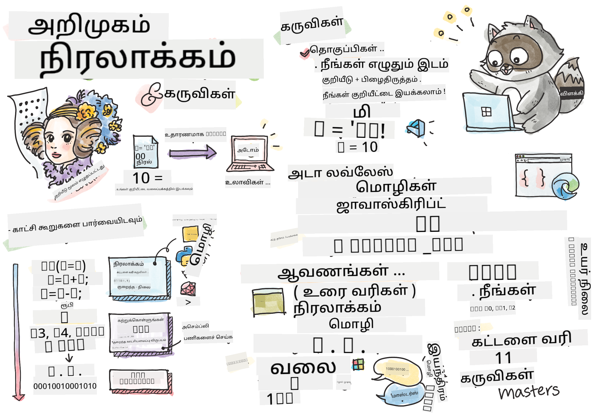

<!--
CO_OP_TRANSLATOR_METADATA:
{
  "original_hash": "2581528206a2a01c3a0b9c88e039b7bc",
  "translation_date": "2025-10-11T11:48:47+00:00",
  "source_file": "1-getting-started-lessons/1-intro-to-programming-languages/README.md",
  "language_code": "ta"
}
-->
# நிரலாக்க மொழிகள் மற்றும் தொழில்முறை கருவிகள் அறிமுகம்

இந்த பாடத்தில் நிரலாக்க மொழிகளின் அடிப்படைகளைப் பற்றி கற்றுக்கொள்வீர்கள். இங்கு உள்ள தலைப்புகள் இன்று பெரும்பாலான நவீன நிரலாக்க மொழிகளுக்கு பொருந்தும். 'தொழில்முறை கருவிகள்' பகுதியில், ஒரு டெவலப்பராக உங்களுக்கு உதவக்கூடிய பயனுள்ள மென்பொருளைப் பற்றி கற்றுக்கொள்வீர்கள்.


> [Tomomi Imura](https://twitter.com/girlie_mac) உருவாக்கிய ஸ்கெட்ச்

## முன்-பாடம் வினாடி வினா
[முன்-பாடம் வினாடி வினா](https://forms.office.com/r/dru4TE0U9n?origin=lprLink)

## அறிமுகம்

இந்த பாடத்தில் நாம் கற்றுக்கொள்ளப்போகிறவை:

- நிரலாக்கம் என்றால் என்ன?
- நிரலாக்க மொழிகளின் வகைகள்
- ஒரு நிரலின் அடிப்படை கூறுகள்
- தொழில்முறை டெவலப்பருக்கான பயனுள்ள மென்பொருள் மற்றும் கருவிகள்

> இந்த பாடத்தை [Microsoft Learn](https://docs.microsoft.com/learn/modules/web-development-101/introduction-programming/?WT.mc_id=academic-77807-sagibbon) இல் கற்றுக்கொள்ளலாம்!

## நிரலாக்கம் என்றால் என்ன?

நிரலாக்கம் (குறியாக்கம் என்றும் அழைக்கப்படுகிறது) என்பது கணினி அல்லது மொபைல் சாதனத்திற்கு வழிகாட்டுதல்களை எழுதும் செயலாகும். இந்த வழிகாட்டுதல்களை ஒரு நிரலாக்க மொழியின் மூலம் எழுதுகிறோம், அதை சாதனம் புரிந்துகொள்கிறது. இந்த வழிகாட்டுதல்களின் தொகுப்புகள் *நிரல்*, *கணினி நிரல்*, *பயன்பாடு (அப்)*, மற்றும் *எக்ஸிக்யூட்டபிள்* போன்ற பல பிரபலமான பெயர்களால் அழைக்கப்படலாம்.

ஒரு *நிரல்* என்பது குறியீட்டுடன் எழுதப்பட்ட எதுவும் ஆகும்; வலைத்தளங்கள், விளையாட்டுகள், மற்றும் மொபைல் பயன்பாடுகள் அனைத்தும் நிரல்களே. குறியீடு எழுதாமல் ஒரு நிரலை உருவாக்குவது சாத்தியமாக இருந்தாலும், அடிப்படை தர்க்கம் சாதனத்தால் புரிந்துகொள்ளப்படுகிறது, அந்த தர்க்கம் பெரும்பாலும் குறியீட்டுடன் எழுதப்பட்டிருக்கும். ஒரு நிரல் *இயங்கும்* அல்லது *நடைமுறையாக்கும்* குறியீட்டை செயல்படுத்துகிறது. நீங்கள் இந்த பாடத்தை படிக்கும் சாதனம் உங்கள் திரையில் அதை அச்சிட ஒரு நிரலை இயக்குகிறது.

✅ சிறு ஆராய்ச்சி செய்யுங்கள்: உலகின் முதல் கணினி நிரலாக்கராக யார் கருதப்படுகிறார்கள்?

## நிரலாக்க மொழிகள்

நிரலாக்க மொழிகள் டெவலப்பர்களுக்கு ஒரு சாதனத்திற்கான வழிகாட்டுதல்களை எழுத உதவுகின்றன. சாதனங்கள் பைனரி (1கள் மற்றும் 0கள்) மட்டுமே புரிந்துகொள்ள முடியும், ஆனால் *பெரும்பாலான* டெவலப்பர்களுக்கு இது மிகவும் செயல்திறனான வழி அல்ல. நிரலாக்க மொழிகள் மனிதர்களுக்கும் கணினிகளுக்கும் இடையிலான தொடர்பு வாகனமாக செயல்படுகின்றன.

நிரலாக்க மொழிகள் பல வடிவங்களில் வருகின்றன மற்றும் பல நோக்கங்களுக்கு பயன்படலாம். உதாரணமாக, JavaScript முக்கியமாக வலை பயன்பாடுகளுக்கு பயன்படுத்தப்படுகிறது, ஆனால் Bash முக்கியமாக இயக்க முறைமைகளுக்கு பயன்படுத்தப்படுகிறது.

*குறைந்த நிலை மொழிகள்* சாதனத்திற்கு வழிகாட்டுதல்களை புரிந்துகொள்ள *உயர் நிலை மொழிகளுக்கு* விட குறைவான படிகளை தேவைப்படும். ஆனால், உயர் நிலை மொழிகள் பிரபலமாக இருப்பதற்கான காரணம் அவற்றின் வாசிக்கக்கூடிய தன்மை மற்றும் ஆதரவு. JavaScript ஒரு உயர் நிலை மொழியாக கருதப்படுகிறது.

கீழே உள்ள குறியீடு JavaScript மூலம் ஒரு உயர் நிலை மொழி மற்றும் ARM Assembly குறியீடு மூலம் ஒரு குறைந்த நிலை மொழி இடையேயான வேறுபாட்டை விளக்குகிறது.

```javascript
let number = 10
let n1 = 0, n2 = 1, nextTerm;

for (let i = 1; i <= number; i++) {
    console.log(n1);
    nextTerm = n1 + n2;
    n1 = n2;
    n2 = nextTerm;
}
```

```c
 area ascen,code,readonly
 entry
 code32
 adr r0,thumb+1
 bx r0
 code16
thumb
 mov r0,#00
 sub r0,r0,#01
 mov r1,#01
 mov r4,#10
 ldr r2,=0x40000000
back add r0,r1
 str r0,[r2]
 add r2,#04
 mov r3,r0
 mov r0,r1
 mov r1,r3
 sub r4,#01
 cmp r4,#00
 bne back
 end
```

நம்ப முடியவில்லை என்றாலும், *இவை இரண்டும் ஒரே செயல்பாட்டை செய்கின்றன*: 10 வரை Fibonacci வரிசையை அச்சிடுகிறது.

✅ Fibonacci வரிசை [வரையறுக்கப்பட்டுள்ளது](https://en.wikipedia.org/wiki/Fibonacci_number) 0 மற்றும் 1 இல் தொடங்கி, ஒவ்வொரு எண்ணும் அதன் முந்தைய இரண்டு எண்களின் கூட்டுத்தொகையாக இருக்கும் எண்ணுகளின் தொகுப்பாக. Fibonacci வரிசையை பின்பற்றும் முதல் 10 எண்கள் 0, 1, 1, 2, 3, 5, 8, 13, 21 மற்றும் 34 ஆகும்.

## ஒரு நிரலின் கூறுகள்

ஒரு நிரலில் உள்ள ஒற்றை வழிகாட்டுதல் *வாக்கியம்* என்று அழைக்கப்படுகிறது, இது வழக்கமாக ஒரு எழுத்து அல்லது வரி இடைவெளியுடன் முடிவடைகிறது அல்லது *முடிவடைகிறது*. ஒரு நிரல் முடிவடையும் முறை ஒவ்வொரு மொழியிலும் மாறுபடும்.

ஒரு நிரலில் உள்ள வாக்கியங்கள் வழிகாட்டுதல்களை செயல்படுத்த பயனரால் அல்லது வேறு இடத்திலிருந்து வழங்கப்படும் தரவினை சார்ந்திருக்கலாம். தரவுகள் ஒரு நிரலின் செயல்பாட்டை மாற்றக்கூடியவை, எனவே நிரலாக்க மொழிகள் தரவுகளை தற்காலிகமாக சேமிக்க ஒரு வழியை கொண்டுள்ளன, பின்னர் அதை பயன்படுத்த முடியும். இவை *மாறிகள்* என்று அழைக்கப்படுகின்றன. மாறிகள் ஒரு சாதனத்திற்கு அதன் நினைவகத்தில் தரவுகளை சேமிக்க வழிகாட்டும் வாக்கியங்கள். மாறிகள் கணிதத்தில் உள்ள மாறிகளுக்கு ஒத்ததாக உள்ளன, அவற்றுக்கு தனித்துவமான பெயர் இருக்கும், மேலும் அவற்றின் மதிப்பு காலத்திற்கேற்ப மாறக்கூடும்.

சில வாக்கியங்கள் சாதனத்தால் செயல்படுத்தப்படாமல் இருக்க வாய்ப்பு உள்ளது. இது பொதுவாக டெவலப்பரால் எழுதப்பட்ட போது திட்டமிட்டது அல்லது எதிர்பாராத பிழை ஏற்பட்டால் தவறாக இருக்கலாம். ஒரு பயன்பாட்டின் இந்த வகையான கட்டுப்பாடு அதை மேலும் வலுவானதாகவும் பராமரிக்கக்கூடியதாகவும் ஆக்குகிறது. பொதுவாக, இந்த கட்டுப்பாட்டு மாற்றங்கள் குறிப்பிட்ட நிலைமைகள் பூர்த்தி செய்யப்படும் போது நிகழ்கின்றன. ஒரு நிரல் இயங்கும் முறையை கட்டுப்படுத்த நவீன நிரலாக்கத்தில் பொதுவாக பயன்படுத்தப்படும் வாக்கியம் `if..else` வாக்கியம் ஆகும்.

✅ இந்த வகையான வாக்கியத்தை நீங்கள் அடுத்த பாடங்களில் மேலும் கற்றுக்கொள்வீர்கள்.

## தொழில்முறை கருவிகள்

[](https://youtube.com/watch?v=69WJeXGBdxg "Tools of the Trade")

> 🎥 மேலே உள்ள படத்தை கிளிக் செய்து கருவிகள் பற்றிய வீடியோவைப் பாருங்கள்

இந்த பகுதியில், உங்கள் தொழில்முறை டெவலப்பர் பயணத்தைத் தொடங்கும்போது உங்களுக்கு மிகவும் பயனுள்ளதாக இருக்கும் சில மென்பொருளைப் பற்றி கற்றுக்கொள்வீர்கள்.

**டெவலப்பிங் சூழல்** என்பது ஒரு டெவலப்பர் மென்பொருள் எழுதும்போது அடிக்கடி பயன்படுத்தும் தனித்துவமான கருவிகள் மற்றும் அம்சங்களின் தொகுப்பாகும். இந்த கருவிகள் ஒரு டெவலப்பரின் குறிப்பிட்ட தேவைகளுக்கு ஏற்ப தனிப்பயனாக்கப்பட்டுள்ளன, மேலும் அந்த டெவலப்பர் வேலை, தனிப்பட்ட திட்டங்கள் அல்லது வேறு நிரலாக்க மொழியைப் பயன்படுத்தும்போது முன்னுரிமைகளை மாற்றினால் மாறக்கூடும். டெவலப்பிங் சூழல்கள் அவற்றைப் பயன்படுத்தும் டெவலப்பர்களுக்கு ஒத்ததாகவே இருக்கும்.

### எடிட்டர்கள்

மென்பொருள் மேம்பாட்டிற்கான மிக முக்கியமான கருவிகளில் ஒன்று எடிட்டர் ஆகும். எடிட்டர்களில் நீங்கள் உங்கள் குறியீட்டை எழுதுகிறீர்கள், சில நேரங்களில் உங்கள் குறியீட்டை இயக்குகிறீர்கள்.

டெவலப்பர்கள் எடிட்டர்களை சில கூடுதல் காரணங்களுக்காக நம்புகிறார்கள்:

- *பிழை கண்டறிதல்* குறியீட்டின் பிழைகள் மற்றும் தவறுகளை வரி வரியாக கண்டறிய உதவுகிறது. சில எடிட்டர்கள் பிழை கண்டறிதல் திறன்களை கொண்டுள்ளன; அவற்றை குறிப்பிட்ட நிரலாக்க மொழிகளுக்கு தனிப்பயனாக்கி சேர்க்கலாம்.
- *சொற்தொடர் விளக்கமிடல்* குறியீட்டில் நிறங்கள் மற்றும் உரை வடிவமைப்புகளைச் சேர்க்கிறது, இது வாசிக்க எளிதாக இருக்கும். பெரும்பாலான எடிட்டர்கள் தனிப்பயனாக்கப்பட்ட சொற்தொடர் விளக்கமிடலை அனுமதிக்கின்றன.
- *நீட்டிப்புகள் மற்றும் ஒருங்கிணைப்புகள்* என்பது டெவலப்பர்களுக்கான சிறப்பு கருவிகள். இந்த கருவிகள் அடிப்படை எடிட்டரில் உள்ளடக்கமாக உருவாக்கப்படவில்லை. உதாரணமாக, பல டெவலப்பர்கள் தங்கள் குறியீட்டின் செயல்பாட்டை விளக்குவதற்காக ஆவணங்களை உருவாக்குகிறார்கள். அவர்கள் ஆவணத்தில் உள்ள தட்டச்சு பிழைகளை கண்டறிய உதவும் ஒரு எழுத்துப்பிழை சரிபார்ப்பு நீட்டிப்பை நிறுவலாம். பெரும்பாலான நீட்டிப்புகள் குறிப்பிட்ட எடிட்டரில் பயன்படுத்துவதற்காக உருவாக்கப்பட்டவை, மேலும் பெரும்பாலான எடிட்டர்கள் கிடைக்கக்கூடிய நீட்டிப்புகளைத் தேட ஒரு வழியுடன் வருகின்றன.
- *தனிப்பயனாக்கல்* டெவலப்பர்களுக்கு அவர்களின் தேவைகளுக்கு ஏற்ப தனித்துவமான டெவலப்பிங் சூழலை உருவாக்க உதவுகிறது. பெரும்பாலான எடிட்டர்கள் மிகவும் தனிப்பயனாக்கக்கூடியவை, மேலும் டெவலப்பர்கள் தனிப்பயனாக்கப்பட்ட நீட்டிப்புகளை உருவாக்க அனுமதிக்கலாம்.

#### பிரபலமான எடிட்டர்கள் மற்றும் வலை மேம்பாட்டு நீட்டிப்புகள்

- [Visual Studio Code](https://code.visualstudio.com/?WT.mc_id=academic-77807-sagibbon)
  - [Code Spell Checker](https://marketplace.visualstudio.com/items?itemName=streetsidesoftware.code-spell-checker)
  - [Live Share](https://marketplace.visualstudio.com/items?itemName=MS-vsliveshare.vsliveshare)
  - [Prettier - Code formatter](https://marketplace.visualstudio.com/items?itemName=esbenp.prettier-vscode)
- [Atom](https://atom.io/)
  - [spell-check](https://atom.io/packages/spell-check)
  - [teletype](https://atom.io/packages/teletype)
  - [atom-beautify](https://atom.io/packages/atom-beautify)
  
- [Sublimetext](https://www.sublimetext.com/)
  - [emmet](https://emmet.io/)
  - [SublimeLinter](http://www.sublimelinter.com/en/stable/)

### உலாவிகள்

மற்றொரு முக்கிய கருவி உலாவி ஆகும். வலை டெவலப்பர்கள் தங்கள் குறியீடு இணையத்தில் எப்படி இயங்குகிறது என்பதைப் பார்க்க உலாவியை நம்புகிறார்கள். இது எடிட்டரில் எழுதப்பட்ட HTML போன்ற ஒரு வலைப்பக்கத்தின் காட்சித் கூறுகளை காட்டுவதற்கும் பயன்படுத்தப்படுகிறது.

பல உலாவிகள் *டெவலப்பர் கருவிகள்* (DevTools) உடன் வருகின்றன, இது டெவலப்பர்களுக்கு தங்கள் பயன்பாட்டைப் பற்றிய முக்கியமான தகவல்களை சேகரிக்க மற்றும் பிடிக்க உதவும் பயனுள்ள அம்சங்கள் மற்றும் தகவல்களின் தொகுப்பாகும். உதாரணமாக: ஒரு வலைப்பக்கத்தில் பிழைகள் இருந்தால், அவை எப்போது ஏற்பட்டன என்பதை அறிய சில நேரங்களில் உதவியாக இருக்கும். உலாவியில் உள்ள DevTools இந்த தகவல்களைப் பிடிக்க அமைக்கப்படலாம்.

#### பிரபலமான உலாவிகள் மற்றும் DevTools

- [Edge](https://docs.microsoft.com/microsoft-edge/devtools-guide-chromium/?WT.mc_id=academic-77807-sagibbon)
- [Chrome](https://developers.google.com/web/tools/chrome-devtools/)
- [Firefox](https://developer.mozilla.org/docs/Tools)

### கட்டளை வரி கருவிகள்

சில டெவலப்பர்கள் தங்கள் தினசரி பணிகளுக்கு குறைவான கிராபிகல் காட்சியை விரும்புகிறார்கள், மேலும் கட்டளை வரியை நம்புகிறார்கள். குறியீடு எழுதுவது அதிக அளவிலான தட்டச்சை தேவைப்படுவதால், சில டெவலப்பர்கள் தங்கள் கீபோர்டில் உள்ள ஓட்டத்தை பாதிக்க விரும்பவில்லை. அவர்கள் டெஸ்க்டாப் விண்டோக்கள் இடையே மாற, வேறு கோப்புகளில் வேலை செய்ய, மற்றும் கருவிகளைப் பயன்படுத்த கீபோர்டு குறுக்குவழிகளைப் பயன்படுத்துவார்கள். பெரும்பாலான பணிகளை மவுஸ் மூலம் முடிக்கலாம், ஆனால் கட்டளை வரியைப் பயன்படுத்துவதன் ஒரு நன்மை என்னவென்றால், மவுஸ் மற்றும் கீபோர்டு இடையே மாறாமல் கட்டளை வரி கருவிகளைப் பயன்படுத்தி பலவற்றைச் செய்ய முடியும். கட்டளை வரியின் மற்றொரு நன்மை என்னவென்றால், அவை அமைக்கக்கூடியவை, மேலும் நீங்கள் தனிப்பயனாக்கப்பட்ட அமைப்பைச் சேமிக்க, பின்னர் அதை மாற்ற, மற்றும் பிற டெவலப்பிங் இயந்திரங்களில் இறக்குமதி செய்ய முடியும். டெவலப்பிங் சூழல்கள் ஒவ்வொரு டெவலப்பருக்கும் மிகவும் தனித்துவமானவை என்பதால், சிலர் கட்டளை வரியைத் தவிர்க்கலாம், சிலர் முழுமையாக அதைப் பயன்படுத்தலாம், மற்றும் சிலர் இரண்டின் கலவையை விரும்பலாம்.

### பிரபலமான கட்டளை வரி விருப்பங்கள்

கட்டளை வரி விருப்பங்கள் நீங்கள் பயன்படுத்தும் இயக்க முறைமையின் அடிப்படையில் மாறுபடும்.

*💻 = இயக்க முறைமையில் முன்பே நிறுவப்பட்டிருக்கும்.*

#### Windows

- [Powershell](https://docs.microsoft.com/powershell/scripting/overview?view=powershell-7/?WT.mc_id=academic-77807-sagibbon) 💻
- [Command Line](https://docs.microsoft.com/windows-server/administration/windows-commands/windows-commands/?WT.mc_id=academic-77807-sagibbon) (CMD என்றும் அழைக்கப்படுகிறது) 💻
- [Windows Terminal](https://docs.microsoft.com/windows/terminal/?WT.mc_id=academic-77807-sagibbon)
- [mintty](https://mintty.github.io/)
  
#### MacOS

- [Terminal](https://support.apple.com/guide/terminal/open-or-quit-terminal-apd5265185d-f365-44cb-8b09-71a064a42125/mac) 💻
- [iTerm](https://iterm2.com/)
- [Powershell](https://docs.microsoft.com/powershell/scripting/install/installing-powershell-core-on-macos?view=powershell-7/?WT.mc_id=academic-77807-sagibbon)

#### Linux

- [Bash](https://www.gnu.org/software/bash/manual/html_node/index.html) 💻
- [KDE Konsole](https://docs.kde.org/trunk5/en/konsole/konsole/index.html)
- [Powershell](https://docs.microsoft.com/powershell/scripting/install/installing-powershell-core-on-linux?view=powershell-7/?WT.mc_id=academic-77807-sagibbon)

#### பிரபலமான கட்டளை வரி கருவிகள்

- [Git](https://git-scm.com/) (💻 பெரும்பாலான இயக்க முறைமைகளில்)
- [NPM](https://www.npmjs.com/)
- [Yarn](https://classic.yarnpkg.com/en/docs/cli/)

### ஆவணங்கள்

ஒரு டெவலப்பர் புதிய ஒன்றை கற்றுக்கொள்ள விரும்பும்போது, அவர்கள் அதை எப்படி பயன்படுத்துவது என்பதை கற்றுக்கொள்ள ஆவணங்களைப் பார்க்க அதிகமாக விரும்புவார்கள். டெவலப்பர்கள் கருவிகள் மற்றும் மொழிகளை சரியாக பயன்படுத்த வழிகாட்டவும், மேலும் அவை எப்படி செயல்படுகிறது என்பதை ஆழமாக அறியவும் ஆவணங்களை நம்புகிறார்கள்.

#### வலை மேம்பாட்டிற்கான பிரபலமான ஆவணங்கள்

- [Mozilla Developer Network (MDN)](https://developer.mozilla.org/docs/Web), Mozilla, [Firefox](https://www.mozilla.org/firefox/) உலாவியை வெளியிடுபவர்கள்
- [Frontend Masters](https://frontendmasters.com/learn/)
- [Web.dev](https://web.dev), Google, [Chrome](https://www.google.com/chrome/) உலாவியை வெளியிடுபவர்கள்
- [Microsoft's own developer docs](https://docs.microsoft.com/microsoft-edge/#microsoft-edge-for-developers), [Microsoft Edge](https://www.microsoft.com/edge) க்கான ஆவணங்கள்
- [W3 Schools](https://www.w3schools.com/where_to_start.asp)

✅ சிறு ஆராய்ச்சி செய்யுங்கள்: ஒரு வலை டெவலப்பரின் சூழலை ஒரு வலை வடிவமைப்பாளரின் சூழலுடன் ஒப்பிட்டு மாறுபாடுகளை கண்டறியுங்கள்.

---

## 🚀 சவால்

சில நிரலாக்க மொழிகளை ஒப்பிடுங்கள். JavaScript மற்றும் Java இன் தனித்துவமான அம்சங்கள் என்ன? COBOL மற்றும் Go பற்றி என்ன?

## பாடத்திற்குப் பிந்தைய வினாடி வினா
[பாடத்திற்குப் பிந்தைய வினாடி வினா](https://ff-quizzes.netlify.app/web/)

## மதிப்பீடு மற்றும் சுயபயிற்சி

நிரலாக்கத்திற்கான பல மொழிகள் பற்றிய சிறு ஆராய்ச்சி செய்யுங்கள். ஒரு மொழியில் ஒரு வரியை எழுத முயற்சிக்கவும், பின்னர் அதை மற்ற இரண்டு மொழிகளில் மறுபதிவு செய்யவும். நீங்கள் என்ன கற்றுக்கொண்டீர்கள்?

## பணிக்கட்டளை

[ஆவணங்களைப் படித்தல்](assignment.md)

> குறிப்பு: உங்கள் பணிக்கட்டளைக்கான கருவிகளைத் தேர்ந்தெடுக்கும் போது, மேலே பட்டியலிட

---

**குறிப்பு**:  
இந்த ஆவணம் [Co-op Translator](https://github.com/Azure/co-op-translator) என்ற AI மொழிபெயர்ப்பு சேவையை பயன்படுத்தி மொழிபெயர்க்கப்பட்டுள்ளது. எங்கள் நோக்கம் துல்லியமாக இருக்க வேண்டும் என்பதுதான், ஆனால் தானியங்கி மொழிபெயர்ப்புகளில் பிழைகள் அல்லது துல்லியமின்மைகள் இருக்கக்கூடும் என்பதை தயவுசெய்து கவனத்தில் கொள்ளவும். அதன் தாய்மொழியில் உள்ள மூல ஆவணம் அதிகாரப்பூர்வ ஆதாரமாக கருதப்பட வேண்டும். முக்கியமான தகவல்களுக்கு, தொழில்முறை மனித மொழிபெயர்ப்பு பரிந்துரைக்கப்படுகிறது. இந்த மொழிபெயர்ப்பைப் பயன்படுத்துவதால் ஏற்படும் எந்த தவறான புரிதல்கள் அல்லது தவறான விளக்கங்களுக்கு நாங்கள் பொறுப்பல்ல.