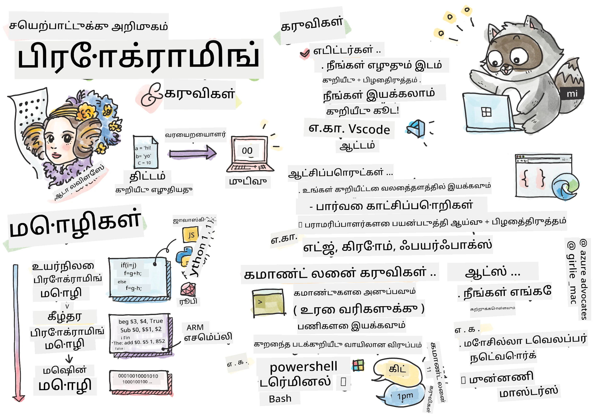
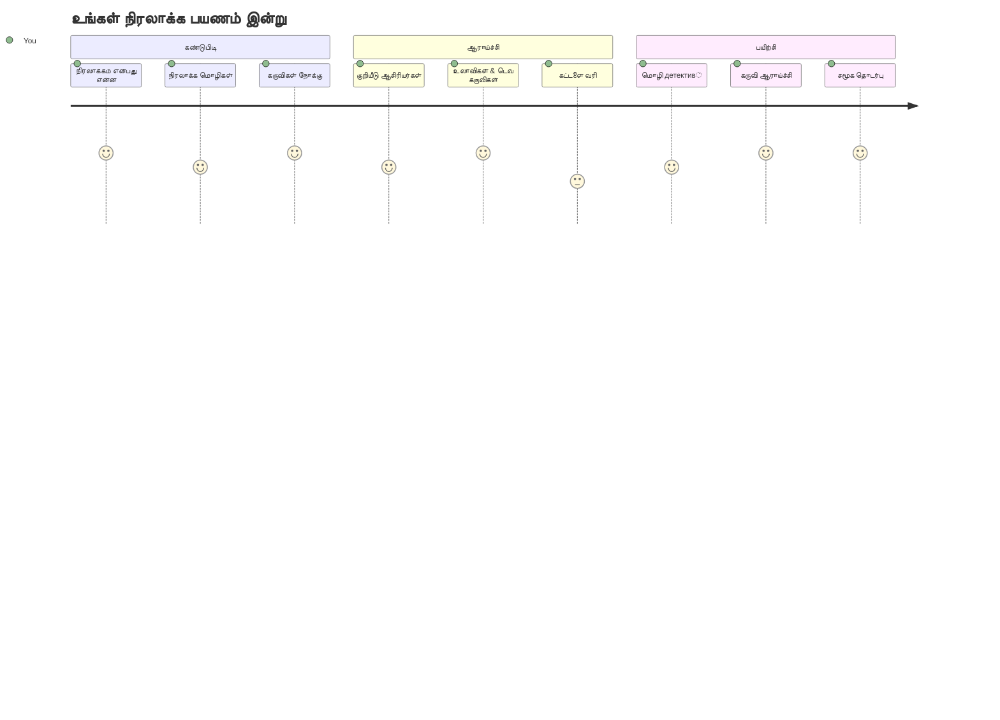
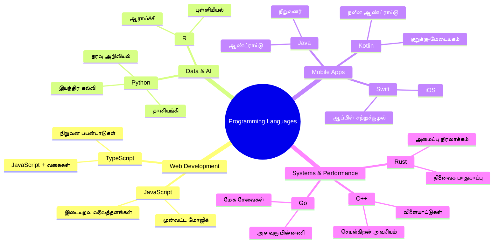
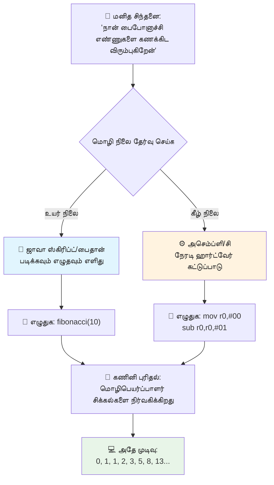
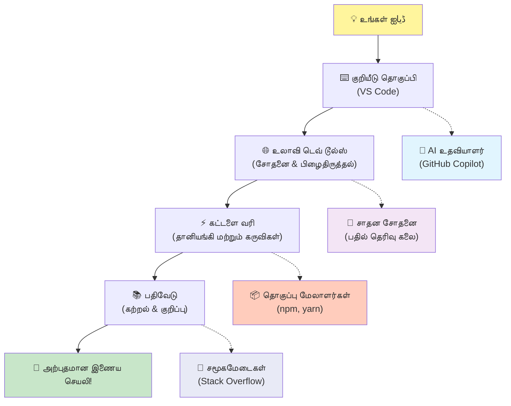
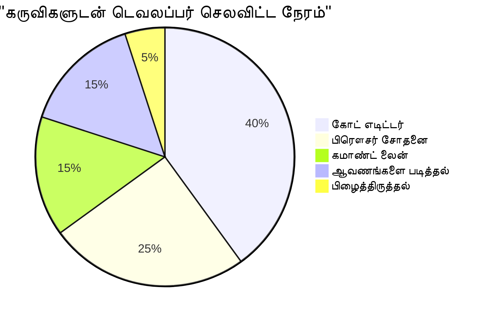
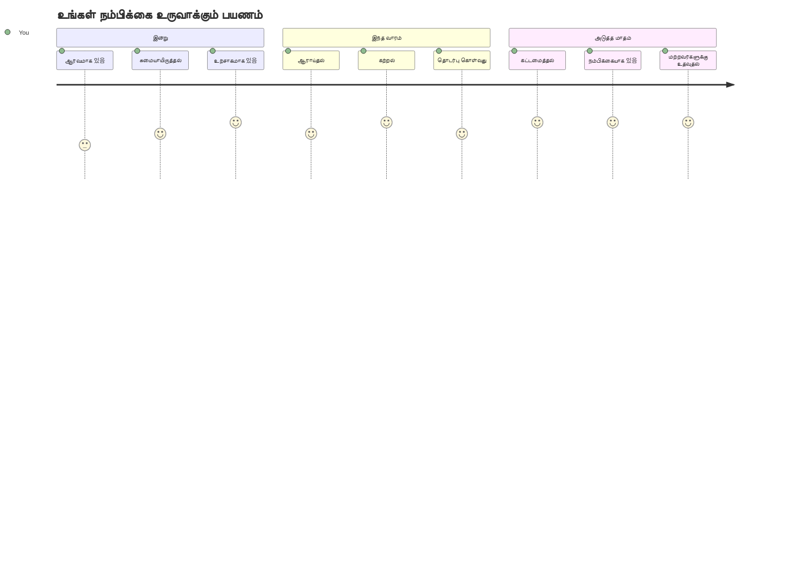

# ծրագրավորման լեզուներ மற்றும் நவீன டெவலப்பர் கருவிகள் அறிமுகம்

வணக்கம், எதிர்கால டெவலப்பர்! 👋 நான் உனக்கு ஒரு விஷயம் சொல்லலாமா, அது ஒவ்வொரு நாளும் என்னை குளிர்ச்சியடைய வைத்துக் கொள்கிறது? நீ பிரோகிராமிங் கணினிகளுக்கே மட்டும் සීමிதப்படுவதில்லை என்று கண்டுபிடிக்கப் போகிறாய் – இது உன் கற்பனையான எண்ணங்களை உயிரோட்டம் கொடுக்கும் உண்மையான சூப்பர்பவர் சக்திகளைப் பெறுவதாகும்!

உனக்கு பிடித்த ஆப் பயன்படுத்தும் போது எல்லாமே சரியாக திகழும் அந்த தருணம் நீ அறிந்திருக்கிறாயா? ஒரு பொத்தானை தட்டினால் எதுவோ அதிசயமானது நடக்கிறது, அது “வாவ், அவர்கள் இது எப்படி செய்தார்கள்?” என்று உனக்கு மிகுந்த வியப்பு தரும் நேரம். அந்த கதை உனக்கும் போன்ற ஒருவரால் எழுதப்பட்டது – அவருடைய பிடித்த காபி கடையில் இரவு 2 மணிக்கு, மூன்றாவது எஸ்பிரெசோ உடன் இருந்தே – அந்த மாயத்தை உருவாக்கிய கோட். இங்கே உன் மனதை அதிர வைத்துக் கொண்டாடும் விஷயம் என்னவென்றால்: இந்த பாட முடிந்தவுடன், அவர்கள் எப்படி செய்தார்கள் என்பதை புரிந்துகொள்ள மட்டும் இல்லாமல், நீயும் அதை செய்ப்பதற்கு உற்சாகமாக இருப்பாய்!

புரியாய், இப்போது பிரோகிராமிங் கஷ்டமாக தோன்றினாலும் நான் முழுமையாக புரிகிறேன். நான் தொடங்கியபோது, நிச்சயம் கணிதம் வாய்ந்த ஜீனியஸ் அல்லது 5 வயதில் இருந்து கோடிங் செய்து கொண்டதான் என்று நினைத்தேன். ஆனால் என்னை மாற்றிய விஷயம் என்னவென்றால்: பிரோகிராமிங் என்பது புதிய ஒரு மொழியில் உரையாடல்களை கற்றுக்கொள்வது போன்றது. "ஹலோ" மற்றும் "நன்றி" என்பதிலிருந்து தொடங்கி, காபி ஆர்டர் செய்யும் அளவுக்கு வளர்ந்து, அதன் பிறகு ஆழமான தத்துவ உரையாடல்கள் நடக்கும்! இதுவே கூறத்தக்கது, உனக்கு கணினிகளுடன் உரையாடல்கள் நடத்துகிறாய் என்பது, அவர்கள் மிக பொறுமையான உரையாடல் தோழர்கள் – எப்போதும் உன் பிழைகளை மதிப்பிடாது, மீண்டும் முயற்சி செய்ய ஆவலுடன் இருக்கும்!

இன்று நம்மால் நவீன வலை மேம்பாட்டை சாத்தியமாகக்காட்டும் அற்புதமான கருவிகளை ஆராயப்போகிறோம். நான் சொல்வது Netflix, Spotify மற்றும் உன் பிடித்த சுயாதீன ஆப் நிறுவனம் பயன்படுத்தும் அதே பதிப்பகங்கள், உலாவிகள் மற்றும் பணியூக்கிகள். இதோ உனக்கு மகிழ்ச்சியான செய்தி: இந்த தொழில்முறை தரமான கருவிகள் பெரும்பாலும் இலவசமாக கிடைக்கின்றன!


> சுருக்கோட்டை [Tomomi Imura](https://twitter.com/girlie_mac) அவர்களால்


```mermaid
journey
    title உங்கள் நிரலாக்க பயணம் இன்று
    section கண்டுபிடி
      நிரலாக்கம் என்பது என்ன: 5: You
      நிரலாக்க மொழிகள்: 4: You
      கருவிகள் நோக்கு: 5: You
    section ஆராய்ச்சி
      குறியீடு ஆசிரியர்கள்: 4: You
      உலாவிகள் & டெவ் கருவிகள்: 5: You
      கட்டளை வரி: 3: You
    section பயிற்சி
      மொழி детектив்: 4: You
      கருவி ஆராய்ச்சி: 5: You
      சமூக தொடர்பு: 5: You
```
## நீ இவ்வளவு தான் எதைக் கற்றிருக்குகிறாய் என்பதைப் பார்க்கலாம்!

களவி எடுத்துப் பார்க்கும் முன், நான் ஆர்வமாக இருக்கிறேன் – இந்த பிரோகிராமிங் உலகத்தில் நீ முன்னதாக என்ன அறிவு கொண்டிருக்கிறாய்? இது பற்றி ஒன்றும் தெரியவில்லை என்று நினைத்தால் அதுவே சரி, அது சரியான இடம்! இந்த வினாடி வினா ஆனது உடற்பயிற்சி முன்னர் உடல்களை வளைக்கும் போல – நாம் சில நிமிடங்கள் வளர்ந்து கொண்டே இருக்கிறோம்!

[முன் பாட வினாடி வினா எடு](https://ff-quizzes.netlify.app/web/)

## நம்மால் ஒன்றாக செல்லப்போகும் பயணம்

சரி, இன்று நாம் ஆராயப்போகும் விஷயங்களை பற்றி நான் உண்மையாய் ஆர்வமுடன் இருக்கிறேன்! உண்மையைச் சொல்ல, இந்த சில கருத்துக்கள் உனக்கு புரியும்போது உன் முகத்தை நான் காண விரும்புகிறேன். இங்கே நம்மால் சேர்ந்து செய்யப்போகும் அற்புதமான பயணம்:

- **பிரோகிராமிங் என்றால் என்ன (அது ஏன் மிகவும் சமரசமானது!)** – கோடு என்பது உன் சுற்றிலும் இருக்கும் அனைத்திற்கும் அசாதாரண மாயம் என்பதை நாம் கண்டுபிடிக்கப்போவது, அது எப்படி திங்கள் காலை என்று அறிவதைக் காட்டிலும் நுண்ணறிவு கொண்ட அலாரம் இருக்கும், கடைசியில் Netflix பரிந்துரைகளை சரியாக தேர்ந்தெடுக்கும் ஆல்கொரிதம்
- **பிரோகிராமிங் மொழிகள் மற்றும் அவற்றின் அற்புதமான தனித்துவங்கள்** – ஒவ்வொரு நபரும் வெவ்வேறு சூப்பர்பவர் திறமைகளும் பிரச்சினைகள் தீர்ப்பும் வழிகளும் கொண்டிருக்கின்ற நிகழ்ச்சியில் செல்வது போன்றது. அப்படித்தான் பிரோகிராமிங் மொழிகளில் உன்னை சந்திக்கப்போகிறாய்!
- **டிஜிட்டல் மாயம் உருவாக்கும் அடிப்படை கட்டடக்கட்டிகள்** – இதைப் புத்தக வண்ண LEGO அமைப்பாக நினைத்து கொள். இந்த துண்டுகள் எப்படி ஒன்று சேர்ந்தால், உன் கற்பனை கனவாகும் எல்லாவற்றையும் உருவாக்க முடியும் என்று உணர்வாய்
- **உனக்கு ஒரு வழிபாட்டு குச்சியை வழங்கும் தொழில்முறை கருவிகள்** – நான் மிக அதிகமாகச் சொல்லவில்லை – இவை உனக்கு சூப்பர்பவர் சக்தி சூட்டும் உணர்வைப் புதுப்பிக்கும், மிகச் சிறந்தது என்னவென்றால்? இவை அஞ்சல்காரர்கள் பயன்படுத்தும் தான்!

> 💡 **இதுதான் முக்கியமாகும்**: இன்றைய தினம் எல்லாவற்றையும் நினைவில் வைக்க முயற்சிக்காதே! இப்போது, என்னை உன் மனதில் ஒரு ஆர்வத்தை எரிய வைத்து விட விரும்புகிறேன். விவரங்கள் தானாகவே நம்முடன் பயிற்சி செய்யும்போது பதியிடும் – அதுதான் உண்மையான கற்றல்!

> உன் நிறுவலில் இந்த பாடத்தை [Microsoft Learn](https://learn.microsoft.com/en-us/learn/modules/web-development-101/introduction-programming/?WT.mc_id=academic-77807-sagibbon) இல் எடுக்க முடியும்!

## அப்படியானால், பிரோகிராமிங் *என்ன*?

சரி, இந்த நூற்றுக்கணக்கான கேள்வியை நாம் எதிர்கொள்ளலாம்: பிரோகிராமிங் என்பது உண்மையில் என்ன?

நான் உனக்கு ஒரு கதையை சொல்ல போகிறேன், அது என் பார்வையை முழுமையாக மாற்றி விட்டது. கடந்த வாரம், நான் என் அன்னைக்கு எங்கள் புதிய ஸ்மார்ட் டிவி ரிமோட்டை எப்படி பயன்படுத்துவது என்று விளக்க முயற்சித்தேன். நான் சொன்னதை கவனிங்க: "சிவப்பு பொத்தானைக் அழுத்து, ஆனால் பெரிய சிவப்பு பொத்தானைக் குழப்பப்படாதே, இடது பக்கத்தில் உள்ள சிறிய சிவப்பு பொத்தானை அழுத்து... இல்லை, அதிந்தான் பதிலாக உன் மற்ற இடது பக்கம்... சமரசமா, இரண்டு விநாடிகள் பிடிக்கக் கவனிக்கவும், ஒன்று அல்ல, மூன்று அல்ல..." இது உனக்கு பரிச்சயமா? 😅

இதுதான் பிரோகிராமிங்! இது மிகவும் சக்திவாய்ந்த ஒன்றுக்கு மிகவும் விரிவான, படிப்படியாகத் திருப்திப்படுத்தும் அறிவுறுத்தல்களை வழங்கும் கலை. ஆனால் உன் அன்னைக்கு (யார் "யாரது சிவப்பு பொத்தானா?!" என்று கேட்கலாம்) விளக்குவதற்குப் பதிலாக, நீ கணினிக்கு அர்த்தம் கூறுகிறாய் (அது உன் சொன்னதை தான் செய்யும், உன் அர்த்தம் இல்லாவிட்டாலும் கூட).

நான் முதலில் இது கற்றிருக்கும்போது என்னை அதிரவைத்தது என்னவென்றால்: கணினிகள் அடிப்படையில் மிகவும் எளிமையானவை. அவை மூலமாக இரண்டு விஷயங்களை மட்டுமே புரிந்து கொள்கின்றன – 1 மற்றும் 0, அதாவது "ஆம்" மற்றும் "இல்லை" அல்லது "இயக்கு" மற்றும் "நிறுத்து." அதுவே! ஆனால் இங்கே இது மாயமாக்கும் – நம்மிடம் 1களிலும் 0களிலும் பேச்சு சொல்ல தேவையில்லை போல்ஸ் The Matrixலுள்ள போல. அதுவே **பிரோகிராமிங் மொழிகள்** உதவும் காப்புக்காப்பு. அவைகள் எப்படி என்பதை உலகிலேயே சிறந்த மொழிபெயர்ப்பாளர் போல, உன் மனிதரான எண்ணங்களை கணினி மொழியாக மாற்றுகின்றன.

இப்போதும் என்னை வார்த்தைகளுக்கு வியப்புக்கு உட்படுத்துகிறது, ஒவ்வொரு காலை எழுந்ததிலும்: உன் வாழ்க்கையின் அனைத்தும் டிஜிட்டல் என்று நினைத்தால், ஒருவன் உங்க போலவே, கம்பளிப்புடை அணிந்து, காபி கிண்ணம் வைத்துக் கொண்டு, தனது லேப்டாப்பில் கோட் தட்டியது. அந்த Instagram ஃபில்டர் உன் தோற்றத்தை அழகாக காட்டும்? அதற்குப் பின்னால் ஒருவன் கோட் எழுதினார். உன் புதிய பிடித்த பாடலை பரிந்துரைத்த ஆல்கொரிதம்? ஒரு டெவலப்பர் அதை உருவாக்கினான். இரவு உணவுக்கு பில்ல்கள் பிரிக்க உதவும் ஆப்? ஆம், ஒருவன் "இது வருத்தமாக இருக்கிறது, நான் இதை சரிசெய்ய முடியும்" என்று நினைத்து, பிறகு செய்துவிட்டான்!

நீ பிரோகிராம் கற்றுக்கொண்டால், நீ ஒரு புதிய திறன் கற்கப்போகிறாய் அல்ல – நீ இந்த அற்புதமான பிரச்சினை தீர்க்கும் சமூகத்தில் சேர்ந்துவிடுகிறாய், எப்படி என்றால் அவர்கள் தினமும் சிந்திக்கின்றனர்: "யாருடைய நாளை சிறிது மேம்படுத்த ஏதேனும் ஒன்றை உருவாக்கலாமா?" உண்மையான விஷயம் என்னவென்றால், அதைவிட ஆர்வமுள்ளதாக உள்ளதா?

✅ **ரசியான தகவல்**: உனக்கு ஓரளவு நேரம் கிடைத்தால் இதை ஆராய்க்க - உலகின் முதல் கணினி நிரல்பெற்றவர் யார் என நினைக்கிறாய்? நான் உனக்கு ஒரு கூற்று தருகிறேன்: அது நீ எதிர்பார்க்கும் நபர் ஆக இருக்காது! இவரின் கதையின் பின்னணி மிக நற்பெயர், அது நிரல்பெற்றல் என்றால் எல்லாம் சிந்தனையற்ற சிக்கல்களை எளிதாக்குவதற்கான கலை என்றும் காட்டுகிறது.

### 🧠 **எப்படி இருக்கிறாய் என்பதை சரிபார்க்கலாம்**

**ஒரு நிமிடம் எடுத்துக் கொள்ளு:**
- “கணினிகளுக்குத் புகுத்தல் அளிக்கும்” எண்ணம் இப்போது உனக்கு புரிகிறதா?
- நாளாந்த செயல்களை இப்போது பிரோகிராமிங் மூலம் தானாகச் செய்ய விரும்புகிறாயா?
- இந்த முழு பிரோகிராமிங் காரியத்தில் உனக்கு எந்த கேள்விகள் எழுந்துள்ளன?

> **நினைவில் வைக்கவும்**: சில கருத்துகள் இப்போது குழப்பமடையக் கூடும், அது இயல்பானது. புதிய மொழி கற்றுக்கொள்ளும் போல், உன் மூளை அந்த நியூரல் பாதைகளை அமைக்க நேரம் எடுக்கிறது. நீ நன்றாக செய்கிறாய்!

## பிரோகிராமிங் மொழிகள் என்பது வித்தியாசமான மாயங்களின் வகைகளுக்கு ஒப்பானவை

சரி, இது ஒருவேளை அவ்வளவு சாதாரணமாக இருக்காது, ஆனால் என்னுடன் இரு – பிரோகிராமிங் மொழிகள் வித்தியாசமான இசை வகைகளுக்கு மிகவும் சமமானவை. ஜாஸ் என்றால் மென்மையான, உடனடி இசை; ராக் என்றால் சக்திவாய்ந்த மற்றும் நேரடி; கிளாசிக்கல் என்றால் அழகான மற்றும் கட்டமைக்கப்பட்ட; ஹிப்-ஆப் என்பது படைப்பாற்றல் மிக்க மற்றும் வெளிப்படையானது. ஒவ்வொரு பாணி தனிப்பட்ட அதிர்வெண், அதனுடைய ஆர்வமுள்ள ரசிகர்கள், மற்றும் அவை வேறு-வேறு மனநிலைகள் மற்றும் நிகழ்ச்சிகளுக்கு சிறப்பாக பொருந்தும்.

பிரோகிராமிங் மொழிகளும் அதுபோல செயல்படுகின்றன! நீ பொழுதுபோக்கு கைப்பேசி விளையாட்டை உருவாக்க JavaScript பாவிப்பதால், பெரிய அளவிலான வானிலை தரவு சுருக்க Python பயன்படுத்துவாய் – அதேபோல், யோகா வகுப்பில் டெத் மெட்டல் இசை அரங்கேற்றமில்லை (அதுவும் பெரும்பாலான யோகா வகுப்புகளில்! 😄).

ஆனால் என்னை ஆச்சரியப்படுத்துவது என்னவெனில்: இந்த மொழிகள் உலகிலேயே மிகவும் பொறுமையான மற்றும் ஆகாய மொழிபெயர்ப்பாளர்கள் போல உனக்கு அருகில் இருப்பார்கள். உன் எண்ணங்களை மனித மூளைக்கு இயலாமல் மாதிரி வெளிப்படுத்திக் கொள்ளலாம், அவர்கள் அதை 1களிலும் 0களிலும் மாற்றி கணினிகள் புரிந்துகொள்ளும் மொழி சாத்தியமாக்கும். இது போலி நண்பர் இருக்கிறான், ”மனித படைப்பாற்றல்” மற்றும் ”கணினி காரியக்கட்டளை” ரீதியாக மிக சரியான மொழிபெயர்ப்பாளர் – அவன் எப்போதும் சோரவில்லை, காபி இடைவேளைகள் எடுத்துக் கொள்ளவில்லை, ஒரே கேள்வியை இருமுறை கேட்கும் போது எப்போதும் உன்னை மதிப்பில்லை!

### பிரபலமான பிரோகிராமிங் மொழிகள் மற்றும் அவற்றின் பயன்பாடுகள்


```mermaid
mindmap
  root((Programming Languages))
    Web Development
      JavaScript
        முன்‌வட்ட மோஜிக்
        இடையுறவு வலைத்தளங்கள்
      TypeScript
        JavaScript + வகைகள்
        நிறுவன பயன்பாடுகள்
    Data & AI
      Python
        தரவு அறிவியல்
        இயந்திர கல்வி
        தானியங்கி
      R
        புள்ளியியல்
        ஆராய்ச்சி
    Mobile Apps
      Java
        ஆண்ட்ராய்டு
        நிறுவனர்
      Swift
        iOS
        ஆப்பிள் சுற்றுச்சூழல்
      Kotlin
        நவீன ஆண்ட்ராய்டு
        குறுக்கு-மேடையகம்
    Systems & Performance
      C++
        விளையாட்டுகள்
        செயல்திறன் அவசியம்
      Rust
        நினைவக பாதுகாப்பு
        அமைப்பு நிரலாக்கம்
      Go
        மேக சேவைகள்
        அளவுரு பின்னணி
```
| மொழி | சிறந்தவை | ஏன் பிரபலமா? |
|----------|----------|------------------|
| **JavaScript** | வலை மேம்பாடு, பயனர் இடைமுகங்கள் | உலாவிகளில் இயங்கி, தொடர்புடைய வலைத்தளங்களை இயக்குகிறது |
| **Python** | தரவு அறிவியல், தானாகச் செயல்பாடு, AI | படிப்பதற்கு எளிதானது, சக்திவாய்ந்த நூலகங்கள் |
| **Java** | நிறுவன பயன்பாடுகள், ஆண்ட்ராய್ಡ್ ஆப்கள் | தளம்-தனிப்பட்டது அல்ல, பெரிய அமைப்புகளுக்கு வலுவானது |
| **C#** | விண்டோஸ் பயன்பாடுகள், விளையாட்டு மேம்பாடு | Microsoft சூழல் உறுதிப்படுத்தல் சக்திவாய்ந்தது |
| **Go** | மேக சேவைகள், பின்புற அமைப்புகள் | விரைவு, எளிமையானது, நவீன கணினியில் வடிவமைக்கப்பட்டது |

### உயர் நிலை மற்றும் குறைந்த நிலை மொழிகள்

சரி, இது உண்மையில் என்னுடைய மூளை முற்றிலும் உடைத்த கருத்து, நான் முதலில் கற்றுக் கொண்ட போது, எனவே இதை விளக்கும் ஒப்புமை என்னை மிகவும் புரிந்து வைக்க வைத்தது – இது உனக்கும் உதவும் என்று நம்புகிறேன்!

நீ சமூகத்தில் வருகை தந்தாய் என்று நினைத்து, அங்குள்ள மொழியை பேச தெரியாது மற்றும் அருகிலுள்ள கழுவறையை கண்டுபிடிக்க அவசியமுடையாய் (நான், நீ, நமக்கு இது தெரியும், இல்லையா? 😅):

- **குறைந்த நிலை programming** என்பது அந்த நாட்டின் பாட்டி விளைவிய பழக்கவழக்கங்களையும் உள்ளே உள்ள நகைச்சுவைகளையும், உள்ளூர் சொற்களை பயன்படுத்தி பழுப்பு பழக்கவழக்கமாக உரையாடியபோல. இது மிக்க திறமையானதும் மிகச்செயல்திறன் வாய்ந்ததும்... ஆனால் நீ அங்கு பழக்கம் இல்லாவிடில் இது சிரமமாய் இருக்கும்! கழுவறை தேடும் போது மிகவும் கடினம்.

- **உயர் நிலை programming** என்பது அந்த அற்புதமான உள்ளூர் நண்பர் போல, நீ “நான் கழுவறை தேவை” என்று ஆங்கிலத்தில் சொன்னால், அவர் நீக்கத்தை மொழிபெயர்த்து, உனக்கு விளங்கும் முறையில் வழிகாட்டுவார்.

பிரோகிராமிங் வழக்கில்:
- **குறைந்த நிலை மொழிகள்** (Assembly அல்லது C போன்றவை) உனக்கு கம்ப்யூட்டர் ஹார்ட்வேர் உடனான மிகவும் விரிவான உரையாடல்களை அனுமதிக்கின்றன, ஆனால் அது இயந்திரத்தைத்தே மாதிரி சிந்திக்க வேண்டும், அது... மனதில் பெரிய மாற்றம்!
- **உயர் நிலை மொழிகள்** (JavaScript, Python, C# போன்றவை) நீ ஒரு மனிதர் போல சிந்திக்கலாம், அவர்கள் பின்னணியில் இயந்திர மொழியை கவனிப்பார்கள். கூடுதலாக, இவை புதியவர்களாக இருந்த காலத்தை நினைத்துக் கொண்டு உதவ தயாரான மக்களையும் கொண்டிருக்கின்றனர்!

எதைத் தொடங்க நான் உனக்கு பரிந்துரைக்கிறேன் என்றால்? 😉 உயர் நிலை மொழிகள் பழுதுபார்க்காமல், பயணத்தைக் கூடுதல் சந்தோஷமாக உருவாக்கும் வைத்து பயிற்சி வுக்குக் காட்டுகிற குதிரைகள் போல!


```mermaid
flowchart TB
    A["👤 மனித சிந்தனை:<br/>'நான் பைபோனாச்சி எண்ணுகளை கணக்கிட விரும்புகிறேன்'"] --> B{மொழி நிலை தேர்வு செய்க}
    
    B -->|உயர் நிலை| C["🌟 ஜாவா ஸ்கிரிப்ட்/பைதான்<br/>படிக்கவும் எழுதவும் எளிது"]
    B -->|கீழ் நிலை| D["⚙️ அசெம்ப்ளி/சி<br/>நேரடி ஹார்ட்வேர் கட்டுப்பாடு"]
    
    C --> E["📝 எழுதுக: fibonacci(10)"]
    D --> F["📝 எழுதுக: mov r0,#00<br/>sub r0,r0,#01"]
    
    E --> G["🤖 கணினி புரிதல்:<br/>மொழிபெயர்ப்பாளர் சிக்கல்களை நிர்வகிக்கிறது"]
    F --> G
    
    G --> H["💻 அதே முடிவு:<br/>0, 1, 1, 2, 3, 5, 8, 13..."]
    
    style C fill:#e1f5fe
    style D fill:#fff3e0
    style H fill:#e8f5e8
```
### நான் உனக்கு ஏன் உயர் நிலை மொழிகள் ஃபிரெண்ட்லி என்பதை காட்ட விரும்புகிறேன்

சரி, நான் உனக்கு ஒரு நுணுக்கத்தை చూపப்போகிறேன், அது என்னிக்கு உயர் நிலை மொழிகளை காதலிக்க வைத்தது, ஆனால் முன்னர் உனக்கு ஓர் வோய்ப்பாக கோடீடு பார்க்கும் போது பதறவிட்டு விடாதே என்று உறுதியளிக்கவேண்டும். அது குறும்படமா தெரி க்க ஒதுக்கம் – நான் அதைச் சொல்ல விருப்பது அதுவே!

நாம் ஒரே பணி எழுதப்படும் இரண்டு முறையும் பார்க்கப்போகிறோம். இரண்டு முறையும் \Fibonacci வரிசையை உருவாக்கும் – இது ஒரு அழகான கணித முறை, ஒவ்வொரு எண் கடந்த இரண்டு எண்களின் கூட்டுதான்: 0, 1, 1, 2, 3, 5, 8, 13... (சிறந்த விஷயம்: இந்த முறை இயற்கையிலேயே எதுவும்! சூரியகாந்தி விதைகள் சுழற்சிகள், பைன்கோன் வடிவங்கள், விண்மீன் கூட்டம் உருவாக்கும் வழி!)

வெறுமனே விலை பார்க்க தயாரா? போ!

**உயர் நிலை மொழி (JavaScript) – மனிதர் நட்பு:**

```javascript
// படி 1: அடிப்படை ஃபிபொனாச்சி அமைப்பு
const fibonacciCount = 10;
let current = 0;
let next = 1;

console.log('Fibonacci sequence:');
```

**இந்த கோடு என்ன செய்கிறது:**
- **ஒரு நிரந்தரத்தை அறிவிக்கிறது** எத்தனை Fibonacci எண்கள் உருவாக்கவேண்டும் என்று குறிப்பிட
- **இரு மாறிலிகளை தொடங்குகிறது** வரிசை இல் தற்போதைய மற்றும் அடுத்த எண்களை கண்காணிக்க
- **தொடக்க மதிப்புகளை அமைக்கிறது** (0 மற்றும் 1) Fibonacci முறை குறிக்க
- **தலைப்பு செய்தியைப் பதிவு செய்கிறது** எங்களின் வெளியீட்டை துல்லியமாக காட்ட

```javascript
// படி 2: ஒரு வளைவுடன் தொடர் உருவாக்கவும்
for (let i = 0; i < fibonacciCount; i++) {
  console.log(`Position ${i + 1}: ${current}`);
  
  // தொடரில் அடுத்த எண்ணை கணக்கிடுக
  const sum = current + next;
  current = next;
  next = sum;
}
```

**இங்கு நடந்ததை உடைத்துப்போம்:**
- **ஒரு for வட்டாரத்தில் லூப்** செய்கிறது வரிசையின் ஒவ்வொரு இடத்திலும்
- **ஒவ்வொரு எண்ணையும் அதன் இடத்துடன்** மாதிரிமொழி வடிவத்தில் காட்டுகிறது
- **அடுத்த Fibonacci எண்ணைக் கணக்கிடுதல்** தற்போதைய மற்றும் அடுத்த மதிப்புகளை கூட்டியது
- **எங்கள் கண்காணிப்பு மாறிலிகளை புதுப்பித்தல்** அடுத்த சுற்றுக்கு நகர

```javascript
// படி 3: நவீன செயல்பாட்டு அணுகுமுறை
const generateFibonacci = (count) => {
  const sequence = [0, 1];
  
  for (let i = 2; i < count; i++) {
    sequence[i] = sequence[i - 1] + sequence[i - 2];
  }
  
  return sequence;
};

// பயன்பாட்டு உதாரணம்
const fibSequence = generateFibonacci(10);
console.log(fibSequence);
```

**மேலே, நாம்:**
- **ஆக்ஷன் செயல் எழுத்து (arrow function) பயன்படுத்தி** மீண்டும் பயன்படுத்தக்கூடிய ஒரு செயல்பாட்டைப் படைத்தோம்
- **ஒரு வரிசையை கட்டமைத்தோம்** முழு வரிசையை சேமிக்க ஒவ்வொன்றும் காட்டாமல்
- **வரிசை இட குறிச்சியை பயன்படுத்தி** முன்னொரு மதிப்புகளிலிருந்து ஒவ்வொரு புதிய எண்ணையும் கணக்கிட்டோம்
- **முழு வரிசையை திரும்ப வழங்கினோம்** மற்ற பகுதிகளில் உபயோகிக்க பாவனையளவில்

**குறைந்த நிலை மொழி (ARM Assembly) – கணினி நட்பு:**

```assembly
 area ascen,code,readonly
 entry
 code32
 adr r0,thumb+1
 bx r0
 code16
thumb
 mov r0,#00
 sub r0,r0,#01
 mov r1,#01
 mov r4,#10
 ldr r2,=0x40000000
back add r0,r1
 str r0,[r2]
 add r2,#04
 mov r3,r0
 mov r0,r1
 mov r1,r3
 sub r4,#01
 cmp r4,#00
 bne back
 end
```

JavaScript பதிப்பு ஆங்கிலக் கட்டளைகளாக வாசிக்கப்படுவது போல் இருக்கிறது, Assembly பதிப்பு கூர்மையான கட்டளைகளைக் கொண்டுள்ளது, நேரடியாக கணினி கம்ப்யூட்டர் செயல்பாட்டைக் கட்டுப்படுத்துகிறது. இரண்டு பதிப்பும் ஒரே பணியைச் செய்து முடிக்கின்றன, ஆனால் உயர் நிலை மொழி மனிதர்களுக்கு புரிந்து கொள்ளவும், எழுதவும், பராமரிக்கவும் எளிதானது.

**நீ கவனம் செலுத்த வேண்டிய முக்கிய வேறுபாடுகள்:**
- **ஓத்துக்குறிப்பாக**: ஜாவாஸ்கிரிப்ட் `fibonacciCount` போன்ற விளக்கமான பெயர்களைப் பயன்படுத்துகிறது, ஆனால் அசெம்பிளி `r0`, `r1` போன்ற கடுமையான லேபிள்களைப் பயன்படுத்துகிறது
- **கருத்துக்கள்**: மேம்பட்ட மொழிகள் குறியீட்டை தானாகவே ஆவணப்படுத்தும் விளக்கமான கருத்துக்களை ஊக்குவிக்கின்றன
- **கட்டமைப்பு**: ஜாவாஸ்கிரிப்டின் தர்க்கமான ஓட்டம் மனிதர்கள் பிரச்சனைகளை படிநிலையில் சிந்திக்கும் முறையைப் பின்பற்றுகின்றது
- **பராமரிப்பு**: வெவ்வேறு தேவைகளுக்காக ஜாவாஸ்கிரிப்ட் பதிப்பை புதுப்பிப்பது நேர்மையானதும் தெளிவானதும் ஆகும்

✅ **பிபோனாச்சி தொடர் பற்றி**: இந்த அற்புதமான எண்கள் உட்படிவம் (ஒவ்வொரு எண் அதற்கு முன் இரண்டும் கூட்டுத்தொகைக்கு சமம்: 0, 1, 1, 2, 3, 5, 8...) இயற்கையில் உண்மையில் *எங்கும்* காணப்படுகிறது! நீங்கள் இதை சூரியகாந்தி சுழற்சிகளில், சவென்கிளியின் தட்டுத்தளங்களில், நாட்டிலஸ் சிப்பற்களின் வளைவும், மர கிளைகளின் வளர்ச்சியிலும் காணமுடியும். கணிதமும் குறியீட்டும் இயற்கையின் அழகை உருவாக்க பயன்படுத்தப்படும் கோட்பாடுகளை புரிந்து கொள்ள உதவுவது உண்மையில் அற்புதமானது!

## மாயத்தை உருவாக்கும் கட்டுமானக் கூறுகள்

சரி, இப்போது நீங்கள் செயல்பாட்டில் காணும் நிரலாக்க மொழிகள் எப்படி இருக்கின்றன என்பது தெரிந்துள்ளதால், எழுதிய ஒவ்வொரு நிரலும் கொண்ட அடிப்படைக் கூறுகளை விரிவாகப் பார்ப்போம். இதை உங்கள் பிடித்த சமையல் உணவுக் குறிப்பின் அவசியமான பொருட்களாகக் கருதி, ஒவ்வொரு கூறும் என்ன செய்யும் என்பதைக் கற்றுக் கொண்டால் நீங்கள் ஏதாவது ஒரு மொழியிலோ பதிப்பிக்க முடியும்!

இது நிரலாக்கத்தின் வாக்கியக்கட்டமைப்பைப் போன்றது. பள்ளியில் பெயர்ச்சொற்கள், செயற்கூறுகள் மற்றும் வாக்கியங்களை எப்படி அமைப்பது என்று கற்றுக்கொண்டதை நினைவாக்குங்கள். நிரலாக்கத்துக்கும் அதற்கான தனி வகை வாக்கியக்கட்டமைப்பு உள்ளது, ஆனாலும் அது ஆங்கில வாக்கியக்கட்டமைப்பைவிட மிகவும் தர்க்கமானதும் பரிபாலனமிக்கதுமாக உள்ளது! 😄

### வாக்கியங்கள்: படிநிலை படிநிலையில் வழிமுறைகள்

**வாக்கியங்களுடன்** நாம் தொடங்குவோம் – இவை உங்கள் கணினியுடன் உள்ள உரையாடலில் தனித்தனியாக ஒரு வாக்கியம் போல் இருக்கும். ஒவ்வொரு வாக்கியமும் கணினிக்கு ஒரு குறிப்பிட்ட காரியத்தைச் செய்யச் சொல்கிறது, அது “இங்குக் கைம derecha திருப்பு”, “சிவப்பு விளக்கு அருகே நிறுத்து”, “அந்த இடத்தில் வாகனம் நிறுத்து” என்று வழிமுறைகளை தருவது போல்.

வாக்கியங்களின் வாசிப்புத் திறனை நான் விரும்புவது என்னவென்றால், அவை பெரும்பாலும் எளிதில் புரிந்துகொள்ளக்கூடியவை என்பதே ஆகும். இதைப் பாருங்கள்:

```javascript
// ஒற்றை செயல்களைச் செய்யும் அடிப்படைக் கூற்றுகள்
const userName = "Alex";                    
console.log("Hello, world!");              
const sum = 5 + 3;                         
```

**இந்தக் குறியீடு என்ன செய்யிறது:**
- பயனரின் பெயரைச் சேமிக்க ஒரு மாறி (constant) உருவாக்குகிறது
- கன்சோலில் ஒரு வரவேற்பு செய்தியை காட்டுகிறது
- கணித செயல்பாட்டின் முடிவை கணக்கிட்டு சேமிக்கிறது

```javascript
// வலைப்பக்கங்களுடன் தொடர்பு கொள்ளும் பிரகடனங்கள்
document.title = "My Awesome Website";      
document.body.style.backgroundColor = "lightblue";
```

**அடிக்கடி, இதோ என்ன நடக்கிறது:**
- உலாவி தாவல் பகுதியில் தோன்றும் பக்கத்தைத் தோற்ற தலைப்பு மாற்றுகிறது
- முழு பக்கத்தின் பின்னணி வண்ணத்தை மாற்றுகிறது

### மாறிகள்: உங்கள் நிரலின் நினைவகம்

சரி, **மாறிகள்** உண்மையில் நான் பிடிப்பதன் காரணம் அவை நீங்கள் தினமும் பயன்படுத்தும் விஷயங்களுடன் மிகவும் இணக்கமானவை என்பதுதான்!

உங்கள் தொலைபேசி தொலைபேசி எண்ணுக் பட்டியலை நினைவில் கொள்ளுங்கள். எல்லா எண்ணையும் நினைவில் வைக்க மாட்டீர்கள் – பின் நீங்கள் “அம்மா”, “அதிக நண்பர்”, அல்லது “இரவு 2 மணிவரை வழங்கும் பீஸா இடம்” என்று சேமிக்கிறீர்கள், உங்கள் கைபேசி அந்த எண்ணுகளை நினைக்கிறது. மாறிகள் அதேபோல் செய்கின்றன! அவை உங்கள் நிரலில் தரவை ஒரு பொருத்தமான பெயரால் சேமித்து பின்னர் அதை எளிதாக அணுக பயன்படுகின்றன.

இதோ சரியானது என்னவென்றால்: மாறிகள் உங்கள் நிரல் இயங்கும் போது மாறுபடக்கூடியவை (ஆகவே “மாறி” என்று பெயர்!). நீங்கள் புதிதாக கண்டுபிடித்த சில விஷயங்களுக்கு முன்பிருந்த பீஸா இடத்தை மாற்றுவது போல, மாறிகளும் புதுப்பிக்கப்படலாம்!

இதன் எளிமையைக் காட்டுகிறேன்:

```javascript
// படி 1: அடிப்படைக் மாறிலிகளை உருவாக்குதல்
const siteName = "Weather Dashboard";        
let currentWeather = "sunny";               
let temperature = 75;                       
let isRaining = false;                      
```

**இந்தக் குறிப்புகளைப் புரிந்து கொள்ள:**
- `const` மாறிகளில் மாறாத மதிப்புக்களை சேமி (பக்க தகவல் போன்றவை)
- நிரலின் இயங்கும் போது மாறக்கூடிய மதிப்புகளுக்கு `let` பயன்படுத்து
- வெவ்வேறு தரவுத் தரவுப் பிரிவுகளை ஒதுக்கு: வெரைப் (உரை), எண்கள், உண்மை/பொய் (Boolean)
- ஒவ்வொரு மாறியும் என்ன கொண்டிருப்பதென்பதை விளக்கும் விளக்கமான பெயர்களைத் தேர்ந்தெடு

```javascript
// படி 2: தொடர்புடைய தரவுகளை குழுவாக ஒருங்கிணைக்க பொருட்களுடன் வேலை செய்யுதல்
const weatherData = {                       
  location: "San Francisco",
  humidity: 65,
  windSpeed: 12
};
```

**மேலே, நாம்:**
- தொடர்புடைய வானிலைத் தகவல் ஒன்றை ஒழுங்குபடுத்த ஒரு பொருளை உருவாக்கியுள்ளோம்
- பல தரவுகளை ஒரே மாறி பெயரின் கீழ் ஒழுங்குபடுத்தியுள்ளோம்
- ஒவ்வொரு தரவும் தெளிவாக அடையாளப்படுத்தக் கூடிய முக்கிய-மதிப்பு ஜோடிகள் பயன்படுத்தியுள்ளோம்

```javascript
// படி 3: மாறிலிகளை பயன்படுத்துதல் மற்றும் புதுப்பித்தல்
console.log(`${siteName}: Today is ${currentWeather} and ${temperature}°F`);
console.log(`Wind speed: ${weatherData.windSpeed} mph`);

// மாற்றக்கூடிய மாறிலிகளை புதுப்பித்தல்
currentWeather = "cloudy";                  
temperature = 68;                          
```

**ஒவ்வொரு பகுதியையும் புரிந்து கொள்வோம்:**
- `${}` வடிவமைப்போடு கூடிய வார்ப்புரு வரிகளைக் கொண்டு தகவலைத் திரையில் காண்பி
- பொருள் பண்புகளை புள்ளி குறியீட்டுடன் அணுகு (`weatherData.windSpeed`)
- மாறக்கூடிய நிலைகளை பிரதிபலிக்க `let` மூலம் அறிவிக்கப்பட்ட மாறிகளை புதுப்பி
- பல மாறிகளை இணைத்து பொருள் புரிவான தகவல்களை உருவாக்கு

```javascript
// படி 4: சுத்தமான குறியீட்டிற்கான நவீன அழிப்பு
const { location, humidity } = weatherData; 
console.log(`${location} humidity: ${humidity}%`);
```

**நீங்கள் அறிந்திருக்க வேண்டியது:**
- விஷயங்களை விநியோகிக்க (destructuring assignment) வைத்து குறிப்பிட்ட பண்புகளை எடுத்துக்கொள்
- பொருள் விசைகளின் பெயர்களுடன் புதிய மாறிகளை தானாக உருவாக்கு
- புள்ளி குறியீட்டை மீண்டும் மீண்டும் பயன்படுத்தாமலும் குறியீட்டை எளிமையாக்கு

### கட்டுப்பாட்டு ஓட்டம்: உங்கள் நிரலை சிந்திக்க கற்றுவி

சரி, இங்கு நிரலாக்கம் மெய்ப்பற்றி அற்புதமாகிறது! **கட்டுப்பாட்டு ஓட்டம்** என்பது உங்கள் நிரல் நுண்ணறிவு முடிவுகளை எடுக்க எப்படி கற்றுக்கொள்ளும் என்பதே ஆகும், நீங்கள் தினமும் எண்ணாமலேயே செய்யும் அதேபோல.

செல்லும்போது நீங்கள் இதைச் செய்யலாம் என்று நினைத்துக் கொள்ளுங்கள்: “மழை பெய்தால் குடை எடுத்துச் செல்கிறேன், குளிராக இருந்தால் ஜாக்கெட்டை அணிவேன், தாமதமாக இருந்தால் காலை உணவு போதாது, வழி நடத்தும் எடுத்து காபி குடிப்பேன்.” உங்கள் மூளை இயற்கையாகவே இது போன்ற `if`-`then` தர்க்கத்தைக் தொடர்கிறது!

இது நிரல்களை அறிவாற்றல் கொண்டவை மற்றும் உயிருள்ளவையாக உணரச் செய்கிறது, சாதாரண, சிலமான ஸ்கிரிப்ட் பின்பற்றுவதில்லை. அவை நிலையைப் பார்வையிட்டு மதிப்பாய்வு செய்து சரியான முறையில் பதிலளிக்கிறது. இது உங்கள் நிரலுக்கு ஏற்பாடுகளை செய்து முடிவெடுக்கும் மூளை அளிக்கும் காட்சியாகும்!

எவ்வாறு நன்றாக செயல்படுகிறது என பார்க்க விரும்புகிறீரா? இதோ எனது உதாரணம்:

```javascript
// படி 1: அடிப்படை நிபந்தனை தர்க்கம்
const userAge = 17;

if (userAge >= 18) {
  console.log("You can vote!");
} else {
  const yearsToWait = 18 - userAge;
  console.log(`You'll be able to vote in ${yearsToWait} year(s).`);
}
```

**இந்தக் குறியீடு என்ன செய்கிறது:**
- பயனர் வயது வாக்குப்பதிவு தகுதியைக் கணக்கிடு
- நிலை முடிவின் அடிப்படையில் வெவ்வேறு குறியீடு பகுதிகளைக் இயக்கு
- 18 வயதிற்க்கும் கீழ் இருந்தால் வாக்குப்பதிவு தகுதி வரும் வரை நேரத்தைக் கணக்கிடு மற்றும் காட்டு
- ஒவ்வொரு சூழ்நிலைக்கும் தெளிவான மற்றும் பயனுள்ள கருத்துக்களைக் கொடு

```javascript
// படி 2: நியாய செயலிகள் உடன் பல நிலைகள்
const userAge = 17;
const hasPermission = true;

if (userAge >= 18 && hasPermission) {
  console.log("Access granted: You can enter the venue.");
} else if (userAge >= 16) {
  console.log("You need parent permission to enter.");
} else {
  console.log("Sorry, you must be at least 16 years old.");
}
```

**இங்கே என்ன நடக்கிறது:**
- பல நிபந்தனைகளை `&&` (மற்றும்) இயங்கியுடன் இணைக்கும்
- பல சூழ்நிலைகளுக்காக `else if` பயன்படுத்தி நிபந்தனைகளின் அடுக்கமைப்பை உருவாக்கு
- இறுதியில் அனைத்து நிலைகளையும் கையாள `else` பிரிவை வை
- வெவ்வேறு சூழ்நிலைகளுக்கு தெளிவான மற்றும் செயல்படக்கூடிய கருத்துக்களை வழங்கு

```javascript
// படி 3: முக்கோண இயக்கி உடன் சுருக்கமான நிபந்தனை
const votingStatus = userAge >= 18 ? "Can vote" : "Cannot vote yet";
console.log(`Status: ${votingStatus}`);
```

**நீங்கள் நினைவில் வைத்துக் கொள்ள வேண்டும்:**
- எளிய இரண்டு தேர்வு நிலைகளுக்கு ternary ஆபரேட்டர் (`? :`) பயன்படுத்தவும்
- முதலில் நிபந்தனை எழுது, பிறகு `?`, அப்பொழுது உண்மை விளைவாக, பிறகு `:`, பிறகு பொய் விளைவாக
- நிபந்தனைகளுக்கு அடிப்படையாக மதிப்புகளை ஒதுக்குகையில் இந்த மாதிரியை பயன்படுத்தவும்

```javascript
// படி 4: பல குறிப்பிட்ட சூழல்களை கையாளுதல்
const dayOfWeek = "Tuesday";

switch (dayOfWeek) {
  case "Monday":
  case "Tuesday":
  case "Wednesday":
  case "Thursday":
  case "Friday":
    console.log("It's a weekday - time to work!");
    break;
  case "Saturday":
  case "Sunday":
    console.log("It's the weekend - time to relax!");
    break;
  default:
    console.log("Invalid day of the week");
}
```

**இந்தக் குறியீடு செய்யும் செயல்கள்:**
- பல குறிப்பிட்ட நிலைகளுக்கு மாறியின் மதிப்பை பொருத்து
- ஒற்றையான நிலைகளை ஒருங்கிணைக்க (சனிக்கிழமை வியாழன் விடுமுறை) தொகுப்பாக்கு
- பொருந்தும் நிரல் பகுதியை இயக்கு
- எதிர்பாராத மதிப்புகளை கையாள `default` நிலையை வை
- அடுத்த நிலையுக்குச் செல்லாமல் நிறுத்த `break` கருத்துக்களை பயன்படுத்து

> 💡 **உலகளாவிய ஒப்புமை**: கட்டுப்பாட்டு ஓட்டத்தை உலகின் மிகவும் பொறுமையான GPS வழித்தடம் அளிப்பது போல நினைத்துக் கொள். அது “மெயின் சாலையில் போக்குவரத்து இருந்தால், மாற்று சாலையைப் போ” அல்லது “அக்கரையை தடுக்கும் பொழுதில் ஊதியம் வழியை முயற்சி செய்” என்று கூறும். நிரல்கள் இதே விதமாக பல நிலைகளை நுண்ணறிவுடன் பிரிந்து பாவனையாளர்களுக்கு சிறந்த அனுபவத்தை தர உதவுகிறது.

### 🎯 **அரிய அறிவு சோதனை: கட்டுமானக் கூறுகளில் தேர்ச்சி**

**அடிப்படைகளைப் பற்றி உங்கள் நிலை:**
- உங்கள் சொற்களால் மாறியும் வாக்கியமும் வேறுபாடு என்ன என்று கூற முடியுமா?
- நிபந்தனை (if-then) தீர்மானத்தை பயன்படுத்தும் ஒரு உண்மையான நிகழ்வைக் கூறுங்கள் (எமது வாக்குப்பதிவு உதாரணம் போல)
- நிரலாக்கக் கருத்தில் என்ன ஒன்று உங்களை ஆச்சரியப்படுத்தியது?

**விவேகத்தை மேம்படுத்தும் குறுகிய முனைவு:**

```mermaid
flowchart LR
    A["📝 அறிக்கைகள்<br/>(கிரியைகள்)"] --> B["📦 மாறிகள்<br/>(சேமிப்பு)"] --> C["🔀 கட்டுப்பாட்டு ஓற்று<br/>(தீர்மானங்கள்)"] --> D["🎉 வேலை செய்கிற ப்ரோக்ராம்!"]
    
    style A fill:#ffeb3b
    style B fill:#4caf50
    style C fill:#2196f3
    style D fill:#ff4081
```
✅ **அடுத்ததாக என்ன வருகிறது**: இந்த அற்புதமான பயணத்தில் இந்தக் கருத்துகளை ஆழமாகக் கற்றுக்கொள்ள நாம் கிளம்பப்போகிறோம்! இப்போது, உங்களுள் உள்ள இந்த ஆச்சரியத்தையும் ஆர்வத்தையும் கவனத்துடன் உணருங்கள். குறிப்பிட்ட திறன்களும் நுட்பங்களும் இயல்பாகத் தோன்றும் என நாங்கள் உங்களுடன் பயிற்சி தொடர்கிறோம் – இது எதிர்பாராதவாறு மிக சக்திவாய்ந்த விளையாட்டாக இருக்கும்!

## தொழில்நுட்ப கருவிகள்

சரி, இந்தப் பகுதி உண்மையில் எனக்கு மிகவும் உற்சாகத்தை தருகிறது! 🚀 இப்போது நாங்கள் உங்கள் கையில் டிஜிட்டல் விண்கலம் இயக்க முக்கிய கருவிகள் பற்றி பேசப்போகிறோம்.

ஒரு சமையல்காரருக்கு தங்களுடைய கை விரல்கள் போல செம்மையான கத்திகள் இருப்பது போலவே உங்களுக்கு சிறந்த கருவிகள் இருக்கின்றன. அல்லது இசைக்கலைஞர் தொடும் கணத்தில் பாடும் கிட்டார் போலவே. நிஜத்தில் உங்களுக்கு விலைபிடித்த முயற்சியில் சமர்ப்பிக்கப் பட்ட AI கற்றுக் கொடுக்கும் உதவியாளர்கள், Wi-Fi ஐ கொண்டு எங்கிருந்தும் முழு செயலிகளை உருவாக்கும் மேக சூழல்கள், X-கதிர்வீச்சுப் பார்வை போன்ற தீவிரமான பிழைதிருத்த கருவிகள் இவற்றை எல்லாம் உங்களுக்கு கொண்டு வருகிறோம்.

இவை "ஆரம்பக் கருவிகள்" அல்ல என்று நினைத்திருப்பீர்கள்; இது Google, Netflix மற்றும் உங்கள் விரும்பும் indie செயலி நிறுவனங்கள் பயன்படுத்தும் தொழில்முறை கருவிகள் தான். இவற்றைப் பயன்படுத்தி நீங்கள் நிஜமாகவே திறமையானவனாக இருப்பீர்கள்!


```mermaid
graph TD
    A["💡 உங்கள் ஐڈیا"] --> B["⌨️ குறியீடு தொகுப்பி<br/>(VS Code)"] 
    B --> C["🌐 உலாவி டெவ் டூல்ஸ்<br/>(சோதனை & பிழைதிருத்தல்)"]
    C --> D["⚡ கட்டளை வரி<br/>(தானியங்கி மற்றும் கருவிகள்)"]
    D --> E["📚 பதிவேடு<br/>(கற்றல் & குறிப்பு)"]
    E --> F["🚀 அற்புதமான இணைய செயலி!"]
    
    B -.-> G["🤖 AI உதவியாளர்<br/>(GitHub Copilot)"]
    C -.-> H["📱 சாதன சோதனை<br/>(பதில் தெரிவு கலை)"]
    D -.-> I["📦 தொகுப்பு மேலாளர்கள்<br/>(npm, yarn)"]
    E -.-> J["👥 சமூகமேடைகள்<br/>(Stack Overflow)"]
    
    style A fill:#fff59d
    style F fill:#c8e6c9
    style G fill:#e1f5fe
    style H fill:#f3e5f5
    style I fill:#ffccbc
    style J fill:#e8eaf6
```
### குறியீடு ஆசிரியர்கள் மற்றும் IDEகள்: உங்கள் புதிய டிஜிட்டல் நண்பர்கள்

குறியீடு ஆசிரியர்கள் பற்றி பேசுவோம் – இவை உங்கள் புதிய பிடித்த இடங்களாக மாறும்! இவை உங்கள் தனிப்பட்ட குறியீடு அதிபதிகளாகும், இங்கே நீங்கள் பெரும்பாலான நேரத்தை உலகற்ற பணிகளை உருவாக்கியும் முழுமையாக பளபளப்பாக்கியும் செலவிடுவீர்கள்.

இன்றைய ஆசிரியர்களின் அற்புதம் என்னவெனில், அவை வெறும் உரை ஆசிரியர்கள் அல்ல. அவை 24/7 நீங்கள் அருகில் இருப்பது போன்ற பிரகாசமான, ஆதரவு தரும் குறியீட்டு பயிற்றுவிப்பாளர்களாகும். நீங்கள் பிழை எழுதுவதற்கு முன் அவை கண்டுபிடித்து காட்சிப்படுத்துகின்றன, புத்தாக்கங்களை பரிந்துரைக்கின்றன, ஒவ்வொரு குறியீடும் என்ன செய்கிறது என்பதைக் கூறுகின்றன, அதைத் தொடர்ந்து என்ன எழுதப்போகிறீர்கள் என்று முன்கூட்டியே கூறி உதவுகின்றன!

நான் முதலில் தானாக-முழுமையை கண்டுபிடித்த போது, நான் எதிர்காலத்தில் வாழ்கிறேன் என்று உணர்ந்தேன். நீங்கள் ஒன்றை தட்டச்சு ஆரம்பிக்கையில், ஆசிரியர் கேட்கிறது: "இந்த செயல்பாடு உங்களுக்கு தேவைப்படுவது அல்லவா?" அது ஒரு மன வாசகராய் இருப்பதைப்போல்!

**இந்த ஆசிரியர்களை அற்புதமாக்கும் அம்சங்கள்:**

நவீன குறியீடு ஆசிரியர்கள் வேலை திறனை அதிகரிப்பதற்கான வலிமையான அம்சங்களை வழங்குகின்றன:

| அம்சம் | என்ன செய்கிறது | உதவும் காரணம் |
|---------|--------------|--------------|
| **நடவடிக்கை வண்ணமயம்செய்தல்** | உங்கள் குறியீட்டின் வெவ்வேறு பகுதிகளை வண்ணமயமாக்குகிறது | குறியீட்டை எளிதாக வாசிக்கவும் பிழைகளை அடையாளம் காணவும் உதவும் |
| **தானாக முழுமை** | நீங்கள் தட்டச்சு செய்யும்போது குறியீட்டை முன்மொழிகிறது | குறியீடு வேகத்தை அதிகரிக்கவும் பிழைகள் குறைக்கவும் உதவும் |
| **பிழைத்திருத்த கருவிகள்** | பிழைகளை கண்டறிந்து சரி செய்ய உதவும் |ப் சில மணி நேரங்களைச் சேமிக்க உதவும் |
| **உதவிக்கூறுகள்** | சிறப்பு அம்சங்களை சேர்க்கலாம் | உங்கள் ஆசிரியரை தொழில்நுட்பத் தேவைகளுக்கு ஏற்றார் படுத்தவும் |
| **AI உதவியாளர்கள்** | குறியீடு மற்றும் விளக்கங்களைச் சுட்டிக்காட்டுகின்றன | கற்றல் மற்றும் வேலை திறனை விரைவுபடுத்துகின்றன |

> 🎥 **காணொளி ஆதாரம்**: இந்த கருவிகளை செயல்பாட்டில் காண விரும்பினால், [Tools of the Trade video](https://youtube.com/watch?v=69WJeXGBdxg) ஐப் பாருங்கள்.

#### இணையத் தயாரிப்பாளர்களுக்கு பரிந்துரைக்கப்பட்ட ஆசிரியர்கள்

**[Visual Studio Code](https://code.visualstudio.com/?WT.mc_id=academic-77807-sagibbon)** (இலவசம்)
- இணைய வளர்ப்பாளர்களுக்கு மிகவும் பிரபலம்
- சிறந்த விரிவாக்க சுற்றுச்சூழல்
- உள்ளமைந்த டெர்மினல் மற்றும் Git ஒருங்கைப்பு
- **அவசியமான விரிவாக்கங்கள்**:
  - [GitHub Copilot](https://marketplace.visualstudio.com/items?itemName=GitHub.copilot) - AI இயக்கிய குறியீட்டு பரிந்துரைகள்
  - [Live Share](https://marketplace.visualstudio.com/items?itemName=MS-vsliveshare.vsliveshare) - நேரடி ஒத்துழைப்பு
  - [Prettier](https://marketplace.visualstudio.com/items?itemName=esbenp.prettier-vscode) - தானாக குறியீட்டை வடிவமைத்தல்
  - [Code Spell Checker](https://marketplace.visualstudio.com/items?itemName=streetsidesoftware.code-spell-checker) - குறியீட்டிலுள்ள எழுத்துப்பிழைகள் அடையாளம் காண்பது

**[JetBrains WebStorm](https://www.jetbrains.com/webstorm/)** (கம்பளங்கள், மாணவர்களுக்கு இலவசம்)
- மேம்பட்ட பிழைத்திருத்த மற்றும் சோதனை கருவிகள்
- அறிவார்ந்த குறியீட்டு முழுமை
- உள்ளமைந்த பதிப்பு கட்டுப்பாடு

**மேகக் கூட்டமைப்பு IDEகள்** (விலை திசை)
- [GitHub Codespaces](https://github.com/features/codespaces) - உலாவியில் முழு VS Code
- [Replit](https://replit.com/) - குறியீடு கற்றல் மற்றும் பகிர்வுக்கு சிறந்தது
- [StackBlitz](https://stackblitz.com/) - உடனடி முழு ஸ்டாக் வலை வளர்ப்பு

> 💡 **ஆரம்பக் குறிப்புரை**: Visual Studio Code இல் தொடங்குங்கள் – இது இலவசம், தொழில்துறை முழுவதும் பரவலாகப் பயன்படுத்தப்படுகிறது, மற்றும் பல பயனுள்ள பயிற்சிகள் மற்றும் விரிவாக்கங்களை உருவாக்கும் பெரிய சமூகமும் உடையது.

### இணைய உலாவிகள்: உங்கள் மறைமொழி வளர்ப்பு ஆய்வகம்

சரி, மனதை முழுமையாகத் தாக்கும் உண்மையை அறியத் தயார்! நீங்கள் சமூக வலைதளங்களை உலாவி காணும் மற்றும் காணொளிகள் பார்ப்பது போல இணைய உலாவிகளைப் பயன்படுத்துகிறீர்கள் என்றாலும், இவை ஒரு மறைமொழி வளர்ப்பு ஆய்வகத்தை எப்போதும் மறைத்து வைத்திருந்தது, நீங்கள் இதை கண்டுபிடிக்கென்று காத்திருக்கிறது!

ஒவ்வொரு முறையும் நீங்கள் வலைப்பக்கத்தில் வலது கிளிக் செய்து "Inspect Element" தேர்ந்தெடுக்கும்போது, நீங்கள் ஒரு மறைந்துள்ள வளர்ப்பு கருவிகள் உலகத்தைத் திறக்கிறீர்கள், இது நான் முன்பு காசு செலவிட்ட மதிப்பீடு மென்பொருளைக் காட்டிலும் சக்திவாய்ந்ததாக இருக்கிறது. இது வழக்கமான உங்கள் சமையலறை பின்னணியில் ஒரு தொழில்முறை சமையல்காரரின் ஆய்வகத்தை மறைத்து வைத்திருந்ததை கண்டுபிடிப்பதுபோல உள்ளது!
யாராவது முதன்முறையாக எனக்கு browser DevTools ஐ காட்டும்போது, நான் சுமார் மூன்று மணி நேரம் வெறும் கிளிக் செய்து "நின்று பார்க்கவும், அது இதையும் செய்யலாம் என?" என்று சொல்லிக் கொண்டே இருந்தேன்! நீங்கள் நேரடி நேரத்தில் எந்தவொரு வலைத்தளத்தையும் தொகு திருத்தலாம், எவ்வாறு வேகமாக அனைத்தும் ஏற்றப்படுகின்றன என்பது தெளிவாகக் காணலாம், உங்கள் தளம் பல்வேறு கருவிகளில் எப்படி தோன்றுகிறது என்று சோதிக்கலாம், மற்றும் JavaScript ஐ முழு நிபுணராக டிபக் செய்யவும் முடியும். அது நிச்சயமாக மனதை அறிய வைக்கும்!

**வழங்கப்படும் காரணம் இதோ, உங்களுக்கான உள்நுழைவுக் குத்துகோல் இதுதான்:**

நீங்கள் ஒரு வலைத்தளம் அல்லது வலை செயலியை உருவாக்கும் போது, அது உண்மையான உலகில் எப்படி தோன்றுகிறது மற்றும் செயல்படுகிறது என்பதை பார்க்க வேண்டும். உலாவிகள் உங்கள் பணிக்கே அல்லாமல் செயல்திறன், அணுகல்தன்மை, மற்றும் சாத்தியமான பிரச்சினைகளுக்கான விரிவான கருத்துக்களையும் வழங்குகின்றன.

#### உலாவி டெவலப்பர் கருவிகள் (DevTools)

நவீன உலாவிகள் முழுமையான மேம்பாட்டு தொகுப்புகளை உள்ளடக்கியுள்ளன:

| கருவி வகை | அது என்ன செய்கிறது | உதாரண பயன்பாடு |
|---------------|------------|------------------|
| **எலிமென்ட் இன்ஸ்பெக்டர்** | HTML/CSS ஐ நேரடியாக காணவும் திருத்தவும் | உடனடி விளைவுகளுக்கு பாணி சரிசெய்தல் |
| **கான்சோல்** | பிழை செய்திகளைப் பார்க்கவும் JavaScript ஐ சோதிக்கவும் | பிரச்சனைகளை டிபக் செய்து குறியீடியுடன் முயற்சி செய்பு |
| **நெட்வொர்க் மானிட்டர்** | வளங்கள் எவ்வாறு ஏறுகின்றன என்று கண்காணிக்கவும் | செயல்திறன் மற்றும் ஏற்ற நேரம் மேம்படுத்தவும் |
| **அணுகல்தன்மை சோதகர்** | உள்ளடக்கத்தைக் கொண்டு இருப்பதைச் சோதிக்கவும் | உங்கள் தளம் அனைத்து பயனர்களுக்கும் வேலை செய்கிறது என்பதை உறுதிசெய்தல் |
| **கருவி சிமுலேட்டர்** | வெவ்வேறு திரை அளவுகளில் முன்னோட்டம் | பல கருவிகள் இல்லாமல் பதிலளிக்கும் வடிவமைப்பை சோதிக்கவும் |

#### மேம்பாட்டுக்கான பரிந்துரைக்கப்பட்ட உலாவிகள்

- **[Chrome](https://developers.google.com/web/tools/chrome-devtools/)** - விரிவான ஆவணங்களுடன் தொழில்துறையில் தரம் பெற்ற DevTools
- **[Firefox](https://developer.mozilla.org/docs/Tools)** - சிறந்த CSS கிரிட் மற்றும் அணுகல் கருவிகள்
- **[Edge](https://docs.microsoft.com/microsoft-edge/devtools-guide-chromium/?WT.mc_id=academic-77807-sagibbon)** - Microsoft இன் மேம்பாட்டு வளங்களுடன் Chromium அடிப்படையில்

> ⚠️ **முக்கிய சோதனை டிப்**: உங்கள் வலைத்தளங்களை பல உலாவிகளில் எப்போதும் சோதிக்கவும்! Chrome இல் சிறப்பாக வேலை செய்கிறதென்றால் Safari அல்லது Firefox இல் வேறுபட்டு தோன்றலாம். தொழில்முறை மேம்பாட்டாளர்கள் அனைத்து முக்கிய உலாவிகளிலும் சோதனை செய்வதன் மூலம் ஒத்துள்ள பயனர் அனுபவங்களை உறுதி செய்கின்றனர்.

### கட்டளை வரி கருவிகள்: உங்கள் மேம்பாட்டு அற்புத சக்திக்கான வாயில்

சரி, கட்டளை வரிக்குக் குறித்துப் பொது உண்மையைப் பகிர்ந்துகொள்வோம், ஏனெனில் அதை உணர்ந்த ஒருவரிடம் இருந்து நீங்கள் அதை கேட்க விரும்புகிறேன். முதலில் நான் அதை பார்த்தபோது – அந்த அச்சுறுத்தும் கருப்பு திரைக்குப் பிளிக்கும் எழுத்துக்கள் – நான் உண்மையில் "அடுறேன், கண்டிப்பாக இல்லை! இது 1980 களின் ஹேக்கர் திரைப்படத்திலிருந்த ஒரு காட்சி போல் தோன்றுகிறது, நான் இதற்கு போதுமான புத்திசாலி அல்ல!" என்று நினைத்தேன் 😅

ஆனால் நான் அப்போது யாரும் சொல்லாத ஒன்றைக் கூற விரும்புகிறேன், இப்போது நீங்களும் கேட்கவேண்டிய தமிழில்: கட்டளை வரி அச்சுறுத்தாது – அது உங்கள் கணினியுடன் நேரடி உரையாடல் போன்று இருக்கிறது. அதை அழகான படங்கள் மற்றும் பட்டியல்கள் கொண்ட உணவு ஆர்டர் செய்யும் ਐப்ப்லிக்கேஷனைப் போல நினைத்துக் கொள்ளுங்கள் (அது நல்லது மற்றும் எளிது), மாறாக உங்கள் பிடித்த உள்ளூர் உணவகத்துக்குச் சென்று அங்கே பரிசு செய்து ஒரு சிறந்த உணவை தயாரிக்கும் சமையல்காரரை நேரடியாக சந்திப்பது போன்றது.

கட்டளை வரி மேம்பாட்டாளர்கள் தங்களுக்கு அவன் அற்புதமானவர் போல உணர உதவும் இடம். நீங்கள் சில மந்திர ஒத்த வார்த்தைகளை (சரி, அவை கட்டளைகள் தான், ஆனால் அவை மந்திரம் போல் தான்!) தட்டீர்கள், enter அழுத்துகிறீர்கள், மற்றும் பூம் – நீங்கள் முழு திட்ட அமைப்புகளை உருவாக்கிவிட்டீர்கள், உலகம் முழுதிலிருந்தும் சக்திவாய்ந்த கருவிகளை நிறுவிவிட்டீர்கள், அல்லது உங்கள் செயலியை மில்லியன்களின் பார்வைக்கு இணையத்தில் வெளியிட்டுவிட்டீர்கள். அந்த சக்தியின் முதல் சுவையை அடைந்த பிறகு அது முற்றிலும் பழக்கமாகிவிடும்!

**கட்டளை வரி உங்கள் பிடித்த கருவியாக இருப்பதற்குக் காரணம்:**

கலாச்சார இடைமுகங்கள் பல பணிகளுக்கு சிறந்ததாக இருந்தாலும், கட்டளை வரி தானாக செயல்பாடு, துல்லியம் மற்றும் வேகத்தில் சிறந்தது. பல மேம்பாட்டு கருவிகள் முதன்மையாக கட்டளை வரிசை இடைமுகங்கள் மூலம் இயங்குகின்றன, அவற்றைப் பயிற்சி செய்து திறமையாக பயன்படுத்தினால் உங்கள் உற்பத்தித் திறன் மிக உயரும்.

```bash
# படி 1: திட்ட அடைவை உருவாக்கி அதில் செல்லவும்
mkdir my-awesome-website
cd my-awesome-website
```

**இந்தக் குறியீடு செய்யும் பணிகள்:**
- **"my-awesome-website" என்ற புதிய அடைவை உருவாக்கவும்** உங்கள் திட்டத்துக்காக
- **புதிய அடைவின் உள்ளே செல்லவும்** பணியைத் தொடங்க

```bash
# படி 2: package.json உடன் திட்டத்தை தொடக்கம் செய்க
npm init -y

# நவீன உருவாக்கல் கருவிகளை நிறுவுக
npm install --save-dev vite prettier eslint
npm install --save-dev @eslint/js
```

**தடம் தடமாக, இங்கு என்ன நடக்கிறது:**
- **`npm init -y` பயன்படுத்தி** இயல்புநிலை அமைப்புகளுடன் புதிய Node.js திட்டத்தை ஆரம்பித்தல்
- **Vite ஐ நிறுவுதல்** வேகமான மேம்பாடு மற்றும் தயாரிப்பு கட்டலுக்கான நவீன கட்டுமான கருவியாக
- **Prettier ஐ மற்றும் ESLint ஐ சேர்ப்பது** தானாக குறியீடு வடிவமைப்புக்கும் தர சோதனைக்கும்
- **`--save-dev` கொடியை** மேம்பாட்டு ஆதாரங்களாகக் குறிக்கும்

```bash
# படி 3: திட்ட அமைப்பையும் கோப்புகளையும் உருவாக்கவும்
mkdir src assets
echo '<!DOCTYPE html><html><head><title>My Site</title></head><body><h1>Hello World</h1></body></html>' > index.html

# மேம்படுத்தல் சேவையகம் துவக்கவும்
npx vite
```

**மேற்கூறியுள்ளவற்றில், நாம்:**
- **மூல குறியீடு மற்றும் வள கோப்பு அடைவுகளை தனித்தனியாக அமைத்தோம்**
- **சரியான ஆவண அமைப்புடன் ஒரு அடிப்படை HTML கோப்பை உருவாக்கினோம்**
- **நேரடி மீண்டும் ஏற்றவும் சூடான மாடுல் மாற்றத்திற்கும் Vite மேம்பாட்டு சேவையைத் துவக்கினோம்**

#### வலை மேம்பாட்டுக்கான அவசியமான கட்டளை வரி கருவிகள்

| கருவி | நோக்கம் | நீங்கள் ஏன் அதை வேண்டும்? |
|------|---------|-----------------|
| **[Git](https://git-scm.com/)** | பதிப்பு கட்டுப்பாடு | மாற்றங்களை கண்காணிக்க, மற்றவர்களுடன் இணைந்து பணியாற்ற, உங்கள் பணியை பின்நகல் எடுக்க |
| **[Node.js & npm](https://nodejs.org/)** | JavaScript ஓட்டுநான் மற்றும் தொகுப்பு மேலாண்மை | உலாவிகளைத் தாண்டி JavaScript இயக்கு, நவீன மேம்பாட்டு கருவிகளை நிறுவு |
| **[Vite](https://vitejs.dev/)** | கட்டுமான கருவி மற்றும் மேம்பாட்டு சேவை | சூடான மாடுல் மாற்றத்துடன் மிக வேகமான மேம்பாடு |
| **[ESLint](https://eslint.org/)** | குறியீடு தரம் | உங்கள் JavaScript இல் பிரச்சனைகளை தானாக கண்டறிந்து சரி செய் |
| **[Prettier](https://prettier.io/)** | குறியீடு வடிவமைப்பு | குறியீட்டை ஒரே மாதிரியான முறையில் தெளிவாக வைக்கவும் |

#### தளம்-நਿਰ்ப்பப பிதாவு

**Windows:**
- **[Windows Terminal](https://docs.microsoft.com/windows/terminal/?WT.mc_id=academic-77807-sagibbon)** - நவீன, அம்சமிக்க டெர்மினல்
- **[PowerShell](https://docs.microsoft.com/powershell/?WT.mc_id=academic-77807-sagibbon)** 💻 - சக்திவாய்ந்த ஸ்கிரிப்டிங் சூழல்
- **[Command Prompt](https://docs.microsoft.com/windows-server/administration/windows-commands/?WT.mc_id=academic-77807-sagibbon)** 💻 - பாரம்பரிய Windows கட்டளை வரி

**macOS:**
- **[Terminal](https://support.apple.com/guide/terminal/)** 💻 - ஏற்கனவே உள்ள டெர்மினல் செயலி
- **[iTerm2](https://iterm2.com/)** - மேம்படுத்தப்பட்ட, முன்னணி அம்சங்கள் கொண்ட டெர்மினல்

**Linux:**
- **[Bash](https://www.gnu.org/software/bash/)** 💻 - ஸ்டாண்டர்ட் லினக்ஸ் ஷெல்
- **[KDE Konsole](https://docs.kde.org/trunk5/en/konsole/konsole/index.html)** - மேம்படுத்தப்பட்ட டெர்மினல் எமுலேட்டர்

> 💻 = இயங்குதளத்தில் முன்பே நிறுவப்பட்டுள்ளது

> 🎯 **கற்றல் பாதை**: அடிப்படையான கட்டளைகள் `cd` (அடைவை மாற்று), `ls` அல்லது `dir` (கோப்புகளை பட்டியலிடு), மற்றும் `mkdir` (அடைவை உருவாக்கு) போன்றவற்றுடன் தொடங்கி பயிற்சி செய்யவும். நவீன வேலைநூல் கட்டளைகள் `npm install`, `git status`, மற்றும் `code .` (தற்போதுள்ள அடைவை VS Code இல் திறக்க) ஆகியவற்றை முயற்சி செய்யவும். உங்களுக்கு முழுமையான அனுபவம் வந்ததும், நீங்கள் இயல்பாக மேம்பட்ட கட்டளைகள் மற்றும் தானியங்கி முறைகளை கற்றுக்கொள்ளுவீர்கள்.

### ஆவணம்: எப்போதும் கிடைக்கும் கற்றல் வழிகாட்டி

சரி, எனக்கு ஒரு சிறிய ரகசியத்தை பகிர்ந்து கொடுக்கலாம், அது தொடக்கத்திலிருந்தும் பாதுகாப்பாக நீங்கள் உணர உதவும்: மிக அனுபவமிக்க மேம்பாட்டாளர்களும் தங்கள் நேரத்தின் பெரும்பகுதியை ஆவணங்கள் படிப்பதில் போகும். அது அவர்கள் என்ன செய்கிறார்கள் தெரியாதத்துக்காக அல்ல – அது அறிவுத்திறனின் குறியீடு!

ஆவணம் என்பது உலகின் மிகவும் பொறுமையான, அறிவுள்ள ஆசிரியை போல அவர்களது 24/7 கிடைக்கும் உதவியாக நினைத்துக் கொள்ளுங்கள். இரவு 2 மணிக்கு ஒரு பிரச்சனையில் சிக்கினால்? ஆவணம் உங்களுக்கு ஒரு சூடான உரை அணைத்தல் மற்றும் தேவையான முற்றிலும் சரியான விடையை அளிக்கும். அனைவரும் பேசும் புதிய அம்சங்கள் பற்றி அறிய விரும்பினால்? ஆவணம் படிமுறை விளக்கங்களுடன் உங்கள் பக்கம் இருக்கும். ஏன் அது அப்படியே வேலை செய்கிறது என்று புரிந்து கொள்ள முயற்சிப்பீர்களா? உங்கள் கணக்கில் அது கிளிக் செய்யும் விதமாக அணுகத்தை எடுத்துச் சொல்கிறது!

இங்கு என்னை முழுமையாக மாற்றிய ஒரு விஷயம்: வலை மேம்பாட்டுக்கூட உலகம் மிக வேகமாக நகர்கிறது, எந்த மனிதனும் (எல்லாம் அல்லாமல்!) அனைத்தையும் மனதில் வைத்திருக்க முடியாது. 15+ ஆண்டு அனுபவம் கொண்ட மூத்த வலைமேம்பாட்டாளர்கள் கூட அடிப்படை வடிவமுறை syntax-ஐ தேடுவதை பார்த்துள்ளேன், அது கூட்டாசுக்கானது அல்ல – அது அறிவே!

**உண்மையான மாயை நிகழும் இடம் இங்கே:**

தொழில்முறை மேம்பாட்டாளர்கள் அவர்களது நேரத்தின் ஒரு முக்கிய பகுதியை ஆவணங்களைப் படிப்பதில் செலவிடுகிறார்கள் – ஏன் அவர்களது செய்கின்றதைத் தெரியவில்லை எனக்குக் கூட அல்ல, ஆனால் வலை மேம்பாட்டுக்கான சூழல் அதிவேகமாக மாறுவதால் புதியதை தொடர்ந்து கற்றுக்கொள்வது அவசியம். சிறந்த ஆவணங்கள் *எப்படிச்* பயன்படுத்துவது மட்டுமல்ல *ஏன்* மற்றும் *எப்போது* பயன்படுத்துவது என்பதையும் புரிய உதவும்.

#### அவசியமான ஆவண வளங்கள்

**[Mozilla Developer Network (MDN)](https://developer.mozilla.org/docs/Web)**
- வலை தொழில்நுட்ப ஆவணங்களுக்கு தங்கக் கோவை
- HTML, CSS, மற்றும் JavaScript க்கு விரிவான வழிகாட்டிகள்
- உலாவி பொருத்தப்படல் தகவல் உட்பட
- நடைமுறைக்கான உதாரணங்கள் மற்றும் பரிணாம காட்சிகள்

**[Web.dev](https://web.dev)** (Google வழங்கியது)
- நவீன வலை மேம்பாட்டுத் தேவைகள்
- செயல்திறன் மேம்பாட்டு வழிகாட்டிகள்
- அணுகல் மற்றும் உள்ளடக்கத்திற்கான வடிவமைப்பு கொள்கைகள்
- உண்மையான திட்டங்களின் வழக்கக் காட்சிகள்

**[Microsoft Developer Documentation](https://docs.microsoft.com/microsoft-edge/#microsoft-edge-for-developers)**
- Edge உலாவி மேம்பாட்டு வளங்கள்
- முன்நிலை வலை செயலிகள் வழிகாட்டிகள்
- பல தள மேம்பாட்டு உள்ளுணர்வுகள்

**[Frontend Masters Learning Paths](https://frontendmasters.com/learn/)**
- கட்டமைக்கப்பட்ட கற்றல் பாடத்திட்டங்கள்
- தொழில்முறை வல்லுநர்களின் வீடியோ கற்கைகள்
- நெறிமுறை குறியீடு பயிற்சிகள்

> 📚 **கற்றல் தந்திரம்**: ஆவணம் பூர்த்தியாக நினைக்க வேண்டாம் – அதனை நுட்பமாக பயிர்ச்சி செய்ய கற்றுக் கொள்ளுங்கள். அடிக்கடி பயன்படுத்தும் தகவல் தொகுப்புகளை புத்தக குறியீட்டில் சேமிக்கவும் மற்றும் விரும்பிய தகவல்களை விரைவில் கண்டுபிடிக்க தேடல் செயல்பாடுகளை உபயோகிக்கவும் பழக்கம் படையுங்கள்.

### 🔧 **கருவி நுட்பம் சோதனை: உங்களை மயக்கும் என்ன?**

**ஒரு நிமிடம் எடுத்துக் கொள்ளவும்:**
- முதலில் எந்த கருவியை மிக ஆவலுடன் முயற்சிக்கப் போகிறீர்கள்? (தவறான பதில் இல்லை!)
- கட்டளை வரி இன்னும் அச்சுறுத்துகிறதா, அல்லது அதில் ஆர்வமா இருக்கிறீர்கள்?
- உங்களது பிடித்த வலைத்தளங்களை பின்னணி முழுக்க காண உலாவி DevTools உபயோகிப்பதை நினைத்திருக்கிறீர்களா?


```mermaid
pie title "கருவிகளுடன் டெவலப்பர் செலவிட்ட நேரம்"
    "கோட் எடிட்டர்" : 40
    "பிரௌசர் சோதனை" : 25
    "கமாண்ட் லைன்" : 15
    "ஆவணங்களை படித்தல்" : 15
    "பிழைத்திருத்தல்" : 5
```
> **உணர்வுப்பூர்வமான தகவல்**: பெரும்பாலான மேம்பாட்டாளர்கள் சுமார் 40% நேரத்தை குறியீடு எடிட்டரில் செலவாக்குகின்றனர், ஆனால் சோதனை, கற்றல் மற்றும் பிரச்சனைகளைத் தீர்க்கும் நேரம் எவ்வளவு என்பதை கவனித்தீர்களா. நிரல் எழுதுவது மட்டுமல்ல – அனுபவங்களை உருவாக்குவதும் ஆகும்!

✅ **ஆராய்ச்சிக்கான உணவு**: வலைத்தளங்களை உருவாக்கும் கருவிகள் (மேம்பாடு) மற்றும் அவை எப்படி தோன்றுகின்றன என்று வடிவமைக்கும் கருவிகள் (வடிவமைப்பு) வேறுபடுவது போல் இருக்குமா? அது ஒரு அழகான வீட்டை வடிவமைக்கும் வடிவமைப்பாளரும், அதை கட்டும் தரகரும் இடையிலான வேறுபாடு போலவே. இருவரும் முக்கியம், ஆனால் வேறு கருவிகள் தேவை! இவ்வாறு சிந்திப்பது வலைத்தளங்கள் எப்படி உருவாகின்றன என்பதை விரிவாகப் புரிந்து கொள்ள உதவும்.

## GitHub Copilot Agent சவால் 🚀

Agent முறையைப் பயன்படுத்தி கீழ்காணும் சவாலை முடிக்கவும்:

**விளக்கம்:** நவீன குறியீடு எடிட்டர் அல்லது IDE இன் அம்சங்களை ஆராய்ந்து, அது உங்கள் வேலைப்பாட்டை எப்படி மேம்படுத்துகிறது என்பதைக் காட்டவும்.

**சுட்டுரை:** Visual Studio Code, WebStorm அல்லது மேக தள IDE போன்ற குறியீடு எடிட்டர் அல்லது IDE ஐ தேர்ந்தெடுத்து, குறியீடு எழுதுவதை, டிபக் செய்யுவதை, அல்லது பராமரிப்பதைச் சரிசெய்யும் மூன்று அம்சங்கள் அல்லது நீட்டிப்புக்களை பட்டியலிடவும். ஒவ்வொன்றுக்கும் அது உங்கள் வேலைப்பாட்டிற்கு எப்படி உதவுகிறது என்பதைக் குறுந்தகவலுடன் வழங்கவும்.

---

## 🚀 சவால்

**சரி, துப்பறிவுத் தொழிலாளரே, உங்கள் முதல் வழக்குக்கு தயாரா?**

இந்த அற்புத அடித்தளத்தை நீங்கள் பெற்றுவிட்டீர்கள், இப்போது நான் ஒரு சவாலை கொடுக்கிறேன், அது நிரல் உலகம் எவ்வளவு விரிவானதும் விசித்திரமானதுமோ என்பதை பார்க்க உதவும். கேள் – இது இன்னும் குறியீடு எழுதும் நேரம் அல்ல, அதனால் இங்கே அழுத்தம் இல்லை! நீங்கள் ஒரு நிரல் மொழி விசாரணையாளர் போல உங்கள் முதல் அதிரடியான வழக்குக்கு தயாராகுங்கள்!

**உங்கள் பணி, நீங்கள் ஏற்றுக்கொண்டால்:**
1. **மொழி ஆராய்ச்சியாளர் ஆனால்**: முற்றிலும் வேறுவகையான உலகங்களிலிருந்து மூன்று நிரல் மொழிகளைத் தேர்ந்தெடுக்கவும் – ஒருதலை الموقع ٺاهும், மற்றொன்று மொபைல் செயலிகளை உருவாக்கும், மற்றும் இன்னொன்று விஞ்ஞானிகளுக்கான தரவை நுட்பமாய் இனையாக்கும். ஒவ்வொரு மொழியிலும் ஒரே எளிய பணியை எழுதிய உதாரணங்களை தேடுங்கள். நான் வாக்குறுதி தருகிறேன், ஒரே பணியை செய்வதிலும் அவற்றின் தோற்றம் எவ்வளவு வேறுபடுகிறது என்பதை தெரிந்துகொள்ள மிக அதிர்ச்சியடைவீர்கள்!

2. **அவற்றின் தோற்றக் கதைகளை அறிந்து கொள்ளுங்கள்**: ஒவ்வொரு மொழியும் என்னால் தனித்துவமாக இருக்கிறது? அற்புதமான கூற்று – ஒவ்வொரு நிரல் மொழியும் உருவானது ஏன் என்றால் ஒருவர் "இந்த குறிப்பிட்ட பிரச்சனையை தீர்க்க வேறு சிறந்த வழி இருக்க வேண்டும்" என்று நினைத்தார். அந்த பிரச்சனைகள் என்னவென்று நீங்கள் கண்டுபிடிக்க முடியுமா? சில கதைகள் உண்மையில் திருப்திகரமானவை!

3. **சமூகங்களை சந்தியுங்கள்**: ஒவ்வொரு மொழியின் சமூகமும் எவ்வளவு வரவேற்கும் மற்றும் உற்சாகமாக உள்ளனர் என்பதைப் பாருங்கள். சில உள்ளனர் கோடிக்கணக்கான மேம்பாட்டாளர்களோடு பகிர்ந்துகொள்கின்றனர் மற்றும் ஒருவருக்கொருவர் உதவுகின்றனர், சில சிறியவையாக இருப்பினும் பக்கசார தீராத ஒருமை உடைந்த சமூகமாகவும் உள்ளனர். இந்த சமூகங்களின் வெவ்வேறு பண்புகளைப் பார்ப்பதை நீங்கள் ரசிப்பீர்கள்!

4. **உளர்வை பின்பற்றுங்கள்**: இப்போது எந்த மொழி உங்களுக்கு மிகவும் அணுகக்கூடியதாக தோன்றுகிறது? "சரியான" தேர்வாக செய்ய உங்களுக்கு பளபளப்பு தேவையில்லை – உங்கள் உணர்வுகளை கேளுங்கள்! இங்கே தவறான பதில் இல்லையே, பின்னர் பிறவற்றைப் பற்றியும் ஆராயலாம்.

**கூடுதல் விசாரணை வேலை**: ஒவ்வொரு மொழியிலும் முக்கியமான வலைத்தளங்கள் அல்லது செயலிகள் எவை உருவாக்கப்படுகின்றன என்று கண்டுபிடிக்க முயற்சிக்கவும். Instagram, Netflix, அல்லது நீங்கள் நிறுத்த முடியாத அந்த மொபைல் விளையாட்டை இயக்கின பற்றிய ஆச்சரியமான தகவல்களை அறிய நீங்கள் ரெடியாக இருக்க வேண்டும்!

> 💡 **நினைவில் வைக்கவும்**: நீங்கள் இன்று எந்த மொழியிலும் நிபுணராக ஆக முயற்சிக்கவில்லை. நீங்கள் இவ்வளைவுகளை அறிந்து, பின் எங்கு உங்கள் கடையை தொடங்கலாம் என்பதைத் தீர்மானிக்க முன், அந்த வயலில் சுற்றி பார்க்கிறீர்கள். நேரத்தை எடுத்துக் கொண்டு, அதை பொழுதுபோக்கு பரிமாறும் விதமாக ஆகவும் அனுபவிக்கவும், உங்கள் ஆர்வம் உங்களை வழிநடத்தட்டும்!

## நீங்கள் கண்டுபிடித்தவற்றை கொண்டாடுவோம்!

ஓ மைக்கேல், இன்று நீங்கள் மிக அதிர்ஷ்டமான தகவல்களை கடுமையாக உறிஞ்சித்துள்ளீர்கள்! நான் உண்மையாகவே ஆச்சரியப்படுகிறேன், இந்த அற்புத பயணம் உங்களுடன் எவ்வளவு உறுதி செய்து நிற்கிறது என்பதைப் பார்க்க. நினைவில் வைத்துக் கொள்ளுங்கள் – இது எல்லாமே சரியாக செய்ய வேண்டிய ஒரு தேர்வல்ல. உங்கள் இன்பமான உலகத்தை பற்றி நீங்கள் கற்றிய அனைத்து அற்புதமான விஷயங்களுக்கான கொண்டாட்டம் இது!

[பாடநிறைவு சீர்வரிசை](https://ff-quizzes.netlify.app/web/)

## ஆய்வு மற்றும் சுயபயிற்சி

**நேரத்தை எடுத்துக் கொண்டே ஆராயவும், அனுபவிக்கவும்!**
இன்று நீங்கள் நிறைய விஷயங்களை கவர்ந்தீர்கள், அது பெருமைக்குரியது! இப்போது வேடிக்கை பகுதி - உங்கள் ஆர்வத்தை கிளப்பிய தலைப்புகளை ஆராய்வது. இது வீட்டுப்பயிற்சி அல்ல என்பதை நினைவில் வைக்கவும் – இது ஒரு சாகசம்!

**உங்களை ஏமாற்றியதை மேலும் ஆழமாக ஆராயுங்கள்:**

**பிரோகிராமிங் மொழிகளுடன் கைகளைக் கையாளவும்:**
- உங்கள் கவனத்தை ஈர்த்த 2-3 மொழிகளின் அதிகாரப்பூர்வ வலைத்தளங்களை பார்வையிடுங்கள். ஒவ்வொன்றுக்கும் தனித்துவமான தன்மை மற்றும் கதை உள்ளது!
- [CodePen](https://codepen.io/), [JSFiddle](https://jsfiddle.net/), அல்லது [Replit](https://replit.com/) போன்ற ஆன்லைன் குறியீட்டு விளையாட்டுப்பிடிப்புகளை முயற்சிக்கவும். தோற்றுவிக்கவேண்டாம் – நீங்கள் எதையும் சேதமாக்க முடியாது!
- உங்கள் பிடித்த மொழி எப்படி உருவெடுத்தது என்பதைப் பற்றி படியுங்கள். மேலும், சில துவக்கக் கதைகள் மிகவும் பண்பட்டவை மற்றும் மொழிகள் ஏன் அந்த விதமாக இயங்குகின்றன என்பதைப் புரிந்துகொள்ள உதவும்.

**புதிய கருவிகளுடன் பழகுங்கள்:**
- Visual Studio Code ஐ இன்னும் பதிவிறக்கம் செய்யவில்லை என்றால், அதை பதிவிறக்குங்கள் – அது இலவசமாகும் மற்றும் நீங்கள் அதை விரும்பப்போகிறீர்கள்!
- விரிவாக்கங்கள் சந்தைபதிவைக் குளாயுங்கள். அது உங்கள் குறியீட்டு தொகுப்பாளருக்கான செயலி கடை போன்றது!
- உங்கள் உலாவி வளைமுறை கருவிகள் (Developer Tools) ஐத் திறந்து சுற்றி கிளிக் செய்யவும். அனைத்தையும் புரிந்து கொள்வதில் கவலைப்படாதீர்கள் – பழகவேண்டும்.

**சமுதாயத்தில் சேருங்கள்:**
- [Dev.to](https://dev.to/), [Stack Overflow](https://stackoverflow.com/), அல்லது [GitHub](https://github.com/) போன்ற டெவலப்பர் சமுதாயங்களை பின்தொடருங்கள். பிரோகிராமிங் சமுதாயம் புதியவர்களுக்கு மிகுந்த கொண்டாட்டம் செய்கிறது!
- YouTube இல் தொடக்கத் தெரியுமாறு உகந்த குறியீட்டு காணொளிகளை பாருங்கள். ஆரம்பிக்க விரும்பும் பல சிறந்த உருவாக்குநர்கள் அங்கு உள்ளனர்.
- உள்ளூர் சந்திப்புகள் அல்லது ஆன்லைன் சமுதாயங்களில் சேர்வதை பரிசீலியுங்கள். நம்புங்கள், டெவலப்பர்கள் புதியவர்களை உதவ விரும்புகிறார்கள்!

> 🎯 **நான் உங்கள் மனதில் நிறுத்த விரும்புவது**: நீங்கள் ஒரே இரவுக்குள் குறியீட்டு மேதை ஆக வேண்டும் என எதிர்பார்க்கப்படவில்லை! இப்போது, நீங்கள் இந்த அற்புதமான புதிய உலகத்தை அறிந்துகொள்ள ஆரம்பிப்பதாகும். உங்கள் நேரத்தை எடுத்துக்கொள்ளுங்கள், பயணத்தை அனுபவிக்கவும், நினைவில் வைக்கவும் – நீங்கள் பாராட்டும் ஒவ்வொரு டெவலப்பரும் ஒருநாள் உங்களுக்கே இருப்பது போலவே அதிர்ச்சியுடன், சில நேரங்களில் கொஞ்சம் கலங்கியிருந்தனர். அது இயல்பானது, அதும் நீங்கள் சரியாக செய்கின்றீர்கள் என்பதற்கான சான்று!

## அசைன்மெண்ட்

[Reading the Docs](assignment.md)

> 💡 **உங்கள் அசைன்மெண்டிற்கு சிறிய ஊக்கமாக**: நாம் இன்னும் கவராத சில கருவிகளை நீங்கள் ஆராய்ந்து பார்க்க விரும்புகிறேன்! நாம் ஏற்கனவே பேசிய தொகுப்பிகள், உலாவிகள், கட்டளை வரி கருவிகளை தவிர்க்கவும் – அங்கு கிடைக்கும் அற்புதமான வளர்ச்சிக்கான கருவிகளின் முழு விசித்திரமான பிரபஞ்சம் உள்ளது. அவற்றில் செயல்படுத்தப்பட்டு வளர்ந்துவரும் சமுதாயங்கள் உடன் கூடியவை யாவும் மிக சிறந்த பாடங்கள் மற்றும் உதவிக்கரமானவர்கள் நிறைந்த வசதிகளை கொண்டிருக்கின்றன (நீங்கள் சிக்கலில் விழுந்து உதவி தேவைப்படும்போது).

---

## 🚀 உங்கள் பிரோகிராமிங் பயணத்தின் காலவரிசை

### ⚡ **அடுத்த 5 நிமிடங்களில் நீங்கள் செய்யக்கூடியவை**
- [ ] உங்கள் கவனத்தை ஈர்த்த 2-3 பிரோகிராமிங் மொழி வலைத்தளங்களை புத்திசாலித்தனமாய் சேமிக்கவும்
- [ ] Visual Studio Code ஐ பதிவிறக்கம் செய்யவில்லை என்றால் பதிவிறக்கவும்
- [ ] உங்கள் உலாவி DevTools (F12) திறந்து எந்தவொரு வலைத்தளத்திலும் கிளிக் செய்யவும்
- [ ] ஒரு பிரோகிராமிங் சமுதாயத்தில் சேர்ந்துகொள்ளவும் (Dev.to, Reddit r/webdev, அல்லது Stack Overflow)

### ⏰ **இந்த மணி நேரத்தில் நீங்கள் முடிக்கக்கூடியவை**
- [ ] பாடக் குறுமொழி குழுவை முடித்து உங்கள் பதில்களை விமர்சிக்கவும்
- [ ] VS Code ஐ GitHub Copilot விரிவாக்கத்துடன் அமைக்கவும்
- [ ] இரண்டு வேறு பிரோகிராமிங் மொழிகளில் ஆன்லைனில் "Hello World" எடுத்துக்காட்டை முயற்சிக்கவும்
- [ ] YouTube இல் "ஒரு டெவலப்பர் வாழ்க்கை நாள்" காணொளியைப் பாருங்கள்
- [ ] உங்கள் பிரோகிராமிங் மொழி காவலாளர் (detective) பணியை ஆரம்பியுங்கள் (சவால் பகுதியில் இருந்து)

### 📅 **உங்கள் வாரம் முழுவதும் சாகசம்**
- [ ] அசைன்மெண்டை முடித்து 3 புதிய வளர்ச்சி கருவிகளை ஆராயுங்கள்
- [ ] சமூக ஊடகங்களில் 5 டெவலப்பர் அல்லது பிரோகிராமிங் கணக்குகளை பின்தொடருங்கள்
- [ ] CodePen அல்லது Replit இல் சிறிய ஒன்று கட்டியமைக்கவும் (பரவாயில்லை, "Hello, [உங்கள் பெயர்]!" கூட சரி)
- [ ] ஒருவருடைய குறியீட்டு பயணத்தைப் பற்றிய டெவலப்பர் வலைப்பதிவைக் கையாண்டு படியுங்கள்
- [ ] ஒரு காட்சி சந்திப்பில் சேரவும் அல்லது ஒரு பிரோகிராமிங் உரையைப் பாருங்கள்
- [ ] ஆன்லைன் பாடங்களுடன் உங்கள் தேர்ந்தெடுத்த மொழியை கற்றல் தொடங்குங்கள்

### 🗓️ **உங்கள் மாத பூரண மாற்றம்**
- [ ] உங்கள் முதல் சிறிய திட்டத்தை உருவாக்குங்கள் (ஒரு எளிய வலையலைப்பக்கம் கூட சரி!)
- [ ] ஓப்பன்-சோர்ஸ் (திறந்த மூல) திட்டத்திற்கு பங்களிக்கவும் (ஆரம்பமாக ஆவண திருத்தங்களுடன்)
- [ ] புதிதாக தொடங்கும் ஒருவருக்கு வழிகாட்டி ஆகுங்கள்
- [ ] உங்கள் டெவலப்பர் தளத்தை உருவாக்குங்கள்
- [ ] உள்ளூர் டெவலப்பர் சமுதாயங்கள் அல்லது படிப்பு குழுக்களுடன் இணைந்து கொள்வது
- [ ] உங்கள் அடுத்த கற்றல் இலக்கை திட்டமிடத் தொடங்குங்கள்

### 🎯 **இறுதிக் கருத்தாய்வு**

**நீங்கள் மேலும் செல்லும் முன், ஒரு தருணத்தை கொண்டாடுங்கள்:**
- இன்றைய தினம் பிரோகிராமிங் பற்றி உங்களை உற்சாகப்படுத்தியது என்ன ஒன்று?
- முதலில் நீங்கள் ஆராய விரும்பும் கருவி அல்லது கருத்து எது?
- இந்த பிரோகிராமிங் பயணத்தைத் தொடங்கும் போது நீங்கள் எப்படி உணர்கிறீர்கள்?
- இப்போது ஒரு டெவலப்பரால் கேட்க விரும்பும் ஒரு கேள்வி என்ன?


```mermaid
journey
    title உங்கள் நம்பிக்கை உருவாக்கும் பயணம்
    section இன்று
      ஆர்வமாக 있음: 3: You
      சுமையாயிருத்தல்: 4: You
      உற்சாகமாக 있음: 5: You
    section இந்த வாரம்
      ஆராய்தல்: 4: You
      கற்றல்: 5: You
      தொடர்பு கொள்வது: 4: You
    section அடுத்த மாதம்
      கட்டமைத்தல்: 5: You
      நம்பிக்கையாக 있음: 5: You
      மற்றவர்களுக்கு உதவுதல்: 5: You
```
> 🌟 **நினைவில் வைக்கவும்**: ஒவ்வொரு நிபுணரும் ஒருநாள் ஆரம்பித்தவர். ஒவ்வொரு மூத்த டெவலப்பரும் இப்போது நீங்கள் உணரும் மாதிரி – உற்சாகமாக, சில சமயங்களில் கொஞ்சம் கலங்கியவர்களாக உணர்ந்தவர்கள். நீங்கள் அற்புதமான அன்போது இருக்கிறீர்கள், இந்த பயணம் அற்புதமாக இருக்கும். பிரோகிராமிங் உலகத்தின் அற்புத உலகத்திற்கு வரவேற்கிறோம்! 🎉

---

<!-- CO-OP TRANSLATOR DISCLAIMER START -->
**முன்னிட்டுரை**:
இத்திரைப்படத்தை AI மொழிபெயர்ப்பு சேவை [Co-op Translator](https://github.com/Azure/co-op-translator) பயன்படுத்தி மொழிபெயர்க்கப்பட்டது. நாங்கள் துல்லியத்திற்காக முயற்சி செய்கிறோம் என்பதாலும், தானாக்கூறல் மொழிபெயர்ப்புகளில் தவறுகள் அல்லது துல்லியமின்மைகள் இருக்க வாய்ப்பு உள்ளது என்பதை தயவுசெய்து கவனிக்கவும். அசல் ஆவணம் அதன் இயல்பான மொழியில் அதிகாரபூர்வ ஆதாரமாகக் கருதப்பட வேண்டும். முக்கியமான தகவல்களுக்கு, தொழில்முறை மனித மொழிபெயர்ப்பை பரிந்துரைக்கிறோம். இந்த மொழிபெயர்ப்பின் பயன்பாட்டால் பிறந்த எந்தவொரு தவறாகிய புரிதல்கள் அல்லது தவறான விளக்கங்களுக்கும் நாங்கள் பொறுப்பாக இருக்கமுடியாது.
<!-- CO-OP TRANSLATOR DISCLAIMER END -->