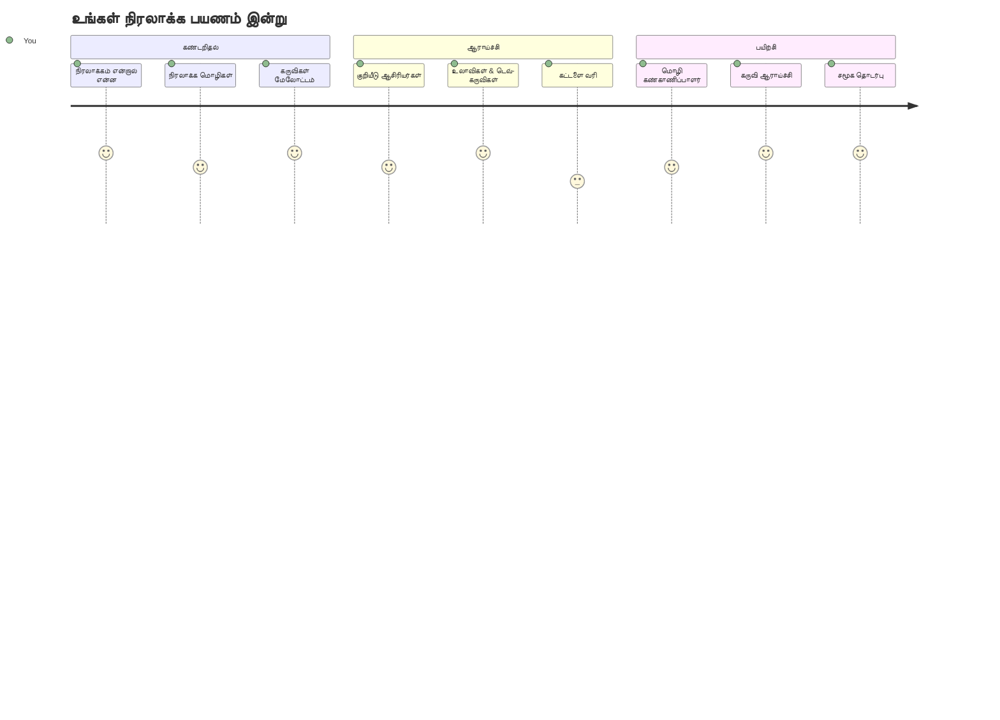
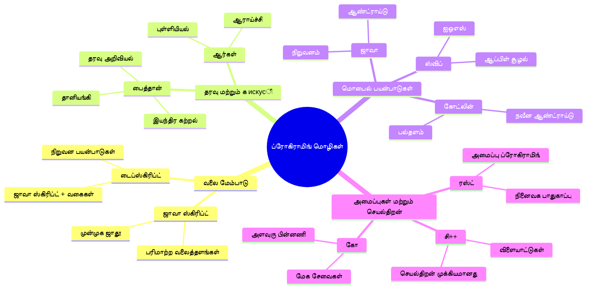
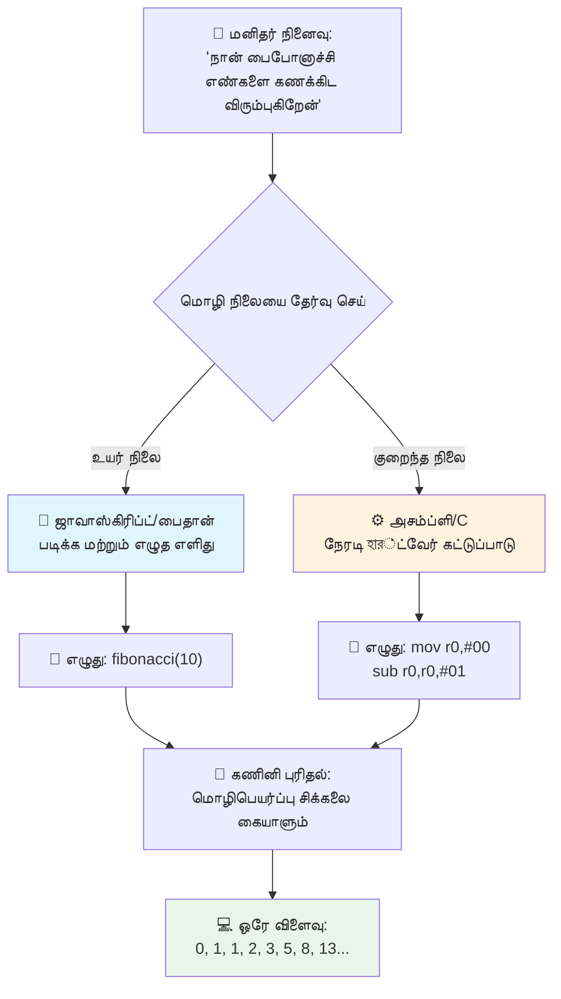
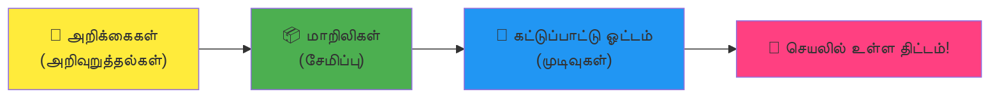
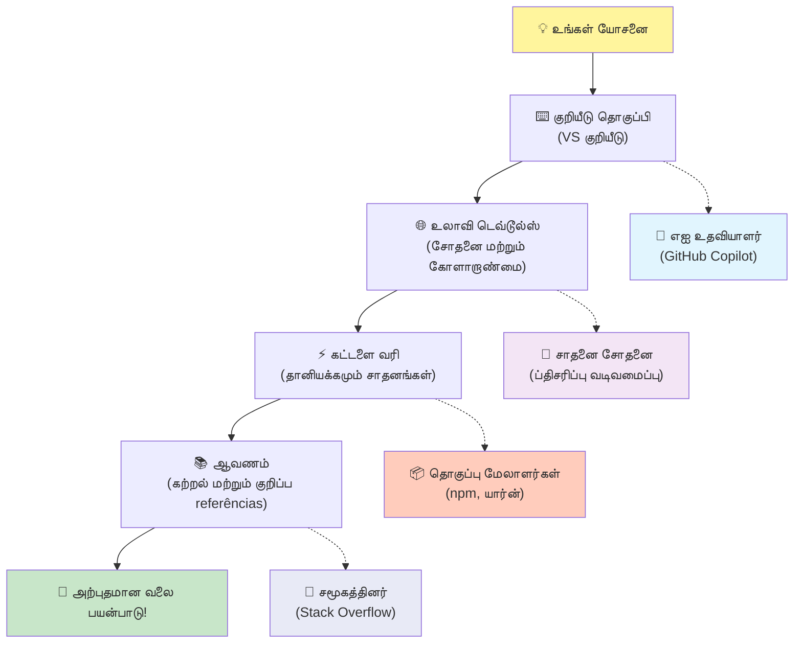
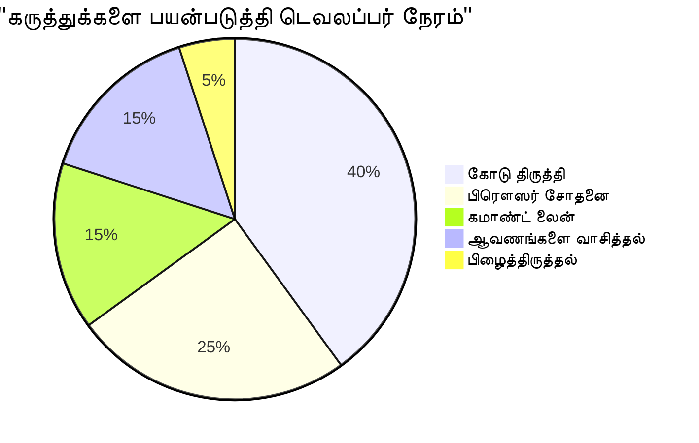
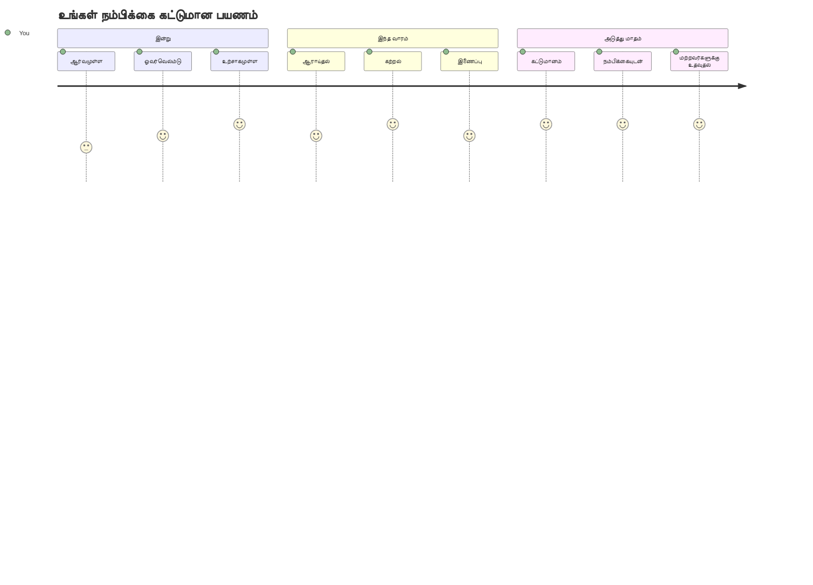

# நிரலாக்க மொழிகள் மற்றும் நவீன மேம்பாட்டு கருவிகளுக்கான அறிமுகம்
 
வணக்கம், எதிர்கால மேம்பாட்டாளர்! 👋 நான் தினமும் என்னை நடுங்க வைத்திருக்கும் ஒன்றை சொல்லவிடலாமா? நிரலாக்கம் கணினிகளுக்கே மட்டும் அல்ல – உங்கள் கதைகளை உயிரூட்டும் சிறப்புப் பவர்களை கொண்டிருக்க நீங்கள் கற்றுக் கொள்கிறீர்கள்!

உங்களுக்கு பிடித்த செயலியை பயன்படுத்தும் போது அனைத்தும் சரியாக பொருந்தும் அந்த நேரம் நினைவா? நீங்கள் ஒரு பொத்தானை தட்டின போதே மிகவும் அதிசயமான ஒன்று நடக்கிறது, அது "வாவ், அவர்கள் அதை எப்படி செய்தார்கள்?" என்று நீங்கள் வியப்பாக இருக்கிறீர்கள். அந்த அற்புதத்தைக் உருவாக்கியவர் உங்களுக்கு போன்ற யாரோ – கூடவே அவர்களது பிடித்த காபி கடையில் இரவு 2 மணிக்கு மூன்றாம் எஸ்பிரெசோவை குடித்து இருக்கிறார்கள். இந்த பாடம் முடிவுக்கு நீங்கள் அவர்கள் அதை எப்படி செய்தார்கள் என்பதைப் புரிந்து கொள்கிறீர்கள், அன்பே அதை நீங்கள் முயற்சிக்கத் துடிக்கிறீர்கள்!

நேர்மையாக சொன்னால், நிரலாக்கம் இப்போது உங்கள் மனதில் கடுமையாக தோன்றலாம் என்று எனக்குத் தெரியும். நான் ஆரம்பித்தபோது, தவிராவிட்டால் நீங்கள் கணித வாய்ப்பாளரும் அல்லது ஐந்து வயதில் இருந்து நிரலாக்க முயற்சியும் செய்யும் ஒருவருமாய் இருக்க வேண்டும் என்று நினைத்தேன். ஆனால் இதோ என்னை முழுவதுமாக மாற்றிய விஷயம்: நிரலாக்கம் புதிய மொழியில் உரையாடலைப் படிப்பதுபோல் தான். நீங்கள் "ஹலோ" மற்றும் "நன்றி" எனக் கற்று, பின்னர் காப்பி ஆர்டர் செய்வதற்குக் கொண்டு செல்கிறீர்கள், பின்னர் நீங்கள் ஆழ்ந்த தத்துவ உரையாடலில் ஈடுபடுகிறீர்கள்! இது கணினிகளோடு உரையாடல் – அவர்கள் மிகவும் பொறுமையுள்ளவர்கள்தான் – உங்கள் தவறுகளை நியாயப்படுத்தவில்லை, மீண்டும் முயற்சிக்க எப்போதும் உற்சாகமுடன் உள்ளனர்!

இன்று நാം ஆராயப்போகும் அதிசய கருவிகள் நவீன வலை மேம்பாட்டை சாத்தியமாக்குவதற்கு மட்டுமல்ல, மிகுந்த ஈடுபாட்டையும் தருகின்றன. Netflix, Spotify மற்றும் உங்களது பிடித்த indie செயலி மையங்களில் பயன்படுத்தும் அதே கண்டித்து, உலாவிகள், வேலைவழிகள் குறித்து பேசுகிறேன். இதோ உங்களை மகிழ்விக்கும் செய்தி – இவை பெரும்பாலும் இலவசமான தொழில்முறை தரமான கருவிகள்!


> ஸ்கெட்ச் நோட் உருவாக்கியவர் [Tomomi Imura](https://twitter.com/girlie_mac)


```mermaid
journey
    title உங்கள் நிரலாக்க பயணம் இன்று
    section கண்டறிதல்
      நிரலாக்கம் என்றால் என்ன: 5: You
      நிரலாக்க மொழிகள்: 4: You
      கருவிகள் மேலோட்டம்: 5: You
    section ஆராய்ச்சி
      குறியீடு ஆசிரியர்கள்: 4: You
      உலாவிகள் & டெவ்-கருவிகள்: 5: You
      கட்டளை வரி: 3: You
    section பயிற்சி
      மொழி கண்காணிப்பாளர்: 4: You
      கருவி ஆராய்ச்சி: 5: You
      சமூக தொடர்பு: 5: You
```
## நீங்கள் ஏற்கனவே என்ன தெரிந்து கொண்டுள்ளீர்கள் பார்ப்போம்!

புதிதாக ஆர்வமான விசைகளை நம்மால் தொடங்கும் முன்பாக, இந்த நிரலாக்க உலகம் பற்றி நீங்கள் ஏன்னு தெரியும்? இந்த கேள்விகள் உங்களால் "இதற்காக என்னால் ஒருவரும் தெரியவில்லை" என்று நினைத்தாலும் கூட அதற்கு என்ன? ஒரு நேருக்கு செல்வதால் நீங்கள் சரியான இடத்தில் இருக்கிறீர்கள். இந்த வினாடி வினா போன்று நம்முடைய மூளை தசைகளை ஊதுவிக்கும் ஒரு உஷ்ணவிடுப்பு மாதிரி எடுத்துக்கொள்ளுங்கள்!

[பாடம் முன் வினாடி வினா எடுக்கவும்](https://ff-quizzes.netlify.app/web/)


## நாம் ஒன்றாகச் செல்லப்போகும் சாகசம்

சரி, இன்று நாம் ஆராயப்போகும் விஷயங்கள் குறித்து என் மனதில் மிகுந்த உற்சாகம் உள்ளது! உண்மையில், சில கருத்துக்கள் புரிந்து செல்லும் போது உங்கள் முகத்தை காண ஆசைப்படுகிறேன். இங்கே நாம் எடுத்துச் செல்லும் அற்புத பயணம்:

- **நிரலாக்கம் என்றால் என்ன மற்றும் அது ஏன் மிகச் சிறந்தது!** – உங்கள் சுற்றியுள்ள அனைத்து விஷயங்களுக்கும் பின்னால் உள்ள மறைமுக அற்புத சக்தியே நிரலாக்கம் என்பதை கண்டுபிடிப்போம், திங்கள் காலை என்று தெரிந்து கொண்ட அதிர்வெண் அலாரம் முதல் உங்கள் Netflix பரிந்துரையை சேகரிக்கும் ஆல்காரிதம் வரை
- **நிரலாக்க மொழிகள் மற்றும் அவற்றின் அற்புதமான தனிப்பட்ட பண்புகள்** – ஒவ்வொரு நபரும் வேறுபட்ட சக்திகள் மற்றும் பிரச்சினைகளை நிர்வகிக்கும் வழிகளை கொண்டுள்ள ஒரு கட்சியில் வர வேண்டும் என்று கற்பனை செய்யுங்கள். அதுவே நிரலாக்க மொழிகளின் உலகம், நீங்கள் அவர்களை சந்திக்க விருப்பப்படுவீர்கள்!
- **டிஜிட்டல் அற்புதத்தை உருவாக்கும் அடிப்படைக் கூறுகள்** – இதை உங்களது படைப்பாற்றல் தெரிந்த LEGO செட் போன்று நினையுங்கள். இவை எப்படி பொருந்துகின்றன என்று புரிந்துகொண்டவுடன், உங்கள் கற்பனை கனவுகளுக்கு ஏற்ப எதையும் உருவாக்கலாம்
- **சூப்பர் வால்டு கைக்குத்தொடுத்து வைக்கும் தொழில்முறை கருவிகள்** – நான் மேலும் பிரம்மாண்டமாக பேசவில்லை – இந்த கருவிகள் உண்மையாகவே உங்களுக்கு சூப்பர் சக்திகள் உள்ளன என்று உணர்த்தும், மேலும் சிறந்த பகுதி? இவை தொழில்முனைவர்களால் பயன்படுத்தப்படும் சில!

> 💡 **இது எப்படி இருக்கிறது?:** இன்று துல்லியமானவை எல்லாவற்றையும் முற்றிலும் memorize செய்யக் நினைக்க வேண்டாம்! இப்போது நான் உங்களுக்கு வேண்டியது, சாத்தியமானது பற்றி அந்த உற்சாகம் மட்டும் உணர்வதுதான். விவரங்கள் நம் பயிற்சியில் இயற்கையாகக் கற்றுக்கொள்ளப்படும் – அப்படியே லெர்னிங் நடக்கும்!

> நீங்கள் இந்த பாடத்தை [Microsoft Learn](https://learn.microsoft.com/en-us/learn/modules/web-development-101/introduction-programming/?WT.mc_id=academic-77807-sagibbon) இல் எடுக்கலாம்!

## நிரலாக்கம் என்ன தான்?

சரி, முதல் நட்ட கேள்வியை நாம் கையாள்வோம்: நிரலாக்கம் உண்மையில் என்ன?

ஒரு கதை உங்களுக்கு சொல்லப் போகிறேன், அது என் பார்வையை முற்றிலும் மாற்றியது. கடந்த வாரம், நான் என் அம்மாவிடம் புதிய ஸ்மார்ட் டி.வி ரிமோட்டு எப்படி பயன்படுத்துவது என்று சொல்ல முயற்சித்தேன். "சிவப்பு பொத்தானை அழுத்துக, பெரிய சிவப்பு பொத்தானை இல்லை, இடது பக்கம் உள்ள சிறிய சிவப்பு பொத்தானை... இல்லை, உங்கள் மற்ற இடது பக்கம்... சரி, இப்போது இரு வினாடிக்குக் பிடிக்கவும், ஒன்று கிடையாது, மூன்று கிடையாது..." என சொன்னேன். இதற்கு நீங்கள் அடிக்கடி சம்மந்தப்பட்டிருக்கிறீர்களா? 😅

அதே நிரலாக்கம்! அதாவது மிக மிகவும் விரிவான கட்டளைகளை கொடுத்து ஒரு சக்திவாய்ந்த கணினியுடன் பேசுதல். ஆனால் உங்கள் அம்மாவிடம் விளக்குவதற்குப் பதிலாக (யார் கேட்கிறார் "எந்த சிவப்பு பொத்தான்?"), நீங்கள் ஒரு கணினியிடம் விளக்குகிறீர்கள் (அது உங்கள் சொற்றொடர் சரியாக இல்லாவிட்டால் கூட, நீங்கள் சொன்னதை நிறைவேற்றும்).

இதில் என்ன என்னை அதிர்ச்சியடைத்தது என்பதை சொல்வேன்: கணினிகள் அடிப்படையில் மிக எளிது. அவைகள் இரண்டு விஷயங்களை மட்டுமே புரிந்துகொள்கின்றன – 1 மற்றும் 0, அதாவது "ஆம்" மற்றும் "இல்லை" அல்லது "ஆனால்" மற்றும் "ஆஃப்". அதுவே முடிவு! ஆனால் அற்புதம் இந்த இடத்தில் வருகிறது – நாம் 1 மற்றும் 0 களுக்குள் பேச வேண்டாம், ஸ்****அ வினாக்களுக்குள் நிரலாக்க மொழிகள் உருப்பதற்கு வந்தவை. அவை உலகின் சிறந்த மொழிபெயர்ப்பாளர்களாக இருந்து உங்களது மனித மனதின் சிந்தனைகளை கணினி மொழியின்மேல் மாற்றுகின்றன.

மற்றொரு விஷயம் என்னை தினமும் காலை எழுந்து அதிர்ச்சியுடன் விடுகிறது: உங்கள் வாழ்க்கையில் உள்ள மேலும் அனைத்து டிஜிட்டல் விஷயங்களும் உங்களைப் போன்ற யாரோ ஒருவர் குழந்தைகளுக்கு அணிந்த சூட்டுகளுடன் காபி கப்புடன் மடிக்கணினியில் குறியீடு எடுக்கும் சமயத்தில் தொடங்கியது. உங்களை அழகாகத் தோற்றுவிக்கும் Instagram ஃபில்ட்டர்? யாரோ அதை குறியீடு செய்தார். உங்கள் புதிய பிடித்த பாடலுக்குச் செல்ல வழி காட்டும் பரிந்துரை? ஒரு மேம்பாட்டு THAT algorithm கட்டமைத்தார். நண்பர்களுடன் ஊறும் பில்லுகளைப் பகிர உதவும் செயலி? ஓ, அது ஒருவன் தொலைந்து "இது சிக்கலானது, நான் இதை சரி செய்ய முடியும்" என்று நினைத்து அது செய்தார்!

பrogramming கற்றுக் கொள்வது புதிய திறனைப் பெறுவது மட்டுமல்ல – நீங்கள் ஒரு பிரச்சினை தீர்க்கும் சமூகத்தின் அங்கமாக மாறுகிறீர்கள். அவர்கள் தினம் முழுதும் "ஒருவருடைய நாளைக் குறைந்த பட்சம் சிறப்பாக மாற்றக்கூடிய ஒன்றை நான் உருவாக்க முடியுமா?" என்று கருதுகிறார்கள். உண்மையில், இதைவிட குளிர்ச்சியான ஏதாவது இருக்கிறதா?

✅ **புகைத்தமிழ் வேட்டையாடல்**: உங்களிடம் ஒரு இடைவெளி கிடைத்தால் பார்க்கக்கூடிய ஒரு அருமையான ஏதாவது உண்டு – உலகின் முதல் கணினி நிரலாளியானவர் யார் என்று நீங்கள் நினைக்கிறீர்களா? கொஞ்சம் உதவி: அது நீங்கள் எதிர்பார்க்கிறவரா அல்லாகலாம்! அவரின் கதை மிகவும் சுவாரஸ்யமானது, நிரலாக்கம் எப்போதும் படைக்கொள்ளும் பிரச்சினை தீர்க்கும் வாய்ப்பாக இருந்தது என்று காட்டுகிறது.

### 🧠 **தினசரி சரிபார்ப்பு: நீங்கள் எப்படி உணர்கிறீர்கள்?**

**ஒரு நிமிடத்தை எடுத்துக் கொள்க:**
- "கணினிகளுக்கு கட்டளைகள் கொடுக்குவது" என்பது இப்போது புரிகிறதா?
- நீங்கள் தினசரி ஒரு பணியை நிரலாக்கத்தால் தானியங்கி செய்ய விரும்புகிறீர்களா?
- இந்த முழு நிரலாக்கக் கருத்துக்கு நீங்கள் ஏதேனும் கேள்விகள் தோன்றுகின்றனவா?

> **நினைவில் வையுங்கள்**: சில கருத்துக்கள் இப்போது தெளிவமில்லாதவை இருந்தாலும் அது சாதாரணம். நிரலாக்கக் கற்றல் புதிய மொழி கற்றுக்கொள்ளும் மாதிரிதான் – உங்கள் மூளை அந்த சஞ்சிகை பாதைகளை கட்டிட நேரம் எடுக்கிறது. நீங்கள் அருமையாக இருக்கிறீர்கள்!

## நிரலாக்க மொழிகள் மாயவண்ணங்கள் போல

சரி, இது சிலருக்கு வித்தியாசமாக தோன்றலாம், ஆனால் என்னுடன் இருங்கள் – நிரலாக்க மொழிகள் பலவகையான இசைப் பாணிகளுக்கு மிகவும் இணைப்பானவை. கற்பனை செய்யுங்கள்: ஜாஸ் இசை மென்மையானதும் சாதாரணமற்றதும்; ராக் பலமுடையதும் நேர்த்தியானதும்; க்ளாசிக்கல் இசை உரிமையானதும் அமைந்ததுமானது; ஹிப்-ஹாப் படைப்பாற்றலும் தெளிவும் கொண்டது. ஒவ்வொரு பாணிக்கும் தனிப்பட்ட மனமான பாணியின் உணர்வு, அவர்களது ஆர்வமுள்ள ரசிகர்கள் மேலும் ஒவ்வொன்றும் வேறு வேறு சூழலும் நிகழ்வுகளுக்கு பொருத்தமானது.

நிரலாக்க மொழிகளும் இதே மாதிரி செயல்படுகின்றன! நீங்கள் ஒரு பரபரப்பான மொபைல் விளையாட்டை உருவாக்கலாமா அல்லது பெரிய அளவிலான சூழல் தரவுகளை கருதலாமா என்று ஒரே மொழிக்குள் செய்வீர்களா? சரி, நீங்கள் யோகா வகுப்பில் டெத் மெட்டல் இசையை இன்னும் கேட்க மாட்டீர்கள் (அதிகமான வகுப்புகளில் மட்டுமே! 😄).

ஆனால் என்னை அசத்துவது பத்தாண்டுகளுக்கு ஒருமுறை நினைக்கும் போது: இந்த மொழிகள் உலகின் மிக பொறுமையான, அறிவார்ந்த மொழிபெயர்ப்பாளரைப் போல உள்ளன. உங்கள் மனிதமயமான சிந்தனைகளை இயல்பான முறையில் வெளிப்படுத்தலாம், ஆனாலும் அவை அற்புதமான முறையில் அதை கணினிகளின் 1 மற்றும் 0 மொழியாக மாற்றுகின்றன. இது இன்னும் ஒரு நண்பரைப் போல தான், இரு மொழிகளிலும் சிறந்த அகராதி உண்டு – அவர்கள் ஒருபோதும் உடைந்து விட மாட்டார்கள், எந்த காப்பி இடைவெளிகளும் வேண்டாம், ஒரே கேள்வியை இருமுறை கேட்கும்போதும் நியாயமில்லை!

### பிரபல நிரலாக்க மொழிகள் மற்றும் அவற்றின் பயன்பாடுகள்


```mermaid
mindmap
  root((ப்ரோகிராமிங் மொழிகள்))
    வலை மேம்பாடு
      ஜாவா ஸ்கிரிப்ட்
        முன்முக ஜாதூ
        பரிமாற்ற வலைத்தளங்கள்
      டைப்ஸ்கிரிப்ட்
        ஜாவா ஸ்கிரிப்ட் + வகைகள்
        நிறுவன பயன்பாடுகள்
    தரவு மற்றும் க искусி
      பைத்தான்
        தரவு அறிவியல்
        இயந்திர கற்றல்
        தானியங்கி
      ஆர்கள்
        புள்ளியியல்
        ஆராய்ச்சி
    மொபைல் பயன்பாடுகள்
      ஜாவா
        ஆண்ட்ராய்டு
        நிறுவனம்
      ஸ்விப்
        ஐஒஎஸ்
        ஆப்பிள் சூழல்
      கோட்லின்
        நவீன ஆண்ட்ராய்டு
        பல்தளம்
    அமைப்புகள் மற்றும் செயல்திறன்
      சி++
        விளையாட்டுகள்
        செயல்திறன் முக்கியமானது
      ரஸ்ட்
        நினைவக பாதுகாப்பு
        அமைப்பு ப்ரோகிராமிங்
      கோ
        மேக சேவைகள்
        அளவுரு பின்னணி
```
| மொழி | சிறந்த பயன்பாடு | ஏன் பிரபலமாயுள்ளது |
|----------|----------|------------------|
| **JavaScript** | வலை மேம்பாடு, பயனர் இடைமுகங்கள் | உலாவிகளில் இயங்குகிறது, இடைkäாட்சியுள்ள இணையதளங்களைக் இயக்குகிறது |
| **Python** | தரவுத்தள அறிவியல், தானியங்கி, செயற்கை நுண்ணறிவு | படிக்க மற்றும் கற்றுக்கொள்ள எளிது, சக்திவாய்ந்த நூலகங்கள் |
| **Java** | நிறுவன செயலிகள், ஆண்ட்ராய்ட் செயலிகள் | தளம் சாரா, பெரிய அமைப்புகளுக்கு வலுவாக உள்ளது |
| **C#** | விண்டோஸ் செயலிகள், விளையாட்டு மேம்பாடு | Microsoft's மாறாத பரிசதனையான ஆதரவு |
| **Go** | மாட-cloud சேவைகள், பின்னணி அமைப்புகள் | வேகமானது, எளிமையானது, நவீன கணினென்றியலுக்குப் பொருத்தமானது |

### உயர் நிலை மற்றும் கீழ் நிலை மொழிகள்

சரி, இது என் மூளை உடைத்த கருத்து, நான் துவங்கும்போது புரிந்துகொள்ள முயன்ற analogyயை பகிர்வேன் – நீங்கள் புரிந்து கொள்வீர்கள் என நம்புகிறேன்!

நீங்கள் ஒரு நாடு சென்று அதில் மொழி தெரியாமல் அருகிலுள்ள கழிப்பறையை கண்டுபிடிக்க முனைகிறீர்கள் (நாம் பெரும்பாலும் அதுபோல் இருக்கிறோம், சிரிக்காதீர்கள்! 😅):

- **கீழ் நிலை நிரலாக்கம்** என்பது அந்நாட்டு பழமையான உச்சாரம் கற்று, கோணத்தில் பழங்குடி பெண்ணுடன் கலந்துரையாடுவது போல. சுவை, உள்ளூர் சொற்கள், கலாச்சார ஜோக்கள் ஆகியவற்றைப் பயன்படுத்தி பேசலாம். நீங்கள் அதன் மூலம் தீவிரம் மற்றும் திறம்பட செயல்பட்டால் மிகச் சிறந்தது. ஆனால் நீங்கள் சுலபமாக கழிப்பறை தேடி கொண்டிருக்கும் போது மிகவும் கடினம்.

- **உயர் நிலை நிரலாக்கம்** என்பது அச்சமாக மதிப்பிடாமல் உங்களைப் புரிந்துகொண்ட இடையே உள்ள நண்பர் போல. நீங்கள் "நான் கழிப்பறை தேடி கொண்டு இருக்கிறேன்" என்றால் அது வெறும் எளிதான ஆங்கிலமாக இருக்கும், அவர்கள் அதை உங்கள் மனதில் பொருந்துமாறு மொழிமாற்றம் செய்து வழி காட்டுவார்கள்.

நிரலாக்கத்தில்:
- **கீழ் நிலை மொழிகள்** (Assembly அல்லது C போன்றவை) கணினி வன்பொருளுடன் விரிவான உரையாடலை அளிக்கின்றன. ஆனால் நீங்கள் கணினியாக சிந்திக்க வேண்டும், இது மிகப்பெரிய மன மனுத்திடீர்!
- **உயர் நிலை மொழிகள்** (JavaScript, Python, அல்லது C# போன்றவை) நீங்கள் மனிதராக சிந்திக்கலாம், ஆனால் அந்த மொழிகள் பின்னணியில் கணினி மொழியை கையாள்கின்றன. மேலும், இவை புதியவர்களுக்கான அற்புதமான சமுதாயத்தைக் கொண்டுள்ளன!

எப்போது நீங்களும் தொடங்கப்போகிறீர்கள் என எனக்குப் தெரிகிறது? 😉 உயர் நிலை மொழிகள் என்பது பயிற்சி சக்கரங்களைப் போன்றவை, நீங்கள் ஒருபோதும் அவற்றைப் அகற்ற விரும்ப மாட்டீர்கள், ஏனென்றால் உங்களை மிகவும் எளிதாக்கும்!


```mermaid
flowchart TB
    A["👤 மனிதர் நினைவு:<br/>'நான் பைபோனாச்சி எண்களை கணக்கிட விரும்புகிறேன்'"] --> B{மொழி நிலையை தேர்வு செய்}
    
    B -->|உயர் நிலை| C["🌟 ஜாவாஸ்கிரிப்ட்/பைதான்<br/>படிக்க மற்றும் எழுத எளிது"]
    B -->|குறைந்த நிலை| D["⚙️ அசம்ப்ளி/C<br/>நேரடி হার்ட்வேர் கட்டுப்பாடு"]
    
    C --> E["📝 எழுது: fibonacci(10)"]
    D --> F["📝 எழுது: mov r0,#00<br/>sub r0,r0,#01"]
    
    E --> G["🤖 கணினி புரிதல்:<br/>மொழிபெயர்ப்பு சிக்கலை கையாளும்"]
    F --> G
    
    G --> H["💻 ஒரே விளைவு:<br/>0, 1, 1, 2, 3, 5, 8, 13..."]
    
    style C fill:#e1f5fe
    style D fill:#fff3e0
    style H fill:#e8f5e8
```
### உயர்நிலை மொழிகள் எதனால் அற்புதமாக இருக்கின்றன என்பதை காட்டுகிறேன்

சரி, நான் உங்களுக்கு ஒரு உதாரணம் காண்பிக்க வருகிறேன், அதனால் நான் உயர்நிலை மொழிகளோடு காதல் படைத்தேன், ஆனால் முதலில் தயவு செய்து என்னுடன் ஒருகூடு கண்ணோட்டம் கொடுங்கள். முதல் குறியீட்டு உதாரணத்தைக் காணும்போது பயப்படாதீர்கள்! அது பயங்கரமாக தெரியும். அதுவே நான் சொல்ல விரும்பியது!

நாம் இரண்டு வெவ்வேறு பாணிகளில் எழுதப்பட்ட ஒரே பணியைப் பார்க்கப்போகிறோம். இரண்டும் Fibonacci வரிசையை உருவாக்குகின்றன – இது அருமையான கணித முறை பாதை. ஒவ்வொரு எண்ணும் அதன் முன்னைய இரண்டு எண்களின் கூட்டுத்தொகை: 0, 1, 1, 2, 3, 5, 8, 13... (மகிழ்ச்சி! நீங்கள் இயற்கையில் எல்லா இடங்களிலும் இந்த தொடர் கண்டுபிடிக்கலாம் – சூரியகாந்தி விதை சுருள்கள், பலாப்பெருக்கின் வடிவமைப்பு, இழுப்புக்களின் வடிவமைப்பு!)

தயார் என்றால் பார்ப்போம்!

**உயர் நிலை மொழி (JavaScript) – மனித நட்புடன்:**

```javascript
// படி 1: அடிப்படை ஃபிபோனாச்சி அமைவு
const fibonacciCount = 10;
let current = 0;
let next = 1;

console.log('Fibonacci sequence:');
```

**இந்த குறியீடு என்ன செய்கிறது:**
- **ஒரு பொருத்தமான மாறி** உருவாக்குங்கள் Fibonacci எண்களின் எண்ணிக்கையை குறிப்பிட
- **இரு மாறிகள்** ஆரம்பித்து தொடரின் தற்போதைய மற்றும் அடுத்த எண்ணை கண்காணிக்க
- **ஆரம்ப மதிப்புகளை** (0 மற்றும் 1) Fibonacci வடிவத்தை வரையறிக்க அமைக்கவும்
- **தலைப்பு செய்தி** வெளிப்படுத்தும்படி அமைத்தல்

```javascript
// படி 2: ஒரு புனைவுடன் வரிசையை உருவாக்குக
for (let i = 0; i < fibonacciCount; i++) {
  console.log(`Position ${i + 1}: ${current}`);
  
  // வரிசையில் அடுத்த எண்ணை கணக்கிடுக
  const sum = current + next;
  current = next;
  next = sum;
}
```

**இங்கே என்ன நடக்கிறது:**
- **ஒரு `for` சுற்றுக்கு** எல்லா இடங்களையும் சுற்றும்
- **ஒவ்வொரு எண்ணையும்** இடத்துடன் காட்டுகள் வடிவத்தில் காட்டுகிறது
- **அடுத்து வரும் Fibonacci எண்ணை** தற்போதைய மற்றும் அடுத்த மதிப்புகளை கூட்டிக் கணக்ககு
- **எதிர்வரும் சுற்றுக்கு** கண்காணிப்புத் தட்டுகளை புதுப்பிக்க

```javascript
// படி 3: நவீன செயல்பாட்டு அணுகுமுறை
const generateFibonacci = (count) => {
  const sequence = [0, 1];
  
  for (let i = 2; i < count; i++) {
    sequence[i] = sequence[i - 1] + sequence[i - 2];
  }
  
  return sequence;
};

// பயன்பாட்டு உதாரணம்
const fibSequence = generateFibonacci(10);
console.log(fibSequence);
```

**மேலே, நாம்:**
- **நவீன அம்பு செயல்திறன் சிங்கமாக்கியை** பயன்படுத்தி மறுபயன்படுத்தக்கூடிய செயல்பாடானது உருவாக்கப்பட்டது
- **முழு வரிசையை** ஒரு வரிசை உருவாக்கி தனியாக சொல்லாமல் சேமித்தது
- **வரிசை குறியீடு** மூலம் புதிய எண்ணை கணக்கிடப்பட்டது
- **முழு வரிசையை** தனிப்பட்ட பகுதி கையாளலுக்கு திரும்பிக் கொடுத்தது

**கீழ் நிலை மொழி (ARM Assembly) – கணினி நட்பு:**

```assembly
 area ascen,code,readonly
 entry
 code32
 adr r0,thumb+1
 bx r0
 code16
thumb
 mov r0,#00
 sub r0,r0,#01
 mov r1,#01
 mov r4,#10
 ldr r2,=0x40000000
back add r0,r1
 str r0,[r2]
 add r2,#04
 mov r3,r0
 mov r0,r1
 mov r1,r3
 sub r4,#01
 cmp r4,#00
 bne back
 end
```

JavaScript பதிப்பு ஆங்கிலக் கட்டளைகளுக்கு சுமாரானவாறு வாசிக்கப்படுவது போல, Assembly பதிப்பு கணினியின் செயலி நேரடியாக கட்டுப்படுத்தும் சுருக்கமான கட்டளைகளைப் பயன்படுத்துகிறது என்பதை கவனியுங்கள். இரண்டும் ஒரே பணியை செய்து முடிக்கிறது, ஆனால் உயர் நிலை மொழி மனிதர்களுக்கு புரிந்து கொள்ள, எழுத, பராமரிக்க எளிது.

**நீங்கள் கவனிப்பீர்கள் முக்கிய வேறுபாடுகள்:**
- **படிக்க எளிது**: JavaScript `fibonacciCount` போன்ற விளக்கமான பெயர்களைப் பயன்படுத்துகிறது, Assembly `r0`, `r1` போன்ற குறியீட்டு லேபிள்களைப் பயன்படுத்துகிறது
- **குறிப்புகள்**: உயர்தர மொழிகள் குறியீட்டை தன்னிச்சையாக விளக்கக்கூடிய குறிப்புகளை ஊக்குவிக்கின்றன
- **கட்டமைப்பு**: JavaScript இன் தர்க்க ரீதியான ஓட்டம் மனிதர்கள் பிரச்சனைகளை படி படியாகக் கருதுவது போல பொருந்துகிறது
- **பராமரிப்பு**: வேறுபட்ட தேவைகளுக்காக JavaScript பதிப்பை புதுப்பிப்பது எளிது மற்றும் தெளிவாக உள்ளது

✅ **ஃபிபோனாச்சி வரிசைப் பற்றி**: இந்த அற்புதமான எண் முறை (ஒவ்வொரு எணும் அதன் முன்னிலை இரண்டு எண்களுடைய கூட்டு: 0, 1, 1, 2, 3, 5, 8...) இயற்கையில் *எங்கும்* காணப்படுகிறது! நீங்கள் இதனை சூரியகாந்தி திருப்பங்கள், பைன்கோன் உருவங்கள், நாட்டிலஸ் சிப்பல்கள் வளைவு முறைகள், மர கிளைகள் வளர்வு போன்று பல இடங்களில் காணலாம். கணிதமும் குறியீட்டும் இயற்கையின் அழகை உருவாக்கும் முறைகளை நமக்கு புரிந்து கொள்ளவும் மறுபடியும் உருவாக்கவும் உதவுவது உண்மையில் மயக்கமளிக்கும்!

## மர்மத்தை நிகழவைக்கும் கட்டுமான அலகுகள்

சரி, இப்போது நீங்கள் செயல்பாட்டில் காணும் கணினி மொழிகளைக் காண்ந்துவிட்டீர்கள், இப்போது எழுதப்பட்ட ஒவ்வொரு நிரலையும் உருவாக்கும் அடிப்படை கூறுகளை உடைக்கலாம். இதை உங்கள் பிடித்த சமையல் செய்முறையில் அத்தியாவசிய பொருட்கள் போல நினைத்துக் கொள்ளுங்கள் – ஒவ்வொன்றும் என்ன செய்கிறது என்பதைப் புரிந்துகொண்டால், நீங்கள் எந்த மொழியிலும் குறியீட்டைக் கண்டுஓ பிற்க்கவும் எழுதவும் இயலும்!

இது கணினி மொழியின் இலக்கணம் கற்கும் போல. பள்ளியில் பண்பட்ட பெயர்கள், செயற்கைகள் மற்றும் வாக்கியங்களை உருவாக்கும் விதம் பற்றி கற்றுக்கொண்டதை நினைவில் கொள்க – கணினி மொழிக்கும் இதற்கு சொந்த இலக்கணம் உண்டு, அது உண்மையில் ஆங்கில இலக்கணத்தைவிட உண்டயும் தர்க்கமானதும் பொறுமையானதும்! 😄

### கூற்றுகள்: படி படியாகக் கட்டளைகள்

**கூற்றுகள்** என்பது உங்கள் கணினியுடன் உரையாடும் தனிப்பட்ட வாக்கியங்கள் போல். ஒவ்வொரு கூற்றும் கணினிக்கு ஒரு குறிப்பிட்ட காரியத்தைச் செய்ய உத்தரவிடுகிறது; உதாரணமாக, "இங்கே இடது திரும்பு," "சிகப்பு விளக்கில் நின்று காக," "அந்த இடத்தில் கார்கள் நிறுத்து" போன்றவைகள்.

கூற்றுகள் படிக்க எளிதாக இருப்பது என்னைப் பிடிக்கிறது. இதோ இதைக் கவனியுங்கள்:

```javascript
// ஒற்றை செயல்களை மேற்கொள்ளும் அடிப்படை அறிக்கைகள்
const userName = "Alex";                    
console.log("Hello, world!");              
const sum = 5 + 3;                         
```

**இந்த குறியீடு செய்யும் காரியங்கள்:**
- பயனர் பெயரை சேமிக்க ஒரு நிலையான மாறி அறிவித்தல்
- கான்சோலில் வரவேற்பு செய்தியை காட்சிப்படுத்தல்
- கணித கணக்குக் கூற்றின் முடிவை கணக்கிட்டு சேமிக்கல்

```javascript
// வலைப்பக்கங்களுடன் தொடர்பு கொள்வதற்கான அறிக்கைகள்
document.title = "My Awesome Website";      
document.body.style.backgroundColor = "lightblue";
```

**படி படியாக, இதோ என்ன நடக்கிறது:**
- உலாவி தாவல் மிச்சத்தில் தோன்றும் இணையப்பக்க தலைப்பை மாற்றுதல்
- முழு பக்க பின்னணி நிறத்தை மாற்றுதல்

### மாறிலிகள்: உங்கள் நிரலின் நினைவகம்

சரி, **மாறிலிகள்** எனும் கருத்து எனது மிகவும் விருப்பமான ஒன்றுள் ஒன்று, ஏனெனில் இவை தினமும் நீங்கள் பயன்படுத்தும் பொருட்களோடே போல இருக்கின்றன!

உங்கள் தொலைபேசி தொடர்பு பட்டியலை சிந்தியுங்கள். எல்லோரின் தொலைபேசி எண்ணை நீங்கள் நினைவில் வைப்பதில்லை – பதிலாக "அம்மா," "உற்ற მეგობர்," "ராத்திரி 2 மணிவரை டெலிivery செய்யும் பீட்சா" போன்ற பெயர்களைக் சேமித்து உங்கள் தொலைபேசி உண்மையான எண்களை நினைவில் வைத்திருக்கிறது. மாறிலிகள் அதே விதமாகப் பணியாற்றுகின்றன! இது உங்கள் நிரலுக்கு தகவலை சேமித்து பின்னர் தேவையெனில் எளிதில் மீட்டெடுக்க உதவும் பெயரிடப்பட்ட தொட்டிகள் போல்.

இதில் உண்மையில் அற்புதமானது: உங்கள் நிரல் இயங்கியபோது மாறிலிகள் மாறக்கூடியவை (இதில் "மாறிலி" என்ற பெயர் உள்ளது – அவர்கள் என்ன செய்கிறார்கள் என்றால் பாருங்கள்!). நீங்கள் மேம்படுத்துவப்பட்ட பீட்சா இடத்தின் தொடர்பை புதுப்பிக்கும் போல், உங்கள் நிரல் புதிய தகவல் கற்றுக்கொண்டால் அல்லது நிலைகள் மாறினால், மாறிலிகள் புதுப்பிக்கப்படும்!

இதை எப்படி எளிதாக செய்யமுடியும் என்ற உதாரணம்:

```javascript
// படி 1: அடிப்படை மாறிகள் உருவாக்குதல்
const siteName = "Weather Dashboard";        
let currentWeather = "sunny";               
let temperature = 75;                       
let isRaining = false;                      
```

**இவை பற்றி புரிந்து கொள்வோம்:**
- நிரந்தர (unmodifiable) மதிப்புகளை `const` மாறிலிகளில் சேமிக்கல் (வலைத்தளப் பெயர் போன்றது)
- நிரலில் மாற்றக்கூடிய மதிப்புகளுக்கு `let` பயன்படுத்தல்
- வேறு வேறு தரவுப் பாகைகளை உருவாக்குதல்: எழுத்துக்கள் (text), எண்கள், நியாயங்கள் (true/false)
- ஒவ்வொரு மாறிலியும் என்ன தகவலை கொண்டுள்ளது என்பது விளக்கும் விளக்கமான பெயர்களை தேர்வு செய்தல்

```javascript
// படி 2: தொடர்புடைய தரவை தொகுப்பதற்காக பொருட்களுடன் பணியாற்றுதல்
const weatherData = {                       
  location: "San Francisco",
  humidity: 65,
  windSpeed: 12
};
```

**மேலே நாம்:**
- தொடர்புடைய வானிலை தகவல்களை ஒருங்கிணைக்கும் ஒரு பொருளை உருவாக்கியுள்ளோம்
- ஒரே மாறிலி கீழ் பல தரவுத் துண்டுகளை ஒழுங்குபடுத்தியுள்ளோம்
- ஒவ்வொரு தகவலுக்கும் தெளிவான குறிச்சொல்-மதிப்புத் தொகுதிகளை பயன்படுத்தியுள்ளோம்

```javascript
// படி 3: மாறிகள் பயன்படுத்தல் மற்றும் புதுப்பித்தல்
console.log(`${siteName}: Today is ${currentWeather} and ${temperature}°F`);
console.log(`Wind speed: ${weatherData.windSpeed} mph`);

// மாற்றக்கூடிய மாறிகளை புதுப்பித்தல்
currentWeather = "cloudy";                  
temperature = 68;                          
```

**ஒவ்வொரு பகுதியையும் புரிந்து கொள்வோம்:**
- `${}` இலக்கணத்துடன் கருவிப்பொருள் எழுத்து வடிவங்களை பயன்படுத்தி தகவலை காட்சி செய்யல்
- புள்ளி குறியீடு (`weatherData.windSpeed`) மூலம் பொருள் பண்புகளை அணுகுதல்
- நிலைமைகள் மாறுபடும்போது `let` அறிவிக்கப்பட்ட மாறிலிகளை புதுப்பித்தல்
- பல மாறிலிகளையை இணைத்து அர்த்தமுள்ள தகவல்களை உருவாக்குதல்

```javascript
// படி 4: தெளிவான குறியீட்டிற்கான நவீன தனி உறுப்புகள் பிரித்தல்
const { location, humidity } = weatherData; 
console.log(`${location} humidity: ${humidity}%`);
```

**நீங்கள் அறிய வேண்டியது:**
- பொருளிலிருந்த குறிப்பிட்ட பண்புகளை இயந்திரத் தொகுப்புப் பொருளாக்கம் மூலம் எடுத்துக் கொள்ளுதல்
- பொருள் முக்கியிகள் போன்ற பெயர்களுடன் புதிய மாறிலிகள் தானாக உருவாக்குதல்
- புள்ளி குறியீட்டை மீண்டும் மீண்டும் பயன்படுத்துவதைத் தவிர்த்து குறியீட்டை எளிமையாக்குதல்

### கட்டுப்பாட்டு ஓட்டம்: உங்கள் நிரலை சிந்திக்கக் கற்பித்தல்

இது தான் நிரலாக்கம் உண்மையில் அற்புதமாகும் இடம்! **கட்டுப்பாட்டு ஓட்டம்** என்பது உங்கள் நிரலுக்கு இன்று நீங்கள் இனியும் நினைக்காமல் செய்யும் சிந்தனை விதிகளைக் கற்பிக்கும் விதமாகும்.

நீங்கள் நினைத்துப் பாருங்கள்: இன்று காலை "மழை பெய்த்தால் குடை எடுத்துக்கொள். குளிராக இருந்தால் ஜாக்கெட் அணி. தாமதமாகுமோ என்று நினைத்தால் காலை உணவை தவிர்த்து, வழியில் கோப்பி வாங்கி வா" என்று நீங்கள் உளவியங்கின்றீர்கள். உங்கள் மூளை இயற்கையாக இந்த 'ஆகின்-அதை பிறகு செய்' லென்ட்(If-Then Logic) -ஐ தினமும் பலமுறை பின்பற்றுகிறது!

இதுதான் நிரல்களுக்கு புத்திசாலித்தன்மை மற்றும் உயிரோடு இருப்பதைக் கொடுக்கும். அவை நிலையைப் பாருங்கள், என்ன நடக்கின்றது என்று மதிப்பீடு செய்யுங்கள், சரியான பதிலளிக்கவும் முடியும். இது உங்கள் நிரலை உயர்தரமான நினைவுத்திறனுடன் கூடியது போல உருவாக்குகிறது!

இது எப்படி அற்புதமாகப் பணிபுரிகிறது என்பதைக் காண்பதற்கு:

```javascript
// படி 1: அடிப்படையான நிபந்தனை தர்க்கம்
const userAge = 17;

if (userAge >= 18) {
  console.log("You can vote!");
} else {
  const yearsToWait = 18 - userAge;
  console.log(`You'll be able to vote in ${yearsToWait} year(s).`);
}
```

**இந்த குறியீடு செய்யும் காரியங்கள்:**
- பயனரின் வயது வாக்களிப்பு தகுதியுடன் பொருந்துகிறதா என்று சரிபார்க்கிறது
- நிலை முடிவுகளின் அடிப்படையில் வெவ்வேறு குறியீட்டு தொகுதிகளைச் செயற்படுத்துகிறது
- 18 வயதாகாதிருந்தால் வாக்களிப்பு தகுதியான நாள் வரைக்கும் எவ்வளவு நேரம் உள்ளது என்று கணக்கிடுகிறது
- ஒவ்வொரு சூழ்நிலைக்கும் குறிப்பிட்ட மற்றும் உதவும் கருத்துக்களை வழங்குகிறது

```javascript
// படி 2: தர்க்க செயலிகளுடன் பல நிபந்தனைகள்
const userAge = 17;
const hasPermission = true;

if (userAge >= 18 && hasPermission) {
  console.log("Access granted: You can enter the venue.");
} else if (userAge >= 16) {
  console.log("You need parent permission to enter.");
} else {
  console.log("Sorry, you must be at least 16 years old.");
}
```

**இங்கு நடக்கும் செயல்களை உடைக்கலாம்:**
- `&&` (மற்றும்) இயக்கியை பயன்படுத்தி பல நிலைகளை சேர்க்கிறது
- பல நிலைகளுக்கான `else if` வழியாக நிலை வரிசையை உருவாக்குகிறது
- கடைசியில் ஒரு `else` கூற்றுடன் எல்லா வாய்ப்புகளும் கவனிக்கப்படுகிறது
- ஒவ்வொரு சூழ்நிலைக்கும் தெளிவான மற்றும் செயல் பொறுத்த கருத்துக்களை வழங்குகிறது

```javascript
// படி 3:  தெளிவான நிபந்தனை ternary இயக்கியை உடன்
const votingStatus = userAge >= 18 ? "Can vote" : "Cannot vote yet";
console.log(`Status: ${votingStatus}`);
```

**நீங்கள் நினைவில் வைக்க வேண்டியது:**
- எளிய இரண்டு விருப்ப நிலைகளுக்கு `ternary operator` (`? :`) பயன்படுத்துங்கள்
- முதலில் நிலையை எழுதுங்கள், பிறகு `?`, அப்போது உண்மையான முடிவு, அதற்கு பிறகு `:`, பிறகு தவறான முடிவு
- நிலைகளின் அடிப்படையில் மதிப்புகளை வழங்கும் போது இதைப் பயன்படுத்தவும்

```javascript
// படி 4: பல சிறப்பு கணக்குகளை கையாள்தல்
const dayOfWeek = "Tuesday";

switch (dayOfWeek) {
  case "Monday":
  case "Tuesday":
  case "Wednesday":
  case "Thursday":
  case "Friday":
    console.log("It's a weekday - time to work!");
    break;
  case "Saturday":
  case "Sunday":
    console.log("It's the weekend - time to relax!");
    break;
  default:
    console.log("Invalid day of the week");
}
```

**இந்த குறியீடு விதிக்கின்றது:**
- மாறிலி மதிப்பைப் பல குறிப்பிட்ட நிகழ்வுகளுடன் ஒப்பிடு
- week days vs weekends போன்ற சம்பந்தப்பட்ட நிகழ்வுகளை குழுவாக்கு
- பொருந்தும் நிகழ்வு கண்டுபிடிக்கப்பட்டால் உரிய குறியீடு தொகுதியை இயக்கு
- எதிர்பாராத மதிப்புகளை கவனிக்க `default` வழியினைப் பயன்படுத்து
- அடுத்த நிகழ்வுக்கு குறியீடு செல்லாமல் தடுக்கும் `break` கூற்றுகளைக் கையாளு

> 💡 **உண்மையான உலக ஒப்பீடு**: கட்டுப்பாட்டு ஓட்டத்தை உலகின் மிக பொறுமையான GPSக்குச் சமமாகக் கருதுங்கள். அது "முக்கிய சாலையில் போக்குவரத்து இருந்தால், அதற்கு பதிலாக ஹெவிவேஐ எடுத்துக் கொள். ஹெவிவே பகுதியில் கட்டுமானம் இருந்தால், காட்சி பாதை முயற்சி செய்" என்று சொல்கிறது. நிரல்கள் வீண்பக்க காரணிகளுக்கு புத்திசாலிதனமாக பதிலளிக்க இந்தவாறே நிபந்தனை வழிக் கட்டளை முறைகளைப் பயன்படுத்துகின்றன மற்றும் எப்போதும் பயனர்களுக்கு சிறந்த அனுபவத்தை வழங்குகின்றன.

### 🎯 **கருத்து சோதனை: கட்டுமான அலகுகளில் நிபுணத்துவம்**

**அடிப்படைகளில் நீங்கள் எவ்வளவு புரிந்தீர்கள் பார்ப்போம்:**
- உங்கள் சொற்களில் மாறிலியும் கூற்றும் என்ன வேறுபாடு உள்ளது என்று விளக்க முடிகிறதா?
- ஒரு உண்மையான சூழ்நிலை சிந்தியுங்கள், அதில் நீங்கள் if-then முடிவை பயன்படுத்துவீர்கள் (எங்களுடைய வாக்களிப்பு எடுத்துக்காட்டைப் போல)
- பார்ப்பதற்கு நிரல் தர்க்கத்தில் உங்களைத் அதிர்ச்சியடையச் செய்த ஒரு விஷயம் எது?

**திடுக்கிடும் நம்பிக்கை ஊட்டச்சத்து:**

```mermaid
flowchart LR
    A["📝 அறிக்கைகள்<br/>(அறிவுறுத்தல்கள்)"] --> B["📦 மாறிலிகள்<br/>(சேமிப்பு)"] --> C["🔀 கட்டுப்பாட்டு ஓட்டம்<br/>(முடிவுகள்)"] --> D["🎉 செயலில் உள்ள திட்டம்!"]
    
    style A fill:#ffeb3b
    style B fill:#4caf50
    style C fill:#2196f3
    style D fill:#ff4081
```
✅ **எதிர்காலம்**: இந்த அரிய பயணத்தில் மேலும் ஆழமாகப் புகுந்து கற்பதைப் போகிறோம்! இப்போது, உங்களுக்கு எதிர்காலத்தில் இருக்கும் அற்புதமான வாய்ப்புகளின் அச்சமற்ற ஆர்வத்தைக் காப்பாற்றுங்கள். கருதிச்செயல்கள் மற்றும் நுட்பங்கள் இயல்பாக மட்டுமே உங்களுக்கு சேமிக்கப்படும் – இது நீங்கள் எதிர்பார்க்கும் விடயத்தைவிட இன்னும் அதிகமான மகிழ்ச்சியை தரும்!

## தொழில்நுட்ப கருவிகள்

சரி, இது என் ஆவலை காப்பாற்ற முடியாமல் வைக்கும் இடம்! 🚀 திடீரென நீங்கள் ஒரு டிஜிட்டல் விண்கலம் சாவிகளைப் பெற்றுவிட்டார் போல உணர விநியோகிக்கப் போகும் அதிசய கருவிகள் பற்றி பேசப் போகிறோம்.

பொன்னோன் கைவலைகளால் சிறப்பாக சமையல்காரர் நபர் கை விரிவாகக் கையாளும் கத்திகள் போலவா? ஒரு பாடகர் தன் கீதம் தொடுமே சுங்கும் அப்பாஸ் போன்ற கருவி உடையவரா? அபிவிருத்தி செய்பவர்கள் இவ்வாறான அற்புத கருவிகளைக் கொண்டுள்ளனர், மற்றும் இவற்றில் பெரும்பாலானவை முழுமையாக இலவசமானவை என்பது உங்களை நிச்சயமாக ஆச்சர்யப்படுத்தும்!

இந்த கருவிகளை உங்களுடன் பகிர்ந்துகொள்ளும் எண்ணம்போல நான் கிழிக்கிறேன், ஏனெனில் இவை எங்கள் மென்பொருள் உருவாக்கும் முறையை முற்றிலும் மாற்றிவிட்டன. குறியீடு எழுத உதவும் AI திறன் வாய்ந்த உதவியாளர்கள் (நான் குளிர்ச்சி பண்ணமாட்டேன்!), Wi-Fi உடன் எங்கு இருந்தாலும் முழு பயன்பாடுகளை உருவாக்கக் கூடிய மேக சூழல்கள், உங்கள் நிரல்களுக்கு X-கதிர் பார்வை போல் வேலை செய்யும் debugging கருவிகள்!

மற்றும் எனக்கு இன்னும் அதிர்ந்திருக்கும் பகுதி: இவை "படிப்பதற்கான கருவிகள்" அல்ல, நீங்கள் விரைவில் அவற்றை விட்டு விலக மாட்டீர்கள். Google, Netflix மற்றும் உங்கள் விரும்பிய indie ஆப் ஸ்டூடியோவுடைய அபிவிருத்தியாளர்கள் தற்போது நேரடியாக பயன்படுத்தும் தொழில்முறை தர வசதிகள் இதுதான். நீங்கள் இவைகளைப் பயன்படுத்தி ஒரு நிபுணராக உணர்வீர்கள்!


```mermaid
graph TD
    A["💡 உங்கள் யோசனை"] --> B["⌨️ குறியீடு தொகுப்பி<br/>(VS குறியீடு)"] 
    B --> C["🌐 உலாவி டெவ்டூல்ஸ்<br/>(சோதனை மற்றும் கோளாறாண்மை)"]
    C --> D["⚡ கட்டளை வரி<br/>(தானியக்கமும் சாதனங்கள்)"]
    D --> E["📚 ஆவணம்<br/>(கற்றல் மற்றும் குறிப்ப referências)"]
    E --> F["🚀 அற்புதமான வலை பயன்பாடு!"]
    
    B -.-> G["🤖 எஐ உதவியாளர்<br/>(GitHub Copilot)"]
    C -.-> H["📱 சாதனை சோதனை<br/>(ப்திசரிப்பு வடிவமைப்பு)"]
    D -.-> I["📦 தொகுப்பு மேலாளர்கள்<br/>(npm, யார்ன்)"]
    E -.-> J["👥 சமூகத்தினர்<br/>(Stack Overflow)"]
    
    style A fill:#fff59d
    style F fill:#c8e6c9
    style G fill:#e1f5fe
    style H fill:#f3e5f5
    style I fill:#ffccbc
    style J fill:#e8eaf6
```
### குறியீடு ஆசிரியர்கள் மற்றும் IDEs: உங்கள் புதிய டிஜிட்டல் சிறந்த நண்பர்கள்

குறியீட்டுத் ஆசிரியர்கள் பற்றி பேசுவோம் – இவை மிக விரைவில் நீங்கள் மிகவும் விரும்பும் இடங்களாக மாற இருக்கும்! உங்கள் தனிப்பட்ட குறியீட்டு புனிதக்கூடம் போல இதுவே, இதில் உங்கள் நேரத்தின் பெரும்பாலான பகுதி உங்கள் டிஜிட்டல் படைப்புகளை உருவாக்கவும் மேம்படுத்தவும் செலவாகும்.

ஆனால் இப்போது நவீன ஆசிரியர்களில் மந்திரமாயிருக்கும் விஷயம் என்னவென்றால்: இவை வெறும் கைடகுமாறிய எழுத்து ஆசிரியர்கள் அல்ல. இவை உங்களுடன் 24/7 இருப்பது போல் மிக புத்திசாலித்தன்மை மற்றும் உதவிக்குரிய குறியீடு ஆலோசகர்கள். நீங்கள் பிழை புரியும முன்னர் தப்புகளைக் கண்டுபிடிக்கின்றன, உங்களை வெளிப்படுத்த அழகான மேம்பாடுக்களை பரிந்துரைக்கின்றன, ஒவ்வொரு குறியீட்டு இடத்திற்கும் விளக்கமளிக்கின்றன, சில எழுத்துக்கள் எழுதுவதை நீங்கள் தொடங்கும்போதே அடுத்ததை முடித்து விட உங்களுக்கு முன்கூட்டிக் கூறுகின்றன!

நான் முதலில் தானாக பூர்த்தி செய்யும் வசதியை கண்டுபிடித்தபோது என்று நினைக்கிறேன் – நான் உண்மையில் எதிர்காலத்தில் வாழ்ந்து கொண்டிருக்கிறேன் போல உணர்ந்தேன். நீங்கள் ஒன்றை தட்டச்சு செய்யத் தொடங்குகிறீர்கள், உங்கள் ஆசிரியர் "நீங்கள் இதனை நினைத்தீர்களா? இது உங்கள் தேவைக்கேற்ற செயல்பாடு" என்று சொல்கிறது. இதுவே உங்கள் குறியீட்டு நண்பர் மன வாசகர் போல!

**இந்த ஆசிரியர்கள் அற்புதமாக இருப்பதற்கு காரணங்கள் என்ன?**

நவீன குறியீடு ஆசிரியர்கள் உங்களுடைய தயாரிப்புத் திறனை மேம்படுத்த சில அற்புத அம்சங்களைக் கொண்டுள்ளன:

| அம்சம் | இது என்ன செய்கிறது | இது எப்படி உதவுகிறது |
|---------|--------------|--------------|
| **விளக்க இலக்கணம் நிறம் கொடுக்கும்** | உங்கள் குறியீட்டின் வேறுபட்ட பகுதிகளை வண்ணம் மூலம் விளக்குகிறது | குறியீடு படிக்க எளிதாகவும் பிழைகள் காண எளிதாகவும் ஆகும் |
| **தானாக பூர்த்தி செய்யல்** | நீங்கள் தட்டச்சு செய்யும் போது குறியீடுகளை பரிந்துரைக்கும் | குறியீடு வேகம் அதிகரித்து பிழைகள் குறையும் |
| **திருத்தும் கருவிகள்** | சிக்கல்களை கண்டுபிடித்து சரி செய்ய உதவும் | சிக்கல்களை சரிசெய்யும் நேரத்தை மெக்கிறது |
| **வিস্তாரங்கள்** | தனிப்பயன் அம்சங்களைச் சேர்க்கும் | உங்கள் ஆசிரியரை தொழில்நுட்பத்திற்கு ஏற்றவாறு அமைக்கலாம் |
| **AI உதவியாளர்கள்** | குறியீட்டையும் விளக்கங்களையும் பரிந்துரைக்கும் | கற்றல் மற்றும் தயாரிப்பு வேகம் அதிகரிக்கிறது |

> 🎥 **வீடியோ வளம்**: இந்த கருவிகளை செயலில் பார்க்க விரும்புகிறீர்களா? இந்த [Tools of the Trade video](https://youtube.com/watch?v=69WJeXGBdxg) முழுமையான கண்ணோட்டத்தை வழங்கும்.

#### இணைய மேம்பாட்டுக்கான பரிந்துரைக்கப்ட்ட ஆசிரியர்கள்

**[Visual Studio Code](https://code.visualstudio.com/?WT.mc_id=academic-77807-sagibbon)** (இலவசம்)
- இணைய மேம்பாட்டாளர்களில் மிகவும் பிரபலமானது
- சிறந்த விரிவாக்க நடைமுறை அமைப்பு
- உட்பிரவேச வலைப்பக்கத்தளம் மற்றும் Git இணைப்பு
- **அந்த அவசியமான விரிவாக்கங்கள்**:
  - [GitHub Copilot](https://marketplace.visualstudio.com/items?itemName=GitHub.copilot) - AI குறியீடு பரிந்துரைகள்
  - [Live Share](https://marketplace.visualstudio.com/items?itemName=MS-vsliveshare.vsliveshare) - நேரடி ஒத்துழைப்பு
  - [Prettier](https://marketplace.visualstudio.com/items?itemName=esbenp.prettier-vscode) - தானாக குறியீடு வடிவமைத்தல்
  - [Code Spell Checker](https://marketplace.visualstudio.com/items?itemName=streetsidesoftware.code-spell-checker) - குறியீட்டில் தவறுகளை கண்டுபிடிப்பு

**[JetBrains WebStorm](https://www.jetbrains.com/webstorm/)** (செலுத்தும், மாணவர்களுக்கு இலவசம்)
- முன்னோடி திருத்தும் மற்றும் சோதனை கருவிகள்
- நுண்ணறிவு குறியீடு பூர்த்தி
- உட்பிரவேச பதிப்பினை கட்டுப்பாடு

**மேகத்தள IDEs** (வேறு விலைமைகள்)
- [GitHub Codespaces](https://github.com/features/codespaces) - உலாவியில் முழு VS Code
- [Replit](https://replit.com/) - கற்றலும் பகிர்வும் uchun சிறந்தது
- [StackBlitz](https://stackblitz.com/) - உடனடி முழுமையான வலை மேம்பாடு

> 💡 **தொடங்கும் குறிப்புகள்**: Visual Studio Code-இல் துவங்குங்கள் – இது இலவசம், தொழில்நுட்பத்துறையில் பரவலாகப் பயன்படுத்தப்படுகிறது மற்றும் உதவிகரமான பாடவியல் மற்றும் விரிவாக்கங்களைக் கொண்டுள்ளது.

### வலை உலாவிகள்: உங்கள் இரகசிய மேம்பாட்டுகூடம்

சரி, உங்கள் மனதை முற்றிலும் மயக்கும் தளத்திற்கு தயார் ஆகுங்கள்! நீங்கள் சமூக ஊடகங்களைக் குண்டான உலாவிகளைப் பயன்படுத்தி கொண்டிருக்கிறீர்கள் என்பது தெரியுமா? இல்லை என்றால், இவை ஒரு மறைமுகம் கொண்ட அதிசய மேம்பாட்டு ஆய்வுக்கூடத்தை மறைத்து வைத்திருக்கிறது, நீங்கள் வெறும் அதை கண்டுபிடிக்கவே வேண்டியது மட்டுமே!

ஒவ்வொரு முறையும் நீங்கள் ஒரு இணையப்பக்கத்தில் வலது கிளிக் செய்து "Inspect Element" தேர்ந்தெடுக்கையில், நீங்கள் ஒரு மறைந்துள்ள மேம்பாட்டு கருவிகள் உலகத்தை திறக்கிறீர்கள், இது நான் முன்பு நூற்றுக்கணக்கான டொலர்களைப் செலுத்தி வாங்கிய சில மென்பொருள்களை விட சக்திவாய்ந்தது. உங்கள் வழக்கம்போன்ற சமையல் அறை ஒரு ரகசிய பேனல் மூலம் ஒரு தொழில்முறை சமையல்காரரின் ஆய்வுக்கூடமாக இருக்கிறது என்று அறியப்படுவது போல!


முதல் முறையாக யாராவது எனக்கு பிரவுசர் DevTools காட்சிப்படுத்தும் போது, நான் மூன்று மணி நேரம் சும்மா கிளிக் செய்து, "காத்திருக்கவும், அது கூட செய்யலாமா?!" என்று சொல்கிறேன். நீங்கள் நேசமாக எந்தவொரு இணையத்தளத்தையும் நேரடி நேரத்தில் திருத்தலாம், எவ்வளவு வேகமாக அனைத்து விஷயங்களும் லோட் ஆகின்றன என்று பார்க்கலாம், உங்கள் 사이트 பல்வேறு சாதனங்களில் எப்படி தோன்றுகிறது என்பதை சோதிக்கலாம், மேலும் JavaScript ஐ முழு புரோபோ போல வைராக்கியமாக பிழைத்திருத்தலாம். இது முழுமையாக மனச்சார்புடனான அதிசயம் தான்!

**பரவுசர்கள் உங்கள் இரகசிய ஆயுதமாக இருப்பதற்கான காரணம் இது:**

நீங்கள் ஒரு வலைத்தளம் அல்லது வலை பயன்பாட்டை உருவாக்கும்போது, அது வாழ்ந்த உலகில் எப்படி தோன்றுகிறது மற்றும் நடந்து கொள்கிறது என்பதை பார்ப்பதன் அவசியம் உண்டாகும். பரவுசர்கள் உங்கள் படைப்பை மட்டும் காட்டவில்லை, மேலும் செயல்பாடு, அணுகுமுறை மற்றும் சாத்தியமான குறைகள் பற்றிய விரிவான பின்னூட்டத்தையும் வழங்குகின்றன.

#### பரவுசர் டெவலப்பர் கருவிகள் (DevTools)

நவீன பரவுசர்கள் விரிவான மேம்பாட்டு தொகுப்புகளை உள்ளடக்கியவையாக இருக்கின்றன:

| கருவி வகை | அது என்ன செய்யும் | உதாரண பயன்பாடு |
|---------------|--------------|------------------|
| **எல்‌மெண்ட் இன்ஸ்பெக்டர்** | HTML/CSS ஐ நேரடி நேரத்தில் காணவும் திருத்தவும் | உடனடி முடிவுகளை பார்க்க ஸ்டைலிங் மாற்றம் செய்யவும் |
| **கான்ஸோல்** | பிழை செய்திகள் காணவும் JavaScript சோதனை செய்யவும் | பிரச்சினைகளை பிழைத்திருத்தவும் குறியீட்டு அடிப்படையில் முயற்சிக்கவும் |
| **நெட்வொர்க் மானிட்டர்** | வளங்கள் எப்படி ஏற்றப்படுகின்றன என்று கண்காணிக்கவும் | செயல்திறன் மற்றும் ஏற்றும் நேரங்களை மேம்படுத்தவும் |
| **அணுகுமுறை சரிபார்க்கும் கருவி** | உள்ளடக்கிய வடிவமைப்புக்கான சோதனை | உங்கள் தளம் அனைத்து பயனர்களுக்கும் வேலை செய்யும் என்பதை உறுதிப்படுத்தவும் |
| **சாதனம் ஒப்பி** | வெவ்வேறு திரை அளவுகளில் முன்னோட்டம் | பல சாதனங்கள் இல்லாமல் பதிலடி வடிவமைப்பை சோதிக்கவும் |

#### மேம்பாட்டிற்கான பரிந்துரைக்கப்பட்ட பரவுசர்கள்

- **[Chrome](https://developers.google.com/web/tools/chrome-devtools/)** - பரவலான ஆவணங்களுடன் தொழில்துறை தர பதிலடி கருவிகள்
- **[Firefox](https://developer.mozilla.org/docs/Tools)** - சிறந்த CSS கிரிட் மற்றும் அணுகுமுறை கருவிகள்
- **[Edge](https://docs.microsoft.com/microsoft-edge/devtools-guide-chromium/?WT.mc_id=academic-77807-sagibbon)** - Microsoftஐ சார்ந்த கூற்றுக் Chromium இல் கட்டப்பட்டவை

> ⚠️ **முக்கிய சோதனை குறிப்புகள்**: உங்கள் இணையத்தளங்களை பல பரவுசர்கள் மூலம் எப்போதும் சோதிக்கவும்! Chrome இல் சரியாக செயல்படும் ஒன்று Safari அல்லது Firefox இல் வேறுபடலாம். தொழில்முறை மேம்படுத்திகள் அனைத்து முக்கிய பரவுசர்களிலும் பரிசோதனை செய்து ஒரே நிலையான பயனர் அனுபவங்களை உறுதிசெய்கின்றனர்.


### கட்டளைக் கட்டம் கருவிகள்: உங்கள் மேம்பாட்டு சூப்பர்ப்பவர்களுக்கு வாயில்

சரி, கட்டளைக் கட்டத்தை பற்றி முழுமையாக உண்மையான ஒரு தருணம் வைக்கலாம், ஏனெனில் இது ஒரு நிஜமான புரிதலை விரும்பும் ஒருவரிடமிருந்து நீங்கள் கேட்க வேண்டும். நான் முதலில் அதை பார்த்தபோது – இந்த பயங்கர கருப்பு திரை மற்றும் கன்கொண்ட எழுத்துக்கள் – நான் உண்மையில் நினைத்தேன், "இல்லை, எல்லாம் இல்லை! இது 1980 களின் ஹேக்கர் படம் போல தெரிகிறது, நான் இதற்காக போதுமான அறிவு இல்லை!" 😅

ஆனால் அதே சமயம் நான் யாரோ ஒருவரிடமிருந்து கேட்டிருந்தேன் மற்றும் இப்போது உங்களுக்கு சொல்கிறேன்: கட்டளைக் கட்டம் பயங்கரமல்ல – இது உங்கள் கணினியுடன் நேரடியாக உரையாடுவது போலது. அதை ஒரு அழகான படம் மற்றும் பட்டியல்கள் கொண்ட அப்பில் உணவு ஆர்டர் செய்யும் வேறுபாடாகக் கடைசிநிலையில் உங்கள் பிரியமான உள்ளூர் உணவகத்தில் சென்று அங்கு சமையலாளர் நீங்கள் விரும்பும் உணவை உடனே உருவாக்குவார் என்று நினைக்கலாம்.

கட்டளைக் கட்டம் தான் மேம்படுத்திகள் முழுமையான மந்திரவாதிகளாக உணர்வதற்கான இடம். சில மந்திரப்போன்ற வார்த்தைகள் எழுதுங்கள் (சரி, அவை கட்டளைகள் தான், ஆனால் அவை மந்திரப் போன்றவை!) enter அழுத்துங்கள், அடி - நீங்கள் முழு திட்ட சாசனங்களை உருவாக்கியிருக்கிறீர்கள், உலகம் முழுக்க உள்ள சக்திவாய்ந்த கருவிகளை நிறுவியிருக்கிறீர்கள், அல்லது உங்கள் பயன்பாட்டை இணையத்தில் பல மில்லியன் பார்வையாளர்களுக்கு வெளியிட்டிருக்கிறீர்கள். அந்த சக்தியின் முதல் சுவையை பின்தொடர்ந்தபின், அது மிகவும் வறுமையானதாகும்!

**கட்டளைக் கட்டம் உங்கள் மிகவும் பிடித்த கருவியாக மாறும் காரணம்:**

கிராஃபிகல் இடைமுகங்கள் பல வேலைகளை செய்ய சிறந்தவை ஆனாலும், கட்டளைக் கட்டம் தானியக்க, துல்லியம் மற்றும் வேகத்தில் சிறந்தது. பல மேம்பாட்டு கருவிகள் பிரதானமாக கட்டளைக் கட்ட இடைமுகங்களின் மூலம் செயல்படுகின்றன மற்றும் அவற்றை திறமையாக பயன்படுத்த கற்று உம் உற்பத்தித் திறனை மிகைப்படுத்தலாம்.

```bash
# படி 1: திட்ட அடைவைக் உருவாக்கி அதில் செல்லவும்
mkdir my-awesome-website
cd my-awesome-website
```

**இந்த குறியீடு என்ன செய்கிறது:**
- **புதிய** ஒரு "my-awesome-website" என்ற அடைவை உருவாக்குகிறது
- **அந்த புதிய அடைவுக்குள் செல்லிறது** வேலை தொடங்குவதற்கு

```bash
# படி 2: package.json உடன் திட்டத்தைத் துவங்கவும்
npm init -y

# நவீன வளர்ச்சி கருவிகளை நிறுவவும்
npm install --save-dev vite prettier eslint
npm install --save-dev @eslint/js
```

**படி படியாக, இது செய்வது:**
- `npm init -y` பயன்படுத்தி புதிய Node.js திட்டத்தை ஆரம்பிக்கிறது
- வேகமான மேம்பாடு மற்றும் உற்பத்தி கட்டமிழப்புக்கான Vite ஆகியவற்றை நிறுவுகிறது
- குறியீட்டு வடிவமைப்புக்கும் தரச் சோதனைகளுக்கும் Prettier மற்றும் ESLint ஐ சேர்க்கிறது
- இந்தவற்றைக் வளர்ச்சி மட்டான சாரா துணைக்கூறுகள் என குறிக்க `--save-dev` கொடியை பயன்படுத்துகிறது

```bash
# படி 3: திட்ட அமைப்பும் கோப்புகளும் உருவாக்கவும்
mkdir src assets
echo '<!DOCTYPE html><html><head><title>My Site</title></head><body><h1>Hello World</h1></body></html>' > index.html

# மேம்பாட்டு சர்வரை துவங்கவும்
npx vite
```

**மேலே, நாம் செய்துள்ளோம்:**
- மூல குறியீடு மற்றும் சொத்துகளுக்காக தனி அடைவுகளை அமைத்துள்ளோம்
- சரியான ஆவண கட்டமைப்புடன் ஒரு அடிப்படை HTML கோப்பை உருவாக்கியுள்ளோம்
- நேரடி மீள ஏற்றத்திற்கும் ஹாட் மோடியூல் மாற்றத்திற்கும் Vite மேம்பாட்டு சர்வரைத் துவக்கியுள்ளோம்

#### வலை மேம்பாட்டிற்கு அடிப்படையான கட்டளைக் கட்டங்கள் கருவிகள்

| கருவி | நோக்கம் | தேவை ஏன்? |
|------|---------|-----------------|
| **[Git](https://git-scm.com/)** | பதிப்பு கட்டுப்பாடு | மாற்றங்களை கண்காணிக்கவும், ஒத்துழைக்கவும், பணியை காப்பமைக்கவும் |
| **[Node.js & npm](https://nodejs.org/)** | JavaScript இயக்ககம் & தொகுப்பு மேலாண்மை | பரவுசர்களுக்கு வெளியே JavaScript இயக்கு, நவீன மேம்பாட்டு கருவிகள் நிறுவ |
| **[Vite](https://vitejs.dev/)** | கட்டமைப்பு கருவி & மேம்பாட்டு சர்வர் | மிக விரைவு மேம்பாடு ஹாட் மோடியூல் மாற்றத்துடன் |
| **[ESLint](https://eslint.org/)** | குறியீட்டு தரம் | உங்கள் JavaScript இல் பிரச்சனைகளை தானாக கண்டுபிடித்து சரி செய்யவும் |
| **[Prettier](https://prettier.io/)** | குறியீடு வடிவமைப்பு | உங்கள் குறியீட்டை ஒழுங்காக, படிக்க எளிதாக வைத்திருக்கவும் |

#### தளத்திற்கான விருப்பங்கள்

**Windows:**
- **[Windows Terminal](https://docs.microsoft.com/windows/terminal/?WT.mc_id=academic-77807-sagibbon)** - நவீன மற்றும் வசதிகள் நிறைந்த டெர்மினல்
- **[PowerShell](https://docs.microsoft.com/powershell/?WT.mc_id=academic-77807-sagibbon)** 💻 - சக்திவாய்ந்த ஸ்கிரிப்டிங் சூழல்
- **[Command Prompt](https://learn.microsoft.com/windows-server/administration/windows-commands/windows-commands)** 💻 - பாரம்பரிய Windows கட்டளைக் கட்டம்

**macOS:**
- **[Terminal](https://support.apple.com/guide/terminal/)** 💻 - கட்டமைக்கப்பட்ட டெர்மினல் அப்ளிகேஷன்
- **[iTerm2](https://iterm2.com/)** - மேம்படுத்தப்பட்ட டெர்மினல் வன்பொருள்

**Linux:**
- **[Bash](https://www.gnu.org/software/bash/)** 💻 - நிலையான Linux ஷெல்
- **[KDE Konsole](https://docs.kde.org/trunk5/en/konsole/konsole/index.html)** - முன்னோட்ட டெர்மினல் எமுலேட்டர்

> 💻 = இயங்குதளத்தில் முன்பே நிறுவப்பட்டுள்ளது

> 🎯 **கற்றல் பாதை**: `cd` (கோப்புறை மாற்றம்), `ls` அல்லது `dir` (கோப்புக்களை பட்டியலிடு), மற்றும் `mkdir` (அடைவு உருவாக்கு) போன்ற அடிப்படை கட்டளைகளுடன் தொடங்கவும். `npm install`, `git status`, மற்றும் `code .` (தற்போதைய அடைவில் VS Code திறக்கவும்) போன்ற நவீன வேலைநடை கட்டளைகளில் பயிற்சி செய்யவும். நீங்கள் நிபுணராய் மாற்றப்படும்போது, மேலும் முன்னேற்றப்பட்ட கட்டளைகளும் தானியக்க நுட்பங்களும் உங்களால் இயங்கக் கற்றுக்கொள்ளப்படும்.


### ஆவணக்கூறு: உங்கள் எப்போதும் கிடைக்கும் கற்றல் வழிகாட்டி

சரி, நான் ஒரு சிறிய ரகசியம் சொல்ல விரும்புகிறேன், அது ஆரம்ப நிலை பயிற்சி உங்களுக்கு மிகவும் நன்றாக உணர வைக்கும்: மிக அனுபவமிக்க மேம்படுத்திகள் கூட தங்கள் நேரத்தின் பெரும்பகுதியை ஆவணங்களை படிப்பதற்குக் கொடுப்பார்கள். அது அவர்கள் அறிவில்லாமல் அல்ல, அது அறிவுச்சான்று!

ஆவணங்கள் என்பது உலகின் மிகவும் பொறுமையான, அறிவுச்சம்பந்தமான ஆசிரியர்களை எப்போதும் 24/7 அணுகுவதைப் போன்றது. இரவு 2 மணிக்கு ஒரு பிரச்சினையில் சிக்கினால? ஆவணங்கள் அங்கே உங்கள் தேவைக்கு சரியான பதிலுடன் ஒரு ஹத்தை வணங்குகின்றன. அனைவரும் பேசும் ஒரு புதிய சிறந்த அம்சத்தை கற்றுக் கொள்ள விரும்பினால், ஆவணங்கள் ஒருவரின் பின் நிற்கின்றன படி படியாக எடுத்துக்காட்டுகளுடன். ஏன் ஒரு விஷயம் செயல்படுகிறது என்பதை புரிந்துகொள்ள முயற்ச்சிப் புரிய என்றால் – ஆவணங்கள் அதைக் குறித்து நன்றாக விளக்க தயாராக உள்ளன!

இதோ என்ன உண்மையாக எனது கேள்வியைக் மாற்றியது: வலை மேம்பாட்டு உலகம் மிகவும் வேகமாக நகர்கிறது, யாரும் (முழுமையாக யாரும் இல்லை!) அனைத்தையும் நினைவுபடுத்திப் பிடிக்கவில்லை. 15 ஆண்டுகளுக்கும் மேலான அனுபவம் வாய்ந்த மூத்த மேம்படுத்திகளை அடிப்படை உரைவரிசைகளைத் தேடும் போது நான் பார்த்தேன், மற்றும் அது அவது பிழை அல்ல – அது அறிவுச் செயல்திறன்! ஒருமுறை நினைவில் வைக்காமல், விரைவாக நம்பகமான பதில்களை எங்கு காணப்படுவது மற்றும் அவற்றை எவ்வாறு பயன்படுத்துவது என்பதை அறிதல் தான் முக்கியம்.

**உண்மையான அற்புத காட்சி இதோ:**

தொழில்முறை மேம்படுத்திகள் தங்கள் நேரத்தின் பெரிய பகுதியை ஆவணங்களை படிப்பதில் செலவிடுகிறார்கள் – அவர்கள் தெரியாது என்பதற்காக அல்ல, ஆனால் இணைய வளர்ச்சி சூழல் வேகம் மிகுந்தது என்பதால் தொடர்ந்து கற்றுக்கொள்ள வேண்டும். சிறந்த ஆவணங்கள் நீங்கள் *எப்படி* பயன்படுத்துவது மட்டுமல்ல, *ஏன்* மற்றும் *எப்போது* பயன்படுத்துவது என்பதையும் புரிந்து கொள்ள உதவுகிறது.

#### முக்கிய ஆவணக் குறிப்பு வளங்கள்

**[Mozilla Developer Network (MDN)](https://developer.mozilla.org/docs/Web)**
- வலை தொழில்நுட்ப ஆவணங்களுக்கு தங்கக் குறிக்கோள்
- HTML, CSS மற்றும் JavaScript க்கான விரிவான வழிகாட்டிகள்
- பரவுசர் பொருத்த தன்மை தகவல்
- நடைமுறை உதாரணங்கள் மற்றும் தொடர்புடைய டெமோகள் அடங்கும்

**[Web.dev](https://web.dev)** (Google மூலம்)
- நவீன வலை மேம்பாட்டு சிறந்த நடைமுறைகள்
- செயல்திறன் மேம்படுத்தலும் வழிகாட்டிகள்
- அணுகல் மற்றும் உள்ளடக்கிய வடிவமைப்புக் கொள்கைகள்
- உண்மையான திட்டங்களிலிருந்து வழிகாட்டும் மேற்கோள்கள்

**[Microsoft Developer Documentation](https://docs.microsoft.com/microsoft-edge/#microsoft-edge-for-developers)**
- Edge பரவுசர் மேம்பாட்டு வளங்கள்
- முன்னேற்ற வலை பயன்பாட்டின் வழிகாட்டிகள்
- குறுக்கு தளம் மேம்பாட்டு பார்வைகள்

**[Frontend Masters Learning Paths](https://frontendmasters.com/learn/)**
- கட்டமைக்கப்பட்ட கற்றல் பாடத்திட்டங்கள்
- தொழில்துறை நிபுணர்களின் வீடியோ பாடங்கள்
- கை<|vq_image_9171|><|vq_image_15808|><|vq_image_11626|><|vq_image_11656|><|vq_image_6718|><|vq_image_11656|><|vq_image_10170|><|vq_image_6718|><|vq_image_16056|><|vq_image_15897|><|vq_image_5624|><|vq_image_5722|><|vq_image_11656|><|vq_image_5390|><|vq_image_11532|><|image_border_769|><|vq_image_7192|><|vq_image_5722|><|vq_image_7536|><|vq_image_11189|><|vq_image_5280|><|vq_image_7192|><|vq_image_13410|><|vq_image_5624|><|vq_image_14528|><|vq_image_14528|><|vq_image_15201|><|vq_image_8210|><|vq_image_8504|><|vq_image_3538|><|vq_image_9427|><|vq_image_5639|><|vq_image_13121|><|vq_image_14464|><|vq_image_2258|><|vq_image_2017|><|vq_image_11765|><|vq_image_11063|><|vq_image_1745|><|vq_image_1968|><|image_border_770|><|vq_image_1750|><|vq_image_14500|><|vq_image_7299|><|vq_image_9480|><|vq_image_3202|><|vq_image_14220|><|vq_image_9480|><|vq_image_13619|><|vq_image_5858|><|vq_image_5321|><|vq_image_10874|><|vq_image_5321|><|vq_image_4176|><|vq_image_12439|><|vq_image_606|><|vq_image_11686|><|vq_image_3202|><|vq_image_14791|><|vq_image_12582|><|vq_image_4741|><|vq_image_7598|><|vq_image_4768|><|vq_image_2374|><|vq_image_9455|><|image_border_771|><|vq_image_2309|><|vq_image_9453|><|vq_image_67|><|vq_image_9926|><|vq_image_10165|><|vq_image_16280|><|vq_image_924|><|vq_image_16045|><|vq_image_3439|><|vq_image_11116|><|vq_image_8066|><|vq_image_4934|><|vq_image_14640|><|vq_image_7796|><|vq_image_10947|><|vq_image_1926|><|vq_image_8081|><|vq_image_8308|><|vq_image_7178|><|vq_image_6690|><|vq_image_13087|><|vq_image_1433|><|vq_image_6837|><|vq_image_7514|><|image_border_772|><|vq_image_16253|><|vq_image_12100|><|vq_image_13807|><|vq_image_204|><|vq_image_14346|><|vq_image_15676|><|vq_image_13743|><|vq_image_5643|><|vq_image_15896|><|vq_image_9446|><|vq_image_2098|><|vq_image_6351|><|vq_image_6996|><|vq_image_1386|><|vq_image_14603|><|vq_image_4603|><|vq_image_10793|><|vq_image_11186|><|vq_image_3840|><|vq_image_2117|><|vq_image_11808|><|vq_image_14975|><|vq_image_25|><|vq_image_14828|><|image_border_773|><|vq_image_12428|><|vq_image_7121|><|vq_image_1205|><|vq_image_240|><|vq_image_9850|><|vq_image_14210|><|vq_image_371|><|vq_image_8934|><|vq_image_6257|><|vq_image_13765|><|vq_image_1913|><|vq_image_6540|><|vq_image_1154|><|vq_image_13663|><|vq_image_9743|><|vq_image_9207|><|vq_image_13327|><|vq_image_7129|><|vq_image_441|><|vq_image_7629|><|vq_image_9427|><|vq_image_13028|><|vq_image_2054|><|vq_image_4660|><|image_border_774|><|vq_image_14146|><|vq_image_6575|><|vq_image_6498|><|vq_image_5980|><|vq_image_13190|><|vq_image_14144|><|vq_image_13211|><|vq_image_15398|><|vq_image_8710|><|vq_image_8829|><|vq_image_15898|><|vq_image_14263|><|vq_image_9202|><|vq_image_12265|><|vq_image_411|><|vq_image_909|><|vq_image_1435|><|vq_image_7658|><|vq_image_6250|><|vq_image_14167|><|vq_image_1615|><|vq_image_9800|><|vq_image_2054|><|vq_image_13720|><|image_border_775|><|vq_image_13708|><|vq_image_12597|><|vq_image_16285|><|vq_image_4785|><|vq_image_2355|><|vq_image_4383|><|vq_image_6457|><|vq_image_1120|><|vq_image_10431|><|vq_image_15424|><|vq_image_2069|><|vq_image_9073|><|vq_image_8189|><|vq_image_12139|><|vq_image_13098|><|vq_image_16143|><|vq_image_13730|><|vq_image_4588|><|vq_image_10621|><|vq_image_2906|><|vq_image_10071|><|vq_image_12980|><|vq_image_2054|><|vq_image_13720|><|image_border_776|><|vq_image_6966|><|vq_image_15166|><|vq_image_8519|><|vq_image_13807|><|vq_image_15796|><|vq_image_11490|><|vq_image_12443|><|vq_image_2392|><|vq_image_6560|><|vq_image_4932|><|vq_image_5476|><|vq_image_3061|><|vq_image_106|><|vq_image_5508|><|vq_image_13251|><|vq_image_12141|><|vq_image_4998|><|vq_image_1574|><|vq_image_7844|><|vq_image_9681|><|vq_image_16206|><|vq_image_3688|><|vq_image_16070|><|vq_image_13720|><|image_border_777|><|vq_image_4407|><|vq_image_9856|><|vq_image_4363|><|vq_image_15692|><|vq_image_11110|><|vq_image_9938|><|vq_image_8024|><|vq_image_12469|><|vq_image_3511|><|vq_image_16066|><|vq_image_2562|><|vq_image_11754|><|vq_image_3241|><|vq_image_6169|><|vq_image_9999|><|vq_image_1200|><|vq_image_10724|><|vq_image_16126|><|vq_image_8522|><|vq_image_2906|><|vq_image_15989|><|vq_image_13941|><|vq_image_5818|><|vq_image_13720|><|image_border_778|><|vq_image_12182|><|vq_image_14300|><|vq_image_11883|><|vq_image_8967|><|vq_image_13031|><|vq_image_6224|><|vq_image_1336|><|vq_image_1038|><|vq_image_4466|><|vq_image_15632|><|vq_image_7424|><|vq_image_6687|><|vq_image_7078|><|vq_image_793|><|vq_image_7810|><|vq_image_14231|><|vq_image_4023|><|vq_image_15689|><|vq_image_4560|><|vq_image_5872|><|vq_image_13681|><|vq_image_13674|><|vq_image_52|><|vq_image_10852|><|image_border_779|><|vq_image_10228|><|vq_image_10276|><|vq_image_852|><|vq_image_6448|><|vq_image_10439|><|vq_image_11295|><|vq_image_11745|><|vq_image_4621|><|vq_image_2476|><|vq_image_4910|><|vq_image_8709|><|vq_image_6355|><|vq_image_12621|><|vq_image_3016|><|vq_image_13311|><|vq_image_2603|><|vq_image_6615|><|vq_image_406|><|vq_image_7974|><|vq_image_1615|><|vq_image_13436|><|vq_image_13941|><|vq_image_5818|><|vq_image_2864|><|image_border_780|><|vq_image_8585|><|vq_image_7727|><|vq_image_16255|><|vq_image_6220|><|vq_image_7628|><|vq_image_11360|><|vq_image_6835|><|vq_image_6866|><|vq_image_1558|><|vq_image_7401|><|vq_image_11558|><|vq_image_1558|><|vq_image_1914|><|vq_image_12662|><|vq_image_16133|><|vq_image_13176|><|vq_image_8607|><|vq_image_9554|><|vq_image_14504|><|vq_image_9736|><|vq_image_11558|><|vq_image_11512|><|vq_image_15189|><|vq_image_9496|><|image_border_781|><|vq_image_15692|><|vq_image_4820|><|vq_image_13407|><|vq_image_1640|><|vq_image_14407|><|vq_image_12630|><|vq_image_2975|><|vq_image_3079|><|vq_image_1864|><|vq_image_7551|><|vq_image_7157|><|vq_image_9912|><|vq_image_14898|><|vq_image_4190|><|vq_image_4200|><|vq_image_13397|><|vq_image_2031|><|vq_image_5000|><|vq_image_840|><|vq_image_15913|><|vq_image_10389|><|vq_image_2856|><|vq_image_11282|><|vq_image_3976|><|image_border_782|><|vq_image_5327|><|vq_image_15210|><|vq_image_13728|><|vq_image_13011|><|vq_image_12125|><|vq_image_5354|><|vq_image_5354|><|vq_image_12473|><|vq_image_2773|><|vq_image_1103|><|vq_image_12048|><|vq_image_7551|><|vq_image_10416|><|vq_image_4560|><|vq_image_13206|><|vq_image_6692|><|vq_image_12103|><|vq_image_3807|><|vq_image_10805|><|vq_image_4984|><|vq_image_3974|><|vq_image_6757|><|vq_image_6757|><|vq_image_2174|><|image_border_783|><|vq_image_10942|><|vq_image_6967|><|vq_image_15320|><|vq_image_7449|><|vq_image_12068|><|vq_image_5414|><|vq_image_2838|><|vq_image_14315|><|vq_image_8674|><|vq_image_8656|><|vq_image_2304|><|vq_image_7948|><|vq_image_14340|><|vq_image_11695|><|vq_image_4381|><|vq_image_15155|><|vq_image_8493|><|vq_image_14064|><|vq_image_5725|><|vq_image_15244|><|vq_image_15102|><|vq_image_6498|><|vq_image_12254|><|vq_image_12806|>  

> 📚 **படிப்புத் திட்டம்**: ஆவணங்களை மனக்கேடாக நினைத்துக் கொள்ள வேண்டாம் – அதைப் பயிற்சி செய்து திறமையான முறையில் பயன்படுத்த கற்றுக்கொள்ளுங்கள். அடிக்கடி பயன்படுத்துகிற குறிப்பு பக்கங்களைப் பதிவு செய்து தேடல் செயல்பாட்டை திறம்பட பயன்படுத்தி விரைவில் தேவையான தகவலைக் காணவும்.

### 🔧 **கருவி தகுதி பரிசோதனை: உங்களுக்கு என்ன பிடிக்கிறது?**

**ஒரு நிமிடம் எடுத்துக் கொள்ளவும்:**
- முதலில் எந்த கருவியை முயற்சிக்க வெறுக்கின்றீர்கள்? ( தவறான பதில் இல்லை!)
- கட்டளைக் கட்டம் இன்னும் பயங்கரமா தோன்றுகிறதா, அல்லது ஆர்வமா உள்ளது?
- பிரவுசர் DevTools கொண்டு உங்கள் பிடித்த இணையத்தளங்களின் பின்னணியை நீங்கள் பார்ப்பதை கற்பனை செய்யவா?


```mermaid
pie title "கருத்துக்களை பயன்படுத்தி டெவலப்பர் நேரம்"
    "கோடு திருத்தி" : 40
    "பிரௌஸர் சோதனை" : 25
    "கமாண்ட் லைன்" : 15
    "ஆவணங்களை வாசித்தல்" : 15
    "பிழைத்திருத்தல்" : 5
```
> **சுவாரசியமான பார்வை**: பெரும்பாலும் மேம்படுத்திகள் தங்கள் குறியீட்டு தொகுப்பில் 40% நேரத்தை செலவிடுகிறார்கள், ஆனால் சோதனை, கற்றல் மற்றும் பிரச்சனை தீர்க்கும் பணியிலும் அவர்கள் நேரத்தை எவ்வளவு செலவிடுகிறார்கள் என்பதை கவனிக்கவும். நிரலாக்கம் என்பது குறியீடு எழுதுவது மட்டும் அல்ல – அது அனுபவங்களை உருவாக்குவதாகும்!

✅ **ஆரோக்கியமான கருத்து**: வலைத்தளங்களை உருவாக்கும் கருவிகள் (மேம்பாடு) மற்றும் அவைகள் எப்படி தோன்றும் என்று வடிவமைக்கும் கருவிகள் (வடிவமைப்பு) எப்படி வேறுபடுமெனக் கவனியுங்கள்? அதேபோல் ஒரு கட்டிடவடிவமைப்பாளர் அழகான வீடு வடிவமைக்கும் மற்றும் அதனை கட்டும் ஒப்பந்ததாரர் இருவரும் இருக்கிறார்கள். இருவரும் அவசியமானவர்கள், ஆனால் வேறுபட்ட கருவிகள் தேவை! இந்த சிந்தனை உங்கள் பார்வையை பெரிதாக விரிவுபடுத்தும்.

## GitHub Copilot ஏஜென்ட் சவால் 🚀

ஏஜென்ட் முறை பயன்படுத்தி பின்வரும் சவாலை நிறைவேற்றவும்:

**விளக்கம்:** ஒரு நவீன குறியீட்டு தொகுப்பாளரை அல்லது IDE ஐ ஆராய்ந்துகொண்டு அது உங்களின் மேம்பாட்டு பணிநிலையில் எவ்வாறு மேம்படுத்த உதவுகிறதெனக் காட்டவும்.

**கோரிக்கை:** Visual Studio Code, WebStorm அல்லது மேகப்படுத்தப்பட்ட IDE போன்ற குறியீட்டு தொகுப்பாளரை தேர்வு செய்யவும். குறியீடு எழுத, பிழைத்திருத்த அல்லது பராமரிக்க உதவும் மூன்று அம்சங்கள் அல்லது நீட்சிகளை பட்டியலிடவும். ஒவ்வொன்றுக்கும் உங்கள் பணிநிலைக்கு எப்படி பயனுள்ளதாக உள்ளது என்பதை ஒரு சுருக்கமான விளக்கத்துடன் வழங்கவும்.

---

## 🚀 சவால்

**சரி, detektiv, உங்கள் முதன்மை வழக்குக்குத் தயார்?**

இப்பொழுது நீங்கள் இந்த அற்புத அடித்தளத்தைக் கிடைத்துள்ளதால், என்னைக் கொண்டு ஒரு வேடிக்கையான பயணத்தை தொடங்கலாம், இது நிரல் உலகம் எவ்வளவு வித்தியாசமானதும் ஈர்க்கக்கூடியதும் என்பதை உங்களுக்கு காட்டும். கவனிங்க – இதுவரை குறியீடு எழுதுவது அல்ல, ஆகவே அழுத்தம் எதுவும் இல்லை! உங்கள் முதல் த்ரில்லான வழக்கில் நீங்கள் ஒரு நிரல் மொழி detektiv என்று எண்ணுங்கள்!

**உங்கள் பணி, நீங்கள் ஏற்றுக்கொண்டால்:**
1. **ஒரு மொழி ஆராய்ச்சியாளராக இருங்கள்**: வெவ்வேறு பிரபஞ்சங்களில் இருந்து மூன்று நிரல் மொழிகளைத் தேர்வு செய்யுங்கள் – ஒன்று இணையத்தளங்களை உருவாக்கும், ஒன்று மொபைல் பயன்பாடுகளை உருவாக்கும், மற்றொன்று விஞ்ஞானிகளுக்கான தரவுகளை செயல்படுத்துகிறது. அந்த மூன்றில் ஒரே எளிமையான பணியை எப்படி எழுதுகிறார்கள் என்று பாருங்கள். அவை ஒரே செயலுக்கு எப்படி வேறுபடுகின்றன என்று நீங்கள் கண்டுபிடிக்க மாட்டீர்கள்!

2. **அவர்களின் தோற்றக் கதைகள் கண்டுபிடியுங்கள்**: ஒவ்வொரு மொழியும் தனித்துவம் என்ன? ஒவ்வொரு மொழியும் உருவெடுத்துள்ளது ஏன்? ஒரு நபர் “ஒரு சிறந்த முறையை கண்டுபிடிக்க வேண்டும்” என்று நினைத்த காரணம் என்ன? சில இந்த கதைகள் உண்மையாகவே ஐசந்திரமானவை!

3. **சமூகங்களைக் காணுங்கள்**: ஒவ்வொரு மொழியின் சமூகங்கள் எப்படி வரவேற்கின்றன மற்றும் ஆர்வம் காட்டுகின்றன என்பதை நோக்குங்கள். சிலர் மில்லியன் கணக்கான மேம்படுத்திகளை கொண்டிருக்கிறார்கள், சிலர் சிறியவர்கள் ஆனாலும் மிகவும் நெருங்கிய உறுப்பினர்கள். அந்த சமூகங்களின் தனித்துவமான சுயங்களைக் காண நீங்கள் ரசிப்பீர்கள்!

4. **உங்கள் உள்ளார்ந்த உணர்வினை பின் தொடரவும்**: இப்போது எந்த மொழி மிகவும் அணિમமானதாகத் தோன்றுகிறது? "சரியான" தேர்வு பற்றி கவலைப்படவேண்டாம் – உங்களின் உணர்வைக் கேளுங்கள்! தவறான பதில் இல்லை, பின்னர் பிறவற்றையும் ஆராயலாம்.

**போனஸ் detektiv வேலை**: ஒவ்வொரு மொழியால் எந்தப் பெரிய இணையதளங்கள் அல்லது பயன்பாடுகள் கட்டப்படுகின்றன என கண்டுபிடிக்க முயற்சி செய்யுங்கள். Instagram, Netflix அல்லது நீங்கள் நிறுத்த முடியாத அந்த மொபைல் கேம் எந்த மொழியில் கட்டப்பட்டுள்ளது என்பதை அறிந்தால் நீங்கள் ஆச்சரியப்படுவீர்கள்!

> 💡 **நினைவில் வைக்கவும்**: இந்நாளில் நீங்கள் எந்த மொழியிலும் நிபுணராக இருக்க முயற்சிக்கவில்லை. நீங்கள் இடம் அமைப்பதற்கு முன் அதன் சுற்றுப்புறத்தைக் கொஞ்சம் புரிந்துகொள்ள வேண்டும். உங்கள் நேரம் எடுத்துக்கொண்டு சுகமாகப் பயணம் மேற்கொள்ளவும், உங்கள் ஆர்வ வழிகாட்டட்டும்!

## நீங்கள் கண்டறிந்ததை கொண்டாடுவோம்!

ஓஹோ, நீங்கள் இன்று மிகவும் அற்புதமான தகவல்களை எவ்வளவு உறிஞ்சிவிட்டீர்கள்! இந்த அற்புதமான பயணத்தில் எவ்வளவு விஷயங்கள் உங்கள் மனதில் நிலைத்துவிட்டன என்பதைப் பார்க்க நான் உண்மையாகக் கவர்ந்துள்ளேன். இது ஒரு தேர்வு அல்ல என்பதை மனதில் வைக்கவும் – இது நீங்கள் இந்த வித்தியாசமான உலகத்தைப் பற்றி கற்றுக் கொண்ட அனைத்தும் கொண்டாடும் திருவிழா போன்றது!

[பாடம் முடிந்த பின் வினாடி விடாதல்](https://ff-quizzes.netlify.app/web/)

## பரிசீலனை மற்றும் சுய கற்றல்

**உங்கள் நேரத்தை எடுத்துக் கொண்டு ஆராய்ந்து, சுகமாக அனுபவியுங்கள்!**
இன்று நீங்கள் நிறைய விஷயங்களை கற்றுள்ளீர்கள், இது மகிழ்ச்சியைத் தரும் வண்ணம்! இப்போது உள்ள சுவாரசியமான பகுதி வந்துவிட்டது – உங்கள் ஆர்வத்தை எழுப்பிய தலைப்புகளை ஆராய்ந்து பாருங்கள். இது வீட்டுப்பாடம் அல்ல, இது ஒரு சாகசம்!

**உங்களை உற்சாகப்படுத்துகிறது என்பதை ஆழமாக ஆராயுங்கள்:**

**பிரோகிராமிங் மொழிகளை நேருக்கு நேர் கையாளுங்கள்:**
- உங்களுக்கு பிடித்த 2-3 மொழிகளின் அதிகாரப்பூர்வ இணையதளங்களை பார்வையிடுங்கள். ஒவ்வொரு மொழிக்கும் தனித்துவமான தன்மை மற்றும் கதை உள்ளது!
- [CodePen](https://codepen.io/), [JSFiddle](https://jsfiddle.net/), அல்லது [Replit](https://replit.com/) போன்ற ஆன்லைன் கோடிங் பிளேகிரவுண்ட்களில் முயற்சி செய்யுங்கள். பயப்படாமல் முயலுங்கள் – நீங்கள் எதையும் உடைக்கும் வாய்ப்பு இல்லை!
- உங்கள் பிடித்த மொழி எப்படி உருவானது என்பதைப் பற்றிக் கூர்ந்து படியுங்கள். உண்மையில், சிலதொரு மொழிகளின் தோற்றக் கதைகள் மிகுந்த ஆச்சரியமானவை மற்றும் மொழிகள் இயங்கும் முறையை புரிய உதவும்.

**உங்கள் புதிய கருவிகளுடன் பழகுங்கள்:**
- Visual Studio Code ஐ ஏற்கனவே தரவிறக்கவில்லை என்றால் தற்போது தரவிறக்குங்கள் – இது இலவசம் மற்றும் நீங்கள் இதை விரும்பப் போகிறீர்கள்!
- விரிவாக்கங்கள் சந்தையை சில நொடி உலாவுங்கள். இது உங்கள் கோட் எடிட்டருக்கான செயலி அங்காடி மாதிரி தான்!
- உலாவியின் டெவலப்பர் டூல்ஸை திறந்து சுற்றிப் பாருங்கள். எல்லாவற்றையும் புரிந்துகொள்ள கவலைப்படாதீர்கள் – இருப்பது என்ன என்பதை அறிந்துகொள்ளுங்கள்.

**சமூகத்தில் கலந்து கொள்ளுங்கள்:**
- [Dev.to](https://dev.to/), [Stack Overflow](https://stackoverflow.com/), அல்லது [GitHub](https://github.com/) போன்ற டெவலப்பர் சமூகங்களை பின்பற்றுங்கள். புதியவர்களுக்கு இந்த பிரோகிராமிங் சமூகங்கள் மிகவும் வரவேற்கக்கூடியவை!
- YouTube இல் ஆரம்ப நிலை கோடிங் வீடியோக்களை பாருங்கள். ஆரம்ப காலத்தை நினைவில் வைத்துள்ள மிகச்சிறந்த உருவாக்குனர்கள் நிறைய உள்ளனர்.
- உள்ளூர் சந்திப்புகளில் அல்லது ஆன்லைன் சமூகங்களில் சேர்ந்துகொள்ள முயற்சிக்கவும். நம்புங்கள், டெவலப்பர்கள் புதியவர்களுக்கு உதவ விரும்புகிறார்கள்!

> 🎯 **கேளுங்கள், இதை நினைவில் வைக்க வேண்டும்**: ராத்திரி ஒரே நேரத்தில் கோடிங் வித்தாவாக மாற உங்களுக்கு எதிர்பார்ப்பு இல்லை! இப்பொழுது, நீங்கள் அறிமுகமாகும் இந்த அற்புத புதிய உலகம் பற்றி தெரிந்து கொண்டுவருகிறீர்கள். உங்கள் நேரத்தை எடுத்துக் கொண்டு, பயணத்தை அனுபவிக்கவும், நினைவில் வையுங்கள் – நீங்கள் மதிப்பிடும் ஒவ்வொரு டெவலப்பரும் ஒரு நேரத்தில், இப்போது நீங்கள் உள்ள இடத்தில் இருக்க, உற்சாகமாகவும் சில சமயங்களில் கொஞ்சம் குழப்பமாகவும் இருந்தனர். இது முற்றிலும் சாதாரணம் மற்றும் நீங்கள் சரியாக தொடர்கிறீர்கள் என்பதைக் குறிக்கிறது!


## பணிகள்

[Reading the Docs](assignment.md)

> 💡 **உங்கள் பணிக்கான சிறிய தூண்டுதல்**: இன்னும் கற்றுக் கொள்ளாத சில கருவிகளை ஆராய்வதைக் நான் மிகவும் விரும்புகிறேன்! நாங்கள் ஏற்கனவே பேசிய எடிட்டர்கள், உலாவிகள் மற்றும் கமாண்ட் லைன் கருவிகளை தவிரவும் – அங்கு இன்னும் அற்புதமான வளர்ச்சி கருவிகள் நிறைந்த ஒரு முழு அகங்காரம் உள்ளது, அவைகளை கண்டுபிடிக்க காத்திருக்கிறது. செயலில் பராமரிக்கப்படும் மற்றும் செழிப்பான, உதவியளிக்கும் சமூகங்களுடன் கூடியவைகளைத் தேடுங்கள் (நீங்கள் தடுமாறும் போது மிகவும் நல்ல பாடநெறிகள் மற்றும் உதவிக்கு வசதியான மக்கள் இங்கே இருக்கின்றனர்).

---

## 🚀 உங்கள் பிரோகிராமிங் பயண காலவரிசை

### ⚡ **அடுத்த 5 நிமிடங்களில் செய்யக்கூடியவை**
- [ ] உங்களை ஈர்த்த 2-3 பிரோகிராமிங் மொழி இணையதளங்களை புக் மார்க் செய்யுங்கள்
- [ ] நீங்கள் ஏற்கனவே தரவிறக்கம் செய்யவில்லை என்றால் Visual Studio Code ஐ தரவிறக்குங்கள்
- [ ] உங்கள் உலாவியின் டெவலப்பர் டூல்ஸ் (F12) ஐ திறந்து ஏதாவது இணையதளத்தில் கிளிக் செய்யுங்கள்
- [ ] ஒரு பிரோகிராமிங் சமூகத்தில் சேர்ந்துகொள்ளுங்கள் (Dev.to, Reddit r/webdev, அல்லது Stack Overflow)

### ⏰ **இந்தமணி நேரத்தில் அமைக்கக்கூடியவை**
- [ ] பாடத்திற்குப் பிறகு குயிஸ் முடித்து உங்கள் பதில்களை எண்ணிக்கொள்ளுங்கள்
- [ ] GitHub Copilot விரிவாக்கத்துடன் VS Code ஐ அமைக்கவும்
- [ ] ஆன்லைனில் 2 வெவ்வேறு பிரோகிராமிங் மொழிகளில் ஒரு "Hello World" உதாரணத்தை முயற்சி செய்யுங்கள்
- [ ] YouTube இல் "டெவலப்பரின் ஒரு நாள்" வீடியோவைப் பாருங்கள்
- [ ] உங்கள் பிரோகிராமிங் மொழி விசாரணை பணியை (சவாலை) தொடங்குங்கள்

### 📅 **உங்கள் வாரப்பயணம்**
- [ ] பணியை முடித்து 3 புதிய வளர்ச்சி கருவிகளை ஆராயுங்கள்
- [ ] சமூக ஊடகங்களில் 5 டெவலப்பர் அல்லது பிரோகிராமிங் கணக்குகளை பின்பற்றுங்கள்
- [ ] CodePen அல்லது Replit இல் சிறிய ஒன்றை கட்டி முயற்சி செய்யுங்கள் ("Hello, [உங்கள் பேர்]!" கூட சரி)
- [ ] ஒரு டெவலப்பரின் கோடிங் பயணத்தைப் பற்றி ஒரு பதிவு படியுங்கள்
- [ ] ஒரு மெய்நிகர் சந்திப்பில் சேர்ந்து அல்லது ஒரு பிரோகிராமிங் உரையைப் பாருங்கள்
- [ ] உங்கள் தேர்ந்தெடுத்த மொழியை ஆன்லைன் பாடநெறிகளுடன் கற்றுக்கொள்ள தொடங்குங்கள்

### 🗓️ **உங்கள் மாதாந்திர மாற்றம்**
- [ ] உங்கள் முதல் சிறிய திட்டத்தை உருவாக்குங்கள் (ஒரு எளிய வலைப்பக்கமோ சரி!)
- [ ] ஒரு ஓபன் சோழ்ஸ் திட்டத்தில் பங்களியுங்கள் (ஆரம்பமாக ஆவண திருத்தங்களை செய்தல்)
- [ ] தாங்கள் இப்பொழுதே தொடங்கும் ஒருவருக்கு வழிகாட்டியாக இருங்கள்
- [ ] உங்கள் டெவலப்பர் போர்ட்ஃபோலியோ இணையதளத்தை உருவாக்குங்கள்
- [ ] உள்ளூர் டெவலப்பர் சமூகங்கள் அல்லது படிப்பு குழுக்களுடன் தொடர்பு கொள்ளுங்கள்
- [ ] உங்கள் அடுத்த கற்றல் இலக்கை திட்டமிடத் தொடங்குங்கள்

### 🎯 **இறுதி சிந்தனை சரிபார்ப்பு**

**தொடர்பதற்கு முன்னர், சிறிது நேரம் திருப்தியடையுங்கள்:**
- இன்று பிரோகிராமிங் பற்றி உங்களை ஒன்று உற்சாகப்படுத்தியது என்ன?
- முதலில் நீங்கள் ஆராய விரும்பும் கருவி அல்லது கருத்து எது?
- இந்த பிரோகிராமிங் பயணத்தைத் துவங்குவதについて நீங்கள் எப்படி உணர்கிறீர்கள்?
- இப்போது ஒரு டெவலப்பரிடம் கேட்க விரும்பும் ஒரு கேள்வி என்ன?


```mermaid
journey
    title உங்கள் நம்பிக்கை கட்டுமான பயணம்
    section இன்று
      ஆர்வமுள்ள: 3: You
      ஓவர்வெல்ம்டு: 4: You
      உற்சாகமுள்ள: 5: You
    section இந்த வாரம்
      ஆராய்தல்: 4: You
      கற்றல்: 5: You
      இணைப்பு: 4: You
    section அடுத்து மாதம்
      கட்டுமானம்: 5: You
      நம்பிக்கையுடன்: 5: You
      மற்றவர்களுக்கு உதவுதல்: 5: You
```
> 🌟 **நினைவில் வையுங்கள்**: ஒவ்வொரு நிபுணரும் ஒருகாலம் ஆரம்ப நிலைவே. ஒவ்வொரு மூத்த டெவலப்பரும் இப்போது நீங்கள் உணரும் உணர்வுகளை உணர்ந்துள்ளார் – உற்சாகமாகவும், கொஞ்சம் குழப்பமாகவும், சாத்தியமானவற்றை பற்றி ஆச்சரியமாகவும். நீங்கள் அற்புதமான கூட்டத்தில் இருக்கிறீர்கள், இந்த பயணம் என்னை ஈர்க்கும். பிரோகிராமிங் என்ற அதிசய உலகிற்கு வரவேற்கிறோம்! 🎉

---

<!-- CO-OP TRANSLATOR DISCLAIMER START -->
**உறுதி மறுப்பு**:  
இந்த ஆவணம் [Co-op Translator](https://github.com/Azure/co-op-translator) என்ற AI மொழிபெயர்ப்பு சேவையை பயன்படுத்தி மொழிபெயர்க்கப்பட்டது. நாங்கள் துல்லியத்திற்காக முயற்சி செய்கிறோம் என்றாலும், தானியங்கி மொழிபெயர்ப்புகளில் பிழைகள் அல்லது தவறுகள் இருக்கலாம் என்பதைக் கவனத்தில் கொள்ளவும். அசல் ஆவணம் அதன் சொந்த மொழியில் அதிகாரபூர்வமான மூலமாக கருதப்பட வேண்டும். முக்கிய தகவல்களுக்கு, தொழில்முறை மனித மொழிபெயர்ப்பை பரிந்துரைக்கிறோம். இந்த மொழிபெயர்ப்பைப் பயன்படுத்துவதில் ஏற்படும் எந்த தவறான புரிதல்கள் அல்லது தவறான விளக்கங்களுக்காக நாம் பொறுப்பு ஏற்றுக்கொள்ளமாட்டோம்.
<!-- CO-OP TRANSLATOR DISCLAIMER END -->