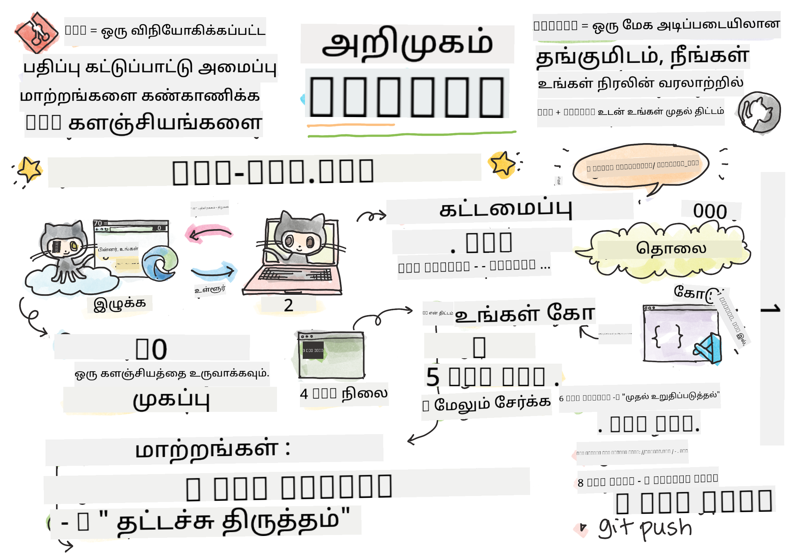
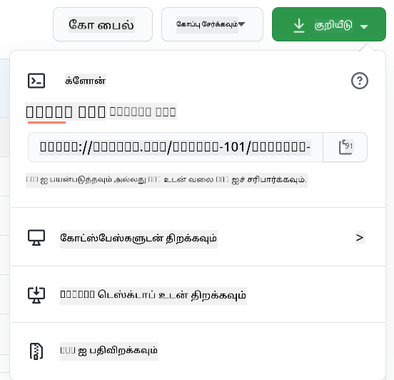

<!--
CO_OP_TRANSLATOR_METADATA:
{
  "original_hash": "ea65b75e488aa33a3cc5cb1c6c3f047a",
  "translation_date": "2025-10-11T11:52:25+00:00",
  "source_file": "1-getting-started-lessons/2-github-basics/README.md",
  "language_code": "ta"
}
-->
# GitHub அறிமுகம்

இந்த பாடத்தில் உங்கள் குறியீட்டின் மாற்றங்களை நிர்வகிக்கவும், ஹோஸ்ட் செய்யவும் உதவும் GitHub பற்றிய அடிப்படைகளை கற்றுக்கொள்வோம்.


> [Tomomi Imura](https://twitter.com/girlie_mac) உருவாக்கிய ஸ்கெட்ச்

## முன்-பாடம் வினாடி வினா
[முன்-பாடம் வினாடி வினா](https://ff-quizzes.netlify.app)

## அறிமுகம்

இந்த பாடத்தில் நாம் கற்றுக்கொள்ளப் போவது:

- உங்கள் கணினியில் நீங்கள் செய்யும் பணியை கண்காணிக்க
- மற்றவர்களுடன் திட்டங்களில் பணியாற்ற
- திறந்த மூல மென்பொருளுக்கு எப்படி பங்களிக்கலாம்

### முன்-தயாரிப்பு

தொடங்குவதற்கு முன், Git நிறுவப்பட்டுள்ளதா என்பதை சரிபார்க்க வேண்டும். டெர்மினலில் இவ்வாறு தட்டச்சு செய்யவும்: 
`git --version`

Git நிறுவப்படவில்லை என்றால், [Git பதிவிறக்கவும்](https://git-scm.com/downloads). பின்னர், உங்கள் உள்ளூர் Git சுயவிவரத்தை டெர்மினலில் அமைக்கவும்:
* `git config --global user.name "your-name"`
* `git config --global user.email "your-email"`

Git ஏற்கனவே அமைக்கப்பட்டுள்ளதா என்பதை சரிபார்க்க, நீங்கள் இவ்வாறு தட்டச்சு செய்யலாம்:
`git config --list`

உங்களுக்கு GitHub கணக்கு, ஒரு குறியீட்டு எடிட்டர் (Visual Studio Code போன்றது), மற்றும் உங்கள் டெர்மினலை (அல்லது: கமாண்டு ப்ராம்ப்ட்) திறக்க வேண்டும்.

[github.com](https://github.com/) க்கு சென்று, நீங்கள் ஏற்கனவே கணக்கை உருவாக்கவில்லை என்றால், ஒரு கணக்கை உருவாக்கவும் அல்லது உள்நுழைந்து உங்கள் சுயவிவரத்தை நிரப்பவும். 

✅ GitHub உலகில் உள்ள ஒரே குறியீட்டு சேமிப்பகமாக இல்லை; மற்றவை உள்ளன, ஆனால் GitHub மிகவும் பிரபலமானது.

### தயாரிப்பு

உங்கள் உள்ளூர் கணினியில் (லேப்டாப் அல்லது PC) ஒரு குறியீட்டு திட்டத்துடன் ஒரு கோப்புறை மற்றும் GitHub இல் ஒரு பொது சேமிப்பகம் தேவைப்படும், இது மற்றவர்களின் திட்டங்களுக்கு பங்களிக்க எப்படி என்பதை எடுத்துக்காட்டாக செயல்படும்.  

---

## குறியீட்டு மேலாண்மை

உங்கள் உள்ளூர் கணினியில் ஒரு குறியீட்டு திட்டத்துடன் ஒரு கோப்புறை உள்ளது என்று கூறுவோம், மற்றும் நீங்கள் git - பதிப்பு கட்டுப்பாட்டு அமைப்பைப் பயன்படுத்தி உங்கள் முன்னேற்றத்தை கண்காணிக்கத் தொடங்க விரும்புகிறீர்கள். சிலர் git ஐ பயன்படுத்துவதை உங்கள் எதிர்கால சுயத்திற்கான காதல் கடிதம் எழுதுவதற்கு ஒப்பிடுகிறார்கள். உங்கள் commit செய்திகளை நாட்கள், வாரங்கள் அல்லது மாதங்கள் கழித்து படிக்கும்போது, நீங்கள் ஏன் ஒரு முடிவை எடுத்தீர்கள் என்பதை நினைவூட்ட முடியும், அல்லது ஒரு மாற்றத்தை "rollback" செய்ய முடியும் - அதாவது, நீங்கள் நல்ல "commit messages" எழுதும்போது.

### பணிகள்: ஒரு சேமிப்பகத்தை உருவாக்கி குறியீட்டை commit செய்யவும்  

> வீடியோவைப் பாருங்கள்
> 
> [](https://www.youtube.com/watch?v=9R31OUPpxU4)


1. **GitHub இல் சேமிப்பகத்தை உருவாக்கவும்**. GitHub.com இல், சேமிப்பகங்கள் தாவலில் அல்லது மேலே வலது பக்கத்தில் உள்ள வழிச் சாளரத்தில் **புதிய repo** பொத்தானைத் தேடவும்.

   1. உங்கள் சேமிப்பகத்திற்கு (கோப்புறை) ஒரு பெயரை வழங்கவும்
   1. **சேமிப்பகத்தை உருவாக்கவும்** என்பதைத் தேர்ந்தெடுக்கவும்.

1. **உங்கள் பணிக்கோப்புறைக்கு செல்லவும்**. உங்கள் டெர்மினலில், நீங்கள் கண்காணிக்கத் தொடங்க விரும்பும் கோப்புறைக்கு (அல்லது அடைவு) மாறவும். இவ்வாறு தட்டச்சு செய்யவும்:

   ```bash
   cd [name of your folder]
   ```

1. **git சேமிப்பகத்தை ஆரம்பிக்கவும்**. உங்கள் திட்டத்தில் இவ்வாறு தட்டச்சு செய்யவும்:

   ```bash
   git init
   ```

1. **நிலைமை சரிபார்க்கவும்**. உங்கள் சேமிப்பகத்தின் நிலையை சரிபார்க்க இவ்வாறு தட்டச்சு செய்யவும்:

   ```bash
   git status
   ```

   வெளியீடு இவ்வாறு தோன்றலாம்:

   ```output
   Changes not staged for commit:
   (use "git add <file>..." to update what will be committed)
   (use "git checkout -- <file>..." to discard changes in working directory)

        modified:   file.txt
        modified:   file2.txt
   ```

   பொதுவாக `git status` கட்டளை உங்களுக்கு சேமிப்பகத்தில் _சேமிக்க_ தயாராக உள்ள கோப்புகள் அல்லது அதில் மாற்றங்கள் உள்ளன என்பதைச் சொல்கிறது, நீங்கள் நிரந்தரமாக்க விரும்பலாம்.

1. **கோப்புகளை கண்காணிக்க சேர்க்கவும்**
   இது கோப்புகளை staging area-க்கு சேர்ப்பது என்று அழைக்கப்படுகிறது.

   ```bash
   git add .
   ```

   `git add` மற்றும் `.` வாதம் உங்கள் அனைத்து கோப்புகள் மற்றும் மாற்றங்களை கண்காணிக்கச் செய்கிறது. 

1. **தேர்ந்தெடுக்கப்பட்ட கோப்புகளை கண்காணிக்க சேர்க்கவும்**

   ```bash
   git add [file or folder name]
   ```

   இது அனைத்து கோப்புகளையும் ஒரே நேரத்தில் commit செய்ய விரும்பாத போது, தேர்ந்தெடுக்கப்பட்ட கோப்புகளை மட்டுமே staging area-க்கு சேர்க்க உதவுகிறது.

1. **அனைத்து கோப்புகளை staging area-ல் இருந்து நீக்கவும்**

   ```bash
   git reset
   ```

   இந்த கட்டளை அனைத்து கோப்புகளையும் ஒரே நேரத்தில் staging area-ல் இருந்து நீக்க உதவுகிறது.

1. **ஒரு குறிப்பிட்ட கோப்பை staging area-ல் இருந்து நீக்கவும்**

   ```bash
   git reset [file or folder name]
   ```

   இந்த கட்டளை ஒரு குறிப்பிட்ட கோப்பை மட்டுமே staging area-ல் இருந்து நீக்க உதவுகிறது, அதை அடுத்த commit-க்கு சேர்க்க விரும்பாத போது.

1. **உங்கள் பணியை நிரந்தரமாக்கவும்**. இந்த நேரத்தில் நீங்கள் கோப்புகளை _staging area_ எனப்படும் இடத்திற்கு சேர்த்துள்ளீர்கள். Git உங்கள் கோப்புகளை கண்காணிக்கிறது. மாற்றத்தை நிரந்தரமாக்க, நீங்கள் கோப்புகளை _commit_ செய்ய வேண்டும். `git commit` கட்டளையைப் பயன்படுத்தி _commit_ உருவாக்கவும். _commit_ என்பது உங்கள் சேமிப்பகத்தின் வரலாற்றில் ஒரு சேமிப்பு புள்ளியை பிரதிநிதித்துவப்படுத்துகிறது. _commit_ உருவாக்க இவ்வாறு தட்டச்சு செய்யவும்:

   ```bash
   git commit -m "first commit"
   ```

   இது உங்கள் அனைத்து கோப்புகளையும் commit செய்கிறது, "first commit" என்ற செய்தியைச் சேர்க்கிறது. எதிர்கால commit செய்திகளுக்கு, நீங்கள் செய்த மாற்றத்தின் வகையை விளக்குவதற்கு மேலும் விவரமான விளக்கத்தை வழங்க விரும்புவீர்கள்.

1. **உங்கள் உள்ளூர் Git சேமிப்பகத்தை GitHub உடன் இணைக்கவும்**. உங்கள் கணினியில் உள்ள Git சேமிப்பகம் நல்லது, ஆனால் ஒரு கட்டத்தில் உங்கள் கோப்புகளின் காப்புப்பிரதி எங்காவது இருக்க வேண்டும், மேலும் உங்கள் சேமிப்பகத்தில் மற்றவர்களை உங்களுடன் பணியாற்ற அழைக்க வேண்டும். GitHub என்பது அதற்கான ஒரு சிறந்த இடமாகும். நாம் ஏற்கனவே GitHub இல் ஒரு சேமிப்பகத்தை உருவாக்கியுள்ளோம், எனவே நாம் செய்ய வேண்டியது உங்கள் உள்ளூர் Git சேமிப்பகத்தை GitHub உடன் இணைப்பது மட்டுமே. `git remote add` கட்டளை அதைச் செய்யும். கீழே உள்ள கட்டளையைத் தட்டச்சு செய்யவும்:

   > குறிப்பு, கட்டளையைத் தட்டச்சு செய்வதற்கு முன், உங்கள் GitHub சேமிப்பகப் பக்கத்திற்கு சென்று சேமிப்பக URL ஐத் தேடவும். நீங்கள் அதை கீழே உள்ள கட்டளையில் பயன்படுத்துவீர்கள். ```https://github.com/username/repository_name.git``` ஐ உங்கள் GitHub URL உடன் மாற்றவும்.

   ```bash
   git remote add origin https://github.com/username/repository_name.git
   ```

   இது "origin" எனப்படும் ஒரு _remote_ அல்லது இணைப்பை உருவாக்குகிறது, நீங்கள் முன்பே உருவாக்கிய GitHub சேமிப்பகத்தைச் சுட்டுகிறது.

1. **உங்கள் உள்ளூர் கோப்புகளை GitHub க்கு அனுப்பவும்**. இதுவரை நீங்கள் உள்ளூர் சேமிப்பகத்திற்கும் GitHub சேமிப்பகத்திற்கும் இடையே ஒரு _இணைப்பு_ உருவாக்கியுள்ளீர்கள். இந்த கோப்புகளை GitHub க்கு அனுப்ப `git push` கட்டளையைப் பயன்படுத்தவும்:

   > குறிப்பு, உங்கள் கிளையின் பெயர் ```main``` என்பதிலிருந்து மாறுபடலாம்.

   ```bash
   git push -u origin main
   ```

   இது உங்கள் "main" கிளையில் commit செய்தவற்றை GitHub க்கு அனுப்புகிறது. `upstream` கிளையை அமைத்தல் மற்றும் கட்டளையில் `-u` ஐ சேர்த்தல் உங்கள் உள்ளூர் கிளை மற்றும் தொலைகோள் கிளை இடையே ஒரு இணைப்பை நிறுவுகிறது, எனவே எதிர்கால கட்டளைகளில் கிளையின் பெயரை குறிப்பிடாமல் நீங்கள் எளிதாக git push அல்லது git pull ஐப் பயன்படுத்தலாம்.

2. **மேலும் மாற்றங்களைச் சேர்க்க**. நீங்கள் மாற்றங்களைச் செய்யத் தொடர விரும்பினால், அவற்றை GitHub க்கு push செய்ய, நீங்கள் கீழே உள்ள மூன்று கட்டளைகளைப் பயன்படுத்த வேண்டும்:

   ```bash
   git add .
   git commit -m "type your commit message here"
   git push
   ```

   > குறிப்புகள், நீங்கள் `.gitignore` கோப்பை ஏற்றுக்கொள்ள விரும்பலாம், இது நீங்கள் GitHub இல் கண்காணிக்க விரும்பாத கோப்புகளைத் தடுக்கும் - பொதுச் சேமிப்பகத்தில் இடமில்லாத குறிப்புகள் கோப்பைப் போன்றது. `.gitignore` கோப்புகளுக்கான டெம்ப்ளேட்களை [.gitignore templates](https://github.com/github/gitignore) இல் காணலாம்.

#### Commit செய்தி

ஒரு சிறந்த Git commit தலைப்பு வரி பின்வரும் வாக்கியத்தை முடிக்கிறது:
இந்த commit பயன்படுத்தப்பட்டால் <உங்கள் தலைப்பு வரி இங்கே>

தலைப்புக்கு கட்டளை, நிகழ்கால tense ஐப் பயன்படுத்தவும்: "change" என்று எழுதவும், "changed" அல்லது "changes" என்று அல்ல. 
தலைப்பில் உள்ளதைப் போலவே, உடல் (விருப்பம்) இல் கட்டளை, நிகழ்கால tense ஐப் பயன்படுத்தவும். உடலில் மாற்றத்திற்கான உந்துதலைச் சேர்க்கவும், முந்தைய நடத்தைவுடன் இதை ஒப்பிடவும். நீங்கள் `எப்படி` என்பதை அல்ல, `ஏன்` என்பதை விளக்குகிறீர்கள்.

✅ சில நிமிடங்கள் GitHub ஐ சுற்றி தேடுங்கள். நீங்கள் ஒரு மிகச் சிறந்த commit செய்தியை கண்டுபிடிக்க முடியுமா? நீங்கள் மிகவும் குறைந்த commit செய்தியை கண்டுபிடிக்க முடியுமா? commit செய்தியில் எந்த தகவல் மிகவும் முக்கியமானது மற்றும் பயனுள்ளதாக இருக்கும் என்று நீங்கள் நினைக்கிறீர்கள்?

### பணிகள்: ஒத்துழைப்பு

GitHub இல் விஷயங்களை வைப்பதற்கான முக்கிய காரணம் மற்ற டெவலப்பர்களுடன் ஒத்துழைக்கச் செய்வதற்காகவே.

## மற்றவர்களுடன் திட்டங்களில் பணியாற்றுதல்

> வீடியோவைப் பாருங்கள்
>
> [](https://www.youtube.com/watch?v=bFCM-PC3cu8)

உங்கள் சேமிப்பகத்தில், `Insights > Community` க்கு செல்லவும், உங்கள் திட்டம் பரிந்துரைக்கப்பட்ட சமூக தரநிலைகளுடன் எப்படி ஒப்பிடப்படுகிறது என்பதைப் பாருங்கள்.

   உங்கள் GitHub சேமிப்பகத்தை மேம்படுத்த உதவக்கூடிய சில விஷயங்கள்:
   - **விளக்கம்**. உங்கள் திட்டத்திற்கு விளக்கம் சேர்த்தீர்களா?
   - **README**. நீங்கள் README சேர்த்தீர்களா? GitHub ஒரு [README](https://docs.github.com/articles/about-readmes/?WT.mc_id=academic-77807-sagibbon) எழுத வழிகாட்டுதலை வழங்குகிறது.
   - **பங்களிப்பு வழிகாட்டுதல்**. உங்கள் திட்டத்தில் [பங்களிப்பு வழிகாட்டுதல்கள்](https://docs.github.com/articles/setting-guidelines-for-repository-contributors/?WT.mc_id=academic-77807-sagibbon) உள்ளனவா? 
   - **நடத்தை விதிமுறைகள்**. ஒரு [Code of Conduct](https://docs.github.com/articles/adding-a-code-of-conduct-to-your-project/) உள்ளதா? 
   - **உரிமம்**. மிக முக்கியமாக, ஒரு [license](https://docs.github.com/articles/adding-a-license-to-a-repository/) உள்ளதா?

இந்த அனைத்து வளங்களும் புதிய குழு உறுப்பினர்களை onboarding செய்ய உதவும். மேலும், புதிய பங்களிப்பாளர்கள் உங்கள் குறியீட்டை பார்க்கும் முன், உங்கள் திட்டம் அவர்களின் நேரத்தை செலவிட சரியான இடமா என்பதை அறிய, இவை போன்ற விஷயங்களைப் பார்க்கிறார்கள்.

✅ README கோப்புகள், அவற்றைத் தயாரிக்க நேரம் எடுத்துக்கொள்கின்றன, ஆனால் பிஸியான பராமரிப்பாளர்களால் அவற்றை புறக்கணிக்கப்படுகின்றன. குறிப்பாக விளக்கமான ஒரு README ஐ நீங்கள் கண்டுபிடிக்க முடியுமா? குறிப்புகள்: [சிறந்த README-களை உருவாக்க உதவும் சில கருவிகள்](https://www.makeareadme.com/) உள்ளன, நீங்கள் முயற்சிக்க விரும்பலாம்.

### பணிகள்: சில குறியீட்டை இணைக்கவும்

பங்களிப்பு ஆவணங்கள் திட்டத்திற்கு பங்களிக்க மக்களுக்கு உதவுகின்றன. நீங்கள் எந்த வகையான பங்களிப்புகளை எதிர்பார்க்கிறீர்கள் மற்றும் செயல்முறை எப்படி செயல்படுகிறது என்பதை இது விளக்குகிறது. பங்களிப்பாளர்கள் உங்கள் GitHub சேமிப்பகத்திற்கு பங்களிக்க சில படிகளை கடந்து செல்ல வேண்டும்:

1. **உங்கள் சேமிப்பகத்தை fork செய்ய**. நீங்கள் மக்களை உங்கள் திட்டத்தை _fork_ செய்ய விரும்புவீர்கள். Fork செய்வது அவர்களின் GitHub சுயவிவரத்தில் உங்கள் சேமிப்பகத்தின் பிரதியை உருவாக்குவதை பொருள்படுத்துகிறது.
1. **Clone**. அதிலிருந்து அவர்கள் திட்டத்தை அவர்களின் உள்ளூர் கணினிக்கு clone செய்வார்கள். 
1. **ஒரு கிளையை உருவாக்கவும்**. நீங்கள் அவர்களை அவர்களின் பணிக்கான _branch_ ஐ உருவாக்குமாறு கேட்க வேண்டும். 
1. **ஒரு பகுதியை மட்டுமே கவனிக்க**. பங்களிப்பாளர்கள் ஒரே நேரத்தில் ஒரு விஷயத்தில் மட்டுமே கவனம் செலுத்துமாறு கேட்கவும் - அதனால் அவர்கள் செய்த பணியை _merge_ செய்யும் வாய்ப்பு அதிகமாக இருக்கும். அவர்கள் ஒரு பிழையை சரிசெய்து, ஒரு புதிய அம்சத்தைச் சேர்த்து, பல சோதனைகளைப் புதுப்பிக்கிறார்கள் என்று கற்பனை செய்யுங்கள் - நீங்கள் 3 இல் 2 அல்லது 3 இல் 1 மாற்றங்களை மட்டுமே செயல்படுத்த விரும்பினால் என்ன?

✅ கிளைகள் நல்ல குறியீட்டை எழுதுவதற்கும் வெளியிடுவதற்கும் குறிப்பாக முக்கியமான சூழலை கற்பனை செய்யுங்கள். நீங்கள் எந்த பயன்பாட்டு வழக்குகளை நினைக்கிறீர்கள்?

> குறிப்பு, நீங்கள் உலகில் காண விரும்பும் மாற்றமாக இருங்கள், மற்றும் உங்கள் சொந்த பணிக்காக கிளைகளை உருவாக்குங்கள். நீங்கள் செய்யும் எந்த commit-களும் நீங்கள் தற்போது "checked out" செய்யும் கிளையில் செய்யப்படும். `git status` ஐப் பயன்படுத்தி எந்த கிளையில் இருக்கிறீர்கள் என்பதைப் பாருங்கள்.

ஒரு பங்களிப்பாளர் வேலைப்போக்கு மூலம் செல்லலாம். பங்களிப்பாளர் ஏற்கனவே _forked_ மற்றும் _cloned_ சேமிப்பகத்தை வைத்திருக்கிறார் என்று கருதுங்கள், எனவே அவர்களிடம் உள்ளூர் கணினியில் வேலை செய்ய தயாராக ஒரு Git சேமிப்பகம் உள்ளது:

1. **ஒரு கிளையை உருவாக்கவும்**. அவர்கள் பங்களிக்க நினைக்கும் மாற்றங்களை உள்ளடக்கும் கிளையை உருவாக்க `git branch` கட்டளையைப் பயன்படுத்தவும்:

   ```bash
   git branch [branch-name]
   ```

1. **வேலை செய்யும் கிளைக்கு மாறவும்**. குறிப்பிட்ட கிளைக்கு மாறவும் மற்றும் `git switch` மூலம் வேலை செய்யும் அடைவைப் புதுப்பிக்கவும்:

   ```bash
   git switch [branch-name]
   ```

1. **வேலை செய்யவும்**. இந்த நேரத்தில் நீங்கள் உங்கள் மாற்றங்களைச் சேர்க்க விரும்புகிறீர்கள். அதை Git-க்கு சொல்ல மறக்காதீர்கள், கீழே உள்ள கட்டளைகளைப் பயன்படுத்தவும்:

   ```bash
   git add .
   git commit -m "my changes"
   ```

   உங்கள் commit-க்கு ஒரு நல்ல பெயரை வழங்குவது முக்கியம், உங்கள் நலனுக்காகவும், நீங்கள் உதவுகிற சேமிப்பகத்தின் பராமரிப்பாளருக்காகவும்.

1. **உங்கள் பணியை `main` கிளையுடன் இணைக்கவும்**. ஒரு கட்டத்தில் நீங்கள் வேலை முடித்துவிட்டீர்கள், மேலும் உங்கள் பணியை `main` கிளையின் பணியுடன் இணைக்க விரும்புகிறீர்கள். `main` கிளை இதற்கிடையில் மாற்றப்பட்டிருக்கலாம், எனவே முதலில் அதை கீழே உள்ள கட்டளைகளைப் பயன்படுத்தி சமீபத்தியதாக புதுப்பிக்கவும்:

   ```bash
   git switch main
   git pull
   ```

   இந்த நேரத்தில் எந்த _conflicts_ (Git மாற்றங்களை எளிதாக _combine_ செய்ய முடியாத சூழல்கள்) உங்கள் வேலை செய்யும் கிளையில் நடக்கின்றன என்பதை உறுதிப்படுத்த விரும்புகிறீர்கள். எனவே கீழே உள்ள கட்டளைகளை இயக்கவும்:

   ```bash
   git switch [branch_name]
   git merge main
   ```

   `git merge main` கட்டளை `main` இல் உள்ள அனைத்து மாற்றங்களையும் உங்கள் கிளைக்கு கொண்டு வரும். நம்புகிறேன் நீங்கள் தொடரலாம். இல்லையெனில், VS Code உங்களுக்கு Git எங்கு _confused_ ஆகிறது என்பதைச் சொல்வது, மேலும் பாதிக்கப்பட்ட கோப்புகளை மாற்றி எந்த உள்ளடக்கம் மிகவும் சரியானது என்பதைச் சொல்ல வேண்டும்.

   வேறு கிளைக்கு மாற, நவீன `git switch` கட்டளையைப் பயன்படுத்தவும்:
   ```bash
   git switch [branch_name]

1. **உங்கள் பணியை GitHub க்கு அனுப்பவும்**. உங்கள் பணியை GitHub க்கு அனுப்புவது இரண்டு விஷயங்களை பொருள்படுத்துகிறது. உங்கள் கிளையை உங்கள் சேமிப்பகத்திற்கு push செய்வது மற்றும் பின்னர் ஒரு PR (Pull Request) திறக்கவும்.

   ```bash
   git push --set-upstream origin [branch-name]
   ```

   மேலே உள்ள கட்டளை உங்கள் forked சேமிப்பகத்தில் கிளையை உருவாக்குகிறது.
1. **PR திறக்கவும்**. அடுத்ததாக, நீங்கள் PR (Pull Request) ஒன்றைத் திறக்க வேண்டும். இதற்கு, GitHub-ல் நீங்கள் fork செய்த repo-க்கு செல்ல வேண்டும். GitHub-ல் நீங்கள் புதிய PR ஒன்றை உருவாக்க விரும்புகிறீர்களா என்று கேட்கும் ஒரு சுட்டி இருக்கும்; அதை கிளிக் செய்தால், commit message தலைப்பை மாற்றவும், மேலும் பொருத்தமான விளக்கத்தை வழங்கவும் ஒரு இடைமுகத்திற்கு நீங்கள் கொண்டு செல்லப்படுவீர்கள். இப்போது நீங்கள் fork செய்த repo-வின் maintainer இந்த PR-ஐ பார்க்க முடியும், _விரல்கள் கோர்த்துக்கொண்டு_, அவர்கள் இதை பாராட்டி _merge_ செய்வார்கள் என்று நம்பலாம். நீங்கள் இப்போது ஒரு contributor, வாழ்த்துக்கள் :)

1. **சுத்தம் செய்யவும்**. PR ஒன்றை வெற்றிகரமாக merge செய்த பிறகு, _சுத்தம் செய்ய_ வேண்டும் என்பது நல்ல பழக்கமாகக் கருதப்படுகிறது. உங்கள் local branch மற்றும் GitHub-க்கு push செய்த branch இரண்டையும் சுத்தம் செய்ய வேண்டும். முதலில், கீழே உள்ள கட்டளையைப் பயன்படுத்தி local-ல் அதை நீக்குவோம்:

   ```bash
   git branch -d [branch-name]
   ```
  
   அதன் பிறகு, fork செய்த repo-வின் GitHub பக்கத்திற்கு சென்று, நீங்கள் push செய்த remote branch-ஐ நீக்கவும்.

`Pull request` என்பது ஒரு சில்லி சொல் போல தோன்றலாம், ஏனெனில் நீங்கள் உங்கள் மாற்றங்களை project-க்கு push செய்ய விரும்புகிறீர்கள். ஆனால் maintainer (project owner) அல்லது core குழு உங்கள் மாற்றங்களை project's "main" branch-இன் மீது merge செய்ய முன் பரிசீலிக்க வேண்டும், எனவே நீங்கள் maintainer-இன் மாற்ற தீர்மானத்தை கோருகிறீர்கள்.

Pull request என்பது branch-ல் அறிமுகப்படுத்தப்பட்ட வேறுபாடுகளை reviews, comments, integrated tests மற்றும் பலவற்றுடன் ஒப்பிடவும், விவாதிக்கவும் இடமாகும். ஒரு நல்ல pull request commit message-க்கு ஒத்த விதிமுறைகளை பின்பற்றுகிறது. உங்கள் வேலை ஒரு issue-ஐ தீர்க்கிறது என்றால், issue tracker-ல் issue-க்கு reference சேர்க்கலாம். இது `#` மற்றும் உங்கள் issue எண்ணை பயன்படுத்தி செய்யப்படுகிறது. உதாரணமாக `#97`.

🤞விரல்கள் கோர்த்துக்கொண்டு அனைத்து checks-களும் pass ஆகி, project owner(s) உங்கள் மாற்றங்களை project-க்கு merge செய்வார்கள்🤞

GitHub-ல் உள்ள remote branch-இன் அனைத்து புதிய commits-களையும் உங்கள் current local working branch-இல் update செய்ய:

`git pull`

## Open source-க்கு எப்படி பங்களிக்கலாம்

முதலில், GitHub-ல் உங்களுக்கு விருப்பமான மற்றும் நீங்கள் மாற்றம் செய்ய விரும்பும் repository (அல்லது **repo**) ஒன்றைத் தேடுவோம். அதன் உள்ளடக்கங்களை உங்கள் கணினிக்கு copy செய்ய வேண்டும்.

✅ 'Beginner-friendly' repos-ஐ [good-first-issue tag மூலம் தேடுவது](https://github.blog/2020-01-22-browse-good-first-issues-to-start-contributing-to-open-source/) ஒரு நல்ல வழியாகும்.



Code-ஐ copy செய்ய பல வழிகள் உள்ளன. ஒரு வழி repository-யின் உள்ளடக்கங்களை HTTPS, SSH அல்லது GitHub CLI (Command Line Interface) மூலம் "clone" செய்வது.

உங்கள் terminal-ஐ திறந்து repository-யை clone செய்ய:
`git clone https://github.com/ProjectURL`

Project-ல் வேலை செய்ய, சரியான folder-க்கு மாற்றவும்:
`cd ProjectURL`

GitHub-ன் embedded code editor / cloud development environment [Codespaces](https://github.com/features/codespaces) அல்லது [GitHub Desktop](https://desktop.github.com/) மூலம் project-ஐ முழுமையாக திறக்கவும்.

இறுதியாக, code-ஐ zipped folder-ஆக download செய்யலாம்.

### GitHub-ல் சில சுவாரஸ்யமான விஷயங்கள்

GitHub-ல் எந்த public repository-யையும் star, watch மற்றும் "fork" செய்யலாம். உங்கள் starred repositories-ஐ மேலே வலது பக்கம் drop-down menu-வில் காணலாம். இது code-க்கு bookmarking போன்றது.

Projects-க்கு issue tracker இருக்கும், பெரும்பாலும் GitHub-ல் "Issues" tab-இல், project-க்கு தொடர்பான பிரச்சினைகளை மக்கள் விவாதிக்கின்றனர். Pull Requests tab-ல் மக்கள் நடந்து கொண்டிருக்கும் மாற்றங்களை விவாதிக்கின்றனர் மற்றும் review செய்கின்றனர்.

Projects-க்கு forums, mailing lists அல்லது Slack, Discord அல்லது IRC போன்ற chat channels-ல் விவாதங்கள் இருக்கலாம்.

✅ உங்கள் புதிய GitHub repo-வை சுற்றி பாருங்கள் மற்றும் settings-ஐ edit செய்வது, repo-க்கு தகவல்களைச் சேர்ப்பது, மற்றும் ஒரு project (Kanban board போன்ற) உருவாக்குவது போன்ற சில விஷயங்களை முயற்சிக்கவும். நீங்கள் செய்யக்கூடிய விஷயங்கள் நிறைய உள்ளன!

---

## 🚀 சவால்

ஒரு நண்பருடன் இணைந்து ஒருவரின் code-ல் வேலை செய்யுங்கள். கூட்டாக project ஒன்றை உருவாக்கி, code-ஐ fork செய்து, branches உருவாக்கி, மாற்றங்களை merge செய்யுங்கள்.

## Post-Lecture Quiz  
[Post-lecture quiz](https://ff-quizzes.netlify.app/web/en/)

## Review & Self Study  

[Open source software-க்கு பங்களிக்க](https://opensource.guide/how-to-contribute/#how-to-submit-a-contribution) பற்றிய மேலும் வாசிக்கவும்.

[Git cheatsheet](https://training.github.com/downloads/github-git-cheat-sheet/).

பயிற்சி, பயிற்சி, பயிற்சி. GitHub-ல் [skills.github.com](https://skills.github.com) மூலம் சிறந்த learning paths கிடைக்கின்றன:

- [GitHub-ல் முதல் வாரம்](https://skills.github.com/#first-week-on-github)

மேலும் advanced courses-ஐ நீங்கள் காணலாம்.

## Assignment  

[GitHub-ல் முதல் வாரம் course](https://skills.github.com/#first-week-on-github) ஐ முடிக்கவும்.

---

**குறிப்பு**:  
இந்த ஆவணம் [Co-op Translator](https://github.com/Azure/co-op-translator) என்ற AI மொழிபெயர்ப்பு சேவையை பயன்படுத்தி மொழிபெயர்க்கப்பட்டுள்ளது. எங்கள் நோக்கம் துல்லியமாக இருக்க வேண்டும் என்பதுதான், ஆனால் தானியங்கி மொழிபெயர்ப்புகளில் பிழைகள் அல்லது துல்லியமின்மைகள் இருக்கக்கூடும் என்பதை தயவுசெய்து கவனத்தில் கொள்ளவும். அதன் தாய்மொழியில் உள்ள மூல ஆவணம் அதிகாரப்பூர்வ ஆதாரமாக கருதப்பட வேண்டும். முக்கியமான தகவல்களுக்கு, தொழில்முறை மனித மொழிபெயர்ப்பு பரிந்துரைக்கப்படுகிறது. இந்த மொழிபெயர்ப்பைப் பயன்படுத்துவதால் ஏற்படும் எந்த தவறான புரிதல்கள் அல்லது தவறான விளக்கங்களுக்கு நாங்கள் பொறுப்பல்ல.