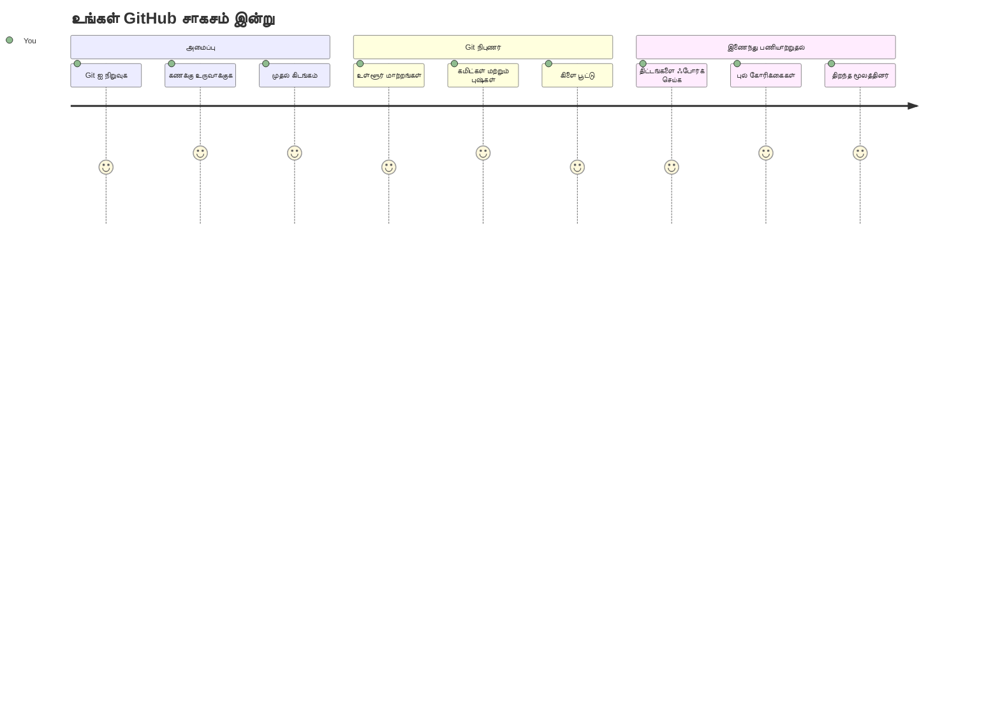
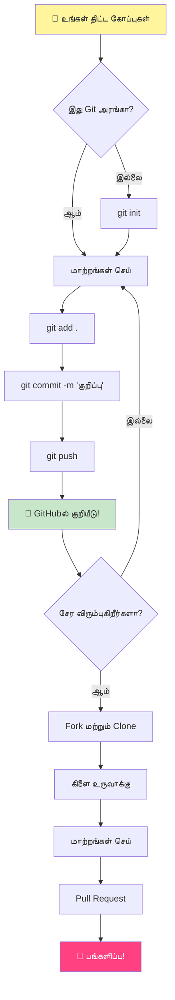
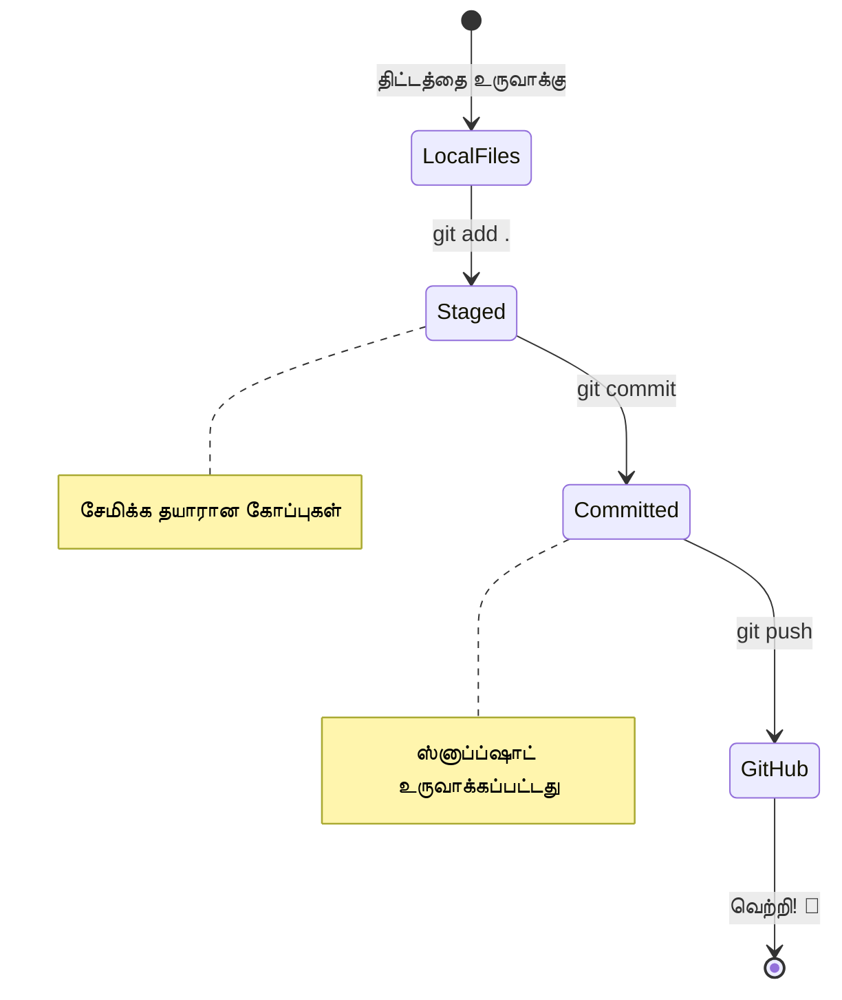
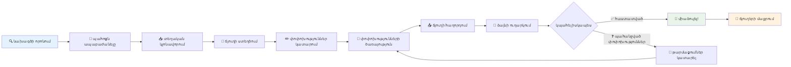
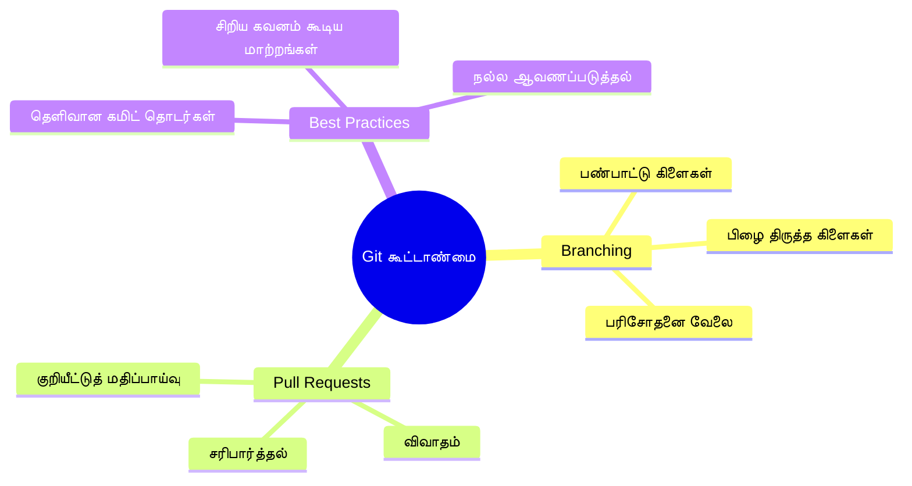
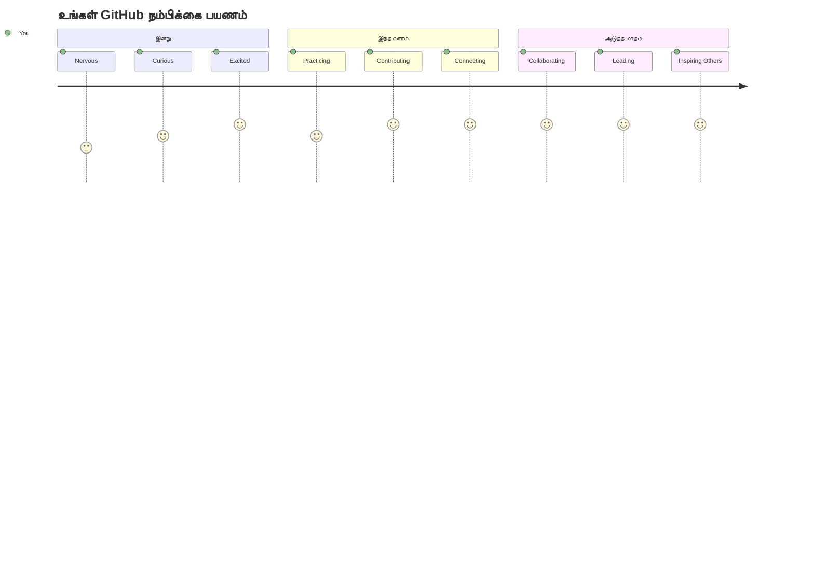

<!--
CO_OP_TRANSLATOR_METADATA:
{
  "original_hash": "5c383cc2cc23bb164b06417d1c107a44",
  "translation_date": "2026-01-07T14:00:42+00:00",
  "source_file": "1-getting-started-lessons/2-github-basics/README.md",
  "language_code": "ta"
}
-->
# GitHub அறிமுகம்

ஹேய் அங்கே, எதிர்கால டெவலப்பர்! 👋 உலகம் முழுவதும் இருக்கும் மில்லியன் கணக்கான கோடரர்களில் சேர தயாரா? GitHub-ஐ அறிமுகப்படுத்த நான் உண்மையிலேயே உற்சாகமாக இருக்கிறேன் – இதைโปรகிராமர்களுக்கான சமூக ஊடக தளமாகக் கணிக்கவும், உன் மதிய உணவின் புகைப்படங்களைப் பகிர்வதற்கு பதிலாக, நாம் குறியீடுகளை பகிர்ந்து அற்புதமான விஷயங்களை ஒன்றாக கட்டியெடுப்போம்!

என்னென்ன எனக்கு மிகவும் அதிர்ச்சியாகும்: உன் கைப்பேசியில் இருக்கும் ஒவ்வொரு செயலியும், நீ பார்க்கும் ஒவ்வொரு வலைத்தளமும், மற்றும் நீ கற்றுக்கொள்ளப்போகும் பல கருவிகளும் GitHub போன்ற தளங்களில் ஒன்றாக கூட்டு முயற்சியில் இருந்த டெவலப்பர் குழுவினர் உருவாக்கினார்கள். நீ விரும்பும் அந்த இசை செயலி? உன்னைப் போன்ற ஒருவன் அதில் பங்களித்திருக்கான். நீ விட முடியாத அந்த விளையாட்டு? ஆம், அது GitHub கூட்டு முயற்சியால் உருவாக்கப்பட்டிருக்க வாய்ப்பு உள்ளது. இப்போது நீ அந்த அதிசயமான சமூகத்தில் ஒரு பகுதியாய் ஆக போகிறாய்!

இது முதலில் கொஞ்சம் கடினமாகத் தோன்றலாம் என்பதை நான் அறிவேன் – நான் எனது முதல் GitHub பக்கத்தைக் கண்டு "இது எல்லாம் உருவிலவா?" என நினைத்தேன். ஆனால் உண்மை என்னவென்றால்: ஒவ்வொரு டெவலப்பரும் இப்போது நீ இருக்கிற இடத்திலே துவங்கினார்கள். இந்த பாடத்தின் முடிவில், உனக்கு சொந்த GitHub களஞ்சியம் இருக்கும் (இது கணினித்தடத்தில் உன் தனிப்பட்ட திட்டக் காட்சிப்படுத்தலில் போன்றது), மற்றும் உன் வேலைகளைச் சேமித்து, மற்றவர்களுடன் பகிர்ந்து, சாதாரண ஆட்களால் பயன்படுத்தப்படும் திட்டங்களுக்கு பங்களிக்க கற்றுக்கொள்ளுவாய்.

நாம் இந்த பயணத்தை ஒன்றாகச் செய்கிறோம், ஒரு படி ஒருவிதமாக. வேகமடைய வேண்டாம், அழுத்தம் வேண்டாம் – நீ, நான், மற்றும் உன் புதிய நல்ல நண்பர்களாக இருக்கும் சில அற்புதமான கருவிகள்!


> ஸ்கெட்ச் நோட்டு: [Tomomi Imura](https://twitter.com/girlie_mac)


## முன்-பாட கணக்கு
[Pre-lecture quiz](https://ff-quizzes.netlify.app)

## அறிமுகம்

மிகவும் சுவாரஸ்யமான விஷயங்களில் மூழ்குவதற்கு முன் உன் கணினியை GitHub மாயைச் செய்ய தயாராக விடுவோம்! இது ஓர் கலைப் பொருட்கள் ஒழுங்குபடுத்துவதுபோல் ஆகும்– சரியான கருவிகள் தயார் செய்தால், எல்லாமே எளிமையாகவும், மிக சுவாரஸ்யமாகவும் இருக்கும்.

நான் உன்னை ஒவ்வொரு அமைப்பு படிகளிலும் நேரடியாக வழிநடத்துவேன், மற்றும் இது முதலில் தோன்றும் போல பயங்கரமல்ல என்று உறுதியளிக்கிறேன். ஒன்றும் உடனுக்குடன் புரியவில்லை என்றால் அது முற்றிலும் இயல்பானது! நான் எனது முதல் வளர்ச்சிக் சூழலை அமைத்த போது பழம்பெரும் சின்னங்களைக் (ஹையரோக்ளிப்ஸ்) படிக்க முயற்சிப்பதாகக் கிடைத்தேன். ஒவ்வொரு டெவலப்பரும் இப்போது நீ இருக்கிற இடத்திலே இருந்தனர், அவர்கள் சரியாக செய்கிறார்களா என்று கேள்விப்பட்டனர். ஓப்பன் ரகசியம்: நீ இங்கு கற்றுக் கொண்டு இருப்பதால், நீ ஏற்கனவே சரியாக செய்து வருகிறாய்! 🌟

இந்த பாடத்தில் நாம் உரையாடுவோம்:

- உன் கணினியில் செய்கிற வேலைகளை கண்காணிப்பது
- மற்றவர்களுடன் திட்டங்களில் வேலை செய்வது
- திறந்த மூல மென்பொருள் பங்களிப்பது எப்படி என்பது

### முன்-களஞ்சியம்

உன் கணினி GitHub மாயைக்கு தயாராக இருக்கட்டும்! அச்சமூட்டி இருக்க வேண்டாம் – இந்த அமைப்பு ஒருமுறை மட்டும் செய்ய வேண்டியது, அதன் பிறகு உன் முழுத்தாண்டு கோடிங் பயணத்திற்கு இது தடைசெய்யும்.

சரி, அடிப்படையிலிருந்து தொடங்குவோம்! முதலில், Git உன் கணினியில் ஏற்கனவே இருக்கிறதா என்பதை சரிபார்ப்போம். Git என்பது உன் குறியீட்டில் செய்கிற ஒவ்வொரு மாற்றத்தையும் நினைவில் வைக்கும் மிக திறமையான உதவியாளராகும் – Ctrl+S ஐ இரண்டு வினாடிகளில் ஒருமுறை அழுத்த முயற்சிப்பதைவிட இது கொஞ்சம் அதிகம்!

Git நிறுவலாகியுள்ளதா என்று பார்க்க:

`git --version`

Git இல்லை என்றால் கவலைப்படாதே! [download Git](https://git-scm.com/downloads) க்கு சென்று அதைப் பெற்று நிறுவு. நிறுவிய பின், Git ஐ உனக்கு முறையாக அறிமுகப்படுத்த வேண்டியது உள்ளது:

> 💡 **முதல் முறையில் அமைப்பு**: இக்கட்டளைகள் Git-க்கு நீ யார் என்பதைச் சொல்கின்றன. இது உன் ஒவ்வொரு commit க்கும் இணைக்கப்படும், ஆகையால் நீ பகிர விரும்பும் பெயர் மற்றும் மின்னஞ்சல் முகவரி தேர்ந்தெடு.

```bash
git config --global user.name "your-name"
git config --global user.email "your-email"
```

Git ஏற்கனவே அமைக்கப்பட்டதா எனச் சொல்ல இதை பயன்படுத்தலாம்:
```bash
git config --list
```

இன்னும் GitHub கணக்கு, குறியீட்டு தொகுப்பி (Visual Studio Code போன்றது), மற்றும் உன் டெர்மினலை (அல்லது கமாண்ட் ப்ராம்ப்ட்) திறக்க வேண்டியிருக்கும்.

[github.com](https://github.com/) சென்று கணக்கு உருவாக்கு அல்லது உள்நுழைந்து உன் ப்ரொஃபைலை நிரப்புக.

💡 **நவீன சூடாய்வு**: கடவுச்சொற்கள் இல்லாமல் எளிய அங்கீகாரத்திற்கு [SSH keys](https://docs.github.com/en/authentication/connecting-to-github-with-ssh) அமைக்கவோ அல்லது [GitHub CLI](https://cli.github.com/) பயன்படுத்தவோ பரிந்துரைக்கப்படுகிறது.

✅ GitHub உலகின் ஒரே குறியீட்டுக் களஞ்சியம் அல்ல; இன்னும் உள்ளன, ஆனால் GitHub மிகவும் பிரபலமானது.

### முன்னேர்ப்பு

உனது தனிப்பட்ட கம்ப்யூட்டர் (லேப்டாப் அல்லது PC) மீது ஒரு குறியீட்டு திட்டத்துக்கான கோப்புறை மற்றும் public GitHub களஞ்சியம் இரண்டும் அவசியம், இது மற்றவர்களின் திட்டங்களுக்கு பங்களிப்பதற்கான உதாரணமாக அமையும்.

### உன் குறியீட்டை பாதுகாக்கும் வழிகள்

பாதுகாப்பு குறித்த சில விஷயங்களை பேசுவோம் – ஆனால் அச்சுறுத்தும் விஷயங்களைக் கூற மாட்டோம்! இவை காரோடு அல்லது வீட்டை பூட்டி வைப்பது போன்ற எளிய பழக்கங்களைப் போலவே உன் வலிமையான வேலைகளை பாதுகாக்கும்.

நாம் GitHub உடன் வேலை செய்ய நவீன மற்றும் பாதுகாப்பான வழிகளை ஆரம்பத்திலிருந்தே கற்றுக்கொள்ள போகிறோம். இது உனக்கு நல்ல பழக்கங்களை வளர்க்க உதவும் மற்றும் உன் முழு வளர்ச்சிப் பயணத்தில் காப்பாற்றும்.

GitHub உடன் வேலை செய்யும் போது பாதுகாப்பு சிறந்த நடைமுறைகளை பின்பற்றுவது முக்கியம்:

| பாதுகாப்பு பகுதி | சிறந்த நடைமுறை | ஏன் முக்கியம் |
|-------------------|------------------|--------------|
| **அங்கீகாரம்** | SSH விசைகள் அல்லது Personal Access Tokens பயன்படுத்து | கடவுச்சொற்கள் குறைவு பாதுகாப்புடன் உள்ளதால் கைவிடப்படுகின்றன |
| **இரட்டை காரணி அங்கீகாரம்** | GitHub கணக்கில் 2FA-வை இயக்கு | கணக்கு பாதுகாப்பிற்கு கூடுதல் அடுக்கு சேர்க்கிறது |
| **களஞ்சிய பாதுகாப்பு** | ரகசிய தகவல்களை commit செய்யாதே | API விசைகள் மற்றும் கடவுச்சொற்கள் பப்ளிக் களஞ்சியங்களில் இருக்கக்கூடாது |
| **அடிப்படைக் கோப்புகள் மேலாண்மை** | Dependabot ஐ updates க்கு இயக்கு | உன் அடிப்படை கோப்புகளை பாதுகாப்பாகவும், புதுப்பித்தவையாகவும் வைத்திருக்க உதவும் |

> ⚠️ **முக்கிய பாதுகாப்பு நினைவூட்டு**: ஒரு களஞ்சியத்திற்கும் API விசைகள், கடவுச்சொற்கள் அல்லது பிற நுணுக்கமான தகவல்களை commit செய்ய கூடாது. சோதனை குறியாக்கங்கள் மற்றும் `.gitignore` கோப்புகள் பயன்படுத்தவும்.

**நவீன அங்கீகாரம் அமைப்பு:**

```bash
# SSH விசையை உருவாக்கவும் (நவீன ed25519 ஆகோரிதம்)
ssh-keygen -t ed25519 -C "your_email@example.com"

# Git அதை பயன்படுத்த SSH அமைக்கவும்
git remote set-url origin git@github.com:username/repository.git
```

> 💡 **தனிப்பட்ட எச்சரிக்கை**: SSH விசைகள் கடவுச்சொற்கள் எப்போதும் தொடர்ந்து உள்ளிட வேண்டிய அவசியத்தை அகற்றும் மற்றும் பாரம்பரிய அங்கீகார முறைகளுக்கு மேலான பாதுகாப்பு தரும்.

---

## உன் குறியீட்டை வல்லுனர் போல நிர்வகிப்பது

சரி, இங்கே தான் விஷயங்கள் மிக சுவாரஸ்யமாக கிடக்க ஆரம்பிக்கிறது! 🎉 நாம் கற்றுக்கொள்ளப் போகிறோம் எப்படி உன் குறியீட்டை கண்டுபிடித்து நிர்வகிப்பது, உண்மையுலசெல்லவெனில் இது எனது பிடித்த பாடங்களில் ஒன்று, ஏனெனில் இது வாழ்வை மாற்றும் வகையில் அமைகிறது.

நீ ஒரு அற்புதமான கதை எழுதுகிறாய் என்று பாவனை செய், ஒவ்வொரு வரைவு, ஒவ்வொரு சிறந்த திருத்தம் மற்றும் ஒவ்வொரு "வா, இது கைவிட முடியாதது!" எனும் தருணங்களையும் கண்காணிக்க விரும்புகிறாய். Git உன் குறியீட்டிற்காக அதே வேலை செய்கிறது! இது ஒரு அற்புதமான நேரம் பயணப் புத்தகத்தைப் போல, எல்லாம் நினைத்து வைக்கும் – ஒவ்வொரு தட்டச்சும், ஒவ்வொரு மாற்றமும், "ஓ, அது எல்லாவற்றையும் உடைத்துவிட்டது" எனும் நேரம் உடனடி திருத்தம் செய்யும் வசதியுடன்.

நேசிப்பதும் உண்மையானது – இது முதலில் கொஞ்சம் கடினமாக உணரலாம். நான் துவங்கியது போல் நினைத்தேன், "ஏன் என் கோப்புகளை சாதாரணமாக சேமிக்க முடியாது?" என்றேன். ஆனால் எனது நம்பிக்கை என்னவென்றால்: Git உனக்கு புரிந்துக்கொண்ட பிறகு (தான் புரியும்!), உன் மனதில் ஒரு விளக்கு கூடிய மின்கதிர் என்னவென்று உணர்வாய் "நான் இதை இல்லாமல் எப்படிஇந்து வரை கோடிங் செய்தேன்?" என்று. நீ எதிர்பார்ப்பதுபோல் நீ எங்கும் நடந்து வந்தவள் போல் இருந்தாய், ஆனால் இப்போது பறக்க கற்றுக்கொண்டாய்!

நீ உன் பதிவுக்கான கோப்புறை உன் கணினியில் வைத்திருப்பதாக நினைக்க, உன் முன்னேற்றத்தை git என்கிற கருவியால் கண்காணிக்கப் போகிறாய். சிலர் git பயன்படுத்துவதை எதிர்காலத்துக்கு காதல் கடிதம் எழுதுவதாக ஒப்பிடுகிறார்கள். உன் commit செய்த செய்திகளை வார, மாதங்கள் பிறகு படித்தால் ஏன் அந்த முடிவை எடுத்தாய் அல்லது ஒரு மாற்றத்தை "பின்னாலோட்டி" மாற்றினாய் என்பது நினைவுக்கு வரும் - இதற்கு நல்ல "commit செய்திகளை எழுதியிருக்க வேண்டும்".


### செயல்: உன் முதல் களஞ்சியத்தை உருவாக்கு!

> 🎯 **உன் நோக்கம் (நான் உனக்கு மிகவும் உற்சாகமாக இருக்கிறேன்!)**: நாம ஒன்றாக உன் முதல் GitHub களஞ்சியத்தை உருவாக்கப் போகிறோம்! இங்கே நாம் முடித்த பிறகு, உனக்கு உன் சிறிய இணையதளத் தூரிகை இருக்கும், அங்கு உன் குறியீடு தங்கி இருக்கும், மற்றும் உன் முதல் "commit" (அதாவது வேலை சேமிப்பதற்கான developer சொல்) செய்துவிடுவாய். 
>
> இது உண்மையில் ஒரு சிறப்பு தருணம் – நீ அண்மையில் உலகளாவிய டெவலப்பர் சமூகத்தில் அதிகாரபூர்வமாக கலந்துகொள்ள போகிறாய்! நான் எனது முதல் repo உருவாக்கிய போது தோன்றிய அதிர்ச்சியை இன்னும் நினைவில் வைத்திருக்கிறேன்.

நாம் இந்த பயணத்தை ஒன்றாக நடத்துவோம், ஒரு படி ஒரு நேரத்தில். ஒவ்வொரு படியையும் நன்கு எடுத்து போ! வேகமடைய ஒரு பரிசும் இல்லை, மேலும் ஒவ்வொரு படியும் பூரணமாக புரியும். நினைவில் வைய், நீ மதிப்பிடும் ஒவ்வொரு கோடிங் சூப்பர் ஸ்டார் ஒருநாள் உனது இடத்தில் அமர்ந்து அவர்களது முதல் களஞ்சியத்தை உருவாக்கச் சென்றனர். இது எவ்வளவு அருமை?

> காணொளி பார்க்கவும்
> 
> [](https://www.youtube.com/watch?v=9R31OUPpxU4)

**இதை ஒன்றாக செய்வோம்:**

1. **GitHub ல் உன் களஞ்சியத்தை உருவாக்கு**. GitHub.com க்கு சென்று போர், மேலே வலது பகுதியில் இருக்கும் பச்சை **New** பொத்தானைக் கண்டுபிடி (அல்லது **+** சின்னம்). அவற்றைப் பின்பற்று **New repository** என்று தேர்வு செய்.

   செய்யவேண்டியது:
   1. உன் களஞ்சியத்திற்கு பெயர் கொடு – உன்னுக்குப் பொருந்தும் ஒன்றாக இருக்கட்டும்!
   1. விரும்பினால் ஒரு விளக்கம் சேர்க்கவும் (இது பிறருக்கு உன் திட்டம் பற்றி புரிந்துகொள்ள உதவும்)
   1. இது public (எந்தவரும் பார்க்கலாம்) அல்லது private (உனக்கானது மட்டும்) என்பதைத் தேர்ந்தெடு
   1. README கோப்பைச் சேர்க்கும் பெட்டியை தேர்ந்தெடு – இது உன் திட்டத்தின் முன்னணி பக்கம் போலவே இருக்கும்
   1. **Create repository** மீது கிளிக் செய்து கொண்டாடு – உன் முதல் repo உருவாகிவிட்டது! 🎉

2. **உன் திட்ட கோப்புறைக்குச் செல்லு**. இப்போது உன் டெர்மினலை திறந்து கொள் (அச்சமிக்கவேண்டாம், அது பெரியதல்ல!). உன் கணினி உன் திட்டக் கோப்புகள் எங்கு என்பதைக் கூறுவது அவசியம். இக்கட்டளையை உள்:

   ```bash
   cd [name of your folder]
   ```

   **நாம் இங்கே என்ன செய்கிறோம்:**
   - "எய் கணினி, எனது திட்டக் கோப்புறைக்குச் கொண்டு செல்லு" என்று சொல்லுகிறோம்
   - இது மேசைப் பக்கத்தில் ஒரு குறிப்பிட்ட கோப்புறையைத் திறப்பதுபோல், ஆனால் நாம் கட்டளைகளால் செய்கிறோம்
   - `[name of your folder]` என்பதைக் களஞ்சியத்தின் உண்மையான பெயரால் மாற்று

3. **உன் கோப்புறையை Git களஞ்சியமாக மாற்று**. இங்கு அதிசயம் நடக்கிறது! இதனை அப்படியே உள்ளிடு:

   ```bash
   git init
   ```

   **இத்துடன் என்ன நடந்தது (மிகவும் சுவாரஸ்யமான விஷயங்கள்!):**
   - Git உன் திட்டத்தில் ஒரு மறைவு `.git` கோப்புறையை உருவாக்கியது – நீ அதைப் பார்வையிட முடியாது, ஆனால் அது இருக்கிறது!
   - உன் வழக்கமான கோப்புறையை "களஞ்சியமாக" மாற்றியது, இது ஒவ்வொரு மாற்றத்தையும் கண்காணிக்கும்
   - நீ உன் கோப்புறைக்குப் புதிய சக்திகள் தருகிறாய், ஒவ்வொன்றையும் நினைவில் வைக்க

4. **என்ன நடக்கிறது என்பதை சரிபார்**. Git உன் திட்டத்தை இப்போது எப்படி பார்க்கின்றது கண்டு பிடிக்க:

   ```bash
   git status
   ```

   **Git என்ன சொல்கிறது என்பதைப் புரிந்து கொள்:**
   
   நீ இதுபோன்ற ஒன்றைக் காணலாம்:

   ```output
   Changes not staged for commit:
   (use "git add <file>..." to update what will be committed)
   (use "git restore <file>..." to discard changes in working directory)

        modified:   file.txt
        modified:   file2.txt
   ```

   **பயப்படாதே! இதன் பொருள்:**
   - **சிவப்பு** கோப்புகள் மாற்றங்கள் உள்ளன ஆனால் இன்னும் சேமிக்கப்படவில்லை
   - **பச்சை** (காணும் போது) கோப்புகள் சேமிப்புக்கு தயார்
   - Git உன்னை அடுத்த படி பற்றி தெளிவாக அறிவிக்கிறது

   > 💡 **வல்லுனர் உத்திகள்**: `git status` கட்டளை உன் சிறந்த நண்பன்! என்ன நடக்கிறது தெரியாவிட்டாலும் இதைப் பயன்படுத்து. இலேயா நீ Git-ஐ கேட்டது போன்றது "அப்போ, இப்போதைக்கு நிலை என்ன?"

5. **உன் கோப்புகளை சேமிக்க தயாராக்கு** (இதை "staging" என்கிறோம்):

   ```bash
   git add .
   ```

   **நாம் இழைக்கிடன் செய்தது:**
   - Git க்கு "என் அனைத்து கோப்புகளையும் அடுத்த சேமிப்புக்குள் சேர்க்க விரும்புகிறேன்" என்று கூறினோம்
   - `.` என்பதனால் "இந்த கோப்புறையில் உள்ள எல்லாமே" என பொருள்படும்
   - இப்போது உன் கோப்புகள் "staged" ஆகி அடுத்த படிக்கு தயாராய் உள்ளன

   **குறைந்த கோப்புகள் மட்டும் சேர்க்க விரும்புகின்றாயா?** குறிப்பிட்ட கோப்புகளை மட்டும் சேர்க்கலாம்:

   ```bash
   git add [file or folder name]
   ```

   **ஏன் இப்படி செய்ய விரும்பலாம்?**
   - சில சமயம் தொடர்புடைய மாற்றங்களை ஒன்றாக சேமிக்க விரும்புகிறாய்
   - உன் வேலைகளை திட்டமிட்ட விதத்தில் பிரிக்கிறாய்
   - எது எப்போது மாற்றப்பட்டது என்பதைப் புரிந்து கொள்ள எளிதாகும்

   **மனதை மாற்றினாயா?** புலம்பாதே! கோப்புகளை unstaging செய்யலாம்:

   ```bash
   # எல்லாவற்றையும் unstaging செய்க
   git reset
   
   # ஒரே ஒரு கோப்பை மட்டும் unstaging செய்க
   git reset [file name]
   ```

   இது உன் வேலை அழிப்பதில்லை, "சேமிக்க தயாராக உள்ளவை" களஞ்சியத்திலிருந்து கோப்புகளை அகற்றுகிறது.

6. **உன் வேலை நாண்டா நிரந்தரமாகச் சேமி** (உன் முதல் commit செய்யும் நேரம்!):

   ```bash
   git commit -m "first commit"
   ```

   **🎉 வாழ்த்துக்கள்! நீ இப்போ உன் முதல் commit செய்தாய்!**
   
   **இது என்ன நடந்தது:**
   - Git தானாகவே இப்போது தயாரான அனைத்து கோப்புகளின் "snapshot" எடுக்கிறது
   - commit செய்த செய்தி "first commit" என எதையென்கிலும் விளக்குகிறது
   - Git இந்த snapshotக்கு தனித்துவமான அடையாள அட்டை கொடுத்தது, அது எப்பொழுதும் மீண்டும் காணலாம்
   - உன் திட்ட வரலாறை அதிகாரபூர்வமாக கண்காணிக்கத் தொடங்கினாய்!

   > 💡 **எதிர்கால commit செய்திகளைச் சரி செய்யவும்**: அடுத்த commit களில் மேலும் விவரிக்க! "updated stuff" என்ற பதிலாக "Add contact form to homepage" அல்லது "Fix navigation menu bug" என்று சொல்லு. உன் எதிர்கால உனது உனக்கு நன்றி சொல்லும்!

7. **உன் உள்ளூர் திட்டத்தை GitHub உடன் இணைக்க**. இப்போது உன் திட்டம் உன் கணினியிலேயே இருக்கிறது. அதை GitHub களஞ்சியத்துடன் இணைத்து உலகத்துடன் பகிர!

   முதலில், உன் GitHub களஞ்சிய பக்கத்துக்கு போய் URL ஐ நகலெடு. பிறகு இங்கு திரும்பி இதைப் பயன்படுத்து:

   ```bash
   git remote add origin https://github.com/username/repository_name.git
   ```
   
   (அ URL ஐ உன் உண்மையான களஞ்சிய URL ஆக மாற்று!)

   **நாம் இங்கே செய்தது:**
   - நாங்கள் உங்கள் உள்ளூர் திட்டம் மற்றும் உங்கள் GitHub தொகுப்பகம் ஆகியவற்றுக்குள் ஒரு இணைப்பை உருவாக்கினோம்
   - "Origin" என்பது உங்கள் GitHub தொகுப்பகத்தின் ஒரு மீள்பெயர் மட்டுமே – இது உங்கள் போனில் ஒரு தொடர்பைச் சேர்ப்பது போல்
   - இப்போது உங்கள் உள்ளூர் Git எப்போது நீங்கள் உங்கள் குறியீட்டை பகிர தயார் என்பதைக் கம்பெ பத்தில் அனுப்ப வேண்டும் என்பது தெரியும்

   💡 **எளிமையான வழி**: உங்களிடம் GitHub CLI நிறுவப்பட்டிருந்தால், நீங்கள் இதை ஒரு கட்டளையில் செய்யலாம்:
   ```bash
   gh repo create my-repo --public --push --source=.
   ```

8. **உங்கள் குறியீட்டை GitHub-க்கு அனுப்பு** (பெரிய தருணம்!):

   ```bash
   git push -u origin main
   ```

   **🚀 இதுவே! நீங்கள் உங்கள் குறியீட்டை GitHub-க்கு பதிவேற்றுகிறீர்கள்!**
   
   **என்ன நடக்கிறது:**
   - உங்கள் கமிட்டுகள் உங்கள் கணினியிலிருந்து GitHub-க்குச் செல்கின்றன
   - `-u` கொடிகை நிரந்தர இணைப்பை அமைக்கும் என்பதால் எதிர்கால போஸ்டிங்க்கள் எளிதாகும்
   - "main" என்பது உங்கள் முதன்மை கிளையின் பெயர் (முதன்மை கோப்புறை போல்)
   - இதற்குப்பின், நீங்கள் வெறும் `git push` என்று தட்டச்சு செய்வதன் மூலம் எதிர்கால பதிவேற்றங்கள் செய்யலாம்!

   💡 **எளிய குறிப்பு**: உங்கள் கிளை வேறு பெயரில் இருந்தால் (உதா., "master"), அதே பெயரை பயன்படுத்துங்கள். நீங்கள் `git branch --show-current` மூலம் சரிபார்க்கலாம்.

9. **உங்கள் புதிய தினசரி குறியீட்டு வழக்கம்** (இது மயக்கும் பகுதி!):

   இனி, நீங்கள் எப்போது உங்கள் திட்டத்தில் மாற்றங்கள் செய்வீர்கள், உங்களுக்கு இப்பொழுது ஒரு எளிய மூன்று படி நடனம் உள்ளது:

   ```bash
   git add .
   git commit -m "describe what you changed"
   git push
   ```

   **இது உங்கள் குறியீட்டு இதயம் ஆகும்:**
   - உங்கள் குறியீட்டில் சில அற்புதமான மாற்றங்களை செய்ய ✨
   - அவற்றை `git add` மூலம் மேடையில் வைக்கும் ("ஹே Git, இந்த மாற்றங்களை கவனிக்க!")
   - `git commit` மற்றும் விளக்கமான செய்தியுடன் அவற்றை சேமி (எதிர்கால நீங்கள் குதூகலிப்பீர்கள்!)
   - `git push` 🚀 ஐ பயன்படுத்தி உலகத்துடன் பகிர்ந்துகொள்ளுங்கள்
   - மீண்டும் மீண்டும் செய்க – உண்மையில், இது சுவாசிப்பதற்குச் சாதாரணமாக மாறும்!

   இந்த பணிமுறை எனக்கு பிடிக்கும், அது போலி வீடியோ கேம் பல சேமிப்பு இடங்களை கொண்டிருப்பது போல. விரும்பும் மாற்றத்தைச் செய்தீர்களா? Commit செய்யுங்கள்! ஆபத்தான ஒன்றைக் கண்டுப்பிடிக்க விரும்புகிறீர்களா? பரவாயில்லை – நீங்கள் எப்போதும் கடைசி commit-க்கு திரும்பி செல்லலாம்!

   > 💡 **சૂடுபிடி**: நீங்கள் `.gitignore` கோப்பை ஏற்றுக்கொள்ள விரும்பலாம், இது GitHub-ல் நீங்கள் கண்காணிக்க விரும்பாத கோப்புகள் தோன்றாமல் தடுக்கும் – உதாரணமாக, நீங்கள் அதே கோப்புறையில் வைக்கிற நோட்டுகள் கோப்பு போன்றவை. `.gitignore` கோப்புகளுக்கான மாதிரிகளுக்கு [.gitignore templates](https://github.com/github/gitignore) அல்லது [gitignore.io](https://www.toptal.com/developers/gitignore) பயன்படுத்தலாம்.

### 🧠 **முதல் தொகுப்பகம் பதிவேற்றம்: அது எப்படி உணர்ந்தது?**

**சில நேரம் கொண்டாடி சிந்தியுங்கள்:**
- முதன்முறையாக உங்கள் குறியீடு GitHub-ல் தோன்றியதைப் பார்க்கும் உணர்வு எப்படி இருந்தது?
- எந்த படி மிக குழப்பமானது, எது எளிதாகத் தோன்றியது?
- `git add`, `git commit`, மற்றும் `git push` என்றவைகளுக்கு உங்கள் சொந்த வார்த்தைகளில் எப்படி விளக்கமளிப்பீர்கள்?


> **மறக்காமல்**: கூடுதல் அனுபவம் வாய்ந்த டெவலப்பர்களும் சில நேரங்களில் சரியான கட்டளைகளை மறந்து விடுவார்கள். இந்த பணிமுறை தசையின் நினைவாக மாறும்போது பயிற்சி தேவை – நீங்கள் சிறப்பாக செய்கிறீர்கள்!

#### நவீன Git பணிமுறைகள்

இந்த நவீன நடைமுறைகளை ஏற்றுக்கொள்ள பரிந்துரைக்கப்படுகிறது:

- **Conventional Commits**: `feat:`, `fix:`, `docs:` போன்ற ஒருங்கிணைந்த commit செய்தி வடிவத்தை பயன்படுத்தவும். கூடுதல் தகவல் [conventionalcommits.org](https://www.conventionalcommits.org/)
- **அணுசரணை commit-கள்**: ஒவ்வொரு commit-லும் ஒரு முழுமையான மாற்றத்தை பிரதிநிதித்துவம் செய்ய வேண்டும்
- **விரைவான commit-கள்**: பெரியதல்லாமல், விளக்கமான commit செய்திகளுடன் அடிக்கடி commit செய்யுங்கள்

#### Commit செய்திகள்

ஒரு சிறந்த Commit தலைப்பு பின்வரும் வாக்கியத்தை நிறைவேற்ற வேண்டும்:
இப்பயன்படுத்தப்பட்டால், இந்த commit உங்கள் <தலைப்பு வரி இங்கு> செயல்படுத்தும்

தலைப்பிற்கு கட்டாய ஆவணப்படுத்தப்படும், நிகழ்காலத்தில் செயல் வினைபெயரைப் பயன்படுத்துங்கள்: "change" என்றால் சரி; "changed" அல்லது "changes" அல்ல. தலைப்பில் போல், உடலிலும் (விருப்பத்தேர்வு) கட்டாய ஆவணப்படுத்துவது பாடமாக உள்ளது. உடல் மாற்றத்தின் காரணத்தை மற்றும் இதற்கு முன்பு நடக்கவிருந்த செயல்முறையை ஒப்பிடுகிறது. நீங்கள் `ஏன்` என்பதை விளக்குகிறீர்கள், `எப்படி` அல்ல.

✅ GitHub-ல் சில நிமிடங்கள் கழித்து அலசுங்கள். ஒரு சிறந்த commit செய்தியை நீங்கள் கண்டுபிடிக்க முடியுமா? மிக குறைந்த commit செய்தியுள்ளதை கண்டுபிடிக்க முடியுமா? commit செய்தியில் மிக முக்கியமான மற்றும் பயனுள்ள தகவல் எது என்று நீங்கள் நினைக்கிறீர்கள்?

## பிறருடன் வேலை செய்வது (வேடிக்கையான பகுதி!)

உங்கள் தொப்பியை பிடிக்கவும், ஏனென்றால் இங்கே GitHub அற்புதமாக மாறுகிறது! 🪄 நீங்கள் உங்கள் சொந்த குறியீட்டை நிர்வகிப்பதில் நிபுணத்துவம் பெற்றிருப்பீர்கள், ஆனால் இப்போது நான் மிகவும் விரும்பும் பகுதியை சுற்றி – உலகம் முழுவதும் இருந்து அற்புதமான மக்களுடன் இணைந்து பணியாற்றுவது.

கற்பனை செய்யுங்கள்: நீங்கள் நாளை எழுந்து பார்த்தீர்கள் நபர் ஒருவர் டோக்கியோவில் நீங்கள் உறங்கிக் கொண்டிருந்தபோது உங்கள் குறியீடு மேம்படுத்தியிருக்கிறார்கள். பின்னர் ஒரு நபர் பெர்லினில் நீங்கள் உலடும் ஒரு பிழையை சரி செய்திருக்கிறார். பிற்பகலில், சாவ் பாவ்லோவில் ஒரு டெவலப்பர் நீங்கள் கூடக் கேட்டதாக இல்லாத ஒரு அம்சத்தைச் சேர்த்திருக்கிறார். இது அறிவியல் புனைகதை அல்ல – GitHub-universe இன் செவ்வாய் தினம்!

என்னை மிகவும் உற்சாகப்படுத்துவது நீங்கள் கற்றுக்கொள்ள இருக்கிற கூட்டிணைவு நுட்பங்கள் தான் – Google, Microsoft மற்றும் உங்கள் விரும்பிய ஸ்டார்ட்அப்புகள் தினமும் பயன்படுத்தும் அதே பணிமுறைகள். நீங்கள் ஒரு அழகான கருவி கற்றுக் கொண்டிருக்கவில்லை – ஒட்டு மொத்த மென்பொருள் உலகத்தை ஒன்றுபடுத்தும் இரகசிய மொழியை கற்றுக்கொண்டீர்கள்.

உண்மையிலேயே, ஒருவர் உங்கள் முதல் pull request ஐ இணைத்ததில் நீங்கள் பெற்ற அசைப்பு உணர்வை அனுபவித்த பிறகு, ஏன் டெவலப்பர்கள் திறந்த மூலத்துக்கு மிகவும் ஈடுபடுகிறார்களோ அது புரியும். இது உலகின் மிகப்பெரிய, மிகமான படைப்பு குழு திட்டத்தில் பங்கு வாங்குவது போல!

> வீடியோவை பாருங்கள்
>
> [](https://www.youtube.com/watch?v=bFCM-PC3cu8)

GitHub-ல் விஷயங்களை வைக்க முக்கிய காரணம் மற்ற டெவலப்பர்களுடன் ஒத்துழைக்க சாத்தியம் செய்வதே ஆகும்.


உங்கள் தொகுப்பகத்தில், `Insights > Community` என்பதற்கு சென்று உங்கள் திட்டம் பரிந்துரைக்கப்பட்ட சமூக நெறிமுறைகளுடன் எப்படி ஒப்பிடுகிறதென பாருங்கள்.

உங்கள் தொகுப்பகம் தொழில்முறை மற்றும் வரவேற்புடையதாக தோற்றமளிக்க விரும்புகிறீர்களா? உங்கள் தொகுப்பகத்துக்கு சென்று `Insights > Community` என்பதை கிளிக் செய்யவும். இந்த சோம்பல் அம்சம் உங்கள் திட்டம் GitHub சமூகத்தின் "நல்ல தொகுப்பகம் பழக்கம்" என கருதும் விதிகளை எவ்வாறு பின்பற்றுகிறது என்பதை காட்டும்.

> 🎯 **உங்கள் திட்டத்தை பிரகாசிக்க செய்யுங்கள்**: நன்கு ஒழுங்குபடுத்தப்பட்ட தொகுப்பகம் மற்றும் நல்ல ஆவணங்கள் கொண்டதுஎன்றால், அது சுத்தமாகவும் வரவேற்பான storefront போல. அது உங்கள் பணியை நீங்கள் பராமரிக்கிறீர்கள் என்பதைக் கூறுகிறது மற்றும் பிறர்கள் பங்களிக்க விரும்புகின்றனர்!

**ஒரு தொகுப்பகத்தை அபாரமாக 만드는வை:**

| சேர்க்க வேண்டியது | அது முக்கியமானது என்ன | இது உங்களுக்கு செய்யும் உதவி |
|-------------|-------------------|---------------------|
| **விளக்கம்** | முதல் கண்ணோட்டம் முக்கியம்! | மக்கள் உடனடியாக உங்கள் திட்டம் என்ன செய்கிறது என்று அறிகிறார்கள் |
| **README** | உங்கள் திட்டத்தின் முன்னணி பக்கம் | புதிய பார்வையாளர்களுக்கு நட்பு வழிகாட்டி போல |
| **பங்கேற்பு வழிகாட்டிகள்** | உதவியை வரவேற்கின்றீர்கள் என்பதை காட்டுகிறது | மக்கள் எப்படி உதவ முடியும் என்று தெளிவாக அறிகிறார்கள் |
| **நடவடிக்கைச் சட்டம்** | நட்பு சூழலை உருவாக்குகிறது | அனைவரும் கலந்துகொள்ள வரவேற்கப்படுவதாக உணர்கிறார்கள் |
| **லைசன்ஸ்** | சட்டபூர்வ தெளிவு | பிறர்கள் உங்கள் குறியீட்டை எப்படி பயன்படுத்த முடியும் என்று தெரியும் |
| **பாதுகாப்பு கொள்கை** | நீங்கள் பொறுப்பாக உள்ளீர்கள் என்பதைக் காட்டுகிறது | தொழில்முறை முறைகளை வெளிப்படுத்துகிறது |

> 💡 **திறமையான குறிப்பு**: GitHub இவை அனைத்துக்கும் மாதிரிகளை வழங்குகிறது. புதிய தொகுப்பகம் உருவாக்கும் போது, தானாக இந்த கோப்புகளை உருவாக்கும் பெட்டிகளை சோதிக்கவும்.

**நவீன GitHub அம்சங்கள் ஆராய்ச்சி:**

🤖 **தானியங்கிகை மற்றும் CI/CD:**
- **GitHub Actions** தானியங்கி சோதனை மற்றும் விநியோகம்
- **Dependabot** தானாக சார்பு புதுப்பிப்புகள்

💬 **சமூக மற்றும் திட்ட மேலாண்மை:**
- **GitHub Discussions** பிரச்சனைகளுக்கு மேல் சமூக உரையாடல்கள்
- **GitHub Projects** கண்பான்-வண்ணத் திட்ட மேலாண்மை
- **கிளை பாதுகாப்பு விதிகள்** குறியீட்டு தரநிலைகளை உறுதிப்படுத்த

இந்த அனைத்து வளங்கள் புதிய குழு உறுப்பினர்களின் சேர்க்கையில் பயனுள்ளதாக இருக்கும். மேலும் அவை பொதுவாக புதிய பங்களிப்பாளர்கள் உங்கள் குறியீட்டை பார்க்கும்முன் உங்கள் திட்டம் அவர்களுக்கு சரியான இடமா என்று அறிய தேடும் முக்கிய அம்சங்கள்.

✅ README கோப்புகள், அவற்றை தயார் செய்ய நேரம் எடுத்தாலும், வேலை பிஸியாயிருக்கும் பராமரிப்பாளர்களால் பெரும்பாலும் புறக்கணிக்கப்படுகின்றன. ஒரு சிறந்த விளக்க README உதாரணத்தை நீங்கள் காண முடியுமா? குறிப்பாக: சில [README உருவாக்க உதவும் கருவிகள்](https://www.makeareadme.com/) முயற்சிக்க வெகுவாக விரும்பப்படக்கூடும்.

### பணிபுரிபவர்கள் ஹோன்றுக்கான பணிகள்

பங்களிப்பு ஆவணங்கள் மக்களுக்கு திட்டத்தில் பங்கேற்க உதவுகின்றன. அவை நீங்கள் தேடுகின்ற பங்களிப்பு வகைகளை மற்றும் செயல்முறை எப்படி நடைபெறும் என்பதை விவரிக்கின்றன. பங்களிப்பாளர்கள் GitHub இல் உங்கள் ரெப்போவில் பங்கேற்க சில படிகளைக் கடக்க வேண்டும்:

1. **உங்கள் தொகுப்பக முதன்மை மாற்று உருவாக்கல் (Forking)**: மக்கள் உங்கள் திட்டத்தை _fork_ செய்ய விரும்புவார்கள். Forking என்பது அவர்களின் GitHub சுயவிவரத்தில் உங்கள் தொகுப்பகத்தை பிரதிநிதிக்கிறது.
1. **நகல் (Clone)**: அங்கே இருந்து அவர்கள் திட்டத்தை உள்ளூர் இயந்திரத்துக்கு நகலெடுக்கிறார்கள்.
1. **ஒரு கிளையை உருவாக்குதல்**: அவர்கள் தங்கள் பணிக்காக ஒரு _பிராஞ்ச்_ உருவாக்குமாறு கேட்கவேண்டும்.
1. **மாற்றத்தை ஒரே பகுதியில் கவனம் செலுத்துதல்**: பங்களிப்பாளர்களுக்கு தங்கள் பங்களிப்புகளை ஒரேதொரு விஷயத்தில் கவனம் செலுத்துமாறு கேளுங்கள் – அதனால் உங்கள் பணியை _merge_ செய்ய வாய்ப்பு அதிகரிக்கும். அவர்கள் ஒரு பிழை திருத்தத்தை எழுதினாலோ, புதிய அம்சம் சேர்த்தாலும், பல சோதனைகளை புதுப்பித்தாலும் – நீங்கள் 2 இல் 3 அல்லது 1 இல் 3 மாற்றங்கள் மட்டும் இயற்றி முடிக்க விரும்பினால் என்ன ஆகும்?

✅ கிளைகள் எழுதுவதற்கும் நல்ல குறியீட்டை வெளியிடுவதற்கும் மிகவும் முக்கியமான நிலைமையை கற்பனை செய்யுங்கள். எந்த பயன்பாடுகளை நினைக்க முடியும்?

> கவனிக்கவும், நீங்கள் உலகத்தில் காண விரும்பும் மாற்றம் நீங்களே ஆகவும், உங்கள் சொந்த பணிக்காக கிளைகளை உருவாக்கவும். நீங்கள் செய்வதற்குரிய எந்த commit இருந்தாலும் நீங்கள் தற்போதைய "checked out" கிளையில் commit செய்யப்படுவீர்கள். எந்த கிளை என்பதைப் பார்க்க `git status` பயன்படுத்தவும்.

நாம் பங்களிப்பாளர் பணிமுறையைப் பார்ப்போம். பங்களிப்பாளர் ஏற்கனவே _forked_ மற்றும் _cloned_ செய்திருப்பதாக கருதுவோம், எனவே அவர்களுக்கு உள்ளூர் இயந்திரத்தில் வேலை செய்ய Git repo உள்ளது:

1. **ஒரு கிளையை உருவாக்குங்கள்**: அவர்கள் பங்களிக்க விரும்பும் மாற்றங்களை அடக்கி வைத்திருக்கும் கிளையை உருவாக்க `git branch` கட்டளையை பயன்படுத்துங்கள்:

   ```bash
   git branch [branch-name]
   ```

   > 💡 **நவீன அணுகுமுறை**: புதிய கிளையை ஒரு கட்டளையில் உருவாக்கி மாற்றலாம்:
   ```bash
   git switch -c [branch-name]
   ```

1. **வேலை கிளைக்கு மாறுங்கள்**: குறிப்பிடப்பட்ட கிளைக்குச் செல்ந்து வேலை கோப்புறை புதுப்பிக்க `git switch` பண்படுத்துங்கள்:

   ```bash
   git switch [branch-name]
   ```

   > 💡 **நவீன குறிப்பு**: கிளைகள் மாற `git switch` என்பது `git checkout` என்பதற்கு நவீன மாற்று. இது தெளிவாகவும் ஆரம்பத்தரவர்களுக்கு பாதுகாப்பாகவும் உள்ளது.

1. **வேலை செய்யவும்**: இப்பொருள் நீங்கள் உங்கள் மாற்றங்களைச் சேர்க்க விரும்புகிறீர்கள். Git-க்கு கீழ்க்காணும் கட்டளைகளுடன் தெரிவிக்க மறக்க வேண்டாம்:

   ```bash
   git add .
   git commit -m "my changes"
   ```

   > ⚠️ **உயர் தர கடிதம்**: உங்கள் commit-க்கு நல்ல பெயரைத் தேர்ந்தெடுங்கள் – உங்களுக்கும் உபயோகிக்கிற repo பராமரிப்பாளருக்கும். நீங்கள் மாற்றியதை தெளிவாகக் கூறுங்கள்!

1. **உங்கள் பணியை `main` கிளையுடன் இணைக்கவும்**: நீங்கள் வேலை முடிந்ததும் உங்கள் பணியை `main` கிளையுடன் இணைக்க வேண்டுமென விரும்புவீர்கள். `main` கிளை இதுவழியாக மாறியிருக்கலாம், அதனால் முதலில் அதைப் புதுப்பிக்க கீழ்க்கண்ட கட்டளைகளை இயக்கவும்:

   ```bash
   git switch main
   git pull
   ```

   இப்போது, எந்த _இடர்பாடுகளும்_ உண்டாவதில்லை என்று நீங்கள் உறுதி செய்ய வேண்டும். Git உங்கள் வேலை கிளையில் மாற்றங்களை எளிதில் _இணைக்க முடியாத_ நிலைமைகளை such as conflicts என்று சொல்வதை தவிர்க்க கீழ்க்கண்ட கட்டளைகளை இயக்கவும்:

   ```bash
   git switch [branch_name]
   git merge main
   ```

   `git merge main` கட்டளை அனைத்து மாற்றங்களையும் `main` கிளையிலிருந்து உங்கள் கிளைக்கு கொண்டுவரும். நம்புகிறேன் நீங்கள் தொடர முடியும். இல்லையெனில், VS Code Git எங்கே குழப்பமாக உள்ளது என்பதை சொல்லும் மற்றும் நீங்கள் பாதிக்கப்பட்ட கோப்புகளை மாற்றி எந்த உள்ளடக்கம் சரியாகவென்று கூறலாம்.

   💡 **நவீன மாற்று**: சுத்தமான வரலாறு வழங்க `git rebase` பயன்படுத்த பரிந்துரைக்கப்படுகிறது:
   ```bash
   git rebase main
   ```
   இது உங்கள் commit-களை சமீபத்திய main கிளையின் மேலே மீண்டும் விளக்குகிறது, வரலாற்றை நேர்காணியாக உருவாக்குகிறது.

1. **உங்கள் பணியை GitHub-க்கு அனுப்புங்கள்**: உங்கள் பணியை GitHub-க்கு அனுப்புவது இரண்டு விஷயங்களை குறிக்கிறது. உங்கள் கிளையை உங்கள் ரெப்போவில் தள்ளுதல் மற்றும் பின்னர் PR (Pull Request) திறத்தல்.

   ```bash
   git push --set-upstream origin [branch-name]
   ```

   மேலே கொடுக்கப்பட்ட கட்டளை உங்கள் forked ரெப்போவில் கிளையை உருவாக்கும்.

### 🤝 **ஒத்துழைப்பு திறன்கள் சோதனை: பிறருடன் வேலை செய்ய தயாரா?**

**ஒத்துழைப்பு பற்றி நீங்கள் எப்படி உணர்கிறீர்கள் பார்ப்போம்:**
- Forking மற்றும் pull requests பற்றி தற்போது புரிந்து கொண்டீர்களா?
- கிளைகள் மூலம் வேலை செய்யும் ஒரு விஷயம் நீங்கள் மேலும் பயிற்சி செய்ய விரும்புகிறீர்களா?
- வேறு ஒருவரின் திட்டத்தில் பங்கேற்க நீங்கள் எவ்வளவு சுறுசுறுப்பாக இருக்கிறீர்கள்?


> **நம்பிக்கை ஊக்கம்**: நீங்கள் மதிக்கும் ஒவ்வொரு டெவலப்பரும் தங்களுடைய முதல் pull request-க்கு முன்பு பதற்றம் அடைந்திருந்தனர். GitHub சமூகம் புதியவர்களுக்கு மிகவும் வரவேற்பானது!

1. **PR ஐ திறக்கு**: அடுத்ததாக, PR ஒன்றை திறக்க விரும்புவீர்கள். அதை GitHubல் forked ரெனிலை சென்று செய்யலாம். GitHub இல் புதிய PR உருவாக்க வேண்டும் என்று கேட்கும் ஒரு அறிகுறி காண்பீர்கள்; அதனை கிளிக் செய்யவும் அதன் பின்னர் commit செய்தித் தலைப்பு, விருப்பமான விளக்கம் ஆகியவற்றை மாற்றக்கூடிய இடத்திற்கு அழைக்கப்படும். இப்பொழுது நீங்கள் fork செய்த தொகுப்பக பராமரிப்பாளர் இது PR ஐப் பார்வையிட்டு, நம்பத்தகுந்தால் இதை ஒரு நல்ல பங்குபற்றுதலாக இணைக்கும். இப்போது நீங்கள் பங்களிப்பாளர், வாழ்த்துக்கள் :)

   💡 **நவீன குறிப்பு**: GitHub CLI-யைப் பயன்படுத்தி PR உருவாக்கலாம்:
   ```bash
   gh pr create --title "Your PR title" --body "Description of changes"
   ```

   🔧 **PR சிறந்தமான நடைமுறைகள்**:
   - தொடர்புடைய பிரச்சனைகளை "Fixes #123" போன்ற விசைகளுடன் இணைக்கவும்
   - UI மாற்றங்களுக்கு திரைச்சிக்கனைகளை சேர்க்கவும்
   - குறிப்பிட்ட மதிப்பாய்வாளர்களை கேட்கவும்
   - வேலைநிலையான PR களை கடந்த நிலையிலானவையாக பயன்படுத்தவும்
   - மதிப்பாய்வுக்கு முன் அனைத்து CI சோதனைகள் வெற்றிகரமாக நிறைவடைவதனை உறுதி செய்யவும்
1. **கிளீன் அப்**. PR ஐ வெற்றிகரமாக இணைத்த பிறகு _கிளீன் அப்_ செய்வது நல்ல பழக்கமாக கருதப்படுகிறது. நீங்கள் உங்கள் உள்ளூர் கிளையை மற்றும் GitHubக்கு தள்ளிய கிளையை இரண்டையும் சுத்தம் செய்ய விரும்புகிறீர்கள். முதலில் கீழ்காணும் கட்டளையை பயன்படுத்தி உள்ளூர் கிளையை நீக்குவோம்: 

   ```bash
   git branch -d [branch-name]
   ```

   அடுத்து உங்களுடைய கிளையாக்கப்பட்ட GitHub பக்கத்திற்கு சென்று நீங்கள் justத் தள்ளிய ரிமோட் கிளையை நீக்குவதற்காக உறுதியாக இருக்கவும்.

`Pull request` என்பது ஒரு பொயான சொல்லாக தோன்றலாம் ஏனெனில் உங்கள் மாற்றங்களை திட்டத்திற்கு தள்ள விரும்புகிறீர்கள். ஆனால் பராமரிப்பாளராமோ (திட்ட உரிமையாளர்) அல்லது கோர் குழுவினராமோ உங்கள் மாற்றங்களை திட்டத்தின் "மெயின்" கிளையுடன் இணைப்பதுக்கு முன் பரிசீலிக்க வேண்டும், எனவே நீங்கள் உண்மையில் பராமரிப்பாளரை ஒரு மாற்ற முடிவுக்காக கேட்டுக்கொள்கிறீர்கள்.

ஒரு புல் ரிக்வெஸ்ட் என்பது ஒரு கிளையில் அறிமுகப்படுத்தப்பட்ட வேறுபாடுகளை ஒப்பிட்டு மற்றும் விமர்சனங்கள், கருத்துக்கள், ஒருங்கிணைந்த சோதனைகள் மற்றும் மேலும் பலவற்றுடன் விவாதிக்கும் இடமாகும். ஒரு நல்ல புல் ரிக்வெஸ்ட் சுமார் ஒரு கமிட் செய்தி விதிகளையே பின்பற்றுகிறது. உங்கள் வேலை ஒரு பிரச்சனைக்கு தீர்வு அளித்தால், பிரச்சனை டிராக்கரிலுள்ள பிரச்சனையை குறிக்கலாம். இது உங்கள் பிரச்சனி எண் என்ற `#` டை பயன்படுத்தி செய்யப்படுகிறது. உதாரணமாக `#97`.

🤞எல்லா சோதனைகளும் வெற்றி அடைந்து, திட்ட உரிமையாளர்கள் உங்கள் மாற்றங்களை திட்டத்தில் இணைப்பார்கள் என்று நம்புகிறோம்🤞

உங்கள் தற்போதைய உள்ளூர் வேலை கிளையை GitHub இல் இருக்கும் entsprechenden ரிமோட் கிளையிலிருந்து புதிய கமிட்களுடன் புதுப்பிக்கவும்:

`git pull`

## திறந்த மூலத்திற்கு பங்களிப்பு (உங்கள் தாக்கத்தை ஏற்படுத்தும் வாய்ப்பு!)

உங்கள் மனதை முழுமையாக அதிரவிடப்போகும் ஒன்றுக்கு தயார் உள்ளீர்களா? 🤯 திறந்த மூலத் திட்டங்களுக்கு பங்களிப்பு பற்றி பேசலாம் – இதைப் பகிர என்னுடன் நீங்கள் என்னுடைய அதிர்ச்சியை உணர்கிறீர்கள்!

இது உண்மையில் அற்புதமான ஒன்றின் பாகமாக மாறும் உங்கள் வாய்ப்பாகும். நாளும் கோடியோக்கள் பயன்படுத்தும் கருவிகளை மேம்படுத்துவது அல்லது உங்கள் நண்பர்கள் விரும்பும் செயலியில் பிழையை சரி செய்யுவது போன்றவை. அது ஒரு கனவு மட்டும்தான் அல்ல – அது திறந்த மூல பங்களிப்பின் நோக்கமே!

ஆம், எனக்கு ஒவ்வொரு முறையும் குளிர்ச்சியுறுத்தியது: நீங்கள் கற்றுக்கொண்ட அனைத்து கருவிகளும் – உங்கள் குறியீட்டு தொகுப்பி, நாங்கள் ஆராய்வதற்கு தொழில்நுட்பங்கள், நீங்கள் இதனை வாசிக்கும் உலாவி – எல்லாம் உங்கள் போன்ற ஒருவர் தொலைந்துவிட்டது, அவரின் முதல் பங்களிப்பை செய்து முடித்தார். உங்கள் பிடித்த VS Code விரிவாக்கத்தை உருவாக்கிய அதிர்ஷ்டசாலி டெவலப்பர்? அவர்கள் ஒருபோதும் "புல் ரிக்வெஸ்ட் உருவாக்கு" என்பதைக் கைபிடியும் தாளத்துடன் கிளிக் செய்த புது ஆரம்பகாலப்பள்ளி மாணவர்களாயிருந்தார்கள், நீங்கள் செய்வதைப் போல.

மற்றும் இங்கு மிக அழகான பகுதி: திறந்த மூல சமூகம் என்பது இணையத்தின் பெரிய கூட்டுக் கைகளாகும். பெரும்பாலான திட்டங்கள் புதிதாக சேர்ந்தவர்களை நாடி, "முதல் நல்ல பிரச்சனை" என குறிக்கப்பட்ட பிரச்சனைகளை நிறுவினர் போலவே இருக்கும் மனிதர்களுக்காக வைக்கின்றன! பராமரிப்பாளர்கள் புதிதாக பங்களிப்பாளர்களை பார்க்கும்போது உண்மையிலேயே மகிழ்ச்சி அடைகிறார்கள், ஏனெனில் அவர்கள் தங்களுடைய முதல் படிகளை நினைவுகூருகிறார்கள்.

```mermaid
flowchart TD
    A[🔍 GitHub ஐ ஆராயுங்கள்] --> B[🏷️ "நல்ல ஆரம்பக் குறைவு" கண்டுபிடிக்கவும்]
    B --> C[📖 பங்களிப்பு வழிகாட்டிகளை படிக்கவும்]
    C --> D[🍴 கிடத்தேவை கிளோன் செய்யவும்]
    D --> E[💻 உள்ளூரான சூழலை அமைக்கவும்]
    E --> F[🌿 பண்புக்கூறு கிளையை உருவாக்கவும்]
    F --> G[✨ உங்கள் பங்களிப்பை செய்யவும்]
    G --> H[🧪 உங்கள் மாற்றங்களை சோதிக்கவும்]
    H --> I[📝 தெளிவான கமிட்டை எழுதவும்]
    I --> J[📤 புஷ் செய்து PR உருவாக்கவும்]
    J --> K[💬 பின்னூட்டத்துடன் ஈடுபடவும்]
    K --> L[🎉 இணைக்கப்பட்டது! நீங்கள் பங்களிப்பாளராக இருக்கிறீர்கள்!]
    L --> M[🌟 அடுத்த குறைவை கண்டுபிடிக்கவும்]
    
    style A fill:#e1f5fe
    style L fill:#c8e6c9
    style M fill:#fff59d
```
நீங்கள் இங்கே குறியீடு கற்றுக்கொள்வது மட்டுமல்ல – "எப்படிப்பட்ட முறையில் நாம்கள் டிஜிட்டல் உலகை சிறிது மேம்படுத்தலாம்?" என்று நினைத்து ஒவ்வொரு நாளும் எழுந்து வேலை செய்வது போன்ற உலகளாவிய கட்டுமான உலகின் குடும்பத்தில் சேர்ந்தீர்கள்! கிளப்புக்கு வரவேற்கிறோம்! 🌟

முதலில், GitHub இல் உங்களுக்கு ஆர்வமான மற்றும் நீங்கள் ஒரு மாற்றத்தை பங்களிக்க விரும்பும் ஒரு ரெப்போ (repo) ஐச் சரிபார்க்கலாம். அதின் உள்ளடக்கங்களை உங்கள் இயந்திரத்தில் நகலெடுக்க வேண்டும்.

✅ 'புதியவர்களுக்கு ஏற்ற' ரெப்போக்களை கண்டுபிடிக்கும் நல்ல வழி [முதல் நல்ல பிரச்சனை குறிச்சொல்லின் மூலம் தேடல்](https://github.blog/2020-01-22-browse-good-first-issues-to-start-contributing-to-open-source/) ஆகும்.


குறியீட்டை நகலெடுக்க பல வழிகள் உள்ளன. ஒன்று, HTTPS, SSH அல்லது GitHub CLI (கமாண்ட் லைன் இன்டர்ஃபெஸ்) பயன்படுத்தி அந்த ரெப்போவின் உள்ளடக்கங்களை "க்ளோன்" செய்யும் முறையாகும்.

உங்கள் டெர்மினலை திறந்து, கீழ்காணும் போல ரெப்போவை க்ளோன் செய்யவும்:
```bash
# HTTPS ஐ பயன்படுத்துதல்
git clone https://github.com/ProjectURL

# SSH ஐ பயன்படுத்துதல் (SSH விசை அமைப்பு தேவை)
git clone git@github.com:username/repository.git

# GitHub CLI ஐ பயன்படுத்துதல்
gh repo clone username/repository
```

திட்டத்தில் வேலை செய்ய, சரியான அடைவிற்கு மாற்றவும்:
`cd ProjectURL`

மேலும், முழு திட்டத்தையும் இந்த வழிகளில் திறக்கலாம்:
- **[GitHub Codespaces](https://github.com/features/codespaces)** - உலாவியில் VS Code கொண்ட GitHub இன் கிளவுட் டெவலப்பிங் சூழல்
- **[GitHub Desktop](https://desktop.github.com/)** - Git செயல்பாடுகளுக்கான GUI செயலி  
- **[GitHub.dev](https://github.dev)** - எந்த GitHub ரெப்போவாலும் `.` விசையை அழுத்தி உலாவியில் VS Code திறக்கவும்
- **VS Code** GitHub Pull Requests விரிவாக்கத்துடன்

இறுதியில், குறியீட்டை சுருக்கப்பட்ட கோப்பாக பதிவிறக்கம் செய்யலாம்.

### GitHub பற்றி மேலும் சில சுவாரஸ்யமான விஷயங்கள்

GitHub இல் எந்த ஒரு பொதுப் பதிவகத்தையும் நட்சத்திரம் வைக்கவும், பார்வையிடவும் அல்லது "fork" செய்யவும் முடியும். உங்கள் நட்சத்திரமிடப்பட்ட ரெப்போகளை மேல் வலது பகுதியிலுள்ள இறக்குமதி பட்டியலில் காணலாம். இது குறியீட்டுக்கான புத்தகக்குறிப்பீட்டைப் போல உள்ளது.

திட்டங்களுக்கு பெரும்பாலும் GitHub இல் "Issues" தாவலில் பிரச்சனைகள் பற்றிய விவாதங்கள் இடம்பெறுகிறது, இல்லாவிடில் மற்ற இடங்களிலும் இருக்கலாம். 'Pull Requests' தாவலில் மக்கள் மேற்கொண்ட மாற்றங்களை விவாதி, பரிசீலனை செய்கின்றனர்.

திட்டங்களுக்கு அரங்கங்கள், மெயிலிங் பட்டியல்கள், அல்லது Slack, Discord, IRC போன்ற சந்தைப் சேனல்கள் கூட இருக்கலாம்.

🔧 **நவீன GitHub அம்சங்கள்**:
- **GitHub Discussions** - சமுதாய உரையாடல்களுக்கு உட்பட்ட அரங்கம்
- **GitHub Sponsors** - பராமரிப்பாளர்களுக்கு நிதி உதவி  
- **Security tab** - பாதுகாப்பு குறைபாடுகள் மற்றும் அறிவிப்புகள்
- **Actions tab** - தானியங்கி பணிகள் மற்றும் CI/CD குழாய்கள் பார்வையிட
- **Insights tab** - பங்களிப்பாளர்கள், கமிடுகள் மற்றும் திட்ட ஆரோக்கியம் பற்றிய பகுப்பாய்வு
- **Projects tab** - GitHub இன் உள் திட்ட மேலாள்துறை கருவிகள்

✅ உங்கள் புதிய GitHub ரெப்போவை சுற்றி பாருங்கள், அமைப்புகளை திருத்தல், தகவல்களை சேர்த்தல், ஒரு திட்டத்தை உருவாக்கல் (எ.கா., கன்வான் பலகை), மற்றும் GitHub Actions ஐ தானியக்கங்கள் செய்ய அமைக்க முயற்சிக்கவும். நீங்கள் நிறைய விஷயங்களைச் செய்ய முடியும்!

---

## 🚀 சவால்

சரி, உங்கள் புதிய GitHub சூப்பர் சுறுசுறுப்பைச் சோதனை செய்ய நேரம் வந்துவிட்டது! 🚀 இங்கே ஒரு சவால் உள்ளது, அது எல்லாவற்றையும் மிகவும் நன்றாக பிணைக்கும்:

ஒரு நண்பர் (அல்லது உங்கள் குடும்பத்தில் "இந்த கணினி விஷயங்களுக்கெதுக்கு?" என்று எப்போதும் கேட்கும் ஒருவரை) எடுத்து ஒன்றாக கூட்டு குறியீட்டு பயணத்தில் இறங்குங்கள்! இதுவே நெய்யப்பட்ட மந்திரம் – ஒரு திட்டத்தை உருவாக்குங்கள், அதனை அவர்கள் fork செய்ய அனுமதியுங்கள், சில கிளைகள் உருவாக்குங்கள், உங்கள் கலைவினைப் பயிற்சி செய்து இணைக்கவும்.

நேர்மையாகச் சொல்லப்போகிறேன் – ஒரு சமயத்தில் நகைச்சுவையாகும் (பிரதிபலிக்கும் ஒரே வரியை இருவரும் மாற்ற முயன்றபோது), சில நேரங்களில் குழப்பமாக தலை கழுவுவீர்கள், ஆனால் அந்த அற்புதமான "அஹா!" தருணங்களைக் காண்பீர்கள், அது கற்றலை அர்த்தமுள்ளதாக்கும். மேலும், அந்த முதல் வெற்றிகரமான இணைப்பை வேறு ஒருவருடன் பகிர்வது மிக நினைவுச்சிதறல் – அது நீங்கள் எவ்வளவு தொலைவுக்கு வந்தீர்கள் என்பதற்கான சிறிய கொண்டாட்டம்!

குறைந்தது ஒரு குறியீட்டு நண்பர் இல்லையா? கவலைப்பட வேண்டாம்! GitHub சமூகம் மிகவும் வரவேற்கக்கூடியவர்களுடன் நிரம்பி உள்ளது, அவர்கள் புதிதாக இருப்பது எப்படி என்பது நினைவுகூருகிறார்கள். "முதல் நல்ல பிரச்சனை" குறிச்சீட்டு பூட்டியுள்ள ரெப்போக்களைத் தேடுங்கள் – அவை அடிப்படையில் "ஹேயில் ஆரம்பகாலியவர்களே, எங்களுடன் கற்றுக்கொள்ள வாருங்கள்!" என்று சொல்கின்றன! அது எவ்வளவு அற்புதம்?

## பாடத்திற்கு பின் வினாடி வினா
[பாடத்திற்கு பின் வினாடி வினா](https://ff-quizzes.netlify.app/web/en/)

## மேலெழுச்சி & தொடர்ந்துகற்றல்

ஹூஃப்! 🎉 பாருங்கள் – நீங்கள் GitHub அடிப்படைங்களை முற்றிலும் கைப்பற்றிவிட்டீர்கள்! உங்கள் மூளை இப்போது சிறிது நிறைந்திருக்கலாம், இது முற்றிலும் சாதாரணம் மற்றும் உண்மையில் நல்ல குறிக்கோள். நான் தொடங்கியபோது ஆழமாக பயன்படுத்த கல்வி எடுத்த கருவிகளை நீங்கள் இப்போது கற்றுக்கொண்டுள்ளீர்கள்.

Git மற்றும் GitHub மிகவும் சக்திவாய்ந்தவை (உண்மையில் மிகவும் சக்திவாய்ந்தவை), மற்றும் நான் அறிந்த ஒவ்வொரு வளர்ப்பாளர் – இன்று மாயாஜாலங்கள் செய்பவர்கள் கூட – எல்லோரும் பயிற்சி செய்து சிக்கல்கள் கடந்து மட்டுமே கற்றுக்கொண்டுள்ளனர். நீங்கள் இந்த பாடத்தின் மூலம் சென்றிருப்பது உங்கள் உழைப்பின் சில மிக முக்கியமான கருவிகளை கைப்பற்றுவதை ஆரம்பித்துள்ளீர்கள் என்பதைக் காட்டுவதாகும்.

இதோ பயிற்சி மேற்கொள்ள மற்றும் இன்னும் சிறந்தவராவதற்கு சில அருமையான வளங்கள்:

- [திறந்த மூல மென்பொருளுக்கு பங்களிக்க வழிகாட்டி](https://opensource.guide/how-to-contribute/#how-to-submit-a-contribution) – உங்கள் தாக்கத்தை ஏற்படுத்தும் வரைபடம்
- [Git குறும்படம்](https://training.github.com/downloads/github-git-cheat-sheet/) – விரைவு சுட்டிக்காட்டாக பயன்படுத்துங்கள்!

மற்றும் நினைவில் வையுங்கள்: பயிற்சி முன்னேற்றத்தை உருவாக்குகிறது, பரிபூரணத்தையும் அல்ல! நீங்கள் Git மற்றும் GitHubயை அதிகம் பயன்படுத்தும் போது இயல்பாகும். GitHub சில அதிர்ஷ்டமான இடையீடு படிக்கும் பாடநெறிகளை உருவாக்கியுள்ளது, அது பாதுகாப்பான சூழலில் பயிற்சி செய்ய உதவும்:

- [GitHub அறிமுகம்](https://github.com/skills/introduction-to-github)
- [Markdown பயன்படுத்தி தொடர்பு கொள்ளவும்](https://github.com/skills/communicate-using-markdown)  
- [GitHub பக்கங்கள்](https://github.com/skills/github-pages)
- [இணைப்பு முரண்பாடுகளை நிர்வகித்தல்](https://github.com/skills/resolve-merge-conflicts)

**சாகச ஆவலா? இப்போதைய கருவிகளைச் சோம்பல் செய்யுங்கள்:**
- [GitHub CLI ஆவணம்](https://cli.github.com/manual/) – கமாண்ட்-லைன் மாயாஜாலியாக உணர
- [GitHub Codespaces ஆவணம்](https://docs.github.com/en/codespaces) – மேகத்தில் குறியீடு செய்ய!
- [GitHub Actions ஆவணம்](https://docs.github.com/en/actions) – அனைத்தையும் தானியங்கி செய்யவும்
- [Git சிறந்த நடைமுறைகள்](https://www.atlassian.com/git/tutorials/comparing-workflows) – உங்கள் பணிநிலை மேம்படுத்தல்

## GitHub Copilot முகவர் சவால் 🚀

முகவர் முறையை பயன்படுத்தி பின்வரும் சவாலை முடிக்கவும்:

**விளக்கம்:** இந்த பாடத்தில் கற்ற GitHub பண்புகளை முழுமையாக காட்டும் கூட்டு வலை வளர்ச்சி திட்டத்தை உருவாக்கவும். இந்த சவால் உங்கள் ரெப்போ உருவாக்கல், கூட்டு பணிகள், மற்றும் நவீன Git பண்புகளை நடைமுறைப்படுத்த உதவும்.

**உரை:** பெரிய பணிகளுக்கு "Web Development Resources" என்ற கூற்றுடன் புதிய பொதுப் GitHub ரெப்போவை உருவாக்கவும். README.md கோப்பில் தகுந்த கட்டமைப்புடன் பயன்படுத்தப்படும் வலை வளர்ச்சி கருவிகள் மற்றும் வளங்கள் இல்லை, பிரிவுகளால் ஒழுங்கமைக்கப்பட்டிருக்க வேண்டும் (HTML, CSS, JavaScript மற்றும் பிற). உரிமம், பங்களிப்பு வழிமுறைகள் மற்றும் நடத்தை குறியீடு உட்பட நல்ல சமூக நிலைகள் அமைக்கவும். குறைந்தது இரண்டு அம்ச கிளைகள் உருவாக்கவும்: ஒன்று CSS வளங்கள் சேர்க்க, மற்றொன்று JavaScript வளங்கள் சேர்க்க. ஒவ்வொரு கிளையிலும் விளக்கமான கமிட் செய்திகளுடன் கமிட்டுகள் செய்யவும், பிறகு புல் ரிக்வெஸ்ட் கொண்டு மாற்றங்களை main இற்குத் திரும்ப இணைக்கவும். Issues, Discussions போன்ற GitHub அம்சங்களை இயக்கு மற்றும் அடிப்படை GitHub Actions பணிச்சுழற்சியை தானியங்கி சோதனைகளுக்காக அமைக்கவும்.

## பணிக்குத்தொடக்கம்

GitHub Skills இல் உள்ள [GitHub அறிமுகம்](https://github.com/skills/introduction-to-github) பாடநெறியை முடிக்கவும். இந்த இடைத்தெரிவு பயிற்சி அனைத்து கற்றவற்றையும் பாதுகாப்பான வழியில் நடைமுறைப்படுத்த உதவும். நிறைவு பெற்ற பின்னர் அழகான பேட்ஜ் கிடைக்கும்! 🏅

**மேலும் சவால்களுக்கு தயார்?**
- GitHub கணக்கிற்கு SSH அங்கீகாரத்தை அமைக்கவும் (கடவுச்சொற்கள் தேவையில்லை!)
- நாளாந்த Git பணிகளுக்கு GitHub CLI பயன்படுத்த முயற்சிக்கவும்
- GitHub Actions பணிச்சுழற்சி கொண்ட ரெப்போ உருவாக்கவும்
- GitHub Codespaces பயன்படுத்தி மேகத்தில் இயந்திரத்தில் இந்த ரெப்போவைத் திறக்கவும்

---

## 🚀 உங்கள் GitHub ஓருக் கண்ணோட்டம்

### ⚡ **அடுத்த 5 நிமிடங்களில் செய்ய வேண்டியது**
- [ ] இந்த ரெப்போவும், உங்களுக்கு பிடியக்கூடிய 3 மற்ற திட்டங்களையும் நட்சத்திரம் வைக்கவும்
- [ ] GitHub கணக்கில் இரண்டு-நிலை அங்கீகாரத்தை அமைக்கவும்
- [ ] உங்கள் முதல் ரெப்போவுக்காக எளிய README உருவாக்கவும்
- [ ] உங்களை ஊக்குவிக்கும் 5 டெவலப்பர்களை பின்தொடரவும்

### 🎯 **இந்த நேரத்தில் சாதிக்க வேண்டியது**
- [ ] பாடபின்வினாடி வினாவை முடித்துப் GitHub பயணத்தைப் பற்றி சிந்திக்கவும்
- [ ] கடவுச்சொல் தேவையில்லாத SSH விசைகளை அமைக்கவும்
- [ ] சிறந்த கமிட் செய்தியுடன் உங்கள் முதல் முக்கிய கமிட் செய்யவும்
- [ ] GitHub இல் "Explore" தாவலை ஆராய்ச்சி செய்து முன்னணி திட்டங்களை கண்டுபிடிக்கவும்
- [ ] ஒரு ரெப்போவை fork செய்து சிறிய மாற்றம் செய்ய பயிற்சி செய்யவும்

### 📅 **ஒரு வார GitHub பயணம்**
- [ ] GitHub Skills பாடநெறிகள் முழுமையாக முடிக்கவும் (GitHub அறிமுகம், Markdown)
- [ ] ஒரு திறந்த மூல திட்டத்திற்கு உங்கள் முதல் புல் ரிக்வெஸ்ட் செய்யவும்
- [ ] உங்கள் பணியை வெளிப்படுத்த GitHub Pages தளம் அமைக்கவும்
- [ ] நீங்கள் ஆர்வமுள்ள திட்டங்களில் GitHub Discussions இல் சேரவும்
- [ ] README, உரிமம் போன்ற சமூக நிலைகள் உடைய ஒரு ரெப்போ உருவாக்கவும்
- [ ] மேக-பூர்வ வளர்ச்சிக்குக் GitHub Codespaces முயற்சி செய்யவும்

### 🌟 **ஒரு மாதமாக மாறுதல்**
- [ ] 3 வேறு திறந்த மூல திட்டங்களுக்கு பங்களிக்கவும்
- [ ] புதிதாக உள்ளவர்களை வழிநடத்தவும் (pay it forward!)
- [ ] GitHub Actions மூலம் தானியங்கி பணிச்சுழற்சிகளை அமைக்கவும்
- [ ] GitHub பங்களிப்புகளைச் சேமித்து வைக்கும் போர்ட்ஃபோலியோ உருவாக்கவும்
- [ ] Hacktoberfest அல்லது இதே போன்று சமுதாய நிகழ்ச்சிகளில் பங்கேற்கவும்
- [ ] பிறர் பங்களிக்கும் உங்களுடைய திட்டத்திற்கு பராமரிப்பாளராகவும்

### 🎓 **இறுதிப் GitHub பயிற்சி பரிசீலனை**

**எவ்வளவு வளர்ந்தீர்கள் என்பதை கொண்டாடுங்கள்:**
- GitHub பயன்படுத்துவதில் உங்களுக்கு பிடித்த விஷயம் என்ன?
- எது கூட்டு பணியில் உங்களை மிகவும் உற்சாகப்படுத்துகிறது?
- திறந்த மூலத்திற்கு பங்களிப்பதில் நீங்கள் எவ்வளவு தைரியமுள்ளீர்கள்?
- நீங்கள் முதலில் பங்களிக்க விரும்பும் திட்டம் எது?


> 🌍 **உலகளாவிய டெவலப்பர் சமுதாயத்திற்கு வரவேற்கிறோம்!** நீங்கள் இப்போது உலகம் முழுவதும் இருக்கும் கோடியோக்களுடன் கூட்டு பணியாற்றக் கூடிய கருவிகளைக் கொண்டுள்ளீர்கள். உங்கள் முதல் பங்களிப்பு சிறியதாக தோன்றலாம், ஆனால் நினைவில் வையுங்கள் - பெரும்பாலான திறந்த மூல திட்டங்கள் ஒருவரின் முதல் கமிட் வேலைக்கு தொடங்கியது. நீங்கள் தாக்கத்தை ஏற்படுத்துவீர்களா என்பதே கேள்வி அல்ல, ஆனால் உங்கள் தனிப்பட்ட பார்வை முதலில் எந்த அருமைத் திட்டத்திற்கு பயன்படும் என்பது தான்! 🚀

நினைவில் வையுங்கள்: ஒவ்வொரு מומחתும் ஒருகாலத்தில் ஆரம்பகாலி ஆவார். நீங்கள் இதைப் பெற முடியும்! 💪

---

<!-- CO-OP TRANSLATOR DISCLAIMER START -->
**அறிவிப்பு**:  
இந்த ஆவணம் AI மொழிபெயர்ப்பு சேவை [Co-op Translator](https://github.com/Azure/co-op-translator) மூலம் மொழிபெயர்க்கப்பட்டுள்ளது. துல்லியத்திற்காக நாம் முயற்சிக்கின்றோம் என்பதோடு, தானாக இயங்கும் மொழிபெயர்ப்புகளில் பிழைகள் அல்லது தவறுகள் இருக்கக்கூடும் என்பதை அறிவிக்கின்றோம். அசல் ஆவணம் அதன் சொந்த மொழியில் அதிகாரப்பூர்வமான மூலமாகக் கருதப்பட வேண்டும். முக்கியமான தகவலுக்கு, தொழில்முறை மனித மொழிபெயர்ப்பை பரிந்துரைக்கிறோம். இந்த மொழிபெயர்ப்பைப் பயன்படுத்தியதனால் ஏற்படும் எந்தவொரு தவறான புரிதல்களுக்கும் அல்லது பொருள் புரிதல்களுக்கும் நாங்கள் பொறுப்பாக இருக்க மாட்டோம்.
<!-- CO-OP TRANSLATOR DISCLAIMER END -->