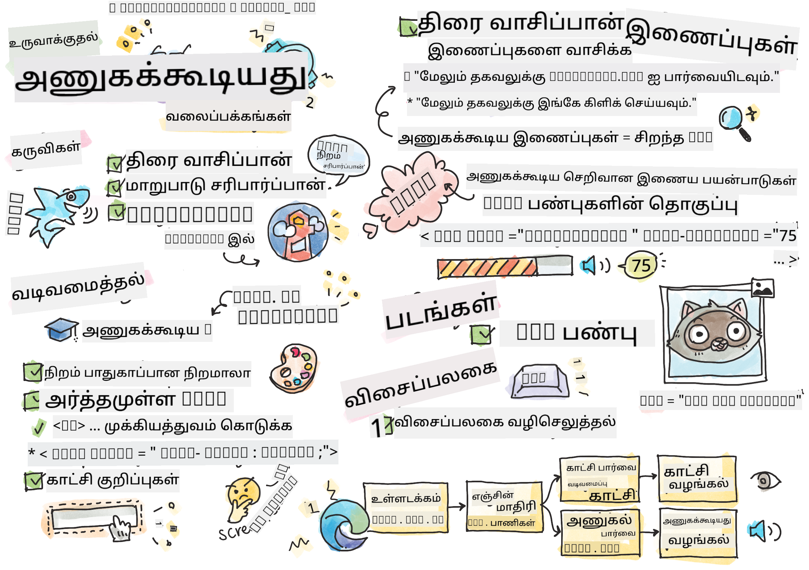

<!--
CO_OP_TRANSLATOR_METADATA:
{
  "original_hash": "f0c88c3e2cefa8952d356f802b1e47ca",
  "translation_date": "2025-10-11T11:50:53+00:00",
  "source_file": "1-getting-started-lessons/3-accessibility/README.md",
  "language_code": "ta"
}
-->
# அணுகல் வசதி கொண்ட வலைப்பக்கங்களை உருவாக்குதல்


> ஸ்கெட்ச் நோட் [Tomomi Imura](https://twitter.com/girlie_mac) மூலம்

## முன்-வகுப்பு வினாடி வினா
[முன்-வகுப்பு வினாடி வினா](https://ff-quizzes.netlify.app/web/)

> இணையத்தின் சக்தி அதன் பரவலான பயன்பாட்டில் உள்ளது. மாற்றுத்திறனாளிகள் உட்பட அனைவருக்கும் அணுகல் முக்கியமான அம்சமாகும்.
>
> \- சர் டிமோதி பெர்னர்ஸ்-லீ, W3C இயக்குநர் மற்றும் உலகளாவிய இணையத்தின் கண்டுபிடிப்பாளர்

இந்த மேற்கோள் அணுகல் வசதி கொண்ட வலைத்தளங்களை உருவாக்குவதின் முக்கியத்துவத்தை சரியாக வெளிப்படுத்துகிறது. அனைவரும் அணுக முடியாத ஒரு பயன்பாடு தானாகவே விலக்கப்பட்டதாகும். வலை வளர்ப்பாளர்களாக நாம் எப்போதும் அணுகல் வசதியை மனதில் வைத்திருக்க வேண்டும். ஆரம்பத்திலேயே இந்த கவனத்தை வைத்திருப்பதன் மூலம், நீங்கள் உருவாக்கும் பக்கங்களை அனைவரும் அணுக முடியும் என்பதை உறுதிப்படுத்தும் பாதையில் நீங்கள் இருக்கலாம். இந்த பாடத்தில், உங்கள் வலைச் சொத்துகள் அணுகல் வசதியானவை என்பதை உறுதிப்படுத்த உதவும் கருவிகள் மற்றும் அணுகல் வசதியை மனதில் வைத்து எப்படி உருவாக்குவது என்பதை நீங்கள் கற்றுக்கொள்வீர்கள்.

> இந்த பாடத்தை [Microsoft Learn](https://docs.microsoft.com/learn/modules/web-development-101/accessibility/?WT.mc_id=academic-77807-sagibbon) இல் எடுத்துக்கொள்ளலாம்!

## பயன்படுத்த வேண்டிய கருவிகள்

### திரை வாசகங்கள்

அணுகல் வசதிக்கான மிகவும் பிரபலமான கருவிகளில் ஒன்றாக திரை வாசகங்கள் உள்ளன.

[திரை வாசகங்கள்](https://en.wikipedia.org/wiki/Screen_reader) பார்வை குறைபாடுகள் உள்ளவர்களுக்கான பொதுவான வாடிக்கையாளர்களாகும். உங்களது தகவல்களை சரியாக வழங்க ஒரு உலாவியை உறுதிப்படுத்துவதற்காக நாம் நேரத்தை செலவிடும் போது, ​​திரை வாசகமும் அதேபோல் செய்கிறது என்பதை உறுதிப்படுத்த வேண்டும்.

அதன் அடிப்படையில், திரை வாசகம் ஒரு பக்கத்தை மேலிருந்து கீழே ஒலியாக வாசிக்கும். உங்கள் பக்கம் முழுவதும் உரையாக இருந்தால், வாசகன் உலாவியைப் போலவே தகவல்களை வழங்கும். ஆனால், வலைப்பக்கங்கள் அரிதாகவே முழுவதும் உரையாக இருக்கும்; அவை இணைப்புகள், படங்கள், நிறங்கள் மற்றும் பிற காட்சிப் பகுதிகளை கொண்டிருக்கும். இந்த தகவல்கள் திரை வாசகத்தால் சரியாக வாசிக்கப்படுவதை உறுதிப்படுத்த கவனமாக இருக்க வேண்டும்.

ஒவ்வொரு வலை வளர்ப்பாளரும் திரை வாசகத்தைப் பற்றி அறிந்திருக்க வேண்டும். மேலே குறிப்பிடப்பட்டதுபோல், உங்கள் பயனர்கள் பயன்படுத்தும் வாடிக்கையாளராக இது உள்ளது. உலாவி எப்படி செயல்படுகிறது என்பதை நீங்கள் அறிந்திருப்பது போலவே, திரை வாசகம் எப்படி செயல்படுகிறது என்பதை நீங்கள் கற்றுக்கொள்ள வேண்டும். அதிர்ஷ்டவசமாக, திரை வாசகங்கள் பெரும்பாலான இயக்க முறைமைகளில் உள்ளடக்கப்பட்டுள்ளன.

சில உலாவிகள் உள்ளடக்கப்பட்ட கருவிகள் மற்றும் நீட்டிப்புகளை கொண்டுள்ளன, அவை உரையை ஒலியாக வாசிக்கவோ அல்லது சில அடிப்படை வழிசெலுத்தல் அம்சங்களை வழங்கவோ முடியும், [இந்த Edge உலாவி கருவிகள்](https://support.microsoft.com/help/4000734/microsoft-edge-accessibility-features) போன்றவை. இவை முக்கியமான அணுகல் வசதி கருவிகளாகும், ஆனால் திரை வாசகங்களை சோதனை செய்யும் கருவிகளாக தவறாக கருதக்கூடாது.

✅ ஒரு திரை வாசகத்தையும் உலாவி உரை வாசகத்தையும் முயற்சிக்கவும். Windows இல் [Narrator](https://support.microsoft.com/windows/complete-guide-to-narrator-e4397a0d-ef4f-b386-d8ae-c172f109bdb1/?WT.mc_id=academic-77807-sagibbon) இயல்பாகவே உள்ளடக்கப்பட்டுள்ளது, மேலும் [JAWS](https://webaim.org/articles/jaws/) மற்றும் [NVDA](https://www.nvaccess.org/about-nvda/) நிறுவப்படலாம். macOS மற்றும் iOS இல், [VoiceOver](https://support.apple.com/guide/voiceover/welcome/10) இயல்பாகவே நிறுவப்பட்டுள்ளது.

### பெரிதாக்குதல்

பார்வை குறைபாடுகள் உள்ளவர்கள் பொதுவாக பயன்படுத்தும் மற்றொரு கருவி பெரிதாக்குதல் ஆகும். மிக அடிப்படை வகையான பெரிதாக்கல் `Control + plus sign (+)` மூலம் அல்லது திரை தீர்மானத்தை குறைப்பதன் மூலம் கட்டுப்படுத்தப்படுகிறது. இந்த வகையான பெரிதாக்கல் முழு பக்கத்தையும் மறுஆய்வு செய்யச் செய்கிறது, எனவே [பதிலளிக்கும் வடிவமைப்பு](https://developer.mozilla.org/docs/Learn/CSS/CSS_layout/Responsive_Design) அதிகப்படியான பெரிதாக்கல் நிலைகளில் நல்ல பயனர் அனுபவத்தை வழங்க முக்கியமானது.

பெரிதாக்கலின் மற்றொரு வகை, திரையின் ஒரு பகுதியை பெரிதாக்குவதற்கும் பான் செய்யவும் சிறப்பு மென்பொருளை நம்புகிறது, இது ஒரு உண்மையான பெரிதாக்கு கண்ணாடியைப் பயன்படுத்துவது போலவே. Windows இல், [Magnifier](https://support.microsoft.com/windows/use-magnifier-to-make-things-on-the-screen-easier-to-see-414948ba-8b1c-d3bd-8615-0e5e32204198) உள்ளடக்கப்பட்டுள்ளது, மேலும் [ZoomText](https://www.freedomscientific.com/training/zoomtext/getting-started/) என்பது அதிக அம்சங்களையும் பெரிய பயனர் அடிப்படையையும் கொண்ட மூன்றாம் தரப்பு பெரிதாக்கல் மென்பொருள் ஆகும். macOS மற்றும் iOS இரண்டிலும் [Zoom](https://www.apple.com/accessibility/mac/vision/) எனும் உள்ளடக்கப்பட்ட பெரிதாக்கல் மென்பொருள் உள்ளது.

### மாறுபாடு சரிபார்ப்பிகள்

வலைத்தளங்களில் நிறங்கள் கவனமாக தேர்ந்தெடுக்கப்பட வேண்டும், நிறக்குறைபாடு உள்ள பயனர்கள் அல்லது குறைந்த மாறுபாட்டில் நிறங்களைப் பார்க்க சிரமம் உள்ளவர்களின் தேவைகளை பூர்த்தி செய்ய.

✅ [WCAG's color checker](https://microsoftedge.microsoft.com/addons/detail/wcag-color-contrast-check/idahaggnlnekelhgplklhfpchbfdmkjp?hl=en-US&WT.mc_id=academic-77807-sagibbon) போன்ற உலாவி நீட்டிப்பைப் பயன்படுத்தி உங்களுக்கு பிடித்த ஒரு வலைத்தளத்தை நிற பயன்பாட்டிற்காக சோதிக்கவும். நீங்கள் என்ன கற்றுக்கொள்கிறீர்கள்?

### Lighthouse

உங்கள் உலாவியின் டெவலப்பர் கருவி பகுதியில், நீங்கள் Lighthouse கருவியை காணலாம். இந்த கருவி ஒரு வலைத்தளத்தின் அணுகல் வசதி (மற்றும் பிற பகுப்பாய்வு) பற்றிய முதல் பார்வையைப் பெற முக்கியமானது. Lighthouse மட்டுமே முழுமையாக நம்புவது முக்கியமல்ல, ஆனால் 100% மதிப்பீடு அடிப்படை அளவீராக மிகவும் உதவிகரமாக இருக்கும்.

✅ உங்கள் உலாவியின் டெவலப்பர் கருவி குழுவில் Lighthouse ஐ கண்டுபிடித்து, எந்தவொரு தளத்திலும் ஒரு பகுப்பாய்வை இயக்கவும். நீங்கள் என்ன கண்டறிகிறீர்கள்?

## அணுகல் வசதிக்கான வடிவமைப்பு

அணுகல் வசதி என்பது ஒப்பீட்டளவில் பெரிய தலைப்பு. உங்களுக்கு உதவ, பல்வேறு வளங்கள் கிடைக்கின்றன.

- [Accessible U - University of Minnesota](https://accessibility.umn.edu/your-role/web-developers)

அணுகல் வசதியான தளங்களை உருவாக்குவதற்கான அனைத்து அம்சங்களையும் நாம் கற்றுக்கொள்ள முடியாது, கீழே நீங்கள் செயல்படுத்த விரும்பும் சில முக்கிய கொள்கைகள் உள்ளன. ஆரம்பத்திலேயே ஒரு அணுகல் வசதியான பக்கத்தை வடிவமைப்பது **எப்போதும்** ஒரு ஏற்கனவே உள்ள பக்கத்தை திருத்துவதற்கும், அதை அணுகல் வசதியாக மாற்றுவதற்கும் எளிதானது.

## நல்ல காட்சி கொள்கைகள்

### நிறம் பாதுகாப்பான நிறங்கள்

மக்கள் உலகத்தை பல்வேறு வழிகளில் பார்க்கிறார்கள், இதில் நிறங்கள் அடங்கும். உங்கள் தளத்திற்கான நிறத் திட்டத்தைத் தேர்ந்தெடுக்கும் போது, ​​அது அனைவருக்கும் அணுகல் வசதியானது என்பதை உறுதிப்படுத்த வேண்டும். [Color Safe](http://colorsafe.co/) போன்ற ஒரு சிறந்த கருவி நிறத் திட்டங்களை உருவாக்க உதவுகிறது.

✅ நிறங்களைப் பயன்படுத்துவதில் மிகவும் சிக்கலான ஒரு வலைத்தளத்தை அடையாளம் காணவும். ஏன்?

### சரியான HTML ஐப் பயன்படுத்தவும்

CSS மற்றும் JavaScript மூலம் எந்த உருப்படியையும் எந்த வகையான கட்டுப்பாடாகவும் உருவாக்க முடியும். `<span>` ஐ `<button>` ஆகவும், `<b>` ஐ ஹைப்பர்லிங்காகவும் உருவாக்கலாம். இது ஸ்டைல் செய்ய எளிதாக இருக்கலாம், ஆனால் இது திரை வாசகத்திற்கு எதுவும் தெரிவிக்காது. ஒரு பக்கத்தில் கட்டுப்பாடுகளை உருவாக்கும்போது சரியான HTML ஐ பயன்படுத்தவும். நீங்கள் ஒரு ஹைப்பர்லிங்கை விரும்பினால், `<a>` ஐ பயன்படுத்தவும். பக்கத்தில் கட்டுப்பாடுகளை உருவாக்கும்போது சரியான HTML ஐ பயன்படுத்துவது Semantic HTML ஐப் பயன்படுத்துவது என்று அழைக்கப்படுகிறது.

✅ எந்தவொரு வலைத்தளத்திற்கும் சென்று, வடிவமைப்பாளர்கள் மற்றும் வளர்ப்பாளர்கள் HTML ஐ சரியாக பயன்படுத்துகிறார்களா என்பதைப் பாருங்கள். ஒரு இணைப்பு இருக்க வேண்டிய ஒரு பொத்தானை நீங்கள் கண்டுபிடிக்க முடியுமா? குறிப்புகள்: உங்கள் உலாவியில் 'View Page Source' ஐ வலது கிளிக் செய்து அடிப்படை குறியீட்டை பாருங்கள்.

### விளக்கமான தலைப்பு வரிசையை உருவாக்கவும்

திரை வாசக பயனர்கள் [தலைப்புகளை மிகவும் நம்புகிறார்கள்](https://webaim.org/projects/screenreadersurvey8/#finding) தகவல்களை கண்டறியவும், ஒரு பக்கத்தில் வழிசெலுத்தவும். விளக்கமான தலைப்பு உள்ளடக்கத்தை எழுதுவது மற்றும் Semantic தலைப்பு குறிச்சொற்களைப் பயன்படுத்துவது திரை வாசக பயனர்களுக்கு எளிதாக வழிசெலுத்தக்கூடிய தளத்தை உருவாக்க முக்கியமானது.

### நல்ல காட்சிப் குறிப்புகளை பயன்படுத்தவும்

CSS ஒரு பக்கத்தில் உள்ள எந்த உருப்படியின் தோற்றத்தையும் முழுமையாகக் கட்டுப்படுத்துகிறது. நீங்கள் ஒரு வரையறையில்லாத உரை பெட்டிகளை அல்லது ஒரு அடிக்கோடு இல்லாத ஹைப்பர்லிங்குகளை உருவாக்கலாம். துரதிர்ஷ்டவசமாக, அந்த குறிப்புகளை நீக்குவது அவற்றை அடிப்படையாகக் கொண்டவர்களுக்கு அவற்றின் வகை கட்டுப்பாட்டை அடையாளம் காண சிரமமாக்கும்.

## இணைப்பு உரையின் முக்கியத்துவம்

ஹைப்பர்லிங்குகள் இணையத்தில் வழிசெலுத்துவதற்கான முக்கிய அம்சமாகும். எனவே, ஒரு திரை வாசகன் இணைப்புகளை சரியாக வாசிக்க முடியும் என்பதை உறுதிப்படுத்துவது அனைத்து பயனர்களும் உங்கள் தளத்தில் வழிசெலுத்த அனுமதிக்கும்.

### திரை வாசகங்கள் மற்றும் இணைப்புகள்

நீங்கள் எதிர்பார்ப்பது போலவே, திரை வாசகங்கள் இணைப்பு உரையை பக்கத்தில் உள்ள பிற உரையைப் போலவே வாசிக்கின்றன. இதை மனதில் வைத்துக்கொள்வதன் மூலம், கீழே காட்டப்பட்டுள்ள உரை முற்றிலும் ஏற்றுக்கொள்ளத்தக்கது என்று தோன்றலாம்.

> சிறிய பென்குயின், சில நேரங்களில் பரி பென்குயின் என்று அழைக்கப்படுகிறது, உலகில் மிகச் சிறிய பென்குயின் ஆகும். [இங்கே கிளிக் செய்யவும்](https://en.wikipedia.org/wiki/Little_penguin) மேலும் தகவலுக்கு.

> சிறிய பென்குயின், சில நேரங்களில் பரி பென்குயின் என்று அழைக்கப்படுகிறது, உலகில் மிகச் சிறிய பென்குயின் ஆகும். மேலும் தகவலுக்கு https://en.wikipedia.org/wiki/Little_penguin ஐ பார்வையிடவும்.

> **NOTE** நீங்கள் வாசிக்கப் போகும் போது, ​​மேலே உள்ளதைப் போன்ற இணைப்புகளை **எப்போதும்** உருவாக்கக்கூடாது.

மறக்காதீர்கள், திரை வாசகங்கள் உலாவிகளிலிருந்து வேறுபட்ட இடைமுகம் மற்றும் வேறுபட்ட அம்சங்களைக் கொண்டவை.

### URL ஐ பயன்படுத்துவதில் பிரச்சினை

திரை வாசகங்கள் உரையை வாசிக்கின்றன. ஒரு URL உரையில் தோன்றினால், திரை வாசகன் URL ஐ வாசிக்கும். பொதுவாக, URL அர்த்தமுள்ள தகவல்களை வழங்காது, மேலும் தொந்தரவு செய்யும் விதமாக ஒலிக்கலாம். உங்கள் தொலைபேசி ஒரு URL உடன் ஒரு உரை செய்தியை ஒலியாக வாசித்தால், நீங்கள் இதை அனுபவித்திருக்கலாம்.

### "இங்கே கிளிக் செய்யவும்" பயன்படுத்துவதில் பிரச்சினை

திரை வாசகங்கள் பக்கத்தில் உள்ள ஹைப்பர்லிங்குகளை மட்டுமே வாசிக்கவும் முடியும், ஒரு பார்வையாளர் பக்கத்தை இணைப்புகளுக்காக ஸ்கேன் செய்வது போலவே. இணைப்பு உரை எப்போதும் "இங்கே கிளிக் செய்யவும்" என்றால், பயனர் "இங்கே கிளிக் செய்யவும், இங்கே கிளிக் செய்யவும், இங்கே கிளிக் செய்யவும், ..." என்று கேட்கும். அனைத்து இணைப்புகளும் ஒன்றுக்கொன்று வேறுபாடின்றி இருக்கும்.

### நல்ல இணைப்பு உரை

நல்ல இணைப்பு உரை இணைப்பின் மறுபுறத்தில் என்ன உள்ளது என்பதை சுருக்கமாக விவரிக்கிறது. சிறிய பென்குயின்களைப் பற்றி பேசும் மேலே உள்ள எடுத்துக்காட்டில், இணைப்பு அந்த இனத்தின் விக்கிபீடியா பக்கத்திற்குச் செல்கிறது. *சிறிய பென்குயின்கள்* என்ற சொற்றொடர் சரியான இணைப்பு உரையாக இருக்கும், ஏனெனில் ஒருவரும் அந்த இணைப்பைச் சொடுக்கினால் என்ன கற்றுக்கொள்வார்கள் என்பதை தெளிவாகக் கூறுகிறது - சிறிய பென்குயின்கள்.

> [சிறிய பென்குயின்கள்](https://en.wikipedia.org/wiki/Little_penguin), சில நேரங்களில் பரி பென்குயின்கள் என்று அழைக்கப்படுகின்றன, உலகில் மிகச் சிறிய பென்குயின்கள்.

✅ சில நிமிடங்களுக்கு இணையத்தில் உலாவி, மங்கலான இணைப்பு உத்திகளைப் பயன்படுத்தும் பக்கங்களை கண்டறியவும். அவற்றை மற்ற, சிறந்த இணைப்பு கொண்ட தளங்களுடன் ஒப்பிடுங்கள். நீங்கள் என்ன கற்றுக்கொள்கிறீர்கள்?

#### தேடல் இயந்திர குறிப்புகள்

உங்கள் தளம் அனைவருக்கும் அணுகல் வசதியானதாக இருப்பதை உறுதிப்படுத்துவதற்கான கூடுதல் நன்மையாக, உங்கள் தளத்தை தேடல் இயந்திரங்கள் வழிசெலுத்த உதவுவீர்கள். தேடல் இயந்திரங்கள் பக்கங்களின் தலைப்புகளை அறிய இணைப்பு உரையைப் பயன்படுத்துகின்றன. எனவே, நல்ல இணைப்பு உரையைப் பயன்படுத்துவது அனைவருக்கும் உதவுகிறது!

### ARIA

கீழே உள்ள பக்கத்தை கற்பனை செய்யுங்கள்:

| தயாரிப்பு      | விளக்கம்        | ஆர்டர்        |
| ------------ | ------------------ | ------------ |
| Widget       | [விளக்கம்](../../../../1-getting-started-lessons/3-accessibility/') | [ஆர்டர்](../../../../1-getting-started-lessons/3-accessibility/') |
| Super widget | [விளக்கம்](../../../../1-getting-started-lessons/3-accessibility/') | [ஆர்டர்](../../../../1-getting-started-lessons/3-accessibility/') |

இந்த எடுத்துக்காட்டில், விளக்கம் மற்றும் ஆர்டர் உரையை மறு உருவாக்குவது உலாவியைப் பயன்படுத்தும் ஒருவருக்கு அர்த்தமுள்ளதாக இருக்கும். ஆனால், திரை வாசகத்தைப் பயன்படுத்தும் ஒருவர் *விளக்கம்* மற்றும் *ஆர்டர்* என்ற வார்த்தைகளை எந்த சூழலுமின்றி மீண்டும் மீண்டும் கேட்பார்.

இந்த வகையான சூழல்களை ஆதரிக்க, HTML [Accessible Rich Internet Applications (ARIA)](https://developer.mozilla.org/docs/Web/Accessibility/ARIA) எனப்படும் பண்புகளை ஆதரிக்கிறது. இந்த பண்புகள் திரை வாசகங்களுக்கு கூடுதல் தகவல்களை வழங்க அனுமதிக்கின்றன.

> **NOTE**: HTML இன் பல அம்சங்களைப் போலவே, உலாவி மற்றும் திரை வாசக ஆதரவு மாறுபடலாம். ஆனால், பெரும்பாலான முக்கிய வாடிக்கையாளர்கள் ARIA பண்புகளை ஆதரிக்கின்றனர்.

`aria-label` ஐப் பயன்படுத்தி இணைப்பை விவரிக்கலாம், பக்கத்தின் வடிவமைப்பு உங்களை அனுமதிக்காத போது. Widget க்கான விளக்கம் அமைக்கப்படலாம்

``` html
<a href="#" aria-label="Widget description">description</a>
```

✅ பொதுவாக, Semantic குறிச்சொற்களைப் பயன்படுத்துவது ARIA ஐப் பயன்படுத்துவதற்கு மேலாக உள்ளது, ஆனால் சில நேரங்களில் பல்வேறு HTML வாடிக்கைகளுக்கு Semantic சமமானது கிடையாது. ஒரு நல்ல எடுத்துக்காட்டாக ஒரு மரம். ஒரு மரத்திற்கான HTML சமமானது இல்லை, எனவே நீங்கள் இந்த உருப்படியின் பொதுவான `<div>` ஐ சரியான பங்கு மற்றும் ARIA மதிப்புகளுடன் அடையாளம் காணலாம். [MDN ARIA பற்றிய ஆவணங்கள்](https://developer.mozilla.org/docs/Web/Accessibility/ARIA) மேலும் பயனுள்ள தகவல்களை கொண்டுள்ளது.

```html
<h2 id="tree-label">File Viewer</h2>
<div role="tree" aria-labelledby="tree-label">
  <div role="treeitem" aria-expanded="false" tabindex="0">Uploads</div>
</div>
```

## படங்கள்

திரை வாசகங்கள் தானாகவே ஒரு படத்தில் என்ன உள்ளது என்பதை வாசிக்க முடியாது என்பது சொல்லவேண்டியதில்லை. படங்கள் அணுகல் வசதியானவை என்பதை உறுதிப்படுத்துவது அதிக வேலை ஆகாது - அதுதான் `alt` பண்பின் முக்கியத்துவம். அனைத்து அர்த்தமுள்ள படங்களும் அவை என்ன என்பதை விவரிக்க `alt` ஐ கொண்டிருக்க வேண்டும்.
முழுமையாக அலங்காரமாக உள்ள படங்கள் `alt` பண்பை காலியாக அமைக்க வேண்டும்: `alt=""`. இது திரை வாசகங்கள் தேவையற்ற அலங்கார படத்தை அறிவிப்பதைத் தடுக்கிறது.

✅ நீங்கள் எதிர்பார்ப்பது போலவே, தே
[பாடத்திற்குப் பின் வினாடி வினா](https://ff-quizzes.netlify.app/web/en/)

## மதிப்பீடு & சுயபடிப்பு

பல அரசாங்கங்கள் அணுகல் தேவைகளுக்கான சட்டங்களை கொண்டுள்ளன. உங்கள் நாட்டின் அணுகல் சட்டங்களைப் பற்றி படிக்கவும். என்ன உள்ளடக்கப்பட்டுள்ளது, என்ன இல்லை? ஒரு உதாரணமாக [இந்த அரசாங்க வலைத்தளம்](https://accessibility.blog.gov.uk/) உள்ளது.

## பணிக்கட்டளை

[ஒரு அணுகல் இல்லாத வலைத்தளத்தை பகுப்பாய்வு செய்யவும்](assignment.md)

கிரெடிட்ஸ்: [Turtle Ipsum](https://github.com/Instrument/semantic-html-sample) by Instrument

---

**குறிப்பு**:  
இந்த ஆவணம் [Co-op Translator](https://github.com/Azure/co-op-translator) என்ற AI மொழிபெயர்ப்பு சேவையைப் பயன்படுத்தி மொழிபெயர்க்கப்பட்டுள்ளது. நாங்கள் துல்லியத்திற்காக முயற்சிக்கின்றோம், ஆனால் தானியங்கி மொழிபெயர்ப்புகளில் பிழைகள் அல்லது தவறான தகவல்கள் இருக்கக்கூடும் என்பதை கவனத்தில் கொள்ளவும். அதன் தாய்மொழியில் உள்ள மூல ஆவணம் அதிகாரப்பூர்வ ஆதாரமாக கருதப்பட வேண்டும். முக்கியமான தகவல்களுக்கு, தொழில்முறை மனித மொழிபெயர்ப்பு பரிந்துரைக்கப்படுகிறது. இந்த மொழிபெயர்ப்பைப் பயன்படுத்துவதால் ஏற்படும் எந்த தவறான புரிதல்கள் அல்லது தவறான விளக்கங்களுக்கு நாங்கள் பொறுப்பல்ல.