<!--
CO_OP_TRANSLATOR_METADATA:
{
  "original_hash": "7f2c48e04754724123ea100a822765e5",
  "translation_date": "2026-01-07T13:50:25+00:00",
  "source_file": "1-getting-started-lessons/3-accessibility/README.md",
  "language_code": "ta"
}
-->
# அணுகக்கூடிய வலைப் பக்கங்களை உருவாக்குதல்

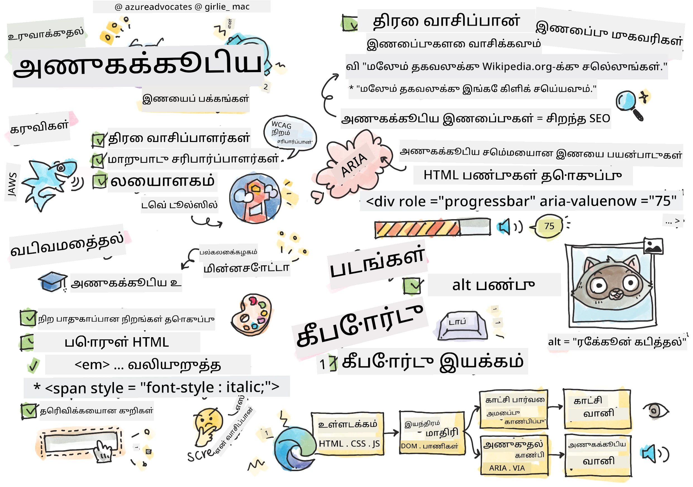
> [Tomomi Imura](https://twitter.com/girlie_mac) அவர்களின் ஸ்கெட்ச்நோட்

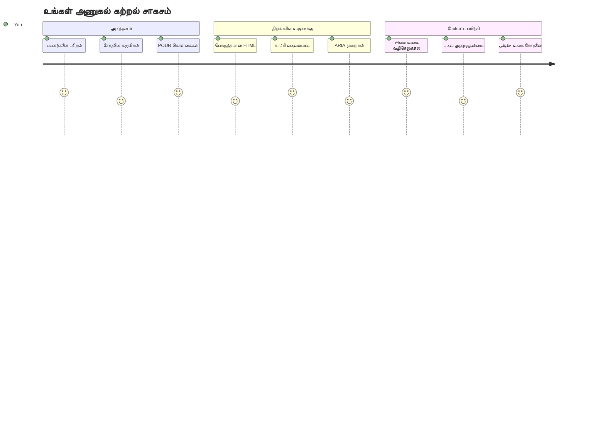
## முன்-பாடக் கேள்வி
[முன்-பாடக் கேள்வி](https://ff-quizzes.netlify.app/web/)

> வலைப்பின்னலின் சக்தி அதன் பல்துறைத்தன்மையில் உள்ளது. மாற்றுத்திறனாளிகளின் நிலையை பொருட்படுத்தாமல் அனைவருக்கும் அணுகல் என்பது அடிப்படையான அம்சமாகும்.
>
> \- சர் டிமோத்தி பெர்னர்ஸ்-லி, W3C இயக்குநர் மற்றும் உலகளாவிய வலைப்பின்னலின் கண்டுபிடிப்பாளர்

இதைப் பாருங்கள், உங்களை ஆச்சரியப்படுத்தக்கூடிய ஒன்றை சொல்லப்போகிறேன்: நீங்கள் அணுகக்கூடிய இணையதளங்களை உருவாக்கும் போது, நீங்கள் மாற்றுத்திறனாளிகளுக்கு மட்டுமின்றி அனைவருக்கும் இணையத்தை மேம்படுத்துகிறீர்கள்!

நீங்கள் தெருவின் மூலைகளில் இருக்கும் குறிகாட்டி குறுக்குவிழல்கள் (curb cuts) கவனித்திருக்கலாச்சிற்றா? அவை முதலில் மாற்றுத்திறனாளிகளுக்கு உருவாக்கப்பட்டன, ஆனால் இப்போது பசலை ஏறி செல்லும் அப்பாரத்திற்கு, பொருட்களை சென்றாடும் பணியாளர்களுக்கு, சஞ்சிகள் கொண்டு சுற்றும் பயணிகளுக்கு, மற்றும் சைக்கிள் ஓட்டுநர்களுக்கும் உதவுகின்றன. இணையத்தில் அணுகல் வடிவமைப்பும் இதே போலவே வேலை செய்கிறது—ஒரு குழுவுக்கு உதவும் தீர்வுகள் பெரும்பாலும் அனைவருக்கும் லாபமாகிறது. அசாத்தியமாக இருக்கிறது இல்லையா?

இந்த பாடத்தில், எவ்வாறு அனைவருக்கும் உண்மையில் வேலை செய்வதாக உள்ள இணையத்தளங்களை உருவாக்குவது என்பதை ஆராயப்போகிறோம். நீங்கள் வலைத் தரநிலைகளில் ஏற்கனவே உள்ள நடைமுறை தொழில்நுட்பங்களை கண்டுபிடிப்பீர்கள், சோதனை கருவிகளுடன் கைப்பயிற்சி பெறுவீர்கள், மற்றும் அணுகல் உங்கள் தளங்களை எல்லா பயனர்களுக்கும் பரவலாக பயன்படுத்தக்கூடியதாக மாற்றுவது எப்படி என்பதை பார்க்கப்போகிறோம்.

இந்த பாடத்தின் முடிவில், நீங்கள் வடிவமைப்பு பண்பாட்டு வேலைப்பாட்டிற்குள் இயல்பான முறையில் அணுகலைச் சேர்க்கும் தைரியத்தை கையளிப்பீர்கள். கவனமுடன் செய்யப்பட்ட வடிவமைப்பு தேர்வுகள் பில்லியன் பயனர்களுக்கு இணையத்தை திறந்து விட கூடும் என்பதை ஆராய தயாரா? வாருங்கள் தொடங்குவோம்!

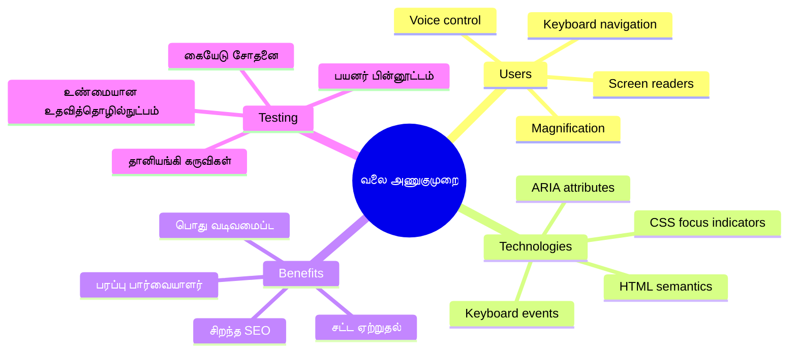
> இந்த பாடத்தை [Microsoft Learn](https://docs.microsoft.com/learn/modules/web-development-101/accessibility/?WT.mc_id=academic-77807-sagibbon)ல் எடுக்கலாம்!

## உதவிகரமான தொழில்நுட்பங்களைப் புரிந்து கொள்வது

கூடுதல் கையேட்டை தொடங்கும் முன், வலைத்தளத்தை மாற்று திறனுடையோர் எப்படி உணர்கிறார்கள் என்பதை கொஞ்சம் புரிந்து கொள்வோம். இது வெறும் கோட்பாடு அல்ல—மெய்நிகர் உலகில் அவர்களின் வழிசெல்லும் முறைகள் புரிந்துகொள்ளப்படுவதே உங்களை சிறந்த டெவலப்பராக மாற்றும்!

உதவியாயுள்ள தொழில்நுட்பங்கள் மாற்றுத்திறனாளிகளுக்கு இணையத்தை தொடர்பு கொள்ள உதவுகின்ற 'அற்புதப் பொருட்கள்'. வேலை செய்வதற்கு அவற்றின் பணியை புரிந்துக்கொண்டால், அணுகக்கூடிய வலை அனுபவங்களை உருவாக்குவது மிகவும் இயல்பானது ஆகும். இது உங்கள் கோடுகளை ஒருவரது பார்வை கொண்டே காண கற்றுக்கொள்ள போல உள்ளது.

### திரைக்கேட்கும் கருவிகள்

[திரைக்கேட்கும் கருவிகள்](https://en.wikipedia.org/wiki/Screen_reader) என்பது மிக நுட்பமான தொழில்நுட்பங்கள், அவை டிஜிட்டல் எழுத்தை சொல் அல்லது ப்ரெயில் வெளியீட்டாக மாற்றுகின்றன. பிரதானமாகக் கண்ணுக்கு பாதிப்புள்ளோர் பயன்படுத்தினாலும், கற்பித்தல் தடைகளை கொண்டவர்களுக்கும் (கருவிழுப்பு போன்ற) பெரிதும் உதவுகிறது.

நான் திரைக்கேட்கும் கருவியை புத்தகத்தை அறிவுடைய கதை சொல்லுமொரு தனிமனிதனாகக் கருத விரும்புகிறேன். அது உள்ளடக்கத்தை சரியான வரிசையில்்டே படிக்கிறது, "பட்டன்" அல்லது "இணைப்பு" போன்ற செயல்பாட்டுக் கூறுகளை அறிவிக்கிறது, மற்றும் பக்கத்தில் சுற்ற இடப்பெயர்த்துக் கொள்ள விசைப்பலகை குறுஞ்சொற்களை வழங்குகிறது. ஆனால் முக்கியம் என்னவென்றால்—திரைக்கேட்கும் கருவிகள் வலைத்தளங்களில் சரியான கட்டமைப்பும் பொருள் பூர்வமான உள்ளடக்கமும் இருக்கையால் அவர்கள் மாயாஜாலத்தை செய்ய முடியும். அங்கே நீங்கள் டெவலப்பராக இருக்கிறீர்கள்!

**விளவான திரைக்கேட்கும் கருவிகள் பல்வேறு தளங்களில்:**
- **விண்டோஸ்**: [NVDA](https://www.nvaccess.org/about-nvda/) (இலவசம் மற்றும் மிகவும் பிரபலமானது), [JAWS](https://webaim.org/articles/jaws/), [Narrator](https://support.microsoft.com/windows/complete-guide-to-narrator-e4397a0d-ef4f-b386-d8ae-c172f109bdb1/?WT.mc_id=academic-77807-sagibbon) (நிரம்பியதாக உள்ளது)
- **மெக்/ஐஓஎஸ்**: [VoiceOver](https://support.apple.com/guide/voiceover/welcome/10) (நிரம்பியதாகவும் திறமையானது)
- **ஆண்ட்ராய்டு**: [TalkBack](https://support.google.com/accessibility/android/answer/6283677) (நிரம்பியதாக உள்ளது)
- **லினக்ஸ்**: [Orca](https://wiki.gnome.org/Projects/Orca) (இலவசமும் திறந்தவளமும்)

**திரைக்கேட்கும் கருவிகள் வலை உள்ளடக்கத்தில் எவ்வாறு சென்று கொண்டிருப்பன:**

திரைக்கேட்கும் கருவிகள் பலவிதமான வழிசெலுத்தல் முறைகள் வழங்குகின்றன, இது அனுபவமுள்ள பயனர்களுக்கு உலாவலை துரிதப்படுத்துகிறது:
- **வரிசைப்படுத்தப்பட்ட வாசிப்பு**: உள்ளடக்கத்தை மேலிருந்து கீழ்வரை வாசிக்கிறது, புத்தகப் படிப்பின் போல
- **புகழ்பெயர் வழிசெல்**: பக்கப் பகுதிகளுக்கு இடையே (தலைப்பு, வழிசெல், முக்கியம், அடிக்குறிப்பு)
- **தலைப்பு வழிசெல்**: தலைப்புகளுக்கு இடையேயாக தாண்டிப் பக்கம் அமைப்பை புரிந்துகொள்ள
- **இணைப்பு பட்டியல்**: அனைத்து இணைப்புகளின் பட்டியலை துரித அணுகலுக்காக உருவாக்கவும்
- **படிவ கட்டுப்பாடுகள்**: உள்ளீட்டு பகுதிகளுக்கு நேரடியாக செல்வது மற்றும் பட்டன்கள்

> 💡 **இதனால் எனக்கு வியப்பு ஏற்பட்டது**: 68% திரைக்கேட்கும் பயனர்கள் முதன்மையாக தலைப்புகளினை வழிசெல் முறையாக பயன்படுத்துகின்றனர் ([WebAIM Survey](https://webaim.org/projects/screenreadersurvey9/#finding)). இதன் பொருள் உங்கள் தலைப்பு கட்டமைப்பு பயனர்களுக்கான ஒரு வரைபடம் போன்றது—சரி செய்தால் உங்கள் உள்ளடக்கத்தில் பயனர்கள் விரைவில் வழி கண்டுபிடிக்க உதவும்!

### உங்கள் சோதனை பணிப்பாட்டை உருவாக்குதல்

சாதாரண வசதியான அணுகல் சோதனை நிர்வகிக்க சிரமமில்லை என்பது நல்ல செய்தி! நீங்கள் தானாக செயல்படும் கருவிகளுடன் (அவை தெளிவான பிழைகளை பிடிக்க நல்லவை) கைகோர்த்து சோதனையை சேர்க்க வேண்டியிருக்கும். இதோ என் கண்டுபிடித்துள்ள ஒழுங்குபடுத்தப்பட்ட அணுகல் சோதனை நடைமுறை:

**அத்தியாவசிய கைமுறை சோதனை பணிப்பாடு:**

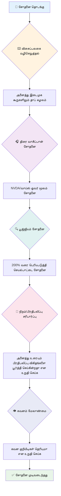
**படி-படி சோதனை சரிபார்ப்பு பட்டியல்:**
1. **விசைப்பலகை வழிசெல்**: Tab, Shift+Tab, Enter, Space, மற்றும் அம்புக்களில் மட்டும் பயன்படுத்தவும்
2. **திரைக்கேட்கும் கருவி சோதனை**: NVDA, VoiceOver, அல்லது Narrator இயக்கி கண்களை மூடி வழிசெல் செய்யவும்
3. **பெரிதாக்குதல் சோதனை**: 200% மற்றும் 400% பெரிதாக்கல் நிலைகளில் சோதிக்கவும்
4. **வண்ண மரியாதை சரிபார்ப்பு**: அனைத்து உரை மற்றும் UI கூறுகளையும் சரிபார்க்கவும்
5. **கவனமைப்பு குறியீடு சோதனை**: அனைத்து செயல்பாட்டுக் கூறுகளுக்கும் தெளிவான கவனத்தை உறுதிப்படுத்தவும்

✅ **Lighthouse-இல் இருந்து தொடங்கவும்**: உலாவியின் DevTools திறந்து, Lighthouse அணுகல் சரிபார்ப்பை இயக்கி, முடிவுகளை வைத்து கைமுறை சோதனை கவன நிலைகளை வழி நடத்தவும்.

### பெரிதாக்கல் மற்றும் ஐந்து கருவிகள்

உங்கள் கைபேசியில் உரை சிறியதாக இருக்கும்போது நீங்கள் எப்போதாவது நிக்கிச்சி (pinch) செய்யும் விதமாக enlarge செய்ய நினைத்தீர்களா, அல்லது பிரகாசமான வெளிச்சத்தில் உங்கள் லேப்டாப் திரையை squint செய்து பார்த்திருக்கிறீர்களா? பல பயனர்கள் தினமும் உள்ளடக்கம் வாசிக்க நடுத்தரமாக்கும் கருவிகளைப் பயன்படுத்துகின்றனர். இதில் குறைந்த காட்சி திறனுடையவர்கள், முதியோர் மற்றும் வெளியில் இணையதள வாசிப்பவர்களும் அடங்குகின்றனர்.

நவீன பெரிதாக்கல் தொழில்நுட்பங்கள் வெறும் பெரிதாக்கதிற்கு மேல் தானாகவே வளர்ந்துள்ளன. இந்த கருவிகள் எப்படி வேலை செய்கின்றன என்பதை புரிந்தால், உங்கள் வடிவமைப்புகளை எந்த பெரிதாக்கல் அளவிலும் செயல்படும் மற்றும் அழகானவையாக உருவாக்க உதவும்.

**நவீன உலாவி பெரிதாக்கல் திறன்கள்:**
- **பக்கம் பெரிதாக்கல்**: எல்லா உள்ளடக்கத்தையும் (உரை, படங்கள், அமைப்பு) விகிதமான முறையில் பெரிதாக்கும் - இது விரும்பத்தக்க முறை
- **உரையே மட்டும் பெரிதாக்கல்**: எழுத்துரு அளவை அதிகரித்து, அசல் அமைப்பை பேணும்
- **பிட்ச்-டு-சூம்**: மொபைல் குறி அங்கீகாரம் தற்காலிக பெரிதாக்கலுக்கு
- **உலாவி ஆதரவு**: அனைத்து நவீன உலாவிகளும் 500% வரை பெரிதாக்கலை முறைமையாக ஆதரிக்கின்றன

**சிறப்பு பெரிதாக்கல் மென்பொருள்கள்:**
- **விண்டோஸ்**: [Magnifier](https://support.microsoft.com/windows/use-magnifier-to-make-things-on-the-screen-easier-to-see-414948ba-8b1c-d3bd-8615-0e5e32204198) (நிரம்பியது), [ZoomText](https://www.freedomscientific.com/training/zoomtext/getting-started/)
- **மெக்/ஐஓஎஸ்**: [Zoom](https://www.apple.com/accessibility/mac/vision/) (அதிகமான அம்சங்களுடன் நிரம்பியது)

> ⚠️ **வடிவமைப்பு கருத்துகு**: WCAG கட்டளை: உள்ளடக்கம் 200% பெரிதாக்கப்பட்டால் கூட செயல்படக் கூடியதாக இருக்க வேண்டும். இந்த நிலை ஆரம்பத்தில் அந்தரங்கஸ் உருச்சிதைச் scroll குறைவாக இருக்க வேண்டும், மற்றும் அனைத்து செயல்பாட்டுக் கூறுகளும் அணுகக்கூடியதாக இருக்க வேண்டும்.

✅ **உங்கள் பதிலளிக்கும் வடிவமைப்பை சோதிக்கவும்**: உலாவி 200% மற்றும் 400% பெரிதாக்கவும். உங்கள் அமைப்பு சிறப்பாகத் தழுவுகிறதா? நீங்கள் மிகுந்த scroll-ஐ தவிர்த்து எல்லா செயல்பாடுகளையும் அணுக முடியுமா?

## நவீன அணுகல் சோதனை கருவிகள்

மாற்றுத்திறனாளிகள் உதவியுடன் நவீன உலாவல் எவ்வாறு நடக்கும் என்பதைக் புரிந்துகொண்ட பிறகு, அந்த அணுகல் வலைத்தளங்களை உருவாக்க மற்றும் சோதிக்க உதவும் கருவிகளை ஆராய்வோம்.

இதுபோல நினைக்கவும்: தானாக இயங்கும் கருவிகள் தெளிவான பிழைகளைப் பிடிக்க சிறந்தவை (எ.கா., alt உரையின் இல்லாமை), ஆனால் கைமுறை சோதனை உங்கள் தளத்தை உண்மையான உலகில் பயன்படுத்த எப்படிப் பார்ப்பதென்பதை உறுதிப்படுத்துகிறது. இவை இணைந்து உங்கள் தளங்கள் அனைவருக்கும் வேலை செய்கிறాయని தைரியத்தை வழங்கும்.

### வண்ண மரியாதை சோதனை

சந்தோஷமான செய்தி: வண்ண மரியாதை (color contrast) மிகவும் பொதுவான அணுகல் பிரச்சனை, ஆனால் சுலபமாக சரிசெய்யக்கூடியது. நல்ல வண்ண மாறுபாடு அனைவருக்கும் பயனுள்ளதாக இருக்கிறது—கண்ணுக்கு பாதிப்புள்ளவர்கள் முதல் கடலில் போன்போன்களை வாசிப்பவர்கள் வரை.

**WCAG வண்ண மாணவரின் தேவைகள்:**

| உரை வகை | WCAG AA (குறைந்தபட்சம்) | WCAG AAA (மேம்படுத்தப்பட்டது) |
|-----------|------------------------|----------------------------|
| **சாதாரண உரை** (18ptக்கு கீழ்) | 4.5:1 வண்ண வாகை | 7:1 வண்ண வாகை |
| **பெரிய உரை** (18pt+ அல்லது 14pt+ திடமாக) | 3:1 வண்ண வாகை | 4.5:1 வண்ண வாகை |
| **UI கூறுகள்** (பட்டன்கள், படிவ எல்லைகள்) | 3:1 வண்ண வாகை | 3:1 வண்ண வாகை |

**அத்தியாவசிய சோதனை கருவிகள்:**
- [Colour Contrast Analyser](https://www.tpgi.com/color-contrast-checker/) - வண்ண தேர்வாணையை உடைய மேசைப்பட்ட பயன்பாடு
- [WebAIM Contrast Checker](https://webaim.org/resources/contrastchecker/) - இணையப்படிப்புக்கு உடனடி கருத்து
- [Stark](https://www.getstark.co/) - Figma, Sketch, Adobe XD வடிவமைப்புக்கான பிளகின்
- [Accessible Colors](https://accessible-colors.com/) - அணுகக்கூடிய வண்ணத் தொகுப்புகளை கண்டறிவு

✅ **சிறந்த வண்ணத் தொகுப்புகளை உருவாக்கவும்**: உங்கள் பிராண்ட் வண்ணங்களுடன் துவங்கி, வண்ண மரியாதை சோதனையாளர்களை பயன்படுத்தி அணுகக்கூடிய வண்ண வேறுபாடுகளை உருவாக்கவும். இதை உங்கள் வடிவமைப்பு அமைப்பின் அணுகக்கூடிய வண்ண குறியீடுகளாக ஆவணப்படுத்தவும்.

### விரிவான அணுகல் பரிசோதனை

மிக சிறந்த அணுகல் சோதனை பல முறைகளின் ஒருங்கிணைப்பை உள்ளடக்கியது. ஒரு கருவி எல்லாவற்றுக்கும் தேடியது இல்லையென்பதால், பல முறைகளைப் பயன்படுத்தி சோதனை சுழற்சியை உருவாக்குவது முழுமையான கவனிப்பை உறுதி செய்கிறது.

**உலாவி அடிப்படையிலான சோதனை (DevTools-ல் உள்ளது):**
- **Chrome/Edge**: Lighthouse அணுகல் சோதனை + Accessibility புள்ளிவிவரம்
- **Firefox**: Accessibility உள்நோக்கி விரிவான மர அணுவார்ப்பு
- **Safari**: Web Inspector இல் Audit தாவல் மற்றும் VoiceOver பிணைப்பு

**தொழில்முறை சோதனை நீட்சிகள்:**
- [axe DevTools](https://www.deque.com/axe/devtools/) - துறைமுக மதிப்பீடு தானாக சோதனை
- [WAVE](https://wave.webaim.org/extension/) - பிழைகளை வெளிப்படுத்தும் பார்வை
- [Accessibility Insights](https://accessibilityinsights.io/) - Microsoft சிக்கலான சோதனை தொகுதி

**கமாண்ட் வரி மற்றும் CI/CD ஒருங்கிணைப்பு:**
- [axe-core](https://github.com/dequelabs/axe-core) - ஜாவாஸ்கிரிப்ட் நூலகம் தானாக சோதிக்க
- [Pa11y](https://pa11y.org/) - கமாண்ட் வரி அணுகல் சோதனை கருவி
- [Lighthouse CI](https://github.com/GoogleChrome/lighthouse-ci) - தானாகலான அணுகல் மதிப்பெண்

> 🎯 **சோதனை இலக்கு**: உள்நுழைவுத் தரமானும் 95+ வீதம் Lighthouse சோதனை மதிப்பெண்ணை அடைய முயற்சிக்கவும். நினைவில் வைக்கவும், தானாக இயங்கும் கருவிகள் சுமார் 30-40% பிரச்சனைகளை மட்டும் கண்டுபிடிக்கின்றன—கைகோப்புச் சோதனை இன்னும் அவசியம்!

### 🧠 **சோதனை திறன் சோதனை: பிரச்சனைகளை கண்டுபிடிக்கத் தயார்?**

**நாம் பார்க்கலாம் நீங்கள் அணுகல் சோதனை பற்றி எப்படி உணர்கிறீர்கள்:**
- இப்போது எந்த சோதனை முறையை நீங்கள் மிக எளிதாக அணுகக்கூடியது என்று நினைக்கிறீர்கள்?
- நீங்கள் ஒரு முழு நாளும் விசைப்பலகை மட்டுமே பயன்படுத்தி உலாவுவீர்களா என்று கற்பனை செய்யலாம்?
- நீங்கள் ஆன்லைனில் தனிப்பட்ட முறையில் அனுபவித்த ஒரு அணுகல் தடையால் என்னவென்று கூற முடியுமா?

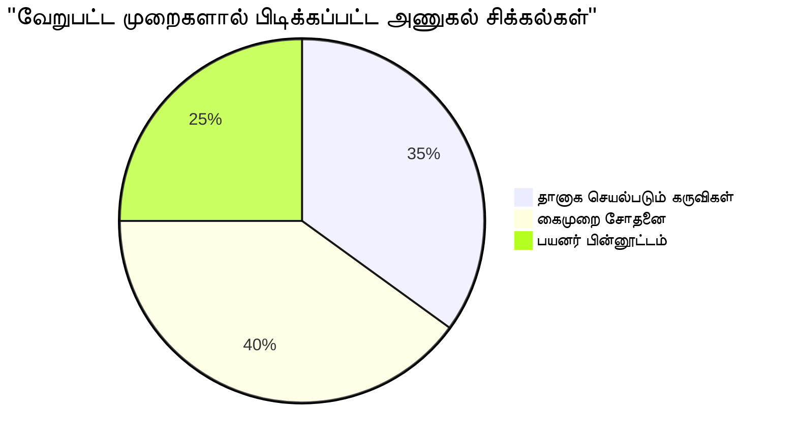
> **தீவிரம் மேம்பாடு**: தொழில்முறை அணுகல் சோதனை நிபுணர்கள் இம்முறைமைகளின் நடுக்கூட்டத்தைப் பயன்படுத்துகிறார்கள். நீங்கள் தொழில் தர வலய நடைமுறைகளை கற்றுக்கொள்கின்றீர்கள்!

## அடிப்படையிலிருந்து அணுகலை உருவாக்குதல்

அணுகல் வெற்றியின் முக்கியம் உங்கள் அடித்தளத்தின் முதல் நாளிலிருந்தே அதை கட்டமைக்கப்பட வேண்டும். "பின்னர் அணுகலைச் சேர்ப்பேன்" என்பது நினைத்துக்கொள்ள விரும்புவீர்கள், ஆனால் இது ஏற்கனவே கட்டப்பட்ட வீட்டிற்கு ஒரு நடைமுறையை பின்னர் சேர்க்க முயற்சிப்பதைப் போன்றது. சாத்தியம்? ஆம். எளிது? இல்ல.

அணுகலை ஒரு வீட்டுத் திட்டமிடலாகக் கருதுங்கள்—முதலில் கட்டிடக்கலை திட்டங்களில் சக்கரக்காலி அணுகலை உள்ளடக்குவது எல்லாஇயல்பு.

### POUR தத்துவங்கள்: உங்கள் அணுகல் அடித்தளம்

இணைய உள்ளடக்க அணுகல் வழிகாட்டுதல்கள் (WCAG) POUR என்று அழைக்கப்படும் நான்கு அடிப்படை 원칙ங்களை சுற்றி கட்டப்பட்டுள்ளது. கவலைப்படாதீர்கள்—இவை கோல்றான கற்கை புத்தகக் கருத்துகள் அல்ல! இவை அனைவருக்கும் வேலை செய்யக்கூடிய உள்ளடக்கத்தை உருவாக்கும் நடைமுறை வழிகாட்டுதல்கள்.

POUR ஐ நீங்கள் நன்கு அறிந்துவிட்டால், அணுகல் முடிவுகளை எடுத்து கையாள்வது மிகவும் இயல்பானதாக இருந்துவிடும். இது உங்கள் வடிவமைப்பு தேர்வுகளுக்கு வழிகாட்டும் மனச்சூழல் சரிபார்ப்பு பட்டியலைப் போல உள்ளது. அதை தொகுக்கிறோம்:

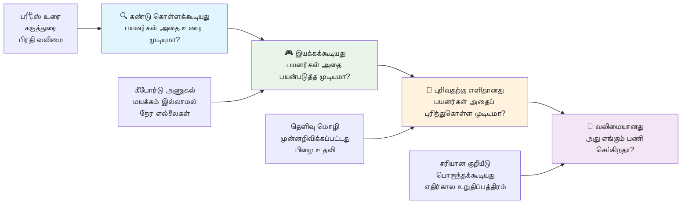
**🔍 காட்சி பெறக்கூடியது Perceivable**: பயனர்கள் தங்கள் கிடைக்கும் உணர்வுகளைப் பயன்படுத்தி புரிந்து கொள்ளக் கூடிய விதத்தில் தகவல் காணப்பட வேண்டும்

- உரை அல்லாத உள்ளடக்கத்துக்கு உரை மாற்றுகளை வழங்கவும் (படங்கள், வீடியோக்கள், ஒலி)
- அனைத்து உரை மற்றும் UI கூறுகளுக்கும் போதுமான வண்ண மாறுபாட்டை உறுதிப்படுத்தவும்
- பன்மூல உள்ளடக்கங்களுக்கு கெப்ஷன்கள் மற்றும் உரைத்தொகுப்புகள் வழங்கவும்
- உள்ளடக்கம் 200% வரையாய் மீட்டமைக்கும்போது செயல்படக் கூடியதாக இருக்கவும்
- தகவலை வெளிப்படுத்த பல உணர்ச்சி பண்பு அம்சங்களைப் பயன்படுத்தவும் (வண்ணத்துடன் மட்டுமே அல்ல)

**🎮 இயங்கக்கூடியது Operable**: அனைத்து இடைமுக கூறுகளும் கிடைக்கும் உள்ளீட்டு முறைகளால் இயங்கக்கூடியதாக இருக்க வேண்டும்

- அனைத்து செயல்பாடுகளும் விசைப்பலகை வழிச் பயணம் மூலம் அணுகக்கூடியதாக இருக்கவேண்டும்
- பயனர்களுக்கு உள்ளடக்கத்தை படிக்கவும் தொடர்புகொள்ளவும் போதுமான நேரத்தை கொடுக்கவும்
- பலவீனத்தையும் தலைமுடியையும் விளையும் உள்ளடக்கங்களAvoidச் செய்யவும்
- பயனர்களுக்கு தெளிவான கட்டமைப்பு மற்றும் புறப்படையாளிகள் மூலம் வழிசெலுத்த உதவவும்
- செயல்பாட்டு கூறுகளுக்கு போதுமான இலக்கு அளவுகள் (குறைந்தது 44px) வழங்கவும்

**📖 புரிந்து கொள்ளக்கூடியது Understandable**: தகவலும் UI செயல்பாடும் தெளிவாகவும் அர்த்தமுள்ளதாகவும் இருக்க வேண்டும்

- உங்கள் பார்வையாளருக்கு ஏற்ற தெளிவான, எளிய மொழியைப் பயன்படுத்தவும்
- உள்ளடக்கம் எப்போதும் குறிப்பிடத்தக்க முறையில் தோன்றவும் செயல்படவும் உறுதிப்படுத்தவும்
- பயனர் உள்ளீட்டிற்கு தெளிவான வழிகாட்டுதல்கள் மற்றும் பிழை செய்திகள் வழங்கவும்
- பயனர்களுக்கு பிழைகளை புரிந்து கொள்வதிலும் படிவங்களில் திருத்துவதிலும் உதவவும்
- உள்ளடக்கத்தை தர்க்கபூர்வமான வாசிப்பு ஒழுங்கிலும் தகவல் ஒழுங்கிலும் அமைக்கவும்

**💪 வலிமையானது Robust**: உள்ளடக்கம் பல்வேறு தொழில்நுட்பங்களிலும் உதவிச் சாதனங்களிலும் நம்பகமாக இயங்க வேண்டும்

- **சரியான, அர்த்தமான HTML ஐ உங்கள் அடித்தளமாகப் பயன்படுத்துங்கள்**
- **தற்போதைய மற்றும் எதிர்கால உதவிக் கருவிகளுடன் பொருந்தும் வகையில் செய்க**
- **வலைத் தள தரநிலைகள் மற்றும் சிறந்த நடைமுறைகள் பின்பற்றப்பட வேண்டும்**
- **பல்வேறு உலாவிகள், சாதனங்கள் மற்றும் உதவியியல் கருவிகள் முழுவதும் சோதனை செய்யவும்**
- **மேம்பட்ட அம்சங்கள் ஆதரிக்கப்படாமல் இருந்தால் உள்ளடக்கத்தை மென்மையாக மோசமாகச் செல்லுமாறு கட்டமைக்கவும்**

### 🎯 **POUR கோட்பாடுகள் பரிசோதனை: இதை நிலைத்துக் கொள்ளுதல்**

**அடிப்படைகள் பற்றிய உடனடி அதிசயிப்பு:**
- நீங்கள் நினைக்க முடியும் ஒரு வலைத்தள அம்சம் எந்த POUR கோட்பாடையும் பின்பற்றாமல் தோல்வியடைவதா?
- எந்த கோட்பாடு ஒரு வளர்ச்சியாளராக உங்களுக்கு மிகவும் இயல்பாக இருந்து இருக்கும்?
- இந்த கோட்பாடுகள் எல்லோருக்கும், மாற்றுத்திறனாளர்களுக்கே அல்லாமல், வடிவமைப்பை எவ்வாறு மேம்படுத்த உதவலாம்?

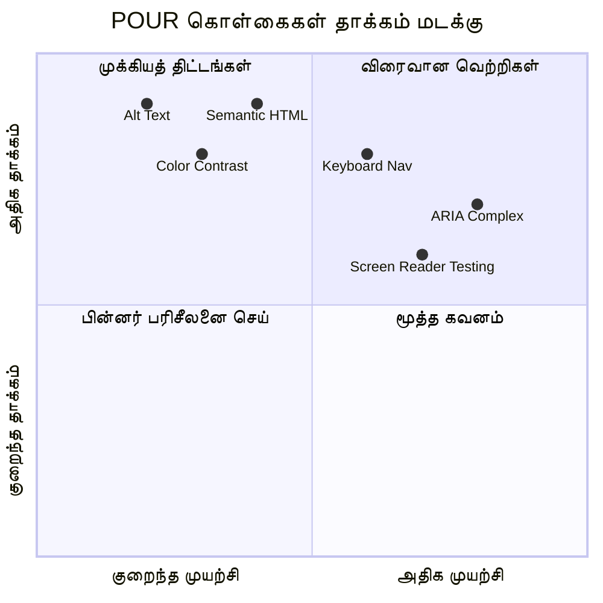
> **நினைவில் வையுங்கள்**: அதிக தாக்கம் கொண்ட, குறைந்த முயற்சியுள்ள மேம்பாடுகளுடன் துவங்குங்கள். செமாண்டிக் HTML மற்றும் alt உரை மிகக் குறைந்த முயற்சியுடன் அதிகமான அணுகல் வசதியை தருகின்றன!

## அணுகக்கூடிய காட்சி வடிவமைப்பை உருவாக்கல்

நல்ல காட்சி வடிவமைப்பு மற்றும் அணுகல் வசதி ஒன்றாக நன்கு இணைகின்றன. நீங்கள் அணுகல் வசதியுடன் வடிவமைக்கும்போது, இந்தக் கட்டுப்பாடுகள் ஒருங்கிணைந்த, அழகான தீர்வுகளை உருவாக்கி, அனைத்து பயனர்களுக்கும் பயன் தரும் என்பதை கண்டுபிடிப்பீர்கள்.

காட்சிச் சாத்தியங்கள் மற்றும் உங்கள் உள்ளடக்கத்தை காணும் நிலைகள் மற்றும் காட்சி திறன்கள் பொருத்தமில்லாமல் அனைவருக்கும் வேலை செய்யப்பட்ட அழகான வடிவமைப்புகளை உருவாக்க என்ன வழிமுறைகள் உள்ளன என்று பார்ப்போம்.

### வண்ணம் மற்றும் காட்சி அணுகல் மூலோபாயங்கள்

வண்ணம் தொடர்பு கொள்ள மிகவும் சக்திவாய்ந்தது, ஆனால் முக்கிய தகவலை தருவதற்கு அது மட்டும் போதுமானதாக இருக்கக்கூடாது. வண்ணத்தை அப்பாற்பட்டு வடிவமைக்க, பல நிலைகளிலும் இயங்கக்கூடிய சக்திவாய்ந்த, ஒருங்கிணைந்த அனுபவங்களை உருவாக்குகிறது.

**வண்ணக் காண்கை வேறுபாடுகளுக்கான வடிவமைப்பு:**

சுமார் 8% ஆண்களுக்கும் 0.5% பெண்களுக்கும் சில வடிவிலான வண்ணக் காண்கை வேறுபாடுகள் உள்ளன (சாதாரணமாக "வண்ண குருட்டுத்தனம்" என்று அழைக்கப்படுகிறது). மிக பொதுவான வகைகள்:
- **டூட்டரானோபியா**: சிவப்பு மற்றும் பச்சை வேறுபாட்டில் சிரமம்
- **புரோட்டானோபியா**: சிவப்பு மெதுவாக தெரிகிறது
- **ட்ரிடானோபியா**: நீலம் மற்றும் மஞ்சள் வேறுபாட்டில் சிரமம் (அதிகம் இல்லை)

**சேர்க்கப்பட்ட வண்ண மூலோபாயங்கள்:**

```css
/* ❌ Bad: Using only color to indicate status */
.error { color: red; }
.success { color: green; }

/* ✅ Good: Color plus icons and context */
.error {
  color: #d32f2f;
  border-left: 4px solid #d32f2f;
}
.error::before {
  content: "⚠️";
  margin-right: 8px;
}

.success {
  color: #2e7d32;
  border-left: 4px solid #2e7d32;
}
.success::before {
  content: "✅";
  margin-right: 8px;
}
```

**அடிப்படை எதிரொலி தேவைகள் அப்புறம்:**
- உங்கள் வண்ண தேர்வுகளை வண்ணக் குருட்டுத் திருமர்ஜனிகளுடன் சோதிக்கவும்
- வண்ண குறியாக்கத்துடன் கூடிய வடிவங்கள், மேற்பரப்புகள் அல்லது வடிவங்கள் பயன்படுத்தவும்
- வண்ணம் இல்லாவிடில் கூட தொடர்புக்கான நிலைகள் ஞாபகமாக இருக்கச் செய்யவும்
- உங்கள் வடிவமைப்பு உயர் எதிரொலி முறையில் எப்படி தோன்றுகிறது என்பதை பரிசீலிக்கவும்

✅ **உங்கள் வண்ண அணுகலை சோதிக்கவும்**: [Coblis](https://www.color-blindness.com/coblis-color-blindness-simulator/) போன்ற கருவிகளை பயன்படுத்தி, வெவ்வேறு வண்ணக் காண்கை வகைகள் உள்ள பயனர்களுக்கு உங்கள் தளம் எவ்வாறு தோன்றுகிறது என்பதை பாருங்கள்.

### கவனம் குறி மற்றும் தொடர்பு வடிவமைப்பு

கவனம் குறிகள் என்பது டிஜிட்டல் காட்டி போன்றது — இது விசைக்கட்டுகளைப் பயன்படுத்துவோருக்கு அவர்கள் பக்கத்தில் எங்கே இருக்கின்றார்கள் என்பதை காட்டுகிறது. நன்றாக வடிவமைக்கப்பட்ட கவனம் குறிகள் அனைவருக்கும் தொடர்பை தெளிவு மற்றும் எதிர்பார்க்கத்தக்கவாறு மேம்படுத்துகின்றன.

**புதிய கவனம் குறி சிறந்த நடைமுறைகள்:**

```css
/* Enhanced focus styles that work across browsers */
button:focus-visible {
  outline: 2px solid #0066cc;
  outline-offset: 2px;
  box-shadow: 0 0 0 4px rgba(0, 102, 204, 0.25);
}

/* Remove focus outline for mouse users, preserve for keyboard users */
button:focus:not(:focus-visible) {
  outline: none;
}

/* Focus-within for complex components */
.card:focus-within {
  box-shadow: 0 0 0 3px rgba(74, 144, 164, 0.5);
  border-color: #4A90A4;
}

/* Ensure focus indicators meet contrast requirements */
.custom-focus:focus-visible {
  outline: 3px solid #ffffff;
  outline-offset: 2px;
  box-shadow: 0 0 0 6px #000000;
}
```

**கவனம் குறி தேவைகள்:**
- **தெளிவு**: சுற்றியுள்ள உருப்படிகளுடன் குறைந்தபட்சம் 3:1 எதிரொலி விகிதம் இருக்க வேண்டும்
- **அகலம்**: முழு உருப்படியிலும் குறைந்தபட்சம் 2px தடிமனாக இருக்க வேண்டும்
- **நிலைத்தன்மை**: கவனம் வேறு இடத்திற்கு செல்லும் வரை தெளிவாக இருக்க வேண்டும்
- **பலகை**: மற்ற UI நிலைகளிலிருந்து தனிப்பட்ட தோற்றம் இருக்க வேண்டும்

> 💡 **வடிவமைப்பு குறிப்பு**: சிறந்த கவனம் குறிகள் பொதுவாக குழுவாக, படுக்கை நிழல் மற்றும் வண்ண மாற்றங்களைப் பயன்படுத்தி வித்தியாசமான பின்னணிகளிலும் சூழலை சூழ்ந்து தெளிவு காக்கின்றன.

✅ **கவனம் குறிகளை மதிப்பாய்வு செய்யவும்**: உங்கள் வலைத்தளத்தில் டැப் செய்து, எந்த உருப்படிகளுக்கு தெளிவான கவனம் குறிகள் உள்ளன என்பதை கவனிக்கவும். பார்க்க கடினமானவை அல்லது நிறைய இல்லாதவையா?

### செமாண்டிக் HTML: அணுகலுக்கு அடித்தளம்

செமாண்டிக் HTML என்பது உதவியியல் தொழில்நுட்பங்களுக்கு உங்கள் வலைத்தளத்திற்கு GPS அமைப்பை வழங்குவது போன்றது. சரியான HTML கூறுகளை எதிர்பார்க்கப்பட்ட நோக்கத்திற்கு பயன்படுத்தினால், நீங்கள் ஸ்கிரீன்ரீடர்கள், விசைப்பலகைகள் மற்றும் பிற கருவிகளுக்கு பணியாற்றும் பயனர்களை சிறப்பாக வழிநடத்த ஒரு விரிவான வரைபடத்தை வழங்குகிறீர்கள்.

எனக்கு மிகவும் விளங்கிய ஒரு ஒப்பிடுகை இதோ: செமாண்டிக் HTML என்பது சிறப்பாக ஒழுங்குபட்ட நூலகம், தெளிவான வகைகளும் உதவும் குறிகளுடன் இருக்கும் நிலைக்கு ஒப்பிடும், மீதமுள்ள நூல்கள் இயல்பாகவோ பொறியோ இல்லாமல் சீராக கிடக்கும் கிடங்கிற்கு ஒப்பிடும். இரு இடங்களிலும் நூல்கள் ஒன்று தான், ஆனால் நீங்கள் எது ஒன்றில் ஒன்றைக் கண்டுபிடிக்க முயற்சிப்பீர்கள்? அதுவே!

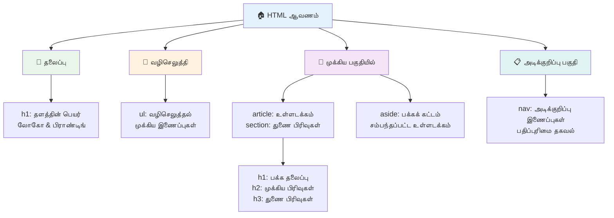
**அணுகலுக்கான பக்க கட்டமைப்பின் அடித்தளக் கட்டுகள்:**

```html
<!-- Landmark elements provide page navigation structure -->
<header>
  <h1>Your Site Name</h1>
  <nav aria-label="Main navigation">
    <ul>
      <li><a href="/home">Home</a></li>
      <li><a href="/about">About</a></li>
      <li><a href="/services">Services</a></li>
    </ul>
  </nav>
</header>

<main>
  <article>
    <header>
      <h1>Article Title</h1>
      <p>Published on <time datetime="2024-10-14">October 14, 2024</time></p>
    </header>
    
    <section>
      <h2>First Section</h2>
      <p>Content that relates to this section...</p>
    </section>
    
    <section>
      <h2>Second Section</h2>
      <p>More related content...</p>
    </section>
  </article>
  
  <aside>
    <h2>Related Links</h2>
    <nav aria-label="Related articles">
      <ul>
        <li><a href="/related-1">First related article</a></li>
        <li><a href="/related-2">Second related article</a></li>
      </ul>
    </nav>
  </aside>
</main>

<footer>
  <p>&copy; 2024 Your Site Name. All rights reserved.</p>
  <nav aria-label="Footer links">
    <ul>
      <li><a href="/privacy">Privacy Policy</a></li>
      <li><a href="/contact">Contact Us</a></li>
    </ul>
  </nav>
</footer>
```

**செமாண்டிக் HTML எப்படி அணுகலை மாற்றுகிறது:**

| செமாண்டிக் கூறு | நோக்கம் | ஸ்கிரீன்ரீடர் பயன் |
|------------------|---------|----------------------|
| `<header>` | பக்கம் அல்லது பிரிவு தலைப்பு | "பேன்சர் நிலைச்சுட்டி" - மேல் விரைவான வழிசெலவு |
| `<nav>` | வழிசெலுத்தல் இணைப்புகள் | "வழிசெலுத்தல் நிலைச்சுட்டி" - வழிசெலுத்தல் பிரிவுகள் பட்டியல் |
| `<main>` | முதன்மை பக்க உள்ளடக்கம் | "முக்கிய நிலைச்சுட்டி" - நேரடியாக உள்ளடக்கம் தவிர்க்கவும் |
| `<article>` | சுயாதீன உள்ளடக்கம் | கட்டுரை எல்லைகளை அறிவிக்கும் |
| `<section>` | தீமையுடனான உள்ளடக்க குழுக்கள் | உள்ளடக்க கட்டமைப்பை வழங்குகிறது |
| `<aside>` | தொடர்புடைய பக்கம் உள் உள்ளடக்கம் | "பூரண நிலைச்சுட்டி" |
| `<footer>` | பக்கம் அல்லது பிரிவு கீழ்தலைப்பு | "உள்ளடக்க தகவல் நிலைச்சுட்டி" |

**செமாண்டிக் HTML உடன் ஸ்கிரீன்ரீடர் சிறந்த செயல்திறன்:**
- **நிலைச்சுட்டி வழிசெலுத்தல்**: முக்கிய பக்கம் பகுதிகள் இடையே உடனடி தாவல்
- **தலைப்பு வரிசைகள்**: தலைப்பு கட்டமைப்பிலிருந்து உள்ளடக்க அட்டவணை உருவாக்குதல்
- **பொருள் பட்டியல்கள்**: அனைத்து இணைப்புகள், பொத்தான்கள் அல்லது படிவ கட்டுப்பாடுகளின் பட்டியல்கள் உருவாக்குதல்
- **சூழல் அறிதல்**: உள்ளடக்க பகுதிகளுக்குள்ள உறவுகளை புரிந்துகொள்ளுதல்

> 🎯 **உடனடி சோதனை**: landmark குறுக்குவழிகள் (D landmark க்காக, H தலைப்புக்காக, K இணைக்காக NVDA/JAWS இல்) பயன்படுத்தி உங்கள் தளத்தில் ஸ்கிரீன்ரீடர் கொண்டு வழிசெய்ய பார்க்கவும். வழிசெலுத்தல் உணர்ந்தோ?

### 🏗️ **செமாண்டிக் HTML நிபுணத்துவ சோதனை: பலமான அடித்தளங்கள் கட்டுதலை**

**உங்கள் செமாண்டிக் புரிதலை மதிப்பிடுவோம்:**
- HTML பார்ப்பதன் மூலம் ஒரு வலைப்பக்கத்தில் landmark களை காணக்கூடியீர்களா?
- `<section>` மற்றும் `<div>` இடையேயான வேறுபாட்டை தோழனுக்கு எப்படி விளக்கும்?
- ஸ்கிரீன்ரீடர் பயனர் வழிசெலுத்தல் சிக்கல்களை புகாரளித்தால் முதலில் என்ன பார்ப்பீர்கள்?

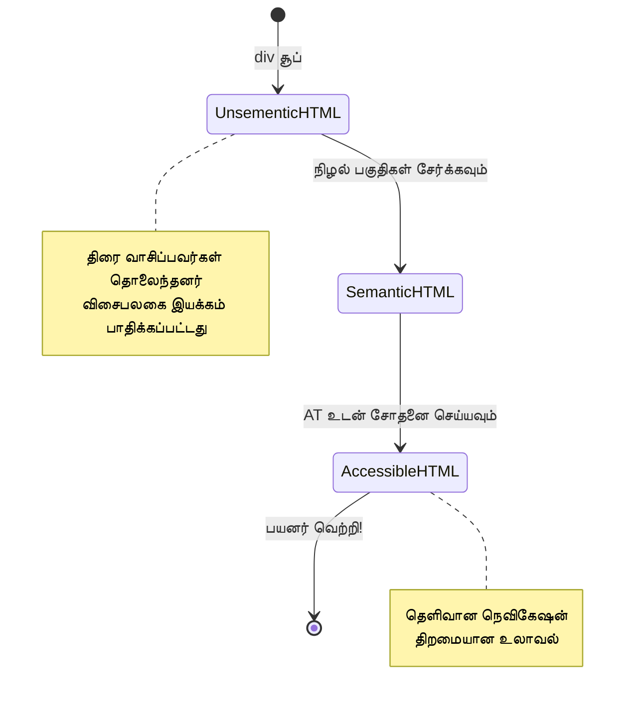
> **திறமை மிக்க அறிவுரை**: நன்றாக கட்டமைக்கப்பட்ட செமாண்டிக் HTML சுமார் 70% அணுகல் சிக்கல்களை தானாகத் தீர்க்கும். இந்த அடித்தளத்தை நன்கு கற்றுக்கொள், நீ செம்மையாக முன்னேறுவாய்!

✅ **உங்கள் செமாண்டிக் கட்டமைப்பை மதிப்பாய்வு செய்யவும்**: உங்கள் உலாவியின் DevTools இல் உள்ள அணுகல் வசதி பலகையை பயன்படுத்தி அணுகல் மரத்தை பார்வையிடவும், உங்கள் குறியீடு ஒரு தகவல்தரமான அமைப்பை உருவாக்குகிறதா என உறுதிசெய்யவும்.

### தலைப்பு வரிசை: ஒரு தர்க்கமான உள்ளடக்க கட்டமைப்பை உருவாக்குதல்

தலைப்புகள் அணுகக்கூடிய உள்ளடக்கத்திற்கு மிகவும் அவசியம் — அவை எல்லாவற்றையும் ஒருங்கிணைக்கும் முதுகெலும்பு போல. ஸ்கிரீன்ரீடர் பயனர்கள் தலைப்புகளை பெரிதும் நம்பி உங்கள் உள்ளடக்கத்தை புரிந்து, வழிசெய்ய உதவுகின்றனர். இது உங்கள் பக்கத்திற்கு உள்ளடக்க அட்டவணை வழங்குவது போல.

**தலைப்புகளுக்கான பொன்னிய விதி:**
நிலை கழிப்பதில்லை. எப்போதும் `<h1>`-இல் இருந்து `<h2>`, `<h3>` போன்ற முறையாக முன்னேற வேண்டும். பள்ளியில் வரைபடம் தயாரித்ததை நினைவுக்கு கொண்டு வாருங்கள்? அதே கொள்கை — "I. முக்கிய புள்ளி" இலிருந்து நேரடியாக "C. துணையுண்மையில் துணைவுண்மை" க்கு தாவவில்லை, முறையாக "A. துணை புள்ளி" எடுத்து வந்தேன்.

**சரியான தலைப்பு அமைப்புக்கான எடுத்துக்காட்டு:**

```html
<!-- ✅ Excellent: Logical, hierarchical progression -->
<main>
  <h1>Complete Guide to Web Accessibility</h1>
  
  <section>
    <h2>Understanding Screen Readers</h2>
    <p>Introduction to screen reader technology...</p>
    
    <h3>Popular Screen Reader Software</h3>
    <p>NVDA, JAWS, and VoiceOver comparison...</p>
    
    <h3>Testing with Screen Readers</h3>
    <p>Step-by-step testing instructions...</p>
  </section>
  
  <section>
    <h2>Color and Contrast Guidelines</h2>
    <p>Designing with sufficient contrast...</p>
    
    <h3>WCAG Contrast Requirements</h3>
    <p>Understanding the different contrast levels...</p>
    
    <h3>Testing Tools and Techniques</h3>
    <p>Tools for verifying contrast ratios...</p>
  </section>
</main>
```

```html
<!-- ❌ Problematic: Skipping levels, inconsistent structure -->
<h1>Page Title</h1>
<h3>Subsection</h3> <!-- Skipped h2 -->
<h2>This should come before h3</h2>
<h1>Another main heading?</h1> <!-- Multiple h1s -->
```

**தலைப்பு சிறந்த நடைமுறைகள்:**
- **ஒரே `<h1>` ஒரு பக்கத்திற்கு**: சாதாரணமாக உங்கள் முதன்மை பக்க தலைப்பு அல்லது முக்கிய உள்ளடக்கு தலைப்பு
- **தர்க்கமான முன்னேறல்**: நிலைகளை எழுதாதீர்கள் (h1 → h2 → h3, h1 → h3 அல்ல)
- **விளக்கமான உள்ளடக்கங்கள்**: தலைப்புகள் தனித்தனியாக வாசிக்கப்பட்டாலும் பொருள் சொல்லும் வகையில் இருக்கவேண்டும்
- **CSS-இல் காட்சி அலங்காரம்**: தோற்றத்திற்கு CSS பயன்படுத்தவும், கட்டமைப்புக்கு HTML நிலைகளை பயன்படுத்தவும்

**ஸ்கிரீன்ரீடர் வழிசெலுத்தல் புள்ளிவிவரங்கள்:**
- 68% ஸ்கிரீன்ரீடர் பயனர்கள் தலைப்புகள் வழியாகவே வழிசெய்கின்றனர் ([WebAIM Survey](https://webaim.org/projects/screenreadersurvey9/#finding))
- பயனர்கள் தர்க்கமான தலைப்பு வரிசை எதிர்பார்க்கின்றனர்
- தலைப்புகள் பக்க கட்டமைப்பை உணர மிக விரைவான வழியாகும்

> 💡 **திறமை மிக்க குறிப்புகள்**: "HeadingsMap" போன்ற உலாவி நீட்டிப்புகளைப் பயன்படுத்தி আপনার தலைப்பு கட்டமைப்பை காட்சி வடிவில் பார்க்கவும். அது நன்றாக ஒழுங்குபட்ட உள்ளடக்க அட்டவணை போன்று வாசிக்க வேண்டும்.

✅ **உங்கள் தலைப்பு கட்டமைப்பை சோதிக்கவும்**: ஸ்கிரீன்ரீடரின் தலைப்பு வழிசெலுத்தற்றை (NVDA இல் H விசை) பயன்படுத்தி தலைப்புகளுக்குள் தாவுங்கள். அந்த முன்னேறல் உங்கள் உள்ளடக்கக் கதையை தர்க்கரீதியாக சொல்லுகிறதா?

### மேம்பட்ட காட்சி அணுகல் தொழில்நுட்பங்கள்

எதிரொலி மற்றும் வண்ண அடிப்படையிலிருந்து அப்புறம், மிகவும் சிக்கலான தொழில்நுட்பங்கள் உண்மையில் ஒருங்கிணைந்த காட்சி அனுபவங்களை உருவாக்க உதவுகின்றன. இவைகள் உங்கள் உள்ளடக்கம் வேறுபட்ட காட்சி நிலைகளிலும் உதவியியல் தொழில்நுட்பங்களிலும் வேலை செய்யும் என்பதை உறுதி செய்கின்றன.

**முக்கிய காட்சி தொடர்புச் சூழல் தொழில்நுட்பங்கள்:**

- **பன்முகமான பதில்கள்**: காட்சி, உரை மற்றும் சில நேரங்களில் குரல் குறியீடுகளை ஒருங்கிணைத்தல்
- **முன்னேற்ற வெளிப்பாடு**: தகவலை எளிது முறையில் பகிர்தல்
- **தொடர்ச்சியான தொடர்பு வடிவங்கள்**: ரீதியான UI நடைமுறைகளைப் பயன்படுத்துதல்
- **பரவலான அச்சுருக்கள்**: சாதனமாற்றங்களை பொருந்தக் கூடிய உரை அளவீடு
- **சுமை மற்றும் பிழை நிலைகள்**: அனைத்து பயனரின் நடவடிக்கைகளுக்கும் தெளிவான பதில்கள் வழங்குதல்

**மேம்படுத்தப்பட்ட அணுகலுக்கான CSS பயன்பாடுகள்:**

```css
/* Screen reader only text - visually hidden but accessible */
.sr-only {
  position: absolute;
  width: 1px;
  height: 1px;
  padding: 0;
  margin: -1px;
  overflow: hidden;
  clip: rect(0, 0, 0, 0);
  white-space: nowrap;
  border: 0;
}

/* Skip link for keyboard navigation */
.skip-link {
  position: absolute;
  top: -40px;
  left: 6px;
  background: #000000;
  color: #ffffff;
  padding: 8px 16px;
  text-decoration: none;
  border-radius: 4px;
  font-weight: bold;
  transition: top 0.3s ease;
  z-index: 1000;
}

.skip-link:focus {
  top: 6px;
}

/* Reduced motion respect */
@media (prefers-reduced-motion: reduce) {
  .skip-link {
    transition: none;
  }
  
  * {
    animation-duration: 0.01ms !important;
    animation-iteration-count: 1 !important;
    transition-duration: 0.01ms !important;
  }
}

/* High contrast mode support */
@media (prefers-contrast: high) {
  .button {
    border: 2px solid;
  }
}
```

> 🎯 **அணுகல் வடிவமைப்பு**: "skip link" விசைக்கட்டுப்பாட்டாளர்களுக்கு அத்தியாவசியம். இது உங்கள் பக்கத்தின் முதல் கவனிக்கத்தக்க உருப்படியாக இருக்க வேண்டும் மற்றும் நேரடியாக முக்கிய உள்ளடக்கத்திற்கு தாவ வேண்டும்.

✅ **skip navigation ஐ செயல்படுத்தவும்**: உங்கள் பக்கங்களில் skip இணைப்புகளைச் சேர்க்கவும், பக்க ஏற்றும்போது உடனடியாக Tab அழுத்தி சோதிக்கவும். அவை தோன்றி முக்கிய உள்ளடக்கத்திற்கு தாவ உதவ வேண்டும்.

## பொருள் கொண்ட இணைப்பு உரையை உருவாக்குதல்

இணைப்புகள் வலைத்தளத்தின் நெடுஞ்சாலைகள் போல், ஆனால் பாதுகாப்பற்ற இணைப்பு உரைகள் "இடம்" என்று மட்டும் ஒரு சாலை குறிகளை வழங்குவது போல். மிகவும் உதவியளிக்கவைப்பதில்லை, அல்லவா?

நான் முதன்முறையாக கற்றதிலிருந்து என்னைக் கவர்ந்ததை பகிர்கிறேன்: ஸ்கிரீன்ரீடர்கள் ஒரு பக்கத்தில் உள்ள அனைத்து இணைப்புகளையும் எடுத்து அவற்றை ஒரு பெரிய பட்டியலாக காட்ட முடியும். ஒரு directory நடைமுறை காட்டி உங்களுக்கு வழங்கப்பட்டால்? ஒவ்வொன்றும் தனித்தனியாகப் பொருந்துமா? உங்கள் இணைப்பு உரை அதை தந்திருக்கணும்!

### இணைப்பு வழிசெலுத்தல் முறைகள்

ஸ்கிரீன்ரீடர்கள் நன்றாக எழுதப்பட்ட இணைப்புகளுக்கு நம்பிக்கை வைத்து சக்திவாய்ந்த இணைப்பு வழிசெலுத்தல்களை வழங்குகின்றன:

**இணைப்பு வழிசெலுத்தல் முறைகள்:**
- **தொடர்ச்சியாக வாசிப்பு**: இணைப்புகள் உள்ளடக்கத்தின் ஓடையில் வாசிக்கப்படுகின்றன
- **இணைப்பு பட்டியல் உருவாக்கம்**: அனைத்து பக்க இணைப்புகளும் தேடக்கூடிய அமைப்பில் தொகுக்கப்படுகின்றன
- **விரைவு வழிசெலுத்தல்**: விசைப்பலகை குறுக்குவழிகளைக் கொண்டு இணைப்புகளுக்கு இடையே தாவல் (NVDA இல் K)
- **தேடல் செயல்பாடு**: பகுதி உரையை தட்டச்சு செய்து குறிப்பிட்ட இணைப்பைக் கண்டுபிடி

**சூழல் முக்கியத்துவம்:**
ஸ்கிரீன்ரீடர் பயனர்கள் ஒரு இணைப்பு பட்டியலை உருவாக்கும் போது இதுபோன்றதை காண்கின்றனர்:
- "அறிக்கை பதிவிறக்கவும்"
- "மேலும் அறிந்து கொள்ள"
- "இங்கே சொடுக்கவும்"
- "தனியுரிமைக் கொள்கை"
- "இங்கே சொடுக்கவும்"

இவை இரண்டு இணைப்புகள் மட்டுமே சூழலுக்கு பொருந்தும் பயனுள்ள தகவலை வழங்குகின்றன!

> 📊 **பயனர் தாக்கம்**: ஸ்கிரீன்ரீடர் பயனர்கள் இணைப்பு பட்டியல்களை விரைவில் பார்வையிட்டு பக்க உள்ளடக்கத்தை புரிந்துகொள்ள விரும்புகின்றனர். பொது இணைப்பு உரைகள் அவர்கள் ஒவ்வொரு இணைப்பு சூழலுக்குச் சென்றும் திரும்பி பார்ப்பதற்கான நேரம் பெருக்கி உலாவல் வேகத்தை மிகவும் குறைக்கின்றன.

### தவிர்க்க வேண்டிய பொது இணைப்பு உரை பிழைகள்

செயல்படாதவற்றைப் புரிந்துகொள்ளுதல், உள்ளடக்க அணுகல் சிக்கல்களை கண்டறிந்து சரி செய்ய உதவும்.

**❌ சூழல் சொல்லாத பொது இணைப்பு உரை:**

```html
<!-- Meaningless when read from a link list -->
<p>Our sustainability efforts are detailed in our recent report. 
   <a href="/sustainability-2024.pdf">Click here</a> to view it.</p>

<!-- Repeated generic text throughout the page -->
<div class="article-card">
  <h3>Web Accessibility Guide</h3>
  <p>Learn the fundamentals...</p>
  <a href="/accessibility-guide">Read more</a>
</div>
<div class="article-card">
  <h3>Color Contrast Tips</h3>
  <p>Improve your design...</p>
  <a href="/color-contrast">Read more</a>
</div>

<!-- URLs as link text (difficult for screen readers to announce) -->
<p>Visit https://www.w3.org/WAI/WCAG21/quickref/ for WCAG guidelines.</p>

<!-- Vague action words -->
<a href="/contact">Go</a> | <a href="/about">See</a> | <a href="/help">View</a>
```

**இந்த முறை எல்லாம் ஏன் தோல்வியடைகிறது:**
- **"இங்கே சொடுக்கவும்"** பயனர்களுக்கு இலக்கை பற்றி எதுவும் கூறாது
- **"மேலும் படியவும்"** பலமுறை மீண்டும் வந்து குழப்பத்தை ஏற்படுத்துகிறது
- **நிறைவற்ற URLகள்** ஸ்கிரீன்ரீடர்களுக்கு தெளிவாக உச்சரிப்பதில் சிரமம்
- **ஒற்றை சொற்கள்** "செல்" அல்லது "பார்" போல் விளக்கமுள்ள சூழல் இல்லாமல்

### சிறந்த இணைப்பு உரை எழுதுதல்

விளக்கமான இணைப்பு உரை அனைவருக்கும் பயனுள்ளது — காட்டக்கூடிய பயனர்கள் இணைப்புகளை விரைவில் பார்வையிட முடியும் மற்றும் ஸ்கிரீன்ரீடர் பயனர்கள் இலக்குகளைக் கவனிக்கின்றனர்.

**✅ தெளிவான மற்றும் விளக்கமான இணைப்பு உரை உதாரணங்கள்:**

```html
<!-- Descriptive text that explains the destination -->
<p>Our comprehensive <a href="/sustainability-2024.pdf">2024 sustainability report (PDF, 2.1MB)</a> details our environmental initiatives.</p>

<!-- Specific, unique link text for each card -->
<div class="article-card">
  <h3>Web Accessibility Guide</h3>
  <p>Learn the fundamentals of inclusive design...</p>
  <a href="/accessibility-guide">Read our complete web accessibility guide</a>
</div>
<div class="article-card">
  <h3>Color Contrast Tips</h3>
  <p>Improve your design with better color choices...</p>
  <a href="/color-contrast">Explore color contrast best practices</a>
</div>

<!-- Meaningful text instead of raw URLs -->
<p>The <a href="https://www.w3.org/WAI/WCAG21/quickref/">WCAG 2.1 Quick Reference guide</a> provides comprehensive accessibility guidelines.</p>

<!-- Descriptive action links -->
<a href="/contact">Contact our support team</a> | 
<a href="/about">About our company</a> | 
<a href="/help">Get help with your account</a>
```

**இணைப்பு உரை சிறந்த நடைமுறைகள்:**
- **குறிப்பிடுதல்**: "காலாண்டு நிதி அறிக்கையை பதிவிறக்கவும்" மற்றும் "பதிவிறக்கவும்" இடையே வித்தியம்
- **கோப்புத் தகவலும் அளவையும் சேர்த்தல்**: "(PDF, 1.2MB)" போன்ற பதிவிறக்கக் கோப்புகளுக்கு
- **இணைப்புகள் வெளியே திறந்துவிடுமா என்று குறிப்பிடுதல்**: "(புதிய சாளரம் திறக்கும்)" தேவையான போது
- **செயல்பாட்டையுடனான மொழியைக் கொண்டு இருக்கவும்**: "எங்களை தொடர்பு கொள்ளவும்" மற்றும் "தொடர்பு பக்கம்"
- **குறுகியதாக்கவும்**: சாத்தியமானவர்களுக்கு 2-8 சொற்கள் இடைப்பட்டிருக்கும்

### மேம்பட்ட இணைப்பு அணுகல் வடிவங்கள்

சில நேரங்களில் காட்சி வடிவமைப்பு கட்டுப்பாடுகள் அல்லது தொழில்நுட்ப தேவைகள் சிறப்பு தீர்வுகளை தேவைப்படுத்துகின்றன. இதோ பொதுவான சவாலான சூழல்களுக்கு நுட்பமான முறைகள்:

**மேம்படுத்த ARIA பயன்படுத்துதல்:**

```html
<!-- When button text must be short but needs more context -->
<a href="/report.pdf" 
   aria-label="Download 2024 annual financial report, PDF format, 2.3MB">
  Download Report
</a>

<!-- When the full context comes from surrounding content -->
<h3 id="sustainability-heading">Sustainability Initiative</h3>
<p>Our efforts to reduce environmental impact...</p>
<a href="/sustainability-details" 
   aria-labelledby="sustainability-heading"
   aria-describedby="sustainability-summary">
  Learn more
</a>
<p id="sustainability-summary">Detailed breakdown of our 2024 environmental goals and achievements</p>
```

**கோப்புகளின் வகைகள் மற்றும் வெளிப்புற இலக்குகளை குறிப்பிடுதல்:**

```html
<!-- Method 1: Include information in visible link text -->
<a href="/annual-report.pdf">
  Download our 2024 annual report (PDF, 2.3MB)
</a>

<!-- Method 2: Use screen reader-only text for file details -->
<a href="/annual-report.pdf">
  Download our 2024 annual report
  <span class="sr-only">(PDF format, 2.3MB)</span>
</a>

<!-- Method 3: External link indication -->
<a href="https://example.com" 
   target="_blank" 
   aria-describedby="external-link-warning">
  Visit external resource
</a>
<span id="external-link-warning" class="sr-only">
  (opens in new window)
</span>

<!-- Method 4: Using CSS for visual indicators -->
<a href="https://example.com" class="external-link">
  External resource
</a>
```

```css
/* Visual indicator for external links */
.external-link::after {
  content: " ↗";
  font-size: 0.8em;
  color: #666;
}

/* Screen reader announcement for external links */
.external-link::before {
  content: "External link: ";
  position: absolute;
  left: -10000px;
  width: 1px;
  height: 1px;
  overflow: hidden;
}
```

> ⚠️ **முக்கியம்**: `target="_blank"` பயன்படுத்தும்போது, இணைப்பு புதிய சாளரமாக அல்லது புதிய தாவலாக திறக்கும் என்பதை பயனர்களுக்கு எப்பொழுதும் தெரிவிக்கவும். எதிர்பாரா வழிசெலுத்தல் மாற்றங்கள் குழப்பத்தை உண்டாக்கும்.

✅ **உங்கள் இணைப்பு சூழலை சோதிக்கவும்**: உங்கள் உலாவியின் டெவலப்பர் கருவிகளை பயன்படுத்தி, அனைத்து இணைப்புகளின் பட்டியலை இறுதிப் பார்வை இடுங்கள். எந்த இணைப்பும் சுற்றியுள்ள சூழல் இல்லாமல் உங்கள் நோக்கத்தை விளக்குமா?

## ARIA: HTML அணுகலை அதிகரித்தல்

[Accessible Rich Internet Applications (ARIA)](https://developer.mozilla.org/docs/Web/Accessibility/ARIA) என்பது உங்கள் சிக்கலான வலை பயன்பாடுகளுக்கும் உதவியியல் தொழில்நுட்பங்களுக்கும் இடையில் ஒரு உலகளாவிய மொழிபெயர்ப்பாளரைப் போன்றது. HTML தனக்கே முடியாத அனைத்தையும் சொல்லும்போது, ARIA அந்த இடைவெளிகளை நிரப்ப உதவுகிறது.

ARIA-ன் மிக முக்கிய விதி என்னவென்றால்: எப்போதும் செமாண்டிக் HTML முதலாவதாகப் பயன்படுத்தி பின்னர் அதை மேம்படுத்த ARIAயை சேர்க்கவும். ARIA அத்தியாயமாக அல்ல, உப்புச் சேர்க்கும் பொருளாக நினைத்து HTML கட்டமைப்பில் தெளிவாகவும் மேம்படுத்தவும் பயன்படவேண்டும். அந்த அடித்தளத்தை முதலில் சரியாக கற்றுக் கொள்ளுங்கள்!

### திட்டமிட்ட ARIA செயலாக்கம்

ARIA சக்திவாய்ந்தது, ஆனால் சக்தியோடு பொறுப்பும் வரும். தவறான ARIA அணுகலை மோசமாக்கும். ARIA-வை எப்போது மற்றும் எப்படி பயன்படுத்துவது என்பது இங்கே உள்ளது:

**✅ ARIA பயன்படுத்த வேண்டும்:**
- தனிப்பயன் தொடர்பு உட்பொருட்களை உருவாக்கும் போது (accordion, தாவல்கள், கறுச்சுழற்சிகள்)
- பக்கத்தை மீண்டும் ஏற்றாமல் மாறும் பொருளடக்கங்களை உருவாக்கும்போது
- சிக்கலான UI உறவுகளுக்கு கூடுதல் சூழல் வழங்கும்போது
- ஏற்று நிலைகள் அல்லது நேரடி உள்ளடக்க மேம்பாடுகளை காட்டும்போது
- தனிப்பயன் கட்டுப்பாடுகளுடன் செயல்பாட்டுப் போலி இடைமுகங்களை உருவாக்கும்போது

**❌ ARIA தவிர்க்க வேண்டும்:**
- இருப்பு செமாண்டிக் HTML கூறுகள் தேவையான சூழலை வழங்கும் போது
- அதனை சரியாகச் செய்ய முடியுமா என உறுதி இல்லாமை
- செமாண்டிக் HTML வழங்கிய தகவலின் பஞ்சிறுக்கப்படுகையில்
- உண்மையில் உதவியியல் கருவிகளுடன் சோதிக்கப்படவில்லை என்றால்

> 🎯 **ARIA பொன்முறை**: "செமாண்டிக் மாற்றம் தவிர்க்க முடியாவிட்டால் மட்டும் செய்யவும், எப்போதும் விசைக்கட்டுப்பாட்டை பாதுகாக்கவும், உண்மையான உதவியியல் தொழில்நுட்பத்துடன் சோதனை செய்யவும்."
**ARIA இன் ஐந்து வகைகள்:**

1. **பாத்திரங்கள்**: இந்த உட்செலுத்தல் என்ன? (`button`, `tab`, `dialog`)
2. **பண்புகள்**: இதன் அம்சங்கள் என்ன? (`aria-required`, `aria-haspopup`)
3. **நிலைகள்**: இதன் தற்போதைய நிலை என்ன? (`aria-expanded`, `aria-checked`)
4. **நிலைகள்**: பக்க அமைப்பில் இது எங்கு உள்ளது? (`banner`, `navigation`, `main`)
5. **நேரடி பகுதிகள்**: மாற்றங்கள் எப்படி அறிவிக்கப்பட வேண்டும்? (`aria-live`, `aria-atomic`)

### நவீன வலை பயன்பாடுகளுக்கான அவசியமான ARIA வடிவங்கள்

இந்த வடிவங்கள் செயல்பாட்டுள்ள வலை பயன்பாடுகளில் பொதுவான அணுகல் சவால்களைத் தீர்க்கின்றன:

**உட்செலுத்தல்களை பெயரிடுதல் மற்றும் விளக்குதல்:**

```html
<!-- aria-label: Provides accessible name when visible text isn't sufficient -->
<button aria-label="Close newsletter subscription dialog">×</button>

<!-- aria-labelledby: References existing text as the accessible name -->
<section aria-labelledby="news-heading">
  <h2 id="news-heading">Latest News</h2>
  <!-- news content -->
</section>

<!-- aria-describedby: Links to additional descriptive text -->
<input type="password" 
       aria-describedby="pwd-requirements pwd-strength"
       required>
<div id="pwd-requirements">
  Password must contain at least 8 characters, including uppercase, lowercase, and numbers.
</div>
<div id="pwd-strength" aria-live="polite">
  <!-- Dynamic password strength indicator -->
</div>
```

**மாறி உள்ளடக்கத்திற்கான நேரடி பகுதிகள்:**

```html
<!-- Polite announcements (don't interrupt current speech) -->
<div aria-live="polite" id="status-updates">
  <!-- Status messages appear here -->
</div>

<!-- Assertive announcements (interrupt and announce immediately) -->
<div aria-live="assertive" id="urgent-alerts">
  <!-- Error messages and critical alerts -->
</div>

<!-- Loading states with live regions -->
<button id="submit-btn" aria-describedby="loading-status">
  Submit Application
</button>
<div id="loading-status" aria-live="polite" aria-atomic="true">
  <!-- "Processing your application..." appears here -->
</div>
```

**இணையச் சாளர உதாரணம் (அக்கார்டியன்):**

```html
<div class="accordion">
  <h3>
    <button aria-expanded="false" 
            aria-controls="panel-1" 
            id="accordion-trigger-1"
            class="accordion-trigger">
      Accessibility Guidelines
    </button>
  </h3>
  <div id="panel-1" 
       role="region"
       aria-labelledby="accordion-trigger-1" 
       hidden>
    <p>WCAG 2.1 provides comprehensive guidelines...</p>
  </div>
</div>
```

```javascript
// அகார்டியன் நிலையை நிர்வகிக்க ஜாவாஸ்கிரிப்ட்
function toggleAccordion(trigger) {
  const panel = document.getElementById(trigger.getAttribute('aria-controls'));
  const isExpanded = trigger.getAttribute('aria-expanded') === 'true';
  
  // நிலைகளை மாறுதல் செய்யவும்
  trigger.setAttribute('aria-expanded', !isExpanded);
  panel.hidden = isExpanded;
  
  // திரைவேக்கர்களுக்கு மாற்றத்தை அறிவிக்கவும்
  const status = document.getElementById('status-updates');
  status.textContent = isExpanded ? 'Section collapsed' : 'Section expanded';
}
```

### ARIA நடைமுறை சிறந்த நடைமுறைகள்

ARIA சக்திவாய்ந்தது ஆனால் கவனமாக செயல்படுத்தப்பட வேண்டும். இந்த வழிகாட்டுதல்களை பின்பற்றுவது உங்கள் ARIA அணுகலை மேம்படுத்தும் என்பதை உறுதி செய்ய உதவும்:

**🛡️ கொர்ம போலீஸி:**

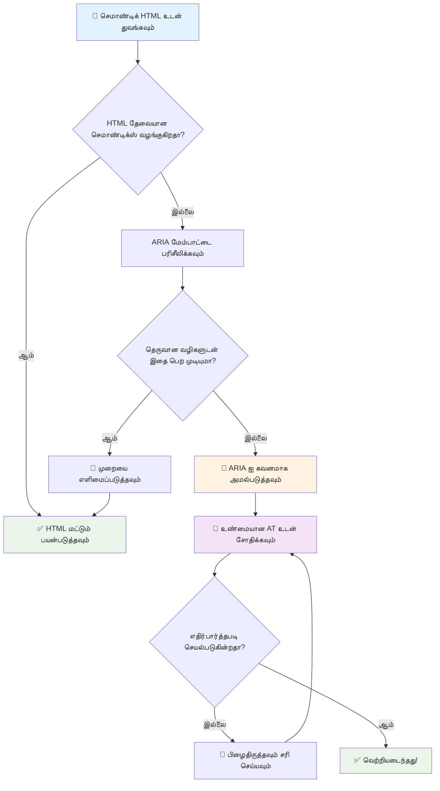
1. **முறையான HTML முதலில்**: எப்போதும் `<button>` ஐ `<div role="button">` விட முன்னுரிமை அளிக்கவும்
2. **உரிய பொருளை பிசையாதீர்கள்**: தற்போதைய HTML பொருளை மாற்றாதீர்கள் (`<h1 role="button">` தவிர்க்கவும்)
3. **கீபோர்டு அணுகலை பராமரிக்கவும்**: அனைத்து இணையக ARIA கூறுகளும் முழுமையாக கீபோர்டு பயன்படுத்தக்கூடியதாக இருக்க வேண்டும்
4. **உண்மையான பயனர்களுடன் சோதனை செய்யவும்**: ARIA உதவி தொழில்நுட்பங்களுக்கு இடையில் முக்கிய வேறுபாடுகள் உள்ளன
5. **எளிமையாகத் தொடங்கி**: சிக்கலான ARIA நடைமுறைகளில் பிழைகள் அதிகப்பட வாய்ப்பு உள்ளது

**🔍 சோதனை பணிமுறை:**

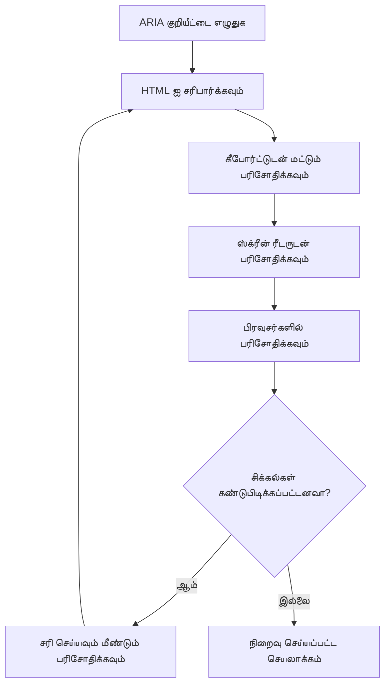
**🚫 தவிர்க்க வேண்டிய பொதுவான ARIA பிழைகள்:**

- **கருத்து முரண்பாடு**: HTML பொருள்களுடன் முரணாக இருக்கத்தூடாதீர்கள்
- **அதிக லேபிள் வைப்பது**: அதிகமான ARIA தகவல் பயனர்களை மயக்கமூட்டும்
- **நிலையான ARIA**: உள்ளடக்கம் மாறும் போது ARIA நிலைகளை புதுப்பிக்க மறந்துவிடுதல்
- **சோதிக்காத நடைமுறைகள்**: வருவாய் கவனத்தில் வரும் போது செயல்படாத ARIA
- **கீபோர்டு ஆதரவு இன்றி**: தொடர்புடைய கீபோர்டு செயல்பாடுகள் இல்லாத ARIA பாத்திரங்கள்

> 💡 **சோதனை உடன்படிக்கை**: [accessibility-checker](https://www.npmjs.com/package/accessibility-checker) போன்ற கருவிகளை பயன்படுத்தி தானாக ARIA சரிபார்க்கவும், ஆனால் முழுமையான அனுபவத்திற்கு உண்மையான திரைத்தொடர்பாளர்களுடன் சோதனை செய்யவும்.

### 🎭 **ARIA திறன் சோதனை: சிக்கலான தொடர்புகளுக்கு தயார்?**

**காண் உங்கள் ARIA நம்பிக்கை:**
- நீங்கள் எப்போது ARIA ஐ முறையான HTML மேலாக தேர்ந்தெடுக்க விரும்புவீர்கள்? (குறிப்பு: அப்படியாக முடியுமா என்றால் மிக அரிது!)
- ஏன் `<div role="button">` பொதுவாக `<button>` விட மோசமாக இருக்கும் என்பதை விளக்கமுடியுமா?
- ARIA சோதனை பற்றி நினைவில் வைத்துக்கொள்ள வேண்டிய மிக முக்கிய விஷயம் என்ன?

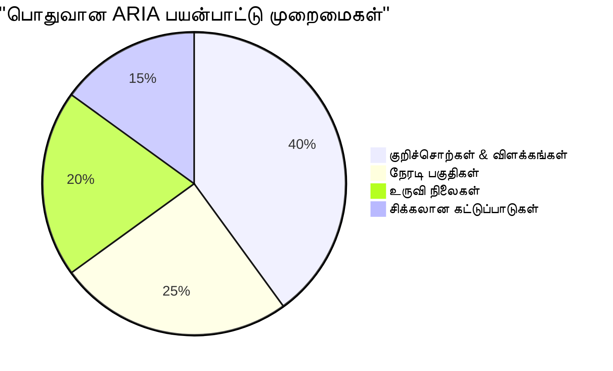
> **முக்கிய உணர்வு**: மிகப் பெரும்பாலான ARIA பயன்பாடு உட்செலுத்தல்களுக்கான லேபிள் மற்றும் விளக்கம் கொடுப்பதற்காகவே உள்ளது. சிக்கலான கருவி வடிவங்கள் நீங்கள் நினைக்கும் அளவில் பொதுவாக இல்லை!

✅ **நிபுணர்களிடமிருந்து கற்றுக்கொள்ளவும்**: சிக்கலான இணை இயக்க மகுட்களுக்கு போர்தாள்ளப்பட்ட வடிவங்கள் மற்றும் நடைமுறைகள் பற்றிய [ARIA Authoring Practices Guide](https://w3c.github.io/aria-practices/) ஐ ஆய்வு செய்யவும்.

## படங்களை மற்றும் மீடியாவை அணுகக்கூடியதாக மாற்றுதல்

காணொளி மற்றும் ஆடியோ உள்ளடக்கம் நவீன வலை அனுபவங்களின் அவசியமான பகுதிகள், ஆனால் அவற்றை யோசனையுடன் செயல்படுத்தாதால் தடைகள் ஏற்படலாம். உங்கள் மீடியாவின் தகவலும் உணர்ச்சி தாக்கமும் ஒவ்வொரு பயனருக்கும் தக்கவிதமாக வரும் என்பதே இலக்கு. இதில் அடி வைத்து எடுத்தால் அது எல்லா சமயங்களிலும் இயல்பானது ஆகும்.

வழங்கப்படும் மீடியா வகைகள் வித்தியாசமான அணுகல் முறைகளை தேவைப்படுத்துகின்றன. சமையல் போல ஒன்றைச் செய்யுமாறு மற்றொன்றை செய்யக்கூடாது. இந்த வேறுபாடுகளை அறிந்து ஒவ்வொரு சூழலுக்கும் சரியான தீர்வை தேர்ந்தெடுக்க உதவும்.

### திறமையான படம் அணுகல்

உங்கள் வலைத்தளத்தில் ஒவ்வொரு படம் ஒரு நோக்கத்தைக் கொண்டது. அந்த நோக்கத்தை அறிந்து சிறந்த மாற்று உரலை எழுதவும், அதிக அருந்தக்கூடிய அனுபவத்தை உருவாக்கவும் செய்யுங்கள்.

**நான்கு வகையான படங்கள் மற்றும் அவற்றின் மாற்று உரை தந்திரங்கள்:**

**தகவல் கொடுக்கும் படங்கள்** - முக்கிய தகவலை வழங்கும்:
```html

```

**அலங்கார படங்கள்** - நிறைவான தகவல் இல்லாத purely காட்சி படங்கள்:
```html

```

**செயல்பாட்டு படங்கள்** - பட்டன்கள் அல்லது கட்டுப்பாடுகள்:
```html
<button>
  
</button>
```

**சிக்கலான படங்கள்** - பட்டியல், வரைபடம், தகவல் வரைபடங்கள்:
```html

<div id="chart-description">
  <p>Detailed description: Sales data shows a steady increase across all quarters...</p>
</div>
```

### காணொளி மற்றும் ஆடியோ அணுகல்

**காணொளி தேவைகள்:**
- **உரைபுள்ளிகள்**: பேச்சு மற்றும் ஒலி விளைவுகளின் உரை வடிவம்
- **ஆடியோ விளக்கங்கள்**: பார்த்துக்கொள்ள முடியாதவர்களுக்கான காட்சிச் கூறுகள்
- **மொழிபெயர்ப்புகள்**: அனைத்து ஆடியோ மற்றும் காட்சி உள்ளடக்கங்களும் முழுமையாக உரை வடிவில்

```html
<video controls>
  <source src="video.mp4" type="video/mp4">
  <track kind="captions" src="captions.vtt" srclang="en" label="English">
  <track kind="descriptions" src="descriptions.vtt" srclang="en" label="Audio descriptions">
</video>
```

**ஆடியோ தேவைகள்:**
- **மொழிபெயர்ப்புகள்**: அனைத்து பேச்சு உள்ளடக்கங்களின் உரை வடிவம்
- **காட்சிச் குறிப்புகள்**: ஆடியோ மட்டும் உள்ளடக்கங்களுக்கு காட்சிச் குறிப்புகள் வழங்குதல்

### நவீன பட தொழில்நுட்பங்கள்

**அலங்கார படங்களுக்கு CSS பயன்பாடு:**
```css
.hero-section {
  background-image: url('decorative-hero.jpg');
  /* Decorative images in CSS don't need alt text */
}
```

**அணுகல் இருக்கும் பிரதிபலிப்பு படங்கள்:**
```html
<picture>
  <source media="(min-width: 800px)" srcset="large-chart.png">
  <source media="(min-width: 400px)" srcset="medium-chart.png">
  
</picture>
```

✅ **பட அணுகலை சோதனை செய்யவும்**: படங்கள் உள்ள பக்கத்தை திரைத்தொடர்பாளர் மூலம் அணுகவும். உள்ளடக்கம் புரிந்துகொள்ள போதுமான தகவல் கிடைக்கிறதா?

## கீபோர்டு வழிசெலுத்தல் மற்றும் கவனம் மேலாண்மை

பல பயனர்கள் முழுக்க முழுக்க அவர்களது கீபோர்டுக்களால் வலைத்தளத்தை தேடிக்கொள்கின்றனர். இதுவே இயக்க சிரமமுள்ளவர்கள், வேகமான கீபோர்ட் பயனர்கள் மற்றும் எவருடைய மாசு செயல்படாது விட்டவர்கள் ஆக இருக்க முடியும். உங்கள் தளம் கீபோர்டு உள்ளீட்டுடன் நன்றாக நடக்கும் என்று உறுதி செய்தல் அவசியம் மற்றும் அனைவரின் பயன்பாட்டை எளிதாக்க முடியும்.

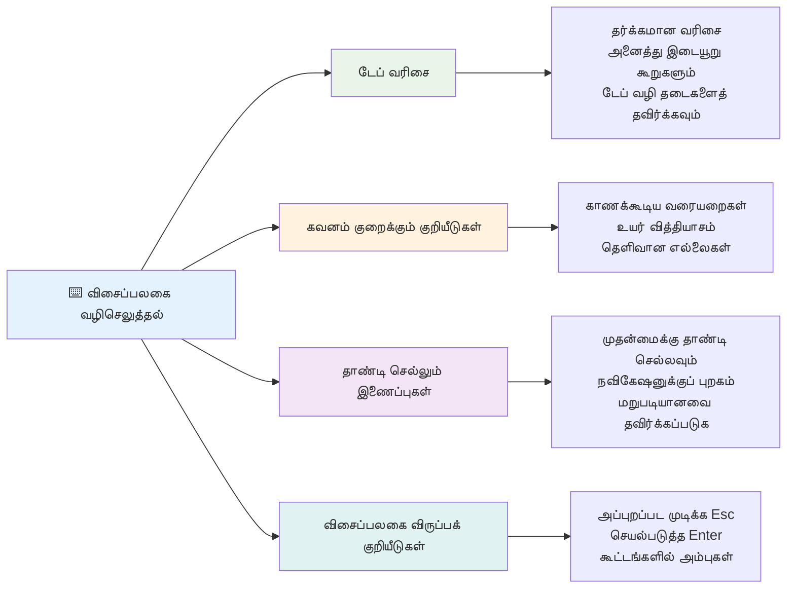
### அவசியமான கீபோர்ட் வழிசெலுத்தல் வடிவங்கள்

**நிலைபடியான கீபோர்ட் செயல்பாடுகள்:**
- **Tab**: இணையடையக்கூடிய இடங்களை தௌருவாக முன்னேறி செல்ல
- **Shift + Tab**: பின்னடைவை நோக்கி செல்ல
- **Enter**: பட்டன்கள் மற்றும் இணைப்பு செயல்படுத்த
- **Space**: பட்டன்கள் செயல்படுத்து, செக் பாக்ஸ் எடுத்துக்காட்டு
- **அம்பு விசைகள்**: கூறுகளுக்குள் (ரேடியோ பட்டன்கள், மெனுக்கள்) செல்ல
- **Escape**: முனைவிற்கு/படிகளை மூடு, அல்லது செயல்களை நிறுத்து

### கவனம் மேலாண்மை சிறந்த நடைமுறைகள்

**தெளிவான கவனம் குறியீடுகள்:**
```css
/* Ensure focus is always visible */
button:focus-visible {
  outline: 2px solid #4A90A4;
  outline-offset: 2px;
}

/* Custom focus styles for different components */
.card:focus-within {
  box-shadow: 0 0 0 3px rgba(74, 144, 164, 0.5);
}
```

**விரைவான வழிசெலுத்தலுக்கு 'skip' இணைப்புகள்:**
```html
<a href="#main-content" class="skip-link">Skip to main content</a>
<a href="#navigation" class="skip-link">Skip to navigation</a>

<nav id="navigation">
  <!-- navigation content -->
</nav>
<main id="main-content">
  <!-- main content -->
</main>
```

**சரியான Tab வரிசை:**
```html
<!-- Use semantic HTML for natural tab order -->
<form>
  <label for="name">Name:</label>
  <input type="text" id="name" tabindex="0">
  
  <label for="email">Email:</label>
  <input type="email" id="email" tabindex="0">
  
  <button type="submit" tabindex="0">Submit</button>
</form>
```

### முனைவிலுள்ள கவனம் சிக்கல்

முனைவு உரையாடலை திறக்கும் போது, கவனம் முனைவுக்குள் தான் சிக்கிக்கொண்டிருக்க வேண்டும்:

```javascript
// நவீன கவனக்குழாய் செயல்பாடு
function trapFocus(element) {
  const focusableElements = element.querySelectorAll(
    'button, [href], input, select, textarea, [tabindex]:not([tabindex="-1"])'
  );
  
  const firstElement = focusableElements[0];
  const lastElement = focusableElements[focusableElements.length - 1];

  element.addEventListener('keydown', (e) => {
    if (e.key === 'Tab') {
      if (e.shiftKey && document.activeElement === firstElement) {
        e.preventDefault();
        lastElement.focus();
      } else if (!e.shiftKey && document.activeElement === lastElement) {
        e.preventDefault();
        firstElement.focus();
      }
    }
    
    if (e.key === 'Escape') {
      closeModal();
    }
  });
  
  // மோடல் திறக்கும்போது முதன்மை பொருளில் கவனம் செலுத்துக
  firstElement.focus();
}
```

✅ **கீபோர்ட் வழிசெலுத்தலை சோதனை செய்யவும்**: உங்கள் தளத்தை மட்டும் Tab விசையைப் பயன்படுத்தி ஆராயுங்கள். அனைத்து இணையங்களையும் சென்றடைந்தீர்களா? கவனம் வரிசை நியாயமாக உள்ளதா? கவனம் குறியீடுகள் தெளிவாக உள்ளனவா?

## படிவ அணுகல்

படிவங்கள் பயனர் தொடர்புக்கு முக்கியமானவை மற்றும் மேலும் கவனம் தேவைப்படுகிறது.

### லேபிள் மற்றும் படிவ கட்டுப்பாடு தொடர்பு

**ஒவ்வொரு படிவ கட்டுப்பாடுக்கும் லேபிள் தேவை:**
```html
<!-- Explicit labeling (preferred) -->
<label for="username">Username:</label>
<input type="text" id="username" name="username" required>

<!-- Implicit labeling -->
<label>
  Password:
  <input type="password" name="password" required>
</label>

<!-- Using aria-label when visual label isn't desired -->
<input type="search" aria-label="Search products" placeholder="Search...">
```

### பிழை கையாளுதல் மற்றும் சரிபார்ப்பு

**அணுகக்கூடிய பிழை செய்திகள்:**
```html
<label for="email">Email Address:</label>
<input type="email" id="email" name="email" 
       aria-describedby="email-error" 
       aria-invalid="true" required>
<div id="email-error" role="alert">
  Please enter a valid email address
</div>
```

**படிவ சரிபார்ப்பு சிறந்த நடைமுறைகள்:**
- தவறான இடங்களை காட்ட `aria-invalid` பயன்படுத்தவும்
- தெளிவான, குறிப்பிட்ட பிழை செய்திகள் வழங்கவும்
- முக்கிய பிழை அறிவிப்புக்கு `role="alert"` பயன்படுத்தவும்
- உடனடி மற்றும் சமர்ப்பித்தல் நேரத்திலும் பிழைகளை காட்டவும்

### பிரிவுகள் மற்றும் குழுக்களாக்கம்

**படிவ கட்டுப்பாடுகளை தொடர்புபடுத்து குழுக்களாக்கவும்:**
```html
<fieldset>
  <legend>Shipping Address</legend>
  <label for="street">Street Address:</label>
  <input type="text" id="street" name="street">
  
  <label for="city">City:</label>
  <input type="text" id="city" name="city">
</fieldset>

<fieldset>
  <legend>Preferred Contact Method</legend>
  <input type="radio" id="contact-email" name="contact" value="email">
  <label for="contact-email">Email</label>
  
  <input type="radio" id="contact-phone" name="contact" value="phone">
  <label for="contact-phone">Phone</label>
</fieldset>
```

## உங்கள் அணுகல் பயணம்: முக்கிய எடுத்துக்கொள்ளவைகள்

வாழ்த்துக்கள்! நீங்கள் உண்மையில் அருந்தக்கூடிய வலை அனுபவங்களை உருவாக்க அடிப்படையான அறிவை பெற்றுள்ளீர்கள். இது அருமையான விஷயம்! வலை அணுகல் வெறும் ஒப்புதலுக்கான செல்லுபடியாகும் பெட்டிகளை சரிபார்ப்பது மட்டுமல்ல - டிஜிட்டல் உள்ளடக்கத்துடன் மக்கள்வகைப்படி தொடர்பு கொள்ளும் விதங்களை புரிந்து, அந்த சிக்கலை வடிவமைக்கிறது.

நீங்கள் இப்போது சிறந்த வடிவமைப்புகள் எல்லாருக்கும் வேலை செய்யும் என்பதை அறிவும் வளர்ந்த வளர்க் குழுவில் இருக்கிறீர்கள். கிளப்பிற்கு வரவேற்கிறோம்!

**🎯 உங்கள் அணுகல் கருவி பெட்டி இப்போது உள்ளடக்கியது:**

| மூலக் கொள் | நடைமுறை | தாக்கம் |
|----------------|----------------|---------|
| **மெய்யுரு HTML அடித்தளம்** | சரியான HTML கூறுகளை பயன்படுத்துவது | திரைத்தொடர்பாளர்கள் திறமையாக இயக்க முடியும், கீபோர்டுகள் தானாக செயல்படும் |
| **அனைவருக்கும் பொருந்தும் காட்சி வடிவு** | போதுமான முரண்பாடு, அர்த்தமுள்ள வண்ணப் பயன்பாடு, தெளிவான கவனம் குறியீடுகள் | ஒளிர்வு சூழ்நிலைகளில் அனைவருக்கும் தெளிவு |
| **விளக்கமான உள்ளடக்கம்** | அர்த்தமுள்ள இணைப்புச் சொற்கள், மாற்று உரை, தலைப்புகள் | பயனர்கள் பார்வைல்லாத நிலையில் உள்ளடக்கத்தை புரிந்து கொள்கின்றனர் |
| **கீபோர்டு அணுகல்** | Tab வரிசை, கீபோர்டு குறுக்கு வழிகள், கவனம் மேலாண்மை | இயக்க சிரமத்திற்கும் வேகம் தேடும் பயனர்க்கும் உதவி |
| **ARIA மேம்பாடு** | பொருள்ைவிழக்கு இடங்களை நிரப்பும் திட்டமிடல் | சிக்கலான பயன்பாடுகள் உதவிக் கருவிகளுடன் வேலை செய்யும் |
| **முழுமையான சோதனை** | தானாக இயங்கும் கருவிகள் + கைமுறை சரிபார்ப்பு + உண்மையான பயனர் சோதனை | பயனாளர்களுக்கு பாதிப்பு உண்டாகும்முன் பிழைகளை பிடிக்கவும் |

**🚀 உங்கள் அடுத்த படிகள்:**

1. **உங்கள் வேலைநிலைக்கு அணுகலை ஈட்டுங்கள்**: சோதனையை உங்கள் மேம்பாட்டு பணியில் இயல்பான ஒரு பகுதி ஆக்குங்கள்
2. **உண்மையான பயனர்களிடமிருந்து கற்றுக்கொள்ளுங்கள்**: உதவிக் கருவிகளை பயன்படுத்தும் மக்களிடமிருந்து கருத்துக்களைப் பெறுங்கள்
3. **அறிவில் நீங்காதே!**: அணுக்கல் தொழில்நுட்பங்கள் புதிய தொழில்நுட்பங்கள் மற்றும் தரநிலைகளுடன் வளர்கின்றன
4. **ஒருங்கிணைந்த அணிக்கு ஆதரவு அளிக்கவும்**: உங்கள் அறிவைப் பகிர்ந்து அணுகலை குழுவின் முன்னுரிமையாக மாற்றுங்கள்

> 💡 **நினைவில் வைத்துக்கொள்ளவும்**: அணுகல் கட்டுப்பாடுகள் பெரும்பாலும் புதுமையான, நுட்பமான தீர்வுகளை ஏற்படுத்துகின்றன. பயண பாதை பரிச்சிப்புகள், உரைபுள்ளிகள் மற்றும் குரல் கட்டுப்பாடுகள் அனைத்தும் முதலில் அணுகல் அம்சமாகக் கொண்டு பிறகு பரவலாக பயன்படுத்தப்பட்டன.

**வணிக காரணம் தெளிவாகும்:** அணுகக்கூடிய வலைத்தளங்கள் அதிக பயனர்களை அடைய, தேடல் இயந்திரங்களில் சிறந்த தரவரிசையை பெற, குறைந்த பராமரிப்பு செலவினத்தை ஈடுபடுத்த, சட்டபூர்வ ஆபத்துகளை தவிர்க்க உதவும். ஆனால் உண்மையாக? அணுகலை கவனிக்கும் உண்மையான காரணம் மிகவும் ஆழமானது. அணுகக்கூடிய வலைத்தளங்கள் இணையத்தின் சிறந்த மதிப்புகளை உடையவை — திறந்தன்மை, ஒவ்வொருவரையும் சேர்த்துநாம், மற்றும் அனைவரும் சமமாயிருக்கும் தகவல் அணுகல் உரிமையுடையோர் என்பதைக் குறிக்கிறது.

நீங்கள் இப்போது எதிர்கால இணையான இணையத்தை கட்டுவதற்கு தயாராக இருக்கிறீர்கள். நீங்கள் உருவாக்கும் ஒவ்வொரு அணுகக்கூடிய தளமும் இணையத்தை அனைவருக்கும் வரவேற்கக்கூடிய இடமாக மாற்றுகிறது. இது சிந்திக்கும்போது மிகவும் ஆச்சரியமாக இருக்கிறது!

## கூடுதல் வளங்கள்

இந்த அடிப்படையான வளங்கள் மூலம் உங்கள் அணுகல் கற்றல் பயணத்தை தொடருங்கள்:

**📚 அதிகாரப்பூர்வ தரநிலைகள் மற்றும் வழிகாட்டுதல்கள்:**
- [WCAG 2.1 வழிகாட்டுதல்கள்](https://www.w3.org/WAI/WCAG21/quickref/) - அதிகாரப்பூர்வ அணுகல் தரநிலை மற்றும் விரைவான குறிப்பு
- [ARIA Authoring Practices Guide](https://w3c.github.io/aria-practices/) - இணையச் சாளரங்களுக்கான விரிவான வடிவங்கள்
- [WebAIM வழிகாட்டுதல்கள்](https://webaim.org/) - நடைமுறை, தொடக்க நண்பர் அணுகல் வழிகாட்டி

**🛠️ கருவிகள் மற்றும் சோதனை வளங்கள்:**
- [axe DevTools](https://www.deque.com/axe/devtools/) - தொழில்துறை நிலை அணுகல் சோதனை
- [A11y Project Checklist](https://www.a11yproject.com/checklist/) - படிநிலை படிநிலையில் அணுகல் சரிபார்ப்பு
- [Accessibility Insights](https://accessibilityinsights.io/) - மைக்ரோசாஃப்டின் முழுமையான சோதனை கருவிகள்
- [Color Oracle](https://colororacle.org/) - வண்ணப்பற்று மாற்றி சோதனை

**🎓 கற்றல் மற்றும் சமூகம்:**
- [WebAIM திரைத்தொடர்பாளர் ஆய்வு](https://webaim.org/projects/screenreadersurvey9/) - உண்மையான பயனர் விருப்பங்கள் மற்றும் நடத்தை
- [Inclusive Components](https://inclusive-components.design/) - நவீன அணுகக்கூடிய கூறு வடிவங்கள்
- [A11y Coffee](https://a11y.coffee/) - விரைவு அணுகல் குறிப்புகள் மற்றும் அறிவுரை
- [Web Accessibility Initiative (WAI)](https://www.w3.org/WAI/) - W3C இன் முழுமையான அணுகல் வளங்கள்

**🎥 கைமுறை கற்றல்:**
- [Accessibility Developer Guide](https://www.accessibility-developer-guide.com/) - நடைமுறை நடைமுறை விளக்கம்
- [Deque University](https://dequeuniversity.com/) - தொழில்முறை அணுகல் பயிற்சி பாடங்கள்

## GitHub Copilot முகவர் சவால் 🚀

Agent முறையை பயன்படுத்தி கீழ்க்கண்ட சவாலை பூர்த்தி செய்யவும்:

**விளக்கம்:** சரியான கவனம் மேலாண்மை, ARIA பண்புகள் மற்றும் கீபோர்டு வழிசெலுத்தல் வடிவங்களை காட்டும் அணுகக்கூடிய முனைவு உரையாடல் கூறை உருவாக்கவும்.

**உரை:** HTML, CSS மற்றும் JavaScript ஐ கொண்டு முழுமையான முனைவு உரையாடல் கூறை கட்டுங்கள், இதில்: சரியான கவனம் சிக்கல், ESC விசை மூலம் மூடுதல், வெளியான பகுதியை கிளிக் செய்தால் மூடுதல், திரைத்தொடர்பாளர்களுக்கான ARIA பண்புகள், தெளிவான கவனம் குறியீடுகள் ஆகியவை அடங்கும். உரையாடலில் சரியான லேபிள்கள் மற்றும் பிழை கையாளுதலுடன் ஒரு படிவம் இருக்க வேண்டும். கூறு WCAG 2.1 AA தரநிலைகளுக்கு ஏற்ப இருக்க வேண்டும்.


## 🚀 சவால்

இத்தொடரை எடுங்கள் மற்றும் நீங்கள் கற்றுக்கொண்டுள்ள நெறிமுறைகளை பயன்படுத்தி மிக அணுகக்கூடியதாக மாற்று.

```html
<!DOCTYPE html>
<html lang="en">
  <head>
    <meta charset="UTF-8">
    <meta name="viewport" content="width=device-width, initial-scale=1.0">
    <title>Turtle Ipsum - The World's Premier Turtle Fan Club</title>
    <link href='../assets/style.css' rel='stylesheet' type='text/css'>
  </head>
  <body>
    <header class="site-header">
      <h1 class="site-title">Turtle Ipsum</h1>
      <p class="site-subtitle">The World's Premier Turtle Fan Club</p>
    </header>
    
    <nav class="main-nav" aria-label="Main navigation">
      <h2 class="nav-header">Resources</h2>
      <ul class="nav-list">
        <li><a href="https://www.youtube.com/watch?v=CMNry4PE93Y">"I like turtles" video</a></li>
        <li><a href="https://en.wikipedia.org/wiki/Turtle">Basic turtle information</a></li>
        <li><a href="https://en.wikipedia.org/wiki/Turtles_(chocolate)">Chocolate turtles candy</a></li>
      </ul>
    </nav>
    
    <main class="main-content">
      <article>
        <h1>Welcome to Turtle Ipsum</h1>
        <p class="intro">
          <a href="/about">Learn more about our turtle community</a> and discover fascinating facts about these amazing creatures.
        </p>
        <p class="article-text">
          Turtle ipsum dolor sit amet, consectetur adipiscing elit, sed do eiusmod tempor incididunt ut labore et dolore magna aliqua. Ut enim ad minim veniam, quis nostrud exercitation ullamco laboris nisi ut aliquip ex ea commodo consequat. Duis aute irure dolor in reprehenderit in voluptate velit esse cillum dolore eu fugiat nulla pariatur. Excepteur sint occaecat cupidatat non proident, sunt in culpa qui officia deserunt mollit anim id est laborum.
        </p>
      </article>
    </main>
    
    <footer class="footer">
      <section class="newsletter-signup">
        <h2>Stay Updated</h2>
        <button type="button" onclick="showNewsletterForm()">Sign up for turtle news</button>
      </section>
      
      <nav class="footer-nav" aria-label="Footer navigation">
        <h2>Site Pages</h2>
        <ul>
          <li><a href="../">Home</a></li>
          <li><a href="../semantic">Semantic HTML example</a></li>
        </ul>
      </nav>
      
      <p class="footer-copyright">&copy; 2024 Instrument. All rights reserved.</p>
    </footer>
  </body>
</html>
```

**செய்யப்பட்ட முக்கிய மேம்பாடுகள்:**
- சரியான பொருளுடைய HTML அமைப்பு சேர்க்கப்பட்டது
- தலைப்பு வரிசை சரி செய்யப்பட்டது (ஒரே h1, சாத்தியமான முன்னேற்றம்)
- "இங்கே சொடுக்கவும்" என்று கூறும் பதிலாக அர்த்தமுள்ள இணைப்பு உரை சேர்க்கப்பட்டது
- வழிசெலுத்தலுக்கான சரியான ARIA லேபிள்கள் சேர்க்கப்பட்டது
- lang பண்பு மற்றும் சரியான மெட்டா குறிகள் சேர்க்கப்பட்டது
- இணையாடும் கூறுகளுக்கு பட்டன் கூறு பயன்படுத்தப்பட்டது
- அடிக்கோட்டை உள்ளடக்கத்தை சரியான நிலைகளாக கட்டமைக்கப்பட்டது

## வகுப்பு பின்னர் குயிஸ்
[Post-lecture quiz](https://ff-quizzes.netlify.app/web/en/)

## மதிப்பாய்வு மற்றும் சுயக் கற்றல்

பல அரசு அதிகாரங்கள் அணுகல் தேவைகளைக் குறித்து சட்டங்களை கொண்டுள்ளன. உங்கள் நாட்டின் அணுகல் சட்டங்களைப் பற்றி படியுங்கள். என்னவை உள்ளன, என்னவை இல்லாமல் இருக்கிறது? ஒரு உதாரணம் [இந்த அரசாங்க வலைத்தளம்](https://accessibility.blog.gov.uk/).

## பணிக்கொடு
 
[Non-accessible இணையதளத்தை பகுப்பாய்வு செய்க](assignment.md)

அங்கீகாரம்: [Turtle Ipsum](https://github.com/Instrument/semantic-html-sample) தோற்றுவிக்கப்பட்டது Instrument மூலம்

---

## 🚀 உங்கள் அணுகல் தேர்ச்சி காலவரிசை

### ⚡ ** அடுத்த 5 நிமிடங்களில் செய்யக்கூடியவை**
- [ ] உங்கள் உலாவியில் axe DevTools நீட்சியை நிறுவுக
- [ ] உங்கள் விருப்பமான இணையதளத்தில் Lighthouse அணுகல் ஆய்வை நடத்துக
- [ ] எந்த இணையதளத்திலும் Tab விசை மட்டும் பயன்படுத்தி வழிசெலுத்த முயற்சிக்கவும்
- [ ] உலாவியின் உள்ளமைக்கப்பட்ட திரைத்தொடர்பாளரை (Narrator/VoiceOver) சோதனை செய்க

### 🎯 **இந்த மணி நேரத்தில் சாதிக்கக்கூடியவை**
- [ ] வகுப்பு பின்னர் குயிஸை முடித்து அணுகல் அறிவை பிரதிபலிக்கவும்
- [ ] 10 வெவ்வேறு படங்களுக்கு அர்த்தமுள்ள மாற்று உரை எழுத பயிற்சி செய்க
- [ ] HeadingsMap நீட்சியை பயன்படுத்தி இணையதள தலைப்புகளின் அமைப்பை ஆய்வு செய்க
- [ ] சவால் HTML இல் கண்டுபிடிக்கப்பட்ட அணுகல் பிழைகளை சரி செய்க
- [ ] தற்போதைய திட்டத்தில் WebAIM கருவி மூலம் நிற மாற்ற முரண்பாடுகளை சோதனை செய்க

### 📅 **உங்கள் வார முழுவதும் அணுகல் பயணம்**
- [ ] அணுகக்கூடிய அல்லாத இணையதளத்தை பகுப்பாய்வைக் கையாளப்பதற்கான பணியை முடிக்கவும்
- [ ] அணுகல் சோதனை கருவிகளுடன் உங்கள் மேம்பாட்டு சூழலை அமைக்கவும்
- [ ] 5 பலவீனமான தளங்களில் கீபோர்டு வழிசெலுத்தலை பயிற்சி செய்யவும்  
- [ ] சரியான லேபல்கள், பிழை கையாளுதல் மற்றும் ARIA உடன் ஒரு எளிய படிவத்தை கட்டவும்  
- [ ] ஒரு அணுகல் சமுதாயத்தில் சேர்ந்துகொள்ளவும் (A11y Slack, WebAIM மன்றம்)  
- [ ] அகற்றலான பயன்படுத்துவோரின் இணையத்தள வழிசெலுத்தலை காணவும் (YouTubeல் சிறந்த எடுத்துக்காட்டுகள் உள்ளன)  

### 🌟 **உங்கள் மாதமுழுவான மாற்றம்**  
- [ ] உங்கள் வளர்ச்சி பணியில் அணுகல் சோதனையை ஒருங்கிணைக்கவும்  
- [ ] அணுகல் பிரச்னைகளை சரி செய்து ஒரு திறந்த மூல திட்டத்தில் பங்களிக்கவும்  
- [ ] உதவி தொழில்நுட்பங்களை பயன்படுத்துகிறார்களான ஒருவருடன் பயன்பாட்டு சோதனையை நடத்தவும்  
- [ ] உங்கள் குழுவுக்காக ஒரு அணுகக்கூடிய கூறு நூலகத்தை கட்டவும்  
- [ ] உங்கள் பணியிடம் அல்லது சமுதாயத்தில் அணுகலுக்காக ஆதரவளிக்கவும்  
- [ ] அணுகல் கருத்துக்களில் புதிதாக உள்ள ஒருவருக்கு வழிகாட்டவும்  

### 🏆 **அந்திம அணுகல் சாம்பியன் சரிபார்ப்பு**  

**உங்கள் அணுகல் பயணத்தை கொண்டாடவும்:**  
- மக்கள் இணையத்தை எவ்வாறு பயன்படுத்துகிறார்கள் என்பதைக் கொண்டு நீங்கள் அறிந்த அதிசயமான விஷயம் என்ன?  
- எந்த அணுகல் கொள்கை உங்கள் வளர்ச்சி முறைக்கேற்றதாக தோன்றுகிறது?  
- அணுகல் பற்றி கற்றுக்கொள்ளுதல் உங்கள் வடிவமைப்பின் பார்வையை எவ்வாறு மாற்றியது?  
- உண்மையில் ஒரு திட்டத்தில் நீங்கள் செய்ய விரும்பும் முதல் அணுகல் மேம்பாடு என்ன?  

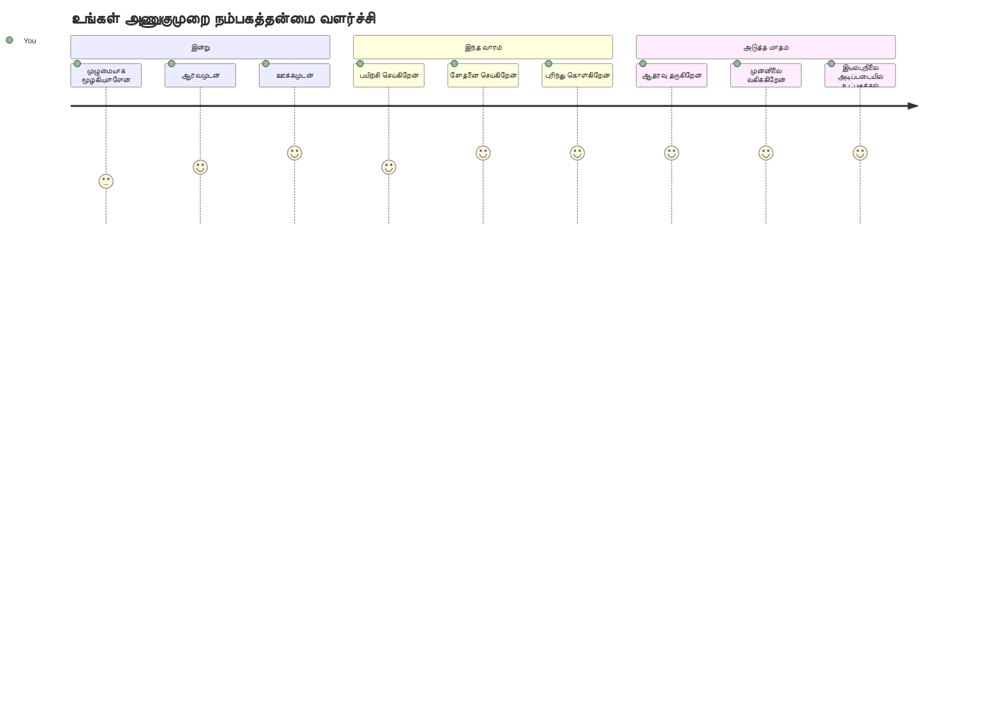
> 🌍 **இப்போது நீங்கள் ஒரு அணுகல் சாம்பியனாக இருக்கிறீர்கள்!** வலை அனுபவங்கள் அனைவருக்கும் செயல்பட வேண்டும் என்று நீங்கள் புரிந்துகொண்டுள்ளீர்கள், அவர்கள் இணையத்துடன் எப்படி அணுகினாலும். நீங்கள் கட்டும் ஒவ்வொரு அணுகக்கூடிய அம்சமும் இணையத்தை மேலும் உட்புகுத்தக்கதாக மாற்றுகிறது. இணையத்தில் அணுகலை கட்டுப்பாடாகக் காணாமல், அனைத்து பயனர்களுக்கும் சிறந்த அனுபவங்களை உருவாக்கும் வாய்ப்பாகக் காணும் தளவமைப்பாளர்களுக்கு இணையம் தேவையிருக்கிறது. இயக்கவிழாவிற்கு வரவேற்கிறோம்! 🎉

---

<!-- CO-OP TRANSLATOR DISCLAIMER START -->
**குற்றச்சாட்டுரை**:  
இந்த ஆவணம் AI மொழிபெயர்ப்பு சேவையான [கொ-ஆப் திருபெயர்வாளர்](https://github.com/Azure/co-op-translator) மூலம் மொழிபெயர்க்கப்பட்டது. ஆனால் நாங்கள் துல்லியம் பெற முயலினாலும், தானியங்கி மொழிபெயர்ப்புகளில் பிழைகள் அல்லது தவறுகள் இருக்கக்கூடும் என்பதை தயவுசெய்து எடுத்துக்கொள்ளவும். அசல் ஆவணம் அதன் தாய்மொழியில் ஒரு அதிகாரப்பூர்வ மூலமாக கருதப்பட வேண்டும். முக்கிய தகவல்களுக்கு, தொழில்முறை மனித மொழிபெயர்ப்பு பரிந்துரைக்கப்படுகிறது. இந்த மொழிபெயர்ப்பின் பயன்பாட்டில் ஏதாவது தவறான புரிதல்கள் அல்லது தவறான விளக்கங்கள் ஏற்படியாகிறால் நாங்கள் பொறுப்பேற்க மாட்டோம்.
<!-- CO-OP TRANSLATOR DISCLAIMER END -->