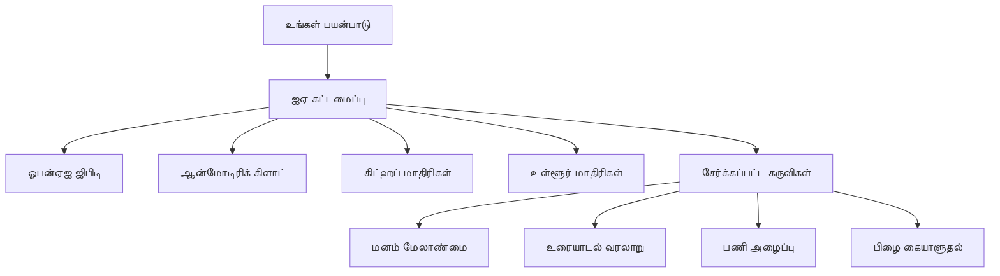
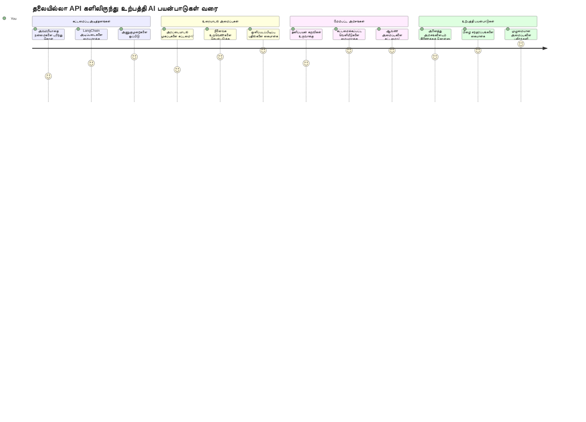
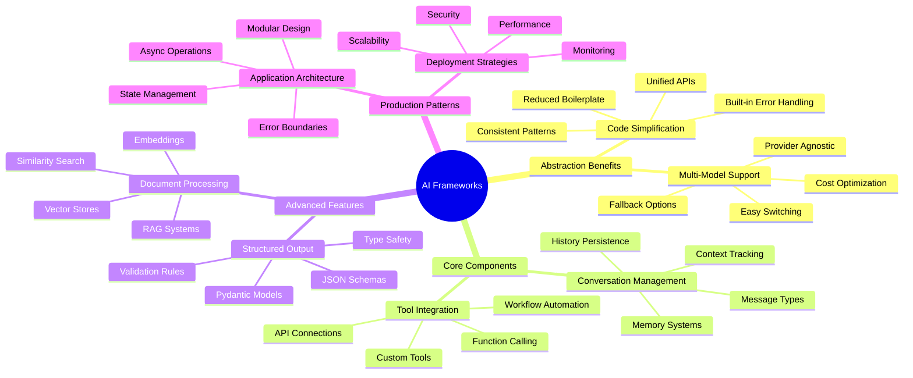
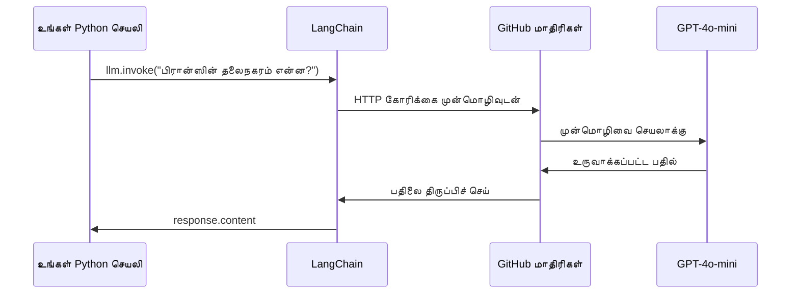
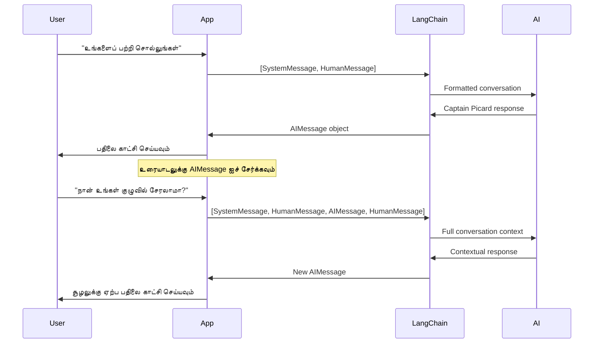
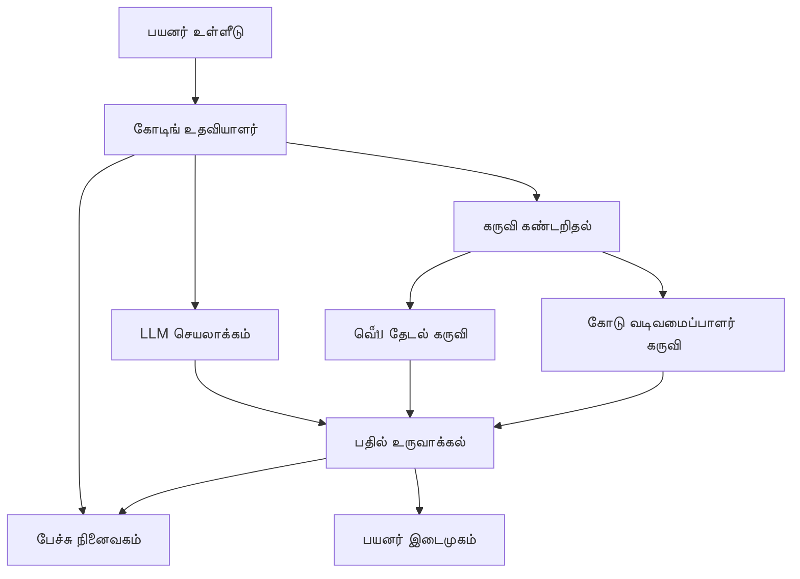
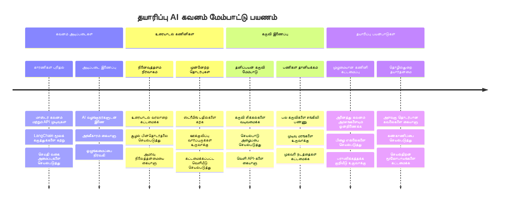
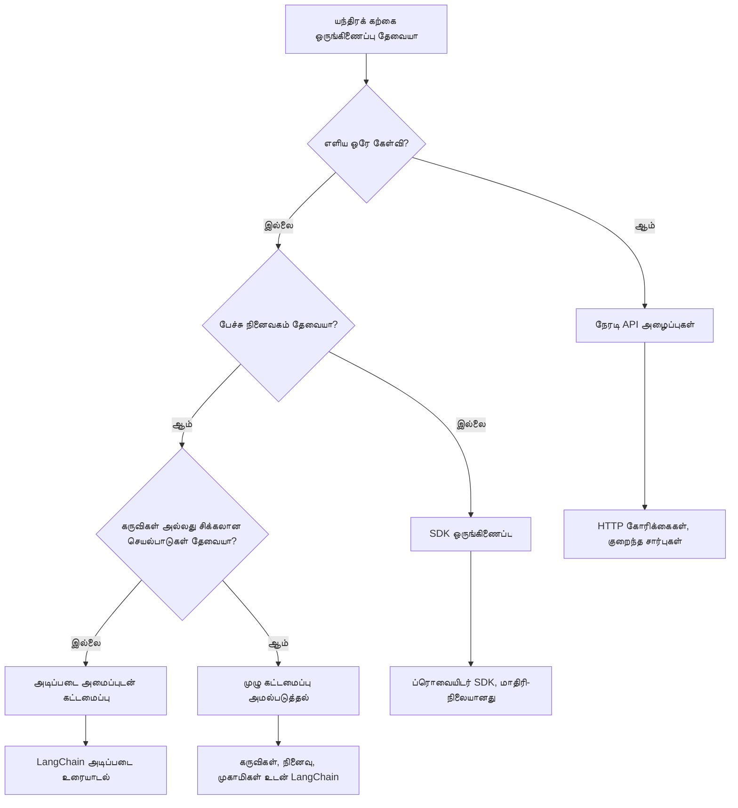

# AI வடிவமைப்பு

முழுமையாக துவங்கி AI பயன்பாடுகளை உருவாக்க முயற்சித்த போது நிரம்பி விட்டீர்களா? நீங்கள் தனியாக இல்லீர்கள்! AI வடிவமைப்புகள் AI வளர்ப்பிற்கான ஒரு ஸ்விஸ் ஆர்மி கத்தருக்கு போல் - அவை அறிவு செயலிகளை உருவாக்கும்போது உங்களுக்கு நேரமும் தலைவலி குறையும் சக்திவாய்ந்த கருவிகள். ஒரு AI வடிவமைப்பை நன்கு ஒழுங்கு செய்த நூலகம் போன்று நினைக்கலாம்: அது முன் கட்டமைக்கப்பட்ட கூறுகள், தரநிலை APIகள், மற்றும் புத்திசாலி சுருக்கங்களை வழங்குகிறது, இதனால் நீங்கள் செயல்பாட்டின் விவரங்களில் சிக்காமல் பிரச்சனைகளை தீர்க்க பொருத்தமான நேரத்தை செலவிழக்க முடியாது.

இந்த பாடத்தில், LangChain போன்ற வடிவமைப்புகள் எவ்வாறு கடினமான AI ஒருங்கிணைப்பு பணிகளை சுத்தமான, படிக்கக்கூடிய குறியீடாக மாற்றுகின்றன என்பதைக் கண்டறிவோம். உரையாடல்களை கண்காணித்தல், கருவி அழைப்பை செயல்படுத்தல், மற்றும் பல்வேறு AI மாதிரிகளை ஒரு ஒருங்கிணைந்த முகாமிற்கு மாற்றுதல் போன்ற நிஜ உலக சவால்களை எவ்வாறு சமாளிக்கலாம் என்பதையும் நீங்கள் அறிந்து கொள்வீர்கள்.

நாம் முடிந்தப்போதுள்ள வரை, நீங்கள் எப்போது சிரமமான API அழைப்புகளுக்கு பதிலாக வடிவமைப்புகளை தேர்வு செய்ய வேண்டும் என்பதை, அவற்றின் சுருக்கங்களை எவ்வாறு திறம்பட பயன்படுத்துவது என்பது மற்றும் நிஜ உலக பயன்பாட்டிற்கு தயாரான AI பயன்பாடுகளை எப்படி உருவாக்குவது தெரியக்கவும் இருக்கும். AI வடிவமைப்புகள் உங்கள் திட்டங்களுக்கு எதை செய்யக்கூறும் என்பதைக் காணலாம்.

## ⚡ அடுத்து 5 நிமிடங்களில் நீங்கள் செய்யக்கூடியவை

**பிஸி டெவலப்பர்களுக்கான விரைவு துவக்கு வழி**


- **நிமிடம் 1**: LangChain ஐ நிறுவுக: `pip install langchain langchain-openai`
- **நிமிடம் 2**: உங்கள் GitHub டோக்கனை அமைக்கவும் ChatOpenAI கிளையண்டை இறக்குமதி செய்யவும்
- **நிமிடம் 3**: அமைப்பு மற்றும் மனித தகவல்களுடன் ஒரு எளிய உரையாடலை உருவாக்குக
- **நிமிடம் 4**: ஒரு அடிப்படையான கருவியை (ஊதியம் சேர்க்கும் செயலி போன்றது) சேர்க்கவும் மற்றும் AI கருவி அழைப்பை காணவும்
- **நிமிடம் 5**: நோக்கிய API அழைப்புகளுக்கும் வடிவமைப்பு சுருக்கத்துக்கும் இடையேயான வேறுபாட்டைப் பெறுக

**விரைவு சோதனை குறியீடு**:
```python
from langchain_openai import ChatOpenAI
from langchain_core.messages import SystemMessage, HumanMessage

llm = ChatOpenAI(
    api_key=os.environ["GITHUB_TOKEN"],
    base_url="https://models.github.ai/inference",
    model="openai/gpt-4o-mini"
)

response = llm.invoke([
    SystemMessage(content="You are a helpful coding assistant"),
    HumanMessage(content="Explain Python functions briefly")
])
print(response.content)
```

**ஏன் இது முக்கியம்**: 5 நிமிடங்களில், நீங்கள் AI வடிவமைப்புகள் கடினமான AI ஒருங்கிணைப்புகளை எவ்வாறு எளிய முறைகளாக மாற்றுகின்றன என்பதை அனுபவிப்பீர்கள். இது உற்பத்தி AI பயன்பாடுகளை இயக்கும் அடிப்படை.

## ஏன் ஒரு வடிவமைப்பை தேர்ந்தெடுக்க வேண்டும்?

நீங்கள் AI செயலி உருவாக்க தயாராக உள்ளீர்கள் - அற்புதம்! ஆனால் இதோ பாக்கு: நீங்கள் பல்வேறு வழிகளை தேர்வு செய்யலாம், ஒவ்வொன்றும் தன் முன்னோர்கள் மற்றும் பின்புலங்களுடன். அது எப்படி ஒரு இடத்துக்கு நடந்து, சைக்கிள் சவாரி அல்லது காரில் செல்லுவதைத் தேர்ந்தெடுப்பதுபோன்று – எல்லாம் அங்கே வந்து சேரச்செய்கிறது, ஆனால் அனுபவம் (மற்றும் முயற்சி) முற்றிலும் வேறுபடும்.

உங்கள் திட்டங்களில் AI ஐ ஒருங்கிணைக்க நீங்கள் பயன்படுத்தக்கூடிய மூன்று முக்கிய வழிகளை பிரித்து பார்ப்போம்:

| அணுகுமுறை | நன்மைகள் | சிறந்தது | கருத்தாய்வுகள் |
|----------|------------|----------|--------------|
| **நேரடி HTTP கோரிக்கைகள்** | முழுமையான கட்டுப்பாடு, சார்பற்றது | எளிய கேள்விகள், அடிப்படை ஞாபகம் | அதிக குறியீடு, கைமுறை பிழை கையாளல் |
| **SDK ஒருங்கிணைப்பு** | குறைந்த அடிப்படை குறியீடு, மாதிரி-சார்ந்த மேம்பாடு | Single-model செயலிகள் | குறிப்பிட்ட வழங்குநர்களுக்கே வரையறுக்கப்பட்டது |
| **AI வடிவமைப்புகள்** | ஒருங்கிணைந்த API, அடையாள சுருக்கங்கள் | பல மாதிரிகளுக்கான செயலிகள், கடினமான வேலைநாட்கள் | கற்றல் வளைவு, கூடுதல் சுருக்கம் சாத்தியமுள்ளது |

### நடைமுறை வடிவமைப்பின் நன்மைகள்


**ஏன் வடிவமைப்புகள் முக்கியம்:**
- **ஏகமாக்குகிறது** பல AI வழங்குநர்களை ஒரு முகாமுக்குள்
- **ஊட்டி கொள்கிறது** உரையாடல் நினைவகத்தை தானாக
- **வழங்குகிறது** பொதுவான பணி கருவிகள் (உள்ளீடு எம્બெட்டிங்குகள், செயலி அழைப்பு போன்றவை)
- **பார்க்குகிறது** பிழை கையாளல் மற்றும் மீண்டும் முயற்சி நெறியியல்
- **மாற்றுகிறது** கடினமான வேலைப்பாடுகளை படிக்கக்கூடிய முறைகளாக

> 💡 **திறமைசெய்தி**: பல AI மாதிரிகள் இடையே மாறும் போது அல்லது முகவர்கள், நினைவகம், கருவி அழைப்புக்கள் போன்ற கடின அம்சங்களை உருவாக்கும்போது வடிவமைப்புகளை பயன்படுத்துக. அடிப்படைகளை கற்பதில் அல்லது எளிய செயலிகளை உருவாக்கும்போது நேரடி APIகளை பயன்படுத்துக.

**முகப்பு வரைவு**: தொழில்முறை நுட்ப மனிதனின் சிறப்பு கருவிகளையும் முழுமையான பல் உலா கூடங்களையும் தேர்வு செய்வது போல, செயலிக்கு பொருத்தமான கருவியை பயன்படுத்துவது முக்கியம். வடிவமைப்புகள் கடினமான, அம்சம் நிறைந்த செயலிகளுக்கு சிறந்தவை, நேரடி APIகள் நேர்த்தியான பயன்பாடுகளுக்கு பயன்படும்.

## 🗺️ AI வடிவமைப்பு நுட்பத்தில் உங்கள் கற்றல் பயணம்


**உங்கள் பயண இலக்கு**: இந்த பாடம் முடிந்த பிறகு, நீங்கள் AI வடிவமைப்பு வளர்ப்பில் தேர்ச்சி அடைக, மற்றும் வணிக AI உதவியாளர்களைப் போன்ற நுட்பமான, உற்பத்திக்காகத் தயாரான AI செயலிகளை உருவாக்கக்கூடும்.

## அறிமுகம்

இந்த பாடத்தில் நாம் கற்கப்போகின்றது:

- சாதாரண AI வடிவமைப்பை பயன்படுத்துதல்.
- பொதுவான பிரச்சனைகள் செயற்படுத்துதல் (உரையாடல், கருவி பயன்பாடு, நினைவகம் மற்றும் சூழல்).
- இதன் மூலம் AI செயலிகளை உருவாக்குதல்.

## 🧠 AI வடிவமைப்பு வளர்ப்பு சூழல்


**முக்கியக் கோட்பாடு**: AI வடிவமைப்புகள் சிக்கல்களை சுருக்குகின்றன, மேலும் உரையாடல் மேலாண்மை, கருவி ஒருங்கிணைப்பு மற்றும் ஆவண செயலாக்கத்திற்கு சக்திவாய்ந்த சுருக்கங்களை வழங்கி, டெவலப்பர்களுக்கு தூய, பராமரிக்கக்கூடிய கோடுடன் நுட்பமான AI செயலிகளை உருவாக்க அனுமதிக்கின்றன.

## உங்கள் முதல் AI கேள்வி

உங்கள் முதல் AI செயலி உருவாக்குவதால் அடிப்படைகளை தொடங்குவோம், அது ஒரு கேள்வியை அனுப்பி பதிலை பெறும். அர்க்கிமிடீஸ் தன் குளத்தில் இடமாற்ற விதியை கண்டுபிடித்ததைப் போல, எளிமையான கவனிப்புகளே பல்திறன் ஆராய்ச்சிகளுக்கு வாயிலாகும் - மற்றும் வடிவமைப்புகள் இதைப் பெற எளிமையாக்கின்றன.

### LangChain ஐ GitHub மாதிரிகளுடன் அமைத்தல்

நாம் LangChain ஐ GitHub மாதிரிகளுடன் இணைக்கப் போகிறோம், இது பல AI மாதிரிகளுக்கு இலவச அணுகலை வழங்குவதால் மிகவும் நல்லது. சிறந்த பகுதி என்னவென்றால்? ஆரம்பிப்பதற்கான சில எளிய கட்டமைப்பு அளவுருக்களை மட்டும் நீங்கள் எதிர்பார்க்கலாம்:

```python
from langchain_openai import ChatOpenAI
import os

llm = ChatOpenAI(
    api_key=os.environ["GITHUB_TOKEN"],
    base_url="https://models.github.ai/inference",
    model="openai/gpt-4o-mini",
)

# ஒரு எளிய வீட்டு அழைப்பு அனுப்பவும்
response = llm.invoke("What's the capital of France?")
print(response.content)
```

**இங்கே என்ன நடக்கிறது என்பதைப் பகிர்ந்து கொள்வோம்:**
- **LangChain கிளையண்டை** `ChatOpenAI` வகுப்பைப் பயன்படுத்தி உருவாக்குகிறது - இது உங்கள் AI செல்லுகை!
- **GitHub மாதிரிகளுடன்** உங்கள் அங்கீகார டோக்கனுடன் இணைத்தல் செய்கிறது
- **பயன்படுத்தவேண்டிய** AI மாதிரியை (`gpt-4o-mini`) குறிப்பிடுகிறது - உங்கள் AI உதவியாளரைத் தேர்வு செய்வதில் இதை போல நினைக்கவும்
- **`invoke()` முறையை** பயன்படுத்தி உங்கள் கேள்வியை அனுப்புகிறது - இங்கே மாயை நிகழ்கிறது
- **பதில் எடுத்து** காட்சிப்படுத்துகிறது - இதோ, நீங்கள் AI உடன் உரையாடுகிறீர்கள்!

> 🔧 **அமைப்பு குறிப்பு**: நீங்கள் GitHub Codespaces பயன்படுத்தினால், `GITHUB_TOKEN` ஏற்கனவே அமைக்கப்பட்டிருக்கிறது! உங்களது உள் கம்ப்யூட்டரில் வேலை செய்யவிருந்தால் கவலை不要, சரியான அனுமதிகளுடன் ஒரு தனிப்பட்ட அணுகல் டோக்கனை உருவாக்க வேண்டும்.

**எதிர்பார்க்கப்படும் வெளியீடு:**
```text
The capital of France is Paris.
```


## உரையாடல் AI உருவாக்கல்

முதல் உதாரணம் அடிப்படைகளை விளக்குகிறது, ஆனால் அது ஒரு ஒற்றை பரிமாற்றம் மட்டுமே - நீங்கள் கேள்வி கேட்டு பதில் பெறுகிறீர்கள், அது மட்டுமே. நிஜ பயன்பாடுகளில், உங்கள் AI நீங்கள் பேசிக் கொண்டிருப்பதை நினைவில் வைக்க வேண்டும், வாட்சன் மற்றும் ஹோல்ம்ஸ் தங்கள் விசாரணை உரையாடல்களை எப்படி காலப்போக்கில் கட்டியெழுதியதுபோல்.

இங்கே LangChain மிகவும் பயனுள்ளதாகும். அது உரையாடலை வடிவமைக்கவும் உங்களுக்கு AI உடன் தனிச் சிந்தனையைக் கொடுக்கவும் உதவும் பல வகையான செய்திகளை வழங்குகிறது. நீங்கள் சூழலைவும் குணத்தன்மையையும் பராமரிக்கும் உரையாடல் அனுபவங்களை உருவாக்கப்போகிறீர்கள்.

### செய்தி வகைகளை அறிதல்

இந்த செய்தி வகைகளை உரையாடலில் பங்கேற்பவர்கள் அணிவார்கள் என மனதில் கொள்ளுங்கள். LangChain யார் என்ன சொல்கிறார் என்பதைக் கண்காணிக்க வெவ்வேறு செய்தி வகுப்பு வகைகளை (message classes) பயன்படுத்துகிறது:

| செய்தி வகை | நோக்கம் | எடுத்துக்காட்டு பயன்பாடு |
|--------------|---------|------------------|
| `SystemMessage` | AI குணச்சித்திரம் மற்றும் நடத்தை வரையறை | “நீங்கள் உதவியுள்ள குறியீட்டு உதவியாளர்” |
| `HumanMessage` | பயனர் உள்ளீடு பிரதிநிதித்துவம் | “செயல்பாடுகள் எவ்வாறு இயங்குகின்றன என்று விளக்குக” |
| `AIMessage` | AI பதில்களை சேமிக்கிறது | உரையாடலில் முந்தைய AI பதில்கள் |

### உங்கள் முதல் உரையாடலை உருவாக்குதல்

நாம் ஒரு உரையாடலை உருவாக்கப் போகிறோம், இதில் AI ஒரு குறிப்பிட்ட பாத்திரத்தை ஏற்றுக்கொள்கிறது. நாம் அதனை கேப்டன் பிகார்ட் என்ற பாத்திரமாகக் கொள்கின்றோம் - அது தகுதியான ஞானமும் தலைமைத்துவமும் கொண்ட ஒரு குணம்:

```python
messages = [
    SystemMessage(content="You are Captain Picard of the Starship Enterprise"),
    HumanMessage(content="Tell me about you"),
]
```

**இந்த உரையாடல் அமைப்பை புரிந்துகொள்ளவும்:**
- AI இன் பாத்திரம் மற்றும் குணத்தன்மையை `SystemMessage` மூலம் நிறுவுகிறது
- ஆரம்ப பயனர் கேள்வியை `HumanMessage` வழங்குகிறது
- பன்முறை உரையாடலுக்கு அடித்தளத்தை உருவாக்குகிறது

இந்த உதாரணம் முழுவதும் உள்ள குறியீடு பின்வருமாறு:

```python
from langchain_core.messages import HumanMessage, SystemMessage
from langchain_openai import ChatOpenAI
import os

llm = ChatOpenAI(
    api_key=os.environ["GITHUB_TOKEN"],
    base_url="https://models.github.ai/inference",
    model="openai/gpt-4o-mini",
)

messages = [
    SystemMessage(content="You are Captain Picard of the Starship Enterprise"),
    HumanMessage(content="Tell me about you"),
]


# வேலை செய்கிறது
response  = llm.invoke(messages)
print(response.content)
```

நீங்கள் இதே மாதிரியான விளைவைக் காணவேண்டும்:

```text
I am Captain Jean-Luc Picard, the commanding officer of the USS Enterprise (NCC-1701-D), a starship in the United Federation of Planets. My primary mission is to explore new worlds, seek out new life and new civilizations, and boldly go where no one has gone before. 

I believe in the importance of diplomacy, reason, and the pursuit of knowledge. My crew is diverse and skilled, and we often face challenges that test our resolve, ethics, and ingenuity. Throughout my career, I have encountered numerous species, grappled with complex moral dilemmas, and have consistently sought peaceful solutions to conflicts.

I hold the ideals of the Federation close to my heart, believing in the importance of cooperation, understanding, and respect for all sentient beings. My experiences have shaped my leadership style, and I strive to be a thoughtful and just captain. How may I assist you further?
```

உரையாடல் தொடர்ச்சியை பராமரிக்க (ஒவ்வொரு முறையும் சூழலை மறுதொடக்குமாறு விடாது), பதில்களை உங்கள் செய்திகளின் பட்டியலில் சேர்க்க வேண்டும். முன்னாள் கதைகள் தலைமுறை தவிர்க்கப்பட்டதைப் போல், இந்த முறையால் நீண்டகால நினைவகம் உருவாகிறது:

```python
from langchain_core.messages import HumanMessage, SystemMessage
from langchain_openai import ChatOpenAI
import os

llm = ChatOpenAI(
    api_key=os.environ["GITHUB_TOKEN"],
    base_url="https://models.github.ai/inference",
    model="openai/gpt-4o-mini",
)

messages = [
    SystemMessage(content="You are Captain Picard of the Starship Enterprise"),
    HumanMessage(content="Tell me about you"),
]


# வேலை செய்கிறது
response  = llm.invoke(messages)

print(response.content)

print("---- Next ----")

messages.append(response)
messages.append(HumanMessage(content="Now that I know about you, I'm Chris, can I be in your crew?"))

response  = llm.invoke(messages)

print(response.content)

```

சிறப்பாக உள்ளது, இல்லையா? இங்கே எப்படிநாடெனில், நாம் இரண்டு முறை LLM ஐ அழைக்கின்றோம் - முதலில் ஆரம்ப இரண்டு செய்திகளோடு, பிறகு முழு உரையாடல் வரலாறோடு. இது AI உரையாடலுடன் ஒத்துக்கொண்டு செல்கிறது என்பதைப் போன்றது!

இந்தக் குறியீட்டை இயக்கும் போது, நீங்கள் இரண்டாவது பதிலை பெறுவீர்கள், அதுவே போல:

```text
Welcome aboard, Chris! It's always a pleasure to meet those who share a passion for exploration and discovery. While I cannot formally offer you a position on the Enterprise right now, I encourage you to pursue your aspirations. We are always in need of talented individuals with diverse skills and backgrounds. 

If you are interested in space exploration, consider education and training in the sciences, engineering, or diplomacy. The values of curiosity, resilience, and teamwork are crucial in Starfleet. Should you ever find yourself on a starship, remember to uphold the principles of the Federation: peace, understanding, and respect for all beings. Your journey can lead you to remarkable adventures, whether in the stars or on the ground. Engage!
```


அதை ஒரு வாய்ப்பு என நான் எடுத்துக்கொள்கிறேன் ;)

## தெளிவாக பதில் வழங்கல்

ChatGPT எவ்வாறு நேரடியாக “பதில்கள் தட்டச்சு” செய்யும் போல் தோற்றமளிக்கிறது என்பதை கவலை பார்க்கிறீர்களா? அதுவே ஸ்ட்ரீமிங் ஆகும். திறமையான அழகுரை வடிவமைப்பாளரின் எழுத்து போல - எழுத்துக்களை ஒரே நேரத்தில் தோன்றுவதில்லை பகுதி பகுதி தோன்றுகிறது - ஸ்ட்ரீமிங் தொடர்பை இயல்பாக உணர்த்துகிறது மற்றும் உடனடி பின்னூட்டத்தை வழங்குகிறது.

### LangChain மூலம் ஸ்ட்ரீமிங்கை அமல்படுத்துதல்

```python
from langchain_openai import ChatOpenAI
import os

llm = ChatOpenAI(
    api_key=os.environ["GITHUB_TOKEN"],
    base_url="https://models.github.ai/inference",
    model="openai/gpt-4o-mini",
    streaming=True
)

# பதிலினை ஸ்ட்ரீம் செய்யவும்
for chunk in llm.stream("Write a short story about a robot learning to code"):
    print(chunk.content, end="", flush=True)
```

**ஸ்ட்ரீமிங் ஏன் அருவமானது:**
- **உருப்படுகையில் சுட்டிக்காட்டு** - காத்திருக்க தேவையில்லை!
- **பயனாளர்களால் உணரப்படும்** - ஏதோ நிகழ்கிறது என்று தோன்றும்
- **வேகமாக உணரப்படும்**, உண்மையில் வேகமல்லாது இருக்கலாம்
- **AI இன்னும் 'கூறிக் கொண்டிருக்கும்' போது பயனாளர்கள் வாசிக்கத் துவங்கலாம்**

> 💡 **பயனர் அனுபவக் குறிப்பு**: நீண்ட பதில்கள், குறியீடு விளக்கங்கள், படைப்பாற்றல் எழுத்துப்பணிகள், விரிவான பயிற்சிகள் போன்றவற்றை சமாளிக்கும் போது ஸ்ட்ரீமிங் சிறப்பாக அமையும். உங்கள் பயனாளர்கள் பிரகடனத்தை காண்பதில் சந்தோஷப்படுவார்கள் வெறுமனே வெள்ளை திரையைக் காண்பதைவிட!

### 🎯 கல்வி சரிபார்ப்பு: வடிவமைப்பு சுருக்க நன்மைகள்

**நிறுத்தி சிந்திக்கவும்**: நீங்கள் இ刚 IDEை அனுபவித்துவிட்டீர்கள் AI வடிவமைப்பு சுருக்கங்களை. முன் பாடங்களில் இருந்த நேரடி API அழைப்புகளுடன் ஒப்பிடுங்கள்.

**விரைவு தானாக மதிப்பீடு**:
- LangChain எவ்வாறு உரையாடல் மேலாண்மையை கைக் காட்டி செய்திகளை கண்காணிப்பதை எளிமையாக்குகிறது என்று விளக்கமுடியுமா?
- `invoke()` மற்றும் `stream()` முறைகளில் வேறுபாடு என்ன, எப்போது யாவற்றை பயன்படுத்துவீர்கள்?
- வடிவமைப்பு செய்தி வகை அமைப்பு குறியீடு ஒழுங்குபடுத்தலை எப்படி மேம்படுத்துகிறது?

**நிஜ உலக இணையம்**: நீங்கள் கற்றுக்கொண்ட சுருக்க வடிவங்கள் (செய்தி வகைகள், ஸ்ட்ரீமிங் முகாம்கள், உரையாடல் நினைவகம்) அனைத்து முக்கிய AI செயலிகளிலும் (ChatGPT முகப்பு, GitHub Copilot குறியீடு உதவி) பயன்படுத்தப்படுகின்றன. நீங்கள் தொழில்முறை AI வளர்ப்புக் குழுக்களின் கட்டமைப்பு முறைமைகளை மட்டுமல்ல, அதிலும் தேர்ச்சி பெறுகிறீர்கள்.

**சவால் கேள்வி**: வேறு AI மாதிரி வழங்குநர்களை (OpenAI, Anthropic, Google) ஒரே முகாமுடன் கையாள, ஒரு வடிவமைப்பு சுருக்கத்தை எவ்வாறு வடிவமைப்பீர்கள்? நன்மைகள் மற்றும் குறைகள் என்ன?

## கேள்வி வடிவமைப்புகள்

கேள்வி வடிவமைப்புகள் பாரம்பரிய தொழில்புரிந்த சொற்பொழிவுகளின் நுண்ணறிவுகளைப் போல செயல்படுகின்றன - சிசரோ வாக்குகளைக் தனி கேட்கும் குழுக்களுக்கே பொருந்தமாக மாற்றிய போல. நீங்கள் மறுபயன்பாட்டிற்கான கேள்விகளை உருவாக்கலாம், அவற்றில் விவரங்களை மறு எழுத்துப்பண்ணாமல் தானே மாற்றலாம். ஒருமுறை வடிவமைப்பாக அமைத்து விட்டால், வேண்டிய மதிப்புகளை மாற்றி உள்ளீடு செய்யலாம்.

### மறுபயன்பாட்டும் கேள்விகள் உருவாக்கல்

```python
from langchain_core.prompts import ChatPromptTemplate

# குறியீட்டு விளக்கங்களுக்கான ஒரு வார்ப்புருவை வரையறுக்கவும்
template = ChatPromptTemplate.from_messages([
    ("system", "You are an expert programming instructor. Explain concepts clearly with examples."),
    ("human", "Explain {concept} in {language} with a practical example for {skill_level} developers")
])

# வெவ்வேறு மதிப்புகளுடன் வார்ப்புருவைப் பயன்படுத்தவும்
questions = [
    {"concept": "functions", "language": "JavaScript", "skill_level": "beginner"},
    {"concept": "classes", "language": "Python", "skill_level": "intermediate"},
    {"concept": "async/await", "language": "JavaScript", "skill_level": "advanced"}
]

for question in questions:
    prompt = template.format_messages(**question)
    response = llm.invoke(prompt)
    print(f"Topic: {question['concept']}\n{response.content}\n---\n")
```

**எதற்காக நீங்கள் வடிவமைப்புகளை விரும்புவீர்கள்:**
- **பயன்பாட்டில் கேள்விகள் ஒத்திசைவாக** இருக்கும்
- **குழப்பம் இல்லாத வரிசை கூட்டுகள்** - சுத்தம், எளிதான மாறிலிகள் மட்டுமே
- **AI பரிந்துரைகள் ஒரே மாதிரியாக** நடக்கும், வடிவமைப்பு தொடர்ந்தே இருக்கும்
- **புதுப்பிப்புகள் எளிது** - வடிவமைப்பை ஒருமுறை மாற்றி அதன் பயன்பாடுகள் எல்லாம் சரி

## கட்டமைக்கப்பட்ட வெளியீடு

AI பதில்களை குறியீட்டு முறையில் பதியாமல், கட்டமைக்கப்பட்ட வெளியீடு என்பது உயிரியல் வகை அமைப்பை உருவாக்கிய லின்னேயஸ் போன்ற முறையில் AI க்கு அமைப்பின் வழிகாட்டி எழுதுவது போலும் - ஒழுங்கான, கணிப்பு கூடிய, எளிதில் பயன்படுத்தக்கூடியது. நீங்கள் JSON, குறிப்பிட்ட தரவு அமைப்புகள் அல்லது தேவையான எந்த வடிவத்தையும் கோரக்கூடும்.

### வெளியீடு அதிரடிகளைக் குறிப்பிடுதல்

```python
from langchain_core.prompts import ChatPromptTemplate
from langchain_core.output_parsers import JsonOutputParser
from pydantic import BaseModel, Field

class CodeReview(BaseModel):
    score: int = Field(description="Code quality score from 1-10")
    strengths: list[str] = Field(description="List of code strengths")
    improvements: list[str] = Field(description="List of suggested improvements")
    overall_feedback: str = Field(description="Summary feedback")

# பார்சரை அமைக்கவும்
parser = JsonOutputParser(pydantic_object=CodeReview)

# வடிவமைப்பு வழிமுறைகளுடன் அச்சிடுகை உருவாக்கவும்
prompt = ChatPromptTemplate.from_messages([
    ("system", "You are a code reviewer. {format_instructions}"),
    ("human", "Review this code: {code}")
])

# அச்சிடுவதை வழிமுறைகளுடன் வடிவமைக்கவும்
chain = prompt | llm | parser

# கட்டமைக்கப்பட்ட பதிலை பெறவும்
code_sample = """
def calculate_average(numbers):
    return sum(numbers) / len(numbers)
"""

result = chain.invoke({
    "code": code_sample,
    "format_instructions": parser.get_format_instructions()
})

print(f"Score: {result['score']}")
print(f"Strengths: {', '.join(result['strengths'])}")
```

**கட்டமைக்கப்பட்ட வெளியீடு எப்படி விளைவு தருகிறது:**
- **எந்த வடிவத்தில் பதிலாகும் என்பதை மனப்பாடமில்லை** - எப்போதும் ஒரே மாதிரி
- **தரவுத்தளங்கள் மற்றும் API களுடன் நேரடியாக இணைக்க முடியும்**
- **தேவைப்படாத AI பதில்களை முன்கூட்டியே பிடித்து காப்பாற்றுகிறது**
- **குறியீடுகள் தூய்மையானவை ஆகும் ஏனெனில் நீங்கள் என்ன கூர்ந்திருப்பீர்கள் என்பதை அறிவீர்கள்**

## கருக்களை அழைப்பு

இப்போது மிகவும் சக்திவாய்ந்த அம்சங்களில் ஒன்றான கருக்களை நோக்குகிறோம். இது உரையாடலைத் தவிர உங்கள் AIக்கு தொழில்நுட்பத் திறனை அளிக்கும் வழி. நடுவண் கால கலைஞர்களைப் போல், குறிப்பிட்ட பணி கருக்களை உருவாக்குவது போல, உங்கள் AIக்கு நுட்ப கருவிகளை வழங்கலாம். என்ன கருக்கள் கிடைக்கும் என்பதை நீங்கள் விவரிக்க வேண்டும், ஒரு கோரிக்கை பொருந்துமானால் உங்கள் AI அதற்கான நடவடிக்கை செய்யும்.

### Python பயன்படுத்துதல்

கருக்களைச் சேர்ப்போம்:

```python
from typing_extensions import Annotated, TypedDict

class add(TypedDict):
    """Add two integers."""

    # குறிச்சொற்கள் வகையை கொண்டிருக்க வேண்டும் மற்றும் விருப்பமாக ஒரு முதன்மையான மதிப்பும் விளக்கத்தையும் (அந்த வரிசையில்) கொண்டிருக்கலாம்.
    a: Annotated[int, ..., "First integer"]
    b: Annotated[int, ..., "Second integer"]

tools = [add]

functions = {
    "add": lambda a, b: a + b
}
```

இங்கே என்ன நடக்கிறது? `add` என்ற கருவிக்கான வடிவமைப்பை நாங்கள் உருவாக்குகிறோம். `TypedDict` ஐ மறுபடியும் பெறுவதால் மற்றும் `Annotated` வகைகளை `a` மற்றும் `b` க்காகப் பயன்படுத்துவதால், LLM இற்கு இந்த கருவி என்ன செய்கிறது மற்றும் என்ன தேவை என தெளிவாக கூறுகிறோம். `functions` அகராதி நாமின் கருவியப்புத்தகம் போல செயல்படுகிறது - AI ஒரு கருவி பயன்படுத்தத் தீர்மானித்தால் என்ன செய்ய வேண்டும் என்பதைக் குறிக்கிறது.

இப்பொழுது இந்த கருவியுடன் LLMவை எவ்வாறு அழைப்போம் பார்ப்போம்:

```python
llm = ChatOpenAI(
    api_key=os.environ["GITHUB_TOKEN"],
    base_url="https://models.github.ai/inference",
    model="openai/gpt-4o-mini",
)

llm_with_tools = llm.bind_tools(tools)
```

இங்கு `bind_tools` ஐ நமது `tools` வரிசையுடன் அழைக்கிறோம், இதனால் LLM `llm_with_tools` இப்போது இந்த கருவியை அறிவது.

இந்த புதிய LLMஐ பயன்படுத்த, கீழ்காணும் குறியீட்டை டைப் செய்யலாம்:

```python
query = "What is 3 + 12?"

res = llm_with_tools.invoke(query)
if(res.tool_calls):
    for tool in res.tool_calls:
        print("TOOL CALL: ", functions[tool["name"]](../../../10-ai-framework-project/**tool["args"]))
print("CONTENT: ",res.content)
```

இப்போது இந்த புதிய கருவிகளுடன் LLMல் `invoke` அழைக்கும்போது, `tool_calls` சொத்துக்கள் நிரப்பப்படலாம். இருப்பின் எந்த கருவி அழைக்கப்பட வேண்டும் மற்றும்_ARGUMENTS_ என்ன என்பது `name` மற்றும் `args` மூலம் அடையாளம் காணப்படுகிறது. முழு குறியீடு பின்வருமாறு உள்ளது:

```python
from langchain_core.messages import HumanMessage, SystemMessage
from langchain_openai import ChatOpenAI
import os
from typing_extensions import Annotated, TypedDict

class add(TypedDict):
    """Add two integers."""

    # குறிச்சொற்கள் வகையினைப் பெற்றிருக்க வேண்டும் மேலும் விருப்பமாக ஒரு டிபால்ட் மதிப்பும் விளக்கமும் (அந்த வரிசையில்) சேர்க்கப்படலாம்.
    a: Annotated[int, ..., "First integer"]
    b: Annotated[int, ..., "Second integer"]

tools = [add]

functions = {
    "add": lambda a, b: a + b
}

llm = ChatOpenAI(
    api_key=os.environ["GITHUB_TOKEN"],
    base_url="https://models.github.ai/inference",
    model="openai/gpt-4o-mini",
)

llm_with_tools = llm.bind_tools(tools)

query = "What is 3 + 12?"

res = llm_with_tools.invoke(query)
if(res.tool_calls):
    for tool in res.tool_calls:
        print("TOOL CALL: ", functions[tool["name"]](../../../10-ai-framework-project/**tool["args"]))
print("CONTENT: ",res.content)
```

இந்தக் குறியீட்டை இயக்கும்போது, இதுபோன்ற வெளியீட்டை நீங்கள் காண்பீர்கள்:

```text
TOOL CALL:  15
CONTENT: 
```

AI "3 + 12 என்ன?" என்று ஆய்வு செய்து அதை `add` கருவிக்கான பணி என அடையாளம் காண்கிறது. திறமையான நூலகாரர் கேள்வியின் வகையின் அடிப்படையில் எந்த குறிப்பு பார்க்க வேண்டும் என்பதை அறிந்தபோல், கருவியின் பெயர், விளக்கம் மற்றும் புல விவரங்களைப் பார்த்து இது முடிவெடுத்தது. 15 எனும் முடிவை நமது `functions` அகராதி செயல்படுத்தியது:

```python
print("TOOL CALL: ", functions[tool["name"]](../../../10-ai-framework-project/**tool["args"]))
```

### வலை API அழைக்கும் மேலும் சுவாரஸ்யகரமான கருவி
எண்கள் சேர்க்கும் செயல்முறை கருத்தை விளக்குகிறது, ஆனால் உண்மையான கருவிகள் பொதுவாக இன்னும் சிக்கலான செயல்பாடுகளைச் செய்கின்றன, உதாரணமாக வலை API களை அழைக்கின்றன. இனி நம்முடைய உதாரணத்தை விரிவாக்கி AI இணையத்திலிருந்து உள்ளடக்கத்தைப் பெற்றுக் கொள்ளட்டும் - தொலைபேசி தொலைபேசி ஆபரேட்டர்கள் ஒருநாள் தொலைதூர இடங்களை இணைத்தபோதைய ஒரே முறையில்:

```python
class joke(TypedDict):
    """Tell a joke."""

    # குறிப்பு வகை கொண்டிருக்க வேண்டும் மற்றும் விருப்பமாக ஒரு முன்னிருப்பு மதிப்பையும் விளக்கம் (அந்த வரிசையில்) எடுத்துக்கொள்ளலாம்.
    category: Annotated[str, ..., "The joke category"]

def get_joke(category: str) -> str:
    response = requests.get(f"https://api.chucknorris.io/jokes/random?category={category}", headers={"Accept": "application/json"})
    if response.status_code == 200:
        return response.json().get("value", f"Here's a {category} joke!")
    return f"Here's a {category} joke!"

functions = {
    "add": lambda a, b: a + b,
    "joke": lambda category: get_joke(category)
}

query = "Tell me a joke about animals"

# மீதமுள்ள குறியீடு அதே மாதிரிதான் உள்ளது
```

இப்போது இந்தக் கோடை இயக்கினால், கீழ்க்கண்டதுபோன்று ஒரு பதில் கிடைக்கும்:

```text
TOOL CALL:  Chuck Norris once rode a nine foot grizzly bear through an automatic car wash, instead of taking a shower.
CONTENT:  
```

```mermaid
flowchart TD
    A[பயனர் வினா: "விலங்குகள hakkında ஒரு ஜோக் சொல்லுங்கள்"] --> B[LangChain பகுப்பு]
    B --> C{கருவி கிடைக்குமா?}
    C -->|ஆம்| D[ஜோக் கருவியை தேர்வு செய்யவும்]
    C -->|இல்லை| E[தேர்மான பதிலை உருவாக்கவும்]
    
    D --> F[மாறிலிகளை எடு]
    F --> G[ஜோக் கோப்பு(category="animals")]
    G --> H[chucknorris.io-க்கு API கோரிக்கை]
    H --> I[ஜோக் உள்ளடக்கத்தை திரும்ப வழங்கவும்]
    I --> J[பயனருக்கு தா]
    
    E --> K[AI-உருவாக்கப்பட்ட பதில்]
    K --> J
    
    subgraph "கருவி นิையாள அமைப்பு"
        L[TypedDict வரைபடம்]
        M[செயல்பாடு செயல்படுத்தல்]
        N[மாறி சரிபார்ப்பு]
    end
    
    D --> L
    F --> N
    G --> M
```
மொத்தமாகக் கீழ்க்கண்டவாறு இருக்கும்:

```python
from langchain_openai import ChatOpenAI
import requests
import os
from typing_extensions import Annotated, TypedDict

class add(TypedDict):
    """Add two integers."""

    # குறிச்சொற்களுக்கு வகை இருக்க வேண்டும் மற்றும் விருப்பமாக ஒரு முதன்மை மதிப்பு மற்றும் விளக்கம் (அந்த வரிசையில்) சேர்க்க முடியும்.
    a: Annotated[int, ..., "First integer"]
    b: Annotated[int, ..., "Second integer"]

class joke(TypedDict):
    """Tell a joke."""

    # குறிச்சொற்களுக்கு வகை இருக்க வேண்டும் மற்றும் விருப்பமாக ஒரு முதன்மை மதிப்பு மற்றும் விளக்கம் (அந்த வரிசையில்) சேர்க்க முடியும்.
    category: Annotated[str, ..., "The joke category"]

tools = [add, joke]

def get_joke(category: str) -> str:
    response = requests.get(f"https://api.chucknorris.io/jokes/random?category={category}", headers={"Accept": "application/json"})
    if response.status_code == 200:
        return response.json().get("value", f"Here's a {category} joke!")
    return f"Here's a {category} joke!"

functions = {
    "add": lambda a, b: a + b,
    "joke": lambda category: get_joke(category)
}

llm = ChatOpenAI(
    api_key=os.environ["GITHUB_TOKEN"],
    base_url="https://models.github.ai/inference",
    model="openai/gpt-4o-mini",
)

llm_with_tools = llm.bind_tools(tools)

query = "Tell me a joke about animals"

res = llm_with_tools.invoke(query)
if(res.tool_calls):
    for tool in res.tool_calls:
        # print("கருவி அழைப்பு: ", tool)
        print("TOOL CALL: ", functions[tool["name"]](../../../10-ai-framework-project/**tool["args"]))
print("CONTENT: ",res.content)
```

## ஏம்பெட்டிங்குகள் மற்றும் ஆவண செயலாக்கம்

ஏம்பெட்டிங்குகள் சமகால AI இல் மிகவும் அழகான தீர்வுகளை பிரதிநிதித்துவப்படுத்துகின்றன. நீங்கள் எந்தவொரு உரையையும் எடுத்துக் கொண்டு அதின் பொருளை கைப்பற்றும் இலக்கியம் எண்களாக மாறுவதாகக் கற்பனை செயுங்கள். இதுவே ஏம்பெட்டிங்குகளுடைய சாதனை - அவை உரையினை பல பரிமாண இடைவெளியில் உள்ள புள்ளிகளாக மாற்றுகின்றன, அங்கே ஒத்த கருத்துக்கள் ஒன்றாரைப் பார்க்க கரும்படுகின்றன. இது ஒரு கருத்துக்களுக்கு குறியீட்டு அமைப்பைப் போலவேயும், அல்லி ஆட்டோக தொழில்நுட்ப பண்புகளின்படி மேண்டிலீவ் கால அட்டவணையை ஒழுங்குபடுத்திய விதத்தை நினைவுக்கும்.

### ஏம்பெட்டிங்குகளை உருவாக்குதல் மற்றும் பயன்படுத்துதல்

```python
from langchain_openai import OpenAIEmbeddings
from langchain_community.vectorstores import FAISS
from langchain_community.document_loaders import TextLoader
from langchain.text_splitter import CharacterTextSplitter

# ஏம்பெட்டிங்களை துவக்கவும்
embeddings = OpenAIEmbeddings(
    api_key=os.environ["GITHUB_TOKEN"],
    base_url="https://models.github.ai/inference",
    model="text-embedding-3-small"
)

# பதிவுகளைக் கொண்டு வந்து பிரிக்கவும்
loader = TextLoader("documentation.txt")
documents = loader.load()

text_splitter = CharacterTextSplitter(chunk_size=1000, chunk_overlap=0)
texts = text_splitter.split_documents(documents)

# வெக்டர் சேமிப்பகத்தை உருவாக்கவும்
vectorstore = FAISS.from_documents(texts, embeddings)

# ஒத்திசைவு தேடல்களை செய்க
query = "How do I handle user authentication?"
similar_docs = vectorstore.similarity_search(query, k=3)

for doc in similar_docs:
    print(f"Relevant content: {doc.page_content[:200]}...")
```

### பல்வேறு வடிவமைப்பு ஆவண ஏற்றுநர்களை பயன்படுத்துதல்

```python
from langchain_community.document_loaders import (
    PyPDFLoader,
    CSVLoader,
    JSONLoader,
    WebBaseLoader
)

# வெவ்வேறு ஆவண வகைகளை ஏற்றவும்
pdf_loader = PyPDFLoader("manual.pdf")
csv_loader = CSVLoader("data.csv")
json_loader = JSONLoader("config.json")
web_loader = WebBaseLoader("https://example.com/docs")

# அனைத்து ஆவணங்களையும் செயலாக்கவும்
all_documents = []
for loader in [pdf_loader, csv_loader, json_loader, web_loader]:
    docs = loader.load()
    all_documents.extend(docs)
```

**ஏம்பெட்டிங்குகளுடன் நீங்கள் செய்யக்கூடியவை:**
- **கட்டமைக்கவும்** தேடலை உண்மையிலேயே நீங்கள் 뜻하는தைப் புரிந்துகொள்ளக்கூடிய, வெறும் விசை சொல் பொருத்தமல்லாமல் செயலாற்றுவதை
- **உருவாக்கவும்** உங்கள் ஆவணங்களுக்கு தொடர்பான கேள்விகளுக்கு பதில் அளிக்கும் AI
- **செய்கவும்** உண்மையான பொருத்தமான உள்ளடக்கத்தை பரிந்துரைக்கும் பரிந்துரைக் கணினிகள்
- **தானாகவே** உங்கள் உள்ளடக்கத்தை ஒழுங்குபடுத்தி வகைப்படுத்தவும்

```mermaid
flowchart LR
    A[ஆவணங்கள்] --> B[உரை பிரிப்பான்]
    B --> C[உருவாக்கு உடன்படிச்சொற்கள்]
    C --> D[உருப்படி அங்கீகாரம்]
    
    E[பயனர் கேள்வி] --> F[கேள்வி உடன்படிச்சொல்]
    F --> G[ஈடு தேடல்]
    G --> D
    D --> H[சம்பந்தப்பட்ட ஆவணங்கள்]
    H --> I[கைபேசி பதில்]
    
    subgraph "உருப்படி இடம்"
        J[ஆவணம் A: [0.1, 0.8, 0.3...]]
        K[ஆவணம் B: [0.2, 0.7, 0.4...]]
        L[கேள்வி: [0.15, 0.75, 0.35...]]
    end
    
    C --> J
    C --> K
    F --> L
    G --> J
    G --> K
```
## முழுமையான AI பயன்பாட்டை கட்டமைத்தல்

இப்போது நீங்கள் கற்றுக்கொண்ட அனைத்தையும் ஒருங்கிணைத்து ஒரு விரிவான பயன்பாட்டை உருவாக்கவுள்ளோம் - கேள்விகளுக்கு பதில் அளிக்கும், கருவிகளை பயன்படுத்தும், மற்றும் உரையாடல் நினைவுகளை பராமரிக்கும் ஒரு நிரல்படுத்தும் உதவியாளர். அச்சிடும் இயந்திரம் நிலையான தொழில்நுட்பங்களை (நிமிடத்துக்கு மாறும் அச்சுருவி, மையம், காகிதம், அழுத்தம்) ஒருங்கிணைத்தபோல், நாம் AI உள்ளிட்ட கூறுகளை ஒருங்கிணைத்து பயனுள்ள ஒன்றாக மாற்றுவோம்.

### முழுமையான பயன்பாட்டின் உதாரணம்

```python
from langchain_openai import ChatOpenAI, OpenAIEmbeddings
from langchain_core.prompts import ChatPromptTemplate
from langchain_core.messages import HumanMessage, SystemMessage, AIMessage
from langchain_community.vectorstores import FAISS
from typing_extensions import Annotated, TypedDict
import os
import requests

class CodingAssistant:
    def __init__(self):
        self.llm = ChatOpenAI(
            api_key=os.environ["GITHUB_TOKEN"],
            base_url="https://models.github.ai/inference",
            model="openai/gpt-4o-mini"
        )
        
        self.conversation_history = [
            SystemMessage(content="""You are an expert coding assistant. 
            Help users learn programming concepts, debug code, and write better software.
            Use tools when needed and maintain a helpful, encouraging tone.""")
        ]
        
        # கருவிகளை வரையறு
        self.setup_tools()
    
    def setup_tools(self):
        class web_search(TypedDict):
            """Search for programming documentation or examples."""
            query: Annotated[str, "Search query for programming help"]
        
        class code_formatter(TypedDict):
            """Format and validate code snippets."""
            code: Annotated[str, "Code to format"]
            language: Annotated[str, "Programming language"]
        
        self.tools = [web_search, code_formatter]
        self.llm_with_tools = self.llm.bind_tools(self.tools)
    
    def chat(self, user_input: str):
        # உரையாடலுக்கு பயனர் செய்தியை சேர்க்கவும்
        self.conversation_history.append(HumanMessage(content=user_input))
        
        # AI பதிலை பெறவும்
        response = self.llm_with_tools.invoke(self.conversation_history)
        
        # எந்த கருவி அழைப்புகளையும் கையாள்க
        if response.tool_calls:
            for tool_call in response.tool_calls:
                tool_result = self.execute_tool(tool_call)
                print(f"🔧 Tool used: {tool_call['name']}")
                print(f"📊 Result: {tool_result}")
        
        # உரையாடலுக்கு AI பதிலைச் சேர்க்கவும்
        self.conversation_history.append(response)
        
        return response.content
    
    def execute_tool(self, tool_call):
        tool_name = tool_call['name']
        args = tool_call['args']
        
        if tool_name == 'web_search':
            return f"Found documentation for: {args['query']}"
        elif tool_name == 'code_formatter':
            return f"Formatted {args['language']} code: {args['code'][:50]}..."
        
        return "Tool execution completed"

# பயன்பாட்டு உதாரணம்
assistant = CodingAssistant()

print("🤖 Coding Assistant Ready! Type 'quit' to exit.\n")

while True:
    user_input = input("You: ")
    if user_input.lower() == 'quit':
        break
    
    response = assistant.chat(user_input)
    print(f"🤖 Assistant: {response}\n")
```

**பயன்பாட்டு கட்டமைப்பு:**


**நாம் செயல்படுத்திய முக்கிய அம்சங்கள்:**
- **உங்கள் முழு உரையாடலை நினைவில் வைக்கிறது** தொடர்ச்சியான சீரமைப்புக்கு
- **கருவி அழைப்புகள் மூலம் செயல்களை செய்கிறது**, வெறும் உரையாடலைவிட
- **முன்னறிவிக்கப்பட்ட தொடர்பு முறைகளை பின்பற்றுகிறது**
- **பிழை கையாளல் மற்றும் சிக்கலான வேலைப்பாடுகளை தானாக நிர்வகிக்கிறது**

### 🎯 கல்விச்சாரம் சோதனை: உற்பத்தி AI கட்டமைப்பு

**கட்டமைப்பு புரிதல்**: நீங்கள் உரையாடல் மேலாண்மை, கருவி அழைப்புகள் மற்றும் கட்டமைக்கப்பட்ட வேலைப்பாடுக்களை ஒருங்கிணைத்த முழுமையான AI பயன்பாட்டை கட்டியுள்ளீர்கள். இது உற்பத்தி நிலை AI பயன்பாட்டு மேம்பாட்டை சுட்டிக்காட்டுகிறது.

**உதவும் கருத்துகள் கைப்பற்றல்**:
- **வர்க்க அடிப்படையிலான கட்டமைப்பு**: ஒழுங்குபடுத்தப்பட்ட, பராமரிப்பான AI பயன்பாட்டு அமைப்பு
- **கருவி ஒருங்கிணைப்பு**: உரையாடலைவிட மேம்பட்ட தனிப்பயன்களை உருவாக்குதல்
- **நினைவு மேலாண்மை**: தொடர்ச்சியான உரையாடல் சூழல் பராமரிப்பு
- **பிழை கையாளல்**: வலுவான பயன்பாட்டு நடத்தை

**தொழில்துறை தொடர்பு**: நீங்கள் செயல்படுத்திய கட்டமைப்பு முறைகள் (உரையாடல் வகுப்புகள், கருவி அமைப்புகள், நினைவு நிர்வாகம்) Slack இன் AI உதவியாளர், GitHub Copilot, மற்றும் Microsoft Copilot போன்ற நிறுவன AI பயன்பாடுகளில் பயன்படுத்தப்படும் அதே முறைகள். நீங்கள் தொழில்முறை தரமான கட்டமைப்பு சிந்தனையுடன் கட்டமைக்கின்றீர்கள்.

**மதிப்பீடு கேள்வி**: இந்த பயன்பாட்டை பல பயனாளர்களுக்கு, நிரந்தர சேமிப்புக்கு அல்லது வெளிப்புற தரவுத்தளங்களோடு ஒருங்கிணைக்க நீங்கள் எவ்வாறு விரிவுபடுத்துவீர்கள்? பரிமாணவாய்ப்பு மற்றும் நிலை மேலாண்மை சவால்களை கவனியுங்கள்.

## பணிப்பாடு: உங்கள் சொந்த AI இயக்கப்படுத்திய படிப்பாளர் உதவியாளரை உருவாக்கவும்

**நோக்கம்**: மாணவர்களுக்கு நிரலாக்கக் கருத்துக்களை அறிந்து கொள்ள உதவும் AI பயன்பாட்டை உருவாக்கவும். இது விளக்கங்கள், குறியீடு உதாரணங்கள் மற்றும் போட்டி கேள்விகளை வழங்க வேண்டும்.

### தேவைகள்

**முக்கிய அம்சங்கள் (தேவையானவை):**
1. **உரையாடல் இடைமுகம்**: பல கேள்விகளுக்கு இடையே சூழலை பராமரிக்கும் உரையாடல் முறைமை உருவாக்கவும்
2. **கல்வி கருவிகள்**: கற்றல் உதவுவதற்கான குறைந்தபட்சம் இரண்டு கருவிகளை உருவாக்கவும்:
   - குறியீடு விளக்க கருவி
   - கருத்து போட்டி உருவாக்கி
3. **தனிப்பயன் கற்றல்**: முறைமை செய்திகளை பயன்படுத்தி பதில்களை மாறும் திறன் நிலைக்கு ஏற்றுக்கொள்ளவும்
4. **பதில் வடிவமைப்பு**: போட்டி கேள்விகளுக்கான கட்டமைக்கப்பட்ட வெளிப்படையை பயன்படுத்தவும்

### செயல்படுத்தும் படிகள்

**படி 1: உங்கள் சுற்றுப்புறத்தை அமைக்கவும்**
```bash
pip install langchain langchain-openai
```

**படி 2: அடிப்படை உரையாடல் செயல்பாடு**
- `StudyAssistant` வகுப்பை உருவாக்கவும்
- உரையாடல் நினைவை செயல்படுத்தவும்
- கல்வி ஆதரவுக்கான பண்புகளை சேர்க்கவும்

**படி 3: கல்வி கருவிகள் சேர்க்கவும்**
- **குறியீடு விளக்கி**: குறியீட்டை புரியக்கூடிய பகுதிகளாக பிரிக்கிறது
- **போட்டி உருவாக்கி**: நிரலாக்க கருத்துக்களுக்கு தொடர்பான கேள்விகளை உருவாக்குகிறது
- **முன்னேற்ற கண்காணிப்பாளர்**: கொண்டுவரப்பட்ட பாடங்களை கண்காணிக்கிறது

**படி 4: மேம்பட்ட அம்சங்கள் (விரும்புகையில்)**
- சிறந்த பயனர் அனுபவத்திற்கு ஸ்ட்ரீமிங் பதில்களை செயல்படுத்தவும்
- பாடத் தொகுப்புகளை உள்ளடக்கிய ஆவண ஏற்றுதலைச் சேர்க்கவும்
- ஒத்திருப்பின் அடிப்படையில் உள்ளடக்கத்தை மீட்டெடுக்க ஏம்பெட்டிங்குகளை உருவாக்கவும்

### மதிப்பீடு குறியீடுகள்

| அம்சம் | மிகவும் சிறந்தது (4) | நல்லது (3) | திருப்திகரமானது (2) | மேம்பாடு தேவை (1) |
|---------|---------------|----------|------------------|----------------|
| **உரையாடல் ஓட்டம்** | இயல்பான, சூழல் உணர்ந்த பதில்கள் | நல்ல சூழல் அகற்றம் | அடிப்படை உரையாடல் | பரிமாற்றங்களுக்கிடையே நினைவு இல்லாது |
| **கருவி ஒருங்கிணைப்பு** | பல பயனுள்ள கருவிகள் ஒருங்கிணைந்த செயல் | 2+ கருவிகள் சரியாக செயல்பாடு | 1-2 அடிப்படை கருவிகள் | கருவிகள் செயல்முறை இல்லாதவை |
| **குறியீடு தரம்** | சுத்தமான, நன்கு ஆவணமிடப்பட்ட, பிழை கையாளும் | நல்ல கட்டமைப்பு, சில ஆவணங்கள் | அடிப்படை செயல்பாடு | மோசமான கட்டமைப்பு, பிழை கையாளவில்லை |
| **கல்வி மதிப்பு** | கற்றலுக்கு உண்மையிலேயே உதவும், தகுந்த | நல்ல கற்றல் ஆதரவு | அடிப்படை விளக்கங்கள் | வரையறுக்கப்பட்ட கல்வி பயன் |

### மாதிரி குறியீடு அமைப்பு

```python
class StudyAssistant:
    def __init__(self, skill_level="beginner"):
        # LLM, கருவிகள் மற்றும் உரையாடல் நினைவகம் துவக்கவும்
        pass
    
    def explain_code(self, code, language):
        # கருவி: குறியீடு எப்படிப் பணியாற்றுகிறது என்பதை விளக்கவும்
        pass
    
    def generate_quiz(self, topic, difficulty):
        # கருவி: பயிற்சி கேள்விகள் உருவாக்கவும்
        pass
    
    def chat(self, user_input):
        # முக்கிய உரையாடல் இடைமுகம்
        pass

# உதாரண பயன்பாடு
assistant = StudyAssistant(skill_level="intermediate")
response = assistant.chat("Explain how Python functions work")
```

**போனஸ் சவால்கள்:**
- குரல் உள்ளீடு/வெளியீடு திறன்களைச் சேர்க்கவும்
- Streamlit அல்லது Flask பயன்படுத்தி வலை இடைமுகம் உருவாக்கவும்
- பாடத்திட்டத் தொகுப்புகளிலிருந்து அறிவுத்தளம் உருவாக்க ஏம்பெட்டிங்குகளை பயன்படுத்தவும்
- முன்னேற்றத்தை கண்காணிக்கவும் மற்றும் தனிப்பயன் கற்றல் பாதைகள் உருவாக்கவும்

## 📈 உங்கள் AI கட்டமைப்பு மேம்பாட்டு தேர்ச்சி கால அட்டவணை


**🎓 பட்டமளிப்பு மைல்கல்**: நீங்கள் சமகால AI பயன்பாடுகளை இயக்கும் அதே கருவிகள் மற்றும் முறைகள் கொண்டு AI கட்டமைப்புகளை வெற்றிகரமாக கற்றுக்கொண்டுள்ளீர்கள். இக்கூறுகள் AI பயன்பாடுகளின் முன்சரிவை குறிக்கின்றன மற்றும் உங்களுக்கு தொழில்நுட்பம் சார்ந்த அமைப்புகளை உருவாக்குவதற்கு தயாராகின்றன.

**🔄 அடுத்த நிலை திறன்கள்**:
- மேம்பட்ட AI கட்டமைப்புகள் (ஏஜென்ட்கள், பல-ஏஜென்ட் அமைப்புகள்) ஆராய்ச்சிக்கு தயார்
- வெகுவித தரவுத்தளங்களோடு RAG அமைப்புகளை உருவாக்கத் தயாராக
- பன்முக AI பயன்பாடுகளை உருவாக்கத் தயாராக
- AI பயன்பாடுகளை விரிவாக்கவும் மற்றும் மேம்படுத்தவும் அடித்தளம் அமைந்துள்ளது

## சுருக்கம்

🎉 இப்பொழுது நீங்கள் AI கட்டமைப்பு மேம்பாட்டின் அடிப்படைகளை கற்றுக்கொண்டுவிட்டீர்கள் மற்றும் LangChain பயன்படுத்தி நுட்பமான AI பயன்பாடுகளை உருவாக்குவதற்கு திறன் பெற்றுள்ளீர்கள். முழுமையான பயிற்சியை முடித்தபோல், நீங்களும் திறமையான கருவிச் கூட்டம்தான் பெற்றுள்ளீர்கள். இப்போது நீங்கள் என்ன செய்தீர்களோ அதைப் பார்ப்போம்.

### நீங்கள் கற்றுக்கொண்டது

**முக்கிய கட்டமைப்பு கருத்துக்கள்:**
- **கட்டமைப்பின் நன்மைகள்**: நேரடி API அழைப்புகளுக்கு பதிலாக கட்டமைப்புகளை எப்போது தேர்ந்தெடுக்க வேண்டும் என்பதைப் புரிந்துகொள்ளுதல்
- **LangChain அடிப்படைகள்**: AI மாதிரி இணைப்புகளை அமைத்து பழகுதல்
- **செய்தி வகைகள்**: கட்டமைக்கப்பட்ட உரையாடலுக்கான `SystemMessage`, `HumanMessage`, மற்றும் `AIMessage` பயன்படுத்துதல்

**மேம்பட்ட அம்சங்கள்:**
- **கருவி அழைப்புகள்**: மேலதிக AI திறனுக்கு தனிப்பயன் கருவிகளை உருவாக்கி இணைத்தல்
- **உரையாடல் நினைவு**: பல உரையாடல் திருப்புகளுக்கு இடையே சூழலை பராமரித்தல்
- **ஸ்ட்ரீமிங் பதில்கள்**: நேரடியாக பதில்களை வழங்குதல்
- **டிரிக்டர் வடிவமைப்புகள்**: மறுசுழற்சி, மாற்றமுடியும் டிரிக்டர்களை உருவாக்குதல்
- **கட்டமைக்கப்பட்ட வெளிப்படை**: ஒரே மாதிரி, பாட்சியளிக்கும் பதில்கள் உறுதி செய்தல்
- **ஏம்பெட்டிங்குகள்**: பொருளாதார தேடல் மற்றும் ஆவண செயலாக்க திறன்கள் உருவாக்குதல்

**நிறைவு பயன்பாடுகள்:**
- **முழுமை வாய்ந்த பயன்பாடுகளை உருவாக்குதல்**: பல அம்சங்களை ஒருங்கிணைத்து உற்பத்திக்கு ஏற்ற பயன்பாடுகளை உருவாக்குதல்
- **பிழை கையாளல்**: வலுவான பிழை நிர்வாகம் மற்றும் சரிபார்ப்பை செயல் படுத்துதல்
- **கருவி ஒருங்கிணைப்பு**: AI திறன்களை விரிவாக்க தொழில்நுட்ப கருவிகளை உருவாக்குதல்

### முக்கிய எடுத்துக்காட்டுகள்

> 🎯 **நினைவில் வைக்கவும்**: LangChain போன்ற AI கட்டமைப்புகள் நீங்கள் சிக்கல்களை மறைத்து, அம்சங்களை நிறைந்த நண்பர்களாக இருக்கின்றன. உரையாடல் நினைவு, கருவி அழைப்புகள் அல்லது பல AI மாதிரிகள் உடன் பணியாற்ற உங்களுக்கு அவை சிறந்தவை.

**AI ஒருங்கிணைப்பு தீர்மான கட்டமைப்பு:**


### இங்கே இருந்து நீங்கள் எங்கு செல்லப்போகிறீர்கள்?

**இப்போதே கட்டலாம்:**
- இந்த கருத்துக்களைப் பயன்படுத்தி உங்களை உற்சாகப்படுத்தும் ஒன்றை உருவாக்குங்கள்!
- LangChain வழியாக பல்வேறு AI மாதிரிக்கோப்புகளை அனுபவிக்கவும் - AI மாதிரிகளுக்கான விளையாட்டு மைதானமாய் அது இருக்கிறது
- உங்கள் வேலை அல்லது திட்டங்களில் சந்திக்கும் உண்மையான சிக்கல்களைத் தீர்க்கும் கருவிகளை உருவாக்குங்கள்

**அடுத்த நிலைக்குத் தயாரா?**
- **AI ஏஜென்ட்கள்**: சிக்கலான பணிகளுக்கு தானாக திட்டமிட்டு செயலாற்றக்கூடிய AI அமைப்புகளை உருவாக்குங்கள்
- **RAG (திரும்ப எடுத்து மேம்படுத்தல்)**: உங்கள் அறிவுத்தளங்களோடு AI ஐ இணைத்து மிகவும் சக்திவாய்ந்த பயன்பாடுகளை உருவாக்குங்கள்
- **பன்முக AI**: உரை, படம் மற்றும் ஒலியை ஒருங்கிணைத்து பணியாற்றுங்கள் - வாய்ப்புகள் எல்லாம்!
- **உற்பத்தி பிரசுரம்**: உங்கள் AI பயன்பாடுகளை அளவிடவும், உலகில் கண்காணிக்கவும் கற்றுக்கொள்ளுங்கள்

**சமூகத்தில் சேருங்கள்:**
- LangChain சமுதாயம் புதுப்பிப்புகளை அறிந்து, சிறந்த நடைமுறைகளை கற்றல் வாய்ப்புக்கு சிறந்தது
- GitHub Models மேம்பட்ட AI திறன்களை அணுக வழி கொடுக்கிறது - பரிசோதனைக்கு சிறந்தது
- பல்வேறு பயன்பாடுகளுடன் தொடர்ந்து பயிற்சி மேற்கொள்ளுங்கள் - ஒவ்வொரு திட்டமும் புதிய ஒன்றை கற்றுத்தரும்

நீங்கள் இப்போது அறிவாற்றல் கொண்ட, உரையாடல் பயன்பாடுகளை கட்டமைக்க அறிவாற்றல் பெற்றுள்ளீர்கள், அவை ஆடம்பரமான உண்மையான பிரச்சனைகளை தீர்க்க உதவும். கலைவாத தொழிலாளர்கள் கற்பனைத்தால் தொழில்நுட்ப திறனை இணைத்தது போலவே, நீங்கள் AI திறன்களை பயனுள்ள செயல்பாடுகளோடு இணைக்க முடியும். கேள்வி - நீங்கள் என்ன காணப்படுத்த போகிறீர்கள்? 🚀

## GitHub Copilot ஏஜென்ட் சவால் 🚀

இதனை நிறைவேற்ற ஏஜென்ட் முறையைப் பயன்படுத்தவும்:

**விளக்கம்:** பல LangChain அம்சங்கள் போன்ற கருவி அழைக்கல், கட்டமைக்கப்பட்ட வெளியீடு மற்றும் உரையாடல் நினைவோடு உருவாக்கப்பட்ட உயர்நிலை AI இயங்கும் குறியீடு மதிப்பாய்வு உதவியாளரை உருவாக்குக.

**இயக்கம்:** கீழ்க்கண்டவற்றை செயல்படுத்தும் CodeReviewAssistant வகுப்பை உருவாக்குக:
1. குறியீடு சிக்கலான தன்மையைப் பகுப்பாய்வு செய்து மேம்பாடுகளை பரிந்துரைக்கும் கருவி
2. சிறந்த நடைமுறைகளுக்கு எதிராக குறியீட்டை சரிபார்க்கும் கருவி
3. ஒரே மாதிரியான மதிப்பாய்வு வடிவுக்கு Pydantic மாதிரிகளைப் பயன்படுத்தி கட்டமைக்கப்பட்ட வெளியீடு
4. மதிப்பாய்வு அமர்வுகளுக்குத் தொடர்ந்த உரையாடலைப் பதிவு செய்யும் நினைவுத்திறன்
5. குறியீடு சமர்ப்பிப்புகளை கையாளும் மற்றும் விரிவான, செயல்திறன் வாய்ந்த கருத்துகளை வழங்கும் முக்கிய உரையாடல் இடைமுகம்

உதவியாளர் பல நிரல்நாட்களுக்கு குறியீட்டை மதிப்பாய்வு செய்யக் கூடியதாகவும், ஒரு அமர்வில் பல குறியீடு சமர்ப்பிப்புகளுக்கு இடையே சூழலை பராமரிக்கக்கூடியதாகவும் இருக்க வேண்டும்; மேலும் சுருக்க மதிப்பெண்கள் மற்றும் விரிவான மேம்பாட்டு பரிந்துரைகளையும் வழங்க வேண்டும்.

மேலும் தெரிக [agent mode](https://code.visualstudio.com/blogs/2025/02/24/introducing-copilot-agent-mode) இல்.

---

<!-- CO-OP TRANSLATOR DISCLAIMER START -->
**மறுப்பு**:  
இந்த ஆவணம் AI மொழிபெயர்ப்பு சேவை [Co-op Translator](https://github.com/Azure/co-op-translator) பயன்படுத்தி மொழிபெயர்க்கப்பட்டுள்ளது. நாங்கள் துல்லியத்துக்கு முயற்சி செய்கிறோம் என்றாலும், தானாக நிகழும் மொழிபெயர்ப்புகளில் தவறுகள் அல்லது தவறான தகவல்கள் இருக்கக்கூடும் என்பதை தயவுசெய்து அறிவு கொள்ளவும். அடிப்படை ஆவணம் அதன் சொந்த மொழியில் அதிகாரப்பூர்வமான மூலமாக கருதப்பட வேண்டும். முக்கியமான தகவல்களுக்கு, தொழில்முறை மனித மொழிபெயர்ப்பு பரிந்துரைக்கப்படுகிறது. இந்த மொழிபெயர்ப்பின் பயன்படுத்துதலால் ஏற்பட்ட ஏதாவது தவறறிதல் அல்லது தவறாகப் புரிதல்களுக்கு நாங்கள் பொறுப்பேற்கவில்லை.
<!-- CO-OP TRANSLATOR DISCLAIMER END -->