<!--
CO_OP_TRANSLATOR_METADATA:
{
  "original_hash": "672b0bb6e8b431075f3bdb7130590d2d",
  "translation_date": "2026-01-07T12:43:24+00:00",
  "source_file": "2-js-basics/1-data-types/README.md",
  "language_code": "ta"
}
-->
# JavaScript அடிப்படைகள்: தரவுத் தரவுகள்

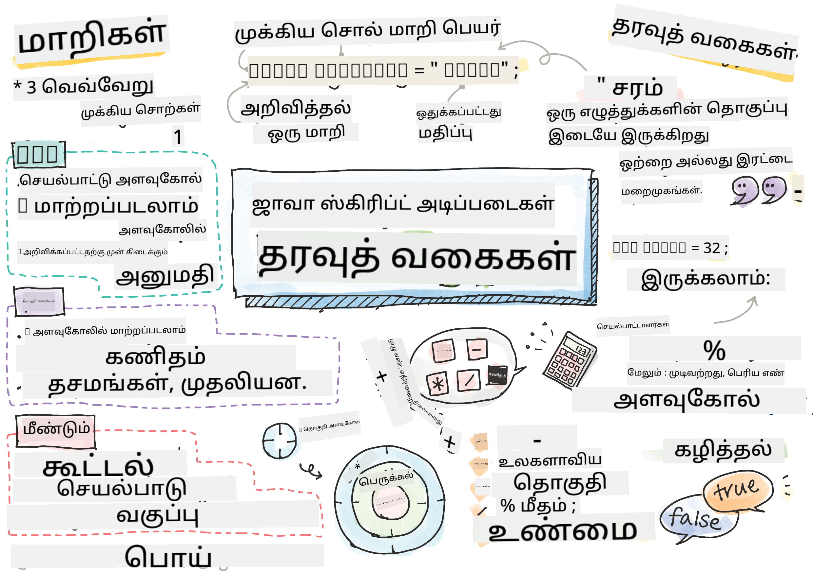
> ஓவியம் [Tomomi Imura](https://twitter.com/girlie_mac) அவர்களால்

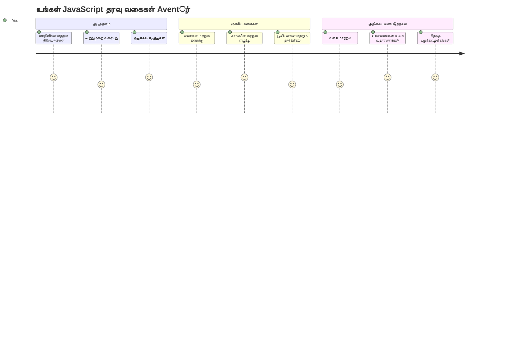
தரவுத் தரவுகள் JavaScript இல் அடிப்படையான கருத்துக்களில் ஒன்றாகும், நீங்கள் எழுதும் ஒவ்வொரு நிகழ்ச்சியிலும் சந்திக்கும். தரவுத் தரவுகளை எக்சாண்டிரியாவின் பண்டைய நூலகத் தலைவர்களால் பயன்படுத்தப்பட்ட கோப்பமைப்பு முறையைப் போல நினைக்கவும் – கவிதை, கணிதம் மற்றும் வரலாற்றின் பதிவுகள் கொண்ட சீலைப் பொறுத்தவாறு குறிப்பிட்ட இடங்கள் இருந்தன. JavaScript தகவலை இவ்வாறு பிரிவுகளின் அடிப்படையில் ஒழுங்குபடுத்துகிறது.

இந்த பாடத்தில், JavaScript இயங்கச் செய்யும் முக்கிய தரவுத் தரவுகளை ஆராய்வோம். நீங்கள் எண்கள், உரை, உண்மை/பொய் மதிப்புகளை எவ்வாறு கையாள்வது மற்றும் சரியான தரவு வகையைத் தேர்ந்தெடுப்பது உங்கள் செயலிகளுக்கு ஏன் அவசியமானதென்று அறிவீர்கள். இவை முதலில் கற்பனைப்படுத்தக்கூடியதாக தோன்றலாம், ஆனால் பயிற்சியுடன் இவை இயல்பானவையாக மாறும்.

தரவுத் தரவுகளைப் புரிந்துகொள்வது JavaScript இல் மற்ற அனைத்தையும் தெளிவாக மாற்றும். கட்டிடக்கலைஞர்கள் கத்தீட்ரலை கட்டுவதற்கு முன்பு வெவ்வேறு கட்டிடப் பொருட்களைப் புரிந்துகொள்ள வேண்டியவாறு, இந்த அடிப்படைகள் நீங்கள் கட்டும் அனைத்திற்கும் ஆதரவாக இருக்கும்.

## வகுப்புக்குப் பாய்நிலை வினாடி வினாக்கள்
[வகுப்புக்குப் பாய்நிலை வினாடி வினாக்கள்](https://ff-quizzes.netlify.app/web/)

இந்த பாடம் அடிப்படை JavaScript கலைப்பாடங்களை கையாண்டு வலைப்பக்கத்தில் இலவசமான ஊடாட்டத்தை வழங்குகிறது.

> நீங்கள் இந்த பாடத்தை [Microsoft Learn](https://docs.microsoft.com/learn/modules/web-development-101-variables/?WT.mc_id=academic-77807-sagibbon) இல் பெற்றுக்கொள்ளலாம்!

[](https://youtube.com/watch?v=JNIXfGiDWM8 "JavaScript இல் மாறிலிகள்")

[](https://youtube.com/watch?v=AWfA95eLdq8 "JavaScript இல் தரவுத் தரவுகள்")

> 🎥 படங்களை கிளிக் செய்து மாறிலிகள் மற்றும் தரவுத் தரவுகள் பற்றிய வீடியோக்களைப் பார்த்துக் கொள்ளுங்கள்

மாறிலிகள் மற்றும் அவற்றை நிரப்பும் தரவுத் தரவுகளுடன் தொடங்குவோம்!

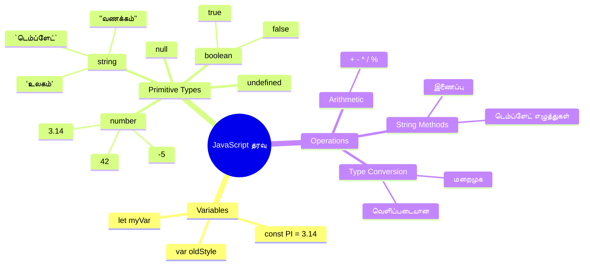
## மாறிலிகள்

மாறிலிகள் நிகழ்ச்சி எழுதுவதில் அடிப்படை கட்டமைப்புகள் போன்றவை. நடுத்தர கால அலகிமிகள் பல்வேறு பொருட்களை சேமிக்கத் பயன்படுத்திய லேபிள் வைத்த கோப்பைப்போல், மாறிலிகள் தகவலை சேமித்து பின்னர் அதை குறிக்க உதவும் பெயரை வழங்குகின்றன. ஒருவரின் வயதை நினைவில் வைத்திருக்க வேண்டுமா? `age` என்ற மாறிலியில் சேமிக்கவும். ஒரு பயனரின் பெயரை கண்காணிக்க விரும்புகிறீர்களா? `userName` என்ற மாறிலியில் வைத்திருக்கவும்.

JavaScript இல் மாறிலிகளை உருவாக்கும் நவீன முறையை நாம் கவனிப்போம். இங்கே நீங்கள் கற்றுக்கொள்ளும் நுட்பங்கள் மொழியின் வருடங்கள் பழக்கம் மற்றும் நிரலாக்க சமூகத்தால் உருவான சிறந்த நடைமுறைகளை பிரதிபலிக்கின்றன.

ஒரு மாறிலியை உருவாக்கி **கட்டளை செய்யும்** முறையின் முறைபதிவில் **[keyword] [name]** உள்ளது. இது இரண்டு பகுதிகளைக் கொண்டது:

- **வார்த்தை**. மாற்றங்கள் ஏற்படக்கூடிய மாறிலிகளுக்கு `let` ஐ, மாற்றம் இல்லாத மதிப்புகளுக்கு `const` ஐ பயன்படுத்தவும்.
- **மாறிலியின் பெயர்**, இது நீங்கள் தேர்ந்தெடுத்த விளக்கமான பெயர்.

✅ ES6 இல் அறிமுகம் செய்யப்பட்ட `let` வார்த்தை உங்கள் மாறிலிக்கு _block scope_ ஐ வழங்குகிறது. பண்டைய `var` வார்த்தைமிகப்பெரிய அளவு பயன்படுத்துவதை விட `let` அல்லது `const` பயன்படுத்த பரிந்துரைக்கப்படுகிறது. நாம் எதிர்கால பகுதிகளில் block scope விடயங்களை விரிவாகப் பார்க்கப் போகிறோம்.

### பணிக்கான செயலி - மாறிலிகளுடன் வேலை செய்யுதல்

1. **மாறிலியை கண்டறிக**. முதற்கட்டமாக தங்கள் முதல் மாறிலியை உருவாக்குவோம்:

    ```javascript
    let myVariable;
    ```

   **இதனால் என்ன நடக்கும்:**
   - இது JavaScript ஐ `myVariable` என்ற சேமிப்பிடத்தை உருவாக்க சொல்லுகிறது
   - JavaScript இந்த மாறிலிக்கான நினைவக இடத்தை ஒதுக்குகிறது
   - இப்போதைக்கு மதிப்பு எதுவும் இல்லை (undefined)

2. **ஒரு மதிப்பை கொடு**. இப்போது, மாறிலியில் ஏதேனும் ஒன்றைத் தொட்டு பார்ப்போம்:

    ```javascript
    myVariable = 123;
    ```

   **பAssignமுறை எப்படி வேலை செய்கிறது:**
   - `=` இயங்கு 123 என்ற மதிப்பை நமது மாறிலிக்கு ஒதுக்குகிறது
   - மாறிலிக்கு இப்போது இந்த மதிப்பு உள்ளது, undefined அல்ல
   - `myVariable` ஐப் பயன்படுத்தி உங்கள் முழு குறியீட்டிலும் இந்த மதிப்பை குறிக்கலாம்

   > குறிப்பு: இந்த பாடத்தில் `=` பயன்படுத்துவது "ஒதுக்கல் இயங்கு" என்பதை குறிக்கின்றது, மதிப்பை மாறிலிக்கு அமைப்பதற்கானது; சமமானதைக் குறிக்காது.

3. **சில அநுணுக்கமாக செய்யுங்கள்**. உண்மையில், இந்த இரண்டு படிகளையும் ஒன்றாகச் செய்கிறோம்:

    ```javascript
    let myVariable = 123;
    ```

    **இந்த முயற்சி சிக்கனமானது:**
    - நீங்கள் ஒரு அறிவிப்பில் மாறிலியை உருவாக்கி அதற்கு மதிப்பையும் ஒதுக்குகிறீர்கள்
    - இந்த நடைமுறை மேம்பாட்டாளர்களிடையே தரநிலை
    - குறியீட்டு நீளத்தை குறைத்து தெளிவை பராமரிக்கிறது

4. **உங்கள் எண்ணத்தை மாற்றுங்கள்**. வேறு ஒரு எண்ணைச் சேமிக்க விருப்பத்தோ?

   ```javascript
   myVariable = 321;
   ```

   **மறுபAssignம் பற்றி புரிந்து கொள்வது:**
   - இப்போது மாறிலியில் 321 உள்ளது, 123 அல்ல
   - முந்தைய மதிப்பு மாற்றப்பட்டுவிட்டது – மாறிலிகள் ஒரே நேரத்தில் ஒரே மதிப்பை மட்டுமே வைத்திருக்க முடியும்
   - `let` உடன் அறிவிக்கப்பட்ட மாறிலிகளின் முக்கிய அம்சமான மாற்றக்கூடிய தன்மை இது

   ✅ முயற்சி செய்யுங்கள்! உங்கள் உலாவியில் நேரடியாக JavaScript எழுதலாம். உலாவி விண்டோவை திறந்து Developer Tools-க்கு வா. கான்சோல் பகுதியில் `let myVariable = 123` என தட்டச்சு செய்து Enter அழுத்தவும், பிறகு `myVariable` எனத் தட்டச்சு செய்யவும். என்ன நடக்கிறது? பின்னர் வரும் பாடங்களில் இந்த கருத்துக்கள் பற்றி அதிகம் கற்றுக்கொள்ள போகிறோம்.

### 🧠 **மாறிலிகள் பற்றிய தேர்வு: நம்பிக்கை பெறுதல்**

**மாறிலிகள் பற்றி நீங்கள் எப்படி உணர்கிறீர்கள் பார்க்கலாம்:**
- ஒரு மாறிலியை அறிவிப்பது மற்றும் ஒதுப்பது என்பவற்றை விளக்க முடியுமா?
- நீங்கள் அறிவிப்பதற்கு முன்பே மாறிலியை பயன்படுத்தி பார்க்கும்போது என்ன நடக்கும்?
- எந்த நேரங்களில் `let` ஐ `const` இற்கு பதிலாகப் பயன்படுத்துவீர்கள்?

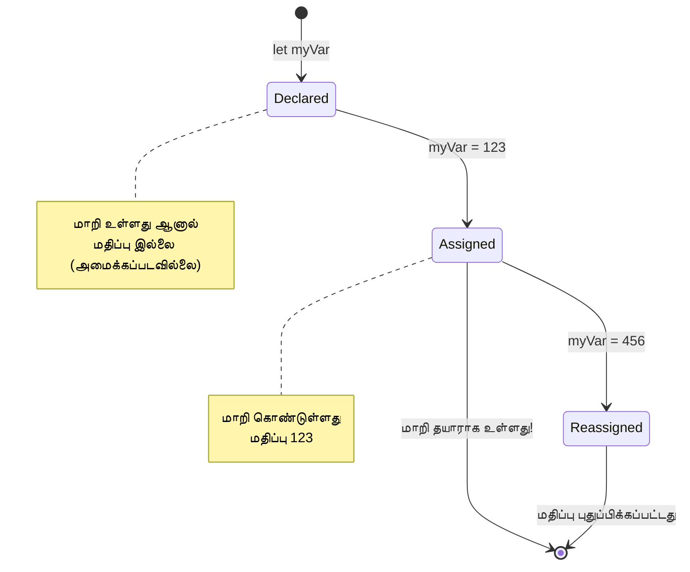
> **சிறந்த குறிப்பு**: மாறிலிகளை லேபிள் 붙்டப்பட்ட சேமிப்புப் பெட்டிகள் போல யோசிக்கவும். (உருவாக்கு (`let`), பொருள் வைக்கவும் (`=`), பின்னர் தேவையானால் மாற்றவும்!)

## நிலைத்த தரவுகள்

சில நேரங்களில் செயலியின் இயங்கும்போது மாறாத தகவலை சேமிக்க வேண்டியிருக்கும். நிலைத்த தரவுகள் பண்டைய கிரேக்க கணிதவியலாளர் யூக்ளிட் நிறுவிய கணிதக் கொள்கைகளைப் போன்றவை – ஒருமுறை சான்றுதிக்கப்பட்டதும், அடுத்தடுத்த காலத்திற்கும் மாற்றமின்றி இருக்கும்.

நிலைத்த தரவுகளும் மாறிலிகளைப் போன்றவை தான், ஆனால் முக்கியமான கட்டுப்பாடு ஒரு மாறிலிக்கு அமைந்தவாறே அதை ஒருமுறை மட்டுமே மதிப்பிட முடியும். இது தவறான மாற்றங்களிலிருந்து முக்கிய மதிப்புகளை பாதுகாக்க உதவுகிறது.

நிலைத்த தரவு அறிவிப்பும் துவக்கம் செய்வதும் மாறிலிகளுடன் துல்லியமான பொருத்தத்தில் இருக்கும், `const` வார்த்தையைத் தவிர. நிலைத்ததுகள் பொதுவாக முழு பெரிய எழுத்துக்களில் அறிவிக்கப்படுகின்றன.

```javascript
const MY_VARIABLE = 123;
```

**இந்த குறியீடு செய்யும் வேலை:**
- **`MY_VARIABLE` என்ற** ஒரு நிலைத்ததைக் உருவாக்குகிறது, மதிப்பு 123
- **நிலைத்ததுகளுக்கு** பெரிய எழுத்துக்கள பயன்படுத்துகிறது
- **இந்த மதிப்பை** எதிர்காலத்தில் மாற்ற முடியாது

நிலைத்ததிற்க்கு இரண்டு முக்கிய விதிகளும் உண்டு:

- **உங்களுக்கு உடனடியாக ஒரு மதிப்பை கொடுக்க வேண்டும்** – காலி நிலைத்ததுகள் அனுமதிக்கப்படவில்லை!
- **அந்த மதிப்பை நீங்கள் மறுபடியும் மாற்ற முடியாது** – முயற்சிப்பது பிழையை உருவாக்கும். இதைக் காண்போம்:

   **எளிய மதிப்பு** - பின்வரும் அனுமதிக்கப்படாது:
   
      ```javascript
      const PI = 3;
      PI = 4; // அனுமதிக்கப்படாது
      ```

   **நினைத்துக் கொள்ள வேண்டியது:**
   - நிலைத்ததிகளை மறுபAssignம் செய்வது பிழை ஏற்படுத்தும்
   - முக்கிய மதிப்புகளை தவறுதலாக மாற்றுவதைத் தடுக்கும்
   - செயலியின் முழு காலத்திலும் மதிப்பு நிலையான வகையில் இருக்கும்

   **ஒப்ஜெக்ட் குறிப்புரு பாதுகாக்கப்படுகிறது** - பின்வரும் அனுமதிக்கப்படாது:
   
      ```javascript
      const obj = { a: 3 };
      obj = { b: 5 } // அனுமதிக்கப்படாது
      ```

   **இந்த கருத்தை புரிந்து கொள்வது:**
   - முழு ஒப்ஜெக்ட்டைப் புதியதுடன் மாற்றுவதை தடுக்கும்
   - அதே ஒப்ஜெக்ட் குறிப்பை பாதுகாக்கும்
   - நினைவகத்தில் ஒப்ஜெக்ட்டின் அடையாளத்தை பேணுகிறது

    **ஒப்ஜெக்ட் உள்ளடக்கம் பாதுகாக்கப்படாது** - பின்வரும் அனுமதிக்கப்படுகிறது:
    
      ```javascript
      const obj = { a: 3 };
      obj.a = 5;  // அனுமதி
      ```

      **இங்கே என்ன நடக்கும் என்பதைச் சீராக்குவது:**
      - ஒப்ஜெக்டின் உள்ள பண்பின் மதிப்பை மாற்றுகிறது
      - அதே ஒப்ஜெக்ட் குறிப்பை வைத்திருக்கிறது
      - ஒப்ஜெக்ட்டின் உள்ளடக்கம் மாற்றக்கூடியதாலும் குறிப்பின் தன்மை நிலையானதுதான் என்பதைக் காட்டுகிறது

   > குறிப்பு: `const` என்பது குறிப்புரு மறுபAssignம் செய்யப்படாததை அர்த்தம். மதிப்பு _மாறாதது_ அல்ல, குறிப்பாக அது ஒப்ஜெக்ட் போன்றக் குறைந்த கட்டமைப்பாக இருந்தால், அது மாறலாம்.

## தரவுத் தரவுகள்

JavaScript தகவலை வெவ்வேறு வகை பகுதிகளாக ஒழுங்கமைக்கின்றது, அவற்றைக் கணவைத்த தரவுத் தரவுகள் எனக் கூறுபவர்களாகும். இது பண்டைய பண்டிதர்கள் அறிவியலைப் பிரித்து வகைப்படுத்திய முறையை ஒத்ததாகும் — ஆரிஸ்டாட்டில் வெவ்வேறு வகையான வாதங்களைப் பிரித்து கவிதை, கணிதம் மற்றும் இயற்கை தத்துவத்திற்கு ஒரே விதி பொருந்தாது எனக் கற்றுக்கொண்டார்.

தரவுத் தரவுகள் முக்கியம் ஏனெனில், வெவ்வேறு செயல்கள் வெவ்வேறு வகை தகவல்களுடன் வேலை செய்கின்றன. ஒருவரின் பெயருக்கு கணக்கீடு செய்ய முடியாதது போன்று, JavaScript ஒவ்வொரு செயற்கான செயலுக்கு பொருத்தமான தரவு வகையைத் தேவைப்படுத்துகிறது. இதை புரிந்து கொள்வது பிழைகளைத் தடுக்கும் மற்றும் உங்கள் குறியீட்டை நம்பகமாக்கும்.

மாறிலிகள் எண்ணிக்கை மற்றும் உரை போன்ற பலவித மதிப்புகளைச் சேமிக்க முடியும். இவ்வகையான ஒவ்வொரு மதிப்பும் ஒரு **தரவுத் தரவாக** அழைக்கப்படுகின்றது. தரவுத் தரவுகள் மென்பொருள் உத்தரவாதத்தில் முக்கிய பங்கு வகிக்கின்றன, ஏனெனில் இது உருவாக்குநர்களுக்கு நிரலை எவ்வாறு எழுத வேண்டும் என்பதையும் மென்பொருள் எப்படி இயங்க வேண்டும் என்பதையும் தீர்மானிக்க உதவுகிறது. மேலும் சில தரவுத் தரவுகளுக்கு தனிப்பட்ட அம்சங்கள் உள்ளன, அவை மதிப்புகளை மாற்ற அல்லது மேலதிக தகவலைப் பெற உதவுகின்றன.

✅ தரவுத் தரவுகள் JavaScript தரவு அடிப்படைக் கட்டங்களாகவும் அழைக்கப்படுகின்றன, ஏனெனில் இவை மொழியால் வழங்கப்படும் குறைந்தபட்ச தரவுத் தரவுகள் ஆகும். 7 அடிப்படை தரவுத் தரவுகள் உள்ளன: string, number, bigint, boolean, undefined, null மற்றும் symbol. ஒவ்வொரு அடிப்படைக் கலைபாடும் என்ன பொருள் கொண்டிருக்கலாம் என்று ஒரு நிமிடம் யோசிக்கவும். `zebra` என்றால் என்ன? `0` என்றால்? `true`?

### எண்கள்

எண்கள் JavaScript இல் மிகவும் நேர்த்தியான தரவுத் தரவாகும். நீங்கள் முழு எண்களான 42, புள்ளி எண்களான 3.14, naan படிக வினாக்களின் மீதும் -5 போன்ற எண்களுடன் வேலை செய்கிறீர்களா, JavaScript இவை அனைத்தையும் ஒரே மாதிரியாக கையாள்கின்றது.

நமது முன்பு இருந்த மாறிலியை நினைவுகூருங்கள்? நாம் சேமித்த 123 ஒரு எண் தரவுத் தரவாகவே இருந்தது:

```javascript
let myVariable = 123;
```

**முக்கிய அம்சங்கள்:**
- JavaScript எண் மதிப்புகளை தானாக அறிகிறது
- இந்த மாறிலிகளுடன் கணக்குப் பணிகளை செய்யலாம்
- வகை அறிவிப்பு அவசியமில்லை

மாறிலிகள் புள்ளியியல் எண்கள் மற்றும் எதிர்மறை எண்களையும் சேமிக்க ஆவணப்படுத்தலாம். எண்கள் கணக்கீடு இயக்கிகளுடன் பயன்படுத்தப்படலாம், இது [அடுத்த பகுதி](../../../../2-js-basics/1-data-types) இல் விவரிக்கபடும்.

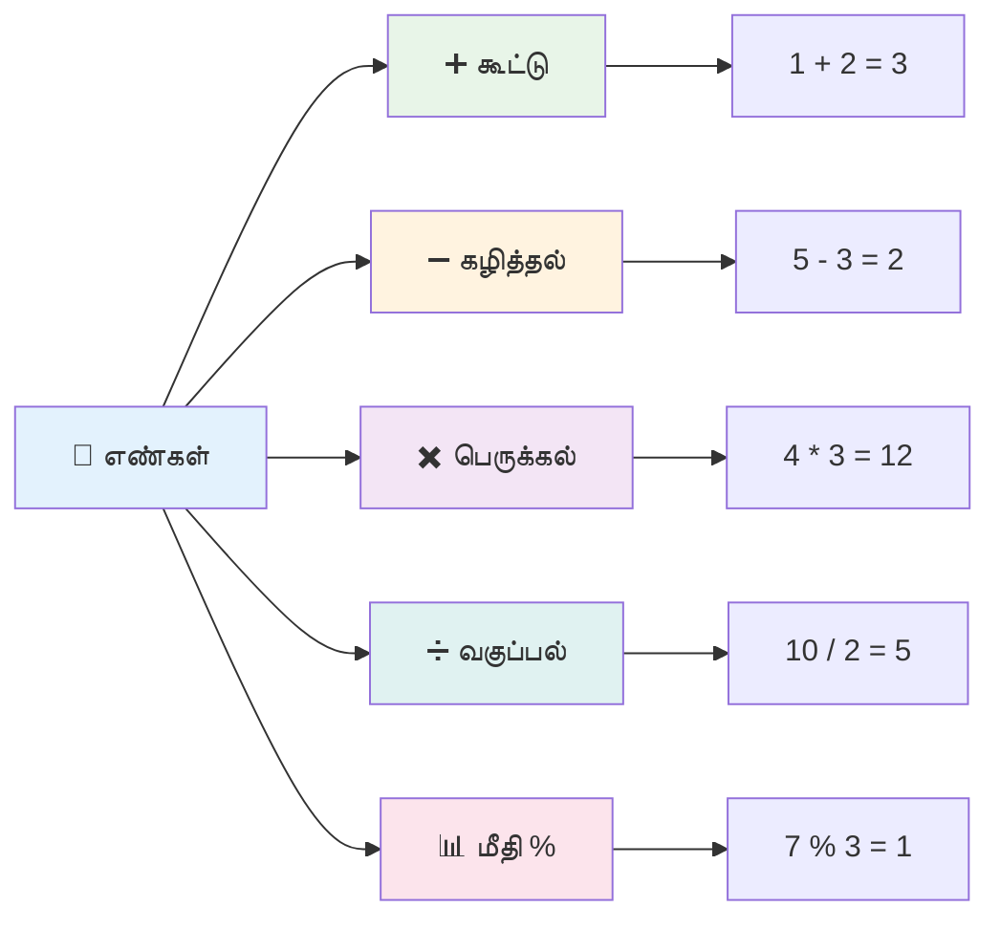
### கணக்கிட்டல் இயக்கிகள்

கணக்கிட்டல் இயக்கிகள் JavaScript இல் கணக்குப் பணிகளைச் செய்ய உதவுகின்றன. இந்த இயக்கிகள் நூற்றாண்டுகளாக கணிதவியலாளர்களால் பயன்படுத்தப்படும் ஒரு முறைபாடுகளை பின்பற்றுகின்றன – ஆல்கோரித்மி போன்ற அறிஞர் உருவாக்கிய கணித குறியீடுகளும் இதனுடன் சேர்ந்தவை.

இயக்கிகள் பாரம்பரிய கணிதத்திலிருந்து எதிர்பார்த்தபடி இயங்குகின்றன: கூட்டல், கழித்தல் போன்றவைகள்.

கணக்கிட பயன்படுத்தப்படக்கூடிய டிப்யூட்டன்கள் சில இங்கே:

| சின்னம்  | விளக்கம்                                                                    | உதாரணம்                          |
| ------- | --------------------------------------------------------------------------- | -------------------------------- |
| `+`     | **கூட்டல்**: இரண்டு எண்களின் கூட்டுத்தொகையை கணக்கிடுகிறது                    | `1 + 2 // எதிர்பார்க்கும் பதில் 3`  |
| `-`     | **கழித்தல்**: இரண்டு எண்களின் வேறுபாட்டை கணக்கிடுகிறது                     | `1 - 2 // எதிர்பார்க்கும் பதில் -1` |
| `*`     | **பெருக்கல்**: இரண்டு எண்களின் பெருக்கலை கணக்கிடுகிறது                      | `1 * 2 // எதிர்பார்க்கும் பதில் 2`  |
| `/`     | **பிரிப்பு**: இரண்டு எண்களின் வகுக்கலை கணக்கிடுகிறது                        | `1 / 2 // எதிர்பார்க்கும் பதில் 0.5` |
| `%`     | **மீதம்**: இரண்டு எண்களின் வகுக்கலில் மீதத்தை கணக்கிடுகிறது                  | `1 % 2 // எதிர்பார்க்கும் பதில் 1`  |

✅ முயற்சி செய்யுங்கள்! உலாவி மடியில் கணக்கிடும் செயல்பாட்டை முயற்சி செய்யவும். முடிவுகள் உங்களை ஆச்சரியப்படுத்துமா?

### 🧮 **கணக்கு திறன்கள் சோதனை: நம்பிக்கையுடன் கணக்கிடுதல்**

**கணக்கிடும் புரிதலைச் சோதிக்கவும்:**
- `/` (பிரிப்பு) மற்றும் `%` (மீதம்) இற்கு என்ன வித்தியாசம்?
- `10 % 3` எவ்வளவு? (க் குறிப்பு: 3.33... அல்ல)
- மீதம் இயக்கி நிரலாக்கத்தில் ஏன் பயனுள்ளதாக இருக்கும்?

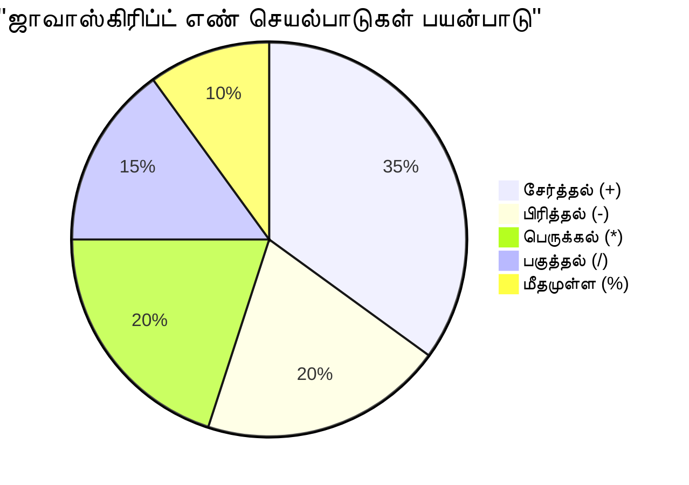
> **உண்மையான உலக அனுபவம்**: மீதி இயக்கி (%) எண்கள் மாயிற்று அல்லது வெவ்வேறு வகையானவை என்பதை சரிபார்க்கவும், முறைமைகளை உருவாக்கவும், வரிசைகளை சுழற்றவும் மிகவும் பயனுள்ளது!

### குறிகள் (Strings)

JavaScript இல் உரை தரவு குறிகளாக வடிவமைக்கப்படுகிறது. "குறிகள்" என்ற சொல் என்றால் தொடர் எழுத்துக்கள் ஜோடி கட்டப்பட்டவை, நடுத்தரக்கால மடங்களின் நூலாசிரியர்கள் எழுத்துக்களை இணைத்து சொற்களையும் வாக்கியங்களையும் உருவாக்கியமை போல்.

குறிகள் வலைஉதவியில் அடிப்படையானவை. ஒரு வலைத்தளத்தில் காட்டப்படும் ஒவ்வொரு உரை பகுதியும் – பயனர் பெயர்கள், பட்டன் குறிச்சொற்கள், பிழை செய்திகள், உள்ளடக்கம் – குறி தரவாக கையாளப்படுகின்றது. குறிகளை புரிந்துகொள்வது செயற்கை பயன்பாட்டு இடைமுகங்களை உருவாக்க மிகவும் அவசியம்.

குறிகள் ஒற்றை அல்லது இரட்டைப் புள்ளிகள் இடையேயான எழுத்துக்கள் தொகுதிகளாகும்.

```javascript
'This is a string'
"This is also a string"
let myString = 'This is a string value stored in a variable';
```

**இந்த கருத்துகளைப் புரிந்துகொள்ளவும்:**
- குறிகளை உருவாக்க ஒரே ' ' அல்லது இரட்டைப் " " குறிகளைப் பயன்படுத்துகிறது
- எழுத்துக்கள், எண்கள் மற்றும் சின்னங்கள் போன்ற உரைத் தரவுகளை சேமிக்கிறது
- பிறகு பயன்படுத்த மாறிலிகளில் குறி மதிப்புகளை ஒதுக்குகிறது
- உரை மற்றும் மாறிலியின் பெயரை வேறுபடுத்த குறிகள் அவசியம்

ஒரு குறி எழுதும்போது குறிகளை பயன்படுத்த மறக்காதீர்கள், இல்லையென்றால் JavaScript அதை மாறிலியின் பெயராக கருதும்.

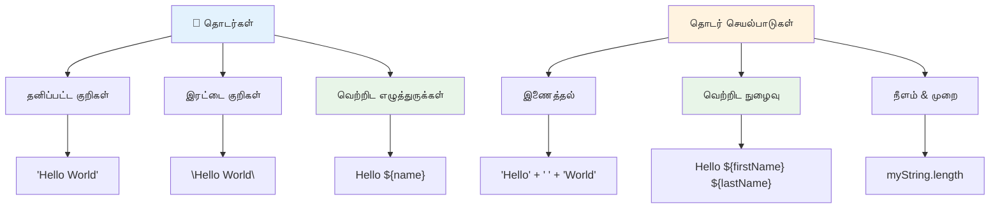
### குறிகளை வடிவமைத்தல்

குறி மேலாண்மை உரை கூறுகளை இணைத்து, மாறிலிகளை உட்படுத்து, மற்றும் நிகழ்ச்சி நிலைக்கு ஏற்ப மாறும் உள்ளடக்கம் உருவாக்க உதவும். இக்கலை மூலம் உரையை நிரலாக்க முறையில் கட்டமைக்க முடியும்.

பல குறிகளை ஒன்றாக சேர்க்க வேண்டிய போது – இதுவே இணைப்பாகும் (concatenation).
**concatenate** இரண்டு அல்லது அதற்கு மேற்பட்ட strings-ஐ சேர்க்க அல்லது ஒன்றிணைக்க `+` இயக்கியைப் பயன்படுத்தவும்.

```javascript
let myString1 = "Hello";
let myString2 = "World";

myString1 + myString2 + "!"; //ஹலோஉலகம்!
myString1 + " " + myString2 + "!"; //ஹலோ உலகம்!
myString1 + ", " + myString2 + "!"; //ஹலோ, உலகம்!
```

**தொடர்ந்து என்ன நடக்கிறது என்பதை படிப்படியாகப் பார்க்கலாம்:**
- `+` இயக்கியைப் பயன்படுத்தி பல strings-ஐ **சேர்க்கிறது**
- முதலாவது உதாரணத்தில் இடைவெளிகள் இல்லாமல் strings-ஐ நேரடியாக **இணைக்கிறது**
- வாசிக்கும் வசதிக்காக strings-க்குள் இடைவெளி எழுத்துக்களை `" "` **சேர்க்கிறது**
- சரியான வடிவமைப்பிற்காக தவில்கள் போன்ற வினாக்களைக் **நுழைக்கிறது**

✅ JavaScript-ல் ஏன் `1 + 1 = 2` ஆனாலும், `'1' + '1' = 11` ஆகும்? சிந்தியுங்கள். `'1' + 1` பற்றி என்ன?

**Template literals** என்பது strings-ஐ வடிவமைப்பதற்கான மற்றொரு வழி, ஆனால் சொற்கள் ஆழியிடின் பதிலாக பின்தட்டு (`backtick`) பயன்படுத்தப்படுகிறது. சாதாரண உரை அல்லாத எதையாவது `${ }` பிளேஸ்ஹோல்டர் உள்ளே வைக்க வேண்டும். இதில் string ஆக இருக்கக்கூடிய மாறிலிகள் அடங்கும்.

```javascript
let myString1 = "Hello";
let myString2 = "World";

`${myString1} ${myString2}!` //ஹலோ உலகம்!
`${myString1}, ${myString2}!` //ஹலோ, உலகம்!
```

**ஒவ்வொரு பகுதிக்கும் புரிந்துகொள்ளலாம்:**
- பொதுவான சொற்களின் பதிலாக பின்தட்டு `` ` `` பயன்படுத்தி template literals-ஐ உருவாக்குகிறது
- `${}` பிளேஸ்ஹோல்டர்ச் சூத்திரத்தைப் பயன்படுத்தி மாறிலிகளை நேரடியாக நுழைக்கிறது
- இடைவெளிகள் மற்றும் வடிவமைப்பை எழுதியபடி துல்லியமாக **பாதுகாக்கிறது**
- மாறிலிகளுடன் கூடிய சிக்கலான strings உருவாக்குவதற்கு சுத்தமான வழியை வழங்குகிறது

இரண்டும் உங்கள் வடிவமைப்பு குறிக்கோள்களை அடைய முடியும், ஆனால் template literals இடைவெளி மற்றும் வரிச் மீட்புகளை மதிப்பளிக்கும்.

✅ நீங்கள் எப்போது plain stringக்கு பதிலாக template literal-ஐப் பயன்படுத்துவீர்கள்?

### 🔤 **String சம்பந்தமான திறனைச் சோதனை: உரை மாற்றும் நம்பிக்கை**

**உங்கள் string திறன்களை மதிப்பிடுங்கள்:**
- ஏன் `'1' + '1'` என்பது `2` என்றால் அல்லாமல் `'11'` ஆகின்றது என்று விளக்க முடியுமா?
- எந்த string முறையைப் பயன்படுத்துவது உங்களுக்கு வாசிக்க எளிதானது என்று தோன்றுகிறது: concatenate செய்வது அல்லது template literals?
- ஒரு string-இன் சுற்றியுள்ள சொற்களை மறந்து விட்டால் என்ன நடக்கும்?

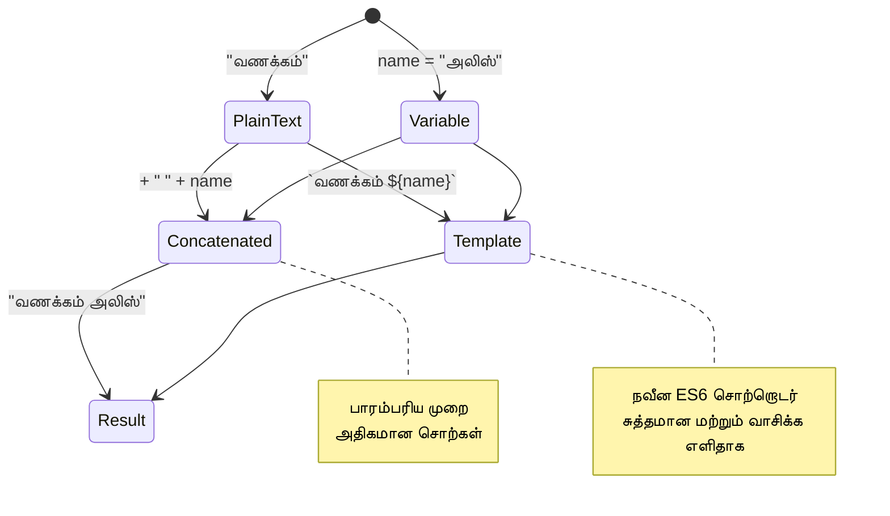
> **திறம்பட வழி:** சிக்கலான string கட்டமைப்புக்க template literals பொதுவாக விருப்பமானவை, ஏனெனில் அவை வாசிக்க எளிதாகவும், பல வரிசை string-களை நன்கு கையாளவும் உதவுகின்றன!

### பூலியன் (Booleans)

பூலியன் என்றால் மிக எளிய தரவு வடிவமாகும்: அதன் மதிப்புகள் இரண்டு மட்டும் இருக்க முடியும் – `true` அல்லது `false`. இந்த இரட்டை தர்க்க அமைப்பு 19ஆம் நூற்றாண்டின் கணிதவியலாளர் ஜார்ஜ் பூல் George Boole-ரின் Boolean க்ரமவியல் வேலைக்கு அடிப்படையாக உள்ளது.

எளிமையான போதிலும், பூலியன்கள் நிரலைக் கட்டுப்படுத்த முக்கியமானவை. பயனர் உள்நுழைந்துள்ளாரா, பொத்தான் அழுத்தப்பட்டுள்ளதா, அல்லது சில நிபந்தனைகள் பூர்த்தி செய்யப்பட்டுள்ளதா போன்ற நிலைகளின் அடிப்படையில் உங்கள் கோடு முடிவெடுக்க உதவுகின்றன.

Boolean மதிப்புகள் `true` அல்லது `false` மட்டுமே இருக்க முடியும். Boolean புலங்கள் குறிப்பிட்ட நிபந்தனைகள் பூர்த்தி செய்யப்பட்டால் ஓட வேண்டிய கோட் வரிகளைத் தீர்மானிக்க உதவும். பல நேரங்களில் [operators](../../../../2-js-basics/1-data-types) Boolean மதிப்பை அமைக்க உதவுகின்றன, மேலும் மாறிலிகளை ஆரம்பிக்க அல்லது அவர்களின் மதிப்புகளை மாற்றுவதற்கு நீங்கள் கட்டளைகளைப் பயன்படுத்துவது தெளிவாக காணப்படும்.

```javascript
let myTrueBool = true;
let myFalseBool = false;
```

**மேலே நாம் செய்துள்ளோம்:**
- Boolean மதிப்பான `true`-ஐ சேமிக்கும் ஒரு மாறிலை **உருவாக்கியது**
- Boolean மதிப்பான `false`-ஐ சேமிப்பதைக் காண்பித்தது
- `true` மற்றும் `false` என்ற துல்லியமான விசைப்பலகையைச் (keywords) பயன்படுத்தியது (சொற்களில்லை)
- பின்விளைவுகளில் பயன்படுத்த இந்த மாறில்களை தயார் செய்தது

✅ ஒரு மாறி Boolean `true` ஆக மதிப்பாய்வின் போது 'truthy' எனக் கருதலாம். JavaScript இல் [அனைத்து மதிப்புகளும் நினைவூட்டல் மதிப்பாக இல்லாத வரை truthy](https://developer.mozilla.org/docs/Glossary/Truthy) ஆக இருக்கின்றன என்பது கவனிக்க வேண்டும்.

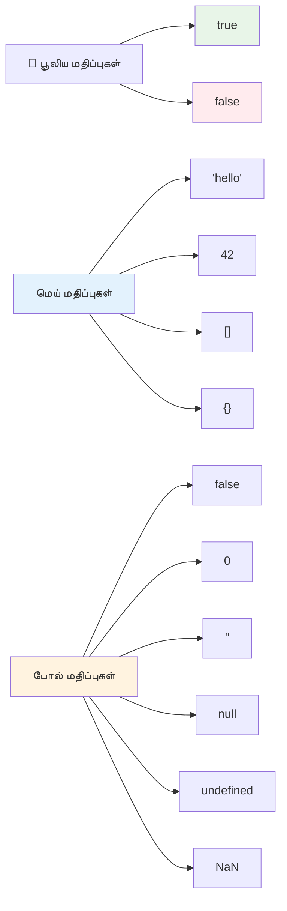
### 🎯 **Boolean தர்க்க சோதனை: முடிவெடுக்க திறன்**

**Boolean புரிதலைப் பரிசோதிக்க:**
- JavaScript-ல் `true` மற்றும் `false` தவிர “truthy” மற்றும் “falsy” மதிப்புகள் ஏன் உள்ளன என்று நினைக்கிறீர்களா?
- இவற்றில் எந்தது falsy என்றும் கணிக்க முடியுமா: `0`, `"0"`, `[]`, `"false"`?
- Boolean-கள் நிரல் ஓட்டத்தை கட்டுப்படுத்த எப்படி உதவுகின்றன?

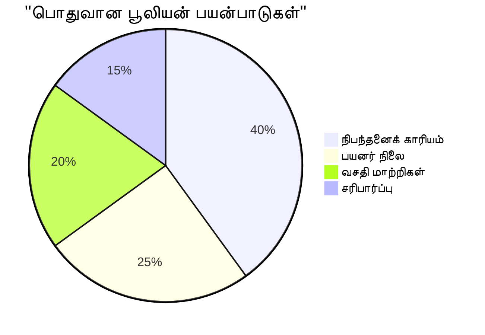
> **கவனம்**: JavaScript இல் மட்டுமே 6 மதிப்புகள் falsy ஆகும்: `false`, `0`, `""`, `null`, `undefined`, மற்றும் `NaN`. மற்ற அனைத்தும் truthy ஆகும!

---

## 📊 **உங்கள் தரவுத்தর வகைகள் கருவி தொகுப்பு சுருக்கம்**

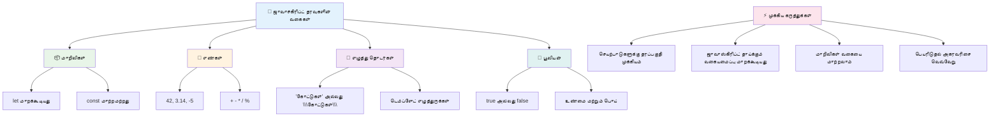
## GitHub Copilot ஏஜெண்ட் சவால் 🚀

அந்த ஜாவாஸ்கிரிப்ட் தரவுத்தர் வகைகளை பயன்படுத்தி ரியல்-படிமம் தரவுத் சூழ்நிலைகளை கையாளும் தனிப்பட்ட தகவல் மேலாளரை உருவாக்க இதைச் செய்யுங்கள்:

**விவரிப்பு:** இந்த பாடத்தில் கற்ற ஜாவாஸ்கிரிப் தரவுத்தரம் வகைகளை எல்லாம் காட்டும் தனிப்பட்ட ப்ரொபைல் பொருளை உருவாக்கவும். அதில் ஆளுடைய பெயர் (string), வயது (number), மாணவர் நிலை (boolean), பிடித்த நிறங்கள் வரிசை (array), மற்றும் வீதி, நகரம், ZIP குறியீட்டை கொண்ட முகவரி பொருள் அடங்கும். ப்ரொபைல் தகவலைக் காட்டும் மற்றும் ஒவ்வொரு புலத்தையும் புதுப்பிக்கும் செயல்பாடுகளை சேர்க்கவும். string இணைப்பும், template literals, வயதுடன் கணிதசார் நடவடிக்கைகள் மற்றும் boolean நிலையை காட்டவும்.

[agent mode பற்றி இங்கே அறிய](https://code.visualstudio.com/blogs/2025/02/24/introducing-copilot-agent-mode)

## 🚀 சவால்

JavaScript-ல் சில செயல்பாடுகள் எழுதுபவர்களை ஆச்சரியப்படுத்தும். இதோ ஒரு பழமையான உதாரணம்: உலாவி கன்சோலில் typed செய்ய முயற்சிக்கவும்: `let age = 1; let Age = 2; age == Age` முடிவைப் பார். இது `false` திரும்பும் – ஏன் என கண்டுபிடிக்க முடிகிறதா?

JavaScript-ன் இது போன்ற பல பண்புகளைப் புரிந்துகொள்வது நிரல் எழுதுவதையும் பிழைகளைத் தெளிவாக்குவதையும் எளிதாக்கும்.

## பின்வரும் பாட Quiz
[பிறகு-பாட Quiz](https://ff-quizzes.netlify.app)

## மதிப்பாய்வு மற்றும் சுயபயிற்சி

[இந்த JavaScript பயிற்ச்சிகள் பட்டியலை](https://css-tricks.com/snippets/javascript/) பாருங்கள் மற்றும் ஒன்றை முயற்சிக்கவும். என்ன கற்றீர்கள்?

## பணியமைப்பு

[தரவுத்தரம் பயிற்சி](assignment.md)

## 🚀 உங்கள் JavaScript தரவுத்தரம் திறமை நேரவியல்

### ⚡ **அடுத்த 5 நிமிடங்களில் செய்யவேண்டியது**
- [ ] உலாவி கன்சோலை திறந்து வேற்றுவேறு தரவுத்தரம் வகைகளுடன் 3 மாறிகளை உருவாக்கவும்
- [ ] சவால்களைச் செய்க: `let age = 1; let Age = 2; age == Age` ஏன் false என்று கண்டுபிடிக்கவும்
- [ ] உங்கள் பெயர் மற்றும் பிடித்த எண்ணுடன் string இணைப்பை பயிற்சி செய்யவும்
- [ ] ஒரு string இனைப்பில் எண்ணைப் போட்டால் என்ன நடக்கும் என சோதிக்கவும்

### 🎯 **இந்த மணிநேரத்தில் சாதிக்கவேண்டியது**
- [ ] பாடம் முடிந்த பின் Quiz-ஐ முடித்து குழப்பமான கருத்துக்களை மதிப்பாய்வு செய்யவும்
- [ ] இரண்டு எண்கள் கூட்டுதல், கழித்தல், பெருக்கல், வகுத்தல் செய்யும் ஒரு சிறிய கணினியை உருவாக்கவும்
- [ ] template literals பயன்படுத்தி ஒரு எளிய பெயர் வடிவமைப்பை உருவாக்கவும்
- [ ] `==` மற்றும் `===` ஒப்பீட்டு இயக்கிகளின் வேறுபாடுகளை ஆராயவும்
- [ ] வெவ்வேறு தரவுத்தரம் வகைகளுக்கு இடையில் மாற்றங்களை பயிற்சி செய்யவும்

### 📅 **உங்கள் வாராந்திர JavaScript அடித்தளம்**
- [ ] பணியை நம்பிக்கையுடன் மற்றும் படைப்பாற்றலுடன் முடிக்கவும்
- [ ] கற்றற்ற அனைத்து தரவுத்தரம் வகைகளையும் பயன்படுத்தி தனிப்பட்ட ப்ரொபைல் பொருள் உருவாக்கவும்
- [ ] [CSS-Tricks-இல் உள்ள JavaScript பயிற்சிகளுடன்](https://css-tricks.com/snippets/javascript/) பயிற்சி செய்யவும்
- [ ] boolean தர்க்கத்தைப் பயன்படுத்தி எளிய படிவ சரிபார்ப்பாளரை உருவாக்கவும்
- [ ] வரிசைகள் மற்றும் பொருள் தரவுத்தர வகைகளை ஆய்வு செய்யவும் (வரவிருக்கும் பாடங்களுக்கான முன்னோட்டம்)
- [ ] JavaScript சமூகத்தில் சேர்ந்து தரவுத்தரம் எதுவென்று கேள்விகள் கேளுங்கள்

### 🌟 **உங்கள் மாதாந்திர மாற்றம்**
- [ ] தரவுத்தரம் அறிவை பெரிய நிரல் திட்டங்களில் இணைக்கவும்
- [ ] உண்மை பயன்பாடுகளில் எந்த தரவுத்திரம் எப்போது மற்றும் ஏன் பயன்படுத்த வேண்டும் என்பதை புரிந்து கொள்ளவும்
- [ ] பிற துவக்கத்தைப் புரிந்து கொள்வவர்களுக்கு JavaScript அடிப்படைகளை விளக்க உதவவும்
- [ ] பல வகையான பயனர் தரவுகளை நிர்வகிக்கும் சிறிய பயன்பாட்டை உருவாக்கவும்
- [ ] type coercion மற்றும் கடுமையான சமத்துவம் போன்ற மேம்பட்ட தரவுத்தரம் கருத்துக்களை ஆராயவும்
- [ ] ஆவணமயமாக்கல் மேம்பாடுகளுடன் திறந்த மூல JavaScript திட்டங்களுக்கு பங்களிக்கவும்

### 🧠 **இறுதி தரவுத்தரம் திறன் சோதனை**

**உங்கள் JavaScript அடித்தளத்தை கொண்டாடுங்கள்:**
- எந்த தரவுத்தர் அதன் நடத்தைக் கொண்டு உங்களை அதிகம் ஆச்சரியப்படுத்தியது?
- மாறிலிகள் மற்றும் நிரந்தரங்களை நண்பருக்கு விளக்குவதில் எவ்வளவு நம்பிக்கையுடன் இருக்கிறீர்கள்?
- JavaScript-ன் தரவுத்தரம் அமைப்புக்கான மிகச் சுவாரசியமான விஷயம் என்ன இருந்தது?
- இந்த அடிப்படைகள் கொண்டு உருவாக்கக்கூடிய உண்மை உலக பயன்பாட்டை நீங்கள் எந்தெந்த வகையில் கற்பனை செய்கிறீர்கள்?

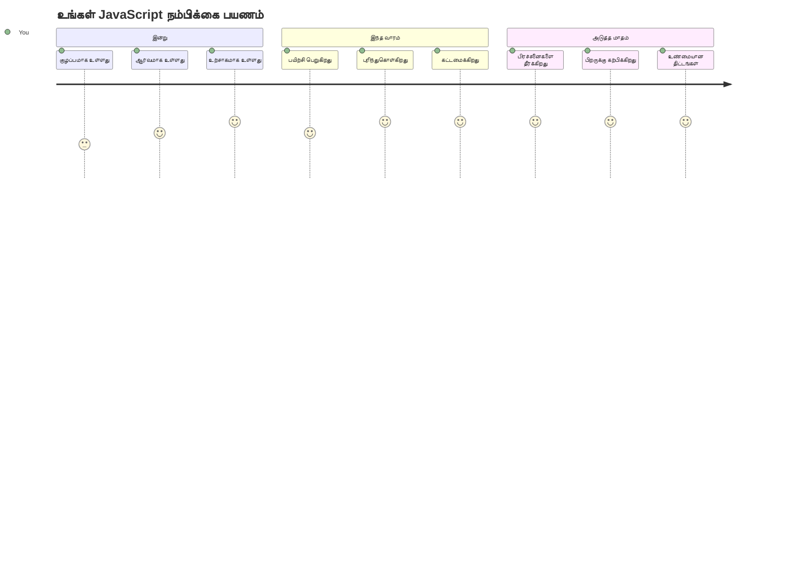
> 💡 **நீங்கள் அடித்தளத்தை கட்டியுள்ளீர்கள்!** தரவுத்தரம் அறிதல் என்பது கதைகள் எழுதியும் முன் எழுத்துக்களை கற்றுக்கொள்ளவேண்டியது போல. நீங்கள் எழுதப்போகும் ஒவ்வொரு JavaScript நிரலும் இந்த அடிப்படைக் கருத்துக்களைப் பயன்படுத்தும். இப்போது நீங்கள் தொடர்புடைய வலைத்தளங்கள், துடிப்பிலான பயன்பாடுகள், மற்றும் உண்மை உலகப் பிரச்சனைகளை நிரல் மூலம் தீர்க்க கட்டுமானக் கட்டங்களை பெற்றுள்ளீர்கள். JavaScript என்ற அதிசய உலகத்திற்கு உங்களை வரவேற்கிறோம்! 🎉

---

<!-- CO-OP TRANSLATOR DISCLAIMER START -->
**அறிவிப்பு**:  
இந்த ஆவணம் AI மொழிபெயர்ப்பு சேவை [Co-op Translator](https://github.com/Azure/co-op-translator) பயன்படுத்தி மொழி மாற்றப்பட்டது. நாங்கள் துல்லியத்தை உறுதி செய்ய முயற்சித்தாலும், தானாக மொழிபெயர்ப்பு செய்துள்ளதால் பிழைகள் அல்லது தவறான தகவல்கள் இருக்க வாய்ப்பு உள்ளது. அசல் ஆவணம் அதன் சொந்த மொழியிலேயே அதிகாரப்பூர்வ ஆதாரமாகக் கருதப்பட வேண்டும். முக்கியமான தகவலுக்கு, தொழில்நுட்பமான மனித மொழிபெயர்ப்பை பரிந்துரைக்கிறோம். இந்த மொழிபெயர்ப்பால் ஏற்படும் எந்த தவறான புரிதல்கள் அல்லது தவறான விளக்கங்களுக்கு நாங்கள் பொறுப்பானவர்கள் அல்லோம்.
<!-- CO-OP TRANSLATOR DISCLAIMER END -->