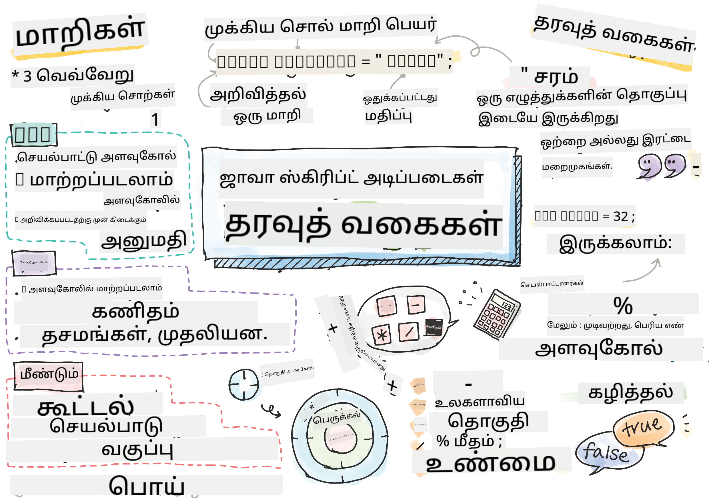

<!--
CO_OP_TRANSLATOR_METADATA:
{
  "original_hash": "b95fdd8310ef467305015ece1b0f9411",
  "translation_date": "2025-10-11T11:41:59+00:00",
  "source_file": "2-js-basics/1-data-types/README.md",
  "language_code": "ta"
}
-->
# ஜாவாஸ்கிரிப்ட் அடிப்படைகள்: தரவுத் வகைகள்


> ஸ்கெட்ச் நோட்: [Tomomi Imura](https://twitter.com/girlie_mac)

## முன்-வகுப்பு வினாடி வினா
[முன்-வகுப்பு வினாடி வினா](https://ff-quizzes.netlify.app/web/)

இந்த பாடம் ஜாவாஸ்கிரிப்டின் அடிப்படைகளை கற்றுக்கொள்கிறது, இது இணையத்தில் இடையூறுகளை வழங்கும் மொழியாகும்.

> இந்த பாடத்தை [Microsoft Learn](https://docs.microsoft.com/learn/modules/web-development-101-variables/?WT.mc_id=academic-77807-sagibbon) இல் கற்றுக்கொள்ளலாம்!

[](https://youtube.com/watch?v=JNIXfGiDWM8 "ஜாவாஸ்கிரிப்டில் மாறிகள்")

[](https://youtube.com/watch?v=AWfA95eLdq8 "ஜாவாஸ்கிரிப்டில் தரவுத் வகைகள்")

> 🎥 மேலே உள்ள படங்களை கிளிக் செய்து மாறிகள் மற்றும் தரவுத் வகைகள் பற்றிய வீடியோக்களை பாருங்கள்

மாறிகள் மற்றும் அவற்றில் உள்ள தரவுத் வகைகளைப் பார்ப்பதிலிருந்து தொடங்குவோம்!

## மாறிகள்

மாறிகள் உங்கள் குறியீட்டில் பயன்படுத்தப்படக்கூடிய மற்றும் மாற்றக்கூடிய மதிப்புகளை சேமிக்கின்றன.

மாறியை உருவாக்கி **அறிவிப்பது** கீழே உள்ள வடிவமைப்பைக் கொண்டுள்ளது **[keyword] [name]**. இது இரண்டு பகுதிகளால் ஆனது:

- **கீவுரு**. கீவுருகள் `let` அல்லது `var` ஆக இருக்கலாம்.  

✅ `let` என்ற கீவுரு ES6 இல் அறிமுகப்படுத்தப்பட்டது மற்றும் உங்கள் மாறிக்கு _block scope_ எனப்படும் ஒரு வரம்பை வழங்குகிறது. `var` ஐ விட `let` ஐ பயன்படுத்த பரிந்துரைக்கப்படுகிறது. வரம்புகள் பற்றிய மேலும் விவரங்களை எதிர்கால பகுதிகளில் பார்க்கலாம்.
- **மாறியின் பெயர்**, இது நீங்கள் தேர்ந்தெடுக்கும் பெயராகும்.

### பணிகள் - மாறிகளுடன் வேலை செய்யுங்கள்

1. **ஒரு மாறியை அறிவிக்கவும்**. `let` கீவுரைப் பயன்படுத்தி ஒரு மாறியை அறிவிப்போம்:

    ```javascript
    let myVariable;
    ```

   `myVariable` இப்போது `let` கீவுரைப் பயன்படுத்தி அறிவிக்கப்பட்டுள்ளது. இது தற்போது மதிப்பை கொண்டிருக்கவில்லை.

1. **மதிப்பை ஒதுக்கவும்**. `=` ஆபரேட்டரைப் பயன்படுத்தி ஒரு மாறியில் மதிப்பைச் சேமிக்கவும், பின்னர் எதிர்பார்க்கப்படும் மதிப்பை எழுதவும்.

    ```javascript
    myVariable = 123;
    ```

   > குறிப்பு: இந்த பாடத்தில் `=` பயன்படுத்துவது "ஒதுக்கீட்டு ஆபரேட்டர்" ஐப் பயன்படுத்துவதாகும், இது ஒரு மாறிக்கு மதிப்பை அமைக்க பயன்படுத்தப்படுகிறது. இது சமத்துவத்தை குறிக்கவில்லை.

   `myVariable` இப்போது 123 என்ற மதிப்புடன் *துவக்கப்பட்டுள்ளது*.

1. **மறுசீரமைப்பு**. உங்கள் குறியீட்டை கீழே உள்ள அறிக்கையுடன் மாற்றவும்.

    ```javascript
    let myVariable = 123;
    ```

    மேலே உள்ளது _explicit initialization_ என அழைக்கப்படுகிறது, இது ஒரு மாறி அறிவிக்கப்பட்டு அதே நேரத்தில் ஒரு மதிப்பை ஒதுக்குகிறது.

1. **மாறியின் மதிப்பை மாற்றவும்**. மாறியின் மதிப்பை கீழே உள்ள முறையில் மாற்றவும்:

   ```javascript
   myVariable = 321;
   ```

   ஒரு மாறி அறிவிக்கப்பட்ட பிறகு, உங்கள் குறியீட்டில் எந்த நேரத்திலும் `=` ஆபரேட்டர் மற்றும் புதிய மதிப்பைப் பயன்படுத்தி அதன் மதிப்பை மாற்றலாம்.

   ✅ முயற்சிக்கவும்! நீங்கள் உங்கள் உலாவியில் நேரடியாக ஜாவாஸ்கிரிப்ட் எழுதலாம். ஒரு உலாவி சாளரத்தைத் திறந்து Developer Tools இல் செல்லவும். கன்சோலில், ஒரு ப்ராம்ப்ட் இருக்கும்; `let myVariable = 123` என تایபு செய்து, ரிட்டர்ன் அழுத்தி, பின்னர் `myVariable` تایபு செய்யவும். என்ன நடக்கிறது? இந்த கருத்துகளை நீங்கள் அடுத்த பாடங்களில் மேலும் கற்றுக்கொள்வீர்கள்.

## மாறாத மாறிகள் (Constants)

மாறாத மாறியை அறிவிப்பதும் துவக்குவதும் மாறிகளின் அதே கருத்துகளைப் பின்பற்றுகிறது, `const` கீவுர exception ஆகும். மாறாத மாறிகள் பொதுவாக அனைத்து-uppercase எழுத்துக்களுடன் அறிவிக்கப்படுகின்றன.

```javascript
const MY_VARIABLE = 123;
```

மாறாத மாறிகள் மாறிகளுக்கு ஒத்ததாக உள்ளன, ஆனால் இரண்டு விதிவிலக்குகள் உள்ளன:

- **மதிப்பை கொண்டிருக்க வேண்டும்**. மாறாத மாறிகள் துவக்கப்பட வேண்டும், இல்லையெனில் குறியீட்டை இயக்கும்போது பிழை ஏற்படும்.
- **குறிப்பு மாற்றப்பட முடியாது**. மாறாத மாறியின் குறிப்பு துவக்கப்பட்ட பிறகு மாற்றப்பட முடியாது, இல்லையெனில் குறியீட்டை இயக்கும்போது பிழை ஏற்படும். இரண்டு உதாரணங்களைப் பார்ப்போம்:
   - **எளிய மதிப்பு**. கீழே உள்ளது அனுமதிக்கப்படவில்லை:
   
      ```javascript
      const PI = 3;
      PI = 4; // not allowed
      ```
 
   - **ஆப்ஜெக்ட் குறிப்பு பாதுகாக்கப்பட்டுள்ளது**. கீழே உள்ளது அனுமதிக்கப்படவில்லை.
   
      ```javascript
      const obj = { a: 3 };
      obj = { b: 5 } // not allowed
      ```

    - **ஆப்ஜெக்ட் மதிப்பு பாதுகாக்கப்படவில்லை**. கீழே உள்ளது அனுமதிக்கப்படுகிறது:
    
      ```javascript
      const obj = { a: 3 };
      obj.a = 5;  // allowed
      ```

      மேலே நீங்கள் ஆப்ஜெக்டின் மதிப்பை மாற்றுகிறீர்கள், ஆனால் குறிப்பு தானாகவே மாற்றப்படவில்லை, எனவே இது அனுமதிக்கப்படுகிறது.

   > குறிப்பு, ஒரு `const` என்பது குறிப்பு மறுஅளவீட்டிலிருந்து பாதுகாக்கப்பட்டுள்ளது என்பதை பொருள். மதிப்பு _immutable_ அல்ல, இது மாற்றப்படலாம், குறிப்பாக இது ஒரு சிக்கலான அமைப்பு போன்ற ஆப்ஜெக்ட் ஆக இருந்தால்.

## தரவுத் வகைகள்

மாறிகள் எண்கள் மற்றும் உரை போன்ற பல்வேறு வகையான மதிப்புகளை சேமிக்க முடியும். இந்த பல்வேறு வகையான மதிப்புகள் **தரவுத் வகை** என அழைக்கப்படுகின்றன. தரவுத் வகைகள் மென்பொருள் மேம்பாட்டின் முக்கியமான பகுதியாகும், ஏனெனில் இது டெவலப்பர்களுக்கு குறியீடு எப்படி எழுதப்பட வேண்டும் மற்றும் மென்பொருள் எப்படி இயங்க வேண்டும் என்பதை முடிவு செய்ய உதவுகிறது. மேலும், சில தரவுத் வகைகள் ஒரு மதிப்பில் கூடுதல் தகவலை மாற்ற அல்லது எடுக்க உதவும் தனித்துவமான அம்சங்களை கொண்டுள்ளன.

✅ தரவுத் வகைகள் ஜாவாஸ்கிரிப்ட் தரவுப் பிரிமிடிவ்கள் என்றும் குறிப்பிடப்படுகின்றன, ஏனெனில் அவை மொழி வழங்கும் மிகக் குறைந்த அளவிலான தரவுத் வகைகள் ஆகும். 7 பிரிமிடிவ் தரவுத் வகைகள் உள்ளன: string, number, bigint, boolean, undefined, null மற்றும் symbol. ஒவ்வொன்றும் என்ன பிரதிநிதித்துவம் செய்கிறது என்பதை கற்பனை செய்ய ஒரு நிமிடம் எடுத்துக்கொள்ளுங்கள். `zebra` என்றால் என்ன? `0` என்றால் என்ன? `true`?

### எண்கள்

முந்தைய பகுதியில், `myVariable` இன் மதிப்பு ஒரு எண் தரவுத் வகையாக இருந்தது.

`let myVariable = 123;`

மாறிகள் அனைத்து வகையான எண்களையும் சேமிக்க முடியும், அதில் தசம எண்கள் அல்லது எதிர்மறை எண்களும் அடங்கும். எண்கள் கணித ஆபரேட்டர்களுடன் பயன்படுத்தப்படலாம், இது [அடுத்த பகுதியில்](../../../../2-js-basics/1-data-types) உள்ளடக்கப்பட்டுள்ளது.

### கணித ஆபரேட்டர்கள்

கணித செயல்பாடுகளைச் செய்யும்போது பயன்படுத்த பல வகையான ஆபரேட்டர்கள் உள்ளன, சிலவற்றை இங்கே பட்டியலிடப்பட்டுள்ளது:

| சின்னம் | விளக்கம்                                                               | உதாரணம்                          |
| ------ | ------------------------------------------------------------------------ | -------------------------------- |
| `+`    | **கூட்டல்**: இரண்டு எண்களின் கூட்டத்தை கணக்கிடுகிறது                     | `1 + 2 //எதிர்பார்க்கப்படும் பதில் 3`   |
| `-`    | **கழித்தல்**: இரண்டு எண்களின் வேறுபாட்டை கணக்கிடுகிறது                   | `1 - 2 //எதிர்பார்க்கப்படும் பதில் -1`  |
| `*`    | **பெருக்கல்**: இரண்டு எண்களின் பெருக்கத்தை கணக்கிடுகிறது                 | `1 * 2 //எதிர்பார்க்கப்படும் பதில் 2`   |
| `/`    | **வகுத்தல்**: இரண்டு எண்களின் பகுத்தீட்டை கணக்கிடுகிறது                  | `1 / 2 //எதிர்பார்க்கப்படும் பதில் 0.5` |
| `%`    | **மீதம்**: இரண்டு எண்களின் வகுத்தல் மூலம் மீதத்தை கணக்கிடுகிறது          | `1 % 2 //எதிர்பார்க்கப்படும் பதில் 1`   |

✅ முயற்சிக்கவும்! உங்கள் உலாவியின் கன்சோலில் ஒரு கணித செயல்பாட்டை முயற்சிக்கவும். முடிவுகள் உங்களை ஆச்சரியப்படுத்துகிறதா?

### Strings

Strings என்பது ஒற்றை அல்லது இரட்டை குறியீட்டுக்குறிகளுக்குள் இருக்கும் எழுத்துக்களின் தொகுப்பாகும்.

- `'இது ஒரு string'`
- `"இது கூட ஒரு string"`
- `let myString = 'இது ஒரு மாறியில் சேமிக்கப்பட்ட string மதிப்பு';`

ஒரு string எழுதும்போது குறியீட்டுக்குறிகளைப் பயன்படுத்த வேண்டும் என்பதை நினைவில் கொள்ளுங்கள், இல்லையெனில் ஜாவாஸ்கிரிப்ட் அதை ஒரு மாறியின் பெயராகக் கருதும்.

### Strings வடிவமைத்தல்

Strings உரை வடிவிலானவை, அவை சில நேரங்களில் வடிவமைக்கப்பட வேண்டும்.

இரண்டு அல்லது அதற்கு மேற்பட்ட strings ஐ **concatenate** செய்ய, அல்லது ஒன்றுடன் ஒன்றை இணைக்க, `+` ஆபரேட்டரைப் பயன்படுத்தவும்.

```javascript
let myString1 = "Hello";
let myString2 = "World";

myString1 + myString2 + "!"; //HelloWorld!
myString1 + " " + myString2 + "!"; //Hello World!
myString1 + ", " + myString2 + "!"; //Hello, World!

```

✅ ஜாவாஸ்கிரிப்டில் `1 + 1 = 2` ஆனால் `'1' + '1' = 11` என்பது ஏன்? இதைப் பற்றி யோசிக்கவும். `'1' + 1` என்றால் என்ன?

**Template literals** என்பது strings ஐ வடிவமைப்பதற்கான மற்றொரு வழியாகும், ஆனால் quotes க்கு பதிலாக backtick பயன்படுத்தப்படுகிறது. சாதாரண உரை அல்லாத எதையும் `${ }` இடத்தில் வைக்க வேண்டும். இதில் strings ஆக இருக்கக்கூடிய எந்த மாறிகளும் அடங்கும்.

```javascript
let myString1 = "Hello";
let myString2 = "World";

`${myString1} ${myString2}!` //Hello World!
`${myString1}, ${myString2}!` //Hello, World!
```

உங்கள் வடிவமைப்பு இலக்குகளை எந்த முறையிலும் அடையலாம், ஆனால் template literals இடைவெளிகள் மற்றும் வரி இடைவெளிகளை மதிக்கும்.

✅ Template literal ஐ எப்போது பயன்படுத்துவீர்கள், சாதாரண string ஐ எப்போது?

### Booleans

Booleans இரண்டு மதிப்புகளாக மட்டுமே இருக்க முடியும்: `true` அல்லது `false`. Booleans சில நிபந்தனைகள் பூர்த்தி செய்யப்பட்டால் எந்த வரிகளின் குறியீடு இயங்க வேண்டும் என்பதை முடிவு செய்ய உதவுகிறது. பல சந்தர்ப்பங்களில், [ஆபரேட்டர்கள்](../../../../2-js-basics/1-data-types) ஒரு Boolean இன் மதிப்பை அமைப்பதில் உதவுகின்றன, மேலும் மாறிகள் துவக்கப்படுவது அல்லது அவற்றின் மதிப்புகள் புதுப்பிக்கப்படுவது ஆபரேட்டர்களுடன் எழுதப்படும் என்பதை நீங்கள் அடிக்கடி கவனிப்பீர்கள்.

- `let myTrueBool = true`
- `let myFalseBool = false`

✅ ஒரு மாறி `true` என Boolean ஆக மதிப்பீடு செய்யப்படுமானால் 'truthy' எனக் கருதப்படும். ஆச்சரியமாக, ஜாவாஸ்கிரிப்டில், [அனைத்து மதிப்புகளும் falsy என வரையறுக்கப்படாத வரை truthy ஆகும்](https://developer.mozilla.org/docs/Glossary/Truthy).

---

## 🚀 சவால்

ஜாவாஸ்கிரிப்ட் சில நேரங்களில் தரவுத் வகைகளை கையாளும் ஆச்சரியமான வழிகளுக்காக பிரபலமாக உள்ளது. இந்த 'gotchas' பற்றிய சிறிது ஆராய்ச்சி செய்யுங்கள். உதாரணமாக: case sensitivity உங்களைத் தட்டும்! உங்கள் கன்சோலில் இதை முயற்சிக்கவும்: `let age = 1; let Age = 2; age == Age` (பதில் `false` -- ஏன்?). நீங்கள் மேலும் என்ன 'gotchas' கண்டுபிடிக்க முடியும்?

## வகுப்புக்குப் பின் வினாடி வினா
[வகுப்புக்குப் பின் வினாடி வினா](https://ff-quizzes.netlify.app)

## மதிப்பீடு & சுய கற்றல்

[ஜாவாஸ்கிரிப்ட் பயிற்சிகளின் இந்த பட்டியலை](https://css-tricks.com/snippets/javascript/) பாருங்கள் மற்றும் ஒன்றை முயற்சிக்கவும். நீங்கள் என்ன கற்றுக்கொண்டீர்கள்?

## பணிக்கூற்று

[தரவுத் வகைகள் பயிற்சி](assignment.md)

---

**குறிப்பு**:  
இந்த ஆவணம் [Co-op Translator](https://github.com/Azure/co-op-translator) என்ற AI மொழிபெயர்ப்பு சேவையைப் பயன்படுத்தி மொழிபெயர்க்கப்பட்டுள்ளது. நாங்கள் துல்லியத்திற்காக முயற்சிக்கின்றோம், ஆனால் தானியங்கி மொழிபெயர்ப்புகளில் பிழைகள் அல்லது தவறான தகவல்கள் இருக்கக்கூடும் என்பதை தயவுசெய்து கவனத்தில் கொள்ளுங்கள். அதன் தாய்மொழியில் உள்ள மூல ஆவணம் அதிகாரப்பூர்வ ஆதாரமாக கருதப்பட வேண்டும். முக்கியமான தகவல்களுக்கு, தொழில்முறை மனித மொழிபெயர்ப்பு பரிந்துரைக்கப்படுகிறது. இந்த மொழிபெயர்ப்பைப் பயன்படுத்துவதால் ஏற்படும் எந்த தவறான புரிதல்கள் அல்லது தவறான விளக்கங்களுக்கு நாங்கள் பொறுப்பல்ல.