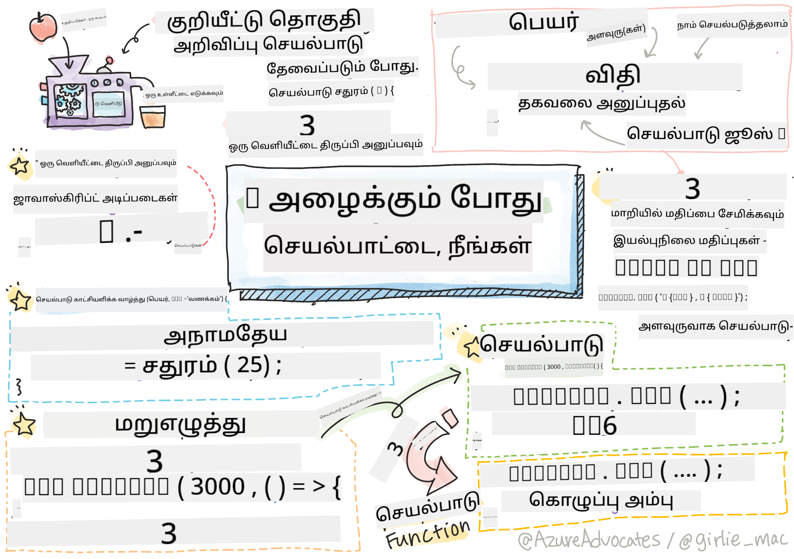

<!--
CO_OP_TRANSLATOR_METADATA:
{
  "original_hash": "92e136090efc4341b1d51c37924c1802",
  "translation_date": "2025-10-11T11:43:09+00:00",
  "source_file": "2-js-basics/2-functions-methods/README.md",
  "language_code": "ta"
}
-->
# ஜாவாஸ்கிரிப்ட் அடிப்படைகள்: முறைமைகள் மற்றும் செயல்பாடுகள்


> ஸ்கெட்ச் நோட்: [Tomomi Imura](https://twitter.com/girlie_mac)

## முன்-வகுப்பு வினாடி வினா
[முன்-வகுப்பு வினாடி வினா](https://ff-quizzes.netlify.app)

நாம் குறியீடு எழுதுவதைக் குறித்து சிந்திக்கும்போது, எங்கள் குறியீடு வாசிக்க எளிதாக இருக்க வேண்டும் என்பதை உறுதிப்படுத்த விரும்புகிறோம். இது எதிர்மறையாக தோன்றினாலும், குறியீடு எழுதப்படுவதைக் காட்டிலும் பல முறை வாசிக்கப்படுகிறது. **செயல்பாடு** என்பது பராமரிக்கக்கூடிய குறியீட்டை உறுதிப்படுத்த ஒரு டெவலப்பரின் கருவி பெட்டகத்தில் உள்ள முக்கிய கருவியாகும்.

[](https://youtube.com/watch?v=XgKsD6Zwvlc "முறைமைகள் மற்றும் செயல்பாடுகள்")

> 🎥 மேலே உள்ள படத்தை கிளிக் செய்து முறைமைகள் மற்றும் செயல்பாடுகள் பற்றிய வீடியோவைப் பாருங்கள்.

> இந்த பாடத்தை [Microsoft Learn](https://docs.microsoft.com/learn/modules/web-development-101-functions/?WT.mc_id=academic-77807-sagibbon) இல் எடுத்துக்கொள்ளலாம்!

## செயல்பாடுகள்

அதன் அடிப்படையில், ஒரு செயல்பாடு என்பது தேவையான நேரத்தில் செயல்படுத்தக்கூடிய குறியீட்டின் ஒரு தொகுதி. இது ஒரே பணியை பல முறை செய்ய வேண்டிய சூழல்களுக்கு சரியானது; பல இடங்களில் தர்க்கத்தை நகலெடுப்பதற்குப் பதிலாக (இது புதுப்பிக்க கடினமாக இருக்கும்), அதை ஒரு இடத்தில் மையமாக்கி, செயல்பாடுகளை செய்ய வேண்டிய நேரத்தில் அழைக்கலாம் - நீங்கள் மற்ற செயல்பாடுகளிலிருந்து கூட செயல்பாடுகளை அழைக்கலாம்!

செயல்பாட்டிற்கு பெயர் வழங்கும் திறனும் அதே அளவு முக்கியமானது. இது சிறியதாக தோன்றினாலும், பெயர் குறியீட்டின் ஒரு பகுதியை விரைவாக ஆவணப்படுத்தும் வழியை வழங்குகிறது. இதை ஒரு பொத்தானில் உள்ள லேபிளாகக் கருதலாம். "காலக்கெடு ரத்து" என்று எழுதப்பட்ட ஒரு பொத்தானை நான் கிளிக் செய்தால், அது கடிகாரத்தை நிறுத்தும் என்பதை நான் அறிகிறேன்.

## செயல்பாட்டை உருவாக்குதல் மற்றும் அழைப்பது

செயல்பாட்டிற்கான சyntax பின்வருமாறு இருக்கும்:

```javascript
function nameOfFunction() { // function definition
 // function definition/body
}
```

நான் ஒரு வரவேற்பை காட்ட ஒரு செயல்பாட்டை உருவாக்க விரும்பினால், அது இவ்வாறு இருக்கும்:

```javascript
function displayGreeting() {
  console.log('Hello, world!');
}
```

எப்போது நாங்கள் செயல்பாட்டை அழைக்க (அல்லது செயல்படுத்த) விரும்புகிறோம், செயல்பாட்டின் பெயருக்கு பின் `()` பயன்படுத்துகிறோம். நாங்கள் செயல்பாட்டை வரையறுக்க முடியும் என்பதை நினைவில் கொள்ள வேண்டும், அது அழைக்கப்படும் முன் அல்லது பின்; ஜாவாஸ்கிரிப்ட் கம்பைலர் அதை உங்களுக்காகக் கண்டுபிடிக்கும்.

```javascript
// calling our function
displayGreeting();
```

> **NOTE:** ஒரு **முறைமை** எனப்படும் ஒரு சிறப்பு வகை செயல்பாடு உள்ளது, நீங்கள் ஏற்கனவே பயன்படுத்தி வருகிறீர்கள்! உண்மையில், நாங்கள் மேலே உள்ள டெமோவில் `console.log` ஐப் பயன்படுத்திய போது இதைப் பார்த்தோம். ஒரு முறைமை செயல்பாட்டிலிருந்து வேறுபடுவது என்னவென்றால், ஒரு முறைமை ஒரு பொருளுடன் இணைக்கப்பட்டுள்ளது (`console` எங்கள் எடுத்துக்காட்டில்), ஆனால் ஒரு செயல்பாடு சுதந்திரமாக உள்ளது. பல டெவலப்பர்கள் இந்த சொற்களை பரஸ்பரம் பயன்படுத்துவதை நீங்கள் கேட்கலாம்.

### செயல்பாட்டு சிறந்த நடைமுறைகள்

செயல்பாடுகளை உருவாக்கும்போது நினைவில் கொள்ள சில சிறந்த நடைமுறைகள் உள்ளன:

- எப்போதும், செயல்பாடு என்ன செய்யும் என்பதை நீங்கள் அறிய **விவரமான பெயர்களை** பயன்படுத்தவும்
- வார்த்தைகளை இணைக்க **camelCasing** பயன்படுத்தவும்
- உங்கள் செயல்பாடுகளை குறிப்பிட்ட ஒரு பணியில் கவனம் செலுத்தவும்

## செயல்பாட்டிற்கு தகவலை அனுப்புதல்

செயல்பாட்டை மேலும் மீண்டும் பயன்படுத்தக்கூடியதாக மாற்ற, நீங்கள் அதில் தகவலை அனுப்ப விரும்புவீர்கள். மேலே உள்ள எங்கள் `displayGreeting` எடுத்துக்காட்டைப் பரிசீலித்தால், அது **Hello, world!** மட்டுமே காட்டும். ஒருவர் உருவாக்கக்கூடிய மிகவும் பயனுள்ள செயல்பாடு அல்ல. நாம் அதை கொஞ்சம் நெகிழ்வானதாக மாற்ற விரும்பினால், வரவேற்பு செய்ய வேண்டிய நபரின் பெயரை குறிப்பிட அனுமதிக்க, நாம் ஒரு **parameter** ஐச் சேர்க்கலாம். ஒரு parameter (சில நேரங்களில் **argument** என்றும் அழைக்கப்படுகிறது) என்பது ஒரு செயல்பாட்டிற்கு அனுப்பப்படும் கூடுதல் தகவலாகும்.

Parameter கள் வரையறை பகுதியின் உள்ளே கோட்பட்டங்களில் பட்டியலிடப்பட்டு, பின்வருமாறு கமா பிரிக்கப்பட்டது:

```javascript
function name(param, param2, param3) {

}
```

நாம் `displayGreeting` ஐ ஒரு பெயரை ஏற்கவும் அதை காட்டவும் புதுப்பிக்கலாம்.

```javascript
function displayGreeting(name) {
  const message = `Hello, ${name}!`;
  console.log(message);
}
```

நாம் செயல்பாட்டை அழைக்கவும் parameter ஐ அனுப்பவும் விரும்பும்போது, அதை கோட்பட்டங்களில் குறிப்பிடுகிறோம்.

```javascript
displayGreeting('Christopher');
// displays "Hello, Christopher!" when run
```

## இயல்புநிலை மதிப்புகள்

நாம் மேலும் parameter களைச் சேர்த்து, செயல்பாட்டை மேலும் நெகிழ்வானதாக மாற்றலாம். ஆனால் ஒவ்வொரு மதிப்பையும் குறிப்பிட வேண்டும் என்று நாம் விரும்பவில்லை என்றால் என்ன? எங்கள் வரவேற்பு எடுத்துக்காட்டுடன் தொடர, நாம் பெயரை கட்டாயமாக விடலாம் (நாம் யாரை வரவேற்கிறோம் என்பதை அறிய வேண்டும்), ஆனால் வரவேற்பு தானாகவே விரும்பினால் விருப்பமாக தனிப்பயனாக்க அனுமதிக்க விரும்புகிறோம். ஒருவர் அதை தனிப்பயனாக்க விரும்பவில்லை என்றால், அதற்கு பதிலாக நாம் ஒரு இயல்புநிலை மதிப்பை வழங்குகிறோம். ஒரு parameter க்கு இயல்புநிலை மதிப்பை வழங்க, நாம் ஒரு மாறி மதிப்பை அமைக்கும் முறையில் அமைக்கிறோம் - `parameterName = 'defaultValue'`. முழு எடுத்துக்காட்டைப் பார்க்க:

```javascript
function displayGreeting(name, salutation='Hello') {
  console.log(`${salutation}, ${name}`);
}
```

நாம் செயல்பாட்டை அழைக்கும் போது, `salutation` க்கு ஒரு மதிப்பை அமைக்க விரும்புகிறோம் என்பதை முடிவு செய்யலாம்.

```javascript
displayGreeting('Christopher');
// displays "Hello, Christopher"

displayGreeting('Christopher', 'Hi');
// displays "Hi, Christopher"
```

## மதிப்புகளை திருப்புதல்

இப்போது வரை நாம் உருவாக்கிய செயல்பாடு எப்போதும் [console](https://developer.mozilla.org/docs/Web/API/console) க்கு வெளியிடும். சில நேரங்களில் இது நாங்கள் தேடுகிறதற்கு சரியாக இருக்கலாம், குறிப்பாக மற்ற சேவைகளை அழைக்கும் செயல்பாடுகளை உருவாக்கும்போது. ஆனால் நான் ஒரு கணக்கீட்டைச் செய்ய உதவியாக ஒரு செயல்பாட்டை உருவாக்கி, அதை பிற இடங்களில் பயன்படுத்த நான் மதிப்பை திருப்ப விரும்பினால் என்ன?

நாம் **return value** ஐப் பயன்படுத்துவதன் மூலம் இதைச் செய்யலாம். ஒரு return value செயல்பாட்டால் திருப்பப்படுகிறது, மேலும் ஒரு string அல்லது number போன்ற ஒரு நிலையான மதிப்பைப் போலவே ஒரு மாறியில் சேமிக்கலாம்.

ஒரு செயல்பாடு ஏதாவது திருப்பினால், `return` என்ற முக்கிய வார்த்தை பயன்படுத்தப்படுகிறது. `return` முக்கிய வார்த்தை திருப்பப்படும் மதிப்பு அல்லது குறிப்பு எதிர்பார்க்கிறது, பின்வருமாறு:

```javascript
return myVariable;
```  

நாம் ஒரு வரவேற்பு செய்தியை உருவாக்க ஒரு செயல்பாட்டை உருவாக்கி, அழைப்பாளருக்கு மதிப்பை திருப்பலாம்.

```javascript
function createGreetingMessage(name) {
  const message = `Hello, ${name}`;
  return message;
}
```

இந்த செயல்பாட்டை அழைக்கும் போது, மதிப்பை ஒரு மாறியில் சேமிப்போம். இது ஒரு நிலையான மதிப்புக்கு (உதாரணமாக `const name = 'Christopher'`) ஒரு மாறியை அமைக்கும் வழியில் மிகவும் ஒத்ததாகும்.

```javascript
const greetingMessage = createGreetingMessage('Christopher');
```

## செயல்பாடுகளுக்கான செயல்பாடுகள்

நீங்கள் உங்கள் நிரலாக்க வாழ்க்கையில் முன்னேறும்போது, செயல்பாடுகளை parameter களாக ஏற்கும் செயல்பாடுகளை நீங்கள் சந்திக்கலாம். இது எப்போது ஏதாவது நிகழும் அல்லது முடிவடையும் என்பதை நாங்கள் அறியவில்லை, ஆனால் அதற்கு பதிலாக ஒரு செயல்பாட்டைச் செய்ய வேண்டும் என்று நாங்கள் அறிகிறோம்.

ஒரு எடுத்துக்காட்டாக, [setTimeout](https://developer.mozilla.org/docs/Web/API/WindowOrWorkerGlobalScope/setTimeout) ஐப் பரிசீலிக்கவும், இது ஒரு டைமரைத் தொடங்குகிறது மற்றும் முடிந்தவுடன் குறியீட்டை செயல்படுத்தும். நாம் எந்த குறியீட்டை செயல்படுத்த விரும்புகிறோம் என்பதைச் சொல்ல வேண்டும். இது ஒரு செயல்பாட்டுக்கு சரியான வேலை போல தோன்றுகிறது!

கீழே உள்ள குறியீட்டை இயக்கினால், 3 விநாடிகளுக்குப் பிறகு **3 seconds has elapsed** என்ற செய்தியை நீங்கள் காண்பீர்கள்.

```javascript
function displayDone() {
  console.log('3 seconds has elapsed');
}
// timer value is in milliseconds
setTimeout(displayDone, 3000);
```

### பெயரில்லா செயல்பாடுகள்

நாம் உருவாக்கியதை மீண்டும் பார்க்கலாம். நாம் ஒரு பெயருடன் ஒரு செயல்பாட்டை உருவாக்குகிறோம், இது ஒருமுறை பயன்படுத்தப்படும். எங்கள் பயன்பாடு மேலும் சிக்கலாக மாறும்போது, ஒருமுறை மட்டுமே அழைக்கப்படும் பல செயல்பாடுகளை உருவாக்குகிறோம் என்று நாங்கள் காணலாம். இது சிறந்தது அல்ல. உண்மையில், நாம் எப்போதும் ஒரு பெயரை வழங்க தேவையில்லை!

நாம் ஒரு செயல்பாட்டை parameter ஆக அனுப்பும்போது, முன்னதாக ஒன்றை உருவாக்குவதை தவிர்த்து, parameter இன் ஒரு பகுதியாக ஒன்றை உருவாக்கலாம். நாம் அதே `function` முக்கிய வார்த்தையைப் பயன்படுத்துகிறோம், ஆனால் அதற்கு பதிலாக அதை ஒரு parameter ஆக உருவாக்குகிறோம்.

மேலே உள்ள குறியீட்டை பெயரில்லா செயல்பாட்டைப் பயன்படுத்த மீண்டும் எழுதுவோம்:

```javascript
setTimeout(function() {
  console.log('3 seconds has elapsed');
}, 3000);
```

நமது புதிய குறியீட்டை இயக்கினால், நீங்கள் அதே முடிவுகளைப் பெறுவதை கவனிக்கலாம். நாம் ஒரு செயல்பாட்டை உருவாக்கியுள்ளோம், ஆனால் அதற்கு ஒரு பெயரை வழங்க தேவையில்லை!

### கொழுத்த அம்புச் செயல்பாடுகள்

பல நிரலாக்க மொழிகளில் (ஜாவாஸ்கிரிப்ட் உட்பட) பொதுவாக உள்ள ஒரு குறுக்குவழி என்பது **arrow** அல்லது **fat arrow** செயல்பாட்டைப் பயன்படுத்தும் திறன். இது `=>` என்ற சிறப்பு குறியீட்டை பயன்படுத்துகிறது, இது ஒரு அம்பைப் போல தோன்றுகிறது - அதனால் பெயர்! `=>` ஐப் பயன்படுத்துவதன் மூலம், `function` முக்கிய வார்த்தையைத் தவிர்க்க முடியும்.

நமது குறியீட்டை கொழுத்த அம்புச் செயல்பாட்டைப் பயன்படுத்த மீண்டும் ஒருமுறை எழுதுவோம்:

```javascript
setTimeout(() => {
  console.log('3 seconds has elapsed');
}, 3000);
```

### ஒவ்வொரு உத்தியை எப்போது பயன்படுத்த வேண்டும்

நீங்கள் தற்போது ஒரு செயல்பாட்டை parameter ஆக அனுப்ப மூன்று வழிகளைப் பார்த்துள்ளீர்கள், ஒவ்வொன்றையும் எப்போது பயன்படுத்த வேண்டும் என்று நீங்கள் ஆச்சரியப்படலாம். நீங்கள் செயல்பாட்டை ஒருமுறை மட்டுமே பயன்படுத்துவீர்கள் என்று தெரிந்தால், அதை வழக்கமாக உருவாக்கவும். நீங்கள் அதை ஒரே இடத்திற்காக மட்டுமே பயன்படுத்துவீர்கள் என்றால், பொதுவாக பெயரில்லா செயல்பாட்டைப் பயன்படுத்துவது சிறந்தது. நீங்கள் கொழுத்த அம்புச் செயல்பாட்டைப் பயன்படுத்துகிறீர்களா அல்லது பாரம்பரிய `function` syntax ஐப் பயன்படுத்துகிறீர்களா என்பது உங்கள் விருப்பத்திற்கு உட்பட்டது, ஆனால் பெரும்பாலான நவீன டெவலப்பர்கள் `=>` ஐ விரும்புவதை நீங்கள் கவனிப்பீர்கள்.

---

## 🚀 சவால்

செயல்பாடுகள் மற்றும் முறைமைகள் இடையிலான வேறுபாட்டை ஒரு வாக்கியத்தில் விளக்க முடியுமா? முயற்சி செய்யுங்கள்!

## வகுப்புக்குப் பின் வினாடி வினா
[வகுப்புக்குப் பின் வினாடி வினா](https://ff-quizzes.netlify.app)

## மதிப்பீடு மற்றும் சுயபயிற்சி

**அம்புச் செயல்பாடுகள்** குறித்த [கூடுதல் தகவல்களைப் படிக்க](https://developer.mozilla.org/docs/Web/JavaScript/Reference/Functions/Arrow_functions) மதிப்புள்ளது, ஏனெனில் அவை குறியீட்டு அடிப்படைகளில் அதிகமாக பயன்படுத்தப்படுகின்றன. ஒரு செயல்பாட்டை எழுதவும், பின்னர் இந்த syntax ஐப் பயன்படுத்தி அதை மீண்டும் எழுதவும் பயிற்சி செய்யுங்கள்.

## பணிக்கட்டளை

[செயல்பாடுகளுடன் மகிழுங்கள்](assignment.md)

---

**குறிப்பு**:  
இந்த ஆவணம் [Co-op Translator](https://github.com/Azure/co-op-translator) என்ற AI மொழிபெயர்ப்பு சேவையை பயன்படுத்தி மொழிபெயர்க்கப்பட்டுள்ளது. எங்கள் தரச்சிறப்பிற்காக முயற்சி செய்தாலும், தானியங்கி மொழிபெயர்ப்புகளில் பிழைகள் அல்லது தவறுகள் இருக்கக்கூடும் என்பதை கவனத்தில் கொள்ளவும். அதன் தாய்மொழியில் உள்ள மூல ஆவணம் அதிகாரப்பூர்வ ஆதாரமாக கருதப்பட வேண்டும். முக்கியமான தகவல்களுக்கு, தொழில்முறை மனித மொழிபெயர்ப்பு பரிந்துரைக்கப்படுகிறது. இந்த மொழிபெயர்ப்பைப் பயன்படுத்துவதால் ஏற்படும் எந்த தவறான புரிதல்கள் அல்லது தவறான விளக்கங்களுக்கு நாங்கள் பொறுப்பல்ல.