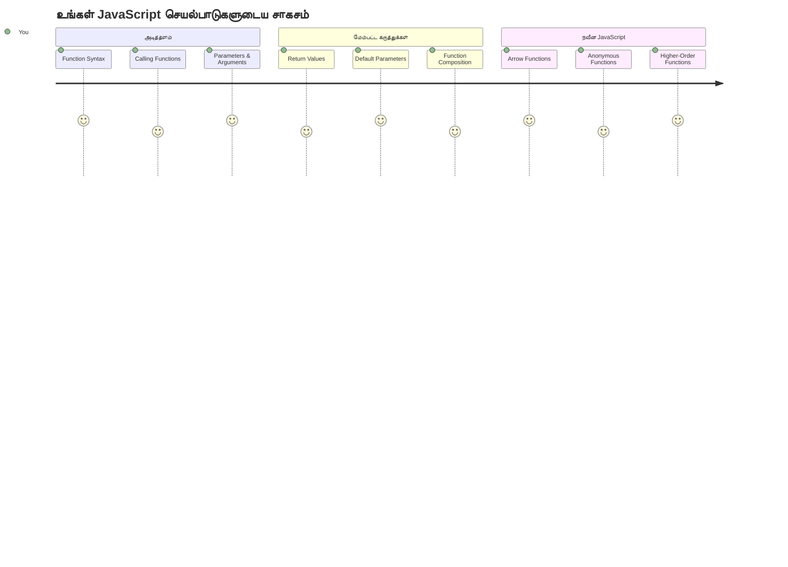
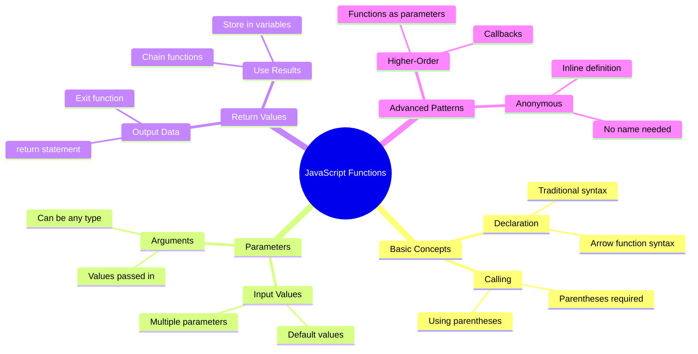
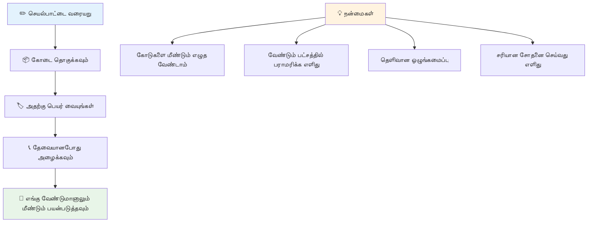
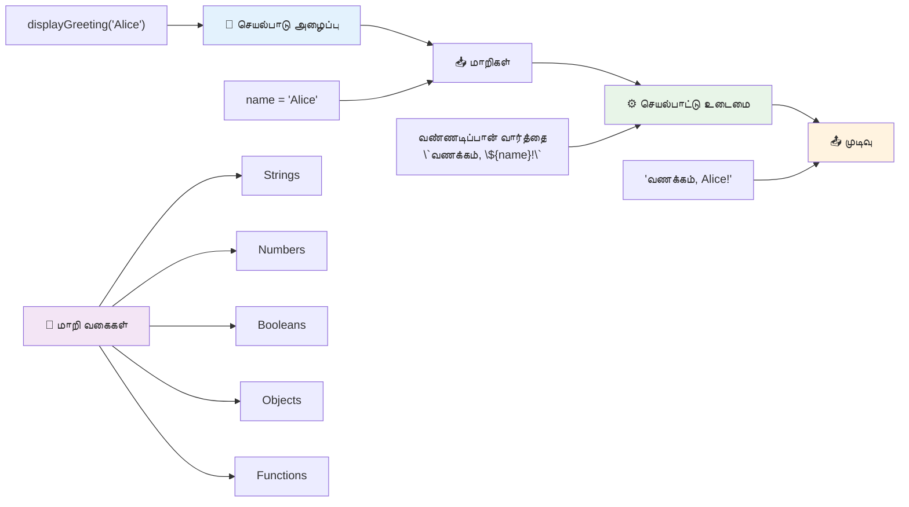
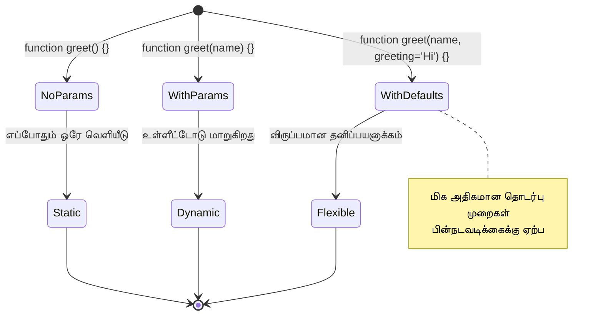
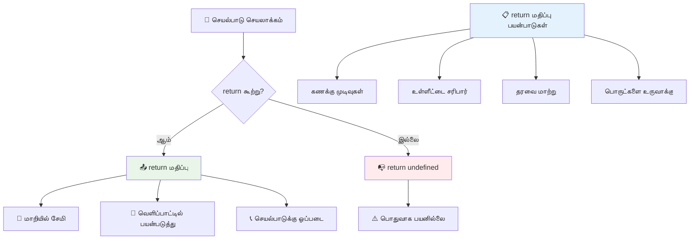
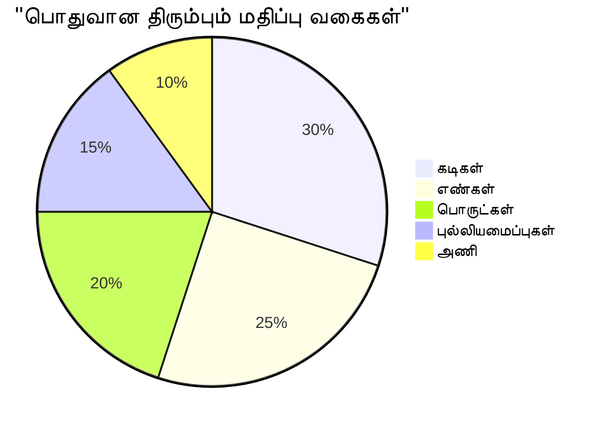
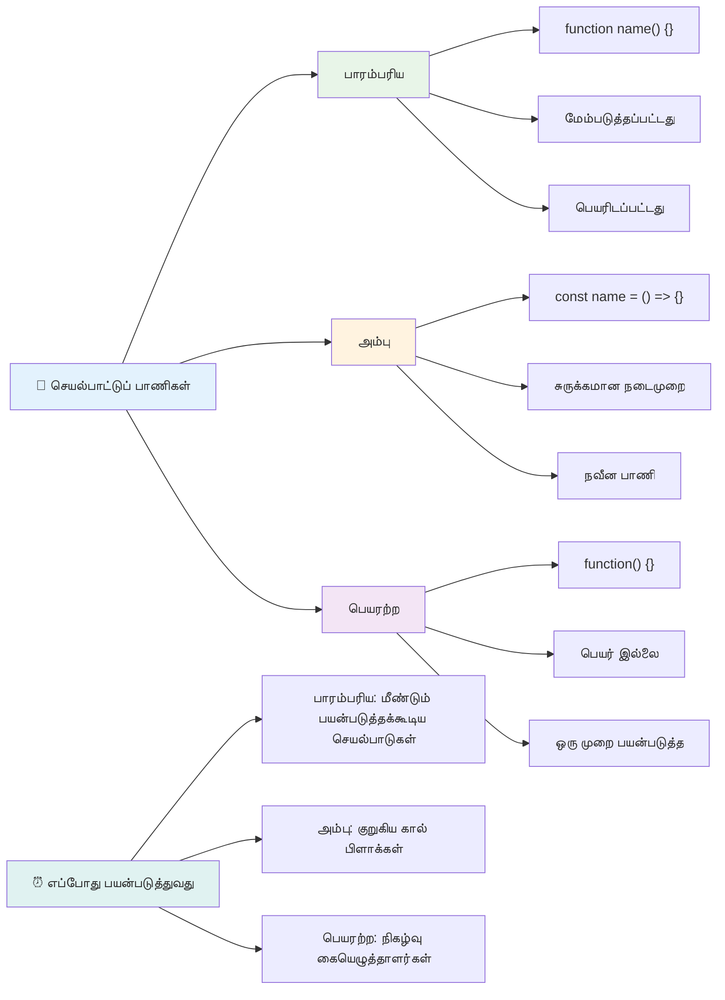
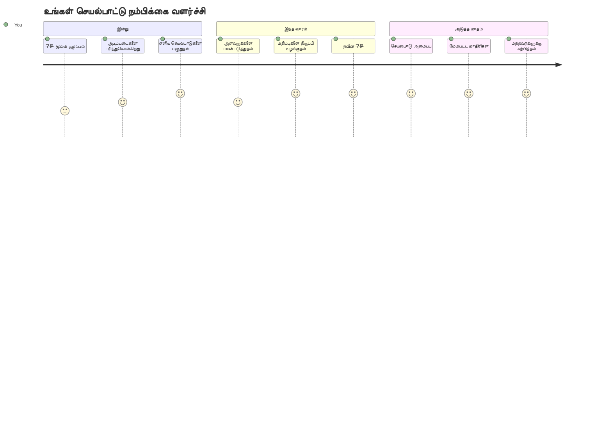

<!--
CO_OP_TRANSLATOR_METADATA:
{
  "original_hash": "71f7d7dafa1c7194d79ddac87f669ff9",
  "translation_date": "2026-01-07T12:40:39+00:00",
  "source_file": "2-js-basics/2-functions-methods/README.md",
  "language_code": "ta"
}
-->
# ஜாவாஸ்கிரிப்ட் அடிப்படைகள்: முறைகள் மற்றும் செயல்பாடுகள்


> [டோமொமி இமுரா](https://twitter.com/girlie_mac) அவர்களின் ஸ்கெட்ச் நோட்


## முன்-விளக்கக்காட்சித் தேர்வு
[முன்-விளக்கக்காட்சித் தேர்வு](https://ff-quizzes.netlify.app)

அதே கோடுகளை மீண்டும் மீண்டும் எழுதுவது என்பது நிரலாக்கத்தில் மிக பொதுவான கோபக்காரணங்களில் ஒன்றாகும். செயல்பாடுகள் இந்த பிரச்சனையை தீர்க்கும் முறையாகும், அதாவது நீங்கள் கோடுகளை மீண்டும் பயன்படுத்தக்கூடிய தொகுதிகளாக தொகுக்க முடியும். ஹென்‌ரி போர்ட்டின் அசெம்ப்ளி லைன் மாற்றத்தை உருவாக்கிய விதமான பாகங்களாக செயல்பாடுகளை நினைத்துப் பாருங்கள் – ஒருமுறை நீங்கள் நம்பகமான கூறை உருவாக்கினால், அதை மீண்டும் மீண்டும் பழையதை மீண்டும் கட்டாமல் எந்த இடத்தில் வேண்டுமானாலும் பயன்படுத்தலாம்.

செயல்பாடுகள் உங்களுக்கு உங்கள் நிரலில் மறுபயன்படுத்தக்கூடிய வகையில் கோடு துண்டுக்களை தொகுத்துப் பயன்படுத்த அனுமதிக்கின்றன. அதே தத்தமையே ஓருகூட வைக்காமல் எல்லா இடங்களிலும் நகல் எடுத்து ஒட்டுவதற்குப் பதிலாக, நீங்கள் ஒருமுறை ஒரு செயல்பாட்டை உருவாக்கி அதைஎந்த நேரமும் அழைக்கலாம். இந்த அணுகுமுறை உங்கள் குறியீட்டைக் கட்டுப்படுத்தவும் புதுப்பிப்புகளை எளிதாக்கவும் உதவுகிறது.

இந்த பாடத்தில், உங்கள் சொந்த செயல்பாடுகளை உருவாக்குவது எப்படி, அதற்கு தகவல்களை அளிப்பது மற்றும் பயனுள்ள முடிவுகளைப் பெறுவது பற்றி கற்கப் போகிறீர்கள். செயல்பாடுகளுக்கும் முறைகளுக்கும் இடையேயான வேறுபாட்டை அறிந்து கொள்வீர்கள், நவீன சினிமாஸ்தல் முறைகளை கற்றுக்கொள்வீர்கள் மற்றும் செயல்பாடுகள் எப்படி மற்ற செயல்பாடுகளுடன் இணைந்து செயல்படுகின்றன என்பதைக் காண்பீர்கள். நாம் இக்கான்செப்ட்களை படிப்படியாக கட்டியெழுப்புவோம்.

[](https://youtube.com/watch?v=XgKsD6Zwvlc "Methods and Functions")

> 🎥 முறைகள் மற்றும் செயல்பாடுகள் பற்றிய வீடியோக்கான மேலுள்ள படத்தை கிளிக் செய்யவும்.

> நீங்கள் இந்த பாடத்தை [Microsoft Learn](https://docs.microsoft.com/learn/modules/web-development-101-functions/?WT.mc_id=academic-77807-sagibbon) இல் எடுத்துக்கொள்ளலாம்!


## செயல்பாடுகள்

ஒரு செயல்பாடு என்பது ஒரு குறிப்பிட்ட பணியை செய்யும் தன்னைச் சூழ்ந்த குறியீட்டுத் தொகுதி ஆகும். இது தேவையான நேரத்தில் இயங்கக்கூடிய தர்க்கத்தை அடக்கி வைக்கிறது.

உங்கள் நிரலில் ஒரே கோடுகளை பலமுறை எழுதுவதற்கு பதிலாக, அதை செயல்பாட்டில் தொகுத்து, உங்கள் குறியீட்டிற்கு ஏதேனும் நேரத்தில் அந்த செயல்பாட்டை அழைக்கலாம். இந்த முறையில் உங்கள் குறியீடு சுத்தமாகவும், புதுப்பிப்புகள் எளிதாகவும் இருக்கும். உங்கள் குறியீட்டுத் தொகுதியில் 20 விதமான இடங்களில் திருப்பு தர்க்கம் இருந்தால் அதை மாற்றுவது எப்படி சிரமம் என்பதைக் கவனியுங்கள்.

உங்கள் செயல்பாடுகளுக்கு சரியான விளக்கமான பெயர்கள் அளிப்பது அவசியம். நன்றாக பெயரிடப்பட்ட செயல்பாடு அதன் நோக்கத்தை தெளிவாகப் பயனாளருக்கு தெரிவிக்கும் – `cancelTimer()` என்ற பெயரைப் பார்த்தவுடன் அது என்ன செய்கிறது என்பதைக் கேளுங்கள், அதேபோல் ஒரு தெளிவான லேபிளுடன் கூடிய பொத்தானை நீங்கள் கிளிக் செய்தால் என்ன நடைபெறும் என்பதும் விரைவில் தெரியும்.

## ஒரு செயல்பாட்டை உருவாக்கி அழைப்பது

ஒரு செயல்பாட்டை எப்படி உருவாக்குவது என்று பார்ப்போம். சிந்தானை பின்வரும் வழியில் பின்பற்றுகிறது:

```javascript
function nameOfFunction() { // செயல்பாட்டின் வரையறு
 // செயல்பாட்டின் வரையறு/உடல்
}
```

இதை உடைத்துப் பார்க்கலாம்:
- `function` என்ற சொல் JavaScriptக்கு "நான் ஒரு செயல்பாட்டை உருவாக்குகிறேன்!" என்று தெரிவிக்கும்
- `nameOfFunction` இல் நீங்கள் உங்கள் செயல்பாட்டுக்கு விளக்கமான பெயரை வழங்குவீர்கள்
- `()` கூற்று குறுக்கைகள் வழியாக நீங்கள் அளவுருக்களைச் சேர்க்கலாம் (இதற்கு விரைவில் வரும்)
- `{}` குலுக்கை அட்டவணையில் நீங்கள் எழுத்து எழுதும் உண்மையான குறியீட்டை வைத்திருப்பீர்கள்

பதிலளிக்கும் ஒரு எளிய வாழ்த்து செயல்பாட்டை உருவாக்குவோம்:

```javascript
function displayGreeting() {
  console.log('Hello, world!');
}
```

இந்த செயல்பாடு "Hello, world!" எனக் கண்டுபிடித்து காணொளி அடங்குமிடத்தில் அச்சிடுகிறது. இதைப் பரிபார்த்த பின், தேவையான போது பலமுறை பயன்படுத்தலாம்.

உங்கள் செயல்பாட்டை இயக்க (அல்லது "அழைக்க") அதன் பெயரைத் தொடர்ந்து கூற்றுகளை எழுதுங்கள். JavaScript உங்கள் செயல்பாட்டை இதுவரை அழைக்க முன்பு அல்லது பின் வரிசையில் வரையலாம் – JavaScript இயந்திரம் இயக்கவுருவை கையாளும்.

```javascript
// நமது செயல்பாட்டை அழைக்கிறது
displayGreeting();
```

இந்த கோடு வரி இயக்கும்போது, உங்கள் `displayGreeting` செயல்பாட்டிற்குள் உள்ள அனைத்து குறியீடும் இயங்கும், உங்கள் உலாவியில் "Hello, world!" என்பதை காணொளி பகுதியிலும் காணலாம். இதை மீண்டும் மீண்டும் அழைக்கலாம்.

### 🧠 **செயல்பாட்டு அடிப்படைகள் சோதனை: உங்கள் முதலாவது செயல்பாடுகளை கட்டமைத்தல்**

**அடிப்படையான செயல்பாடுகள் பற்றி உங்கள் உணர்வை பாருங்கள்:**
- செயல்பாட்டின் வரையறைகளில் `{}` குலுக்கைகள் ஏன் பயன்படுத்துகிறோம்?
- `displayGreeting` என்பதை `()` இல்லாமல் எழுதினால் என்ன நடக்கும்?
- ஒரே செயல்பாட்டை பலமுறை அழைக்க விரும்பும் காரணம் என்ன?


> **குறிப்பு:** இந்தப் பாடங்களில் நீங்கள் **முறைகள்** பயன்படுத்தி வருகிறீர்கள். `console.log()` என்பது ஒரு முறை – அதாவது `console` பொருளுக்கு சொந்தமான செயல்பாடு. பிரதான வேறுபாடு என்னவெனில், முறைகள் பொருளுக்கு இணைக்கப்பட்டுள்ளன, செயல்பாடுகள் தனித்தனியாக இருக்கின்றன. பல அபிவிருத்தி செய்பவர்கள் இவ்வார்த்தைகளை சீரற்ற பேசுகையில் பயன்படுத்துகிறார்கள்.

### செயல்பாடு சிறந்த நடைமுறைகள்

சில வழிச்சூழல்களைக் கீழே காண்க:

- உங்கள் செயல்பாடுகளுக்கு தெளிவான, விளக்கமான பெயர்களைக் கொடுங்கள் – எதிர்கால நீங்களும் நன்றி கூறுவீர்கள்!
- பல்லிணை சொற்களுக்கு **camelCase** பயன்படுத்துங்கள் (ตัวอย่างเช่น `calculateTotal` `calculate_total` என்பதற்குப் பதிலாக)
- ஒவ்வொரு செயல்பாட்டும் ஒரு பணியைக் கவனிப்பதை மட்டும் செய்ய வைக்கவும்

## செயல்பாட்டுக்கு தகவல் வழங்கல்

நம் `displayGreeting` செயல்பாடு எல்லாவற்றிற்கும் ஒன்றே "Hello, world!" காட்டும் மட்டுமே முடியும். அளவுருக்கள் (parameters) மூலம் நமக்கு செயல்பாடுகளை மேலும் சுழல்படுத்தக்கூடியதாகவும் பயனுள்ளதுமானதாக மாற்ற முடியும்.

**அளவுருக்கள்** என்பது செயல்பாட்டை ஒவ்வொரு முறையும் பயன்படுத்தும் போது வெவ்வேறு மதிப்புகளை இடம் கொடுக்கலாம் என்பதில் பிளேஸ்‌ஹோல்டர் மாதிரிகள் ஆகும். இதனால் ஒரே செயல்பாடு பல தடவைகளிலும் வெவ்வேறு தகவல்களுக்கு வேலை செய்யும்.

நீங்கள் செயல்பாட்டை வரையறுத்தப்பின் பரந்த வட்டாரத்தில் அளவுருக்களை வரிசைப்படுத்தி எழுதுகிறீர்கள், பல அளவுருக்களை பிரிக்க கம்மா பாவிக்கவும்:

```javascript
function name(param, param2, param3) {

}
```

ஒவ்வொரு அளவுருவும் ஒரு பிளேஸ்‌ஹோல்டராக செயல்படும் – ஒருவர் உங்கள் செயல்பாட்டை அழைக்கும் போது அவை உள்ளிடப்படும் மதிப்புகளை வழங்குவார்.

நாம் வாழ்த்து செயல்பாட்டை ஒருவரின் பெயரை ஏற்றுக்கொள்ள மாற்றுவோம்:

```javascript
function displayGreeting(name) {
  const message = `Hello, ${name}!`;
  console.log(message);
}
```

நாம் இங்கு பிணைக்கட்டிகள் (`` ` ``) மற்றும் `${}` ஐப் பயன்படுத்தி நேரடியாக பெயரை நமது செய்தியில் நுழைக்கின்றோம் – இதே 'template literal' என்று அழைக்கப்படுகிறது, மாறிலிகள் கலந்துசெய்யப்பட்ட பணிகளை எழுத சிறந்த வழியாக இது அமைகிறது.

இப்போது நாம் இக்குழுவான செயல்பாட்டை அழைக்கும் பொழுது, எந்த பெயரையும் அனுப்பலாம்:

```javascript
displayGreeting('Christopher');
// இயக்கும்போது "வணக்கம், கிரிஸ்டோபர்!" எனக் காட்டுகிறது
```

JavaScript `'Christopher'` என்ற சரத்தை `name` என்ற அளவுருவுக்கு ஒதுக்கி, தனிப்பட்ட செய்தி "Hello, Christopher!" உருவாக்குகிறது.


## இயல்புநிலை மதிப்புகள்

சில அளவுருக்களை விருப்பமானதாக மாற்ற விரும்பினால்? அதற்கான வழி இயல்புநிலை மதிப்புகள்!

நாம் வாழ்த்துச் சொல்லா வார்த்தையை தனிப்பயனாக்க அனுமதிக்க விரும்பினாலும், அவர்கள் குறிப்பிடாமல் விட்டோ, நாம் "Hello" என்பதைக் பயன்படுத்துவோம் என்றால்? வகுத்துக் கொள்ள இயல்புநிலை மதிப்புகளைப் பயன்படுத்து, அதில் = உடன் மதிப்புகளைக் கொடுங்கள்:

```javascript
function displayGreeting(name, salutation='Hello') {
  console.log(`${salutation}, ${name}`);
}
```

இங்கே, `name` இன்னும் தேவையானதாக இருக்கிறது, ஆனால் `salutation` என்பதற்கு வித்தியாசமான வாழ்த்துச் சொல்லாக யாரும் தரவில்லை என்றால் `'Hello'` என்பதை சரிவரப் பயன்படுத்தும்.

இவ்வாறு இந்த செயல்பாட்டை இரு விதமான முறைகளில் அழைக்கலாம்:

```javascript
displayGreeting('Christopher');
// "வணக்கம், கிறிஸ்டோபர்" எனக் காட்டு

displayGreeting('Christopher', 'Hi');
// "ஹை, கிறிஸ்டோபர்" எனக் காட்டு
```

முதலாவது அழைப்பில், salutation என்று குறிப்பிடாததால் JavaScript இயல்புநிலை "Hello" ஐப் பயன்படுத்துகிறது. இரண்டாவது அழைப்பில், தனிப்பயன் "Hi" பயன்படுத்தப்படுகிறது. இந்த மாறுபாடுகள் செயல்பாடுகளை பல்வேறு சூழலுக்கு ஏற்றவாறு மாற்றுகிறது.

### 🎛️ **அளவுருக்கள் தேர்ச்சி சோதனை: செயல்பாடுகளை சுழல்படுத்துவது**

**உங்கள் அளவுரு புரிதலை சோதியுங்கள்:**
- அளவுரு மற்றும் வாதம் (argument) இடையேயான வேறுபாடு என்ன?
- இயல்புநிலை மதிப்புகள் உண்மையான நிரலாக்கத்தில் எப்படி பயனுள்ளதாக இருக்கின்றன?
- அளவுருக்களைவிட அதிகமான வாதங்களை நீங்கள் அனுப்பினால் என்ன நடைபெறும் என்று நீங்கள் கணிக்கலாமா?


> **திறமை வழிகாட்டி**: இயல்புநிலை அளவுருக்கள் உங்கள் செயல்பாடுகளை பயனாளர் நட்பு ஆக்குகின்றன. பயனாளர்கள் எடுத்துக்காட்டாக உடனடி தொடர்புள்ள இயல்புகளுடன் துவங்கிக் கொள்ளலாம், ஆனால் தேவையென்றால் மாற்றங்களையும் செய்யலாம்!

## மதிப்புகளை திருப்பி அனுப்பல்

இன்னும் வரை நம் செயல்பாடுகள் வெறும் காணொளியில் செய்திகளை அச்சிடும் மட்டுமே செய்ததாக இருந்தாலும், நீங்கள் ஒரு செயல் செய்யும் செயல்பாட்டை உருவாக்கி அதன் முடிவை மீண்டும் பெற விரும்பினால்?

இதற்கு **திருப்பி அனுப்பும் மதிப்புகள்** உண்டு. வெறும் காணொளியில் அச்சிடுவதைவிட, ஒரு செயல்பாடு மதிப்பை திரும்ப அனுப்ப முடியும், அப்படின்னால் அதனை ஒரு மாறிலியில் சேமிக்க முடியும் அல்லது உங்கள் குறியீட்டின் பிற பகுதிகளில் பயன்படுத்தலாம்.

ஒரு மதிப்பை மீண்டும் அனுப்ப `return` என்ற முக்கிய சொல்லை பயன்படுத்தி பின்னர் நீங்கள் திருப்பி அனுப்ப விரும்பும் மதிப்பை கொடுங்கள்:

```javascript
return myVariable;
```

இது முக்கியம்: ஒரு செயல்பாடு `return` பகுதியைச் சென்றவுடன் உடனடியாக நிறுத்தி, அந்த மதிப்பை அழைக்க நினைத்தவருக்கு அனுப்புகிறது.

நமது வாழ்த்து செயல்பாட்டை மாற்றி செய்தியைக் காணொளியில் அச்சிடுவதற்குப் பதிலாக அதைத் திருப்பி அனுப்பும் படி செய்வோம்:

```javascript
function createGreetingMessage(name) {
  const message = `Hello, ${name}`;
  return message;
}
```

இப்போது வாழ்த்து அச்சிடும் பதிலாக, இந்த செயல்பாடு செய்தியை உருவாக்கி அதைத் திரும்ப அனுப்புகிறது.

திருப்பி பெறப்பட்ட மதிப்பை பயன்படுத்த, அதியனை ஒரு மாறிலியில் சேமிக்கலாம் மற்ற மதிப்புகளுடன் போல:

```javascript
const greetingMessage = createGreetingMessage('Christopher');
```

இப்போது `greetingMessage` என்பது "Hello, Christopher" என்பதை உடையது, இதைப் பக்கவழிப் பயன்படுத்து, ஒரு இமெயிலில் பயன்படுத்தி அல்லது மற்றொரு செயல்பாட்டுக்கு அனுப்பலாம்.


### 🔄 **திருப்பி அனுப்பும் மதிப்புகளைப் பார்வையிடல்**

**நீங்கள் உங்கள் திருப்பி அனுப்பும் மதிப்பை எவ்வாறு புரிந்துகொள்கிறீர்கள் என்பதை மதிப்பிடுங்கள்:**
- `return` என்பதற்குப் பிறகு செயல்பாட்டின் குறியீட்டிற்கு என்ன நடக்கிறது?
- மதிப்புகளைச் திருப்பி அனுப்புவது காணொளியில் அச்சிடுவதைவிட ஏன் சிறந்தது?
- ஒரு செயல்பாடு வெவ்வேறு வகையான மதிப்புகளை (சரங்கள், எண்கள், பூலியன்) திருப்பிக் கொடுக்குமா?


> **முக்கிய பரிசோதனை**: மதிப்புகளை திருப்பி அனுப்பும் செயல்பாடுகள் சிறந்ததொரு காரணம் என்னவெனில், அழைப்பவர் முடிவுகளை எப்படி கையாள வேண்டும் என்பதன் தீர்மானத்தை எடுக்கிறர். இதனால் உங்கள் குறியீடு மேலும் பல்வேறு பகுதிகளில் பயன்படுத்தக்கூடியதாகவும் ஒரு தனித்தன்மையானதாகவும் இருக்கும்!

## செயல்பாடுகளை மற்ற செயல்பாடுகளுக்கு அளவுருக்கள் போல அனுப்புதல்

செயல்பாடுகள் மற்ற செயல்பாடுகளில் அளவுரு போல அனுப்பப்படலாம். இது முதலில் சிரமமாகத் தோன்றலாம், ஆனால் இது மிகவும் சக்திவாய்ந்த அம்சமாகும் மற்றும் மென்மைமிக்க நிரலாக்க மாதிரிகளை எளிதாக்குகிறது.

இந்த முறை மிகப் பொதுவானது "ஏதேனும் ஒன்று நிகழும்போது, இந்த வேறு ஒன்றை செய்" என்ற நிலையை உருவாக்குவதாகும். உதாரணமாக, "டைமர் முடிந்த போது இந்த குறியீட்டை இயக்கு" அல்லது "பயனர் பொத்தானை கிளிக் செய்தால் இந்த செயல்பாட்டை அழைக்கவும்."

`setTimeout` என்னும் மரபூகமுறை செயல்பாடு குறிப்பிட்ட சில நேரம் காத்திருந்து பின்னர் குறியீட்டை இயக்கும். அதிபதாக, அதை இயக்குவதற்கான குறியீட்டை நாம் கூற வேண்டியது அவசியம் – இது செயல்பாட்டை அனுப்பும் ஒரு சரியான பயன்படுத்தல்!

இந்த குறியீட்டை முயற்சிக்கவும் – 3 விநாடிகளுக்குப் பிறகு நீங்கள் ஒரு செய்தியை காண்பீர்கள்:

```javascript
function displayDone() {
  console.log('3 seconds has elapsed');
}
// டைமர் மதிப்பு மில்லி வினாடிகளில் இருக்கிறது
setTimeout(displayDone, 3000);
```

நாம் `displayDone` ஐ `( )` இல்லாமல் `setTimeout`க்கு அனுப்புகிறோம் என்பதை கவனியுங்கள். நாங்கள் அதனை நேரடியாக அழைக்காமல், `setTimeout`க்கு "3 விநாடிகளில் இதை அழை" எனக் கூறி உள்ளது.

### பெயர் இல்லா (Anonymous) செயல்பாடுகள்

இனிமேல் கீழாண்மை மற்றும் மீண்டும் பயன்படுத்த வேண்டாமெனின் செயல்பாடு ஒன்று ஒன்றுக்கு பெயர் வேண்டாமென நினைக்கலாம். அதிகம் பயன்படுத்தாவிட்டாலும் ஒரு செயல்பாட்டை உருவாக்குவதற்கு ஏற்புடையது.

JavaScript உங்களுக்கு **அயனோனிமஸ் செயல்பாடுகள்** (பெயர் இல்லா செயல்பாடுகள்) உருவாக்க அனுமதிக்கிறது – இடத்தில் எழுதக்கூடிய அதன் பெயர் இல்லாத செயல்பாடுகள்.

இதை எப்படி செய்யலாம் என்பதை கீழ்க்காணும் டைமர் எடுத்துக்காட்டில் பார்ப்போம்:

```javascript
setTimeout(function() {
  console.log('3 seconds has elapsed');
}, 3000);
```

இதே முடிவைக் கொடுக்கிறது, ஆனால் செயல்பாடு நேரடியாக `setTimeout` அழைப்பில் வரையறுக்கப்பட்டுள்ளது, தனிப்பட்ட செயல்பாடு குறிப்பேற்றம் தேவை இல்லை.

### தான் விலாச (Fat arrow) செயல்பாடுகள்

நவீன JavaScript இல் செயல்பாடுகளை எழுத இன்னும் குறும்பட வழி உள்ளது, அது **அவுட் அம்புத்துள் (arrow) செயல்பாடுகள்**. இது `=>` ஐப் பயன்படுத்துகிறது (அம்பு போன்றது) மற்றும் அபிவிருத்தியாளர்கள் இடையே மிகப் பிரபலமாக இருக்கிறது.

அம்புத்துள் செயல்பாடுகள் `function` என்ற சொல்லை விட்டு விட்டு குறுந்தகடு குறியீட்டை எழுத அனுமதிக்கின்றன.

கீழே நமது டைமர் எடுத்துக்காட்டை அவுட் அம்புத்துள் செயல்பாடாக மாற்றியுள்ளோம்:

```javascript
setTimeout(() => {
  console.log('3 seconds has elapsed');
}, 3000);
```

`()` இங்கே அளவுருக்கள் செல்லும் இடம் (இங்கு காலியாக உள்ளது), பின்னர் அம்பு `=>` வருகிறது, அடுத்து செயல்பாட்டு உடல் `{}` உள்ளடக்கப்பட்டுள்ளது. இது குறும்படப்பட்ட மேம்படுத்திய சிந்தனையை அட்டவணையாக்கிறது.


### எப்போது எந்த முறையை பயன்படுத்துவது

எப்போது எது பயன்படுத்துவது? ஒரு நடைமுறை வழிகாட்டி: நீங்கள் செயல்பாட்டை பல முறை பயன்படுத்தப்போகிறீர்களானால், ஒரு பெயர் கொடுத்து தனித்து வரையறுக்கவும். ஒரு குறிப்பிட்ட ஒரு பயன்பாட்டுக்கு என்று இருந்தால் பெயர் இல்லா செயல்பாட்டைப் பயன்படுத்தும். அவுட் அம்புத்துள் மற்றும் பாரம்பரிய வழிமுறைகள் இரண்டும் செல்லுபடியாகும், ஆனால் நவீன JavaScript குறியீட்டில் அவுட் அம்புத்துள் செயல்பாடுகள் அதிகம் உள்ளது.

### 🎨 **செயல்பாட்டு முறைகள் தேர்ச்சி சோதனை: சரியான கொண்டாட்டத்தைத் தேர்ந்தெடுக்கவும்**

**உங்கள் சிந்தனை சோதனை:**
- பாரம்பரிய செயல்பாடுகளுக்கு பதிலாக அவுட் அம்புத்துள் செயல்பாடுகளை நிறுத்த விரும்பும் சூழல் எது?
- பெயர் இல்லா செயல்பாடுகளுக்கு முதன்மை நன்மை என்ன?
- ஒரு பெயர் கொண்ட செயல்பாடு பெயர் இல்லா ஒன்றைக் விட ஏன் சிறந்தது என்று எண்ணக்கூடிய நேரம் எது?


> **நவீன நடை:** அவுட் அம்புத்துள் செயல்பாடுகள் த compact குறியீட்டு காரணமாக பல அபிவிருத்தியாளர்களால் முன்னுரிமை பெறுகின்றன, ஆனால் பாரம்பரிய செயல்பாடுகளுக்கும் இன்னும் அவசியம் இருக்கிறது!

---


## 🚀 சவால்

செயல்பாடுகள் மற்றும் முறைகளுக்கு இடையேயான வேறுபாட்டை ஒரு வாக்கியத்தில் விளக்க முடியுமா? முயற்சி செய்க!

## GitHub Copilot ஏஜென்ட் சவால் 🚀

ஏஜென்ட் முறையில் கீழ்க்காணும் சவால்களை நிறைவேற்றவும்:

**விளக்கம்:** இதுவரை கற்ற செயல்பாடு கருத்துக்களை எடுத்துக்காட்டு, அளவுருக்கள், இயல்புநிலை மதிப்புகள், திருப்பி அனுப்பல் மதிப்புகள் மற்றும் அவுட் அம்புத்துள் செயல்பாடுகள் அடங்கிய கணித நடவடிக்கைகளுக்கான பயன்பாடு நூலகத்தை உருவாக்கவும்.

**முயற்சி:** `mathUtils.js` என்ற ஜாவாஸ்கிரிப்ட் கோப்பை உருவாக்கவும், அதில் பின்வரும் செயல்பாடுகள் இருக்க வேண்டும்:
1. இரண்டு அளவுருக்களை எடுத்துக் கொண்டு அவற்றின் கூட்டைத் திருப்பி அனுப்பும் `add` செயல்பாடு
2. இயல்புநிலை மதிப்புதுகளுடன் (இரண்டாம் அளவுரு இயல்பாக 1) `multiply` செயல்பாடு
3. ஒரு எண்ணை எடுத்துக் கொண்டு அதன் விரிவை திருப்பி அனுப்பும் அம்புத்துள் செயல்பாடு `square`
4. மற்றொரு செயல்பாட்டை அளவுரு ஆகக் கொண்டு, இரண்டு எண்களில் செயல்பாட்டை செயல்படுத்தும் `calculate` செயல்பாடு
5. ஒவ்வொரு செயல்பாடையும் பரிசோதனை வழக்குகளுடன் அழைக்கக் காட்டுதல்

[agent mode](https://code.visualstudio.com/blogs/2025/02/24/introducing-copilot-agent-mode) பற்றி மேலதிகமாக அறியவும்.

## பிந்தைய விளக்கக்காட்சித் தேர்வு
[பிந்தைய விளக்கக்காட்சித் தேர்வு](https://ff-quizzes.netlify.app)

## மதிப்பாய்வு மற்றும் தனிப்பயிற்சி

[அவுட் அம்புத்துள் செயல்பாடுகள் குறித்த மேலும் வாசிக்கவும்](https://developer.mozilla.org/docs/Web/JavaScript/Reference/Functions/Arrow_functions) அது குறியீட்டு தளங்களில் நிறைவாக பயன்படுகிறது என்பதால். ஒரு செயல்பாட்டை எழுதவும், பின்னர் அந்த செயல்பாட்டைப் பயன்படுத்தி உள்ளாவது மாற்றத்துடன் மறுபடியும் எழுதுவதற்கும் பயிற்சி மேற்கொள்ளவும்.

## பணிகள்

[செயல்பாடுகளுடன் விளையாடு](assignment.md)

---

## 🧰 **உங்கள் ஜாவாஸ்கிரிப்ட் செயல்பாடுகளுக்கான கருவி தொகுப்பு சுருக்கம்**

```mermaid
graph TD
    A["🎯 ஜாவாஸ்கிரிப்ட் செயல்பாடுகள்"] --> B["📋 செயல்பாட்டின் அறிவிப்பு"]
    A --> C["📥 அளவுருக்கள்"]
    A --> D["📤 மடல்பின்னல்கள்"]
    A --> E["🎨 நவீன வாக்கியக்கொலை"]
    
    B --> B1["function name() {}"]
    B --> B2["விளக்கமான பெயரிடல்"]
    B --> B3["மறுசுழற்சி குறியீடு தொகுதிகள்"]
    
    C --> C1["உள்ளீட்டுக்கான தரவு"]
    C --> C2["ஐயப்பட்ட மதிப்புகள்"]
    C --> C3["பல அளவுருக்கள்"]
    
    D --> D1["return அறிக்கையிடல்"]
    D --> D2["செயல்பாட்டை நிறுத்து"]
    D --> D3["தரவை திரும்ப அனுப்பு"]
    
    E --> E1["அம்பு செயல்பாடுகள்: () =>"]
    E --> E2["அய்நாம செயல்பாடுகள்"]
    E --> E3["உயர்தர செயல்பாடுகள்"]
    
    F["⚡ முக்கிய நன்மைகள்"] --> F1["குறியீடு மறுசுழற்சி"]
    F --> F2["நன்றியியல் ஒழுங்குமுறை"]
    F --> F3["எளிமையான சோதனை"]
    F --> F4["மொடியூலார் வடிவமைப்பு"]
    
    style A fill:#e3f2fd
    style B fill:#e8f5e8
    style C fill:#fff3e0
    style D fill:#f3e5f5
    style E fill:#e0f2f1
    style F fill:#fce4ec
```


---

## 🚀 உங்கள் ஜாவாஸ்கிரிப்ட் செயல்பாடுகள் தேர்ச்சி காலவரிசை

### ⚡ **அடுத்த 5 நிமிடங்களில் நீங்கள் செய்யக்கூடியவை**
- [ ] உங்கள் விருப்பமான எண்ணை திருப்பிச் சொல்லும் எளிய செயல்பாட்டை எழுதுங்கள்
- [ ] இரண்டு அளவுருக்களுடன் அதைச் சேர்க்கும் செயல்பாட்டை உருவாக்குங்கள்
- [ ] பாரம்பரிய செயல்பாட்டை அம்பு செயல்பாடு இலக்கியத்தில் மாற்ற முயற்சி செய்க
- [ ] சவாலுக்கு பயிற்சி செய்யவும்: செயல்பாடுகள் மற்றும் முறைகளுக்கு இடையேயான வேறுபாட்டை விளக்கவும்

### 🎯 **இந்த மணித்தியாலத்தில் நீங்கள் சாதிக்கக்கூடியவை**
- [ ] பாடம் முடிந்த பின் வினாடி வினா நுழைவையும் குழப்பமாக இருந்த கருத்துக்களை மீண்டும் பார்வையிடவும்
- [ ] GitHub Copilot சவாலிலிருந்து கணித உதவிக் கருவி நூலகத்தை கட்டமைக்கவும்
- [ ] மற்றொரு செயல்பாட்டை அளவுருவாக பயன்படுத்தும் செயல்பாட்டை உருவாக்கவும்
- [ ] இயல்புநிலை அளவுருக்கள் உடன் செயல்பாடுகள் எழுதும் பயிற்சியைச் செய்யவும்
- [ ] செயல்பாட்டின் மீள்நிலை மதிப்புகளில் டெம்பிளேட் இலக்கணங்களை முயற்சி செய்யவும்

### 📅 **உங்கள் ஒரு வார நீடித்த செயல்பாட்டு தேர்ச்சிக் காரியம்**
- [ ] "செயல்பாடுகளுடன் மகிழ்ச்சி" பணியை படைப்பாற்றலுடன் முடிக்கவும்
- [ ] நீங்கள் எழுதின மீண்டும் பயன்படுத்தக்கூடிய செயல்பாடுகளாக சில திரும்ப வரும் குறியீடுகளை மறுசீரமைக்கவும்
- [ ] சாதாரண செயல்பாடுகளை மட்டுமே பயன்படுத்தி சிறிய கணிதக்கருவி ஒன்று கட்டமைக்கவும் (உலகளாவிய மாறிகள் இல்லாமல்)
- [ ] `map()` மற்றும் `filter()` போன்ற தொகுப்புப் முறைகளுடன் அம்பு செயல்பாடுகளை பயிற்சி செய்யவும்
- [ ] பொதுவான பணிகளுக்கான உதவிக் கருவி செயல்பாடுகளின் கூராமணி ஒன்றை உருவாக்கவும்
- [ ] உயர்-தர செயல்பாடுகள் மற்றும் செயல்பாட்டிய கணினி கான்செப்டுகளை படிக்கவும்

### 🌟 **உங்கள் ஒரு மாத நீடித்த மாற்றம்**
- [ ] மூடல் மற்றும் பரப்பளவு போன்ற மேம்பட்ட செயல்பாட்டு கருத்துக்களை உத்தருந்த செல்லவும்
- [ ] செயல்பாட்டு இணைப்பை மிகுந்து பயன்படுத்தும் ஒரு திட்டத்தை கட்டமைக்கவும்
- [ ] செயல்பாட்டு ஆவணவற்றை மேம்படுத்த எளிய ஆதரவுக் கொடுப்பதில் பங்கு கொடுக்கவும்
- [ ] மற்றவர்களுக்கு செயல்பாடுகள் மற்றும் வெவ்வேறு இலக்கிய அசைவுகளைக் கற்பிக்கவும்
- [ ] ஜாவாஸ்கிரிப்டில் செயல்பாட்டிய கணினி நடைமுறைகளை ஆராயவும்
- [ ] எதிர்காலத் திட்டங்களுக்கு திரும்ப பயன்படுத்தக்கூடிய தனிப்பட்ட செயல்பாட்டு நூலகத்தை உருவாக்கவும்

### 🏆 **இறுதி செயல்பாட்டு சாம்பியன் பரிசோதனை**

**உங்கள் செயல்பாட்டு தேர்ச்சியை கொண்டாடுங்கள்:**
- இதுவரை நீங்கள் உருவாக்கிய மிகவும் பயனுள்ள செயல்பாடு என்ன?
- செயல்பாடுகள் பற்றி கற்றுக்கொண்டது உங்கள் குறியீட்டுத் தொகுப்புப்பாணியை எப்படி மாற்றியது?
- எது செயல்பாட்டு இலக்கியத்தை நீங்கள் விரும்புகிறீர்கள் மற்றும் ஏன்?
- ஒரு செயல்பாட்டை எழுதுவதன் மூலம் நீங்கள் எதுபற்றிய யதார்த்த பிரச்சனையை தீர்க்கப்போகிறீர்கள்?


> 🎉 **நீங்கள் நிரலாக்கத்தின் மிக சக்திவாய்ந்த கருத்துகளில் ஒன்றை கைப்பற்றி விட்டீர்கள்!** செயல்பாடுகள் பெரிய நிரல்களின் கட்டுமானக் கூறுகளாகும். நீங்கள் கட்டப்போகும் ஒவ்வொரு பயன்பாட்டும் குறியீட்டைக் கட்டமைக்க, மீண்டும் பயன்படுத்த, மற்றும் வடிவமைக்க செயல்பாடுகளைப் பயன்படுத்தும். நீங்கள் இப்போது தர்க்க அர்ப்பணிப்புகளை மறுபயன்பாட்டுக்குரிய கூறுகளாக தொகுப்பது எப்படி என்பதை புரிந்துகொண்டுள்ளீர்கள், இது உங்களை மேலும் திறம்படவும் திறனாகவும் ஆக்கும் நிரலாளராக மாற்றும். தொகுத்த நிரலாக்க உலகத்திற்கு வரவேற்கிறோம்! 🚀

---

<!-- CO-OP TRANSLATOR DISCLAIMER START -->
**புறக்கணிப்பு**:  
இந்த ஆவணத்தை [Co-op Translator](https://github.com/Azure/co-op-translator) என்ற செயற்கை நுண்ணறிவு மொழிபெயர்ப்பு சேவையை பயன்படுத்தி மொழிமாற்றம் செய்துள்ளோம். துல்லியத்துக்காக முயற்சித்தாலும், தானாக செய்யப்பட்ட மொழிபெயர்ப்புகள் தவறுகள் அல்லது பிழைகள் இருக்கக்கூடும் என்பதைக் கவனத்தில் கொள்ளவும். அசல் ஆவணம் அதன் மூல மொழியில் அங்கீகாரம் பெற்ற ஆதாரமாக கருதப்பட வேண்டும். முக்கியமான தகவல்களுக்காக, தொழில்முறை மனித மொழிபெயர்ப்பை பரிந்துரைக்கின்றோம். இந்த மொழிபெயர்ப்பின் பயன்பாட்டினால் ஏற்படும் எந்த தவறுணர்வுகளுக்கும் அல்லது தவறான விளக்கங்களுக்கு நாங்கள் பொறுப்பு ஏற்க முடியாது.
<!-- CO-OP TRANSLATOR DISCLAIMER END -->