<!--
CO_OP_TRANSLATOR_METADATA:
{
  "original_hash": "c688385d15dd3645e924ea0ffee8967f",
  "translation_date": "2026-01-07T12:46:07+00:00",
  "source_file": "2-js-basics/3-making-decisions/README.md",
  "language_code": "ta"
}
-->
# JavaScript அடிப்படைகள்: முடிவெடுப்பது

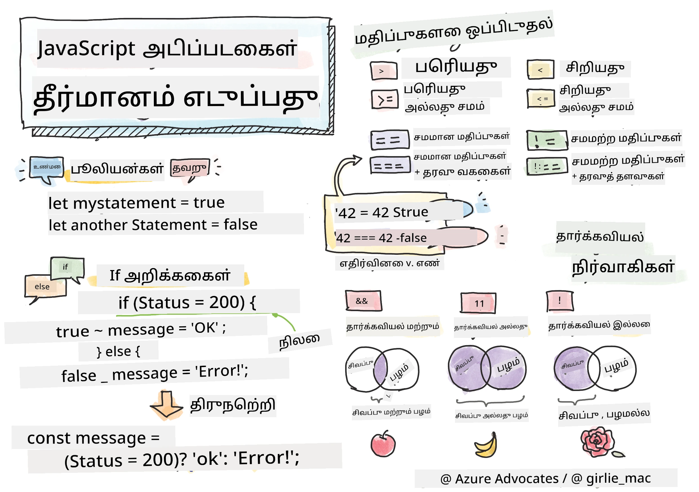

> ஸ்கெட்ச்னோட் [டொமோமி இமுறை](https://twitter.com/girlie_mac) அவர்களால்

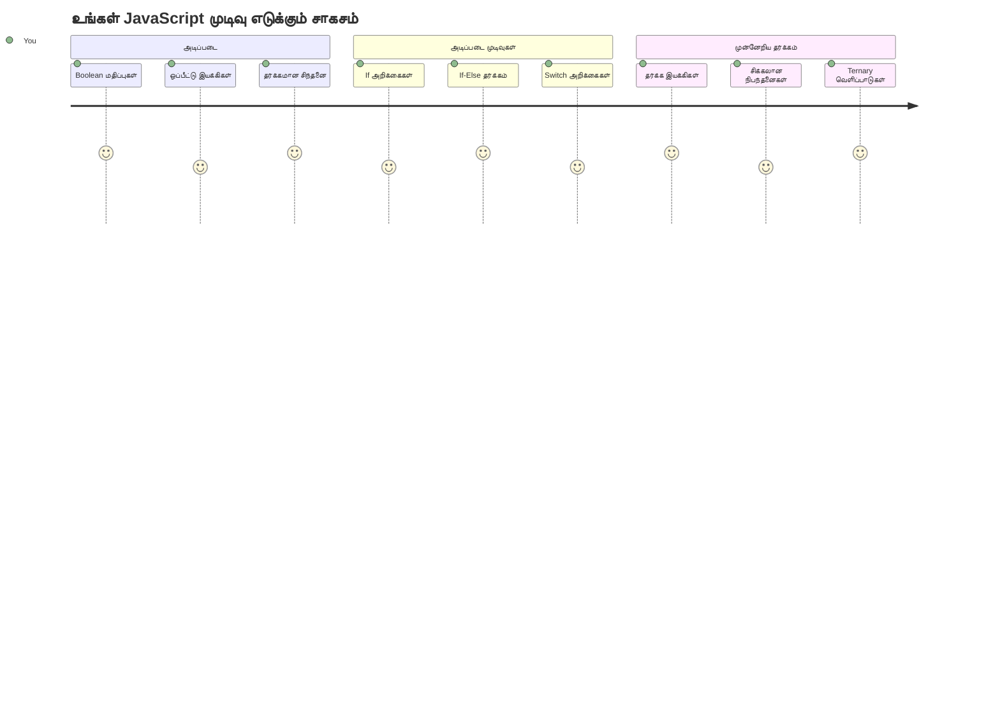
நீங்கள் ஏதாவது செயலிகள் எப்படி புத்திசாலித்தனமாக முடிவெடுக்கின்றன என்று ஆச்சரியப்பட்டிருக்கிறீர்களா? ஒரு வழிப்படுத்தும் அமைப்பு எவ்வாறு வேகமான பாதையை தேர்வு செய்கிறது, அல்லது ஒரு தார்மோஸ்டேட் எப்போது கம்பம் அடைக்க வேண்டும் என்று எவ்வாறு முடிவு செய்கிறது? இது நிரலாக்கத்தில் முடிவெடுக்கும் அடிப்படைக் கருத்து.

சார்ல்ஸ் பாபேஜின் அனாலிடிகல் இன்ஜின் விதிகள் மற்றும் சூழல்களுக்கு ஏற்ப வேறுபட்ட செயல்பாட்டுக் கூறுகளை பின்பற்ற உருவாக்கப்பட்டபோல், நவீன JavaScript சோதனைகள் மாறுபட்ட சூழ்நிலைகளின் அடிப்படையில் தேர்வுகளை மேற்கொள்ள வேண்டும். இந்த கிளைபிரிவு மற்றும் முடிவெடுக்கும் திறன்தான் நிலையான குறியீட்டை பதிலளிக்கும், புத்திசாலி செயலிகளாக மாற்றுகிறது.

இந்த பாடத்தில், உங்கள் நிரல்களில் நிபந்தனை முறைசெய்யலைப் பயன்படுத்த எப்படி என்று கற்கப்போகின்றீர்கள். நிபந்தனை கூற்றுக்கள், ஒப்பிடும் இயக்கிகள், மற்றும் தர்க்கமான வெளிப்பாடுகளை ஆராய்வோம், அவைகள் உங்கள் குறியீட்டுக்கு நிலைகளை மதிப்பீடு செய்து, சரியான முறையில் பதிலளிக்க உதவும்.

## முன்-பாடப் போட்டி

[முன்-பாடப் போட்டி](https://ff-quizzes.netlify.app/web/quiz/11)

முடிவெடுப்பில் திறன் மற்றும் நிரல் ஓட்டத்தை கட்டுப்படுத்தல் என்பது நிரலாக்கத்தின் அடிப்படைக் கூறாகும். இந்த பகுதி Boolean மதிப்புகள் மற்றும் நிபந்தனை முறைசெய்யலை பயன்படுத்தி உங்கள் JavaScript நிகழ்காலந்தங்களின் செயல்பாட்டு பாதையை கட்டுப்படுத்துவது எப்படி என்பதை விளக்குகிறது.

[](https://youtube.com/watch?v=SxTp8j-fMMY "உறுப்புகளைச் செய்யுதல்")

> 🎥 மேற்கண்ட படத்தை அழுத்தி முடிவெடுப்புக்கள் பற்றிய காணொளி பாருங்கள்.

> நீங்கள் இந்த பாடத்தை [Microsoft Learn](https://docs.microsoft.com/learn/modules/web-development-101-if-else/?WT.mc_id=academic-77807-sagibbon) இல் எடுக்கலாம்!

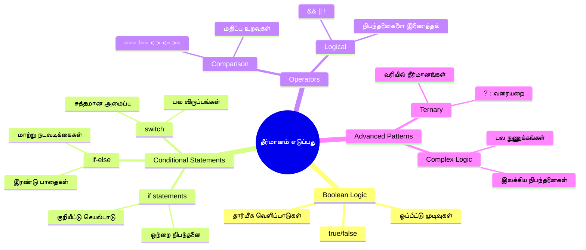
## Boolean பற்றி ஒரு சுருக்கமான விமர்சனம்

முடிவெடுப்பை ஆராய்வதற்கு முன், முந்தைய பாடத்தில் கற்ற Boolean மதிப்புகளை மீண்டும் பார்க்கலாம். கணிதவியலாளர் ஜார்ஜ் பூல் அவர்களின் பெயரை பயன் படுத்தி, இவை இரண்டுகோடான நிலைகளைக் குறிக்கும் - `true` அல்லது `false`. இடைநிலை தவிர வேறெதுவும் இல்லை.

இந்த இரு நிலைகள் அனைத்து கணினி தர்க்கத்தின் அடித்தளம் ஆகின்றன. உங்கள் நிரல் எதுவும் முடிவுகளை எப்போதும் Boolean மதிப்பிற்கு அழுத்துகிறது.

Boolean மாறிகளைக் உருவாக்குவது எளிது:

```javascript
let myTrueBool = true;
let myFalseBool = false;
```

இது இரண்டு Boolean மதிப்புகள் உடைய மாறிகள் உருவாக்குகிறது.

✅ Boolean என்பதற்கு பெயர் பெற்றவர் ஆங்கிலக் கணிதவியலாளர், தத்துவஞானி மற்றும் தர்க்கவியலாளர் ஜார்ஜ் பூல் (1815–1864).

## ஒப்பிடும் இயக்கிகள் மற்றும் Boolean

நீங்கள் வழக்கமாக Boolean மதிப்புகளை கையால் அமைக்க மாட்டீர்கள். அதற்கு பதிலாக, நிபந்தனைகளை மதிப்பீடு செய்வதன் மூலம் அவை உருவாகின்றன: "இந்த எண் அந்த எண்ணைக் கொண்டுவிடுமா?" அல்லது "இந்த மதிப்புகள் இணையாக உள்ளனவா?"

ஒப்பீட்டு இயக்கிகள் இந்த மதிப்பீடுகளை செய்ய உதவுகின்றன. அவை மதிப்புகளை ஒப்பிட்டு, operand இலக ஆல் சார்ந்த Boolean முடிவுகளை நியமிக்கின்றன.

| சின்னம் | விளக்கம்                                                                                                                                                    | உதாரணம்           |
| ------ | ----------------------------------------------------------------------------------------------------------------------------------------------------------- | ----------------- |
| `<`    | **குறைந்தது**: இரண்டு மதிப்புகளை ஒப்பிட்டு, இடது பகுதி மதிப்பு வலது பகுதியை விட குறைவாக இருந்தால் `true` Boolean மதிப்பை தரும்                            | `5 < 6 // true`   |
| `<=`   | **குறைந்தது அல்லது சமம்**: இரண்டு மதிப்புகளை ஒப்பிட்டு, இடது பகுதி மதிப்பு வலது பகுதியை விட குறைவோ அல்லது சமமோ இருந்தால் `true` Boolean தரும்             | `5 <= 6 // true`  |
| `>`    | **பெரியது**: இரண்டு மதிப்புகளை ஒப்பிட்டு, இடது பகுதி மதிப்பு வலது பகுதியை விட பெரியதாக இருந்தால் `true` Boolean தரும்                                      | `5 > 6 // false`  |
| `>=`   | **பெரியது அல்லது சமம்**: இரண்டு மதிப்புகளை ஒப்பிட்டு, இடது பக்கம் மதிப்பு வலது பக்கம் மதிப்பை விட பெரியதாகோ அல்லது சமமோ இருந்தால் `true` Boolean தரும்          | `5 >= 6 // false` |
| `===`  | **கடுமையான சமம்**: இரண்டு மதிப்புகளை ஒப்பிட்டு, இருபுறமும் சமமானதும் AND ஒரே தரவுப் பாணியில் இருந்தால் `true` Boolean தரும்                                  | `5 === 6 // false`|
| `!==`  | **சமமற்றது**: கடுமையான சமம் (===) இயக்கு எதிர்மறையான Boolean மதிப்பினை தரும்                                                                             | `5 !== 6 // true` |

✅ உங்களுடைய அறிவை உலாவியில் சில ஒப்பீட்டுக்களை எழுதிப் பார்க்கவும். எந்தவொரு தரவும் உங்களுக்கு ஆச்சரியமளிக்கிறதா?

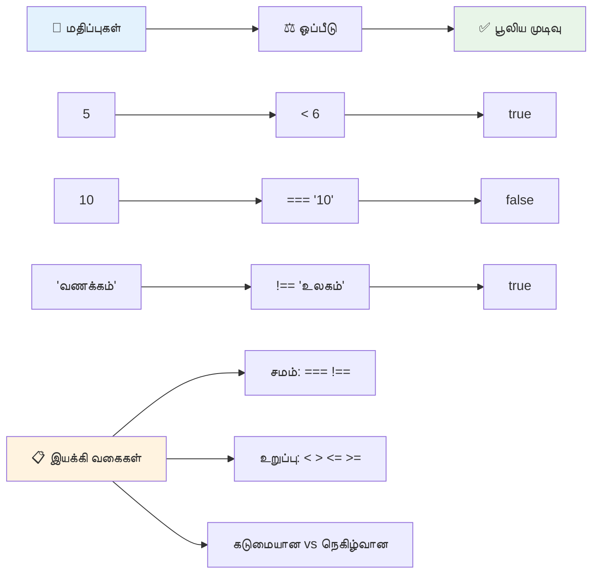
### 🧠 **ஒப்பீட்டு தேர்ச்சி: Boolean தர்க்கத்தை புரிந்துகொள்ளுதல்**

**உங்கள் ஒப்பீட்டை சோதிக்கவும்:**
- பொதுவாக `==` (தடைசாரா சமம்) விட `===` (கடுமையான சமம்) கேள்வி ஏன் மீண்டும் முன்னுரிமைக்குரியது என்று நினைக்கிறீர்கள்?
- `5 === '5'` எந்தப் பதிலை தரும் என்று கணிக்க முடியுமா? `5 == '5'` என்பது?
- `!==` மற்றும் `!=` என்பதினால் என்ன வித்தியாசம் உள்ளது?

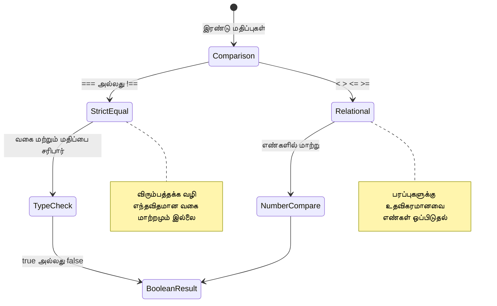
> **ப்ரோ டிப்**: வகை மாற்றம் தேவையில்லை என்றால் எப்போதும் சமப்போதாமையைச் சரிபார்க்க `===` மற்றும் `!==` ஐப் பயன்படுத்துங்கள். இது எதிர்பாராத நடத்தை தடுக்கும்!

## If கூற்று

`if` கூற்று உங்கள் குறியீட்டில் ஒரு கேள்வியை கேட்கும் போல உள்ளது: "இந்த நிபந்தனை சரியானால், இதை செய்யவும்." JavaScript இல் முடிவெடுப்பதற்கான மிக முக்கியமான கருவியாக இது இருக்கிறது.

இது எப்படி இயங்குகிறது:

```javascript
if (condition) {
  // நிபந்தனை உண்மை. இந்த தொகுதியில் உள்ள குறியீடு இயங்கும்.
}
```

நிபந்தனை மரபான உள்ளே வைக்கும், அது `true` ஆக இருந்தால், JavaScript வளையுள்ள அடுக்கில் உள்ள குறியீட்டை ஓட்டும். `false` என்றால், அந்த தொகுதியை தவிர்க்கும்.

இந்த நிபந்தனைகளை உருவாக்க ஒப்பீட்டு இயக்கிகள் பயன்படுத்துவீர்கள். ஒரு நடைமுறை உதாரணம் பார்ப்போம்:

```javascript
let currentMoney = 1000;
let laptopPrice = 800;

if (currentMoney >= laptopPrice) {
  // நிலை உண்மையானது. இந்த பகுதியின் குறியீடு இயங்கும்.
  console.log("Getting a new laptop!");
}
```

`1000 >= 800` என்பது `true` என்பதினால், அந்த தொகுதியின் உள்ளடக்கம் இயக்கப்படுகிறது, "புதிதாக ஒரு லேப்டாப்பை வாங்குதல்!" என்று கான்ஸோலில் காட்டப்படுகிறது.

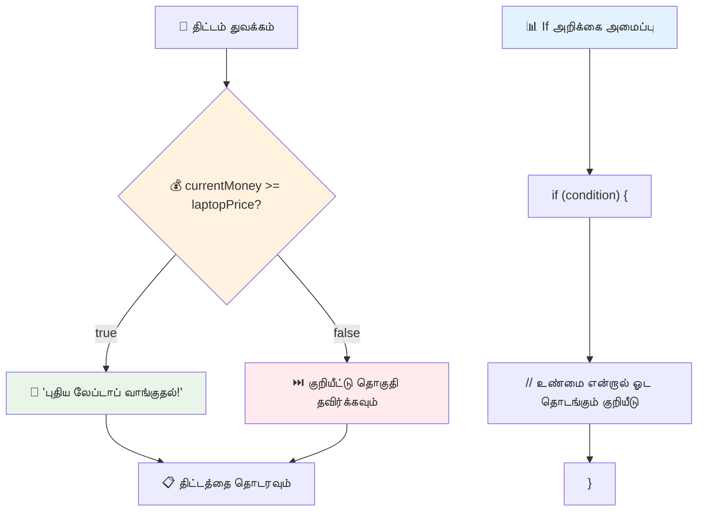
## If..Else கூற்று

ஆனாலும், நிபந்தனை தவறான போது உங்கள் நிரல் வேறு ஒன்றை செய்யவேண்டும் என்றால்? அப்போது `else` பயன்படும் – இது ஒரு போலியாக பிளான் உள்ளது.

`else` கூற்று "இந்த நிபந்தனை தவறு என்றால், இதை செய்யவும்" என்று சொல்ல உதவுகிறது.

```javascript
let currentMoney = 500;
let laptopPrice = 800;

if (currentMoney >= laptopPrice) {
  // நிலை உண்மையாக இருக்கிறது. இந்த தொகுதியில் உள்ள குறியீடு இயக்கப்படும்.
  console.log("Getting a new laptop!");
} else {
  // நிலை பொய்யாக இருக்கிறது. இந்த தொகுதியில் உள்ள குறியீடு இயக்கப்படும்.
  console.log("Can't afford a new laptop, yet!");
}
```

இப்போது கண்டு கொள்ளுங்கள் `500 >= 800` என்பது `false`. எனவே JavaScript முதல் தொகுதியை தவிர்த்து, `else` தொகுதியை இயக்குகிறது. நீங்கள் கான்ஸோலில் "புதிதாக ஒரு லேப்டாப்பை வாங்க இயலாது, இன்னும்!" என்பதைப் பார்வையிடுவீர்கள்.

✅ இந்த குறியீட்டை browser console இல் இயக்கிப் பாருங்கள். currentMoney மற்றும் laptopPrice என்ற மாறி மதிப்புகளை மாற்றி, வெறும் `console.log()` வெளியீட்டை மாற்ற முடியும்.

### 🎯 **If-Else தர்க்கக் கண்காணிப்பு: கிளைபிரிவுகள்**

**நிபந்தனை தர்க்கத்தை சோதிக்கவும்:**
- `currentMoney` மற்றும் `laptopPrice` சமமாவதின் போது என்ன நடக்கும்?
- உண்மைச் சூழ்நிலையில் if-else தர்க்கம் எங்கு பயனுள்ளதாக இருக்கும்?
- பல விலையில் நிலைகளை எப்படி விரிவாக்கிக்கொள்ள முடியும்?

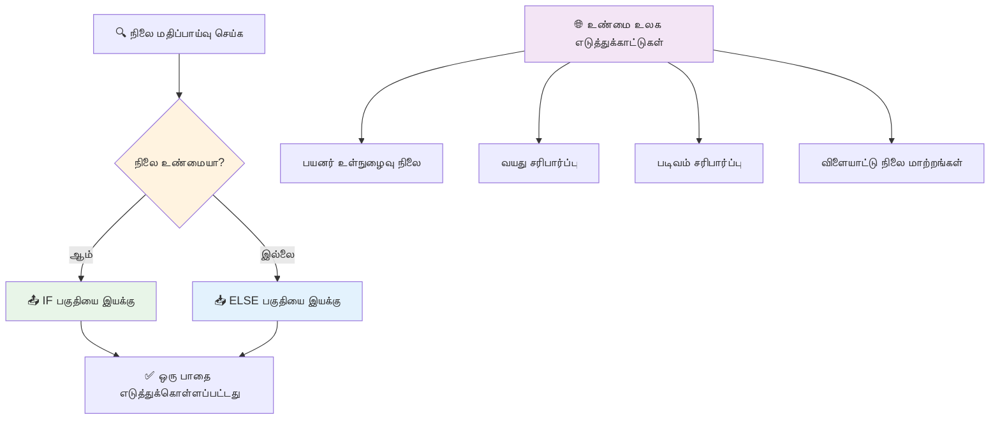
> **முக்கியமான அறிவுரை**: If-else மூலம் ஒரு பாதை மட்டுமே எடுக்கப்படுகிறது. இதனால் உங்கள் நிரல் எந்த நிபந்தனைக்கும் பதில் தருவதை உறுதி செய்கிறது!

## Switch கூற்று

ஒரு மதிப்பை பல விருப்பங்களுக்கு ஒப்பிட வேண்டிய நேரங்களில். நீங்கள் பல if..else statements ஐச் சரணாக்களை பிரித்து பாவித்து நேரத்தை அழிக்கலாம். சுவிட்ச் கூற்று பல தனித்த விருப்பங்களை மேலும் சுத்தமாக நிர்வகிக்க உதவும்.

இதுபோன்றது முதன்முதலில் தொலைபேசி பரிமாற்றங்களில் பயன்படுத்தப்படும் இயந்திர மாற்றும் முறைமை போல – ஒரே உள்ளீட்டு மதிப்பு எதுவென்று என்பதை கண்டுபிடித்து அந்த பாதையை தேர்வு செய்கிறது.

```javascript
switch (expression) {
  case x:
    // குறியீட்டு தொகுதி
    break;
  case y:
    // குறியீட்டு தொகுதி
    break;
  default:
    // குறியீட்டு தொகுதி
}
```

இது எப்படி அமைக்கப்பட்டுள்ளது:
- JavaScript பகுப்பாய்வை ஒருமுறை செய்கிறது
- ஒவ்வொரு `case` ஐ பொருத்தி தேடுகிறது
- பொருத்தம் கிடைத்தால் அதை இயக்குகிறது
- `break` JavaScript ஐ நிறுத்தி சுவிட்ச் இருந்து வெளியேற்றுகிறது
- பொருத்தம் இல்லாதால் `default` தொகுதியை இயக்கும் (உடனிருந்தால்)

```javascript
// வாரத்தின் நாளிற்காக சுவிட்ச் பிரிவு பயன்படுத்தும் პროგრამ்
let dayNumber = 2;
let dayName;

switch (dayNumber) {
  case 1:
    dayName = "Monday";
    break;
  case 2:
    dayName = "Tuesday";
    break;
  case 3:
    dayName = "Wednesday";
    break;
  default:
    dayName = "Unknown day";
    break;
}
console.log(`Today is ${dayName}`);
```

இந்த உதாரணத்தில், JavaScript `dayNumber` ஐ `2` என்றும் பார்க்கிறது, அதனால் பொருத்தப்பட்ட `case 2` ஐ கண்டுபிடித்து `dayName` ஐ "செவ்வாய்" என அமைக்கிறது, பின்னர் சுவிட்ச் இருந்து வெளியேறும். விளைவாக கான்ஸோலில் "இன்று செவ்வாய்" என்பதைக் காணலாம்.

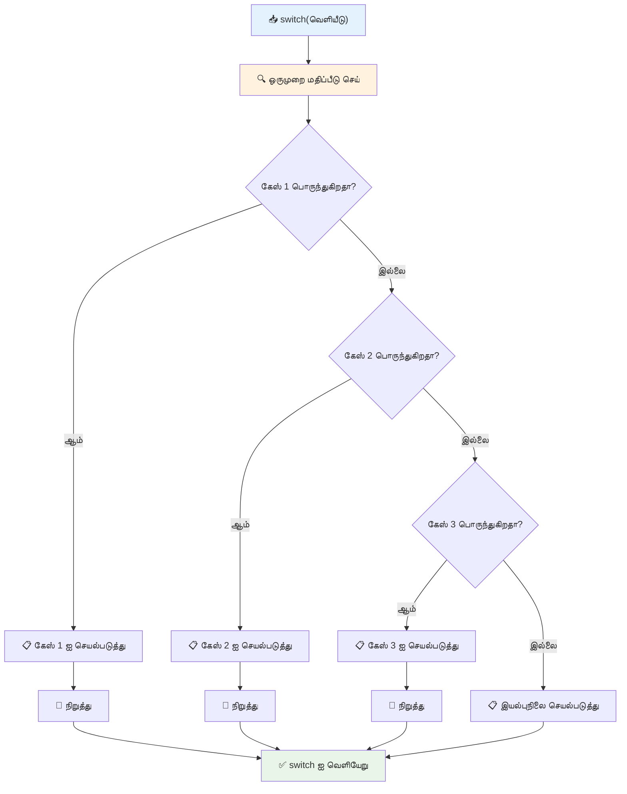
✅ இந்த குறியீட்டையும் கீழ்க்காணும் குறியீட்டையும் browser console இல் இயக்கிப் பாருங்கள். `a` மாறியின் மதிப்பை மாற்றி  `console.log()` வெளியீட்டை மாற்றிக்கொள்ளவும்.

### 🔄 **Switch கூற்று தேர்ச்சி: பல விருப்புகள்**

**நீங்கள் switch விளக்கத்தைச் சோதிக்கவும்:**
- `break` குறித்து மறந்தால் என்ன நடக்கும்?
- பல `if-else` statements மாற்றாக 언제 switch ஐப் பயன்படுத்துவது?
- உங்கள் எல்லா வாய்ப்புகளையும் மீட்டுக்கொண்டாலும் `default` வழக்கு எப்படி பயனுள்ளதாக இருக்கும்?

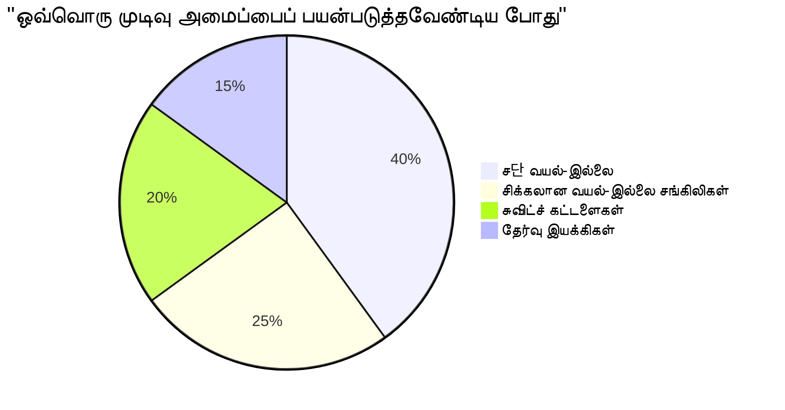
> **சிறந்த நடைமுறை**: ஒரு மாறியை பல தனித்த தன்மைகள் தொடர்பில் ஒப்பிடும்போது `switch` பயன்படுத்தவும். வரம்புகள் அல்லது சிக்கலான நிபந்தனைகளுக்கு `if-else` பயன்படுத்து!

## தர்க்க ஒப்பீடு இயக்கிகள் மற்றும் Boolean

சிக்கலான முடிவுகள் பல நிபந்தனைகளை ஒரே நேரத்தில் மதிப்பீடு செய்ய தேவைப்படுகிறது. Boolean புவி கணிதவியலாளர்கள் தர்க்க வெளிப்பாடுகளை இணைக்கும் போல, நிரலாக்கத்தில் தர்க்க இயக்கிகள் பயன்படுகிறது.

இதுவே சிக்கலான நிபந்தனை தர்க்கத்தை உருவாக்கும், எளிய `true/false` மதிப்பீடுகளை கூட்டுகின்றது.

| சின்னம் | விளக்கம்                                                                                     | உதாரணம்                                                                   |
| ------ | --------------------------------------------------------------------------------------------- | ------------------------------------------------------------------------- |
| `&&`   | **தர்க்கமான AND**: இரண்டு Boolean வெளிப்பாடுகளைக் ஒப்பிடுகிறது. இரு பக்கங்களும் true ஆக இருந்தால் மட்டுமே true தருகிறது | `(5 > 3) && (5 < 10) // இரு பக்கங்களும் true. true திரும்பும்`     |
| `\|\|` | **தர்க்கமான OR**: இரண்டு Boolean வெளிப்பாடுகளை ஒப்பிடுகிறது. குறைந்தது ஒரு புறமும் true என்றால் true தருகிறது       | `(5 > 10) \|\| (5 < 10) // ஒன்று false, மற்றொன்று true. true திரும்பும்`  |
| `!`    | **தர்க்க NOT**: ஒரு Boolean வெளிப்பாட்டின் மாறுபட்ட மதிப்பை தருகிறது                            | `!(5 > 10) // 5 10க்கு பெரியதல்ல, அதனால் "!" அதனை true ஆக்கும்`                      |

இந்த இயக்கிகள் நிபந்தனைகளை பயனுள்ள வழிகளில் இணைக்க உதவுகிறது:
- AND (`&&`) என்று இரண்டும் true ஆக வேண்டியது
- OR (`||`) என்று குறைந்தது ஒன்று true ஆகவேண்டும்  
- NOT (`!`) எனில் true ஐ false ஆக மாற்றுதல் (மற்றும் அதற்குப் பின்)

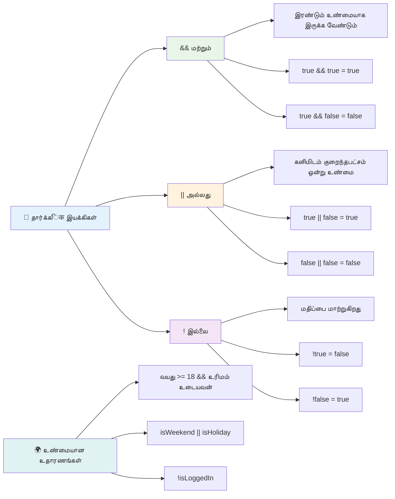
## தர்க்க இயக்கிகளுடன் நிபந்தனைகள் மற்றும் முடிவுகள்

இப்போது இந்த செயற்கூறுகளுக்கு ஒரு நம்பகமான உதாரணத்தில் பார்க்கலாம்:

```javascript
let currentMoney = 600;
let laptopPrice = 800;
let laptopDiscountPrice = laptopPrice - (laptopPrice * 0.2); // 20 சதவீத தள்ளுபடியுடன் லேப்டாப் விலை

if (currentMoney >= laptopPrice || currentMoney >= laptopDiscountPrice) {
  // நிலை உண்மை. இந்த தொகுதியில் உள்ள குறியீடு இயங்கி விடும்.
  console.log("Getting a new laptop!");
} else {
  // நிலை பொய். இந்த தொகுதியில் உள்ள குறியீடு இயங்கி விடும்.
  console.log("Can't afford a new laptop, yet!");
}
```

இந்த உதாரணத்தில்: நாம் ஒரு 20% தள்ளுபடி விலையை (640) கணக்கிடுகின்றோம், பின்னர் முழு விலை அல்லது தள்ளுபடி விலை கொடுக்கப்படும் பணம் போதுமானதா என்று மதிப்பீடு செய்கின்றோம். 600 பழுது தள்ளுபடி விலைக்கு கீழானதால், நிபந்தனை true ஆக மதிப்பிடப்படுகிறது.

### 🧮 **தர்க்க இயக்கிகள் சோதனை: நிபந்தனைகளை இணைத்தல்**

**உங்கள் Logical operator புரிதலை சரிபார்க்கவும்:**
- `A && B` என்ற வெளிப்பாட்டில் A false என்றால் என்ன olur? B கண்டிப்பா மதிப்பிடப்படுமா?
- நீங்கள் எந்தச் சூழ்நிலையிலும் மூன்றுவிதமான இயக்கிகளையும் (&&, ||, !) ஒருங்கிணைக்க வேண்டியதோ?
- `!user.isActive` மற்றும் `user.isActive !== true` என்பதுக்கு என்ன வித்தியாசம் உள்ளது?

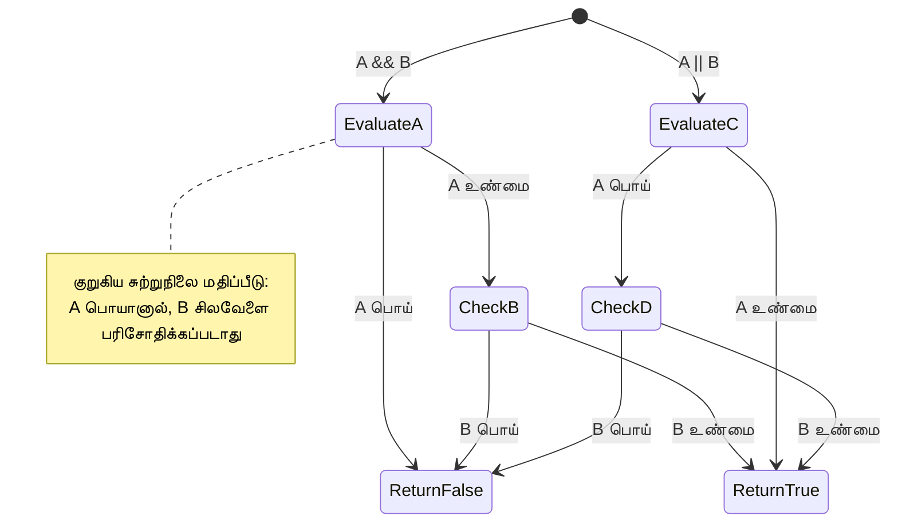
> **செயல்திறன் குறிப்பு**: JavaScript "short-circuit evaluation" ஐ பயன்படுத்துகிறது - `A && B` இல் A false ஆனால், B மதிப்பிடப்படாது. இதை உங்கள் நன்மைக்காக பயன்படுத்துங்கள்!

### மறுப்புச் செயலி (Negation Operator)

சில சமயங்களில் எதுவும் true இல்லாத போது குறித்தது எப்படி என்று தெரியவேண்டும். உதாரணமாக, "பயனர் பயன்படுத்தி உள்ளாரா?" என்ற கேள்வி பதிலுக்கு பதிலாக "பயனர் பயன்படுத்தவில்லை என்றாலே என்ன?" என்று கேட்கலாம். `!` செயலி உங்கள் தர்க்கதை மாற்றி விடும்.

```javascript
if (!condition) {
  // நிபந்தனை தவறானால் இயங்கும்
} else {
  // நிபந்தனைச் சேர்ந்தால் இயங்கும்
}
```

`!` செயலி "எதிர்மறை..." என்பது போல – எதுவும் true ஆக இருந்தால், `!` அதை false ஆக மாற்றும், மற்றும் மாறாகவும்.

### முக்கோணம் வெளியீடுகள் (Ternary Expressions)

எளிய நிபந்தனை ஒதுக்கீடுகளுக்காக JavaScript **முக்கோணம் செயலி (ternary operator)** வழங்குகிறது. இந்த சுருக்கமான வழியால் ஒரு வரியில் நிபந்தனையை எழுதலாம், இது ஒரு நிபந்தனை முடிவில் இரண்டு மதிப்புகளில் ஒன்றை ஒதுக்க தேவையெனில் பயனுள்ளது.

```javascript
let variable = condition ? returnThisIfTrue : returnThisIfFalse;
```

இது ஒரு கேள்வி போல வாசிக்கிறது: "இந்த நிபந்தனை சரியா? ஆம் என்றால் இந்த மதிப்பை பயன்படுத்து. இல்லையென்றால் அதை பயன்படுத்து."

கீழே ஒரு விழிப்புணர்வு உதாரணம் உள்ளது:

```javascript
let firstNumber = 20;
let secondNumber = 10;
let biggestNumber = firstNumber > secondNumber ? firstNumber : secondNumber;
```

✅ இந்த குறியீட்டை சில முறை படித்து பாருங்கள். இந்த இயக்கிகள் எப்படி இயங்குகின்றன என்பதை புரிந்துகொள்ளுகிறீர்களா?

இந்த வரி என்ன சொல்கிறது: "`firstNumber` `secondNumber` ஐவிட பெரியதா? ஆம் என்றால், `biggestNumber` க்கு `firstNumber` வை வைத்துக் கொள். இல்லை என்றால் `secondNumber` வை வைக்கும்."

முக்கோணம் செயலி, இந்த பாரம்பரிய `if..else` கூற்றை சுருக்கி எழுதும் வழி:

```javascript
let biggestNumber;
if (firstNumber > secondNumber) {
  biggestNumber = firstNumber;
} else {
  biggestNumber = secondNumber;
}
```

இரு முறைகளும் இதே விளைவுகளை அளிக்கின்றன. முக்கோணம் செயலி சுருக்கமானதாக இருக்கிறது, ஆனால் கடினமான நிபந்தனைகளுக்கு பாரம்பரிய if-else வடிவம் வாசிக்கமுடியுமென்பதால் பயனுள்ளதாக இருக்கலாம்.

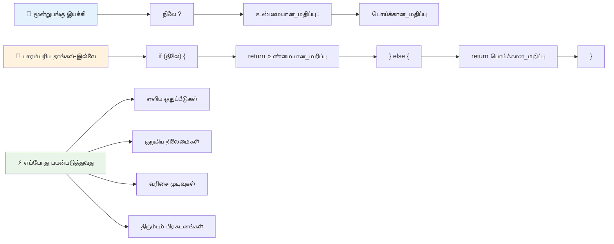
---


## 🚀 சவால்

முதலில் தர்க்க இயக்கிகள் கொண்டு நிரல் எழுதவும், பிறகு முக்கோணம் வெளிப்பாடு கொண்டு அதே நிரலை மீண்டும் எழுதவும். உங்கள் விருப்பமான வடிவமைப்புப் போது என்ன?

---

## GitHub Copilot Agent சவால் 🚀

Agent அமைப்பைப் பயன்படுத்தி பின்வரும் சவால்களைக் கைகொள்ளவும்:

**விளக்கம்:** இந்த பாடத்தில் கற்ற if-else கூற்று, switch கூற்று, logical operators மற்றும் ternary expressions உட்பட பல முடிவெடுப்புச் கருத்துக்களை ஒருங்கிணைக்கும் ஒரு விரிவான தரமதிப்பீட்டாளர் நிரலை உருவாக்குக.

**உரையாடல்:** ஒரு மாணவனின் எண் மதிப்பை (0-100) பெற்று, கீழ்காணும் படி எழுத்து மதிப்பை கண்டறியும் JavaScript நிரலை எழுது:
- A: 90-100
- B: 80-89  
- C: 70-79
- D: 60-69
- F: 60க்கு கீழ்

தேவைகள்:
1. எழுத்து தரத்தைத் தீர்மானிக்க if-else கூற்றைப் பயன்படுத்துங்கள்
2. மாணவர் தேர்ச்சி பெறுகிறாரா என்று சரிபார்க்க தர்க்க ஒப்புருவிகளைப் பயன்படுத்தவும் (மதிப்பெண் >= 60) மற்றும் மாணவர் தேர்ச்சி சிறப்பு பெற்றிருக்கிறாரா (மதிப்பெண் >= 90)
3. ஒவ்வொரு எழுத்து மதிப்பிற்கும் தனித்துவமான பின்னூட்டத்தை வழங்க switch அறிக்கையைப் பயன்படுத்தவும்
4. மாணவர் அடுத்த பாடத்துக்குப் பதவி தகுதி உள்ளாரா என்று தீர்மானிக்க ternary operator ஐப் பயன்படுத்தவும் (மதிப்பெண் >= 70)
5. மதிப்பெண் 0 மற்றும் 100 இடையே இருப்பதை உறுதிப்படுத்த உள்ளீட்டு சரிபார்ப்பைச் சேர்க்கவும்

59, 60, 89, 90 போன்ற எல்லைக்கிராம மதிப்புகள் மற்றும் தவறான உள்ளீடுகளை உள்ளடக்கிய பல்வேறு மதிப்பெண்களுடன் உங்கள் நிரலை சோதிக்கவும்.

[agent mode](https://code.visualstudio.com/blogs/2025/02/24/introducing-copilot-agent-mode) பற்றி மேலும் அறியவும்.


## பாடத்துக்குப் பிறகு கூத்து

[பாடத்துக்குப் பிறகு கூத்து](https://ff-quizzes.netlify.app/web/quiz/12)

## விமர்சனம் மற்றும் சுயபடிப்பு

பயனருக்கு கிடைக்கும் பல்வேறு இயக்கிகளைப் பற்றி மேலும் படிக்க [MDN இல்](https://developer.mozilla.org/docs/Web/JavaScript/Reference/Operators).

ஜோஷ் கொண்டிருக்கும் அருமையான [operator lookup](https://joshwcomeau.com/operator-lookup/) ஐப் படியுங்கள்!

## ஒதுக்கீடு

[இயக்கிகள்](assignment.md)

---

## 🧠 **உங்கள் தீர்மானம் எடுக்கும் கருவிகளுக்கான சுருக்கம்**

```mermaid
graph TD
    A["🎯 JavaScript முடிவுகள்"] --> B["🔍 பூலைன் துருத்தம்"]
    A --> C["📊 நிபந்தனை அறிக்கைகள்"]
    A --> D["🔗 தர்க்க செயலிகள்"]
    A --> E["⚡ மேம்பட்ட வடிவங்கள்"]
    
    B --> B1["true/false மதிப்புகள்"]
    B --> B2["தெரிவி செயலிகள்"]
    B --> B3["சত্যத்தன்மை கருத்துக்கள்"]
    
    C --> C1["if அறிக்கைகள்"]
    C --> C2["if-else சங்கிலிகள்"]
    C --> C3["switch அறிக்கைகள்"]
    
    D --> D1["&& (AND)"]
    D --> D2["|| (OR)"]
    D --> D3["! (NOT)"]
    
    E --> E1["முப்பக்க செயலி"]
    E --> E2["சுருக்கமான மதிப்பீடு"]
    E --> E3["சிக்கலான நிபந்தனைகள்"]
    
    F["💡 முக்கிய கொள்கைகள்"] --> F1["தெளிவான வாசிக்கக்கூடிய நிபந்தனைகள்"]
    F --> F2["ஒழுங்குபடுத்தப்பட்ட துருத்து முறைமை"]
    F --> F3["சரி செயலி முன்னுரிமை"]
    F --> F4["திறம்பட மதிப்பீடு வரிசை"]
    
    style A fill:#e3f2fd
    style B fill:#e8f5e8
    style C fill:#fff3e0
    style D fill:#f3e5f5
    style E fill:#e0f2f1
    style F fill:#fce4ec
```
---

## 🚀 உங்கள் JavaScript தீர்மானம் எடுக்கும் திறன் நோக்கு கால அட்டவணை

### ⚡ **அடுத்த 5 நிமிடங்களில் நீங்கள் என்ன செய்யலாம்**
- [ ] உலாவி கன்சோலில் ஒப்பீட்டு இயக்கிகளைப் பயிற்சி செய்யவும்
- [ ] உங்கள் வயதைச் சரிபார்க்க ஒரு எளிய if-else வாக்கியத்தை எழுதவும்
- [ ] ஒரு if-else ஐ ternary operator பயன்படுத்தி மறுஅழைக்கவும்
- [ ] வெவ்வேறு "true" மற்றும் "false" மதிப்புகளுடன் என்ன நடக்கிறதென்பதை பரிசோதிக்கவும்

### 🎯 **இந்த மணிநேரத்தில் நீங்கள் எதை அடைய முடியும்**
- [ ] பாடத்துக்குப் பிறகு கூத்தான்னை முடித்து குழப்பமான கருத்துக்களை மறுபரிசீலனை செய்யவும்
- [ ] GitHub Copilot சவாலை மேற்கொண்டு முழுமையான மதிப்பெண் கண்காணிப்பாளரை உருவாக்கவும்
- [ ] حقیقي உலக சூழலுக்கு ஒரு எளிய தீர்மான மரத்தை உருவாக்கவும் (எ.கா., எதை அணியவேண்டும் என்பது போன்றது)
- [ ] பல நிபந்தனைகளை தர்க்க இயக்கிகளுடன் இணைத்து பயிற்சி செய்யவும்
- [ ] பல்வேறு பயன்பாடுகளுக்கு switch அறிக்கையுடன் முயற்சி செய்யவும்

### 📅 **உங்கள் வாரநாள் தர்க்க திறனுக்கு**
- [ ] சிந்தனையுடைய உதாரணங்களுடன் இயக்கிகள் ஒதுக்கீடு முடிக்கவும்
- [ ] பல்வேறு நிபந்தனை அமைப்புகளைப் பயன்படுத்தி ஒரு சிறிய கூத்து செயலியை உருவாக்கவும்
- [ ] பல உள்ளீட்டு நிபந்தனைகளை சரிபார்க்கும் படிவ சரிபார்ப்பாளரை உருவாக்கவும்
- [ ] ஜோஷ் கொண்டிருக்கும் [operator lookup](https://joshwcomeau.com/operator-lookup/)வினையைப் பயிற்சி செய்யவும்
- [ ] உள்ளிருக்கும் குறியீட்டைக் கூடுதல் பொருத்தமான நிபந்தனை அமைப்புகளுக்கு மாற்றவும்
- [ ] குறுக்குவழி மதிப்பீடு மற்றும் செயல்திறன் விளைவுகளைப் படிக்கவும்

### 🌟 **உங்கள் மாதாந்திர மாற்றம்**
- [ ] சிக்கலான நெடுக்களுக்குள் நிபந்தனைகளை சரியாக கையாள்ந்து குறியீட்டுப் படிப்பை நீண்டநீண்ட பராமரிக்கவும்
- [ ] சிக்கலான தீர்மானம் எடுக்கும் தர்க்கத்துடன் ஒரு செயலியை உருவாக்கவும்
- [ ] உள்ளிருக்கும் திட்டங்களில் நிபந்தனைத் தர்க்கத்தை மேம்படுத்தும் வகையில் திறந்த மூலத்திற்கு பங்களிக்கவும்
- [ ] வேறு யாராவது நிபந்தனை அமைப்புகள் மற்றும் அவற்றை எப்போது பயன்படுத்துவது என்பதில் அறிவுரையளிக்கவும்
- [ ] நிபந்தனைத் தர்க்கத்திற்கு செயல்பாட்டு நிரலாக்க அணுகுமுறைகளை ஆராயவும்
- [ ] நிபந்தனை சிறந்த நடைமுறைகளுக்கான தனிப்பட்ட குறிப்பு கையேட்டை உருவாக்கவும்

### 🏆 **இறுதி தீர்மானம் எடுக்கும் சாம்பியனுக்கான சரிபார்ப்பு**

**உங்கள் தர்க்கத் திறனை கொண்டாடுங்கள்:**
- நீங்கள் வெற்றிகரமாக அமல்படுத்திய மிகவும் சிக்கலான தீர்மானம் என்ன?
- எந்த நிபந்தனை அமைப்பு உங்களுக்கு மிகவும் இயல்பானதாக தோன்றுகிறது மற்றும் ஏன்?
- தர்க்க இயக்கிகள் பற்றி கற்றல் உங்கள் பிரச்சனை தீர்க்கும் முறையை எப்படி மாற்றியது?
- எந்தவொரு உண்மையான பயன்பாடு நுட்பமான தீர்மான தூண்டுதல் தர்க்கத்தைக் பெறும்?

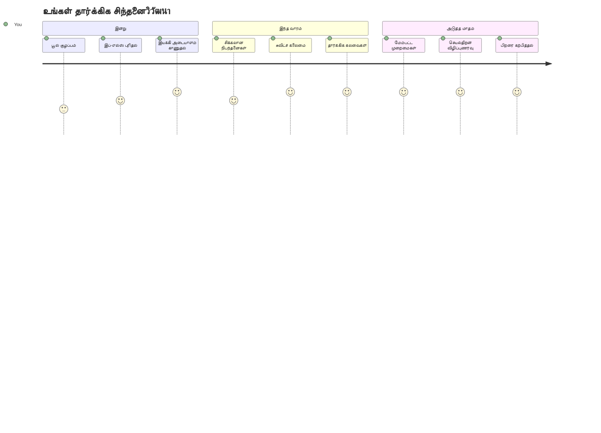
> 🧠 **நீங்கள் டிஜிட்டல் தீர்மானம் எடுக்கும் கலை நுண்ணறிவை கைவரிசை செய்துள்ளீர்கள்!** ஒவ்வொரு இடைமுக செயலியும் நுண்ணறிவான பதிலளிக்க நிபந்தனைத் தர்க்கத்தைப் பயன்படுத்துுகின்றன. இப்போது உங்கள் நிரல்களை எப்படி சிந்திக்க, மதிப்பீடு செய்ய, மற்றும் பொருத்தமான பதில்களைத் தேர்ந்தெடுக்க கற்றுள்ளீர்கள். இந்த தர்க்க அடித்தளம் நீங்கள் உருவாக்கும் ஒவ்வொரு இயக்க மதிப்பெணுக்கும் வல்லுநராக அமைக்கும்! 🎉

---

<!-- CO-OP TRANSLATOR DISCLAIMER START -->
**வரட்டுத்தகவு**:  
இந்தக் குறிப்புரை [Co-op Translator](https://github.com/Azure/co-op-translator) என்ற எய்ஐ மொழிபெயர்ப்பு சேவையைப் பயன்படுத்து மாக மொழிபெயர்க்கப்பட்டது. நாம் துல்லியத்திற்காக முயற்சித்தாலும், தானாக மொழிபெயர்ப்பு செய்யப்படுவதால் பிழைகள் அல்லது தவறுகள் இருக்கக்கூடும் என்பதை தயவுசெய்து உணர்ந்துக்கொள்ளவும். அசல் ஆவணம் அதன் தாய்மொழியில் அதிகாரபூர்வமான மூலமாக கருதப்பட வேண்டும். முக்கிய தகவல்களுக்கு, தொழில்முறை மனித மொழிபெயர்ப்பு பரிந்துரைக்கப்படுகிறது. இந்த மொழிபெயர்ப்பைப் பயன்படுத்துவதால் ஏற்பட்ட எந்த தவறான புரிதல்களுக்கும் அல்லது தவறான விளக்கங்களுக்கு நாங்கள் பொறுப்பாளர்கள் அல்ல.
<!-- CO-OP TRANSLATOR DISCLAIMER END -->