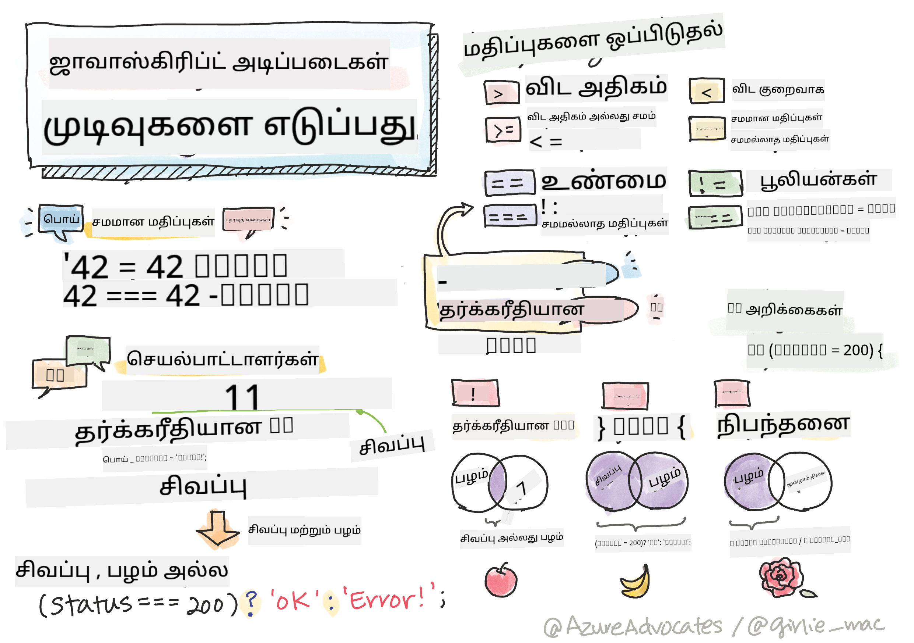

<!--
CO_OP_TRANSLATOR_METADATA:
{
  "original_hash": "f7009631b73556168ca435120a231c98",
  "translation_date": "2025-10-11T11:45:20+00:00",
  "source_file": "2-js-basics/3-making-decisions/README.md",
  "language_code": "ta"
}
-->
# ஜாவாஸ்கிரிப்ட் அடிப்படைகள்: முடிவுகளை எடுப்பது



> ஸ்கெட்ச் நோட்: [Tomomi Imura](https://twitter.com/girlie_mac)

## முன்-வகுப்பு வினாடி வினா

[முன்-வகுப்பு வினாடி வினா](https://ff-quizzes.netlify.app/web/quiz/11)

முடிவுகளை எடுப்பது மற்றும் உங்கள் கோடுகள் எந்த வரிசையில் இயங்க வேண்டும் என்பதை கட்டுப்படுத்துவது உங்கள் கோடுகளை மீண்டும் பயன்படுத்தக்கூடியதாகவும் வலுவாகவும் மாற்றுகிறது. இந்த பகுதி ஜாவாஸ்கிரிப்டில் தரவோட்டத்தை கட்டுப்படுத்தும் சின்டாக்ஸ் மற்றும் அது புலியன் தரவுகளுடன் பயன்படுத்தப்படும் போது அதன் முக்கியத்துவத்தை கையாளுகிறது.

[](https://youtube.com/watch?v=SxTp8j-fMMY "முடிவுகளை எடுப்பது")

> 🎥 மேலே உள்ள படத்தை கிளிக் செய்து முடிவுகளை எடுப்பது பற்றிய வீடியோவைப் பாருங்கள்.

> இந்த பாடத்தை [Microsoft Learn](https://docs.microsoft.com/learn/modules/web-development-101-if-else/?WT.mc_id=academic-77807-sagibbon) இல் எடுத்துக்கொள்ளலாம்!

## புலியன்கள் பற்றிய சுருக்கமான மீள்பார்வை

புலியன்கள் இரண்டு மதிப்புகளைக் கொண்டிருக்க முடியும்: `true` அல்லது `false`. புலியன்கள் குறிப்பிட்ட நிலைமைகள் பூர்த்தி செய்யப்படும் போது எந்த கோடுகள் இயங்க வேண்டும் என்பதை முடிவு செய்ய உதவுகின்றன.

உங்கள் புலியனை true அல்லது false ஆக அமைக்க இதைப் போல எழுதுங்கள்:

`let myTrueBool = true`
`let myFalseBool = false`

✅ புலியன்கள் ஆங்கில கணிதவியலாளர், தத்துவஞானி மற்றும் தர்க்கவியலாளர் ஜார்ஜ் புல் (1815–1864) அவர்களின் பெயரால் அழைக்கப்படுகின்றன.

## ஒப்பீட்டு ஆபரேட்டர்கள் மற்றும் புலியன்கள்

ஆபரேட்டர்கள் நிலைமைகளை மதிப்பீடு செய்ய பயன்படுத்தப்படுகின்றன, இது புலியன் மதிப்பை உருவாக்கும் ஒப்பீடுகளைச் செய்கின்றன. அடிக்கடி பயன்படுத்தப்படும் ஆபரேட்டர்களின் பட்டியல் கீழே உள்ளது.

| சின்னம் | விளக்கம்                                                                                                                                                   | உதாரணம்            |
| ------ | ------------------------------------------------------------------------------------------------------------------------------------------------------------- | ------------------ |
| `<`    | **குறைந்தது**: இரண்டு மதிப்புகளை ஒப்பிட்டு, இடது பக்கம் வலது பக்கத்தை விட குறைவாக இருந்தால் `true` புலியன் தரவுவகையை திருப்புகிறது                              | `5 < 6 // true`    |
| `<=`   | **குறைந்தது அல்லது சமம்**: இரண்டு மதிப்புகளை ஒப்பிட்டு, இடது பக்கம் வலது பக்கத்தை விட குறைவாக அல்லது சமமாக இருந்தால் `true` புலியன் தரவுவகையை திருப்புகிறது      | `5 <= 6 // true`   |
| `>`    | **அதிகம்**: இரண்டு மதிப்புகளை ஒப்பிட்டு, இடது பக்கம் வலது பக்கத்தை விட அதிகமாக இருந்தால் `true` புலியன் தரவுவகையை திருப்புகிறது                         | `5 > 6 // false`   |
| `>=`   | **அதிகம் அல்லது சமம்**: இரண்டு மதிப்புகளை ஒப்பிட்டு, இடது பக்கம் வலது பக்கத்தை விட அதிகமாக அல்லது சமமாக இருந்தால் `true` புலியன் தரவுவகையை திருப்புகிறது | `5 >= 6 // false`  |
| `===`  | **கடுமையான சமம்**: இரண்டு மதிப்புகளை ஒப்பிட்டு, வலது மற்றும் இடது பக்க மதிப்புகள் சமமாகவும் அதே தரவுவகையாகவும் இருந்தால் `true` புலியன் தரவுவகையை திருப்புகிறது       | `5 === 6 // false` |
| `!==`  | **சமமல்லாதது**: இரண்டு மதிப்புகளை ஒப்பிட்டு, கடுமையான சமம் ஆபரேட்டர் திருப்பும் புலியன் மதிப்பின் எதிர்மறை மதிப்பை திருப்புகிறது                                    | `5 !== 6 // true`  |

✅ உங்கள் உலாவியின் கன்சோலில் சில ஒப்பீடுகளை எழுதுவதன் மூலம் உங்கள் அறிவைச் சரிபார்க்கவும். திருப்பப்பட்ட தரவுகளில் ஏதேனும் உங்களை ஆச்சரியப்படுத்துகிறதா?

## If அறிக்கை

If அறிக்கை அதன் பிளாக்குகளுக்குள் உள்ள கோடுகளை நிலைமை true ஆக இருந்தால் இயக்கும்.

```javascript
if (condition) {
  //Condition is true. Code in this block will run.
}
```

தர்க்க ஆபரேட்டர்கள் அடிக்கடி நிலைமையை உருவாக்க பயன்படுத்தப்படுகின்றன.

```javascript
let currentMoney;
let laptopPrice;

if (currentMoney >= laptopPrice) {
  //Condition is true. Code in this block will run.
  console.log("Getting a new laptop!");
}
```

## If..Else அறிக்கை

`else` அறிக்கை அதன் பிளாக்குகளுக்குள் உள்ள கோடுகளை நிலைமை false ஆக இருந்தால் இயக்கும். இது `if` அறிக்கையுடன் விருப்பமாக உள்ளது.

```javascript
let currentMoney;
let laptopPrice;

if (currentMoney >= laptopPrice) {
  //Condition is true. Code in this block will run.
  console.log("Getting a new laptop!");
} else {
  //Condition is false. Code in this block will run.
  console.log("Can't afford a new laptop, yet!");
}
```

✅ இந்த கோடுகளை உலாவி கன்சோலில் இயக்குவதன் மூலம் உங்கள் புரிதலைச் சோதிக்கவும். currentMoney மற்றும் laptopPrice மாறிகளின் மதிப்புகளை மாற்றி `console.log()` திருப்பப்பட்டதை மாற்றவும்.

## Switch அறிக்கை

`switch` அறிக்கை பல்வேறு நிலைமைகளின் அடிப்படையில் பல்வேறு செயல்பாடுகளைச் செய்ய பயன்படுத்தப்படுகிறது. `switch` அறிக்கையைப் பயன்படுத்தி செயல்படுத்தப்பட வேண்டிய பல கோடுப் பிளாக்குகளில் ஒன்றைத் தேர்ந்தெடுக்கவும்.

```javascript
switch (expression) {
  case x:
    // code block
    break;
  case y:
    // code block
    break;
  default:
  // code block
}
```

```javascript
// program using switch statement
let a = 2;

switch (a) {
  case 1:
    a = "one";
    break;
  case 2:
    a = "two";
    break;
  default:
    a = "not found";
    break;
}
console.log(`The value is ${a}`);
```

✅ இந்த கோடுகளை உலாவி கன்சோலில் இயக்குவதன் மூலம் உங்கள் புரிதலைச் சோதிக்கவும். மாறி a இன் மதிப்புகளை மாற்றி `console.log()` திருப்பப்பட்டதை மாற்றவும்.

## தர்க்க ஆபரேட்டர்கள் மற்றும் புலியன்கள்

முடிவுகள் ஒரே நேரத்தில் பல ஒப்பீடுகளை தேவைப்படுத்தலாம், மேலும் புலியன் மதிப்பை உருவாக்க தர்க்க ஆபரேட்டர்களுடன் இணைக்கப்படலாம்.

| சின்னம் | விளக்கம்                                                                                     | உதாரணம்                                                                 |
| ------ | ----------------------------------------------------------------------------------------------- | ----------------------------------------------------------------------- |
| `&&`   | **தர்க்க AND**: இரண்டு புலியன் வெளிப்பாடுகளை ஒப்பிடுகிறது. இரு பக்கங்களும் true ஆக இருந்தால் மட்டுமே true திருப்புகிறது | `(5 > 6) && (5 < 6 ) //ஒரு பக்கம் false, மற்றது true. false திருப்புகிறது` |
| `\|\|` | **தர்க்க OR**: இரண்டு புலியன் வெளிப்பாடுகளை ஒப்பிடுகிறது. குறைந்தது ஒரு பக்கம் true ஆக இருந்தால் true திருப்புகிறது     | `(5 > 6) \|\| (5 < 6) //ஒரு பக்கம் false, மற்றது true. true திருப்புகிறது` |
| `!`    | **தர்க்க NOT**: புலியன் வெளிப்பாட்டின் எதிர்மறை மதிப்பை திருப்புகிறது                             | `!(5 > 6) // 5 6 ஐ விட அதிகமாக இல்லை, ஆனால் "!" true திருப்பும்`         |

## தர்க்க ஆபரேட்டர்களுடன் நிலைமைகள் மற்றும் முடிவுகள்

If..Else அறிக்கைகளில் நிலைமைகளை உருவாக்க தர்க்க ஆபரேட்டர்களைப் பயன்படுத்தலாம்.

```javascript
let currentMoney;
let laptopPrice;
let laptopDiscountPrice = laptopPrice - laptopPrice * 0.2; //Laptop price at 20 percent off

if (currentMoney >= laptopPrice || currentMoney >= laptopDiscountPrice) {
  //Condition is true. Code in this block will run.
  console.log("Getting a new laptop!");
} else {
  //Condition is true. Code in this block will run.
  console.log("Can't afford a new laptop, yet!");
}
```

### மறுப்பு ஆபரேட்டர்

நீங்கள் இதுவரை `if...else` அறிக்கையைப் பயன்படுத்தி நிபந்தனை தர்க்கத்தை உருவாக்குவது எப்படி என்பதைப் பார்த்தீர்கள். `if` இல் உள்ள எதுவும் true/false ஆக மதிப்பீடு செய்ய வேண்டும். `!` ஆபரேட்டரைப் பயன்படுத்துவதன் மூலம் நீங்கள் வெளிப்பாட்டை _மறுக்கலாம்_. இது இவ்வாறு இருக்கும்:

```javascript
if (!condition) {
  // runs if condition is false
} else {
  // runs if condition is true
}
```

### டெர்னரி வெளிப்பாடுகள்

முடிவு தர்க்கத்தை வெளிப்படுத்த `if...else` மட்டுமல்ல, டெர்னரி ஆபரேட்டர் எனப்படும் மற்றொரு முறையையும் நீங்கள் பயன்படுத்தலாம். அதன் சின்டாக்ஸ் இதைப் போல இருக்கும்:

```javascript
let variable = condition ? <return this if true> : <return this if false>
```

கீழே ஒரு தெளிவான உதாரணம் உள்ளது:

```javascript
let firstNumber = 20;
let secondNumber = 10;
let biggestNumber = firstNumber > secondNumber ? firstNumber : secondNumber;
```

✅ இந்த கோடுகளை சில முறை படிக்க ஒரு நிமிடம் எடுத்துக்கொள்ளுங்கள். இந்த ஆபரேட்டர்கள் எப்படி வேலை செய்கின்றன என்பதை நீங்கள் புரிந்துகொள்கிறீர்களா?

மேலே உள்ளவை குறிப்பிடுகிறது:

- `firstNumber` `secondNumber` ஐ விட பெரியதாக இருந்தால்
- அப்போது `firstNumber` ஐ `biggestNumber` ஆக ஒதுக்கவும்
- இல்லையெனில் `secondNumber` ஐ ஒதுக்கவும்.

டெர்னரி வெளிப்பாடு கீழே உள்ள கோடுகளை எழுதுவதற்கான சுருக்கமான வழியாகும்:

```javascript
let biggestNumber;
if (firstNumber > secondNumber) {
  biggestNumber = firstNumber;
} else {
  biggestNumber = secondNumber;
}
```

---

## 🚀 சவால்

முதலில் தர்க்க ஆபரேட்டர்களுடன் எழுதப்பட்ட ஒரு நிரலை உருவாக்கி, பின்னர் அதை டெர்னரி வெளிப்பாட்டைப் பயன்படுத்தி மறுபடியும் எழுதுங்கள். உங்கள் விருப்பமான சின்டாக்ஸ் எது?

---

## வகுப்புக்குப் பிறகு வினாடி வினா

[வகுப்புக்குப் பிறகு வினாடி வினா](https://ff-quizzes.netlify.app/web/quiz/12)

## மதிப்பாய்வு மற்றும் சுயபயிற்சி

பயனருக்கு கிடைக்கும் பல ஆபரேட்டர்களைப் பற்றி மேலும் [MDN](https://developer.mozilla.org/docs/Web/JavaScript/Reference/Operators) இல் படிக்கவும்.

ஜோஷ் கமோவின் அற்புதமான [ஆபரேட்டர் தேடல்](https://joshwcomeau.com/operator-lookup/) மூலம் செல்லுங்கள்!

## பணிக்கூற்று

[ஆபரேட்டர்கள்](assignment.md)

---

**குறிப்பு**:  
இந்த ஆவணம் [Co-op Translator](https://github.com/Azure/co-op-translator) என்ற AI மொழிபெயர்ப்பு சேவையைப் பயன்படுத்தி மொழிபெயர்க்கப்பட்டுள்ளது. நாங்கள் துல்லியத்திற்காக முயற்சிக்கின்றோம், ஆனால் தானியக்க மொழிபெயர்ப்புகளில் பிழைகள் அல்லது தவறான தகவல்கள் இருக்கக்கூடும் என்பதை தயவுசெய்து கவனத்தில் கொள்ளுங்கள். அதன் தாய்மொழியில் உள்ள மூல ஆவணம் அதிகாரப்பூர்வ ஆதாரமாக கருதப்பட வேண்டும். முக்கியமான தகவல்களுக்கு, தொழில்முறை மனித மொழிபெயர்ப்பு பரிந்துரைக்கப்படுகிறது. இந்த மொழிபெயர்ப்பைப் பயன்படுத்துவதால் ஏற்படும் எந்த தவறான புரிதல்கள் அல்லது தவறான விளக்கங்களுக்கு நாங்கள் பொறுப்பல்ல.