<!--
CO_OP_TRANSLATOR_METADATA:
{
  "original_hash": "1710a50a519a6e4a1b40a5638783018d",
  "translation_date": "2026-01-07T12:49:41+00:00",
  "source_file": "2-js-basics/4-arrays-loops/README.md",
  "language_code": "ta"
}
-->
# ஜாவாஸ்கிரிப்ட் அடிப்படைகள்: வரிசைகள் மற்றும் லூப்புகள்


> ஸ்கெட்ச்நோட் [தொமோமி இமுரா](https://twitter.com/girlie_mac) அவர்களால்

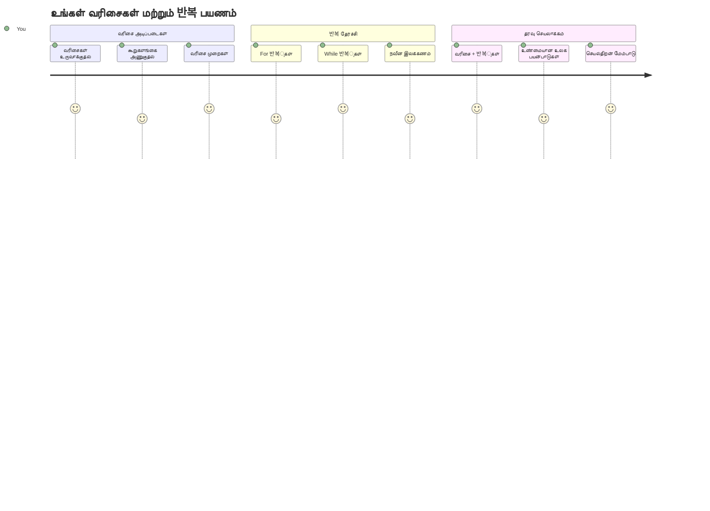
## முன்-வகுப்பு க்விஸ்
[முன்-வகுப்பு க்விஸ்](https://ff-quizzes.netlify.app/web/quiz/13)

வலைத்தளங்கள் எப்படி ஷாப்பிங் கார்ட் பொருட்களை கண்காணிக்கிறார்கள் அல்லது உங்கள் நட்பர்களின் பட்டியலை எவ்வாறு காட்டுகிறார்கள் என்று நீங்கள் யோசித்தீர்களா? அங்கே வரிசைகள் மற்றும் லூப்புகள் உதவுகின்றன. வரிசைகள் என்பது பல தகவல் துண்டுகளை வரும் ஒரு டிஜிட்டல் தொட்டி போன்றவை, லூப்புகள் அந்தத் தகவல்களை மறுபடியும் மீண்டும் எழுதாமல் ஆகச்செய்ய உதவுகின்றன.

இரண்டும் சேர்ந்து உங்கள் திட்டங்களில் தகவலை கையாளும் அடித்தளத்தை உருவாக்குகின்றன. நீங்கள் ஒவ்வொரு படியையும் கையால் எழுதுவதிலிருந்து, நூற்றுக்கணக்கான அல்லது ஆயிரக்கணக்கான பொருட்களை விரைவில் செயலாக்கும் புத்திசாலி, திறமையான குறியீட்டை உருவாக்க கற்றுக்கொள்வீர்கள்.

இந்த பாட முடிவில், குறைந்த வரிகளை கொண்ட குறியீட்டின் மூலம் சிக்கலான தரவு பணிகளை எவ்வாறு செய்யலாம் என்பதைப் புரிந்து கொள்வீர்கள். இந்த அடிப்படையான நிரலாக்க கருத்துக்களை ஆராய்ப்போம்.

[](https://youtube.com/watch?v=1U4qTyq02Xw "Arrays")

[](https://www.youtube.com/watch?v=Eeh7pxtTZ3k "Loops")

> 🎥 மேலே உள்ள படங்களை கிளிக் செய்து வரிசைகள் மற்றும் லூப்புகளின் வீடியோக்களை பார்க்கலாம்.

> இந்த பாடத்துக்கு நீங்கள் [Microsoft Learn](https://docs.microsoft.com/learn/modules/web-development-101-arrays/?WT.mc_id=academic-77807-sagibbon) இல் செல்லலாம்!

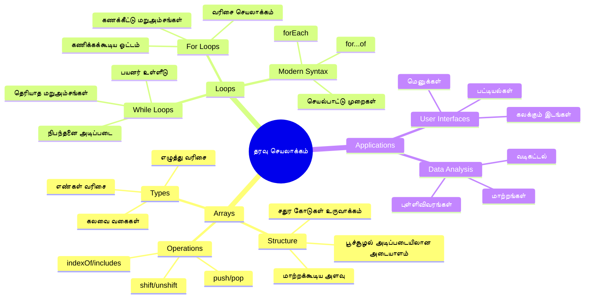
## வரிசைகள்

வரிசைகளை ஒரு டிஜிட்டல் கோப்பு அலமாரி போல எண்ணுங்கள் - ஒவ்வொரு திடலில் ஒரு கோப்பை சேமிப்பதற்கு பதிலாக, ஒரே கட்டமைக்கப்பட்ட தொட்டியில் பல தொடர்புடைய பொருட்களை அமைக்கலாம். நிரலாக்க விதிகள் மூலம், வரிசைகள் பல தகவல் துண்டுகளை ஒரே ஒருங்கிணைந்த தொகுப்பில் சேமிக்க உதவுகின்றன.

நீங்கள் படம் காட்சித்தொகுப்பை உருவாக்கினாலும், செய்யவேண்டிய பணிப் பட்டியலை நிர்வகிக்கிறீர்களோ அல்லது ஒரு கேம் மேல் மதிப்புகளை கண்காணிக்கிறீர்கள் என்றாலும், வரிசைகள் தரவு ஒழுங்குமுறையின் அடித்தளமாக இருக்கின்றது. இப்போது அவற்றின் செயல்பாட்டைப் பார்க்கலாம்.

✅ வரிசைகள் எங்கும் உள்ளன! ஒரு உண்மையான வாழ்க்கை உதாரணமாக சோலார் பனல் வரிசையை நினைத்து பார்க்க முடியுமா?

### வரிசைகள் உருவாக்கல்

வரிசைகளை உருவாக்குவது மிகவும் எளிது - வெறும் சதுரக் கோடுகள் பயன்படுத்துங்கள்!

```javascript
// காலியான வரிசை - பொருட்களை காத்திருக்கும் காலியான ஷாப்பிங் கார்ட் போல
const myArray = [];
```

**இங்கு என்ன நடக்கிறது?**
நீங்கள் வெறும் சதுரக் கோடுகள் `[]` பயன்படுத்தி காலியான தொட்டியை உருவாக்கியுள்ளீர்கள். இதை ஒரு காலியான நூலகத் தட்டில் போல நினைக்கலாம் - நீங்கள் அதை எந்த புத்தகங்களைக் கொண்டிருக்க விரும்பினாலும் கையாள்வதற்கு தயாரானது.

நீங்கள் உங்கள் வரிசையை ஆரம்பத்திலிருந்தே முதன்முதல் மதிப்புகளால் நிரப்பலாம்:

```javascript
// உங்கள் ஐஸ்கிரீம் கடையின் சுவை பட்டியல்
const iceCreamFlavors = ["Chocolate", "Strawberry", "Vanilla", "Pistachio", "Rocky Road"];

// ஒரு பயனரின் சுயவிவர தகவல்கள் (வேறு வகை தரவுகளை கலந்து)
const userData = ["John", 25, true, "developer"];

// உங்கள் பிடித்த வகுப்புக்கான தேர்வு மதிப்பெண்கள்
const scores = [95, 87, 92, 78, 85];
```

**கவர்ச்சியான விஷயங்கள்:**
- ஒரே வரிசையில் எழுத்துகள், எண்கள் அல்லது true/false மதிப்புகள் சேமிக்கலாம்
- ஒவ்வொரு பொருளையும் கிளியை கொண்டு பிரிக்க வேண்டும் - எளிது!
- வரிசைகள் தொடர்புடைய தகவலை ஒன்றாகவே நிர்வகிக்க சிறந்தது

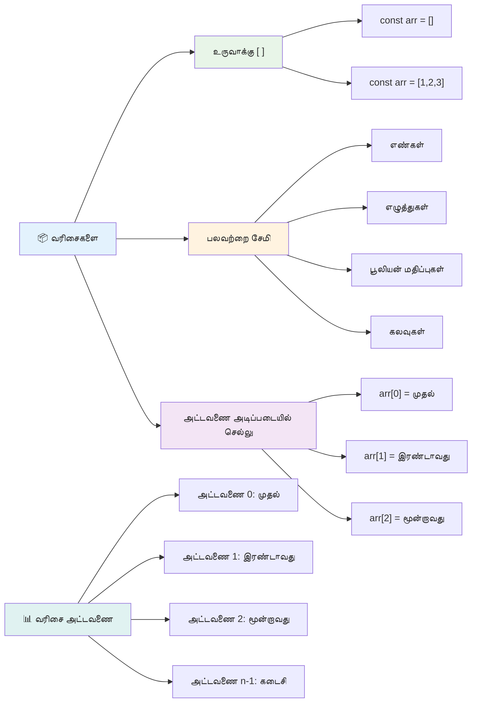
### வரிசை குறியீட்டல்

இது முதலில் வித்தியாசமாக தோன்றலாம்: வரிசைகள் தங்கள் பொருட்களை 0-இன் எண்ணிக்கையிலிருந்து தொடங்கி எண்கள் அடிக்கின்றன, 1-இல்ல. இந்த பூஜ்ய அடிப்படைக் குறியீட்டு அமைப்பு கணினி நினைவகப் பண்புகளிலிருந்தே வருகிறது - இது C போன்ற கணினி மொழிகளின் ஆரம்ப நாளிலிருந்து பயன்படுத்தப்படுகிறது. ஒவ்வொரு இடமும் ஒரு **index** எனப்படும் முகவரி எண்ணை பெறுகிறது.

| குறியீடு | மதிப்பு | விளக்கம் |
|-------|-------|-------------|
| 0 | "Chocolate" | முதல் உறுப்பினன் |
| 1 | "Strawberry" | இரண்டாம் உறுப்பினன் |
| 2 | "Vanilla" | மூன்றாம் உறுப்பினன் |
| 3 | "Pistachio" | நான்காம் உறுப்பினன் |
| 4 | "Rocky Road" | ஐந்தாம் உறுப்பினன் |

✅ நீங்கள் வரிசைகள் பூஜ்ய குறியீட்டிலிருந்து தொடங்குவதை மகிழ்ச்சியுடன் ஏற்றுகிறீர்களா? சில நிரலாக்க மொழிகளில் குறியீடுகள் 1-இன் எண்ணிக்கையிலிருந்து தொடங்குகின்றன. இதன் பின்னணியில் ஒரு சுவாரஸ்யமான வரலாறு உள்ளது, அதைப் [விக்கிப்பீடியாவில்](https://en.wikipedia.org/wiki/Zero-based_numbering) படிக்கலாம்.

**வரிசை உறுப்பினர்களைப் பெறுதல்:**

```javascript
const iceCreamFlavors = ["Chocolate", "Strawberry", "Vanilla", "Pistachio", "Rocky Road"];

// கோப்பை குறிக்கோள் நோட்டேஷன் பயன்படுத்தி தனிப்பட்ட உருப்படிகளை அணுகவும்
console.log(iceCreamFlavors[0]); // "Chocolate" - முதல் உருப்படி
console.log(iceCreamFlavors[2]); // "Vanilla" - மூன்றாவது உருப்படி
console.log(iceCreamFlavors[4]); // "Rocky Road" - கடைசி உருப்படி
```

**இங்கு என்ன நடக்கிறது:**
- **குறியீட்டை** அடையாளப்படுத்த சதுரக் கோடுகள் அழைப்பாகக் கொண்டுள்ளது
- **ஒரு குறிப்பிட்ட இடத்தில்** இருக்கும் மதிப்பை ফেরுத்து தருகின்றது
- **0-இன் எண்ணிக்கையிலிருந்து** உருப்படிகளை எண்ணுகிறது, அதனால் முதல் உறுப்பினன் குறியீடு 0 ஆகும்

**வரிசை உறுப்பினர்களை மாற்றுதல்:**

```javascript
// ஒரு உள்ளிருக்கும் மதிப்பை மாற்றவும்
iceCreamFlavors[4] = "Butter Pecan";
console.log(iceCreamFlavors[4]); // "வெண்ணெய் பீக்கன்"

// முடிவில் ஒரு புதிய உருப்படியை சேர்க்கவும்
iceCreamFlavors[5] = "Cookie Dough";
console.log(iceCreamFlavors[5]); // "குக்கி கோ"
```

**மேலே நாம்:**
- **குறைந்த 4 குறியீட்டின்** "Rocky Road" என்பதை "Butter Pecan" ஆக மாற்றி விட்டோம்
- **குறைந்த 5 இடத்தில்** புதிய "Cookie Dough" உறுப்பினரை சேர்த்தோம்
- **வரிசை நீளம் தானாக** அதிகரிக்கிறது, கட்டுப்பாட்டுக்கு வெளியே சேர்க்கையில்

### வரிசை நீளம் மற்றும் பொதுவான முறைகள்

வரிசைகள் பல முக்கிய பணிகளை எளிதாக்க builtin பண்புகள் மற்றும் முறைகள் கொண்டுள்ளன.

**வரிசை நீளம் கண்டறிதல்:**

```javascript
const iceCreamFlavors = ["Chocolate", "Strawberry", "Vanilla", "Pistachio", "Rocky Road"];
console.log(iceCreamFlavors.length); // 5

// விரிசல் மாற்றப்படுவதுடன் நீளம் தானாக புதுப்பிக்கப்படும்
iceCreamFlavors.push("Mint Chip");
console.log(iceCreamFlavors.length); // 6
```

**முக்கியக் குறிப்புகள்:**
- சொடுக்குகளை மொத்த எண்ணிக்கையைத் தருகிறது
- உறுப்பினர்கள் சேர்க்கப்பட்டாலும் அல்லது நீக்கப்பட்டாலும் தானாக புதுப்பிக்கிறது
- லூப்புகள் மற்றும் சரிபார்ப்புகளுக்கான இயல்பான எண்ணிக்கை தருகிறது

**அவசியமான வரிசை முறைகள்:**

```javascript
const fruits = ["apple", "banana", "orange"];

// கூறுகள் சேர்க்கவும்
fruits.push("grape");           // அடிப்பகுதியில் சேர்க்கிறது: ["ஆப்பிள்", "வாழைப்பழம்", "ஆரஞ்சு", "திராட்சை"]
fruits.unshift("strawberry");   // துவக்கத்தில் சேர்க்கிறது: ["ஸ்ட்ராபெர்ரி", "ஆப்பிள்", "வாழைப்பழம்", "ஆரஞ்சு", "திராட்சை"]

// கூறுகளை அகற்று
const lastFruit = fruits.pop();        // "திராட்சை" ஐ அகற்றி மீட்டெடுக்கின்றது
const firstFruit = fruits.shift();     // "ஸ்ட்ராபெர்ரி" ஐ அகற்றி மீட்டெடுக்கின்றது

// கூறுகளை கண்டுபிடி
const index = fruits.indexOf("banana"); // 1 ஐ 반환 செய்கிறது ("வாழைப்பழம்" இடம்)
const hasApple = fruits.includes("apple"); // உண்மை 반환 செய்கிறது
```

**இந்த முறைகளை புரிந்துகொள்வது:**
- `push()` (இறுதியில்) மற்றும் `unshift()` (ஆரம்பத்தில்) உருப்படிகளை சேர்க்கும்
- `pop()` (இறுதியில்) மற்றும் `shift()` (ஆரம்பத்தில்) உருப்படிகளை நீக்கும்
- `indexOf()` மூலம் உருப்படிகளை கண்டறிந்து, `includes()` மூலம் இருப்பதை உறுதிப்படுத்தும்
- நீக்கப்பட்ட உருப்படிகள் மற்றும் இடங்களைத் திருப்பி தரும்

✅ உங்களின் உலாவி console இல் உங்கள் சொந்த வரிசையை உருவாக்கி சோதிக்கவும்.

### 🧠 **வரிசை அடிப்படைகள் சரிபார்ப்பு: உங்கள் தரவை ஒழுங்குபடுத்துதல்**

**உங்கள் வரிசை புரிதலைச் சோதிக்க:**
- ஏன் வரிசைகள் 0-இல் இருந்து எண்ண தொடங்குகின்றன என்று நினைக்கிறீர்கள்?
- ஒரு கிடைக்கும் இடம் இல்லாமல் பார்க்க முயற்சித்தால் (உதா: 5-உறுப்படிகள் கொண்ட வரிசையில் `arr[100]`) என்ன நடக்கும்?
- வரிசைகள் பயன்படும் மூன்று நிஜ உலகக் காட்சிகளை நினைத்துக் கொள்ளுங்கள்?

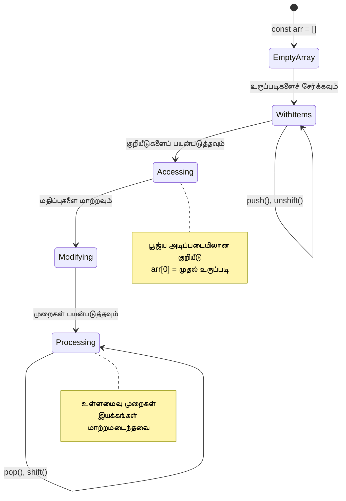
> **நிஜ உலகத்தில் புரிதல்**: நிரலாக்கத்தில் வரிசைகள் எங்கும் உள்ளன! சமூக ஊடக ஃபீட்கள், ஷாப்பிங் கார்ட்கள், படக் காட்சிப்படுத்தல்கள், பாடல் பட்டியல்கள் - இவை எல்லாம் பின்னணியில் வரிசைகளாக உள்ளன!

## லூப்புகள்

சார்லஸ் டிக்கன்ஸின் நாவல்களில் மாணவர்கள் பலமுறை ஒரு கோரிக்கையை எழுத கட்டாயம் செய்ததற்கான புகழ்பெற்ற தண்டனை உதாரணத்தை நினைத்துக்கொள்ளுங்கள். நீங்கள் ஒருவருக்கு "இந்த வசனத்தை 100 முறை எழுது" என்று சொன்னால் தானாகவே அது செய்யப்படும் என்றால்? அதுவே லூப்புகள் உங்கள் குறியீட்டுக்கு செய்கின்றன.

லூப்புகள் தவறுகள் இல்லாமல் பணிகளை மீண்டும் மீண்டும் செய்யும் ஒரு மாற்றமில்லாத உதவியாளராக இருக்கின்றன. நீங்கள் ஒரு ஷாப்பிங் கார்டின் ஒவ்வொரு பொருளையும் பரிசோதிக்க வேண்டும் என்றாலும், அல்லது ஒரு ஆல்பத்தில் உள்ள அனைத்து படங்களையும் காட்ட வேண்டும் என்பாலும், லூப்புகள் அந்தப் பணிகளை திறமையாக கையாள்கின்றன.

ஜாவாஸ்கிரிப்ட் பல வகையான லூப்புகளை வழங்குகிறது. ஒவ்வொன்றையும் பகுப்பாய்வு செய்து எப்போது பயன்படுத்துவது என்பதைப் புரிந்து கொள்வோம்.

```mermaid
flowchart TD
    A["🔄 குறுக்கெழுத்து வகைகள்"] --> B["For குறுக்கெழுத்து"]
    A --> C["While குறுக்கெழுத்து"]
    A --> D["For...of குறுக்கெழுத்து"]
    A --> E["forEach முறை"]
    
    B --> B1["அறிவிக்கப்பட்ட சுற்றுகள்"]
    B --> B2["எண்ணி அடிப்படையிலான"]
    B --> B3["for(init; condition; increment)"]
    
    C --> C1["தெரியாத சுற்றுகள்"]
    C --> C2["நிலைய அடிப்படையிலான"]
    C --> C3["while(condition)"]
    
    D --> D1["நவீன ES6+"]
    D --> D2["அணி சுற்றும்"]
    D --> D3["for(item of array)"]
    
    E --> E1[" செயல்பாட்டு நடைமை"]
    E --> E2["அணி முறை"]
    E --> E3["array.forEach(callback)"]
    
    F["⏰ பயன்படுத்த எப்போது"] --> F1["For: எண்ணிக்கை, குறியீடுகள்"]
    F --> F2["While: பயனர் உள்ளீடு, தேடல்"]
    F --> F3["For...of: எளிய சுற்று"]
    F --> F4["forEach: செயல்பாட்டு நிரலாசிரியல்"]
    
    style A fill:#e3f2fd
    style B fill:#e8f5e8
    style C fill:#fff3e0
    style D fill:#f3e5f5
    style E fill:#e0f2f1
    style F fill:#fce4ec
```
### for லூப்

`for` லூப் ஒரு டைமர் அமைப்பதைப் போல - நீங்கள் எத்தனை முறை நடப்பதாக வேண்டுமென்று தெரிந்து காணலாம். இது மிகவும் ஒழுங்கமைக்கப்பட்ட மற்றும் கணிப்பிடக்கூடியது, அதனால் வரிசைகளுடன் வேலை செய்யும்போது அல்லது எண்ணிக்கைகளை கணக்கிடும் போது இது சிறந்தது.

**for லூப் அமைப்பு:**

| கூறு | நோக்கம் | உதாரணம் |
|-----------|---------|----------|
| **தொடக்கீடு** | தொடக்க புள்ளி அமைக்கும் | `let i = 0` |
| **நிபந்தனை** | எப்போது தொடர வேண்டும் | `i < 10` |
| **மேல் செல்லல்** | எப்படி புதுப்பிக்க | `i++` |

```javascript
// 0 முதல் 9 வரை எண்ணுவது
for (let i = 0; i < 10; i++) {
  console.log(`Count: ${i}`);
}

// மேலும் நடைமுறை உதாரணம்: மதிப்பெண்களை செயலாக்குவது
const testScores = [85, 92, 78, 96, 88];
for (let i = 0; i < testScores.length; i++) {
  console.log(`Student ${i + 1}: ${testScores[i]}%`);
}
```

**எடுத்துக்காட்டாக, என்ன நடக்கிறது:**
- **கணக்கிடுவதை** `i` என்ற மாறியை தொடக்கத்தில் 0 ஆக ஆரம்பிக்கிறது
- **ஒவ்வொரு முறை இயக்கத்திற்கு முன்** `i < 10` என்ற நிபந்தனையை பரிசோதிக்கிறது
- **நிபந்தனை உண்மையானபோது** குறியீட்டு தொகுதியை இயக்குகிறது
- **ஒவ்வொரு முறை பிறகு** `i`-ஐ 1-ஆக அதிகரிக்கிறது `i++` மூலம்
- **நிபந்தனை துெறிவானபோது** (i 10 ஆகும் போது) நிறுத்துகிறது

✅ உலாவி console இல் இந்த குறியீட்டைக் இயக்குங்கள். கணக்கிடும் மாறி, நிபந்தனை அல்லது மறுநிரலாக்க தொடர்ச்சியில் சிறிய மாற்றங்கள் செய்தால் என்ன நடக்கும்? நீங்கள் அதை பின்னோக்கி இயங்கச் செய்யவா, தொலைவுக் கணக்கெடுப்பாக மாற்ற முடியுமா?

### 🗓️ **for லூப் தேர்வு: கட்டுப்படுத்தப்பட்ட மீண்டும் செயல்**

**உங்கள் for லூப் புரிதலை மதிப்பாய்வு செய்ய:**
- ஒரு for லூப்பின் மூன்று பகுதிகள் என்ன மற்றும் ஒவ்வொன்றும் என்ன செய்கின்றன?
- வரிசையை பின்னோக்கி எப்படி சுற்றிப்பார்ப்பது?
- நீங்கள் மேல் செல்லல் பகுதியை (`i++`) மறந்துவிட்டால் என்ன நிகழும்?

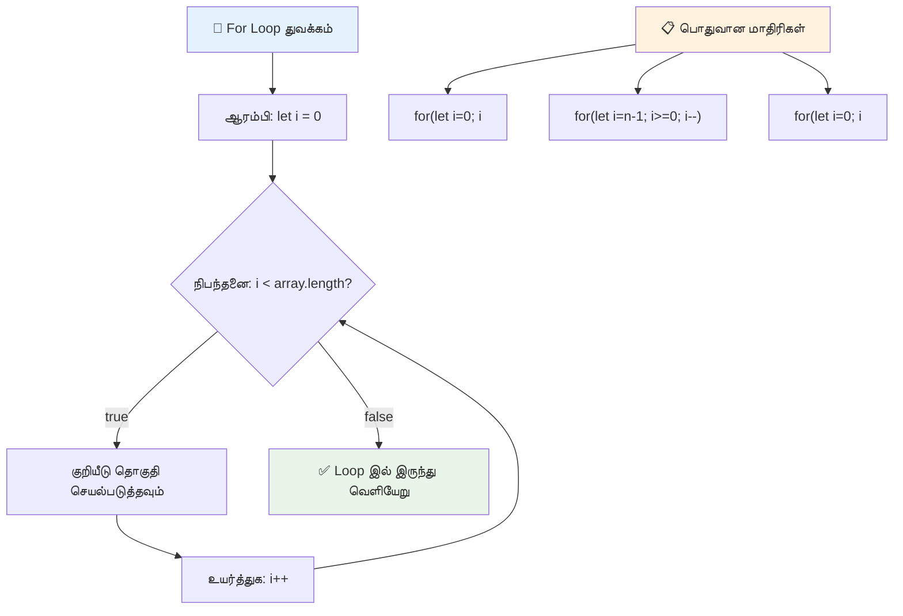
> **லூப் ஞானம்**: நீங்கள் எத்தனை முறை நடக்கும் என்று தெரிந்திருக்கும் போது for லூப்புகள் சிறந்தவை. வரிசை செயலாக்கத்திற்கான மிகவும் பொதுவான தேர்வு!

### while லூப்

`while` லூப் என்பது "இதுவரை செய்ய..." என்பதுபோல் - அதுவெவ்வளவு முறை நடக்கும் என்று தெரியாது, ஆனால் எப்போது நிறுத்துவது என்பது தெரியும். அது பயனரிடமிருந்து தேவையான உள்ளீட்டை பெறும் வரை கேட்க அல்லது தரவுகளில் தேடும்போது சிறந்தது.

**while லூப்பின் பண்புகள்:**
- நிபந்தனை உண்மையானது வரைக்கும் தொடர்ச்சியாக இயங்கும்
- எந்தவொரு கணக்கிடும் மாறியையும் உங்கள் கைமுறையாளர் நிர்வகிக்க வேண்டும்
- ஒவ்வொரு முறை இயக்கத்திற்கு முன் நிபந்தனையை பரிசோதிக்கிறது
- நிபந்தனை மெய்மையாக மாறாதிருக்கின் நோக்கி நீளக் கால லூப்புகள் உண்டாகும் அபாயம் உள்ளது

```javascript
// அடிப்படை எண்ணிக்கை உதாரணம்
let i = 0;
while (i < 10) {
  console.log(`While count: ${i}`);
  i++; // அதிகரிப்பதை மறக்காதீர்கள்!
}

// அதிக நடைமுறை உதாரணம்: பயனர் உள்ளீட்டை செயலாக்குதல்
let userInput = "";
let attempts = 0;
const maxAttempts = 3;

while (userInput !== "quit" && attempts < maxAttempts) {
  userInput = prompt(`Enter 'quit' to exit (attempt ${attempts + 1}):`);
  attempts++;
}

if (attempts >= maxAttempts) {
  console.log("Maximum attempts reached!");
}
```

**இந்த எடுத்துக்காட்டுகளை புரிந்துகொள்ள:**
- லூப் உட்கருத்தில் கணக்கிடும் மாறி `i` கைமுறை நிர்வகிக்கப்படுகிறது
- அளவிற்குள் இருக்கக் காக்க கணக்கிடும் மாறி அதிகரிக்கப்படுகிறது
- பயனர் உள்ளீட்டு மற்றும் முயற்சி வரம்புகளுடன் நடைமுறை பயன்பாட்டைக் காட்டுகிறது
- முடிவில்லாத செயல்பாடுகளைத் தவிர்க்க பாதுகாப்பு முறைகள் உள்ளது

### ♾️ **while லூப் ஞானம்: நிபந்தனை அடிப்படையிலான மீண்டும் செயல்**

**தனது while லூப் புரிதலை சோதிக்க:**
- while லூப்புகளில் முக்கிய ஆபத்து என்ன?
- எப்போது for லூப்புக்கு பதிலாக while லூப்பை நீங்கள் தேர்ந்தெடுப்பீர்கள்?
- முடிவில்லாத லூப்புகளைத் தவிர்ப்பது எப்படி?

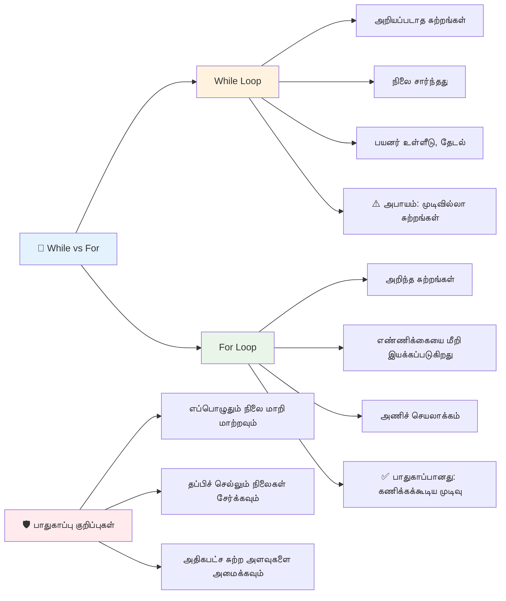
> **பாதுகாப்பு முதலில்**: while லூப்புகள் சக்திவாய்ந்தவை ஆனால் நிபந்தனைப் பராமரிப்பு மிக முக்கியம். உங்கள் லூப் நிபந்தனை இறுதியில் தவறாக மாறும் என்பதை உறுதி செய்யவும்!

### நவீன லூப் மாற்றி வழிகள்

ஜாவாஸ்கிரிப்ட் உங்கள் குறியீட்டை மேலும் வாசிக்கக்கூடியதும் குறைவான தவறுகளுடையதுமானதாக செய்ய நவீன லூப் சொற்றொடர்களை வழங்குகிறது.

**For...of லூப் (ES6+):**

```javascript
const colors = ["red", "green", "blue", "yellow"];

// நவீன அணுகுமுறை - சுத்தமான மற்றும் பாதுகாப்பானது
for (const color of colors) {
  console.log(`Color: ${color}`);
}

// பாரம்பரிய for வளைவில் இணைத்து பார்க்கவும்
for (let i = 0; i < colors.length; i++) {
  console.log(`Color: ${colors[i]}`);
}
```

**for...of இன் முக்கிய நன்மைகள்:**
- குறியீட்டை நிர்வகிக்க வேண்டிய தேவையைக் குறைத்தல் மற்றும் off-by-one பிழைகளை தவிர்ப்பு
- வரிசை உறுப்பினர்களுக்கு நேரடியாக அணுகல் வழங்கல்
- குறியீடு வாசிப்புக்கு எளிதாக்கம் மற்றும் சொற்றொடர் சிக்கல்களை குறைத்தல்

**forEach முறை:**

```javascript
const prices = [9.99, 15.50, 22.75, 8.25];

// செயல்பாட்டு நிரலாக்க ಶೈಲிக்காக forEach ಉಪಯೋಗಿಸಿ
prices.forEach((price, index) => {
  console.log(`Item ${index + 1}: $${price.toFixed(2)}`);
});

// ಸರಳ ಕಾರ್ಯಗಳಿಗೆ ತூரಿಕಾರ ರಚನೆಗಳೊಂದಿಗೆ forEach
prices.forEach(price => console.log(`Price: $${price}`));
```

**forEach பற்றி நீங்கள் அறிவது:**
- ஒவ்வொரு வரிசை உறுப்பிற்கும் ஒரு செயல்பாட்டை இயக்குகிறது
- உறுப்பினர் மதிப்பையும் குறியீட்டையும் அளவுருக்களாக வழங்குகிறது
- பூர்வ ரசிக லூப்புகளால் நிறுத்த முடியாது
- undefined ஐ திருப்பி தருகிறது (புதிய வரிசை உருவாக்காது)

✅ நீங்கள் ஏன் for லூப்பிற்கு பதிலாக while லூப்பை தேர்ந்தெடுப்பீர்கள்? StackOverflow இல் 17 ஆயிரம் பார்வையாளர்கள் இதைப் பற்றி கேள்வி எழுப்பியுள்ளனர், சில கருத்துக்கள் [உங்களுக்குப் பயனாக இருக்கலாம்](https://stackoverflow.com/questions/39969145/while-loops-vs-for-loops-in-javascript).

### 🎨 **நவீன லூப் சொற்றொடர் தேர்வு: ES6+ஐ அங்கீகரித்தல்**

**உங்கள் நவீன ஜாவாஸ்கிரிப்ட் புரிதலை மதிப்பாய்வு செய்ய:**
- பாரம்பரிய for லூப்புகளுக்கு மாற்றாக for...of இன் நன்மைகள் என்ன?
- எப்போது நீங்கள் பாரம்பரிய for லூப்பை விரும்பலாம்?
- forEach மற்றும் map இன் வேறுபாடு என்ன?

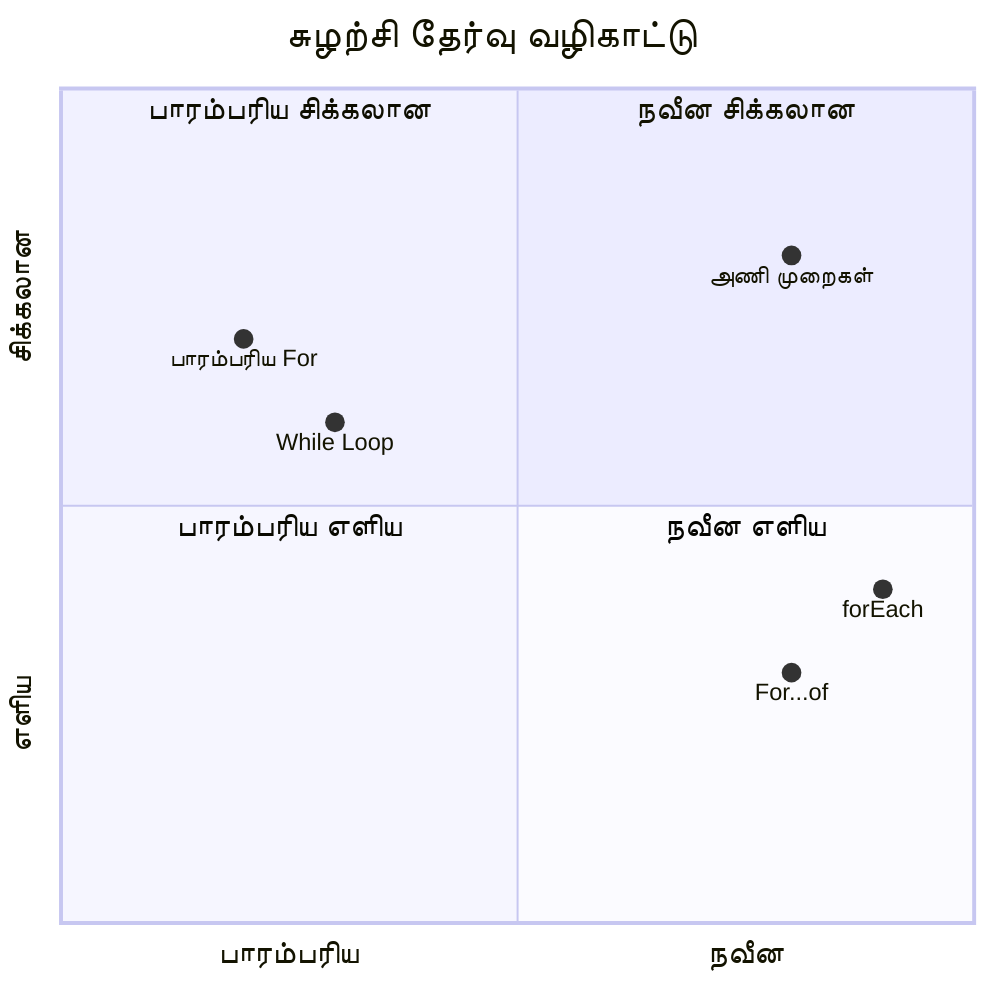
> **நவீன செயல்**: ES6+ சொற்றொடர்கள் போன்ற `for...of` மற்றும் `forEach` வரிசை சுழற்சிக்கான முன்னுரிமை வாய்ந்த அணுகுமுறையாக மாறியுள்ளன, ஏனெனில் அவை நியாயபூர்வமானதும் குறைந்த பிழைகளுடனும் இருக்கின்றன!

## லூப்புகளும் வரிசைகளும்

வரிசைகளுடன் லூப்புகளை இணைத்தல் வலுவான தரவு செயலாக்க திறன்களை ஏற்படுத்துகிறது. பட்டியல்கள் காட்டுதல் முதல் புள்ளிவிவர கணக்கீடு வரை பல நிரலாக்க பணிகளுக்கான அடிப்படையாக இணைப்பு உள்ளது.

**பாரம்பரிய வரிசை செயலாக்கம்:**

```javascript
const iceCreamFlavors = ["Chocolate", "Strawberry", "Vanilla", "Pistachio", "Rocky Road"];

// பாரம்பரிய for லூப் அணுகுமுறை
for (let i = 0; i < iceCreamFlavors.length; i++) {
  console.log(`Flavor ${i + 1}: ${iceCreamFlavors[i]}`);
}

// நவீன for...of அணுகுமுறை
for (const flavor of iceCreamFlavors) {
  console.log(`Available flavor: ${flavor}`);
}
```

**ஒவ்வொரு முறையிலும் பார்க்கலாம்:**
- லூப் எல்லையைத் தீர்மானிக்க வரிசை நீளம் பண்பை பயன்படுத்துகிறது
- பாரம்பரிய for லூப்பில் குறியீட்டை கொண்டு உறுப்பினரை அணுகுகிறது
- for...of லூப்பில் நேரடியாக உறுப்பினரை அணுகுகிறது
- ஒவ்வொரு உறுப்பினரையும் ஒருமுறை முறையாக செயலாக்குகிறது

**உயிரியல் தரவு செயலாக்க உதாரணம்:**

```javascript
const studentGrades = [85, 92, 78, 96, 88, 73, 89];
let total = 0;
let highestGrade = studentGrades[0];
let lowestGrade = studentGrades[0];

// ஒரு ஒற்றை சுற்று கொண்டு அனைத்து மதிப்பெண்களையும் செயலாக்கவும்
for (let i = 0; i < studentGrades.length; i++) {
  const grade = studentGrades[i];
  total += grade;
  
  if (grade > highestGrade) {
    highestGrade = grade;
  }
  
  if (grade < lowestGrade) {
    lowestGrade = grade;
  }
}

const average = total / studentGrades.length;
console.log(`Average: ${average.toFixed(1)}`);
console.log(`Highest: ${highestGrade}`);
console.log(`Lowest: ${lowestGrade}`);
```

**இந்த குறியீடு எப்படி செயல்படுகிறது:**
- மொத்தம் மற்றும் உயர்ந்த/குறைந்த மதிப்புகள் கண்காணிப்பதை தொடங்கி நிலைத்துவைக்கிறது
- ஒவ்வொரு மதிப்பையும் ஒன்றுதான் ஓர் திறமையான லூப்பில் செயலாக்குகிறது
- சராசரி கணக்கீட்டுக்கு மொத்தத்தை சேர்க்கிறது
- சுழற்சியின் போது மிக உயர்ந்த மற்றும் மிகக் குறைந்த மதிப்புகளைக் கண்காணிக்கிறது
- லூப்புக்குப் பிறகு இறுதி புள்ளிவிவரங்களை கணக்கிடுகிறது

✅ உங்களது உலாவி console இல் தானாக உருவாக்கிய வரிசையை பயன்படுத்தி லூப்புக்களுடன் முயற்சி செய்யவும்.

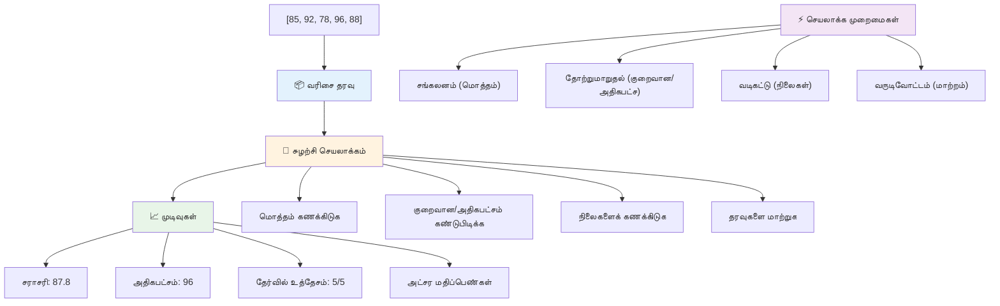
---

## GitHub Copilot முகவர் சவால் 🚀

Agent முறையைப் பயன்படுத்தி கீழ்க்கண்ட சவாலை முடிக்கவும்:

**விளக்கம்:** ஒரு தரவுத்தொகுப்பை பகுப்பாய்வு செய்து பொருத்தமான விளக்கங்களை உருவாக்கும் வரிசைகள் மற்றும் லூப்புகளை இணைத்த ஒரு சிக்கலான தரவு செயலாக்க முறை/function உருவாக்குக.

**கட்டளை:** `analyzeGrades` என்ற ஒரு function உருவாக்கவும், இது மாணவர் மதிப்பெண் பொருள் கொண்ட ஒரு வரிசையை (ஒவ்வொன்றும் பெயர் மற்றும் மதிப்பெண் பண்புகளை கொண்டது) எடுத்துக்கொண்டு, அதிகபட்ச மதிப்பெண், குறைந்தபட்ச மதிப்பெண், சராசரி மதிப்பெண், தேர்ச்சி பெற்ற மாணவர்களின் எண்ணிக்கை (மதிப்பெண் >= 70), மற்றும் சராசரிக்கு மேல் மதிப்பெண் பெற்ற மாணவர்களின் பெயர் வரிசையை உட்பொதிகிறது. உங்கள் தீர்வில் குறைந்தது இரண்டு விதமான லூப்புகளை பயன்படுத்தவும்.

மேலும் அறிய [agent mode](https://code.visualstudio.com/blogs/2025/02/24/introducing-copilot-agent-mode) இல்.

## 🚀 சவால்
JavaScript பல நவீன வரிசை முறைகளை வழங்குகிறது, அவை குறிப்பிட்ட பணிகளுக்காக பாரம்பரிய 반복ங்களை மாற்ற முடியும். [forEach](https://developer.mozilla.org/docs/Web/JavaScript/Reference/Global_Objects/Array/forEach), [for-of](https://developer.mozilla.org/docs/Web/JavaScript/Reference/Statements/for...of), [map](https://developer.mozilla.org/docs/Web/JavaScript/Reference/Global_Objects/Array/map), [filter](https://developer.mozilla.org/docs/Web/JavaScript/Reference/Global_Objects/Array/filter), மற்றும் [reduce](https://developer.mozilla.org/docs/Web/JavaScript/Reference/Global_Objects/Array/reduce) ஆகியவற்றை ஆராயுங்கள்.

**உங்கள் சவால்:** மாணவர் மதிப்பெண் எடுத்துக்காட்டை குறைந்தது மூன்று விதமான வரிசை முறைகளைக் கொண்டு மறுசீரமைக்கவும். நவீன JavaScript نحو பயன்படுத்தி குறியீடு எவ்வளவு சுத்தமாகவும் தெளிவாகவும் மாறுகிறதோ கவனியுங்கள்.

## பாடத்துக்குப் பின் வினாடி வினா
[பாடத்துக்குப் பின் வினாடி வினா](https://ff-quizzes.netlify.app/web/quiz/14)


## பரிசீலனை & தனிப்பட்ட ஆய்வு

JavaScript இல் வரிசைகளுக்கு அண்மையில் பல முறைகள் சேர்க்கப்பட்டுள்ளன, அவை தரவு கையாள்வதற்கு மிகவும் பயனுள்ளதாக இருக்கின்றன. [இந்த முறைகள் பற்றி படியுங்கள்](https://developer.mozilla.org/docs/Web/JavaScript/Reference/Global_Objects/Array) மற்றும் உங்கள் உருவாக்கிய வரிசையில் சிலவற்றை (push, pop, slice மற்றும் splice போன்றவை) முயற்சிக்கவும்.

## பணிகள்

[ஒரு வரிசையை சுழற்றுக](assignment.md)

---

## 📊 **உங்கள் வரிசைகள் மற்றும் 반복 கருவி தொகுப்பின் சுருக்கம்**

```mermaid
graph TD
    A["🎯 வரிசைகள் & தொடர்கள் தேர்ச்சி"] --> B["📦 வரிசை அடிப்படைகள்"]
    A --> C["🔄 தொடர் வகைகள்"]
    A --> D["🔗 தரவு செயலாக்கம்"]
    A --> E["🎨 நவீன தொழில்நுட்பங்கள்"]
    
    B --> B1["செயல்: [ ]"]
    B --> B2["இண்டெக்ஸ் செட்: arr[0]"]
    B --> B3["முறைகள்: push, pop"]
    B --> B4["முன்னெச்சரிக்கை: length"]
    
    C --> C1["For: தெரிந்த முறை"]
    C --> C2["While: நிபந்தனை அடிப்படையில்"]
    C --> C3["For...of: நேரடி அணுகல்"]
    C --> C4["forEach: செயல்பாட்டு"]
    
    D --> D1["புள்ளிவிவர கணக்கீடு"]
    D --> D2["தரவு மாற்றம்"]
    D --> D3["வடிகட்டல் & தேடல்"]
    D --> D4["اسல் நேர செயலாக்கம்"]
    
    E --> E1["அரோ ஃபங்ஷன்கள்"]
    E --> E2["முறை சங்கிலி"]
    E --> E3["பிளவி"]
    E --> E4["டெம்ப்ளேட் எழுத்துக்கள்"]
    
    F["💡 முக்கிய நன்மைகள்"] --> F1["தரவு பராமரிப்பு திறன்"]
    F --> F2["குறியீடு மீண்டும் எழுதல் குறைவு"]
    F --> F3["விருத்திக்கக்கூடிய தீர்வுகள்"]
    F --> F4["தூய syntax"]
    
    style A fill:#e3f2fd
    style B fill:#e8f5e8
    style C fill:#fff3e0
    style D fill:#f3e5f5
    style E fill:#e0f2f1
    style F fill:#fce4ec
```
---

## 🚀 உங்கள் வரிசைகள் மற்றும் 반복 திறமை நேர வரிசை

### ⚡ **அடுத்து 5 நிமிடங்களில் செய்யக்கூடியவை**
- [ ] உங்கள் விருப்பமான திரைப்படங்களின் ஒரு வரிசையை உருவாக்கி குறிப்பிட்ட உருப்படிகளை அணுகவும்
- [ ] 1 இருந்து 10 வரை எண்ணும் ஒரு for 반복ம் எழுதவும்
- [ ] பாடத்தில் உள்ள நவீன வரிசை முறைகளுக்கான சவாலை முயற்சிக்கவும்
- [ ] உலாவியில் வரிசை குறியீட்டைப் பயிற்சி செய்யவும்

### 🎯 **இந்த மணிநேரத்தில் சாதிக்க முடியவுள்ளவை**
- [ ] பாடத்துக்குப் பின் வினாடி வினாவை முடித்து சிக்கலான கருத்துக்களை மதிப்பாய்வு செய்யவும்
- [ ] GitHub Copilot சவாலிலிருந்து முழுமையான மதிப்பெண் பகுப்பாய்வையாளர் உருவாக்கவும்
- [ ] பொருட்களை சேர்க்கும் மற்றும் அகற்றும் எளிய ஷாப்பிங் கார்ட் உருவாக்கவும்
- [ ] விதிவிலக்கான 반복 வகைகளை மாற்றும் பயிற்சிகள் செய்யவும்
- [ ] `push`, `pop`, `slice`, மற்றும் `splice` போன்ற வரிசை முறைகளைப் பயன்படுத்தி முயற்சி செய்யவும்

### 📅 **உங்கள் வாராந்திர தரவு செயலாக்க பயணம்**
- [ ] "ஒரு வரிசையை சுழற்றுக" பணியை படைப்பாற்றலுடன் முடிக்கவும்
- [ ] வரிசைகள் மற்றும் 반복ங்களைக் கொண்டு ஒரு பணியாளர்கள் பட்டியல் செயலி உருவாக்கவும்
- [ ] எண்களின் எளிய புள்ளியியல் கணக்கிடியை உருவாக்கவும்
- [ ] [MDN வரிசை முறைகளை](https://developer.mozilla.org/docs/Web/JavaScript/Reference/Global_Objects/Array) பயிற்சி செய்யவும்
- [ ] புகைப்படக் காட்சியகம் அல்லது இசை பட்டியல் இடைமுகம் உருவாக்கவும்
- [ ] `map`, `filter`, மற்றும் `reduce` போன்ற செயல்பாடுகள் அடிப்படையிலான நிரலாக்கத்தை ஆராயவும்

### 🌟 **உங்கள் மாதநிலை மாற்றம்**
- [ ] முன்னோடிய வரிசை செயல்பாடுகள் மற்றும் செயல்திறன் மேம்பாட்டை ஆற்றலாம்
- [ ] முழுமையான தரவு காட்சி அட்டவணையை உருவாக்கவும்
- [ ] தரவு செயலாக்கத்துடன் தொடர்புடைய திறந்த மூல திட்டங்களில் பங்களிக்கவும்
- [ ] பிறருக்கு வரிசைகள் மற்றும் 반복ங்களை நடைமுறை எடுத்துக்காட்டுகளுடன் கற்பிக்கவும்
- [ ] மறு பயன்பாட்டுக்குரிய தனிப்பட்ட தரவு செயலாக்க செயல்பாடுகள் நூலகத்தை உருவாக்கவும்
- [ ] வரிசைகளை அடிப்படையாகக் கொண்டு கட்டமைக்கப்பட்ட தகவல் அலகுகள் மற்றும் கூடுக்களை ஆராயவும்

### 🏆 **இறுதி தரவு செயலாக்க சாம்பியன் சரிபார்ப்பு**

**உங்கள் வரிசைகள் மற்றும் 반복 திறமையை கொண்டாடுங்கள்:**
- நிஜ பயன்பாடுகளுக்கு நீங்கள் கற்றுக்கொண்ட மிகவும் பயனுள்ள வரிசை செயல்பாடு என்ன?
- எந்த 반복 வகை உங்கள் கைகளுக்கு இயல்பானது மற்றும் ஏன்?
- வரிசைகள் மற்றும் 반복ங்களைப் புரிந்துகொண்டதில் உங்கள் தரவு ஒழுங்குபடுத்தும் முறையில் எப்படி மாற்றம் ஏற்பட்டது?
- இன்னும் எதைச் செய்ய விரும்புகிறீர்கள் கருத்து சிக்கலான தரவு செயலாக்க பணியொன்றை?

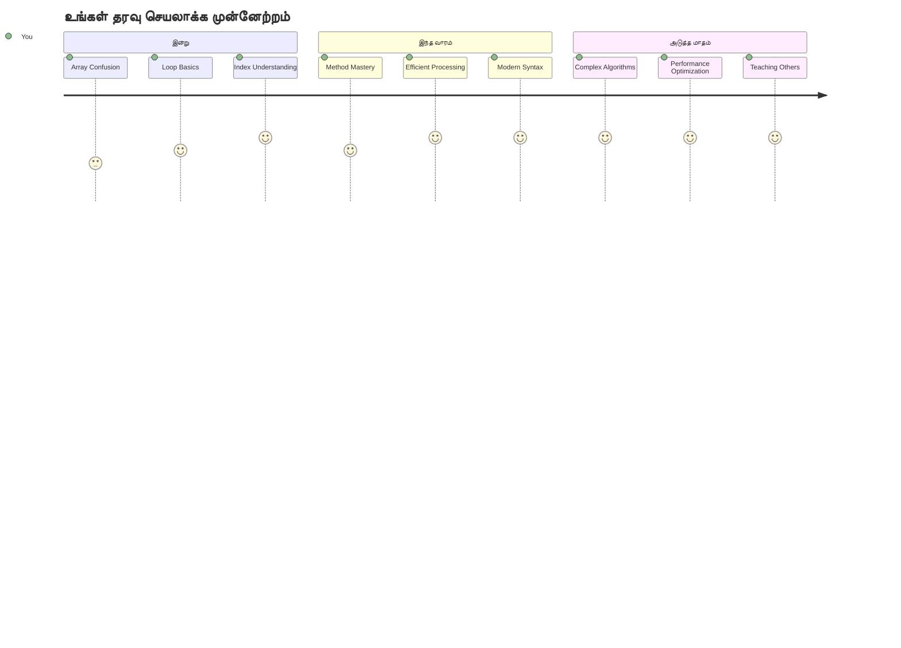
> 📦 **நீங்கள் தரவுச் சீரமைப்பு மற்றும் செயலாக்க சக்தியைக் கைவிட்டீர்கள்!** வரிசைகள் மற்றும் 반복ங்கள் நீங்கள் உருவாக்கும் பெரும்பாலான பயன்பாடுகளின் அடித்தளம் ஆகும். எளிய பட்டியலிலிருந்த தொடங்கி சிக்கலான தரவு பகுப்பாய்விலிருந்து, தகவலை திறமையாகவும் அழகாகவும் கையாள நீங்கள் இப்போது கருவிகளை பெற்றுள்ளீர்கள். ஒவ்வொரு இயக்கமான இணையதளம், மொபைல் செயலி மற்றும் தரவு சார்ந்த செயலி இவை அடிப்படையில் சார்ந்துள்ளன. பரவலாக வளர்க்கக்கூடிய தரவு செயலாக்க உலகிற்கு வரவேற்கிறோம்! 🎉

---

<!-- CO-OP TRANSLATOR DISCLAIMER START -->
**அறிகுறி**:
இந்த ஆவணம் [கூ-ஒப் மொழிபெயர்ப்பாளர்](https://github.com/Azure/co-op-translator) என்ற செயற்கை நுண்ணறிவு மொழிபெயர்ப்பு சேவையை பயன்படுத்தி மொழிபெயர்க்கப்பட்டுள்ளது. துல்லியமாக இருப்பதற்காக நாம் முயலினாலும், தானாகவே செய்யப்பட்ட மொழிபெயர்ப்புகளில் தவறுகள் அல்லது நுட்பக் குறைவுகள் இருக்க வாய்ப்பு உள்ளது. தாய்மொழியில் உள்ள அசல் ஆவணம் அதிகாரப்பூர்வ மூலம் என கருதப்பட வேண்டும். மிகவும் முக்கியமான தகவல்களுக்கு, திறமையான மனித பிற மொழிபெயர்ப்பை பரிந்துரைக்கிறோம். இந்த மொழிபெயர்ப்பின் பயன்பாட்டினால் ஏற்பட்ட எந்த தவறான புரிதல்கள் அல்லது தவறான விளக்கங்களுக்கும் நாங்கள் பொறுப்பல்ல.
<!-- CO-OP TRANSLATOR DISCLAIMER END -->