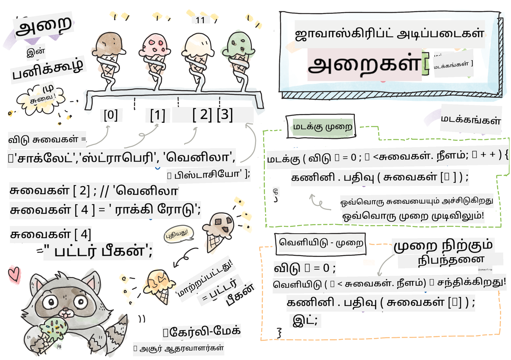

<!--
CO_OP_TRANSLATOR_METADATA:
{
  "original_hash": "9029f96b0e034839c1799f4595e4bb66",
  "translation_date": "2025-10-11T11:44:12+00:00",
  "source_file": "2-js-basics/4-arrays-loops/README.md",
  "language_code": "ta"
}
-->
# ஜாவாஸ்கிரிப்ட் அடிப்படைகள்: வரிசைகள் மற்றும் மடக்கங்கள்


> [டொமோமி இமுரா](https://twitter.com/girlie_mac) அவர்களின் ஸ்கெட்ச்

## முன்-வகுப்பு வினாடி வினா
[முன்-வகுப்பு வினாடி வினா](https://ff-quizzes.netlify.app/web/quiz/13)

இந்த பாடத்தில் ஜாவாஸ்கிரிப்ட் மொழியின் அடிப்படைகளை கற்றுக்கொள்வீர்கள். இது இணையத்தில் இடையூறுகளை வழங்குகிறது. இந்த பாடத்தில், தரவுகளை மாற்றுவதற்கான வரிசைகள் மற்றும் மடக்கங்கள் பற்றிய அடிப்படைகளை கற்றுக்கொள்வீர்கள்.

[](https://youtube.com/watch?v=1U4qTyq02Xw "Arrays")

[](https://www.youtube.com/watch?v=Eeh7pxtTZ3k "Loops")

> 🎥 மேலே உள்ள படங்களை கிளிக் செய்து வரிசைகள் மற்றும் மடக்கங்கள் பற்றிய வீடியோக்களை பாருங்கள்.

> இந்த பாடத்தை [Microsoft Learn](https://docs.microsoft.com/learn/modules/web-development-101-arrays/?WT.mc_id=academic-77807-sagibbon) இல் எடுத்துக்கொள்ளலாம்!

## வரிசைகள்

தரவுடன் வேலை செய்வது எந்த மொழிக்கும் பொதுவான பணியாகும், மேலும் தரவுகள் ஒரு கட்டமைப்பில் ஒழுங்குபடுத்தப்பட்டால், இது மிகவும் எளிதாக இருக்கும். வரிசைகள் மூலம், தரவுகள் பட்டியல் போன்ற ஒரு அமைப்பில் சேமிக்கப்படும். வரிசைகளின் முக்கியமான நன்மை என்னவென்றால், ஒரே வரிசையில் பல்வேறு வகையான தரவுகளை சேமிக்க முடியும்.

✅ வரிசைகள் எங்கும் இருக்கின்றன! சூரிய ஒளி பலகை வரிசை போன்ற ஒரு உண்மையான உதாரணத்தை நீங்கள் நினைக்க முடியுமா?

ஒரு வரிசைக்கான சyntax என்பது ஒரு ஜோடி சதுர அடையாளங்கள்.

```javascript
let myArray = [];
```

இது ஒரு காலி வரிசையாகும், ஆனால் வரிசைகள் ஏற்கனவே தரவுடன் நிரப்பப்பட்டு அறிவிக்கப்படலாம். ஒரு வரிசையில் பல மதிப்புகள் கமாவால் பிரிக்கப்படும்.

```javascript
let iceCreamFlavors = ["Chocolate", "Strawberry", "Vanilla", "Pistachio", "Rocky Road"];
```

வரிசை மதிப்புகள் **இண்டெக்ஸ்** எனப்படும் தனித்துவமான மதிப்புடன் ஒதுக்கப்படும், இது வரிசையின் தொடக்கத்திலிருந்து அதன் தூரத்தை அடிப்படையாகக் கொண்ட முழு எண்ணாகும். மேலே உள்ள உதாரணத்தில், "Chocolate" என்ற string மதிப்புக்கு 0 இண்டெக்ஸ் உள்ளது, மற்றும் "Rocky Road" இன் இண்டெக்ஸ் 4 ஆகும். சதுர அடையாளங்களுடன் இண்டெக்ஸை பயன்படுத்தி, வரிசை மதிப்புகளை பெற, மாற்ற அல்லது சேர்க்கலாம்.

✅ வரிசைகள் 0 இண்டெக்ஸில் தொடங்குவது உங்களை ஆச்சரியப்படுத்துகிறதா? சில நிரலாக்க மொழிகளில், இண்டெக்ஸ்கள் 1 இல் தொடங்குகின்றன. இதற்கான ஒரு சுவாரஸ்யமான வரலாறு [Wikipedia](https://en.wikipedia.org/wiki/Zero-based_numbering) இல் உள்ளது.

```javascript
let iceCreamFlavors = ["Chocolate", "Strawberry", "Vanilla", "Pistachio", "Rocky Road"];
iceCreamFlavors[2]; //"Vanilla"
```

ஒரு மதிப்பை மாற்ற இண்டெக்ஸை பயன்படுத்தலாம், இதுபோல:

```javascript
iceCreamFlavors[4] = "Butter Pecan"; //Changed "Rocky Road" to "Butter Pecan"
```

மேலும் ஒரு குறிப்பிட்ட இண்டெக்ஸில் புதிய மதிப்பை சேர்க்கலாம்:

```javascript
iceCreamFlavors[5] = "Cookie Dough"; //Added "Cookie Dough"
```

✅ ஒரு வரிசையில் மதிப்புகளை சேர்க்க ஒரு பொதுவான வழி array.push() போன்ற வரிசை ஆபரேட்டர்களைப் பயன்படுத்துவது.

ஒரு வரிசையில் எத்தனை உருப்படிகள் உள்ளன என்பதை அறிய, `length` பண்பை பயன்படுத்தவும்.

```javascript
let iceCreamFlavors = ["Chocolate", "Strawberry", "Vanilla", "Pistachio", "Rocky Road"];
iceCreamFlavors.length; //5
```

✅ உங்களே முயற்சிக்கவும்! உங்களது உலாவியின் console-ல் ஒரு வரிசையை உருவாக்கி, அதை மாற்றி பாருங்கள்.

## மடக்கங்கள்

மடக்கங்கள் நமக்கு மீண்டும் மீண்டும் அல்லது **மீளும்** பணிகளை செய்ய அனுமதிக்கின்றன, மேலும் இது நேரத்தையும் குறியீட்டையும் மிச்சப்படுத்தும். ஒவ்வொரு iteration-லும் அதன் மாறிகள், மதிப்புகள் மற்றும் நிபந்தனைகளில் மாறுபடலாம். ஜாவாஸ்கிரிப்டில் பல வகையான மடக்கங்கள் உள்ளன, அவை அனைத்தும் சிறிய வேறுபாடுகளைக் கொண்டுள்ளன, ஆனால் அடிப்படையில் ஒரே விஷயத்தைச் செய்கின்றன: தரவுகளை மடக்குதல்.

### For Loop

`for` மடக்கத்திற்கு iteration செய்ய 3 பகுதிகள் தேவை:
- `counter` iteration எண்ணிக்கையை typically தொடங்க ஒரு எண்ணுடன் ஆரம்பிக்கப்படும் மாறி
- `condition` ஒப்பீட்டு ஆபரேட்டர்களைப் பயன்படுத்தும் வெளிப்பாடு, இது `false` ஆகும் போது மடக்கு நிற்கும்
- `iteration-expression` ஒவ்வொரு iteration முடிவிலும் இயக்கப்படும், பொதுவாக counter மதிப்பை மாற்ற பயன்படுத்தப்படும்
  
```javascript
// Counting up to 10
for (let i = 0; i < 10; i++) {
  console.log(i);
}
```

✅ இந்த குறியீட்டை உலாவி console-ல் இயக்கவும். counter, condition, iteration expression ஆகியவற்றில் சிறிய மாற்றங்களைச் செய்யும்போது என்ன நடக்கிறது? அதை பின்வாங்கி, countdown உருவாக்க முடியுமா?

### While loop

`for` மடக்கத்தின் syntax-க்கு மாறாக, `while` மடக்கங்கள் `false` ஆகும் போது மடக்கு நிற்கும் ஒரு நிபந்தனை மட்டுமே தேவை. மடக்கங்களில் உள்ள நிபந்தனைகள் பொதுவாக counter போன்ற பிற மதிப்புகளை நம்புகின்றன, மேலும் மடக்கத்தின் போது நிர்வகிக்கப்பட வேண்டும். counter க்கான தொடக்க மதிப்புகள் மடக்கத்திற்கு வெளியே உருவாக்கப்பட வேண்டும், மேலும் நிபந்தனை பூர்த்தி செய்ய எந்த வெளிப்பாடுகளும், counter மாற்றம் உட்பட மடக்கத்தின் உள்ளே பராமரிக்கப்பட வேண்டும்.

```javascript
//Counting up to 10
let i = 0;
while (i < 10) {
 console.log(i);
 i++;
}
```

✅ நீங்கள் ஏன் ஒரு for மடக்கு மற்றும் while மடக்கு ஒன்றைத் தேர்ந்தெடுப்பீர்கள்? StackOverflow இல் 17K பார்வையாளர்கள் இதே கேள்வியை கேட்டனர், மற்றும் சில கருத்துக்கள் [உங்களுக்கு சுவாரஸ்யமாக இருக்கலாம்](https://stackoverflow.com/questions/39969145/while-loops-vs-for-loops-in-javascript).

## மடக்கங்கள் மற்றும் வரிசைகள்

மடக்கங்கள் பெரும்பாலும் வரிசைகளுடன் பயன்படுத்தப்படுகின்றன, ஏனெனில் பெரும்பாலான நிபந்தனைகள் மடக்கு நிற்க வரிசையின் நீளத்தை தேவைப்படும், மேலும் இண்டெக்ஸ் counter மதிப்பாகவும் இருக்கலாம்.

```javascript
let iceCreamFlavors = ["Chocolate", "Strawberry", "Vanilla", "Pistachio", "Rocky Road"];

for (let i = 0; i < iceCreamFlavors.length; i++) {
  console.log(iceCreamFlavors[i]);
} //Ends when all flavors are printed
```

✅ உங்களது உலாவியின் console-ல் உங்களது சொந்த வரிசையை மடக்கி பார்க்க முயற்சிக்கவும்.

---

## 🚀 சவால்

for மற்றும் while மடக்குகளைத் தவிர, வரிசைகளை மடக்குவதற்கான பிற வழிகள் உள்ளன. [forEach](https://developer.mozilla.org/docs/Web/JavaScript/Reference/Global_Objects/Array/forEach), [for-of](https://developer.mozilla.org/docs/Web/JavaScript/Reference/Statements/for...of), மற்றும் [map](https://developer.mozilla.org/docs/Web/JavaScript/Reference/Global_Objects/Array/map) ஆகியவை. உங்கள் வரிசை மடக்கை இந்த தொழில்நுட்பங்களில் ஒன்றைப் பயன்படுத்தி மறுபதிவு செய்யுங்கள்.

## வகுப்புக்குப் பின் வினாடி வினா
[வகுப்புக்குப் பின் வினாடி வினா](https://ff-quizzes.netlify.app/web/quiz/14)

## மதிப்பீடு மற்றும் சுயபயிற்சி

ஜாவாஸ்கிரிப்டில் உள்ள வரிசைகளுக்கு பல பயனுள்ள முறைமைகள் இணைக்கப்பட்டுள்ளன, அவை தரவுகளை மாற்ற மிகவும் உதவுகின்றன. [இந்த முறைமைகள் பற்றி படிக்கவும்](https://developer.mozilla.org/docs/Web/JavaScript/Reference/Global_Objects/Array) மற்றும் உங்கள் சொந்த வரிசையில் சிலவற்றை முயற்சிக்கவும் (push, pop, slice மற்றும் splice போன்றவை).

## பணிக்கூற்று

[ஒரு வரிசையை மடக்கு](assignment.md)

---

**குறிப்பு**:  
இந்த ஆவணம் [Co-op Translator](https://github.com/Azure/co-op-translator) என்ற AI மொழிபெயர்ப்பு சேவையைப் பயன்படுத்தி மொழிபெயர்க்கப்பட்டுள்ளது. நாங்கள் துல்லியத்திற்காக முயற்சிக்கின்றோம், ஆனால் தானியங்கி மொழிபெயர்ப்புகளில் பிழைகள் அல்லது தவறான தகவல்கள் இருக்கக்கூடும் என்பதை கவனத்தில் கொள்ளவும். அதன் தாய்மொழியில் உள்ள மூல ஆவணம் அதிகாரப்பூர்வ ஆதாரமாக கருதப்பட வேண்டும். முக்கியமான தகவல்களுக்கு, தொழில்முறை மனித மொழிபெயர்ப்பு பரிந்துரைக்கப்படுகிறது. இந்த மொழிபெயர்ப்பைப் பயன்படுத்துவதால் ஏற்படும் எந்த தவறான புரிதல்கள் அல்லது தவறான விளக்கங்களுக்கு நாங்கள் பொறுப்பல்ல.