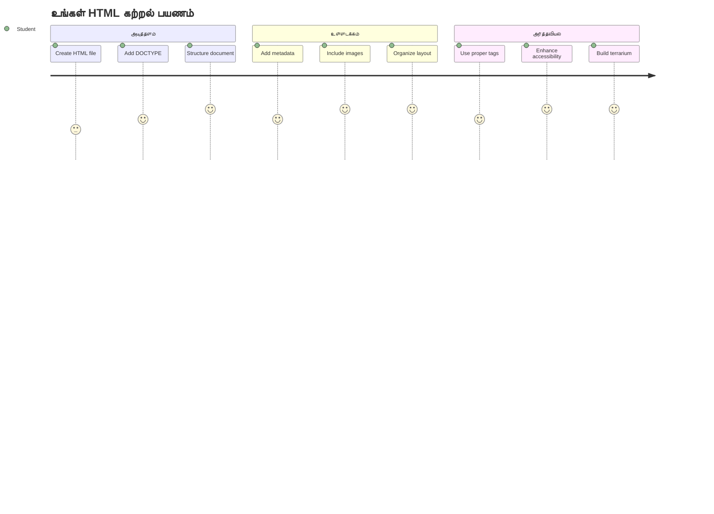
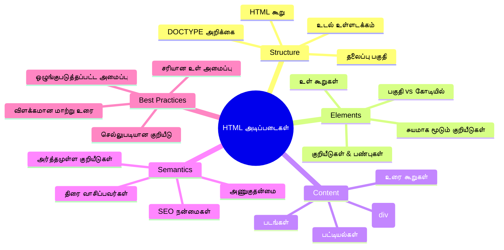
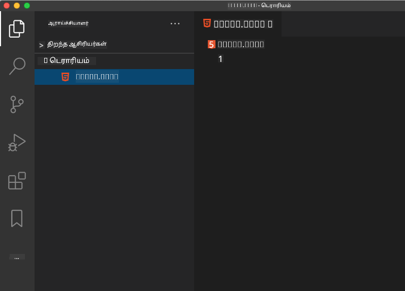
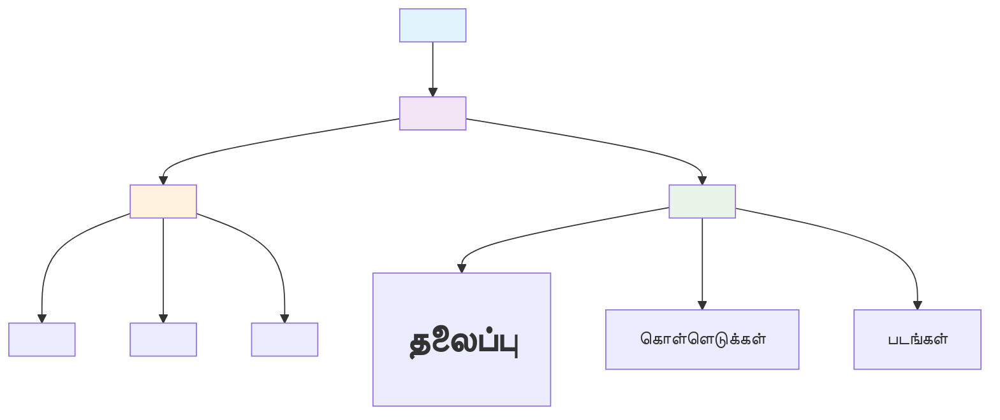
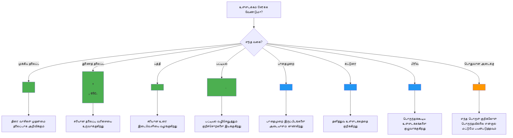
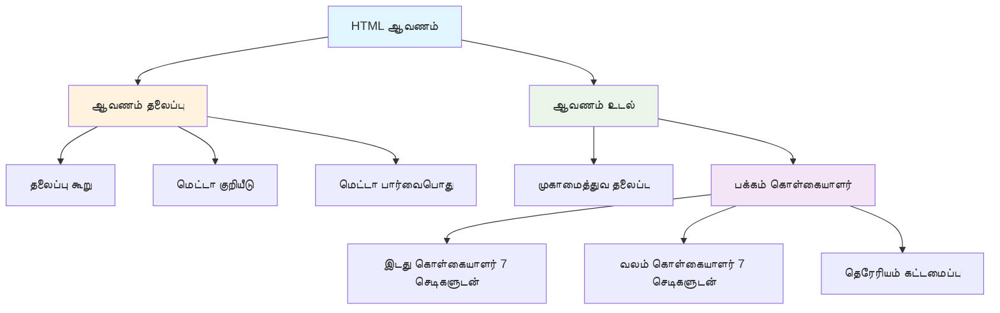
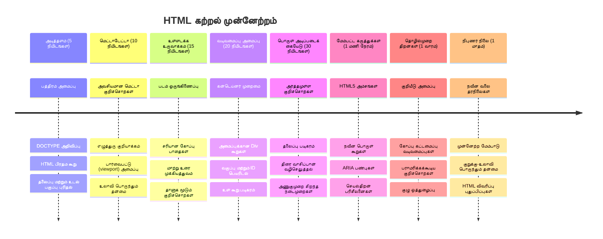

<!--
CO_OP_TRANSLATOR_METADATA:
{
  "original_hash": "3fcfa99c4897e051b558b5eaf1e8cc74",
  "translation_date": "2026-01-07T13:39:50+00:00",
  "source_file": "3-terrarium/1-intro-to-html/README.md",
  "language_code": "ta"
}
-->
# டெரேரியம் திட்டம் பகுதி 1: HTML அறிமுகம்



> டோம்(மி) இமுரா அவர்களால் உருவாக்கப்பட்ட ஸ்கெட்ச் நோட்

HTML, அல்லது ஹைப்பர் டெக்ஸ்ட் மார்க் அப் லாங்குவேஜ், நீங்கள் besucht செய்த ஒவ்வொரு இணையதளத்தின் அடித்தளம் ஆகும். HTML ஐ வலைப்பக்கங்களுக்கு வடிவமைப்பு வழங்கும் அடித்தளமாக நினைத்துக் கொள்ளுங்கள் – அது உள்ளடக்கம் எங்கே இருக்க வேண்டும், எவ்வாறு ஒழுங்குபடுத்தப்படும் மற்றும் ஒவ்வொரு பகுதியும் என்ன பிரதிபலிக்கும் என்பதைக் குறிப்பிடுகிறது. CSS பிறகு உங்கள் HTML ஐ நிறங்கள் மற்றும் அமைப்புகளுடன் "அழகு பூசும்" போது, மற்றும் JavaScript அதில் இடைக்கால செயல்பாடு கொண்டு வரும்போது, HTML என்பது மற்ற அனைத்துக்கும் அடிப்படையான கட்டமைப்பினை வழங்குகிறது.

இந்த பாடத்தில், நீங்கள் ஒரு உயிரியமான டெரேரியம் இடைமுகத்துக்கான HTML கட்டமைப்பைக் காணொளியாக உருவாக்குவீர்கள். இந்த கைமுறை திட்டம் உங்களுக்கு அடிப்படை HTML கருத்துகளை கற்றுக் கொடுக்கும் மற்றும் விசுவலாக ஈர்க்கக்கூடிய ஒன்றை உருவாக்கும். குறிப்பிட்ட பொருட்களை அமைப்பு படுத்துவதற்கு செமாண்டிக் கூறுகளை பயன்படுத்துவது, படங்களுடன் பணியாற்றுவது மற்றும் இடைக்கால இணைய பயன்பாட்டிற்கான அடித்தளத்தை உருவாக்குவது ஆகியவற்றை நீங்கள் கற்கப்போகிறீர்கள்.

இந்த பாடத்தின் இறுதியில், நீங்கள் ஒருங்கிணக்கப்பட்ட வண்டிகளில் செடிக்கான படைகளை காட்சிப்படுத்தும் ஒரு செயல்படும் HTML பக்கத்தை பெறுவீர்கள், அடுத்த பாடத்தில் அலங்கரிப்புக்கு தயார். தொடக்கத்தில் இது அடிப்படை போல தோன்றினாலும் கவலைப்படாதீர்கள் – அதுவே CSS அழகு பூசும் முன் HTML செய்ய வேண்டியது.


## முன்னணி பாடம்சோதனை

[Pre-lecture quiz](https://ff-quizzes.netlify.app/web/quiz/15)

> 📺 **பார் மற்றும் கற்று கொள்**: இந்த உதவிக்கண்ட விரிவுரையை பார்க்கவும்
> 
> [](https://www.youtube.com/watch?v=1TvxJKBzhyQ)

## உங்கள் திட்டத்தை அமைத்தல்

HTML குறியீட்டில் இறங்க முன்பு, உங்கள் டெரேரியம் திட்டத்திற்கான சரியான பணிக்கிடையை அமைப்போம். ஆரம்பத்திலிருந்தே ஒரு ஒழுங்குபடுத்தப்பட்ட கோப்புக் கட்டமைப்பை உருவாக்குவது ஒரு முக்கிய பழக்கம் ஆகும், இது உங்கள் வலை மேம்பாட்டு பயணத்தில் நன்கு உதவும்.

### பணியான்னு: உங்கள் திட்ட கட்டமைப்பை உருவாக்குக

நீங்கள் டெரேரியம் திட்டத்திற்கு அதிகாரபூர்வ அடைவை உருவாக்கி உங்கள் முதல் HTML கோப்பை சேர்க்கப் போகிறீர்கள். இங்கே நீங்கள் பயன்படுத்தக்கூடிய இரண்டு முறைகள் உள்ளன:

**விருப்பம் 1: Visual Studio Code பயன்படுத்துதல்**
1. Visual Studio Code-ஐ திறக்கவும்
2. "File" → "Open Folder" கிளிக் செய்யவும் அல்லது `Ctrl+K, Ctrl+O` (Windows/Linux) அல்லது `Cmd+K, Cmd+O` (Mac) பயன்படுத்தவும்
3. `terrarium` என்ற புதிய அடைவை உருவாக்கி தேர்ந்தெடுக்கவும்
4. Explorer பகுதியில், "New File" சின்னத்தை கிளிக் செய்யவும்
5. கோப்பின் பெயரை `index.html` என்க



**விருப்பம் 2: டெர்மினல் கட்டளைகள் பயன்படுத்துதல்**
```bash
mkdir terrarium
cd terrarium
touch index.html
code index.html
```

**இந்த கட்டளைகள் செய்வதெல்லாம்:**
- **நிறுவுகிறது** புதிய `terrarium` அடைவதை உங்கள் திட்டத்துக்காக
- **நுழைகிறது** terrarium அடைவைத் தரும் இடத்தில்
- **உருவாக்குகிறது** காலியான `index.html` கோப்பை
- **திறக்கிறது** கோப்பை Visual Studio Code-ல் திருத்தும் வகையில்

> 💡 **திறமையான குறிப்பு**: `index.html` என்ற கோப்பு பெயர் வலை மேம்பாட்டில் சிறப்பாகும். ஒருவன் இணையதளத்துக்கு செல்வதும் உலாவிகள் தானாகவே `index.html`-ஐ முன்னமைந்த பக்கமாகத் தேடுகிறார்கள். இது `https://mysite.com/projects/` போன்ற URL களில் `index.html` காண்பிக்காமல் பணியாற்றும்நிலை ஏற்படுத்துகிறது.

## HTML ஆவண கட்டமைப்பை புரிதல்

ஒவ்வொரு HTML ஆவணமும் ஒரு குறிப்பிட்ட கட்டமைப்பைப் பின்பற்றுகிறது, அது உலாவிகள் சரியான முறையில் தெரியும் மற்றும் காட்சியாகும் வகையில் இருக்க வேண்டும். இந்த கட்டமைப்பை ஒரு அதிகாரப்பூர்வ கடிதம் போல நினைத்துக் கொள்ளுங்கள் – அதில் ஒடுக்கப்பட்ட விருப்பங்கள் இருக்கும், மேலும் அது உள்ளடக்கத்தை சரியாக செயல்படுத்த உதவும்.


ஒவ்வொரு HTML ஆவணத்திற்கும் அவசியமான அடித்தளத்தை சேர்ப்பதில் தொடங்குவோம்.

### DOCTYPE புகுபதிவு மற்றும் ரூட் கூறு

ஏதேனும் HTML கோப்பின் முதல் இரண்டு வரிகள், ஆவணத்தின் உலாவியிடத்தில் "அறிமுகம்" ஆக இருக்கின்றன:

```html
<!DOCTYPE html>
<html></html>
```

**இந்த குறியீடு செய்பவை:**
- `<!DOCTYPE html>` பயன்படுத்தி ஆவணத் வகையை HTML5 ஆக அறிவிக்கிறது
- பக்க உள்ளடக்கத்தை கொண்டிருக்கும் மூல `<html>` கூறை உருவாக்குகிறது
- சரியான உலாவி காட்டலை உறுதி செய்ய நவீன வலை தரநிலைகளை நிறுவுகிறது
- வித்தியாசமான உலாவிகளிலும் சாதனங்களிலும் ஒரே மாதிரித்தன்மையை உறுதி செய்கிறது

> 💡 **VS Code குறிப்பு**: VS Code இல் எந்த HTML குறிச்சொல்லையும் ஹோவர் செய்யும் போது MDN வலை ஆவணங்களிலிருந்து உதவிக்கான தகவல், பயன்பாட்டு உதாரணங்கள் மற்றும் உலாவி பொருத்துதல் விவரங்கள் காணலாம்.

> 📚 **மேலும் கற்றுக்கொள்ளவும்**: DOCTYPE அறிவிப்பு உலாவிகளை "quirks mode" இல் செல்லாமல் தடுக்கும், இது பழைய இணையதளங்களை ஆதரிக்க பயன்படுத்தப்பட்டது. நவீன வலை மேம்பாடு எளிய `<!DOCTYPE html>` அறிவிப்பைப் பயன்படுத்தி [ தரநிலை-பூர்வ காட்சியிடல்](https://developer.mozilla.org/docs/Web/HTML/Quirks_Mode_and_Standards_Mode) உறுதி செய்கிறது.

### 🔄 **பயிற்சி சரிபார்ப்பு**
**இறக்கும் முன், உங்கள் புரிதலை சரிபார்க்கவும்:**
- ✅ எந்த HTML ஆவணத்துக்கும் DOCTYPE அறிவிப்பே ஏன் அவசியம்?
- ✅ `<html>` மூல கூறு என்ன கொண்டுள்ளது?
- ✅ இந்த கட்டமைப்பு எப்படி உலாவிகள் பக்கங்கள் சரியாக காட்சியிட உதவுகிறது?

**சிறிய சுயத் தேர்வு**: "தரநிலை-பூர்வ காட்சியிடல்" என்பதன் பொருளை உங்களது சொந்த வார்த்தைகளில் விவரிக்க முடியுமா?

## அவசியமான ஆவண மெட்டாடேட்டாவை சேர்த்தல்

HTML ஆவணத்தின் `<head>` பகுதி உலாவிகள் மற்றும் தேடுபொறிகள் தேவையான முக்கிய தகவலைக் கொண்டிருக்கும், ஆனால் பயனர்கள் நேரடியாகப் பக்கத்தில் அதை பார்க்கமுடியாது. இது உங்கள் வலைப்பக்கம் பல சாதனங்களிலும் மற்றும் தளங்களிலும் சரியாக வேலை செய்யவும் காட்சியளிக்கவும் உதவும் "காட்சி ஆகிய பின்புற" தகவலாகும்.

இந்த மெட்டாடேட்டா உலாவிகளை உங்கள் பக்கத்தை எப்படி காட்சியிட வேண்டும், எந்த எழுத்துரு குறியீடு பயன்படுத்தப்படுகிறது மற்றும் வேறு பக்க அளவுகளுக்கு எப்படி கையாள வேண்டும் என்பதைக் கூறுகிறது – இவை எல்லாம் தொழில்முறை, அணுகல் செய்யக்கூடிய வலைப்பக்கங்களை உருவாக்க அவசியம்.

### பணியான்னு: ஆவண தலைப்பைச் சேர்க்கவும்

உங்கள் திறக்கும் மற்றும் மூடும் `<html>` குறிச்சொற்களுக்கு இடையில் இந்த `<head>` பகுதியை இடுக:

```html
<head>
	<title>Welcome to my Virtual Terrarium</title>
	<meta charset="utf-8" />
	<meta http-equiv="X-UA-Compatible" content="IE=edge" />
	<meta name="viewport" content="width=device-width, initial-scale=1" />
</head>
```

**ஒவ்வொரு கூறும் செய்பவை:**
- உலாவி தாவல்கள் மற்றும் தேடல் முடிவுகளில் காணப்படும் பக்க தலைப்பை அமைக்கிறது
- உலகெங்கும் சரியான எழுத்து காட்சிக்க UTF-8 குறியாக்கத்தை குறிப்பிடுகிறது
- நவீன Internet Explorer பதிப்புகளுடன் பொருத்தாமையை உறுதி செய்கிறது
- சாதன அகலத்திற்கு பொருந்தும் விதமாக பார்வை நிலை அமைப்பு செய்கிறது
- இயல்பான அளவில் உள்ளடக்கத்தை காண்பிப்பதற்கான ஆரம்ப மடிப்பு நிலையை கட்டுப்படுத்துகிறது

> 🤔 **இதைக் குறித்து சிந்திக்கவும்**: நீங்கள் பார்வை நிலை மெட்டா குறி `<meta name="viewport" content="width=600">` இதுபோல் அமைத்தால் என்ன ஆகும்? இது பக்கத்தை எப்பொழுதும் 600 பிக்செல் அகலமாக இருக்க வற்புறுத்தும், பதிலாக பதில்வினை வடிவமைப்பு கெடு பெய்யப்படும்! [ சரியான viewport அமைப்பைப் பற்றி மேலும் படியுங்கள்](https://developer.mozilla.org/docs/Web/HTML/Viewport_meta_tag).

## ஆவண உடலை உருவாக்குதல்

`<body>` கூறு உங்கள் வலைப்பக்கத்தின் அனைத்து காட்சியளிக்கும் உள்ளடக்கத்தையும் கொண்டுள்ளது – பயனர்கள் காணப்படும் மற்றும் தொடர்பு கொள்ளும் அனைத்தும். `<head>` பகுதி உலாவியிடத்திற்கு வழிமுறைகள் வழங்குகிறது, ஆனால் `<body>` எனும் பகுதி உண்மையான உள்ளடக்கத்தைக் கொண்டுள்ளது: உரை, படங்கள், பட்டன்கள் மற்றும் மற்ற கூறுகள், அமைப்பின் பயனர் இடைமுகத்தை உருவாக்கும்வகையில்.

உட் HTML குறிச்சொற்கள் ஒன்றாக பணியாற்றி அர்த்தமுள்ள உள்ளடக்கத்தை உருவாக்குவது எப்படி என்பதைக் கீழே பார்க்கலாம்.

### HTML குறிச்சொல் கட்டமைப்பை புரிதல்

HTML கூறுகளை வரிசையாக வரும் குறிச்சொற்கள் வரையறுக்கின்றன. பெரும்பாலான குறிச்சொற்களில் `<p>` திறக்கும் குறிச்சொல் மற்றும் `</p>` மூடும் குறிச்சொல் கொண்டிருக்கும், அதன் நடுக்குள் உள்ளடக்கம் இருக்கும்: `<p>Hello, world!</p>`. இது "Hello, world!" உரையைக் கொண்ட பத்தியை உருவாக்கும்.

### பணியான்னு: உடல் கூறைச் சேர்க்கவும்

உங்கள் HTML கோப்பை `<body>` கூறையும் சேர்த்து புதுப்பிக்கவும்:

```html
<!DOCTYPE html>
<html>
	<head>
		<title>Welcome to my Virtual Terrarium</title>
		<meta charset="utf-8" />
		<meta http-equiv="X-UA-Compatible" content="IE=edge" />
		<meta name="viewport" content="width=device-width, initial-scale=1" />
	</head>
	<body></body>
</html>
```

**この構造は以下を提供します:**
- அடிப்படை HTML5 ஆவண அமைப்பை உருவாக்குகிறது
- சரியான உலாவி காட்சிக்க வேண்டிய அவசியமான மெட்டாடேட்டாவை உடையது
- உங்கள் காட்சி உள்ளடக்கத்துக்காக காலியான உடலை உருவாக்குகிறது
- நவீன வலை மேம்பாட்டு சிறந்த முறைகளை பின்பற்றுகிறது

இப்போது, உங்கள் டெரேரியம் காட்சிக்கு கண்டடைவுகளை பயன்படுத்தி உள்ளடக்க பகுதிகளை ஒழுங்குபடுத்தி, `<div>` கூறுகளை மற்றும் செடிகள் படங்களை காட்சியிட `` கூறுகளை பயன்படுத்துவோம்.

### படங்களுடன் மற்றும் அமைப்பு கண்டடைவுகளுடன் வேலை செய்வது

படங்கள் HTML இல் சிறப்பாக இருப்பதால், "சுய மூடும்" குறிச்சொற்களைப் பயன்படுத்துகின்றன. `<p></p>` போன்ற கூறுகள் உள்ளடக்கத்தை சுற்றியது போல இல்லை, `` குறிச்சொல் அனைத்து தேவையான தகவல்களையும் அதே குறிச்சொல்லுள் கொண்டிருக்கும்: `src` பட கோப்பின் பாதையைச் சொல்லும் மற்றும் `alt` அணுகல் வசதி குறிக்கிறது.

HTML இல் படங்களைச் சேர்க்கும் முன்பு, உங்கள் திட்ட கோப்புகளை ஒழுங்குபடுத்துவதற்காக ஒரு படங்கள் என்ற அடைவையும் உருவாக்கி செடி படங்களைச் சேர்க்க வேண்டும்.

**முதல், உங்கள் படங்களை அமைக்க:**
1. உங்கள் டெரேரியம் திட்ட அடைவுக்குள் `images` என்ற அடைவை உருவாக்கவும்
2. [பதிவுறுக்கும் அடைவு](../../../../3-terrarium/solution/images) இருந்து செடி படங்களை பதிவிறக்கவும் (மொத்தம் 14 செடி படங்கள்)
3. அனைத்து செடி படங்களையும் புதிய `images` அடைவுக்குள் நகலெடுக்கவும்

### பணியான்னு: செடிகளைக் காட்சிப்படுத்தும் அமைப்பை உருவாக்குக

இப்போது உங்கள் `<body></body>` குறிச்சொற்களுக்கு இடையில் இரண்டு வண்டிகளில் ஒழுங்கு செய்யப்பட்ட செடி படங்களைக் கோருங்கள்:

```html
<div id="page">
	<div id="left-container" class="container">
		<div class="plant-holder">
			
		</div>
		<div class="plant-holder">
			
		</div>
		<div class="plant-holder">
			
		</div>
		<div class="plant-holder">
			
		</div>
		<div class="plant-holder">
			
		</div>
		<div class="plant-holder">
			
		</div>
		<div class="plant-holder">
			
		</div>
	</div>
	<div id="right-container" class="container">
		<div class="plant-holder">
			
		</div>
		<div class="plant-holder">
			
		</div>
		<div class="plant-holder">
			
		</div>
		<div class="plant-holder">
			
		</div>
		<div class="plant-holder">
			
		</div>
		<div class="plant-holder">
			
		</div>
		<div class="plant-holder">
			
		</div>
	</div>
</div>
```

**இந்த குறியீட்டில் ஏற்படும் போட்டிகள்:**
- அனைத்துத் உள்ளடக்கத்தையும் வைக்க `id="page"` என்ற முக்கிய பக்க கட்டடை உருவாக்குகிறது
- இரண்டு வண்டி கண்டடைவுகளைக் நிறுவுகிறது: `left-container` மற்றும் `right-container`
- இடது வண்டியில் 7 செடிகள் மற்றும் வலது வண்டியில் 7 செடிகள் ஒழுங்காக அமைக்கப்பட்டுள்ளன
- ஒவ்வொரு செடி படத்தையும் தனித்துவம் பெற்று இடங்கள் அமைக்க `plant-holder` என்ற `div`ல் மூடியுள்ளது
- அடுத்த பாடத்தில் CSS அலங்கரிப்பிற்கு ஒரேபோன்று வகைபெயர்களைப் பயன்படுத்துகிறது
- JavaScript உடன் தொடர்புக்கு ஒவ்வொரு செடி படத்துக்கும் தனித்துவமான IDs கொடுக்கப்பட்டுள்ளது
- படங்களுக்கான கோப்புப் பாதைகள் சரியாக images அடைவைக் குறிக்கின்றன

> 🤔 **இதைக் கருத்தில் கொள்ளுங்கள்**: தற்போதய அனைத்து படங்களுக்கும் ஒரே `"plant"` என்ற alt உரை உள்ளது. இது அணுகல் வசதிக்கு சிறந்தது அல்ல. ஸ்கிரீன் ரீடர் பயனாளர்கள் எந்த ஒரு படம் எந்த செடியே என்பதை அறியாமல் அதே "plant" சொல் 14 முறை மீள்உரைத்துவிடும். ஒவ்வொரு படத்துக்கும் சிறந்த, விவரமான alt உரையை நீங்கள் யோசிக்க முடியுமா?

> 📝 **HTML கூறு வகைகள்**: `<div>` கூறுகள் "துண்டுருவல்" ஆகும் மற்றும் முழு அகலத்தை எடுக்கின்றன, `<span>` கூறுகள் "அண்ம黑大战" மற்றும் தேவையான அகலத்தை மட்டுமே எடுக்கின்றன. இவற்றை அனைத்து `<div>`களை `<span>`ஆக மாற்றினால் என்ன ஆகும் என்று நீங்கள் நினைக்கிறீர்கள்?

### 🔄 **பயிற்சி சரிபார்ப்பு**
**கட்டமைப்பு புரிதல்**: உங்கள் HTML கட்டமைப்பை திரும்பப் பாருங்கள்:
- ✅ உங்கள் அமைப்பில் முக்கிய கண்டடைவுகளை அடையாளம் காண்கிறீர்களா?
- ✅ ஒவ்வொரு படத்துக்கும் தனித்துவமான ID-ஐ வழங்க காரணம் புரிந்துகொண்டீர்களா?
- ✅ `plant-holder` div-களின் நோக்கத்தை எப்படி விளக்குவீர்கள்?

**கண்ணோட்ட பரிசோதனை**: உங்களது HTML கோப்பை உலாவியில் திறக்கவும். நீங்கள் பார் வேண்டும்:
- அடிப்படை செடி படங்களின் பட்டியல்
- இரண்டு வண்டிகளில் ஒழுங்காக்கப்பட்ட படங்கள்
- எளிமையான, அலங்கரிக்காத அமைப்பு

**ஒவ்வும் நினைவில் வையுங்கள்**: CSS அழகு பூசும் முன்பு HTML இன் துல்லியமான தோற்றம் இதுதான்!

இந்த குறியீடு சேர்க்கப்பட்டவுடன் செடிகள் திரையில் காட்சியளிக்கும், இதுவரை அழகுபடுத்தப்படவில்லை – அடுத்து CSS வேலை! இப்போது, உங்கள் உள்ளடக்கத்தை சரியாக ஒழுங்குபடுத்தி அணுகல் சிறந்த முறையில் பின்பற்றும் ஒரு வலுவான HTML அடித்தளத்தை பெற்றுள்ளீர்கள்.

## அணுகல் வசதிக்காக செமாண்டிக் HTML பயன்படுத்துதல்

செமாண்டிக் HTML என்பது அதன் தோற்றத்திற்கு அல்ல, அதன் அர்த்தத்திற்கும் நோக்கத்திற்கும் ஏற்ப HTML கூறுகளை தேர்ந்தெடுப்பதைக் குறிக்கிறது. செமாண்டிக் மார்க்அப் பயன்படுத்தும்போது, நீங்கள் உங்கள் உள்ளடக்கத்தின் கட்டமைப்பு மற்றும் அர்த்தத்தை உலாவிகள், தேடுபொறிகள் மற்றும் ஸ்கிரீன் ரீடர் போன்ற உதவித் தொழில்நுட்பங்களுக்கு அனுப்புகிறீர்கள்.


இந்த நடைமுறை உங்கள் இணையதளங்களை மாற்ற முடியாத பயனர்களுக்கு மேலும் அணுகக்கூடியதாகவும், தேடுபொறிகள் உங்கள் உள்ளடக்கத்தை சிறப்பாக புரிந்து கொள்ள உதவுகிறது. இது நவீன வலை மேம்பாட்டின் அடிப்படைக் கோட்பாடு ஆகும், அனைவருக்கும் சிறந்த அனுபவங்களை உருவாக்குகிறது.

### செமாண்டிக் பக்கம் தலைப்பைச் சேர்க்கும்

உங்கள் டெரேரியம் பக்கத்திற்கு சரியான ஒரு சீரான தலைப்பைச் சேர்ப்போம். உங்கள் திறக்கும் `<body>` குறிச்சொல் உடனே பின்பு இந்த வரியை சேர்க்கவும்:

```html
<h1>My Terrarium</h1>
```

**செமாண்டிக் மார்க்அப் அவசியம் என்ன?**
- ஸ்கிரீன் ரீடர்களுக்கு பக்க கட்டமைப்பை புரிந்து கொண்டு பயன்முறைகளை எளிதாக்க உதவுகிறது
- உள்ளடக்க வரிசையைக் குறிப்பிடுவதால் தேடல் இயந்திர நுட்பத்தைச் சிறப்பாக்குகிறது
- பார்வை குறைபாடுகளோடு மற்றும் அறிவாற்றல் வித்தியாசமுடைய பயனர்களுக்கு அணுகலை மேம்படுத்துகிறது
- அனைத்து சாதனங்களிலும் மற்றும் தளங்களிலும் சிறந்த பயனர் அனுபவத்தை உருவாக்குகிறது
- தொழில்முறை மேம்பாட்டிற்கான வலை தரநிலைகள் மற்றும் சிறந்த நடைமுறைகளை பின்பற்றுகிறது

**செமாண்டிக் மற்றும் செமாண்டிக் அல்லாத விருப்பங்கள் உதாரணங்கள்:**

| நோக்கம் | ✅ செமாண்டிக் தேர்வு | ❌ செமாண்டிக் அல்லாத தேர்வு |
|---------|-------------------|--------------------------|
| பிரதான தலைப்பு | `<h1>தலைப்பு</h1>` | `<div class="big-text">தலைப்பு</div>` |
| வழிசெல் | `<nav><ul><li></li></ul></nav>` | `<div class="menu"><div></div></div>` |
| பட்டன் | `<button>என்னை அழுத்தவும்</button>` | `<span onclick="...">என்னை அழுத்தவும்</span>` |
| கட்டுரைக் உள்ளடக்கம் | `<article><p></p></article>` | `<div class="content"><div></div></div>` |

> 🎥 **இது எப்படி வேலை செய்கிறது**: வலைப்பக்கங்களுடன் ஸ்கிரீன் ரீடர்கள் எப்படி இயங்குகின்றன என்பதைப் பார்க்க [இங்கே](https://www.youtube.com/watch?v=OUDV1gqs9GA). செமாண்டிக் மார்க்அப் ஏன் அணுகல் சிறப்பிற்கு அவசியம் என்பதைக் காண்பிக்கும். சரியான HTML கட்டமைப்பு பயனர்களின் வழிசெலுகை எளிதாக்குகிறது.

## டெரேரியம் கண்டடைவைக் கட்டமைக்கும்

இப்போது செடிகள் விதைக்கும் கிளாஸ் டெரேரியம் கண்ணாடி கண்டடைவுக்கு HTML கட்டமைப்பைப் போடுவோம். CSS அழகுபடுத்தல் இல்லாமல் கூட, இந்த கூறுகள் இன்னும் காட்சியளிக்காது.

டெரேரியம் மார்க்அப்பில் விளக்கமான வகைபெயர்கள் பயன்படுத்தப்படுவதால் அடுத்த பாடத்தில் CSS அமைப்பு நுணுக்கமான மற்றும் பராமரிப்புக்கு ஏற்றதாக இருக்கும்.

### பணியான்னு: டெரேரியம் கட்டமைப்பைச் சேர்க்கவும்

இது பக்கக் கட்டடத்தின் கடைசி `</div>` குறிச்சொல் முன் இப்படி சேர்க்கவும்:

```html
<div id="terrarium">
	<div class="jar-top"></div>
	<div class="jar-walls">
		<div class="jar-glossy-long"></div>
		<div class="jar-glossy-short"></div>
	</div>
	<div class="dirt"></div>
	<div class="jar-bottom"></div>
</div>
```

**இந்த டெரேரியம் கட்டமைப்பை புரிந்துகொள்ள:**
- ஸ்டைலிங்கிற்கு தனிச்சிறப்பு ID உடன் பிரதான டெரேரியம் கண்டடைவைக் கொள்கிறது
- **ஒவ்வொரு காணொளி கூறுகளுக்கும்** தனியான கூறுகளை வரையறுக்கிறது (உயர்தளம், சுவர்கள், மண், அடித்தளம்)  
- **கண்ணாடி பிரதிபலிப்பு விளைவுகளுக்காக** nested கூறுகளைச் சேர்க்கிறது (பளபளப்பான கூறுகள்)  
- **ஒவ்வொரு கூறின் நோக்கத்தை வெளிப்படுத்தும்** விளக்கமான வகுப்புப் பெயர்களை பயன்படுத்துகிறது  
- **கண்ணாடி டெர்ரேரியம் தோற்றத்தை உருவாக்கும்** CSS வடிவமைப்புக்கான கட்டமைப்பை தயாரிக்கிறது  

> 🤔 **ஏதோ கவனித்தீர்களா?**: நீங்கள் இந்த மார்க்அப் சேர்த்திருந்தாலும், பக்கத்தில் புதிய யாரும் தெரியவில்லை! இது HTML கட்டமைப்பை வழங்குகிறது, CSS தோற்றத்தை வழங்குகிறது என்பதை சிறப்பாக விளக்குகின்றது. இந்த `<div>` கூறுகள் உள்ளன, ஆனால் ஒரே நேரத்தில் காட்சியளிப்பதற்கான எந்தவிதமான வடிவமைப்பும் இல்லை – அடுத்த பாடத்தில் அது வரும்!


### 🔄 **கற்பித்தல் சரிபார்ப்பு**  
**HTML கட்டமைப்பு தேர்ச்சி**: முன்னேறுவதற்கு முன்னர், உறுதிப்படுத்து நீங்கள்:  
- ✅ HTML கட்டமைப்பதும், காட்சி தோற்றம் என்ற வேறுபாடுகளை விளக்க முடியும்  
- ✅ பொருள்தகவல் (semantic) மற்றும் பொருள்தகவலற்ற (non-semantic) HTML கூறுகளை அடையாளம் காண முடியும்  
- ✅ சரியான மார்க்அப் அணுகல் எவ்வாறு அணுகல் திறனுக்குத் துணைசெய்கிறது என்பதை விவரிக்க முடியும்  
- ✅ முழுமையான ஆவண மர கட்டமைப்பை செவியீடு செய்ய முடியும்  

**உங்கள் புரிதலை சோதிக்க**: உங்கள் HTML கோப்பை JavaScript முடக்கப்பட்டும் CSS அகற்றப்பட்டும் உள்ள பிரவுசரில் திறந்து பாருங்கள். இது நீங்கள் உருவாக்கிய தூய sematic கட்டமைப்பை காட்டும்!  

---

## GitHub Copilot முகவர் சவால்

பின்வரும் சவாலை முடிக்க முகவர் முறையை பயன்படுத்தவும்:  

**விளக்கம்:** டெர்ரேரியம் திட்டத்தில் சேர்க்கக்கூடிய தாவர பராமரிப்பு கையேட்டிற்கான பொருள்தகவலான HTML கட்டமைப்பை உருவாக்கவும்.  

**கோரிக்கை:** "Plant Care Guide" என்ற பெரிய தலைப்புடன் ஒரு பொருள்தகவலான HTML பிரிவை உருவாக்கவும், மற்றும் "Watering", "Light Requirements", மற்றும் "Soil Care" என்ற தலைப்புகளைக் கொண்ட மூன்று துணை பிரிவுகளுடன், ஒவ்வொன்றிலும் தாவர பராமரிப்பு தகவல் உள்ள абзацыயை சேர்க்கவும். சரியான பொருள்தகவலான HTML குறிச்சொற்களைப் பயன்படுத்தி (`<section>`, `<h2>`, `<h3>`, மற்றும் `<p>`) உள்ளடக்கத்தை ஒழுங்குபடுத்தவும்.  

[agent mode](https://code.visualstudio.com/blogs/2025/02/24/introducing-copilot-agent-mode) பற்றி இங்கே அறியவும்.  

## HTML வரலாறு ஆராய்ச்சி சவால்  

**இணைய விருத்தியைப் பற்றி அறியுதல்**  

1990 ஆம் ஆண்டில் Tim Berners-Lee CERNல் முதல் வலை உலாவியை உருவாக்கியதிலிருந்து HTML பெரிதும் முன்னேறி உள்ளது. சில பழைய குறிச்சொற்கள், உதா. `<marquee>`, இப்போது காலாவதியானவை ஆகிவிட்டன, ஏனெனில் அவை நவீன அணுகல் திறன் மற்றும் பதிலளிக்கும் வடிவமைப்புப் படிநிலைகளுக்கு பொருந்தவில்லை.  

**இந்தப் பிரயோகத்தை முயற்சிக்கவும்:**  
1. உங்கள் `<h1>` தலைப்பை தற்காலிகமாக `<marquee>` குறிச்சொல்லில் மூடவும்: `<marquee><h1>My Terrarium</h1></marquee>`  
2. உங்கள் பக்கத்தை உலாவியில் திறந்து ஸ்க்ரோல் விளைவைக் கவனிக்கவும்  
3. இந்த குறிச்சொல் காலாவதியானதாக்கப்பட்டதற்கான காரணத்தைப் பரிசீலிக்கவும் (குறிப்பு: பயனர் அனுபவம் மற்றும் அணுகல் திறனைக் கூறி நினைவில் வை)  
4. `<marquee>` குறிச்சொல்லை அகற்றி பொருள்தகவலான மார்க்அப்புக்கு திரும்பவும்  

**பகிர்வு கேள்விகள்:**  
- பார்வை குறைவுள்ள அல்லது இயக்கத்தில் செவிச்செலுத்தும் பயனர்களுக்கு ஸ்க்ரோல் தலைப்பு எப்படி பாதிப்பதாக இருக்கும்?  
- மேலும் அணுகல் திறனுடன் ஒத்துள்ள காட்சியளிப்பு விளைவுகளை உருவாக்கப் பயன்படுத்தக்கூடிய நவீன CSS நுட்பங்கள் எவை?  
- காலாவதியான கூறுகளுக்கு பதிலாக நவீன வலை தரநிலைகளை பயன்படுத்துவது ஏன் முக்கியம்?  

[காலாவதியான மற்றும் காலாவதியான HTML கூறுகள்](https://developer.mozilla.org/docs/Web/HTML/Element#Obsolete_and_deprecated_elements) பற்றி மேலும் ஆராய்ந்துகொள்ளவும், இணைய தரநிலைகள் பயனர் அனுபவத்தை மேம்படுத்தி எப்படி முன்னேறுகின்றன என்பது பற்றி புரிந்துகொள்ளவும்.  

## பாடம்-பிறகு வினாடி வினா  

[பாடம்-பிறகு வினாடி வினா](https://ff-quizzes.netlify.app/web/quiz/16)  

## விமர்சனம் மற்றும் சுயபயிற்சி  

**உங்கள் HTML அறிவை ஆழப்படுத்துங்கள்**  

HTML 30 ஆண்டுகளுக்கு மேலாக இணையத்தின் அடித்தளம், ஒரு எளிய ஆவண மார்க்அப் மொழியிலிருந்து பரபரப்பான செயலிகள் கட்டுமானத்திற்கான உயர் கவனத்தக்க தளமாக முன்னேற்றப்பட்டுள்ளது. இந்த விருத்தியை புரிந்துகொள்வது நவீன இணையத் தரநிலைகளைப் புரிந்துகொண்டு சிறந்த வளர்ச்சி முடிவுகளை எடுப்பதற்கு உதவும்.  

**பரிந்துரைக்கப்பட்ட கல்விப்பாதைகள்:**  

1. **HTML வரலாறு மற்றும் முன்னேற்றம்**  
   - HTML 1.0 முதல் HTML5 வரை காலபாதையை ஆராயவும்  
   - சில குறிச்சொற்கள் காலாவதியானதாக்கப்பட்டவையாகிய காரணங்களை ஆராயவும் (அணுகல் திறன், மொபைல்-பிரியத்தன்மை, பராமரிப்பு)  
   - உருவாகும் HTML அம்சங்கள் மற்றும் முன்மொழிவுகளை ஆராயவும்  

2. **பொருள்தகவலான HTML ஆழ்ந்த கற்றல்**  
   - [HTML5 பொருள்தகவலான கூறுகளின்](https://developer.mozilla.org/docs/Web/HTML/Element) முழு பட்டியலை படிக்கவும்  
   - `<article>`, `<section>`, `<aside>`, மற்றும் `<main>` எப்போது பயன்படுத்த வேண்டும் என்பதை பயிற்சி மேற்கொள்ளவும்  
   - மேம்பட்ட அணுகல் திறனுக்கான ARIA பண்புகளை பற்றி கற்றுக்கொள்ளவும்  

3. **நவீன வலை மேம்பாடு**  
   - [Microsoft Learn இல் பதிலளிக்கும் வலைத்தளங்கள் கட்டமைப்பு](https://docs.microsoft.com/learn/modules/build-simple-website/?WT.mc_id=academic-77807-sagibbon) பற்றி ஆராயவும்  
   - HTML கேட்டெடுக்கும் CSS மற்றும் JavaScript உடன் இணைவது எப்படி என்பதைக் கற்றுக்கொள்ளவும்  
   - வலை செயல்திறன் மற்றும் SEO சிறந்த நடைமுறைகளை அறிவதற்காக கற்றுக்கொள்ளவும்  

**பகிர்வு கேள்விகள்:**  
- நீங்கள் கண்டுபிடித்த காலாவதியான HTML குறிச்சொற்கள் எவை, அவை ஏன் அகற்றப்பட்டன?  
- எதிர்கால பதிப்புகளுக்காக எந்த புதிய HTML அம்சங்கள் பரிந்துரைக்கப்படுகின்றன?  
- பொருள்தகவலான HTML வலை அணுகல் திறன் மற்றும் SEOக்கு எப்படி பங்களிக்கிறது?  

### ⚡ **அடுத்த 5 நிமிடங்களில் செய்யலாம்**  
- [ ] DevTools (F12) திறந்து உங்கள் விருப்பமான இணையத்தளத்தின் HTML கட்டமைப்பை ஆய்வு செய்யவும்  
- [ ] அடிப்படை குறிச்சொற்களுடன் ஒரு எளிய HTML கோப்பை உருவாக்கவும்: `<h1>`, `<p>`, மற்றும் ``  
- [ ] W3C HTML Validator ஆன்லைனில் உங்கள் HTML ஐ சரிபார்க்கவும்  
- [ ] உங்கள் HTMLக்கு `<!-- comment -->` பயன்படுத்தி ஒரு கருத்துரைப் பதிவைச் சேர்க்க முயற்சிக்கவும்  

### 🎯 **இந்த மணிநேரத்தில் சாதிக்க முடியும்**  
- [ ] பாடம்-பிறகு வினாடி வினாவை முடித்து பொருள்தகவலான HTML கருத்துக்களை மறுபரிசீலனை செய்யவும்  
- [ ] சரியான HTML கட்டமைப்புடன் தன்னுடைய தொடர்புடைய ஒரு எளிய இணையப் பக்கம் கட்டமைக்கவும்  
- [ ] வேறுவிதமான தலைப்பு நிலைகளும் உரை வடிவமைப்பு குறிச்சொற்களும் இன்றி முயற்சிக்கவும்  
- [ ] பிம்பங்கள் மற்றும் இணைப்புகளைச் சேர்த்து, மல்டிமீடியா ஒருங்கிணைப்பை பயிற்சி செய்யவும்  
- [ ] நீங்கள் இன்னும் முயற்சிக்காத HTML5 அம்சங்களை ஆராயவும்  

### 📅 **உங்கள் வாராந்திர HTML பயணம்**  
- [ ] பொருள்தகவலான மார்க்அப்புடன் டெர்ரேரியம் திட்ட பணியை முடிக்கவும்  
- [ ] ARIA லேபிள்கள் மற்றும் பங்களிப்புகளுடன் அணுகல்திறன் வாய்ந்த ஒரு இணையப்பக்கத்தை உருவாக்கவும்  
- [ ] பல்வேறு உள்ளீடு வகைகளுடன் படிவக் கட்டமைப்பை பயிற்சி செய்யவும்  
- [ ] localStorage அல்லது geolocation போன்ற HTML5 APIகளை ஆராயவும்  
- [ ] பதிலளிக்கும் HTML வடிவமைப்புகள் மற்றும் மொபைல்-முதலீடு வடிவமைப்புகளை கற்றுக்கொள்ளவும்  
- [ ] சிறந்த நடைமுறைகளுக்காக மற்ற வளர்ப்பவர்களின் HTML குறியீட்டை ஆய்வு செய்யவும்  

### 🌟 **உங்கள் மாதாந்திர வலை அடித்தளம்**  
- [ ] உங்கள் HTML தேர்ச்சியை வெளிப்படுத்தும் ஒரு போர்ட்ஃபோலியோ இணையத் தளம் கட்டவும்  
- [ ] Handlebars போன்ற ஒரு கட்டமைப்புடன் HTML டெம்ப்ளேட்டிங் கற்றுக்கொள்ளவும்  
- [ ] HTML ஆவணங்களை மேம்படுத்துவதன் மூலம் திறந்த மூல திட்டங்களுக்கு பங்களிக்கவும்  
- [ ] கஸ்டம் கூறுகள் போன்ற மேம்பட்ட HTML கருத்துக்களை மனதளவில் அடையவும்  
- [ ] HTML ஐ CSS கட்டமைப்புகள் மற்றும் JavaScript நூலகங்களுடன் ஒருங்கிணைக்கவும்  
- [ ] HTML அடிப்படைகளைக் கற்றுக் கொள்வவர்களுக்கு வழிகாட்டியாக இருங்கள்  

## 🎯 உங்கள் HTML தேர்ச்சி காலவரிசை  


### 🛠️ உங்கள் HTML கருவி தொகுப்பு சுருக்கம்  

இந்த பாடத்தை முடித்தவுடன், நீங்கள் பெற்றிருக்கிறீர்கள்:  
- **ஆவண கட்டமைப்பு**: சரியான DOCTYPE உடன் முழுமையான HTML5 அடித்தளம்  
- **பொருள்தகவலான மார்க்அப்**: அணுகல் திறன் மற்றும் SEOக்காக கண்காணிப்புடன் கூடிய அர்த்தமுள்ள குறிச்சொற்கள்  
- **பிம்ப ஒருங்கிணைப்பு**: சரியான கோப்பு அமைப்பு மற்றும் alt உரை நடைமுறைகள்  
- **அமைப்பு கண்டெய்னர்கள்**: விளக்கமான வகுப்புப் பெயர்களுடன் divகளின் முறைசார்ந்த பயன்பாடு  
- **அணுகல் திறன் விழிப்புணர்வு**: திரை வாசிப்பான் நகர்வை புரிந்துகொள்  
- **நவீன தரநிலைகள்**: தற்போதைய HTML5 நடைமுறைகள் மற்றும் காலாவதியான குறிச்சொற்கள் அறிவு  
- **திட்ட அடித்தளம்**: CSS வடிவமைப்பும் JavaScript செயற்பாடும் இணைக்க கூடிய வலுவான அடித்தளம்  

**அடுத்த படிகள்**: உங்கள் HTML கட்டமைப்பு CSS வடிவமைப்புக்கு தயாராக உள்ளது! நீங்கள் கட்டிய பொருள்தகவலான அடித்தளம் அடுத்த பாடத்தை புரிந்துகொள்ள மிகவும் வசதியாக இருக்கும்.  

## பணிச் செயல்  

[உங்கள் HTML பயிற்சி: ஒரு வலைப்பதிவு மாதிரியை உருவாக்கவும்](assignment.md)

---

<!-- CO-OP TRANSLATOR DISCLAIMER START -->
**அறிக்கை**:
இந்த ஆவணம் AI மொழி மொழிபெயர்ப்பு சேவை [Co-op Translator](https://github.com/Azure/co-op-translator) மூலம் மொழிபெயர்க்கப்பட்டுள்ளது. நாங்கள் துல்லியத்திற்காக முயற்சித்தாலும், தானாகச் செய்யப்பட்ட மொழிபெயர்ப்புகளில் பிழைகள் அல்லது தவறுகள் இருக்கக்கூடும் என்பதற்கு தயவுசெய்து கவனம் செலுத்தவும். அதன் இயல்பான மொழியில் உள்ள மூல ஆவணம் அதிகாரப்பூர்வமான ஆதாரமாகக் கருதப்பட வேண்டும். முக்கியமான தகவல்களுக்கு, தொழில்முறை மனித மொழிபெயர்ப்பை பரிந்துரைக்கிறோம். இந்த மொழிபெயர்ப்பின் பயன்பாட்டின் காரணமாக ஏற்படும் எந்தவொரு புரிதல் தவறுகளுக்கும் நாங்கள் பொறுப்பிலோ இல்லஒன்றும் இல்லை.
<!-- CO-OP TRANSLATOR DISCLAIMER END -->