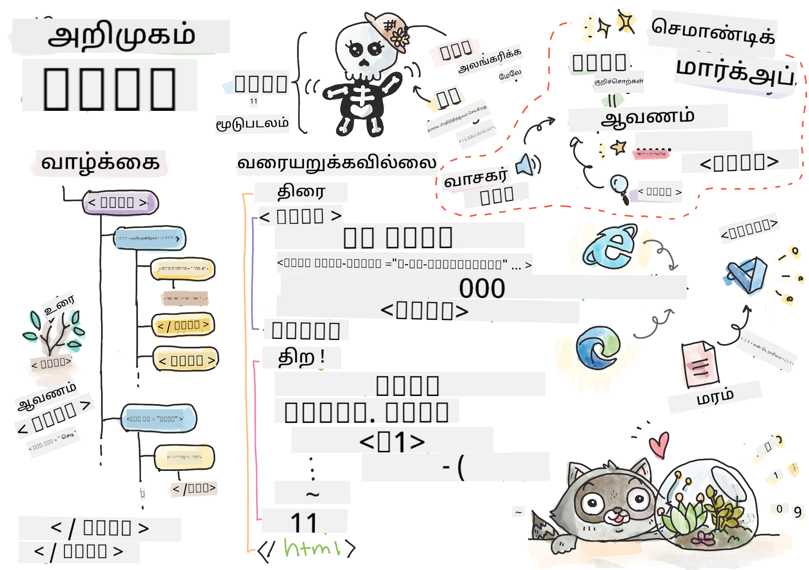
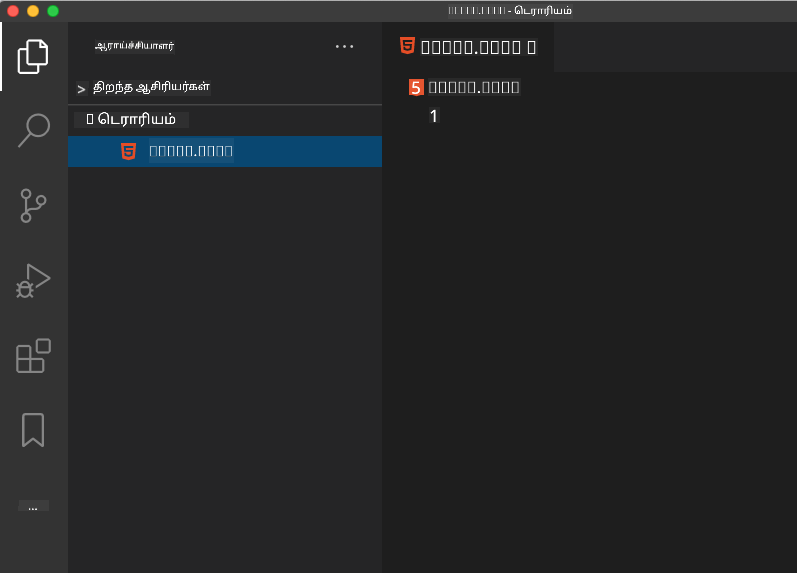

<!--
CO_OP_TRANSLATOR_METADATA:
{
  "original_hash": "89f7f9f800ce7c9f149e98baaae8491a",
  "translation_date": "2025-10-11T11:59:20+00:00",
  "source_file": "3-terrarium/1-intro-to-html/README.md",
  "language_code": "ta"
}
-->
# டெரேரியம் திட்டம் பகுதி 1: HTML அறிமுகம்


> ஸ்கெட்ச் நோட்: [டொமோமி இமுரா](https://twitter.com/girlie_mac)

## முன்-பாடம் வினாடி வினா

[முன்-பாடம் வினாடி வினா](https://ff-quizzes.netlify.app/web/quiz/15)

> வீடியோவை பாருங்கள்

> 
> [](https://www.youtube.com/watch?v=1TvxJKBzhyQ)

### அறிமுகம்

HTML, அல்லது ஹைப்பர் டெக்ஸ்ட் மார்க்அப் லாங்குவேஜ், இணையத்தின் 'எலும்புக்கூடு' ஆகும். CSS உங்கள் HTML-ஐ அலங்கரிக்கிறது, JavaScript அதற்கு உயிர் கொடுக்கிறது, ஆனால் HTML உங்கள் இணைய பயன்பாட்டின் உடலாகும். HTML இன் சின்டாக்ஸ் கூட அந்த எண்ணத்தை பிரதிபலிக்கிறது, ஏனெனில் இதில் "head", "body", மற்றும் "footer" டேக்கள் உள்ளன.

இந்த பாடத்தில், நாங்கள் HTML-ஐ பயன்படுத்தி நமது மெய்நிகர் டெரேரியம் இடைமுகத்தின் 'எலும்புக்கூடு' அமைப்பை உருவாக்கப் போகிறோம். இதில் ஒரு தலைப்பு மற்றும் மூன்று நெடுவரிசைகள் இருக்கும்: வலது மற்றும் இடது நெடுவரிசைகள், இங்கு இழுக்கக்கூடிய தாவரங்கள் இருக்கும், மற்றும் நடுவில் கண்ணாடி போன்ற டெரேரியம் இருக்கும் பகுதி. இந்த பாடத்தின் முடிவில், நீங்கள் நெடுவரிசைகளில் தாவரங்களை காண முடியும், ஆனால் இடைமுகம் கொஞ்சம் விசித்திரமாக இருக்கும்; கவலைப்படாதீர்கள், அடுத்த பகுதியில் நீங்கள் CSS ஸ்டைல்களை இடைமுகத்தில் சேர்த்து அதை அழகாக மாற்றுவீர்கள்.

### பணிகள்

உங்கள் கணினியில், 'terrarium' என்ற பெயரில் ஒரு கோப்புறையை உருவாக்கி, அதில் 'index.html' என்ற பெயரில் ஒரு கோப்பை உருவாக்கவும். நீங்கள் உங்கள் terrarium கோப்புறையை உருவாக்கிய பிறகு, ஒரு புதிய VS Code சாளரத்தைத் திறந்து, 'open folder' கிளிக் செய்து, உங்கள் புதிய கோப்புறைக்கு செல்லவும். Explorer பகுதியில் உள்ள சிறிய 'file' பொத்தானைக் கிளிக் செய்து புதிய கோப்பை உருவாக்கவும்:



அல்லது

உங்கள் git bash இல் இந்த கட்டளைகளைப் பயன்படுத்தவும்:
* `mkdir terrarium`
* `cd terrarium`
* `touch index.html`
* `code index.html` அல்லது `nano index.html`

> index.html கோப்புகள் ஒரு கோப்புறையில் இது இயல்புநிலை கோப்பு என்பதை உலாவிக்கு குறிக்கின்றன; `https://anysite.com/test` போன்ற URLs, `test` என்ற கோப்புறையுடன் `index.html` உள்ள ஒரு கோப்புறை அமைப்பைப் பயன்படுத்தி உருவாக்கப்படலாம்; URL இல் `index.html` காட்டப்பட வேண்டிய அவசியமில்லை.

---

## டாக்டைப் மற்றும் html டேக்கள்

HTML கோப்பின் முதல் வரி அதன் டாக்டைப் ஆகும். இந்த வரி கோப்பின் மிக மேலே இருக்க வேண்டும் என்பது கொஞ்சம் ஆச்சரியமாக இருக்கலாம், ஆனால் இது பழைய உலாவிகளில் பக்கத்தை தற்போதைய html விவரக்குறிப்புகளைப் பின்பற்றி ஒரு நிலையான முறையில் ரெண்டர் செய்ய உலாவிக்கு தெரிவிக்கிறது.

> குறிப்புகள்: VS Code இல், ஒரு டேக் மீது மவுஸ் வைத்து அதன் பயன்பாட்டைப் பற்றிய தகவல்களை MDN Reference வழிகாட்டுதல்களில் இருந்து பெறலாம்.

இரண்டாவது வரி `<html>` டேக் தொடக்க டேக் ஆக இருக்க வேண்டும், அதற்கு உடனடியாக அதன் முடிவு டேக் `</html>` வர வேண்டும். இந்த டேக்கள் உங்கள் இடைமுகத்தின் மூல கூறுகளாகும்.

### பணிகள்

உங்கள் `index.html` கோப்பின் மேல் பக்கத்தில் இந்த வரிகளைச் சேர்க்கவும்:

```HTML
<!DOCTYPE html>
<html></html>
```

✅ டாக்டைப் ஒரு கேள்வி சரம் மூலம் அமைக்கப்பட்டால் சில முறைமைகள் தீர்மானிக்கப்படலாம்: [Quirks Mode மற்றும் Standards Mode](https://developer.mozilla.org/docs/Web/HTML/Quirks_Mode_and_Standards_Mode). இந்த முறைமைகள் தற்போது பொதுவாக பயன்படுத்தப்படாத பழைய உலாவிகளை ஆதரிக்க பயன்படுத்தப்பட்டன (Netscape Navigator 4 மற்றும் Internet Explorer 5). நீங்கள் நிலையான டாக்டைப் அறிவிப்பை பின்பற்றலாம்.

---

## ஆவணத்தின் 'head'

HTML ஆவணத்தின் 'head' பகுதி உங்கள் இணைய பக்கத்தின் முக்கியமான தகவல்களை, [metadata](https://developer.mozilla.org/docs/Web/HTML/Element/meta) என அழைக்கப்படும் தகவல்களை உள்ளடக்கியது. எங்கள் வழக்கில், இந்த பக்கம் ரெண்டர் செய்ய அனுப்பப்படும் இணைய சேவையகத்திற்கு நான்கு விஷயங்களை நாங்கள் தெரிவிக்கிறோம்:

-   பக்கத்தின் தலைப்பு
-   பக்கத்தின் மெட்டாடேட்டா, இதில் அடங்கும்:
    -   'character set', பக்கத்தில் எந்த எழுத்து குறியீடு பயன்படுத்தப்படுகிறது என்பதைச் சொல்கிறது
    -   உலாவி தகவல், `x-ua-compatible` உட்பட, இது IE=edge உலாவி ஆதரிக்கப்படுகிறது என்பதை குறிக்கிறது
    -   பக்கம் ஏற்றப்படும் போது viewport எப்படி நடந்து கொள்ள வேண்டும் என்பதற்கான தகவல். viewport ஐ 1 என்ற ஆரம்ப அளவுக்கு அமைத்தல், பக்கம் முதலில் ஏற்றப்படும் போது ஜூம் நிலையை கட்டுப்படுத்துகிறது.

### பணிகள்

திறந்த மற்றும் மூடிய `<html>` டேக்களுக்கிடையில் உங்கள் ஆவணத்திற்கு ஒரு 'head' தொகுதியைச் சேர்க்கவும்.

```html
<head>
	<title>Welcome to my Virtual Terrarium</title>
	<meta charset="utf-8" />
	<meta http-equiv="X-UA-Compatible" content="IE=edge" />
	<meta name="viewport" content="width=device-width, initial-scale=1" />
</head>
```

✅ நீங்கள் இந்த மாதிரியான ஒரு viewport மெட்டா டேக் அமைத்தால் என்ன நடக்கும்: `<meta name="viewport" content="width=600">`? [viewport](https://developer.mozilla.org/docs/Web/HTML/Viewport_meta_tag) பற்றி மேலும் படிக்கவும்.

---

## ஆவணத்தின் `body`

### HTML டேக்கள்

HTML இல், உங்கள் .html கோப்பில் டேக்களைச் சேர்த்து ஒரு இணைய பக்கத்தின் கூறுகளை உருவாக்கலாம். ஒவ்வொரு டேகுக்கும் பொதுவாக ஒரு தொடக்க மற்றும் முடிவு டேக் இருக்கும், இதுபோல: `<p>hello</p>` ஒரு பத்தியை குறிக்க. உங்கள் இடைமுகத்தின் உடலை உருவாக்க, `<html>` டேக் ஜோடியின் உள்ளே `<body>` டேக்களைச் சேர்க்கவும்; உங்கள் மார்க்அப் இப்போது இவ்வாறு இருக்கும்:

### பணிகள்

```html
<!DOCTYPE html>
<html>
	<head>
		<title>Welcome to my Virtual Terrarium</title>
		<meta charset="utf-8" />
		<meta http-equiv="X-UA-Compatible" content="IE=edge" />
		<meta name="viewport" content="width=device-width, initial-scale=1" />
	</head>
	<body></body>
</html>
```

இப்போது, உங்கள் பக்கத்தை உருவாக்கத் தொடங்கலாம். பொதுவாக, ஒரு பக்கத்தில் தனித்தனியான கூறுகளை உருவாக்க `<div>` டேக்களைப் பயன்படுத்துகிறோம். நாங்கள் படங்களை உள்ளடக்கிய ஒரு தொடர் `<div>` கூறுகளை உருவாக்குவோம்.

### படங்கள்

ஒரு HTML டேக், மூடல் டேக் தேவையில்லாதது `` டேக் ஆகும், ஏனெனில் இது ஒரு `src` கூறை கொண்டுள்ளது, இது உருப்படியை ரெண்டர் செய்ய பக்கத்திற்கு தேவையான அனைத்து தகவல்களையும் கொண்டுள்ளது.

உங்கள் பயன்பாட்டில் `images` என்ற ஒரு கோப்புறையை உருவாக்கி, அதில் [மூலக் கோப்பு கோப்புறையில்](../../../../3-terrarium/solution/images) உள்ள அனைத்து படங்களையும் சேர்க்கவும்; (தாவரங்களின் 14 படங்கள் உள்ளன).

### பணிகள்

அந்த தாவரப் படங்களை `<body></body>` டேக்களுக்கிடையில் இரண்டு நெடுவரிசைகளில் சேர்க்கவும்:

```html
<div id="page">
	<div id="left-container" class="container">
		<div class="plant-holder">
			
		</div>
		<div class="plant-holder">
			
		</div>
		<div class="plant-holder">
			
		</div>
		<div class="plant-holder">
			
		</div>
		<div class="plant-holder">
			
		</div>
		<div class="plant-holder">
			
		</div>
		<div class="plant-holder">
			
		</div>
	</div>
	<div id="right-container" class="container">
		<div class="plant-holder">
			
		</div>
		<div class="plant-holder">
			
		</div>
		<div class="plant-holder">
			
		</div>
		<div class="plant-holder">
			
		</div>
		<div class="plant-holder">
			
		</div>
		<div class="plant-holder">
			
		</div>
		<div class="plant-holder">
			
		</div>
	</div>
</div>
```

> குறிப்பு: Spans மற்றும் Divs. Divs 'block' கூறுகளாகக் கருதப்படுகின்றன, Spans 'inline' ஆகும். இந்த divs-ஐ spans ஆக மாற்றினால் என்ன நடக்கும்?

இந்த மார்க்அப்புடன், தாவரங்கள் இப்போது திரையில் தோன்றும். இது மிகவும் மோசமாகத் தோன்றும், ஏனெனில் அவை இன்னும் CSS பயன்படுத்தி ஸ்டைல் செய்யப்படவில்லை, அதை அடுத்த பாடத்தில் செய்வோம்.

ஒவ்வொரு படத்திற்கும் alt உரை உள்ளது, இது படத்தை நீங்கள் காணவோ அல்லது ரெண்டர் செய்யவோ முடியாவிட்டால் தோன்றும். இது அணுகல் வசதிக்காக சேர்க்க வேண்டிய ஒரு முக்கிய பண்பாகும். எதிர்கால பாடங்களில் அணுகல் வசதியைப் பற்றி மேலும் அறியவும்; தற்போது, alt பண்புக்கூறு ஒரு பயனாளர் ஏதேனும் காரணத்தால் படத்தைப் பார்க்க முடியாதால் (மெதுவான இணைப்பு, src பண்புக்கூற்றில் பிழை அல்லது பயனர் ஒரு ஸ்கிரீன் ரீடரைப் பயன்படுத்தினால்) படத்திற்கு மாற்று தகவல்களை வழங்குகிறது என்பதை நினைவில் கொள்ளவும்.

✅ ஒவ்வொரு படத்திற்கும் ஒரே alt டேக் உள்ளது என்பதை கவனித்தீர்களா? இது நல்ல நடைமுறையா? ஏன் அல்லது ஏன் இல்லை? இந்த குறியீட்டை நீங்கள் மேம்படுத்த முடியுமா?

---

## அர்த்தமுள்ள மார்க்அப்

பொதுவாக, HTML எழுதும்போது அர்த்தமுள்ள 'அர்த்தங்கள்' பயன்படுத்துவது விரும்பத்தக்கது. அதாவது, HTML டேக்களை அவற்றுக்காக வடிவமைக்கப்பட்ட தரவின் வகை அல்லது தொடர்புக்கு நீங்கள் பயன்படுத்த வேண்டும். உதாரணமாக, ஒரு பக்கத்தின் முக்கிய தலைப்பு உரை `<h1>` டேக் பயன்படுத்த வேண்டும்.

உங்கள் தொடக்க `<body>` டேக் கீழே உள்ள வரியைச் சேர்க்கவும்:

```html
<h1>My Terrarium</h1>
```

அர்த்தமுள்ள மார்க்அப்பைப் பயன்படுத்துவது, உதாரணமாக தலைப்புகளை `<h1>` ஆகவும், வரிசையற்ற பட்டியல்களை `<ul>` ஆகவும் உருவாக்குவது, ஸ்கிரீன் ரீடர்களுக்கு ஒரு பக்கத்தின் வழியாகச் செல்ல உதவுகிறது. பொதுவாக, பொத்தான்கள் `<button>` ஆக எழுதப்பட வேண்டும், மற்றும் பட்டியல்கள் `<li>` ஆக இருக்க வேண்டும். குறிப்பாக ஸ்டைல் செய்யப்பட்ட `<span>` கூறுகளை கிளிக் ஹாண்ட்லர்களுடன் பயன்படுத்தி பொத்தான்களை உருவாக்குவது _சாத்தியமானது_, ஆனால், செயலிழந்த பயனாளர்கள் ஒரு பக்கத்தில் ஒரு பொத்தான் எங்கு இருக்கிறது என்பதை தீர்மானிக்கவும், அதனுடன் தொடர்பு கொள்ளவும், அந்த கூறு ஒரு பொத்தானாக தோன்றினால், தொழில்நுட்பங்களைப் பயன்படுத்துவது சிறந்தது. இந்த காரணத்திற்காக, முடிந்தவரை அர்த்தமுள்ள மார்க்அப்பைப் பயன்படுத்த முயற்சிக்கவும்.

✅ ஒரு ஸ்கிரீன் ரீடரைப் பற்றி பாருங்கள் மற்றும் [இது ஒரு இணைய பக்கத்துடன் எப்படி தொடர்பு கொள்கிறது](https://www.youtube.com/watch?v=OUDV1gqs9GA) என்பதைப் பாருங்கள். அர்த்தமற்ற மார்க்அப்பைப் பயன்படுத்துவது பயனாளரை ஏன் சிரமப்படுத்தும் என்பதை நீங்கள் காண முடியுமா?

## டெரேரியம்

இந்த இடைமுகத்தின் கடைசி பகுதி, டெரேரியத்தை உருவாக்க ஸ்டைல் செய்யப்படும் மார்க்அப்பை உருவாக்குவதை உள்ளடக்கியது.

### பணிகள்:

கடைசி `</div>` டேக் மேலே இந்த மார்க்அப்பைச் சேர்க்கவும்:

```html
<div id="terrarium">
	<div class="jar-top"></div>
	<div class="jar-walls">
		<div class="jar-glossy-long"></div>
		<div class="jar-glossy-short"></div>
	</div>
	<div class="dirt"></div>
	<div class="jar-bottom"></div>
</div>
```

✅ நீங்கள் இந்த மார்க்அப்பை திரையில் சேர்த்தாலும், எதுவும் ரெண்டர் செய்யப்படுவதில்லை என்பதை கவனிக்கிறீர்களா. ஏன்?

---

## 🚀சவால்

HTML இல் சில பழைய 'வயதான' டேக்கள் உள்ளன, அவற்றுடன் விளையாடுவது இன்னும் சுவாரஸ்யமாக இருக்கும், ஆனால் [இந்த டேக்கள்](https://developer.mozilla.org/docs/Web/HTML/Element#Obsolete_and_deprecated_elements) போன்ற காலாவதியான டேக்களை உங்கள் மார்க்அப்பில் பயன்படுத்த கூடாது. இருந்தாலும், `<marquee>` என்ற பழைய டேக்கை பயன்படுத்தி h1 தலைப்பை கிடைமட்டமாக சுழலச் செய்ய முடியுமா? (நீங்கள் அதை செய்தால், அதை பிறகு அகற்ற மறக்காதீர்கள்)

## பாடத்திற்குப் பிந்தைய வினாடி வினா

[பாடத்திற்குப் பிந்தைய வினாடி வினா](https://ff-quizzes.netlify.app/web/quiz/16)

## மதிப்பாய்வு & சுயபயிற்சி

HTML என்பது இணையத்தை இன்று இருக்கும் நிலைக்கு கொண்டு வந்த 'நம்பகமான மற்றும் உண்மையான' கட்டுமான அமைப்பு ஆகும். சில பழைய மற்றும் புதிய டேக்கள் பற்றிய வரலாற்றை கற்றுக்கொள்ளுங்கள். சில டேக்கள் ஏன் காலாவதியாகின, சில டேக்கள் ஏன் சேர்க்கப்பட்டன என்பதை நீங்கள் கண்டுபிடிக்க முடியுமா? எதிர்காலத்தில் எந்த டேக்கள் அறிமுகப்படுத்தப்படலாம்?

இணையம் மற்றும் மொபைல் சாதனங்களுக்கான தளங்களை உருவாக்குவது பற்றி மேலும் அறிய [Microsoft Learn](https://docs.microsoft.com/learn/modules/build-simple-website/?WT.mc_id=academic-77807-sagibbon) இல் கற்றுக்கொள்ளுங்கள்.

## பணிக்குறிப்பு

[உங்கள் HTML பயிற்சி: ஒரு வலைப்பதிவு மாதிரியை உருவாக்கவும்](assignment.md)

---

**குறிப்பு**:  
இந்த ஆவணம் [Co-op Translator](https://github.com/Azure/co-op-translator) என்ற AI மொழிபெயர்ப்பு சேவையைப் பயன்படுத்தி மொழிபெயர்க்கப்பட்டுள்ளது. நாங்கள் துல்லியத்திற்காக முயற்சிக்கின்றோம், ஆனால் தானியக்க மொழிபெயர்ப்புகளில் பிழைகள் அல்லது தவறான தகவல்கள் இருக்கக்கூடும் என்பதை தயவுசெய்து கவனத்தில் கொள்ளுங்கள். அதன் தாய்மொழியில் உள்ள மூல ஆவணம் அதிகாரப்பூர்வ ஆதாரமாக கருதப்பட வேண்டும். முக்கியமான தகவல்களுக்கு, தொழில்முறை மனித மொழிபெயர்ப்பு பரிந்துரைக்கப்படுகிறது. இந்த மொழிபெயர்ப்பைப் பயன்படுத்துவதால் ஏற்படும் எந்த தவறான புரிதல்கள் அல்லது தவறான விளக்கங்களுக்கு நாங்கள் பொறுப்பல்ல.