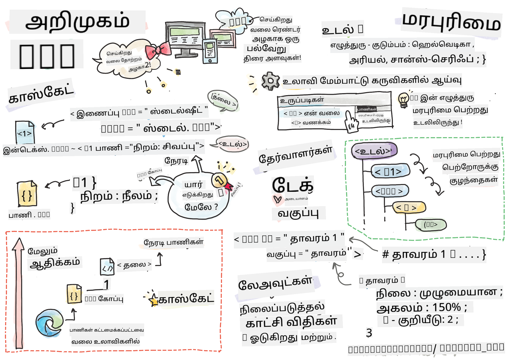
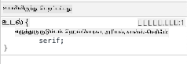

<!--
CO_OP_TRANSLATOR_METADATA:
{
  "original_hash": "acb5ae00cde004304296bb97da8ff4c3",
  "translation_date": "2025-10-11T11:58:10+00:00",
  "source_file": "3-terrarium/2-intro-to-css/README.md",
  "language_code": "ta"
}
-->
# டெரேரியம் திட்டம் பகுதி 2: CSS அறிமுகம்


> ஸ்கெட்ச்நோட்: [Tomomi Imura](https://twitter.com/girlie_mac)

## முன்-வகுப்பு வினாடி வினா

[முன்-வகுப்பு வினாடி வினா](https://ff-quizzes.netlify.app/web/quiz/17)

### அறிமுகம்

CSS, அல்லது Cascading Style Sheets, உங்கள் வலைத்தளத்தை அழகாகக் காண்பிக்க உதவும் ஒரு முக்கியமான பிரச்சினையைத் தீர்க்கிறது. உங்கள் பயன்பாடுகளை அழகாகவும் பயனுள்ளவையாகவும் மாற்றுவதுடன், CSS மூலம் Responsive Web Design (RWD) உருவாக்கலாம் - உங்கள் பயன்பாடுகள் எந்த திரை அளவிலும் அழகாகத் தோன்றும். CSS என்பது உங்கள் பயன்பாட்டை அழகாகக் காண்பிக்க மட்டுமல்ல; அதன் விவரக்குறிப்பு அனிமேஷன்கள் மற்றும் மாற்றங்களை உள்ளடக்கியது, இது உங்கள் பயன்பாடுகளுக்கு நவீன தொடர்புகளை உருவாக்க உதவுகிறது. CSS Working Group தற்போதைய CSS விவரக்குறிப்புகளை பராமரிக்க உதவுகிறது; அவர்களின் பணியை [World Wide Web Consortium's site](https://www.w3.org/Style/CSS/members) இல் பின்தொடரலாம்.

> கவனிக்கவும், CSS என்பது இணையத்தில் உள்ள அனைத்தையும் போலவே வளர்ந்து வரும் ஒரு மொழி, மற்றும் அனைத்து உலாவிகளும் புதிய விவரக்குறிப்புகளை ஆதரிக்காது. உங்கள் செயல்பாடுகளை [CanIUse.com](https://caniuse.com) மூலம் சரிபார்க்கவும்.

இந்த பாடத்தில், நாங்கள் எங்கள் ஆன்லைன் டெரேரியத்திற்கு ஸ்டைல்களைச் சேர்த்து, CSS தொடர்பான பல கருத்துகளைப் பற்றி மேலும் அறிந்து கொள்வோம்: காஸ்கேட், மரபு, மற்றும் செலக்டர்கள், நிலைமைகள், மற்றும் CSS-ஐ பயன்படுத்தி லேஅவுட்களை உருவாக்குதல். இந்த செயல்முறையில், டெரேரியத்தை அமைத்து, உண்மையான டெரேரியத்தை உருவாக்குவோம்.

### முன்-தரப்பு

உங்கள் டெரேரியத்திற்கு HTML உருவாக்கப்பட்டு, ஸ்டைலிங் செய்ய தயாராக இருக்க வேண்டும்.

> வீடியோவைப் பார்க்கவும்

> 
> [](https://www.youtube.com/watch?v=6yIdOIV9p1I)

### பணிகள்

உங்கள் டெரேரியம் கோப்புறையில், `style.css` என்ற புதிய கோப்பை உருவாக்கவும். அந்த கோப்பை `<head>` பிரிவில் இறக்குமதி செய்யவும்:

```html
<link rel="stylesheet" href="./style.css" />
```

---

## காஸ்கேட்

Cascading Style Sheets 'காஸ்கேட்' என்ற கருத்தை உள்ளடக்கியது, அதாவது ஒரு ஸ்டைல் பயன்பாட்டின் முன்னுரிமை வழிகாட்டுகிறது. ஒரு வலைத்தளத்தின் ஆசிரியர் அமைத்த ஸ்டைல்கள் உலாவி அமைத்தவற்றை விட முன்னுரிமை பெறும். 'Inline' அமைக்கப்பட்ட ஸ்டைல்கள் வெளிப்புற ஸ்டைல் ஷீட்டில் அமைக்கப்பட்டவற்றை விட முன்னுரிமை பெறும்.

### பணிகள்

உங்கள் `<h1>` டேக்கிற்கு "color: red" என்ற inline ஸ்டைலைச் சேர்க்கவும்:

```HTML
<h1 style="color: red">My Terrarium</h1>
```

பின்னர், உங்கள் `style.css` கோப்பில் பின்வரும் குறியீட்டைச் சேர்க்கவும்:

```CSS
h1 {
 color: blue;
}
```

✅ உங்கள் வலை பயன்பாட்டில் எந்த நிறம் காட்டப்படுகிறது? ஏன்? ஸ்டைல்களை மீறுவதற்கான வழியை நீங்கள் கண்டுபிடிக்க முடியுமா? நீங்கள் இதை எப்போது செய்ய விரும்புவீர்கள், அல்லது ஏன் செய்யக்கூடாது?

---

## மரபு

ஸ்டைல்கள் ஒரு முன்னோடி ஸ்டைலிலிருந்து ஒரு சந்ததி ஸ்டைலுக்கு மரபாகக் கடத்தப்படுகின்றன, அதாவது உள்ளமைக்கப்பட்ட கூறுகள் தங்கள் பெற்றோரின் ஸ்டைல்களை மரபாகக் கடத்துகின்றன.

### பணிகள்

உடலின் எழுத்துருவை ஒரு குறிப்பிட்ட எழுத்துருவாக அமைத்து, ஒரு உள்ளமைக்கப்பட்ட கூறின் எழுத்துருவைச் சரிபார்க்கவும்:

```CSS
body {
	font-family: helvetica, arial, sans-serif;
}
```

உங்கள் உலாவியின் கன்சோலில் 'Elements' தாவலைத் திறந்து, H1 இன் எழுத்துருவைப் பாருங்கள். இது உடலிலிருந்து அதன் எழுத்துருவை மரபாகக் கடத்துகிறது, உலாவியில் குறிப்பிடப்பட்டுள்ளபடி:



✅ ஒரு உள்ளமைக்கப்பட்ட ஸ்டைல் வேறொரு பண்பை மரபாகக் கடத்த முடியுமா?

---

## CSS செலக்டர்கள்

### டேக்கள்

இப்போது வரை, உங்கள் `style.css` கோப்பில் சில டேக்குகள் மட்டுமே ஸ்டைலிங் செய்யப்பட்டுள்ளன, மற்றும் பயன்பாடு மிகவும் விசித்திரமாகத் தோன்றுகிறது:

```CSS
body {
	font-family: helvetica, arial, sans-serif;
}

h1 {
	color: #3a241d;
	text-align: center;
}
```

இந்த டேக்கை ஸ்டைலிங் செய்வது தனித்துவமான கூறுகளை கட்டுப்படுத்த உதவுகிறது, ஆனால் உங்கள் டெரேரியத்தில் பல தாவரங்களின் ஸ்டைல்களை நீங்கள் கட்டுப்படுத்த வேண்டும். இதைச் செய்ய CSS செலக்டர்களை பயன்படுத்த வேண்டும்.

### Ids

இடது மற்றும் வலது கெண்டெய்னர்களை அமைக்க சில ஸ்டைல்களைச் சேர்க்கவும். மார்க்அப்பில் ஒரு இடது கெண்டெய்னர் மற்றும் ஒரு வலது கெண்டெய்னர் மட்டுமே உள்ளதால், அவற்றுக்கு Ids கொடுக்கப்பட்டுள்ளது. அவற்றை ஸ்டைலிங் செய்ய, `#` பயன்படுத்தவும்:

```CSS
#left-container {
	background-color: #eee;
	width: 15%;
	left: 0px;
	top: 0px;
	position: absolute;
	height: 100%;
	padding: 10px;
}

#right-container {
	background-color: #eee;
	width: 15%;
	right: 0px;
	top: 0px;
	position: absolute;
	height: 100%;
	padding: 10px;
}
```

இங்கே, நீங்கள் இந்த கெண்டெய்னர்களை திரையின் இடது மற்றும் வலது பக்கங்களில் முழுமையாக அமைக்க absolute நிலைமையைப் பயன்படுத்தியுள்ளீர்கள், மற்றும் அவற்றின் அகலத்தை சதவீதங்களில் பயன்படுத்தியுள்ளீர்கள், இதனால் அவை சிறிய மொபைல் திரைகளுக்கு அளவிட முடியும்.

✅ இந்த குறியீடு மிகவும் மீண்டும் மீண்டும் உள்ளது, எனவே "DRY" (Don't Repeat Yourself) இல்லை; Id மற்றும் class-ஐப் பயன்படுத்தி இந்த Ids-ஐ ஸ்டைலிங் செய்ய சிறந்த வழியை நீங்கள் கண்டுபிடிக்க முடியுமா? நீங்கள் மார்க்அப்பை மாற்றி CSS-ஐ மறுசீரமைக்க வேண்டும்:

```html
<div id="left-container" class="container"></div>
```

### Classes

மேலுள்ள உதாரணத்தில், நீங்கள் திரையில் இரண்டு தனித்துவமான கூறுகளை ஸ்டைலிங் செய்துள்ளீர்கள். திரையில் பல கூறுகளுக்கு ஸ்டைல்கள் பொருந்த வேண்டும் என்றால், CSS classes-ஐப் பயன்படுத்தலாம். இடது மற்றும் வலது கெண்டெய்னர்களில் தாவரங்களை அமைக்க இதைச் செய்யவும்.

கவனிக்கவும், HTML மார்க்அப்பில் ஒவ்வொரு தாவரத்திற்கும் Ids மற்றும் classes ஆகியவற்றின் கலவையைக் கொண்டுள்ளது. Ids இங்கே நீங்கள் பின்னர் சேர்க்கும் JavaScript மூலம் டெரேரியம் தாவர இடமாற்றத்தை மாற்றுவதற்குப் பயன்படுத்தப்படுகிறது. Classes, எனினும், அனைத்து தாவரங்களுக்கும் ஒரு குறிப்பிட்ட ஸ்டைலை வழங்குகிறது.

```html
<div class="plant-holder">
	
</div>
```

உங்கள் `style.css` கோப்பில் பின்வரும் குறியீட்டைச் சேர்க்கவும்:

```CSS
.plant-holder {
	position: relative;
	height: 13%;
	left: -10px;
}

.plant {
	position: absolute;
	max-width: 150%;
	max-height: 150%;
	z-index: 2;
}
```

இந்த குறியீட்டில் குறிப்பிடத்தக்கது relative மற்றும் absolute நிலைமைகளின் கலவையாகும், இதைப் பற்றி நாம் அடுத்த பிரிவில் விவரமாகக் காண்போம். உயரங்களை சதவீதங்களில் கையாளும் விதத்தை கவனிக்கவும்:

நீங்கள் தாவர ஹோல்டரின் உயரத்தை 13% ஆக அமைத்துள்ளீர்கள், இது அனைத்து தாவரங்களும் ஒவ்வொரு செங்குத்து கெண்டெய்னரிலும் திரையிடப்படுவதற்கான நல்ல எண்ணிக்கையாகும், ஸ்க்ரோலிங் தேவையின்றி.

தாவர ஹோல்டரை இடது பக்கம் நகர்த்தி, தாவரங்கள் தங்கள் கெண்டெய்னரில் மையமாக இருக்க அனுமதிக்கிறது. படங்களில் பெரிய அளவிலான வெளிப்படையான பின்னணி உள்ளது, இதனால் அவை அதிகமாக இழுக்கக்கூடியதாக இருக்கும், எனவே திரையில் சிறப்பாக பொருந்த இடது பக்கம் தள்ளப்பட வேண்டும்.

பின்னர், தாவரத்திற்கு 150% ஆக max-width கொடுக்கப்பட்டுள்ளது. உலாவி அளவிடும்போது இது குறைக்க அனுமதிக்கிறது. உங்கள் உலாவியை மீளமைக்க முயற்சிக்கவும்; தாவரங்கள் தங்கள் கெண்டெய்னர்களில் இருக்கின்றன, ஆனால் பொருந்துவதற்காக அளவிடுகின்றன.

மேலும் குறிப்பிடத்தக்கது z-index-ஐப் பயன்படுத்துவது, இது ஒரு கூறின் சார்ந்த உயரத்தை கட்டுப்படுத்துகிறது (அதனால் தாவரங்கள் கெண்டெய்னரின் மேல் அமர்ந்து, டெரேரியத்தின் உள்ளே அமர்ந்திருப்பது போல தோன்றுகிறது).

✅ ஏன் தாவர ஹோல்டர் மற்றும் தாவர CSS செலக்டரை இரண்டையும் தேவை?

## CSS நிலைமைகள்

நிலைமைகள் பண்புகளை (static, relative, fixed, absolute, மற்றும் sticky நிலைகள்) கலப்பது கொஞ்சம் சிக்கலாக இருக்கலாம், ஆனால் சரியாக செய்யும்போது உங்கள் பக்கங்களில் உள்ள கூறுகளை நன்றாகக் கட்டுப்படுத்த உதவுகிறது.

Absolute நிலைமையிலுள்ள கூறுகள், அவற்றின் அருகிலுள்ள நிலைமையிலுள்ள முன்னோடிகளின் அடிப்படையில் அமைக்கப்படுகின்றன, மற்றும் அவை இல்லாவிட்டால், ஆவணத்தின் உடலின் அடிப்படையில் அமைக்கப்படும்.

Relative நிலைமையிலுள்ள கூறுகள், CSS-இன் வழிகாட்டுதலின் அடிப்படையில் அதன் ஆரம்ப நிலையிலிருந்து அதன் இடத்தைச் சரிசெய்ய அமைக்கப்படுகின்றன.

எங்கள் மாதிரியில், `plant-holder` என்பது ஒரு relative-நிலைமையிலுள்ள கூறாகும், இது ஒரு absolute-நிலைமையிலுள்ள கெண்டெய்னருக்குள் அமைக்கப்பட்டுள்ளது. இதன் விளைவாக, பக்கப்பட்டி கெண்டெய்னர்கள் இடது மற்றும் வலது பக்கங்களில் பின்பற்றப்படுகின்றன, மற்றும் plant-holder உள்ளமைக்கப்பட்டு, பக்கப்பட்டிகளில் தன்னைத்தானே சரிசெய்து, தாவரங்கள் செங்குத்து வரிசையில் அமைக்க இடம் கொடுக்கிறது.

> `plant` தானாகவே absolute நிலைமையிலுள்ளது, இது அதை இழுக்கக்கூடியதாக மாற்றுவதற்கு அவசியமாகும், நீங்கள் அடுத்த பாடத்தில் கண்டுபிடிப்பீர்கள்.

✅ பக்க கெண்டெய்னர்கள் மற்றும் plant-holder-இன் நிலைமைகளின் வகைகளை மாற்ற முயற்சிக்கவும். என்ன நடக்கிறது?

## CSS லேஅவுட்கள்

இப்போது நீங்கள் CSS-ஐப் பயன்படுத்தி டெரேரியத்தை உருவாக்குவதற்கான உங்கள் அறிவை பயன்படுத்துவீர்கள்!

முதலில், `.terrarium` div குழந்தைகளை CSS-ஐப் பயன்படுத்தி ஒரு வட்டமான செங்குத்து கோணமாக ஸ்டைலிங் செய்யவும்:

```CSS
.jar-walls {
	height: 80%;
	width: 60%;
	background: #d1e1df;
	border-radius: 1rem;
	position: absolute;
	bottom: 0.5%;
	left: 20%;
	opacity: 0.5;
	z-index: 1;
}

.jar-top {
	width: 50%;
	height: 5%;
	background: #d1e1df;
	position: absolute;
	bottom: 80.5%;
	left: 25%;
	opacity: 0.7;
	z-index: 1;
}

.jar-bottom {
	width: 50%;
	height: 1%;
	background: #d1e1df;
	position: absolute;
	bottom: 0%;
	left: 25%;
	opacity: 0.7;
}

.dirt {
	width: 60%;
	height: 5%;
	background: #3a241d;
	position: absolute;
	border-radius: 0 0 1rem 1rem;
	bottom: 1%;
	left: 20%;
	opacity: 0.7;
	z-index: -1;
}
```

இங்கே சதவீதங்களின் பயன்பாட்டைக் கவனிக்கவும். உங்கள் உலாவியை குறைக்க முயற்சிக்கவும், ஜார் எப்படி அளவிடுகிறது என்பதைப் பார்க்கலாம். மேலும் ஜார் கூறுகளின் அகலங்கள் மற்றும் உயர சதவீதங்களை கவனிக்கவும், மற்றும் ஒவ்வொரு கூறும் மையமாக அமைக்கப்பட்டு, viewport-இன் அடிப்பகுதியில் பின்பற்றப்படுகின்றன.

நாங்கள் `rem` ஐ border-radius க்கு பயன்படுத்துகிறோம், இது எழுத்துரு சார்ந்த நீளம். இந்த வகையான சார்ந்த அளவீட்டைப் பற்றி மேலும் [CSS spec](https://www.w3.org/TR/css-values-3/#font-relative-lengths) இல் படிக்கவும்.

✅ ஜார் நிறங்களை மற்றும் மண்ணின் வெளிப்படுதலை மாற்ற முயற்சிக்கவும். என்ன நடக்கிறது? ஏன்?

---

## 🚀சவால்

ஜாரின் இடது கீழ் பகுதியில் 'பபுள்' பிரகாசத்தைச் சேர்த்து, அதை கண்ணாடி போன்றதாகக் காண்பிக்கவும். `.jar-glossy-long` மற்றும் `.jar-glossy-short` ஆகியவற்றை பிரதிபலிக்கப்பட்ட பிரகாசமாக ஸ்டைலிங் செய்ய வேண்டும். இது எப்படி தோன்றும்:


பாடத்திற்குப் பிந்தைய வினாடி வினாவை முடிக்க, இந்த Learn module-ஐப் பின்பற்றவும்: [Style your HTML app with CSS](https://docs.microsoft.com/learn/modules/build-simple-website/4-css-basics/?WT.mc_id=academic-77807-sagibbon)

## பாடத்திற்குப் பிந்தைய வினாடி வினா

[பாடத்திற்குப் பிந்தைய வினாடி வினா](https://ff-quizzes.netlify.app/web/quiz/18)

## மதிப்பீடு & சுயபடிப்பு

CSS மிகவும் எளிதாகத் தோன்றும், ஆனால் அனைத்து உலாவிகளுக்கும் மற்றும் அனைத்து திரை அளவுகளுக்கும் ஒரு பயன்பாட்டை சரியாக ஸ்டைலிங் செய்ய முயற்சிக்கும் போது பல சவால்கள் உள்ளன. CSS-Grid மற்றும் Flexbox ஆகியவை இந்த வேலைகளை கொஞ்சம் கட்டமைப்பாகவும் நம்பகமாகவும் செய்ய உருவாக்கப்பட்ட கருவிகள். இந்த கருவிகளை [Flexbox Froggy](https://flexboxfroggy.com/) மற்றும் [Grid Garden](https://codepip.com/games/grid-garden/) மூலம் கற்றுக்கொள்ளுங்கள்.

## பணிக்கட்டளை

[CSS Refactoring](assignment.md)

---

**குறிப்பு**:  
இந்த ஆவணம் [Co-op Translator](https://github.com/Azure/co-op-translator) என்ற AI மொழிபெயர்ப்பு சேவையைப் பயன்படுத்தி மொழிபெயர்க்கப்பட்டுள்ளது. நாங்கள் துல்லியத்திற்காக முயற்சிக்கிறோம், ஆனால் தானியங்கி மொழிபெயர்ப்புகளில் பிழைகள் அல்லது தவறான தகவல்கள் இருக்கக்கூடும் என்பதை கவனத்தில் கொள்ளவும். அதன் தாய்மொழியில் உள்ள மூல ஆவணம் அதிகாரப்பூர்வ ஆதாரமாக கருதப்பட வேண்டும். முக்கியமான தகவல்களுக்கு, தொழில்முறை மனித மொழிபெயர்ப்பு பரிந்துரைக்கப்படுகிறது. இந்த மொழிபெயர்ப்பைப் பயன்படுத்துவதால் ஏற்படும் எந்த தவறான புரிதல்கள் அல்லது தவறான விளக்கங்களுக்கு நாங்கள் பொறுப்பல்ல.