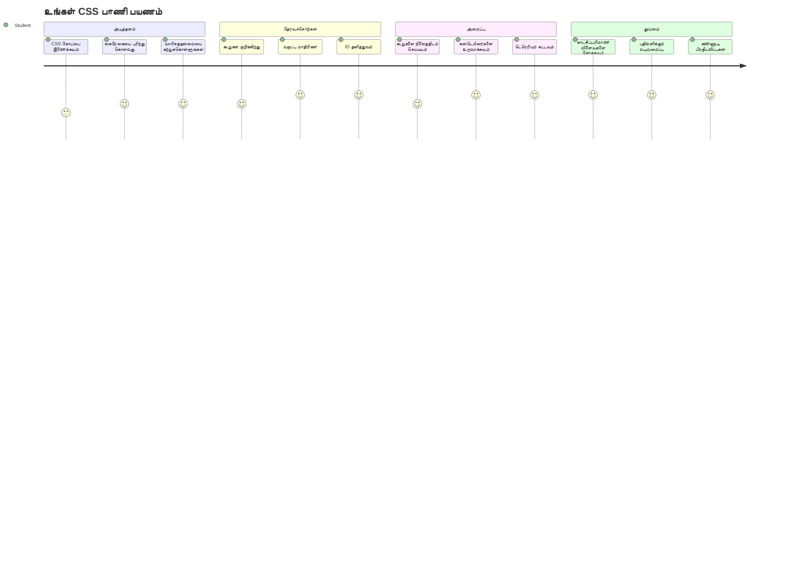
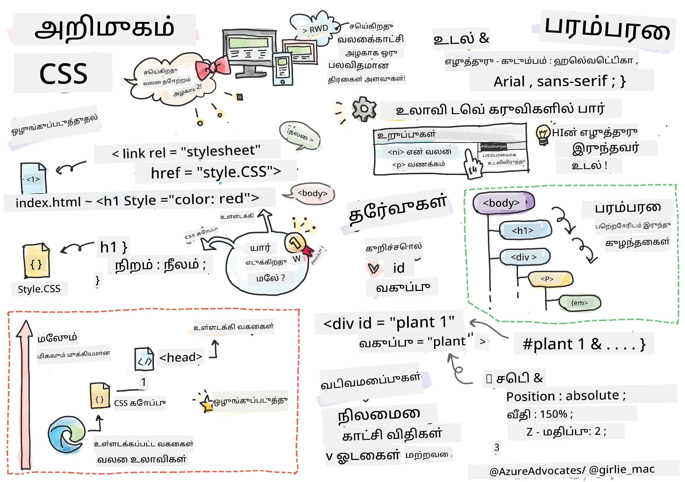
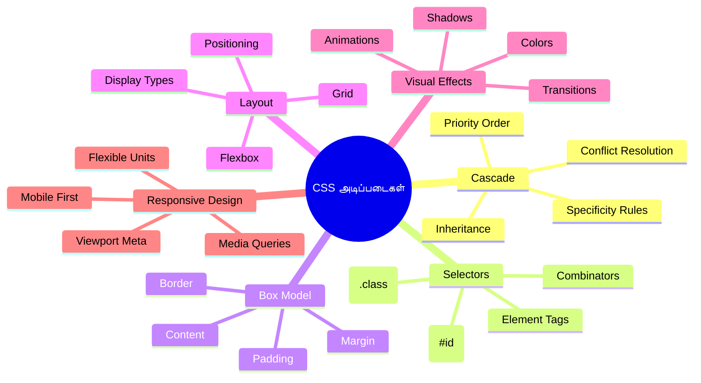
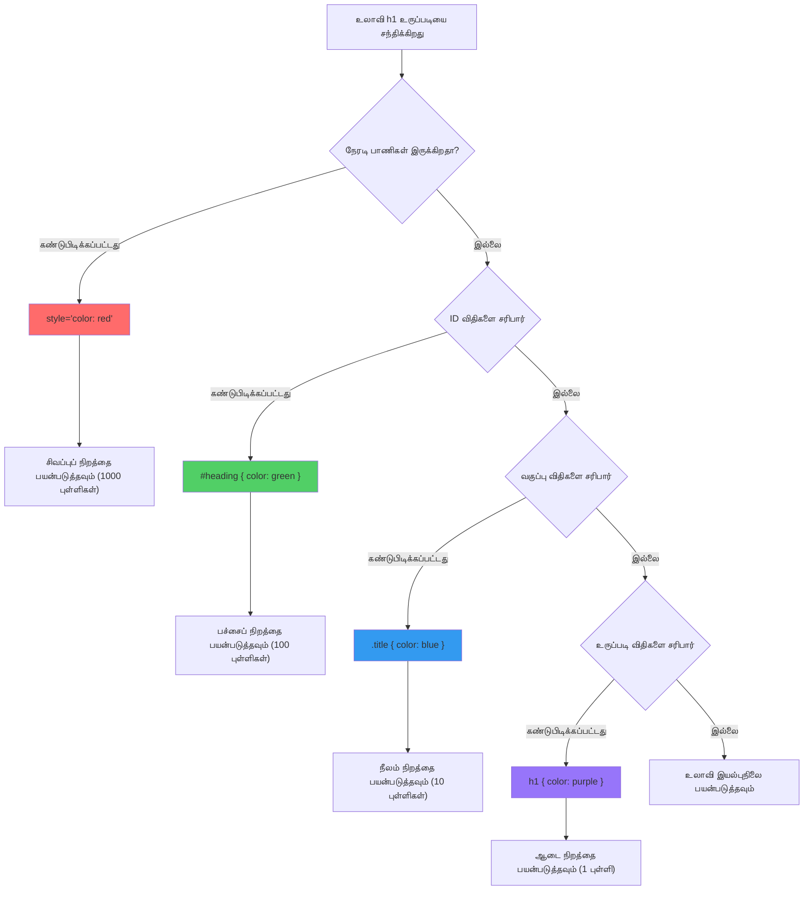
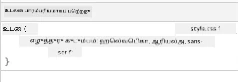
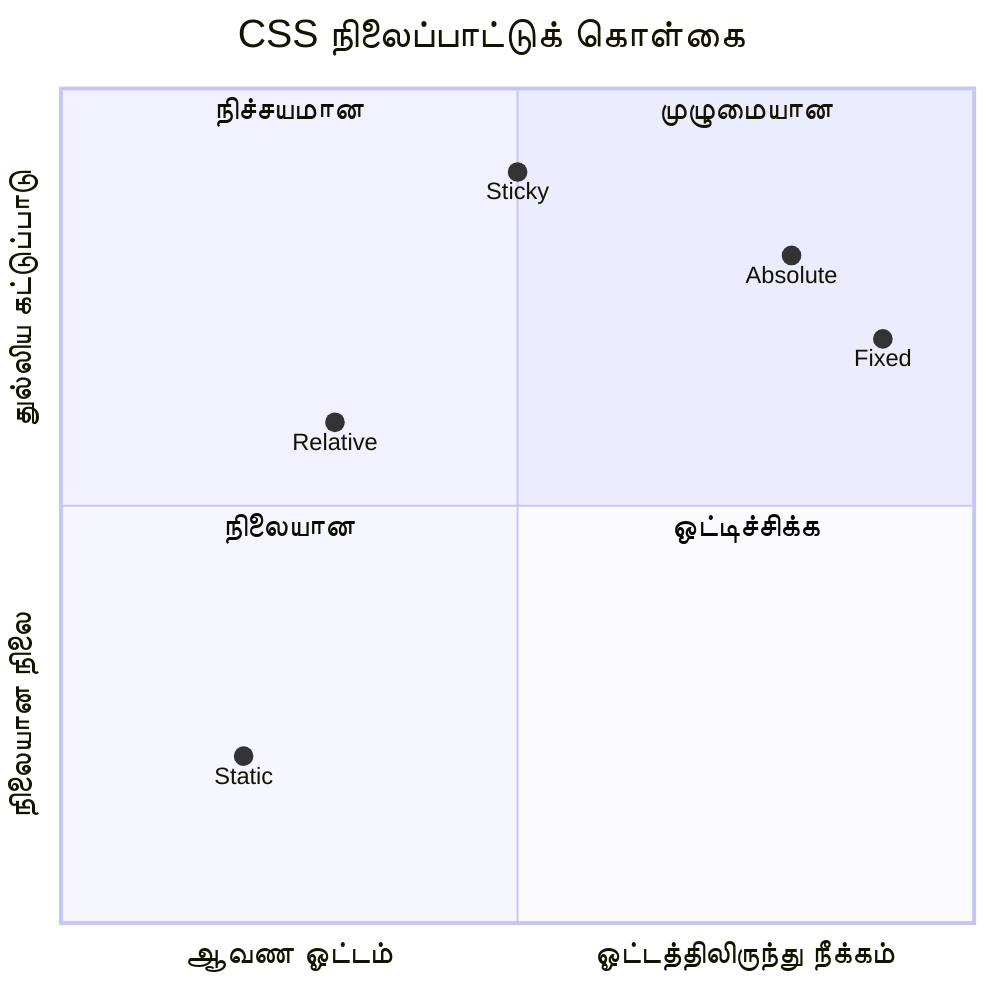
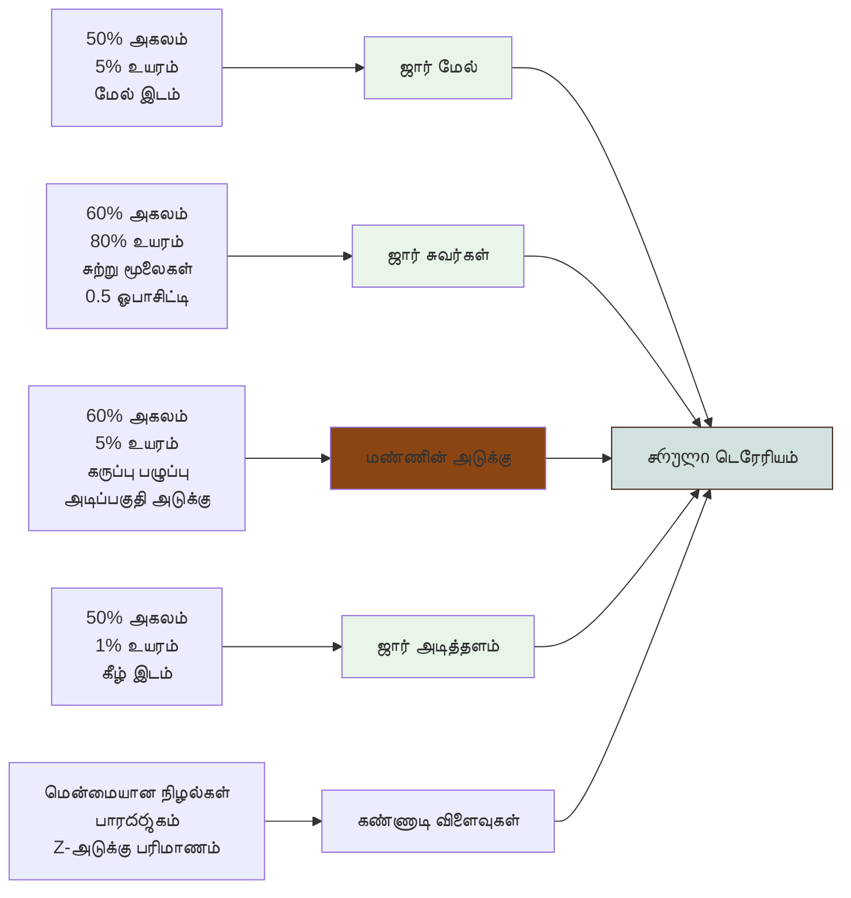
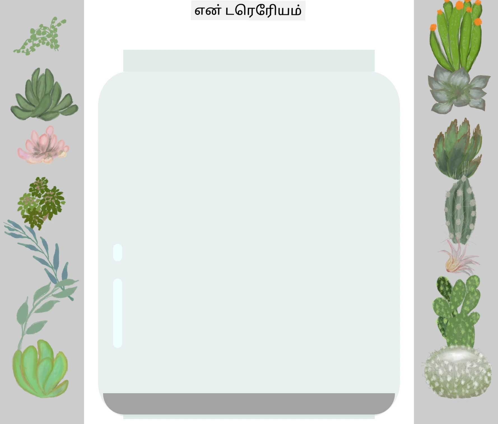
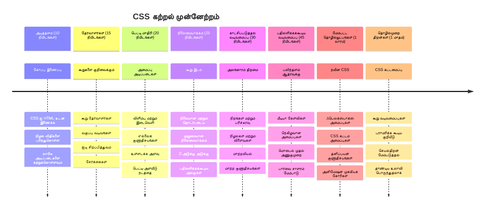

<!--
CO_OP_TRANSLATOR_METADATA:
{
  "original_hash": "e39f3a4e3bcccf94639e3af1248f8a4d",
  "translation_date": "2026-01-07T13:48:14+00:00",
  "source_file": "3-terrarium/2-intro-to-css/README.md",
  "language_code": "ta"
}
-->
# Terrarium திட்டம் பகுதி 2: CSS அறிமுகம்



> ஸ்கெட்ச் நோட் [Tomomi Imura](https://twitter.com/girlie_mac) அவர்களின்

உங்கள் HTML டெர்ரேரியம் எவ்வாறு அடிப்படையாகத் தெரியப்பட்டது என்பதை நினைவிருக்கிறதா? CSS என்பது அந்த சுலபமான அமைப்பை கண்ணுக்கு அழகான ஒன்றாக மாற்றும் இடமாகும்.

HTML என்பது வீட்டின் அமைப்பை கட்டுவதுபோல் என்றால், CSS என்பது அதனை வீட்டைப் போன்று உணர வைக்கும் அனைத்து விஷயங்களும் - வண்ணம் பூச்சு, உட்காரும் பொருள் அமைப்பு, விளக்கு ஒளி மற்றும் அறைகள் எப்படி இணைகின்றன என்பதும் ஆகும். வெர்செய்ல்ஸ் அரண்மனை எவ்வாறு சுலபமான வேட்டை குடிசை உணர்தலாக இருந்தது, ஆனால் அலங்காரம் மற்றும் அமைப்பு கவனமாக மாற்றித் உலகின் மிகச் சிறந்த கட்டிடங்களில் ஒன்றாக மாறியது என்பதை நினைத்துப் பாருங்கள்.

இன்று, நாங்கள் உங்கள் டெர்ரேரியத்தை செயல்பாட்டிலிருந்து உருப்படியானதாக மாற்றப்போகிறோம். நீங்கள் கூறுகளை துல்லியமாக இடமிடுவது, பல்வேறு திரை அளவுகளுக்கு ஏற்ப கட்டமைப்புகளை பதில் சொல்லுவது மற்றும் வலைத்தளங்களை ஈர்க்கும் காட்சி அழகை உருவாக்குவது கற்றுக்கொள்ளப்போகிறேன்.

இந்த பாடத்தின் இறுதியில், உங்கள் திட்டத்தை மிகவும் மேம்படுத்தும் CSS ஸ்டைலிங் எப்படி இருப்பதைக் காண்பீர்கள். உங்கள் டெர்ரேரியத்திற்கு சில ஸ்டைலை சேர்ப்போம்.


## முன்படிப்பு வினாடி வினா

[முன்படிப்பு வினாடி வினா](https://ff-quizzes.netlify.app/web/quiz/17)

## CSS உடன் திசைமுகமாக தொடங்குதல்

CSS பொதுவாக "அழகாக செய்யும்" என்று நினைக்கப்படுகின்றது, ஆனால் அது ஒரு மிக விரிவான நோக்கத்தைச் சேவிக்கிறது. CSS என்பது திரைப்பட இயக்குனரானவரைபோல் - நீங்கள் எல்லாம் எப்படி தோன்றுகிறது என்பதையும், அது எப்படி நகர்கிறது, தொடர்பு கொள்ளுதல் எப்படி பதிலளிக்கிறது மற்றும் வேறுபட்ட சூழல்களுக்கு எவ்வாறு ஏற்படுகிறது என்பதையும் கட்டுப்படுத்துகிறீர்கள்.

நவீன CSS மிக திறமையானது. நீங்கள் கோடுகளை எழுதலாம், அவை தானாகவே தொலைபேசி, டேப்லெட் மற்றும் டெஸ்க்டாப் கணினிகளுக்கான கட்டமைப்புகளை சரி செய்து கொண்டிருக்கும். நீங்கள் பரந்து பரவிய அனிமேஷன்களை உருவாக்கலாம், அவை பயனாளர்களின் கவனத்தை தேவையான இடத்திற்கு வழிநடத்தும். எல்லாம் ஒன்றாக செயல்படும் போது முடிவுகள் மிகவும் பிரமாதமாக இருக்கும்.

> 💡 **பிரோ டிப்**: CSS எப்போதும் புதிய அம்சங்களும் திறன்களும் கொண்டு முன்னேறுகிறது. புதிய CSS அம்சங்களுக்கு உலாவி ஆதரவைக் காண [CanIUse.com](https://caniuse.com) ஐ எப்போதும் சரிபார்க்கவும்.

**இந்த பாடத்தில் நாம் எதை அடைவோம்:**
- **உருவாக்கும்** நவீன CSS தொழில்நுட்பங்களை பயன்படுத்தி உங்கள் டெர்ரேரியத்திற்கான முழுப்பூர்வ காட்சி வடிவமைப்பை
- **ஆய்வு செய்வது** அடிப்படைக் கருத்துக்களை, போலி, மரபுரிமை மற்றும் CSS தேர்வீடுகளை
- **நடாத்துவது** பதிலளிக்கும் இடம்பிடிப்பு மற்றும் கட்டமைப்பு நெறிமுறைகளை
- **கட்டமைப்பது** CSS வடிவங்கள் மற்றும் ஸ்டைலிங்கை பயன்படுத்தி டெர்ரேரியம் கன்டெய்னரை

### முன்னிருப்பு

நீங்கள் முன்பு பாடத்தில் இருந்து உங்கள் டெர்ரேரியதுக்கான HTML அமைப்பை நிறைவு செய்திருக்க வேண்டும் மற்றும் அதை ஸ்டைலிங் செய்ய தயார் நிலையில் வைத்திருக்க வேண்டும்.

> 📺 **வீடியோ வளம்**: இந்த உதவிகரமான வீடியோ நடைமுறையைப் பாருங்கள்
>
> [](https://www.youtube.com/watch?v=6yIdOIV9p1I)

### உங்கள் CSS கோப்பை அமைத்தல்

ஸ்டைலிங் தொடங்குவதற்கு முன், CSS ஐ எங்கள் HTML உடன் இணைக்கவேண்டும். இந்த இணைப்பு உலாவிக்கு எங்கிருந்து டெர்ரேரியத்தின் ஸ்டைலிங் சட்டங்களை பெற வேண்டும் என்பதைக் கூறுகிறது.

உங்கள் டெர்ரேரியம் கோப்புறைல், `style.css` என்ற புதிய கோப்பை உருவாக்குங்கள், பின்னர் உங்கள் HTML ஆவணத்தின் `<head>` பிரிவில் இதனை இணைக்கவும்:

```html
<link rel="stylesheet" href="./style.css" />
```

**இந்தக் கோடு செய்யும் விஷயங்கள்:**
- **உருவாக்கும்** உங்கள் HTML மற்றும் CSS கோப்புகளுக்கு இடையில் இணைப்பை
- **சொல்கிறது** உலாவிக்கு `style.css` இலிருந்து ஸ்டைல்களை ஏற்றவும் மற்றும் பயன்படுத்தவும்
- **பயன்படுத்துகிறது** `rel="stylesheet"` பண்பை இது CSS கோப்பு என்று குறிப்பிட
- **கோப்பழுத்துக்களை** `href="./style.css"` கொண்டு குறிக்கிறது

## CSS போலி புரிதல்

ஏன் CSS "Cascading" Style Sheets என்று அழைக்கப்படுகிறது என்று நினைத்திருக்கிறீர்களா? ஸ்டைல்கள் நதிநீர் போல பெய்கிறார்கள், சில சமயங்களில் அவை ஒருவருடன் மற்றவருடன் மோதுகிறார்கள்.

டிருள் கட்டளைகளின் கட்டமைப்பைப் பாருங்கள் - ஒரு பொதுக் கட்டளை “எல்லா படையினரும் பசுமை நிறம் அணிய வேண்டும்” என்று கூறலாம், ஆனால் உங்கள் பிரிவுக்கு ஒரு குறிப்பிட்ட கட்டளை “விழாவிற்காக நீலம் ஆடை அணிய வேண்டும்” என்று கூறலாம். குறிப்பிட்ட கட்டளை மேலிடப்பட்டுள்ளது. CSS என்பது இதே வகை நியாயத்துடன் செயல்படுகிறது மற்றும் இந்த தரவரிசையைப் புரிந்துகொள்வது பிழைகள் சரி செய்யும்போது மிகவும் உதவும்.

### போலி முன்னுரிமையை பரிசோதித்து பார்க்கவும்

நாம் போலிக்கு நேரலை செய்வோம் என்று ஒரு ஸ்டைல் மோதலை உருவாக்குவோம். முதலில், உங்கள் `<h1>` குறிச்சொல்லுக்கு ஒரு inline ஸ்டைலைச் சேர்க்கவும்:

```html
<h1 style="color: red">My Terrarium</h1>
```

**இந்தக் கோடு செய்யும் விஷயங்கள்:**
- **நேரடியாக** `<h1>` கூறிற்கு சிவப்பு நிறத்தை inline ஸ்டைலைப் பயன்படுத்தி பயன்படுத்துகிறது
- **பயன்படுத்துகிறது** `style` பண்பை CSS ஐ நேரடியாக HTML இல் தயாரிக்க
- **உருவாக்குகிறது** அந்த குறிப்பிட்ட கூறிற்கான மிக உயர்ந்த முன்னுரிமை கொண்ட ஸ்டைல் சட்டத்தினை

பின்னர், உங்கள் `style.css` கோப்பில் இந்த விதியைச் சேர்க்கவும்:

```css
h1 {
  color: blue;
}
```

**மேலே, நாங்கள்:**
- **வரையறுத்திருக்கிறோம்** அனைத்து `<h1>` கூறுகளையும் குறிக்கும் CSS விதியை
- **நீலகுருவத்தை** வெளியே உள்ள ஸ்டைல்ஷீட்டால் அமைத்துள்ளோம்
- **குறைந்த முன்னுரிமை** inline ஸ்டைல்கள் ஒப்பிடுகையில் கொண்ட விதியை உருவாக்கியுள்ளோம்

✅ **தெரிவு சரிபார்ப்பு**: உங்கள் வலைப்பயன்பாட்டில் எந்த நிறம் காட்சி பெறுகிறது? ஏன் அந்த நிறமே வெற்றி பெறுகிறது? நீங்கள் எந்த சந்தர்ப்பங்களில் ஸ்டைல்களை மீற விரும்பலாம் என்று நினைக்கிறீர்களா?


> 💡 **CSS முன்னுரிமை வரிசை (உயரமிருந்து கிழக்குக்கு):**
> 1. **Inline ஸ்டைல்கள்** (style பண்பு)
> 2. **IDs** (#myId)
> 3. **கிளாஸ்கள்** (.myClass) மற்றும் பண்புகள்
> 4. **கூறு தேர்வீடுகள்** (h1, div, p)
> 5. **உலாவி இயல்புகள்**

## CSS மரபுரிமை செயலில்

CSS மரபுரிமை உயிரியல் மாதிரியே - கூறுகள் தங்கள் பெற்றோர்கள் கூறுகளிடமிருந்து சில பண்புகளை பெறுகின்றன. நீங்கள் உடல் கூறில் எழுத்துரு குடும்பத்தை அமைத்தால், உள்ளுள்ள அனைத்து எழுத்துகளும் தானாகவே அதே எழுத்துரு குடும்பத்தைப் பயன்படுத்தும். இது ஹாப்ஸ்பர்க் குடும்பத்தின் தனித்துவமான உதடு போன்ற பண்புகள் பல தலைமுறைகளுக்கும் சிலவரை எப்படிப் பரவியது என்பதைப்போன்றது.

ஆனால், எல்லாம் மரபுரிமை பெறுவதில்லை. எழுத்து வகைகள் மற்றும் நிறங்கள் மரபுரிமை பெறுகின்றன, ஆனால் கட்டமைப்பு பண்புகள் (margins மற்றும் borders போன்றவை) பெறுவதில்லை. குழந்தைகள் உடல் பயிற்சி பண்புகளை பெறக்கூடும், ஆனால் பெற்றோரின் ஆடை முறைகளை பெறமுடியாது என்றதைப்போல்.

### எழுத்துரு மரபுரிமையை கவனித்தல்

`<body>` கூறில் எழுத்துரு குடும்பத்தை அமைத்து மரபுரிமையை பார்க்கலாம்:

```css
body {
  font-family: 'Segoe UI', Tahoma, Geneva, Verdana, sans-serif;
}
```

**இங்குள்ள விதிவிலக்குக்கள்:**
- **அமைக்கிறது** பக்கத்திற்கு முழு எழுத்துரு குடும்பத்தை `<body>` கூறை இலக்காகக் கொண்டு
- **பயன்படுத்துகிறது** பல்வேறு உலாவிகளுக்கு மேல் சேவையை வழங்கும் fallback தேர்வுகளுடன் எழுத்துரு பிணையை
- **பயன்படுத்துகிறது** பல இயங்குதளங்களில் சிறப்பாக தோன்றும் நவீன அமைப்புகளை
- **உறுதிசெய்கிறது** அனைத்து குழந்தைகள் கூறுகள் இந்த எழுத்துரு குடும்பத்தை உடனடியல்லாதவாறு மாற்றப்படவில்லை என்றால் எடுத்துக்கொள்வதை

உங்கள் உலாவியின் டெவலப்பர் கருவிகள் (F12) திறந்து, Elements தாவலைத் திறந்து உங்கள் `<h1>` கூறைக் கண்காணிக்கவும். அது <body> இல் இருந்து மரபுரிமையோடு கொண்டுள்ள எழுத்துரு குடும்பத்தை காண்பிக்கும்:



✅ **சோதனை நேரம்**: `<body>` இல் நீங்கள் மற்ற மரபுரிமை பெறக்கூடிய பண்புகளை அமைத்துப் பார்க்கலாம், உதாரணமாக `color`, `line-height`, அல்லது `text-align`. உங்கள் தலைப்பு மற்றும் பிற கூறுகளுக்கு என்ன நடக்கும்?

> 📝 **மரபுரிமை பெறும் பண்புகள்**: `color`, `font-family`, `font-size`, `line-height`, `text-align`, `visibility`
>
> **மரபுரிமை பெறாத பண்புகள்**: `margin`, `padding`, `border`, `width`, `height`, `position`

### 🔄 **கல்வியியல் முகாமைத்துவம்**
**CSS அடிப்படை புரிதல்**: தேர்வீடுகளுக்கு செல்லும் முன், உங்களால்:
- ✅ போலி மற்றும் மரபுரிமை வேறுபாடு விளக்க முடியும்
- ✅ ஒரு தனித்துவமான மோதலில் எந்த ஸ்டைல் வெல்லும் என்று கணிக்க முடியும்
- ✅ பெற்றோர் கூறுகளிலிருந்து எந்த பண்புகள் மரபுரிமை பெறும் என்பதை அடையாளம் காண முடியும்
- ✅ CSS கோப்புகளை HTML க்கு சரியாக இணைக்க முடியும்

**சிறு பரிசோதனை**: இங்கே நீங்கள் இருந்தால், `<div class="special">` உள்ள `<h1>` வது நிறம் என்ன இருக்கும்?
```css
div { color: blue; }
.special { color: green; }
h1 { color: red; }
```
*பதில்: சிவப்பு (கூறு தேர்வீடு நேரடியாக h1 ஐ இலக்காகக் கொண்டு)*

## CSS தேர்வீடுகள் பற்றிய முழுமையான அறிவு

CSS தேர்வீடுகள் என்பது ஸ்டைலிங் செய்ய குறிப்பிட்ட கூறுகளைக் குறிக்க உங்கள் வழி. அவை துல்லியமான வழிமுறைகளைப் போல செயல்படுகின்றன - "வீடு" என்று சொல்லுவதைப்போல் அல்ல, "மேபிள் தெருவில் சிவப்பு கதவு கொண்ட நீலம் வீடு" என்று சொல்வது போல.

CSS பல்வேறு தனித்துவமான தேர்வீடுகளை வழங்குகிறது, மற்றும் சரியான தேர்வீட்டைத் தேர்ந்தெடுப்பது ஒரு செயலில் சரியான கருவியைத் தேர்வு செய்வதுபோல். சில நேரங்களில் நீங்கள் ஊரின் எல்லா கதவுகளையும் ஸ்டைல் செய்ய வேண்டும், சில நேரங்களில் ஒரே கதவை மட்டும் செய்ய வேண்டும்.

### கூறு தேர்வீடுகள் (Tags)

குறிச்சொல் தேர்வீடுகள் HTML கூறுகளை அதன் குறிச்சொல்பெயரால் இலக்காகக் கொண்டிருக்கும். அவை உங்கள் பக்கமெங்கும் பொதுவான அடிப்படை ஸ்டைல்களை அமைக்க சிறந்தவை:

```css
body {
  font-family: 'Segoe UI', Tahoma, Geneva, Verdana, sans-serif;
  margin: 0;
  padding: 0;
}

h1 {
  color: #3a241d;
  text-align: center;
  font-size: 2.5rem;
  margin-bottom: 1rem;
}
```

**இந்த ஸ்டைல்களின் விளக்கம்:**
- **நிர்ணயிக்கிறது** `body` தேர்வீடு மூலம் முழு பக்கத்திற்கான ஒற்றை எழுத்துரு அமைப்பை
- **நீக்குகிறது** இயல்பான உலாவி `margin` மற்றும் `padding` கட்டுப்பாட்டிற்காக
- **ஸ்டைல் செய்கிறது** அனைத்து தலைப்பு கூறுகளை நிறம், பொருத்தம் மற்றும் இடைவெளியுடன்
- **பயன்படுத்துகிறது** ஸ்கேலபாடும் மற்றும் அணுகக்கூடிய `rem` அலகுகளை எழுத்துரு அளவுக்கு

குறிச்சொல் தேர்வீடுகள் பொதுவான ஸ்டைலிங்கிற்கு சிறந்தவை, ஆனால் டெர்ரேரியத்தின் செடிகளுக்கு மாதிரியான தனிப்பட்ட கூறுகளை ஸ்டைல் செய்ய நீங்கள் கூடுதல் தனித்துவமான தேர்வீடுகள் தேவைப்படும்.

### தனிப்பட்ட கூறுகளுக்கான ID தேர்வீடுகள்

ID தேர்வீடுகள் `#` அடையாளத்துடன் ஒற்றை `id` பண்பினை கொண்ட கூறுகளை இலக்காக்கொள்ளும். ID கள் ஒவ்வொரு பக்கத்திலும் தனித்துவமானவை ஆகவே அவை தனிப்பட்ட மற்றும் 特殊 கூறுகளுக்கான ஸ்டைலிங்கிற்கு சிறந்தவை.

இப்போது உங்கள் டெர்ரேரியத்தின் அமர்ந்த செடிகளுக்கான இடப்பக்கக் கன்டெய்னர்களுக்கான ஸ்டைலை உருவாக்குவோம்:

```css
#left-container {
  background-color: #f5f5f5;
  width: 15%;
  left: 0;
  top: 0;
  position: absolute;
  height: 100vh;
  padding: 1rem;
  box-sizing: border-box;
}

#right-container {
  background-color: #f5f5f5;
  width: 15%;
  right: 0;
  top: 0;
  position: absolute;
  height: 100vh;
  padding: 1rem;
  box-sizing: border-box;
}
```

**இந்தக் கோடு செய்வது:**
- **இடமிருந்து** வலது ஓரங்களுக்கு கொண்டு `absolute` இடம்பிடிப்பை வழங்குகிறது
- **பயன்படுத்துகிறது** திரை அளவுக்கு ஏற்ப பொருந்தக்கூடிய `vh` (viewport height) அலகுகளை
- **நிர்ணயிக்கிறது** `box-sizing: border-box` என padding மொத்த அகலத்தில் சேர்க்கப்படுகிறது
- **நீக்குகிறது** zero மதிப்புகளிலிருந்து தேவையற்ற `px` அலகுகளை சுத்தமான கோடுக்கு
- **அமைக்கிறது** கண்களுக்கு இலகுவான, தீவிரமான சாம்பல் நிறத்தை பின்வாங்கிய பின்னணி நிறத்தை

✅ **குறியீடு தரம் சவால்**: இந்த CSS DRY (தபால் மீறியயின் தியானம்) கொள்கையை மீறுகிறது. நீங்கள் எவ்வாறு அதை ID மற்றும் கிளாஸ் இரண்டையும் பயன்படுத்தி திருத்தம்செய்யலாம்?

**மேம்படுத்திய அணுகுமுறை:**
```html
<div id="left-container" class="container"></div>
<div id="right-container" class="container"></div>
```

```css
.container {
  background-color: #f5f5f5;
  width: 15%;
  top: 0;
  position: absolute;
  height: 100vh;
  padding: 1rem;
  box-sizing: border-box;
}

#left-container {
  left: 0;
}

#right-container {
  right: 0;
}
```

### மீண்டும் பயன்படுத்தக்கூடிய ஸ்டைல்களுக்கு கிளாஸ் தேர்வீடுகள்

கிளாஸ் தேர்வீடுகள் `.` அடையாளத்துடன் பல கூறுக்களுக்கும் ஒரே ஸ்டைலைப் பயன்படுத்த சிறந்தவை. ID கள் போல இல்லாமல், கிளாஸ்கள் உங்கள் HTML முழுவதும் மீண்டும் பயன்படுத்தப்படலாம், இது ஒற்றுமையான ஸ்டைல் மாதிரிகளுக்கு உதவும்.

நமது டெர்ரேரியத்தில், ஒவ்வொரு செடியும் ஒற்றுமையான ஸ்டைலிங் தேவை, ஆனால் தனித்துவமான இடமிடல் தேவை. கிளாஸ் மற்றும் ID களை இணைத்து இதை நாம் சாதிப்போம்.

**ஒவ்வொரு செடியின் HTML அமைப்பு:**
```html
<div class="plant-holder">
  
</div>
```

**முக்கிய கூறுகள்:**
- **பயன்படுத்துகிறது** `class="plant-holder"` அனைத்து செடிகளுக்குமான பொருள் தாங்குபவராக இடத்தை ஒப்படைத்தல்
- **பயன்படுத்துகிறது** `class="plant"` பகிர்ந்துகொள்ளப்பட்ட பட வண்ணத்தையும் நடத்தைக்கும்
- **கொடுக்கிறது** தனித்துவமான `id="plant1"` இடமிடம் மற்றும் JavaScript தொடர்புக்கு
- **கொடுக்கிறது** திரை வாசகருக்கு இணையான விவரமான alt உரையை

இப்போது உங்கள் `style.css` கோப்பில் இச்சொற்களைச் சேர்க்கவும்:

```css
.plant-holder {
  position: relative;
  height: 13%;
  left: -0.6rem;
}

.plant {
  position: absolute;
  max-width: 150%;
  max-height: 150%;
  z-index: 2;
  transition: transform 0.3s ease;
}

.plant:hover {
  transform: scale(1.05);
}
```

**இந்த ஸ்டைல்களை உடைகிறோம்:**
- **உருவாக்குகிறது** `plant-holder` க்கு தொடர்பான (relative) இடமிடலை இடத்தை நிர்ணயிப்பதற்கான சூழலை உருவாக்க
- **நிர்ணயிக்கிறது** ஒவ்வொரு செடி தாங்குபவரின் உயரம் 13%, செடிகள் திரை அளவை மாற்றியும் செங்குத்தாக பொருந்துவதை உறுதி செய்ய
- **ஈடுபடுத்துகிறது** தாங்குபவர்களை சிறிது இடது பக்கம் நகர்த்து செடிகள் தங்கள் கன்டெய்னர்களில் சிறப்பாக மையமாக்வது
- **தவிர்க்கிறது** செடிகள் எதிரொலிக்கும் அளவை அதிகபட்ச அகலம் மற்றும் உயரம் வசதிகள் கொண்டு
- **பயன்படுத்துகிறது** `z-index` செடிகளை மற்ற கூறுகளுக்கு மேல் அடுக்குவதற்காக
- **சேர்க்கிறது** CSS மாற்றங்களுக்கு சிறிய ஹோவர் விளைவாக, பயனர் தொடர்புக்களை மேம்படுத்த

✅ **ஆழ்ந்து சிந்திக்கும் கேள்வி**: ஏன் `.plant-holder` மற்றும் `.plant` இரண்டும் தேவை? ஒரே தேர்வீடு பயன்படுத்தினால் என்ன நடக்கும்?

> 💡 **வடிவமைப்பு முறை**: கன்டெய்னர் (`.plant-holder`) கட்டமைப்பு மற்றும் இடமிடலைக் கட்டுப்படுத்தும், உள்ளடக்கம் (`.plant`) தோற்றம் மற்றும் அளவீட்டைக் கட்டுப்படுத்தும். இந்த பிரிப்பு கோடை பராமரிக்க எளிதாகவும் நெகிழ்வடையுமானதுமானதாகவும் அமைகிறது.

## CSS இடமிடலைப் புரிதல்

CSS இடமிடல் என்பது ஒரு நாடக இயக்குனரின் வேதைப்போல் - நீங்கள் ஒவ்வொரு நடிகரின் நிலையை மற்றும் அவர்கள் மேடையில் எப்படி நகர்வதை கட்டுப்படுத்துகிறீர்கள். சில நடிகர்கள் வழமையான அமைப்பைப் பின்பற்றுகின்றனர், சிலர் நாட்டு நாடகத்திற்கென தனித்துவமான இடமிடலைக் வேண்டும்.

இடமிடல் புரிந்துகொண்டதும், பல கட்டமைப்பு சவால்களை சரி செய்யலாம். பயனர்கள் ஸ்கிரோல் செய்து கொண்டிருக்கும் போது அமைதியாக இருக்க ஒரு வழிசெலுத்தல் பட்டியலை வேண்டுமா? இடமிடல் அதற்கு உதவும். குறிப்பிட்ட இடத்தில் தோன்றும் ஒரு கருப்பொருளைக் காண விரும்புகிறீர்களா? அது இடமிடல்தான்.

### ஐந்து இடமிடல் மதிப்புகள்


| இடமிடல் மதிப்பு | நடத்தொள்ளும் முறை | பயன்பாடு |
|----------------|-------------------|----------|
| `static` | இயல்பான ஓட்டம், top/left/right/bottom யை புறக்கணிக்கும் | வழக்கமான ஆவண ஒருங்கிணைப்பு |
| `relative` | அதன் இயல்பான இடத்திற்கு ஒப்பிலான இடமிடல் | சிறிய மாற்றங்கள், இடமிடல் சூழலை உருவாக்கும் |
| `absolute` | அருகிலுள்ள இடமிடப்பட்ட பெரியோருக்கு ஒப்பிலான இடமிடல் | துல்லியமான இடமிடல், மேல் பூச்சு |
| `fixed` | திரை பார்வைக்கு ஒப்பிலான இடமிடல் | வழிசெலுத்தல் பட்டைகள், மேகவாமல் நிலையாக இருக்கும் கூறுகள் |
| `sticky` | ஸ்கிரோல் அடிப்படையில் relative மற்றும் fixed இடையே மாறும் | ஸ்கிரோல் பொறுப்பவரான தலைப்புகள் |

### நமது டெர்ரேரியத்தில் இடமிடல்

நமது டெர்ரேரியம் வெவ்வேறு இடமிடல் வகைகளின் நுட்பமான கலவையைப் பயன்படுத்தி தேவையான கட்டமைப்பை உருவாக்கியது:

```css
/* Container positioning */
.container {
  position: absolute; /* Removes from normal flow */
  /* ... other styles ... */
}

/* Plant holder positioning */
.plant-holder {
  position: relative; /* Creates positioning context */
  /* ... other styles ... */
}

/* Plant positioning */
.plant {
  position: absolute; /* Allows precise placement within holder */
  /* ... other styles ... */
}
```

**இடமிடல் தந்திரத்தைப் புரிந்து கொள்வோம்:**
- **Absolute கன்டெய்னர்கள்** வழக்கமான ஆவண ஓட்டத்திலிருந்து நீக்கப்பட்டு திரை ஓரங்களில் ஒட்டப்படுகின்றன
- **Relative செடி தாங்கிகள்** இடமிடல் சூழலை உருவாக்கிய போது ஆவண ஓட்டத்தில் உள்ளன
- **Absolute செடிகள்** தங்கள் relative தாங்கிகளில் துல்லியமாக இடம் பெறக்கூடியவை
- **இந்த இணைப்பு** செடிகளை செங்குத்தாக அடுக்கி ஒரே நேரத்தில் தனியாக இடமிட முடியும்

> 🎯 **ஏன் இது முக்கியம்**: அடுத்த பாடத்தில் செடிகளை இழுத்து வைப்பதற்காக `plant` கூறுகள் absolute இடமிடல் தேவை. Absolute இடமிடல் அவற்றை வழக்கமான கட்டமைப்பிலிருந்து விலக்கும். இது இழுத்து வைப்பும் (drag-and-drop) தொடர்பான செயல்பாடுகளுக்கு வழிவகுக்கிறது.

✅ **சோதனை நேரம்**: இடமிடல் மதிப்புகளை மாற்றி முடிவுகளை காணுங்கள்:
- `.container` ஐ `absolute` இருந்து `relative` ஆக மாற்றினால் என்ன நடக்கும்?
- `.plant-holder` `relative` பதிலாக `absolute` பயன்படுத்தினால் அமைப்பு எப்படி மாறும்?
- `.plant`-ஐ `relative` இடத்தை மாற்றுவதால் என்ன நடக்கும்?

### 🔄 **கற்பித்தல் சரிபார்ப்பு**
**CSS இடத்தமைப்பு கையாள்தல்**: உங்கள் புரிதலை சரிபார்க்க நின்று கொண்டு பாருங்கள்:
- ✅ இழு-விடு செயலுக்கு தாவல்கள் ஏன் absolute இடத்தமைப்பை தேவைப்படுகிறது என்பதை விளக்க முடியுமா?
- ✅ relative கொண்டெய்னர்கள் எப்படி இடத்தமைப்புச் சூழலை உருவாக்குகின்றன என்பதை புரிந்துகொண்டுள்ளீர்களா?
- ✅ பக்கம் உள்ள கொண்டெய்னர்கள் ஏன் absolute இடத்தமைப்பைப் பயன்படுத்துகின்றன?
- ✅ இடத்தமைப்பு அறிவிப்புகளை முழுவதுமாக நீக்கினால் என்ன நடக்கும்?

**உண்மையான உலகம் தொடர்பு**: CSS இடத்தமைப்பு உண்மையான உலக அமைப்பை எப்படி பிரதிபலிக்கிறது என்று யோசிக்கவும்:
- **Static**: தாவலை ஒரு தனிச்செட்டில் வைத்திருப்பது (இயல்பான வரிசை)
- **Relative**: ஒரு புத்தகத்தை சிறிது நகர்த்துவது ஆனால் அதன் இடத்தை நிலைநிறுத்துவது
- **Absolute**: ஒரு குறிச்சீட்டைக் குறிப்புணர்வு பக்கம் எண் மீது வைத்தல்
- **Fixed**: பக்கங்களை அடுத்தடுத்து திரும்பும் போது தொடர்ச்சியாகக் காணப்படும் நிலையான குறிப்பு

## CSS மூலம் டெரேரியம் கட்டுதல்

இப்போது நாங்கள் CSS மட்டுமே பயன்படுத்தி கண்ணாடி ஜார் ஒன்றை கட்டப் போகிறோம் — படங்கள் அல்லது கிராபிக்ஸ் மென்பொருள் தேவையில்லை.

இடத்தமைப்பு மற்றும் வெளிர்வு விளைவுகளை பயன்படுத்தி நிஜமான கண்ணாடி, நிழல்கள் மற்றும் ஆழம் விளைவுகளை உருவாக்குவது CSS-இன் காட்சிப்படுத்தல் திறன்களை வெளிப்படுத்துகிறது. இந்த முறைபாடு, பௌஹாஸ்க் இயக்கத்தில் கட்டிடக்கலைஞர்கள் எளிமையான ஜியோமெட்ரிக் வடிவங்களை பயன்படுத்தி மிகுந்த சிக்கலான அழகான கட்டுமானங்களை உருவாக்கிய விதத்தை போன்றது. நீங்கள் இந்த கோட்பாடுகளை புரிந்துகொண்டால், பல வலைத்தள வடிவமைப்புகளின் பின்னணியில் உள்ள CSS முறைகள் புரிந்துகொள்ளலாம்.


### கண்ணாடி ஜார் கூறுகளை உருவாக்குதல்

டெரேரியம் ஜாரை பகுதி பாகமாக கட்டுவோம். ஒவ்வொரு பகுதியும் absolute இடத்தமைப்பையும் சதவீத அளவிடுதலையும் பயன்படுத்துகிறது, இது பதிலளிக்கும் வடிவமைப்புக்கு உகந்தது:

```css
.jar-walls {
  height: 80%;
  width: 60%;
  background: #d1e1df;
  border-radius: 1rem;
  position: absolute;
  bottom: 0.5%;
  left: 20%;
  opacity: 0.5;
  z-index: 1;
  box-shadow: inset 0 0 2rem rgba(0, 0, 0, 0.1);
}

.jar-top {
  width: 50%;
  height: 5%;
  background: #d1e1df;
  position: absolute;
  bottom: 80.5%;
  left: 25%;
  opacity: 0.7;
  z-index: 1;
  border-radius: 0.5rem 0.5rem 0 0;
}

.jar-bottom {
  width: 50%;
  height: 1%;
  background: #d1e1df;
  position: absolute;
  bottom: 0;
  left: 25%;
  opacity: 0.7;
  border-radius: 0 0 0.5rem 0.5rem;
}

.dirt {
  width: 60%;
  height: 5%;
  background: #3a241d;
  position: absolute;
  border-radius: 0 0 1rem 1rem;
  bottom: 1%;
  left: 20%;
  opacity: 0.7;
  z-index: -1;
}
```

**டெரேரியம் கட்டுமானத்தைப் புரிந்துகொள்ளலாம்:**
- **பயன்படுத்துகிறது** எல்லா திரை அளவுகளும் பதிலளிக்க சதவீத அடிப்படையில் அளவிடுக
- **இடைத்தருகிறது** கூறுகளை துல்லியமாக மடங்கவும், சீரமைக்கவும் absolute இடத்திலாக
- **வைத்து வருகிறது** கண்ணாடி வெளிர்வு விளைவுக்கு வெவ்வேறு வெளிர் மட்டம் மதிப்புகளை
- **நிறைவேற்றுகிறது** `z-index` படிகள் நட்புடைய அமைப்பை உறுதி செய்வதற்கு
- **கூட்டுகிறது** மிதமான பாக்ஸ்-ஷாடோ மற்றும் நுட்பமான எல்லை வளைவு உருவாக்கப்படுவதற்காக

### சதவீதங்களுடன் பதிலளிக்கும் வடிவமைப்பு

எல்லா அளவுகளும் நிரந்தர பிக்சல் மதிப்புகளைப் பதிலாக சதவீதங்களைக் பயன்படுத்துவதை கவனியுங்கள்:

**இதன் முக்கியத்துவம்:**
- **உறுதி செய்கிறது** டெரேரியம் எந்த திரை அளவிலும் சீரான விகிதத்தில் பரவுகிறது
- **காக்கிறது** ஜார் கூறுகளுக்கு இடையேயான காட்சிப் தொடர்புகளை
- **வழங்குகிறது** மொபைல் கைபேசிகளிலிருந்து பெரிய டெஸ்க்டாப் மோனிடர்களுக்கு ஒரே மாதிரியான அனுபவத்தை
- **அனுமதிக்கிறது** வடிவமைப்பு காட்சி அமைப்பை சேதப்படாமல் தன்னிச்சையாக மாற்றிக்கொள்ள

### CSS அலகுகள் செயல்பாட்டில்

நாம் `rem` அலகுகளை எல்லை வளைவுக்காக பயன்படுத்துகிறோம், இது ரூட் எழுத்துரு அளவினைப் பொருத்த அளவிடுகிறது. இது பயனர் எழுத்துரு விருப்பங்களை மதிக்கும் அணுகக்கூடிய வடிவமைப்புகளை உருவாக்க உதவுகிறது. அதிகாரப்பூர்வ குறிப்பிட்டலில் [CSS தொடர்புள்ள அலகுகள்](https://www.w3.org/TR/css-values-3/#font-relative-lengths) பற்றி கற்றுக்கொள்ளவும்.

✅ **காட்சி பரிசோதனை**: இந்த மதிப்புகளை மாற்றிக் கொண்டு அதனை கவனிக்கலாம்:
- ஜார் வெளிர்தன்மையை 0.5-ல் இருந்து 0.8-க்கு மாற்றுக — கண்ணாடி தோற்றத்தில் என்ன மாற்றம்?
- மண் நிறத்தை `#3a241d` இருந்து `#8B4513`க்கு மாற்றுக — காட்சி விளைவில் என்ன தாக்கம்?
- மண்ணின் `z-index`-ஐ 2 ஆக மாற்றுக — படியலுக்கு என்ன ஆகும்?

### 🔄 **கற்பித்தல் சரிபார்ப்பு**
**CSS காட்சி வடிவமைப்பு புரிதல்**: காட்சி CSS பற்றி உங்கள் புரிதலை உறுதிப்படுத்தவும்:
- ✅ சதவீத அடிப்படையிலான அளவுகள் பதிலளிக்கும் வடிவமைப்பை எப்படி உருவாக்குகின்றன?
- ✅ வெளிருவாள் கண்ணாடி прозрачность விளைவுக்கு எப்படி உதவுகிறது?
- ✅ படி அமைப்பில் z-index இன் பங்கு என்ன?
- ✅ எல்லை வளைவு மதிப்புகள் ஜார் வடிவத்தை எப்படி உருவாக்குகின்றன?

**வடிவமைப்பு 원칙ம்**: எளிய வடிவங்களிலிருந்து சிக்கலான காட்சிகளை உருவாக்குவதை கவனியுங்கள்:
1. **சதுரங்கள்** → **வளைந்து சதுரங்கள்** → **ஜார் கூறுகள்**
2. **சிதறல் நிறங்கள்** → **வெளிருவாள்** → **கண்ணாடி விளைவுகள்**
3. **தனிப்பட்ட கூறுகள்** → **படிகள் ஒன்று சேர்க்கல்** → **3D தோற்றம்**

---

## GitHub Copilot முகவர் சவால் 🚀

Agent முறையைப் பயன்படுத்தி கீழ்காணும் சவாலை முடிக்கவும்:

**விளக்கம்:** டெரேரியம் தாவல்களை மெதுவாக இடதுபுறமும் வலப்புறமும் திரும்பச் செய்யும் CSS அனிமேஷனை உருவாக்கவும். இயற்கையான காற்றின் அசைவினை ப்ரதி கணிப்பதற்கு இது உதவும். CSS அனிமேஷன்கள், மாற்றங்கள் மற்றும் முக்கியப்புள்ளிகளைக் கற்றுக் கொள்ள இது சிறந்த வாய்ப்பு.

**கோரிக்கை:** டெரேரியத்தில் உள்ள தாவல்களுக்கு CSS கீஃப்ரேம் அனிமேஷன்களைச் சேர்க்கவும். ஒவ்வொரு தாவலும் கொஞ்சம் (2-3 டிகிரி) இடதுக்கு வலம் மற்றும் வலது வலம் திரும்பும் அசைவுடன் 3-4 நொடிகள் தொடர்ச்சியுடன் நடந்துகொள்ளும் அசைவையும் உருவாக்கவும், `.plant` வகுப்புக்கு பயன்படுத்தவும். அனிமேஷன் முடிவில்லாமல் தொடர வேண்டும் மற்றும் இயற்கையான இயக்கத்திற்கு ஈசிங் செயல்பாடு இருக்க வேண்டும்.

[agent mode](https://code.visualstudio.com/blogs/2025/02/24/introducing-copilot-agent-mode) பற்றி மேலதிகமாக தெரிந்து கொள்ளவும்.

## 🚀 சவால்: கண்ணாடி பிரதிபலிப்புகளைச் சேர்க்குதல்

உங்கள் டெரேரியத்தை நிஜமாகத் தெரிந்துகொள்ளும் கண்ணாடி பிரதிபலிப்புகளுடன் மேம்படுத்தத் தயாரா? இந்த முறை ஆழமும் நிஜத்தன்மையும் சேர்க்கும்.

கண்ணாடி மேற்பரப்புகளில் வெளிச்சம் எப்படி பிரதிபலிக்கிறது என்பதை போல மென்மையான வெளிச்சங்களை உருவாக்க வேண்டியிருக்கும். இந்த முறையை ரெனசான்ஸ் ஓவியர்கள் ஜான் வான் ஐக் போன்றோர் படவணக்க கண்ணாடி மூலமான வெளிச்சங்களைக் காட்சிப்படுத்த பயன்படுத்தினர். நீங்கள் நோக்கி செல்ல வேண்டியது இதுதான்:



**உங்கள் சவால்:**
- **மென்மையான வெள்ளை அல்லது இலகுவான நிற oval வடிவங்களை** கண்ணாடி பிரதிபலிப்புகளுக்கு உருவாக்கவும்
- **அதை** ஜாரின் இடது பக்கத்தில் நுட்பமாக வைக்கவும்
- **பொருத்தமான வெளிர் மற்றும் புளர் விளைவுகளை** நிஜமாக்கிட பயன்படுத்தவும்
- **`border-radius`-ஐ** உயிர்வளமான புழுதி போன்ற வடிவாக்கங்களுக்கு பயன்படுத்தவும்
- **உயிர்வளமானதாக்குவதற்கு** கிராடியன்ட் அல்லது பாக்ஸ்-ஷாடோக்களை முயற்சி செய்யவும்

## பாடநெறி பிறகு வினாடி வினாக்கள்

[பாடநெறி பிறகு வினாடி வினாக்கள்](https://ff-quizzes.netlify.app/web/quiz/18)

## உங்கள் CSS அறிவை விரிவாக்குக

CSS முதலில் சிக்கலாக தோன்றலாம், ஆனால் இந்த அடிப்படைகள் புரிந்துகொண்டால் மேம்பட்ட கொள்கைகளுக்கு வலுவான அடித்தளமாக இருக்கும்.

**உங்கள் அடுத்த CSS கற்கும் பகுதிகள்:**
- **Flexbox** - கூறுக்களை சரிசெய்தல் மற்றும் பகிர்வு எளிதாக்குகிறது
- **CSS Grid** - சிக்கலான அமைப்புகளை உருவாக்க சக்திவாய்ந்த கருவி
- **CSS Variables** - மறு பயன்பாட்டை குறைத்து பராமரிப்பை மேம்படுத்துகிறது
- **பதிலளிக்கும் வடிவமைப்பு** - வேறுபட்ட திரை அளவுகளுக்கு சரிவர வேலை செய்ய உதவுகிறது

### தொடர்புடைய கற்றல் வளங்கள்

இந்த கருத்துக்களை உணர்வுப்பூர்வமான, கைமுறை விளையாட்டுகளுடன் விவாதிக்கவும்:
- 🐸 [Flexbox Froggy](https://flexboxfroggy.com/) - Flexbox-ஐ சுவாரஸ்யமான சவால்களுடன் கற்றுக்கொள்ளவும்
- 🌱 [Grid Garden](https://codepip.com/games/grid-garden/) - CSS Grid கற்றுக்கொள்ளும் வரைந்து வளர்ப்பு விளையாட்டு
- 🎯 [CSS Battle](https://cssbattle.dev/) - CSS திறன்களை போட்டியில் சோதிக்கவும்

### கூடுதல் கற்கல்

விரிவான CSS அடிப்படைகளை கற்றுக்கொள்ளும் Microsoft Learn பகுதி: [உங்கள் HTML செயலியில் CSS-ஐ ஸ்டைல் செய்யவும்](https://docs.microsoft.com/learn/modules/build-simple-website/4-css-basics/?WT.mc_id=academic-77807-sagibbon)

### ⚡ **அடுத்த 5 நிமிடங்களில் செய்யவேண்டியது**
- [ ] DevTools-ஐ திறந்து எந்தவொரு தளத்திலும் CSS ஸ்தோலை சந்தித்தல் மற்றும் Elements பகுதியை ஆய்வு செய்தல்
- [ ] எளிய CSS கோப்பை உருவாக்கி ஒரு HTML பக்கத்துடன் இணைத்தல்
- [ ] வண்ணங்களை மாறுபட்ட முறைகளின் மூலம் மாற்றி பார்க்க: hex, RGB, பெயர் கொண்ட வண்ணங்கள்
- [ ] ஒரு div-க்கு பின்புறம் மற்றும் மார்ஜின் சேர்த்து box model பயிற்சி செய்தல்

### 🎯 **இந்த மணிநேரத்தில் நீங்கள் அடையக்கூடியவை**
- [ ] பாடபின்னர் வினாக்களை முடித்து CSS அடிப்படைகளை மதிப்பாய்வு செய்தல்
- [ ] உங்கள் HTML பக்கத்திற்கு எழுத்துருக்கள், வண்ணங்கள் மற்றும் இடைவெளி சேர்த்து அலங்காரம் செய்தல்
- [ ] Flexbox அல்லது Grid பயன்படுத்தி எளிய அமைப்பை உருவாக்குதல்
- [ ] CSS மாற்றங்களை பயன்படுத்தி மிருதுவான விளைவுகளை முயற்சித்தல்
- [ ] மீடியா கேள்விகளுடன் பதிலளிக்கும் வடிவமைப்புக்களை பயிற்சி செய்தல்

### 📅 **உங்கள் வாரம் முழுவதும் CSS அனுபவம்**
- [ ] கற்பனை மிகு டெரேரியம் அலங்கார பணியை முடித்தல்
- [ ] CSS Grid-ஐ பயன்படுத்தி பட காட்சியூடாக அமைப்பதை கற்றல்
- [ ] CSS அனிமேஷன்களை கற்றுக்கொண்டு உங்கள் வடிவமைப்புகளை உயிர்ப்பித்தல்
- [ ] Sass அல்லது Less போன்ற CSS முன்னமைப்பாளர்களைப் பயன்படுத்தி ஆராய்ச்சி செய்தல்
- [ ] வடிவமைப்பு கொள்கைகளைப் படித்து CSS-க்கு பொருத்துதல்
- [ ] ஆன்லைனில் பார்த்த சுவையான வடிவமைப்புகளை பகுப்பாய்வு செய்து பின்பற்றுதல்

### 🌟 **மாதம் முழுவதும் உங்கள் வடிவமைப்பு தேர்ச்சி**
- [ ] முழுமையான பதிலளிக்கும் வலைத்தளம் வடிவமைப்பு அமைப்பை கட்டியெழுதுதல்
- [ ] Tailwind போன்ற CSS-in-JS அல்லது பயன்பாட்டு முதன்மை வடிவமைப்புகளை கற்றல்
- [ ] திறந்த மூல திட்டங்களுக்கு CSS மேம்பாடுகளுடன் பங்களிப்பு செய்தல்
- [ ] CSS சுயமாக்கல்களும் containment போன்ற மேம்பட்ட கொள்கைகளையும் ஆற்றல் பெறுதல்
- [ ] modular CSS உடன் மீண்டும் பயன்படுத்தக்கூடிய கூறு நூலகங்களை உருவாக்குதல்
- [ ] CSS கற்றுக்கொள்ளும் மற்றவர்களுக்கு வழிகாட்டுதல் மற்றும் வடிவமைப்பு அறிவைப் பகிர்தல்

## 🎯 உங்கள் CSS தேர்ச்சி காலவரிசை


### 🛠️ உங்கள் CSS கருவிகளின் சுருக்கம்

இந்த பாடத்தை முடித்ததும், நீங்கள் இவற்றைக் கையாள முடியும்:
- **காச்கேடு புரிதல்**: எப்படி திருமிச்சல்கள் ஒருவருக்கொருவர் பரப்பி மறுக்கும் மற்றும் மீறுகின்றன
- **தேர்வாளர் தேர்ச்சி**: கூறுகள், வகுப்புகள், மற்றும் ஐடியுடன் துல்லியமான குறிவைமைப்பு
- **இடத்தமைப்பு திறன்கள்**: கூறுகளை திட்டமிடல் மற்றும் படிகளுக்கு இடம்காட்டல்
- **காட்சி வடிவமைப்பு**: கண்ணாடி விளைவுகள், நிழல்கள் மற்றும் வெளிர்மை உருவாக்குதல்
- **பதிலளிக்கும் தொழில்நுட்பங்கள்**: எந்த திரைக்கும் தகுந்த சதவீத அடிப்படையிலான அமைப்புகள்
- **கோடு ஒழுங்கமைப்பு**: சுத்தமான, பராமரிக்க கூடிய CSS அமைப்பு
- **நவீன நடைமுறைகள்**: தொடர்புடைய அலகுகள் மற்றும் அணுகக்கூடிய வடிவமைப்பு முறைமைகள்

**அடுத்த படிகள்**: உங்கள் டெரேரியம் இப்போது அமைப்பும் (HTML) மற்றும் ஸ்டைலும் (CSS) இரண்டும் உள்ளது. இறுதி பாடத்தில் Javascript மூலம் இடையூறுகளும் சேர்க்கபட உள்ளது!

## பணிபுரிதல்

[CSS மறுசீரமைப்பு](assignment.md)

---

<!-- CO-OP TRANSLATOR DISCLAIMER START -->
**மீட்டுரை**:  
இந்த ஆவணம் [Co-op Translator](https://github.com/Azure/co-op-translator) என்ற AI மொழிபெயர்ப்பு சேவையை பயன்படுத்தி மொழிபெயர்க்கப்பட்டுள்ளது. நாங்கள் துல்லியத்திற்காக முயற்சிப்பினும், தானாகச் செய்யப்பட்ட மொழிபெயர்ப்புகள் தவறுகள் அல்லது தவறான தகவல்களை கொண்டிருக்கலாம் என்பதை தயவுசெய்து கவனியுங்கள். இயல்பான மொழியில் உள்ள அடிப்படைக் கோப்பு அதிகாரப்பூர்வமான மூலமாக கருதப்பட வேண்டும். முக்கியமான தகவலுக்கு, தொழில்முறை மனித மொழிபெயர்ப்பு பரிந்துரைக்கப்படுகிறது. இந்த மொழிபெயர்ப்பின் பயன்பாட்டால் ஏற்படும் ஏதேனும் தவறான புரிதல்கள் அல்லது தவறான விளக்கங்களுக்கு எங்களுக்கு எந்தப் பொறுப்பும் இருந்துகொள்ளாது.
<!-- CO-OP TRANSLATOR DISCLAIMER END -->