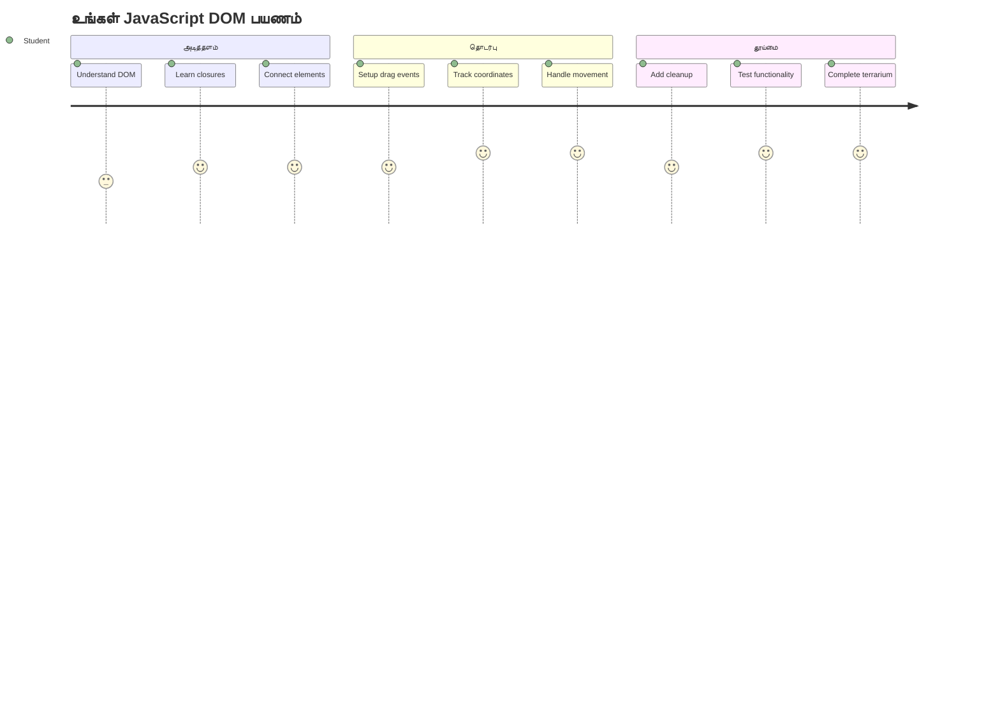
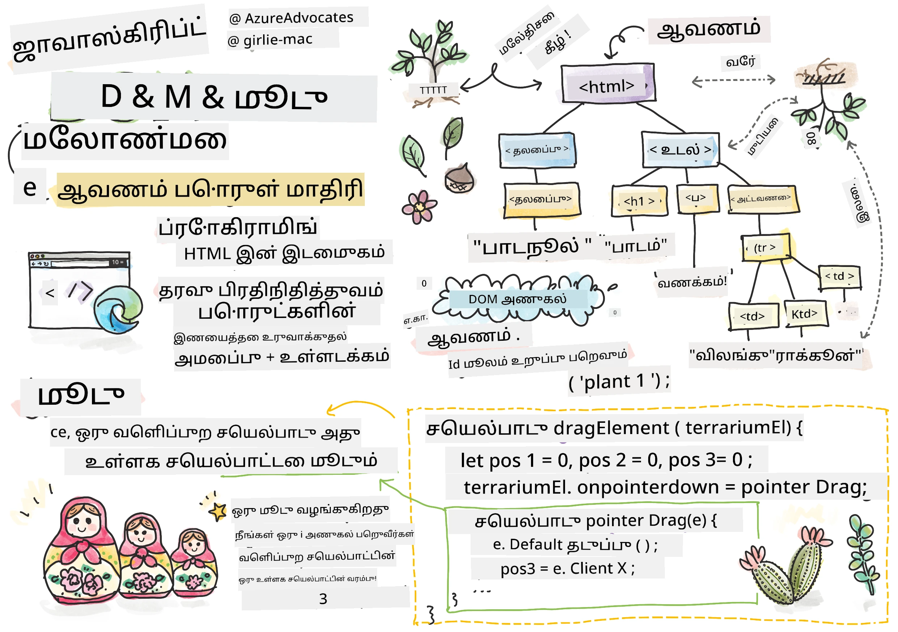
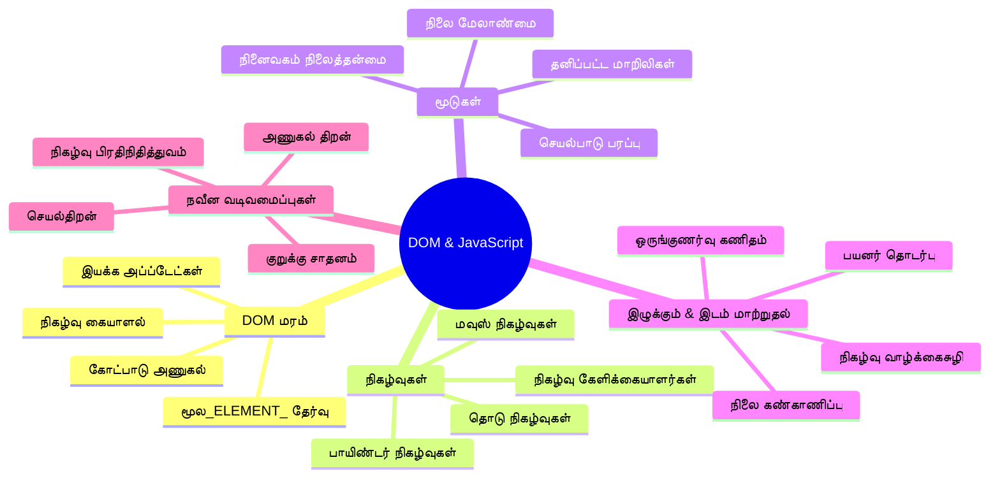
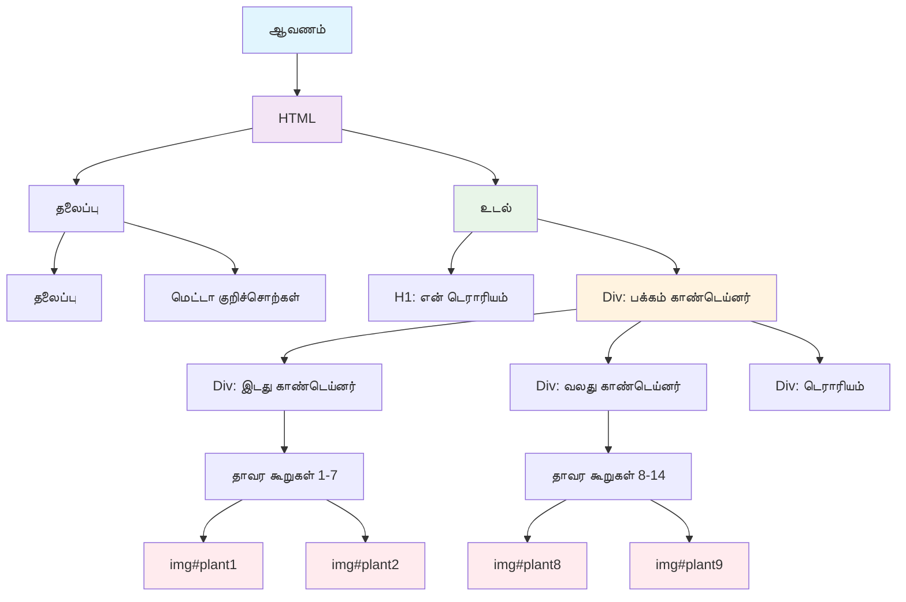
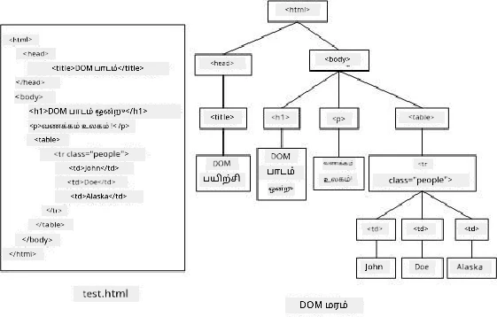
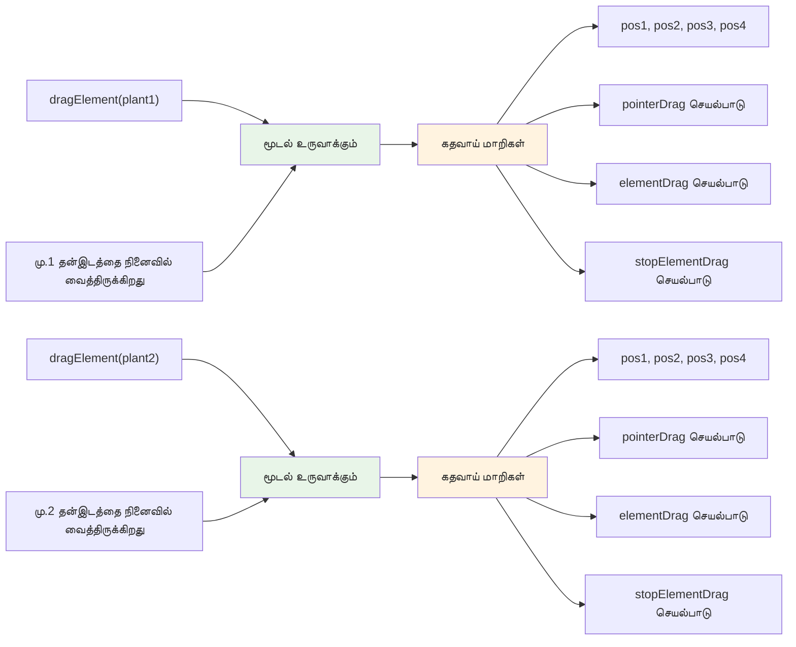
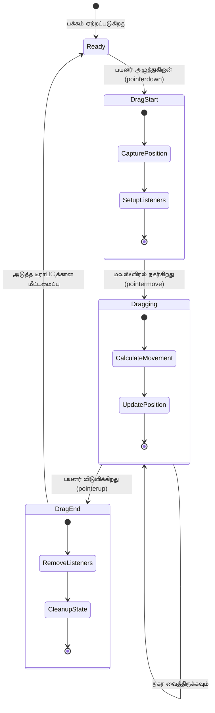
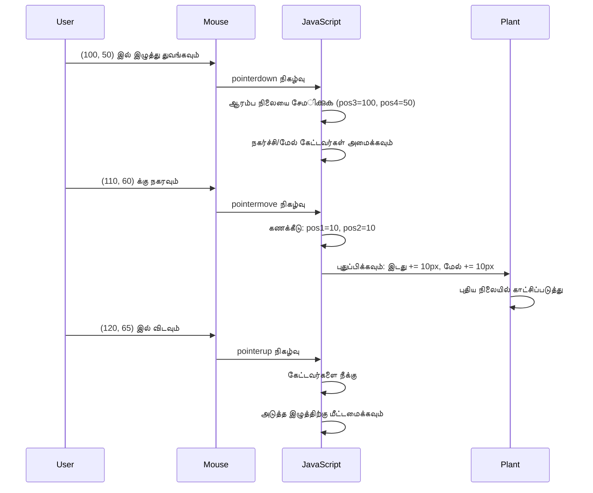
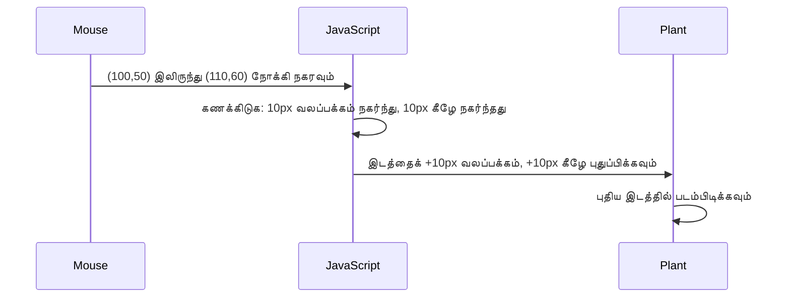
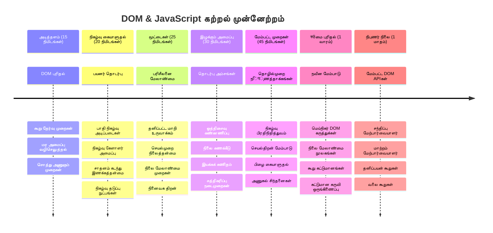

# Terrarium Project பகுதி 3: DOM கையடக்கல் மற்றும் JavaScript மூடுபணிகள்



> ஸ்கெட்ச் நோட் [Tomomi Imura](https://twitter.com/girlie_mac) அவரால்

இணைய விருத்தியின் மிகவும் ஈடுபாட்டுக்குரிய அம்சங்களில் ஒன்றிற்கு வருகை - விஷயங்களை தொடர்புடையதாக மாற்றுதல்! டாக்குமென்ட் ஆப்ஜெக்ட் மோடைல் (DOM) உங்கள் HTML மற்றும் JavaScript இடையேயான பாலம் போன்றது, இன்று நாம் இதைப் பயன்படுத்தி உங்கள் டெராரியம் வாழ் உயிராக மாற்றுவோம். டிம் பெர்னர்ஸ்-லி முதலாம் வலை உலாவியை உருவாக்கிய போது, ஆவணம் இயக்கக்கூடிய மற்றும் தொடர்புடையவையாக இருக்கக்கூடிய இணையத்தை கற்பனை செய்தார் - DOM அந்த கற்பனையை நிகழ்வாக்குகிறது.

நாம் JavaScript மூடுபணிகளையும் ஆராய்வோம், அது முதலில் பயங்கரமாகத் தோன்றலாம். மூடுபணிகளை உங்கள் செயல்பாடுகள் முக்கியமான தகவல்களை நினைவில் வைக்கும் "நினைவக குண்டுகள்" உருவாக்குவது என சிந்தியுங்கள். உங்கள் டெராரியத்தில் ஒவ்வொரு செடியிலும் தனித்துத்தவமாக அதன் நிலையை பின்தொடர ஒரு தரவுத்தாள் இருக்கிறது போல். இந்த பாடத்தின் இறுதிக்கு, அவை இயல்பான மற்றும் பயனுள்ளதாக இருப்பதை நீங்கள் புரிந்துக கொண்டிருப்பீர்கள்.

நாம் உருவாக்க இருப்பது: பயனர்கள் செடிகளை எங்கு வேண்டுமானாலும் இழுத்து விடக்கூடிய டெராரியம். நீங்கள் DOM கையடக்கல் நுட்பங்களை கற்கப்போகிறீர்கள், அவை கோப்புகளை இழுத்து-விட்டு பதிவேற்றுதல் முதல் தொடர்புடைய விளையாட்டுகள் வரை அனைத்திற்கும் சக்தியளிக்கின்றன. உங்கள் டெராரியம் உயிர் பெறும் போல செய்வோம்.


## முன்னர்-பாடப் பரீட்சை

[முன்னர்-பாடப் பரீட்சை](https://ff-quizzes.netlify.app/web/quiz/19)

## DOM புரிந்துகொள்ளுதல்: தொடர்புடைய வலை பக்கங்களுக்கு உங்கள் வாயிலாக

டாக்குமென்ட் ஆப்ஜெக்ட் மோடைல் (DOM) ஆனது JavaScript உங்கள் HTML கூறுகளுடன் தொடர்புகொள்வது எப்படி என்பதை குறிக்கும். உங்கள் உலாவி ஒரு HTML பக்கம் ஏற்றும் போது, அந்த பக்கத்தை நினைவகத்தில் ஒரு அமைப்புள்ள பிரதியானவற்றை உருவாக்குகிறது - அது தான் DOM. அதைப் குடும்ப மரமாக கருதுங்கள், ஒவ்வொரு HTML கூறும் ஒரு குடும்ப உறுப்பினராகும், JavaScript அதைப் அணுகி மாற்றி, அல்லது மறுசீரமைக்க முடியும்.

DOM கையடக்கல் நிலையான பக்கங்களை தொடர்புடைய இணையதளங்களில் மாற்றுகிறது. நீங்கள் ஒரு பொத்தானை ஹோவர் செய்தால் நிறம் மாறுவது, பக்கம் புதுப்பிக்காமல் உள்ளடக்கம் புதுப்பிக்கப்படுவது, அல்லது நீங்கள் இழுத்து சுற்ற இயைக்கும் கூறுகள் அனைத்து DOM கையடக்கத்தின் செயல்பாடுகள்.




> DOM மற்றும் அதனை குறிப்பிடும் HTML குறியீட்டின் பிரதியம். [Olfa Nasraoui](https://www.researchgate.net/publication/221417012_Profile-Based_Focused_Crawler_for_Social_Media-Sharing_Websites) அவரின் பணி

**DOMயை சக்தி வாய்ந்ததாக 만드는வை:**
- **முழு** உங்கள் பக்கத்தில் உள்ள எந்த கூறையும் அணுக ஒரு அமைப்புடன் வழியமைத்தல்
- **இயலுமைப்படுத்தல்** உட்பட உள்ளடக்கம் புதுப்பிப்பு பக்கம் மறுபடியும் ஏற்றாமல்
- **உள்ளதோடு** நேரடி பதில் கொடுக்கும் பயனர் உள்வாங்குதல்களுக்கு (கிளிக் மற்றும் இழுத்தல்)
- **அதிகாரப்படுத்து** நவீன தொடர்புடைய வலை பயன்பாடுகளுக்கான அடித்தடையை

## JavaScript மூடுபணிகள்: ஒழுங்கமைக்கப்பட்ட, சக்தி வாய்ந்த குறியீடு உருவாக்குதல்

[JavaScript மூடுபணி](https://developer.mozilla.org/docs/Web/JavaScript/Closures) என்பது ஒரு செயல்பாட்டுக்கு தனிப்பட்ட தனியார் பணியிடத்தையும் நிலையான நினைவகத்தையும் வழங்குவது போன்றது. செல்வாக்கு மானவர்கள் மட்டுமல்லாமல் தனித்துவமான சூழல் காரணமாக உருவான டார்வினின் கேலாப்பகோஸ் தீவுகளின் ஃபின்ன்சுக்களை நினைவுக்கொள்க - மூடுபணிகளும் அதே போல செயல்படுகின்றன, "நினைவில் வைக்கும்" தனிச்செயல்பாடுகளை உருவாக்குகின்றன.

எமது டெராரியத்தில், மூடுபணி ஒவ்வொரு செடியும் தனிக்கோணத்தில் தன் நிலையைக் 기억ிக்க உதவுகிறது. இது தொழில்முறை JavaScript விருத்தியில் பரவலாகும் முறையானது, புரிந்துகொள்ள ஒரு மதிப்புமிக்க கருத்து.


> 💡 **மூடுபணிகளைப் புரிந்து கொள்ளுதல்**: மூடுபணிகள் JavaScript இல் முக்கியமான தலைப்புகளில் ஒன்றுதான், பல டெவலப்பர்கள் ஆண்டுகளுக்குப் பிறகு முழுமையாக புரிந்து கொள்கிறார்கள். இன்று, பயிற்சி பயன்பாட்டில் கவனம் செலுத்துவோம் - நம்முடைய தொடர்புடைய அம்சங்களை உருவாக்கும் போது மூடுபணிகள் இயல்பாக தோன்றும். உணர்வு வளரும்.


> DOM மற்றும் அதனை குறிப்பிடும் HTML குறியீட்டின் பிரதியம். [Olfa Nasraoui](https://www.researchgate.net/publication/221417012_Profile-Based_Focused_Crawler_for_Social_Media-Sharing_Websites) அவரின் பணி

இந்த பாடத்தில், நாங்கள் பக்கத்தில் உள்ள செடிகளைக் கையாள அனுமதிக்கும் JavaScript உருவாக்கி, தொடர்புடைய டெராரியம் திட்டத்தை முடிப்போம்.

## துவங்குவதற்கு முன்: வெற்றி பெற தயாராகிறோம்

நீங்கள் முந்தைய டெராரியம் பாடங்களிலிருந்து உங்கள் HTML மற்றும் CSS கோப்புகளை தேவைப்படும் - நாம் அந்த நிலையான வடிவமைப்பை தொடர்புடையதாக மாற்றப் போகிறோம். முதல் முறையாக சேர்ந்தால், முன்னர் பாடங்களை முடித்து அவை முக்கியமான சூழலை வழங்கும்.

நாம் உருவாக்கும் விஷயங்கள்:
- **மிதமான இழுத்து-விட்டு** அனைத்து டெராரியம் செடிகளுக்கும்
- **நிலையின் கோ ஒத்திசைவு கண்காணித்தல்** செடிகள் தங்கள் இடங்களை நினைவில் வைத்திருக்க
- **முழுமையான தொடர்புடைய இடைமுகம்** வெண்மை JavaScript பயன்படுத்தி
- **சுத்தமான, ஒழுங்கான குறியீடு** closure முறைகளைப் பயன்படுத்தி

## உங்கள் JavaScript கோப்பை அமைத்தல்

உங்கள் டெராரியத்தை தொடர்புடையதாக மாற்றும் JavaScript கோப்பை உருவாக்குவோம்.

**அடி 1: உங்கள் ஸ்கிரிப்ட் கோப்பை உருவாக்கு**

உங்கள் டெராரியம் கோப்புறையில் `script.js` என்ற புதிய கோப்பை உருவாக்குங்கள்.

**அடி 2: JavaScript ஐ உங்கள் HTML உடன் இணைக்கவும்**

உங்கள் `index.html` கோப்பின் `<head>` பகுதியில் இந்த ஸ்கிரிப்ட் டேக் சேர்க்கவும்:

```html
<script src="./script.js" defer></script>
```

**`defer` பண்புக்கூறின் முக்கியத்துவம்:**
- **வழங்குகிறது** உங்கள் JavaScript அனைத்து HTML ஏற்றப்படும்வரை காத்திருக்கும் விருப்பத்தை
- **தடுக்கிறது** JavaScript ஏற்கனவே தயாராக இல்லாத கூறுகளை அணையும் பிழைகள்
- **உறுதி அளிக்கிறது** அனைத்து உங்கள் செடி கூறுகளும் தொடர்புக்குத் தக்கவாறு கிடைக்கின்றன
- **மேம்பட்ட செயல்திறன் அளிக்கிறது** ஸ்கிரிப்ட் பக்கத்தின் அடிவையில் வைக்கும் போது உட்பட

> ⚠️ **முக்கிய குறிப்பு**: `defer` பண்புக்கூறு பொதுவான நேர விளைவுகளைக் தடுக்கும். இல்லையெனில், JavaScript ஏற்றப்படாத HTML கூறுகளை அணைய முயற்சித்து பிழைகள் விளைவிக்கும்.

---

## JavaScript ஐ உங்கள் HTML கூறுகளோடு இணைப்பு

குறிப்புகளை இழுத்து-விட்டு செயல்படுத்துவதற்கு முன், JavaScript DOM இல் கூறுகளைக் கண்டுபிடிக்க வேண்டும். இதை ஒரு நூலக அடைவு முறையாகக் கருதுங்கள் - நீங்கள் அடைவுத்தொகுதி எண்ணை பெற்றதும், தேவையான புத்தகத்தை கண்டுபிடித்து அதன் உள்ளடக்கத்தைக் அணுக முடியும்.

நாம் `document.getElementById()` முறையை இந்த இணைப்புகளுக்கு பயன்படுத்துவோம். இது மிகத் துல்லியமாக ஒரு தொகுத்தல் முறையாகும் - நீங்கள் ஒரு அடையாளப்பெற்றியை வழங்குவீர்கள், அது HTML இலுள்ள தேவையான கூறை கண்டுபிடிக்கும்.

### அனைத்து செடிகளுக்கும் இழுத்து செயல்பாட்டை இயக்குதல்

உங்கள் `script.js` கோப்பில் இந்த குறியீட்டைச் சேர்க்கவும்:

```javascript
// அனைத்து 14 தாவரங்களுக்கும் இழுத்து விடும் செயல்பாட்டை இயக்கு
dragElement(document.getElementById('plant1'));
dragElement(document.getElementById('plant2'));
dragElement(document.getElementById('plant3'));
dragElement(document.getElementById('plant4'));
dragElement(document.getElementById('plant5'));
dragElement(document.getElementById('plant6'));
dragElement(document.getElementById('plant7'));
dragElement(document.getElementById('plant8'));
dragElement(document.getElementById('plant9'));
dragElement(document.getElementById('plant10'));
dragElement(document.getElementById('plant11'));
dragElement(document.getElementById('plant12'));
dragElement(document.getElementById('plant13'));
dragElement(document.getElementById('plant14'));
```

**இந்த குறியீடு என்ன செய்யிறது:**
- **ஒவ்வொரு செடி கூறையும்** அதன் தனித்துவமான அடையாளத்தைக் கொண்டு DOM இல் கண்டுபிடிக்கிறது
- **ஒவ்வொரு HTML கூறுக்கும்** JavaScript குறிப்பு பெறுகிறது
- **ஒவ்வொரு கூறையும்** `dragElement` என்ற செயல்பாட்டுக்கு (நாம் இப்போது உருவாக்கப்போகிறோம்) அனுப்புகிறது
- **ஒவ்வொரு செடியையும்** இழுத்து-விட்டு தொடர்புக்கு தயார் செய்கிறது
- **உங்கள் HTML அமைப்பை** JavaScript செயல்பாட்டுக்கு இணைக்கிறது

> 🎯 **ஏன் CSS வகுப்பு பதிலாக IDs பயன்படுத்துகிறோம்?** IDs குறிப்பிட்ட கூறுகளுக்கு தனித்துவ அடையாளங்களை வழங்கும், CSS வகுப்புகள் பல கூறுக்களுக்கான வடிவமைப்புக்குத் தான். JavaScript தனிப்பட்ட கூறுகளை கையாள வேண்டிய போது, IDs துல்லியமும் வேகமும் தருகின்றன.

> 💡 **திறமை வழிகாட்டி**: ஒவ்வொரு செடியிற்கும் தனித்தனியான இழுத்துப் பழக்கத்தை உறுதி செய்ய, `dragElement()`-ஐ தனித்தனியாக அழைக்கின்றோம். இது மென்மையான பயனர் தொடர்புக்கு அவசியம்.

### 🔄 **பாட வழங்கல் சோதனை**
**DOM இணைப்பு புரிதல்**: இழுத்து செயல்பாட்டுக்கு செல்லும் முன், கீழ்காணும் திறன்களை உறுதி செய்யவும்:
- ✅ `document.getElementById()` HTML கூறுகளை எப்படி கண்டுபிடிக்கும் விளக்கம்
- ✅ ஒவ்வொரு செடியுக்கும் தனித்துவ IDs ஏன் பயன்படுத்தப்படுகின்றன
- ✅ ஸ்கிரிப்ட் டேக்கில் `defer` பண்புக்கூறின் நோக்கம்
- ✅ DOM வழியாக JavaScript மற்றும் HTML எப்படி இணைக்கப்படுகின்றன

**சுருக்கமான சுய பரிசோதனை**: இரண்டு கூறுகளுக்கும் ஒரே ID இருந்தால் என்ன நடக்கும்? `getElementById()` ஏன் ஒரு கூறையே பெறுகிறது?
*பதில்: IDs தனித்துவம் வாய்ந்ததாக இருக்க வேண்டும்; நகலானால் முதல் கூறுவே திருப்பி அளிக்கப்படும்*

---

## இழுத்து கூறு மூடுபணி உருவாக்குதல்

இப்போது நாம் இழுத்தாற்றலை நிர்வகிக்கும் மனசாட்சியுள்ள இடத்தை (closure) உருவாக்க போகிறோம். இந்த மூடுபணியில் பல உள் செயல்பாடுகள் ஒருங்கிணைந்து மௌஸின் இயக்கங்களைக் கண்காணித்து கூறுகளின் நிலையை புதுப்பிப்பதற்காக வேலை செய்யும்.

மூடுபணிகள் இந்த பணிக்கு சிறந்தவை, ஏனெனில் அவை செயல்பாடு அழைப்புகளுக்கு இடையிலான தனியார் மாறிலிகளை உருவாக்கிக் கொண்டு ஒவ்வொரு செடியுக்கும் தனியாகக் கோ ஒத்திசைவு கண்காணிப்பு அமைப்பை தருகின்றன.

### எளிய உதாரணத்துடன் மூடுபணிகளைப் புரிந்து கொள்வது

மூடுபணிகளின் கருத்துக்கு உதாரணமாக இங்கே ஒரு எளிய உதாரணம்:

```javascript
function createCounter() {
    let count = 0; // இது ஒரு தனிப்பட்ட மாறி போன்றது
    
    function increment() {
        count++; // உள்ளிருக்கும் செயல்பாடு வெளியிருக்கும் மாறியை நினைவில் வைக்கிறது
        return count;
    }
    
    return increment; // நாம் உள்ளிருக்கும் செயல்பாட்டை திரும்பக் கொடுத்து வருகிறோம்
}

const myCounter = createCounter();
console.log(myCounter()); // 1
console.log(myCounter()); // 2
```

**இந்த மூடுபணி முறையில் என்ன நடக்கிறது:**
- **தனியார்** `count` மாறியை உருவாக்குகிறது, இது மூடுபணியின் உள் பகுதி மட்டுமே
- **உள் செயல்பாடு** அந்த வெளிப்புற மாறியை அணுகி மாற்ற முடியும் (மூடுபணி இயந்திரம்)
- **நாம் உள் செயல்பாட்டை** திருப்பும் போது, அது தனியார் தரவுடன் தொடர்பு வைக்கிறது
- **`createCounter()` முடிந்த பின்னர் கூட**, `count` நிலைத்து அதன் மதிப்பை நினைவில் வைத்திருக்கிறது

### இழுத்து செயல்பாட்டிற்கு மூடுபணிகள் ஏன் சிறந்தவை

எமது டெராரியத்தில் ஒவ்வொரு செடியும் அதன் நிலை தனிப்பட்ட கோ ஒத்திசைவை நினைவில் வைத்திருக்க வேண்டும். மூடுபணிகள் சிறந்த தீர்வாக இருக்கின்றன:

**எமது திட்டத்திற்கு முக்கிய நன்மைகள்:**
- **ஒவ்வொரு செடியுக்கும் தனித்துவமான தனியார் நிலை மாறிலிகள்**
- **இழுத்து நிகழ்வுகளுக்கு இடையேயான கோ ஒத்திசைவு தரவை பாதுகாப்பு**
- **பல்வேறு இழுத்து கூறுகளுக்கு இடையேயான மாறிலி முரண்பாடுகளைத் தவிர்ப்பு**
- **சுத்தமான, ஒழுங்காக அமைந்த குறியீடு உருவாக்குதல்**

> 🎯 **கற்றல் நோக்கம்**: மூடுபணிகளை முழுமையாக கையாள வேண்டும் என்ற அவசியமில்லை. இவை எவ்வாறு குறியீட்டை அமைக்க உதவுகின்றன மற்றும் நிலையை பராமரிக்கின்றன என்பதை கவனமாகக் காணுங்கள்.


### dragElement செயல்பாட்டை உருவாக்குதல்

இப்போது அனைத்து இழுத்து நுட்பத்தையும் கையாளும் முக்கிய செயல்பாட்டை உருவாக்குவோம். உங்கள் செடி கூறுக்களை அறிவித்த பின் இந்த செயல்பாட்டைச் சேர்க்கவும்:

```javascript
function dragElement(terrariumElement) {
    // நிலை கண்காணிப்பு மாறிலிகளை துவக்கவும்
    let pos1 = 0,  // முந்தைய சுட்டி X நிலை
        pos2 = 0,  // முந்தைய சுட்டி Y நிலை
        pos3 = 0,  // தற்போதைய சுட்டி X நிலை
        pos4 = 0;  // தற்போதைய சுட்டி Y நிலை
    
    // முதன்மை ஈர்ப்பு நிகழ்வு கேட்பாளரை அமைக்கவும்
    terrariumElement.onpointerdown = pointerDrag;
}
```

**நிலை கண்காணிப்பு அமைப்பின் புரிதல்:**
- **`pos1` மற்றும் `pos2`**: பழைய மற்றும் புதிய மௌஸ் நிலைகளுக்கு இடையேயான வேறுபாடு
- **`pos3` மற்றும் `pos4`**: தற்போதைய மௌஸ் சாரங்குறிகள்
- **`terrariumElement`**: இழுத்து செய்யப் போவது குறிப்பிட்ட செடி கூறு
- **`onpointerdown`**: பயனர் இழுத்து தொடங்கும் நிகழ்வு

**இவ்வாறு மூடுபணி முறை செயல்படுகிறது:**
- **ஒவ்வொரு செடியின் தனியார் நிலை மாறிலிகளை** உருவாக்குகிறது
- **இழுத்துக் காலத்தில்** மாறிலிகளை பராமரிக்கிறது
- **ஒவ்வொரு செடிக்கும் தனிப்பட்ட கோ ஒத்திசைவை** உறுதிப்படுத்துகிறது
- **`dragElement` மூலம் சுத்தமான இடைமுகம்** வழங்குகிறது

### ஏன் Pointer Events பயன்படுத்த வேண்டும்?

`onpointerdown` ஐஓட ஒப்பிடும் போது `onclick` ஐ ஏன் பயன்படுத்தவில்லை என்று யோசிக்கலாம். காரணம்:

| நிகழ்வு வகை | சிறந்தது | குறைவு |
|------------|----------|-------------|
| `onclick` | எளிய பொத்தான்கள் கிளிக் | இழுத்து செயல்பாட்டை கையாள முடியாது (கிளிக் மட்டும்) |
| `onpointerdown` | மௌஸ் மற்றும் தொடுதுண்டு இரண்டும் | புதியது, ஆனால் தற்போது பரவலாக ஆதரிக்கப்படுகிறது |
| `onmousedown` | டெஸ்க்டாப்பிற்கு மட்டும் | மொபைல் பயனர்களை தவிர்க்கிறது |

**நாம் அமைக்கப்போகும் பொருளுக்கு pointer events ஏன் சிறந்தது:**
- ஒரு மௌஸ், விரல் அல்லது ஸ்டைலஸ் பயன்படுத்தினாலும் வேலை செய்யும்
- லேப்டாப், டேப்லெட், மொபைல் ஆகியவற்றிலும் ஒரே மாதிரியாக உணர்கிறது
- உண்மையான இழுத்தலை (click செய்து விட்டதை அல்ல) கையாள்கிறது
- நவீன வலை பயன்பாடுகளில் எதிர்பார்க்கப்படும் மென்மையான அனுபவத்தை உருவாக்குகிறது

> 💡 **எதிர்கால பாதுகாப்பு**: Pointer events பயனர்களினுடைய உரையாடலை கையாள இது நவீன வழி. மௌஸ் மற்றும் தொடுதுண்டுக்கு தனித்தனியே எழுதுவதற்கு பதிலாக இரண்டையும் கொடுக்கும். அருமை, இல்லையா?

### 🔄 **பாட வழங்கல் சோதனை**
**நிகழ்வு நிர்வகிப்பு புரிதல்**: கீழ்கண்டவற்றில் உங்கள் திறனை உறுதிப்படுத்திக் கொள்ளுங்கள்:
- ✅ pointer eventsஐ ம் mouse eventsஐ விட ஏன் பயன்படுத்துகிறோம்?
- ✅ மூடுபணி மாறிலிகள் செயல்பாடு அழைப்புகளுக்கு இடையில் எப்படி நிலைபெறுகின்றன?
- ✅ மென்மையான இழுத்துக்கு `preventDefault()` என்ன பங்கு வகிக்கிறது?
- ✅ தனித்த கூறுகளுக்கு பதிலாக ஏன் பதிவேட்டாளர்களை ஆவணத்திற்கு இணைக்கின்றோம்?

**உணர்வியல் தொடர்பு**: நீங்கள் தினமும் பயன்படுத்தும் இழுத்து-விட்டு இடைமுகங்களை நினைவுகூருங்கள்:
- **கோப்பு பதிவேற்றங்கள்**: கோப்புகளை உலாவி சாளரத்தில் இழுத்தல்
- **கன்பன் பலகைகள்**: பணிகளை தூண் மாற்றம்
- **புகைப்படக் காட்சிப்பரபு**: படங்களை மறுசீரமைத்தல்
- **செயின் இடைமுகங்கள்**: தொடுதுண்டு ஸ்கிரீன்களில் ஸ்வைப் மற்றும் இழுத்தல்

---

## pointerDrag செயல்பாடு: இழுத்து ஆரம்பிப்பை பெறுதல்

பயனர் ஒரு செடியை அழுத்தும் போது (மௌஸ் கிளிக் அல்லது விரல் தொடுதல்), `pointerDrag` செயல்பாடு வேலை தொடங்கும். இது ஆரம்ப சாரங்குறிகளை பிடித்து இழுத்து அமைப்பை சீரமைக்கும்.

இந்த செயல்பாட்டை `dragElement` மூடுபணி உள்ளே, `terrariumElement.onpointerdown = pointerDrag;` வரிக்கும் பின்னர் சேர்க்கவும்:

```javascript
function pointerDrag(e) {
    // இயல்புநிலை உலாவி செயல்பாட்டை தடுக்கும் (உரை தேர்வு போன்றவை)
    e.preventDefault();
    
    // ஆரம்ப மவுஸ்/தட்டுதல் இடத்தை பிடிக்கவும்
    pos3 = e.clientX;  // இழுத்தல் தொடங்கிய எக்ஸ் நிரல்
    pos4 = e.clientY;  // இழுத்தல் தொடங்கிய வை நிரல்
    
    // இழுக்கும் செயலுக்கான நிகழ்வு கேட்பார்களை அமைக்கவும்
    document.onpointermove = elementDrag;
    document.onpointerup = stopElementDrag;
}
```

**தொகுத்து விளக்கம்**:
- **இழுத்து செயல்பாட்டை தவிர்க்கும்** முன்னிருப்பு உலாவிக் நடத்தை தடுக்கும்
- **பயனர் தொடங்கிய இடத்தைக்** சரியாக பதிவு செய்கிறது
- **இடைவெளி இழுக்கும் இயக்கங்களுக்கான** நிகழ்வுப் பதிவர்களை ஏற்படுத்துகிறது
- **அனைத்து ஆவணங்களை தாண்டி** மௌஸ்/விரல் இயக்கத்தை கண்காணிக்க தயாராகிறது

### நிகழ்வு தடுப்பை புரிந்து கொள்ளுதல்

`e.preventDefault()` வரி மென்மையான இழுத்துக்கு முக்கியம்:

**தடையில்லாமல் இருந்தால் உலாவிகள்:**
- **எழுத்துக் காட்சியைக்** தேர்ந்தெடுப்பது
- **வலது கிளிக் இழுத்தில்** உள்ளடக்க மெனுவைக் காட்டுதல்
- **எங்கள் தனிப்பயன் இழுத்து செயலை** தடுக்கிறது
- **இழுத்தીમાં காணப்படக்கூடிய** காட்சி பிழைகள் ஏற்படுகின்றன

> 🔍 **பயிற்சி**: இந்த பாடம் முடிந்த பின், `e.preventDefault()` நீக்கி உங்கள் இழுத்துப் பணி எப்படி மாறுகிறது என்பதைப் பாருங்கள். இந்த வரி ஏன் அவசியம் என்பதை விரைவில் உணர்வீர்கள்!

### கோ ஒத்திசைவு கண்காணிப்பு அமைப்பு

`e.clientX` மற்றும் `e.clientY` சொத்துகள் சரியான மௌஸ்/தொடுதுண்டு சாரங்கள் அளிக்கின்றன:

| சொத்து | என்ன அளக்கிறது | பயன்பாடு |
|----------|------------------|----------|
| `clientX` | பார்க்குநரின் வரையறுக்கப்பட்ட பரப்பை சேர்ந்த படிநிலையான நிலை | இடம் வலம் இயக்கத்தை கண்காணித்தல் |
| `clientY` | பார்க்குநரின் வரையறுக்கப்பட்ட பரப்பை சேர்ந்த నిలம்படி நிலை | மேல்நீளம் இயக்கத்தை கண்காணித்தல் |
**இந்த இடைவட்டங்களைப் புரிந்து கொள்வது:**
- **பிக்சல்-பரிபூரண** இடத்தை அறிவிக்கும் தகவலை வழங்குகிறது
- **பயனாளர் குறியீட்டை நகர்த்தும் பொழுதெல்லாம்** நிகழ்ச்சி நேரத்தில் புதுப்பிக்கிறது
- **வித்தியாசமான திரை அளவுகளிலும் மடிப்பு மட்டங்களிலும்** தொடர்ச்சியாக இருக்கும்
- **மென்மையான, பதிலளிக்கும் இழுத்து தொடர்பாடல்களை** செயல்படுத்துகிறது

### ஆவணத் நிலை நிகழ்வு கேட்குநர்களை அமைத்தல்

நாம் `document` முழுவதும் நகர்வும் நிறுத்தும் நிகழ்வுகளை சேர்க்கும் முறையை கவனியுங்கள், செடி உறுப்பிற்கு மட்டும் அல்ல:

```javascript
document.onpointermove = elementDrag;
document.onpointerup = stopElementDrag;
```

**ஏனெனில் ஆவணத்தில் இணைக்க வேண்டும்:**
- **ஊர்வனம் செடி உறுப்பை விட்டு வெளியேறும்போதும் தொடர்ந்துவிடும்**
- **தீவிரமாக நகர்வதால் இழுத்தல் தடை பெறாமல் இருக்கிறது**
- **முழு திரையிலும் மென்மையான இழுத்தலை வழங்குகிறது**
- **குர்சர் உலாவி ஜன்னல் வெளியே சென்றால் கிளைமுறை கையாள்கிறது**

> ⚡ **செயற்பாட்டு குறிப்பு**: இழுத்தல் நிறுத்தப்பட்ட போதும் இந்த ஆவண நிலை கேட்குநர்களை சுத்தம் செய்யப்போகிறோம், நினைவக கடத்தலையும் செயல்திறன் பாதிப்பையும் தவிர்க்க.

## இழுத்தல் அமைப்பை நிறைவு செய்யுதல்: நகர்வு மற்றும் சுத்தம்

இப்போது நாங்கள் கிளைமாக செயல்படுகின்ற இரண்டு செயல்பாடுகளைச் சேர்ப்போம் - உண்மையான இழுத்தல் நகர்வையும் இழுத்தல் நிறுத்தப்பட்ட பிறகு சுத்தப்படுத்தலையும் கையாளும். இவை ஒன்றிணைந்து உங்கள் உருண்ட நிலத்தில் செடி நகர்வின் மென்மையான பதில் செயல்பாட்டை உருவாக்குகின்றன.

### `elementDrag` செயல்பாடு: நகர்வை கண்காணித்தல்

`pointerDrag`ன் மூடும் இடைமுகத்திற்கு உடனே `elementDrag` செயல்பாட்டைச் சேர்க்கவும்:

```javascript
function elementDrag(e) {
    // கடைசிப் படிவத்திலிருந்து நகர்ந்த தூரத்தை கணக்கிடவும்
    pos1 = pos3 - e.clientX;  // காண்டோட்டர் தூரம் நகர்ந்தது
    pos2 = pos4 - e.clientY;  // செங்குத்து தூரம் நகர்ந்தது
    
    // தற்போதைய நிலை கையாளலை புதுப்பிக்கவும்
    pos3 = e.clientX;  // புதிய தற்போதைய X நிலை
    pos4 = e.clientY;  // புதிய தற்போதைய Y நிலை
    
    // நகர்வை கூற_Master நிலைக்கு உடைத்தல்
    terrariumElement.style.top = (terrariumElement.offsetTop - pos2) + 'px';
    terrariumElement.style.left = (terrariumElement.offsetLeft - pos1) + 'px';
}
```

**இடைவட்ட கணிதத்தைப் புரிந்து கொள்வது:**
- **`pos1` மற்றும் `pos2`**: கடைசிப் புதுப்பிப்பின் பின்னர் நண்டு எவ்வளவு நகர்ந்தது என்பதைக் கணக்கிடுக
- **`pos3` மற்றும் `pos4`**: அடுத்த கணக்கீட்டிற்காக தற்போதைய நண்டு இடத்தை சேமி
- **`offsetTop` மற்றும் `offsetLeft`**: இலகு பக்கத்தில் உள்ள தற்போதைய இடத்தைப் பெறுக
- **கழித்து செய்வது**: நண்டு நகர்ந்த அதே அளவுக்கு இலகு நகர்த்துகிறது


**இது நகர்வு கணக்கீட்டு பகுதியில்:**
1. **பழைய மற்றும் புதிய நண்டு இடங்களுக்கிடையேயான வித்தியாசத்தை அளவிடுகிறது**
2. **நண்டு நகர்வின் அடிப்படையில் இலகை எவ்வளவு நகர்த்த வேண்டும் என்பதைக் கணக்கிடுகிறது**
3. **நேரடியாக இலகு CSS இடத்தைக் புதுப்பிக்கிறது**
4. **அடுத்த நகர்வுக்கான அடிப்படையாக புதிய இடத்தைச் சேமிக்கிறது**

### கணிதத்தின் காட்சி പ്രതிபலிப்பு


### `stopElementDrag` செயல்பாடு: சுத்தம் செய்வது

`elementDrag` மூடும் இடைமுகத்திற்கு உடனே சுத்தப்படுத்தும் செயல்பாட்டைச் சேர்க்கவும்:

```javascript
function stopElementDrag() {
    // ஆவண-நிலை நிகழ்வு শ্রೋতர்களை அகற்றவும்
    document.onpointerup = null;
    document.onpointermove = null;
}
```

**சுத்தப்படுத்தல் ஏன் அவசியம்:**
- **தங்கியுள்ள நிகழ்வு கேட்குநர்களால் நினைவக கசிவைத் தடுக்கும்**
- **பயனாளர் செடியை விடும்போது இழுத்தல் செயல்பாட்டை நிறுத்தும்**
- **பிற கூறுகளை தனித்தனியாக இழுத்து செயல்படுத்த அனுமதிக்கும்**
- **அடுத்த இழுத்தல் செயல்பாட்டிற்காக அமைப்பை மீட்டமைக்கிறது**

**சுத்தம் செய்யாவிட்டால் என்ன நடக்கும்:**
- இழுத்தல் நிறுத்தப்பட்ட பிறகும் நிகழ்வு கேட்குநர்கள் இயக்கமாய் இருக்கும்
- ஒவ்வாமை கேட்குநர்கள் அதிகரித்து செயல்திறன் குறையும்
- பிற கூறுகளோடு தொடர்பு கொள்ளும் போது எதிர்பாராத நடத்தை நிகழும்
- உலாவி வளங்கள் தேவையற்ற நிகழ்வுகளை கையாள்வதில் வீணாகும்

### CSS இட நிலை பண்புகளைப் புரிந்து கொள்வது

நமது இழுத்தல் அமைப்பு இரண்டு முக்கிய CSS பண்புகளை இயக்குகிறது:

| பண்பு | எதை கட்டுப்படுத்துகிறது | எப்படி பயன்படுத்துகிறோம் |
|----------|------------------|---------------|
| `top` | மேலான புறம் இருந்து தூரம் | இழுத்தல் நேரத்தில் செங்குத்து இடம் |
| `left` | இடதுபுறம் இருந்து தூரம் | இழுத்தல் நேரத்தில் பண்படி இடம் |

**offset பண்புகளின் முக்கிய தகவல்கள்:**
- **`offsetTop`**: நிலையான பெற்றோரை மேல் புறம் இருந்து தற்போதைய தூரம்
- **`offsetLeft`**: நிலையான பெற்றோரை இடப்புறம் இருந்து தற்போதைய தூரம்
- **இட நிலை சூழல்**: அருகிலுள்ள நிலையான பெற்றோருடன் தொடர்புடைய மதிப்புகள்
- **நேரடி புதுப்பிப்புகள்**: CSS பண்புகளை மாற்றும்போதே உடனடி மாற்றங்கள்

> 🎯 **வடிவமைப்பு தத்துவம்**: இந்த இழுத்தல் அமைப்பு நோக்கம் வேண்டும் என்பதை சர் இல்லாமல் வடிவமைக்கப்பட்டுள்ளது. பயனர்கள் செடிகளை எங்காவது வைக்க முடியும், இது அவர்களுக்கு தங்கள் உருண்டத்தை முழுமையாக படைப்பாற்றல் கட்டுப்பாட்டை வழங்குகிறது.

## அனைத்தையும் ஒருங்கிணைத்தல்: உங்கள் முழுமையான இழுத்தல் அமைப்பு

வெற்றிகரமாக! நீங்கள் வநிலா ஜாவাস்கிரிப்ட் பயன்படுத்தி ஒரு மேம்பட்ட இழுத்தல் மற்றும் விடுவிக்கும் அமைப்பை உருவாக்கியுள்ளீர்கள். உங்கள் முழுமையான `dragElement` செயல்பாட்டில் சக்திவாய்ந்த தொழில்நுட்பம் உள்ளடக்கப்பட்டுள்ளது:

**உங்கள் தொழில்நுட்பம் செய்வது:**
- **ஒவ்வொரு செடியுக்கும் தனிப்பட்ட இடவமைவு நிலைகளை பராமரிக்கிறது**
- **தொடக்கம் முதல் முடிவுவரை முழு இழுத்தல் வாழ்க்கைசுழற்சியை கையாள்கிறது**
- **முழு திரையிலும் மென்மையான பதிலளிக்கும் நகர்வை வழங்குகிறது**
- **நினைவக கசிவைத் தடுக்கும் வகையில் வளங்களை சரியான முறையில் சுத்தம் செய்கிறது**
- **உருண்ட வடிவமைப்பிற்கு சிறந்த, படைப்பாற்றல் அணுகுமுறையை உருவாக்குகிறது**

### உங்கள் தொடர்புடைய உருண்டத்தை சோதனை செய்யுதல்

இப்போது உங்கள் தொடர்புடைய உருண்டத்தை பரிசோதிக்கவும்! உங்கள் `index.html` கோப்பை ஒரு வலை உலாவியில் திறந்து செயல்பாட்டை முயற்சிக்கவும்:

1. **ஏதாவது செடியை கிளிக் செய்து பிடிக்கவும்**
2. **உங்கள் நண்டு அல்லது விரலை நகர்த்துங்கள் மற்றும் செடி மென்மையாக பின்பற்றும் என்பதை பாருங்கள்**
3. **விடுவித்தல் மூலம் செடியை புதிய இடத்தில் விடவும்**
4. **விதவிதமான அமைப்புகளுடன் முயற்சி செய்யவும் மற்றும் இடைமுகத்தை ஆராயவும்**

🥇 **அமைதிப்பு**: நீங்கள் தினசரி தொழில்முறை மேம்படுத்திகள் பயன்படுத்தும் அடிப்படைக் கருத்துக்களைப் பயன்படுத்தி முழுமையாக தொடர்புடைய வலைப் பயன்பாட்டை உருவாக்கியுள்ளீர்கள். அந்த இழுத்தல் மற்றும் விடுவிக்கும் செயல்பாடு கோப்பு பதிவேற்றங்கள், கன்பேன் பலகைகள் மற்றும் பல இணைப்பு இடைமுகங்களின் அடிப்படையில் செயல்படுகிறது.

### 🔄 **கற்பித்தல் ஆய்வு**
**முழுமையான அமைப்பைப் புரிதல்**: முழு இழுத்தல் அமைப்பின் உங்கள் திறமையை உறுதிப்படுத்துங்கள்:
- ✅ ஒவ்வொரு செடியும் தனித்தனியாய் நிலையை எப்படி பராமரிக்கிறது?
- ✅ மென்மையான நகர்விற்கு இடைவட்டு கணக்கீடுகள் ஏன் அவசியம்?
- ✅ நிகழ்வு கேட்குநர்களை சுத்தம் செய்ய மறந்தால் என்ன நடக்கும்?
- ✅ இந்த மாதிரி எப்படி நுணுக்கமான தொடர்பாடலுக்கு விரிவடைகிறது?

**குறியீட்டு தர மதிப்பாய்வு**: உங்கள் முழு தீர்வை பரிசீலிக்கவும்:
- **திறவுகோல் வடிவமைப்பு**: ஒவ்வொரு செடியும் தனிப்பட்ட உள்ளீட்டைக் பெறுகிறது
- **நிகழ்வு செயல்திறன்**: கேட்குநர்களை சரியாக அமைத்தல் மற்றும் சுத்தம் செய்தல்
- **கருவி உயர் ஆதரவு**: டெஸ்க் டாப் மற்றும் மொபைல் இரண்டிலும் வேலை செய்கிறது
- **செயற்பாட்டு விழிப்புணர்வு**: நினைவகக் கசிவுகளோடும் கூடுதல் கணக்கீடுகளோடும் தவிர்க்கல்


---

## GitHub Copilot முகவர் சவால் 🚀

Agent முறையைப் பயன்படுத்தி பின்வரும் சவாலை நிறைவேற்றவும்:

**விளக்கம்:** அனைத்து செடிகளையும் மென்மையான அனிமேஷன்களுடன் தங்கள் ஆரம்ப பக்க நிலைகளுக்கு மீண்டும் கொண்டுவரும் மீட்டமைத்தல் செயல்பாட்டை சேர்க்கவும்.

**கருத்து:** ஒரு மீட்டமைத்தல் பொத்தானை உருவாக்கவும், சொடுக்கப்பட்டால் எல்லா செடிகளும் பிரதான பக்க நிலைகளுக்கு CSS மாற்றங்களின் மூலம் 1 விநாடி காலத்தில் மென்மையாக பின்னால் மாற்றும். இந்த செயல்பாடு பக்கம் ஏற்றப்படும் போது ஆரம்ப நிலைகளை சேமித்து வைக்க வேண்டும்.

[agent mode](https://code.visualstudio.com/blogs/2025/02/24/introducing-copilot-agent-mode) பற்றி மேலும் அறிக.

## 🚀 கூடுதல் சவால்: உங்கள் திறன்களை விரிவாக்குதல்

உங்கள் உருண்டத்தை அடுத்த நிலைக்குக் கொண்டு செல்ல தயாரா? இந்த மேம்பாடுகளை செயல்படுத்த முயற்சி செய்யுங்கள்:

**படைப்பு நீட்டிப்புகள்:**
- **இரட்டை கிளிக்** செடியை முன்னணிக்குக் கொணர (z-index மாற்றம்)
- **செடிகளில் மிதமான பொழிவோடு** கண்ணோட்டத் திருப்பத்தைச் சேர்க்கவும்
- **உருண்டத்தை கடிப்புறமாக இழுக்கும் போது கட்டுப்பாடுகளை நடைமுறைப்படுத்தவும்**
- **localStorage பயன்படுத்திப் செடிகளின் இடங்களை நினைவில் வைத்துக்கொள்ளவும்**
- **செடிகளை எடுக்கும் மற்றும் விடும் போது ஒலி விளைவுகளைச் சேர்க்கவும்**

> 💡 **கற்றல் வாய்ப்பு**: இந்த ஒவ்வொரு சவாலும் உங்களுக்கு DOM மாற்றுதல், நிகழ்வுகளைக் கையாளுதல் மற்றும் பயனர் அனுபவ வடிவமைப்பில் புதிய அம்சங்களை கற்றுக் கொடுக்கும்.

## பாடத்திற்குப்பின் வினோதம்

[பாடத்திற்குப்பின் வினோதம்](https://ff-quizzes.netlify.app/web/quiz/20)

## மதிப்பாய்வு மற்றும் சுயபடிப்பு: உங்கள் விழிப்புணர்வை ஆழப்படுத்துதல்

நீங்கள் DOM மாற்றுதல் மற்றும் தொழில்நுட்பங்களை கற்றுக்கொண்டீர்கள், ஆனால் ஆராய மேற்கொண்டு செல்ல வழிகள் இங்கே:

### மாற்று இழுத்தல் மற்றும் விடுவிப்பு அணுகுமுறைகள்

நாங்கள் pointer நிகழ்வுகளை அதிகபட்ச சுதந்திரத்துக்கு பயன்படுத்தினோம், ஆனால் வலை மேம்பாட்டுக்கு பல அணுகுமுறைகள் உள்ளன:

| அணுகுமுறை | சிறந்தது | கற்றலுக்கான மதிப்பு |
|----------|----------|----------------|
| [HTML Drag and Drop API](https://developer.mozilla.org/docs/Web/API/HTML_Drag_and_Drop_API) | கோப்பு பதிவேற்றங்கள், அதிகாரப்பூர்வ இழுத்து பகுதிகள் | இயல்புநிலை உலாவி திறன்கள் புரிதல் |
| [Touch Events](https://developer.mozilla.org/docs/Web/API/Touch_events) | மொபைல் தனிப்பயன் தொடர்பாடல்கள் | மொபைல் முதன்மை வளர்ச்சி வழிகள் |
| CSS `transform` பண்புகள் | மென்மையான அனிமேஷன்கள் | செயல்திறன் மேம்பாட்டு தொழில்நுட்பங்கள் |

### மேம்பட்ட DOM மாற்றுத் தலைப்புகள்

**உங்கள் பயணத்தில் அடுத்த படிகள்:**
- **நிகழ்வு பொறுப்பு**: பல கூறுகளுக்கான நிகழ்வுகளை திறம்பட கையாளுதல்
- **Intersection Observer**: கூறுகள் திரை வெளியில் அல்லது உள்ளே நுழங்குவதை பின்தொடர்கிறது
- **Mutation Observer**: DOM கட்டமைப்பில் மாற்றங்களை கண்காணிக்கிறது
- **Web Components**: மறுபயன்படக்கூடிய, அடைக்கல UI கூறுகளை உருவாக்குகிறது
- **Virtual DOM கருத்துக்கள்**: கண fran்கள் DOM புதுப்பிப்புகளை எவ்வாறு மேம்படுத்துகிறது என்பதை புரிந்து கொள்வது

### தொடர்ந்த கற்றலுக்கான அவசியமான வளங்கள்

**தொழில்நுட்ப ஆவணங்கள்:**
- [MDN Pointer Events Guide](https://developer.mozilla.org/docs/Web/API/Pointer_events) - விரிவான pointer நிகழ்வு குறிப்புரை
- [W3C Pointer Events Specification](https://www.w3.org/TR/pointerevents1/) - அதிகாரப்பூர்வ தரக் குறிப்பு
- [JavaScript Closures Deep Dive](https://developer.mozilla.org/docs/Web/JavaScript/Closures) - மேம்பட்ட closure மாதிரிகள்

**உலாவி இணக்கக்கூறுகள்:**
- [CanIUse.com](https://caniuse.com/) - உலாவிகளுக்கான அம்ச ஆதரவு சரிபார்க்க
- [MDN Browser Compatibility Data](https://github.com/mdn/browser-compat-data) - விரிவான இணக்கமைவு தகவல்

**பயிற்சி வாய்ப்புகள்:**
- **இறுக்கணுக்குமற்ற வசதிகள் கொண்ட புதிர் விளையாட்டு உருவாக்குக**
- **இழுத்துவதும் விடுவிப்பும் கூடிய பணியில் கன்பேன் பலகை செய்யவும்**
- **ஒளிப்படங்கள் உள்ள அடுக்கமான படம் தொகுப்பு வடிவமைக்கவும்**
- **மொபைல் இடைமுகங்களுக்கான தொடு சைகைகள் பயிலவும்**

> 🎯 **கற்றல் திட்டம்**: இந்த கருத்துக்களை உறுதிப்படுத்த சிறந்த வழி பயிற்சியாக உள்ளது. இழுத்தல் இன்டர்ஃபேஸ்களின் படி வேறுபாடுகளை உருவாக்கி பாருங்கள் - ஒவ்வொன்று புதிய அம்சங்களை DOM மாற்றல் மற்றும் பயனர் தொடர்பாடலில் கற்று கொடுக்கிறது.

### ⚡ **அடுத்த 5 நிமிடங்களில் செய்யக்கூடியவை**
- [ ] உலாவி DevTools திறந்து `document.querySelector('body')` என எழுதுக
- [ ] ஒரு இணையப் பக்கத்தின் எழுத்துகளை `innerHTML` அல்லது `textContent` மூலம் மாற்ற முயற்சிக்கவும்
- [ ] எந்தவொரு பொத்தானுக்கோ அல்லது இணைப்பிற்கோ கிளிக் நிகழ்வு கேட்குநரை சேர்க்கவும்
- [ ] Elements பேனலை நோக்கி DOM மர அமைப்பை ஆய்வு செய்யவும்

### 🎯 **இந்த நேரத்தில் சாதிக்கக்கூடியவை**
- [ ] பாடத்திற்குப்பின் வினோதத்தை முடித்து DOM மாற்றல் கருத்துக்களை மதிப்பாய்வு செய்யவும்
- [ ] பயனர் கிளிக்கை பதிலளிக்கும் இன்டர்ஃபேஸை உருவாக்கவும்
- [ ] வெவ்வேறு நிகழ்வு வகைகள் (கிளிக், மவுஸ்ஓவர், விசை அழுத்துதல்) கையாளுதலைப் பயிற்சியிடுங்கள்
- [ ] DOM மாற்றலுடன் ஒரு எளிய பணி பட்டியல் அல்லது எண்ணிகையை கட்டமைக்கவும்
- [ ] HTML கூறுகள் மற்றும் JavaScript பொருட்கள் இடையிலான தொடர்பை ஆராய்க

### 📅 **உங்கள் வார நிராச்சார ஜாவாஸ்கிரிப்ட் பயணம்**
- [ ] இழுத்தல் மற்றும் விடுவிக்கும் செயல்திறன் கொண்ட தொடர்புடைய உருண்ட திட்டத்தை முடிக்கவும்
- [ ] நிகழ்வு பொறுப்பை திறம்பட கையாளல் கற்றுக்கொள்ளவும்
- [ ] நிகழ்வு சுற்றுப்பாதை மற்றும் அசிங்க்ரோனஸ் ஜாவாஸ்கிரிப்ட் பற்றி கற்றுக்கொள்ளவும்
- [ ] தனிப்பட்ட நிலை கொண்ட தொகுதிகள் (closures) உருவாக்க பயிற்சி பெறவும்
- [ ] Intersection Observer போன்ற நவீன DOM APIகளை ஆராயவும்
- [ ] கட்டமைப்புகள் இல்லாமல் தொடர்புடைய கூறுகளை உருவாக்கவும்

### 🌟 **உங்கள் மாதாந்த ஜாவாஸ்கிரிப்ட் தேர்ச்சி**
- [ ] வனில்லா ஜாவாஸ்கிரிப்டைப் பயன்படுத்தி ஒரு சிக்கலான ஒரே பக்க பயன்பாட்டை உருவாக்கவும்
- [ ] React, Vue அல்லது Angular போன்ற நவீன கட்டமைப்புகளை கற்றுக்கொள்ளவும் மற்றும் vanilla DOM க்கிடையே ஒப்பிடுக
- [ ] ஓப்பன் சோர்ஸ் ஜாவாஸ்கிரிப்ட் திட்டங்களில் பங்களிக்கவும்
- [ ] வலை கூறுகள் மற்றும் தனிப்பயன் கூறுகள் போன்ற மேம்பட்ட கருத்துக்களை கற்றுக்கொள்ளவும்
- [ ] சிறந்த DOM மாதிரிகள் கொண்ட செயல்திறன் மிகுந்த வலைப் பயன்பாட்டை உருவாக்கவும்
- [ ] பிறருக்கு DOM மாற்றல் மற்றும் ஜாவாஸ்கிரிப்ட் அடிப்படைகளை பயிற்சி அளிக்கவும்

## 🎯 உங்கள் JavaScript DOM தேர்ச்சி நேர அட்டவணை


### 🛠️ உங்கள் JavaScript கருவி தொகுப்பு சுருக்கம்

இந்த பாடத்தை முடித்தவுடன், உங்களிடம் உள்ளது:
- **DOM தேர்ச்சி**: கூறு தேர்வு, பண்பு மாற்றம் மற்றும் மர திசைதிருப்பு
- **நிகழ்வு நிபுணத்துவம்**: வெவ்வேறு சாதனங்களில் pointer நிகழ்வுகளை கையாளல்
- **Closure புரிதல்**: தனியார் நிலை மேலாண்மையும் செயல்பாட்டு நிலைத்தன்மையும்
- **இணையமைப்புகள்**: ஆரம்பத்திலிருந்து முழுமையான இழுத்தல் மற்றும் விடுவிப்பு நடைமுறை
- **செயற்பாட்டு விழிப்புணர்வு**: நிகழ்வு சுத்தம் மற்றும் நினைவக மேலாண்மை
- **நவீன வடிவமைப்புகள்**: தொழில்முறை மேம்பாட்டில் பயன்படுத்தப்படும் குறியீட்டு அமைப்பு தொழில்நுட்பங்கள்
- **பயனர் அனுபவம்**: தகுந்த பதிலளிக்கும் மற்றும் தெளிவான இடைமுகங்கள் உருவாக்குதல்

**தொழில்முறை திறன்கள் பெற்றுக்கொண்டீர்கள்**: பின்வரும் தொழில்நுட்பங்கள் பயன்படுத்தி அம்சங்களைக் கட்டியுள்ளீர்கள்:
- **Trello/Kanban பலகைகள்**: காலக் குறியீடுகளை நெடுவரிசைகளுக்கு இடையே இழுத்தல்
- **கோப்பு பதிவேற்ற அமைப்புகள்**: இழுத்தலும் விடுவிப்பும் கோப்பு கையாளுதல்
- **புகைப்பட தொகுப்புகள்**: படங்களை இடமாற்றும் இடைமுகங்கள்
- **மொபைல் பயன்பாடுகள்**: தொடுதலால் தொடர்பாடல் மாதிரிகள்

**அடுத்த நிலை**: React, Vue அல்லது Angular போன்ற நவீன கட்டமைப்புகளை ஆராயத் தயாராக உள்ளீர்கள், இவை DOM மாற்றல் அடிப்படைகளை மேலும் மேம்படுத்துகின்றன!

## பணிகளைச் செய்யவும்

[DOM-இல் இன்னும் சிறிது பணிகள் செய்யவும்](assignment.md)

---

<!-- CO-OP TRANSLATOR DISCLAIMER START -->
**வெறுப்புழற்சி**:  
இந்த ஆவணம் [Co-op Translator](https://github.com/Azure/co-op-translator) எனும் செயற்கை நுண்ணறிவு மொழிபெயர்ப்பு சேவையைப் பயன்படுத்தி மொழிபெயர்க்கப்பட்டுள்ளது. நாங்கள் துல்லியத்திற்காக முயற்சிப்பினும், தானாக உருவாகும் மொழிபெயர்ப்புகளில் பிழைகள் அல்லது தவறுகள் இருக்கக் கூடும் என்பதைக் கவனிக்கவும். தாய்மொழியில் உள்ள அசல் ஆவணம் அதிகாரபூர்வமான மூலமாக கருதப்பட வேண்டும். முக்கியமான தகவல்களுக்கு, தொழில்முறை மனித மொழிபெயர்ப்பை பரிந்துரைக்கப்படுகிறது. இந்த மொழிபெயர்ப்பு காரணமாக ஏற்படும் தவறான புரிதல்கள் அல்லது தவறாகப் பகிர்ந்ததற்கான பொறுப்பை நாம் ஏற்கமாட்டோம்.
<!-- CO-OP TRANSLATOR DISCLAIMER END -->