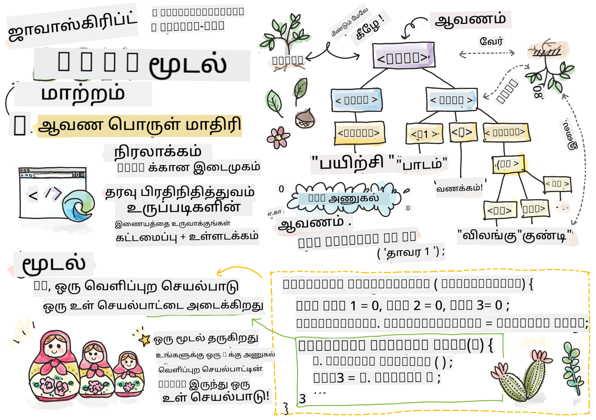
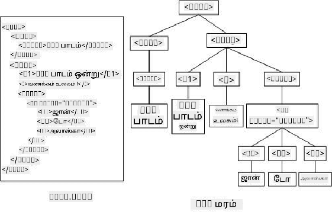
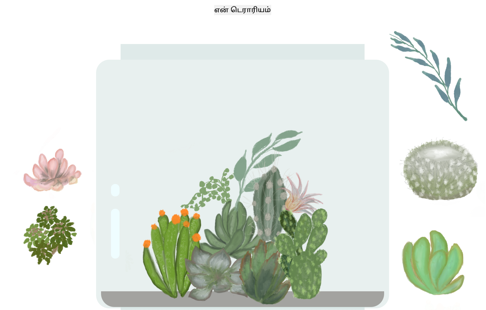

<!--
CO_OP_TRANSLATOR_METADATA:
{
  "original_hash": "61c14b27044861e5e69db35dd52c4403",
  "translation_date": "2025-10-11T11:56:27+00:00",
  "source_file": "3-terrarium/3-intro-to-DOM-and-closures/README.md",
  "language_code": "ta"
}
-->
# டெரேரியம் திட்டம் பகுதி 3: DOM மானிப்புலேஷன் மற்றும் ஒரு க்ளோஷர்


> ஸ்கெட்ச்நோட் [டோமோமி இமுரா](https://twitter.com/girlie_mac) மூலம்

## முன்-வகுப்பு வினாடி வினா

[முன்-வகுப்பு வினாடி வினா](https://ff-quizzes.netlify.app/web/quiz/19)

### அறிமுகம்

DOM, அல்லது "டாக்குமெண்ட் ஆப்ஜெக்ட் மாடல்" மானிப்புலேஷன், வலை வளர்ச்சியின் முக்கிய அம்சமாகும். [MDN](https://developer.mozilla.org/docs/Web/API/Document_Object_Model/Introduction) படி, "டாக்குமெண்ட் ஆப்ஜெக்ட் மாடல் (DOM) என்பது வலைப்பக்கத்தின் அமைப்பு மற்றும் உள்ளடக்கத்தை உருவாக்கும் பொருட்களின் தரவுப் பிரதிநிதியாகும்." DOM மானிப்புலேஷன் தொடர்பான சவால்கள், வெண்மையான ஜாவாஸ்கிரிப்ட் பயன்படுத்துவதற்குப் பதிலாக ஜாவாஸ்கிரிப்ட் ஃப்ரேம்வொர்க்களைப் பயன்படுத்துவதற்கான காரணமாக இருந்தன, ஆனால் நாங்கள் எங்கள் சொந்த முயற்சியில் அதைச் செய்யப் போகிறோம்!

மேலும், இந்த பாடத்தில் [ஜாவாஸ்கிரிப்ட் க்ளோஷர்](https://developer.mozilla.org/docs/Web/JavaScript/Closures) என்ற கருத்தை அறிமுகப்படுத்தும், இது ஒரு செயல்பாட்டை மற்றொரு செயல்பாட்டால் சுற்றியுள்ளதைக் குறிக்கிறது, இதனால் உள்ளே உள்ள செயல்பாடு வெளியே உள்ள செயல்பாட்டின் ஸ்கோப்பை அணுக முடியும்.

> ஜாவாஸ்கிரிப்ட் க்ளோஷர்கள் ஒரு பரந்த மற்றும் சிக்கலான தலைப்பாகும். இந்த பாடம் டெரேரியத்தின் குறியீட்டில் ஒரு க்ளோஷர் உள்ளது என்ற அடிப்படை கருத்தை மட்டுமே தொடுகிறது: ஒரு உள்ளே உள்ள செயல்பாடு மற்றும் ஒரு வெளியே உள்ள செயல்பாடு, உள்ளே உள்ள செயல்பாட்டிற்கு வெளியே உள்ள செயல்பாட்டின் ஸ்கோப்பை அணுக அனுமதிக்கும் வகையில் கட்டமைக்கப்பட்டுள்ளது. இது எப்படி வேலை செய்கிறது என்பதைப் பற்றிய மேலும் தகவலுக்கு, [விரிவான ஆவணங்களை](https://developer.mozilla.org/docs/Web/JavaScript/Closures) பார்வையிடவும்.

நாங்கள் DOM-ஐ மானிப்புலேட் செய்ய க்ளோஷரைப் பயன்படுத்துவோம்.

DOM-ஐ ஒரு மரமாகக் கருதுங்கள், இது ஒரு வலைப்பக்க டாக்குமெண்ட் மானிப்புலேட் செய்யக்கூடிய அனைத்து வழிகளையும் பிரதிநிதித்துவம் செய்கிறது. பல APIகள் (அப்ளிகேஷன் புரோகிராம் இன்டர்ஃபேஸ்கள்) எழுதப்பட்டுள்ளன, இதனால் நிரலாக்கத்திற்கான மொழியைப் பயன்படுத்தி நிரலாக்கர்கள் DOM-ஐ அணுகி, திருத்தி, மாற்றி, மறுசீரமைத்து, மற்றும் வேறு விதமாக அதை நிர்வகிக்க முடியும்.



> DOM மற்றும் அதனை குறிப்பிடும் HTML மார்க்அப் பற்றிய ஒரு பிரதிநிதித்துவம். [ஒல்ஃபா நஸ்ராவி](https://www.researchgate.net/publication/221417012_Profile-Based_Focused_Crawler_for_Social_Media-Sharing_Websites) மூலம்

இந்த பாடத்தில், நாங்கள் எங்கள் இன்டர்ஃபேஸ்டிவ் டெரேரியம் திட்டத்தை முடிக்க, பக்கத்தில் உள்ள தாவரங்களை மானிப்புலேட் செய்ய பயனர் அனுமதிக்கும் ஜாவாஸ்கிரிப்டை உருவாக்குவோம்.

### முன்-தரப்பு

உங்கள் டெரேரியத்தின் HTML மற்றும் CSS உருவாக்கப்பட்டிருக்க வேண்டும். இந்த பாடத்தின் முடிவில், நீங்கள் தாவரங்களை டெரேரியத்தில் உள்ளே மற்றும் வெளியே இழுத்துச் செல்ல முடியும்.

### பணிகள்

உங்கள் டெரேரியம் கோப்புறையில், `script.js` என்ற புதிய கோப்பை உருவாக்கவும். அந்த கோப்பை `<head>` பிரிவில் இறக்குமதி செய்யவும்:

```html
	<script src="./script.js" defer></script>
```

> குறிப்பு: HTML கோப்பு முழுமையாக ஏற்றப்பட்ட பிறகு ஜாவாஸ்கிரிப்ட் செயல்பட அனுமதிக்க, HTML கோப்பில் வெளிப்புற ஜாவாஸ்கிரிப்ட் கோப்பை இறக்குமதி செய்யும்போது `defer` பயன்படுத்தவும். `async` பண்புக்கூறையும் பயன்படுத்தலாம், இது HTML கோப்பு பார்சிங் செய்யும்போது ஸ்கிரிப்டை செயல்படுத்த அனுமதிக்கிறது, ஆனால் எங்கள் வழக்கில், HTML கூறுகள் இழுக்கக்கூடியதாக இருக்க வேண்டும்.

---

## DOM கூறுகள்

முதலில் நீங்கள் செய்ய வேண்டியது, DOM-இல் நீங்கள் மானிப்புலேட் செய்ய விரும்பும் கூறுகளுக்கான குறிப்புகளை உருவாக்க வேண்டும். எங்கள் வழக்கில், அவை பக்கங்களில் காத்திருக்கும் 14 தாவரங்கள்.

### பணிகள்

```html
dragElement(document.getElementById('plant1'));
dragElement(document.getElementById('plant2'));
dragElement(document.getElementById('plant3'));
dragElement(document.getElementById('plant4'));
dragElement(document.getElementById('plant5'));
dragElement(document.getElementById('plant6'));
dragElement(document.getElementById('plant7'));
dragElement(document.getElementById('plant8'));
dragElement(document.getElementById('plant9'));
dragElement(document.getElementById('plant10'));
dragElement(document.getElementById('plant11'));
dragElement(document.getElementById('plant12'));
dragElement(document.getElementById('plant13'));
dragElement(document.getElementById('plant14'));
```

இங்கே என்ன நடக்கிறது? நீங்கள் டாக்குமெண்டை குறிப்பிட்டு, அதன் DOM-இல் ஒரு குறிப்பிட்ட Id கொண்ட கூறைத் தேடுகிறீர்கள். HTML பற்றிய முதல் பாடத்தில், ஒவ்வொரு தாவர படத்திற்கும் தனிப்பட்ட Idகளை நீங்கள் கொடுத்தீர்கள் (`id="plant1"`)? இப்போது நீங்கள் அந்த முயற்சியைப் பயன்படுத்தப் போகிறீர்கள். ஒவ்வொரு கூறையும் அடையாளம் காண்பதற்குப் பிறகு, நீங்கள் அதை `dragElement` என்ற செயல்பாட்டிற்கு அனுப்புகிறீர்கள், அதை நீங்கள் ஒரு நிமிடத்தில் உருவாக்கப் போகிறீர்கள். எனவே, HTML கூறு இழுக்கக்கூடியதாக மாறுகிறது, அல்லது விரைவில் மாறும்.

✅ ஏன் கூறுகளை Id மூலம் குறிப்பிடுகிறோம்? ஏன் CSS வகுப்பின் மூலம் குறிப்பிடக்கூடாது? CSS பற்றிய முந்தைய பாடத்தைப் பார்க்கவும்.

---

## க்ளோஷர்

இப்போது நீங்கள் `dragElement` க்ளோஷரை உருவாக்க தயாராக உள்ளீர்கள், இது ஒரு வெளியே உள்ள செயல்பாடு, இது ஒரு அல்லது அதற்கு மேற்பட்ட உள்ளே உள்ள செயல்பாடுகளுக்கு (எங்கள் வழக்கில், மூன்று) அணுக அனுமதிக்கிறது.

க்ளோஷர்கள் ஒரு அல்லது அதற்கு மேற்பட்ட செயல்பாடுகள் வெளியே உள்ள செயல்பாட்டின் ஸ்கோப்பை அணுக வேண்டும் போது பயனுள்ளதாக இருக்கும். இதோ ஒரு உதாரணம்:

```javascript
function displayCandy(){
	let candy = ['jellybeans'];
	function addCandy(candyType) {
		candy.push(candyType)
	}
	addCandy('gumdrops');
}
displayCandy();
console.log(candy)
```

இந்த உதாரணத்தில், `displayCandy` செயல்பாடு ஏற்கனவே உள்ள ஒரு வரிசையில் புதிய காந்த வகையைச் சேர்க்கும் ஒரு செயல்பாட்டைச் சுற்றுகிறது. இந்த குறியீட்டை இயக்கினால், `candy` வரிசை வரையறுக்கப்படாததாக இருக்கும், ஏனெனில் இது ஒரு உள்ளூர் மாறி (க்ளோஷருக்கு உள்ளூர்).

✅ `candy` வரிசையை அணுகக்கூடியதாக எப்படி மாற்றலாம்? அதை க்ளோஷருக்கு வெளியே நகர்த்த முயற்சிக்கவும். இவ்வாறு, வரிசை உலகளாவியதாக மாறுகிறது, க்ளோஷரின் உள்ளூர் ஸ்கோப்பில் மட்டுமே கிடைக்காமல்.

### பணிகள்

`script.js`-இல் கூறு அறிவிப்புகளின் கீழ் ஒரு செயல்பாட்டை உருவாக்கவும்:

```javascript
function dragElement(terrariumElement) {
	//set 4 positions for positioning on the screen
	let pos1 = 0,
		pos2 = 0,
		pos3 = 0,
		pos4 = 0;
	terrariumElement.onpointerdown = pointerDrag;
}
```

`dragElement` அதன் `terrariumElement` பொருளை ஸ்கிரிப்டின் மேல் அறிவிப்புகளில் இருந்து பெறுகிறது. பின்னர், நீங்கள் அந்த செயல்பாட்டில் அனுப்பப்படும் பொருளுக்கான உள்ளூர் நிலைகளை `0`-இல் அமைக்கிறீர்கள். இவை உள்ளூர் மாறிகள், ஒவ்வொரு கூறுக்கும் இழுக்க மற்றும் விடும் செயல்பாட்டைச் சேர்க்கும் போது மானிப்புலேட் செய்யப்படும். டெரேரியம் இந்த இழுக்கப்பட்ட கூறுகளால் நிரப்பப்படும், எனவே பயன்பாட்டிற்கு அவை எங்கு வைக்கப்பட்டுள்ளன என்பதை கண்காணிக்க வேண்டும்.

மேலும், இந்த செயல்பாட்டிற்கு அனுப்பப்படும் `terrariumElement` ஒரு `pointerdown` நிகழ்வை ஒதுக்குகிறது, இது DOM நிர்வகிக்க உதவ [வலை APIகளின்](https://developer.mozilla.org/docs/Web/API) ஒரு பகுதியாகும். `onpointerdown` ஒரு பொத்தானை அழுத்தும்போது அல்லது எங்கள் வழக்கில், ஒரு இழுக்கக்கூடிய கூறு தொடும்போது செயல்படுகிறது. இந்த நிகழ்வு கைப்பிடி [வலை மற்றும் மொபைல் உலாவிகளில்](https://caniuse.com/?search=onpointerdown) சில விதிவிலக்குகளுடன் வேலை செய்கிறது.

✅ [`onclick` நிகழ்வு கைப்பிடி](https://developer.mozilla.org/docs/Web/API/GlobalEventHandlers/onclick) பல உலாவிகளில் அதிக ஆதரவைப் பெற்றுள்ளது; நீங்கள் அதை இங்கே ஏன் பயன்படுத்தக்கூடாது? நீங்கள் உருவாக்க முயற்சிக்கும் சரியான திரை தொடர்பு வகையைப் பற்றி யோசிக்கவும்.

---

## Pointerdrag செயல்பாடு

`terrariumElement` இழுக்க தயாராக உள்ளது; `onpointerdown` நிகழ்வு செயல்படும்போது, `pointerDrag` செயல்பாடு அழைக்கப்படுகிறது. இந்த வரியின் கீழ் அந்த செயல்பாட்டைச் சேர்க்கவும்: `terrariumElement.onpointerdown = pointerDrag;`:

### பணிகள்

```javascript
function pointerDrag(e) {
	e.preventDefault();
	console.log(e);
	pos3 = e.clientX;
	pos4 = e.clientY;
}
```

பல விஷயங்கள் நடக்கின்றன. முதலில், `e.preventDefault();` பயன்படுத்தி pointerdown நிகழ்வில் வழக்கமாக நடக்கும் இயல்புநிலை நிகழ்வுகளைத் தடுக்கிறீர்கள். இவ்வாறு, நீங்கள் இடைமுகத்தின் நடத்தை மீது அதிக கட்டுப்பாட்டைப் பெறுகிறீர்கள்.

> நீங்கள் ஸ்கிரிப்ட் கோப்பை முழுமையாக உருவாக்கிய பிறகு இந்த வரிக்கு திரும்பி `e.preventDefault()` இல்லாமல் முயற்சிக்கவும் - என்ன நடக்கிறது?

இரண்டாவது, `index.html`-ஐ ஒரு உலாவி சாளரத்தில் திறந்து, இடைமுகத்தை ஆய்வு செய்யவும். நீங்கள் ஒரு தாவரத்தை கிளிக் செய்யும்போது, 'e' நிகழ்வு எப்படி பிடிக்கப்படுகிறது என்பதை நீங்கள் காணலாம். pointerdown நிகழ்வால் எவ்வளவு தகவல் சேகரிக்கப்படுகிறது என்பதைப் பார்க்க நிகழ்வை ஆய்வு செய்யவும்!

அடுத்தது, உள்ளூர் மாறிகள் `pos3` மற்றும் `pos4`-ஐ e.clientX-க்கு அமைத்ததை கவனிக்கவும். ஆய்வு சாளரத்தில் நீங்கள் `e` மதிப்புகளை காணலாம். இந்த மதிப்புகள் நீங்கள் அதை கிளிக் செய்யும் அல்லது தொடும் தருணத்தில் தாவரத்தின் x மற்றும் y கோர்டினேட்களைப் பிடிக்கின்றன. நீங்கள் தாவரங்களின் நடத்தை மீது நுணுக்கமான கட்டுப்பாட்டைப் பெற வேண்டும், எனவே அவற்றின் கோர்டினேட்களை கண்காணிக்கிறீர்கள்.

✅ இந்த முழு பயன்பாடு ஏன் ஒரு பெரிய க்ளோஷருடன் கட்டப்பட்டுள்ளது என்பது தெளிவாக ஆகிறதா? அது இல்லையென்றால், 14 இழுக்கக்கூடிய தாவரங்களின் ஸ்கோப்பை நீங்கள் எப்படி பராமரிப்பீர்கள்?

ஆரம்ப செயல்பாட்டை `pos4 = e.clientY`-க்கு கீழே இரண்டு pointer நிகழ்வு மானிப்புலேஷன்களைச் சேர்த்து முடிக்கவும்:

```html
document.onpointermove = elementDrag;
document.onpointerup = stopElementDrag;
```

இப்போது நீங்கள் தாவரத்தை pointer-இன் பின்னால் இழுக்க விரும்புகிறீர்கள், மேலும் தாவரத்தைத் தேர்ந்தெடுக்காதபோது இழுக்கும் செயல்பாடு நிறுத்தப்பட வேண்டும். `onpointermove` மற்றும் `onpointerup` ஆகியவை `onpointerdown` போன்ற API-யின் பகுதிகள். நீங்கள் `elementDrag` மற்றும் `stopElementDrag` செயல்பாடுகளை இன்னும் வரையறுக்கவில்லை என்பதால், இப்போது அவற்றை உருவாக்குங்கள்.

## elementDrag மற்றும் stopElementDrag செயல்பாடுகள்

தாவரத்தை இழுக்கும் போது மற்றும் இழுக்க நிறுத்தும் போது என்ன நடக்கிறது என்பதை நிர்வகிக்கும் இரண்டு உள்ளே உள்ள செயல்பாடுகளைச் சேர்த்து உங்கள் க்ளோஷரை முடிக்க வேண்டும். நீங்கள் விரும்பும் நடத்தை, நீங்கள் எந்த தாவரத்தையும் எந்த நேரத்திலும் இழுக்க முடியும், மேலும் அதை திரையில் எங்கு வேண்டுமானாலும் வைக்க முடியும். இந்த இடைமுகம் மிகவும் சுதந்திரமானது (எ.கா., ஒரு drop zone இல்லை) உங்கள் டெரேரியத்தை உங்கள் விருப்பப்படி வடிவமைக்க அனுமதிக்க, தாவரங்களைச் சேர்க்க, நீக்க, மற்றும் மறுநிலைமையாக்க.

### பணிகள்

`pointerDrag`-இன் மூடப்பட்ட சுருக்கக் கோடுகளின் கீழ் `elementDrag` செயல்பாட்டைச் சேர்க்கவும்:

```javascript
function elementDrag(e) {
	pos1 = pos3 - e.clientX;
	pos2 = pos4 - e.clientY;
	pos3 = e.clientX;
	pos4 = e.clientY;
	console.log(pos1, pos2, pos3, pos4);
	terrariumElement.style.top = terrariumElement.offsetTop - pos2 + 'px';
	terrariumElement.style.left = terrariumElement.offsetLeft - pos1 + 'px';
}
```

இந்த செயல்பாட்டில், நீங்கள் வெளியே உள்ள செயல்பாட்டில் உள்ள நிலைகள் 1-4-ஐ மிகவும் திருத்துகிறீர்கள். இங்கே என்ன நடக்கிறது?

நீங்கள் இழுக்கும் போது, `pos1`-ஐ `pos3`-க்கு சமமாக மாற்றுகிறீர்கள் (நீங்கள் முன்பு `e.clientX` என அமைத்தீர்கள்) தற்போதைய `e.clientX` மதிப்பை கழித்தல் மூலம். நீங்கள் `pos2`-க்கும் இதே செயல்பாட்டைச் செய்கிறீர்கள். பின்னர், நீங்கள் `pos3` மற்றும் `pos4`-ஐ கூறின் புதிய X மற்றும் Y கோர்டினேட்களுக்கு மீண்டும் அமைக்கிறீர்கள். நீங்கள் இழுக்கும் போது இந்த மாற்றங்களை console-இல் காணலாம். பின்னர், நீங்கள் தாவரத்தின் css ஸ்டைலை அதன் புதிய நிலைகளின் அடிப்படையில் அதன் புதிய நிலையை அமைக்க மானிப்புலேட் செய்கிறீர்கள், அதன் offset-ஐ இந்த புதிய நிலைகளுடன் ஒப்பிட்டு தாவரத்தின் மேல் மற்றும் இடது X மற்றும் Y கோர்டினேட்களை கணக்கிடுகிறீர்கள்.

> `offsetTop` மற்றும் `offsetLeft` என்பது அதன் பெற்றோரின் அடிப்படையில் கூறின் நிலையை அமைக்கும் CSS பண்புகள்; அதன் பெற்றோர் `static` என அமைக்கப்படாத எந்த கூறும் இருக்கலாம்.

இந்த அனைத்து நிலைமாற்றங்களை மீண்டும் கணக்கிடுவது டெரேரியம் மற்றும் அதன் தாவரங்களின் நடத்தை மீது நுணுக்கமான கட்டுப்பாட்டைப் பெற அனுமதிக்கிறது.

### பணிகள்

இடைமுகத்தை முடிக்க கடைசி பணியாக, `elementDrag`-இன் மூடப்பட்ட சுருக்கக் கோடுகளின் கீழ் `stopElementDrag` செயல்பாட்டைச் சேர்க்கவும்:

```javascript
function stopElementDrag() {
	document.onpointerup = null;
	document.onpointermove = null;
}
```

இந்த சிறிய செயல்பாடு `onpointerup` மற்றும் `onpointermove` நிகழ்வுகளை மீட்டமைக்கிறது, இதனால் நீங்கள் உங்கள் தாவரத்தின் முன்னேற்றத்தை மீண்டும் தொடங்க அல்லது புதிய தாவரத்தை இழுக்கத் தொடங்க முடியும்.

✅ நீங்கள் இந்த நிகழ்வுகளை null-ஆக அமைக்காவிட்டால் என்ன நடக்கும்?

இப்போது உங்கள் திட்டத்தை முடித்துவிட்டீர்கள்!

🥇வாழ்த்துக்கள்! நீங்கள் உங்கள் அழகான டெரேரியத்தை முடித்துவிட்டீர்கள். 

---

## 🚀சவால்

உங்கள் க்ளோஷருக்கு புதிய நிகழ்வு கைப்பிடியைச் சேர்த்து தாவரங்களில் மேலும் ஏதாவது செய்யுங்கள்; உதாரணமாக, ஒரு தாவரத்தை முன்னே கொண்டு வர இருமுறை கிளிக் செய்யுங்கள். படைப்பாற்றலாக இருங்கள்!

## வகுப்புக்குப் பின் வினாடி வினா

[வகுப்புக்குப் பின் வினாடி வினா](https://ff-quizzes.netlify.app/web/quiz/20)

## மதிப்பீடு & சுயபடிப்பு

உள்ளமைவுகளை திரையில் இழுப்பது சாதாரணமாகத் தோன்றினாலும், இதைச் செய்ய பல வழிகள் உள்ளன மற்றும் நீங்கள் தேடும் விளைவின் அடிப்படையில் பல சிக்கல்கள் உள்ளன. உண்மையில், ஒரு முழு [இழுக்கும் மற்றும் விடும் API](https://developer.mozilla.org/docs/Web/API/HTML_Drag_and_Drop_API) உள்ளது, அதை நீங்கள் முயற்சிக்கலாம். இந்த மாட்யூலில் அதை பயன்படுத்தவில்லை, ஏனெனில் நாங்கள் விரும்பிய விளைவு வேறுபட்டது, ஆனால் உங்கள் சொந்த திட்டத்தில் இந்த API-ஐ முயற்சித்து நீங்கள் என்ன சாதிக்க முடியும் என்பதைப் பாருங்கள்.

Pointer நிகழ்வுகள் பற்றிய மேலும் தகவல்களை [W3C ஆவணங்களில்](https://www.w3.org/TR/pointerevents1/) மற்றும் [MDN வலை ஆவணங்களில்](https://developer.mozilla.org/docs/Web/API/Pointer_events) காணலாம்.

உலாவி திறன்களை எப்போதும் [CanIUse.com](https://caniuse.com/) மூலம் சரிபார்க்கவும்.

## பணிக்கட்டளை

[DOM-இல் மேலும் வேலை செய்யுங்கள்](assignment.md)

---

**குறிப்பு**:  
இந்த ஆவணம் [Co-op Translator](https://github.com/Azure/co-op-translator) என்ற AI மொழிபெயர்ப்பு சேவையைப் பயன்படுத்தி மொழிபெயர்க்கப்பட்டுள்ளது. நாங்கள் துல்லியத்திற்காக முயற்சிக்கிறோம், ஆனால் தானியக்க மொழிபெயர்ப்புகளில் பிழைகள் அல்லது தவறான தகவல்கள் இருக்கக்கூடும் என்பதை தயவுசெய்து கவனத்தில் கொள்ளுங்கள். அதன் தாய்மொழியில் உள்ள மூல ஆவணம் அதிகாரப்பூர்வ ஆதாரமாக கருதப்பட வேண்டும். முக்கியமான தகவல்களுக்கு, தொழில்முறை மனித மொழிபெயர்ப்பு பரிந்துரைக்கப்படுகிறது. இந்த மொழிபெயர்ப்பைப் பயன்படுத்துவதால் ஏற்படும் எந்த தவறான புரிதல்கள் அல்லது தவறான விளக்கங்களுக்கு நாங்கள் பொறுப்பல்ல.