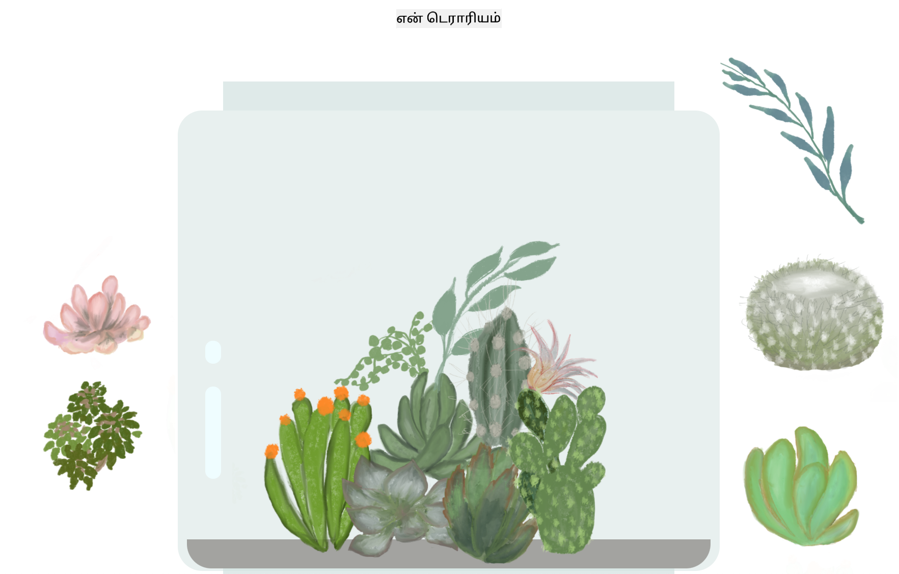

<!--
CO_OP_TRANSLATOR_METADATA:
{
  "original_hash": "7965cd2bc5dc92ad888dc4c6ab2ab70a",
  "translation_date": "2025-10-11T11:55:22+00:00",
  "source_file": "3-terrarium/README.md",
  "language_code": "ta"
}
-->
# என் டெரேரியம்: HTML, CSS மற்றும் JavaScript மூலம் DOM மானிப்புலேஷன் கற்றுக்கொள்ள ஒரு திட்டம் 🌵🌱

சிறிய டிராக் மற்றும் டிராப் கோட்-தியானம். சிறிது HTML, JS மற்றும் CSS உதவியுடன், நீங்கள் ஒரு வலை இடைமுகத்தை உருவாக்கி, அதை அலங்கரித்து, உங்கள் விருப்பத்திற்கேற்ப பல தொடர்புகளைச் சேர்க்க முடியும்.

# பாடங்கள்

1. [HTML அறிமுகம்](./1-intro-to-html/README.md)
2. [CSS அறிமுகம்](./2-intro-to-css/README.md)
3. [DOM மற்றும் JS Closures அறிமுகம்](./3-intro-to-DOM-and-closures/README.md)

## கௌரவங்கள்

♥️ உடன் எழுதப்பட்டது [Jen Looper](https://www.twitter.com/jenlooper) 

CSS மூலம் உருவாக்கப்பட்ட டெரேரியம் Jakub Mandra இன் கண்ணாடி ஜார் [codepen](https://codepen.io/Rotarepmi/pen/rjpNZY) மூலம் ஈர்க்கப்பட்டது.

கலைப்பணிகள் [Jen Looper](http://jenlooper.com) மூலம் கைவரையப்பட்டவை, Procreate உதவியுடன்.

## உங்கள் டெரேரியத்தை வெளியிடுங்கள்

Azure Static Web Apps பயன்படுத்தி உங்கள் டெரேரியத்தை இணையத்தில் வெளியிடலாம்.

1. இந்த ரெப்போவை Fork செய்யவும்

2. இந்த பொத்தானை அழுத்தவும்

3. உங்கள் பயன்பாட்டை உருவாக்குவதற்கான வழிகாட்டியை பின்பற்றவும். உங்கள் பயன்பாட்டு root ஐ `/solution` அல்லது உங்கள் கோட்பேஸின் root ஆக அமைக்கவும். இந்த பயன்பாட்டில் API இல்லை, எனவே அதைச் சேர்க்க கவலைப்பட வேண்டாம். Azure Static Web Apps' build services உங்கள் fork செய்யப்பட்ட repository-யில் ஒரு github கோப்புறையை உருவாக்கும், இது உங்கள் பயன்பாட்டை புதிய URL-க்கு கட்டமைத்து வெளியிட உதவும்.

---

**குறிப்பு**:  
இந்த ஆவணம் [Co-op Translator](https://github.com/Azure/co-op-translator) என்ற AI மொழிபெயர்ப்பு சேவையைப் பயன்படுத்தி மொழிபெயர்க்கப்பட்டுள்ளது. நாங்கள் துல்லியத்திற்காக முயற்சிக்கின்றோம், ஆனால் தானியக்க மொழிபெயர்ப்புகளில் பிழைகள் அல்லது தவறான தகவல்கள் இருக்கக்கூடும் என்பதை தயவுசெய்து கவனத்தில் கொள்ளவும். அதன் தாய்மொழியில் உள்ள மூல ஆவணம் அதிகாரப்பூர்வ ஆதாரமாக கருதப்பட வேண்டும். முக்கியமான தகவல்களுக்கு, தொழில்முறை மனித மொழிபெயர்ப்பு பரிந்துரைக்கப்படுகிறது. இந்த மொழிபெயர்ப்பைப் பயன்படுத்துவதால் ஏற்படும் எந்த தவறான புரிதல்கள் அல்லது தவறான விளக்கங்களுக்கு நாங்கள் பொறுப்பல்ல.