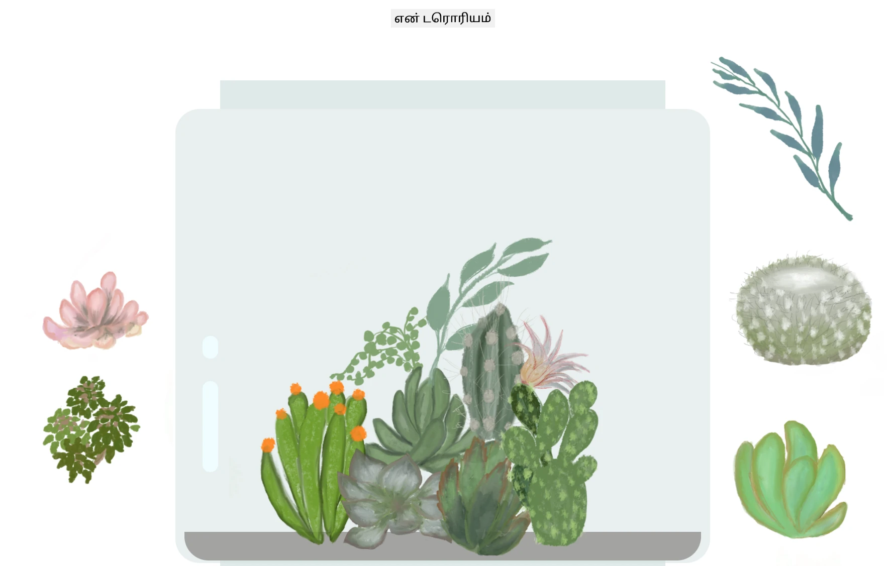

# என் டெரேரியம்: HTML, CSS மற்றும் JavaScript மூலம் DOM மானிப்புலேஷனைப் பற்றி கற்றுக்கொள்ள ஒரு திட்டம் 🌵🌱

சிறிய டிராக் மற்றும் டிராப் கோட்-தியானம். சிறிது HTML, JS மற்றும் CSS கொண்டு, நீங்கள் ஒரு வலை இடைமுகத்தை உருவாக்கி, அதை அலங்கரித்து, ஒரு தொடர்பைச் சேர்க்கலாம்.

## க்ரெடிட்கள்

♥️ உடன் எழுதப்பட்டது [Jen Looper](https://www.twitter.com/jenlooper) 

CSS மூலம் உருவாக்கப்பட்ட டெரேரியம் Jakub Mandra இன் கண்ணாடி ஜார் [codepen](https://codepen.io/Rotarepmi/pen/rjpNZY) மூலம் ஈர்க்கப்பட்டது.

கலைப்பணி [Jen Looper](http://jenlooper.com) மூலம் Procreate பயன்படுத்தி கையால் வரையப்பட்டது.

## உங்கள் டெரேரியத்தை வெளியிடுங்கள்

Azure Static Web Apps பயன்படுத்தி உங்கள் டெரேரியத்தை இணையத்தில் வெளியிடலாம்.

1. இந்த ரெப்போவை Fork செய்யவும்

2. இந்த பொத்தானை அழுத்தவும்

3. உங்கள் ஆப்பை உருவாக்குவதற்கான வழிகாட்டியை பின்பற்றவும். உங்கள் ஆப் ரூட்டை `/solution` அல்லது உங்கள் கோட்பேஸின் ரூட்டாக அமைக்க உறுதிப்படுத்தவும். இந்த ஆப்பில் API இல்லை, எனவே அதைச் சேர்க்க கவலைப்பட வேண்டாம். Azure Static Web Apps' build service உங்கள் ஆப்பை புதிய URL-க்கு உருவாக்கி வெளியிட உதவ, உங்கள் forked ரெப்போவில் ஒரு .github கோப்புறை உருவாக்கப்படும்.

---

**குறிப்பு**:  
இந்த ஆவணம் [Co-op Translator](https://github.com/Azure/co-op-translator) என்ற AI மொழிபெயர்ப்பு சேவையைப் பயன்படுத்தி மொழிபெயர்க்கப்பட்டுள்ளது. எங்கள் தரச்செயல்முறையை உறுதிப்படுத்த முயற்சிக்கிறோம், ஆனால் தானியக்க மொழிபெயர்ப்புகளில் பிழைகள் அல்லது தவறுகள் இருக்கக்கூடும் என்பதை கவனத்தில் கொள்ளவும். அதன் தாய்மொழியில் உள்ள மூல ஆவணம் அதிகாரப்பூர்வ ஆதாரமாகக் கருதப்பட வேண்டும். முக்கியமான தகவல்களுக்கு, தொழில்முறை மனித மொழிபெயர்ப்பு பரிந்துரைக்கப்படுகிறது. இந்த மொழிபெயர்ப்பைப் பயன்படுத்துவதால் ஏற்படும் எந்த தவறான புரிதல்கள் அல்லது தவறான விளக்கங்களுக்கு நாங்கள் பொறுப்பல்ல.