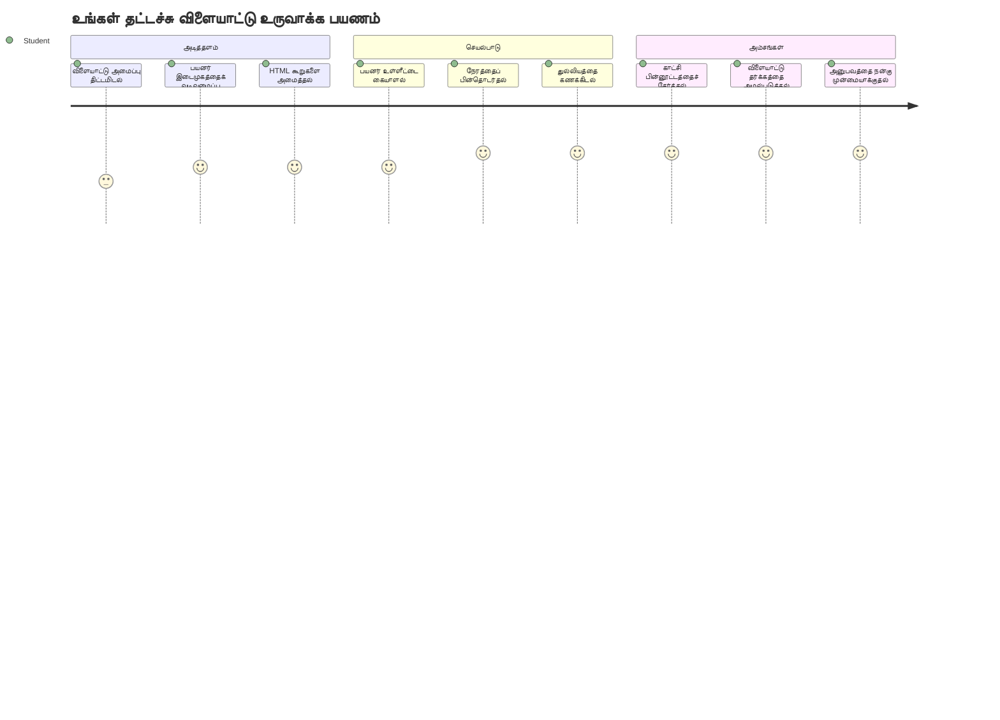
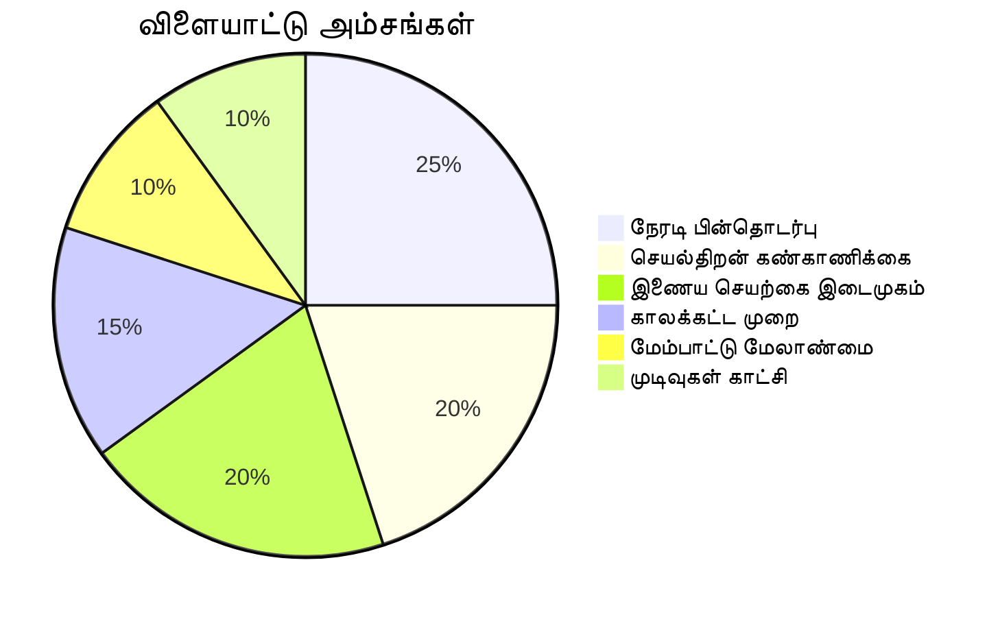
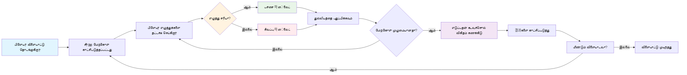
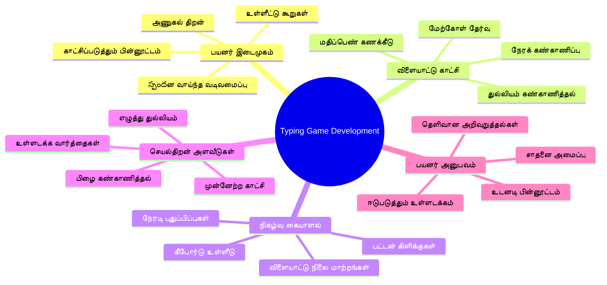
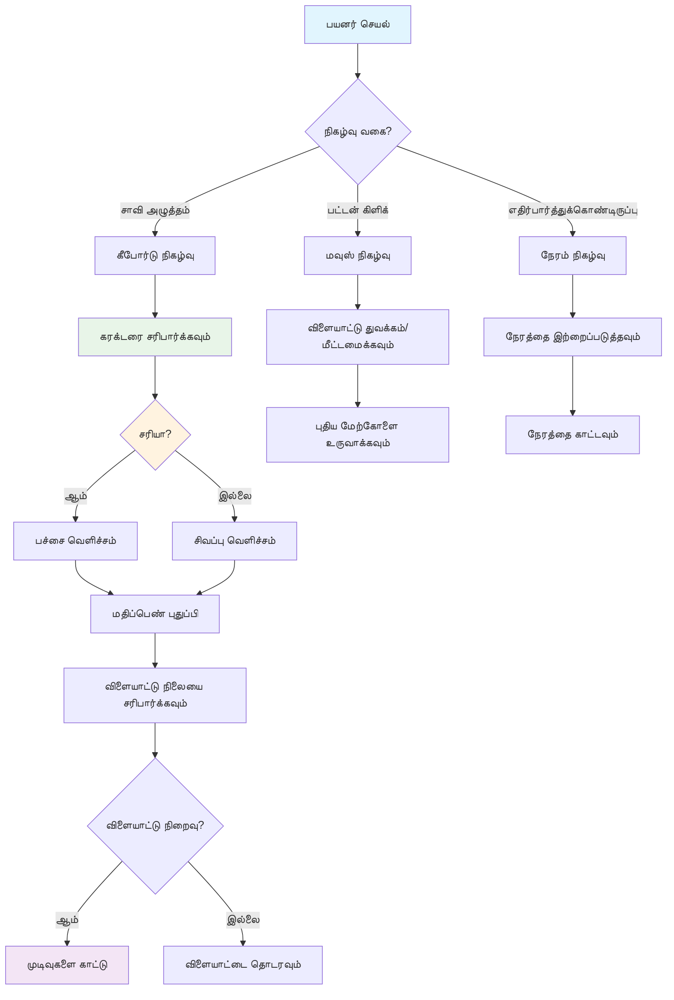
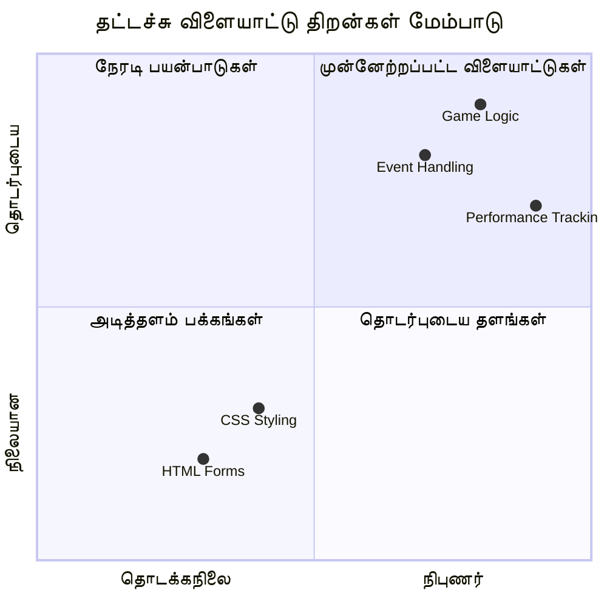
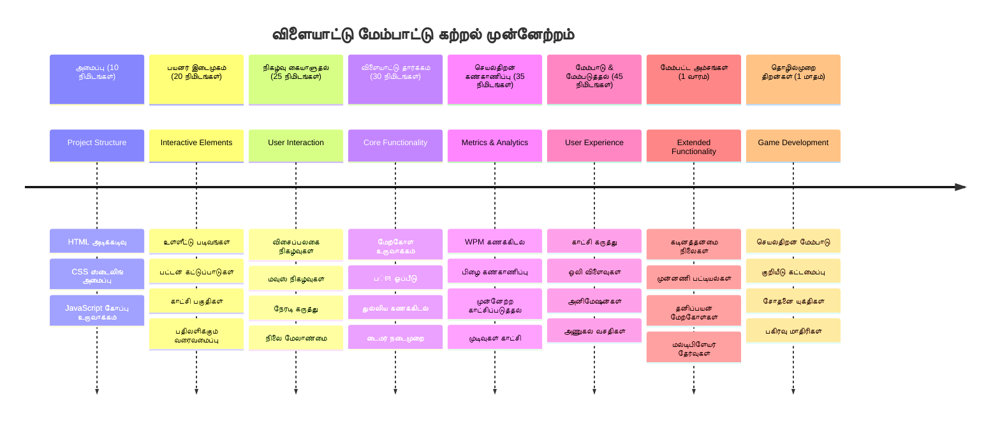

# நிகழ்வால் இயக்கப்படும் நிரலாக்கம் - ஒரு தட்டச்சு விளையாட்டு உருவாக்குதல்

## அறிமுகம்

ஒவ்வொரு விவசாயியும் அறிவதும் கடிதமிடுவது யாரும் பேசாத ஒரு விஷயம்: விரைவாக தட்டச்சு செய்வது ஒரு அற்புத சக்தி! 🚀 நினைத்துப் பார்க்கவும் - உங்கள் மனதிலிருந்து உங்கள் குறியிடுபவருக்கு உங்கள் எண்ணங்களை எவ்வளவு விரைவாக கொண்டு செல்ல முடிகிறது என்றால், உங்கள் படைப்பாற்றல் அதிலும் அதிகமாக வெளிப்படும். இது உங்கள் எண்ணங்களுக்கும் திரையை இடையே நேரடி குழாய் கொண்டிருக்கிறது போல.

இந்த திறமையை மேம்படுத்துவதற்கான சிறந்த வழிகளில் ஒன்றை அறிய விரும்புகிறீர்களா? நீங்கள் சிக்கியிருக்கிறீர்கள் - நாம் ஒரு விளையாட்டை உருவாக்க போகிறோம்!

> வாருங்கள் இணைந்து ஒரு அற்புதமான தட்டச்சு விளையாட்டை உருவாக்குவோம்!

நீங்கள் கற்றுக்கொண்ட அனைத்து JavaScript, HTML மற்றும் CSS திறமைகளை செயல்படுத்த தயாராய்ப் போவதா? நாம் ஒரு தட்டச்சு விளையாட்டை உருவாக்க போகிறோம், இது புரிந்துகொள்ளாத வீரர்கள் [ஷெர்லாக் ஹோல்ம்ஸ்](https://en.wikipedia.org/wiki/Sherlock_Holmes) அவர்களின் சீரிய பழைய விசாரணைகளைப் பயன்படுத்தி சவால் நிறைந்தது. இந்த விளையாட்டு நீங்கள் எவ்வளவு வேகமாகவும் நுண்ணறிவுடன் தட்டச்சு செய்ய முடிகிறது என்பதை கண்காணிக்கும் - நம்புங்கள், இது நீங்கள் நினைக்கும் அளவுக்கு அதிகமாக அடிமைபடுத்துகிறது!

## நீங்கள் அறிந்திருக்க வேண்டியவை

நாம் ஆரம்பிப்பதற்கு முன், இந்த கருத்துக்களை நன்கு புரிந்து கொள்வது அவசியம் (உங்களுக்கு முறையான நினைவூட்டல் தேவைப்பட்டால் கவலை வேண்டாம் - நாம் அனைவரும் அதைக் கண்டுள்ளோம்!):

- உரை உள்ளீடு மற்றும் பொத்தான் கட்டுப்பாடுகளை உருவாக்குதல்
- CSS மற்றும் வகுப்புகளைப் பயன்படுத்தி ஸ்டைல்கள் அமைத்தல்  
- JavaScript அடிப்படைகள்
  - வரிசை உருவாக்குதல்
  - சீர்வரிசையில் எண் உருவாக்குதல்
  - தற்போதைய நேரத்தை பெறுதல்

இந்தவற்றில் ஏதேனும் சற்றே பளைந்துள்ளனவாக இருந்தால், அதுவும் சரி! சிலமுறை உங்கள் அறிவை உறுதி செய்வதற்கான சிறந்த வழி ஒரு திட்டத்தில் துள்ளி சென்று செய்வதுதான்.

### 🔄 **கற்கை சோதனை**
**அடித்தள மதிப்பீடு**: அபிவிருத்தியைத் தொடங்குவதற்கு முன், நீங்கள் பின்வரும்வற்றை புரிந்திருக்க வேண்டும்:
- ✅ HTML படிவங்கள் மற்றும் உள்ளீடு கூறுகள் எப்படி செயல்படுகின்றன
- ✅ CSS வகுப்புகள் மற்றும் மாற்றமளிக்கும் ஸ்டைலிங்
- ✅ JavaScript நிகழ்ச்சி கேட்பவர்கள் மற்றும் கையாள்வோர்
- ✅ வரிசை செயலாக்கமும் சீர்வரிசைப் படிவமளிப்பும்
- ✅ நேரம் அளவீடு மற்றும் கணக்கீடுகள்

**விரைவான சுய-पரிசோதனை**: இந்த கருத்துக்கள் ஒரு தொடர்பு கொண்ட விளையாட்டில் எவ்வாறு இணைந்து செயல்படுகின்றன என்பதை விளக்க முடியுமா?
- **நிகழ்வுகள்** இருந்து பயனர்கள் கூறுகளுடன் தொடர்புகொள்ளும் பொழுதுதான் தொடங்கும்
- **கையாள்வோர்** அந்த நிகழ்வுகளை செயல்படுத்தி விளையாட்டு நிலையை புதுப்பிக்கும்
- **CSS** பயனர் செயல்களுக்கு காட்சியியல் ஆதரவு வழங்கும்
- **நேரம்** செயல்பாட்டு அளவை மற்றும் விளையாட்டு முன்னேற்றத்துக்கு உதவுகிறது

## இதை உருவாக்குவோம்!

[நிகழ்வால் இயக்கப்படும் நிரலாக்கத்தைப் பயன்படுத்தி தட்டச்சு விளையாட்டு உருவாக்குதல்](./typing-game/README.md)

### ⚡ **பின்வரும் 5 நிமிடங்களில் நீங்கள் செய்யக்கூடியவை**
- [ ] உலாவிச் சாளரத்தில் console ஐ திறந்து `addEventListener` மூலம் keyboard நிகழ்வுகளை கேட்க முயற்சிக்கவும்
- [ ] ஒரு எளிய HTML பக்கம் உருவாக்கி உள்ளீட்டு புலம் வைத்து தட்டச்சு கண்டறிதலைச் சோதிக்கவும்
- [ ] எழுதப்பட்ட உரையை இலக்குருக்கு உரையுடன் ஒப்பிட்டு சரிபார்க்க எழுத்துத் தொடர் செயலாக்கத்தில் பயிற்சி பெறுக
- [ ] நேரம் சார்ந்த செயல்பாடுகளை புரிந்து கொள்ள `setTimeout` ஐ முயற்சி செய்யவும்

### 🎯 **இந்த மணி நேரத்தில் நீங்கள் சாதிக்கக்கூடியவை**
- [ ] பாடம் முடிந்ததும் கேள்விப்பத்திரத்தை முடித்து நிகழ்வால் இயக்கப்படும் நிரலாக்கத்தை புரிந்துகொள்ளவும்
- [ ] சொல் சரிபார்ப்பு உடன் தட்டச்சு விளையாட்டின் அடிப்படைக் கோப்பை உருவாக்கவும்
- [ ] சரியான மற்றும் தவறான தட்டச்சுக்கு காட்சியியல் ஆதரவைச் சேர்க்கவும்
- [ ] வேகம் மற்றும் துல்லியத்தால் அடிப்படையாக்கப்பட்ட எளிய மதிப்பெண் அமைப்பை நடைமுறைப்படுத்தவும்
- [ ] உங்கள் விளையாட்டை CSS உடன் ஸ்டைலிங் செய்து கண்ணுக்கு இன்பமடையத்தக்கதாக மாற்றவும்

### 📅 **உங்கள் வாரம் முழுவதும் விளையாட்டு மேம்பாடு**
- [ ] அனைத்து அம்சங்களும் மற்றும் அலங்காரத்துடன் முழு தட்டச்சு விளையாட்டை முடிக்கவும்
- [ ] விதிவிலக்கான சொல் சிக்கல்களுடன் கடுமைத்தன்மை நிலைகளைச் சேர்க்கவும்
- [ ] பயனர் புள்ளிவிவர கண்காணிப்பை நடைமுறைப்படுத்தவும் (அகரவேகம், நேரத்தின்போது துல்லியம்)
- [ ] சிறந்த பயனர் அனுபவத்திற்கு ஒலிப் பயன்பாடுகள் மற்றும் இயக்கப்படுத்தல்களை உருவாக்கவும்
- [ ] தொட்டு இயங்கும் சாதனங்களுக்காக உங்கள் விளையாட்டை மொபைல்-பரிமாற்றமாக மாற்றவும்
- [ ] உங்கள் விளையாட்டை ஆன்லைனில் பகிர்ந்து பயனர்களிடமிருந்து கருத்துகளைப் பெறவும்

### 🌟 **உங்கள் மாதப் முழுக்க தொடரும் தொடர்பாடல் மேம்பாடு**
- [ ] பல்வேறு தொடர்பாடல் மாதிரிகள் பரிசீலனை செய்ய பல விளையாட்டுகளை உருவாக்கவும்
- [ ] விளையாட்டு பிணைப்புகள், நிலை மேலாண்மை மற்றும் செயல்திறன் மேம்பாட்டை கற்றுக்கொள்ளவும்
- [ ] திறந்த மூல விளையாட்டு மேம்பாட்டு திட்டங்களுக்கு பங்களிக்கவும்
- [ ] மேம்பட்ட நேரம் கருத்துக்கள் மற்றும் மென்மையான இயக்கப்படுத்தல்களை মাস்டர் செய்யவும்
- [ ] பல்வேறு தொடர்பாட்டுப் பயன்பாடுகளை காட்சிப்படுத்தும் ஒரு போர்ட்ஃபோலியோ உருவாக்கவும்
- [ ] விளையாட்டு மேம்பாடு மற்றும் பயனர் தொடர்பில் ஆர்வமுள்ளவர்களுக்கு வழிகாட்டியாக இருங்கள்

## 🎯 உங்கள் தட்டச்சு விளையாட்டு திறன் கால அட்டவணை

### 🛠️ உங்கள் விளையாட்டு மேம்பாட்டு கருவி தொகுப்பு சுருக்கம்

இந்த திட்டத்தை முடித்ததும், நீங்கள் தேர்ச்சி பெறுவீர்கள்:
- **நிகழ்வால் இயக்கப்படும் நிரலாக்கம்**: உள்ளீடுக்கு பதில் அளிக்கும் பதில் வழங்கும் பயனர் இடைவெளிகள்
- **உடனடி பின்னூட்டம்**: கண்காணிப்பு காட்சி மற்றும் செயல்திறன் மேம்பாடுகள்
- **செயல்திறன் அளவீடு**: துல்லியமான நேரம் மற்றும் மதிப்பெண் அமைப்புகள்
- **விளையாட்டு நிலை மேலாண்மை**: பயன்பாட்டு ஓட்டத்தை மற்றும் பயனர் அனுபவத்தை கட்டுப்படுத்தல்
- **இணைப்பு வடிவமைப்பு**: ஈர்க்கக்கூடிய, அடிமையாக்கக் கூடிய பயனர் அனுபவங்கள் உருவாக்குதல்
- **நவீன வலை APIகள்**: கொண்டுருக்கும் உலாவித் திறன்கள் மூலம் பண்பட்ட தொடர்பாடல்கள்
- **அறிவுபூர்வ அணுகல் முறைமைகள்**: எல்லா பயனர்களுக்கும் உள்ளடக்கிய வடிவமைப்பு

**உண்மை உலக பயன்பாடுகள்**: இந்த திறன்கள் நேரடியாக பொருந்துகிறது:
- **வலை பயன்பாடுகள்**: எந்த தொடர்புடைய இடைமுகம் அல்லது டாஷ்போர்டும்
- **கல்வி மென்பொருள்**: கற்றல் தளம் மற்றும் திறன் மதிப்பீடுகளுக்கான கருவிகள்
- **துடுப்பெழுப்பும் கருவிகள்**: உரை ஆசிரியர்கள், IDEகள் மற்றும் ஒத்துழைப்பு மென்பொருள்
- **விளையாட்டு துறை**: உலாவி விளையாட்டுகள் மற்றும் தொடர்பாடலான பொழுதுபோக்கு
- **மொபைல் மேம்பாடு**: தொட்டு அடிப்படையிலான இடைமுகங்கள் மற்றும் இயக்க தன்மை கையாளல்

**அடுத்த நிலை**: நீங்கள் மேம்பட்ட விளையாட்டு தொகுப்புகள், நேரடி பல்-பயனர் முறைகள் அல்லது சிக்கலான தொடர்பாடல் பயன்பாடுகளை ஆராய தயார்!

## கடன்பாகங்கள்

♥️ கொண்டு எழுதியவர் [Christopher Harrison](http://www.twitter.com/geektrainer)

---

<!-- CO-OP TRANSLATOR DISCLAIMER START -->
**உறுதிப்படுத்தல்**:
இந்த ஆவணம் AI மொழிபெயர்ப்புச் சேவை [Co-op Translator](https://github.com/Azure/co-op-translator) மூலம் மொழிபெயர்க்கப்பட்டுள்ளது. நாங்கள் துல்லியத்தன்மைக்காக முயற்சி செய்தாலும், தானாக செய்யப்பட்ட மொழிபெயர்ப்புகளில் பிழைகள் அல்லது தவிர்க்கமுடிந்த மாற்றங்கள் இருக்கக்கூடும் என்பதை தயவுபூர்வமாக கவனத்தில் கொள்ளவும். இயல்புநிலையான மொழியிலுள்ள அசல் ஆவணத்தையே அதிகாரபூர்வமான ஆதாரமாகக் கருதி கொள்ள வேண்டும். முக்கியமான தகவல்களுக்கு, தொழில்முறையாளர் மனித மொழிபெயர்ப்பை பரிந்துரைக்கிறோம். இந்த மொழிபெயர்ப்பின் பயன்பாட்டால் ஏற்படும் எந்தவொரு தவறான புரிதல்கள் அல்லது தவறான விளக்கங்களுக்கும்எந்தவிதமான பொறுப்பும் நாம் ஏற்கவில்லை.
<!-- CO-OP TRANSLATOR DISCLAIMER END -->