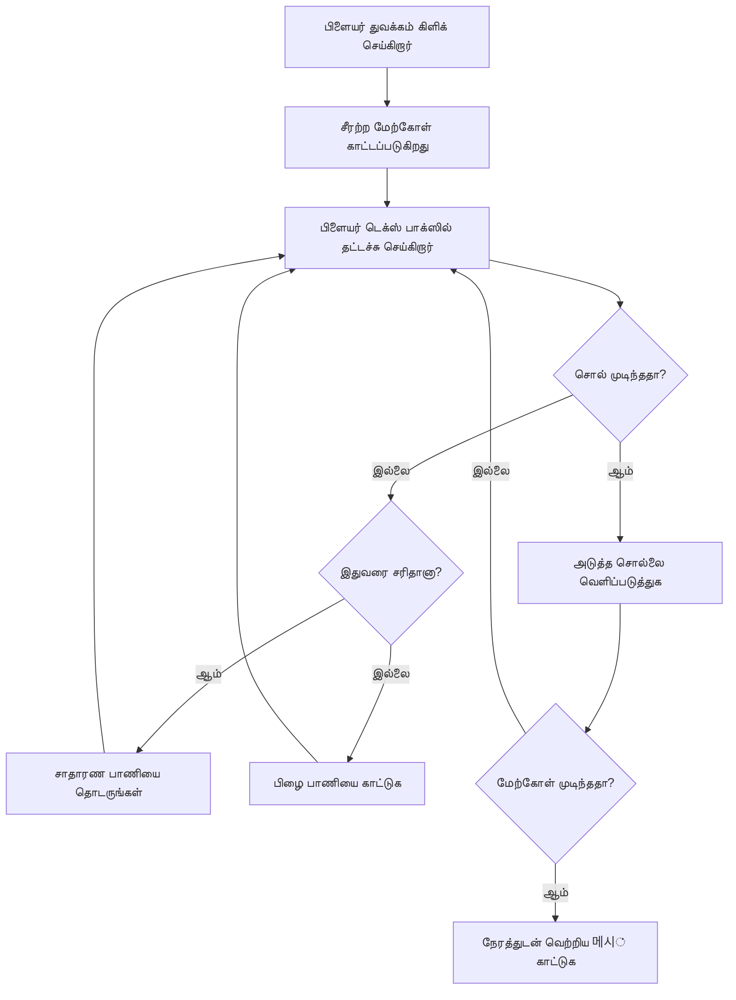
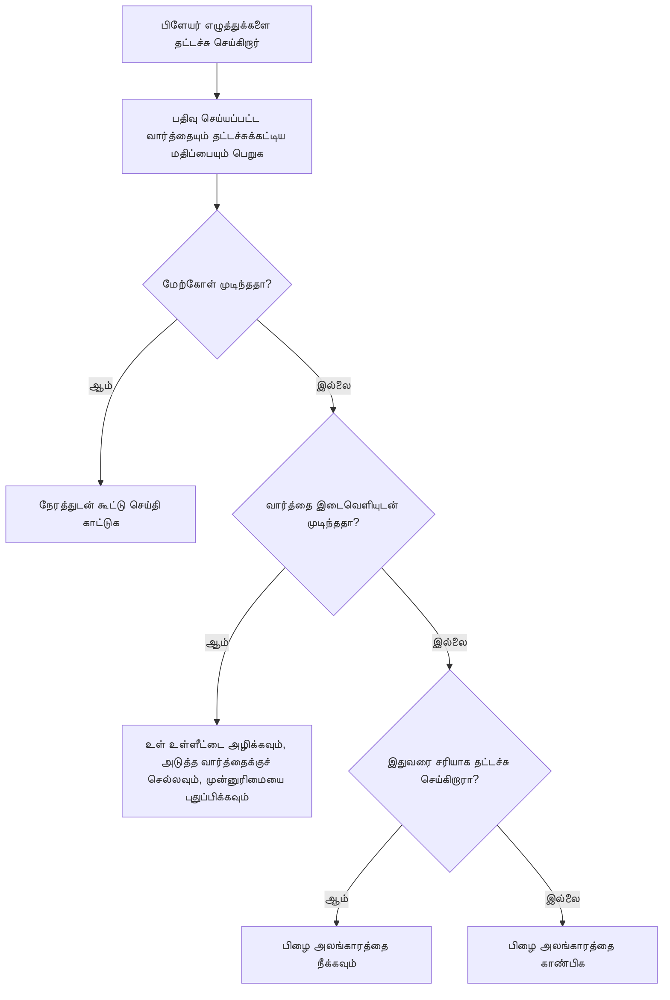
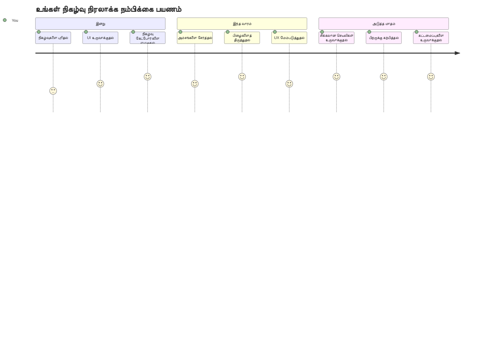

# நிகழ்வுகளைப் பயன்படுத்தி ஒரு கேம் உருவாக்குதல்

நீங்கள் எப்போதாவது ஒரு இணையதளம் நீங்கள் ஒரு பொத்தானை அழுத்தும் போது அல்லது ஒரு எழுத்துப்பெட்டியில் டைப் செய்யும் போது எப்படி தெரிந்து கொள்கிறது என்று ஆச்சரியப்பட்டிருக்கிறீர்களா? அதுவே நிகழ்வுசார் நிரலாக்கத்தின் மாயாஜாலம்! நீங்கள் செய்யும் ஒவ்வொரு விசையைப் பற்றியும் பிரதிபலிக்கும் ஒரு பயனுள்ளதை உருவாக்குவதன் மூலம் இந்த மிக அவசியமான திறனை கற்றுக்கொள்ள சிறந்த வழி என்னவென்றால் - ஒரு டைப்பிங் வேகம் கேம்.

நீங்கள் நேரடியாக எப்படி வலை உலாவிகள் உங்கள் ஜாவா ஸ்கிரிப்ட் குறியீட்டுடன் "பேசுகின்றன" என்பதைப் பார்க்கப்போகிறீர்கள். நீங்கள் ஒவ்வொரு முறையும் கிளிக் செய்யும் போது, டைப் செய்யும் போது அல்லது உங்கள் மவுஸை நகர்த்தும் போது, உலாவி உங்கள் குறியீட்டிற்கு சிறிய செய்திகளை (நாம் அவற்றை நிகழ்வுகள் என்று அழைக்கிறோம்) அனுப்புகிறது, மற்றும் எப்படி பதிலளிக்க வேண்டும் என்பதைக் நீங்கள் தீர்மானிக்க வேண்டும்!

இங்கே நிறைவடையும்போது, நீங்கள் உங்கள் வேகம் மற்றும் துல்லியத்தை கண்காணிக்கும் ஒரு உண்மையான டைப்பிங் கேம் ஒன்றை உருவாக்கி இருப்பீர்கள். மேலும் முக்கியமாக, நீங்கள் சமைத்துள்ள ஒவ்வொரு இடைமுக வலைத்தளத்தையும் இயக்கும் அடிப்படைக் கருத்துக்களைப் புரிந்து கொள்ளப்போகிறீர்கள். வாருங்கள், தள்ளிச் செல்லலாம்!

## முன்-பாடம் விடுகை

[Pre-lecture quiz](https://ff-quizzes.netlify.app/web/quiz/21)

## நிகழ்வுகளால் இயக்கப்படும் நிரலாக்கம்

உங்கள் விரும்பும் செயலி அல்லது இணையதளம் நினைத்துப் பாருங்கள் - அது உயிரோடு இருப்பதையும் நேர்மறையாக உள்ளதையும் உணரச் செய்வது என்ன? நீங்கள் செய்யும் செயலுக்கு அது எப்படி பதிலளிப்பதையே அது சார்ந்தது! ஒவ்வொரு தட்டி, கிளிக், ஸ்வைப் அல்லது விசை அழுத்தம் ஒரு "நிகழ்வு" உருவாக்குகிறது, அங்கே தான் வலை அபிவிருத்தியின் உண்மை மாயாஜாலம் நடக்கிறது.

வலைத்தளத்திற்கான நிரலாக்கம் எப்படி அசத்தலாக இருக்கிறது என்பதை இங்கே பாருங்கள்: எப்போது யாராவது அந்த பொத்தானை அழுத்துவார் அல்லது எழுத்துப்பெட்டியில் அறிமுகப்படுத்த ஆரம்பிப்பார் என்று நமக்கு தெரியாது. அவர்கள் உடனே கிளிக் செய்யலாம், ஐந்து நிமிடங்கள் காத்திருக்கலாம் அல்லது ஒருபோதும் கிளிக் செய்யாமலிருக்கலாம்! இந்த எதிர்பாராத தன்மை நமக்கு எவ்வாறு எங்களது குறியீட்டை எழுதுவது என்று வேறுபடியாக நினைக்க வேண்டியதை உண்டாக்குகிறது.

வேப்பவரிசையாக நிற்கும் வகையில் நிரல் எழுதுவதற்குப் பதிலாக, நாங்கள் அயல்அனுபவிக்கக் காத்திருக்கும் வகையில் குறியீட்டை எழுதுகிறோம். இது 1800களில் டெலிகிராப் இயக்குநர்கள் தங்கள் மெஷின்களின் அருகில் அமர்ந்து, ஒரு செய்தி வயரில் வந்த உடனே பதிலளிக்க தயாராக நிற்கின்றனர் போல் இருக்கிறது.

ஆக, "நிகழ்வு" என்றால் என்ன? எளிதாகச் சொல்வோமாக, அது நடக்கும் ஏதோ ஒன்று! நீங்கள் ஒரு பொத்தானை அழுத்தும் போது - அது ஒரு நிகழ்வு. நீங்கள் ஒரு எழுத்தை டைப் செய்யும் போது - அது ஒரு நிகழ்வு. நீங்கள் உங்கள் மவுஸை நகர்த்தும் போது - அது மற்றொரு நிகழ்வு.

நிகழ்வுகளால் இயக்கப்படும் நிரலாக்கம் நமக்கு எங்கள் குறியீட்டை கேட்கவும் பதிலளிக்கவும் அமைக்க உதவுகிறது. நாம் **நிகழ்வு காத்திருப்பாளர்கள்** எனும் சிறப்பு செயல்பாடுகளை உருவாக்குகிறோம், அவை சில நிகழ்வுகள் நடக்க இணைத்து காத்திருக்கின்றன, பிறகு அவை நடக்கும் போது உடனடியாக செயல்படுகின்றன.

நிகழ்வு காத்திருப்பாளர்களை உங்கள் குறியீட்டிற்கான கதவு மணி போன்றதாகக் கருதுங்கள். நீங்கள் கதவு மணியைக் `addEventListener()` மூலம் அமைக்கிறீர்கள், அது கேட்டுக் கொள்ளத் தேவையான இரைச்சலை (போன்ற 'click' அல்லது 'keypress') தெரிவிக்கிறீர்கள், பின்னர் யார் அழுத்தினாலும் என்ன நடக்க வேண்டும் என்று உங்கள் தனிப்பட்ட செயல்பாட்டை குறிப்பிடுகிறீர்கள்.

**நிகழ்வு காத்திருப்பாளர்கள் எப்படி செயல்படுகின்றன என்பதைப் பார்க்கலாம்:**
- **கேட்கின்றனர்** நடைமுறை பயனர் செயல்களில் கடந்த அல்லது விசைகளைச் சார்ந்த செயல்கள்
- **செயல்படுத்துகின்றனர்** குறிப்பிடப்பட்ட நிகழ்வு நேர்ந்தால் உங்கள் தனிப்பட்ட குறியீட்டை
- **நேரடியாக** பயனர் தொடர்புகளுக்கு பதிலளித்து ஒரு தொடர்சியான அனுபவத்தை உருவாக்குகின்றனர்
- **ஒன்றே கூறு மீது** பல நிகழ்வுகளை வெவ்வேறு காத்திருப்பாளர்களைப் பயன்படுத்தி கையாள்கின்றனர்

> **NOTICE:** நிகழ்வு காத்திருப்பாளர்களை உருவாக்க பல வழிகள் உள்ளன. நீங்கள் அது பெயரிடப்பட்ட செயல்பாடுகளாகவும், பெயர் இல்லாதனாகவும் செய்யலாம். `click` என்ற சொத்தானை அமைக்க அல்லது `addEventListener()` பயன்படுத்துவது போன்ற குறுக்கு வழிகளும் உண்டு. எங்கள் பயிற்சியில் நாங்கள் `addEventListener()` மற்றும் பெயர் இல்லாத செயல்பாடுகளுக்கு கவனம் செலுத்தப்போகிறோம், ஏனெனில் அது வெப்தொகுநர்கள் அதிகப்படியான வகை பயன்படுத்துவதாக இருக்கிறது. மேலும் இது மிகவும் தனிச்சிறந்தது, ஏனெனில் `addEventListener()` அனைத்து நிகழ்வுகளுக்கும் வேலை செய்யும், மற்றும் நிகழ்வு பெயரை ஒரு அளவுருவாக வழங்கலாம்.

### பொதுவான நிகழ்வுகள்

வலை உலாவிகள் நீங்கள் கேட்கும் தரப்படும் பல நேர்வைகளை வழங்கினாலும், பெரும்பாலான இடைமுக பயன்பாடுகள் சில முக்கிய நிகழ்வுகளை மட்டுமே சார்ந்திருக்கின்றன. இந்த அடிப்படை நிகழ்வுக்களைப் புரிந்து கொள்வதால் மிக நுட்பமான பயனர் தொடர்புகளை உருவாக்க அடிப்படையை பெறுவீர்கள்.

நீங்கள் ஒரு செயலி உருவாக்கும்போது கேட்கக்கூடிய [பல் நிகழ்வுகள்](https://developer.mozilla.org/docs/Web/Events) உள்ளன. அடிப்படையாக, ஒரு பக்கம் பயனர் செய்யும் எதுவும் ஒரு நிகழ்வை ஏற்படுத்தும், இது உங்கள் விருப்பம் நிகழச் செய்ய அதீத சக்தியைக் கொடுக்கிறது. அதிர்ஷ்டவசமாக, நீங்கள் பெரும்பாலும் சில நிகழ்வுகளைக் மட்டும் பயன்படுத்த மோதிரவும் பின் நடவடிக்கையும் தேவை. இவை சில பொதுவானவை (நாம் எங்கள் கேம்மை உருவாக்கும் போது இரண்டு இதில் பயன்படுத்தப்போகிறோம்):

| நிகழ்வு | விளக்கம் | பொதுவான பயன்பாடுகள் |
|---------|-----------|---------------------|
| `click` | பயனர் ஏதோ ஒன்றை கிளிக் செய்தார் | பொத்தான்கள், இணைப்புகள், இடைமுக கூறுகள் |
| `contextmenu` | பயனர் வலது மவுஸ் பொத்தானை அழுத்தினார் | தனிப்பயன் வலது கிளிக் மெனுக்கள் |
| `select` | பயனர் ஒரு எழுத்தைத் தேர்ந்தெடுத்தார் | எழுத்து திருத்தம், நகல் செயல்பாடுகள் |
| `input` | பயனர் எழுத்தை உள்ளிடினார் | படிவம் சரிபார்ப்பு, நேரடி தேடல் |

**இந்த நிகழ்வு வகைகளைப் புரிந்துகொள்வது:**
- **இயக்குகிறது** பயனர்கள் உங்கள் பக்கத்திலுள்ள குறிப்பிட்ட கூறுகளை அணுகும் போது
- **கொடுக்கிறது** பயனரின் செயலின் விரிவான தகவல்களைக் நிகழ்வு பொருள்களின் மூலமாக
- **உதவுகிறது** நீங்கள் பதிலளிக்கக்கூடிய வேடிக்கை மற்றும் இடைமுக வலை செயலிகளை உருவாக்க
- **ஒரே மாதிரியாக செயல்படுகிறது** வெவ்வேறு உலாவிகள் மற்றும் சாதனங்களில்

## கேம் உருவாக்குதல்

நிகழ்வுகள் எப்படி வேலை செய்கிறன என்பதைக் கவனித்து الآن பயிற்சியில் வைக்கின்றோம், பயனுள்ள ஒன்றை உருவாக்கி. நாம் ஒரு டைப்பிங் வேகம் கேம் உருவாக்க போகிறோம், இது நிகழ்வு கையாளுதலை காட்டும் மற்றும் ஒரு முக்கியமான அபிவிருத்தியாளர் திறனை வளர்க்க உதவும்.

நாம் JavaScript இல் நிகழ்வுகள் எப்படி வேலை செய்கின்றன என்பதை ஆராய ஒரு கேம் உருவாக்கப்போகிறோம். நமது கேம் ஒரு வீரரின் டைப்பிங் திறனை பரீட்சிக்கும், இது அனைத்து அபிவிருத்தியாளர்களும் பெற்றிருக்க வேண்டிய மிகக் கவனிக்கப்படாத திறனர் ஒன்று. சுவாரஸ்யம்: நாம் இன்று பயன்படுத்தும் QWERTY விசைப்பலகை அமைப்பு 1870களில் டைப் ரைட்டர்களுக்காக வடிவமைக்கப்பட்டது - மற்றும் நல்ல டைப்பிங் திறன்கள் இன்னும் இன்று நிரலர்களுக்கு மிக மதிப்புமிக்கவையாக உள்ளன! கேம் பொதுவான காட்சி பின்வருமாறு இருக்கும்:


**நமது கேம் இவ்வாறு செயல்படுகிறது:**
- **தொடங்கும்** வீரர் தொடக்க பொத்தானை அழுத்தும் போது மற்றும் ஒரு சீரற்ற மேற்கோளை காட்டும்
- **பின்தொடர்கிறது** வீரரின் டைப்பிங் முன்னேற்றத்தை real-timeல் வார்த்தை வாரியாக
- **முடிச்சுவிக்கிறது** தற்போதைய வார்த்தையை பயனர் கவனத்தை வழிநடத்த
- **உடனடி** கூறுபிழை காட்சியை வழங்குகிறது
- **கணக்கு** மேற்கோள் முடிந்த பிறகு மொத்த நேரத்தை காட்டுகிறது

நாம் கேம்ஸை உருவாக்குவோம், மற்றும் நிகழ்வுகளைப் பற்றி கற்போம்!

### கோப்பு அமைப்பு

நாம் குறியீட்டினை எழுத ஆரம்பிப்பதற்கு முன் அமைக்கலாம்! தொடக்கம் முதல் ஒரு சுத்தமான கோப்பு அமைப்பை வைத்திருப்பது பின்னர் தலைவலிகளைக் குறைக்கும் மற்றும் உங்கள் திட்டத்தை விஸ்மயந்திரமாக ஆக்கும். 😊

நாம் மூன்று கோப்புகளுடன் எளிமையாக வைத்து நடைபெறப்போகிறோம்: பக்க அமைப்புக்கு `index.html`, அனைத்து கேம் லாஜிக் க்கும் `script.js`, மற்றும் அனைத்தையும் அழகாக காட்டுமாறு `style.css`. இது பெரும்பாலும் வலைத்தளங்களை இயக்கும் நுட்பமான மூவர் !

**கோடை பயன்படுத்தி உங்கள் வேலைக்கான புதிய கோப்புறை உருவாக்கவும்:**

```bash
# லினிக்ஸ் அல்லது மேக்ஓ.எஸ்
mkdir typing-game && cd typing-game

# வின்டோஸ்
md typing-game && cd typing-game
```

**இந்த கட்டளைகள் என்ன செய்கின்றன:**
- **தெரிகிறது** தயாரிப்பிற்கு `typing-game` என்ற புதிய அடைவைக் உருவாக்கும்
- **தானாக** புதிதாக உருவாக்கப்பட்ட அடைவுக்குள் செல்லும்
- **வரவேற்கிறான்** ஒரு சுத்தமான பணியிடத்தை உங்கள் கேம் அபிவிருத்திக்கு அமைக்கிறது

**Visual Studio Code திறக்கவும்:**

```bash
code .
```

**இந்த கட்டளை:**
- **துவக்குகிறது** அனைத்து கோப்புகளும் உள்ள தற்போதைய அடைவில் Visual Studio Code ஐ
- **திறக்கிறது** உங்கள் திட்ட அடைவைக்
- **கொடுக்கிறது** நீங்கள் தேவையான அனைத்து அபிவிருத்தி கருவிகளையும் அணுகல்

**Visual Studio Code இல் கீழ்காணும் பெயர்களுடன் 3 கோப்புகளை சேர்க்கவும்:**
- `index.html` - உங்கள் கேம் அமைப்பும் உள்ளடக்கமும்
- `script.js` - கேம் லாஜிக்கையும் நிகழ்வு காத்திருப்பாளர்களையும் கையாளும்
- `style.css` - காட்சி தோற்றமும் பாணியும் வரையறுக்கும்

## பயனர் இடைமுகம் உருவாக்குதல்

இப்போது அனைத்து நமது கேம் செயல்பாடுகளும் நடக்கும் மேடையை உருவாக்குவோம்! விண்கலம் கட்டுப்பாட்டுப் பலகை வடிவமைப்பதைப் போன்றதாக நினைத்துக் கொள்ளுங்கள் - எங்கள் வீரர்கள் தேவையான அனைத்தும் எதிர்பார்க்கும் இடத்தில் இருப்பதை உறுதி செய்ய வேண்டும்.

எங்கள் கேம் உண்மையில் என்ன தேவை என்பதைத் தீர்மானிக்கலாம். நீங்கள் ஒரு டைப்பிங் கேம் விளையாடினால், திரையில் என்ன காண விரும்புவீர்கள்? இங்கே நாம் தேவைப்படும் விஷயங்கள்:

| UI கூறு | நோக்கம் | HTML கூறு |
|----------|---------|------------|
| மேற்கோள் காட்சி | டைப் செய்யும் உரையை காட்டுகிறது | `<p>` உடன் `id="quote"` |
| செய்தி பகுதி | நிலை மற்றும் வெற்றி செய்திகளை காட்டுகிறது | `<p>` உடன் `id="message"` |
| எழுத்து உள்ளீடு | வீரர்கள் மேற்கோளை டைப் செய்யும் இடம் | `<input>` உடன் `id="typed-value"` |
| தொடக்கம் பொத்தான் | கேம் ஆரம்பிக்கிறது | `<button>` உடன் `id="start"` |

**UI அமைப்பை புரிந்துகொள்வது:**
- **ஒழுங்குபடுத்துகிறது** உள்ளடக்கத்தை மேலிருந்து கீழே தர்க்கரீதியானவாறு
- **ஒதுக்குகிறது** தனிப்பட்ட ஐடிகளில் கூறுகளை ஜாவாச்ரிப்ட் இலக்குக்காக
- **கொடுக்கிறது** சிறந்த பயனர் அனுபவத்திற்கு தெளிவான காட்சி வரிசைப்படுத்தல்
- **உள்ளடக்கியுள்ளது** அணுகலுக்கு அர்த்தமுள்ள HTML கூறுகள்

அவை ஒவ்வொன்றுக்கும் IDs தேவை, நாங்கள் அவற்றுடன் ஜாவாஸ்கிரிப்ட் மூலம் வேலை செய்ய. இன்னும் நாங்கள் உருவாக்கப்போகும் CSS மற்றும் JavaScript கோப்புகளுக்கும் இடைமுகத்தில் குறிப்பு சேர்ப்போம்.

`index.html` என்ற புதிய கோப்பை உருவாக்கி, கீழ்க்காணும் HTML ஐ சேர்க்கவும்:

```html
<!-- inside index.html -->
<html>
<head>
  <title>Typing game</title>
  <link rel="stylesheet" href="style.css">
</head>
<body>
  <h1>Typing game!</h1>
  <p>Practice your typing skills with a quote from Sherlock Holmes. Click **start** to begin!</p>
  <p id="quote"></p> <!-- This will display our quote -->
  <p id="message"></p> <!-- This will display any status messages -->
  <div>
    <input type="text" aria-label="current word" id="typed-value" /> <!-- The textbox for typing -->
    <button type="button" id="start">Start</button> <!-- To start the game -->
  </div>
  <script src="script.js"></script>
</body>
</html>
```

**இந்த HTML அமைப்பு என்னவை செய்துள்ளது:**
- **இணைக்கிறது** பாணிக்கான CSS வடிவமைப்பு `<head>` இல்
- **உருவாக்குகிறது** பயனர்களுக்கான தெளிவான தலைப்பு மற்றும் வழிமுறைகள்
- **செடித்து** தனிப்பட்ட IDs உள்ள தற்காலிக பத்திகளைக் உருவாக்குகிறது
- **உள்ளிடும்** அணுகல் வசதிக்கான அம்சங்கள் கொண்ட உள்ளீடு புலம்
- **கொடுக்கிறது** கேம்மை துவக்க ஒரு பொத்தான்
- **ஏற்றுகிறது** சிறந்த செயல்திறனுக்கு கடைசியில் ஜாவாஸ்கிரிப்ட் கோப்பை

### செயலியை துவக்குதல்

உங்கள் செயலியை அடிக்கடி சோதனை செய்வது வளர்ச்சிக் காலத்தில் சிக்கல்களை முன்கூட்டியே கண்டுபிடிக்க உதவுகிறது மற்றும் உங்கள் முன்னேற்றத்தை நேரடியாக பார்க்க உதவுகிறது. Live Server என்பது ஒரு அற்புதமான கருவி, நீங்கள் சேமிப்பதற்கும் உலாவி தானாக புதுப்பிக்கப்படும், இது அபிவிருத்தியை மிகவும் திறமையாக்குகிறது.

அதிகம்சே, கட்டமைப்பைப் பார்த்து எவ்வாறு இருக்கும் என்று பார்க்க எல்லாம் சிறந்தது. உங்கள் செயலியை துவக்கலாம். Visual Studio Code க்கான [Live Server](https://marketplace.visualstudio.com/items?itemName=ritwickdey.LiveServer&WT.mc_id=academic-77807-sagibbon) என்ற சிறந்த நீட்டிப்பு உள்ளது, இது உங்கள் செயலியை உள்ளூரில் நடத்தும் மற்றும் நீங்கள் சேமிக்கும் ஒவ்வொருமுறை உலாவியை புதுப்பிக்கும்.

**[Live Server](https://marketplace.visualstudio.com/items?itemName=ritwickdey.LiveServer&WT.mc_id=academic-77807-sagibbon) ஐ பெற கீழ் உள்ள இணைப்பை பார்வையிட்டு Install அழுத்தவும்:**

**நிறுவும் பொது என்னவாகிறது:**
- **உங்கள் உலாவியை** Visual Studio Code திறக்க அழைக்கிறது
- **நீட்டிப்பு நிறுவுதல் நடைமுறை** வழிகாட்டுகிறது
- **Visual Studio Code மறுதொடக்கம் தேவைப்படலாம்**

**நிறுவப்பட்ட பிறகு Visual Studio Code இல் Ctrl-Shift-P (அல்லது Cmd-Shift-P) அழுத்தி கட்டளைக் கட்டளையைக் திறக்கவும்:**

**கட்டளை பட்டையைப் புரிந்துகொள்வது:**
- **அனைத்து VS Code கட்டளைக்கும் விரைவு அணுகல் கொடுக்கிறது**
- **நீங்கள் தட்டும் போது கட்டளைகளை தேடுகிறது**
- **விரைவான அபிவிருத்திக்குறிப்புகளுக்கான விசைச்சொற்களை வழங்குகிறது**

**"Live Server: Open with Live Server" என்று தட்டச்சு செய்யவும்:**

**Live Server என்ன செய்கிறது:**
- **உங்கள் திட்டத்திற்கு உள்ளூரில் வளர்ச்சி சர்வர் துவங்குகிறது**
- **கோப்புகளை நீங்கள் சேமிக்கும் போது உலாவி தானாக புதுப்பிக்கப்படுகிறது**
- **கோப்புகள் உள்ளூரான URL இலிருந்து சேவை செய்யப்படுகின்றன (பொதுவாக `localhost:5500`)**

**மொத்த உலாவியில் `https://localhost:5500` விசாரணை செய்யவும்:**

நீங்கள் இப்போது உருவாக்கிய பக்கத்தைப் பார்க்க வேண்டும்! சற்று செயல்பாடு சேர்ப்போம்.

## CSS சேர்க்கவும்

இப்போது அனைத்தைச் சீராகவும் கண்ணுக்கு இனிதுமானவையாக உருவாக்குவோம்! காட்சி பின்னூட்டம் கணினி தொடக்கத்திலிருந்தே பயனர் இடைமுகங்களுக்கு முக்கியமானதாக இருந்தது. 1980களில், ஆய்வாளர்கள் உடனடி காட்சி பின்னூட்டம் பயனர் செயல்திறனை மிக்க உயரும் மற்றும் பிழைகளை குறைக்கும் என்பதை கண்டறிந்தனர். அதைத் தான் நாம் இப்போது உருவாக்கப் போகிறோம்.

எங்கள் கேம் நடக்கும் நிகழ்வுகள் தெளிவாக இருக்க வேண்டும். வீரர்கள் உடனடியாக எந்த வார்த்தையை டைப் செய்ய வேண்டும் என்று தெரிந்து கொள்ள வேண்டும், தவறாக டைப் செய்தால், உடனடை காட்சியளிக்க வேண்டும். எளிமையான ஆனால் திறமையான பாணிகளை உருவாக்குவோம்:

`style.css` என்ற புதிய கோப்பை உருவாக்கி கீழ்காணும் வடிவத்தைச் சேர்க்கவும்.

```css
/* inside style.css */
.highlight {
  background-color: yellow;
}

.error {
  background-color: lightcoral;
  border: red;
}
```

**இந்த CSS வகுப்புகளை புரிந்துகொள்வது:**
- **தெளிவான காட்சி வழிகாட்டலுக்கு** தற்போதைய வார்த்தையை மஞ்சள் பின்னணி கொண்டு சுட்டிக்காட்டுகிறது
- **டைப்பிங் பிழைகளுக்கு** மிதமான கொரோல் பின்னணி நிறம் கொண்டு அறிகுறி அளிக்கிறது
- **அடைஞ்சிடாமல் உடனடி பின்னூட்டத்தை** வழங்குகிறது
- **நிறங்கள் மாறுபாடு கொண்டதால்** அணுகலுக்கு மற்றும் தெளிவான காட்சிக்கு உதவுகிறது

✅ CSS இல் உங்கள் பக்கத்தை நீங்கள் விரும்பும் வகையில் அமைக்கலாம். சிறிது நேரம் ஒதுக்கி பக்கத்தை அழகாக தயாரிக்க முயலுங்கள்:

- வேறு எழுத்துருவை தேர்வு செய்யவும்
- தலைப்புகளை வண்ணமயமாக்கவும்
- கூறுகளின் அளவை மாற்றவும்

## ஜாவாச்கிரிப்ட்

இங்கே விடயம் சுவாரசியமாகிறது! 🎉 எங்கள் HTML அமைப்பும் CSS வடிவமைப்பும் வந்தன, ஆனாலும் எங்கள் கேம் கார் தலைநகர் இல்லாமல் போல உள்ளது. ஜாவா ஸ்கிரிப்ட் தான் அந்த இயந்திரம் - அது அனைத்தையும் வேலை செய்கிறது, வீரர்கள் என்ன செய்கிறார்கள் என்பதைப் பதிலளிக்க செய்கிறது.

இங்கே உங்கள் உருவாக்கம் உயிரோடு வருகின்றது. நாம்தான் படியாக நடந்து, எதுவும் கடினமாக தோன்றாமல் செய்யப்போகிறோம்:

| படி | நோக்கம் | நீங்கள் கற்றுக்கொள்ள வேண்டியவை |
|------|---------|-------------------------------|
| [நிலையானவற்றை உருவாக்கு](../../../../4-typing-game/typing-game) | மேற்கோள்கள் மற்றும் DOM குறிக்கோள்களை அமைக்கவும் | மாறிலிகள் மற்றும் DOM தேர்வு |
| [கேம் ஆரம்பிக்க நிகழ்வு காத்தியவன்](../../../../4-typing-game/typing-game) | கேம் துவக்கம் கையாளுங்கள் | நிகழ்வு கையாள்தல் மற்றும் UI புதுப்பிப்பு |
| [டைப்பிங் நிகழ்வு காத்திருப்பாளர்](../../../../4-typing-game/typing-game) | பயனர் உள்ளீட்டை நேரடியாக செயலாக்கவும் | உள்ளீடு சரிபார்ப்பு மற்றும் பக்கம் பின்னூட்டம் |

**இந்த கட்டமைப்பான அணுகல் உங்களுக்கு உதவுகிறது:**
- **உங்கள் குறியீட்டை** தர்க்கரீதியாக, சீரான பகுதிகளாக ஒழுங்குபடுத்த
- **சுலபமாக பிழைதிருத்தம்** உட்பட படி படியாக செயல்பாடு கட்டிக்கொள்ள
- **உங்கள் செயலியின் வெவ்வேறு பகுதிகள் எப்படி இணைந்திருக்கின்றன என்பதைக்** புரிந்துகொள்ள
- **எதிர்கால திட்டங்களுக்கு பயன்படும்** மறுபயன்பாட்டுக் கொள்கைகளை உருவாக்க

ஆனால் முதலில், `script.js` என்னும் புதிய கோப்பை உருவாக்கவும்.

### நிலையானவற்றைச் சேர்க்கவும்

நடவடிக்கைக்கு முன்னதாக, நமது அனைத்து வளங்களையும் சேர்ப்போம்! NASA பாவனையில் போன்ற அமைப்புப் புள்ளிகள் அனைத்தையும் ஆய்வுக் கட்டுப்பாட்டுக்கு முன் அமைக்கிறது, அதனால் அனைத்தும் தயார் மற்றும் ரெடி இருக்கும். இது பின்னர் உடனடி தேடும் தேவையை குறைக்கும் மற்றும் எழுத்துப் பிழைகளை தவிர்க்க உதவும்.

முதலில் நாம் அமைக்க வேண்டியது இவைகள்:

| தரவு வகை | நோக்கம் | உதாரணம் |
| மேற்கோள் வரிசை | விளையாட்டிற்கான அனைத்து சாத்தியமான மேற்கோள்களையும் சேமிக்கவும் | `['Quote 1', 'Quote 2', ...]` |
| சொல் வரிசை | தற்போதைய மேற்கோளை தனித்தனி வார்த்தைகளாக உடைக்கவும் | `['When', 'you', 'have', ...]` |
| சொல் குறியீடு | வீரர் எந்த சொல்லை تایப்ப正在| `0, 1, 2, 3...` |
| துவக்க நேரம் | மதிப்பீட்டிற்கான கடந்து சென்ற நேரத்தை கணக்கிடவும் | `Date.now()` |

**நாம் நமது UI கூறுகளுக்கான குறிப்புகளும் தேவை:**
| கூறு | ID | நோக்கம் |
|---------|----|---------|
| உரை உள்ளீடு | `typed-value` | வீரர்கள் تایப்பிடும் இடம் |
| மேற்கோள் காட்சி | `quote` | تایப்பிட வேண்டிய மேற்கோளை காட்டு |
| செய்தி பகுதி | `message` | நிலை புதுப்பிப்புகளை காட்டு |

```javascript
// script.js இல் உள்ளே
// எங்கள் அனைத்து மேற்கோள்களும்
const quotes = [
    'When you have eliminated the impossible, whatever remains, however improbable, must be the truth.',
    'There is nothing more deceptive than an obvious fact.',
    'I ought to know by this time that when a fact appears to be opposed to a long train of deductions it invariably proves to be capable of bearing some other interpretation.',
    'I never make exceptions. An exception disproves the rule.',
    'What one man can invent another can discover.',
    'Nothing clears up a case so much as stating it to another person.',
    'Education never ends, Watson. It is a series of lessons, with the greatest for the last.',
];
// வார்த்தைகளின் பட்டியலும் பிளேயர் தற்போது தட்டும் வார்த்தையின் குறியீடும் சேமிக்கவும்
let words = [];
let wordIndex = 0;
// தொடக்க நேரம்
let startTime = Date.now();
// பக்கம் கூறுகள்
const quoteElement = document.getElementById('quote');
const messageElement = document.getElementById('message');
const typedValueElement = document.getElementById('typed-value');
```

**இந்த அமைப்பு குறியீடு என்ன செய்கிறது என்று பகிர்ந்துகொள்வோம்:**
- **சேமிக்கிறது** ஸெர்லாக் ஹோலம்ஸ் மேற்கோள் வரிசையை `const` மூலம், ஏனெனில் மேற்கோள் மாறாது
- **துவக்குகிறது** கண்காணிப்பு மாறிகள் `let` மூலம், விளையாட்டு நடுவே இவை புதுப்பிக்கப்படும்
- **பிடிக்கிறது** DOM கூறுகளின் குறிப்புகளை `document.getElementById()` மூலம் வினைத்திறன் மேம்பாட்டுக்கு
- **அமைக்கிறது** விளையாட்டின் அனைத்து செயல்பாடுகளுக்கான அடித்தளத்தை தெளிவான, விளக்க மாறி பெயர்களுடன்
- **உருவாக்குகிறது** தொடர்புடைய தரவு மற்றும் கூறுகளின் ஒழுங்கமைவை குறியீட்டில் பராமரிப்பு எளிமைக்காக

✅ உங்கள் விளையாட்டிற்கு மேலதிக மேற்கோள்களை சேர்க்கவும்

> 💡 **முன்னணி வழிகாட்டி**: எப்போது வேண்டுமானாலும், நாம் `document.getElementById()` கொண்டு கூறுகளை கொண்டு வரலாம். காரணம், இந்த கூறுகளை நாம் அடிக்கடி பயன்படுத்தப்போகிறோம்; ஆகவே குறிகள் தவறாமல் செய்வதற்கு நிலையான மாறிகளை பயன்படுத்துகிறோம். [Vue.js](https://vuejs.org/) அல்லது [React](https://reactjs.org/) போன்ற கட்டமைப்புகள் உங்கள் குறியீட்டை மையப்படுத்த சிறந்த உதவி செய்யும்.
>
**இந்த அணுகுமுறை எதனால் வெற்றிகரமாக இருக்கிறது:**
- **தடுக்கும்** பல முறைகள் கூறுகளை குறிப்பிடும்போது எழுத்துப்பிழைகளை
- **மேம்படுத்துகிறது** குறியீடின் வாசிப்பை விளக்கமான நிலையான பெயர்களால்
- **இடைநிறுத்தக்கம்** IDE வெளியீடு மற்றும் பிழை சரிபார்ப்பில் சிறந்த ஆதரவு
- **எளிமை செய்கிறது** கூறு IDs பின்னர் மாறினால் மறுசெய்யல்

`const`, `let` மற்றும் `var` குறித்த வீடியோவை முன்னோக்கி பாருங்கள்

[](https://youtube.com/watch?v=JNIXfGiDWM8 "மாறிகள் வகைகள்")

> 🎥 மேலே உள்ள படத்தைக் கிளிக் செய்து மாறிகள் பற்றிய வீடியோவைப் பாருங்கள்.

### துவக்கக் குறியீட்டை சேர்க்கவும்

இங்கே அனைத்தும் சரியாக அமைகின்றது! 🚀 நீங்கள் உங்கள் முதல் உண்மையான நிகழ்வு கேட்கும் உறுப்பை எழுதப்போகிறீர்கள், உங்கள் குறியீடு ஒரு பொத்தானை அழுத்துவதற்கு பதிலளிப்பதைப் பார்ப்பது மிகவும் மகிழ்ச்சியாக இருக்கும்.

ஏற்றுக்கொள்ளுங்கள்: எங்கேனும் ஒரு வீரர் "துவக்கு" பொத்தானை அழுத்தப்போகிறார், உங்கள் குறியீடு அவர்களுக்கு தயார் இருக்க வேண்டும். எப்போது அவர்கள் அழுத்துவார்கள் என்று தெரியாது — உடனே அப்படியாக இருக்கலாம், அல்லது காபி குடித்த பிறகு — ஆனால் அவர்கள் அழுத்தும் போது உங்கள் விளையாட்டு இயங்கி வரும்.

பயனர் `start` ஐ கிளிக் செய்தால், ஓர் மேற்கோளை தேர்வு செய்து, பயனர் இடைமுகத்தை அமைக்க வேண்டும் மற்றும் தற்போதைய சொல் மற்றும் நேர கணக்கீட்டிற்கான கண்காணிப்பை நிறுவ வேண்டும். கீழே நிரல் உள்ளது; நாம் அதை நிரலும் கீழே விவரிக்கிறோம்.

```javascript
// script.js இன் இறுதியில்
document.getElementById('start').addEventListener('click', () => {
  // ஒரு மேற்கோளை பெறுக
  const quoteIndex = Math.floor(Math.random() * quotes.length);
  const quote = quotes[quoteIndex];
  // மேற்கோளை சொல்லின் வரிசையாக வைக்கவும்
  words = quote.split(' ');
  // கண்காணிப்பதற்காக சொல்லின் குறியீட்டை மீட்டமைக்கவும்
  wordIndex = 0;

  // UI புதுப்பிப்புகள்
  // வகுப்பை அமைக்க ஸ்பான் தனித்துவங்களின் வரிசையை உருவாக்கவும்
  const spanWords = words.map(function(word) { return `<span>${word} </span>`});
  // வரிசையை சரமாக மாற்றி quote display இல் innerHTML ஆக அமைக்கவும்
  quoteElement.innerHTML = spanWords.join('');
  // முதன்முதலில் சொல்லை முன்னிறுத்து
  quoteElement.childNodes[0].className = 'highlight';
  // முன்கூட்டிய செய்திகளை மாற்றவும்
  messageElement.innerText = '';

  // டெக்ஸ்ட்பாக்ஸை அமைக்கவும்
  // டெக்ஸ்ட்பாக்ஸை அழிக்கவும்
  typedValueElement.value = '';
  // கவனத்தை அமைக்கவும்
  typedValueElement.focus();
  // நிகழ்வு கையாளியை அமைக்கவும்

  // டைமரை துவங்கவும்
  startTime = new Date().getTime();
});
```

**நாம் குறியீட்டினை பகுப்பாய்வு செய்வோம்:**

**📊 சொல் கண்காணிப்பு அமைப்பு:**
- **தேர்வு செய்கிறது** ஒரு சீரில்லாத மேற்கோளை `Math.floor()` மற்றும் `Math.random()` கொண்டு
- **மாற்றுகிறது** மேற்கோளை தனித் தனி சொற்களாக `split(' ')` மூலம்
- **மீட்டமைக்கிறது** `wordIndex`ஐ 0 ஆக, ஏனெனில் போட்டியாளர்கள் முதலாவது சொல்லில் துவங்குகிறார்கள்
- **தயார்படுத்துகிறது** விளையாட்டு நிலையை புதிய சுற்றுக்கு

**🎨 UI அமைப்பு மற்றும் காட்சி:**
- **உருவாக்குகிறது** `<span>` கூறுகளின் வரிசையை, ஒவ்வொரு சொல்லையும் தனித்த தனிமைப்படுத்தி அலங்கரிப்பதற்கு
- **இணைக்கிறது** இந்த span கூறுகளை ஒரு ஒற்றை string ஆக, DOM மேம்பாட்டுக்காக
- **முக்கியமாக்குகிறது** முதல் சொல்லை `highlight` CSS வகுப்பை சேர்த்து
- **தொலைக்கிறது** முந்தைய விளையாட்டு செய்திகளை சுத்தமாக்கி

**⌨️ உரை பெட்டி தயாரிப்பு:**
- **தொலைக்கிறது** உள்ளீட்டுத் தளத்தில் உள்ள எந்தவொரு உரையும்
- **கவனம் செலுத்துகிறது** உரை பெட்டிக்கு, வீரர்கள் உடனடியாக துவங்கும் வகையில்
- **தயார்படுத்துகிறது** புதிய விளையாட்டு அமர்வுக்கான உள்ளீடு பகுதிக்கு

**⏱️ நேரக்கட்டளை துவக்கம்:**
- **பிடிக்கிறது** தற்போதைய நேரம் `new Date().getTime()` கொண்டு
- **செயலாக்குகிறது** தட்டச்சு வேக மற்றும் முடிக்கும் நேரம் கணக்கீடு
- **துவக்கம் செய்கிறது** விளையாட்டு அமர்விற்கான செயல்திறன் கண்காணிப்பு

### தட்டச்சு நுட்பத்தை சேர்

இதுதான் நமது விளையாட்டின் இதயம்! முதலில் இது சிக்கலாக தோன்றினாலும் கவலைப்பட வேண்டாம் - நாங்கள் ஒவ்வொரு பகுதியையும் ஆழ்ந்து காண்போம், அதன் முடிவில் இதுவே எப்படி முக்தியளிக்கின்றது என்பதை புரிந்துகொள்ளுவீர்கள்.

நாம் கட்டிப்போவது லட்சியமாக உள்ளது: ஒருவரும் லெட்டர் تایப்பிடும்போது, நமது குறியீடு அவர் تایப்பியதை சோதனை செய்து, பின்னூட்டம் தரும் மற்றும் என்ன தௌரிய வேண்டும் என்பதை தீர்மானிக்கும். இது 1970 களில் WordStar போன்ற முன்னணி சொல் செயலிகளைப் போல மிக விரைவாக துல்லியமான பின்னூட்டம் வழங்கும் முறையைப் போல் உள்ளது.

```javascript
// script.js இன் ბოლოს
typedValueElement.addEventListener('input', () => {
  // தற்போதைய வார்த்தையைப் பெறுக
  const currentWord = words[wordIndex];
  // தற்போதைய மதிப்பை பெறுக
  const typedValue = typedValueElement.value;

  if (typedValue === currentWord && wordIndex === words.length - 1) {
    // வாக்கியத்தின் முடிவு
    // வெற்றியை காட்டுக
    const elapsedTime = new Date().getTime() - startTime;
    const message = `CONGRATULATIONS! You finished in ${elapsedTime / 1000} seconds.`;
    messageElement.innerText = message;
  } else if (typedValue.endsWith(' ') && typedValue.trim() === currentWord) {
    // வார்த்தையின் முடிவு
    // புதிய வார்த்தைக்காக typedValueElement ஐ அழிக்கவும்
    typedValueElement.value = '';
    // அடுத்த வார்த்தைக்குச் செல்லவும்
    wordIndex++;
    // மேற்கோளில் உள்ள அனைத்து கூறுகளுக்கும் வகுப்பு பெயரை மீட்டமைக்கவும்
    for (const wordElement of quoteElement.childNodes) {
      wordElement.className = '';
    }
    // புதிய வார்த்தையை மெருகூட்டவும்
    quoteElement.childNodes[wordIndex].className = 'highlight';
  } else if (currentWord.startsWith(typedValue)) {
    // தற்போது சரியானது
    // அடுத்த வார்த்தையை மெருகூட்டவும்
    typedValueElement.className = '';
  } else {
    // பிழை நிலை
    typedValueElement.className = 'error';
  }
});
```

**தட்டச்சு நுட்பத்தின் ஓட்டங்களை புரிந்துகொள்வோம்:**

இந்த செயல்பாடு நீளமான தொடரமைப்பை பயன்படுத்தி, மிக குறிப்பிட்ட நிலையில் இருந்து பொதுவான நிலைக்கு சோதனை செய்கிறது. ஒவ்வொரு நிலையும்:


**🏁 மேற்கோள் முடிவு (நிலையில் 1):**
- **சோதனை செய்கிறது** typed மதிப்பு தற்போதைய சொல்லுடன் பொருந்துகிறதா AND நாம் கடைசி சொல்லில் இருக்கிறோமா என்று
- **கணக்கிடுகிறது** துவக்க நேரத்தில் இருந்து தற்போதைய நேரத்தை கழித்து கடந்த நேரத்தை
- **மாற்றுகிறது** மில்லி விநாடிகளை விநாடிகளாக (dividing by 1,000)
- **காட்டுகிறது** முடிந்ததை வாழ்த்தும் செய்தியை நேரத்துடன்

**✅ சொல் முடிவு (நிலையில் 2):**
- **அறிகிறது** சொல் முடிவு தொடரின் இறுதியில் இடைவெளியை பார்த்து
- **செல்லுபடியானது என்று உறுதி செய்கிறது** ; வரையறுக்கப்பட்ட உள்ளீடு தற்போதைய சொல்லுடன் முறையாக பொருந்துகிறதா என்பதை
- **தொலைக்கிறது** அடுத்த சொல்லுக்குப் பயன்படுத்துவதற்கு உள்ளீட்டை
- **முன்னெடுக்கிறது** அடுத்த சொல்லினால் `wordIndex` ஐ உயர்த்துகிறது
- **மேம்படுத்துகிறது** பார்வை உலர்ச்சி வகுப்புகளை நீக்கி புதிய சொல்லை முக்கியப்படுத்தி

**📝 தட்டச்சு நடந்து கொண்டிருக்கும் (நிலையில் 3):**
- **உறுதி செய்கிறது** தற்போதைய சொல்லின் தொடக்கம் typed உரையுடன் பொருந்துகிறது
- **நீக்குகிறது** ஏதேனும் பிழை அலங்காரங்களை, சரியான உள்ளீட்டை காட்ட
- **அனுமதிக்கிறது** தொடர்ச்சியான தட்டச்சு இடையூறானது இல்லாமல்

**❌ பிழை நிலை (நிலையில் 4):**
- **துவங்குகிறது** typed உரை எதிர்பார்க்கப்பட்ட சொல் தொடக்கத்துடன் பொருந்தாமையில்
- **செல்லுகிறது** பிழை CSS வகுப்பு உடனடி பார்வை குறைக்க
- **உதவுகிறது** வீரர்களுக்கு விரைவில் பிழைகளை கண்டுபிடித்து சரி செய்ய

## உங்கள் பயன்பாட்டை சோதிக்கவும்

நீங்கள் என்ன செய்திருப்பீர்கள் என்று பாருங்கள்! 🎉 நீங்கள் நிகழ்வு இயக்க திட்டமிடல் கொண்டு ஒரு உண்மையான, செயல்படக்கூடிய தட்டச்சு விளையாட்டை கட்டியுள்ளீர்கள். இதை சிறிது நேரம் பாராட்டுங்கள் - இது குறுகிய சாதனை அல்ல!

இப்போது சோதனை நிலை! அது எதிர்பார்த்தபடி வேலை செய்யுமா? ஏதாவது தவறவிட்டோமா? இதோ விஷயம்: அடிக்கடி உடனடியாக சரியாக வேலை செய்யாவிட்டாலும் அது வழக்கம். அனுபவம் வாய்ந்த மேம்பாட்டாளர்களும் அவ்வாறு பிழைகள் கண்டுபிடிக்கிறார்கள். இது மேம்பாட்டின் ஒரு பகுதியாகும்!

`start` ஐ அழுத்தி தட்டச்சு துவங்குங்கள்! இது முன் பார்த்த அனிமேஷனைப் போன்றே இருக்கும்.


**உங்கள் பயன்பாட்டில் சோதிக்க என்ன:**
- **உறுதி செய்கிறது** Start அழுத்துகையில் சீரற்ற மேற்கோளை காட்சி செய்கிறது
- **நம்பியுள்ளது** தட்டச்சு தற்போதைய சொல்லை சரியாக முக்கியமாக்குகிறது
- **சோதிக்கிறது** தவறான தட்டச்சுக்கு பிழை அலங்காரம் தோன்றுகிறது
- **உறுதி செய்கிறது** சொற்களை முடித்தால் முக்கியம் முன்னேறுகிறது
- **சோதிக்கிறது** மேற்கோள் முடிந்ததும் நேரம் சேர்த்த செய்தி காட்டுகிறது

**பொதுவான பிழைத்திருத்தக் குறிப்புகள்:**
- **சோதிக்கவும்** உலாவி கன்சோல் (F12) ஜாவாஸ்கிரிப்ட் பிழைகள்
- **உறுதி செய்கிறது** அனைத்து கோப்பு பெயர்களும் சரியாக பொருந்தியுள்ளது (case-sensitive)
- **சோதிக்கவும்** Live Server இயங்குகிறது மற்றும் புதுப்பிக்கிறது செருகிய
- **சோதிக்கவும்** உரிய மேற்கோள்களை மாற்றி சீரற்ற தேர்வு செயல்படுகிறது

---

## GitHub Copilot எஜென்ட் சவால் 🎮

எஜென்ட் முறையில் கீழ்காணும் சவாலுக்கு தயாராகுங்கள்:

**வர்ணனை:** வீரர் செயல்திறன் அடிப்படையில் விளையாட்டு கடுமையை ஒழுங்குபடுத்து. இந்த சவால் மேம்பட்ட நிகழ்வு கையாளுதல், தரவுத் தமிழ், மற்றும் இயக்க UI புதுப்பிப்புகளைப் பயிற்சி செய்ய உதவும்.

**வினா:** தட்டச்சு விளையாட்டுக்கு கடுமை அமைப்பை உருவாக்கவும், இது:  
1. வீரரின் தட்டச்சு வேகம் (நிமிடத்தில் சொற்கள்) மற்றும் துல்லியம் சதவீதத்தை கண்காணிக்கிறது  
2. தானாக மூன்று கடுமை நிலைகளுக்கு அமைக்கிறது: எளிதான (எளிய மேற்கோள்கள்), நடுத்தரம் (தற்போதைய மேற்கோள்கள்), கடுமையான (புணர்ச்சி கொண்ட எளிதான மேற்கோள்கள்)  
3. தற்போதைய கடுமை நிலை மற்றும் வீரர் புள்ளிவிவரங்கள் UI இல் காட்சியளிக்கும்  
4. 3 தொடர் சிறந்த செயல்திறன் வந்ததும் கடுமையை உயர்த்தும் தொடர்குணி கணக்கை செயல்படுத்தும்  
5. கடுமை மாற்றங்களை குறிக்கும் பார்வை பின்னூட்டம் (வண்ணங்கள், அனிமேஷன்கள்) சேர்க்கும்

இந்த அம்சத்தைச் செயல்படுத்த தேவையான HTML கூறுகள், CSS ஒத்திசைவுகள் மற்றும் JavaScript செயல்பாடுகளைச் சேர்க்கவும். பிழை கையாளல் சரியானது என்றுதான் உறுதி செய்யவும், விளையாட்டு திறனை ARIA குறிச்சொற்களுடன் காப்பாற்றவும்.

[agent mode](https://code.visualstudio.com/blogs/2025/02/24/introducing-copilot-agent-mode) பற்றி கூடுதல் அறியவும்.

## 🚀 சவால்

உங்கள் தட்டச்சு விளையாட்டை அடுத்த நிலைக்கு எடுத்துச் செல்ல தயாரா? நிகழ்வு கையாளுதல் மற்றும் DOM மாற்றங்களை ஊக்குவிக்கும் முன்னேற்றங்களை முயற்சி செய்யுங்கள்:

**மேல் செயல்பாடுகளைச் சேர்க்கவும்:**

| அம்சம் | விளக்கம் | நீங்கள் பயிற்சி பெறும் திறன்கள் |
|---------|-------------|------------------------|
| **உள்ளீடு கட்டுப்பாடு** | முடிவில் `input` நிகழ்வுக்கான கேட்கை முடக்கி, பொத்தான் அழுத்தும் பொழுது மீண்டும் செயலில் செய்யும் | நிகழ்வு நிர்வாகம் மற்றும் நிலை கட்டுப்பாடு |
| **UI நிலை நிர்வாகம்** | வீரர் மேற்கோளை முடித்தபோது உரை பெட்டியை முடக்கு | DOM சொத்து மாற்றம் |
| **மோடல் உரையாடல்** | வெற்றிச் செய்தி கொண்ட மோடல் உரையாடலைக் காட்டு | முன்னேற்ற UI வடிவம் மற்றும் அணுகல் |
| **உயர் மதிப்பெண் அமைப்பு** | `localStorage` மூலம் உயர்ந்த மதிப்பெண்களை சேமி | உலாவி சேமிப்பு APIகள் மற்றும் தரவு நிலைத்தன்மை |

**செயலாக்கக் குறிப்புகள்:**
- நிலைத்தான் சேமிப்புக்கு `localStorage.setItem()` மற்றும் `localStorage.getItem()` பற்றி ஆராயவும்
- நிகழ்வுகள் கேட்கைகளை இயக்க-நிறுத்த முயற்சி செய்யவும்
- HTML உரையாடல் கூறுகள் அல்லது CSS மோடல் வடிவங்கள் ஆராயவும்
- படிவ கட்டுப்பாடுகள் முடக்கி / இயக்கும் போது அணுகலை கவனிக்கவும்

## பாடம் முடிந்ததற்குப் பின் வினாடிquiz

[பாடம் முடிந்ததற்குப் பின் வினாடிquiz](https://ff-quizzes.netlify.app/web/quiz/22)

---

## 🚀 உங்கள் தட்டச்சு விளையாட்டு திறன்முறை காலவரிசை

### ⚡ **அடுத்த 5 நிமிடங்களில் நீங்கள் செய்யக்கூடியவை**
- [ ] உங்கள் தட்டச்சு விளையாட்டை வெவ்வேறு மேற்கோள்களுடன் சோதிக்கவும் செயல்படுவதை உறுதி செய்யவும்
- [ ] CSS அலங்காரத்துடன் சுவை மாற்றங்களை முயற்சி செய்து காணவும் (முக்கியம் மற்றும் பிழை நிறம்)
- [ ] உலாவி DevTools (F12) திறந்து Console பார்க்கவும் விளையாடும் போது
- [ ] சுதந்திரமாக ஒரு மேற்கோளை விரைவில் முடிக்கப் பிரயாசிக்கவும்

### ⏰ **இந்த மணிநேரத்தில் நீங்கள் சாதிக்க முடியும்**
- [ ] வரிசையில் கூடுதல் மேற்கோள்களை சேர்க்கவும் (பிடித்த புத்தகங்கள் அல்லது திரைப்படங்களில் இருந்து)
- [ ] பின்வரும் சவால் பகுதியிலிருந்து localStorage உயர் மதிப்புக் கணக்கை செயல்படுத்து
- [ ] ஒரு நிமிடத்திற்கு சொற்களின் எண்ணிக்கையைக் காண்பிக்கும் கணக்கை உருவாக்கு
- [ ] சரியான தட்டச்சு, பிழைகள் மற்றும் முடிப்பு நேரத்தில் ஒலி விளைவுகளைச் சேர்க்கவும்

### 📅 **உங்கள் வாரநாட்கள் பயணம்**
- [ ] நண்பர்களுடன் போட்டியிட பலபயனர் பதிப்பை கட்டமைக்கவும்
- [ ] எதிர்கொள்ளும் மேற்கோள் சிக்கலால் வித்தியாசமான கடுமை நிலைகள் உருவாக்கவும்
- [ ] மேற்கோள் எவ்வளவு முடிந்துள்ளதைக் காட்டும் முன்னேற்ற பட்டியலைச் சேர்
- [ ] பயனர் கணக்குகளை சேர்த்து தனிப்பட்ட புள்ளிவிவர கண்காணிப்பு செய்
- [ ] தனிப்பட்ட தீம்களை வடிவமைத்து பயனர்களுக்கு விருப்பமான அலங்காரத்தைத் தெரிவிக்க வையுங்கள்

### 🗓️ **உங்கள் மாத முழு மாற்றம்**
- [ ] விரைவாக விரைவாக உணரும் விரல் இடதுகை கற்றல் பாடநெறியை வடிவமைக்கவும்
- [ ] எந்த எழுத்து அல்லது சொற்கள் அதிக பிழைகளை ஏற்படுத்துமோ அதற்கான பகுப்பாய்வுகளை கட்டமைக்கவும்
- [ ] மொழிகள் மற்றும் விசைப்பலகை அமைப்புகளுக்கு ஆதரவாக வடிவமைக்கவும்
- [ ] கல்வி APIகளோடு இணைந்து இலக்கியத் தரவுத்தளங்களில் இருந்து மேற்கோள்களை பெறவும்
- [ ] உங்கள் முன்னேற்ற தட்டச்சு விளையாட்டை வெளிநாட்டினருக்கும் பகிரவும்

### 🎯 **இறுதி பிரதிபலிப்பு சோதனை**

**தொடர்வதற்கு முன் சிறிது நேரம் கொண்டாடுங்கள்:**
- இந்த விளையாட்டை கட்டியதில் மிகப் பெரிய மகிழ்ச்சி தரும் தருணம் என்ன?
- நீங்கள் தொடங்கிய போது இருந்தவுடன் ஒப்பிடுகையில் நிகழ்வுகளை இயக்கும் நிரலாக்கம் பற்றி எப்படிப் பொருட்படுத்துகிறீர்கள்?
- இந்த விளையாட்டை தனித்துவமாக்குகையில் சேர்க்க விரும்பும் அம்சம் என்ன?
- நிகழ்வு கையாளும்க் கருத்துக்களை மற்ற திட்டங்களில் எப்படிக் பயன்படுத்தப்போகிறீர்கள்?


> 🌟 **எப்போதும் நினைவில் வையுங்கள்**: நீங்கள் இப்போது அனைத்து விசிறிகள் இயங்கும் அடிப்படைக் கருத்துக்களில் ஒருவனாக நிபுணத்துவத்தை அடைந்துள்ளீர்கள். நிகழ்வு இயக்க நிரலாக்கம் என்றால் இணையத்தை உயிருள்ளதும் உடனடி பதிலளிப்புடனும் உணர வைப்பதாகும். ஒவ்வொரு முறையும் நீங்கள் ஒரு டிராப்டவுன் மெனு, நீங்கள் تایப்பும் போது சரிபார் படிவம், அல்லது உங்கள் கிளிக்குகளுக்கு பதிலளிக்கும் விளையாட்டை காணும்போது, அந்தக் கலை உங்களால் புரிந்ததுதான். நீங்கள் நிரலில் மட்டும் பயிற்சி பெறவில்லை - உங்களது அனுபவங்களை உணர்ச்சிமிகு மற்றும் ஈடுபடுத்தக்கூடியவையாக உருவாக்க கற்றுக் கொண்டுள்ளீர்கள்! 🎉

---

## மீள்பார்வை & சுயபயிற்சி

வலை உலாவியிலிருந்து [கிடைக்கும் அனைத்து நிகழ்வுகளையும்](https://developer.mozilla.org/docs/Web/Events) படித்து, ஒவ்வொரு நிகழ்வையும் நீங்கள் எங்கு பயன்படுத்துவது என்பதை ஆராயுங்கள்.

## பணியுரை

[புதிய விசைப்பலகை விளையாட்டு உருவாக்க](assignment.md)

---

<!-- CO-OP TRANSLATOR DISCLAIMER START -->
**குறிப்பு**:
இந்த ஆவணம் [Co-op Translator](https://github.com/Azure/co-op-translator) என்ற AI மொழி மாற்றம் சேவையை பயன்படுத்தி மொழிபெயர்க்கப்பட்டுள்ளது. நாங்கள் துல்லியத்திற்காக முயற்சித்தாலும், தானாக மொழி மாற்றம் செய்யப்படுவதால் பிழைகள் அல்லது தவறுகள் இருக்க வாய்ப்பு உள்ளது. எப்போதும், ஆவணத்தின் அசல் மொழியில் உள்ள பதிப்பை அதிகாரப்பூர்வ மூலமாக கருதுவது நல்லது. முக்கியமான தகவல்களின் சிக்கலுக்கு, தொழில்முறை மனித மொழிபெயர்ப்பு செய்ய பரிந்துரைக்கப்படுகிறது. இந்த மொழிபெயர்ப்பின் பயன்பாட்டினால் ஏற்படும் எந்தவொரு தவறான புரிதலுக்கு அல்லது தவறான விளக்கங்களுக்கு நாங்கள் பொறுப்பாக இருப்பதில்லை.
<!-- CO-OP TRANSLATOR DISCLAIMER END -->