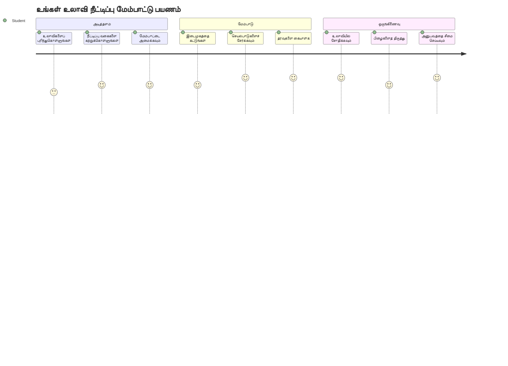
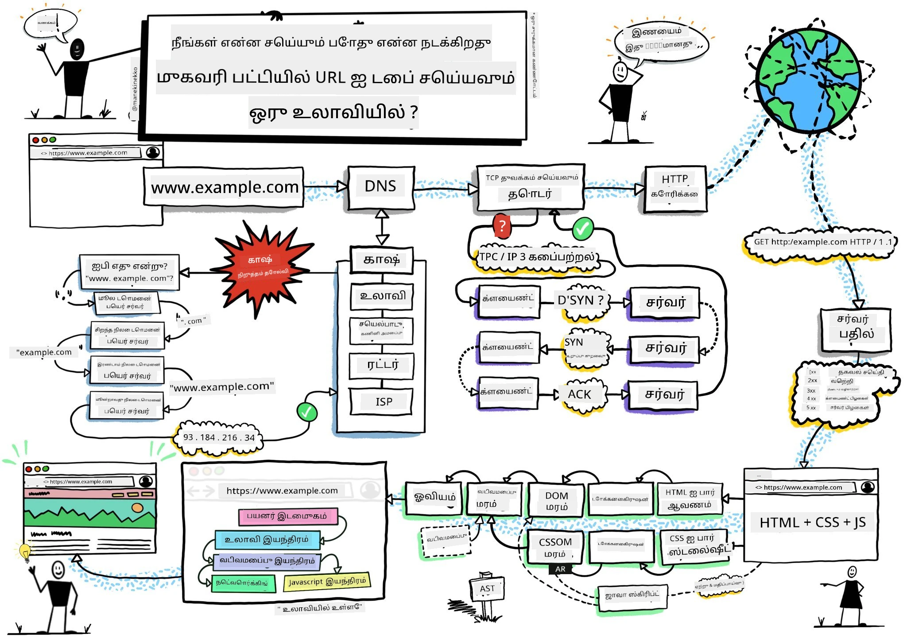
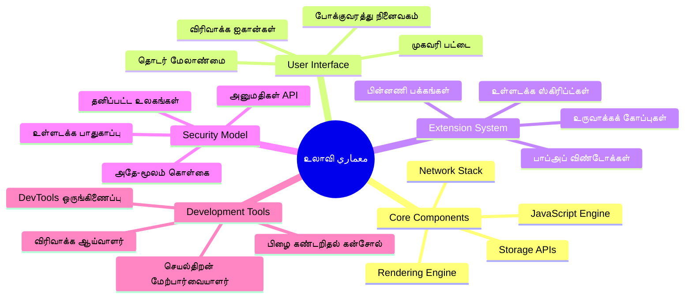
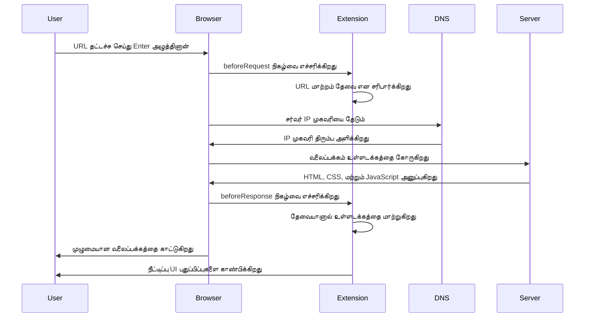
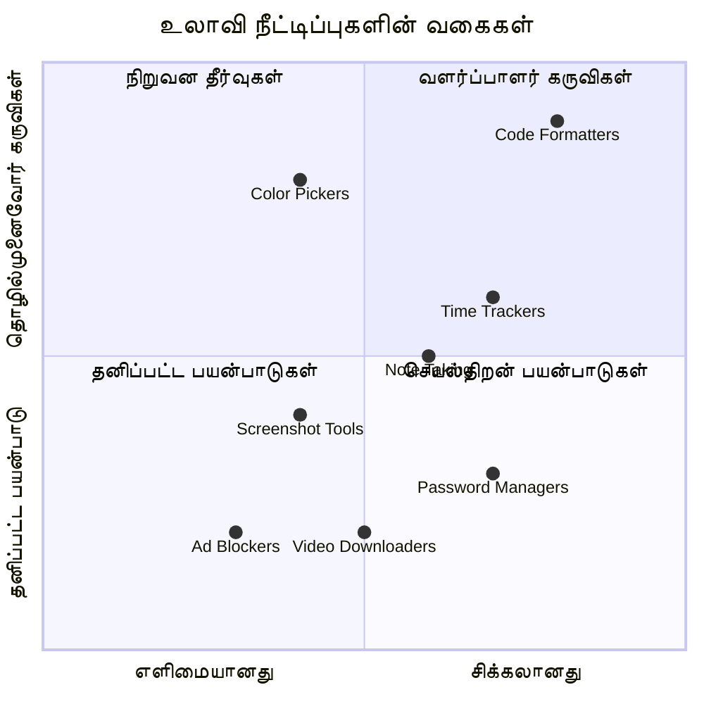
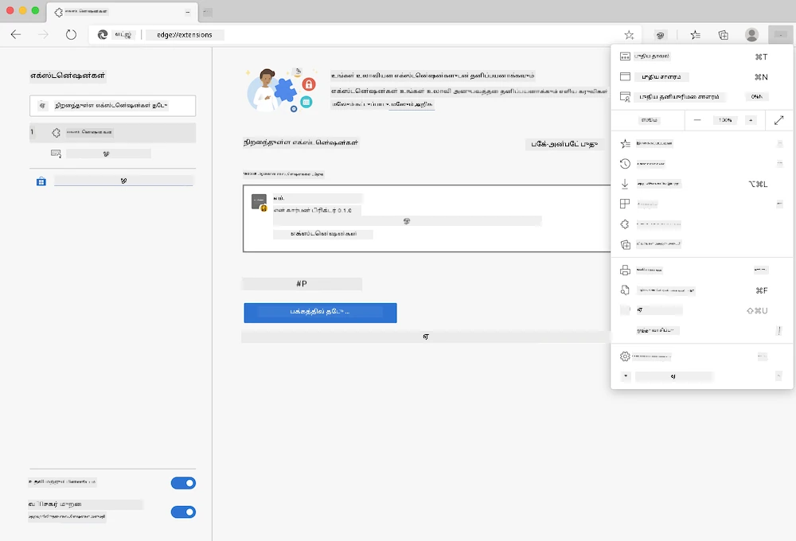
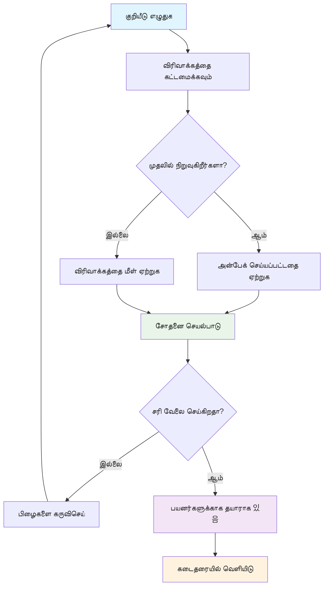
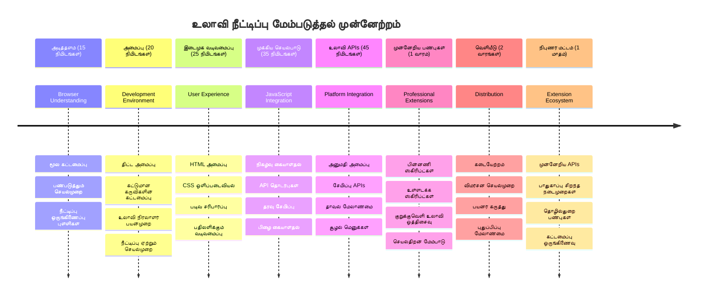

<!--
CO_OP_TRANSLATOR_METADATA:
{
  "original_hash": "00aa85715e1efd4930c17a23e3012e69",
  "translation_date": "2026-01-07T13:21:24+00:00",
  "source_file": "5-browser-extension/1-about-browsers/README.md",
  "language_code": "ta"
}
-->
# உலாவி நீட்சிப் பகுதி 1: உலாவிகள் குறித்து முழுமையாக



> ஸ்கெட்நோட்: [Wassim Chegham](https://dev.to/wassimchegham/ever-wondered-what-happens-when-you-type-in-a-url-in-an-address-bar-in-a-browser-3dob)

## முன்னேற்கல்வி வினாடி-வினா

[முன்னேற்கல்வி வினாடி-வினா](https://ff-quizzes.netlify.app/web/quiz/23)

### அறிமுகம்

உலாவி நீடிப்புருக்கள் உங்கள் வலை உலாவல் அனுபவத்தை மேம்படுத்தும் சிறிய பயன்பாடுகள் ஆகும். டிம் பெர்னர்ஸ்-லி ஆரம்ப எண்ணத்துடன் ஒத்துப்போகும் வகையில், நீடிப்புருக்கள் உலாவியின் திறன்களை எளிய ஆவண காட்சியிடலை தாண்டி விரிவுபடுத்துகின்றன. உங்கள் கணக்குகளை பாதுகாக்கும் கடவுச்சொல் மேலாளர்கள் முதல் சிறந்த நிறங்களை தேர்ந்தெடுக்க உதவும் வண்ணத் தேர்வாளர்கள் வரை, நீடிப்புருக்கள் அன்றாட உலாவல் சவால்களை தீர்க்கின்றன.

உங்கள் முதல் நீடிப்புருக்களை உருவாக்குவதற்கு முன், உலாவிகள் எப்படி செயல்படுகின்றன என்பதை புரிந்து கொள்ளலாம். அலெக்சாண்டர் கிராஹம் பெல் தொலைபேசியைக் கண்டுபிடிக்கும் முன் சத்த பரிமாற்றத்தை அறிந்து கொள்ள வேண்டியிருந்ததைப் போல், உலாவி அடிப்படைகளை அறிந்தால் நீடிப்புருக்களை உள்ளமைவுடன் ஒத்திசைக்கச் செய்வதில் உதவும்.

இந்த பாடத்தை முடித்துவிட்டதும், உங்களுக்கு உலாவி கட்டமைப்பு புரிந்திருக்கும் மற்றும் நீங்கள் உங்கள் முதல் நீடிப்புருக்களை உருவாக்க தொடங்கியிருப்பீர்கள்.


## வலை உலாவிகளைப் புரிந்து கொள்வது

வலை உலாவி என்பது அடிப்படையில் விரிவான ஆவணத் திருப்பியலாச்சியாளர் ஆகும். நீங்கள் முகவரி பட்டியில் "google.com" என்று இட்டுவிடும் பொழுது, உலாவி பல உலகளாவிய சர்வர்களிடமிருந்து உள்ளடக்கம் கோரல், பின்னர் அந்தக் குறியீட்டைப் பகுப்பாய்வு செய்து, நீங்கள் காணும் சார்ந்த இணையப்பக்கங்களாக தரும் கடுமையான செயல்களைக் கடைப்பிடிக்கிறது.

இந்த செயல்முறை டிம் பெர்னர்ஸ்-லி 1990-ல் வடிவமைத்த முதல் வலை உலாவி WorldWideWeb எப்படி ஹைபர்லிங்க்டு ஆவணங்களை அனைவருக்கும் அணுகக்கூடியதாக செய்தது என்பதைக் பிரதிபலிக்கிறது.

✅ **சிறிய வரலாறு**: முதல் உலாவி 'WorldWideWeb' என்று அழைக்கப்பட்டது மற்றும் 1990-இல் சர Тимothy Berners-Lee உருவாக்கினார்.


> சில ஆரம்ப உலாவிகள், [Karen McGrane](https://www.slideshare.net/KMcGrane/week-4-ixd-history-personal-computing) மூலம்

### உலாவிகள் வலை உள்ளடக்கத்தை எப்படிச் செயலாக்குகின்றன

ஒரு URL-ஐ உள்ளிடுவதும், ஒரு இணையப்பக்கத்தை பார்க்கும்போது உள்ளடக்கம் சில ஒத்துழைத்த படிகள் சில விநாடிகளில் நடக்கின்றன:


**இந்த செயல்முறை எதைச் செய்கிறது:**
- **மனித readability URL-ஐ** DNS மூலம் சர்வர் IP முகவரியாக மாற்றுகிறது
- **HTTP அல்லது HTTPS நெறிமுறைகளைப் பயன்படுத்தி** வலை சர்வருடன் பாதுகாப்பான இணைப்பை நிறுவுகிறது
- **சர்வருக்கு** குறிப்பிட்ட இணையப்பக்க உள்ளடக்கத்தை கோருகிறது
- **சர்வரிலிருந்து** HTML குறியீடு, CSS வடிவமைப்பு மற்றும் JavaScript குறியீட்டை பெறுகிறது
- **எல்லா உள்ளடக்கத்தையும்** நீங்கள் காணும் சார்ந்த இணையப்பக்கமாக வழங்குகிறது

### உலாவி முக்கிய அம்சங்கள்

நவீன உலாவிகள் நீடிப்புரு மேம்பாட்டாளர்கள் பயன்படுத்தக்கூடிய பல அம்சங்களை வழங்குகின்றன:

| அம்சம் | குறிக்கோள் | நீடிப்புரு வாய்ப்புகள் |
|---------|---------|------------------------|
| **Rendering Engine** | HTML, CSS மற்றும் JavaScript-ஐ காட்டு | உள்ளடக்கம் மாற்றம், வடிவமைப்பு ஊட்டுதல் |
| **JavaScript Engine** | JavaScript குறியீட்டை இயக்குகிறது | தனிப்பயன் ஸ்கிரிப்டுகள், API தொடர்புகள் |
| **Local Storage** | தரவை உள்ளகமாக சேமிக்கிறது | பயனர் விருப்பங்கள், கேஷ் தரவு |
| **Network Stack** | வலை கோரிக்கைகளை கையாள்கிறது | கோரிக்கை கண்காணிப்பு, தரவு பகுப்பாய்வு |
| **Security Model** | தீங்கு விளைவிக்கும் உள்ளடக்கத்திலிருந்து பயனர்களை பாதுகாக்கிறது | உள்ளடக்கம் பட்சாதனம், பாதுகாப்பு மேம்பாடுகள் |

**இந்த அம்சங்களைப் புரிந்து கொள்வதன் மூலம்:**
- **உங்கள் நீடிப்புரு அதிக மதிப்பை எங்கு சேர்க்கலாம் என்று தெரியவும்**
- **உங்கள் நீடிப்புரு செயல்பாட்டிற்கு சரியான உலாவி APIs தேர்ந்தெடுக்கவும்**
- **உலாவி அமைப்புகளுடன் திறம்பட வேலை செய்யும் நீடிப்புருக்களை வடிவமைக்கவும்**
- **உங்கள் நீடிப்புரு உலாவி பாதுகாப்பு சிறந்த நடைமுறைகளை பின்பற்றுவதை உறுதி செய்யவும்**

### பல உலாவி மேம்பாட்டுக் கருத்துக்கள்

வேறுபட்ட உலாவிகள் சிறுவித வேறுபாடுகளுடன் கொள்கைகளை அமல்படுத்துகின்றன, அதே விதமாக வேறு வேறு நிரல் மொழிகள் ஒரே அல்கோரிதம் வேறுபடாக கையாளலாம். Chrome, Firefox மற்றும் Safari இவ்விதமான தனித்துவமான பண்புகள் கொண்டுள்ளன, அவற்றை நீடிப்புரு மேம்பாட்டின் போது கவனிக்க வேண்டும்.

> 💡 **சூப்பர் குறிப்பு**: [caniuse.com](https://www.caniuse.com) ஐ பயன்படுத்தி எந்த வலை தொழில்நுட்பங்கள் பல உலாவிகளிலும் ஆதரிக்கப்படுகின்றன என்பதை சரிபார்க்கவும். உங்கள் நீடிப்புரு அம்சங்களை திட்டமிடும் பொழுது இது மிக முக்கியம்!

**நீடிப்புரு மேம்பாட்டுக்கான முக்கியக் கருத்துக்கள்:**
- **Chrome, Firefox மற்றும் Edge உலாவிகளில்** உங்கள் நீடிப்புரு சோதிக்கவும்
- **வேறு உலாவி நீடிப்புரு APIs மற்றும் manifest வடிவங்களுக்கு** பொருந்தும் வகையில் தழுவவும்
- **வெவ்வேறு செயல்திறன் பண்புகள் மற்றும் வரம்புகளை** கையாளவும்
- **சில உலாவி குறிப்பிட்ட அம்சங்களுக்கு கிடைக்கும் மாற்று வழிகளை** வழங்கவும்

✅ **பகுப்பாய்வு அறிவுரை**: உங்கள் வலை மேம்பாட்டு திட்டங்களில் பகுப்பாய்வு தொகுதிகள் நிறுவுவதன் மூலம் பயன்பாட்டாளர்கள் எந்த உலாவிகளை விரும்புகிறார்கள் என்பதை நீங்கள் கண்டறியலாம். இந்தத் தரவு எந்த உலாவியை முதலில் ஆதரிக்க வேண்டும் என்பதை முன்னுரிமை வைக்கும்.

## உலாவி நீடிப்புருக்களைப் புரிந்து கொள்வது

உலாவி நீடிப்புருக்கள் பொதுவான வலை உலாவல் சவால்களை தீர்க்க உலாவி இடைமுகத்துடன் நேரடியாக செயல்பாட்டு செருகல் ஆகும். தனிநிலை பயன்பாடுகள் அல்லது சிக்கலான பணிகள் தேவையில்லாமல், நீடிப்புருக்கள் உடனடி கருவிகள் மற்றும் அம்சங்களுக்கு அணுகலை வழங்குகின்றன.

இந்த கருத்து டக்ளஸ் எங்கெல்பார்ட் போன்ற ஆரம்ப கணினி முன்னோடிகள் மனித திறன்களை தொழில்நுட்பத்தால் வளர்ப்பது என்று கற்பித்த முறையுடன் ஒத்துப்போகிறது - நீடிப்புருக்கள் உங்கள் உலாவியின் அடிப்படை செயல்பாட்டை விரிவுபடுத்துகின்றன.


**பிரபல நீடிப்புரு வகைகள் மற்றும் அவற்றின் பயன்கள்:**
- **திறம்புகழ் கருவிகள்**: பணிச்சூழல் மேலாளர்கள், குறிப்பு எடுக்கும் பயன்பாடுகள் மற்றும் நேர கண்காணிப்பாளர்கள் உங்கள் ஒழுங்கமைவை மேம்படுத்த உதவும்
- **பாதுகாப்பு மேம்பாடுகள்**: கடவுச்சொல் மேலாளர்கள், விளம்பர தடுப்பிகள் மற்றும் தனியுரிமை கருவிகள் உங்கள் தரவைப் பாதுகாக்கின்றன
- **மேம்பாட்டாளர் கருவிகள்**: குறியீடு அமைப்பாளர்கள், வண்ண தேர்வாளர்கள் மற்றும் பிழைத்திருத்தப் பயன்பாடுகள் மேம்பாட்டை எளிதாக்குகின்றன
- **உள்ளடக்கம் மேம்பாடு**: வாசிப்பு முறைகள், வீடியோ பதிவிறக்கிகள் மற்றும் திரைபட பிடிப்புப் பயன்பாடுகள் உங்கள் வலை அனுபவத்தை மேம்படுத்துகின்றன

✅ **சிந்தனைக் கேள்வி**: உங்கள் பிடித்த உலாவி நீடிப்புருக்கள் எவை? அவைகள் எந்த சிறப்பான பணிகளைச் செய்கின்றன மற்றும் உங்கள் உலாவல் அனுபவத்தை எப்படிப் மேம்படுத்துகின்றன?

### 🔄 **கற்பித்தல் நிலை பரிசீலனை**
**உலாவி கட்டமைப்பை புரிந்துகொள்வது**: நீடிப்புரு மேம்பாட்டுக்கு முன்னர், நீங்கள் இது முடிக்க முடியும் என்பதை உறுதி செய்யுங்கள்:
- ✅ உலாவிகள் எப்படி வலை கோரிக்கைகளை செயலாக்குகின்றன மற்றும் உள்ளடக்கத்தை வழங்குகின்றன என்பதைக் விளக்க
- ✅ உலாவி கட்டமைப்பின் முக்கிய பகுதிகளை அடையாளம் காட்டு
- ✅ நீடிப்புருக்கள் உலாவி செயல்பாட்டுடன் எப்படி இணைக்கப்படுகின்றன என்பதைப் புரிந்து கொள்
- ✅ பயனர்களை பாதுகாக்கும் பாதுகாப்பு முறைமையை அறிந்துகொள்

**விரைவான சுயச் சோதனை**: ஒரு URL-ஐ இட்டதிலிருந்து இணையப்பக்கத்தைப் பார்க்கும் பாதையை நீங்கள் பின்தொடருமா?
1. **DNS தேடு** URL ஐ IP முகவரியாக மாற்றும்
2. **HTTP கோரிக்கை** சர்வரிலிருந்து உள்ளடக்கம் பெற்று வருகிறது
3. **பகுப்பாய்வு** HTML, CSS மற்றும் JavaScript சுருக்குகிறது
4. **காட்சிப்படுத்தும்** இறுதியான இணையப்பக்கத்தை காட்டுகிறது
5. **நீடிப்புருக்கள்** பல படிகளிலேயே உள்ளடக்கத்தை மாற்றலாம்

## நீடிப்புருக்கள் நிறுவல் மற்றும் நிர்வகிப்பு

நீடிப்புரு நிறுவல் செயல்முறையைப் புரிந்துகொள்வது உங்கள் நீடிப்புரு பயனர் அனுபவத்தை கணிக்க உதவும். நிறுவல் செயல்முறை நவீன உலாவிகளில் ஒரே மாதிரியாக உள்ளது, இடைமுக வடிவமைப்பில் சிறிய வேறுபாடுகளுடன்.



> **முக்கியம்**: உங்கள் நீடிப்புருகளை சோதிக்கும் போது உருவாக்குநர் முறையை இயக்கவும் மற்றும் பிற கடைகளிலிருந்து நீடிப்புருக்களை அனுமதிக்கவும்.

### மேம்பாட்டாளர் நீடிப்புரு நிறுவல் செயல்முறை

நீங்கள் உங்கள் சொந்த நீடிப்புருக்களை உருவாக்கி சோதிக்கும் போது இந்த பணிமுறை பின்பற்றவும்:


```bash
# படி 1: உங்கள் விரிவாக்கத்தை உருவாக்கவும்
npm run build
```

**இந்த கட்டளை என்ன செய்கிறது:**
- **உங்கள் மூலக் குறியீட்டை** உலாவிக்குரிய கோப்புகளாக தொகுக்கிறது
- **JavaScript தொகுதிகளை** சீரமைக்கப்பட்ட தொகுப்புகளாக மையப்படுத்துகிறது
- **முடிவான நீடிப்புரு கோப்புகளை** `/dist` கோப்புறையில் உருவாக்குகிறது
- **உங்கள் நீடிப்புரை நிறுவல் மற்றும் சோதனைக்கு** தயார் செய்கிறது

**படி 2: உலாவி நீடிப்புரு நிர்வாக மேற்பக்கத்திற்குச் செல்லவும்**
1. உங்கள் உலாவியின் நீடிப்புரு மேலாண்மை பக்கத்தை திறக்கவும்
2. மேல் வலக்கு பக்கத்தில் உள்ள "அமைப்புகள் மற்றும் மேலும்" பொத்தானை (`...` ஐகான்) அழுத்தவும்
3. கீழே வெளியேறும் பட்டியலில் "ஈடுபடுத்தல்கள்" என்பதைத் தேர்ந்தெடுக்கவும்

**படி 3: உங்கள் நீடிப்புரு ஏற்றவும்**
- **புதிய நிறுவல்களுக்கு**: `load unpacked` தேர்ந்தெடுத்து உங்கள் `/dist` கோப்புறையை தெரிவுசெய்க
- **புதுப்பிப்புகளுக்கு**: வழமையான நீடிப்புருவிற்கு அருகில் உள்ள `reload` என்பதைக் கிளிக் செய்க
- **சோதனைக்கு**: கூடுதல் பிழைதிருத்த அம்சங்களைப் பெற "உருவாக்குநர் முறை" இயக்கவும்

### தயாரிப்பு நீடிப்புரு நிறுவல்

> ✅ **குறிப்பு**: இச்சொற்றொடர் உங்களையே உருவாக்கும் நீடிப்புருக்களுக்கு மட்டுமே. பிரசுரிக்கப்பட்ட நீடிப்புருக்களை நிறுவ அதிகாரப்பூர்வ உலாவி நீடிப்பு கடைகளான [Microsoft Edge Add-ons store](https://microsoftedge.microsoft.com/addons/Microsoft-Edge-Extensions-Home) போன்றவற்றுக்கு செல்லவும்.

**வேறுபாடு புரிந்துகொள்ள:**
- **மேம்பாட்டு நிறுவல்கள்**: மேம்பாட்டின் போது பிரசுரிக்கப்படாத நீடிப்புருக்களை சோதிக்க உதவும்
- **கடைநிறுவல்கள்**: தானாக புதுப்பிக்கப்படும் பரிசுத்தமான பிரசுரிக்கப்பட்ட நீடிப்புருக்களை வழங்கும்
- **சைட்லோடிங்**: அதிகாரப்பூர்வ கடைகளுக்கு புறம்பான நீடிப்புருக்களை நிறுவ அனுமதிக்கும் (உருவாக்குநர் முறையைத் தேவைப்படுத்தும்)

## உங்கள் கார்பன் பாதைபாதை நீடிப்புரு உருவாக்கல்

நாங்கள் உங்கள் பிராந்தியத்தின் மின் பயன்பாட்டின் கார்பன் பாதைபாதையை காட்டும் உலாவி நீடிப்புருவை உருவாக்கப்போகிறோம். இந்த திட்டம் அடிப்படையான நீடிப்புரு மேம்பாட்டு கொள்கைகளை விளக்குகின்றது மற்றும் சுற்றுச்சூழல் விழிப்புணர்வுக்கு ஒரு பயனுள்ள கருவியை உருவாக்குகிறது.

ஜான் டியூவியின் கற்பித்தல் கோட்பாடுகள் போல "செய்து கற்றல்" இந்த அணுகுமுறை தொழில்நுட்பத் திறன்களை பொருள்மிக்க உலகில் பயன்பாடுகளுடன் இணைக்கிறது.

### திட்ட தேவைகள்

மேம்பாட்டு தொடங்குவதற்கு முன் தேவையான வளங்கள் மற்றும் சார்பு மொத்தங்களை சேகரிப்போம்:

**தேவையான API அணுகல்:**
- **[CO2 Signal API விசை](https://www.co2signal.com/)**: இலவச API விசையை பெற உங்கள் மின்னஞ்சல் முகவரியை உள்ளிடவும்
- **[பிராந்தியக் குறியீடு](http://api.electricitymap.org/v3/zones)**: [Electricity Map](https://www.electricitymap.org/map) பயன்படுத்தி உங்கள் பிராந்திய குறியீட்டை கண்டறியவும் (உதாரணத்திற்கு, Boston 'US-NEISO' பயன்படுகிறது)

**மேம்பாட்டு கருவிகள்:**
- **[Node.js மற்றும் NPM](https://www.npmjs.com)**: திட்ட சார்புகளை நிறுவுவதற்கான தொகுப்பு மேலாண்மை கருவி
- **[ஆரம்பக் குறியீடு](../../../../5-browser-extension/start)**: மேம்பாட்டை தொடங்க `start` கோப்புறையை பதிவிறக்கவும்

✅ **இன்னும் கற்கவும்**: உங்கள் தொகுப்பு மேலாண்மை திறன்களை இந்த [விரிவான கற்றல் தொகுதி](https://docs.microsoft.com/learn/modules/create-nodejs-project-dependencies/?WT.mc_id=academic-77807-sagibbon) மூலம் மேம்படுத்துங்கள்

### திட்ட கட்டமைப்பை புரிந்து கொள்வது

திட்ட கட்டமைப்பை புரிந்துகொள்வது மேம்பாட்டு பணியை சீரான முறையில் ஒழுங்கமைக்க உதவுகிறது. அலக்ஸாண்ட்ரியா நூலகம் எளிதில் அறிவைப் பெற அமைவது போல, நன்கு கட்டமைக்கப்பட்ட குறியீட்டு தளம் மேம்பாட்டை பயனுள்ளதாக மாற்றுகிறது:

```
project-root/
├── dist/                    # Built extension files
│   ├── manifest.json        # Extension configuration
│   ├── index.html           # User interface markup
│   ├── background.js        # Background script functionality
│   └── main.js              # Compiled JavaScript bundle
├── src/                     # Source development files
│   └── index.js             # Your main JavaScript code
├── package.json             # Project dependencies and scripts
└── webpack.config.js        # Build configuration
```

**ஒவ்வொரு கோப்பும் என்ன செய்கிறது:**
- **`manifest.json`**: நீடிப்புருத் தகவல்களையும், அனுமதிகளையும் மற்றும் நுழைவுச்சாய்களைக் குறிக்கிறது
- **`index.html`**: பயனர் உதிரியை உருவாக்குகிறது, நீடிப்புரு கிளிக் செய்யும் போது காணப்படும் பக்கம்
- **`background.js`**: பின்னணி பணிகள் மற்றும் உலாவி நிகழ்வைக் கவனிக்கின்றது
- **`main.js`**: தொகுப்பு செயல்முறை முடிவில் வரும் JavaScript குறியீடு
- **`src/index.js`**: நேரடியாக `main.js` ஆக தொகுக்கப்படும் உங்கள் முக்கிய மேம்பாட்டு குறியீடு

> 💡 **அமைப்பு குறிப்பு**: API விசையும் பிராந்திய குறியீட்டும் பாதுகாப்பான நோட்டில் சேமிக்கவும், மேம்பாட்டின் போது இவற்றை சுலபமாக அணுக பயன்படும்.

✅ **பாதுகாப்புச் குறிப்புகள்**: API விசைகள் அல்லது சென்சிட்டிவ் சான்றிதழ்களை உங்கள் குறியீட்டு கிடையில் பொது பகிர வேண்டாம். அடுத்த படிகளில் இவற்றை பாதுகாப்பாக கையாள்வது எப்படி என்று நாம் கற்போம்.

## நீடிப்புரு இடைமுகம் உருவாக்கல்

இப்போது பயனர் இடைமுகக் கூறுகளை உருவாக்கப்போகிறோம். இந்த நீடிப்புரு இரு திரைகள் கொண்டுள்ளது: ஆரம்ப அமைப்பு திரை மற்றும் தரவு நிகழ்ச்சி திரை.

இது கணினி வடிவமைப்பில் ஆரம்ப காலத்திலிருந்து பயன்படுத்தப்பட்ட முன்னேற்ற வெளிப்படுத்தல் கொள்கையைப் பின்பற்றுகிறது - பயனர்களை முந்திய தகவலும் விருப்பங்களும் குறுகியத் தொடர் முறையில் வெளிப்படுத்தப்படுகின்றன.

### நீடிப்புரு பார்வை சுருக்கம்

**அமைப்பு பார்வை** - முதல் முறையாக பயனர் அமைப்பு:


**முடிவுகள் பார்வை** - கார்பன் பாதைபாதை தரவு காட்டுதல்:


### அமைப்பு படிவத்தை உருவாக்குதல்

அமைப்பு படிவம் ஆரம்ப பயனரிடம் உள்ளமைவு தரவுகளை சேகரிக்கிறது. ஒருமுறை அமைக்கப்பட்டபின், தகவல் உலாவி சேமிப்பில் நிலைத்திருக்கும்.

`/dist/index.html` கோப்பில் இந்த படிவ அமைப்பை சேர்க்கவும்:

```html
<form class="form-data" autocomplete="on">
    <div>
        <h2>New? Add your Information</h2>
    </div>
    <div>
        <label for="region">Region Name</label>
        <input type="text" id="region" required class="region-name" />
    </div>
    <div>
        <label for="api">Your API Key from tmrow</label>
        <input type="text" id="api" required class="api-key" />
    </div>
    <button class="search-btn">Submit</button>
</form>
```

**இந்த படிவம் என்ன செய்கிறது:**
- பொருத்தமான லேபிள்கள் மற்றும் உள்ளீடு இணைப்புகளுடன் ஒரு செமாண்டிக் படிவ அமைப்பை உருவாக்குகிறது
- மேம்பட்ட பயனர் அனுபவத்திற்காக உலாவியின் autocomplete செயல்பாட்டை இயக்கு
- `required` பண்பை பயன்படுத்தி இரு புலங்களையும் நிரப்பத்தெரியவாறு கட்டாயம் செய்கிறது
- எளிதான வடிவமைப்பு மற்றும் JavaScript இலக்கு நோக்கமாக வகுப்புப் பெயர்களால் உள்ளீடுகளை ஒழுங்குபடுத்துகிறது
- நீடிப்புருவை முதன்முறையாக அமைப்பவர்களுக்கு தெளிவான வழிகாட்டுதல்களை வழங்குகிறது

### முடிவுகள் காட்சியை உருவாக்கல்

பிறகு, கார்பன் பாதைபாதை தரவை காண்பிக்கும் முடிவுகள் பகுதியில் உள்ள HTML-ஐ படிவத்திற்குக் கீழே சேர்க்கவும்:

```html
<div class="result">
    <div class="loading">loading...</div>
    <div class="errors"></div>
    <div class="data"></div>
    <div class="result-container">
        <p><strong>Region: </strong><span class="my-region"></span></p>
        <p><strong>Carbon Usage: </strong><span class="carbon-usage"></span></p>
        <p><strong>Fossil Fuel Percentage: </strong><span class="fossil-fuel"></span></p>
    </div>
    <button class="clear-btn">Change region</button>
</div>
```

**இந்த அமைப்பு என்ன வழங்குகிறது:**
- **`loading`**: API தரவு பெறப்படும் போது ஒரு ஏற்றும் செய்தியை காட்டுகிறது
- **`errors`**: API கோரிக்கை தோல்வியடைந்த போது பிழைச் செய்திகள் காண்பிக்கிறது
- **`data`**: மேம்பாட்டின் போது பிழைதிருத்தத்திற்கு சீரற்ற தரவை வைத்திருக்கிறது
- **`result-container`**: பயனர்களுக்கு வடிவமைக்கப்பட்ட கார்பன் பாதைபாதை தகவலை வழங்குகிறது
- **`clear-btn`**: பயனர்கள் தங்களது பிராந்தியத்தை மாற்றி மீண்டும் அமைக்க அனுமதிக்கிறது

### கட்டுமான செயல்முறையை அமைத்தல்

இப்போது திட்ட சார்புகளை நிறுவி கட்டுமான செயல்முறையை சோதிக்கலாம்:

```bash
npm install
```

**இந்த நிறுவல் செயல்முறை என்ன செய்கிறது:**
- `package.json` இல் குறிப்பிடப்பட்ட Webpack மற்றும் பிற மேம்பாட்டு சார்புகளை பதிவிறக்கம் செய்கிறது
- நவீன JavaScript தொகுக்க கட்டுமான கருவிச் சங்கிலக் கட்டமைப்பு செய்கிறது
- நீடிப்புரு உருவாக்கல் மற்றும் சோதனைக்கான மேம்பாட்டு சூழலை தயார் செய்கிறது
- குறியீட்டு தொகுப்பு, நுணுக்கம் மற்றும் பல உலாவி இணக்கத்தன்மை அம்சங்களை இயக்கு

> 💡 **கட்டுமான செயல்முறை அறிவுரை**: Webpack உங்கள் மூல குறியீடு `/src/index.js` இல் இருந்து `/dist/main.js` ஆக தொகுக்கிறது. இந்த செயல்முறை உங்கள் குறியீட்டை தயாரிப்பிற்குத் தேவையானதைச் செய்வதுடன் உலாவி இணக்கத்தன்மையை உறுதி செய்கிறது.

### உங்கள் முன்னேற்றத்தை சோதித்தல்

இந்த நிலையிலிருந்து, உங்கள் நீடிப்புருவை சோதிக்க முடியும்:
1. **உரையிடுங்கள்** உங்கள் குறியீட்டை தொகுக்க கட்டளையை இயக்கவும்  
2. **உருவாக்கம்** உங்கள் உலாவியில் விரிவாக்கத்தை ட Developerமோது மூலம் ஏற்றவும்  
3. **சரி பாருங்கள்** படிவம் சரியாக காட்சி அளிக்கிறதா மற்றும் தொழில்முறை தோற்றமா என்பதை  
4. **சோதிக்கவும்** அனைத்து படிவ பகுதிகளும் சரியாக நேர்த்தியான மற்றும் செயல்படும் என்பதை  

**நீங்கள் செய்தது:**  
- **அடிப்படை** HTML கட்டமைப்பை உங்கள் விரிவாக்கத்துக்காக கட்டியமைத்தீர்கள்  
- **உருவாக்கியுள்ளீர்கள்** கட்டமைப்பு மற்றும் முடிவுகள் இடைமுகங்களை சரியான அர்த்த நடைமுறை குறியீடுடன்  
- **உருவாக்கியுள்ளீர்கள்** தொழில்துறை-தர சாதனங்களை பயன்படுத்தி ஒரு நவீன வளர்ச்சி வேலையை  
- **தயார் செய்துள்ளீர்கள்** Javascript செயல்பாடுகளைச் சேர் மாவட்டத்தின் அடிப்படையை  

### 🔄 **கல்விஜன உபாயம்**  
**விரிவாக்க மேம்பாட்டின் முன்னேற்றம்**: தொடரும் முன் உங்கள் புரிதலை உறுதிப்படுத்தவும்:  
- ✅ திட்ட கட்டமைப்பில் உள்ள ஒவ்வொரு கோப்பின் நோக்கத்தை விளக்க முடியுமா?  
- ✅ குறியீட்டை தொகுக்கும் செயல்முறை எப்படி செயல்படுகிறது என்பதைப் புரிந்துகொண்டுள்ளீர்களா?  
- ✅ ஏன் கட்டமைப்பையும் முடிவுகளையும் வேறுபட்ட UI பிரிவுகளில் பிரிக்கிறோம்?  
- ✅ படிவம் அமைப்பு எப்படி பயன்படுத்தலையும் அணுகலையும் ஆதரிக்கிறது?  

**வளரவியலின் புரிதல்**: இப்போது நீங்கள் முடியும்:  
1. **திருத்தவும்** உங்கள் விரிவாக்க இடைமுகத்தின் HTML மற்றும் CSS ஐ  
2. **செயல்படுத்தவும்** உங்கள் மாற்றங்களை தொகுக்கும் கட்டளையை  
3. **மீண்டும் ஏற்றவும்** உங்கள் விரிவாக்கத்தை உலாவியில் புதுப்பிப்புகளை சோதிக்க  
4. **பிழை நீக்கவும்** உலாவி ட Developer சாதனங்களைக் கொண்டு  

நீங்கள் உலாவி விரிவாக்க மேம்பாட்டின் முதல் கட்டத்தை முடித்துள்ளீர்கள். வானியலுப் பண்புகளை புரிந்துகொள்வது போல, இப்போது இந்த அடிப்படை கருத்துக்களை அறிந்திருந்தால் அடுத்த பாடத்தில் மேலும் ஜடிலமான செயல்பாடுகளை உருவாக்கத் தயார்!  

## GitHub Copilot முகவர் சவால் 🚀  

Agent முறையை பயன்படுத்தி பின்வரும் சவாலை முடிக்க:  

**விளக்கம்:**  
API சாவிகள் மற்றும் பிராந்திய குறியீடுகள் உள்ளிடும் போது பயனர் அனுபவத்தை மேம்படுத்த படிவத் தொடர்பான சரிபார்ப்பு மற்றும் கருத்து தெரிவிக்க உள்ளடக்கம் சேர்க்க உலாவி விரிவாக்கத்தை மேம்படுத்தவும்.  

**குறிப்பு:**  
JavaScript சரிபார்ப்பு செயல்பாடுகளை உருவாக்கவும், API சாவி புலம் குறைந்தது 20 எழுத்துக்கள் கொண்டதா என்பதைச் சரிபார்க்கவும், பிராந்திய குறியீடு சரியான வடிவத்தில் (உதா. 'US-NEISO') உள்ளதா என்பதை also கண்டு பிடிக்கவும். சரியான உள்ளீடுகளுக்கு புல எல்லைகளின் வண்ணங்களைக் காய்க்கவும் (பசுமை), தவறான உள்ளீடுகளுக்கு சிவப்பு வண்ணம் மாறவும். பாதுகாப்புக்காக API சாவியை காண்பிக்கும்/ மறைக்கும் toggle அம்சமும் சேர்க்கவும்.  

[agent mode](https://code.visualstudio.com/blogs/2025/02/24/introducing-copilot-agent-mode) பற்றி மேலும் அறிய  

## 🚀 சவால்  

உலாவி விரிவாக்கக் கடையில் செல்லவும் ஒரு விரிவாக்கத்தை உங்கள் உலாவியில் நிறுவி பாருங்கள். அதன் கோப்புகளைக் கவனமாக பரிசீலிக்கலாம். நீங்கள் என்ன கண்டுபிடிக்கிறீர்கள்?  

## பேச்சு sonrası வினாடி வினா  

[பேச்சு sonrası வினாடி வினா](https://ff-quizzes.netlify.app/web/quiz/24)  

## மீளாய்வு & சுய படிப்பு  

இந்த பாடத்தில் உலாவி வரலாறு சில விஷயங்களை தெரிந்து கொண்டீர்கள்; உலகளாவிய வலைத்தளத்தை கண்டுபிடித்தவர்கள் எப்படி இதனை பயன்படுத்தக் கனவோட்டமிடுவதாகக் கற்பித்தனர் என்பதை அறிய இந்த வாய்ப்பைப் பயன்படுத்துக. சில பயனுள்ள தளங்கள்:  

[வலை உலாவி வரலாறு](https://www.mozilla.org/firefox/browsers/browser-history/)  

[வலை வரலாறு](https://webfoundation.org/about/vision/history-of-the-web/)  

[டிம் பெர்னர்ஸ்-லி உடன் பேட்டுமொழி](https://www.theguardian.com/technology/2019/mar/12/tim-berners-lee-on-30-years-of-the-web-if-we-dream-a-little-we-can-get-the-web-we-want)  

### ⚡ **அடுத்த 5 நிமிடங்களில் நீங்கள் செய்யக்கூடியவை**  
- [ ] Chrome/Edge விரிவாக்க பக்கம் (chrome://extensions) திறந்து நிறுவியுள்ளவற்றை ஆராயுங்கள்  
- [ ] ஒரு வலைப்பக்கத்தை ஏற்றும் போது உலாவியின் DevTools பிணைய தாவலை பாருங்கள்  
- [ ] பக்கம் மூலக் குறியிபை (Ctrl+U) பார்ப்பதைக் முயற்சியுங்கள்  
- [ ] எந்தவொரு வலைப்பக்க உறுப்பையும் பார்வையிட்டு DevToolsல் CSSஐ மாற்றுங்கள்  

### 🎯 **இந்த நேரத்தில் நீங்கள் சாதிக்கக்கூடியவை**  
- [ ] பாடம் முடிந்த வினாடி வினா செய்து உலாவி அடிப்படை கோட்பாடுகளை புரிந்துகொள்ளுங்கள்  
- [ ] ஒரு அடிப்படை manifest.json கோப்பை உருவாக்கி உலாவி விரிவாக்கத்திற்கு  
- [ ] ஒரு எளிய "ஹலோ வேர்ல்ட்" விரிவாக்கம் செய்வதனால் popupயை காட்டு  
- [ ] உலாவி ட Developer முறையில் உங்கள் விரிவாக்கத்தை சோதியுங்கள்  
- [ ] உங்கள் இலக்குக்கான உலாவி விரிவாக்க ஆவணங்களை ஆராயுங்கள்  

### 📅 **உங்கள் வாரநாள் விரிவாக்க பயணம்**  
- [ ] உண்மையான பயன்பாடுள்ள செயல்பாட்டுச் சிறந்த உலாவி விரிவாக்கம் ஒன்றை உருவாக்குங்கள்  
- [ ] உள்ளடக்க ஸ்கிரிப்ட்கள், பின்னணி ஸ்கிரிப்ட்கள் மற்றும் popup இடையாடல்களைப் பற்றி அறியுங்கள்  
- [ ] சேமிப்பு, தாவல்கள் மற்றும் செய்தியச் சீட்டுக்களைப் போல உலாவி APIகளை கற்றுக்கொள்ளுங்கள்  
- [ ] உங்கள் விரிவாக்கத்திற்கான பயனர் நட்பு இடைமுகங்கள் வடிவமைக்கவும்  
- [ ] வெவ்வேறு வலைத்தளங்களிலும் சூழல்களிலும் உங்கள் விரிவாக்கத்தை சோதிக்கவும்  
- [ ] உலாவி விரிவாக்கக் கடையில் உங்கள் விரிவாக்கத்தை வெளியிடவும்  

### 🌟 **உங்கள் மாதந்தோறும் உலாவி மேம்பாட்டுக் காலவரிசை**  
- [ ] பல விரிவாக்கங்களை உருவாக்கி பல பயனர் பிரச்சனைகளைத் தீர்க்கவும்  
- [ ] மேம்பட்ட உலாவி APIகள் மற்றும் பாதுகாப்பு சிறந்த நடைமுறைகளை கற்றுக்கொள்ளுங்கள்  
- [ ] திறந்த மூல உலாவி விரிவாக்கத் திட்டங்களுக்கு பங்கு போடவும்  
- [ ] கட்-உலாவி ஒத்துழைப்பு மற்றும் முன்னேற்ற மேம்பாட்டை ஆக்கியமாக கற்றுக்கொள்ளுங்கள்  
- [ ] பிறருக்கான விரிவாக்க மேம்பாட்டு கருவிகள் மற்றும் மாதிரிகளை உருவாக்குங்கள்  
- [ ] மற்ற ட Developerகளை உதவும் உலாவி விரிவாக்க நிபுணராவீர்  

## 🎯 உங்கள் உலாவி விரிவாக்க நிபுணத்துவ நேரட்டம்  


### 🛠️ உங்கள் விரிவாக்க மேம்பாட்டு கருவி தொகுப்பு சுருக்கம்  

இந்த பாடத்தை முடித்த பிறகு, தற்போது لديك:  
- **உலாவி கட்டமைப்பு அறிவு**: ரேண்டரிங் இயந்திரங்கள், பாதுகாப்பு முறைமைகள், விரிவாக்க ஒருங்கிணைப்பு  
- **வளரவியல் சூழல்**: Webpack, NPM மற்றும் பிழை நீக்கும் திறன்களுடன் நவீன கருவிகள் தொகுப்பு  
- **UI/UX அடித்தளம்**: முன்னேற்ற வெளிப்பாட்டுக் கருவிகளுடன் அர்த்தமுள்ள HTML கட்டமைப்பு  
- **பாதுகாப்பு விழிப்புணர்வு**: உலாவி அனுமதிகள் மற்றும் பாதுகாப்பான மேம்பாடு வழிமுறைகள்  
- **கடந்து-உலாவி கோட்பாடுகள்**: பொருந்தும் தன்மைகள் மற்றும் சோதனை முறைகள்  
- **API ஒருங்கிணைப்பு**: வெளிப்புற தரவுகளுடன் பணியாற்ற அத்தகைய அடித்தளம்  
- **தொழில்முறை வேலைவழக்கம்**: தொழில்துறை தர வளர்ச்சி மற்றும் சோதனை நடைமுறைகள்  

**உண்மையான உலக பயன்பாடுகள்**: இவை நேரடியாக பொருந்தும்:  
- **வலை மேம்பாடு**: ஒரே பக்க செயலிகள் மற்றும் முன்னேற்ற வலை செயலிகள்  
- **டெஸ்க்டாப் செயலிகள்**: Electron மற்றும் வலை அடிப்படையிலான டெஸ்க்டாப் மென்பொருள்  
- **மொபைல் மேம்பாடு**: ஐக்கிய செயலிகள் மற்றும் வலை அடிப்படையிலான மொபைல் தீர்வுகள்  
- **தொழிற்சாலை கருவிகள்**: உள்ளக உற்பத்தித்திறன் செயலிகள் மற்றும் வேலைப்பாடு தானியங்கு  
- **திறந்த மூல**: உலாவி விரிவாக்கத் திட்டங்களுக்கு பங்களிப்பு மற்றும் வலை தரநிலைகள்  

**அடுத்த கட்டம்**: பண்பாட்டுள்ள செயல்பாடுகளைச் சேர்க்க, உலாவி APIகளுடன் செயல்பட, மற்றும் உண்மையான பயனர் பிரச்சனைகளை தீர்க்கும் விரிவாக்கங்களை உருவாக்க நீங்கள் தயார்!  

## பணிகள்  

[உங்கள் விரிவாக்கத்தை மீண்டும் வடிவமைக்க](assignment.md)

---

<!-- CO-OP TRANSLATOR DISCLAIMER START -->
**ஒப்புதல் முகவரி**:  
இந்த ஆவணம் AI மொழிபெயர்ப்புச் சேவை [Co-op Translator](https://github.com/Azure/co-op-translator) பயன்படுத்தி மொழிமாற்றம் செய்யப்பட்டுள்ளது. துல்லியத்திற்காக நாம் முயற்சித்தாலும், தானாக செய்யப்பட்ட மொழிபெயர்ப்புகளில் பிழைகள் அல்லது தவறுகள் இருக்க வாய்ப்புள்ளது. அவற்றின் சொந்த மொழியில் உள்ள ஆரம்ப ஆவணம் தான் அதிகாரபூர்வ ஆதாரம் என கருதப்பட வேண்டும். முக்கியமான தகவல்களுக்கு, தொழில்முறை மனித மொழிபெயர்ப்பை பரிந்துரைக்கிறோம். இந்த மொழிபெயர்ப்பின் பயன்பாட்டால் ஏற்படும் எந்த தவறான புரிதல்கள் அல்லது தவறறிந்த விளக்கங்களுக்கும் நாங்கள் பொறுப்பில்லை.
<!-- CO-OP TRANSLATOR DISCLAIMER END -->