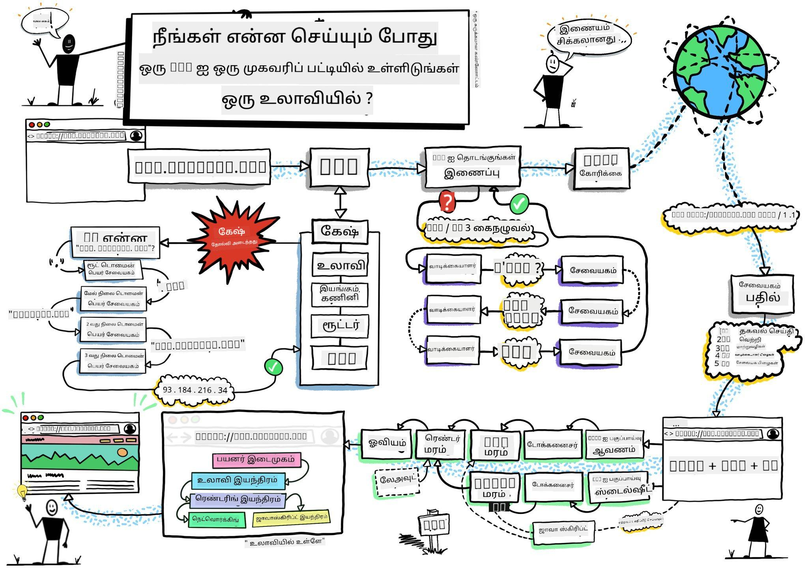
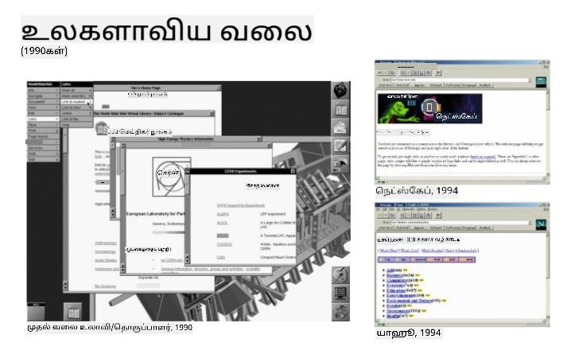
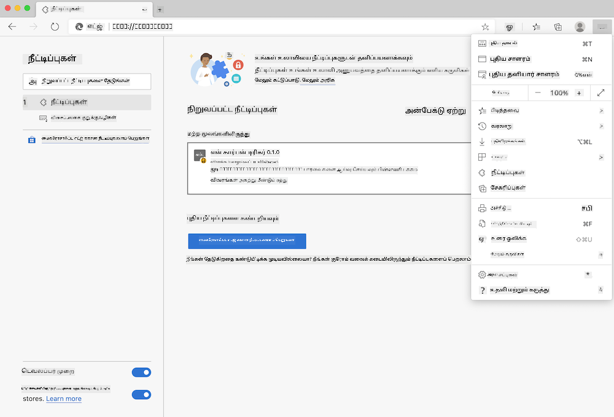
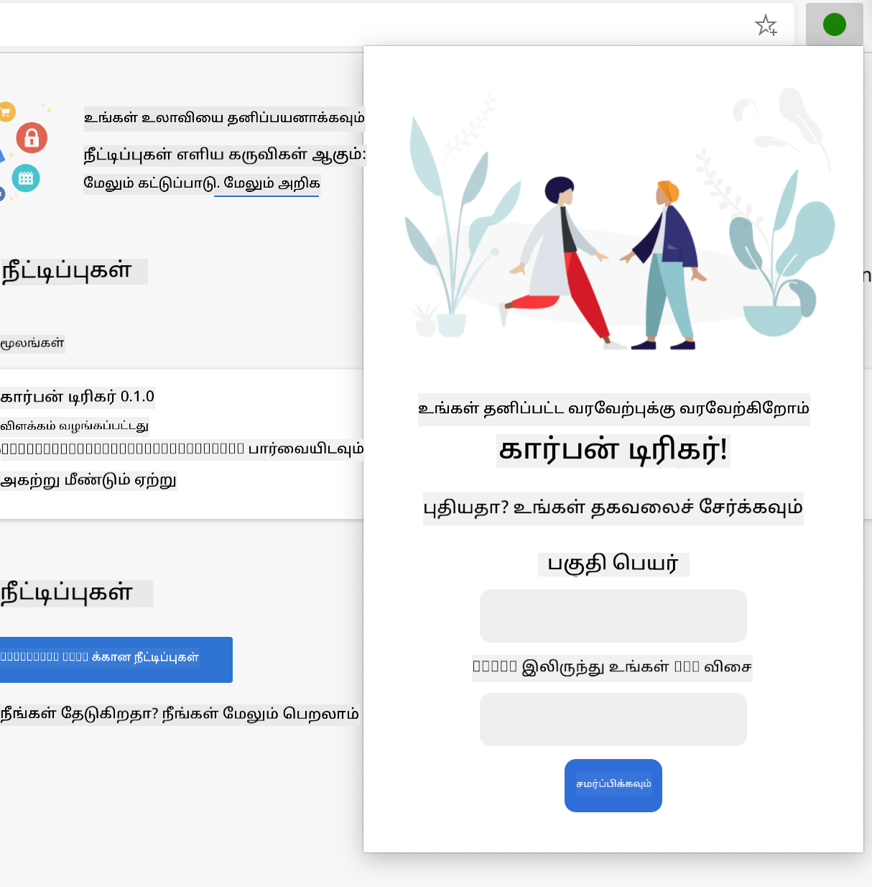
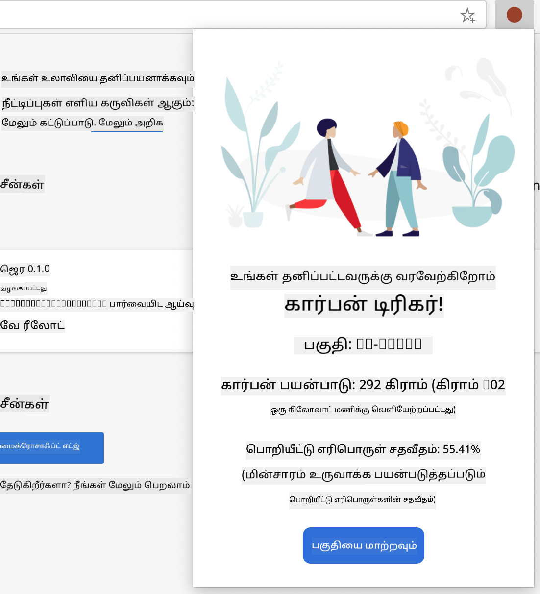

<!--
CO_OP_TRANSLATOR_METADATA:
{
  "original_hash": "2326d04e194a10aa760b51f5e5a1f61d",
  "translation_date": "2025-10-11T12:21:48+00:00",
  "source_file": "5-browser-extension/1-about-browsers/README.md",
  "language_code": "ta"
}
-->
# உலாவி நீட்டிப்பு திட்டம் பகுதி 1: உலாவிகள் பற்றிய அனைத்தும்


> ஸ்கெட்ச் நோட் [வசீம் செகாம்](https://dev.to/wassimchegham/ever-wondered-what-happens-when-you-type-in-a-url-in-an-address-bar-in-a-browser-3dob) மூலம்

## முன்-வகுப்பு வினாடி வினா

[முன்-வகுப்பு வினாடி வினா](https://ff-quizzes.netlify.app/web/quiz/23)

### அறிமுகம்

உலாவி நீட்டிப்புகள் உலாவியில் கூடுதல் செயல்பாடுகளை சேர்க்கின்றன. ஆனால் நீங்கள் ஒன்றை உருவாக்குவதற்கு முன், உலாவிகள் தங்கள் வேலைகளை எப்படி செய்கின்றன என்பதைப் பற்றி கொஞ்சம் கற்றுக்கொள்ள வேண்டும்.

### உலாவி பற்றி

இந்த பாடங்களின் தொடரில், Chrome, Firefox மற்றும் Edge உலாவிகளில் வேலை செய்யும் ஒரு உலாவி நீட்டிப்பை உருவாக்குவது எப்படி என்பதை நீங்கள் கற்றுக்கொள்வீர்கள். இந்த பகுதியில், உலாவிகள் எப்படி வேலை செய்கின்றன என்பதை நீங்கள் கண்டறிந்து, உலாவி நீட்டிப்பின் கூறுகளை உருவாக்குவீர்கள்.

ஆனால் உலாவி என்றால் என்ன? இது ஒரு மென்பொருள் பயன்பாடாகும், இது இறுதி பயனர் ஒரு சர்வரிலிருந்து உள்ளடக்கத்தை அணுகி, அதை வலைப் பக்கங்களில் காட்ட அனுமதிக்கிறது.

✅ சிறிய வரலாறு: முதல் உலாவி 'WorldWideWeb' என்று அழைக்கப்பட்டது, இது 1990 ஆம் ஆண்டில் சர் டிமோதி பெர்னர்ஸ்-லீ மூலம் உருவாக்கப்பட்டது.


> சில முதல் கால உலாவிகள், [காரன் மெக்கிரேன்](https://www.slideshare.net/KMcGrane/week-4-ixd-history-personal-computing) மூலம்

ஒரு பயனர் `http` அல்லது `https` முகவரியின் மூலம் Hypertext Transfer Protocol பயன்படுத்தி URL (Uniform Resource Locator) முகவரியைப் பயன்படுத்தி இணையத்துடன் இணைக்கும்போது, உலாவி ஒரு வலை சர்வருடன் தொடர்பு கொண்டு ஒரு வலைப் பக்கத்தை பெறுகிறது.

இந்த நேரத்தில், உலாவியின் ரெண்டரிங் என்ஜின் அதை பயனரின் சாதனத்தில் காட்டுகிறது, இது மொபைல் போன், டெஸ்க்டாப் அல்லது லேப்டாப் ஆகியவை இருக்கலாம்.

உலாவிகள் உள்ளடக்கத்தை கேச் செய்யும் திறனையும் கொண்டுள்ளன, இதனால் ஒவ்வொரு முறையும் சர்வரிலிருந்து பெற வேண்டிய அவசியம் இல்லை. அவை ஒரு பயனரின் உலாவி செயல்பாடுகளின் வரலாற்றை பதிவு செய்ய, 'குக்கீகள்' எனப்படும் சிறிய தரவுத் துண்டுகளை சேமிக்க, அவற்றில் பயனரின் செயல்பாடுகளைச் சேமிக்க பயன்படும் தகவல்களைச் சேர்க்கவும் முடியும்.

உலாவிகள் அனைத்தும் ஒரே மாதிரியானவை அல்ல என்பதைக் கவனிக்க வேண்டும்! ஒவ்வொரு உலாவியும் அதன் பலவீனங்கள் மற்றும் பலத்தன்மைகளை கொண்டுள்ளது, மேலும் ஒரு தொழில்முறை வலை வளர்ப்பாளர் வலைப் பக்கங்கள் பல உலாவிகளில் சிறப்பாக செயல்படுவதற்கான வழிகளைப் புரிந்துகொள்ள வேண்டும். இது மொபைல் போனின் சிறிய பார்வைபார்ட் மற்றும் இணையதளத்தில் இல்லாத பயனரின் தேவைகளைச் சமாளிப்பதையும் உள்ளடக்கியது.

உங்கள் விருப்பமான உலாவியில் புக்க்மார்க் செய்ய மிகவும் பயனுள்ள ஒரு இணையதளம் [caniuse.com](https://www.caniuse.com) ஆகும். நீங்கள் வலைப் பக்கங்களை உருவாக்கும்போது, உங்கள் பயனர்களுக்கு சிறந்த ஆதரவை வழங்க caniuse இன் ஆதரிக்கப்பட்ட தொழில்நுட்பங்களின் பட்டியல்களைப் பயன்படுத்துவது மிகவும் உதவியாக இருக்கும்.

✅ உங்கள் வலைத்தளத்தின் பயனர் அடிப்படையில் எந்த உலாவிகள் மிகவும் பிரபலமானவை என்பதை நீங்கள் எப்படி கண்டறிய முடியும்? உங்கள் அனலிட்டிக்ஸைச் சரிபார்க்கவும் - உங்கள் வலை வளர்ப்பு செயல்முறையின் ஒரு பகுதியாக பல்வேறு அனலிட்டிக்ஸ் தொகுப்புகளை நிறுவலாம், மேலும் அவை பல பிரபலமான உலாவிகளால் அதிகம் பயன்படுத்தப்படும் உலாவிகளை உங்களுக்குத் தெரிவிக்கும்.

## உலாவி நீட்டிப்புகள்

நீங்கள் ஏன் ஒரு உலாவி நீட்டிப்பை உருவாக்க விரும்புகிறீர்கள்? நீங்கள் மீண்டும் மீண்டும் செய்யும் பணிகளை விரைவாக அணுக உலாவியில் இணைக்க ஒரு வசதியான விஷயமாகும். உதாரணமாக, நீங்கள் தொடர்பு கொள்ளும் பல்வேறு வலைப் பக்கங்களில் நிறங்களைச் சரிபார்க்க வேண்டும் என்றால், நீங்கள் ஒரு நிற தேர்வு உலாவி நீட்டிப்பை நிறுவலாம். நீங்கள் கடவுச்சொற்களை நினைவில் வைத்துக்கொள்ள சிரமப்படுகிறீர்கள் என்றால், நீங்கள் ஒரு கடவுச்சொல் மேலாண்மை உலாவி நீட்டிப்பைப் பயன்படுத்தலாம்.

உலாவி நீட்டிப்புகளை உருவாக்குவது மிகவும் வேடிக்கையாகவும் இருக்கும். அவை ஒரு குறிப்பிட்ட எண்ணிக்கையிலான பணிகளை நிர்வகிக்கின்றன, அவற்றை மிகவும் திறமையாகச் செய்கின்றன.

✅ உங்களின் விருப்பமான உலாவி நீட்டிப்புகள் என்ன? அவை எந்த பணிகளைச் செய்கின்றன?

### நீட்டிப்புகளை நிறுவுதல்

உருவாக்கத் தொடங்குவதற்கு முன், உலாவி நீட்டிப்பை உருவாக்கி, வெளியிடும் செயல்முறையைப் பாருங்கள். ஒவ்வொரு உலாவியும் இந்த பணியை எப்படி நிர்வகிக்கிறது என்பதில் சிறிய வேறுபாடுகள் உள்ளன, Chrome மற்றும் Firefox இல் இந்த Edge எடுத்துக்காட்டைப் போல செயல்முறை ஒரே மாதிரியானது:



> குறிப்பு: டெவலப்பர் மோடை இயக்கவும், மற்ற கடைகளிலிருந்து நீட்டிப்புகளை அனுமதிக்கவும் உறுதிப்படுத்தவும்.

மொத்தத்தில், செயல்முறை இதுவாக இருக்கும்:

- `npm run build` பயன்படுத்தி உங்கள் நீட்டிப்பை உருவாக்கவும்
- உலாவியில் "Settings and more" பொத்தானை (மேலே வலது பக்கம் உள்ள `...` ஐகான்) பயன்படுத்தி நீட்டிப்புகள் பக்கத்திற்கு செல்லவும்
- இது ஒரு புதிய நிறுவல் என்றால், `load unpacked` ஐத் தேர்ந்தெடுத்து அதன் build கோப்பகத்திலிருந்து (எங்கள் வழக்கில் `/dist`) புதிய நீட்டிப்பை பதிவேற்றவும்
- அல்லது, ஏற்கனவே நிறுவப்பட்ட நீட்டிப்பை மீண்டும் ஏற்ற `reload` ஐ கிளிக் செய்யவும்

✅ இந்த வழிமுறைகள் நீங்கள் உருவாக்கும் நீட்டிப்புகளுக்கு பொருந்தும்; ஒவ்வொரு உலாவியுடன் தொடர்புடைய உலாவி நீட்டிப்பு கடையில் வெளியிடப்பட்ட நீட்டிப்புகளை நிறுவ, நீங்கள் அந்த [கடைகளுக்கு](https://microsoftedge.microsoft.com/addons/Microsoft-Edge-Extensions-Home) செல்ல வேண்டும் மற்றும் உங்கள் விருப்பமான நீட்டிப்பை நிறுவ வேண்டும்.

### தொடங்குங்கள்

நீங்கள் உங்கள் பிராந்தியத்தின் கார்பன் காலடித்தடத்தை காட்டும் ஒரு உலாவி நீட்டிப்பை உருவாக்கப் போகிறீர்கள், உங்கள் பிராந்தியத்தின் ஆற்றல் பயன்பாடு மற்றும் ஆற்றலின் மூலத்தை காட்டும். இந்த நீட்டிப்பில் API விசையை சேகரிக்கும் ஒரு படிவம் இருக்கும், இதனால் நீங்கள் CO2 Signal இன் API ஐ அணுக முடியும்.

**உங்களுக்கு தேவை:**

- [ஒரு API விசை](https://www.co2signal.com/); இந்த பக்கத்தில் உங்கள் மின்னஞ்சலை உள்ளிடவும், ஒன்று உங்களுக்கு அனுப்பப்படும்
- [Electricity Map](https://www.electricitymap.org/map) உடன் தொடர்புடைய [உங்கள் பிராந்தியத்தின் குறியீடு](http://api.electricitymap.org/v3/zones) (பாஸ்டனில், உதாரணமாக, நான் 'US-NEISO' ஐப் பயன்படுத்துகிறேன்).
- [தொடக்க குறியீடு](../../../../5-browser-extension/start). `start` கோப்பகத்தை பதிவிறக்கவும்; நீங்கள் இந்த கோப்பகத்தில் உள்ள குறியீட்டை முடிக்க வேண்டும்.
- [NPM](https://www.npmjs.com) - NPM என்பது ஒரு தொகுப்பு மேலாண்மை கருவி; அதை உள்ளூர் அளவில் நிறுவவும், உங்கள் `package.json` கோப்பில் பட்டியலிடப்பட்ட தொகுப்புகள் உங்கள் வலைச் சொத்து மூலம் பயன்படுத்த நிறுவப்படும்

✅ தொகுப்பு மேலாண்மை பற்றி மேலும் அறிய இந்த [சிறந்த Learn module](https://docs.microsoft.com/learn/modules/create-nodejs-project-dependencies/?WT.mc_id=academic-77807-sagibbon) ஐப் பாருங்கள்

கோட்பகுதியை ஒரு முறை பாருங்கள்:

dist
    -|manifest.json (இங்கே இயல்புநிலை அமைப்புகள்)
    -|index.html (முன்புற HTML மார்க்அப் இங்கே)
    -|background.js (பின்புற JS இங்கே)
    -|main.js (உருவாக்கப்பட்ட JS)
src
    -|index.js (உங்கள் JS குறியீடு இங்கே)

✅ உங்கள் API விசை மற்றும் பிராந்திய குறியீடு தயாராக இருக்கும்போது, அவற்றை எதிர்கால பயன்பாட்டிற்காக ஒரு குறிப்பில் எங்காவது சேமிக்கவும்.

### நீட்டிப்புக்கான HTML ஐ உருவாக்குங்கள்

இந்த நீட்டிப்பில் இரண்டு பார்வைகள் உள்ளன. ஒன்று API விசை மற்றும் பிராந்திய குறியீட்டை சேகரிக்க:



மற்றொன்று பிராந்தியத்தின் கார்பன் பயன்பாட்டை காட்ட:



முதலில், படிவத்திற்கான HTML ஐ உருவாக்கி, CSS மூலம் அதை ஸ்டைல் செய்ய தொடங்குங்கள்.

`/dist` கோப்பகத்தில், நீங்கள் ஒரு படிவம் மற்றும் ஒரு முடிவுகள் பகுதியை உருவாக்க வேண்டும். `index.html` கோப்பில், குறிப்பிட்ட படிவப் பகுதியை நிரப்பவும்:

```HTML
<form class="form-data" autocomplete="on">
	<div>
		<h2>New? Add your Information</h2>
	</div>
	<div>
		<label for="region">Region Name</label>
		<input type="text" id="region" required class="region-name" />
	</div>
	<div>
		<label for="api">Your API Key from tmrow</label>
		<input type="text" id="api" required class="api-key" />
	</div>
	<button class="search-btn">Submit</button>
</form>	
```
இந்த படிவம் உங்கள் சேமிக்கப்பட்ட தகவல் உள்ளிடப்பட்டு, உள்ளூர் சேமிப்பகத்தில் சேமிக்கப்படும் இடமாகும்.

அடுத்ததாக, முடிவுகள் பகுதியை உருவாக்கவும்; இறுதி படிவ குறியீட்டின் கீழ் சில divகளைச் சேர்க்கவும்:

```HTML
<div class="result">
	<div class="loading">loading...</div>
	<div class="errors"></div>
	<div class="data"></div>
	<div class="result-container">
		<p><strong>Region: </strong><span class="my-region"></span></p>
		<p><strong>Carbon Usage: </strong><span class="carbon-usage"></span></p>
		<p><strong>Fossil Fuel Percentage: </strong><span class="fossil-fuel"></span></p>
	</div>
	<button class="clear-btn">Change region</button>
</div>
```
இந்த நேரத்தில், நீங்கள் ஒரு build ஐ முயற்சிக்கலாம். இந்த நீட்டிப்பின் தொகுப்பு சார்ந்த תלותகளை நிறுவ உறுதிப்படுத்தவும்:

```
npm install
```

இந்த கட்டளை npm, Node Package Manager ஐ பயன்படுத்தி உங்கள் நீட்டிப்பின் build செயல்முறைக்கான webpack ஐ நிறுவும். இந்த செயல்முறையின் வெளியீட்டை `/dist/main.js` இல் பார்க்கலாம் - குறியீடு தொகுக்கப்பட்டிருப்பதை நீங்கள் காணலாம்.

தற்காலிகமாக, நீட்டிப்பு build செய்ய வேண்டும், மேலும் அதை Edge இல் ஒரு நீட்டிப்பாக deploy செய்தால், நீங்கள் ஒரு neat படிவத்தை காணலாம்.

வாழ்த்துக்கள், உலாவி நீட்டிப்பை உருவாக்குவதற்கான முதல் படிகளை நீங்கள் எடுத்துவிட்டீர்கள். அடுத்த பாடங்களில், நீங்கள் அதை மேலும் செயல்படக்கூடியதாகவும் பயனுள்ளதாகவும் மாற்றுவீர்கள்.

---

## 🚀 சவால்

ஒரு உலாவி நீட்டிப்பு கடையைப் பாருங்கள் மற்றும் உங்கள் உலாவியில் ஒன்றை நிறுவுங்கள். அதன் கோப்புகளை சுவாரஸ்யமான வழிகளில் ஆய்வு செய்யலாம். நீங்கள் என்ன கண்டறிகின்றீர்கள்?

## வகுப்புக்குப் பின் வினாடி வினா

[வகுப்புக்குப் பின் வினாடி வினா](https://ff-quizzes.netlify.app/web/quiz/24)

## மதிப்பீடு & சுயபடிப்பு

இந்த பாடத்தில் நீங்கள் வலை உலாவியின் வரலாற்றைப் பற்றி கொஞ்சம் கற்றீர்கள்; அதன் வரலாற்றைப் பற்றி மேலும் படிக்க, World Wide Web இன் கண்டுபிடிப்பாளர்கள் அதன் பயன்பாட்டை எப்படி கற்பனை செய்தார்கள் என்பதைப் பற்றி அறிய இந்த வாய்ப்பை பயன்படுத்துங்கள். சில பயனுள்ள தளங்கள்:

[வலை உலாவிகளின் வரலாறு](https://www.mozilla.org/firefox/browsers/browser-history/)

[வலை வரலாறு](https://webfoundation.org/about/vision/history-of-the-web/)

[டிம் பெர்னர்ஸ்-லீயுடன் ஒரு பேட்டி](https://www.theguardian.com/technology/2019/mar/12/tim-berners-lee-on-30-years-of-the-web-if-we-dream-a-little-we-can-get-the-web-we-want)

## பணிக்கூற்று 

[உங்கள் நீட்டிப்பை மறுவடிவமைக்கவும்](assignment.md)

---

**குறிப்பு**:  
இந்த ஆவணம் [Co-op Translator](https://github.com/Azure/co-op-translator) என்ற AI மொழிபெயர்ப்பு சேவையைப் பயன்படுத்தி மொழிபெயர்க்கப்பட்டுள்ளது. நாங்கள் துல்லியத்திற்காக முயற்சிக்கின்றோம், ஆனால் தானியக்க மொழிபெயர்ப்புகளில் பிழைகள் அல்லது தவறான தகவல்கள் இருக்கக்கூடும் என்பதை கவனத்தில் கொள்ளவும். அதன் தாய்மொழியில் உள்ள மூல ஆவணம் அதிகாரப்பூர்வ ஆதாரமாக கருதப்பட வேண்டும். முக்கியமான தகவல்களுக்கு, தொழில்முறை மனித மொழிபெயர்ப்பு பரிந்துரைக்கப்படுகிறது. இந்த மொழிபெயர்ப்பைப் பயன்படுத்துவதால் ஏற்படும் எந்த தவறான புரிதல்கள் அல்லது தவறான விளக்கங்களுக்கு நாங்கள் பொறுப்பல்ல.