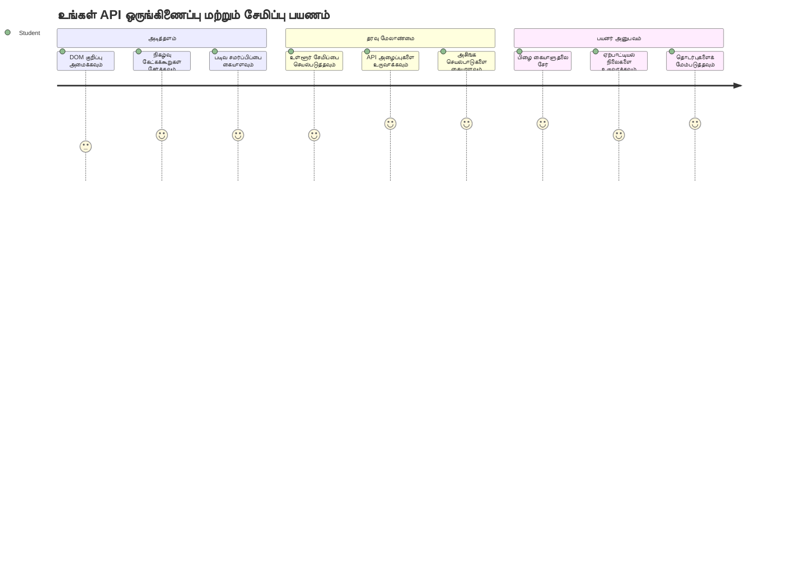
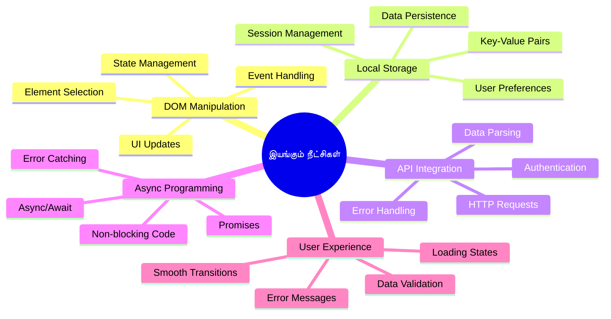
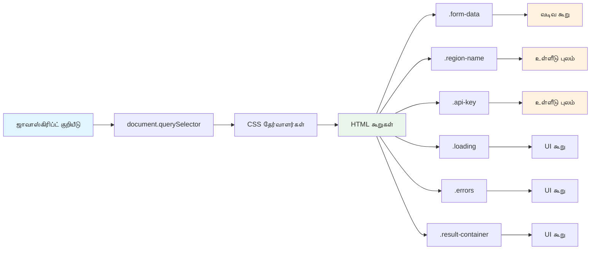
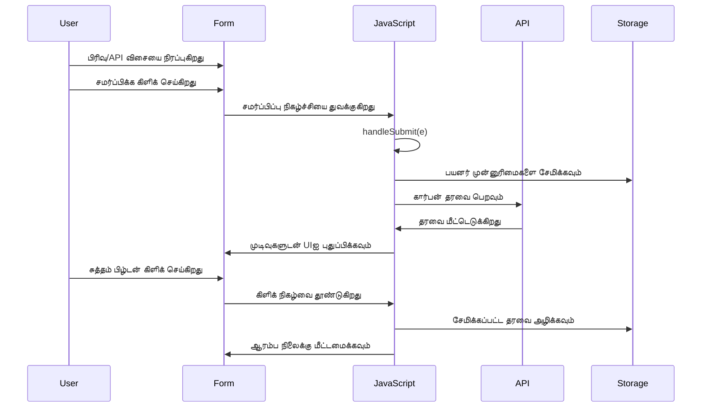
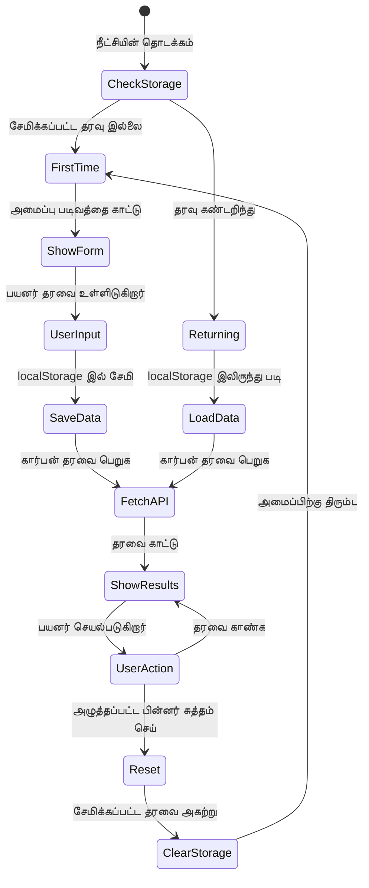
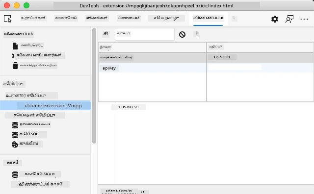
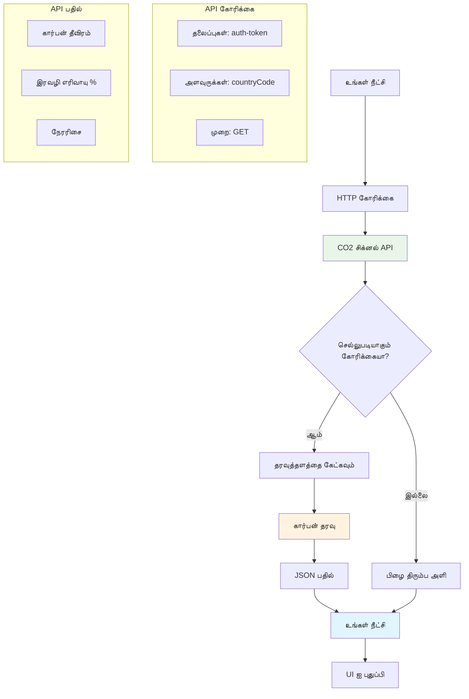
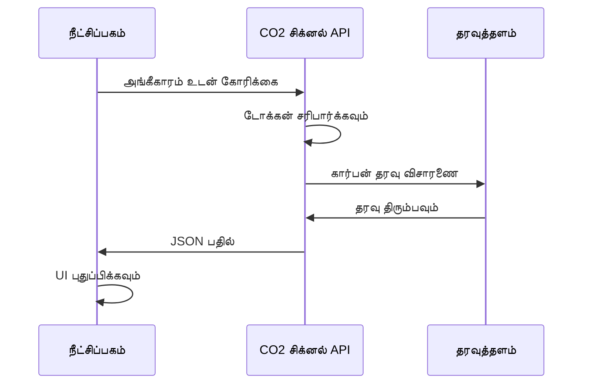
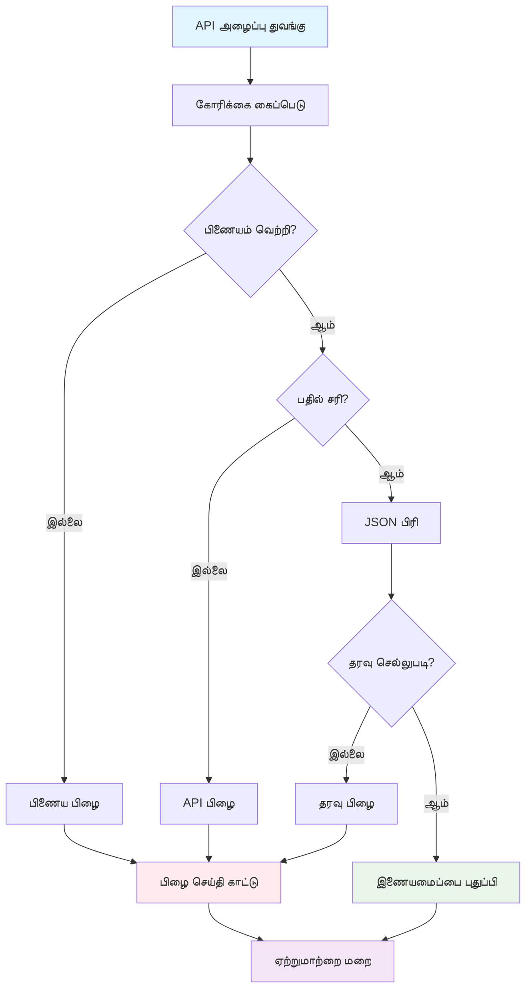
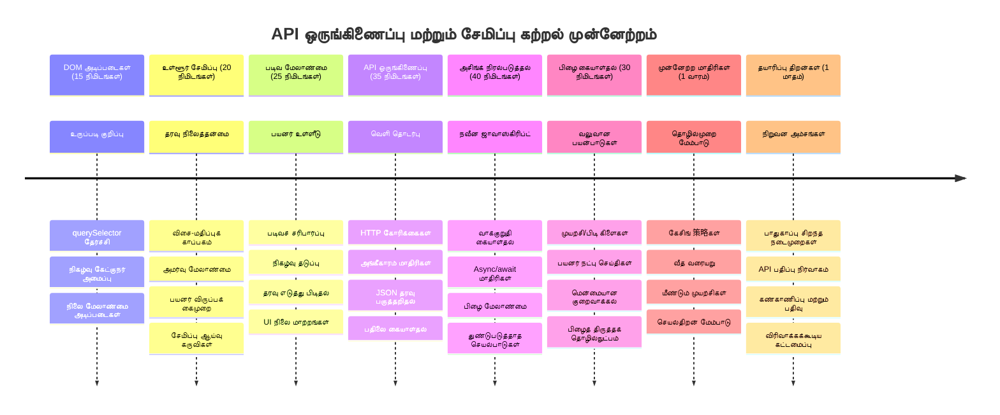

<!--
CO_OP_TRANSLATOR_METADATA:
{
  "original_hash": "2b6203a48c48d8234e0948353b47d84e",
  "translation_date": "2026-01-07T13:16:05+00:00",
  "source_file": "5-browser-extension/2-forms-browsers-local-storage/README.md",
  "language_code": "ta"
}
-->
# Browser Extension Project Part 2: ஒரு APIயை அழைக்கவும், உள்ளூர் சேமிப்பை பயன்படுத்தவும்


## மொழிமுன் வினாடி வினா

[மொழிமுன் வினாடி வினா](https://ff-quizzes.netlify.app/web/quiz/25)

## அறிமுகம்

நீங்கள் கட்டியுள்ள உலாவி விரிவாக்கத்தை நினைவில் வைத்தோ? இப்போது உங்களுக்கு ஒரு அழகான தோற்றம் கொண்ட படிவம் உண்டு, ஆனால் அது அடிப்படையில் நிலையானது. இன்று, அதை உண்மையான தரவுடன் இணைத்து நினைவாற்றலை வழங்குவோம்.

அப்பாலோ மிஷன் கட்டுப்பாட்டு கணினிகள் பற்றி நினைவில் எடுத்து பாருங்கள் - அவை நிலையான தகவல்களை மட்டும் காட்டவில்லை. அவை தொடர்ந்து விண்கலங்களுடன் தொடர்பு கொண்டு, டெலிமெட்ரி தரவை மேம்படுத்தி, முக்கியமான மிஷன் பணியை நினைவில் வைத்திருந்தன. இதுதான் இன்றைய நாங்கள் உருவாக்கப்போகும் இயற்ப்பியல் நடத்தை. உங்கள் விரிவாக்கம் இணையத்துடன் தொடர்புகொண்டு, உண்மையான சுற்றுச்சூழல் தரவைப் பெற்று, அடுத்த முறைக்கான அமைப்புகளை நினைவில் வைக்கும்.

API ஒருங்கிணைப்பு சிக்கலாக தோன்றலாம், ஆனால் அது உங்கள் குறியீட்டுக்குத் மற்ற சேவைகளுடன் தொடர்பு கொள்ள வழி கற்றுக் கொடுத்தலைத் தவிர வேறு எதுவும் கல்லாது. நீங்கள் வானிலை தரவை, சமூக ஊடக ஊட்டங்களை அல்லது இன்று நாம் செய்யப்போகும் போல கார்பன் தடைவாய்ப்புத் தகவலைப் பெறினாலும், எல்லாம் இந்த டிஜிட்டல் தொடர்புகளை உருவாக்குவதே முக்கியம். உலாவிகள் தகவலை நிலைத்துவைக்க எப்படி முடியும் என்பதையும் நாம் ஆராய்வோம் — நூலகங்கள் புத்தகங்கள் எங்கே இருக்கிறதென்றால் அட்டவணைகளால் நினைவில் வைத்திருப்பது போல.

இந்த பாடத்தின் முடிவில், நீங்கள் உண்மையான தரவைப் பெற்றுக்கொண்டு, பயனர் விருப்பங்களை சேமித்து, மென்மையான அனுபவம் வழங்கும் உலாவி விரிவாக்கத்தைக் கொண்டிருப்பீர்கள். தொடங்குவோம்!


✅ உங்கள் குறியீட்டை எங்கே இடவேண்டுமென உகந்த கோப்புகளில் எண் செய்யப்பட்ட பகுதிகளை பின்பற்றவும்

## விரிவாக்கத்தில் செயல்படத்தக்க கூறுகளை அமைக்கவும்

உங்கள் JavaScript இடைமுகத்தை கையாள தேவையானதற்கு முன், அது குறிப்பிட்ட HTML கூறுகளுக்கான குறியீடுகளைப் பெற வேண்டும். இது ஒரு தொலைக்காட்சியை குறிப்பிட்ட நட்சத்திரங்களை நோக்கி திருப்புவது போல — கலிலியோ யூபிட்டரின் சந்திரர்களை பார்வையிட வேண்டுமெனில், முதலில் யூபிட்டரை கண்டுபிடித்து கவனம் செலுத்தவேண்டியிருந்தது.

உங்கள் `index.js` கோப்பில், முக்கியமான படிவ கூறுகளுக்கு குறிப்பிடும் `const` மாறிகளை நாம் உருவாக்கப்போகின்றோம். இது விஞ்ஞானிகள் தங்கள் சாதனங்களை சான்று காட்டுவது போன்றது — தlaboratory முழுவதையும் தேடி விடாமல், நேரடியாக தேவையானதை அணுக முடியும்.


```javascript
// படிவப் புலங்கள்
const form = document.querySelector('.form-data');
const region = document.querySelector('.region-name');
const apiKey = document.querySelector('.api-key');

// முடிவுகள்
const errors = document.querySelector('.errors');
const loading = document.querySelector('.loading');
const results = document.querySelector('.result-container');
const usage = document.querySelector('.carbon-usage');
const fossilfuel = document.querySelector('.fossil-fuel');
const myregion = document.querySelector('.my-region');
const clearBtn = document.querySelector('.clear-btn');
```

**இந்த குறியீடு செய்யும் விஷயங்கள்:**
- CSS வகுப்பு தேர்வாளர்களை பயன்படுத்தி `document.querySelector()` ஆக் பயன்படுத்தி படிவ கூறுகளை **பிடித்தல்**
- பிராந்திய பெயர் மற்றும் API விசைக்கான உள்ளீட்டு புலங்களுக்கு **குறிப்புகளை உருவாக்குதல்**
- கார்பன் பயன்பாட்டு தரவுக்கான முடிவு காட்சி கூறுகளுடன் **இணைப்புகளை நிறுவுதல்**
- ஏற்றும் குறியீட்டுகள் மற்றும் பிழை செய்திகள் போன்ற UI கூறுகளுக்கு **ஆக்சஸ் அமைத்தல்**
- எளிதில் மீண்டும் பயன்படுத்த சக்தியில் ஒவ்வொரு கூறின் குறிப்புகளும் `const` மாறிகளில் **சேமித்தல்**

## நிகழ்வு கவனிப்பாளர்களைச் சேர்க்கவும்

இப்போது உங்கள் விரிவாக்கம் பயனர் செயல்களுக்கு எப்படி பதிலளிப்பதென்று செய்வோம். நிகழ்வு கவனிப்பாளர்கள் உங்கள் குறியீட்டின் பயனர் தொடர்புகளை கண்காணிக்கும் வழி. அதைப் பழைய தொலைபேசி மையக் கட்டுப்பாளர்களைப் போலக் கருதுங்கள் - அவர்கள் வரும் அழைப்புகளை கேட்டறிந்து சரியான சுற்றுகளைக் கொண்டு வந்தனர்.


```javascript
form.addEventListener('submit', (e) => handleSubmit(e));
clearBtn.addEventListener('click', (e) => reset(e));
init();
```

**இதைக் கொண்டு புரிந்துகொள்ளவேண்டியவை:**
- பயனர்கள் Enter அழுத்தும் அல்லது சமர்ப்பிப்பதற்கு மேலாண்மை செய்யும் படிவத்தில் சமர்ப்பிக்கும் பட்டியலை **இணைக்கிறது**
- படிவத்தை மீட்டெடுக்க கிளிக் செய்யும் பொத்தானிற்கு **கிளிக் கேட்டியிருப்பதைச் செயல்படுத்துகிறது**
- கூடுதல் கட்டுப்பாட்டிற்கு `(e)` நிகழ்வுச் பொருளை செயல்பாட்டரிபர்கள் **உருப்படுத்துகிறது**
- உங்கள் விரிவாக்கத்தின் ஆரம்ப நிலையை அமைக்க உடனடி `init()` செயல்பாட்டினை **அழைக்கிறது**

✅ இங்கே பயன்படுத்திய குறும்பட (arrow) செயல்பாட்டுக் குறியீட்டை கவனியுங்கள். இது பாரம்பரிய செயல்பாட்டுக் கருத்துக்களைவிட தூய்மையான மற்றும் நவீனமான முறையாகும். இரண்டும் சரியாக இயங்கும்!

### 🔄 **கற்றல் பரிசோதனை**
**நிகழ்வு கையாளுதல் புரிதல்**:த் தொடங்குவதற்கு முன்,
- ✅ எப்படி `addEventListener` பயனர் செயல்களை JavaScript செயற்கூறுகளுடன் இணைக்கிறது என்பதை விளக்கவும்
- ✅ நிகழ்வுச் பொருளான `(e)`ஐ செயல்பாட்டரிபர்களுக்கு ஏன் அனுப்புகிறோம் என்பதைப் புரிந்துகொள்ளவும்
- ✅ `submit` மற்றும் `click` நிகழ்வுகளுக்கு இடையே வித்தியாசத்தை கவனிக்கவும்
- ✅ `init()` செயல்பாடு எப்போது ஓடுகிறது, ஏன் ஓடுகிறது என்பதை விளக்கவும்

**தட்டிச் சோதனை**: படிவ சமர்ப்பிப்பில் `e.preventDefault()` மறந்துவிட்டால் என்ன நடக்கும்?
*பதில்: பக்கம் மீண்டும் ஏற்றி எல்லா JavaScript நிலையும் இழக்கப்படும் மற்றும் பயனர் அனுபவம் பாதிக்கப்படும்*

## துவக்கம் மற்றும் மீட்டமைப்பு செயல்பாடுகளை உருவாக்கவும்

உங்கள் விரிவாக்கத்திற்கான துவக்க அறிவுரைக்குறிப்பை உருவாக்குவோம். `init()` செயல்பாடு கப்பல் வழிச்செல்வுருவாய்ப்பை போல தனது கருவிகளைப் பரிசோதிக்கிறது - தற்போதைய நிலையைத் தீர்மானித்து இடைமுகத்தை அதன்படி சரிசெய்கிறது. இது யாரோ உங்கள் விரிவாக்கத்தை பயன்படுத்தியிருக்கிறார்களா-அல்லது முதன்முறையாக வருகிறார்களா என பார்க்கிறது மற்றும் அவர்களின் முன்னாள் அமைப்புகளை ஏற்றுகிறது.

`reset()` செயல்பாடு பயனர்களுக்கு ஒரு புதிய துவக்கத்தை வழங்குகிறது - விஞ்ஞானிகள் பரிசோதனைகளுக்கு இடையே கருவிகள் மீட்டமைக்கும் போன்று, தரவு தூய்மையாக இருக்க.

```javascript
function init() {
	// பயனர் முன்பே API அக்கவுண்ட் விவரங்களை சேமித்து வைத்துள்ளாரா என்று சரிபார்க்கவும்
	const storedApiKey = localStorage.getItem('apiKey');
	const storedRegion = localStorage.getItem('regionName');

	// நீளவட்டத்தின் ஐகானை பொது பச்சை வண்ணமாக அமைக்கவும் (புதிய பாடத்திற்கு தளர்வு)
	// செய்யவேண்டியது: அடுத்த பாடத்தில் ஐகானை புதுப்பிப்பது செயல்படுத்தவும்

	if (storedApiKey === null || storedRegion === null) {
		// முதன்மை பயனர்: அமைப்பு படிவத்தை காட்டு
		form.style.display = 'block';
		results.style.display = 'none';
		loading.style.display = 'none';
		clearBtn.style.display = 'none';
		errors.textContent = '';
	} else {
		// திரும்ப வந்த பயனர்: அவர்களின் சேமிக்கப்பட்ட தரவை தானாக ஏற்றவும்
		displayCarbonUsage(storedApiKey, storedRegion);
		results.style.display = 'none';
		form.style.display = 'none';
		clearBtn.style.display = 'block';
	}
}

function reset(e) {
	e.preventDefault();
	// பயனர் புதிய இடத்தை தேர்ந்தெடுக்க அனுமதிக்க காப்பாற்றப்பட்ட பிரதேசத்தை அழிக்கவும்
	localStorage.removeItem('regionName');
	// துவக்க செயல்முறையை மறு துவக்கவும்
	init();
}
```

**இங்கே என்ன நடக்கிறது:**
- உலாவி உள்ளூர் சேமிப்பில் சேமிக்கப்பட்ட API விசை மற்றும் பிராந்தியத்தை **நீக்கு மற்றும் அனுப்புகிறது**
- இது முதல் முறையாகப் பயன்படுத்துகிறாரா (சேமிக்கப்பட்ட கிரிடென்ஷியல்கள் எதுவும் இல்லாமல்) அல்லது திரும்ப வந்த பயனரா என்பதை **சோதனை செய்கிறது**
- புதிய பயனர்களுக்காக அமைப்பு படிவத்தை **காண்பிக்கிறது** மற்றும் மற்ற இடைமுகச் கூறுகளை மறைக்கிறது
- திரும்ப வந்த பயனர்களுக்கான சேமிக்கப்பட்ட தரவை தானாக ஏற்றுகிறது மற்றும் மீட்டமைக்கும் விருப்பத்தைக் **காண்பிக்கிறது**
- கிடைக்கபடும் தரவுகளின் அடிப்படையில் UI நிலையை **கையாள்கிறது**

**உள்ளூர் சேமிப்புக்கான முக்கிய கருத்துக்கள்:**
- உலாவி அமர்வுகளுக்கு இடையே தரவை நிலைத்துவைக்கிறது (அமர்வு சேமிப்புக்கு மாறாக)
- திறவுகோல்-மதிப்புக் கூட்டமாக தரவை `getItem()` மற்றும் `setItem()` ஆகியவற்றோடு **சேமிக்கிறது**
- தரவு இல்லாவிடில் `null` இனமாக **திரும்பப் பெறுகிறது**
- பயனர் விருப்பங்கள் மற்றும் அமைப்புகளை நினைவில் வைத்திட ஒரு எளிதான வழி **அறிதல்**

> 💡 **உலாவி சேமிப்பை புரிந்துகொள்ளுதல்**: [LocalStorage](https://developer.mozilla.org/docs/Web/API/Window/localStorage) என்பது உங்கள் விரிவாக்கத்திற்கு திடமான நினைவு கொடுக்கும். பழமையான அலெக்ஸாண்ட்ரிய நூலகம் ஸ்க்ரோல்களை எவ்வாறு சேமித்துவைத்ததோ அதைப் போல - தகவல் கற்றவர்கள் சென்றுபோனாலும் திரும்ப வந்தாலும் கிடைக்கும்.
>
> **முக்கிய அம்சங்கள்:**
> - உலாவியை மூடிய பிறகும் தரவு நிலைத்திருக்கும்
> - கணினி மீண்டும் இழுதலும் உலாவி மோசடி நேர்ந்தாலும் சேமிப்பு இருக்கிறது
> - பயனர் விருப்பங்களுக்கு பெரிய சேமிப்பு இடம் வழங்குகிறது
> - நெட்வொர்க் தாமதம் இல்லாம துரித அணுகலை வழங்குகிறது

> **முக்கிய குறிப்பு**: உங்கள் உலாவி விரிவாக்கத்தின் தனிப்பட்ட உள்ளூர் சேமிப்பு சாதாரண இணையதளப் பக்கங்களிலிருந்து தனித்துவமாக உள்ளது. இது பாதுகாப்பை வழங்கி பிற இணையதளங்களுடன் மோதலை தடுக்கும்.

உங்கள் சேமிக்கப்பட்ட தரவை உலாவி டெவலப்பர் டூல்ஸ் (F12) திறந்து, **Application** தாவலைத் திறந்து, **Local Storage** பிரிவை விரிவாக்கி பார்க்கலாம்.




> ⚠️ **பாதுகாப்பு கவனம்**: உற்பத்தி பயன்பாடுகளில், API விசைகளை LocalStorageயில் வைக்குவது பாதுகாப்பு ஆபத்துக்களை உருவாக்கும், ஏனெனில் JavaScript இவைகளை அணுக முடியும். கற்றலுக்கான நோக்கில் இது சரி, ஆனால் உண்மையான பயன்பாடுகள் நுண்ணறிந்த கிரிடென்ஷியல்களுக்கு பாதுகாப்பான சர்வர் பக்க சேமிப்பை பயன்படுத்த வேண்டும்.

## படிவ சமர்ப்பிப்பை கையாளுதல்

இப்போது யாரோ உங்கள் படிவத்தை சமர்ப்பித்தால் என்ன நடக்கும் என்பதை கையாள்வோம். இயல்பாக, படிவங்கள் சமர்பிப்பில் உலாவிகள் பக்கத்தை மீண்டும் ஏற்றும், ஆனால் நாம் இதைத் தடுத்து ஒரு மென்மையான அனுபவத்தை உருவாக்குவோம்.

இது விண்கலம் கட்டுப்பாட்டுக் குழுக்கள் தொடர்புகொள்வது போல் - ஒவ்வொரு தகவல்தொடர்புக்கும் முழு அமைப்பை மீட்டமைப்பதற்குப் பதிலாக, புதிய தகவல்களை செயலாக்கும் போது தொடர் செயல்பாட்டை பேணுகிறார்கள்.

படிவ சமர்ப்பிப்புச் செயல்பாட்டை உருவாக்கி பயனர் உள்ளீட்டை பிடிகிறது:

```javascript
function handleSubmit(e) {
	e.preventDefault();
	setUpUser(apiKey.value, region.value);
}
```

**மேலே நாம் செய்தது:**
- பக்கம் மீண்டும் ஏறும் இயல்பான படிவ சமர்ப்பிப்பை **தடுத்து வைத்தோம்**
- API விசை மற்றும் பிராந்திய புலங்களில் இருந்து பயனர் குறிப்புகளை **கருத்தாக்கி எடுத்தோம்**
- `setUpUser()` செயல்பாட்டுக்கு படிவத் தரவை **அனுப்பியது**
- பக்கத்தை மீண்டும் ஏற்றாமல் ஒரே பக்க செயல்பாட்டை **பேணியது**

✅ உங்கள் HTML படிவ புலங்கள் `required` பண்பை கொண்டுள்ளதால், இந்த செயல்பாடு ஓடுவதற்கு முன் உலாவி தானாகவே API விசை மற்றும் பிராந்தியை வழங்குவதாக சரிபார்க்கும்.

## பயனர் விருப்பங்களை அமைக்கவும்

`setUpUser` செயல்பாடு பயனரின் கிரிடென்ஷியல்களைப் பாதுகாப்பதும் முதல் API அழைப்பைத் தொடங்குவதும் பொறுப்பாக இருக்கு. இது அமைப்பிலிருந்து முடிவுகளை காட்சிப்படுத்த மென்மையான மாற்றத்தை உருவாக்கும்.

```javascript
function setUpUser(apiKey, regionName) {
	// எதிர்கால அமர்வுகளுக்காக பயனர் அடையாளங்களை சேமிக்கவும்
	localStorage.setItem('apiKey', apiKey);
	localStorage.setItem('regionName', regionName);
	
	// ஏற்றுதல் நிலையை காட்ட UI யை புதுப்பிக்கவும்
	loading.style.display = 'block';
	errors.textContent = '';
	clearBtn.style.display = 'block';
	
	// பயனர் அடையாளங்களுடன் கார்பன் பயன்பாட்டு தரவுகளை பெறவும்
	displayCarbonUsage(apiKey, regionName);
}
```

**நிகழ்திட்டப் படி என்ன நடக்கிறது:**
- API விசை மற்றும் பிராந்திய பெயரை உள்ளூர் சேமிப்பில் **சேமிக்கிறது**
- தரவு பெறப்படுவதைக் காட்ட ஒரு ஏற்றுதல் குறியீட்டை **காண்பிக்கிறது**
- முன் இருந்த பிழை செய்திகளை **துண்டுகிறது**
- பயனர்களுக்கு அமைப்பை மீட்டெடுக்க கிளியர் பொத்தானை **காண்பிக்கிறது**
- உண்மையான கார்பன் பயன்பாட்டு தரவை பெற API அழைப்பை **தொடக்குகிறது**

இந்த செயல்பாடு தரவு நிலைத்தன்மையும் UI புதுப்பிப்புகளையும் ஒருங்கிணைத்து, பயனருக்கு ஒரே நேர்த்தியான அனுபவத்தை வழங்குகிறது.

## கார்பன் பயன்பாட்டு தரவை காட்டு

இப்போது உங்கள் விரிவாக்கத்தை API மூலம் வெளியரங்க தரவுகளுடன் இணைக்கவோமா. இது உங்கள் விரிவாக்கத்தை தனிமையான கருவியாய் இருந்து இணையத்தின் உண்மைத்தகவல்களை அணுகும் கருவியாக மாற்றுகிறது.

**APIகளை புரிந்துகொள்வது**

[APIs](https://www.webopedia.com/TERM/A/API.html) என்பது வெவ்வேறு பயன்பாடுகள் ஒன்றுக்கு ஒன்று தொடர்பு கொள்ளும் வழிகள். இவை 19ஆம் நூற்றாண்டில் தொலைபேசிக் கட்டமைப்புகள் போல், அப்பாலோ தொலைநிலை சென்டர்கள் போல — ஓப்பிரேட்டர்கள் விரிவோடு தொலைதூர நிலையங்களுக்கு கோரிக்கைகளை அனுப்பினர், தேவைப்பட்ட தகவலைப்ப் பெறினர். நீங்கள் சமூக ஊடகங்களை பார்த்தால், வாய் உதவியாளரிடம் கேள்வி கேட்டால் அல்லது டெலிவரி பயன்பாட்டைப் பயன்படுத்தினால், APIகள் அதனைச் சுலபமாக்குகின்றன.


**REST APIக்களுக்கு முக்கிய கருத்துக்கள்:**
- **REST** என்பது 'Representational State Transfer' என்பதைக் குறிக்கிறது
- தரவுடன் தொடர்புகொள்ள HTTP பாணிகள் (GET, POST, PUT, DELETE) பயன்படுத்தப்படுகிறது
- தரவு பொதுவாக JSON வடிவில் **திரும்ப அனுப்பப்படுகிறது**
- வெவ்வேறு கோரிக்கைகளுக்கு இணையான URL அடிப்படையிலான முடிவுகளை தருகிறது

✅ நம்முடைய [CO2 Signal API](https://www.co2signal.com/) மின்கம்பி வலைப்பின்னல்களிலிருந்து நேரடி கார்பன் தீவிரத்தைக் கொடுக்கும். இது பயனர்களுக்கு மின்சார பயன்பாட்டின் சுற்றுச்சூழல் தாக்கத்தை புரிந்து கொடுக்க உதவும்!

> 💡 **அசிங்க்ரோனஸ் JavaScriptஐ புரிந்துகொள்ளுதல்**: [`async` முக்கியச் சொல்லை](https://developer.mozilla.org/docs/Web/JavaScript/Reference/Statements/async_function) உங்கள் குறியீடு ஒரே நேரத்தில் பல செயல்பாடுகளை கையாள அனுமதிக்கிறது. நீங்கள் சேவையகத்திலிருந்து தரவை கோரும்போது, உங்கள் விரிவாக்கம் முழுவதும் உறைந்திடவில்லை - அது எப்படி காற்று போக்குவரத்து கட்டுப்பாடு ஒரு விமானத்தை காத்திருக்கும்போது அனைத்து செயல்களையும் நிறுத்துவது போல ஆகாது.
>
> **முக்கிய நன்மைகள்:**
> - தரவு ஏற்றும்போது விரிவாக்கத்தின் பதிலளிப்பு செயல்பாடு தக்கவிடு
> - நெட்வொர்க் கோரிக்கைகள் நடக்கும் போது மற்ற குறியீடு செயல்பட தொடரும்
> - பாரம்பரிய கால் பாட்டுகளைவிட குறியீட்டின் வாசிப்பை மேம்படுத்துகிறது
> - நெட்வொர்க் சிக்கல்களைத் தூய்மையாக கையாள உதவும்

`async` பற்றி ஒரு விரைவான வீடியோ:

[](https://youtube.com/watch?v=YwmlRkrxvkk "Async and Await for managing promises")

> 🎥 async/await பற்றிய வீடியோக்காக மேலே படத்தை கிளிக் செய்க.

### 🔄 **கற்றல் பரிசோதனை**
**Async நிரலாக்கம் புரிதல்**: API செயல்பாட்டில் இறங்குவதற்கு முன்
- ✅ எப்படி `async/await` பயன்படுத்தி விரிவாக்கத்தை பிளாக்காது API அழைப்புகளை செய்கிறோம்
- ✅ `try/catch` தரவு தொடர்பு பிழைகளை தூய்மையாக கையாளுவதற்கான பகுதி
- ✅ ஒத்திசைக்கும் (Synchronous) மற்றும் அசிங்க்ரோனஸ் செயல்பாடுகளுக்கு இடையேயான வித்தியாசம்
- ✅ ஏன் API அழைப்புகள் தோல்வியடையும் மற்றும் அதை எவ்வாறு கையாள்வது பற்றிப் பார்வை

**உலக நிஜ இணைப்பு**: அடுத்த மரபணு async உதாரணங்கள்:
- **உணவு ஆர்டர் செய்வது**: நீங்கள் சமையலறையில் காத்திருக்க மாட்டீர்கள் - ரசீதை ஏற்றுக்கொண்டு பிற வேலைகளை செய்கிறீர்கள்
- **மின்னஞ்சல் அனுப்புதல்**: உங்கள் மின்னஞ்சல் செயலி அனுப்பும் போது உறையாது - மேலும் மின்னஞ்சல்கள் தழுவுகிறீர்கள்
- **இணைய பக்கங்கள் ஏற்றுதல்**: படங்கள் படிப்பாய் ஏற்றுகையில் நீங்கள் ஏற்கனவே உரையை வாசிக்க முடியும்

**API அங்கீகாரம் செயல்முறை**:

கார்பன் பயன்பாட்டு தரவைப் பெறும் மற்றும் காட்சிப்படுத்தும் செயல்பாட்டை உருவாக்குக:

```javascript
// நவீன fetch API முறையானது (புறவையாகெதுவும் தேவையில்லை)
async function displayCarbonUsage(apiKey, region) {
	try {
		// CO2 Signal API இற்றுத்து கார்பன் தீவிரத்தைக் கொண்ட தரவுகளைப் பெறுங்கள்
		const response = await fetch('https://api.co2signal.com/v1/latest', {
			method: 'GET',
			headers: {
				'auth-token': apiKey,
				'Content-Type': 'application/json'
			},
			// குறிப்பிட்ட பிரதேசத்திற்கான கேள்வி அளவுருக்களைச் சேர்க்கவும்
			...new URLSearchParams({ countryCode: region }) && {
				url: `https://api.co2signal.com/v1/latest?countryCode=${region}`
			}
		});

		// API கோரிக்கையினை வெற்றிகரமாக பெற்றதா எனச் சரிபார்க்கவும்
		if (!response.ok) {
			throw new Error(`API request failed: ${response.status}`);
		}

		const data = await response.json();
		const carbonData = data.data;

		// சுற்றிவட்டமான கார்பன் தீவிரத்தைக் கணக்கிடவும்
		const carbonIntensity = Math.round(carbonData.carbonIntensity);

		// பெறப்பட்ட தரவுகளுடன் பயனர் இடைமுகத்தை புதுப்பிக்கவும்
		loading.style.display = 'none';
		form.style.display = 'none';
		myregion.textContent = region.toUpperCase();
		usage.textContent = `${carbonIntensity} grams (grams CO₂ emitted per kilowatt hour)`;
		fossilfuel.textContent = `${carbonData.fossilFuelPercentage.toFixed(2)}% (percentage of fossil fuels used to generate electricity)`;
		results.style.display = 'block';

		// செய்ய வேண்டியது: calculateColor(carbonIntensity) - அடுத்த பாடத்தில் செயல்படுத்தவும்

	} catch (error) {
		console.error('Error fetching carbon data:', error);
		
		// பயனருக்கு உகந்த பிழைச் செய்தியை காட்டு
		loading.style.display = 'none';
		results.style.display = 'none';
		errors.textContent = 'Sorry, we couldn\'t fetch data for that region. Please check your API key and region code.';
	}
}
```

**இங்கே நடக்கும் விஷயங்கள்:**
- அடுத்தபடியாக Axios போன்ற வெளிப்புற நூலகங்களை இன்றி, நவீன `fetch()` APIயைப் பயன்படுத்துகின்றது
- API தோல்விகளை முன்கூட்டியே பிடிக்க `response.ok` முறையான பிழை சோதனை அமல்படுத்துகின்றது
- நன்றாகக் கூடிய குறியீடு ஓட்டத்துக்காக `async/await` யைப் பயன்படுத்தி அசிங்க்ரோனஸ் செயல்பாடுகளை எளிமையாக கையாளுகிறது
- `auth-token` தலைப்பைப் பயன்படுத்தி CO2 Signal APIயில் அங்கீகாரம் பெறுகிறது
- JSON பதிலில் இருந்து கார்பன் தீவிரத்தைக் காணொளி செய்கிறது
- பல UI கூறுக்களை வடிவமைக்கப்பட்ட சுற்றுச்சூழல் தரவுடன் புதுப்பிக்கிறது
- API அழைப்புகள் தோல்வியடைந்தபோது பயனர் நட்பான பிழைச் செய்திகளை வழங்குகிறது

**நவீன JavaScript கருத்துக்கள்:**
- `${}` உடன் கூடிய மாதிரி இலக்கணங்கள் (template literals) மூலம் தூய்மை வாசிப்புக்கான ஸ்டிரிங்க் வடிவமைப்பு
- பிழை கையாள்வில் try/catch பிளாக்குகள் மூலம் வலுவான நிரல்
- நெட்வொர்க் கோரிக்கைகளை சீர்திருத்த async/await முறை
- API பதிலிலிருந்து குறிப்பிட்ட தரவுகளைக் கவனிக்கும் பொருள் நகல் (object destructuring)
- DOM கையாளும் பன்முக நூற்கயமை (method chaining)

✅ இந்த செயல்பாடு பல முக்கிய வலை மேம்பாட்டு கற்பனைகளை எடுத்துக்காட்டுகிறது - வெளியே உள்ள சர்வர்களுடன் தொடர்பு கொள்வது, அங்கீகாரம், தரவு செயற்பாடு, இடைமுக புதுப்பிப்பு மற்றும் பிழை கையாளுதல். இதுவே தொழில்முறை மேம்பாட்டாளர்கள் தினசரி பயன்படுத்தும் அடிப்படை திறன்கள்.


### 🔄 **கற்றல் பரிசோதனை**
**முழுமையான அமைப்பு புரிதல்**: முழு போக்கை உறுதி செய்யுங்கள்:
- ✅ DOM குறியீடுகள் JavaScript இடைமுகத்தைக் கட்டுப்படுத்த எப்படி உதவுகின்றன
- ✅ உள்ளூர் சேமிப்பு உலாவி அமர்வுகளுக்கு இடையேயான நிலைத்தன்மையை எப்படி உருவாக்குகிறது
- ✅ async/await API அழைப்புகளை விரிவாக்கம் உறையாமல் செய்வது எப்படி
- ✅ API அழைப்புகள் தோல்வியடைந்தால் என்ன நடக்கும் மற்றும் பிழைகள் எப்படி கையாளப்படும்
- ✅ ஏன் பயனர் அனுபவத்தில் ஏற்றுதல் நிலை மற்றும் பிழை செய்திகள் உண்டு

🎉 **நீங்கள் சாதித்தது:** நீங்கள் ஒரு உலாவி விரிவாக்கத்தை உருவாக்கி உள்ளீர்கள், அது:
- **இணையத்துடன் இணைக்கிறது** மற்றும் உண்மையான சுற்றுச்சூழல் தரவுகளை பெறுகிறது
- **பயனர் அமைப்புகளை அமர்வுகளுக்கு இடையே நினைவில் வைத்துக்கொள்ளும்**
- **பிழைகளைச் சீரமைக்கிறது** முன்கூட்டியே சமாளிக்காமல் விழுந்துவிடாமல்
- **ஒரு மென்மையான, தொழில்முறை பயனர் அனுபவத்தை வழங்குகிறது**

உங்கள் வேலை சரிசெய்ய சோதிக்க `npm run build` ஓட்டி உலாவியில் உங்கள் விரிவாக்கத்தை புதுப்பியுங்கள். இப்போது உங்கள் விரிவாக்கத்துக்கு செயல்முறை கார்பன் தடைவாய்ப்புக் கண்காணிப்பாளர் உள்ளது. அடுத்த பாடத்தில் இயக்கக்கூடிய ஐகான் செயல்பாட்டை சேர்ப்போம்.

---

## GitHub Copilot Agent சவால் 🚀

Agent முறையைக் கொண்டு கீழ்காணும் சவாலை நிறைவு செய்யவும்:
**விவரம்:** ப்ரௌசர் விரிவாக்கத்தை பிழை கையாளுதல் மேம்பாடுகள் மற்றும் பயனர் அனுபவ அம்சங்களைச் சேர்ப்பதன் மூலம் மேம்படுத்தவும். இந்த பணிக்கு APIகள், உள்ளூர் சேமிப்பு மற்றும் நவீன JavaScript மாதிரிகள் பயன்படுத்தி DOM தொடக்கங்களைப் பயன்படுத்துவதில் பயிற்சி செய்ய உதவும்.

**வினா:** பின்வரும் அம்சங்களைக் கொண்ட displayCarbonUsage செயல்பாட்டின் மேம்பட்ட பதிப்பை உருவாக்கவும்: 1) தோல்வியடைந்த API அழைப்புகளுக்கான பொதுக்கூற்று மீண்டும் முயற்சிக்கும் முறை மற்றும் வெளிப்படையான விலக்கு இணையம், 2) API அழைப்புக்கு முன் பிராந்திய குறியீட்டிற்கான உள்ளீடு சரிபார்ப்பு, 3) முன்னேற்ற குறியீடு கொண்ட ஏற்றும் அனிமேஷன், 4) 30 நிமிடங்கள் காலாவதியாகும் காலஅளவுடன் localStorage இல் API பதில்களை சேமித்தல், மற்றும் 5) முன்னர் API அழைப்புகளில் இருந்து வரலாற்று தரவை காட்டும் அம்சம். அனைத்து செயல்பாட்டு அளவுருக்கள் மற்றும் திருப்புமொழுக்களை பதிவு செய்ய TypeScript பாணி JSDoc குறிப்பு வரிகளை சேர்க்கவும்.

[agent mode](https://code.visualstudio.com/blogs/2025/02/24/introducing-copilot-agent-mode) பற்றி மேலும் அறிக.

## 🚀 சவால்

நீங்கள் வலை மேம்பாட்டுக்கு கிடைக்கும் ப்ரௌசர் அடிப்படையிலான APIகளின் வளங்களை ஆராய்ந்து உங்கள் API புரிதலை விரிவுபடுத்துங்கள். கீழுள்ள ப்ரௌசர் APIகளில் ஒன்றைத் தேர்ந்தெடுத்து ஒரு சிறிய எடுத்துக்காட்டை உருவாக்கவும்:

- [Geolocation API](https://developer.mozilla.org/docs/Web/API/Geolocation_API) - பயனரின் தற்போதைய இருப்பிடத்தைப் பெற
- [Notification API](https://developer.mozilla.org/docs/Web/API/Notifications_API) - டெஸ்க்டாப் அறிவிப்புகளை அனுப்ப
- [HTML Drag and Drop API](https://developer.mozilla.org/docs/Web/API/HTML_Drag_and_Drop_API) - இடையீட்டு இழுக்கும் இடைமுகங்களை உருவாக்க
- [Web Storage API](https://developer.mozilla.org/docs/Web/API/Web_Storage_API) - மேம்பட்ட உள்ளூர் சேமிப்பு தொழில்நுட்பங்கள்
- [Fetch API](https://developer.mozilla.org/docs/Web/API/Fetch_API) - XMLHttpRequestக்கு நவீன மாற்று

**ஆராய்ச்சி கேள்விகள்:**
- இந்த API எது உண்மையான பிரச்சனைகளைக் தீர்க்கின்றது?
- API பிழைகள் மற்றும் எல்லை நிலைகளை எவ்வாறு கையாள்கிறது?
- இந்த APIயைப் பயன்படுத்தும் போது எந்த பாதுகாப்பு கருத்துக்கள் உள்ளன?
- இந்த API பல்வேறு ப்ரௌசர்களில் எவ்வளவு பரவலாக ஆதரிக்கப்படுகிறது?

உங்கள் ஆராய்ச்சிக்குப்பின், API வளர்ப்பாளர்களுக்கு நட்பு மற்றும் நம்பகத்தன்மை கொண்ட APIயை உருவாக்கும் பண்புகளை அடையாளம் காண்க.

## வகுப்புத்தமிழ் பின்னர் வினாடி வினா

[வகுப்புத்தமிழ் பின்னர் வினாடி வினா](https://ff-quizzes.netlify.app/web/quiz/26)

## மேலோட்ட பார்வை மற்றும் தன்னிச்சையான ஞாபகம்

இந்தப் பாடத்தில் நீங்கள் LocalStorage மற்றும் APIகளை பற்றி கற்றீர்கள், இரண்டும் தொழில்நுட்ப வலை வளர்ச்சியாளருக்கு மிகவும் பயனுள்ளவை. இந்த இரண்டு அம்சங்கள் எப்படி ஒருங்கிணைக்கப்படுகின்றன என்று சிந்தியுங்கள்? APIயினால் பயன்படுத்தப்படும் பொருட்களை சேமிக்க ஒரு வலைத்தளத்தை நீங்கள் எப்படி வடிவமைப்பீர்கள் என்பதைப் பரிசீலியுங்கள்.

### ⚡ **அடுத்த 5 நிமிடங்களில் நீங்கள் செய்யக்கூடியவை**
- [ ] எந்தவொரு இணையதளத்திலும் DevTools இன் Application தாவலை திறந்து localStorage ஐ ஆராயவும்
- [ ] ஒரு எளிய HTML படிவத்தை உருவாக்கி உலாவியில் படிவ சரிபார்ப்பை சோதிக்கவும்
- [ ] உலாவி கன்சோலில் localStorage உபயோகப்படுத்தி தரவை சேமித்து மீட்டெடுக்க முயற்சிக்கவும்
- [ ] வலைப்பின்னல் தாவலைப் பயன்படுத்தி சமர்ப்பிக்கப்பட்ட படிவ தரவை ஆய்வு செய்யவும்

### 🎯 **இந்த மணிநேரத்தில் நீங்கள் அடையக்கூடியவை**
- [ ] வகுப்புத்தமிழ் பின்னர் வினாடி வினாவை முடித்து படிவ கையாளுதல் கருத்துக்களை புரிந்துகொள்ளலாம்
- [ ] பயனர் விருப்பங்களைச் சேமிக்கும் உலாவி விரிவாக்க படிவத்தை உருவாக்கவும்
- [ ] பயனுள்ள பிழை செய்திகள் உடன் கிளையன்ட் பக்க படிவ சரிபார்ப்பை செயல்படுத்தவும்
- [ ] விரிவா் தரவு நிலைத்தன்மைக்கான chrome.storage API பயன்படுத்துதல் பயிற்சி
- [ ] சேமிக்கப்பட்ட பயனர் அமைப்புகளுக்கு பதிலளிக்கும் பயனர் இடைமுகத்தை உருவாக்கவும்

### 📅 **உங்களை 1 வாரம் விரிவாக்கம் கட்டுமானம்**
- [ ] முழுமையான படிவ செயல்பாட்டுடன் உள்ள ப்ரௌசர் விரிவாக்கத்தை நிறைவு செய்யவும்
- [ ] உள்ளூர், சிங்க் மற்றும் அமர்வு சேமிப்புப் விருப்பங்களை முதன்மை செய்யவும்
- [ ] autocomplete மற்றும் சரிபார்ப்பு போன்ற மேம்பட்ட படிவ அம்சங்களை செயல்படுத்தவும்
- [ ] பயனர் தரவுக்கான இறக்குமதி/ஏற்றுமதி செயல்பாட்டைச் சேர்க்கவும்
- [ ] பல்வேறு ப்ரௌசர்களில் உங்கள் விரிவாக்கத்தை முழுமையாக பரிசோதனை செய்யவும்
- [ ] உங்கள் விரிவாக்கத்தின் பயனர் அனுபவம் மற்றும் பிழை கையாளலை மெருமைப்படுத்தவும்

### 🌟 **உங்கள் மாதநாள் வெப் API ஆறுமுகம்**
- [ ] பல்வேறு ப்ரௌசர் சேமிப்பு APIகளைப் பயன்படுத்தி சிக்கலான பயன்பாடுகளை உருவாக்கவும்
- [ ] ஆஃப்லைன் முதன்மை வளர்ச்சிப் பாணிகளை கற்றுக்கொள்ளவும்
- [ ] தரவு நிலைத்தன்மை தொடர்பான திறந்த மூலத் திட்டங்களுக்கு பங்களிக்கவும்
- [ ] தனியுரிமை மையப்படுத்திய வளர்ச்சி மற்றும் GDPR உடன்படிக்கையை ஆற்றல் பெறவும்
- [ ] படிவ கையாளலும் தரவு நிர்வாகத்திற்கும் மறுபயன்பாட்டு நூலகங்களை உருவாக்கவும்
- [ ] வெப் APIகள் மற்றும் விரிவாக்க வளர்ச்சியைப் பற்றி அறிவை பகிரவும்

## 🎯 உங்கள் விரிவாக்க வளர்ச்சி ஆற்றல் காலவரிசை


### 🛠️ உங்கள் முழுமையான டெவலப்பர் கருவிகளின் சுருக்கம்

இந்தப் பாடத்தை முடித்த பிறகு, உங்களுக்கு இங்கே உள்ளது:  
- **DOM அனுபவம்**: துல்லியமான பெண்கட்டளை மற்றும் இயக்கங்கள்  
- **சேமிப்பு நுட்பம்**: localStorage உடன் நிலையான தரவு நிர்வாகம்  
- **API ஒருங்கிணைப்பு**: நேரடி தரவு பெறுதல் மற்றும் அங்கீகாரம்  
- **அசிங்க்ரோனஸ் நிரல்**: நவீன JavaScript உடன் தடையில்லா செயல்பாடுகள்  
- **பிழை கையாளுதல்**: தோல்விகளை மிருதுவாக கையாளும் வலுவான பயன்பாடுகள்  
- **பயனர் அனுபவம்**: ஏற்றும் நிலைகள், சரிபார்ப்பு மற்றும் பரிசுத்த இடைமுகங்கள்  
- **நவீன மாதிரிகள்**: fetch API, async/await, மற்றும் ES6+ அம்சங்கள்  

**தொழில்முறை திறன்கள் பெற்றல்:** நீங்கள் பின்வற்றிய மாதிரிகளை செயல்படுத்தியுள்ளீர்கள்:  
- **வலை பயன்பாடுகள்**: வெளிப்புற தரவு மூல உடைய ஒரே பக்கம் பயன்பாடுகள்  
- **மொபைல் மேம்பாடு**: ஆஃப்லைன் திறன் கொண்ட API ஓட்டுநிலையைக் கொண்ட செயலிகள்  
- **டெக்ஸ்டாப்ப் மென்பொருள்**: Electron செயலிகள் மற்றும் நிலையான சேமிப்பு  
- **நிறுவன அமைப்புகள்**: அங்கீகாரம், காசிங்கு மற்றும் பிழை கையாளுதல்  
- **நவீன கட்டமைப்புகள்**: React/Vue/Angular தரவு நிர்வாக மாதிரிகள்  

**அடுத்த நிலை:** நீங்கள் காசிங் தந்திரங்கள், நேரடி WebSocket இணைப்புகள், அல்லது சிக்கலான நிலை நிர்வாகம் போன்ற மேம்பட்ட தலைப்புகளை ஆராயத் தயாராக இருக்கிறீர்கள்!

## பணிப் பணி

[ஒரு APIயை ஏற்று பயன்படுத்துக](assignment.md)

---

<!-- CO-OP TRANSLATOR DISCLAIMER START -->
**குறிப்பு**:
இந்த ஆவணம் AI மொழிபெயர்ப்பு சேவை [Co-op Translator](https://github.com/Azure/co-op-translator) மூலம் மொழிபெயர்க்கப்பட்டுள்ளது. நாங்கள் சீர்மரியாதைக்காக முயற்சி செய்தாலும், தானியங்கி மொழிபெயர்ப்புகளில் தவறுகள் அல்லது தவறான விளக்கங்கள் இருக்கலாம் என்பதைக் கவனியுங்கள். அதற்கு மூல மொழியில் உள்ள அசல் ஆவணம் அதிகாரபூர்வ ஆதாரமாக கருதப்பட வேண்டும். முக்கியமான விவரங்களுக்கு, தொழில்முறை மனித மொழிபெயர்ப்பு பரிந்துரைக்கப்படுகிறது. இந்த மொழிபெயர்ப்பின் பயன்பாட்டால் ஏற்படக்கூடிய எந்த தவறான புரிதல் அல்லது தவறான விளக்கங்களுக்கும் நாங்கள் பொறுப்பேற்க மாட்டோம்.
<!-- CO-OP TRANSLATOR DISCLAIMER END -->