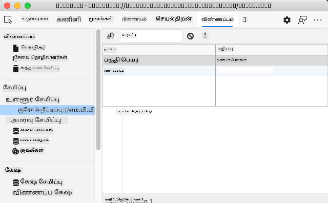

<!--
CO_OP_TRANSLATOR_METADATA:
{
  "original_hash": "a7587943d38d095de8613e1b508609f5",
  "translation_date": "2025-10-11T12:20:20+00:00",
  "source_file": "5-browser-extension/2-forms-browsers-local-storage/README.md",
  "language_code": "ta"
}
-->
# உலாவி நீட்டிப்பு திட்டம் பகுதி 2: API-ஐ அழைக்கவும், Local Storage-ஐ பயன்படுத்தவும்

## முன்-வகுப்பு வினாடி வினா

[முன்-வகுப்பு வினாடி வினா](https://ff-quizzes.netlify.app/web/quiz/25)

### அறிமுகம்

இந்த பாடத்தில், உலாவி நீட்டிப்பு வடிவத்தை சமர்ப்பித்து API-ஐ அழைக்கவும், உலாவி நீட்டிப்பில் முடிவுகளை காட்டவும் கற்றுக்கொள்வீர்கள். மேலும், உலாவியின் Local Storage-இல் தரவுகளை சேமித்து, எதிர்காலத்தில் பயன்படுத்துவது எப்படி என்பதைப் பற்றியும் கற்றுக்கொள்வீர்கள்.

✅ உங்கள் கோடுகளை எங்கு இட வேண்டும் என்பதை அறிய, தொடர்புடைய கோப்புகளில் எண் குறிக்கப்பட்ட பகுதிகளைப் பின்பற்றவும்.

### நீட்டிப்பில் மாற்றத்திற்கான கூறுகளை அமைக்கவும்:

இந்த நேரத்தில், உலாவி நீட்டிப்புக்கான HTML வடிவம் மற்றும் முடிவுகளுக்கான `<div>`-ஐ நீங்கள் உருவாக்கி முடித்திருக்க வேண்டும். இப்போது, `/src/index.js` கோப்பில் வேலை செய்ய வேண்டும் மற்றும் உங்கள் நீட்டிப்பை படிப்படியாக உருவாக்க வேண்டும். உங்கள் திட்டத்தை அமைப்பது மற்றும் கட்டுமான செயல்முறையைப் பற்றிய [முந்தைய பாடத்தை](../1-about-browsers/README.md) பார்க்கவும்.

`index.js` கோப்பில் வேலை செய்யும்போது, பல்வேறு புலங்களுடன் தொடர்புடைய மதிப்புகளை வைத்திருக்கும் `const` மாறிகளை உருவாக்கத் தொடங்கவும்:

```JavaScript
// form fields
const form = document.querySelector('.form-data');
const region = document.querySelector('.region-name');
const apiKey = document.querySelector('.api-key');

// results
const errors = document.querySelector('.errors');
const loading = document.querySelector('.loading');
const results = document.querySelector('.result-container');
const usage = document.querySelector('.carbon-usage');
const fossilfuel = document.querySelector('.fossil-fuel');
const myregion = document.querySelector('.my-region');
const clearBtn = document.querySelector('.clear-btn');
```

இந்த புலங்கள் அனைத்தும் CSS வகுப்புகளால் குறிப்பிடப்படுகின்றன, நீங்கள் முந்தைய பாடத்தில் HTML-ல் அமைத்தது போல.

### கேட்புகளைச் சேர்க்கவும்

அடுத்ததாக, வடிவத்திற்கும், வடிவத்தை மீட்டமைக்கும் "clear" பொத்தானுக்கும் நிகழ்வு கேட்புகளைச் சேர்க்கவும். இதனால், பயனர் வடிவத்தை சமர்ப்பிக்கும்போது அல்லது மீட்டமைப்பு பொத்தானை அழுத்தும்போது, ஏதாவது நடக்கும். கோப்பின் கீழே செயலியை ஆரம்பிக்க அழைப்பு சேர்க்கவும்:

```JavaScript
form.addEventListener('submit', (e) => handleSubmit(e));
clearBtn.addEventListener('click', (e) => reset(e));
init();
```

✅ சமர்ப்பிப்பு அல்லது கிளிக் நிகழ்வுக்கான சுருக்கமான குறியீட்டை கவனிக்கவும், மற்றும் நிகழ்வு `handleSubmit` அல்லது `reset` செயலிகளுக்கு அனுப்பப்படுகிறது. இந்த சுருக்கமான வடிவத்தின் நீண்ட வடிவத்தை எழுத முடியுமா? எது உங்களுக்கு பிடித்தது?

### `init()` மற்றும் `reset()` செயலிகளை உருவாக்கவும்:

இப்போது, நீட்டிப்பை ஆரம்பிக்கும் செயலியை உருவாக்கப் போகிறீர்கள், இது `init()` என்று அழைக்கப்படுகிறது:

```JavaScript
function init() {
	//if anything is in localStorage, pick it up
	const storedApiKey = localStorage.getItem('apiKey');
	const storedRegion = localStorage.getItem('regionName');

	//set icon to be generic green
	//todo

	if (storedApiKey === null || storedRegion === null) {
		//if we don't have the keys, show the form
		form.style.display = 'block';
		results.style.display = 'none';
		loading.style.display = 'none';
		clearBtn.style.display = 'none';
		errors.textContent = '';
	} else {
        //if we have saved keys/regions in localStorage, show results when they load
        displayCarbonUsage(storedApiKey, storedRegion);
		results.style.display = 'none';
		form.style.display = 'none';
		clearBtn.style.display = 'block';
	}
};

function reset(e) {
	e.preventDefault();
	//clear local storage for region only
	localStorage.removeItem('regionName');
	init();
}

```

இந்த செயலியில் சில சுவாரஸ்யமான தர்க்கங்கள் உள்ளன. அதை வாசிக்கும்போது, என்ன நடக்கிறது என்பதைப் புரிந்துகொள்ள முடியுமா?

- இரண்டு `const`-கள் Local Storage-இல் பயனர் APIKey மற்றும் பிராந்திய குறியீட்டை சேமித்துள்ளதா என்பதைச் சரிபார்க்க அமைக்கப்பட்டுள்ளன.
- அவற்றில் ஏதேனும் null ஆக இருந்தால், அதன் "style" ஐ 'block' ஆக மாற்றி வடிவத்தை காட்டவும்.
- முடிவுகள், "loading", மற்றும் "clearBtn"-ஐ மறைக்கவும், மற்றும் எந்தவொரு பிழை உரையும் காலியாக அமைக்கவும்.
- APIKey மற்றும் region இருந்தால், ஒரு செயல்முறையைத் தொடங்கவும்:
  - கார்பன் பயன்பாட்டு தரவுகளைப் பெற API-ஐ அழைக்கவும்.
  - முடிவுகள் பகுதியை மறைக்கவும்.
  - வடிவத்தை மறைக்கவும்.
  - மீட்டமைப்பு பொத்தானை காட்டவும்.

தொடர்வதற்கு முன், உலாவிகளில் கிடைக்கும் ஒரு முக்கியமான கருத்தை அறிய பயனுள்ளதாக இருக்கும்: [LocalStorage](https://developer.mozilla.org/docs/Web/API/Window/localStorage). LocalStorage என்பது உலாவியில் "key-value" ஜோடியாக strings-ஐ சேமிக்க ஒரு பயனுள்ள வழியாகும். இந்த வகை வலை சேமிப்பகத்தை JavaScript மூலம் நிர்வகிக்க முடியும். LocalStorage காலாவதியாகாது, ஆனால் SessionStorage, மற்றொரு வகை வலை சேமிப்பகம், உலாவி மூடப்பட்டால் அழிக்கப்படும். சேமிப்பகத்தின் பல்வேறு வகைகளுக்கு அதன் பயன்பாட்டில் நன்மைகள் மற்றும் குறைகள் உள்ளன.

> குறிப்பு - உலாவி நீட்டிப்புக்கு தனிப்பட்ட Local Storage உள்ளது; முக்கிய உலாவி சாளரம் வேறுபட்ட நிகழ்வாக செயல்படுகிறது.

உங்கள் APIKey-ஐ ஒரு string மதிப்பாக அமைக்கவும், உதாரணமாக, Edge-ல் "inspect" செய்து (உலாவியை வலது கிளிக் செய்து inspect செய்யலாம்) Applications tab-க்கு சென்று சேமிப்பகத்தைப் பார்க்கலாம்.



✅ LocalStorage-இல் சில தரவுகளை சேமிக்க வேண்டாம் என்று நீங்கள் நினைக்கக்கூடிய சூழல்களைப் பற்றி யோசிக்கவும். பொதுவாக, APIKeys-ஐ LocalStorage-இல் வைப்பது ஒரு மோசமான யோசனை! ஏன் என்பதைப் புரிந்துகொள்ள முடியுமா? எங்கள் வழக்கில், எங்கள் பயன்பாடு முழுமையாக கற்றலுக்காகவே உள்ளது மற்றும் ஒரு பயன்பாட்டு கடையில் வெளியிடப்படாது என்பதால், இந்த முறையைப் பயன்படுத்துவோம்.

LocalStorage-ஐ நிர்வகிக்க Web API-ஐ நீங்கள் பயன்படுத்துகிறீர்கள் என்பதை கவனிக்கவும், `getItem()`, `setItem()`, அல்லது `removeItem()` மூலம். இது உலாவிகளில் பரவலாக ஆதரிக்கப்படுகிறது.

`displayCarbonUsage()` செயலியை உருவாக்குவதற்கு முன், ஆரம்ப வடிவ சமர்ப்பிப்பை நிர்வகிக்க செயல்பாடுகளை உருவாக்குவோம்.

### வடிவ சமர்ப்பிப்பை நிர்வகிக்கவும்

`handleSubmit` என்ற செயலியை உருவாக்கவும், இது ஒரு நிகழ்வு argument `(e)`-ஐ ஏற்கிறது. நிகழ்வை பரவாமல் தடுக்கவும் (இந்த வழக்கில், உலாவி புதுப்பிக்காமல் தடுக்க வேண்டும்) மற்றும் புதிய செயலியை அழைக்கவும், `setUpUser`, `apiKey.value` மற்றும் `region.value` arguments-ஐ அனுப்பவும். இந்த வழியில், ஆரம்ப வடிவத்தின் மூலம் கொண்டு வரப்பட்ட இரண்டு மதிப்புகளை நீங்கள் பயன்படுத்துகிறீர்கள்.

```JavaScript
function handleSubmit(e) {
	e.preventDefault();
	setUpUser(apiKey.value, region.value);
}
```

✅ உங்கள் நினைவுகளைப் புதுப்பிக்கவும் - நீங்கள் முந்தைய பாடத்தில் அமைத்த HTML-ல் இரண்டு input புலங்கள் உள்ளன, அவற்றின் `values`-ஐ நீங்கள் கோப்பின் மேல் அமைத்த `const` மூலம் பிடிக்கிறீர்கள், மேலும் அவை இரண்டும் `required` ஆக உள்ளன, எனவே உலாவி null மதிப்புகளை உள்ளிட பயனர்களைத் தடுக்கிறது.

### பயனரை அமைக்கவும்

`setUpUser` செயலிக்கு செல்லும்போது, இங்கே நீங்கள் apiKey மற்றும் regionName-க்கு Local Storage மதிப்புகளை அமைக்கிறீர்கள். புதிய செயலியைச் சேர்க்கவும்:

```JavaScript
function setUpUser(apiKey, regionName) {
	localStorage.setItem('apiKey', apiKey);
	localStorage.setItem('regionName', regionName);
	loading.style.display = 'block';
	errors.textContent = '';
	clearBtn.style.display = 'block';
	//make initial call
	displayCarbonUsage(apiKey, regionName);
}
```

இந்த செயலி API அழைக்கும்போது காட்ட loading message-ஐ அமைக்கிறது. இந்த நேரத்தில், உலாவி நீட்டிப்பின் மிக முக்கியமான செயலியை உருவாக்க வந்துவிட்டீர்கள்!

### கார்பன் பயன்பாட்டை காட்டவும்

இப்போது API-ஐ கேட்க நேரம் வந்துவிட்டது!

தொடர்வதற்கு முன், API-க்களைப் பற்றி விவாதிக்க வேண்டும். API-க்கள், அல்லது [Application Programming Interfaces](https://www.webopedia.com/TERM/A/API.html), ஒரு வலை டெவலப்பரின் கருவி பெட்டியில் முக்கியமான கூறாகும். அவை நிரல்கள் ஒருவருக்கொருவர் தொடர்பு கொள்ள மற்றும் இடைமுகம் அமைக்க தரநிலையான வழிகளை வழங்குகின்றன. உதாரணமாக, நீங்கள் ஒரு தரவுத்தொகுப்பை கேட்க வேண்டிய ஒரு வலைத்தளத்தை உருவாக்கினால், உங்களுக்கு பயன்படுத்த API-ஐ யாரோ உருவாக்கியிருக்கலாம். API-க்களின் பல வகைகள் உள்ளன, ஆனால் மிகவும் பிரபலமானது [REST API](https://www.smashingmagazine.com/2018/01/understanding-using-rest-api/) ஆகும்.

✅ 'REST' என்ற சொல் 'Representational State Transfer' என்பதற்கான சுருக்கமாகும், மேலும் பல்வேறு URL-களைப் பயன்படுத்தி தரவுகளை பெறுவதற்கான அம்சங்களை கொண்டுள்ளது. டெவலப்பர்களுக்கு கிடைக்கும் API-க்களின் பல்வேறு வகைகளைப் பற்றி சிறிது ஆராயுங்கள். எந்த வடிவம் உங்களுக்கு பிடிக்கிறது?

இந்த செயலியில் முக்கியமான விஷயங்களை கவனிக்க வேண்டும். முதலில், [`async` keyword](https://developer.mozilla.org/docs/Web/JavaScript/Reference/Statements/async_function)-ஐ கவனிக்கவும். உங்கள் செயலிகளை அசிங்கமாக இயங்கும்படி எழுதுவது, தரவுகள் திரும்ப வரும் போன்ற ஒரு செயல் முடிவடையும் வரை தொடராமல் காத்திருக்கச் செய்கிறது.

இங்கே `async` பற்றிய ஒரு விரைவு வீடியோ உள்ளது:

[](https://youtube.com/watch?v=YwmlRkrxvkk "Async மற்றும் Await-ஐ promises-ஐ நிர்வகிக்க")

> 🎥 மேலே உள்ள படத்தை கிளிக் செய்து async/await பற்றிய வீடியோவைப் பாருங்கள்.

C02Signal API-ஐ கேட்க புதிய செயலியை உருவாக்கவும்:

```JavaScript
import axios from '../node_modules/axios';

async function displayCarbonUsage(apiKey, region) {
	try {
		await axios
			.get('https://api.co2signal.com/v1/latest', {
				params: {
					countryCode: region,
				},
				headers: {
					'auth-token': apiKey,
				},
			})
			.then((response) => {
				let CO2 = Math.floor(response.data.data.carbonIntensity);

				//calculateColor(CO2);

				loading.style.display = 'none';
				form.style.display = 'none';
				myregion.textContent = region;
				usage.textContent =
					Math.round(response.data.data.carbonIntensity) + ' grams (grams C02 emitted per kilowatt hour)';
				fossilfuel.textContent =
					response.data.data.fossilFuelPercentage.toFixed(2) +
					'% (percentage of fossil fuels used to generate electricity)';
				results.style.display = 'block';
			});
	} catch (error) {
		console.log(error);
		loading.style.display = 'none';
		results.style.display = 'none';
		errors.textContent = 'Sorry, we have no data for the region you have requested.';
	}
}
```

இது ஒரு பெரிய செயலி. இங்கே என்ன நடக்கிறது?

- சிறந்த நடைமுறைகளைப் பின்பற்ற, இந்த செயலியை அசிங்கமாக செயல்படச் செய்ய `async` keyword-ஐ நீங்கள் பயன்படுத்துகிறீர்கள். API தரவுகளை திரும்ப வழங்கும் போது இந்த செயலி ஒரு வாக்குறுதியைத் திருப்பும், எனவே `try/catch` block-ஐ பயன்படுத்தி இந்த நிச்சயமற்ற தன்மையை நிர்வகிக்க வேண்டும். API பதிலளிக்கும் வேகத்தை நீங்கள் கட்டுப்படுத்த முடியாது (அது பதிலளிக்கவே இல்லாமல் இருக்கலாம்!), எனவே இந்த நிச்சயமற்ற தன்மையை அசிங்கமாக அழைப்பதன் மூலம் நிர்வகிக்க வேண்டும்.
- co2signal API-ஐ உங்கள் பிராந்தியத்தின் தரவுகளைப் பெற கேட்கிறீர்கள், உங்கள் API Key-ஐப் பயன்படுத்தி. அந்த key-ஐ பயன்படுத்த, உங்கள் header parameters-ல் authentication வகையை நீங்கள் பயன்படுத்த வேண்டும்.
- API பதிலளித்தவுடன், அதன் பதிலின் பல்வேறு கூறுகளை உங்கள் திரையில் காட்ட இந்த தரவுகளை நீங்கள் ஒதுக்குகிறீர்கள்.
- பிழை இருந்தால், அல்லது முடிவு இல்லையெனில், பிழை செய்தியை நீங்கள் காட்டுகிறீர்கள்.

✅ அசிங்கமான நிரலாக்க முறைகள் உங்கள் கருவி பெட்டியில் மற்றொரு பயனுள்ள கருவியாகும். [இந்த வகையான குறியீட்டை](https://developer.mozilla.org/docs/Web/JavaScript/Reference/Statements/async_function) அமைக்க பல்வேறு வழிகளைப் பற்றி படிக்கவும்.

வாழ்த்துக்கள்! உங்கள் நீட்டிப்பை உருவாக்கினால் (`npm run build`) மற்றும் உங்கள் extensions pane-ல் அதை refresh செய்தால், நீங்கள் ஒரு செயல்படும் நீட்டிப்பை பெற்றுவிட்டீர்கள்! செயலி மட்டும் வேலை செய்யவில்லை, அதை அடுத்த பாடத்தில் சரி செய்வீர்கள்.

---

## 🚀 சவால்

இந்த பாடங்களில் இதுவரை பல வகையான API-க்களைப் பற்றி விவாதித்துள்ளோம். ஒரு வலை API-ஐ தேர்ந்தெடுத்து, அது என்ன வழங்குகிறது என்பதை ஆழமாக ஆராயுங்கள். உதாரணமாக, உலாவிகளில் கிடைக்கும் API-க்களைப் பாருங்கள், [HTML Drag and Drop API](https://developer.mozilla.org/docs/Web/API/HTML_Drag_and_Drop_API) போன்றவை. உங்கள் கருத்தில் ஒரு சிறந்த API என்ன?

## வகுப்புக்குப் பின் வினாடி வினா

[வகுப்புக்குப் பின் வினாடி வினா](https://ff-quizzes.netlify.app/web/quiz/26)

## மதிப்பீடு மற்றும் சுயபயிற்சி

இந்த பாடத்தில், LocalStorage மற்றும் API-க்களைப் பற்றி கற்றீர்கள், இரண்டும் தொழில்முறை வலை டெவலப்பருக்கு மிகவும் பயனுள்ளதாக இருக்கும். இந்த இரண்டு விஷயங்கள் ஒன்றுக்கொன்று எப்படி வேலை செய்கின்றன என்பதைப் பற்றி யோசிக்க முடியுமா? API-யால் பயன்படுத்தப்படும் பொருட்களை சேமிக்கும் ஒரு வலைத்தளத்தை நீங்கள் எப்படி வடிவமைப்பீர்கள்?

## பணிக்கட்டளை

[ஒரு API-ஐ ஏற்றுக்கொள்ளவும்](assignment.md)

---

**குறிப்பு**:  
இந்த ஆவணம் [Co-op Translator](https://github.com/Azure/co-op-translator) என்ற AI மொழிபெயர்ப்பு சேவையைப் பயன்படுத்தி மொழிபெயர்க்கப்பட்டுள்ளது. நாங்கள் துல்லியத்திற்காக முயற்சிக்கிறோம், ஆனால் தானியங்கி மொழிபெயர்ப்புகளில் பிழைகள் அல்லது தவறான தகவல்கள் இருக்கக்கூடும் என்பதை கவனத்தில் கொள்ளவும். அதன் தாய்மொழியில் உள்ள மூல ஆவணம் அதிகாரப்பூர்வ ஆதாரமாகக் கருதப்பட வேண்டும். முக்கியமான தகவல்களுக்கு, தொழில்முறை மனித மொழிபெயர்ப்பு பரிந்துரைக்கப்படுகிறது. இந்த மொழிபெயர்ப்பைப் பயன்படுத்துவதால் ஏற்படும் எந்த தவறான புரிதல்கள் அல்லது தவறான விளக்கங்களுக்கு நாங்கள் பொறுப்பல்ல.