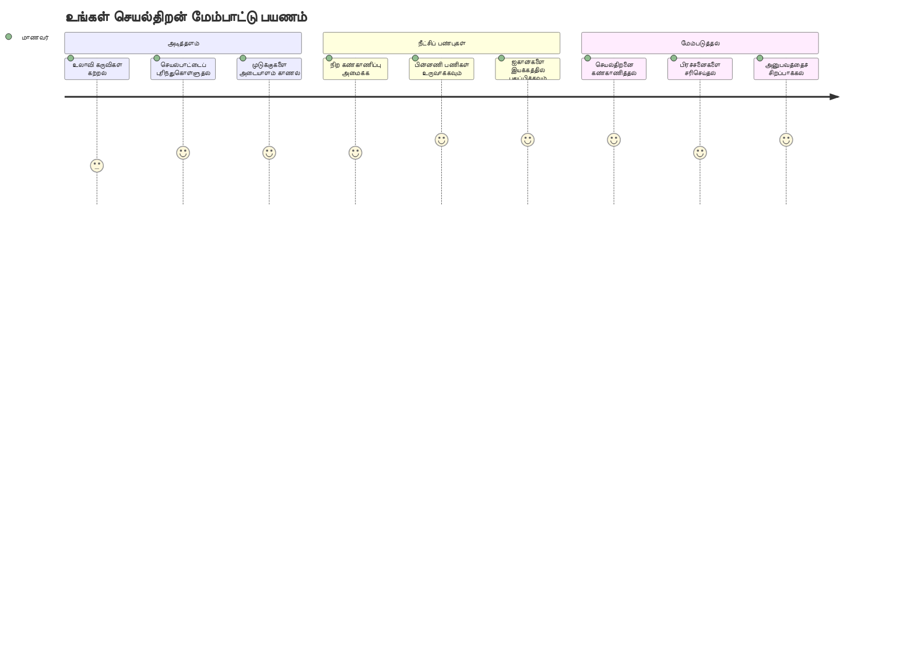
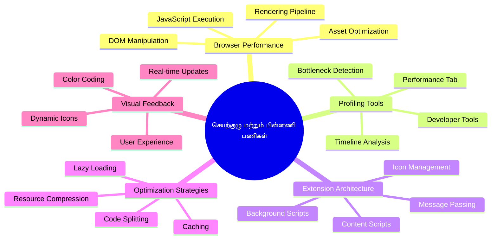
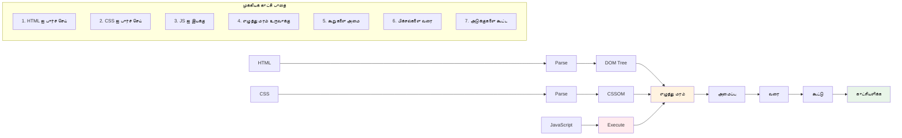
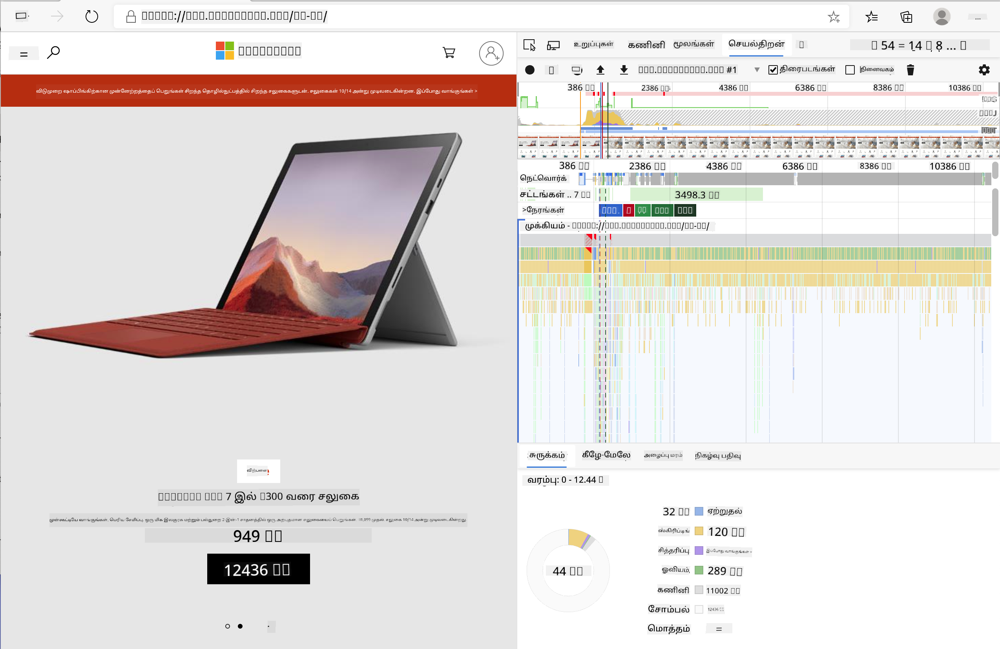
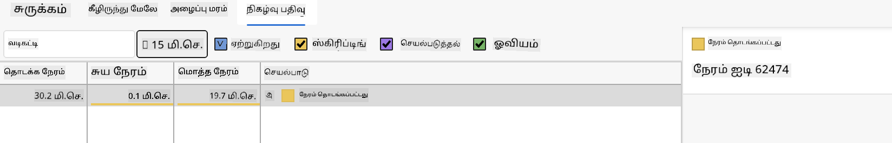
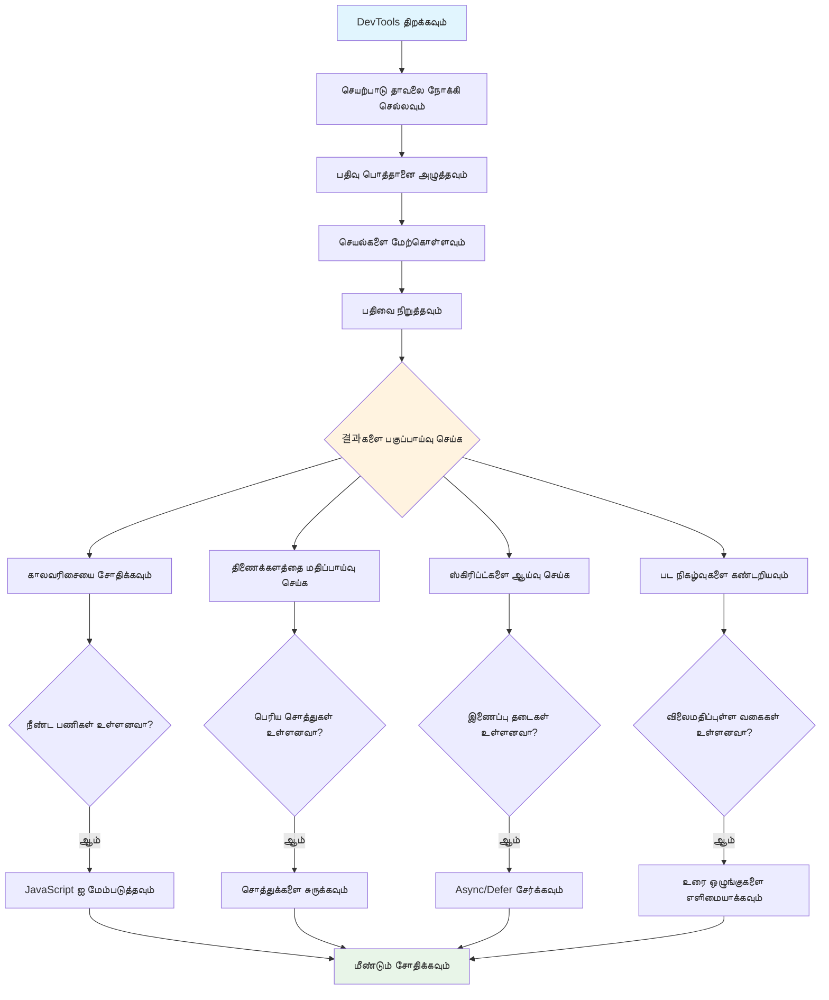
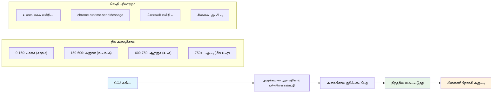
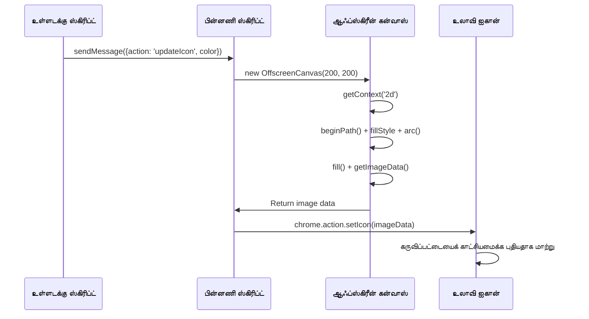
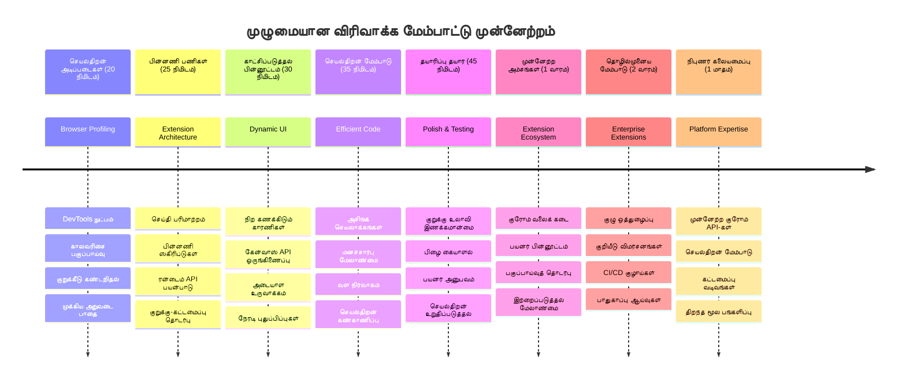

<!--
CO_OP_TRANSLATOR_METADATA:
{
  "original_hash": "b275fed2c6fc90d2b9b6661a3225faa2",
  "translation_date": "2026-01-07T13:18:49+00:00",
  "source_file": "5-browser-extension/3-background-tasks-and-performance/README.md",
  "language_code": "ta"
}
-->
# Browser Extension Project Part 3: பின்புலப் பணிகள் மற்றும் செயல்திறன் பற்றி கற்றுக்கொள்


சில உலாவி விரிவாக்கங்கள் எதற்கு வேகமாகவும் பதிலளிக்கக்கூடியதாகவும் தோன்றுகின்றன என்பதைக் அசைவாக்கமாக முன்கணித்துள்ளீர்களா? இருமையாகவே மற்றவை மந்தமாக தோன்றுவது என்ன என்ற ரகசியம் பின்னணி காட்சிகளில் நடக்கும் செயற்பாடுகளில் இருக்கிறது. உங்களுடைய விரிவாக்கத்தின் இடைமுகத்தில் பயனர்கள் கிளிக் செய்யும் போது, பின் பகுதியில் தரவு வாங்குதல், ஐகான் புதுப்பிப்புகள் மற்றும் கணினி வளங்களை நிர்வகிக்கும் முழு ஒரு உலகம் அமைந்துள்ளது.

இது உலாவி விரிவாக்க தொடர் பாடங்களின் இறுதியான பாடம், மற்றும் உங்கள் கார்பன் அடி நோக்கி கண்காணிப்பை மென்மையாக இயங்க செய்யப்போகிறோம். நீங்கள் இயங்கும் ஐகான் மேம்பாடுகளைச் சேர்க்கப்போகிறீர்கள் மற்றும் செயல்திறன் பிரச்சனைகள் பிரச்சனைகளாக மாறுவதற்கு முன் கண்டுபிடிக்கும் முறைகளை கற்றுக்கொள்வீர்கள். இது தற்போது ஓடும் பேரழகுரோஸ் வண்டியை அமைப்பதைப் போலயே - சிறிய மேம்பாடுகள் அமைந்தால் ஓர் பெரும் வேறுபாடு காணப்படும்.

நாம் முடித்த பிறகு, உங்கள் விரிவாக்கம் நன்றாக தயாராக இருக்கும் மற்றும் சிறந்த வலைப் பயன்பாடுகளை மோசமானவைகளைப் பிரிப்பதற்கான செயல்திறன் கோட்பாடுகளை புரிந்து கொண்டிருப்பீர்கள். உலாவி செயல்திறன் மேம்பாடுகளின் உலகத்தில் நுழையலாம்.

## முன்-ஆசிரியர் க்விஸ்

[Pre-lecture quiz](https://ff-quizzes.netlify.app/web/quiz/27)

### அறிமுகம்

முந்தைய பாடங்களில், நீங்கள் ஒரு வடிவத்தை கட்டியதாகவும், அதை API உடன் இணைத்ததாகவும், அசிங்குரிய தரவு பெற்றலைச் சமாளித்ததாகவும் இருந்தீர்கள். உங்கள் விரிவாக்கம் நன்றாக உருவாகி வருகிறது.

இப்போது நாம் இறுதி தடயங்களைச் சேர்க்க வேண்டும் - கார்பன் தரவின் அடிப்படையில் விரிவாக்கத்தின் ஐகான் நிறம் மாறவேண்டும். இது NASA ஐ எப்படி ஆப்போலோ விண்கலம் இருக்கும் ஒவ்வொரு அமைப்பையும் மேம்படுத்தவேண்டியிருந்தது என்பதைக் நினைவூட்டுகிறது. அவர்கள் ஒவ்வொரு சுழற்சி என்றும் நினைவகமும் வீணடிப்பதற்கு இடமிருந்ததில்லை, ஏனெனில் வாழ்வுகள் செயல்திறனின் மீதானது. நமது உலாவி விரிவாக்கம் அவ்வளவு அவசரமற்றதாக இருந்தாலும், அதே கோட்பாடுகள் பொருந்துகின்றன - திறமையான குறியீடு சிறந்த பயனர் அனுபவங்களை உருவாக்குகிறது.


## வலை செயல்திறன் அடிப்படைகள்

உங்கள் குறியீடு திறம்பட செயல்படும் போது, மக்கள் அந்த வேறுபாட்டை உணர *முடியும்*. பக்கம் உடனடியாக ஏற்றும் தருணம் அல்லது அசைவிய கலையமைப்பு மென்மையாக ஓடும் நேரம் நினைவில்போய் உள்ளது தானே? அதுதான் நல்ல செயல்திறன்.

செயல்திறன் வேகத்தை மட்டுமே பற்றியதாக இல்லை - அது இயற்கையானதாக உணரப்படும் வலை அனுபவங்களைக் கொடுக்க சாத்தியமாகும், குழப்பமூட்டல் மற்றும் ஏமாற்றத்தைக் குறைக்கும் விதமாகும். கணினித்துறையின் ஆரம்பகாலங்களில், கிரேஸ் ஹாப்பர் தனது மேசையில் ஒரு நானோசெகண்ட் (ஒரு அடி நீளமுள்ள தட்டு கம்பி) வைத்திருந்தார், அது ஒளி ஒரு பில்லியன்த் ஒரு விநாடியில் எவ்வளவு தொலைவில் கடக்கிறது என்பதை விளக்க அழைத்தார். இது கணினியில் ஒவ்வொரு மைக்ரோசெகண்டும் எவ்வளவு முக்கியம் என்பதை அவர் விளக்க நினைத்தார். நம்முடன் உலாவி செயல்திறன் குறைக்கும் காரணிகளை ஆராயும் சோதனையாளர் கருவிகள் குறித்து பார்ப்போம்.

> "வலைத்தள செயல்திறன் என்பது இரண்டு விஷயங்கள்: எந்த அளவுக்கு விரைவாக பக்கம் ஏறும், மற்றும் அதில் குறியீடு எவ்வளவு விரைவாக இயங்கும்." -- [ஜாக் கிரோஸ்பார்ட்](https://www.smashingmagazine.com/2012/06/javascript-profiling-chrome-developer-tools/)

உங்கள் வலைத்தளங்களை அனைத்து வகையான சாதனங்களில், அனைத்து வகையான பயனர்களுக்குமான, அனைத்து நிலைகளிலும்த் மிகவும் வேகமாகச் செய்யும் பணி, எதிர்பாராத விதமாக மிக விரிவானது. நீங்கள் வழக்கமான வலைத் திட்டம் அல்லது உலாவி விரிவாக்கம் உருவாக்கும்போது இதை நினைவில் வைக்க சில புள்ளிகள் இங்கே.

உங்கள் தளத்தை மேம்படுத்த முதல் படி அதில் உண்மையில் என்ன நடக்கிறது என்பதை புரிந்து கொள்வது. அதிர்ஷ்டவசமாக உங்கள் உலாவியில் சக்திவாய்ந்த சோதனையாளர் கருவிகள் உள்ளன.


எட்ஜில் டெவலப்பர் கருவிகளை திறக்க, மேலே வலது மூலை மூன்று புள்ளிகளை கிளிக் செய்து, பிறகு More Tools > Developer Tools செல்லவும். அல்லது விசைப்பலகை குறுக்குவழி பயன்படுத்தவும்: விண்டோஸ்-ல் `Ctrl` + `Shift` + `I`, மேக்கில் `Option` + `Command` + `I`. அங்கே சென்ற பின், Performance தாவலை கிளிக் செய்யவும் - இங்கே உங்கள் விசாரணையை செய்யப்போகிறீர்கள்.

**இங்கே உங்கள் செயல்திறன் சோதனையாளர் கருவிகளின் தொகுப்பு:**
- **திற** Developer Tools (நீங்கள் வளர்ப்பாளராக எப்போதும் இதைப் பயன்படுத்துவீர்கள்!)
- **போ** Performance தாவலுக்கு - உங்கள் வலை பயன்பாட்டின் உடற்பயிற்சி கண்காணிப்புப் போல
- **அதைக் கிளிக் செய்** Record பொத்தானை மற்றும் உங்கள் பக்கத்தை செயலில் பாருங்கள்
- **கற்று மாண்** முடிவுகளை சரி பார்த்து என்ன மெதுவாக உள்ளது என்பதைக் கண்டுபிடிக்கவும்

இதைக் கடைபிடியுங்கள். ஒரு வலைத்தளத்தை திறக்கவும் (Microsoft.com நல்லது) மற்றும் ‘Record’ பொத்தானைக் கிளிக் செய்க. இப்போது பக்கத்தைக் கச்சிதமாக புதுப்பிக்கவும், செயல்முறை சுடுகாட்டைப் பின்தொடர்க. பதிவு நிறுத்தும் பொழுது, உலாவி எப்படி 'script', 'render', மற்றும் 'paint' செய்கிறது என்பதற்கான விரிவான உடலமைப்பைப் பார்ப்பீர்கள். இது ராக்கெட் தொடக்கத்தில் மிஷன் கட்டுப்பாடு ஒவ்வொரு அமைப்பையும் கண்காணிப்பதை நினைவூட்டுகிறது - நீங்கள் என்ன எப்போது நடக்கிறது என்பதை நேரடி தரவாகப் பெறுவீர்கள்.



✅ [Microsoft Documentation](https://docs.microsoft.com/microsoft-edge/devtools-guide/performance/?WT.mc_id=academic-77807-sagibbon) இல் மேலும் விரிவான தகவல்களை பெறலாம்

> Pro tip: உங்கள் தள செயல்திறனை முதல் முறையாக பார்க்க உலாவி கேஷேவை அழிக்கவும் - இது பொதுவாக மறுபடியும் வரவோரைவிட வேறுபடுகிறதா என்பது தெரியும்!

உங்கள் பக்கத்தில் ஏற்றப்படுகின்ற நிகழ்வுகளை விரிவாக்க நேரத்துக்கு சூம் செய்வதற்கு குறுந்தொகுப்பை தேர்ந்தெடுக்கவும்.

தேர்ந்தெடுத்த பாகத்தில் பார்வை கட்டளையில் உங்கள் பக்க செயல்திறனின் ஸ்நாப்ஷாட் பெறவும்:


ஈவென்ட் பதிவு பகுதியைப் பாருங்கள், 15 மில்லி விநாடிகள் விட நீண்ட நேரம் எடுத்த எந்த நிகழ்வேயும் உள்ளதா என்பதை தெரிந்து கொள்ள:



✅ உங்கள் செயல்திறன் சோதனையாளர் கருவியை அறிந்துகொள்ளுங்கள்! இந்த தளத்தின் டெவலப்பர் கருவிகளை திறந்து வழுக்குகள் உள்ளதா என்று பாருங்களேன். எது மெதுவாக ஏற்றுகிறது? எது வேகமாக?


## செயல்திறன் சோதனைக்கு கவனிப்பது என்ன?

செயல்திறன் சோதனையாளர் இயக்கம் ஆரம்பம் மட்டுமே - உண்மையான திறமை அவ்வாறு விரிவாக வரும் வண்ணங்களான விளக்கக்குறிப்புகளை எப்படி புரிந்து கொள்வது என்பதில் உள்ளது. கவலைப்படவேண்டாம், நீங்கள் அவற்றை படிக்க கற்றுக்கொள்ளுவீர்கள். அனுபவம் பெற்ற உருவாக்குவோர் பிரச்சனைகள் பெரியதாக மாறதற்கு முன் எச்சரிக்கை அறிகுறிகளை அடையாளம் காண்கிறார்கள்.

சாதாரணமாக செயல்திறன் பிரச்சினைகள் நிறையவே உள்ளன - வெப்திட்டங்களில் வலைக்குழப்பங்கள் உண்டாக்கும் நிழல்கள். மரி குரி தனது ஆய்வுக் கூடத்தில் கதிரியக்க அளவை கவனமாக கண்காணித்தது போல, நாமும் கவனிக்க வேண்டிய சில ஒழுங்குகள் உள்ளன; இவற்றை முன்கணித்து பிடித்துக் கொள்வது விளையாட்டை நெடுங்காலமாக காத்துக்கொள்ள உதவும்.

**சொத்துகளின் அளவு**: வலைத்தளங்கள் ஆண்டுகளாக "பெரியதாக" மாறிவிட்டன, பெரும்பாலும் படம் காரணமாக. நமது டிஜிட்டல் சாகசமயமான இடங்களில் மேலும் அதிகமான பொருட்களை நிரப்பிக் கொண்டுள்ளோம்.

✅ [Internet Archive](https://httparchive.org/reports/page-weight) ஐப் பாருங்கள், பக்க அளவுகள் எவ்வாறு அதிகரித்துள்ளன என்பதை அறிய.

**சொத்துக்களை எப்படி சிறப்பாக வைத்துக்கொள்ளுவது:**
- **அலையில் எழுத்துக்களை உப்பு** படங்களை! WebP மாதிரி நவீன வடிவங்கள் கோப்பு அளவை மிகவும் குறைக்கின்றன
- **ஒவ்வொரு சாதனத்துக்கும் சரியான படம் அளவை சேவை செய்யவும்** - தொலைபேசிக்கு பெரிய டெச்க்டாப் படங்களை அனுப்ப தேவையில்லை
- **உங்கள் CSS மற்றும் JavaScript ஐ குறைக்கவும்** - ஒவ்வொரு பைட்டும் கணக்கில் உள்ளது
- **படங்களை மந்தமாக ஏற்ற Lazy Loading பயன்படுத்தவும்** - பயனர்கள் பாரும் போது மட்டுமே படங்கள் பதிவிறக்கம் செய்யப்பட வேண்டும்

**DOM பயணங்கள்**: உலாவி உங்கள் குறியீடு அடிப்படையில் Document Object Model கட்ட வேண்டும், ஆகையால் நல்ல செயல்திறனைச் சாதிக்க உங்களது டாக் குறியீடுகளை குறைக்கவும், பக்கத்திற்கு தேவையான செய்தியை மட்டுமே பயன்படுத்தி கிளாஸ் பாணிகளை அளவையாக அமைக்கும். அதற்கு மேலா, ஒரு பக்கத்திற்கான CSS பயன்படுத்தாத காரணத்தால் மோசமாக இருந்தால் அதையும் படிக்கவேண்டியுள்ளது; ஒரு பக்கத்திற்கு மட்டும் தேவையான பாணிகள் முக்கிய திரையைச் சேர்ந்தால் அதனை புதுப்பிக்கவும்.

**DOM மேம்பாட்டுக்கான முக்கிய விதிகள்:**
- **HTML கூட்டமைப்பு மற்றும் அடுக்குகளை குறைக்கவும்**
- **பயன்படாத CSS விதிகளை அகற்றி பாணிகளினை ஒன்றிணைக்கவும்**
- **ஒவ்வொரு பக்கத்திற்கும் தேவையான பாணியை மட்டும் ஏற்றவும்**
- **செயல்பாட்டுக்கு ஏற்றவாறு HTML அமைப்பை பாவிக்கவும்**

**JavaScript**: ஒவ்வொரு JavaScript உருவாக்குபவரும் 'render-blocking' ஸ்கிரிப்ட்கள் எவ்வாறு DOM இருக்கவேண்டிய இடத்திற்கு வரும்போது பயன்படுத்தப்படுகிறது என்பதைக் கவனிக்க வேண்டும். Terrarium மொடியூலில் உள்ள inline ஸ்கிரிப்ட்களுடன் `defer` என்ற குணாதிசயத்தை பயன்படுத்த பரிந்துரைக்கப்படுகிறது.

**நவீன JavaScript மேம்பாட்டு முறைகள்:**
- **டீஃபர் குணாதிசயத்தை பயன்படுத்தி ஸ்கிரிப்ட்களை DOM பார்சிங் முடிந்த பிறகே ஏற்றும்**
- **குறிப்பிட்ட JavaScript மட்டுமே ஏற்ற code splitting செய்வது**
- **முக்கியமில்லாத அம்சங்களுக்கு lazy loading பாவனை**
- **பெரிய நூலகங்களை மற்றும் கால்பனைக்கு அதிக இடைவெளி கொண்ட கருவிகளை குறைக்குதல்**

✅ [Site Speed Test website](https://www.webpagetest.org/) இல் சில தளங்களைச் சென்று வலைதள செயல்திறன் பரிசீலனையைப் பற்றிய பொதுவான சோதனைகளை அதிகமாக அறியவும்.

### 🔄 **கல்வி சரிபார்ப்பு**
**செயல்திறன் புரிதல்**: விரிவாக்க அம்சங்களை உருவாக்குவதற்கு முன் நீங்கள் இதைச் செய்யக்கூடியவராக உறுதி செய்க:
- ✅ HTML இலிருந்து பிக்ஸல்களுக்கான முக்கிய ரெண்டரிங் பாதையை விளக்கவும்
- ✅ வலைப் பயன்பாடுகளில் சாதாரண செயல்திறன் தடைகள் அடையாளம் காணவும்
- ✅ உலாவி டெவலப்பர் கருவிகளை பயனீட்டு செய்வதன் மூலம் பக்க செயல்திறனை பகுப்பாய்வு செய்யவும்
- ✅ சொத்து அளவு மற்றும் DOM சிக்கல் வேகத்தையும் விளக்கவும்

**உடனடி தானியங்கி சோதனை**: ரெண்டர்-தடுக்கும் JavaScript இருப்பின் என்ன நடக்கும்?
*பதில்: உலாவி HTML-ஐ பார்ச் செய்து, பக்கம் காட்டுவதற்கு ஸ்கிரிப்டை பதிவிறக்கம் செய்து இயக்க வேண்டும்*

**உண்மையான உலக செயல்திறன் தாக்கம்**:
- **100ms தாமதம்**: பயனர்கள் மெதுவாக வரும் உணர்கிறார்கள்
- **1 வினாடி தாமதம்**: கவனமாற்றம் ஏற்படுகிறது
- **3+ வினாடிகள்**: 40% பயனர்கள் பக்கத்தை விட்டு செல்லும்
- **மொபைல் வலைதள வாயிலாக**: செயல்திறன் மிக முக்கியம்

இப்போது உங்களுக்கு உலாவி ஏற்றும் சொத்துகளின் செயற்பாடு பற்றிய ஐடியாக இருக்கும்போது, விரிவாக்கத்தை நிறைவு செய்ய வேண்டிய கடைசி சில காரியங்களை பார்ப்போம்:

### நிறத்தை கணக்கிடும் ஒரு செயல்பாட்டை உருவாக்குக

இப்போது எண் தரவுகளை பொருள் படுத்தும் நிறங்களாக மாற்றும் ஒரு செயல்பாட்டை உருவாக்கப்போகிறோம். இது போல் சுற்றுப்புற விளக்கத்தையே நினைத்துக் கொள்ளுங்கள் - பச்சை = தூய்மையான சக்தி, சிவப்பு = அதிக கார்பன்.

இந்த செயல்பாடு நமது API இருந்து வரும் CO2 தரவை அணிவித்து, சுற்றுச்சூழல் தாக்கத்தைக் காட்டு சிறந்த நிறத்தை தீர்மானிக்கும். இது விஞ்ஞானிகள் சூடான வரைபடங்களில் நிற இணைப்பைப் பயன்படுத்தி கடல் வெப்பநிலை முதல் நட்சத்திர உருவாக்கம் வரை சிக்கலான தரவுகளைக் காண்பிக்கும் முறையைப் போன்றது. இது `/src/index.js` ல், முன்பு நாம் உருவாக்கிய அந்த const மாறில்கள் பின்னர் சேர்க்கவும்:


```javascript
function calculateColor(value) {
	// CO2 தீவிரத்தை அளவிடுக (கிராம் प्रति kWh)
	const co2Scale = [0, 150, 600, 750, 800];
	// பச்சை (சுத்தமானது) முதல் கருப்பு பழுப்பு (உயர் கார்பன்) வரை அதற்கான நிறங்கள்
	const colors = ['#2AA364', '#F5EB4D', '#9E4229', '#381D02', '#381D02'];

	// நமது உள்ளீட்டிற்கான அருகிலுள்ள அளவு மதிப்பைக் காண்க
	const closestNum = co2Scale.sort((a, b) => {
		return Math.abs(a - value) - Math.abs(b - value);
	})[0];
	
	console.log(`${value} is closest to ${closestNum}`);
	
	// நிறம் வரைபடத்திற்கான குறியீட்டை கண்டறி
	const num = (element) => element > closestNum;
	const scaleIndex = co2Scale.findIndex(num);

	const closestColor = colors[scaleIndex];
	console.log(scaleIndex, closestColor);

	// பின்னணி ஸ்கிரிப்டுக்கு நிறத்தை புதுப்பிக்கும் செய்தியை அனுப்புக
	chrome.runtime.sendMessage({ action: 'updateIcon', value: { color: closestColor } });
}
```

**இந்த புத்திசாலி சிறிய செயல்பாட்டை பிரிக்கப்பட்டு பார்க்கலாம்:**
- **இரு வரிசைகளை அமைக்கிறது** - ஒன்று CO2 அளவுக்கு, மற்றொன்று நிறத்திற்கு (பச்சை = தூய்மையானது, பழுப்பு = மாசுத்தோய்மையானது!)
- **எல்லாவற்றிலும் மிக அருகிலுள்ள CO2 மதிப்பை கண்டறிதல்** வரிசை ஒழுங்குபடுத்தல் மூலம்
- **findIndex() முறையைப் பயன்படுத்தி பொருத்தமான நிறத்தை பிடிக்கிறது**
- **தெரிவு செய்யப்பட்ட நிறத்துடன் சுற்று ஸ்கிரிப்டுக்கு செய்தி அனுப்புகிறது**
- **தெளிவான வரிசை வடிவமைப்பிற்கு டெம்ப்ளேட் இலக்கணங்கள் பயன்படுத்துகிறது (ஆ/backticks)**
- **எல்லாவற்றையும் const அறிவிப்புகள் மூலம் ஒழுங்குபடுத்துகிறது**

`chrome.runtime` [API](https://developer.chrome.com/extensions/runtime) உங்கள் விரிவாக்கத்தின் நரம்பு மண்டலம் போல - இது நிஜத்திலேயே பின்னணி தகவலாடல் மற்றும் பணிகளை கையாள்கிறது:

> "chrome.runtime API-வை பயன்படுத்தி பின்னணி பக்கத்தைக் இல்லாமல் மேனிஃபெஸ்ட் விவரங்களை பெறலாம், செயலியை அல்லது விரிவாக்க வாழ்க்கைசுழற்சியில் நிகழ்வுகளுக் கேட்டு அதற்குப் பதிலளிக்கவும். URL-களின் சார்ந்த பாதையை முழுமையான URL-களாக மாற்றுவதற்கும் இதைப் பயன்படுத்தலாம்."

**Chrome Runtime API எதற்கு பயனுள்ளது:**
- **உங்கள் விரிவாக்கத்தின் பல பகுதிகளுக்கு இடையில் தொடர்பு கொள்ள உதவுகிறது**
- **பின்னணி பணிகளை பயனர் இடையூறு இல்லாமல் கையாள்கிறது**
- **உங்கள் விரிவாக்க வாழ்க்கைசுழற்சி நிகழ்வுகளை நிர்வகிக்கிறது**
- **ஸ்கிரிப்ட்களுக்கு இடையில் செய்தி அனுப்புதல் மிகவும் எளிதாக செய்யுகிறது**

✅ நீங்கள் இந்த உலாவி விரிவாக்கத்தை எட்ஜுக்காக உருவாக்கும் போது, நீங்கள் ஒரு chrome API பயன்படுத்துகிறீர்கள் என்பதில் அதிர்ச்சி அடையலாம். புதிய எட்ஜ் உலாவி பதிப்புகள் கிரோமியம் உலாவிக் இயந்திரத்தில் இயங்குவதால், நீங்கள் இந்த கருவிகளை பயன்படுத்தலாம்.


> **தகவல்**: உலாவி விரிவாக்கத்தை சோதனை செய்ய விரும்பினால், விரிவாக்கத்தின் உள்ளே இருந்து dev toolsஐத் திறக்கவும், ஏனெனில் அது தனித்துப் பெறுமான உலாவி சோம்பல் ஆகும். இது விரிவாக்கத்திற்கு உரிய செயல்திறன் அளவுகோல்களுக்கு அணுகல் அளிக்கும்.

### இயல்புநிலை ஐகான் நிறத்தை அமைக்கவும்

உண்மையான தரவைப் பெற்று சோதனை செய்யத் தொடங்குவதற்கு முன், விரிவாக்கத்திற்கு ஒரு தொடக்க புள்ளியைச் கொடுக்கலாம். யாரும் வெற்று அல்லது முறிந்த ஐகானைக் கண்காணிக்க விரும்பமாட்டார்கள். புதிதாய் நிறுவும் இடத்திலிருந்து விரிவாக்கம் இயங்குவதை பயனர்கள் அறிந்துக் கொள்ளும் வகையில் பச்சை நிறத்துடன் தொடங்குவோம்.

உங்கள் `init()` செயல்பாட்டில், அந்த இயல்புநிலை பச்சை ஐகானை அமைக்கலாம்:

```javascript
chrome.runtime.sendMessage({
	action: 'updateIcon',
	value: {
		color: 'green',
	},
});
```

**இந்த ஆரம்ப நிலை ஏற்படுத்துதல் செய்யும் வேலைகள்:**
- **இயல்பு பச்சை நிறத்துடன் தொடங்குகிறது**
- **விரிவாக்கம் ஏற்றுகொள்ளும் போது உடனடி பார்வை கருத்தை வழங்குகிறது**
- **பின்னணி ஸ்கிரிப்டுடன் தகவல் பரிமாற்ற முறை ஆரம்பிப்பது**
- **தரவு ஏற்றப்படுவதற்கு முன் செயல்படும் விரிவாக்கத்தை பயனர்கள் காணலாம்**

### செயல்பாட்டை அழைக்கவும், அழைப்பை இயக்கவும்

இப்போது எல்லாவற்றையும் இணைக்கலாம், புதிதாக CO2 தரவு வந்துவிட்டால் உங்கள் ஐகான் தானாக சரியான நிறத்தில் புதுப்பிக்கப்படும். இது ஒரு மின்னணு சாதனத்தின் இறுதி சுற்றுச்சூழலை இணைப்பதுபோல் - அனைத்து தனித்தனிப் பகுதிகளும் ஒரே அமைப்பாக இயங்கும்.

API-இல் இருந்து CO2 தரவைப் பெற்ற உடனே கீழ்காணும் வரியைச் சேர்க்கவும்:

```javascript
// API இலிருந்து CO2 தரவை பெறுவதற்குப் பிறகு
// CO2 = data.data[0].intensity.actual என நிரல் இடுக.
calculateColor(CO2);
```

**இந்த ஒருங்கிணைப்பு செய்யும் வேலைகள்:**
- **API தரவின் ஓட்டத்தை பார்வையாளருடன் இணைக்கிறது**
- **புதிய தரவு வந்தவுடன் ஐகான் புதுப்பிப்பை தானாகத் தூண்டும்**
- **நிகழ்கால கார்பன் தீவிரத்துக்கேற்ப உடனடி பார்வை கருத்து வழங்குகிறது**
- **தரவு வாங்குதல் மற்றும் காண்பிப்பு முறைகளுக்கு இடையில் பிரிவை பராமரிக்கிறது**

மற்றுமொரு இடத்தில், `/dist/background.js` இல், பின்வரும் பின்னணி நடவடிக்கை அழைப்புகளுக்கான கேட்கும் செயலியைச் சேர்க்கவும்:

```javascript
// உள்ளடக்க ஸ்கிரிப்டிடமிருந்து செய்திகள் கேளுங்கள்
chrome.runtime.onMessage.addListener(function (msg, sender, sendResponse) {
	if (msg.action === 'updateIcon') {
		chrome.action.setIcon({ imageData: drawIcon(msg.value) });
	}
});

// கன்வாஸ் API ஐ பயன்படுத்தி இயக்கக ஐகானை வரையுங்கள்
// Energy Lollipop நீட்டிப்பிலிருந்து கடன் எடுத்தது - நல்ல அம்சம்!
function drawIcon(value) {
	// சிறந்த செயல்திறனை வாழ்த்து ஒரு ஆஃப்கிரீன் கன்வாஸ் உருவாக்குங்கள்
	const canvas = new OffscreenCanvas(200, 200);
	const context = canvas.getContext('2d');

	// கார்பன் தீவிரத்தை பிரதிநிதித்துவப்படுத்தும் கலர் வட்டம் வரையுங்கள்
	context.beginPath();
	context.fillStyle = value.color;
	context.arc(100, 100, 50, 0, 2 * Math.PI);
	context.fill();

	// உலாவி ஐகானுக்கான படம் தரவை திருப்பி அளிக்கவும்
	return context.getImageData(50, 50, 100, 100);
}
```

**இந்த பின்னணி ஸ்கிரிப்ட் செய்யும் வேலைகள்:**
- **உங்கள் மெயின் ஸ்கிரிப்ட் இருந்து வரும் செய்திகளைக் கேட்கிறது (ஒரு வரவேற்பாளரின் போல்)**
- **அந்த ‘updateIcon’ கோரிக்கைகளை செயலாக்கி டூல் பார் ஐகானை மாற்றுகிறது**
- **Canvas API பயன்படுத்தி புதிய ஐகான்களை உருவாக்குகிறது**
- **தற்பொழுது உள்ள கார்பன் தீவிரத்தைக் காட்டும் எளிய நிறப்பட்டையை வரைகிறது**
- **புதிதாக உருவான ஐகானுடன் உலாவி டூல் பாரை புதுப்பிக்கிறது**
- **OffscreenCanvas பயன்படுத்தி நல்ல செயல்திறனை உறுதிப்படுத்துகிறது (UI ஸ்தம்பிப்பதை தவிர்க்க)**

✅ Canvas API பற்றி மேலும் அறிய [Space Game lessons](../../6-space-game/2-drawing-to-canvas/README.md) பாருங்கள்.


### 🔄 **கல்வி சரிபார்ப்பு**
**முழுமையான விரிவாக்க புரிதல்**: முழுமையாக அமைப்பை எடுத்துக்கொள்ளுக:
- ✅ வெவ்வேறு விரிவாக்க ஸ்கிரிப்ட்களுக்கு இடையிலான செய்தி பரிமாற்றம் எவ்வாறு நடக்கிறது?
- ✅ முறையான Canvas பதிலுக்கு OffscreenCanvasஐ ஏன் பயன்படுத்துகிறோம்?
- ✅ Chrome Runtime API நீட்டிப்புக் கட்டமைப்பில் எவ்வாறு பங்கு வகிக்கிறது?
- ✅ வண்ணக் கணக்கீட்டு ஆல்காரிதம் தரவுகளை பார்வை பின்பற்றுதலுக்கு எவ்வாறு வரைபடம் செய்கிறது?

**செயற்பாட்டு பரிசீலனைகள்**: உங்கள் நீட்டிப்பு இப்போது காட்டுகிறது:
- **திறமையான செய்திய்வழக்கம்**: கதை நிரல் சூழல்களுக்கிடையில் சுத்தமான தொடர்பு
- **மேம்பட்ட வரைவிப்பு**: OffscreenCanvas UI தடைதல் தடுக்கும்
- **நேரடி புதுப்பிப்புகள்**: செயல் தரவின்படி கணக்குக் குறியீடு மாற்றங்கள்
- **நினைவக மேலாண்மை**: சரியான சுத்திகரிப்பு மற்றும் வள மேலாண்மை

**உங்கள் நீட்டிப்பை சோதிக்க நேரம்:**
- **எல்லாம் கட்டமைக்க** `npm run build` மூலம்
- **நீட்டிப்பை மீண்டும் ஏற்றுக** (இந்த படியை மறக்க வேண்டாம்)
- **நீட்டிப்பைத் திறந்து** அந்த குறியீட்டு வண்ண மாற்றத்தை கவனியுங்கள்
- **உலகம் முழுவதும் உள்ள உண்மையான கார்பன் தரவுக்கு அது எப்படி பதிலளிக்கிறது எனச் சரிபார்க்க**

இப்போதே கண்காணிக்க முடியும் அந்த அலகு சுத்தமான எரிபொருள் காலத்தில் வார வேலையை செய்யச் செல்லக்கூடிய நேரமா இல்லையா என்பதை. நீங்கள் ஒரு பயனுள்ள பிரிவை உருவாக்கி, உலாவி செயல்திறன் பற்றி கற்றுக்கொண்டுள்ளீர்கள்.

## GitHub Copilot Agent சவால் 🚀

Agent முறையைப் பயன்படுத்தி கீழ்காணும் சவாலை பூர்த்தி செய்க:

**விளக்கம்:** உலாவி நீட்டிப்பின் செயல்திறன் கண்காணிப்பு திறன் மேம்படுத்தி நீட்டிப்பின் வெவ்வேறு பகுதிகளின் ஏற்றுமதி நேரத்தை கண்காணிப்பதற்கும் காட்டுவதற்கும் ஒரு அம்சத்தைச் சேர்க்க.

**உத்வேகம்:** API இலிருந்து CO2 தரவை பெற்று வருவதற்கும், வண்ணங்களை கணக்கிடுவதற்கும், ஐகானை புதுப்பிப்பதற்கும் எடுக்கும் நேரத்தை அளவிடும் மற்றும் பதிவு செய்யும் செயல்திறன் கண்காணிப்பு அமைப்பை உருவாக்குக. Performance API யைப் பயன்படுத்தி `performanceTracker` என்ற செயல்பாட்டைச் சேர்த்து, இந்த செயல்பாடுகளை அளவிட்டு முடிவுகளை உலாவி கன்சோலில் நேரம் மற்றும் கால அளவுகோல்களுடன் காண்பிக்கவும்.

[agent mode](https://code.visualstudio.com/blogs/2025/02/24/introducing-copilot-agent-mode) பற்றி மேலாண்மை இங்கே.

## 🚀 சவால்

சுவாரஸ்யமான ஒரு விசாரணை பணி: பல வருடங்களாக உள்ள திறந்த மூல வலைத்தளங்களை (Wikipedia, GitHub, Stack Overflow போன்றவை நினைக்கவும்) எடுத்துக் கொண்டு அவற்றின் commit வரலாற்றைப் பின்தொடர். அங்கு எப்போது செயல்திறன் மேம்பாடுகள் ஏற்பட்டுள்ளன என்பதை அறிய முயற்சி செய்யலாம்? எத்தனை பிரச்சனைகள் மீண்டும் மீண்டும் தோன்றின?

**உங்கள் விசாரணை முறை:**
- **Commit செய்தி**களில் "optimize," "performance," அல்லது "faster" போன்ற வார்த்தைகளை தேடுக
- **முன்பே நடந்த திருத்தங்களில் ஒரே விதமா பிரச்சனைகளை சரிசெய்துள்ளார்களா பாருங்கள்**
- **துவக்கங்கள், வலைத்தளங்களை மெதுவாக்கும் பொதுக் காரணிகள் யாவை என்று கண்டறியவும்**
- **உங்கள் கண்டுபிடிப்புகளை மற்றவர்கள் பழகும்படி பகிரவும்**

## பாடநெறி பிறகு வினாடி வினா

[பாடநெறி பிறகு வினாடி வினா](https://ff-quizzes.netlify.app/web/quiz/28)

## மறுபரிசீலனை & சுயநிலை

[செயற்பாட்டு நியூஸ்லெட்டரில்](https://perf.email/) பதிவு செய்ய பரிசீலிக்கவும்

உலாவிகளில் உள்ள செயல்திறன் கருவிகளின் performance tabs இல் மூலமாக்கி, உலாவிகள் வலை செயல்திறனை எவ்வாறு அளக்கின்றன என்பதை ஆராய்ந்து பாருங்கள். பெரிய வேறுபாடுகள் கண்டீர்களா?

### ⚡ **அடுத்த 5 நிமிடங்களில் என்ன செய்யலாம்**
- [ ] உலாவி Task Manager திறக்க (Chrome இல் Shift+Esc) நீட்டிப்பின் வளப் பயன்பாட்டைப் பாருங்கள்
- [ ] DevTools Performance tab ஐப் பயன்படுத்தி வலைப்பக்க செயல்திறனை பதிவு செய்து பகுப்பாய்வு செய்ய
- [ ] உலாவியின் Extensions பக்கத்தில் குறைந்தபட்சம் எந்த நீட்டிப்புகள் துவக்க வேளை பாதிக்கும் என்று பாருங்கள்
- [ ] சில நீட்டிப்புகளை தற்காலிகமாக முடக்கி செயல்திறன் வேறுபாடுகளை பார்க்க முயற்சி செய்ய

### 🎯 **இந்த மணி நேரத்தில் எதைப் பெறலாம்**
- [ ] பாடநெறி பிறகு வினாடி வினாவை முடித்து செயல்திறன் கருத்துக்களை புரிந்து கொள்
- [ ] உலாவி நீட்டிப்பிற்கான பின்னணி ஸ்கிரிப்ட் உருவாக்குக
- [ ] திறமையான பின்னணி பணிகளுக்கான browser.alarms கற்றுக்கொள்
- [ ] உள்ளடக்கக் கோப்புகள் மற்றும் பின்னணி ஸ்கிரிப்ட்களுக்குள் செய்தி பரிமாற்றம் பயிற்சி பெறுக
- [ ] நீட்டிப்பின் வளப் பயன்பாட்டை அளவிட்டு மேம்படுத்து

### 📅 **உங்கள் ஒருவார செயல்திறன் பயணம்**
- [ ] அதிக செயல்திறன் கொண்ட உலாவி நீட்டிப்பை பின்னணி செயல்பாட்டுடன் உருவாக்குக
- [ ] சேவை பணியாளர்கள் மற்றும் நவீன நீட்டிப்பு கட்டமைப்பை கற்றுக்கொள்
- [ ] திறமையான தரவுச் சின்க்ரொனைஸேஷன் மற்றும் ஒளிப்பட கையாளல் நடைமுறைகள் செயல்படுத்து
- [ ] நீட்டிப்பின் செயல்திறன் மேம்படுத்தல் குறித்த மேம்பட்ட அதிரடித் திறன்களை கற்றுக்கொள்
- [ ] செயலி மற்றும் வள திறன் இரண்டிற்கும் உகந்தபடி நீட்டிப்பை மேம்படுத்து
- [ ] நீட்டிப்பின் செயல்திறன் சூழலுக்கான விரிவான சோதனைகளை உருவாக்குக

### 🌟 **உங்கள் மாதந்தோறும் மேம்பாட்டு நிபுணத்துவம்**
- [ ] தொழில்முறைதர உலாவி நீட்டிப்புகளை மிகச் சிறந்த செயல்திறனுடன் கட்டமைக்கவும்
- [ ] Web Workers, Service Workers மற்றும் நவீன வலை செயல்திறன் பற்றி கற்றுக்கொள்
- [ ] திறந்த மூலத் திட்டங்களில் செயல்திறன் மேம்பாட்டிற்கு ஒத்துழைக்கவும்
- [ ] உலாவி உட்கட்டமைப்புகள் மற்றும் மேம்பட்ட பதட்ட வெளியீட்டு முறைகள் கற்றுக்கொள்
- [ ] செயல்திறன் கண்காணிப்பு கருவிகள் மற்றும் சிறந்த நடைமுறைகள் வழிகாட்டிகளை உருவாக்கு
- [ ] வலை பயன்பாடுகளை மேம்படுத்த உதவும் செயல்திறன் நிபுணராக மாறுக

## 🎯 உங்களுடைய உலாவி நீட்டிப்பு தேர்ச்சி காலவரிசை


### 🛠️ உங்களுடைய முழுமையான நீட்டிப்பு மேம்பாட்டு கருவி தொகுப்பு

இந்த தொடரினை முடித்தபின், நீங்கள் கற்றுக்கொண்டீர்கள்:
- **உலாவி கட்டமைப்பு**: நீட்டிப்புகள் உலாவி அமைப்புகளுடன் எவ்வாறு ஒருங்கிணைக்கின்றன என்பதில் ஆழ்ந்த புரிதல்
- **செயற்பாட்டு பரிசோதனை**: டெவலப்பர் கருவிகள் மூலம் தடைகள் கண்டறியும் திறன்
- **அசிங்க்ரோனஸ் நிரல் எழுதுதல்**: பதிலளிக்கத்தக்க, தடையற்ற செயல்பாடுகளுக்கான நவீன JavaScript முறைமைகள்
- **API இணைப்பு**: அங்கீகாரம் மற்றும் பிழை கையாளல் உடன் வெளிப்புற தரவு பெறல்
- **திருக்குறிஞ்சலை வடிவமைத்தல்**: நடனம் வரும் UI புதுப்பிப்புகள் மற்றும் Canvas அடிப்படையிலான கிராஃபிக்ஸ் உருவாக்கம்
- **செய்தி பரிமாற்றம்**: நீட்டிப்பு கட்டமைப்பில்scripts இடையே தொடர்பு
- **பயனர் அனுபவம்**: ஏற்றும் நிலைகள், பிழை கையாளல் மற்றும் உளர்ந்த தொடர்புக்கள்
- **உற்பத்தி திறமைகள்**: பரிசோதனை, டிபக்கிங் மற்றும் மூல்நிலை அமலாக்கம்

**உலாவி செயல்பாட்டு பயன்பாடுகள்**: உங்கள் நீட்டிப்பு திறன்கள் நேரடியாக பயன்படுத்தப்படும்:
- **முன்னேற்றமான வலை செயலிகள்**: ஒத்த கட்டமைப்பு மற்றும் செயல்திறன் மாதிரிகள்
- **Electron டெஸ்க்டாப் செயலிகள்**: வலை தொழில்நுட்பங்களை பயன்படுத்தி பல தளங்கள் செயலிகள்
- **மொபைல் ஹைபிரிட் செயலிகள்**: Cordova/PhoneGap மூலம் வலை API களைப் பயன்படுத்துதல்
- **தொழில் வலை பயன்பாடுகள்**: சிக்கலான டாஷ்போர்டுகள் மற்றும் செயல்திறன் கருவிகளுடன்
- **Chrome DevTools நீட்டிப்புகள்**: மேம்பட்ட டெவலப்பர் கருவிகள் மற்றும் வழிமுறைகள்
- **வலை API இணைப்பு**: வெளிநாட்டு சேவைகளுடன் தொடர்புடைய அனைத்து பயன்பாடுகளும்

**தொழில்முறை தாக்கம்**: நீங்கள் இப்போது:
- **உற்பத்திக்கு தயாராக நீட்டிப்புகளை உருவாக்குங்க** கருத்து முதல் வெளியீடு வரை
- **தொழில் நிலைத்த செயல்திறன் கருவிகளைப் பயன்படுத்தி வலை செயலியை மேம்படுத்து**
- **உட்புற வேலை உட்பட பெருக்கத்துக்காக கட்டமைப்புகளை வடிவமைக்கு**
- **கடுமையான அசிங்கிரோனஸ் செயல்பாடுகளை மற்றும் இடையே தொடர்பை டிபக் செய்யும் திறன் பெறுக**
- **திறந்த மூல நீட்டிப்பு திட்டங்களிலும் உலாவி தரநிலைகளில் பங்களிக்கவும்**

**அடுத்த நிலை வாய்ப்புகள்**:
- **Chrome Web Store டெவலப்பர்**: மில்லியன் பயனர்களுக்கு நீட்டிப்புகளை வெளியிடுங்கள்
- **வலை செயல்திறன் பொறியாளர்**: மேம்பாடு மற்றும் பயனர் அனுபவத்தில் சிறப்பு தருக
- **உலாவி தளம் டெவலப்பர்**: உலாவி இயந்திர மேம்பாட்டில் பங்களிக்கவும்
- **நீட்டிப்பு கட்டமைப்பு உருவாக்குபவர்**: மற்ற டெவலப்பர்களுக்கு உதவும் கருவிகள் உருவாக்குக
- **டெவலப்பர் உறவுகள்**: கற்றல் மற்றும் உள்ளடக்கம் உருவாக்கல் மூலம் அறிவு பகிர்வது

🌟 **கையடக்கம் திறக்கப்பட்டது**: நீங்கள் முழுமையான, செயல்பாட்டுத் திறனை கொண்ட உலாவி நீட்டிப்பை உருவாக்கி தொழில்முறை மேம்பாட்டு நடைமுறைகள் மற்றும் நவீன வலை தரநிலைகளை வெளிப்படுத்தியுள்ளீர்கள்!

## பணிகள்

[செயற்பாட்டு பரிசோதனைக்கான தள ஆராய்ச்சி](assignment.md)

---

<!-- CO-OP TRANSLATOR DISCLAIMER START -->
**தயவு கூறுகிறோம்**:  
இந்த ஆவணம் [Co-op Translator](https://github.com/Azure/co-op-translator) என்ற செயற்கை நுண்ணறிவு மொழிபெயர்ப்பு சேவையை பயன்படுத்தி மொழிபெயர்க்கப்பட்டுள்ளது. நாங்கள் துல்லியத்துக்காக முயலினாலும், தானாகச் செய்யப்படும் மொழிபெயர்ப்புகளில் பிழைகள் அல்லது தவறுகள் இருக்கக்கூடும் என்பதனை மனதில் கொள்ளவும். இயல்பான மொழியில் உள்ள அசல் ஆவணம் அதிகாரப்பூர்வ மூலமாகக் கருதப்பட வேண்டும். முக்கியமான விவரங்களுக்கு, தொழில்முறை மனித மொழிபெயர்ப்பு பரிந்துரைக்கப்படுகிறது. இந்த மொழிபெயர்ப்பின் பயன்பாட்டால் ஏற்படும் எந்த தவறான புரிதலும் அல்லது தவறான விளக்கங்களுக்கும்தான் நாங்கள் பொறுப்பாக இருப்பதாக இல்லாது உங்களுக்குத் தெரியப்படுத்துகிறோம்.
<!-- CO-OP TRANSLATOR DISCLAIMER END -->