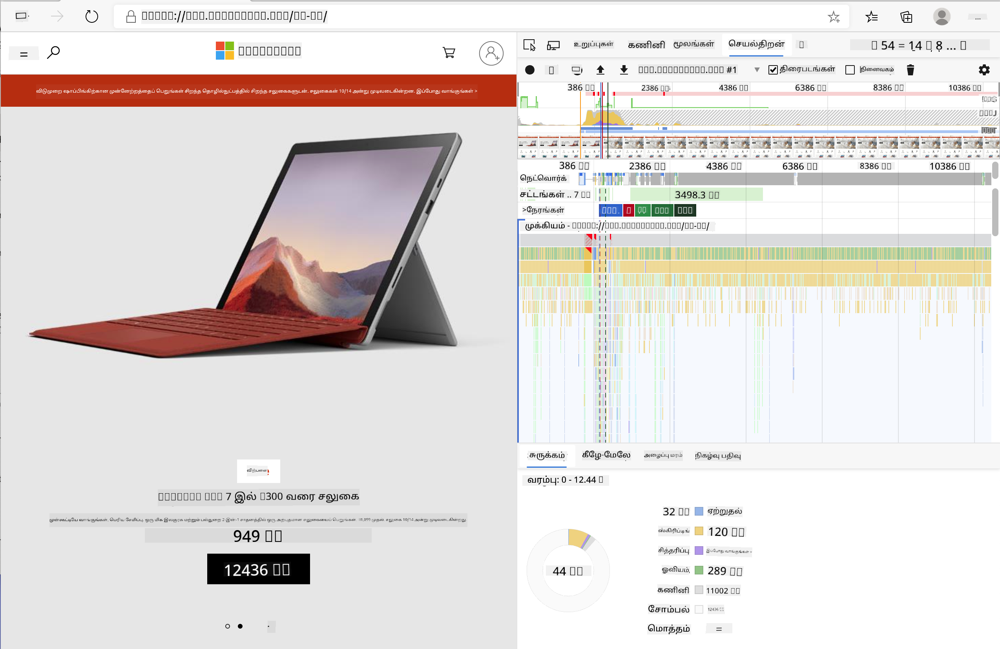
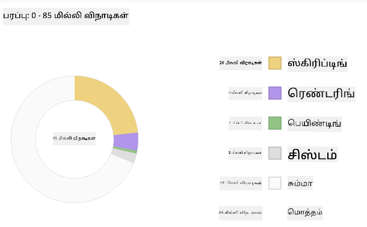
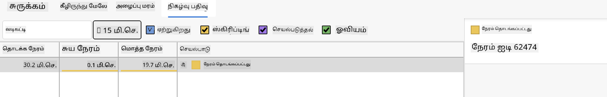

<!--
CO_OP_TRANSLATOR_METADATA:
{
  "original_hash": "b91cbf14240ee59411b96448b994ace1",
  "translation_date": "2025-10-11T12:18:11+00:00",
  "source_file": "5-browser-extension/3-background-tasks-and-performance/README.md",
  "language_code": "ta"
}
-->
# உலாவி நீட்டிப்பு திட்டம் பகுதி 3: பின்னணி பணிகள் மற்றும் செயல்திறனைப் பற்றி அறிக

## முன்-வகுப்பு வினாடி வினா

[முன்-வகுப்பு வினாடி வினா](https://ff-quizzes.netlify.app/web/quiz/27)

### அறிமுகம்

இந்த தொகுதியின் கடைசி இரண்டு பாடங்களில், API-இல் இருந்து தரவை பெறுவதற்கான ஒரு படிவம் மற்றும் காட்சிப் பகுதியை உருவாக்குவது எப்படி என்பதை நீங்கள் கற்றுக்கொண்டீர்கள். இது இணையத்தில் ஒரு வலைத்தளத்தை உருவாக்குவதற்கான மிகவும் வழக்கமான முறையாகும். மேலும், தரவை அசிங்கரமாகப் பெறுவது எப்படி என்பதை நீங்கள் கற்றுக்கொண்டீர்கள். உங்கள் உலாவி நீட்டிப்பு மிகவும் முடிவடையும் நிலையில் உள்ளது.

இப்போது, உலாவி நீட்டிப்பு ஐகானின் நிறத்தை புதுப்பிப்பதை உள்ளடக்கிய சில பின்னணி பணிகளை நிர்வகிக்க வேண்டும், எனவே உலாவி இந்த வகையான பணிகளை எப்படி நிர்வகிக்கிறது என்பதைப் பற்றி பேசுவதற்கான சிறந்த நேரம் இது. உங்கள் வலைத்தளத்தை உருவாக்கும் போது, உலாவி பணிகளை அதன் செயல்திறனின் அடிப்படையில் சிந்திக்கலாம்.

## வலை செயல்திறன் அடிப்படைகள்

> "வலைத்தள செயல்திறன் என்பது இரண்டு விஷயங்களைப் பற்றியது: பக்கம் எவ்வளவு வேகமாக ஏற்றப்படுகிறது, மற்றும் அதில் உள்ள குறியீடு எவ்வளவு வேகமாக இயங்குகிறது." -- [Zack Grossbart](https://www.smashingmagazine.com/2012/06/javascript-profiling-chrome-developer-tools/)

உங்கள் வலைத்தளங்களை அனைத்து வகையான சாதனங்களில், அனைத்து வகையான பயனர்களுக்கு, அனைத்து வகையான சூழல்களில் மிகவும் வேகமாக செயல்படச் செய்வது எப்படி என்பது பற்றிய தலைப்பு, எதிர்பாராதவிதமாக, பரந்தது. ஒரு வழக்கமான வலைத் திட்டம் அல்லது உலாவி நீட்டிப்பு உருவாக்கும் போது கவனிக்க வேண்டிய சில முக்கிய அம்சங்கள் இங்கே உள்ளன.

உங்கள் தளத்தின் செயல்திறன் திறம்பட இயங்குகிறது என்பதை உறுதிப்படுத்த முதலில் செய்ய வேண்டியது, அதன் செயல்திறன் பற்றிய தரவுகளைச் சேகரிப்பதாகும். இதற்கான முதல் இடம் உங்கள் வலை உலாவியின் டெவலப்பர் டூல்ஸ் ஆகும். Edge உலாவியில், "Settings and more" பொத்தானை (உலாவியின் மேல் வலது மூலையில் உள்ள மூன்று புள்ளிகள் ஐகான்) தேர்ந்தெடுத்து, More Tools > Developer Tools-க்கு செல்லவும் மற்றும் Performance tab-ஐ திறக்கவும். Windows-ல் `Ctrl` + `Shift` + `I` அல்லது Mac-ல் `Option` + `Command` + `I` என்ற விசைப்பலகை குறுக்குவழிகளைப் பயன்படுத்தி டெவலப்பர் டூல்ஸைத் திறக்கவும்.

Performance tab-ல் Profiling tool உள்ளது. ஒரு வலைத்தளத்தைத் திறக்கவும் (உதாரணமாக, [https://www.microsoft.com](https://www.microsoft.com/?WT.mc_id=academic-77807-sagibbon)) மற்றும் 'Record' பொத்தானை கிளிக் செய்யவும், பின்னர் தளத்தைப் புதுப்பிக்கவும். எந்த நேரத்திலும் பதிவு செய்ய நிறுத்தவும், பின்னர் 'script', 'render', மற்றும் 'paint' செய்யும் செயல்முறைகளைப் பார்க்க முடியும்:



✅ [Microsoft Documentation](https://docs.microsoft.com/microsoft-edge/devtools-guide/performance/?WT.mc_id=academic-77807-sagibbon) ஐ Edge-இல் உள்ள Performance panel பற்றிய தகவலுக்கு பார்வையிடவும்.

> குறிப்புகள்: உங்கள் வலைத்தளத்தின் தொடக்க நேரத்தை சரியாக அளவிட, உலாவியின் cache-ஐ அழிக்கவும்.

பக்கம் ஏற்றும்போது நிகழும் நிகழ்வுகளை நெருக்கமாகப் பார்க்க timeline-இல் உள்ள பகுதிகளைத் தேர்ந்தெடுக்கவும்.

Timeline-இல் ஒரு பகுதியைத் தேர்ந்தெடுத்து, summary pane-ஐப் பார்த்து உங்கள் பக்கத்தின் செயல்திறனின் ஒரு சுருக்கத்தைப் பெறவும்:



Event Log pane-ஐச் சரிபார்த்து, எந்த நிகழ்வு 15 ms-க்கு மேல் எடுத்ததா என்பதைப் பாருங்கள்:



✅ உங்கள் profiler-ஐ அறிந்து கொள்ளுங்கள்! இந்த தளத்தில் டெவலப்பர் டூல்ஸைத் திறக்கவும் மற்றும் bottlenecks உள்ளதா என்பதைப் பாருங்கள். எந்த resource மிகவும் மெதுவாக ஏற்றுகிறது? எந்த resource மிகவும் வேகமாக ஏற்றுகிறது?

## Profiling checks

பொதுவாக, ஒரு வலைத்தளத்தை உருவாக்கும் போது, deployment நேரத்தில் எதிர்பாராத பிரச்சனைகளைத் தவிர்க்க, ஒவ்வொரு வலை டெவலப்பரும் கவனிக்க வேண்டிய சில "பிரச்சனை பகுதிகள்" உள்ளன.

**Asset sizes**: கடந்த சில ஆண்டுகளில் வலை "கனரகமாக" மாறி, மெதுவாக மாறியுள்ளது. இந்த "கனரகத்தன்மை" சில அளவுக்கு படங்களின் பயன்பாட்டால் ஏற்படுகிறது.

✅ [Internet Archive](https://httparchive.org/reports/page-weight) ஐப் பார்வையிட்டு, பக்க எடை மற்றும் மேலும் பலவற்றின் வரலாற்று பார்வையைப் பெறவும்.

உங்கள் படங்கள் உங்கள் பயனர்களுக்கு சரியான அளவு மற்றும் தீர்மானத்தில் தகுந்தவாறு வழங்கப்படுவதை உறுதிப்படுத்துவது நல்ல நடைமுறையாகும்.

**DOM traversals**: உலாவி உங்கள் எழுதிய குறியீட்டின் அடிப்படையில் Document Object Model-ஐ உருவாக்க வேண்டும், எனவே உங்கள் பக்கத்தின் செயல்திறனை மேம்படுத்த, குறைந்த அளவிலான tags-களைப் பயன்படுத்துவது நல்லது. உதாரணமாக, ஒரு பக்கத்தில் மட்டுமே பயன்படுத்த வேண்டிய styles, முக்கிய style sheet-இல் சேர்க்கப்பட தேவையில்லை.

**JavaScript**: ஒவ்வொரு JavaScript டெவலப்பரும் 'render-blocking' scripts-களை கவனிக்க வேண்டும், ஏனெனில் அவை DOM-ஐ traverse மற்றும் paint செய்யும் முன் ஏற்றப்பட வேண்டும். உங்கள் inline scripts-களுடன் `defer` ஐப் பயன்படுத்தவும் (Terrarium module-ல் பயன்படுத்தப்பட்டது போல).

✅ [Site Speed Test website](https://www.webpagetest.org/) ஐப் பயன்படுத்தி, தள செயல்திறனை நிர்ணயிக்க பொதுவாக செய்யப்படும் சரிபார்ப்புகளைப் பற்றி மேலும் அறிய முயற்சிக்கவும்.

இப்போது உலாவி நீங்கள் அனுப்பும் resources-ஐ render செய்யும் விதத்தைப் பற்றி ஒரு கருத்து உங்களுக்கு வந்துவிட்டது, உங்கள் extension-ஐ முடிக்க நீங்கள் செய்ய வேண்டிய கடைசி சில விஷயங்களைப் பார்ப்போம்:

### நிறத்தை கணக்கிட ஒரு function உருவாக்கவும்

`/src/index.js`-ல், DOM-ஐ அணுகுவதற்கான `const` variables-களின் தொடரின் பின்னர் `calculateColor()` என்ற function-ஐ சேர்க்கவும்:

```JavaScript
function calculateColor(value) {
	let co2Scale = [0, 150, 600, 750, 800];
	let colors = ['#2AA364', '#F5EB4D', '#9E4229', '#381D02', '#381D02'];

	let closestNum = co2Scale.sort((a, b) => {
		return Math.abs(a - value) - Math.abs(b - value);
	})[0];
	console.log(value + ' is closest to ' + closestNum);
	let num = (element) => element > closestNum;
	let scaleIndex = co2Scale.findIndex(num);

	let closestColor = colors[scaleIndex];
	console.log(scaleIndex, closestColor);

	chrome.runtime.sendMessage({ action: 'updateIcon', value: { color: closestColor } });
}
```

இங்கே என்ன நடக்கிறது? நீங்கள் API call-ல் இருந்து பெறப்பட்ட ஒரு மதிப்பை (carbon intensity) pass செய்கிறீர்கள், பின்னர் அதன் மதிப்பு colors array-ல் உள்ள index-க்கு எவ்வளவு அருகில் உள்ளது என்பதை கணக்கிடுகிறீர்கள். பின்னர் அந்த மிக அருகிலுள்ள நிற மதிப்பை chrome runtime-க்கு அனுப்புகிறீர்கள்.

chrome.runtime-ல் [ஒரு API](https://developer.chrome.com/extensions/runtime) உள்ளது, இது அனைத்து வகையான பின்னணி பணிகளை நிர்வகிக்கிறது, மற்றும் உங்கள் extension அதை பயன்படுத்துகிறது:

> "chrome.runtime API-ஐப் பயன்படுத்தி பின்னணி பக்கம், manifest பற்றிய விவரங்களை return செய்யவும், மற்றும் app அல்லது extension lifecycle-இல் நிகழ்வுகளை கேட்டு பதிலளிக்கவும். URLs-இன் relative path-ஐ முழுமையாக-qualified URLs-ஆக மாற்ற இந்த API-ஐப் பயன்படுத்தலாம்."

✅ நீங்கள் Edge உலாவிக்காக இந்த உலாவி extension-ஐ உருவாக்குகிறீர்கள் என்றால், நீங்கள் chrome API-ஐப் பயன்படுத்துவது உங்களை ஆச்சரியப்படுத்தலாம். புதிய Edge உலாவி பதிப்புகள் Chromium உலாவி engine-ல் இயங்குகின்றன, எனவே நீங்கள் இந்த tools-ஐப் பயன்படுத்தலாம்.

> குறிப்புகள்: உலாவி extension-ஐ profile செய்ய விரும்பினால், extension-இன் dev tools-ஐ அதன் தனித்துவமான உலாவி instance-இல் இருந்து launch செய்யவும்.

### ஒரு default icon நிறத்தை அமைக்கவும்

இப்போது, `init()` function-இல், chrome-இன் `updateIcon` action-ஐ மீண்டும் அழைத்து, icon-ஐ ஆரம்பத்தில் பொதுவான பச்சை நிறமாக அமைக்கவும்:

```JavaScript
chrome.runtime.sendMessage({
	action: 'updateIcon',
		value: {
			color: 'green',
		},
});
```
### function-ஐ அழைக்கவும், call-ஐ செயல்படுத்தவும்

பின்னர், நீங்கள் உருவாக்கிய function-ஐ C02Signal API promise-இல் சேர்த்து அழைக்கவும்:

```JavaScript
//let CO2...
calculateColor(CO2);
```

முடிவாக, `/dist/background.js`-ல், இந்த பின்னணி action calls-க்கு listener-ஐ சேர்க்கவும்:

```JavaScript
chrome.runtime.onMessage.addListener(function (msg, sender, sendResponse) {
	if (msg.action === 'updateIcon') {
		chrome.action.setIcon({ imageData: drawIcon(msg.value) });
	}
});
//borrowed from energy lollipop extension, nice feature!
function drawIcon(value) {
	let canvas = new OffscreenCanvas(200, 200);
	let context = canvas.getContext('2d');

	context.beginPath();
	context.fillStyle = value.color;
	context.arc(100, 100, 50, 0, 2 * Math.PI);
	context.fill();

	return context.getImageData(50, 50, 100, 100);
}
```
இந்த code-ல், backend task manager-க்கு வரும் எந்த messages-க்கும் listener-ஐ நீங்கள் சேர்க்கிறீர்கள். அது 'updateIcon' என்று அழைக்கப்பட்டால், Canvas API-ஐப் பயன்படுத்தி சரியான நிறத்தில் icon-ஐ draw செய்யும் code அடுத்ததாக இயங்கும்.

✅ [Space Game lessons](../../6-space-game/2-drawing-to-canvas/README.md) இல் Canvas API பற்றி மேலும் அறியலாம்.

இப்போது, உங்கள் extension-ஐ மீண்டும் build செய்யவும் (`npm run build`), refresh செய்து உங்கள் extension-ஐ launch செய்யவும், மற்றும் நிறம் மாறுவதைப் பாருங்கள். இது errands செய்ய அல்லது பாத்திரங்கள் கழுவ நல்ல நேரமா? இப்போது உங்களுக்கு தெரியும்!

வாழ்த்துக்கள், நீங்கள் ஒரு பயனுள்ள உலாவி extension-ஐ உருவாக்கி, உலாவி எப்படி செயல்படுகிறது மற்றும் அதன் செயல்திறனை எப்படி profile செய்வது என்பதைப் பற்றி மேலும் கற்றுக்கொண்டீர்கள்.

---

## 🚀 சவால்

நீண்ட காலமாக இருந்த சில திறந்த மூல வலைத்தளங்களை ஆராய்ந்து, அவை செயல்திறனுக்காக ஆண்டுகளாக எப்படி மேம்படுத்தப்பட்டன என்பதை GitHub வரலாற்றின் அடிப்படையில் கண்டறிய முயற்சிக்கவும். மிகவும் பொதுவான பிரச்சனை என்ன?

## வகுப்புக்குப் பின் வினாடி வினா

[வகுப்புக்குப் பின் வினாடி வினா](https://ff-quizzes.netlify.app/web/quiz/28)

## மதிப்பீடு & சுயபடிப்பு

[performance newsletter](https://perf.email/) க்கு பதிவு செய்ய பரிசீலிக்கவும்.

உலாவிகள் வலை செயல்திறனை எப்படி அளவிடுகின்றன என்பதை அவர்களின் web tools-இல் உள்ள performance tabs-ஐப் பார்வையிட்டு ஆராயவும். எந்த முக்கிய வேறுபாடுகளை நீங்கள் கண்டுபிடிக்கிறீர்கள்?

## பணிக்கூற்று

[தள செயல்திறனை பகுப்பாய்வு செய்யவும்](assignment.md)

---

**குறிப்பு**:  
இந்த ஆவணம் [Co-op Translator](https://github.com/Azure/co-op-translator) என்ற AI மொழிபெயர்ப்பு சேவையைப் பயன்படுத்தி மொழிபெயர்க்கப்பட்டுள்ளது. நாங்கள் துல்லியத்திற்காக முயற்சிக்கின்றோம், ஆனால் தானியங்கி மொழிபெயர்ப்புகளில் பிழைகள் அல்லது தவறான தகவல்கள் இருக்கக்கூடும் என்பதை கவனத்தில் கொள்ளவும். அதன் தாய்மொழியில் உள்ள மூல ஆவணம் அதிகாரப்பூர்வ ஆதாரமாக கருதப்பட வேண்டும். முக்கியமான தகவல்களுக்கு, தொழில்முறை மனித மொழிபெயர்ப்பு பரிந்துரைக்கப்படுகிறது. இந்த மொழிபெயர்ப்பைப் பயன்படுத்துவதால் ஏற்படும் எந்த தவறான புரிதல்கள் அல்லது தவறான விளக்கங்களுக்கு நாங்கள் பொறுப்பல்ல.