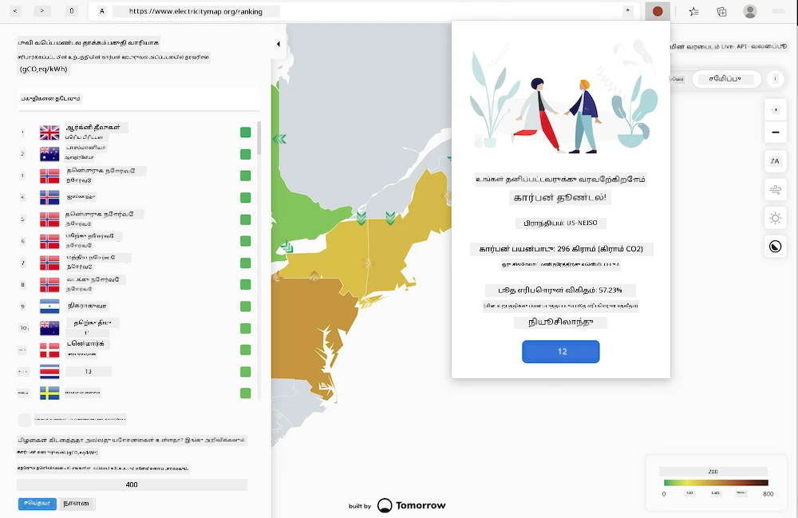

# உலாவி நீட்டிப்பு உருவாக்குதல்

உலாவி நீட்டிப்புகளை உருவாக்குவது உங்கள் பயன்பாடுகளின் செயல்திறனைப் பற்றி சிந்திக்க ஒரு வேடிக்கையான மற்றும் சுவாரஸ்யமான வழியாகும், மேலும் ஒரு வித்தியாசமான வகையான வலைச் சொத்துகளை உருவாக்குவதற்கான அனுபவமாகும். இந்த தொகுதி உலாவிகள் எப்படி வேலை செய்கின்றன, உலாவி நீட்டிப்பை எப்படி வெளியிடுவது, ஒரு படிவத்தை உருவாக்குவது, API-ஐ அழைப்பது, உள்ளூர் சேமிப்பகத்தைப் பயன்படுத்துவது, உங்கள் வலைத்தளத்தின் செயல்திறனை மதிப்பீடு செய்வது மற்றும் அதை மேம்படுத்துவது போன்ற பாடங்களை உள்ளடக்கியது.

நீங்கள் Edge, Chrome, மற்றும் Firefox-ல் வேலை செய்யும் ஒரு உலாவி நீட்டிப்பை உருவாக்குவீர்கள். இந்த நீட்டிப்பு, ஒரு குறிப்பிட்ட பணிக்காக வடிவமைக்கப்பட்ட ஒரு சிறிய வலைத்தளத்தைப் போன்றது, [C02 Signal API](https://www.co2signal.com)-ஐ ஒரு குறிப்பிட்ட பிராந்தியத்தின் மின்சார பயன்பாடு மற்றும் கார்பன் தீவிரத்தை சரிபார்க்கிறது, மேலும் அந்த பிராந்தியத்தின் கார்பன் பாதிப்பை அளவிடும்.

இந்த நீட்டிப்பு, ஒரு API விசை மற்றும் பிராந்திய குறியீடு ஒரு படிவத்தில் உள்ளீடு செய்யப்பட்ட பிறகு, ஒரு பயனர் மூலம் தற்செயலாக அழைக்கப்படலாம். இது உள்ளூர் மின்சார பயன்பாட்டைத் தீர்மானிக்க உதவுகிறது, மேலும் ஒரு பயனரின் மின்சார முடிவுகளை பாதிக்கக்கூடிய தரவுகளை வழங்குகிறது. உதாரணமாக, உங்கள் பிராந்தியத்தில் அதிக மின்சார பயன்பாட்டின் போது ஒரு துணி உலர்த்தியை இயக்குவதை (ஒரு கார்பன்-தீவிர செயல்பாடு) தாமதப்படுத்துவது விரும்பத்தக்கதாக இருக்கலாம்.

### தலைப்புகள்

1. [உலாவி பற்றி](1-about-browsers/README.md)
2. [படிவங்கள் மற்றும் உள்ளூர் சேமிப்பகம்](2-forms-browsers-local-storage/README.md)
3. [பின்னணி பணிகள் மற்றும் செயல்திறன்](3-background-tasks-and-performance/README.md)

### க்ரெடிட்ஸ்

## க்ரெடிட்ஸ்

இந்த வலை கார்பன் டிரிகர் யோசனையை Microsoft-இல் Green Cloud Advocacy குழுவின் தலைவரும் [Green Principles](https://principles.green/) என்ற புத்தகத்தின் ஆசிரியருமான அசிம் ஹுசைன் வழங்கினார். இது முதலில் ஒரு [வலைத்தள திட்டமாக](https://github.com/jlooper/green) இருந்தது.

உலாவி நீட்டிப்பின் அமைப்பு [அடேபோலா அடெனிரனின் COVID நீட்டிப்பு](https://github.com/onedebos/covtension) மூலம் பாதிக்கப்பட்டது.

'டாட்' ஐகான் அமைப்பின் கருத்து [Energy Lollipop](https://energylollipop.com/) உலாவி நீட்டிப்பின் ஐகான் அமைப்பால் பரிந்துரைக்கப்பட்டது, இது கலிபோர்னியா வெளியீடுகளுக்காக உருவாக்கப்பட்டது.

இந்த பாடங்கள் ♥️ உடன் [ஜென் லூப்பர்](https://www.twitter.com/jenlooper) மூலம் எழுதப்பட்டவை.

---

**குறிப்பு**:  
இந்த ஆவணம் [Co-op Translator](https://github.com/Azure/co-op-translator) என்ற AI மொழிபெயர்ப்பு சேவையைப் பயன்படுத்தி மொழிபெயர்க்கப்பட்டுள்ளது. நாங்கள் துல்லியத்திற்காக முயற்சிக்கின்றோம், ஆனால் தானியக்க மொழிபெயர்ப்புகளில் பிழைகள் அல்லது தவறான தகவல்கள் இருக்கக்கூடும் என்பதை தயவுசெய்து கவனத்தில் கொள்ளவும். அதன் தாய்மொழியில் உள்ள மூல ஆவணம் அதிகாரப்பூர்வ ஆதாரமாக கருதப்பட வேண்டும். முக்கியமான தகவல்களுக்கு, தொழில்முறை மனித மொழிபெயர்ப்பு பரிந்துரைக்கப்படுகிறது. இந்த மொழிபெயர்ப்பைப் பயன்படுத்துவதால் ஏற்படும் எந்த தவறான புரிதல்கள் அல்லது தவறான விளக்கங்களுக்கு நாங்கள் பொறுப்பல்ல.