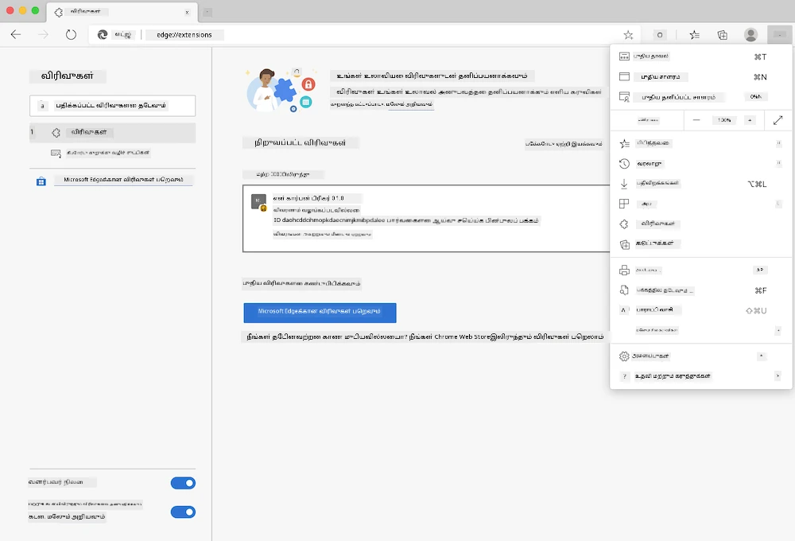

<!--
CO_OP_TRANSLATOR_METADATA:
{
  "original_hash": "dd58ae1b7707034f055718c1b68bc8de",
  "translation_date": "2025-10-11T12:17:40+00:00",
  "source_file": "5-browser-extension/solution/translation/README.hi.md",
  "language_code": "ta"
}
-->
# கார்பன் டிரிகர் உலாவி நீட்டிப்பு: முடிக்கப்பட்ட குறியீடு

மின்சார பயன்பாட்டை கண்காணிக்க tmrow இன் C02 சிக்னல் API ஐப் பயன்படுத்தி, உலாவியில் உங்கள் பகுதியில் மின்சார பயன்பாடு எவ்வளவு அதிகமாக உள்ளது என்பதை நினைவூட்டும் ஒரு உலாவி நீட்டிப்பை உருவாக்குதல். இந்த நீட்டிப்பைப் பயன்படுத்துவதன் மூலம், இந்த தகவலின் அடிப்படையில் உங்கள் செயல்பாடுகளை முடிவு செய்ய உதவுகிறது.


## தொடங்குதல்

நீங்கள் [npm](https://npmjs.com) ஐ நிறுவ வேண்டும். உங்கள் கணினியில் ஒரு கோப்பகத்தில் இந்த குறியீட்டின் ஒரு பிரதியை பதிவிறக்கவும்.

அனைத்து தேவையான தொகுதிகளை நிறுவவும்:

```
npm install
```

வெப்பேக் மூலம் நீட்டிப்பை உருவாக்கவும்

```
npm run build
```

Edge உலாவியில் நிறுவ, உலாவியின் மேல் வலது மூலையில் உள்ள 'மூன்று புள்ளி' மெனுவைப் பயன்படுத்தி நீட்டிப்பு குழுவைத் தேடவும். அங்கு, ஒரு புதிய நீட்டிப்பை ஏற்ற 'Load Unpacked' ஐத் தேர்ந்தெடுக்கவும். ப்ராம்ப்டில் 'dist' கோப்பகத்தைத் திறக்கவும், நீட்டிப்பு ஏற்றப்படும். இதைப் பயன்படுத்த, CO2 சிக்னல் API ([மின்னஞ்சல் மூலம் இங்கே பெறவும்](https://www.co2snal.com/) API விசையுடன் - இந்த பக்கத்தில் உள்ள பெட்டியில் உங்கள் மின்னஞ்சலை உள்ளிடவும்) மற்றும் [உங்கள் பகுதியில் உள்ள குறியீடு](http://api.electricitymap.org/v3/zones) [மின்சார வரைபடம்](https://www.electricitymap.org/map) (உதாரணமாக, Boston இல், நான் 'US-NEISO' ஐப் பயன்படுத்துகிறேன்).



API விசை மற்றும் பகுதி நீட்டிப்பு இடைமுகத்தில் உள்ளீடு செய்யப்பட்ட பிறகு, உலாவி நீட்டிப்பு பட்டையில் உள்ள வண்ண புள்ளி உங்கள் பகுதியில் உள்ள ஆற்றல் பயன்பாட்டை பிரதிபலிக்க மாற்ற வேண்டும், மேலும் ஆற்றல்-அதிக செயல்பாடுகள் உங்கள் செயல்பாட்டுக்கு ஏற்றதா என்பதை ஒரு குறிகாட்டி வழங்க வேண்டும். இந்த 'புள்ளி' முறையின் பின்னால் உள்ள கருத்து எனக்கு கலிபோர்னியா உமிழ்வுகளுக்கான [Energy Lollipop Extension](https://energylollipop.com/) மூலம் கிடைத்தது.

---

**குறிப்பு**:  
இந்த ஆவணம் [Co-op Translator](https://github.com/Azure/co-op-translator) என்ற AI மொழிபெயர்ப்பு சேவையை பயன்படுத்தி மொழிபெயர்க்கப்பட்டுள்ளது. எங்கள் நோக்கம் துல்லியமாக இருக்க வேண்டும் என்பதுதான், ஆனால் தானியங்கி மொழிபெயர்ப்புகளில் பிழைகள் அல்லது துல்லியமின்மைகள் இருக்கக்கூடும் என்பதை தயவுசெய்து கவனத்தில் கொள்ளவும். அதன் தாய்மொழியில் உள்ள மூல ஆவணம் அதிகாரப்பூர்வ ஆதாரமாக கருதப்பட வேண்டும். முக்கியமான தகவல்களுக்கு, தொழில்முறை மனித மொழிபெயர்ப்பு பரிந்துரைக்கப்படுகிறது. இந்த மொழிபெயர்ப்பைப் பயன்படுத்துவதால் ஏற்படும் எந்த தவறான புரிதல்கள் அல்லது தவறான விளக்கங்களுக்கு நாங்கள் பொறுப்பல்ல.