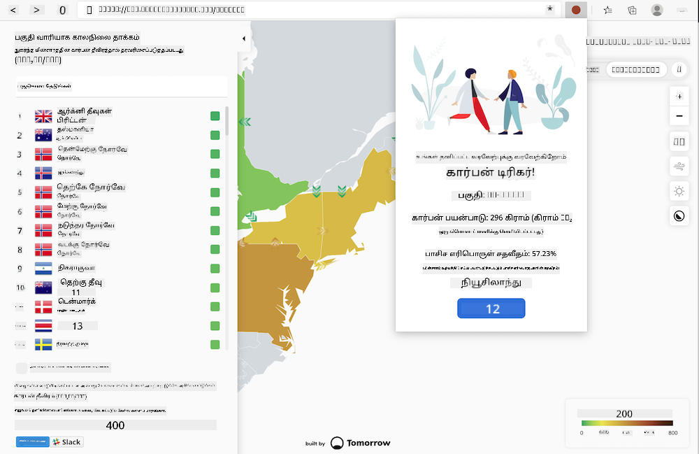
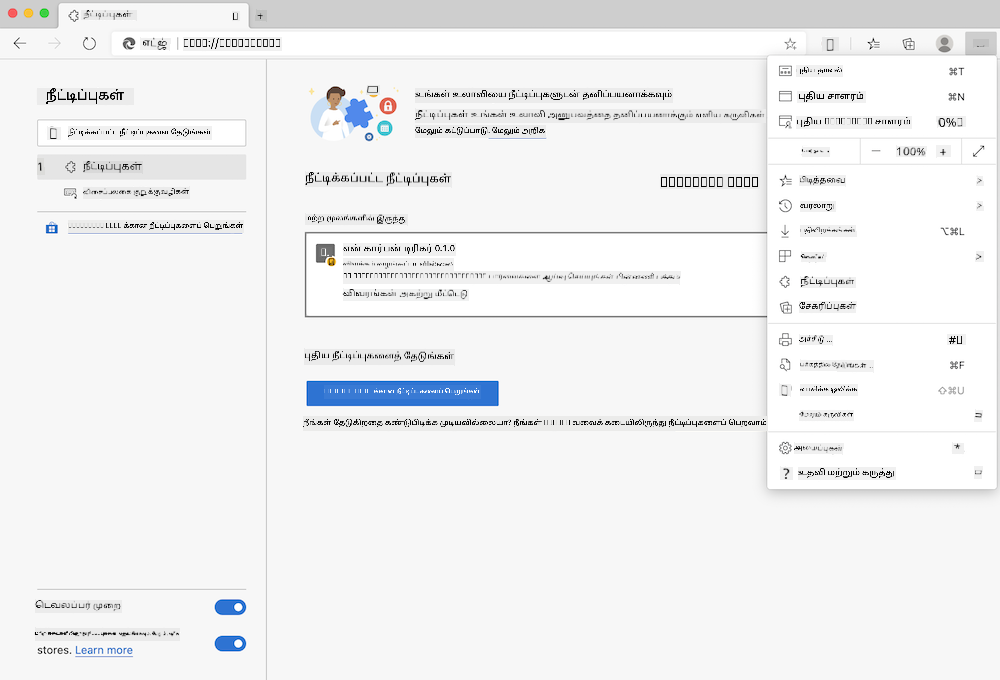

<!--
CO_OP_TRANSLATOR_METADATA:
{
  "original_hash": "3f5e6821e0febccfc5d05e7c944d9e3d",
  "translation_date": "2025-10-11T12:17:56+00:00",
  "source_file": "5-browser-extension/solution/translation/README.ja.md",
  "language_code": "ta"
}
-->
# கார்பன் டிரிகர் உலாவி நீட்டிப்பு: முடிக்கப்பட்ட குறியீடு

tmrow இன் CO2 சிக்னல் API ஐப் பயன்படுத்தி, உங்கள் பகுதியில் உள்ள மின்சார பயன்பாட்டின் அளவை உலாவியில் நினைவூட்டியாகக் காட்டும் நீட்டிப்பை உருவாக்குவோம். இந்த நீட்டிப்பை தற்காலிகமாகப் பயன்படுத்துவதன் மூலம், இந்த தகவலின் அடிப்படையில் உங்கள் செயல்பாடுகளை முடிவு செய்யலாம்.



## தொடக்கக்கட்டம்

[npm](https://npmjs.com) நிறுவப்பட்டிருக்க வேண்டும். இந்த குறியீட்டின் நகலை உங்கள் கணினியில் உள்ள ஒரு கோப்பகத்தில் பதிவிறக்கவும்.

தேவையான அனைத்து தொகுப்புகளையும் நிறுவவும்.

```
npm install
```

webpack மூலம் நீட்டிப்பை உருவாக்கவும்.

```
npm run build
```

Edge உலாவியில் நிறுவ, உலாவியின் வலது மேல் மூலையில் உள்ள "மூன்று புள்ளிகள்" மெனுவில் "Extensions" பானலைத் தேடவும். அங்கு "Load Unpacked" ஐத் தேர்ந்தெடுத்து புதிய நீட்டிப்பை ஏற்றவும். உத்தரவாதத்தில் "dist" கோப்பகத்தைத் திறக்கவும், நீட்டிப்பு ஏற்றப்படும். பயன்படுத்த, CO2 சிக்னல் API க்கான API கீ ([இங்கே மின்னஞ்சல் மூலம் பெறவும்](https://www.co2signal.com/) - இந்த பக்கத்தில் உள்ள பெட்டியில் உங்கள் மின்னஞ்சலை உள்ளிடவும்) மற்றும் [Electricity Map](https://www.electricitymap.org/map) உடன் பொருந்தும் [உங்கள் பகுதியின் குறியீடு](http://api.electricitymap.org/v3/zones) தேவை (பாஸ்டனில், உதாரணமாக, 'US-NEISO' பயன்படுத்தப்படுகிறது).



API கீ மற்றும் பகுதியை நீட்டிப்பு இடைமுகத்தில் உள்ளிடும் போது, உலாவி நீட்டிப்பு பட்டையில் தோன்றும் வண்ண புள்ளி மாறும். இது உங்கள் பகுதியின் மின்சார பயன்பாட்டை பிரதிபலிக்கிறது மற்றும் எந்த வகையான மின்சாரத்தை தேவைப்படும் செயல்பாடுகளைச் செய்யலாம் என்பதை காட்டுகிறது. இந்த "புள்ளி" அமைப்பின் கருத்து, கலிபோர்னியாவின் வெளியீடுகளுக்கான [Energy Lollipop extension](https://energylollipop.com/) எனக்கு அளித்தது.

---

**குறிப்பு**:  
இந்த ஆவணம் AI மொழிபெயர்ப்பு சேவை [Co-op Translator](https://github.com/Azure/co-op-translator) பயன்படுத்தி மொழிபெயர்க்கப்பட்டுள்ளது. எங்கள் துல்லியத்திற்கான முயற்சிகளுக்கு மத்தியில், தானியங்கி மொழிபெயர்ப்புகளில் பிழைகள் அல்லது தவறான தகவல்கள் இருக்கக்கூடும் என்பதை கவனத்தில் கொள்ளவும். அதன் தாய்மொழியில் உள்ள மூல ஆவணம் அதிகாரப்பூர்வ ஆதாரமாக கருதப்பட வேண்டும். முக்கியமான தகவல்களுக்கு, தொழில்முறை மனித மொழிபெயர்ப்பு பரிந்துரைக்கப்படுகிறது. இந்த மொழிபெயர்ப்பைப் பயன்படுத்துவதால் ஏற்படும் எந்த தவறான புரிதல்கள் அல்லது தவறான விளக்கங்களுக்கு நாங்கள் பொறுப்பல்ல.