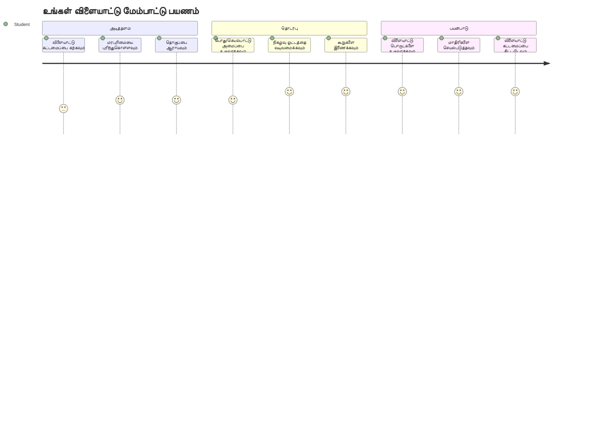
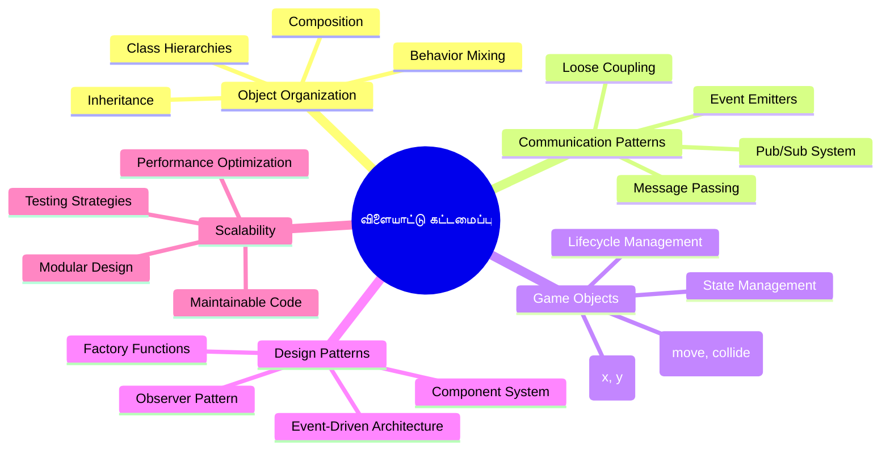
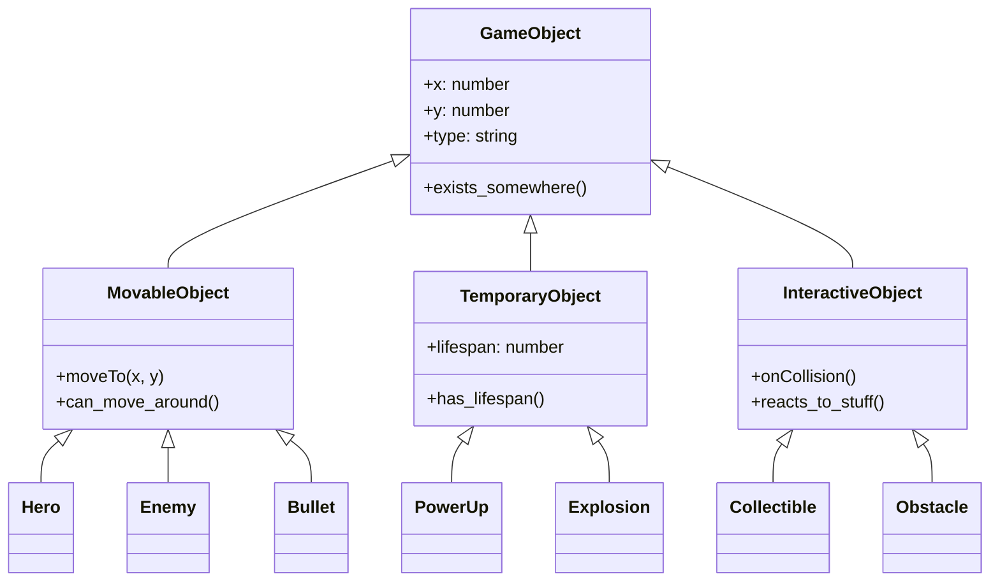
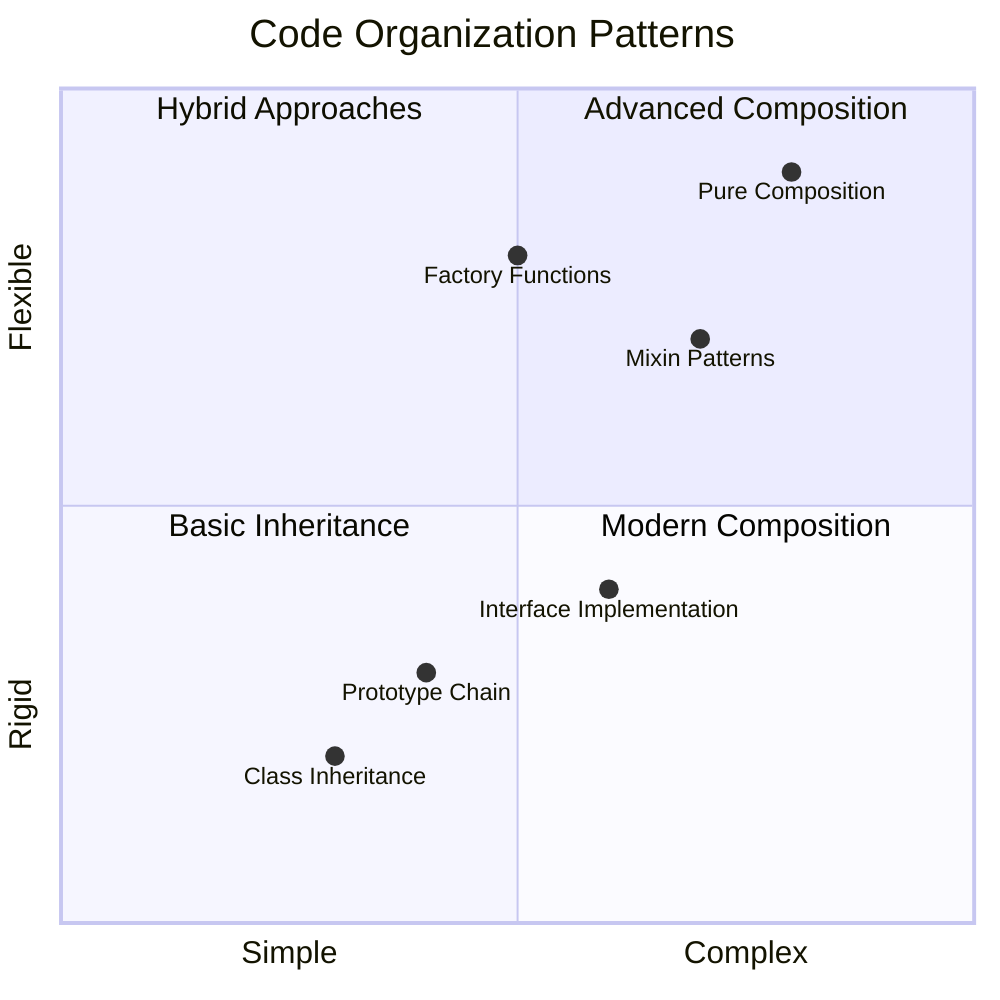
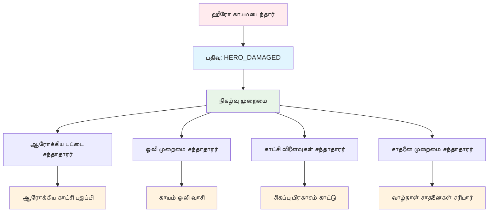
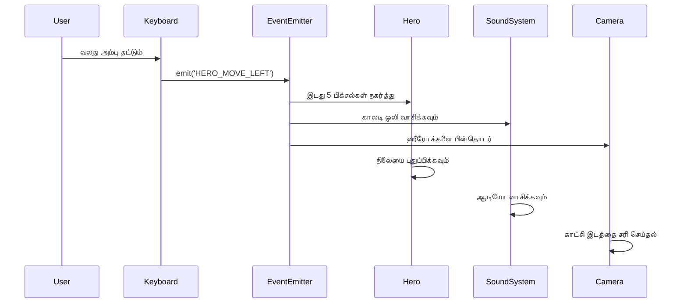
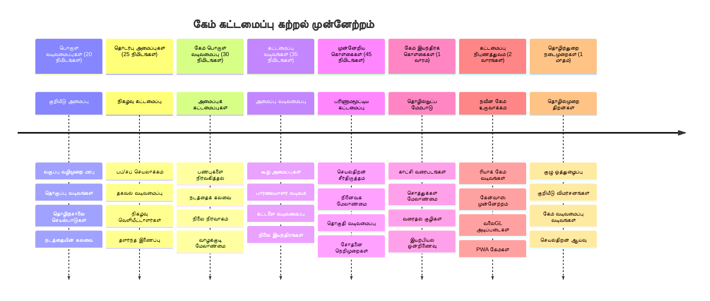

# விண்வெளி விளையாட்டு உருவாக்குதல் பகுதி 1: அறிமுகம்




நாசாவின் பயணம் கட்டுப்பாடுகள் பல்வேறு அமைப்புகளை ஒருங்கிணைக்கும் மாதிரி, நம் வெளியான ஒரு விண்வெளி விளையாட்டை உருவாக்கப்போகிறோம். இது எப்படி நிகழ்த்தப்படும் என்பது பற்றி புரிந்துகொள்ளும் போது, ஒரு சிக்கலான நிரலின் பல பகுதிகள் ஒருங்கிணைந்து செயல்படுகிறது என்பதை காணலாம். நீங்கள் விளையாடக்கூடிய ஒன்றை உருவாக்கும் போது, எந்த சாப்ட்வேர் திட்டத்திற்கும் பொருந்தும் முக்கியமான நிரல் கருத்துக்களை நீங்கள் கற்கப்போகிறீர்கள்.

நாம் இரண்டு அடிப்படை நிரல் அமைப்பு முறைகளை ஆராயப்போகிறோம்: நிரல்படிச்செயல் (inheritance) மற்றும் தொகுப்பு (composition). இவை கல்வி துறையில் மட்டுமின்றி—வீடியோ விளையாட்டுகள் முதல் வங்கிச் சேவைகள் வரை அனைத்துக்கும் பயன்படுத்தப்படும் மாதிரிகளே ஆகும். இன்னும், விண்வெளிयानங்களில் பயன்படுத்தப்படும் தகவல் பரிமாற்ற அமைப்பைப் போன்று செயல்படும் பப்/சப் (pub/sub) தொழில்நுட்பத்தையும் செயல்படுத்தப்போகிறோம், இது பிரிவுகள் நேரடியாகச் சார்ந்திராமல் தகவல் பகிருவதற்கு உதவுகிறது.

இந்த தொடரின் முடிவில், உங்களுக்குத் தேவையான அளவிற்கு விரிவாக்கப்படக்கூடிய மற்றும் வளரக்கூடிய பயன்பாடுகளை உருவாக்குவது எப்படி என்பதை புரிந்து கொள்வீர்கள்—விளையாட்டுகள், வலை பயன்பாடுகள் அல்லது ஏதேனும் மற்ற எந்த சாப்ட்வேர் அமைப்பு ஆனாலும்.


## முன்னுரையுரை வினாடி வினா

[முன்னுரை வினாடி வினா](https://ff-quizzes.netlify.app/web/quiz/29)

## விளையாட்டு உருவாக்கத்தில் நிரல்படிச்செயல் மற்றும் தொகுப்பு

திட்டங்கள் சிக்கலாக இருந்தால், குறியீடுகளை நிர்வகிப்பது மிகவும் அவசியமாகிறது. எளிய ஸ்கிரிப்ட் எனத் தொடங்குவதும், அவற்றின் அமைப்பு இல்லாமல் பராமரிப்பது கடினமாகலாம்—அதற்குப் போலவே அபோலோ பயணங்கள் ஆயிரக்கணக்கான கூறுகளுக்கு இடையில் நுட்ப பணிகளை தேவையாக வைத்தன.

நாம் நிரல்படிச்செயல் மற்றும் தொகுப்பை ஆராயப்போகிறோம். இவை இரண்டும் தனித்துவமான நன்மைகள் கொண்டவை, இரண்டும் புரிந்து கொள்வதும், நிலைமைக்கு ஏற்ப சரியான அணுகுமுறையைத் தேர்வு செய்வதும் உதவும். நம் விண்வெளி விளையாட்டின் உதவியுடன், ஹீரோக்கள், எதிரிகளும், சக்தி அதிகரிப்புகள் மற்றும் மற்றுபொருட்கள் எFFICIENT ஆக பரஸ்பரம் தொடர்பு கொள்ள வேண்டும்.

✅ மிகவும் பிரபலமான நிரல்முறை புத்தகங்களில் ஒன்று [டிசைன் மாதிரிகள்](https://en.wikipedia.org/wiki/Design_Patterns) பற்றி தான்.

ஒவ்வொரு விளையாட்டிலும், `விளையாட்டு பொருட்கள்` இருக்கும்—நீங்கள் விளையாட்டு உலகில் காணும் அதிபதிகள். ஹீரோக்கள், எதிரிகள், சக்தி அதிகரிப்புகள் மற்றும் காட்சிப்பயன்கள் அனைத்தும் விளையாட்டு பொருட்கள் ஆகும். ஒவ்வொன்றும் சில இடைவெளியுடன் `x` மற்றும் `y` மதிப்புகளைக் கொண்டு இருக்கும், இது ஒரு வெவ்வேறு புள்ளிகளையே படம் வரைபடத்தில் வரைந்து காட்டும் மாதிரி ஆகும்.

இவை காண்பில் வித்தியாசமானாலும், பல நேரங்களில் அடிப்படையான நடத்தை ஒன்றை பகிர்ந்து கொள்கின்றன:

- **வீண்டுள்ளது** – ஒவ்வொரு பொருளிற்கும் x, y இடங்களைக் கொண்டது, இதனால் விளையாட்டில் அதை வரைபடம் காட்ட முடிகிறது
- **பலர் இடமாற்றம் செய்ய முடியும்** – ஹீரோக்கள் ஓடுகிறார்கள், எதிரிகள் பின்தொடர்கிறார்கள், வேட்டையாடும் தொட்டிகள் திரையைக் கடந்து பறக்கின்றன
- **அவர்கள் ஆயுள் கொண்டவர்கள்** – சில நிரந்தரமாக இருக்கின்றனர்; மற்றவை (எ.கா. வெடிப்புகள்) உடனடியாக தோன்றியும் மறைவூடும்
- **அவர்கள் எதிர்வினை செலுத்துகின்றனர்** – விஷயங்கள் தாக்கும்போது, சக்தி அதிகரிப்புகள் சேகரிக்கபடும்போது, ஆரோக்கியப் பட்டை புதுப்பிக்கப்படும்

✅ பாக்-மேன் போன்ற விளையாட்டை யோசிக்கவும். நீங்கள் மேலேயுள்ள நான்கு பொருள் வகைகளை அங்கு காண்கின்றீர்களா?


### நடத்தை நிரலில் வெளிப்படுத்தல்

விளையாட்டு பொருட்கள் பகிரும் பொதுவான நடத்தை புரிந்துகொண்ட பிறகு, அவற்றை JavaScript மூலமாக எவ்வாறு செயற்படுத்துவது என்பதை பார்க்கலாம். நீங்கள் நடைமுறைகள் (methods) மூலம், வகுப்புகளோ அல்லது தனிப்பட்ட பொருட்கள் மூலம் நடத்தை வெளிப்படுத்த முடியும், பல வழிமுறைகள் உள்ளன.

**வகுப்பு அடிப்படையிலான அணுகுமுறை**

வகுப்புகளும் நிரல்படிச்செயலும் விளையாட்டு பொருட்களை அமைப்பதில் அமைதியான முறையை வழங்குகின்றன. காலின் லினேஸ் உருவாக்கிய வகைப்பாடு முறையைப் போலவே, அடிப்படையாக ஒரு வகுப்பை உருவாக்கி அதில் பொதுவான பண்புகளைச் சேர்த்துக் கொண்டு, பிறகு சிறப்பு வகுப்புகளை உருவாக்கி அவற்றில் மேலதிக செயல்பாடுகளைச் சேர்க்கலாம்.

✅ inheritance பற்றி அதிகம் அறிய [MDN இல் inheritance பற்றி கட்டுரை](https://developer.mozilla.org/docs/Web/JavaScript/Inheritance_and_the_prototype_chain).

வகுப்பு மற்றும் inheritance பயன்படுத்தி விளையாட்டு பொருட்கள் இவ்வாறு செயல்படுத்தப்படுகின்றன:

```javascript
// படி 1: அடிப்படை GameObject வகுப்பை உருவாக்குங்கள்
class GameObject {
  constructor(x, y, type) {
    this.x = x;
    this.y = y;
    this.type = type;
  }
}
```

**இதனை படி படியாக பிரிப்போம்:**
- ஒவ்வொரு விளையாட்டு பொருளும் பயன்படுத்தக்கூடிய அடிப்படை வார்ப்புரு உருவாக்கப்படுகிறது
- கட்டமைப்பாளர் (constructor) எங்கு உள்ளது (`x`, `y`) மற்றும் அது என்ன வகை என்பதைக் சேமிக்கின்றது
- இதுவே அனைத்து விளையாட்டு பொருட்கள் கட்டப்பட வேண்டிய அடித்தளம் ஆகிறது

```javascript
// படி 2: மரபுவழியாக இயக்கும் திறனைக் கூட்டவும்
class Movable extends GameObject {
  constructor(x, y, type) {
    super(x, y, type); // பெற்றோர் கட்டமைப்பரை அழைக்கவும்
  }

  // புதிய இடத்திற்கு நகரும் திறனைச் சேர்க்கவும்
  moveTo(x, y) {
    this.x = x;
    this.y = y;
  }
}
```

**மேலுள்ள உதாரணத்தில்:**
- GameObject வகுப்பை விரிவுசெய்து இயக்கம் செயல்பாடுகளை சேர்த்தோம்
- பெற்றோர் கட்டமைப்பாளரை `super()` பயன்படுத்தி இயங்க வைக்கப்பட்டது
- பொருளின் இடத்தை புதுப்பிக்கும் `moveTo()` முறையைச் சேர்த்தோம்

```javascript
// படி 3: குறிப்பிட்ட விளையாட்டு பொருள் வகைகள் உருவாக்கவும்
class Hero extends Movable {
  constructor(x, y) {
    super(x, y, 'Hero'); // வகையை தானாக அமைக்கவும்
  }
}

class Tree extends GameObject {
  constructor(x, y) {
    super(x, y, 'Tree'); // மரங்களுக்கு நகர்வு தேவையில்லை
  }
}

// படி 4: உங்கள் விளையாட்டு பொருட்களை பயன்படுத்தவும்
const hero = new Hero(0, 0);
hero.moveTo(5, 5); // ஹீரோ நகர முடியும்!

const tree = new Tree(10, 15);
// tree.moveTo() பிழை ஏற்படுத்தும் - மரங்கள் நகர முடியாது
```

**இந்த கருத்துக்களை புரிந்துகொள்வது:**
- சரியான நடத்தை பெறும் சிறப்பு வகுப்புகளை உருவாக்குகிறது
- inheritance மூலம் சிறப்பான அம்சங்களை தேர்வுசெய்து சேர்க்க முடியும் என்பதை காண்பிக்கும்
- ஹீரோக்கள் இடமாற்றம் செய்ய முடியும், மரங்கள் அசையாது என்பதை விளக்குகிறது
- வகுப்பு மரபியல் தவறான நடவடிக்கைகளை தவிர்க்க உதவுகிறது

✅ பாக்-மேன் ஹீரோக்களை (இன்கி, பிங்கி, பிளிங்கி போன்றவை) மீண்டும் JavaScript மூலமாக எழுதியால் எப்படி இருக்கும் என யோசிக்கவும்.

**தொகுப்பு (Composition) அணுகுமுறை**

தொகுப்பு என்பது ஒரு மொடுலார் வடிவமைப்பு சிந்தனையை பின்பற்றுகிறது, விண்வெளி যানங்களில் மாற்றக்கூடிய கூறுகளை வடிவமைக்கும் முறையைப் போலவே. பெற்றோர் வகுப்பிலிருந்து inheritance செய்வதற்கு பதிலாக, தேவையான நடத்தை ஒன்றிணைத்துப் பொருட்களை உருவாக்குதல் ஆகும். இந்த அணுகுமுறை உறுதிப்படுத்தப்பட்ட மரபியல் கட்டுப்பாடுகளற்ற தாற்காலிக தன்மையை வழங்குகிறது.

```javascript
// படி 1: அடிப்படை நடத்தை பொருட்களை உருவாக்கவும்
const gameObject = {
  x: 0,
  y: 0,
  type: ''
};

const movable = {
  moveTo(x, y) {
    this.x = x;
    this.y = y;
  }
};
```

**இந்தக் குறியீடு என்ன செய்கிறது:**
- இடம் மற்றும் வகை பண்புகளை கொண்ட அடிப்படை `gameObject` ஐ வரையறுக்கிறது
- இயக்க செயல்பாட்டைக் கொண்ட தனித்த `movable` நடத்தைப் பொருளை உருவாக்குகிறது
- இடம் தொடர்பான தரவு மற்றும் இயக்க பாடலை தனித்தனியாக வைக்கிறது

```javascript
// படி 2: நடத்தைகளை இணைத்து பொருட்களை உருவாக்குக
const movableObject = { ...gameObject, ...movable };

// படி 3: மாற்று பொருள் வகைகளுக்கான தொழிற்சாலை செயல்பாடுகளை உருவாக்குக
function createHero(x, y) {
  return {
    ...movableObject,
    x,
    y,
    type: 'Hero'
  };
}

function createStatic(x, y, type) {
  return {
    ...gameObject,
    x,
    y,
    type
  };
}
```

**மேலுள்ளது:**
- அடிப்படை பண்புகளை இயக்கும் நடத்தை உடன் உருமாற்ற செய்கிறது
- தனிப்பயன் பொருட்களை திரும்ப வழங்கும் தொழிற்சாலை செயல்பாடுகளை உருவாக்குகிறது
- கட்டுப்படுத்தப்பட்ட வகுப்பு மரபியல் இல்லாமல் தகுதியான பொருட்களை உருவாக்குகிறது
- தேவையான நடத்தை மட்டுமே பொருட்களுக்கு தருகிறது

```javascript
// படி 4: உங்கள் கூடிய உருவாக்கப்பட்ட பொருட்களை உருவாக்கி பயன்படுத்தவும்
const hero = createHero(10, 10);
hero.moveTo(5, 5); // சிறப்பாக வேலை செய்கின்றது!

const tree = createStatic(0, 0, 'Tree');
// tree.moveTo() வரையறுக்கப்படவில்லை - எந்த இயக்க பழக்கம் சேர்க்கப்படவில்லை
```

**முக்கிய புள்ளிகள்:**
- inheritance அல்லாமல் நடத்தை கலப்பதே தொகுப்பு
- கட்டமைப்பின் திடமான inheritance மரபை விட மேலும் நெகிழ்வுத்தன்மை வருகிறது
- பொருட்கள் தேவையான அம்சங்களை மட்டும் பெற்றுக் கொள்ளலாம்
- நட்டு கணித spread syntax கொண்டு படிப்படியாக பொருட்களை இணைக்கிறது

```

**Which Pattern Should You Choose?**

**Which Pattern Should You Choose?**



> 💡 **சூப்பர் குறிப்புகள்**: இவ்விரு மாதிரிகளும் நவீன JavaScript வளர்ச்சியில் முக்கியம். வகுப்புகள் தெளிவான மரபிற்கு சிறந்தவை; தொகுப்பு அதிக நெகிழ்வுத்தன்மைக்கு முன்னுரிமை.
> 
**இவ்வாறு அணுகுமுறைகளை தேர்வு செய்யவும்:**
- inheritance பயன்படுத்தவும், நீங்கள் தெளிவான "is-a" தொடர்புகளை வைத்திருக்கும்போது (Hero என்பது Movable)
- தொகுப்பு தேர்ந்தெடுக்கவும், "has-a" தொடர்புகளை நீங்கள் தேவைப்படும்போது (Heroக்கு இயக்கும் திறன் உள்ளது)
- உங்கள் அணியின் விருப்பங்கள் மற்றும் திட்ட தேவைகளை கருத்தில் கொள்ளவும்
- ஒரே பயன்பாட்டில் இரு முறைமைகளையும் கலப்பது சாத்தியம்

### 🔄 **பயிற்சி சரிபார்ப்பு**
**பொருள் ஒழுங்கு புரிதல்**: தகவல் பரிமாற்ற முறைகள் கற்கும் முன்பு;
- ✅ inheritance மற்றும் composition வேறுபாடுகளை விளக்க முடியும்
- ✅ வகுப்புகள் மற்றும் மொழிபெயர்ப்பு செயல்பாடுகளை எப்போது பயன்படுத்துவது தெரியும்
- ✅ inheritance இல் `super()` எப்படி செயல்படுகிறது புரிந்து கொள்கின்றீர்கள்
- ✅ விளையாட்டு உருவாக்கத்தில் ஒவ்வொரு முறைக்கும் நன்மைகள்

**சுய சோதனை**: இயக்கம் மற்றும் பறக்கும் திறன் கொண்ட Flying Enemy உருவாக்க எப்படி செய்வீர்கள்?
- inheritance வழி: `class FlyingEnemy extends Movable`
- தொகுப்பு வழி: `{ ...movable, ...flyable, ...gameObject }`

**உலகளாவிய தொடர்பு**: இவை எங்கே பயன்படுத்தப்படுகின்றன:
- React கூறுகள்: Props (composition) மற்றும் வகுப்பு inheritance
- விளையாட்டு இயந்திரங்கள்: Entity-component முறைமை தொகுப்பை பயன்படுத்துகிறது
- மொபைல் செயலிகள்: UI தொழில்நுட்பங்கள் பெரும்பாலும் inheritance மரபுகளைக் கருத்தில் கொள்ளும்

## தகவல் பரிமாற்ற முறைகள்: பப்அப்/சப் அமைப்பு

பயன்பாடுகள் சிக்கலாகும் போது, கூறுகளுக்கு இடையில் தகவலில் இணைப்பை நிர்வகிப்பது கடினமாகிறது. பப்அப்/சப் மாதிரியில் ஒன்று பேசும் போது பலர் பெற முடியும், அதற்குத் தொடர்பானவை அப்போதெல்லாம் தெரியாமல் இருக்கும். ரேடியோ ஒளிபரப்பைப் போன்றே இது செயல்படும்.

ஹீரோ காயமடைந்தால் என்ன ஆகிறது என்பதைப் பாருங்கள்: ஆரோக்கிய பட்டை புதுப்பிக்கப்படுகிறது, ஒலி விளைவுகள் வருகின்றன, காட்சிப்படி மாற்றங்கள் நடக்கும். ஹீரோ பொருளை நேரடியாக இவற்றுடன் இணைக்காமல், பப்அப்/சப் ஹீரோ "காயம் ஏற்பட்டு உள்ளது" என செய்தி ஒளிபரப்ப அனுமதிக்கிறது. எந்த அமைப்பும் அந்த செய்தியை பதிவு செய்து, தேவையான பதிலளிப்பை அளிக்கும்.

✅ **பப்/சப்** என்பது "publish-subscribe" எனப் பொருள்படும்


### பப்/சப் வடிவமைப்பை புரிந்துகொள்வது

பப்/சப் முறையில், உங்கள் செயலியின் பல பகுதிகள் உறுதியாக இணைக்கப்படாமல், சிசுக்கட்சி இல்லாமல் பணியாற்றுகின்றன. இது உங்கள் குறியீடுகளை பராமரிக்க மற்றும் சோதிக்க எளிதாக்குகிறது, மாறுதல்களுக்கு மிகவும் நெகிழ்வாக உள்ளது.

**பப்/சப் முக்கிய பங்கேற்பாளர்கள்:**
- **செய்திகள்** – `'PLAYER_SCORED'` போன்ற எளிய உரை குறியீடுகள், நிகழ்ந்ததை விவரிக்கின்றன (மேலும் சிறப்பு தகவல்)
- **வெளியீட்டாளர்கள் (Publishers)** – உள்ளடக்கங்களுடன் "ஒரு சம்பவம் நடந்தது!" என்று ஒலி விடுகிறார்கள்
- **சந்திப்பாளர்கள் (Subscribers)** – அந்த நிகழ்வை விரும்பி பதிவு செய்து, நிகழும்போது பதிலளிக்கின்றனர்
- **நிகழ்வு அமைப்பு** – இந்த முன்னிலை சரியான நபருக்கு செய்திகளை நெறிப்படுத்துகிறது

### நிகழ்வு அமைப்பு கட்டமைத்தல்

இந்தக் கருத்துகளை விளக்கும் ஒரு எளிய மற்றும் வலுவான நிகழ்வு அமைப்பை உருவாக்குவோம்:

```javascript
// படி 1: EventEmitter வகுப்பைப் உருவாக்கவும்
class EventEmitter {
  constructor() {
    this.listeners = {}; // அனைத்து நிகழ்ச்சி பயனர்களையும் சேமிக்கவும்
  }
  
  // ஒரு குறிப்பிட்ட செய்தி வகைக்கான பயனரை பதிவு செய்யவும்
  on(message, listener) {
    if (!this.listeners[message]) {
      this.listeners[message] = [];
    }
    this.listeners[message].push(listener);
  }
  
  // அனைத்து பதிவுசெய்யப்பட்ட பயனர்களுக்கும் செய்தியை அனுப்பவும்
  emit(message, payload = null) {
    if (this.listeners[message]) {
      this.listeners[message].forEach(listener => {
        listener(message, payload);
      });
    }
  }
}
```

**இங்கே என்ன நடக்கிறது:**
- ஒரு எளிய வகுப்பு பயன்படுத்தி மைய நிகழ்வு மேலாண்மை அமைப்பு உருவாக்குகிறது
- உருப்படியான கேட்குபவர்களை செய்தி வகை அடிப்படையில் ஒருங்கிணைக்கிறது
- புதிய கேட்குபவர்களை `on()` முறையின் மூலமாக பதிவு செய்கிறது
- அனைத்து தொடர்புள்ள கேட்குபவர்களுக்கு `emit()` மூலம் செய்தியை பரப்புகிறது
- தொடர்புடைய தகவல்களை நகரவிடிக்க கூடுதல் தரவு வசதி ஆதரிக்கிறது

### சிலுக்கித்தல்: ஒரு நடைமுறை உதாரணம்

சரி, இந்த அமைப்பு எப்படி செயல்படுகின்றது பார்ப்போம்! ஒரு எளிய இயக்க அமைப்பை உருவாக்குவோம், இது பப்அப்/சப் எவ்வாறு சுத்தமாகவும் நெகிழ்வாகவும் இருக்கும் என்பதை காட்டுகிறது:

```javascript
// படி 1: உங்கள் செய்தி வகைகளை வரையறுக்கவும்
const Messages = {
  HERO_MOVE_LEFT: 'HERO_MOVE_LEFT',
  HERO_MOVE_RIGHT: 'HERO_MOVE_RIGHT',
  ENEMY_SPOTTED: 'ENEMY_SPOTTED'
};

// படி 2: உங்கள் நிகழ்வு அமைப்பையும் விளையாட்டு பொருட்களையும் உருவாக்கவும்
const eventEmitter = new EventEmitter();
const hero = createHero(0, 0);
```

**இந்த நிரல் செய்கிறது:**
- செய்தி பெயர்களில் பிழைகள் தவிர்க்க நிரந்தரங்களை வரையறுக்கிறது
- அனைத்து தகவல் பரிமாற்றத்தையும் கையாளும் நிகழ்வு வெளியீட்டாளரை உருவாக்குகிறது
- ஆரம்ப இடத்தில் ஒரு ஹீரோ பொருளை தொடங்குகிறது

```javascript
// படி 3: நிகழ்வு கேட்பவர்கள் (சப்ஸ்கிரைப் செய்யுமவர்கள்) அமைத்தல்
eventEmitter.on(Messages.HERO_MOVE_LEFT, () => {
  hero.moveTo(hero.x - 5, hero.y);
  console.log(`Hero moved to position: ${hero.x}, ${hero.y}`);
});

eventEmitter.on(Messages.HERO_MOVE_RIGHT, () => {
  hero.moveTo(hero.x + 5, hero.y);
  console.log(`Hero moved to position: ${hero.x}, ${hero.y}`);
});
```

**மேலே:**
- இயக்கங்கள் தொடர்பான செய்திகளுக்கு பதிலளிக்கும் நிகழ்வு கேட்குபவர்கள் பதிவு செய்யப்பட்டனர்
- இயக்க திசை அடிப்படையில் ஹீரோவின் இடம் புதுப்பிக்கப்பட்டது
- ஹீரோவின் இடம் மாற்றங்களை கணினி பிழையிடல் மூலம் பதிவு செய்கிறது
- இயக்கக் கூறலை உள்ளீடு கையாளத்திலிருந்து பிரித்தது

```javascript
// படி 4: விசைப்பலகை உள்ளீட்டை நிகழ்வுகளுடன் (பதிவுரையாளர்கள்) இணைக்கவும்
window.addEventListener('keydown', (event) => {
  switch(event.key) {
    case 'ArrowLeft':
      eventEmitter.emit(Messages.HERO_MOVE_LEFT);
      break;
    case 'ArrowRight':
      eventEmitter.emit(Messages.HERO_MOVE_RIGHT);
      break;
  }
});
```

**இந்தக் கருத்துக்கள்:**
- விசைப்பலகை உள்ளீட்டை நேரடி இணைப்பில்லாமல் விளையாட்டு நிகழ்வுடன் இணைக்கிறது
- உள்ளீடு அமைப்பு விளையாட்டு பொருட்களுடன் நேரடி தொடர்பின்றி தகவல் பரிமாற்றம் செய்ய முடியும்
- பல அமைப்புகள் ஒரே விசை நிகழ்வுக்கு பதிலளிக்க முடியும்
- விசை நிர்ணயங்களை மாற்ற அல்லது புதிய உள்ளீடு முறையைச் சேர்க்க எளிதாகும்


> 💡 **சூப்பர் குறிப்புகள்**: இந்த மாதிரி நெகிழ்வுத்தன்மை தான் அதனை அழகாக்கும்! ஒலி விளைவுகள், திரை கம்பம், அல்லது துகள்கள் விளைவுகள் எளிதாக கூட மேலதிக கேட்குபவர்களைச் சேர்ப்பதன் மூலம் சேர்க்கப்படலாம் – உள்ளார்ந்த விசைப்பலகை அல்லது இயக்க கோடை மாற்ற வேண்டியதில்லை.
> 
**இந்த அணுகுமுறையை விரும்புவதற்கான காரணங்கள்:**
- புதிய அம்சங்களை சுலபமாகச் சேர்க்கலாம் – நீங்கள் விரும்பும் நிகழ்வுகளை மட்டும் கேளுங்கள்
- பல விஷயங்கள் ஒரே நிகழ்வுக்கு பதிலளிக்கும் போது தங்களுள் மோதாதீர்கள்
- சோதனை எளிதாகிறது ஏனெனில் ஒவ்வொன்றும் தனியாய் செயல்படுகிறது
- வேறு ஏதாவது பழுது ஏற்பட்டால், சரியான இடத்தைத் தெரிந்து கொள்ள முடியும்

### ஏன் பப்/சப் சிறப்பாக விரிகிறது

பப்அப்/சப் முறை செயலிகள் வளர்ச்சியடைவதற்கும் போது எளிமையாக இருக்க உதவுகிறது. பல எதிரிகளுக்கு, உவற்றின் UI மேம்பாடுகள், அல்லது ஒலி அமைப்புகளுக்கு இடையேயும், இவ்வாறு திடமான கட்டமைப்பு மாற்றமின்றி வேலை செய்ய முடியும். புதிய அம்சங்கள் பழைய நிகழ்வு அமைப்போடு பிரச்சனை இல்லாமல் இணைய முடியும்.

> ⚠️ **பொதுவான தவறு**: தொடக்கத்தில் மிக சிறப்பு செய்தி வகைகளை சாதிக்க வேண்டாம். பரவலான வகைகளில் ஆரம்பித்து, வெளிக்கு தேவைகள் தெளிவாகும் பொழுது விரிவு செய்யுங்கள்.
> 
**சிறந்த நடைமுறைகள்:**
- தொடர்புடைய செய்திகளை தர்க்க வகைகளில் சீரமைக்கவும்
- ஏதும் நடப்பதை தெளிவாகக் காட்டும் பெயர்களை பயன்படுத்தவும்
- செய்திகள் கூட்டு தரவு எளிமையாகவும் கவனம் வைக்கும் வகையில் இருக்கவும்
- குழு ஒத்துழைப்பு பகிர்விற்குப் செய்தி வகைகள் ஆவணப்படுத்தப்பட வேண்டும்

### 🔄 **பயிற்சி சரிபார்ப்பு**
**நிகழ்வு இயக்குநிலை நிரல் புரிதல்**:
- ✅ பப்/சப் கட்டமைப்பு கூறுகளுக்கிடையே கூட்டு உறுதியற்ற தன்மையை எவ்வாறு தடுக்கும்?
- ✅ நிகழ்வு இயக்குநிலை நிரலில் புதிய அம்சங்களைச் சேர்ப்பது எதனால் எளிது?
- ✅ EventEmitter தகவல் ஓட்டத்தில் என்ன பங்கு வகிக்கிறது?
- ✅ செய்தியினை நிரந்தரமாக்குவது பிழைகளை தடுக்கும் மற்றும் பராமரிப்பையும் மேம்படுத்துமா?

**வடிவமைப்பு சவால்**: பப்/சப் மூலம் விளையாட்டு வழக்குகளை எவ்வாறு கையாளுவீர்கள்?
1. **எதிரி இறக்கும்**: மதிப்பெண் புதுப்பி, ஒலி விளைவு, சக்தி அதிகரிப்பு உருவாக்கி, திரையிலிருந்து நீக்கு
2. **நிலை முடிவுக்கு வந்தது**: இசை நிறுத்த, UI காட்ட, முன்னேற்றம் சேமி, அடுத்த நிலையை ஏற்று
3. **சக்தி அதிகரிப்பு சேகரிப்பு**: திறன்களை மேம்படுத்து, UI புதுப்பி, விளைவு இயக்கி, நேரக்கட்டளை தொடங்கு

**தொழில்முறை தொடர்பு**: இந்த மாதிரி காணப்படும் இடங்கள்:
- முன்னணி வடிவமைப்புக்கள்: React/Vue நிகழ்வு அமைப்புகள்
- பின்வடிவ சேவைகள்: மைக்ரோசர்வீஸ் தகவல் பரிமாற்றம்
- விளையாட்டு இயந்திரங்கள்: Unity நிகழ்வு அமைப்பு
- மொபைல் மேம்பாடு: iOS/Android அறிவிப்புக் கட்டமைப்புகள்

---

## GitHub Copilot முகவர் சவால் 🚀

Agent முறையைப் பயன்படுத்தி கோரிய சவாலை முடிக்கவும்:

**விளக்கம்:** inheritance மற்றும் பப்அப்/சப் மாதிரியை இணைத்து ஒரு எளிய விளையாட்டு பொருள் அமைப்பை உருவாக்கவும். நீங்கள் அப்பாவியுடன் நேரடியாக அறிந்துகொள்ளாமல் செயல்படும் நிகழ்வுகளுக்குள் சரியான பொருட்கள் தொடர்பு கொள்வது எப்படி என்பதை கையாளும் அடிப்படை விளையாட்டை உருவாக்குகிறீர்கள்.

**கோரிக்கை:** பின்வரும் தேவைகளுடன் ஒரு JavaScript விளையாட்டு அமைப்பை உருவாக்கவும்: 1) x, y இடங்களும் வகை பண்பும் கொண்ட GameObject அடிப்படைக் வகுப்பை உருவாக்கவும். 2) GameObject ஐ விரிவுபடுத்தி இயங்கக்கூடிய Hero வகுப்பை உருவாக்கவும். 3) Heroவை பின்தொடரக்கூடிய Enemy வகுப்பை உருவாக்கவும். 4) பப்அப்/சப் மாதிரிக்காக EventEmitter வகுப்பை உருவாக்கவும். 5) ஹீரோ நகரும்போது, அருகிலுள்ள எதிரிகள் 'HERO_MOVED' நிகழ்வை பெறுவதாக event listeners அமைக்கவும், அவர்களின் நிலையை ஹீரோவுக்கு நெருக்கமாக நகரும் வகையில் புதுப்பிக்கவும். பொருட்கள் இடையேயான தகவல் பரிமாற்றம் console.log மூலம் தெளிவுபடுத்தவும்.

[agent mode பற்றி இங்கே படிக்கவும்](https://code.visualstudio.com/blogs/2025/02/24/introducing-copilot-agent-mode)

## 🚀 சவால்
பப்-சப் முறை விளையாட்டு கட்டமைப்பை எந்த விதத்தில் மேம்படுத்தும் என்பதை பரிசீலிக்கவும். எந்த கூறுகள் நிகழ்வுகளை வெளியிட வேண்டும் மற்றும் அமைப்பு எப்படி பதில் அளிக்க வேண்டும் என்பதைக் கண்டறியவும். ஒரு விளையாட்டு கருத்தை வடிவமைக்கவும் அதன் கூறுகளுக்கிடையேயான தொடர்பு வரைபடத்தை உருவாக்கவும்.

## பாடத்திற்குப் பிறகு தேர்வு

[பாடத்திற்குப் பிறகு தேர்வு](https://ff-quizzes.netlify.app/web/quiz/30)

## மதிப்பாய்வு மற்றும் சுயபடிப்பு

பப்/சப் பற்றி மேலும் அறிய [இதைப் படியுங்கள்](https://docs.microsoft.com/azure/architecture/patterns/publisher-subscriber/?WT.mc_id=academic-77807-sagibbon).

### ⚡ **அடுத்த 5 நிமிடங்களில் நீங்கள் செய்யக்கூடியவை**
- [ ] ஆன்லைனில் ஏதேனும் HTML5 விளையாட்டைப் திறந்து அதன் கோடுகளை DevTools பயன்படுத்தி ஆய்வு செய்யவும்
- [ ] ஒரு எளிய HTML5 கேன்வாஸ் கூறை உருவாக்கி அடிப்படை வடிவமைப்பைக் கேன்வாஸ் மீது வரைந்து கொள்ளவும்
- [ ] `setInterval`-ஐ பயன்படுத்தி ஒரு எளிய ஆனிமேஷன் லூப்பை உருவாக்க முயற்சிக்கவும்
- [ ] கேன்வாஸ் API ஆவணங்களை ஆராய்ந்து வரைவு முறையை முயற்சிக்கவும்

### 🎯 **இந்த ஒரு மணி நேரத்தில் நீங்கள் எதை அடைய முடியும்**
- [ ] பாடத்திற்குப் பிறகு தேர்வை முடித்து விளையாட்டு வளர்ச்சி கோட்பாடுகளை புரிந்து கொள்வது
- [ ] உங்கள் விளையாட்டு திட்ட அமைப்பை HTML, CSS மற்றும் JavaScript கோப்புகளுடன் அமைக்கவும்
- [ ] தொடர்ச்சியாக புதுப்பித்தும் வரைந்தும் இருக்கும் அடிப்படை விளையாட்டு லூப்பை உருவாக்கவும்
- [ ] கேன்வாஸ் மீது முதலாவது விளையாட்டு ஸ்பிரைட்களை வரைந்தல்
- [ ] படங்கள் மற்றும் ஒலி கோப்புகளுக்கான அடிப்படை சொத்து ஏற்றுமதி செயல்பாட்டை ஏற்படுத்தவும்

### 📅 **உங்கள் வாரம் முழுக்க விளையாட்டு உருவாக்கம்**
- [ ] திட்டமிட்டு உள்ள அனைத்து அம்சங்களுடன் முழுமையான ஊர் விண்வெளி விளையாட்டை முடிக்கவும்
- [ ] நுண்ணறிந்த கிராஃபிக்ஸ், சவுண்ட் விளைவுகள் மற்றும் மென்மையான ஆடம்பரங்களைச் சேர்க்கவும்
- [ ] விளையாட்டு நிலைகளை (தொடக்க திரை, விளையாட்டு, விளையாட்டு முடிவு) செயல்படுத்தவும்
- [ ] மதிப்பெண் கணக்கீடு மற்றும் பிளேயர் முன்னேற்றத்தை கண்காணிக்கும் முறைமை உருவாக்கவும்
- [ ] உங்கள் விளையாட்டை பதிலளிக்கும் வகையில் பல சாதனங்களிலும் அணுகக்கூடியதாக ஆக்கவும்
- [ ] உங்கள் விளையாட்டை ஆன்லைனில் பகிர்ந்து, பிளேயர்களிடமிருந்து கருத்துக்களை பெறவும்

### 🌟 **உங்கள் மாதாந்திர விளையாட்டு வளர்ச்சி**
- [ ] வெவ்வேறு வகை மற்றும் இயங்குதளங்களைக் கவனிக்கும் பல விளையாட்டுகளை உருவாக்கவும்
- [ ] Phaser அல்லது Three.js போன்ற விளையாட்டு மேடைகளை கற்றுக்கொள்ளவும்
- [ ] திறந்த மூல விளையாட்டு வளர்ச்சி திட்டங்களுக்கு பங்களிக்கவும்
- [ ] மேம்பட்ட விளையாட்டு நிரலாக்க உதாரணங்கள் மற்றும் செயல்திறன் மேம்பாடுகளை கற்றுக்கொள்ளவும்
- [ ] உங்கள் திறமைகளை காட்சிப்படுத்தும் போர்ட்ஃபோலியோ உருவாக்கவும்
- [ ] விளையாட்டு வளர்ச்சியில் ஆர்வமுள்ள பிறரை வழிநடத்தவும்

## 🎯 உங்கள் விளையாட்டு வளர்ச்சி முன்னேற்ற காலவரிசை


### 🛠️ உங்கள் விளையாட்டு கட்டமைப்பு கருவி தொகுப்பு சுருக்கம்

இந்த பாடத்தை முடித்த பிறகு, நீங்கள் பெற்றுள்ளன:
- **வடிவமைப்பு முறை நுண்ணறிவு**: வாரிசு மற்றும் கட்டமைப்பு மாற்றத்திற்கான புரிதல்
- **நிகழ்வு-இயங்கும் கட்டமைப்பு**: பரவக்கூடிய தொடர்புக்கான பப்/சப் செயலாக்கம்
- **ஒப்ஜக்ட்-ஒரின்டெட்டெட் வடிவமைப்பு**: கிளாஸ் வரிசைகள் மற்றும் நடத்தை கூட்டமைப்புகள்
- **இருமுனை ஜாவாஸ்கிரிப்ட்**: Factory functions, spread முறைகள் மற்றும் ES6+ விதிகள்
- **பரவிய கட்டமைப்பு**: தளர்ந்த இணைப்பு மற்றும் மாடுல் வடிவமைப்பு கொள்கைகள்
- **விளையாட்டு வளர்ச்சி அடித்தளம்**: Entity அமைப்புகள் மற்றும் கூறு வடிவமைப்புகள்
- **தொழில்நுட்ப புத்திமதிகள்**: தொழில்துறையில் பயன்படுத்தும் குறியீடு அமைப்பு முறைகள்

**உண்மையான பயன்பாடுகள்**: இவை நேரடியாக பொருந்தும்:
- **முன்னணி மேடைகள்**: React/Vue கூறு கட்டமைப்பும் நிலை மேலாணுமும்
- **பின்தளம் சேவைகள்**: மைக்ரோசெர்வீசு தொடர்பும் நிகழ்வு-இயங்கும் அமைப்பும்
- **மொபைல் வளர்ச்சி**: iOS/Android செயலி கட்டமைப்பும் அறிவிப்பு முறைகளும்
- **விளையாட்டு இயந்திரங்கள்**: Unity, Unreal மற்றும் வலை அடிப்படையிலான விளையாட்டு மேம்பாடு
- **தொழிற்சாலை மென்பொருள்**: நிகழ்வு மூலோபாயம் மற்றும் பகிர்ந்தமைந்த அமைப்பு வடிவமைப்பு
- **API வடிவமைப்பு**: RESTful சேவைகள் மற்றும் நேரடி தொடர்பு முறைகள்

**தொழில்நுட்ப திறன்கள்**: இப்போது நீங்கள்:
- **வடிவமைக்க** பரவலான மென்பொருள் கட்டமைப்புகளை சான்று பெற்ற முறைகளால்
- **இயக்கு** நிகழ்வு-இயங்கும் அமைப்புகளை சிக்கலான தொடர்புகளுக்கு
- **தெரிவு செய்ய** குறியீடு அமைப்பு முறைகளை பல நல்ல அம்சங்களுக்கு
- **பிழைதிருத்தம்** மற்றும் தளர்ந்த இணைப்பிலுள்ள அமைப்புகளை திறம்பட பராமரிக்க
- **தொடர்பு கொள்ள** தொழில்துறை பொதிசொற்களுடன் தொழில்நுட்ப முடிவுகளை

**பிறகட்ட நிலை**: இவற்றை ஒரு உண்மையான விளையாட்டில் நடைமுறைப்படுத்த தயாராக இருக்கிறீர்கள், மேம்பட்ட விளையாட்டு வளர்ச்சி தலைப்புகளை ஆராயவோ அல்லது இந்த கட்டமைப்பு கருத்துக்களை வலை பயன்பாடுகளுக்குக் கொண்டு செல்லவோ!

🌟 **சாதனை திறக்கப்பட்டது**: எளிய விளையாட்டுகளிலிருந்து சிக்கலான தொழிற்சாலை அமைப்புகள் வரை அனைத்தையும் இயக்கும் அடிப்படையான மென்பொருள் கட்டமைப்பு முறைமைகள் நீங்கள் திறமையானவராகியுள்ளீர்கள்!

## பணிகள்

[விளையாட்டு வடிவமைக்கவும்](assignment.md)

---

<!-- CO-OP TRANSLATOR DISCLAIMER START -->
**பிரதி பொறுப்பு விளக்கம்**:  
இந்த ஆவணம் AI மொழிபெயர்ப்பு சேவையான [Co-op Translator](https://github.com/Azure/co-op-translator) மூலம் மொழிபெயர்க்கப்படுகிறது. நாங்கள் துல்லியத்துக்கு முயல்வதாக இருந்தாலும், தானாக செய்யப்பட்ட மொழிபெயர்ப்புகளில் பிழைகள் அல்லது தவறுகள் இருக்கக்கூடும் என்பதை தயவுசெய்து கவனியுங்கள். சொந்த மொழியில் உள்ள அசல் ஆவணம் அதிகாரபூர்வமான மூலமாகக் கருதப்பட வேண்டும். முக்கியமான தகவல்களுக்கு, தொழில்முறை மனித மொழிபெயர்ப்பு பரிந்துரைக்கப்படுகிறது. இந்த மொழிபெயர்ப்பின் பயன்படுத்திப்போது ஏற்படும் எந்தவொரு தவறுத்தெரிவுகளுக்கும் அல்லது தவறான விளக்கங்களுக்கும் நாம் பொறுப்பல்ல.
<!-- CO-OP TRANSLATOR DISCLAIMER END -->