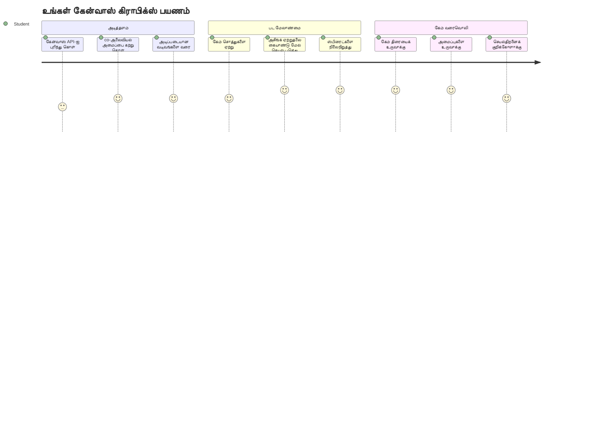
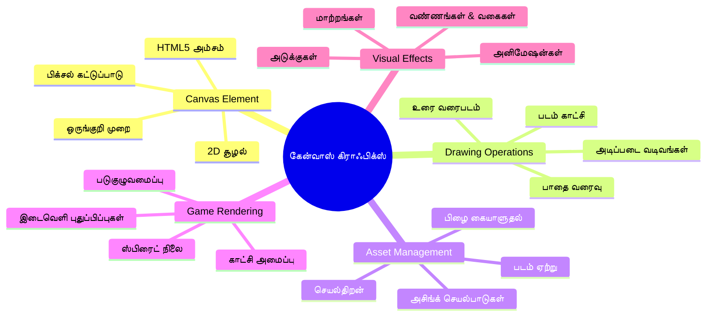
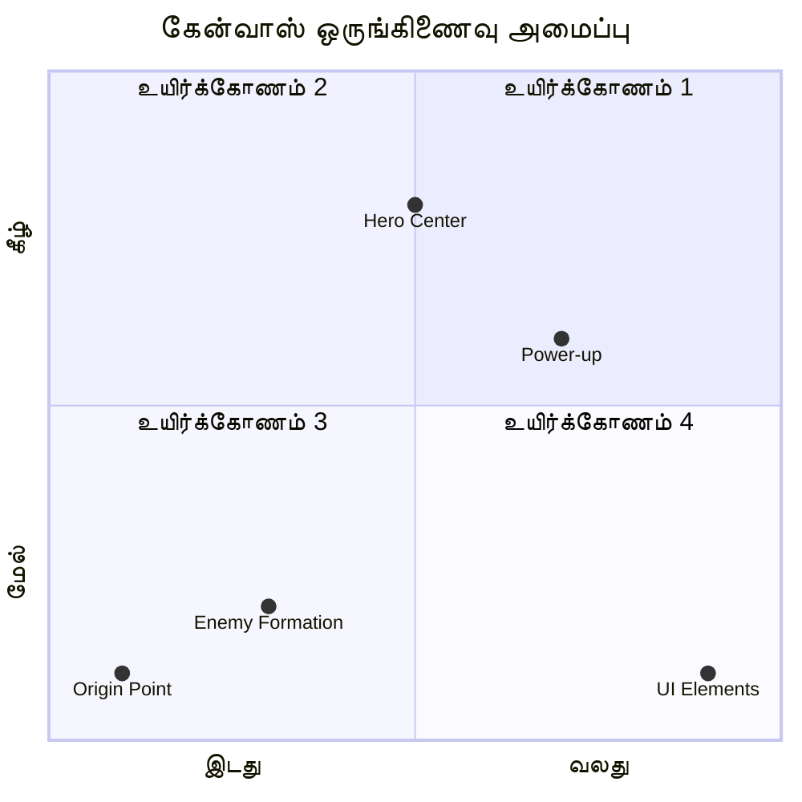
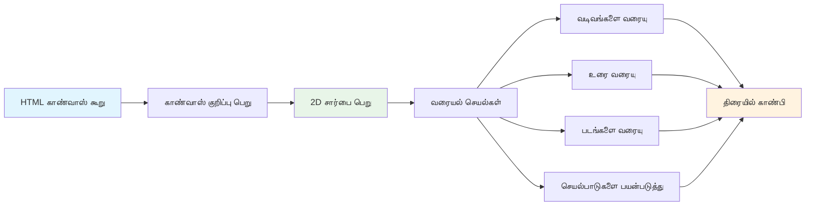
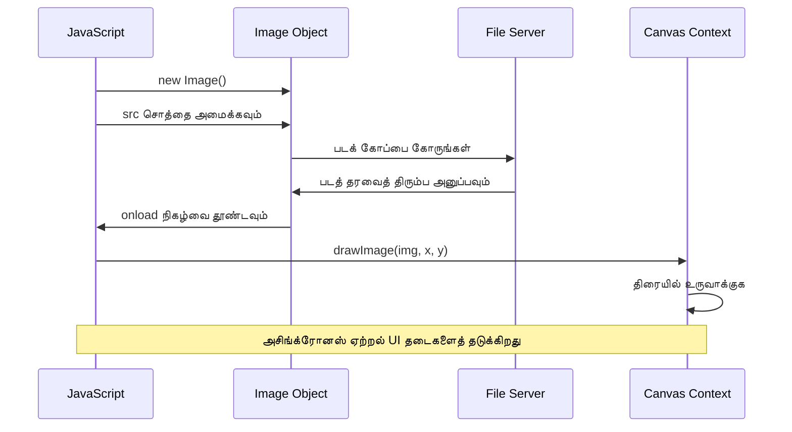
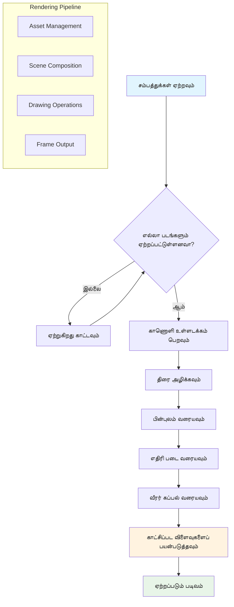
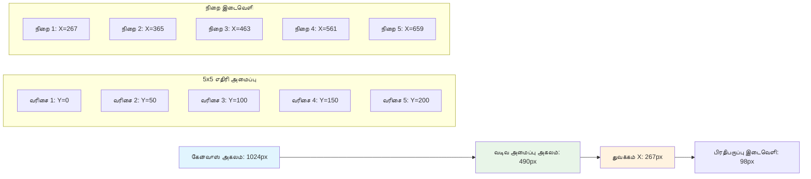
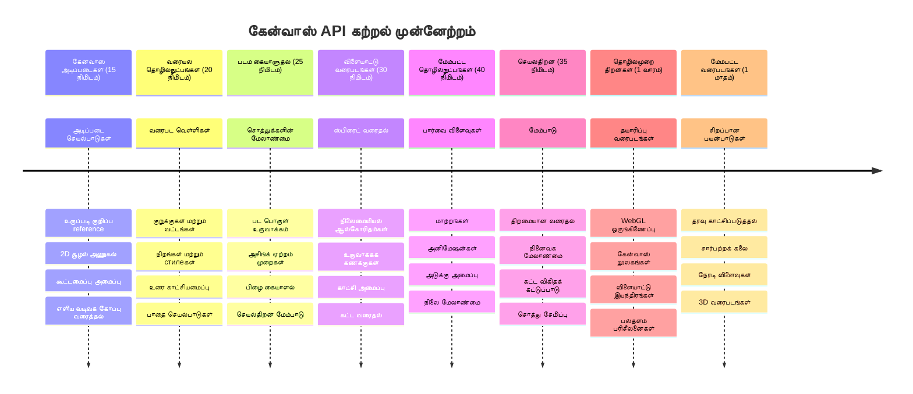

<!--
CO_OP_TRANSLATOR_METADATA:
{
  "original_hash": "7994743c5b21fdcceb36307916ef249a",
  "translation_date": "2026-01-07T13:04:21+00:00",
  "source_file": "6-space-game/2-drawing-to-canvas/README.md",
  "language_code": "ta"
}
-->
# இடைவெளி விளையாட்டு பாகம் 2: ஹீரோ மற்றும் பேய்களை கன்வாஸில் வரைவோம்


கன்வாஸ் API என்பது உங்கள் உலாவியில் நேரடியாக மாறிச் செல்லக்கூடிய, தொடர்புடைய கிராபிக்ஸை உருவாக்க வலைத் தள வளர்ச்சியில் மிகவும் சக்திவாய்ந்த அம்சங்களில் ஒன்றாகும். இந்த பாடத்தில், அந்த வெற்றிட HTML `<canvas>` கூறை ஹீரோக்களும் பேய்களும் நிரம்பிய ஒரு விளையாட்டு உலகமாக மாற்றப்போகிறோம். கன்வாஸ் உங்கள் டிஜிட்டல் கலை பலகை போல, அங்கே கோடு பார்வையாக மாறுகிறது என்று நினைத்துக்கொள்ளுங்கள்.

நீங்கள் முன் படித்த பாடத்தில் கற்றதை மேம்படுத்தி, இப்போது பார்வை அம்சங்களில் மூழ்கப்போகிறோம். விளையாட்டு ஸ்பிரைட்களை எப்படித் தள்ளிச் சரிவரச் செய்வது, பொருட்களை துல்லியமாக இடம் வகுத்தல், மற்றும் உங்கள் இடைவெளி விளையாட்டுக்கான காட்சிப் பிள்ளைகளை உருவாக்குவது ஆகியவற்றை நீங்களே கற்றுக்கொள்ளப்போகிறீர்கள். இது நிலையான இணையப் பக்கங்களுக்கும், மாறிச் செல்லக்கூடிய, தொடர்புடைய அனுபவங்களுக்கும் இடையேயான கால்வாயை உருவாக்குகிறது.

இதன் முடிவில், உங்கள் ஹீரோ கப்பல் சரியான முறையில் இடம் பெற்ற முழுமையான விளையாட்டு காட்சியையும், தீவிரமான போருக்கான பகைவர்களின் அமைப்புகளையும் நீங்கள் பெற்றிருப்பீர்கள். முற்பகுதி விளையாட்டுகள் உலாவிகளில் கிராபிக்ஸை எவ்வாறு வரைப்பதைக் காண்பிக்கும் என்பதை புரிந்து கொண்டு, உங்கள் சொந்த தொடர்புடைய காட்சிப் அனுபவங்களை உருவாக்கும் திறன்களையும் பெறுவீர்கள். கன்வாஸ் கிராபிக்ஸை ஆராய்ந்து, உங்கள் இடைவெளி விளையாட்டை உயிர்த்தெழுப்புவோம்!


## முன்-பாட புலன்வினா

[முன்-பாட புலன்வினா](https://ff-quizzes.netlify.app/web/quiz/31)

## கன்வாஸ்

இந்த `<canvas>` கூறு என்பது என்னவென்று சரியாகப் புரிந்துகொள்வோம். இது HTML5 உள்ளடக்கியது, உலாவிகளில் மாற்றக்கூடிய கிராபிக்ஸ் மற்றும் அனிமேஷன்களை உருவாக்க உதவும் தீர்வு ஆகும். பொதுவான படங்கள் அல்லது வீடியோக்கள் நிலையானவையாக இருப்பதில் வித்தியாசம், கன்வாஸ் திரையில் தோன்றும் அனைத்திலும் பிக்சல் நிலை கட்டுப்பாட்டை அளிக்கிறது. இதன் மூலம் விளையாட்டுகள், தரவு காணொளிகள் மற்றும் தொடர்புடைய கலை உருவாக்க இது சிறந்தது. ஜாவாஸ்கிரிப்ட் உங்கள் ஓவியப்பாட்டுப் பூசகிறையாக மாறும் ஒரு நிரலாக்கக்கூடிய வரைவுனரகமாக இதைப் பாருங்கள்.

இயல்பாக, கன்வாஸ் கூறு உங்கள் பக்கத்தில் வெறுமையாகவும், தங்கியிருக்கின்ற சதுரமாகவும் தோன்றும். ஆனால் இங்கே அதன் சக்தி உள்ளது! ஜாவாஸ்கிரிப்டைப் பயன்படுத்தி வடிவங்களை வரைவு, படம் ஏற்றுதல், அனிமேஷன்களை உருவாக்குதல் மற்றும் பயனர் தொடர்பின் படி விஷயங்களை நிச்சயப்படுத்துதல் எனும் செயல்களைச் செய்யும் போது அதன் உண்மையான சக்தி வெளிப்படுகிறது. இது 1960களில் பெல் லேப்ஸின் ஆரம்ப கால கணினி கிராபிக்ஸ் முன்னோடிகள் ஒவ்வொரு பிக்சலையும் நிரலாக்கி முதன்முதலில் டிஜிட்டல் அனிமேஷன்களை உருவாக்கியதைப் போன்றது.

✅ MDN இல் [கன்வாஸ் API பற்றியது மேலும்கண்டறியவும்](https://developer.mozilla.org/docs/Web/API/Canvas_API).

பக்கத்தின் உடல் பகுதியின் ஒரு பகுதியாகக் கீழ்க்காணும் வகையில் அதிகம் பயன்படுத்தப்படுகிறது:

```html
<canvas id="myCanvas" width="200" height="100"></canvas>
```

**இந்தக் குறியீடு செய்வதெல்லாம் இதோ:**
- **`id`** பண்பை அமைத்தல், இதனை ஜாவாஸ்கிரிப்டில் குறிப்பிட்டு அணுக உதவும்
- கன்வாஸ் அகலத்தை பிக்சலில் நிர்ணயித்தல்
- கன்வாஸ் உயரத்தை பிக்சலில் நிர்ணயித்தல்

## எளிய வடிவியல் வரைவு

இப்போது கன்வாஸ் கூறு என்ன என்பதைக் கண்டுபிடித்ததால், அதில் உண்மையில் வரைவதைக் காணலாம்! கன்வாஸ் கணித வகுப்புகளில் காணும் ஒரேவிதமான ஒருங்கிணைவு முறைபோல் செயல்படும், ஆனால் கணினி கிராபிக்ஸ் தொடர்புடைய ஒரு முக்கிய வேறுபாடு உண்டு.

கன்வாஸ் ஒரு கார்டீசியன் ஒருங்கிணைவு முறையை x அச்சில் (கிடப்புக்கோடு) மற்றும் y அச்சில் (நிலையைக் குறிக்கும்) பயன்படுத்தி எல்லாவற்றையும் இடம் வழங்குகிறது. ஆனால் முக்கிய வேறுபாடு: கணித வகுப்பின் ஒருங்கிணைவு முறையைவிட, தொடக்கப் புள்ளி `(0,0)` மேல்-இடப்புற மூலையில் இருந்து தொடங்கும், x மதிப்புகள் வலமாகவும், y மதிப்புகள் கீழே பெரிதாகவும் ஆகும். இந்த விடயம் 1960களில் ஆரம்ப கணினி திரைகளில் எலெக்ட்ரான் கதிர்களை மேல்-கீழ் அன்பனப்பதற்கான காரணத்தால் மேல்-இடப்புற புள்ளி இயல்பான தொடக்கமாக இருந்தது.



> படம் இதிலிருந்து [MDN](https://developer.mozilla.org/docs/Web/API/Canvas_API/Tutorial/Drawing_shapes)

கன்வாஸ் கூறில் வரைவு செய்வதற்கு, அனைத்து கன்வாஸ் கிராபிக்ஸ் அடிப்படையாக மாறும் மூன்று படிகள் உள்ளன. இதை மீண்டும் மீண்டும் செய்து பார்க்கும்போது இது இயல்பானதாக மாறும்:


1. **DOM இல் இருந்து** கன்வாஸ் கூறை குறிக்கும் ஒரு குறிப்பை பெறுதல் (மேலும் எந்த HTML கூறும் அதேபோல்)
2. **2D வரைவு சூழலை** பெறுதல் – இது அனைத்து வரைவு முறைகளையும் வழங்குகிறது
3. **வரைவு துவங்குதல்!** சூழலின் உள்ளமைக்கப்பட்ட முறைகளை கொண்டு உங்கள் கிராபிக்ஸை உருவாக்குதல்

இது குறியீட்டில் எப்படி இருக்கும் என்பதைக் காணலாம்:

```javascript
// படி 1: கேன்வாஸ் கூறை பெறவும்
const canvas = document.getElementById("myCanvas");

// படி 2: 2D வரைபட சூழலைப் பெறவும்
const ctx = canvas.getContext("2d");

// படி 3: நிறத்தை அமைத்து ஒரு செவ்வகம் வரைவிடவும்
ctx.fillStyle = 'red';
ctx.fillRect(0, 0, 200, 200); // x, y, அகலம், உயரம்
```

**இதனை படிப்படியாக உடைக்கலாம்:**
- கன்வாஸ் கூறை அதன் ID மூலம் பிடித்துக் கொண்டு ஒரு மாறிலியில் சேமித்தோம்
- 2D வரைவு சூழலைப் பெற்றோம் – இது வரைவு முறைகள் கொண்ட கருவிப்பெட்டி
- `fillStyle` பண்பை பயன்படுத்தி சிவப்பு நிறத்தில் நிரப்ப வேண்டும் என்று கன்வாஸோடு கூறினோம்
- மேல் இடப்புற மூலத்தில் (0,0) இருந்து 200 பிக்சல் அகலமும் உயரமும் கொண்ட ஒரு சதுரத்தை வரைந்தோம்

✅ கன்வாஸ் API பெரும்பாலும் 2D வடிவங்களுக்கே கவனம் செலுத்துகிறது, ஆனால் 3D பொருட்களையும் வரைவேண்டும் என்றால், [WebGL API](https://developer.mozilla.org/docs/Web/API/WebGL_API) போன்றவையைப் பயன்படுத்தலாம்.

நீங்கள் கன்வாஸ் API மூலம் ஏதாவது வரைக்கலாம்:

- **வரைகலை வடிவங்கள்**: சதுரம் எப்படி வரைவது என்பதை முன்பே கற்றோம், ஆனால் இன்னும் நிறைய வடிவங்களையும் வரைலாம்.
- **விருத்திரைகள்**: எந்த எழுத்துருவும் மற்றும் நிறமும் கொண்டு உரையை வரையலாம்.
- **படங்கள்**: .jpg அல்லது .png போன்ற படக் குறிச்சொற்களை கொண்டு படத்தை வரையலாம்.

✅ முயற்சி செய்க! நீங்கள் எப்படி சதுரம் வரைப்பது தெரிந்திருக்கும், இதோ ஒரு வட்டம் ஒரு பக்கத்தில் வரைக்க முடியுமா? CodePen இல் சில சுவையான கன்வாஸ் வரைபடங்களைப் பாருங்கள். இதில் [மிகவும் லட்சியமான எடுத்துக்காட்டு](https://codepen.io/dissimulate/pen/KrAwx) ஒன்று உள்ளது.

### 🔄 **கல்விசார் நிலை பரிசோதனை**
**கன்வாஸ் அடிப்படைகள் புரிதல்**: படம் ஏற்றுதலுக்கு முன், நீங்கள் இப்படித்தான் இருக்கக் கூடியதா என்பதைக் சரிபாருங்கள்:
- ✅ கன்வாஸ் ஒருங்கிணைவு முறை கணித ஒருங்கிணைவு முறையைப்போல இல்லை என்பதை விளக்கவும்
- ✅ கன்வாஸ் வரைவு செயல்முறை மூன்று படிகளைக் கூறவும்
- ✅ 2D வரைவு சூழல் என்ன வழங்குகிறது என்பதை அடையாளங்காணவும்
- ✅ fillStyle மற்றும் fillRect சேர்ந்து எப்படி செயல்படுகின்றன என்பதை விவரிக்கவும்

**வேகமான சுய சோதனை**: (100, 50) இடத்தில் 25 விட்டம் கொண்ட நீல வட்டத்தை நீங்களே எப்படி வரைவீர்கள்?
```javascript
ctx.fillStyle = 'blue';
ctx.beginPath();
ctx.arc(100, 50, 25, 0, 2 * Math.PI);
ctx.fill();
```

**கன்வாஸ் வரைவு முறைகள் நீங்கள் இப்போது அறிவீர்கள்**:
- **fillRect()**: நிறம் நிரப்பிய சதுரங்களை வரைக்கும்
- **fillStyle**: நிறங்கள் மற்றும் வடிவங்களை அமைக்கும்
- **beginPath()**: புதிய வரைவு பாதைகளை துவக்கும்
- **arc()**: வட்டங்கள் மற்றும் வளைவுகளையும் உருவாக்கும்

## படம் ஏற்றவும் வரைவும்

அடிப்படையான வடிவங்களை வரையுதல் தொடக்கம் கொள்கையில் உதவுகிறது, ஆனாலும் பெரும்பான்மையான விளையாட்டுகள் உண்மையான படங்களை தேவைப்படுத்துகின்றன! ஸ்பிரைட்கள், பின்னணி மற்றும் பட உருப்படிகள் விளையாட்டை கண்ணோட்டமாகக் காணச் செய்கின்றன. படங்களை கன்வாஸ் இல் ஏற்றவும், காட்டவும் வடிவங்களை வரைவதற்கு மாறுபட்ட முறையில் செயல்படுகிறது, ஆனால் இது புரிந்துகொண்டதும் எளிதானது.

நாம் ஒரு `Image` பொருளை உருவாக்கி, பட கோப்பை ஏற்ற வேண்டும் (இது பின்னணியில் "அசங்கமாக" நிகழ்கிறது), அதன் பிறகு படம் தயார் ஆனதும் கன்வாஸ் மேல் வரைவேண்டும். இந்த முறையால் படங்கள் ஏற்றும்போது உங்கள் செயலி தடங்கல் இல்லை என உறுதிசெய்கிறது.


### அடிப்படையான படம் ஏற்றல்

```javascript
const img = new Image();
img.src = 'path/to/my/image.png';
img.onload = () => {
  // படம் ஏற்றவும் பயன்படுத்த தயாராக உள்ளது
  console.log('Image loaded successfully!');
};
```

**இந்தக் குறியீட்டில் என்ன நடக்கிறது:**
- புதிய ஒரு Image பொருளை உருவாக்குகிறோம், இதில் நமது ஸ்பிரைட் அல்லது உருப்படியை வைக்கும்
- அதனால் எந்த படக் கோப்பை ஏற்றுவது என்பதை குறிப்பது
- படம் தயார் ஆன நேரத்தை அறிய ஏற்றல் நிகழ்வை கேட்கிறோம்

### படங்களை ஏற்ற சிறந்த வழி

சிறந்த முறையில் பட ஏற்றலை கையாள தொழில்முறை வளர்ச்சியாளர்கள் தொலைவிரைய நிறுத்தி Promise ஆதாரமாக்கும் செயல்முறையை பயன்படுத்துகிறார்கள். இதற்கு ES6லே வழங்கப்பட்ட async/await குறியீடு அளவற்ற சீரான நேரடி வாசிப்பு மற்றும் பிழை கையாளுதலை வழங்குகிறது:

```javascript
function loadAsset(path) {
  return new Promise((resolve, reject) => {
    const img = new Image();
    img.src = path;
    img.onload = () => {
      resolve(img);
    };
    img.onerror = () => {
      reject(new Error(`Failed to load image: ${path}`));
    };
  });
}

// அசிங்க்/அவைட் உடன் நவீன பயன்பாடு
async function initializeGame() {
  try {
    const heroImg = await loadAsset('hero.png');
    const monsterImg = await loadAsset('monster.png');
    // படங்கள் இப்போது பயன்படுத்த தயார்
  } catch (error) {
    console.error('Failed to load game assets:', error);
  }
}
```

**நாம் இங்கு செய்தது:**
- அனைத்து படம் ஏற்றல் கூறுகளையும் Promise தொகுப்பாக மூடியது
- பிழை நிகழ்ந்தால் தெரிவிக்கும் முறையைச் சேர்த்தோம்
- async/await ஜவுசூலை பயன்படுத்தியுள்ளோம் ஏனெனில் வாசிக்க எளிதாகும்
- ஏற்றலில் பிழைகள் வந்தால் சுறுசுறுப்பான try/catch தொகுப்புகளை இணைத்தோம்

படங்கள் ஏற்றப்பட்டதும், அவற்றை கன்வாஸில் வரைதல் எளிதானது:

```javascript
async function renderGameScreen() {
  try {
    // விளையாட்டு சொத்துகளை ஏற்றுக
    const heroImg = await loadAsset('hero.png');
    const monsterImg = await loadAsset('monster.png');

    // கன்வாஸ் மற்றும் சூழலைப் பெறுக
    const canvas = document.getElementById("myCanvas");
    const ctx = canvas.getContext("2d");

    // படங்களை குறிப்பிட்ட இடங்களில் வரைபடுக
    ctx.drawImage(heroImg, canvas.width / 2, canvas.height / 2);
    ctx.drawImage(monsterImg, 0, 0);
  } catch (error) {
    console.error('Failed to render game screen:', error);
  }
}
```

**இதனை படிப்படியாக பார்ப்போம்:**
- நமது ஹீரோ மற்றும் பேய் படங்களை பின்னணியில் await கொண்டு ஏற்றுகிறோம்
- கன்வாஸ் கூறையும் 2D வரைவு சூழலையும் பிடிக்கிறோம்
- எளிய ஒருங்கிணைவு கணக்குகளை செய்து ஹீரோ படத்தை மையத்தின் நடுவில் வைக்கிறோம்
- பேய் படத்தை ஆரம்பத்தில் மேல் இடப்புற மூலையில் வைக்கிறோம்
- ஏற்றுதல் அல்லது வரைவு செய்யும் போது வேறொரு பிழைகள் ஏற்பட்டால் கையாள்கிறோம்


## இப்போது உங்கள் விளையாட்டை உருவாக்கத் துவங்கும் நேரம்

இப்போது அனைத்து அம்சங்களையும் சேர்த்து உங்கள் இடைவெளி விளையாட்டுக்கான காட்சி அடித்தளத்தை உருவாக்கப்போகிறோம். கன்வாஸ் அடிப்படைகள் மற்றும் படம் ஏற்றும் முறைகளை நீங்கள் நன்றாகப் புரிந்துகொண்டீர்கள், ஆகவே இது முழுமையான விளையாட்டு திரையை சரியான முறையில் ஸ்பிரைட்களுடன் உருவாக்க வழிகாட்டும்.

### என்ன உருவாக்குவது

Canvas கூறுடன் கூடிய ஒரு வலைப்பக்கத்தை நீங்கள் உருவாக்கப்போகிறீர்கள். அது கறுப்புப் பின்னணி `1024*768` ஆக இருக்க வேண்டும். நாங்கள் உங்களுக்கு இரண்டு படங்களை வழங்கியுள்ளோம்:

- ஹீரோ கப்பல்

   

- 5*5 பேய் அணி

   

### வளர்ச்சியைத் தொடங்க பரிந்துரைகள்

`your-work` என்ற துணைத்தொகுதியில் உங்களுக்காக உருவாக்கப்பட்ட தொடக்க கோப்புகளைக் கண்டுபிடிக்கவும். உங்கள் திட்ட அமைப்பு பின்வருமாறு இருக்க வேண்டும்:

```bash
your-work/
├── assets/
│   ├── enemyShip.png
│   └── player.png
├── index.html
├── app.js
└── package.json
```

**நீங்கள் எதோடு பணியாற்றுகிறீர்கள்:**
- கலை தொகுதிகள் `assets/` கோப்பகத்தில் இருப்பதால் அனைத்தும் ஒழுங்குபடுத்தப்பட்டு இருக்கும்
- முதன்மை HTML கோப்பு கன்வாஸ் கூறைக் கொண்டு அமைக்கப்பட்டு தயாராக இருக்கும்
- ஒரு ஜாவாஸ்கிரிப்ட் கோப்பு உங்களுக்கு முழுமையான விளையாட்டு வரைவுக் கலை செய்ய எழுதுவதற்காக உள்ளது
- ஒரு package.json, இது உள்ளகமாக லோகல் டெவலப்மெண்ட் சர்வரைத் துவக்க உதவும்

Visual Studio Code இல் இந்த கோப்பகத்தைத் திறந்து வளர்ச்சியைத் தொடங்குங்கள். Visual Studio Code, NPM மற்றும் Node.js உங்கள் கணினியில் நிறுவப்பட்டிருப்பது தேவையானது. `npm` நிறுவப்படாதிருந்தால், [இதில் எப்படி நிறுவுவது](https://www.npmjs.com/get-npm) காணலாம்.

`your-work` கோப்பகத்திற்கு சென்று உங்கள் டெவலப்மென்ட் சர்வரைத் தொடங்கவும்:

```bash
cd your-work
npm start
```

**இந்த கட்டளை இவை செய்கிறது:**
- `http://localhost:5000` என்ற உள்ளக சர்வரை தொடங்குகிறது, நீங்கள் உங்கள் விளையாட்டை சோதிக்கலாம்
- உங்கள் கோப்புகளை சரிவர சர்வ் செய்கிறது, உலாவி சரியான முறையில் ஏற்றும்
- மாற்றங்களை கவனித்து வளர்ச்சியை மென்மையாகச் செய்ய உதவும்
- நீங்கள் ஒரு தொழில்முறை வளர்ச்சி சூழலுடன் அனைவரையும் சோதிக்க முடியும்

> 💡 **கவனம்**: உலாவியில் ஆரம்பத்தில் வெற்று பக்கம் தோன்றும் – இது எதிர்ப்பார்க்கத்தக்கது! நீங்கள் கோடு சேர்க்கும் போதெல்லாம், உலாவியை ரீப்ரெஷ் செய்து மாற்றங்களைப் பார்க்கவும். இந்த மீண்டும் மீண்டும் வளர்ச்சி செயல்விளைவு NASA அப்பொல்லோ வழிகாட்டி கணினியை கட்டியதுபோல் – ஒவ்வொரு பகுதிச் சோதனையையும் முழுமையாகச் செய்துவிட்டு முதன்மை அமைப்போடு இணைத்தது போல ஆகும்.

### கோடு சேர்க்கவும்

`your-work/app.js` இல் கீழ்காணும் பணிகளை முடிக்க தேவையான கோடுகளைச் சேர்க்கவும்:

1. **கருப்பு பின்னணியுடன் கன்வாஸ் வரைவது**
   > 💡 **இது எப்படி**: `/app.js` உள்ள TODO ஐப் பிடித்து இரண்டு வரிகளைக் கூடுதலாக எழுதவும். `ctx.fillStyle` ஐ கருப்பாக மாற்றி, பின்னர் (0,0) இடத்தில் இருந்து உங்கள் கன்வாஸ் பரிமாணங்களுடன் `ctx.fillRect()` பயன்படுத்தவும். எளிதாகவே நடக்கும்!

2. **விளையாட்டு படங்களை ஏற்றவும்**
   > 💡 **இது எப்படி**: `await loadAsset()` கொண்டு உங்கள் பிளேயர் மற்றும் பகை படங்களை ஏற்றவும். பின்னர் பயன்படுத்த மாறிலிகளில் சேமிக்கவும். நினைவில் வையுங்கள் – அவை நீங்கள் வரையும்போது மட்டுமே காண்பிக்கப்படும்!

3. **ஹீரோ கப்பலை நடுவுமூலம் கீழ் பகுதியில் வரைவது**
   > 💡 **இது எப்படி**: `ctx.drawImage()` பயன்படுத்தி ஹீரோ படத்தை இடமிட்டு வரையவும். x ஒருங்கிணைவு `canvas.width / 2 - 45` என்று முயற்சிக்கவும், y ஒருங்கிணைவு `canvas.height - canvas.height / 4` ஆகக் கொள்ளவும்.

4. **5×5 பேய் கப்பல் அமைப்பை வரைவது**
   > 💡 **இது எப்படி**: `createEnemies` என்ற செயல்பாட்டை கண்டுபிடித்து, இரண்டு அடுக்குச் சுற்றுக்களை அமைக்கவும். இடைவெளி மற்றும் இடம் கணக்கிட சில கணிதம் தேவைப்படும், ஆனால் உங்களுக்கு எப்படி செய்வது முழுமையாக கற்றுக் கொடுப்பேன்!

முதலில், பகை அணியின் அமைப்புக்கான சிறந்த இட நிலைகளை நிர்ணயிக்க நிலையான மதிப்புகளை உருவாக்குங்கள்:

```javascript
const ENEMY_TOTAL = 5;
const ENEMY_SPACING = 98;
const FORMATION_WIDTH = ENEMY_TOTAL * ENEMY_SPACING;
const START_X = (canvas.width - FORMATION_WIDTH) / 2;
const STOP_X = START_X + FORMATION_WIDTH;
```

**இந்த நிலையான மதிப்புகள் என்ன செய்கின்றன என்பதைக் கூறுவோம்:**
- நாங்கள் ஒரு வரிசைக்கும் நெடுவரிசைக்கும் 5 பகைவர்களைக் கொடுத்துள்ளோம் (அருமையான 5×5 வலைப்பின்னல்)
- பகைவர்களின் இடைவெளியை எவ்வளவு வைக்க வேண்டும் என்பது நிர்ணயிக்கப்பட்டுள்ளது
- அனைத்து அணியின் அகலத்தை கணக்கிடுகிறோம்
- ஆரம்பிக்கும் மற்றும் நிறுத்தும் இடங்களைத் தீர்மானிக்கிறோம், அப்படி அமைப்பு மையமாகத் தோன்றும்


பின்னர், பேய் அணியை வரைக இரண்டு அடுக்குச் சுற்றுக்களை உருவாக்குங்கள்:

```javascript
for (let x = START_X; x < STOP_X; x += ENEMY_SPACING) {
  for (let y = 0; y < 50 * 5; y += 50) {
    ctx.drawImage(enemyImg, x, y);
  }
}
```

**இது அடுக்குச் சுற்றுகளில் செய்யும் வேலை:**
- வெளியூர் சுற்று உங்கள் அமைப்பை இடம் வலப்புறம் நகர்த்துகிறது
- உள்ளூர் சுற்று மேல்-கீழ் செல்லும் வரிசைகளை உருவாக்குகிறது
- கணக்கிடப்பட்ட x,y ஒருங்கிணைப்பில் ஒவ்வொரு பகைவாரையும் வரைகிறது
- சகதியாக வெவ்வேறு இடைவெளிகள் காப்பாற்றப்படுவதால் ஒழுங்கான வடிவமைப்பாக தோன்றும்

### 🔄 **கல்விசார் நிலை பரிசோதனை**
**விளையாட்டு வரைவு திறன்**: முழுமையான வரைவு அமைப்பை நீங்கள் புரிந்ததா என்பதை சரிபார்க்கவும்:
- ✅ ஆசிங்க் படம் ஏற்றல் தயாரிப்பு ஸ்தலத்தில் UI தடுக்கும் வாய்ப்பை எப்படி குறைக்கிறது?
- ✅ நாங்கள் நிலையான மதிப்புகளைப் பயன்படுத்தி பேய் அணி இடங்களை கணக்கிடுவதன் நோக்கம் என்ன?
- ✅ வரைவு செயல்களில் 2D வரைவு சூழல் என்ன பங்கு வகிக்கிறது?
- ✅ அடுக்குச் சுற்றுக்களால் ஸ்பிரைட் அமைப்புகள் எப்படி ஒழுங்கானதாக உருவாகின்றன?

**செயற்பாட்டுத்தன்மை கருத்துக்கள்**: உங்கள் விளையாட்டு இப்போது காட்டு:
- **திறமையான ஆஸ்தி ஏற்றல்**: Promise அடிப்படையிலான படம் மேலாண்மை
- **ஒழுங்குபடுத்தப்பட்ட வரைவு**: கட்டமைக்கப்பட்ட வரைவு செயல்பாடுகள்
- **கணிதமயமான இடம்**: நுண்ணறிவு கொண்டு ஸ்பிரைட் இடம் நிர்ணயம்
- **பிழை கையாளுதல்**: சிக்கல்களை மென்மையாக கையாளல்

**காட்சிப் நிரலாக்கக் கருத்துக்கள்**: நீங்கள் கற்றுக்கொண்டீர்கள்:
- **கூடல் அமைப்புகள்**: கணிதத்தை திரை நிலைகளுக்கு மாற்றுதல்  
- **ஸ்பிரைட் மேலாண்மை**: விளையாட்டு உருவாக்கங்களைக் கனிவாக ஏற்றுதல் மற்றும் காட்சி படுத்துதல்  
- **வடிவமைப்பு ஆல்காரிதம்கள்**: ஒழுங்குபடுத்தப்பட்ட அமைப்புகளுக்கான கணித படிகள்  
- **ஆசிங்க் செயல்பாடுகள்**: மென்மையான பயனர் அனுபவத்துக்கான நவீன ஜாவாஸ்கிரிப்ட்  

## முடிவு

செய்த முடிவு இதுபோல் தோன்ற வேண்டும்:


## தீர்வு

தயவுசெய்து முதலில் உங்கள் முயற்சியோடு முயற்சி செய்யவும், ஆனால் நீங்கள் சிக்கினால், [தீர்வை](../../../../6-space-game/2-drawing-to-canvas/solution/app.js) ஒரு பார்வை விடுங்கள்

---

## GitHub Copilot முகவர் சவால் 🚀

தொடர்ந்துகொள்ள கீழ்காணும் சவாலை முடிக்க முகவர் முறையை பயன்படுத்தவும்:

**விளக்கம்:** கற்றுக் கொண்ட Canvas API தொழில்நுட்பங்களைப் பயன்படுத்தி உங்கள் விண்வெளி விளையாட்டு கேன்வாஸை காட்சி விளைவுகளும் மற்றும் புரட்சி அம்சங்களும் சேர்த்து மேம்படுத்தவும்.

**விருப்பம்:** பின்னணி முழுவதும் அனிமேஷன் நடுத்தரப்புள்ளிகளை காட்டும் கேன்வாஸுடன், ஹீரோ வம்பின் அடையாளபடுத்தும் முக்கியத்துவமான நிறம் மாறும் ஹெல்த் பாருடன், மற்றும் எதிரி கப்பல்கள் மெதுவாக கீழ் செல்லும் `enhanced-canvas.html` என்ற புதிய கோப்பை உருவாக்கவும். யாதெனில் புவிசார் நிலைகளுடன் மின்னுமினுக்கும் நடுத்தரப்புள்ளிகளை வரைவதற்கான ஜாவாஸ்கிரிப்ட் குறியீடு, ஆரோக்கிய மட்டத்தின்படி நிறம் மாறும் ஹெல்த் பாரும், மற்றும் வெவ்வேறு வேகத்தில் கீழ் செல்லும் எதிரி கப்பல்களுக்கு அனிமேஷனும் பயன்படுத்து.

[agent mode](https://code.visualstudio.com/blogs/2025/02/24/introducing-copilot-agent-mode) பற்றி மேலுமாய் அறிய.

## 🚀 சவால்

நீங்கள் 2D مرکு Canvas API-யுடன் வரைவதை கற்றுக்கொண்டிருக்கிறீர்கள்; இப்போது [WebGL API](https://developer.mozilla.org/docs/Web/API/WebGL_API) ஐப் பார்வையிட்டு, ஒரு 3D பொருளை வரைய முயற்சிக்கவும்.

## பின்-பாடம் வினாதாளி

[Post-lecture quiz](https://ff-quizzes.netlify.app/web/quiz/32)

## மதிப்பாய்வு மற்றும் சுய கல்வி

Canvas API பற்றி மேலுமாய் அறிய [இதைக் கண்டு](https://developer.mozilla.org/docs/Web/API/Canvas_API) படிக்கவும்.

### ⚡ **அடுத்த 5 நிமிடங்களில் நீங்கள் செய்யக்கூடியவை**
- [ ] உலாவி கருத்துக் களஞ்சியத்தைத் திறந்து `document.createElement('canvas')` கொண்டு கேன்வாஸ் கூறை உருவாக்கவும்  
- [ ] கேன்வாஸ் சூழலில் `fillRect()` பயன்படுத்தி ஒரு சதுரத்தை வரைந்து பார்க்கவும்  
- [ ] `fillStyle` பண்பின் மூலம் வெவ்வேறு நிறங்கள் பயன்படுத்தி பார்க்கவும்  
- [ ] `arc()` முறை கொண்டு சுலபமான ஒரு வட்டத்தை வரைந்து பார்க்கவும்  

### 🎯 **இந்த மணிக்கு நீங்கள் சாதிக்கக்கூடியவை**
- [ ] பின்-பாடம் வினாத்தாளை முடித்து கேன்வாஸ் அடிப்படைகள் புரிந்து கொள்ளவும்  
- [ ] பல வடிவங்களும் நிறங்களும் கொண்ட கேன்வாஸ் வரைவு செயலி உருவாக்கவும்  
- [ ] உங்கள் விளையாட்டிற்கான படங்கள் ஏற்றுதல் மற்றும் ஸ்பிரைட் வரைவு செயலாக்கம் செய்யவும்  
- [ ] கேன்வாஸ் முழுவதும் பொருட்களை நகர்த்தும் எளிய அனிமேஷன் உருவாக்கவும்  
- [ ] அளவிடல், சுற்றுதல் மற்றும் மாற்றுதல் போன்ற கேன்வாஸ் மாற்றங்களை பழகவும்  

### 📅 **உங்கள் ஒருவார கேன்வாஸ் பயணம்**
- [ ] பளிச்சிடும் உருவாக்கங்களுடன் விண்வெளி விளையாட்டைப் பூர்த்தி செய்யவும்  
- [ ] டிரயாதிகள், மாதிரிகள் மற்றும் கலவை போன்ற மேம்பட்ட கேன்வாஸ் தொழில்நுட்பங்களில் தேர்ச்சி பெறவும்  
- [ ] தரவுக் கடவுச்சொற்களில் கேன்வாஸ் பயன்படுத்தி தொடர்புடைய காட்சிப்படுத்தல்களை உருவாக்கவும்  
- [ ] மென்மையான செயல்திறன் பெற கேன்வாஸ் மேம்பாட்டு நுட்பங்களை கற்றுக்கொள்ளவும்  
- [ ] பல கருவிகளைப் பயன்படுத்தி ஒரு வரைவு அல்லது ஓவிய பயன்பாட்டை உருவாக்கவும்  
- [ ] கேன்வாஸ் மூலம் படைப்பு நிரலாக்க மாதிரிகள் மற்றும் உருவாக்கக் கலை ஆராயவும்  

### 🌟 **உங்கள் மாதாவதி கிராஃபிக்ஸ் தேர்ச்சி பயணம்**
- [ ] Canvas 2D மற்றும் WebGL பயன்பாட்டை பயன்படுத்தி சிக்கலான காட்சி செயலிகள் உருவாக்கவும்  
- [ ] கிராஃபிக்ஸ் நிரலாக்கக் கருத்துக்களும் ஷேடர் அடிப்படைகளும் கற்கவும்  
- [ ] திறந்த மூல கிராஃபிக்ஸ் நூலகங்கள் மற்றும் காட்சி-கருவிகளுக்கு பங்களிக்கவும்  
- [ ] கிராஃபிக்ஸ்-அதிர்ச்சி செயலிகளுக்கான செயல்திறன் மேம்பாடு கற்றுக்கொள்ளவும்  
- [ ] கேன்வாஸ் நிரலாக்கம் மற்றும் கணினி கிராஃபிக்ஸ் குறித்த கல்விக் கொள்கைகளை உருவாக்கவும்  
- [ ] பிறரை கணினி காட்சிப் பாதிப்புகளை உருவாக்க உதவும் கிராஃபிக்ஸ் நிரலாக்க நிபுணராக இருங்கள்  

## 🎯 உங்கள் கேன்வாஸ் கிராஃபிக்ஸ் தேர்ச்சி காலவரிசை


### 🛠️ உங்கள் கேன்வாஸ் கிராஃபிக்ஸ் கருவி தொகுப்பு சுருக்கம்

இந்த பாடத்தை முடித்த பிறகு, தற்போது உங்களிடம் உள்ளது:  
- **கேன்வாஸ் API தேர்ச்சி**: 2D கிராஃபிக்ஸ் நிரலாக்கத்தில் முழுமையான புரிதல்  
- **கூடல் கணிதம்**: துல்லியமான இடமாற்றம் மற்றும் அமைப்பு அல்காரிதம்கள்  
- **ஆசெட் மேலாண்மை**: தொழில்முறைப் படம் ஏற்றுதல் மற்றும் பிழை கையாளுதல்  
- **வரைவு குழாய்**: காட்சி அமைப்புக்கான கட்டமைப்பு அணுகுமுறை  
- **விளையாட்டு கிராஃபிக்ஸ்**: ஸ்பிரைட் இடமாற்றம் மற்றும் வடிவமைப்புக் கணக்குகள்  
- **ஆசிங்க் நிரலாக்கம்**: மென்மையான செயல்திறனுக்கான நவீன ஜாவாஸ்கிரிப்ட் மாதிரிகள்  
- **காட்சி நிரலாக்கம்**: கணிதக் கருத்துக்களை திரை கிராஃபிக்ஸுக்கு மொழிபெயர்த்தல்  

**உண்மையான உலக பயன்பாடுகள்**: உங்கள் கேன்வாஸ் திறன்கள் நேரடியாகப் பயன்படுத்தப்படுகின்றன:  
- **தரவு காட்சிப்படுத்தல்**: வரைபடங்கள், விளக்கக்காட்சிகள் மற்றும் தொடர்புடைய டாஷ்போர்ட்கள்  
- **விளையாட்டு மேம்பாடு**: 2D விளையாட்டுகள், ஒத்திப்போட்டிகள் மற்றும் தொடர்புடைய அனுபவங்கள்  
- **டிஜிட்டல் கலை**: படைப்பு நிரலாக்கம் மற்றும் உருவாக்கக்கலை திட்டங்கள்  
- **UI/UX வடிவமைப்பு**: தனிப்பயன் கிராஃபிக்ஸ் மற்றும் தொடர்புடைய அம்சங்கள்  
- **கல்வி மென்பொருள்**: காட்சி கற்றல் கருவிகள் மற்றும் ஒத்திசைவு  
- **இணைய பயன்பாடுகள்**: இயக்கக்கூடிய கிராஃபிக்ஸ் மற்றும் நேரடி காட்சிகள்  

**பெற்று கொண்ட தொழில்முறை திறன்கள்**: இப்போது நீங்கள் செய்யலாம்:  
- **கட்டமைக்க** வெளிப்புற நூலகங்கள் இல்லாமல் தனிப்பயன் கிராஃபிக்ஸ் தீர்வுகள்  
- **உயர்த்த** மென்மையான பயனர் அனுபவங்களுக்கு வரைவுத் திறன்  
- **பிழை நீக்கு** கடுமையான காட்சி பிரச்சனைகளை உலாவி மேம்பாட்டு கருவிகளுடன்  
- **வடிவமைக்கு** கணிதக் கொள்கைகளைப் பயன்படுத்தி விரிவாக்கக்கூடிய கிராஃபிக்ஸ் அமைப்புகள்  
- **இணைக்க** கேன்வாஸ் கிராஃபிக்ஸை நவீன வலைப்பயன்பாடு கட்டமைப்புகளுடன்  

**மாஸ்டர் செய்த கேன்வாஸ் API முறைகள்**:  
- **கூறு மேலாண்மை**: getElementById, getContext  
- **வரைப்பு செயல்பாடுகள்**: fillRect, drawImage, fillStyle  
- **ஆசெட் ஏற்றுதல்**: பட உருவாக்கங்கள், Promise மாதிரிகள்  
- **கணித இடத்தில் நிலைத்தல்**: கூட்டு கணக்குகள், வடிவமைப்பு ஆல்காரிதம்கள்  

**அடுத்து என்ன?**: அனிமேஷன், பயனர் தொடர்பு, மோதல் கண்டறிதல் சேர்க்கவும் அல்லது 3D கிராஃபிக்ஸுக்காக WebGL ஐ ஆராயவும்!

🌟 **சாதனை**: அடிப்படை கேன்வாஸ் API தொழில்நுட்பங்களைப் பயன்படுத்தி முழுமையான விளையாட்டு மாதிரிக் காட்சியமைப்பை நீங்கள் உருவாக்கியுள்ளீர்கள்!

## பணியைச் செய்யுங்கள்

[Play with the Canvas API](assignment.md)

---

<!-- CO-OP TRANSLATOR DISCLAIMER START -->
**உறுதிப்பத்திரம்**:
இந்த ஆவணம் AI மொழிபெயர்ப்பு சேவை [Co-op Translator](https://github.com/Azure/co-op-translator) பயன்படுத்தி மொழிபெயர்க்கப்பட்டது. நாங்கள் துல்லியத்திற்காக முயலினாலும், இயந்திர மொழிபெயர்ப்புகளில் பிழைகள் அல்லது தவறுகள் இருக்கக்கூடும் என்பதனை தயவுசெய்து கவனியுங்கள். அசல் ஆவணம் அதன் சொந்த மொழியில் மதிப்பீட்டு ஆதாரமாக கருதப்பட வேண்டும். முக்கிய தகவல்களுக்கு, தொழில்முறை மனித மொழிபெயர்ப்பை பரிந்துரைக்கிறோம். இந்த மொழிபெயர்ப்பின் பயன்பாட்டினால் எதுவும் தவறுதலாக புரிதல் அல்லது தவறான விளக்கங்கள் ஏற்பட்டால், அதற்கான பொறுப்புகள் நாங்கள் ஏற்க மாட்டோம்.
<!-- CO-OP TRANSLATOR DISCLAIMER END -->