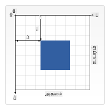
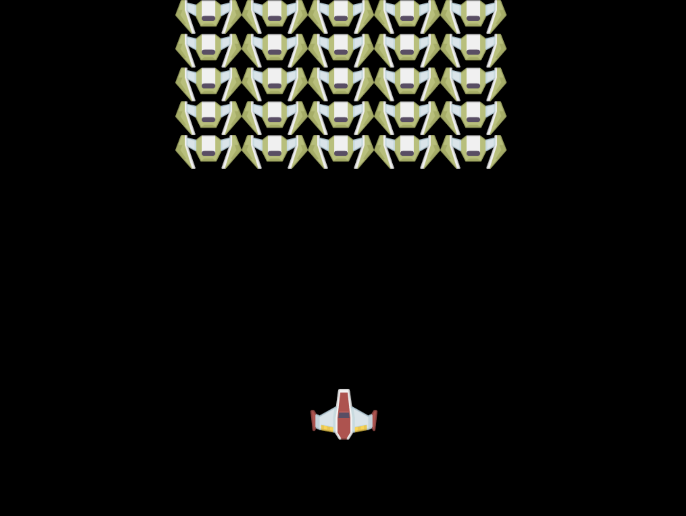

<!--
CO_OP_TRANSLATOR_METADATA:
{
  "original_hash": "056641280211e52fd0adb81b6058ec55",
  "translation_date": "2025-10-11T12:11:08+00:00",
  "source_file": "6-space-game/2-drawing-to-canvas/README.md",
  "language_code": "ta"
}
-->
# விண்வெளி விளையாட்டு உருவாக்கம் பகுதி 2: ஹீரோ மற்றும் மான்ஸ்டர்களை கேன்வாஸ் மீது வரையுங்கள்

## முன்-வகுப்பு வினாடி வினா

[முன்-வகுப்பு வினாடி வினா](https://ff-quizzes.netlify.app/web/quiz/31)

## கேன்வாஸ்

கேன்வாஸ் என்பது ஒரு HTML உருப்படி, இது இயல்பாக எந்த உள்ளடக்கமும் இல்லாமல் வெற்று தாளாக இருக்கும். நீங்கள் அதில் வரைய வேண்டும்.

✅ [கேன்வாஸ் API பற்றி மேலும் படிக்கவும்](https://developer.mozilla.org/docs/Web/API/Canvas_API) MDN-ல்.

இது பொதுவாக பக்கத்தின் உடலின் ஒரு பகுதியாக இவ்வாறு அறிவிக்கப்படுகிறது:

```html
<canvas id="myCanvas" width="200" height="100"></canvas>
```

மேலே, `id`, `width` மற்றும் `height` அமைக்கப்பட்டுள்ளது.

- `id`: இதை அமைத்தால், நீங்கள் அதில் தொடர்பு கொள்ள தேவையான நேரத்தில் ஒரு குறிப்பை பெறலாம்.
- `width`: இது உருப்படியின் அகலம்.
- `height`: இது உருப்படியின் உயரம்.

## எளிய வடிவங்களை வரையுதல்

கேன்வாஸ் பொருள்களை வரைய கார்டீசியன் கோட்பாட்டை பயன்படுத்துகிறது. எனவே, இது x-அச்சு மற்றும் y-அச்சு மூலம் எதாவது எங்கு உள்ளது என்பதை வெளிப்படுத்துகிறது. `0,0` இடம் மேல் இடது மூலையில் இருக்கும், மற்றும் கீழ் வலது மூலை உங்கள் கேன்வாஸ் அகலம் மற்றும் உயரமாக இருக்கும்.


> படம் [MDN](https://developer.mozilla.org/docs/Web/API/Canvas_API/Tutorial/Drawing_shapes) மூலம்

கேன்வாஸ் உருப்படியில் வரைய நீங்கள் பின்வரும் படிகளை கடந்து செல்ல வேண்டும்:

1. **கேன்வாஸ் உருப்படிக்கு ஒரு குறிப்பை பெறுங்கள்**.
1. **கேன்வாஸ் உருப்படியில் இருக்கும் Context உருப்படிக்கு ஒரு குறிப்பை பெறுங்கள்**.
1. **Context உருப்படியை பயன்படுத்தி ஒரு வரையல் செயல்பாட்டை செய்யுங்கள்**.

மேலே உள்ள படிகளுக்கான குறியீடு பொதுவாக இவ்வாறு இருக்கும்:

```javascript
// draws a red rectangle
//1. get the canvas reference
canvas = document.getElementById("myCanvas");

//2. set the context to 2D to draw basic shapes
ctx = canvas.getContext("2d");

//3. fill it with the color red
ctx.fillStyle = 'red';

//4. and draw a rectangle with these parameters, setting location and size
ctx.fillRect(0,0, 200, 200) // x,y,width, height
```

✅ கேன்வாஸ் API பெரும்பாலும் 2D வடிவங்களில் கவனம் செலுத்துகிறது, ஆனால் நீங்கள் 3D உருப்படிகளையும் ஒரு வலைத்தளத்தில் வரையலாம்; இதற்காக நீங்கள் [WebGL API](https://developer.mozilla.org/docs/Web/API/WebGL_API) பயன்படுத்தலாம்.

கேன்வாஸ் API மூலம் நீங்கள் பலவகையான பொருட்களை வரையலாம்:

- **கணித வடிவங்கள்**, நாம் ஏற்கனவே ஒரு செவ்வகத்தை வரைய எப்படி என்பதை காட்டியுள்ளோம், ஆனால் நீங்கள் மேலும் பலவற்றை வரையலாம்.
- **உரைகள்**, நீங்கள் எந்த எழுத்துரு மற்றும் நிறத்திலும் உரையை வரையலாம்.
- **படங்கள்**, நீங்கள் ஒரு .jpg அல்லது .png போன்ற படக்கோப்பை அடிப்படையாகக் கொண்டு ஒரு படத்தை வரையலாம்.

✅ முயற்சிக்கவும்! நீங்கள் ஒரு செவ்வகத்தை வரைய எப்படி என்பதை அறிந்துள்ளீர்கள், ஒரு வட்டத்தை ஒரு பக்கத்தில் வரைய முடியுமா? CodePen-ல் சில சுவாரஸ்யமான கேன்வாஸ் வரையல்களை பாருங்கள். இதோ ஒரு [மிகவும் ஆச்சரியமான உதாரணம்](https://codepen.io/dissimulate/pen/KrAwx).

## ஒரு படக்கோப்பை ஏற்றவும் மற்றும் வரையவும்

நீங்கள் ஒரு படக்கோப்பை ஏற்ற `Image` பொருளை உருவாக்கி அதன் `src` பண்பை அமைக்க வேண்டும். பின்னர், அது பயன்படுத்த தயாராக இருக்கும் போது அறிய `load` நிகழ்வை கேட்க வேண்டும். குறியீடு இவ்வாறு இருக்கும்:

### படக்கோப்பு ஏற்றுதல்

```javascript
const img = new Image();
img.src = 'path/to/my/image.png';
img.onload = () => {
  // image loaded and ready to be used
}
```

### படக்கோப்பு ஏற்றல் முறை

மேலே உள்ளதை ஒரு அமைப்பில் இவ்வாறு சுற்றி அமைப்பது பரிந்துரைக்கப்படுகிறது, இதனால் அதை பயன்படுத்த எளிதாக இருக்கும், மேலும் அது முழுமையாக ஏற்றப்பட்ட பிறகே நீங்கள் அதை மாற்ற முயற்சிக்க வேண்டும்:

```javascript
function loadAsset(path) {
  return new Promise((resolve) => {
    const img = new Image();
    img.src = path;
    img.onload = () => {
      // image loaded and ready to be used
      resolve(img);
    }
  })
}

// use like so

async function run() {
  const heroImg = await loadAsset('hero.png')
  const monsterImg = await loadAsset('monster.png')
}

```

விளையாட்டு பொருட்களை திரையில் வரைய உங்கள் குறியீடு இவ்வாறு இருக்கும்:

```javascript
async function run() {
  const heroImg = await loadAsset('hero.png')
  const monsterImg = await loadAsset('monster.png')

  canvas = document.getElementById("myCanvas");
  ctx = canvas.getContext("2d");
  ctx.drawImage(heroImg, canvas.width/2,canvas.height/2);
  ctx.drawImage(monsterImg, 0,0);
}
```

## இப்போது உங்கள் விளையாட்டை உருவாக்கத் தொடங்கும் நேரம்

### என்ன உருவாக்க வேண்டும்

நீங்கள் ஒரு கேன்வாஸ் உருப்படியுடன் ஒரு வலைப்பக்கத்தை உருவாக்க வேண்டும். இது ஒரு கருப்பு திரை `1024*768` அளவில் காட்ட வேண்டும். நாங்கள் உங்களுக்கு இரண்டு படங்களை வழங்கியுள்ளோம்:

- ஹீரோ கப்பல்

   

- 5*5 மான்ஸ்டர்

   

### பரிந்துரைக்கப்பட்ட படிகள்

`your-work` துணை கோப்பகத்தில் உருவாக்கப்பட்ட கோப்புகளை கண்டறியவும். இது பின்வருவனவற்றை கொண்டிருக்க வேண்டும்:

```bash
-| assets
  -| enemyShip.png
  -| player.png
-| index.html
-| app.js
-| package.json
```

இந்த கோப்பகத்தின் நகலை Visual Studio Code-ல் திறக்கவும். உங்களுக்கு ஒரு உள்ளூர் மேம்பாட்டு சூழல் அமைப்பு தேவை, Visual Studio Code உடன் NPM மற்றும் Node நிறுவப்பட்டிருக்க வேண்டும். உங்கள் கணினியில் `npm` அமைக்கப்படவில்லை என்றால், [அதை எப்படி செய்வது](https://www.npmjs.com/get-npm) என்பதை பாருங்கள்.

உங்கள் திட்டத்தை `your_work` கோப்பகத்தில் வழிநடத்துவதன் மூலம் தொடங்குங்கள்:

```bash
cd your-work
npm start
```

மேலே உள்ளது `http://localhost:5000` முகவரியில் ஒரு HTTP சர்வரை தொடங்கும். ஒரு உலாவியில் அந்த முகவரியை உள்ளிடவும். இது தற்போது ஒரு வெற்று பக்கம், ஆனால் அது மாறும்.

> குறிப்பு: உங்கள் திரையில் மாற்றங்களைப் பார்க்க உலாவியை புதுப்பிக்கவும்.

### குறியீடு சேர்க்கவும்

கீழே உள்ளதை தீர்க்க `your-work/app.js`-ல் தேவையான குறியீட்டை சேர்க்கவும்:

1. **கேன்வாஸ் வரைய** கருப்பு பின்னணி கொண்டது
   > குறிப்புரை: `/app.js`-ல் சரியான TODO-க்கு கீழே இரண்டு வரிகளைச் சேர்க்கவும், `ctx` உருப்படியை கருப்பாக அமைத்து மேல்/இடது இணைப்பு 0,0 மற்றும் கேன்வாஸ் அகலம் மற்றும் உயரத்துடன் சமமாக அமைக்கவும்.
2. **உருவங்களை ஏற்றவும்**
   > குறிப்புரை: `await loadTexture` மற்றும் பட பாதையை வழங்கி வீரர் மற்றும் எதிரி படங்களைச் சேர்க்கவும். நீங்கள் அவற்றை திரையில் இன்னும் காண முடியாது!
3. **ஹீரோவை திரையின் மையத்தில் கீழ் பாதியில் வரையவும்**
   > குறிப்புரை: `drawImage` API-யை பயன்படுத்தி heroImg-ஐ திரையில் வரையவும், `canvas.width / 2 - 45` மற்றும் `canvas.height - canvas.height / 4)` அமைக்கவும்.
4. **5*5 மான்ஸ்டர்களை வரையவும்**
   > குறிப்புரை: இப்போது எதிரிகளை திரையில் வரைய குறியீட்டை Uncomment செய்யலாம். பின்னர், `createEnemies` செயல்பாட்டிற்கு சென்று அதை உருவாக்கவும்.

   முதலில், சில மாறிகள் அமைக்கவும்:

    ```javascript
    const MONSTER_TOTAL = 5;
    const MONSTER_WIDTH = MONSTER_TOTAL * 98;
    const START_X = (canvas.width - MONSTER_WIDTH) / 2;
    const STOP_X = START_X + MONSTER_WIDTH;
    ```

    பின்னர், மான்ஸ்டர்களின் வரிசையை திரையில் வரைய ஒரு மடக்கத்தை உருவாக்கவும்:

    ```javascript
    for (let x = START_X; x < STOP_X; x += 98) {
        for (let y = 0; y < 50 * 5; y += 50) {
          ctx.drawImage(enemyImg, x, y);
        }
      }
    ```

## முடிவு

முடிந்த முடிவு இவ்வாறு இருக்க வேண்டும்:



## தீர்வு

முதலில் அதை நீங்கள் முயற்சிக்கவும், ஆனால் நீங்கள் சிக்கலாக இருந்தால், [தீர்வு](../../../../6-space-game/2-drawing-to-canvas/solution/app.js) பார்க்கவும்.

---

## 🚀 சவால்

நீங்கள் 2D-க்கு மையமாக இருக்கும் கேன்வாஸ் API பற்றி கற்றுக்கொண்டீர்கள்; [WebGL API](https://developer.mozilla.org/docs/Web/API/WebGL_API) பற்றி பாருங்கள், மற்றும் ஒரு 3D பொருளை வரைய முயற்சிக்கவும்.

## வகுப்புக்குப் பின் வினாடி வினா

[வகுப்புக்குப் பின் வினாடி வினா](https://ff-quizzes.netlify.app/web/quiz/32)

## மதிப்பீடு மற்றும் சுயபயிற்சி

கேன்வாஸ் API பற்றி மேலும் [படித்து அறியவும்](https://developer.mozilla.org/docs/Web/API/Canvas_API).

## பணிக்கட்டளை

[கேன்வாஸ் API-யுடன் விளையாடுங்கள்](assignment.md)

---

**அறிவிப்பு**:  
இந்த ஆவணம் [Co-op Translator](https://github.com/Azure/co-op-translator) என்ற AI மொழிபெயர்ப்பு சேவையை பயன்படுத்தி மொழிபெயர்க்கப்பட்டுள்ளது. நாங்கள் துல்லியத்திற்காக முயற்சிக்கிறோம், ஆனால் தானியங்கி மொழிபெயர்ப்புகளில் பிழைகள் அல்லது தவறுகள் இருக்கக்கூடும் என்பதை கவனத்தில் கொள்ளவும். அதன் சொந்த மொழியில் உள்ள மூல ஆவணம் அதிகாரப்பூர்வ ஆதாரமாக கருதப்பட வேண்டும். முக்கியமான தகவல்களுக்கு, தொழில்முறை மனித மொழிபெயர்ப்பு பரிந்துரைக்கப்படுகிறது. இந்த மொழிபெயர்ப்பைப் பயன்படுத்துவதால் ஏற்படும் எந்த தவறான புரிதல்களுக்கும் அல்லது தவறான விளக்கங்களுக்கும் நாங்கள் பொறுப்பல்ல.