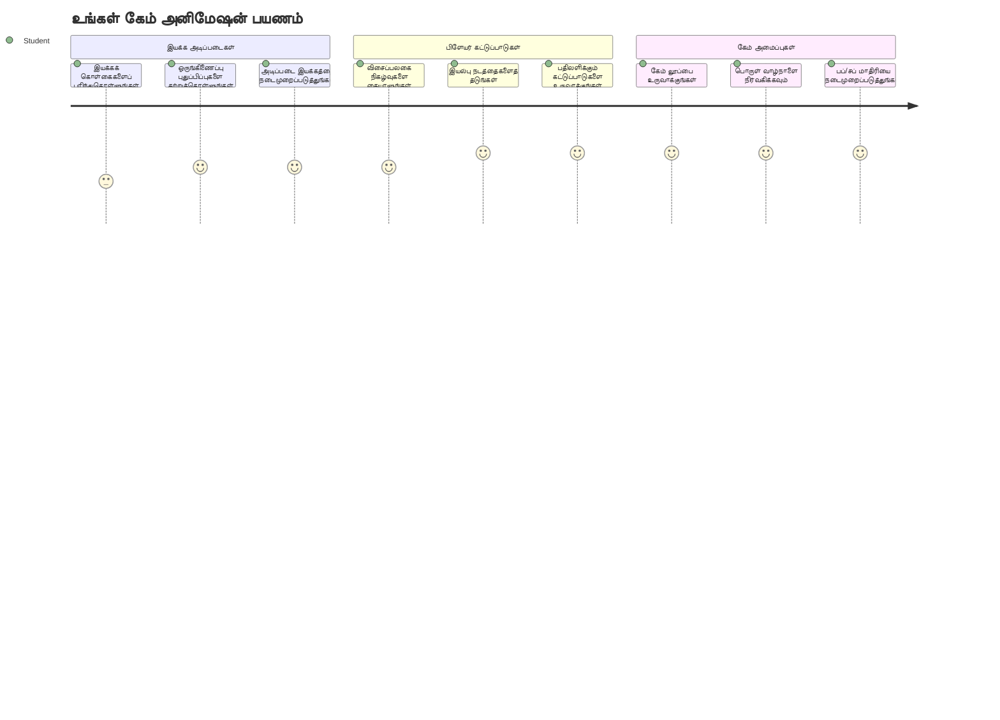
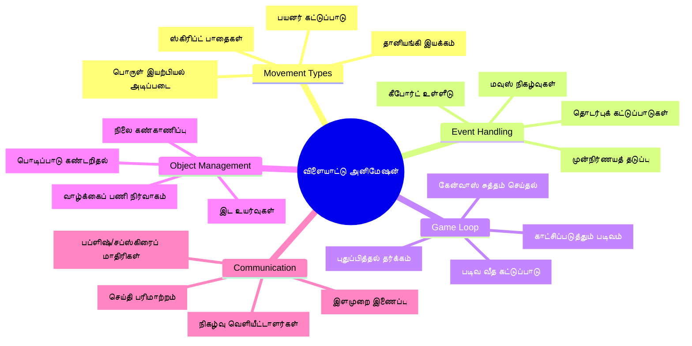
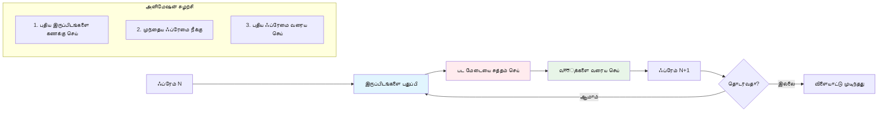
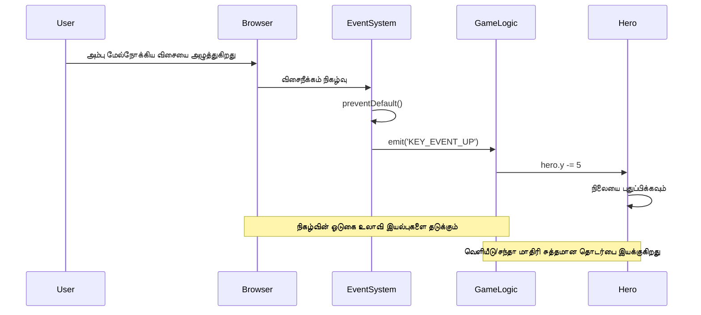
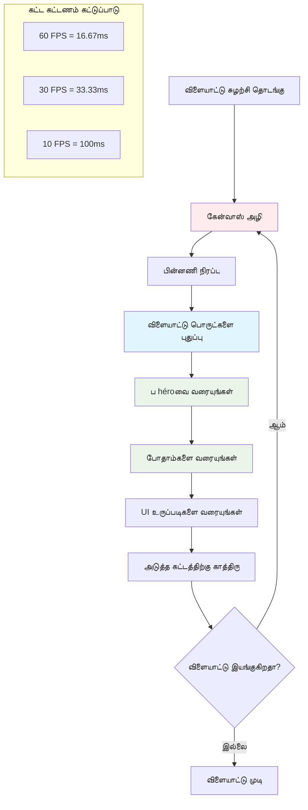
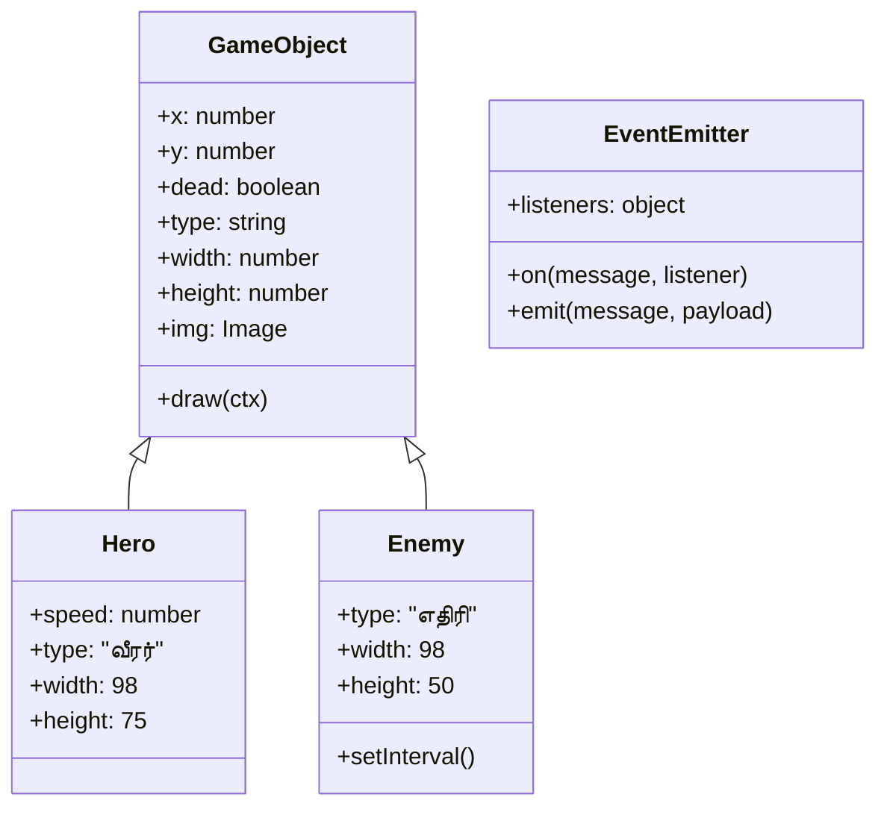
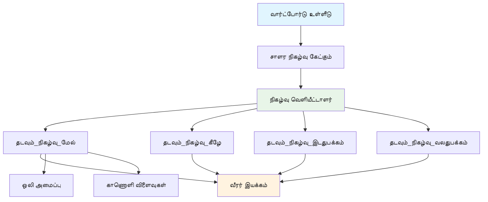
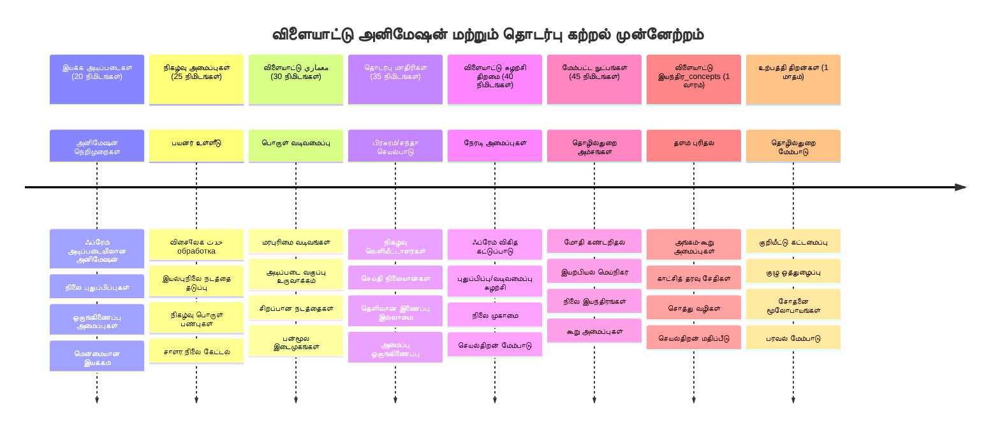

# ஒரு விண்வெளி விளையாட்டு உருவாக்கல் பாகம் 3: இயக்கத்தைச் சேர்த்தல்


உங்கள் பிடித்த விளையாட்டுகளைப் பற்றி யோசியுங்கள் – அவற்றை ஈர்க்கும் விஷயம் அழகான தோற்றம் மட்டுமல்ல, அது அனைத்தும் இயக்கம் கொண்டு உங்கள் செயல்களுக்கு பதிலளிப்பதே ஆகும். இப்போது, உங்கள் விண்வெளி விளையாட்டு ஒரு அழகான ஓவியம் போல இருக்கிறது, ஆனால் அதை உயிரோட்டம் கொண்டதாக்க இயக்கத்தைச் சேர்க்கப்போகின்றோம்.

அப்போலோ பணிகளுக்கு NASA பொறியாளர்கள் வழிகாட்டி கணினியை நிரலாக்கும்போது, அவர்கள் ஒரு போன்ற சவாலுக்கு முகம் கொடுத்தனர்: ஒருவர் விமானி கட்டுப்பாட்டுடன் விண்கலத்தை எப்படி பதிலளிக்கச் செய்வது என்றும் தானியங்கி பாதை திருத்தங்களை எவ்வாறு பராமரிப்பது என்பதையும் எப்படி உருவாக்குவது? நாமே இன்று கற்கப்போகும் கொள்கைகள் அந்த மேற்கோள்களை ஒலிக்கும் – பயனாளர் கட்டுப்படுத்தும் இயக்கத்தை தானியங்கி அமைப்பு நடத்தை உடன் ஒருங்கிணைப்பது.

இந்த பாடத்தில், நீங்கள் விண்கலங்களை திரையில் சுழற்சி செய்ய, பயனாளர் கட்டளைகளுக்கு பதிலளிக்க மற்றும் மென்மையான இயக்க படிவங்களை உருவாக்க கற்றுக்கொள்ளப்போகின்றீர்கள். அனைத்தையும் இயல்பான முறையில் ஒன்றுக்கு ஒன்று உருவாக்கும் தகுதிகளாக உடைத்து கொள்வோம்.

இறுதியில், நீங்கள் உங்கள் ஹீரோ விமானத்தை திரையில் பறக்க வைத்திருப்பீர்கள், எதிரிகள் மேல் பாகத்தில் சுற்றுலா செல்கிறார்கள். மிகவும் முக்கியமாக, நீங்கள் விளையாட்டு இயக்க அமைப்புகளுக்கு ஆற்றல் தரும் அடிப்படை கொள்கைகளைப் புரிந்து கொள்வீர்கள்.


## முன்-பாடக் கேள்வி

[முன்-பாடக் கேள்வி](https://ff-quizzes.netlify.app/web/quiz/33)

## விளையாட்டு இயக்கத்தைப் புரிந்து கொள்வது

விளையாட்டுகள் வாழ்க்கை பெறுகிறது போது பொருட்கள் இயங்கத் தொடங்கும், இது அடிப்படையில் இரண்டு விதங்களில் நடக்கிறது:

- **பயனாளர் கட்டுப்படுத்தும் இயக்கம்**: நீங்கள் ஒரு விசையை அழுத்தும் அல்லது மவுஸ் கிளிக் செய்யும் போது, ஏதாவது ஒன்று நகர்கிறது. இது உங்கள் மற்றும் உமது விளையாட்டு உலகம் இடையேயான நேரடி இணைப்பு.
- **தானியங்கி இயக்கம்**: விளையாட்டு தானாகவே பொருட்களை நகர்த்துகிறது – வடிவில் இருப்பதற்கு மேலே சுற்றி நடக்கும் எதிரி கப்பல்கள் போன்றவை.

கணினி திரையில பொருட்களை நகர்த்துவது நீங்கள் நினைக்கும் அளவிற்கு கடினமல்ல. கணித வகுப்பில் x மற்றும் y கோஆர்டினேட் பற்றி நினைவிருக்கிறதா? அதுதான் நாம இங்கே வேலை செய்கிறோம். 1610 இல் கலைலியோ ஜூபிட்டர் செயற்கைகளைக் கண்காணித்தபோது, வரிசை மாற்றங்களைப் புரிந்துகொள்ள இடத்தைக் குறிக்கும் வரைபடங்களை உருவாக்கினார் – அதே மாதிரி தான்.

திரையில பொருட்களை நகர்த்துவது ஒரு ஃபிளிப்புக் அனிமேஷன் உருவாக்கம போன்றது – நீங்கள் இந்த மூன்று எளிய படிகளை பின்பற்ற வேண்டும்:


1. **இடத்தை புதுப்பி** – உங்கள் பொருள் எங்கு இருக்க வேண்டும் (உதா: அதை வலது பக்கம் 5 பிக்சல்கள் நகர்த்தவும்)
2. **பழைய படத்தை அழி** – திரையைக் குழப்பமில்லாமல் தெளிவாக்குங்கள்
3. **புதிய படத்தை வரை** – உங்கள் பொருளை புதிய இடத்தில் வைக்கவும்

இதை வேகமாக செய்தால், புழுவுக்கு இயற்கையான மென்மையான இயக்கம் கிடைக்கும்.

இப்போ இதோ எப்படி கோடில் தோற்றமளிக்கிறது:

```javascript
// வீரனின் இடத்தை அமைக்கவும்
hero.x += 5;
// வீரரை வழங்கும் புகுவானை அகற்று
ctx.clearRect(0, 0, canvas.width, canvas.height);
// விளையாட்டு பின்னணி மற்றும் வீரரை மீண்டும் வரைக்கவும்
ctx.fillRect(0, 0, canvas.width, canvas.height);
ctx.fillStyle = "black";
ctx.drawImage(heroImg, hero.x, hero.y);
```

**இந்தக் கோடு என்ன செய்கிறது:**
- ஹீரோவின் x-கோஆர்டினேட்டை சுழற்சியாக 5 பிக்சல்கள் நகர்த்த **புதுப்பிக்கிறது**
- முந்தைய படத்தை அகற்ற கன்வாஸ் முழுவதும் **நீக்குகிறது**
- கருப்பு பின்னணி நிறத்தை கொண்டு கன்வாஸ் **நிறைக்கிறது**
- ஹீரோ படத்தை புதிய இடத்தில் மீண்டும் **வரைகிறது**

✅ ஹீரோவை பல படிகளில் மீண்டும் வரையவது காரணமாக செயல்திறன் குறைவுக்கு வழிவகுக்கும் காரணம் என்ன என்று நீங்கள் நான் முன்கூட்டியே நினைக்கிறீர்களா? இதில் உங்களுக்கு விருப்பமான [பதில்கள் இங்கே](https://developer.mozilla.org/en-US/docs/Web/API/Canvas_API/Tutorial/Optimizing_canvas) கொடுக்கப்பட்டுள்ளன.

## விசைப்பலகை நிகழ்வுகளை கையாளுதல்

இங்கு நாம் பயனாளர் உள்ளீட்டை விளையாட்டு செயலில் இணைக்கிறோம். ஒரு பயனர் எல்லையில்லா இடையில் ஒரு லேசர் பாய்ச்சspacebar அழுத்தும்போது அல்லது அலகு விசைகளை அழுத்தி அஸ்டராய்ட்டைத் தவிர்க்கும் போது, உங்கள் விளையாட்டு அந்த உள்ளீட்டை கண்டறிந்து அதற்கு பதிலளிக்க வேண்டும்.

விசைப் பழங்கள் முழு ஜன்னல் மட்டத்தில் நிகழ்கின்றன, அதாவது உங்கள் உலாவியின் முழு ஜன்னல் அந்த விசைப்பாச்சுகளுக்கு காத்திருக்கிறது. மவுஸ் கிளிக்குகள், மாறாக, குறிப்பிட்ட கூறுகளுடன் இணைக்கப்படலாம் (படிக்கு கிளிக் செய்வது போல). நமது விண்வெளி விளையாட்டு, இந்த வகையில் கிளாசிக் வற்புறுத்தலுடன் தேவைப்படுவதை கருத்தில் கொண்டு விசை கட்டுப்பாட்டில் பார்க்கப்போகிறது.

இதுவே 1800 களில் டெலிகிராப் இயக்குநர்கள் மோர்ஸ் குறியீடு உள்ளீட்டை அர்த்தமுள்ள செய்திகளாக மாற்றுவதற்காக செய்ததை நினைவூட்டுகிறது – நாம் அதே மாதிரியை செய்கிறோம், விசை அழுத்தங்களை விளையாட்டு கட்டளைகளாக மாற்றுகிறோம்.

ஒரு நிகழ்ச்சியை கையாள நீங்கள் வேண்டும் window இன் `addEventListener()` முறைதான், இது இரண்டு உள்ளீடு அளவுருக்களைப் பெறும். முதல் அளவுரு நிகழ்ச்சி பெயர், உதாரணமாக `keyup`. இரண்டாவது அளவுரு நிகழ்ச்சி நடந்தால் அழைக்கப்படும் செயல்பாடு ஆகும்.

எங்கே ஒரு உதாரணம்:

```javascript
window.addEventListener('keyup', (evt) => {
  // evt.key = முக்கியத்தின் स्ट्रिंग பிரதிநிதித்துவம்
  if (evt.key === 'ArrowUp') {
    // ஏதாவது செய்
  }
});
```

**விழா நிகழ்வுகள் இங்கே என்ன செய்கின்றன:**
- முழு ஜன்னலிலும் விசைப்பலகை நிகழ்வுகளை **காத்திருக்கிறது**
- எந்த விசை அழுத்தப்பட்டது என்பதைக் கொண்டுள்ள நிகழ்ச்சி பொருளை **பிடிக்கிறது**
- அழுத்தப்பட்ட விசை குறிப்பிட்ட விசையுடன் பொருந்துமா என்று **சரிபார்க்கிறது** (இதில் மேலதிக அம்பு விசை)
- நிபந்தனை பூர்த்தி செய்யப்பட்டால் **கோடு இயக்கப்படுகிறது**

விசை நிகழ்வுகளுக்கான இரண்டு சொத்துக்கள் உள்ளன, அவற்றை நீங்கள் விசையின் பெயர் பார்க்க பயன்படுத்தலாம்:

- `key` - இது அழுத்தப்பட்ட விசையின் எழுத்துரு வடிவம், உதா: `'ArrowUp'`
- `keyCode` - இது எண் வடிவம், உதா: `37`, இது `ArrowLeft` உடன் பொருந்தும்

✅ விசை நிகழ்வு செயலாக்கம் விளையாட்டு அபிவிருத்திக்கு வெளியே பயனுள்ளது. இந்த நுட்பத்திற்கு நீங்கள் வேறு எந்த பயன்பாடுகளை நினைக்க முடியும்?


### சிறப்பு விசைகள்: முக்கிய கவனம்!

சில விசைகளுக்கு உலாவிகளில் முன்செயலிகள் உள்ளன, அவை உங்கள் விளையாட்டை தடுக்கும். அம்பு விசைகள் பக்கம் ஸ்க்ரோல் செய்யும், spacebar கீழே பாயும் – ஒருவரும் விண்கலத்தை இயக்க முயற்சித்தால் இவை வேண்டாம்.

நாம் அந்த இயல்பான நடத்தை தடுப்பு செய்து, விளையாட்டு அந்த உள்ளீட்டை கையாள அனுமதிக்கலாம். இது பழைய கணினி நிரலாக்குநர்களும் அமைப்பு இடையூறுகளை மீள்வழி செய்வதுபோல் தான் – ஆனால் இங்கு உலாவி மட்டத்தில் செய்வதுதான். இது எப்படி செய்யப்படுகிறது:

```javascript
const onKeyDown = function (e) {
  console.log(e.keyCode);
  switch (e.keyCode) {
    case 37:
    case 39:
    case 38:
    case 40: // அம்பு விசைகள்
    case 32:
      e.preventDefault();
      break; // இடைவெளி
    default:
      break; // பிற விசைகளை தடுக்க வேண்டாம்
  }
};

window.addEventListener('keydown', onKeyDown);
```

**இந்த தடுப்பு குறியீட்டை புரிந்து கொள்வது:**
- உலாவியில் வேண்டாத நடத்தை ஏற்படுத்தக்கூடிய விசை குறியீடுகளை **சரிபார்க்கிறது**
- அம்பு விசைகள் மற்றும் spacebar இற்கு உலாவியின் இயல்பான செயல்பாட்டை **தடுக்கிறது**
- பிற விசைகள் இயல்பாக செயல்பட அனுமதிக்கிறது
- உலாவியின் முன்செயலியை நிறுத்த `e.preventDefault()` **பயன்படுத்தப்படுகிறது**

### 🔄 **கல்வி முன்னேற்றச் சோதனை**
**நிகழ்ச்சி கையாளல் புரிதல்**: தானியங்கி இயக்கத்திற்கு முன்னர் நீங்கள் செய்யக் கூடியவை:
- ✅ `keydown` மற்றும் `keyup` நிகழ்வுகளின் வேறுபாடு விளக்கவும்
- ✅ ஏன் உலாவி இயல்பான செயல்பாட்டை தடுக்கிறோம் என்று புரிந்து கொள்
- ✅ நிகழ்ச்சி கேட்டவர்கள் பயனாளர் உள்ளீட்டை விளையாட்டு லாஜிக்குடன் இணைப்பது எப்படி என்பதைக் கூறவும்
- ✅ எந்த விசைகள் விளையாட்டு கட்டுப்பாடுகளை பாதிக்கக்கூடும் என்று கையாளவும்

**அவசர சோதனை**: அம்பு விசைகளுக்கு இயல்புவழி செயல்பாடு தடுக்கப்படாவிட்டால் என்ன ஆகும்?
*பதில்*: உலாவி பக்கத்தை ஸ்க்ரோல் செய்யும், இது விளையாட்டு இயக்கத்துடன் முரண்படும்

**நிகழ்ச்சி அமைப்பு**: நீங்கள் இப்போது புரிந்து கொண்டுள்ளீர்கள்:
- **ஜன்னல் மட்ட கேட்கல்**: உலாவி மட்டத்தில் தன்முறை பிடித்தல்
- **நிகழ்ச்சி பொருள் சொத்துக்கள்**: `key` எழுத்து உடன் மற்றும் `keyCode` எண்கள்
- **முன்செயலி தடுப்பு**: வேண்டாத உலாவி நடத்தை நிறுத்தல்
- **நிபந்தனை லாஜிக்கல்**: குறிப்பிட்ட விசை இணைப்பிற்குப் பதிலளித்தல்

## விளையாட்டு தூண்டிய இயக்கம்

உடனடி பயனாளர் உள்ளீடு இல்லாமல் நகரும் பொருட்கள் பற்றி இப்போது பேசுவோம். திரையில் சுற்றி நடக்கும் எதிரி கப்பல்கள், நேர்கொண்டில் பறக்கும் நண்டு பொடிகள் அல்லது பின்னணி மேகங்கள் போன்றவை நினைத்துப் பார்க்கவும். இந்த தானியங்கி இயக்கம் உங்கள் விளையாட்டு உலகத்தை உயிரோடு உள்ளது என உணர்த்துகிறது.

நாம் JavaScript இன் கட்டமைக்கப்பட்ட டைமர் முறைகளை பயன்படுத்தி இடங்களை வழக்கமான இடைவெளியில் புதுப்பிக்கின்றோம். இது ஒரு நடுத்தரமான இயந்திரப்படி ஆகும் – ஒரு வழக்கமான முறையில் நியமிக்கப்பட்ட நேர செயல்களை தொடங்குகிறது. இங்கே எளிதாகவும் இருக்கலாம்:

```javascript
const id = setInterval(() => {
  // எதிரியை y அச்சில் நகர்த்துக
  enemy.y += 10;
}, 100);
```

**இந்த இயக்க குறியீடு என்ன செய்கின்றது:**
- ஒவ்வொரு 100 மில்லிசெகண்டிலும் ஓடும் டைமரை **உருவாக்குகிறது**
- ஒவ்வொரு முறையும் எதிரியின் y-கோஆர்டினேட்டை 10 பிக்சல்கள் **புதுப்பிக்கிறது**
- இடைவெளி ஐடியை முன்கூட்டியே நிறுத்தலாம் என்று **சேமிக்கிறது**
- எதிரியை திரையில் தானாக கீழே நகர வைத்துள்ளது

## விளையாட்டு தொடர்பு வட்டம்

இங்கே அனைத்தையும் இணைக்கும் கருத்து – விளையாட்டு தொடர்பு வட்டம். உங்கள் விளையாட்டு ஒரு படம் என்றால், அதை தொடர்ச்சியாக ஒளிரச் செய்வதற்கான ஓர் படம் தொலைபொருள் நேரடி கதையை போல் நடைபெறுகிறது.

ஒவ்வொரு விளையாட்டுக்கும் பின்னணியில் ஓர் இது இயங்குகிறது. அனைத்து விளையாட்டு பொருட்களை புதுப்பித்து திரையை மீண்டும் வரை மற்றும் இந்த செயல்களை மீண்டும் மீண்டும் செய்கின்ற ஒரு செயல்பாடு. இதனால் உங்கள் ஹீரோ, அனைத்து எதிரிகள், ஏதேனும் பாயும் லேசர்கள் – முழு விளையாட்டு நிலையை கண்காணிக்கிறது.

இது பழைய திரைப்பட அனிமேட்டர்கள் போலே வால்ட் டிஸ்னி போன்றவர்கள் தவிர்க்காதுபோல் வரைபடம் படி மீண்டும் மீண்டும் வரைவு செய்து இயக்கத்தை உருவாக்கினர் என்று நினைவு கூர்கிறது. நாமே அதே காரியத்தை, கோடுகளோடு முடிவு செய்கிறோம்.

விளையாட்டு தொடர்பு வட்டம் பொதுவாக இப்படிக்கூட இருக்கலாம், கீழே இருக்கும் கோடு வடிவில்:


```javascript
const gameLoopId = setInterval(() => {
  function gameLoop() {
    ctx.clearRect(0, 0, canvas.width, canvas.height);
    ctx.fillStyle = "black";
    ctx.fillRect(0, 0, canvas.width, canvas.height);
    drawHero();
    drawEnemies();
    drawStaticObjects();
  }
  gameLoop();
}, 200);
```

**விளையாட்டு தொடர்பு வட்ட அமைப்பு புரிதல்:**
- முந்தைய படத்தை அகற்ற திரையைக் முழுதும் **தெளிவாக்குகிறது**
- பின்னணியை ஒரு வண்ணத்துடன் **நிறைக்கிறது**
- அனைத்து விளையாட்டு பொருட்களை தற்போதைய இடங்களில் **வரைகிறது**
- ஒவ்வொரு 200 மில்லிசெகண்டிலும் இதைக் **மீண்டும் செய்யும்** மென்மையான அனிமேஷன் உருவாக்க
- இடைவெளி நேரத்தை கட்டுப்படுத்தி தோற்ற விகிதத்தைக் **நிர்வகிக்கிறது**

## விண்வெளி விளையாட்டை தொடர்வது

இப்போது முன்னதாக நீங்கள் கட்டிய நிலையான காட்சியில் இயக்கம் சேர்க்கப்போகிறோம். இது ஒரு ஸ்கிரின்ஷாட் இருந்து இடையறா அனுபவமாக மாற்றப் போகிறது. ஒவ்வொரு படியாகப் பணியை செய்யும்பொழுதும் அது முந்தையதை அமர்த்துவதை உறுதிப்படுத்திக் கொள்ளும்.

முந்தைய பாடத்திலிருந்து கோடுகளை எடுத்துக்கொள்ளவும் (அல்லது புதிய துவக்கம் தேவையெனில் [பகுதி II- துவக்கம்](../../../../6-space-game/3-moving-elements-around/your-work) கோப்புறையில் தொடங்கவும்).

**இன்று உருவாக்கப்போகிறதோர் விஷயங்கள்:**
- **ஹீரோ கட்டுப்பாடுகள்**: அம்பு விசைகள் உங்கள் விண்கலத்தை திரையில் இயக்கும்
- **எதிரி இயக்கம்**: அந்த அண்டை கப்பல்கள் முன்னேற்றத்தை தொடங்கும்

இந்த அம்சங்களை நடைமுறைப்படுத்த ஆரம்பிப்போம்.

## பரிந்துரைக்கபட்ட படிகள்

உங்கள் பணிக்குப் பயன்படுத்த `your-work` என்பது உள் கோப்புறையில் உருவாக்கப்பட்ட கோப்புகளை கண்டறியவும். அதில் பின்வருமாறு இருக்க வேண்டும்:

```bash
-| assets
  -| enemyShip.png
  -| player.png
-| index.html
-| app.js
-| package.json
```

நீங்கள் உங்கள் திட்டத்தை `your-work` கோப்புறையில் கீழ்காணும் கட்டளை மூலம் தொடங்கலாம்:

```bash
cd your-work
npm start
```

**இந்த கட்டளை என்ன செய்கிறது:**
- உங்கள் திட்ட அடைவை நோக்கி **நெவிகேட் செய்கிறது**
- `http://localhost:5000` என்ற முகவரியில் HTTP சர்வரை **தொடக்குகிறது**
- உலாவியில் விளையாட்டு கோப்புகளை சோதிக்க **சேவை செய்கிறது**

மேலே கூறிய முகவரியில் HTTP சர்வர் துவங்கும். உலாவியை திறந்து அந்த முகவரியை இப்போது புகுத்தவும், இதுவரை ஹீரோவும் அனைத்து எதிரிகள் திரையில் காட்சியளிக்கின்றன; ஆனால் ஒன்றும் நகரவில்லை!

### குறியீடு சேர்க்கவும்

1. `hero`, `enemy` மற்றும் `game object` என தனியான பொருட்களைச் சேர்க்கவும், அவற்றில் `x` மற்றும் `y` பண்புகள் இருக்க வேண்டும். ([பின்வாங்கல் அல்லது குழுமம்](../README.md) பற்றிய பகுதியை நினைவுகூரவும்).

   *அறிகுறி* `game object` தான் `x`, `y` உடன் canvas-இல் வரைபடம் வரைக்கும் திறன் கொண்டது.

   > **உதவி** : கீழே குறிப்பிடப்பட்டபடி புதிய `GameObject` வகுப்பை அதன் கட்டமைப்பாளரைக் கொண்டு உருவாக்கி, அதை கன்வாஸில் வரை தொடங்கவும்:

    ```javascript
    class GameObject {
      constructor(x, y) {
        this.x = x;
        this.y = y;
        this.dead = false;
        this.type = "";
        this.width = 0;
        this.height = 0;
        this.img = undefined;
      }
    
      draw(ctx) {
        ctx.drawImage(this.img, this.x, this.y, this.width, this.height);
      }
    }
    ```

    **இந்த அடிப்படை வகுப்பை புரிந்து கொள்ள:**
    - எல்லா விளையாட்டு பொருட்களும் பகிரும் பொதுவான பண்புகளை வரையறுக்கிறது (இடம், அளவு, படம்)
    - பொருளை நீக்க வேண்டுமானால் `dead` கொடியைக் கொண்டுள்ளது
    - கன்வாஸில் பொருளை வரைய `draw()` முறையை வழங்குகிறது
    - குழந்தை வகுப்புகள் மீளஎழுதி கொள்ளக்கூடிய இயல்புநிலை தரவுகளை அமைக்கிறது


    இப்போ, இந்த `GameObject` வகுப்புக்கு நீட்டிப்பு செய்து `Hero` மற்றும் `Enemy` உருவாக்குங்கள்:
    
    ```javascript
    class Hero extends GameObject {
      constructor(x, y) {
        super(x, y);
        this.width = 98;
        this.height = 75;
        this.type = "Hero";
        this.speed = 5;
      }
    }
    ```

    ```javascript
    class Enemy extends GameObject {
      constructor(x, y) {
        super(x, y);
        this.width = 98;
        this.height = 50;
        this.type = "Enemy";
        const id = setInterval(() => {
          if (this.y < canvas.height - this.height) {
            this.y += 5;
          } else {
            console.log('Stopped at', this.y);
            clearInterval(id);
          }
        }, 300);
      }
    }
    ```

    **இந்த வகுப்புகளின் முக்கிய கருத்துக்கள்:**
    - `extends` விசையைப் பயன்படுத்தி `GameObject` இருந்து பெறுகிறது
    - முன்னாள் கட்டமைப்பாளரை `super(x, y)` மூலம் அழைக்கிறது
    - ஒவ்வொரு பொருள் வகைக்கும் தனித்துவமான பரிமாணங்களையும் பண்புகளையும் அமைக்கிறது
    - எதிரிகளுக்காக டைமர் மூலம் தன்னிச்சையுள்ள இயக்கத்தை நடைமுறைப்படுத்துகிறது (`setInterval()`)

2. விசை நிகழ்வு கையாளர்களைச் சேர்க்கவும், விசை வழிசெலுத்தலை கையாள (ஹீரோவை மேலே/கீழே இடது/வலது நகர்த்துதல்)

   *மறக்கவேண்டாம்* இது கார்டீஷியன் அமைப்பு, மேல் இடது தூண் `0,0`. இயல்பான நடைமுறையை நிறுத்தவும் வசதி சேர்க்கவும்.

   > **உதவி**: உங்கள் `onKeyDown` செயல்பாட்டை உருவாக்கி அதை window-க்கு இணைக்கவும்:

   ```javascript
   const onKeyDown = function (e) {
     console.log(e.keyCode);
     // இயல்புநிலை நடத்தை நிறுத்த மேலே உள்ள பாடத்தின் கோடுகளைச் சேர்க்கவும்
     switch (e.keyCode) {
       case 37:
       case 39:
       case 38:
       case 40: // அம்பு விசைகள்
       case 32:
         e.preventDefault();
         break; // இடைவெளி
       default:
         break; // மற்ற விசைகளுக்கு தடையாக இருக்க வேண்டாம்
     }
   };

   window.addEventListener("keydown", onKeyDown);
   ```
    
   **இந்த நிகழ்வு கையாள எதை செய்கிறது:**
   - முழு ஜன்னலிலும் keydown நிகழ்வுகளை **காத்திருக்கிறது**
   - எந்த விசை அழுத்தப்பட்டது என்பதை அறிய keyCode-ஐ **பதிவுசெய்கிறது**
   - அம்பு விசைகள் மற்றும் spacebar க்கான இயல்பான உலாவி செயல்பாட்டை **தடுக்கிறது**
   - பிற விசைகள் இயல்பாக இயங்க அனுமதிக்கிறது
   
   இப்போது உலாவி கன்சோலை பார், விசைப்பிடிப்புகளை பதிவு செய்கிறது.

3. [பப் சப் முறை](../README.md) நியமிக்கவும், இது மீதமுள்ள பகுதிகளைச் செயல்படுத்தும் பொழுது உங்கள் குறியீட்டை சுத்தமாக வைத்திருக்கும்.

   பதிப்பு-சந்தா முறை நிகழ்வு கண்டறிதலை நிகழ்வு கையாளலிலிருந்து பிரித்து உங்கள் குறியீட்டை வகுப்பாக்கி பராமரிப்பதை எளிதாக்கும்.

   இதை செய்ய:

   1. ஜன்னலில் நிகழ்வு கேட்டவர் ஒன்று சேர்க்கவும்:

       ```javascript
       window.addEventListener("keyup", (evt) => {
         if (evt.key === "ArrowUp") {
           eventEmitter.emit(Messages.KEY_EVENT_UP);
         } else if (evt.key === "ArrowDown") {
           eventEmitter.emit(Messages.KEY_EVENT_DOWN);
         } else if (evt.key === "ArrowLeft") {
           eventEmitter.emit(Messages.KEY_EVENT_LEFT);
         } else if (evt.key === "ArrowRight") {
           eventEmitter.emit(Messages.KEY_EVENT_RIGHT);
         }
       });
       ```

   **இந்த நிகழ்வு அமைப்பு என்ன செய்கிறது:**
   - விசை உள்ளீட்டை கண்டறிந்து தனிப்பட்ட விளையாட்டு நிகழ்வாக மாற்றுகிறது
   - உள்ளீட்டு கண்டறிதலை விளையாட்டு லாஜிக் க்கு பிரிக்கிறது
   - கட்டுப்பாடுகளை எளிதாக மாற்ற வழிவகுக்கிறது
   - ஒரே உள்ளீட்டிற்கு பல அமைப்புகள் பதிலளிக்க செய்யும்


   2. செய்திகளை வெளியிட்டு சந்தா செய்ய EventEmitter வகுப்பை உருவாக்கவும்:

       ```javascript
       class EventEmitter {
         constructor() {
           this.listeners = {};
         }
       
         on(message, listener) {
           if (!this.listeners[message]) {
             this.listeners[message] = [];
           }
           this.listeners[message].push(listener);
         }
       
   3. மாறிலிகள் மற்றும் EventEmitter அமைப்புகளைச் சேர்க்கவும்:

       ```javascript
       const Messages = {
         KEY_EVENT_UP: "KEY_EVENT_UP",
         KEY_EVENT_DOWN: "KEY_EVENT_DOWN",
         KEY_EVENT_LEFT: "KEY_EVENT_LEFT",
         KEY_EVENT_RIGHT: "KEY_EVENT_RIGHT",
       };
       
       let heroImg, 
           enemyImg, 
           laserImg,
           canvas, ctx, 
           gameObjects = [], 
           hero, 
           eventEmitter = new EventEmitter();
       ```

   **இந்த அமைப்பை புரிந்துகொள்ள:**
   - எழுத்துப்பிழைகள் தவிர்க்க செய்தி மாறிகளை வரையறுக்கிறது, மாற்றம் எளிதாக்குகிறது
   - படங்கள், கன்வாஸ் சூழல் மற்றும் விளையாட்டு நிலைக்கான மாறிலிகளை அறிவிக்கிறது
   - பதிப்பு-சந்தா அமைப்புக்கு உலகளாவிய காட்சி emitter ஐ உருவாக்குகிறது
   - **எல்லா கேம் பொருட்களை** வைத்திருக்க ஒரு வரிசை உருவாக்குகிறது

   4. **கேம்னை துவக்குகிறது**

       ```javascript
       function initGame() {
         gameObjects = [];
         createEnemies();
         createHero();
       
         eventEmitter.on(Messages.KEY_EVENT_UP, () => {
           hero.y -= 5;
         });
       
         eventEmitter.on(Messages.KEY_EVENT_DOWN, () => {
           hero.y += 5;
         });
       
         eventEmitter.on(Messages.KEY_EVENT_LEFT, () => {
           hero.x -= 5;
         });
       
4. **கேம் லூப்பை அமைக்கிறது**

   `window.onload` செயல்பாட்டை மறுதொடக்கம் செய்து, கேம்னை துவக்கி ஒரு சிறந்த இடைவெளியில் கேம் லூப்பை அமைக்கவும். நீங்கள் ஒரு லேசர் பீமும் சேர்க்கப் போகிறீர்கள்:

    ```javascript
    window.onload = async () => {
      canvas = document.getElementById("canvas");
      ctx = canvas.getContext("2d");
      heroImg = await loadTexture("assets/player.png");
      enemyImg = await loadTexture("assets/enemyShip.png");
      laserImg = await loadTexture("assets/laserRed.png");
    
      initGame();
      const gameLoopId = setInterval(() => {
        ctx.clearRect(0, 0, canvas.width, canvas.height);
        ctx.fillStyle = "black";
        ctx.fillRect(0, 0, canvas.width, canvas.height);
        drawGameObjects(ctx);
      }, 100);
    };
    ```

   **கேம் அமைப்பை புரிந்துகொள்ளுதல்:**
   - **பக்கத்தை** முழுமையாக ஏற்றுமுன் காத்திருக்கும்
   - **கேன்வாஸ்** எலிமென்டையும் அதன் 2D வரைபட நிர்வாகத்தையும் பெறுகிறது
   - **`await` பயன்படுத்தி** அனைத்து பட ஆஸ்ஸெட்களையும் அசிங்க்ரனாக ஏற்றுகிறது
   - **கேம் லூப்பை** 100ms இடைவெளியில் (10 FPS) இயக்க ஆரம்பிக்கிறது
   - **ஒவ்வொரு படத்திலும்** முழு திரையை அழித்து மறுபடக்கிறது

5. **எதிரிகளைக்** குறிப்பிட்ட இடைவெளியில் நகர்த்தும் குறியீட்டை சேர்க்கவும்

    `createEnemies()` செயல்பாட்டை மறுதொடக்கம் செய்து எதிரிகளை உருவாக்கி, அவற்றை புதிய gameObjects வகுப்பில் சேர்:

    ```javascript
    function createEnemies() {
      const MONSTER_TOTAL = 5;
      const MONSTER_WIDTH = MONSTER_TOTAL * 98;
      const START_X = (canvas.width - MONSTER_WIDTH) / 2;
      const STOP_X = START_X + MONSTER_WIDTH;
    
      for (let x = START_X; x < STOP_X; x += 98) {
        for (let y = 0; y < 50 * 5; y += 50) {
          const enemy = new Enemy(x, y);
          enemy.img = enemyImg;
          gameObjects.push(enemy);
        }
      }
    }
    ```

    **எதிரி உருவாக்கும் செயல்பாட்டின் செயல்கள்:**
    - **திரையைச்** சுற்றி எதிரிகளின் நிலைகளை கணக்கிடுகிறது
    - **உள்ளோட்ட பின்னிக்குழுக்களை** பயன்படுத்தி எதிரிகளின் கோப்பை உருவாக்குகிறது
    - **ஒவ்வொரு எதிரிக்கும்** எதிரி படத்தை ஒதுக்குகிறது
    - **ஒவ்வொரு எதிரியையும்** உலகளாவிய கேம் பொருட்கள் வரிசையில் சேர்க்கிறது
    
    மேலும், ஒரு `createHero()` செயல்பாட்டைக் கொண்டு கதாபாத்திரத்திற்கும் இதே செயல்முறையை செய்யவும்.
    
    ```javascript
    function createHero() {
      hero = new Hero(
        canvas.width / 2 - 45,
        canvas.height - canvas.height / 4
      );
      hero.img = heroImg;
      gameObjects.push(hero);
    }
    ```

    **கதாப்பாத்திரம் உருவாக்கும் செயல்பாட்டின் செயல்கள்:**
    - **கதாப்பாத்திரத்தை** திரையின் கீழ் மையத்தில் அமைக்கிறது
    - **கதாப்பாத்திர படத்தை** கதாப்பாத்திர பொருளுக்கு ஒதுக்குகிறது
    - **கேம் பொருட்கள் வரிசையில்** கதாபாத்திரத்தைச் சேர்க்கிறது

    இறுதியாக, வரைவதைத் துவங்க `drawGameObjects()` செயல்பாட்டை சேர்:

    ```javascript
    function drawGameObjects(ctx) {
      gameObjects.forEach(go => go.draw(ctx));
    }
    ```

    **வரைபட செயல்பாட்டை புரிந்துகொள்ளுதல்:**
    - **வரிசையில் உள்ள** அனைத்து கேம் பொருட்களையும் சுற்றி நடக்கும்
    - **ஒவ்வொரு பொருளிலும்** `draw()` முறைப்பாடை அழைக்கும்
    - **கேன்வாஸ் நிர்வாகத்தை** எடுத்து, பொருட்கள் தானாக தங்களைக் காட்சிப்படுத்தும்

    ### 🔄 **கற்றல் சரிபார்ப்பு**
    **முழுமையான கேம் அமைப்பை அறிதல்**: உங்கள் புகழை சரிபார்க்கவும்:
    - ✅ எவ்வாறு வாரிசை பெறு (Inheritance) ஹீரோ மற்றும் எதிரிக்கு பொதுவான GameObject பண்புகளை பகிர உதவுகிறது?
    - ✅ pub/sub வடிவமைப்பு எப்படி உங்கள் குறியீட்டினை மேலாண்மையாக்கிறது?
    - ✅ மென்மையான அனிமேஷனுக்காக கேம் லூப் செய்யும் பங்கு என்ன?
    - ✅ நிகழ்வு கேட்கும் செயலிகள் (event listeners) பயனர் உள்ளீட்டுடன் கேம் இயல்புகளை எவ்வாறு இணைக்கின்றன?

    **கணினி ஒருங்கிணைப்பு**: உங்கள் கேம் இப்போது காட்டுகிறது:
    - **பொருள்-அடிப்படையிலான வடிவமைப்பு**: சிறப்பு வாரிசையின் உள்ளடக்க வகுப்புகள்
    - **நிகழ்வு சார்ந்த கட்டமைப்பு**: pub/sub வடிவமைப்பு மூலம் தொலைத்தள்ளுதல்
    - **அனிமேஷன் கட்டமைப்பு**: ஒரேநிலை கொண்ட கேம் லூப்
    - **உள்ளீட்டு நிர்வாகம்**: விசைப்பலகை நிகழ்வுகளை உட்படுத்துதல்
    - **ஆஸ்ஸெட் மேலாண்மை**: படம் ஏற்றல் மற்றும் ஸ்பிரைட் வரைபடம்

    **தொழில்முறை மாதிரிகள்**: நீங்கள் செயல்படுத்தியுள்ளீர்கள்:
    - **கவனங்களை பிரித்தல்**: உள்ளீடு, துக்கம் மற்றும் வரைபடம் பிரித்தல்
    - **பலவகைமை (Polymorphism)**: அனைத்து கேம் பொருட்களும் பொதுவான வரைபட இடைமுகத்தை பகிர்கிறது
    - **செய்தி பரிமாற்றம்**: கூறுகளுக்கு இடையில் சுத்தமான தொடர்பு
    - **வள மேலாண்மை**: திறமையான ஸ்பிரைட் மற்றும் அனிமேஷன் கையாளுதல்

    உங்கள் எதிரிகள் உங்கள் ஹீரோ விண்வெளி படகை நோக்கி முன்னேறத் துவங்க வேண்டும்!
      }
    }
    ```
    
    and add a `createHero()` function to do a similar process for the hero.
    
    ```javascript
    function createHero() {
      hero = new Hero(
        canvas.width / 2 - 45,
        canvas.height - canvas.height / 4
      );
      hero.img = heroImg;
      gameObjects.push(hero);
    }
    ```

    இறுதியாக, வரைவதைத் துவங்க `drawGameObjects()` செயல்பாட்டை சேர்:

    ```javascript
    function drawGameObjects(ctx) {
      gameObjects.forEach(go => go.draw(ctx));
    }
    ```

    உங்கள் எதிரிகள் உங்கள் ஹீரோ விண்வெளி படகை நோக்கி முன்னேறத் துவங்க வேண்டும்!

---

## GitHub Copilot முகவர் சவால் 🚀

உங்கள் கேமின் ஒளிமயப்பை மேம்படுத்தும் சவால் இதோ: எல்லைகளைச் சேர்ந்த மற்றும் மென்மையான கட்டுப்பாடுகளைச் சேர்க்கவும். தற்போது, உங்கள் ஹீரோ திரையை விட்டு புறப்படக்கூடிய நிலையில் உள்ளது, நகர்வு சிறு இடைவெளிகளால் இடைவிடாது தோன்றலாம்.

**உங்கள் பணி:** உங்கள் விண்வெளி படகை திரையின் எல்லைகளுக்குள் வைக்கும் மற்றும் கட்டுப்பாடுகளை மென்மையாக உணரச் செய்வது. NASA விமான கட்டுப்பாட்டுக் கணினிகள் விண்வெளி கருவி பயன்பாட்டை பாதுகாக்கும் முறையைப் போல.

**செய்ய வேண்டியவை:** உங்கள் ஹீரோ விண்வெளி படகை திரையில் நிறுத்தும் மற்றும் கட்டுப்பாடுகளைத் தொடர்ச்சியாக இயக்கும் ஒரு அமைப்பை உருவாக்குங்கள். வில்லங்க விசையைப் பிடித்துக் கொண்டிருக்கும் போது, கப்பல் கண் பிள்ளையாக மெல்லிசையாக நகர வேண்டும். திரை எல்லையை அடைந்த போது வேறுபட்ட ஒரு படர் எதிரொலி போன்ற சிறிய விளைவுகளைப் பரிசீலியுங்கள்.

[agent mode](https://code.visualstudio.com/blogs/2025/02/24/introducing-copilot-agent-mode) பற்றி மேலும் அறிக.

## 🚀 சவால்

குறியீட்டு அமைப்பை அதிகமாக கவனம் செலுத்துவது தேவையானது. உங்கள் கோப்பு பல செயல்பாடுகள், மாறிலிகள் மற்றும் வகுப்புகளுடன் நிரம்பி இருக்கலாம். இது அப்பல்லோ பணி குறியீடுகளின் போல் தெளிவான மற்றும் பராமரிக்கக்கூடிய அமைப்புகளை உருவாக்க வேண்டிய அவசியத்தை நினைவூட்டுகிறது.

**உங்கள் பணி:**
ஒரு மென்பொறியியல் கட்டிட நிபுணராக எண்ணுங்கள். ஆறு மாதங்களுக்கு பிறகு, நீங்கள் அல்லது உங்கள் குழுவினர் யாராவது அதில் என்ன நடக்கிறது என்பதை எளிதில் புரிந்துகொள்ளும் வகையில் உங்கள் குறியீட்டை எவ்வாறு அமைப்பீர்கள்? எல்லாம் ஒரு கோப்பில் இருந்தாலும்:

- **சார் செயல்பாடுகளை** தெளிவான தலைப்புக்களுடன் ஒழுங்குபடுத்து
- **பதவிகளை பிரித்து** கேம் லாஜிக் மற்றும் வரைபடம் வேறு இடங்களில் வைக்க
- **ஒரே மாதிரி பெயரிடல்** முறைகளை பயன்படுத்தி மாறிலிகள் மற்றும் செயல்பாடுகளை பெயரிடு
- **மாடுல்கள் அல்லது பெயர்வாயில்கள்** மூலம் கேம் பாகங்களை பிரி
- **பிரதான பகுதிகளின் நோக்கத்தை விளக்கும்** ஆவணப்படுத்தல் சேர்க்க

**தயாரிப்பு கேள்விகள்:**
- மீண்டும் திரும்பி பார்க்கும்போது உங்கள் குறியீட்டில் எவை அதிகமாக புரிய கஷ்டமாக இருக்கும்?
- வேறு யாராவது பணியாற்ற எளிதில் உங்கள் குறியீட்டை எப்படி அமைக்க முடியும்?
- பவர்-அப்புகள் அல்லது வெவ்வேறு எதிரி வகைகள் போன்ற புதிய அம்சங்களை சேர்க்க விரும்பினால் என்ன நடக்கும்?

## பாடநூல் பின்கட்டளை தேர்வு

[பாடநூல் பின்கட்டளை தேர்வு](https://ff-quizzes.netlify.app/web/quiz/34)

## மதிப்பாய்வு & சுய படிப்பு

நாம் அனைத்தையும் தொடக்கத்திலிருந்து கட்டியுள்ளோம், இது கற்றல் நல்லது, ஆனால் சிறிய ரகசியம் – பல அருமையான ஜாவாஸ்கிரிப்ட் கண்டுபிடிப்புக்கள் உள்ளன. அடிப்படைகளை அழகாக கற்ற பிறகு, [கிடைக்கும் ப்ரேம்வொர்க் களை ஆராய்வது](https://github.com/collections/javascript-game-engines) மதிப்புறுத்தத்தக்கது.

பிரேம்வொர்க்கள் ஒரு நன்கு ஆயத்தமான கருவிப்பெட்டி போல, அனைத்து கருவிகளையும் கைவினை செய்ய வேண்டிய அவசியமில்லை. அவை நிறைய குறியீட்டு ஒழுங்குமுறை பிரச்சனைகளை தீர்க்கும், மேலும் நீங்கள் வாரங்களுக்கு எடுத்துக் கொள்ளும் அம்சங்களையும் ஆகியவை வழங்கும்.

**ஆராய்வதற்கு மதிப்புள்ள விஷயங்கள்:**
- கேம் என்ஜின்கள் குறியீட்டை எவ்வாறு ஒழுங்குபடுத்துகின்றன – அதின் நுண்ணறிவான மாதிரிகள் மயக்கும்
- கேன்வாஸ் கேம்கள் மென்மையாக இயங்கும் திறன்கள்
- நவீன ஜாவாஸ்கிரிப்ட் அம்சங்கள், உங்கள் குறியீட்டை சுத்தமாகவும் பராமரிக்கக்கூடியதாகவும் மாற்றும்
- கேம் பொருட்கள் மற்றும் அவற்றின் தொடர்புகளை நிர்வகிப்பதில் வேறுபட்ட அணுகுமுறைகள்

## 🎯 உங்கள் கேம் அனிமேஷன் நிபுணத்துவ காலஅட்டவணை


### 🛠️ உங்கள் கேம் மேம்பாட்டு கருவி சுருக்கம்

இந்த பாடத்தைக் கடந்த பிறகு, நீங்கள் அடைந்துள்ளீர்கள்:
- **அனிமேஷன் கொள்கைகள்**: பட அடிப்படையிலான இயக்கங்கள் மற்றும் மென்மையான மாற்றங்கள்
- **நிகழ்வு சார்ந்த நிரலாக்கம்**: விசைப்பலகை உள்ளீடு மற்றும் சரியான நிகழ்வு நிர்வாகம்
- **பொருள்-அடிப்படை வடிவமைப்பு**: வாரிசை மற்றும் பலவகைமை இடைமுகங்கள்
- **தகவல் பரிமாற்ற வாரியாதிகள்**: பராமரிக்கப்பட்ட குறியீட்டுக்கான pub/sub கட்டமைப்பு
- **கேம் லூப் கட்டமைப்பு**: நேரடியாக மேம்படுத்தல் மற்றும் வரைபட சுழற்சிகள்
- **உள்ளீட்டு முறைகள்**: பயனர் கட்டுப்பாடு மற்றும் இயல்பான தடுப்பு
- **ஆஸ்ஸெட் மேலாண்மை**: ஸ்பிரைட் ஏற்றல் மற்றும் திறமையான வரைபடத் தொழில்நுட்பங்கள்

### ⚡ **அடுத்த 5 நிமிடங்களில் செய்யவேண்டியது**
- [ ] உலாவி கன்பியுடன் `addEventListener('keydown', console.log)` பயன்படுத்தி விசைப்பலகை நிகழ்வுகளை பரிசோதிக்க
- [ ] எளிய div உருவாக்கி அதனை அம்பு விசைகள் கொண்டு நகர்த்து பாருங்கள்
- [ ] தொடர்ச்சியான இயக்கம் செய்ய `setInterval` முயற்சி செய்யவும்
- [ ] `event.preventDefault()` உடன் இயல்பான செயல்பாட்டை தடுப்பதை முயற்சி செய்யவும்

### 🎯 **இந்த மணிக்கு நீங்கள் எதை அடையலாம்**
- [ ] பாடத்துக்குப் பின் தேர்வை முடித்து நிகழ்வு சார்ந்த நிரலாக்கத்தை புரிந்து கொள்
- [ ] முழு விசைப்பலகை கட்டுப்பாடுகளுடன் நகரும் கதாப்பாத்திர விண்வெளி படகை உருவாக்கு
- [ ] மென்மையான எதிரி நகர்வு மாதிரிகளை செயல்படுத்து
- [ ] கேம் பொருட்கள் திரையை விட்டு வெளியேறாமல் எல்லைகளைச் சேர்த்து பாதுகாப்பு
- [ ] அடிப்படை மோதல் கண்டறிதல் முறையை உருவாக்கு

### 📅 **உங்கள் ஒரு வார அனிமேஷன் பயணம்**
- [ ] முழுமையான விண்வெளி கேம்னை மென்மையான இயக்கமும் தொடர்புகளும் கொண்ட உருவாக்கு
- [ ] வளைவுகள், வேகம் மற்றும் இயற்பியல் போன்ற மேம்பட்ட இயக்க முறைகளைச் சேர்க்கவும்
- [ ] மென்மையான மாற்றங்கள் மற்றும் ஈசிங் செயல்பாடுகளை செயல்படுத்தவும்
- [ ] துகள்கள் விளைவுகள் மற்றும் காட்சி எதிரொலி அமைப்புகளை உருவாக்கவும்
- [ ] மென்மையான 60fps கேம் செயல்திறனை மேம்படுத்து
- [ ] மொபைல் தொடுதடையங்கள் மற்றும் பதிலளிக்கும் வடிவமைப்பைச் செயல்படுத்து

### 🌟 **உங்கள் மாத வாய்ந்த தொடர்புடைய மேம்பாடு**
- [ ] மேம்பட்ட அனிமேஷன் அமைப்புகளுடன் சிக்கலான தொடர்புடைய பயன்பாடுகளை கட்டமை
- [ ] GSAP போன்ற அனிமேஷன் நூலகங்களை கற்றுக் கொள்ளவும் அல்லது உங்கள் சொந்த அனிமேஷன் இயந்திரம் உருவாக்கவும்
- [ ] திறந்த மூல கேம் மேம்பாட்டு மற்றும் அனிமேஷன் திட்டங்களுக்கு தானாகக் கொடை செய்யவும்
- [ ] காட்சி-மிகுந்த செயல்பாட்டிற்கான மேம்படுத்தல் நிபுணத்துவம் பெறவும்
- [ ] கேம் மேம்பாடு மற்றும் அனிமேஷன் குறித்து கல்வி உள்ளடக்கத்தை உருவாக்கவும்
- [ ] மேம்பட்ட தொடர்புடைய நிரலாக்க திறன்களை வெளிப்படுத்தும் ஒரு தொகுப்பை கட்டமை

**உண்மையான உலக பயன்பாடுகள்**: உங்கள் கேம் அனிமேஷன் திறன்கள் நேரடியாக பயன்படும் இடங்கள்:
- **தொடர்புடைய வலை பயன்பாடுகள்**: இயக்க நிரல்களும் நேரடி இடைமுகங்களும்
- **தரவு காட்சி**: அனிமேஷன் செய்யப்பட்ட ஆண்டுகள் மற்றும் தொடர்புடைய வரைபடங்கள்
- **கல்வி மென்பொருள்**: தொடர்புடைய அரியல்பாடுகள் மற்றும் கற்றல் கருவிகள்
- **சொந்த மேலாண்மை**: தொடுதொடர் கேம்கள் மற்றும் உடல் பெருக்கல்
- **டெஸ்க்டாப் பயன்பாடுகள்**: சீரான அனிமேஷன்களுடன் எலக்ட்ரான் பயன்பாடுகள்
- **வலை அனிமேஷன்கள்**: CSS மற்றும் ஜாவாஸ்கிரிப்ட் அனிமேஷன் நூலகங்கள்

**நீங்கள் பெற்ற தொழில்முறை திறன்கள்**: நீங்கள் இப்போது:
- **கட்டுமான** நிகழ்வு சார்ந்த அமைப்புகளை சிக்கலுடன் பிரித்து வடிவமைக்க முடியும்
- **உடல் வசதிகள்** கொண்ட மென்மையான அனிமேஷன்களை கணிதத்துடன் நுணுக்கமாக செயல்படுத்த முடியும்
- **சிக்கலான தொடர்பாட்டைப் பற்றி** உலாவி வடிவமைப்புப் பண்புகளுடன் கண்டுபிடிக்க முடியும்
- **பல்வேறு சாதனங்கள் மற்றும் உலாவிகளுக்கான கேம் செயல்திறனை மேம்படுத்த முடியும்**
- **தொழில்முறை மாதிரிகளைப் பயன்படுத்தி பராமரிக்கக்கூடிய குறியீட்டுப் படிவங்களை வடிவமைக்க முடியும்**

**கேம் மேம்பாட்டு கருத்துக்கள்**:
- **பட நிலை மேலாண்மை**: FPS மற்றும் நேர நிர்வாகம் உணர்வு
- **உள்ளீடு கையாளல்**: பல தள விசைப்பலகை மற்றும் நிகழ்வு செயல்கள்
- **பொருள் வாழ்நாள்**: உருவாக்குதல், மேம்படுத்தல் மற்றும் அழிக்கும் உதாரணங்கள்
- **அமைப்புக் குறைவான ஐக்கிய நிலை**: கேம் நிலையை ஒரு படத்தில் ஒருமையாக வைத்திருத்தல்
- **நிகழ்வு கட்டமைப்பு**: கேம் அமைப்புகளுக்கு இடையேயான அசல் தொடர்பு

**அடுத்த கட்டம்**: நீங்கள் மோதல் கண்டறிதல், மதிப்பெண் அமைப்புகள், ஒலி விளைவுகள் சேர்க்க அல்லது Phaser அல்லது Three.js போன்ற நவீன கேம் ப்ரேம்வொர்க் களை ஆராய முடியும்!

🌟 **சாதனை முடிந்தது**: நீங்கள் தொழில்முறை கட்டமைப்புகள் கொண்ட முழுமையான தொடர்புடைய கேம் அமைப்பை வெற்றிகரமாக உருவாக்கியுள்ளீர்கள்!

## பணியிடைப்பு

[உங்கள் குறியீட்டை கருத்திடவும்](assignment.md)

---

<!-- CO-OP TRANSLATOR DISCLAIMER START -->
**குறிப்பு**:  
இந்த ஆவணம் [Co-op Translator](https://github.com/Azure/co-op-translator) எனப்படும் AI மொழிபெயர்ப்பு சேவையை பயன்படுத்தி மொழிபெயர்க்கப்பட்டது. நாங்கள் மிகுந்த துல்லியத்திற்காக முயலினாலும், தானாகச் செய்யப்படும் மொழிபெயர்ப்புகளில் தவறுகள் அல்லது துல்லியமற்றப் படிப்புகள் இருக்கலாம் என்பதை தயவுசெய்து கவனத்தில் கொள்ளவும். அசல் ஆவணம் அதன் சொந்த மொழியில் அதிகாரப்பூர்வ ஆதாரமாக கருதப்பட வேண்டும். முக்கியமான தகவல்களுக்கு, தொழில்முறை மனித மொழிபெயர்ப்பு பரிந்துரைக்கப்படுகிறது. இந்த மொழிபெயர்ப்பின் பயன்பாட்டில் ஏற்படும் எந்த தவறறிதலும் அல்லது தவறான புரிதலுக்கும் நாங்கள் பொறுப்பேற்காதோம்.
<!-- CO-OP TRANSLATOR DISCLAIMER END -->