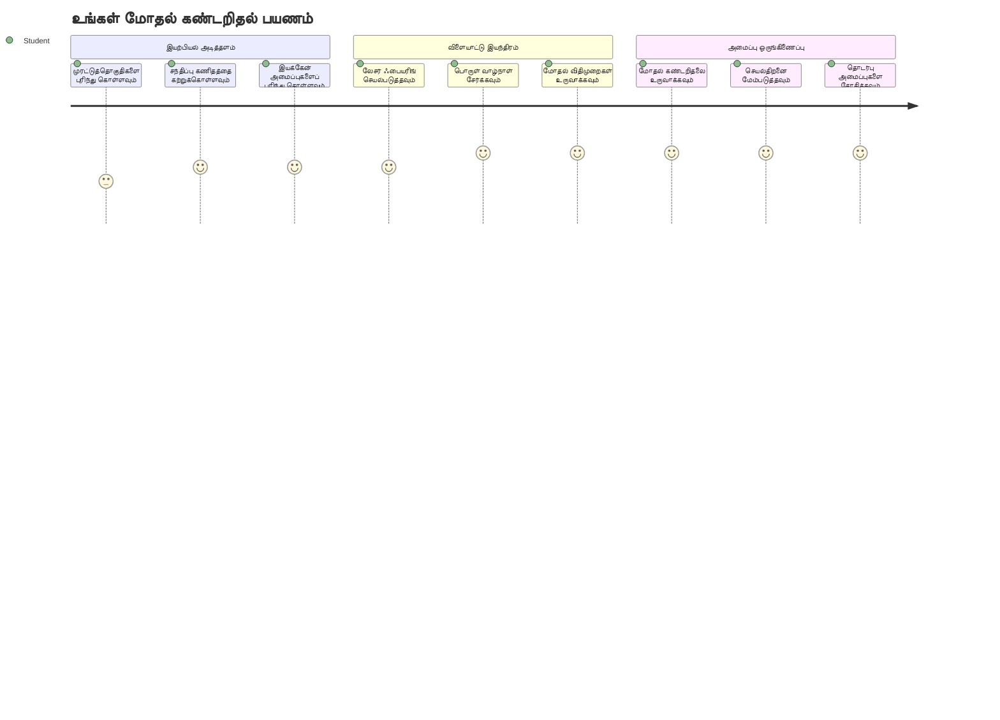
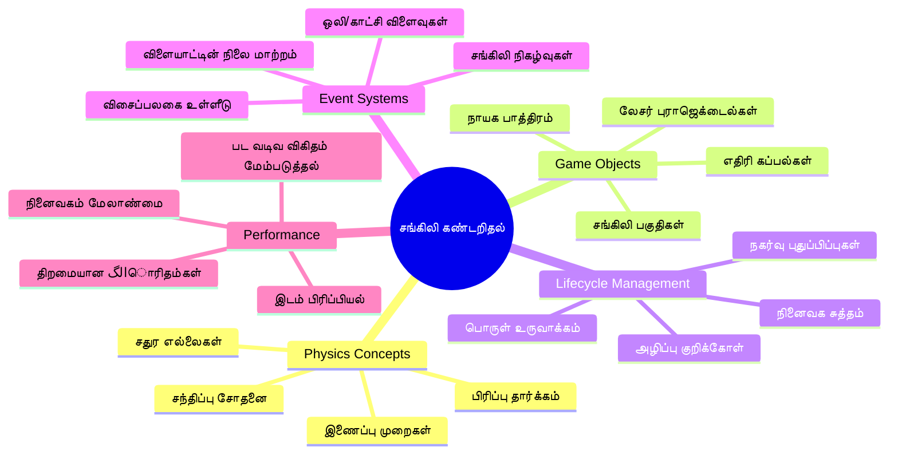
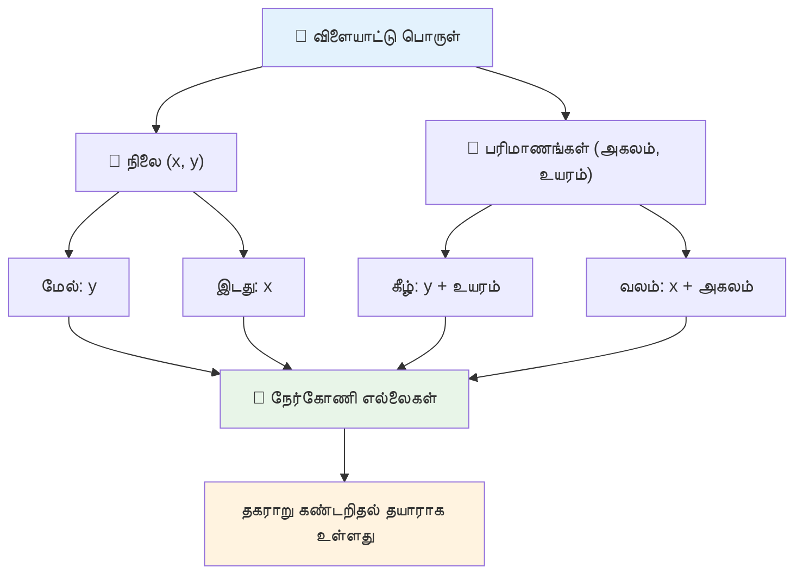
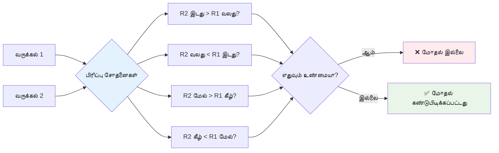
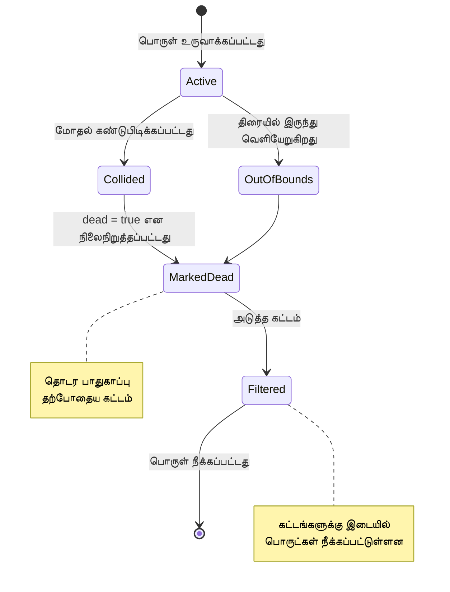
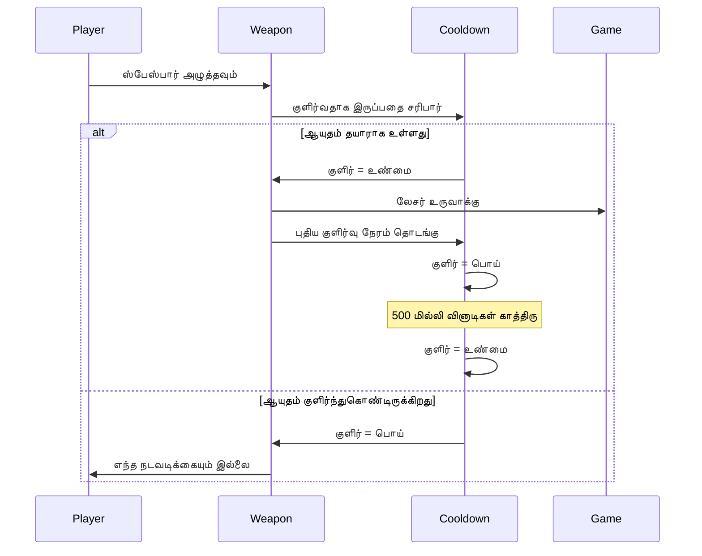
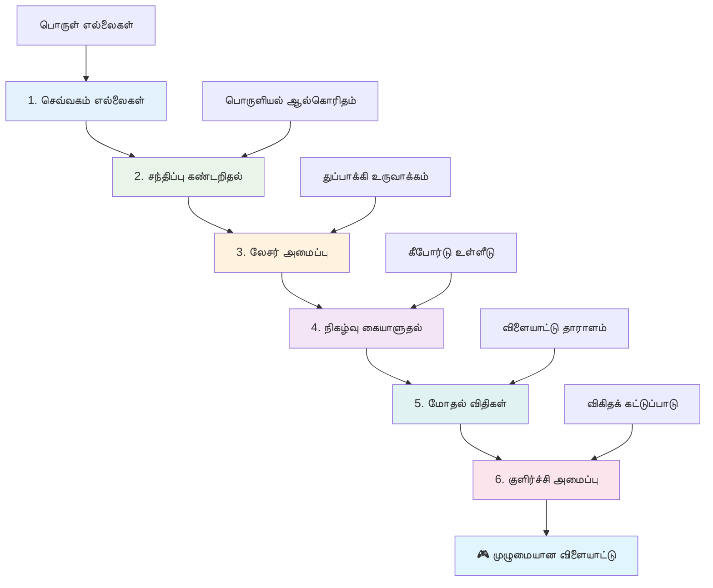
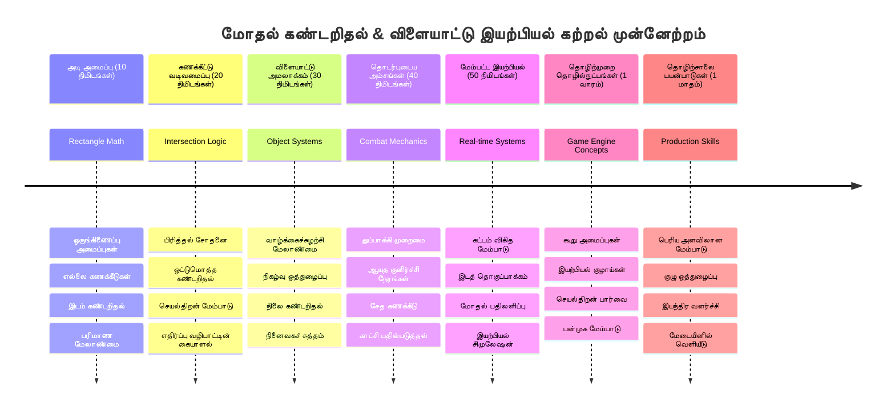

<!--
CO_OP_TRANSLATOR_METADATA:
{
  "original_hash": "039b4d8ce65f5edd82cf48d9c3e6728c",
  "translation_date": "2026-01-07T13:02:00+00:00",
  "source_file": "6-space-game/4-collision-detection/README.md",
  "language_code": "ta"
}
-->
# விண்ணில் விளையாட்டு உருவாக்கம் பகுதி 4: லேசர் சேர்த்து மோதி விழுப்புகளை கண்டறிதல்


## முன்-பாட நிகழலைத் தேர்வு

[முன்-பாட நிகழலைத் தேர்வு](https://ff-quizzes.netlify.app/web/quiz/35)

ஸ்டார் வார்ஸில் லூக் ப்ரோட்டான் டோர்பிடோஸ் டெத் ஸ்டாரின் எக்ஸாஸ்ட் போர்ட்டை தாக்கும் தருணத்தைச் சிந்தியுங்கள். அந்த துல்லியமான மோதி விழுப்பானது கோளாரசின் விதியை மாற்றியது! விளையாட்டுகளில், மோதி விழுப்பு அதே விதமாக செயல்படுகிறது - அது பொருட்கள் எப்போது தொடர்பு கொள்கின்றன என்பதை நிர்ணயித்து அடுத்தது என்ன நடக்கும் என்று தீர்மானிக்கிறது.

இந்த பாடத்தில், நீங்கள் உங்கள் விண்ணில் விளையாட்டிற்கு லேசர் ஆயுதங்களைச் சேர்த்து மோதி விழுப்புக் கண்டறிதலை நடைமுறைப்படுத்துவீர்கள். NASA யின் விண்வெளி புரோஜெக்ட் திட்டமிடுநர்கள் கிரக சிரித்தல்களைத் தவிர்க்க பயணிகள் பாதைகளை கணக்கிடுவது போல, நீங்கள் விளையாட்டு பொருட்கள் எப்போது சந்திக்கின்றன என்பதை கண்டறிவது கற்றுக்கொள்வீர்கள். இதை பரிமாணமான படிகளாக பிரித்து ஒன்றுக்கு மேற்பட்ட படிப்புகளாக அமைப்போம்.

இறுதியில், லேசர்கள் எதிரி பொருட்களை அழித்து, மோதி விழுப்பு விளையாட்டு நிகழ்வுகளை நிகழ்த்தும் செயற்கை போராட்ட அமைப்பை உருவாக்குவீர்கள். இது போன்ற மோதி விழுப்பு தத்துவங்கள் புவியியல் சிமுலேஷன்களிலிருந்து இடைமுக வலைதளங்கள் வரை அனைத்திலும் பயன்படுத்தப்படுகின்றன.


✅ முதல் கணினி விளையாட்டு என்னென்ன செயல்பாடுகளை கொண்டிருந்தது என்று சிறிது ஆராயுங்கள்.

## மோதி விழுப்புக்கு

மோதி விழுப்பு அபாலோ நிலா கப்பலின் அருகாமை சென்சர்களுக்கு இணையான முறையில் செயல்படுகிறது - இது அடிக்கடி தூரங்களை பரிசோதித்து பொருட்கள் மிக நெருக்கமாக வந்தால் அறிவிப்புகளைத் தெளிவுபடுத்துகிறது. விளையாட்டுகளில், இந்த அமைப்பு பொருட்கள் எப்போது சந்திக்கின்றன மற்றும் அடுத்ததாக என்ன நடக்க வேண்டும் என்று நிர்ணயிக்கிறது.

எங்கள் அணுகுமுறை ஒவ்வொரு விளையாட்டு பொருளையும் சரிவரியான சிலம்படமாக கருதுகிறது, விமான வர்த்தக கண்காணிப்பு அமைப்புகள் விமானங்களை கண்காணிக்க எளிய புவியியல் வடிவங்களைப் பயன்படுத்துகின்றது போன்று. இந்த சிலம்படை முறை அடிப்படையானதாக தோன்றலாம், ஆனால் கணக்கீட்டுப் பொருத்தமாகவும் பெரும்பாலான விளையாட்டு சூழலுக்கு மிகவும் பொருத்தமாகவும் உள்ளது.

### சிலம்படக் குறித்த விளக்கம்

ஒவ்வொரு விளையாட்டு பொருளுக்கும் இடம் குறித்த வரம்பு கோர்டினேட்டுகள் தேவை, மார்ஸ் பாத்ஃபைண்டர் ரோவர் கிரகத்தின் மேற்பரப்பில் தன் இடத்தை வரைபடப்படுத்தியது போல. இந்த வரம்புப் புள்ளிகளைக் கீழ்காணும் படி வரையறுக்கலாம்:


```javascript
rectFromGameObject() {
  return {
    top: this.y,
    left: this.x,
    bottom: this.y + this.height,
    right: this.x + this.width
  }
}
```

**இதனை விளக்கிக் கொள்வோம்:**
- **மேல் ஓரம்**: உங்கள் பொருள் உள்நோக்கி தொடங்கும் இடம் (y நிலை)
- **இடது ஓரம்**: கோளியோடு தொடங்கும் இடம் (x நிலை)
- **கீழ் ஓரம்**: y நிலைக்கு உயரம் கூட்டி - எங்கெங்கே முடிவடைகிறது என்று தெரியும்
- **வலது ஓரம்**: x நிலைக்கு அகலம் கூட்டி - முழுமையான வரம்பும் கிடைத்தது

### சந்திப்பு கண்காணிப்பு கலக்கு

சிலம்பட சந்திப்பை கண்டறிதல் ஹபிள் விண்வெளிக் கண்ணோட்டக் குழு விண்மீன்கள் அவன் பார்வையில் மேலிருந்து கீழ் ஒருங்கிணைந்துள்ளதா என்று நோக்குவதுபோல கேள்விகளை பரிசோதிக்கிறது. அல்கொரிதம் பிரித்து பார்ப்பதைச் செய்கிறது:


```javascript
function intersectRect(r1, r2) {
  return !(r2.left > r1.right ||
    r2.right < r1.left ||
    r2.top > r1.bottom ||
    r2.bottom < r1.top);
}
```

**பிரிவு சோதனை ரேடார் அமைப்புகளைப் போல செயல்படுகிறது:**
- சிலம்படம் 2 முழுமையாக சிலம்படம் 1 இன் வலப்பகுதியில் உள்ளதா?
- சிலம்படம் 2 முழுமையாக சிலம்படம் 1 இன் இடப்பகுதியில் உள்ளதா?
- சிலம்படம் 2 முழுமையாக சிலம்படம் 1 இன் கீழே உள்ளதா?
- சிலம்படம் 2 முழுமையாக சிலம்படம் 1 இன் மேலே உள்ளதா?

இந்த நிபந்தனைகளில் ஒன்றும் உண்மையல்ல என்றால், சிலம்படங்கள் ஒருவருக்கொருவர் சந்திக்கின்றன. இந்த அணுகுமுறை ரேடார் இயங்குநர்கள் இரண்டு விமானங்கள் பாதுகாப்பான தூரத்தில் உள்ளதா என்பதைப் பார்க்கும் முறையைப் போல் உள்ளது.

## பொருள் வாழ்வு நிர்வாகம்

ஒரு லேசர் எதிரியை தாக்கும்போது, இரு பொருள்களும் விளையாட்டில் இருந்து அகற்றப்பட வேண்டும். எனினும் இடையே பொருட்களை நீக்குவதால் முறைகேடுகள் ஏற்பட வாய்ப்பு உள்ளது - இது அபாலோ வழிகாட்டு கணினியின் காலத்திலேயே தெரிந்து கொண்ட பாடம். அதற்கு பதிலாக, ஒருவேளை காலத்துக்கு இடையில் பொருள்களை நீக்காமல் "நீக்க குறி" முறையைப் பயன்படுத்துகிறோம்.


பொருள் அகற்ற குறி செய்வது:

```javascript
// அகற்றுவதற்காக பொருளை குறிக்கவும்
enemy.dead = true;
```

**இந்த அணுகுமுறை ஏன் வேலை செய்கிறது:**
- பொருளை "சாவு" என்று குறி செய்கிறது ஆனால் உடனே நீக்கவில்லை
- இதனால் தற்போதைய விளையாட்டு படி அமைதியாக முடிகிறது
- ஏற்கனவே அகற்றப்பட்ட ஒன்றை பயன்படுத்த முயற்சித்து நிகழும் முறைகேடுகளைத் தடுக்கும்!

பின்னர் குறிக்கப்பட்ட பொருட்களை அடுத்த படம் வரை பிரித்து நீக்குங்கள்:

```javascript
gameObjects = gameObjects.filter(go => !go.dead);
```

**இந்த வடிகட்டும் செயல்பாடு:**
- "சுயமரியாதை உள்ள" பொருட்களுடன் புதிய பட்டியலை உருவாக்குகிறது
- சாவானது குறிக்கப்பட்டவை அகற்றப்படுகின்றன
- உங்கள் விளையாட்டு மெதுவாக நடக்க உதவுகிறது
- அழிக்கப்பட்ட பொருட்களால் நினைவக அதிகப்படியான அழுத்தம் ஏற்படதில்லை

## லேசர் இயந்திர செயல்முறை

விளையாட்டுகளில் லேசர் வெடிக்கணக்குகள் ஸ்டார் டிரெக் பாட்டன் போல செயல்படுகிறது - அவை வளைந்தோ, சுழலோ இல்லாமல் நேராக பயணம் செய்கின்றன வரை விடப்படுகின்றன. ஒவ்வொரு உங்கள் இடைவெளி விசையை அழுத்தும் போது புதிய லேசர் பொருள் உருவாகி திரையில் வந்து அணிகிறது.

இதற்கு செயல்பட சில கூறுகளை ஒருங்கிணைக்க வேண்டும்:

**நடைமுறை அம்சங்கள்:**
- **உருவாக்குங்கள்** ஹீரோவின் இடத்தில் இருந்து லேசர் பொருட்களை உருவாக்குதல்
- **கையாளுங்கள்** விசைப்பலகை உள்ளீட்டை லேசர் உருவாக்க தூண்டுதல்
- **மேற்கொள்ளுங்கள்** லேசர் இயக்கம் மற்றும் வாழ்விட நிர்வாகம்
- **நிகழ்த்துங்கள்** லேசர் இயக்கங்களுக்கான காட்சி வடிவமைப்புகள்

## துப்பாக்கி சுடும் விகிதக் கட்டுப்பாடு

முடிவற்ற துப்பாக்கிச் சுடுதல்கள் என்று இருந்தால் விளையாட்டு இயந்திரம் மூடப்படுவதைத் தடுக்கும் மற்றும் விளையாட்டு மிக எளிதாகலாம். உண்மையான ஆயுத அமைப்புகளுக்கும் இதுபோன்ற கட்டுப்பாடுகள் இருக்கின்றன - USS எண்டர்பிரைஸ் பாஸர்களும் சுடுகாட்டுக்கு இடையில் சுமைகள் இருந்தன.

குளிர்ச்சித்துறை அமைப்பில் ஒருமுறைச் செயல்பாடுகள் அதிகமாக இல்லாமல் கட்டுப்படுவீர்கள்.


```javascript
class Cooldown {
  constructor(time) {
    this.cool = false;
    setTimeout(() => {
      this.cool = true;
    }, time);
  }
}

class Weapon {
  constructor() {
    this.cooldown = null;
  }
  
  fire() {
    if (!this.cooldown || this.cooldown.cool) {
      // லேசர் வில்லட் உருவாக்கவும்
      this.cooldown = new Cooldown(500);
    } else {
      // ஆயுட்கலம் இன்னும் குளிர்ந்து கொண்டு உள்ளது
    }
  }
}
```

**குளிர்ச்சித்துறை எப்படி வேலை செய்கிறது:**
- உருவாக்கும் போது ஆயுதம் "வெப்பமாக" தொடங்குகிறது (சுட முடியாத நிலையில்)
- தாமத காலம் முடிந்த பிறகு "குளிர்" ஆகிறது (சுட தயாராக)
- சுடும் முன் சரிபார்க்கின்றோம்: "ஆயுதம் குளிரா?"
- இதனால் விரைவான அழுத்தங்களால் விளையாட்டு பிழை வராமல் கட்டுப்பாடு உள்ளது

✅ சுடும் நேரத்தை தினமும் பார்க்க மாதவிடாய விளையாட்டு தொடக்கக் பாடத்தை மீண்டும் பாருங்கள்.

## மோதி விழுப்பு அமைப்பு கட்டுவது

நீங்கள் ஏற்கனவே செய்த விண்வெளி விளையாட்டு குறியீட்டிற்குச் மோதி விழுப்புத் திட்டத்தை நீட்டிப்பீர்கள். சர்வதேச விண்வெளி நிலையத்தின் தானாக மோதி விழுப்பு தவிர்க்கும் அமைப்பைப் போல உங்கள் விளையாட்டு தொடர்ச்சியாக பொருள் இடங்களை கண்காணித்து சந்திப்புகளுக்கு பதிலளிக்கும்.

முன்பு செய்த குறியீட்டின் அடிப்படையில், மோதி விழுப்புக் காண தனிச்சட்டங்களுடன் சேர்க்கப்படுவீர்கள்.

> 💡 **திறமை குறிப்புகள்**: லேசர் ஸ்பிரைட் ஏற்கனவே உங்கள் சொத்துகள் கோப்பகத்தில் உள்ளது மற்றும் குறியீட்டில் குறிப்பிட்டப்பட்டுள்ளது, பயன்படுத்த தயார்.

### செயல்படுத்த வேண்டிய மோதி விதிகள்

**விளையாட்டு இயந்திர அம்சங்கள்:**
1. **லைசர் எதிரியை தாக்கும்**: லேசர் வெடிப்பால் எதிரி அழிக்கப்படும்
2. **லைசர் திரை எல்லையைத் தாக்கும்**: திரையின் மேல் ஓரத்தை எட்டும் போது லேசர் அகற்றப்படும்
3. **எதிரி மற்றும் ஹீரோ மோதி**: எதுவும் இல்லாமல் இரண்டும் அழிக்கப்படும்
4. **எதிரி கீழ் அடைவது**: எதிரிகள் திரையின் கீழ் அடைவதுடன் விளையாட்டு முடியும்

### 🔄 **கல்வி சரிபார்ப்பு**
**மோதி விழுப்பு அடிப்படை**: செயல்படுத்த முன்னால் உங்களுக்கு தெரிந்துகொள்ளவேண்டும்:
- ✅ சிலம்பட வரம்புகளால் மோதி வரம்புகளை நிர்ணயிக்கும் விதம்
- ✅ பிரிவு சோதனை மூலம் மேம்பட்ட திறமைகள் மற்றும் கணக்காய்வு முடக்கங்கள்
- ✅ விளையாட்டு சுற்றுச்சுழறலில் பொருள் வாழ்வுத் தரவுகள் நிர்வாகம்
- ✅ நிகழ்வு சார்ந்த அமைப்பால் மோதி பதில்கள் ஒருங்கிணைப்பு

**சிறிய தன்னைச் சோதனை**: நீங்கள் பொருட்களை உடனே நீக்காமல் குறி செய்தால் என்னும் பட்சத்தில் என்ன நடக்கும்?
*பதில்: சுழறலில் இடையில் நீக்குவதால் முறைகேடு அல்லது பொருட்கள் தள்ளப்படலாம்*

**புவியியல் உணர்வு**: இப்போது நீங்கள் புரிந்துகொண்டது:
- **கோர்டினேட் அமைப்புகள்**: நிலை மற்றும் பருமன் வரம்புகளை உருவாக்கும் நிலைகள்
- **சந்திப்பு தத்துவம்**: மோதி விழுப்பு பின்னணியியல் முறைகள்
- **செயல்திறன் மேம்பாடு**: நேரடி கணினியில் திறமையான அல்கொரிதங்கள் முக்கியத்துவம்
- **நினைவக மேலாண்மை**: நிலைத்தன்மைக்கான பொருள் வாழ்வு பராமரிப்பு

## உங்கள் மேம்பாட்டு சுற்றுச்சூழலை அமைத்தல்

நல்ல செய்தி - பெரும்பான்மையான அடிக்கடி பணிகள் நாம் ஏற்கனவே அமைத்துவிட்டோம்! உங்கள் எல்லாப் பொருட்களும் அடிப்படை அமைப்பும் `your-work` அடைவில் காத்திருக்கிறது, அங்கே நீங்கள் வெற்றிகரமான மோதி விழுப்புகளைச் சேர்க்கலாம்.

### திட்ட அமைப்பு

```bash
-| assets
  -| enemyShip.png
  -| player.png
  -| laserRed.png
-| index.html
-| app.js
-| package.json
```

**கோப்பு அமைப்பை புரிந்து கொள்வது:**
- **கொண்டுள்ளது** விளையாட்டு பொருட்களின் ஸ்பிரைட் படிமங்கள் அனைத்தும்
- **உள்ளடக்கியுள்ளது** முக்கிய HTML ஆவணம் மற்றும் JavaScript செயலி கோப்புகள்
- **இவை வழங்குகிறது** உள்ளூர் மேம்பாட்டு சர்வர் நிரல்பதிவு

### மேம்பாட்டு சர்வரை தொடங்குதல்

உங்கள் திட்ட அடைவுக்கு சென்று உள்ளூர் சர்வரைத் துவங்குங்கள்:

```bash
cd your-work
npm start
```

**இந்த கட்டளைகள் செய்கின்றவை:**
- பணிமனையை உங்கள் ப்ராஜக்ட் அடைவுக்குள் மாற்றுகிறது
- உள்ளூர் HTTP சர்வரை `http://localhost:5000` முகவரியில் தொடங்குகிறது
- விளையாட்டு கோப்புகளை சேவையாற்றுகிறது
- தானாக புதுப்பிக்கும் தொடர்தலி மேலாண்மை கிடைக்கிறது

உங்கள் உலாவியை திறந்து `http://localhost:5000` ஆனில் சென்று தொடங்கிய விளையாட்டைப் பார்வையிடுங்கள்; ஹீரோவும் எதிரிகளும் திரையில் காட்டப்படுகின்றன.

### படி படியாக செயல்படுத்தல்

NASA விலையூரர் விண்கலம் நிரலாக்க முறையைப் போல, மோதி விழுப்பை படிப்படியாக செயல்படுத்துவோம்.


#### 1. சிலம்பட மோதி வரம்புகளைச் சேர்க்கும்

முதலில், விளையாட்டு பொருள்களுக்கு தங்களது வரம்புகளை விவரிக்க கற்பிப்போம். உங்கள் `GameObject` வகுப்பில் இந்த முறையைச் சேர்க்கவும்:

```javascript
rectFromGameObject() {
    return {
      top: this.y,
      left: this.x,
      bottom: this.y + this.height,
      right: this.x + this.width,
    };
  }
```

**இந்த முறை செய்கிறது:**
- துல்லியமான வரம்புக் கோர்டினேட்டுகளுடன் சிலம்பட பொருள் உருவாக்குகிறது
- நிலை மற்றும் பருமன் பயன்படுத்தி கீழ் மற்றும் வலது ஓரங்களை கணக்கிடுகிறது
- மோதி விழுப்பு அல்கோரிதங்கள் பயன்படுத்தும் ஒரு பொருளைத் திருப்புகிறது
- அனைத்து விளையாட்டு பொருட்களுக்குமான ஒரே மாதிரியான இடைமுகத்தை வழங்குகிறது

#### 2. சந்திப்பு கண்டறிதலை செயல்படுத்துதல்

இப்போது எப்போது இரண்டு சிலம்படங்கள் ஒருங்கிணைகின்றன என்பதைக் கண்டறிந்து கூறும் ஒரு குண்டிகையின் வடிவமைப்பை உருவாக்குவோம்:

```javascript
function intersectRect(r1, r2) {
  return !(
    r2.left > r1.right ||
    r2.right < r1.left ||
    r2.top > r1.bottom ||
    r2.bottom < r1.top
  );
}
```

**இந்த அல்கொரிதம் செய்கிறது:**
- சிலம்படங்களுக்கு இடையே நான்கு பிரிவு நிபந்தனைகளை சோதிக்கிறது
- எதுவும் பிரிவாக இருந்தால் `false` ஐ திருப்புகிறது
- பிரிவு இல்லாமல் இருந்தால் சந்திப்பு உள்ளது என்று கூறுகிறது
- திறமையான சந்திப்பு சோதனையை மறுக்கல் வழியால் செய்கிறது

#### 3. லேசர் சுடும் அமைப்பை செயல்படுத்துதல்

இங்கே பரபரப்பான அம்சம் உள்ளது! லேசர் சுடும் அமைப்பை உருவாக்குவோம்.

##### செய்தி நிலைகள்

முதலில், எங்கள் விளையாட்டு பல பகுதிகள் ஒன்றுக்கு ஒன்று பேச சில செய்தி வகைகளை வரையறுக்கலாம்:

```javascript
KEY_EVENT_SPACE: "KEY_EVENT_SPACE",
COLLISION_ENEMY_LASER: "COLLISION_ENEMY_LASER",
COLLISION_ENEMY_HERO: "COLLISION_ENEMY_HERO",
```

**இந்த நிலைகள் வழங்குதல்கள்:**
- முழு பயன்பாட்டின் நிகழ்வு பெயர்களைக் கையாள்கிறது
- விளையாட்டு அமைப்புகளுக்கு இடையே ஒரே மாதிரிப் பேச்சை உறுதி செய்கிறது
- நிகழ்வு கையாள்கையாளர்களில் வழு அச்சுறுத்தல்களைத் தவிர்க்கிறது

##### விசைப்பலகை உள்ளீட்டை கையாளல்

உங்கள் விசை நிகழ்வு கவனிப்பாளர் க்கு இடைவெளி விசை கண்டறிதலைச் சேர்க்கவும்:

```javascript
} else if(evt.keyCode === 32) {
  eventEmitter.emit(Messages.KEY_EVENT_SPACE);
}
```

**இந்த உள்ளீடு கையாளல்:**
- விசை குறியீடு 32 கொண்டு இடைவெளி விசை அழுத்தத்தை கண்டறிகிறது
- ஒரே மாதிரியான நிகழ்வு செய்தி வழங்குகிறது
- சுதந்திரமான சுடுதலை சாத்தியமாக்குகிறது

##### நிகழ்வு கண்காணிப்பாளர் அமைத்தல்

உங்கள் `initGame()` செயல்பாட்டில் சுடுவதை பதிவு செய்க:

```javascript
eventEmitter.on(Messages.KEY_EVENT_SPACE, () => {
 if (hero.canFire()) {
   hero.fire();
 }
});
```

**இந்த நிகழ்வுக் கண்காணிப்பாளர்:**
- இடைவெளி விசை நிகழ்வுகளைப் பெறுகிறது
- சுடும் குளிர்ச்சித்துறையை சரிபார்க்கிறது
- அனுமதி கிடைக்கும்போது லேசர் உருவாக்கத் தூண்டுகிறது

லேசர்-எதிரி மோதி கையாளல் சேர்க்கவும்:

```javascript
eventEmitter.on(Messages.COLLISION_ENEMY_LASER, (_, { first, second }) => {
  first.dead = true;
  second.dead = true;
});
```

**இந்த மோதி கையளிப்பு:**
- இரு பொருட்களின் மோதி நிகழ்வு தரவைப் பெறுகிறது
- இரண்டையும் அகற்ற குறி செய்கிறது
- மோதி பிறகு சுத்தம் செய்வதை உறுதி செய்கிறது

#### 4. லேசர் வகுப்பை உருவாக்குதல்

மேலேச் செல்லும் மற்றும் தனக்கு சொந்த வாழ்நாளை நிர்வகிக்கும் லேசர் வெடிக்கணக்கை உருவாக்கு:

```javascript
class Laser extends GameObject {
  constructor(x, y) {
    super(x, y);
    this.width = 9;
    this.height = 33;
    this.type = 'Laser';
    this.img = laserImg;
    
    let id = setInterval(() => {
      if (this.y > 0) {
        this.y -= 15;
      } else {
        this.dead = true;
        clearInterval(id);
      }
    }, 100);
  }
}
```

**இந்த வகுப்பு செய்கிறது:**
- அடிப்படை செயல்பாட்டுக்கு GameObject இருந்து பரப்பிக்கொண்டது
- லேசர் ஸ்பிரைட்டுக்கான பொருத்தமான அளவுகளை அமைக்கிறது
- `setInterval()` மூலம் தானாக மேலே நகர்தல் செய்கிறது
- திரை மேல் ஓரை அடைந்ததும் தன்னை அழிக்கும்
- தன் செயலாக்க நேர நேர்முறை மற்றும் சுத்தப்படுத்தலைச் சாமர்த்தியமாகக் கையாள்கிறது

#### 5. மோதி விழுப்பு அமைப்பை செயல்படுத்துதல்

விரிவான மோதி விழுப்புக் கோட்பாட்டை உருவாக்குங்கள்:

```javascript
function updateGameObjects() {
  const enemies = gameObjects.filter(go => go.type === 'Enemy');
  const lasers = gameObjects.filter(go => go.type === "Laser");
  
  // லேசர்-எதிரி 충돌ங்களை சோதிக்கவும்
  lasers.forEach((laser) => {
    enemies.forEach((enemy) => {
      if (intersectRect(laser.rectFromGameObject(), enemy.rectFromGameObject())) {
        eventEmitter.emit(Messages.COLLISION_ENEMY_LASER, {
          first: laser,
          second: enemy,
        });
      }
    });
  });

  // அழிக்கப்பட்ட பொருட்களை அகற்றவும்
  gameObjects = gameObjects.filter(go => !go.dead);
}
```

**இந்த மோதி அமைப்பு:**
- அதிரடியாக சிறப்பிக்கப்பட்டவையாக விளையாட்டு பொருட்களை வடிகட்டுகிறது
- ஒவ்வொரு லேசர், ஒவ்வொரு எதிரியையும் சந்திப்பாக சோதிக்கிறது
- சந்திப்பு கண்டறிந்தால் சம்பவங்களை உறைத்துவிடும்
- மோதி பின்னர் அழிக்கப்பட்ட பொருட்களை சுத்திகரிக்கிறது

> ⚠️ **முக்கியம்**: `window.onload` இல் உங்கள் முதன்மை விளையாட்டு சுற்றில் `updateGameObjects()` ஐச் சேர்க்கவும் மோதி விழுப்புக்கு.

#### 6. ஹீரோ வகுப்பில் குளிர்ச்சித்துறை அமைக்கவும்

ஹீரோ வகுப்புக்கு சுடும் இயங்குதளமும் வேக கட்டுப்பாடும் சேர்க்கவும்:

```javascript
class Hero extends GameObject {
  constructor(x, y) {
    super(x, y);
    this.width = 99;
    this.height = 75;
    this.type = "Hero";
    this.speed = { x: 0, y: 0 };
    this.cooldown = 0;
  }
  
  fire() {
    gameObjects.push(new Laser(this.x + 45, this.y - 10));
    this.cooldown = 500;

    let id = setInterval(() => {
      if (this.cooldown > 0) {
        this.cooldown -= 100;
      } else {
        clearInterval(id);
      }
    }, 200);
  }
  
  canFire() {
    return this.cooldown === 0;
  }
}
```

**மேம்படுத்தப்பட்ட ஹீரோ வகுப்பை புரிந்து கொள்வது:**
- ஆரம்பத்தில் குளிர்ச்சி நேர்காணி 0 ஆக இல்‌க்கப்படுகிறது (சுட தயாராக)
- ஹீரோவின் மேலே லேசர் பொருள் உருவாக்கப்படுகிறது
- வெகுவாக சுடுவதைத் தடுக்கும் குளிர்ச்சி காலம் அமைக்கப்படுகிறது
- இடைப்பட்டவேளை அடிப்படையில் குளிர்ச்சி நேரம் குறைக்கப்படுகிறது
- சுடுதலைச் சரிபார் செயல்பாடு வழங்கப்படுகிறது (`canFire()`)

### 🔄 **கல்வி சரிபார்ப்பு**
**முழுமையான அமைப்பு புரிதல்**: மோதி அமைப்பில் உங்கள் வல்லுநர்மையை உறுதி செய்யுங்கள்:
- ✅ சிலம்பட வரம்புகள் மோதி முன்னெச்சரிக்கை எவ்வாறு செய்கின்றன?
- ✅ விளையாட்டு நிலைத்தன்மைக்கு பொருள் வாழ்வுக் கட்டுப்பாடு ஏன் முக்கியம்?
- ✅ குளிர்ச்சித்துறை தேர்வு செயல்திறனை எப்படி பாதுகாக்கிறது?
- ✅ நிகழ்வு சார்ந்த கட்டமைப்பு மோதி கையாளலில் என்ன பங்கு வகிக்கிறது?

**அமைப்பு ஒருங்கிணைவு**: உங்கள் மோதி விழுப்பு காட்டுவது:
- **கணிதத் துல்லியம்**: சிலம்பட சந்திப்பு அல்கொரிதங்கள்
- **செயல்திறன் மேம்பாடு**: திறமையான மோதி சோதனை முறை
- **நினைவக மேலாண்மை**: பாதுகாப்பான பொருள் உருவாக்கம் மற்றும் அழிப்பு
- **நிகழ்வு ஒத்துழைப்பு**: ஒற்றுமை கொண்ட அமைப்பு தொடர்பு
- **நேரடி செயலாக்கம்**: படி அடிப்படையிலான புதுப்பிப்புகள்

**தொழில்முறை முறைகள்**: நீங்கள் செயல்படுத்தியுள்ளீர்கள்:
- **பிரிவுகளின் தனித்துவம்**: புவியியல், காட்சிப்படுத்தல் மற்றும் உள்ளீடு தனிப்படுத்தல்
- **பொருள் சார்ந்த வடிவமைப்பு**: வாரிசு மற்றும் பலவடிவம்
- **நிலைக் கட்டுப்பாடு**: பொருள் வாழ்வு மற்றும் விளையாட்டு நிலை கண்காணிப்பு
- **செயல்திறன் மேம்பாடு**: நேரடி பயன்பாட்டுக்கு திறமையான அல்கொரிதங்கள்

### உங்கள் செயல்பாட்டை சோதனை செய்ய

உங்கள் விண்வெளி விளையாட்டு இப்போது முழுமையான மோதி விழுப்பு மற்றும் போராட்ட அம்சங்களை கொண்டுள்ளது. 🚀 இவற்றைப் பரிசோதிக்க:
- **அம்பு விசைகளால்** இயக்கத்தை சரிபார்க்கவும்
- **விரிகليزي சுடுக** இடைவெளி விசை அழுத்தி - குளிர்ச்சித்துறை தடை என்பதைக் கவனியுங்கள்
- **மோதி நேரங்களில் கவனம்** செலுத்தி எதிரிகளின் அழிப்பு நிகழ்வைக் காணவும்
- **அழிவு பொருட்கள் முறையாக அகற்றப்படுவதை சரிபார்க்கவும்**

உங்கள் மேலாண்மை சூழல் விண்வெளி நவிகேஷனுக்கும் ரோபோட்டிக்ஸுக்கும் வழிகாட்டும் கணிதக் கொள்கைகளைப் பயன்படுத்தி ஒரு மோதி விழுப்பு அமைப்பை வெற்றிகரமாக செயல்படுத்தியுள்ளது.

### ⚡ **அடுத்த 5 நிமிடங்களில் செய்யக்கூடியவை**
- [ ] உலாவி DevTools ஐ திறந்து மோதி விழுப்பு செயல்படுதலைக் கொடுக்குமிடங்களில் இடைவெளி இடுக்களை அமைக்கவும்
- [ ] லேசர் வேகம் மற்றும் எதிரி இயக்கத்தை மாற்றி மோதி விளைவுகளைப் பார்க்கவும்
- [ ] வெடிக்கும் விகிதங்களை மாற்றி சோதனை செய்வதன் மூலம் விளையாட்டு இயக்கத்தை ஆராயவும்
- [ ] நேரடி நேரத்தில் மோதல் நிகழ்வுகளை கண்காணிக்க `console.log` அறிக்கைகளைச் சேர்க்கவும்

### 🎯 **இவ்வழக்கத்தில் நீங்கள் எதைச் சாதிக்க முடியும்**
- [ ] பாடம் முடிந்தபின் வினாடி வினா முடிக்கவும் மற்றும் மோதல் கண்டறிதல் ஆல்கொரிதம்களை புரிந்துகொள்ளவும்
- [ ] மோதல்கள் நிகழும் பொழுது வெటும் விளைவுகள் போன்ற காட்சி விளைவுகளைச் சேர்க்கவும்
- [ ] பல்வேறு பண்புகளுடன் projectile வகைகளை செயல்படுத்தவும்
- [ ] பிளேயர் திறன்களை தற்சமயம் மேம்படுத்தும் பவர்-அப்புகளை உருவாக்கவும்
- [ ] மோதல்கள் மேலும் திருப்திகரமாக இருக்க சப்த விளைவுகளைச் சேர்க்கவும்

### 📅 **உங்கள் ஒரு வாரநேரமான இயற்பியல் நிரல்**
- [ ] முழு விண்வெளி விளையாட்டை முழுமையாகச் செய்து மோதல் அமைப்புகளை மேம்படுத்தவும்
- [ ] செவ்வகம் அப்பால் மோதல் வடிவங்களை (வட்டம், பன்முகம்) செயல்படுத்தவும்
- [ ] நிஜவிளைவான வெடிப்பு விளைவுகளுக்கு கசுண்டு அமைப்புகளைச் சேர்க்கவும்
- [ ] மோதல் தவிர்ப்புடன் கூடிய கெட்டியான எதிரியின் நடத்தை உருவாக்கவும்
- [ ] பல பொருட்களுடன் சிறந்த செயல்திறன் பெற மோதல் கண்டறிதலை மேம்படுத்தவும்
- [ ] சந்தேகம் மற்றும் நிஜ இயக்கத்தின் போன்ற இயற்பியல் சிம்யுலேஷன்களைச் சேர்க்கவும்

### 🌟 **உங்கள் மாதநேரமான விளையாட்டு இயற்பியல் தேர்ச்சி**
- [ ] முன்னேற்ற இயற்பியல் இயந்திரங்களுடன் மற்றும் நிஜ சிம்யுலேஷன்களுடன் விளையாட்டுகளை உருவாக்கவும்
- [ ] 3D மோதல் கண்டறிதலும் இட பகுப்பாயும் ஆல்கொரிதம்களையும் கற்கவும்
- [ ] திறந்த மூல இயற்பியல் நூலகங்களுக்கும் விளையாட்டு இயந்திரங்களுக்கும் பங்களிக்கவும்
- [ ] காட்சி நிறைந்த செயலிகளைச் சிறந்த செயல்திறனுடன் இயக்குவதை ஆசானாக்கவும்
- [ ] விளையாட்டு இயற்பியல் மற்றும் மோதல் கண்டறிதல் பற்றிய கல்வி வினாக்களை உருவாக்கவும்
- [ ] முன்னேற்ற இயற்பியல் நிரல் திறன்களை வெளிப்படுத்தும் ஒரு போர்ட்ஃபோலியோவை உருவாக்கவும்

## 🎯 உங்கள் மோதல் கண்டறிதல் தேர்ச்சி காலவரிசை


### 🛠️ உங்கள் விளையாட்டு இயற்பியல் கருவி தொகுப்பு சுருக்கம்

இந்த பாடத்தை முடித்த பிறகு, நீங்கள் உடைமையிட்டுள்ளீர்கள்:
- **மோதல் கணிதம்**: செவ்வகம் சந்திக்கும் ஆல்கொரிதம்கள் மற்றும் சார்பு அமைப்புகள்
- **செயல்திறன் மேம்பாடு**: நேரடி செயலிகளுக்கான செயல்திறன் மோதல் கண்டறிதல்
- **பொருள் ஆயுள்நிலை மேலாண்மை**: பாதுகாப்பான உருவாக்கம், புதுப்பிப்பு மற்றும் அழிப்பு முறைகள்
- **நிகழ்வு சார்ந்த கட்டமைப்பு**: மோதல் பதிலுக்கான தொடர்பில்லா அமைப்புகள்
- **விளையாட்டு சுற்று ஒருங்கிணைப்பு**: பிறிதொரு அடி எதிரொலிகளும் அச்சிடும் ஒருங்கிணைப்பு
- **உள்ளீடு அமைப்புகள்**: விகித வரம்பு மற்றும் பதிலளிப்புடன் மறுஆசை தடாளிப்புகள்
- **நினைவக மேலாண்மை**: திறமையான பொருள் குளோசும் மற்றும் சுத்தம் செய்யும் கொள்கைகள்

**உண்மையான பயன்பாடுகள்**: உங்கள் மோதல் கண்டறிதல் திறன்கள் நேராகப் பயன்படுத்தப்படுகின்றன:
- **செயல்முறை சிம்யுலேஷன்கள்**: அறிவியல் மாதிரிகள் மற்றும் கல்வி கருவிகள்
- **பயனர் இடைமுக வடிவமைப்பு**: இழுக்கவும்-விட்டுவிடவும் தொடர்புகள் மற்றும் தொடுதல் கண்டறிதல்
- **தரவு காட்சிப்படுத்தல்**: தொடர்பு கொண்ட வரைபடங்கள் மற்றும் கிளிக்கக்கூடிய கூறுகள்
- **மொபைல் மேம்பாடு**: தொடுதல் அல்லது இயக்கக் கண்காணிப்பு மற்றும் மோதல் கையாள்தல்
- **ரோபோடிக்ஸ் நிரல்**: பாதை திட்டமிடல் மற்றும் தடைகள் தவிர்ப்பு
- **கம்ப்யூட்டர் கிராபிக்ஸ்**: கதிரவீச்சு மற்றும் இட பகுப்பு ஆல்கொரிதம்கள்

**தொழில்முறை திறன்கள்**: இப்போது நீங்கள் திறமையுள்ளீர்கள்:
- **வடிவமைக்க** நேரடி மோதல் கண்டறிதலுக்கான திறமையான ஆல்கொரிதம்கள்
- **செயல்படுத்த** பொருளின் சிக்கலுக்கு ஏற்ற இயற்பியல் அமைப்புகள்
- **பிழைத்திருத்தவும்** கணிதக் கொள்கைகளைப் பயன்படுத்தி சிக்கலான தொடர்பு முறைமைகள்
- **மேம்படுத்த** பல்வேறு கடினப்படுத்தப்பட்ட உபகரணங்கள் மற்றும் உலாவிகள் செயல்திறன்
- **பின்வட்டமைக்க** நிரம்பிய விளையாட்டு அமைப்புகளை நிரூபிக்கப்பட்ட வடிவமைப்பு முறைகள்

**விளையாட்டு மேம்பாட்டுக் கருத்துக்கள்**:
- **இயற்பியல் சிம்யுலேஷன்**: நேரடி மோதல் கண்டறிதல் மற்றும் பதில்
- **செயல்திறன் பொறியியல்**: தொடர்பு கொண்ட செயலிகளுக்கான மேம்படுத்தப்பட்ட ஆல்கொரிதம்கள்
- **நிகழ்வு அமைப்புகள்**: விளையாட்டு கூறுகள் இடையேயான தொடர்பில்லா தொடர்பு
- **பொருள் மேலாண்மை**: தானியங்கி ஆயுள் வட்ட கோட்பாடுகள்
- **உள்ளீடு கையாள்தல்**: பொருத்தமான பதிலுடன் மறுஆசை சர்வதேச கட்டுப்பாடுகள்

**அடுத்த நிலை**: நீங்கள் Matter.js போன்ற மேம்பட்ட இயற்பியல் இயந்திரங்களை ஆராய்வதற்கு, 3D மோதல் கண்டறிதல் மற்றும் சிக்கலான கசுண்டு அமைப்புகளை செயல்படுத்த தயாராக உள்ளீர்கள்!

🌟 **சாதனை திறக்கப்பட்டது**: நீங்கள் தொழில்முறை தரமான மோதல் கண்டறிதலுடன் முழுமையான இயற்பியல் சார்ந்த தொடர்பு அமைப்பை உருவாக்கியுள்ளீர்கள்!

## GitHub Copilot முகவர் சவால் 🚀

ஆக்டிவ் முகவர் முறையை பயன்படுத்தி கீழ்க்கண்ட சவாலையை முடிக்கவும்:

**விளக்கம்:** மோதல் கண்டறிதல் அமைப்பை மேம்படுத்துவதற்காக, ஹீரோ கப்பலில் மோதும் போது தற்சமயம் திறன்களை வழங்கும் பவர்-அப்புகளை வரையறுக்கவும் மற்றும் செயல்படுத்தவும்.

**வழிகாட்டி:** GameObject என்பதை நீட்டிக்கும் PowerUp வகுப்பை உருவாக்கவும் மற்றும் ஹீரோ மற்றும் பவர்-அப்புகளை இடையேயான மோதல்களை செயல்படுத்தவும். இரு வகையான பவர்-அப்புகளைச் சேர்க்கவும்: ஒன்று துப்பாக்கித் தெரிந்தியங்களை அதிகரிக்கும் (குளோ செயுத்தத்தை குறைக்கும்) மற்றும் மற்றொன்று தற்காலிக கம்பசீலை உருவாக்கும். பவர்-அப்புகள் பரிதிகளாகவும் இடங்களில் தற்சமயம் தோன்றும்.

---


## 🚀 சவால்

ஒரு வெடிப்பைச் சேர்க்கவும்! [Space Art repo](../../../../6-space-game/solution/spaceArt/readme.txt) இல் உள்ள விளையாட்டு சொத்துக்களைப் பாருங்கள் மற்றும் லேசர் ஒரு பரவலியுடன் உடைப்பதில் வெடிப்பு ஒன்றைச் சேர்க்க முயலுங்கள்

## பாடம் முடிந்த பிறகு வினாடி வினா

[பாடம் முடிந்த பிறகு வினாடி வினா](https://ff-quizzes.netlify.app/web/quiz/36)

## மதிப்பாய்வு மற்றும் சுய ஆய்வு

இதுவரை உங்கள் விளையாட்டில் இடைவெளிகளை மாற்றி முயற்சியுங்கள். அவைகளை மாற்றும் போது என்ன நடக்கிறது? [JavaScript நேரக் கட்டற்ற நிகழ்வுகள்](https://www.freecodecamp.org/news/javascript-timing-events-settimeout-and-setinterval/) பற்றி மேலும் படியுங்கள்.

## பணியமைப்பு

[மோதல்களை ஆய்வு செய்யவும்](assignment.md)

---

<!-- CO-OP TRANSLATOR DISCLAIMER START -->
**அறிவிப்பு**:
இந்த ஆவணம் AI மொழிபெயர்ப்பு சேவை [Co-op Translator](https://github.com/Azure/co-op-translator) கொண்டு மொழிபெயர்க்கப்பட்டது. நாங்கள் துல்லியத்திற்காக முயலினாலும், தானியங்கி மொழிபெயர்ப்புகளில் பிழைகள் அல்லது தவறுகள் இருக்க வாய்ப்புள்ளது என்பதை தயவுசெய்து கவனிக்கவும். அசல் ஆவணம் அதன் மூல மொழியில் அதிகாரபூர்வ மூலகமாக கருதப்பட வேண்டும். முக்கியமான தகவலுக்கு, திறமையான மனித மொழிபெயர்ப்பை பரிந்துரைக்கிறோம். இந்த மொழிபெயர்ப்பின் பயன்பாட்டினால் ஏற்படும் தவறான புரிதல்கள் அல்லது தவறான விளக்கங்களுக்கு நாங்கள் பொறுப்பாக இருக்க மாட்டோம்.
<!-- CO-OP TRANSLATOR DISCLAIMER END -->