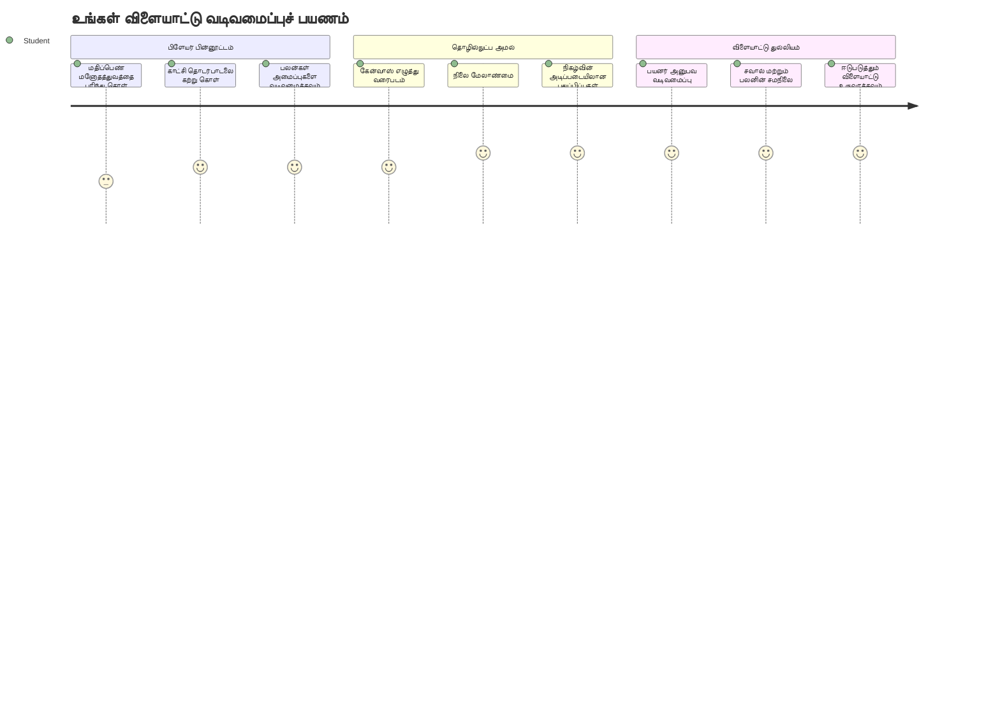
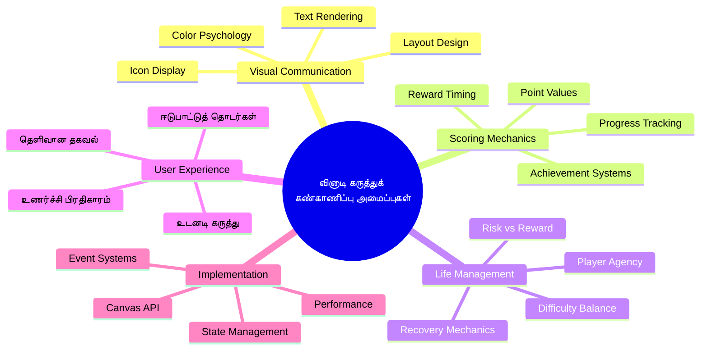
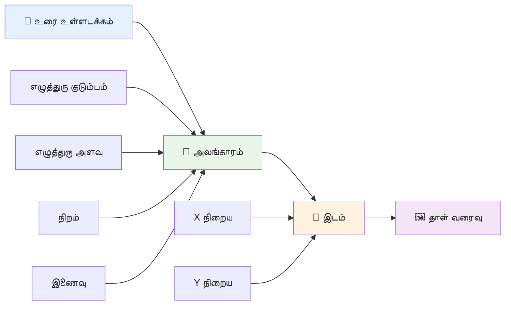
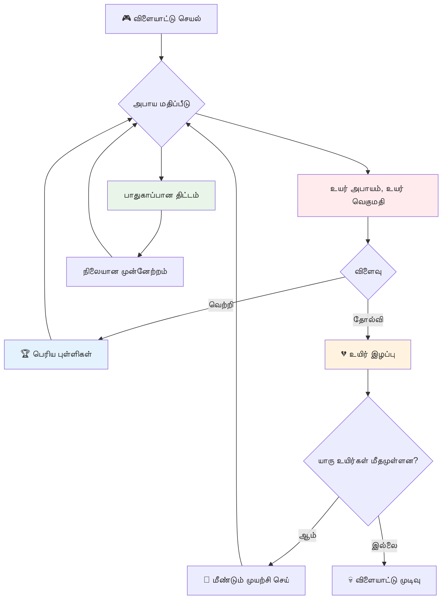
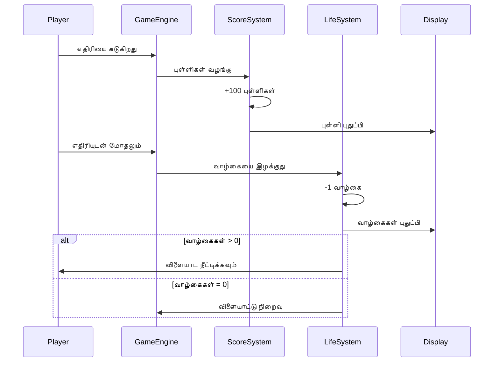
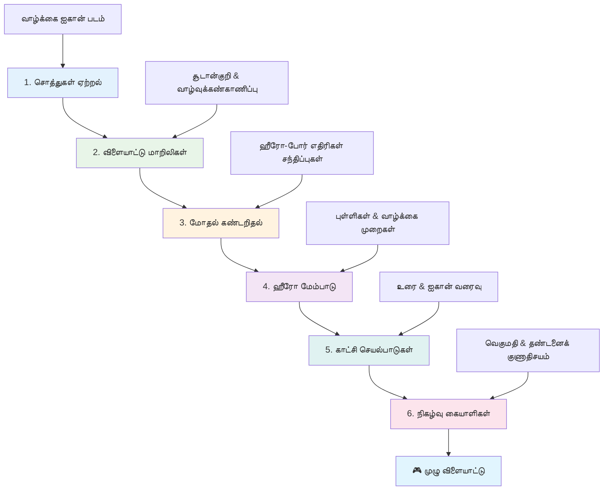
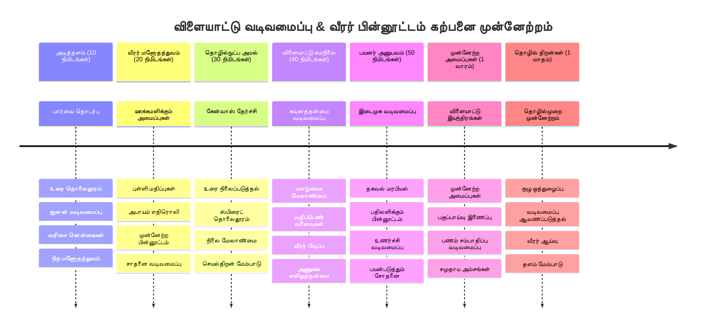

<!--
CO_OP_TRANSLATOR_METADATA:
{
  "original_hash": "2ed9145a16cf576faa2a973dff84d099",
  "translation_date": "2026-01-07T13:09:52+00:00",
  "source_file": "6-space-game/5-keeping-score/README.md",
  "language_code": "ta"
}
-->
# ஒரு விண்வெளி விளையாட்டு பகுதி 5: மதிப்பெண் மற்றும் வாழ்வுகள்


## முன்-வழக்குக் கேள்வி

[முன்-வழக்குக் கேள்வி](https://ff-quizzes.netlify.app/web/quiz/37)

உங்கள் விண்வெளி விளையாட்டை உண்மையான விளையாட்டு போல உணர்வதற்கு தயாரா? மதிப்பெண்கள் சேர்ப்பதும் வாழ்வுகளை நிர்வகிப்பதும் - துவக்க ஊர்கருத்துக் களஞ்சியங்களான ஸ்பேஸ் இன்வேடர்ஸ் போன்ற ஒருமுறை விளையாட்டுகளை ஈர்க்கக்கூடிய பொழுதுகட்டாக்கமாக மாற்றிய முக்கிய இயந்திரங்களை சேர்ப்போம். இங்கே உங்கள் விளையாட்டு உண்மையாக விளையாடக்கூடியதாக மாறுகிறது.


## திரையில் உரை வரையுதல் - உங்கள் விளையாட்டின் குரல்

உங்கள் மதிப்பெண்களை காட்சிப்படுத்த, கேன்வாஸில் உரையை எப்படி வரைய வேண்டும் என்பதை கற்க வேண்டும். `fillText()` முறை இது செய்வதற்கு முக்கிய கருவி - இது பழைய அட்கேர் விளையாட்டுகளில் மதிப்பெண்கள் மற்றும் நிலை தகவல்களை காட்ட பயன்படுத்தும் நுட்பமே ஆகும்.


உங்களுக்கு உரை தோற்றத்தை முழுமையாக கட்டுப்படுத்தும் வாய்ப்பு உள்ளது:

```javascript
ctx.font = "30px Arial";
ctx.fillStyle = "red";
ctx.textAlign = "right";
ctx.fillText("show this on the screen", 0, 0);
```

✅ [கேன்வாஸில் உரை சேர்ப்பது பற்றி மேலும் கற்றுக்கொள்ளுங்கள்](https://developer.mozilla.org/docs/Web/API/Canvas_API/Tutorial/Drawing_text) - எழுத்துருக்கள் மற்றும் அலங்காரத்தில் நீங்கள் எவ்வளவு படைப்பாற்றலாக இருக்க முடியும் என்று நீங்கள் ஆச்சரியப்படலாம்!

## வாழ்வுகள் - ஒரு எண்கள் அல்ல

விளையாட்டு வடிவமைப்பில், "வாழ்வு" என்பது வீரரின் தவறு செய்தல் சலுகையை குறிக்கிறது. இந்தக் கருத்து பின்பாள் இயந்திரங்களைச் சேர்ந்தது, அங்கு நீங்கள் பல பந்துகளை விளையாடக் கிடைத்தது. அஸ்டீராய்ட்ஸ் போன்ற ஆரம்ப வீடியோ விளையாட்டுகளில், வாழ்வுகள் வீரர்களுக்கு ஆபத்துகளை எடுக்கவும் தவறுகளிலிருந்து கற்றுக் கொள்ள அனுமதித்தன.


காட்சி பிரதிநிதித்துவம் மிகவும் முக்கியம் - "வாழ்வுகள்: 3" என்பதற்குப் பதிலாக கப்பல் ஐகான்களை காட்டுவது உடனடி காட்சி அறிதலை உருவாக்குகிறது, பழைய அட்கேர் கேபினட்களில் மொழிச்சோதனைக்கு இடையீடாக இந்த வகை ஐகான்களை நாம் பயன்படுத்தினோம்.

## உங்கள் விளையாட்டின் பரிசு அமைப்பை கட்டமைக்குதல்

இப்போது நாம் வீரர்களை ஈர்க்கும் அடிப்படை கருத்துப்பணிகளை செயல்படுத்தப்போகிறோம்:


- **மதிப்பெண் அமைப்பு**: ஒவ்வொரு அழிக்கப்பட்ட எதிரி கப்பலுக்கும் 100 மதிப்பெண்கள் வழங்கப்படுகின்றன (கணக்கிட எளிதாக வட்ட எண்கள்). மதிப்பெண்ணை கீழே இடது மூலையில் காட்டுவோம்.
- **வாழ்வு எண்ணிக்கையாளர்**: உங்கள் வீரர் மூன்று வாழ்வுகளுடன் தொடங்குகிறான் - ஆரம்ப அட்கேர் விளையாட்டுகளால் நிலைத்த பழக்கம், சவாலை சேர்க்கவும் விளையாடக்கூடிய தன்மையை சமநிலைப்படுத்த. ஒவ்வொரு எதிரி மோதலும் ஒரு வாழ்வு குறைக்கிறது. இத்துடன் வாழ்வுகளை கீழே வலது மூலையில் கப்பல் ஐகான்களுடன்  காட்டுவோம்.

## கட்டமைப்போம்!

முதலில் உங்கள் பணிப்பயன்பாட்டை அமைக்கவேண்டும். `your-work` துணை கோப்புறையில் உள்ள கோப்புகளைப் படிக்கவும். நீங்கள் இதைப் பெறுவீர்கள்:

```bash
-| assets
  -| enemyShip.png
  -| player.png
  -| laserRed.png
-| index.html
-| app.js
-| package.json
```

உங்கள் விளையாட்டை சோதிக்க, `your_work` கோப்புறையிலிருந்து வியூவல் சேவையகத்தை தொடங்கவும்:

```bash
cd your-work
npm start
```

இது ஒரு உள்ளூர் சேவையகத்தை `http://localhost:5000` இல் இயக்குகிறது. உங்கள் உலாவியில் இத்தொடுப்பினை திறந்து உங்கள் விளையாட்டைப் பாருங்கள். அம்புகளால் இயங்குதலைப் பரிசோதித்து எதிரிகளை சுற்றிக் கண்டறியவும்.


### குறியீடு நேரம்!

1. **உங்களுக்குத் தேவையான காட்சி சொத்துக்களைப் பெறவும்**. `life.png` சொத்தினை `solution/assets/` கோப்புறையிலிருந்து உங்கள் `your-work` கோப்புறைக்கு நகல் செய்யவும். பிறகு `lifeImg`-ஐ உங்கள் window.onload செயல்பாட்டில் சேர்க்கவும்:

    ```javascript
    lifeImg = await loadTexture("assets/life.png");
    ```

1. `lifeImg`-ஐ உங்கள் சொத்துகளின் பட்டியலில் சேர்க்க மறக்காதீர்கள்:

    ```javascript
    let heroImg,
    ...
    lifeImg,
    ...
    eventEmitter = new EventEmitter();
    ```
  
2. **உங்கள் விளையாட்டு மாறிகள் அமைக்கவும்**. மொத்த மதிப்பெண் (0-இல் தொடங்கும்) மற்றும் மீதமுள்ள வாழ்வுகளை (3-இல் தொடங்கும்) பின்தொடர்க:

3. **ஓடும் படி மோதல் கண்டறிதலை இயக்கு**. உங்கள் `updateGameObjects()` செயல்பாட்டில் எதிரிகள் உங்கள் வீரரை எப்போது மோதுகிறார்கள் என்று சேர்க்கவும்:

    ```javascript
    enemies.forEach(enemy => {
        const heroRect = hero.rectFromGameObject();
        if (intersectRect(heroRect, enemy.rectFromGameObject())) {
          eventEmitter.emit(Messages.COLLISION_ENEMY_HERO, { enemy });
        }
      })
    ```

4. **உங்கள் வீரருக்கு வாழ்வு மற்றும் மதிப்பெண் கணக்குகளைச் சேர்க்கவும்**.  
   1. **எண்ணிகளைத் தொடங்கவும்**. உங்கள் `Hero` வகுப்பில் `this.cooldown = 0` இன் கீழ் வாழ்வு மற்றும் புள்ளிகள் நிறுவவும்:

        ```javascript
        this.life = 3;
        this.points = 0;
        ```

   1. **இந்த மதிப்புகளை வீரருக்கு காட்டு**. திரையில் இவற்றை வரைய_fxசெய்யும் செயல்பாடுகளை உருவாக்கவும்:

        ```javascript
        function drawLife() {
          // செய்ய வேண்டியது, 35, 27
          const START_POS = canvas.width - 180;
          for(let i=0; i < hero.life; i++ ) {
            ctx.drawImage(
              lifeImg, 
              START_POS + (45 * (i+1) ), 
              canvas.height - 37);
          }
        }
        
        function drawPoints() {
          ctx.font = "30px Arial";
          ctx.fillStyle = "red";
          ctx.textAlign = "left";
          drawText("Points: " + hero.points, 10, canvas.height-20);
        }
        
        function drawText(message, x, y) {
          ctx.fillText(message, x, y);
        }

        ```

   1. **அவை அனைத்தையும் விளையாட்டு சுழற்சியில் இணைக்கவும்**. `updateGameObjects()`-க்கு பிறகு உங்கள் window.onload செயல்பாட்டில் இவற்றை சேர்ந்துகொள்ளவும்:

        ```javascript
        drawPoints();
        drawLife();
        ```

### 🔄 **கல்வி சரிபார்ப்பு**
**விளையாட்டு வடிவமைப்பு புரிதல்**: விளைவுகளை செயல்படுத்துவதற்கு முன், உங்களுக்கு அறிவு இருக்க வேண்டும்:
- ✅ விளைவுக்காட்சி எப்படி வீரர்களுக்கு விளையாட்டு நிலையை தெரிவிக்கிறது
- ✅ UI கூறுகளின் இடைத்திருக்கை எதற்கு பயனுள்ளதாக உள்ளது
- ✅ புள்ளிகள் மற்றும் வாழ்க்கை நிர்வகிப்பின் உளவியல்
- ✅ கேன்வாஸ் உரை வரையல் HTML உரை வித்தியாசம்

**சிறந்த சோதனை**: ஏன் அட்கேர் விளையாட்டுகள் பொதுவாக வட்ட எண்களை மதிப்பெண்களாகப் பயன்படுத்துகின்றன?  
*பதில்: வீரர்களுக்கான மனக்கணக்கில் எளிதில் கணக்கிடும், நம்பிக்கையளிக்கும் உளவியல் பரிசுகளை உருவாக்குகிறது*

**பயனாளர் அனுபவக் கொள்கைகள்**: இப்போது நீங்கள் பயன்படுத்தும்:  
- **காட்சிப் படிநிலைமை**: முக்கிய தகவல் வெளிப்படையாக இடம் பெற்றல்  
- **உடனடி பின்னூட்டம்**: வீரர் செயல்களுக்கு நேரடி பதில்  
- **அறிவாற்றல் சுமை**: எளிமையான, தெளிவான தகவல் கொடை  
- **உணர்ச்சி வடிவமைப்பு**: ஐகான்கள் மற்றும் நிறங்கள் மூலம் தொடர்பு

1. **விளையாட்டு விளைவுகள் மற்றும் பரிசுகளைச் செயல்படுத்தவும்**. இப்போது பயனர் செயல்களை அர்த்தமுள்ளவையாக மாற்றும் கருத்துப்பணிகளைச் சேர்ப்போம்:

   1. **மோதல்கள் வாழ்வுகளை குறைக்கும்**. உங்கள் வீரர் ஒவ்வொரு தடவை எதிரியுடன் மோதும்போது ஒரு வாழ்வை இழக்கவேண்டும்.
   
      கேரை உங்கள் `Hero` வகுப்புக்கு சேர்க்கவும்:

        ```javascript
        decrementLife() {
          this.life--;
          if (this.life === 0) {
            this.dead = true;
          }
        }
        ```

   2. **எதிரிகளை சூடியால் அடிப்பது புள்ளிகளை சேர்க்கும்**.ஒவ்வொரு வெற்றிகரமான அட்டை 100 புள்ளிகளை வழங்கும், முக்கியமான நேரடியான பின்னூட்டம்.

      இந்தச் சேர்க்கையை Hero வகுப்பில் நீட்டியுங்கள்:

        ```javascript
          incrementPoints() {
            this.points += 100;
          }
        ```

        இப்போது இந்த செயல்களை மோதல் நிகழ்வுகளுடன் இணைக்கவும்:

        ```javascript
        eventEmitter.on(Messages.COLLISION_ENEMY_LASER, (_, { first, second }) => {
           first.dead = true;
           second.dead = true;
           hero.incrementPoints();
        })

        eventEmitter.on(Messages.COLLISION_ENEMY_HERO, (_, { enemy }) => {
           enemy.dead = true;
           hero.decrementLife();
        });
        ```

✅ ஜாவாஸ்கிரிப்ட் மற்றும் கேன்வாஸ் மூலம் உருவாக்கப்பட்ட பிற விளையாட்டுகள் பற்றிய ஆர்வமா? ஆராயுங்கள் - நீங்கள் என்ன செய்துகொள்ள முடியும் என்று ஆச்சரியப்படலாம்!

இவைகள் அமல்படுத்தப்பட்ட பிறகு, உங்கள் விளையாட்டை சோதித்துப் பாருங்கள். கீழே வலது முனையில் வாழ்வு ஐகான்கள், இடது மூலையில் மதிப்பெண் காணலாம். மோதல்கள் வாழ்க்கையை குறைக்கும் போது கைப்படுத்தவும், வெற்றி சூட்டுகள் மதிப்பெண்களை அதிகரிக்கின்றன.

உங்கள் விளையாட்டில் இப்போது ஆரம்ப கால அட்கேர் விளையாட்டுகளை ஈர்க்க வைத்த குறிப்பிடத்தக்க இயந்திரங்கள் உள்ளன - தெளிவான குறிக்கோள்கள், உடனடி பின்னூட்டம் மற்றும் வீரர் செயல் விளைவுகளுக்கான அர்த்தமுள்ள விளைவுகள்.

### 🔄 **கல்வி சரிபார்ப்பு**
**முழுமையான விளையாட்டு வடிவமைப்பு அமைப்பு**: வீரர் பின்னூட்ட அமைப்புகளை உங்கள் திறமை அத்தாட்சிபடுத்துமா:
- ✅ மதிப்பெண் முறைகள் எவ்வாறு வீரரை ஊக்குவிக்கும் மற்றும் ஈர்க்கிறது?
- ✅ UI வடிவமைப்பில் காட்சி ஒற்றுமை எதற்கு முக்கியம்?
- ✅ வாழ்க்கை அமைப்பு சவாலை மற்றும் வீரர் தொடர்ச்சியை எப்படி சமநிலைப்படுத்துகிறது?
- ✅ உடனடி பின்னூட்டம் சந்தோஷம் தரும் விளையாட்டை உருவாக்க எவ்வாறு பங்கு வகிக்கிறது?

**அமைப்பு இணைப்பு**: உங்கள் பின்னூட்ட அமைப்பு காட்டுகிறது:
- **பயனர் அனுபவ வடிவமைப்பு**: தெளிவான காட்சி தொடர்பாடல் மற்றும் தகவல் படிநிலை  
- **நிகழ்வுகள் இயக்குந்மை**: வீரர் செயல்களுக்கு எதிர்வினை  
- **நிலை நிர்வாகம்**: விண்வெளி விளையாட்டு தரவைக் கண்காணித்தல் மற்றும் காட்டு  
- **கேன்வாஸ் தேர்ச்சி**: உரை வரையல் மற்றும் ஸ்பிரைட் இடைத்தளமிடல்  
- **விளையாட்டு உளவியல்**: வீரர் ஊக்கம் மற்றும் ஈடுபாடு புரிதல்

**தொழில்முறை மாதிரிகள்**: நீங்கள் மேற்கொண்டுள்ளீர்கள்:
- **MVC கட்டமைப்பு**: விளையாட்டு தரவு, அறிவு மற்றும் காட்சியை பிரித்தல்  
- **கண்காணிப்பாளர் மாதிரி**: நிகழ்வு சார்ந்த நிலை மாற்றங்களைத் துரிதமாக செய்தல்  
- **பகுதி வடிவமைப்பு**: மறு பயன்படுத்தக்கூடிய திறன்கள்  
- **செயற்பாடு பராமரிப்பு**: விளையாட்டு சுழற்சிகளில் திறமையான வரைதல்

### ⚡ **அடுத்த 5 நிமிடங்களில் நீங்கள் செய்யக்கூடியவை**
- [ ] மதிப்பெண் காட்சிக்கான எழுத்துரு அளவு மற்றும் நிறங்களை மாற்றி முயற்சிக்கவும்  
- [ ] புள்ளி மதிப்புக்களை மாற்றி விளையாட்டு உணர்வை பாருங்கள்  
- [ ] புள்ளி மற்றும் வாழ்வு மாற்றங்களை கண்காணிப்பதற்கு console.log சேர்க்கவும்  
- [ ] வாழ்க்கைப் பிறப்போ அல்லது அதிக மதிப்பெண்களை எட்டுகையில் சோதனை செய்யவும்

### 🎯 **இந்த மணி நேரத்தில் நீங்கள் சாதிக்கக்கூடியவை**
- [ ] பாடம் பின்வரும் கேள்வி பதில் மற்றும் விளையாட்டு உளவியல் புரிதல்  
- [ ] scoring மற்றும் வாழ்வுகளை இழப்பதற்கான ஒலிகள் சேர்க்கவும்  
- [ ] பூர்த்தி மதிப்பெண் அமைப்பை localStorage மூலம் மற்றும் செயல்படுத்தவும்  
- [ ] வெவ்வேறு எதிரி வகைகளுக்கு வெவ்வேறு புள்ளி மதிப்புகள் சேர்க்கவும்  
- [ ] வாழ்வு இழக்கும் போது திரை அசைவுகளைப் போன்ற காட்சிப்பயிற்சியைச் சேர்க்கவும்

### 📅 **உங்கள் வாரம் முழுவதும் விளையாட்டு வடிவமைப்பு பயணம்**
- [ ] பூரண விண்வெளி விளையாட்டை செயற்குப் பின்னூட்ட அமைப்புகளுடன் நிறைவேற்றவும்  
- [ ] கம்போ மோடிபையர்களை போன்ற மேம்பட்ட மதிப்பெண் முறைகளை செயல்படுத்தவும்  
- [ ] சாதனைகள் மற்றும் பூட்டப்பட்ட உள்ளடக்கம் சேர்க்கவும்  
- [ ] கடினம் வளர்ச்சியும் சமநிலையாக்க அமைப்புகளும் உருவாக்கவும்  
- [ ] மெனுக்கள் மற்றும் விளையாட்டு முடிவு திரைகளுக்கான UI வடிவமைக்கவும்  
- [ ] பிற விளையாட்டுகளை ஆராய்ந்து ஈடுபாட்டுக் காரணிகளைப் புரிந்து கொள்ளவும்

### 🌟 **உங்கள் மாதம் முழுவதும் விளையாட்டு மேம்பாட்டு திறமை**
- [ ] முழுமையான விளையாட்டுகளை வலுவான முன்னேற்ற அமைப்புகளுடன் கட்டியடைக்கவும்  
- [ ] விளையாட்டு பகுப்பாய்வு மற்றும் வீரர் நடத்தை அளவீடு கற்றுக்கொள்ளவும்  
- [ ] திறந்த மூல விளையாட்டு மேம்பாட்டு திட்டங்களுக்கு பங்களிக்கவும்  
- [ ] மேம்பட்ட விளையாட்டு வடிவமைப்பு மாதிரிகள் மற்றும் பணியமைப்பு கற்றுக்கொள்ளவும்  
- [ ] விளையாட்டு வடிவமைப்பு மற்றும் பயனாளர் அனுபவம் குறித்த கல்விச் உள்ளடக்கம் உருவாக்கவும்  
- [ ] விளையாட்டு வடிவமைப்பு மற்றும் மேம்பாட்டு திறமைகள் கொண்ட தொகுப்பை உருவாக்கவும்

## 🎯 உங்கள் விளையாட்டு வடிவமைப்பு திறன்முறை கால வரிசை


### 🛠️ உங்கள் விளையாட்டு வடிவமைப்பு கருவி தொகுப்பு சுருக்கம்

இந்த பாடத்தை முடித்த பிறகு, நீங்கள் கற்றுக்கொண்டுள்ளீர்கள்:  
- **வீரர் உளவியல்**: ஊக்கம், அபாயம்/பரிசு, ஈடுபாடு சுழற்சிகள் புரிதல்  
- **காட்சி தொடர்பு**: உரை, ஐகான்கள் மற்றும் விரிவாக்கம் கொண்டு மேற்பார்வை UI வடிவமைப்பு  
- **பின்னூட்ட அமைப்புகள்**: வீரர் செயல்களுக்கும் விளையாட்டு நிகழ்வுகளுக்கும் நேரடி பதில்  
- **நிலை மேலாண்மை**: இயக்கபடியான விளையாட்டு தரவு கண்காணிப்பு மற்றும் காட்சி  
- **கேன்வாஸ் உரை வரையல்**: தொழிற்துறை உரை காட்சி மற்றும் அலங்கார தெளிவு  
- **நிகழ்வு இணைப்பு**: பயனர் செயல்களை அர்த்தமுள்ள விளைவுகளுடன் இணைத்தல்  
- **விளையாட்டு சமநிலை**: கடின தரிப்பாடுகள் மற்றும் வீரர் முன்னேற்றம் வடிவமைத்தல்

**உண்மை உலக பயன்பாடுகள்**: உங்கள் விளையாட்டு வடிவமைப்பு திறன்கள் நேரடியாகச் செயல்படும்:  
- **பயனர் இடைமுக வடிவமைப்பு**: ஈர்க்கக்கூடிய, தெளிவான இடைமுகங்கள்  
- **தயாரிப்பு மேம்பாடு**: பயனர் ஊக்கம் மற்றும் பின்னூட்டச் சுற்றுக்கள் புரிதல்  
- **கல்வி தொழில்நுட்பம்**: விளையாட்டு வடிவமைப்பும் கற்றல் ஈடுபாட்டும்  
- **தரவு காட்சிப்படுத்தல்**: சிக்கலான தகவலை எளிதில் புரியக்கூடியதாக மாற்றல்  
- **மொபைல் பயன்பாட்டு மேம்பாடு**: பயனர் நிலைத்தன்மை மற்றும் UX வடிவமைப்பு  
- **மார்க்கெட்டிங் தொழில்நுட்பம்**: பயனர் நடத்தை மற்றும் மாற்றல் மேம்பாடு

**தொழில்முறை திறன்கள்**: நீங்கள் இப்போது செய்ய முடியும்:  
- **வயனர் அனுபவங்களை வடிவமைக்க** ஊக்குவிக்கும் மற்றும் ஈர்க்கும்  
- **பின்னூட்ட அமைப்புகளை செயல்படுத்த** பயனர் நடத்தை கண்காணிக்கும்  
- **சவாலை மற்றும் அணுகுமுறையை சமநிலைப்படுத்த** தொடர்புடைய அமைப்புகள்  
- **காட்சிக் தொடர்பு உருவாக்க** பல்வேறு பயனர் குழுக்களுக்கான  
- **பயனர் நடத்தை பகுப்பாய்வு மற்றும் வடிவமைப்பில் மீண்டும் தொகுக்க** 

**விளையாட்டு மேம்பாட்டு கருத்துக்கள்**:  
- **வீரர் ஊக்கம்**: ஈடுபாடு மற்றும் தொடர்ச்சி கையாளுதல்  
- **காட்சி வடிவமைப்பு**: தெளிவு, அழகு, செயற்பாட்டு இடைமுகம் அமைப்பது  
- **அமைப்பு இணைப்பு**: பல விளையாட்டு அமைப்புகளை ஒருங்கிணைத்தல்  
- **செயற்பாடு மேம்படுத்தல்**: திறமையான வரைதல் மற்றும் நிலை நிர்வாகம்  
- **அணுகல் வசதி**: வெவ்வேறு திறமைகள் மற்றும் வீரர் தேவைகளுக்கு வடிவமைத்தல்

**அடுத்த நிலை**: நீங்கள் மேம்பட்ட விளையாட்டு வடிவமைப்பு மாதிரிகள், பகுப்பாய்வு அமைப்புகள் அல்லது விளையாட்டு வருமானம் மற்றும் வீரர் தொடர்ச்சி ஆராய்ச்சி செயற்படுத்த தயாராக உள்ளீர்கள்!

🌟 **சாதனை அமையப்பட்டது**: உங்கள் விளையாட்டிற்கு தொழில்முறை விளையாட்டு வடிவமைப்பு கொள்கைகளுடனான முழுமையான வீரர் பின்னூட்ட அமைப்பை நீங்கள் கட்டியுள்ளீர்கள்!

---

## GitHub Copilot Agent சவால் 🚀

Agent முறையைப் பயன்படுத்தி பின்வரும் சவாலுக்கு பதில் அளிக்கவும்:

**விளக்கம்:** விண்வெளி விளையாட்டின் மதிப்பெண் அமைப்பை முன்னேற்ற high score அம்சத்துடன் நிரந்தர சேமிப்பகத்தைச் சேர்க்கவும் மற்றும் பரிசு மதிப்புகளை செயல்படுத்தவும்.

**கோரிக்கை:** வீரரின் சிறந்த மதிப்பெண்ணை localStorage-ல் சேமிக்கும் high score அமைப்பை உருவாக்கவும். தொடர்ச்சியான எதிரி அழிப்பிற்கு பரிசு புள்ளிகளையும் (கம்போ அமைப்பு) சேர்க்கவும், வெவ்வேறு எதிரி வகைகளுக்கு வேறுபட்ட புள்ளிகள் வழங்கவும். வீரர் புதிய high scoreஉடைந்த பொழுது காட்சி ஊடுருவலை காட்டவும் மற்றும் தற்போதைய high scoreஐ விளையாட்டு திரையில் காட்டு.

## 🚀 சவால்

இப்போது உங்கள் விளையாட்டில் மதிப்பெண் மற்றும் வாழ்வுகள் இயங்குகின்றன. கூடுதல் அம்சங்கள் ஏதும், உங்கள் விளையாட்டு அனுபவத்தை மேம்படுத்துவது என்ன என்பதை யோசிக்கவும்.

## பின்வழக்குக் கேள்வி

[பின்வழக்குக் கேள்வி](https://ff-quizzes.netlify.app/web/quiz/38)

## மதிப்பாய்வு மற்றும் தன்னியங்கு கற்கை

மேலும் ஆராய விரும்புகிறீர்களா? விளையாட்டின் மதிப்பெண் மற்றும் வாழ்வு அமைப்புகள் வெளிநோக்குகளை ஆராயவும். [PlayFab](https://playfab.com) போன்ற ஆச்சரியமான விளையாட்டு இயந்திரங்கள் மதிப்பெண்கள், முன்னணி அட்டவணைகள் மற்றும் வீரர் முன்னேற்றத்தை கையாள்கின்றன. அத்தகையதானது உங்கள் விளையாட்டை அடுத்தநிலை எவ்வாறு மாற்றுமாக இருக்கும் என்பதைக் கணக்கிடுங்கள்.

## பணிமுனை

[மதிப்பெண் விளையாட்டு கட்டவும்](assignment.md)

---

<!-- CO-OP TRANSLATOR DISCLAIMER START -->
**மூலக் குறிப்பு**:  
இந்த ஆவணம் AI மொழிபெயர்ப்பு சேவை [Co-op Translator](https://github.com/Azure/co-op-translator) பயன்படுத்தி மொழிபெயர்க்கப்பட்டுள்ளது. நாங்கள் துல்லியத்தை உறுதிபடுத்த முயற்சித்தாலும், தானாகப் பிரசுரிக்கப்பட்ட மொழிபெயர்ப்புகளில் பிழைகள் அல்லது தவறுகள் இருக்கலாம் என்பதை தயவுசெய்து கவனத்தில் கொள்ளவும். கோட்பாட்டுக் காகிதத்தின் தாய்மொழி ஆவணம் அதிகாரபூர்வ மூலமாக கருதப்பட வேண்டும். அவசரமான மற்றும் முக்கியமான தகவல்களுக்கு, தொழில்முறை மனித மொழிபெயர்ப்பு பரிந்துரைக்கப்படுகிறது. இந்த மொழிபெயர்ப்பு பயன்படுத்துவதால் ஏற்படும் தவறான புரிதல்கள் அல்லது தவறான விளக்கங்களுக்கு நாங்கள் பொறுப்பேற்கமாட்டோம்.
<!-- CO-OP TRANSLATOR DISCLAIMER END -->