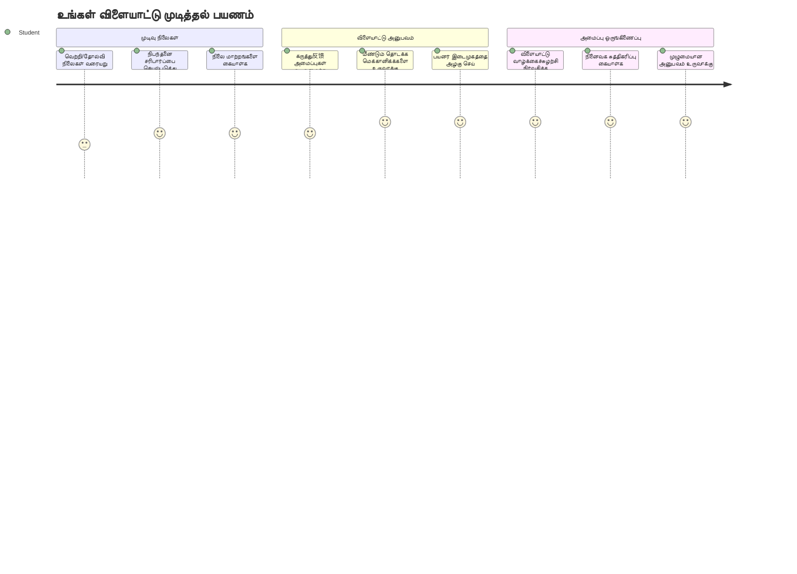
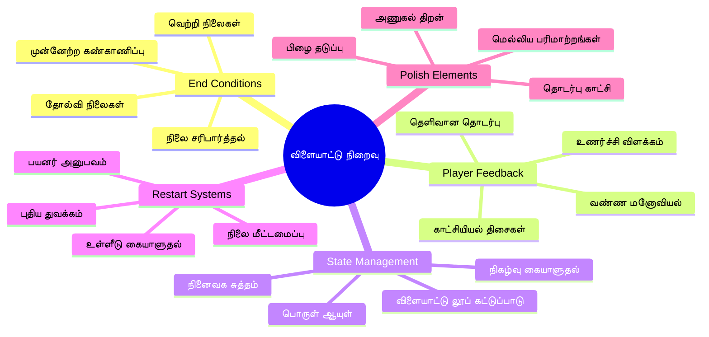
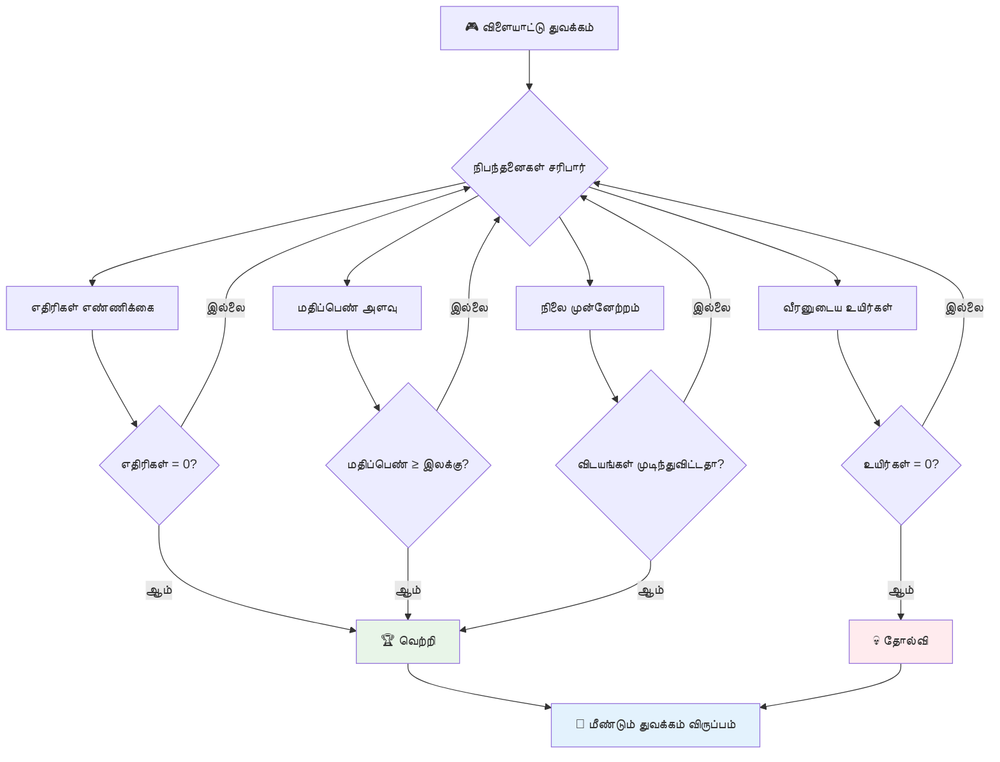
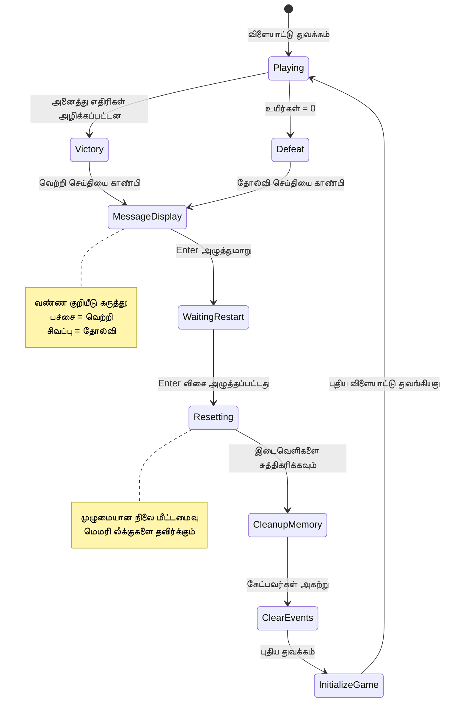
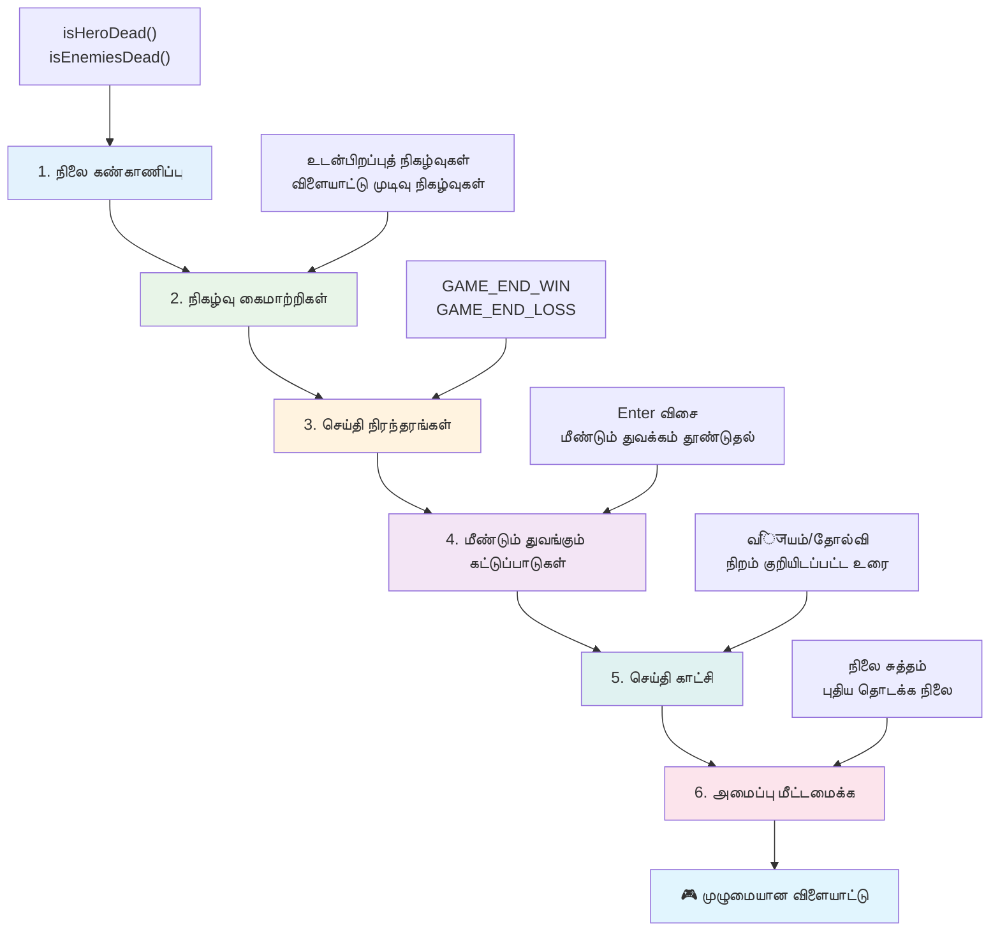
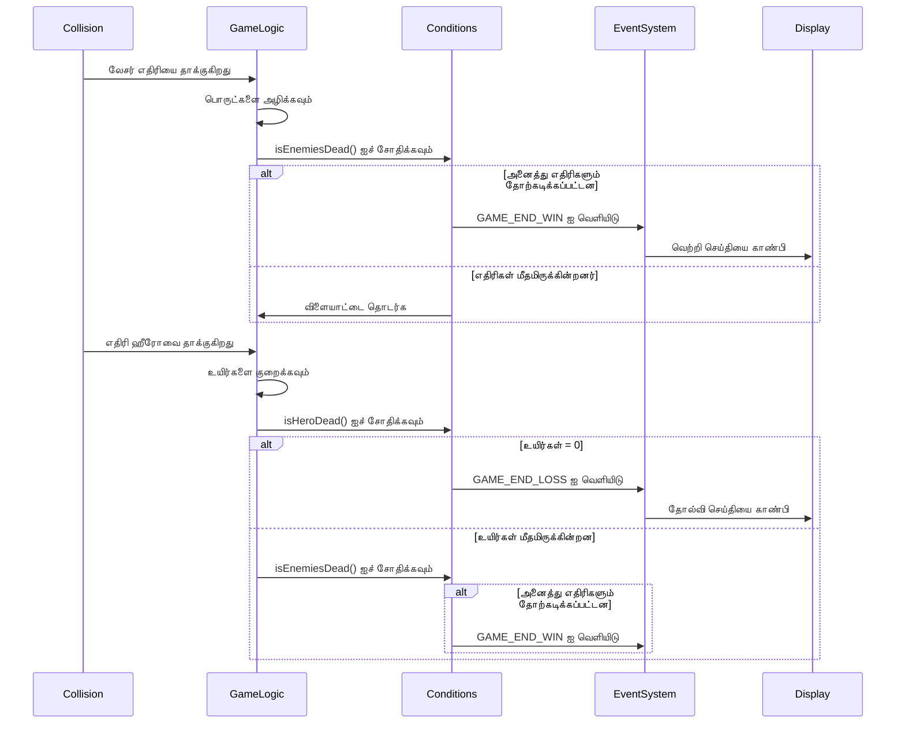
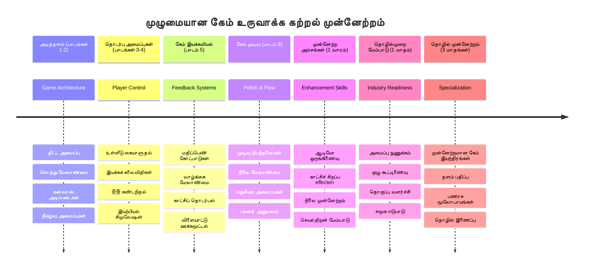

# விண்வெளி விளையாட்டு கட்டும் பகுதி 6: முடிவு மற்றும் மறுதொடக்கம்


ஒவ்வொரு சிறந்த விளையாட்டுக்கும் தெளிவான முடிவுக் கொள்கைகள் மற்றும் மென்மையான மறுதொடக்க முறை ஒன்றும் தேவை. நீங்கள் இயக்கம், போர், மற்றும் மதிப்பீடு கொண்ட ஒரு அற்புதமான விண்வெளி விளையாட்டை வடிவமைத்துள்ளீர்கள் - இனி அதை முழுமையாக உணர வைக்கும் இறுதி துணுக்குகளைச் சேர்ப்பது நேரம்.

உங்கள் விளையாட்டு தற்போது நிரந்தரமாக இயங்குகிறது, 1977ல் NASA வெளியிட்ட வொயேஜர் probes போல் - பல தசாப்தங்களுக்கு மேலாக விண்வெளியில் பயணிக்கிறது. விண்வெளி ஆராய்ச்சிக்கு இது சரித்திரமானதோ, ஆனால் விளையாட்டுகளுக்கு சத்து தரும் அனுபவம் உருவாக்குவதற்கு முடிவு முழுமைகள் தேவை.

இன்று, சரியான வெற்றி/இனக்கம் சூழல்கள் மற்றும் மறுதொடக்க அமைப்பை செயல்படுத்துவோம். இந்த பாட முடிவில், நீங்கள் பிளேயர்கள் முடிக்கவும் மீண்டும் விளையாடவும் கூடிய, பிரபலமான arcade விளையாட்டுகள் போன்ற பொருத்தமான விளையாட்டை அறிந்திருப்பீர்கள்.


## முன்னணி பாட பரீட்சை

[முன்னணி பாட பரீட்சை](https://ff-quizzes.netlify.app/web/quiz/39)

## விளையாட்டு முடிவு சூழல்கள் புரிதல்

உங்கள் விளையாட்டு எப்போது முடிவடைய வேண்டும்? ஆரம்ப arcade காலத்திலிருந்து இந்த அடிப்படைக் கேள்வி விளையாட்டு வடிவமைப்பை உருவாக்கியுள்ளது. Pac-Man, உங்களை பேய்கள் பிடித்தவுடன் அல்லது அனைத்து புள்ளிகளையும் நிறுத்தியவுடன் முடிகிறது; Space Invaders, வெளி வாழிகள் அடியில் சென்றவுடன் அல்லது அவற்றை எல்லாம் அழித்த பிறகு முடிகிறது.

விளையாட்டு படைப்பாளியாக, வெற்றி மற்றும் தோல்வி நிலைகளைக் நீங்கள் வரையறுக்கிறீர்கள். நமது விண்வெளி விளையாட்டுக்கு, ஈடுபடும் விளையாட்டு உருவாக்கும் சான்றான அணிகள் இங்கே:


- **`N` எதிரி மிகப்பெரிய கப்பல்கள் அழிக்கப்பட்டுள்ளன**: விளையாட்டை பல நிலைகளாக பிரித்தால், ஒரு நிலையை முடிக்க `N` எதிரி கப்பல்களை அழிக்க வேண்டியிருக்கக்கூடும்
- **உங்கள் கப்பல் அழிக்கப்பட்டுவிட்டது**: உங்கள் கப்பல் அழிக்கப்பட்டால் நீங்கள் விளையாட்டை இழக்கிறீர்கள் என்பதை கொண்ட விளையாட்டுகள் உள்ளன. மற்றுமொரு பொதுவான முறையாய், வாழ்க்கைகள் என்ற கருத்தை உள்வாங்குகிறார்கள். ஒவ்வொரு முறையும் உங்கள் கப்பல் அழிக்கப்பட்டால் ஒரு வாழ்க்கை குறைக்கப்படுகிறது. வாழ்க்கைகள் அனைத்தும் இழக்கப்பட்டதும், விளையாட்டை இழக்கிறீர்கள்.
- **நீங்கள் `N` புள்ளிகளை சேகரித்துள்ளீர்கள்**: மற்றொரு பொதுவான முடிவு நிலை புள்ளிகள் சேகரிப்பதாகும். எப்படி புள்ளிகளை பெறுவீர்கள் என்பது உங்களின் விருப்பம்; ஆனால் எதிரி கப்பல் அழிப்பது போன்ற பல செயல்களில் புள்ளிகள் ஒதுக்கப்படுவதாக இருக்கிறது அல்லது அழிக்கப்பட்ட நேரத்தில் உருப்படிகள் தொகுக்கப்படுவதாக இருக்கலாம்.
- **ஒரு நிலையை முடிக்கவும்**: இது பல நிலைகளைக் கொண்டிருக்கலாம், உதாரணத்திற்கு `X` எதிரி கப்பல்கள் அழிக்கப்பட்டதா, `Y` புள்ளிகள் சேகரிக்கப்பட்டதா அல்லது குறிப்பிட்ட உருப்படி சேகரிக்கப்பட்டதா என்பது போன்றவை.

## விளையாட்டு மறுதொடக்கம் செயல்பாட்டை செயல்படுத்தல்

நல்ல விளையாட்டுகள் மென்மையான மறுதொடக்க முறைகள் மூலம் மீண்டும் விளையாடும் திறனை ஊக்குவிக்கின்றன. பிளேயர்கள் ஒரு விளையாட்டை முடித்தபோது (அல்லது தோல்வி அடைந்தபோது), உடனடி முயற்சிக்க விரும்புகிறார்கள் - அவர்கள் மதிப்பீட்டை வெல்வதற்கோ அல்லது செயல்திறனைக் மேம்படுத்துவதற்கோ.


Tetris இதை சீரிய முறையில் எடுத்துக்காட்டுகிறது: உங்கள் கட்டங்கள் மேல் சென்றவுடன், நீங்கள் விரும்பிய நேரத்தில் புதிய விளையாட்டை தொடங்கலாம், சிக்கலான பொறுப்புகளைத் தேடாதோ. நாம் இதுபோன்ற ஒரு மறுதொடக்க அமைப்பை கட்டியெழுப்புவோம், இது விளையாட்டு நிலையை சுத்தமாக மீட்டெடுத்து, பிளேயர்களை விரைவாக நடவடிக்கைக்கு திருப்புகிறது.

✅ **பின்கணிப்பு**: நீங்கள் ஏற்கனவே விளையாடிய விளையாட்டுகளைப் பற்றி நினைத்துப் பாருங்கள். அவை எதன்று முடிகின்றன, மறுதொடக்கம் எப்படி உத்தியோகபூர்வமாக முன்வைக்கிறார்கள்? எது ஒரு மறுதொடக்கத்தை மென்மையாக அல்லது சிரமமாக உணரச் செய்கிறது?

## நீங்கள் உருவாக்கப்போகும் விஷயங்கள்

உங்கள் திட்டத்தை முழுமையான விளையாட்டு அனுபவமாக மாற்றும் இறுதி அம்சங்களை நீங்கள் செயல்படுத்துவீர்கள். இந்த கூறுகள் சம்பந்தப்பட்ட விளையாட்டுகளிலிருந்து அடிப்படையான வடிவமைப்புகளை வேறுபடுத்தும்.

**இன்று சேர்க்கும் விஷயங்கள்:**

1. **வெற்றி நிலை**: அனைத்து எதிரிகளையும் வெட்டிக் கொள்ளவும், உரிய கொண்டாட்டத்துடன் (நீங்கள் அதற்கு உரியவர்!)
2. **தோல்வி நிலை**: வாழ்க்கைகள் முடிந்ததும் தோல்வி திரைக்காட்சியை எதிர்கொள்ளவும்
3. **மறுதொடக்க அணி**: Enter அழுத்தி உடனடி மீண்டும் விளையாடவும் - ஏனெனில் ஒரு விளையாட்டு போதாது
4. **நிலைத்துவை நிர்வாகம்**: ஒவ்வொரு முறையும் சுத்தமான தாள் - பிளேயர் முந்தைய விளையாட்டிலிருந்து எதிரிகள் அல்லது விசித்திர பிழைகள் இல்லாமல்

## துவக்கம்

உங்கள் மேம்பாட்டு சூழலைத் தயாரிப்போம். முன்பிருந்த பாடங்களிலிருந்து உங்கள் விண்வெளி விளையாட்டு கோப்புக்கள் அனைத்தும் தயார் இருக்க வேண்டும்.

**உங்கள் திட்டம் இதுபோன்று இருக்க வேண்டும்:**

```bash
-| assets
  -| enemyShip.png
  -| player.png
  -| laserRed.png
  -| life.png
-| index.html
-| app.js
-| package.json
```

**உங்கள் மேம்பாட்டு சேவையகத்தை துவங்கவும்:**

```bash
cd your-work
npm start
```

**இந்த கட்டளையுடன்:**
- `http://localhost:5000` ல் உள்ள உள்ளூர் சேவையகம் இயங்கும்
- உங்கள் கோப்புகளை சரியாக வழங்கும்
- நீங்கள் மாற்றங்களை செய்தவுடன் தானாக புதுப்பிக்கும்

உங்கள் உலாவியில் `http://localhost:5000` ஐ திறந்து உங்கள் விளையாட்டு இயங்குகிறது என்பதை உறுதிப்படுத்துங்கள். நீங்கள் நகரலாம், துப்புறவு செய்யலாம், மற்றும் எதிரிகளுடன் செயல்பட முடியும். உறுதியாக பிறகு, செயல்படுத்தலை தொடரலாம்.

> 💡 **மாநிய அறிவுரை**: Visual Studio Code இல் எச்சரிக்கை தவிர்க்க, உங்கள் கோப்பின் மேல் பகுதியில் `let gameLoopId;` என اعلانிக்கவும். அதை `window.onload` செயல்பாட்டுக்குள் அறிவிக்க வேண்டியதில்லை. இது நவீன JavaScript மாறிலி அறிவிப்பு சிறந்த நடைமுறையைக் கடைபிடிக்கும்.


## செயல்படுத்தும் படிகள்

### படி 1: முடிவு நிலை கண்காணிப்புத் செயல்பாடுகளை உருவாக்கு

விளையாட்டு எப்போது முடிவடைவது என்பதனை கண்காணிக்கும் செயல்பாடுகள் தேவை. சர்வதேச விண்வெளி நிலையத்தில் உள்ள என்சர்ஸ் போல அவை கணினி நிலையை தொடர்ந்து பரிசோதிக்கும்.

```javascript
function isHeroDead() {
  return hero.life <= 0;
}

function isEnemiesDead() {
  const enemies = gameObjects.filter((go) => go.type === "Enemy" && !go.dead);
  return enemies.length === 0;
}
```

**இதோ கீழே தள்ளப்படுவது:**
- நமது ஹீரோ வாழ்க்கைகள் முடிந்துள்ளதா என்று **பரிசோதிக்கிறது** (ஆஹா!)
- எத்தனை எதிரிகள் இன்னும் உயிருடன் உள்ளனர் என்று **எண்ணுகிறது**
- போர்வெளி எதிரிகள் இல்லாமல் இருந்தால் `true` என்பதை **திரும்ப அளிக்கிறது**
- சரளமான true/false மூலம் செயல்படுகிறது
- எல்லா விளையாட்டு பொருட்களையும் வடிகட்டி உயிருள்ளவர்களை அறுவaiக்கிறது

### படி 2: முடிவு நிலை செயலுக்கு நிகழ்வு நிர்வாகிகளை மேம்பாடு செய்

இந்தச் சூழல் சரிபார்ப்புகளை விளையாட்டு நிகழ்வு அமைப்புடன் இணைப்போம். ஒவ்வொரு மோதல் நடைபெற்றாலும், விளையாட்டு முடிவு நிலையைச் சோதிக்கும். இது முக்கிய நிகழ்வுகளுக்கு உடனடி கருத்து வழங்குகிறது.


```javascript
eventEmitter.on(Messages.COLLISION_ENEMY_LASER, (_, { first, second }) => {
    first.dead = true;
    second.dead = true;
    hero.incrementPoints();

    if (isEnemiesDead()) {
      eventEmitter.emit(Messages.GAME_END_WIN);
    }
});

eventEmitter.on(Messages.COLLISION_ENEMY_HERO, (_, { enemy }) => {
    enemy.dead = true;
    hero.decrementLife();
    if (isHeroDead())  {
      eventEmitter.emit(Messages.GAME_END_LOSS);
      return; // வெற்றிக்கு முன் இழப்பு
    }
    if (isEnemiesDead()) {
      eventEmitter.emit(Messages.GAME_END_WIN);
    }
});

eventEmitter.on(Messages.GAME_END_WIN, () => {
    endGame(true);
});
  
eventEmitter.on(Messages.GAME_END_LOSS, () => {
  endGame(false);
});
```

**இதில் நடக்கும்:**
- **லேசர் எதிரியை வெட்டியது**: இருவரும் காணாமல் போகின்றனர், நீங்கள் புள்ளிகள் பெறுகிறீர்கள், வெற்றி செய்தீர்களா என்று பார்க்கிறோம்
- **எதிரி உங்களை நேர்த்தியது**: நீங்கள் ஒரு வாழ்க்கை இழக்கிறீர்கள், இன்னும் உயிருடன் இருக்கிறீர்கள் என பாருங்கள்
- **அறிவார்ந்த வரிசை**: முதலில் தோல்வி பார்ப்பது (யாரும் வென்று, தோற்க விரும்ப மாட்டாரே!)
- **உடனடி பதில்கள்**: முக்கியமான நிகழ்வு ஏற்படும் உடனே விளையாட்டு தானாக அறிந்து கொள்கிறது

### படி 3: புதிய செய்தி நிலைகள் சேர்க்கவும்

உங்கள் `Messages` நிரந்தர பொருளுக்கு புதிய செய்தி வகைகள் சேர்க்க வேண்டும். இவை பழுதுகனவுகளைத் தவிர்க்க உதவும் மற்றும் நிகழ்வு அமைப்புக்கு ஒருமையாக இருக்க உதவும்.

```javascript
GAME_END_LOSS: "GAME_END_LOSS",
GAME_END_WIN: "GAME_END_WIN",
```

**மேலே நாம்:**
- விளையாட்டு முடிவு சம்பந்தமான செய்திகளை ஒருமைப்படுத்த constants ஆக சேர்த்துள்ளோம்
- நிகழ்வுகளின் நோக்கத்தை தெளிவாகக் காட்டும் விளக்கமான பெயர்களைப் பயன்படுத்தியுள்ளோம்
- முன் நிர்ணயிக்கப்பட்ட செய்திகள் நிரலியல் முறையை பின்பற்றியுள்ளோம்

### படி 4: மறுதொடக்கம் கட்டுப்பாடுகளை செயல்படுத்து

பிளேயர்கள் விளையாட்டை மறுதொடக்கம் செய்ய அனுமதிக்க鍵ப்பொதுக்கள் சேர்க்க வேண்டும். Enter விசை பொதுவாக செயல்பாடுகளை உறுதிப்படுத்தும் மற்றும் புதிய விளையாட்டை துவக்கும் பொருத்தமான குறியீடு என்பதால் அதனைப் பயன்படுத்துவோம்.

**உங்கள் இருக்கும் keydown நிகழ்வு கேட்டியில் Enter விசை கண்டறிதலைச் சேர்க்கவும்:**

```javascript
else if(evt.key === "Enter") {
   eventEmitter.emit(Messages.KEY_EVENT_ENTER);
}
```

**புதிய செய்தி நிலையைச் சேர்க்கவும்:**

```javascript
KEY_EVENT_ENTER: "KEY_EVENT_ENTER",
```

**நீங்கள் அறிய வேண்டியது:**
- உங்கள் உள்ளமைவு விசை நிகழ்வை நீட்டிக்கிறது
- Enter விசையை மறுதொடக்கம் துவக்கும் உத்தரவாகப் பயன்படுத்துகிறது
- மற்ற பகுதிகள் கேட்கக்கூடிய ஒரு தனிப்பட்ட நிகழ்வு வெளியிடுகிறது
- உங்கள் மற்ற விசை கட்டுப்பாட்டோடு ஒரே மாதிரியான வடிவத்தை பராமரிக்கிறது

### படி 5: செய்தி காட்டும் அமைப்பை உருவாக்கு

விளையாட்டு முடிவுகளை பிளேயர்களுக்கு தெளிவாக தெரிவிக்க வேண்டும். வெற்றி மற்றும் தோல்வி நிலைகள் துபாவி நிறங்களோடு காண்பிக்கப்படும், பழைய கணினி அமைப்புகள் போல, 성공ம் பச்சை மற்றும் பிழை சிவப்பு.

**`displayMessage()` செயல்பாட்டை உருவாக்கவும்:**

```javascript
function displayMessage(message, color = "red") {
  ctx.font = "30px Arial";
  ctx.fillStyle = color;
  ctx.textAlign = "center";
  ctx.fillText(message, canvas.width / 2, canvas.height / 2);
}
```

**படி படியான விளக்கம்:**
- வாசிப்புக்கு எளிய எழுத்து அளவும் ஃபான்ட் குடும்பத்தையும் அமைக்கிறது
- எச்சரிக்கைக்கு பொது சிவப்பு நிறத்தைப் பயன்படுத்தியும் நிற நிறம் அளிக்கும் இடைமுகம்
- ஆராய் எழுத்துக்களை கேன்வாஸில் மையமாக அமைக்கிறது
- நவீன JavaScript இயல்புநிலைகள் கொண்ட நிற அளிக்கவும் பாவனையைச் செய்கிறது
- 2D கேன்வாஸ் சூழலை நேர்மறை எழுத்து காட்டுவதற்கு பயன்படுத்துகிறது

**`endGame()` செயல்பாட்டை உருவாக்கவும்:**

```javascript
function endGame(win) {
  clearInterval(gameLoopId);

  // எந்தவொரு கூடியுள்ள பதிவு செய்யப்பட்ட செயல்முறைகளும் முடிவடைய உறிப்பதற்கான தாமதத்தை அமைக்கவும்
  setTimeout(() => {
    ctx.clearRect(0, 0, canvas.width, canvas.height);
    ctx.fillStyle = "black";
    ctx.fillRect(0, 0, canvas.width, canvas.height);
    if (win) {
      displayMessage(
        "Victory!!! Pew Pew... - Press [Enter] to start a new game Captain Pew Pew",
        "green"
      );
    } else {
      displayMessage(
        "You died !!! Press [Enter] to start a new game Captain Pew Pew"
      );
    }
  }, 200)  
}
```

**இந்த செயல்பாடு செய்கிறது:**
- எல்லாம் உறைந்தது - எந்த கப்பலும் அல்லது லேசர்க்களும் நகர்கிறதில்லை
- கடைசி படத்தை வரைவு செய்ய 200மில்லிசெகண்ட் சிறிய இடைவெளை தருகிறது
- திரையைக் கழுவி அதை கருப்பாக நிறம் போட்டுள்ளோம்
- வெற்றியாளர்கள் மற்றும் தோல்வியாளர்களுக்கான விளைவுகளைத் தாராளமாகக் காட்டுகிறது
- நிறம் மூலம் செய்திகளை குறிக்கிறது - பச்சை நல்லதற்கு, சிவப்பு சரியாக அல்லாததிற்கு
- பிளேயர்களுக்கு எளிதாக மீண்டும் விளையாடும்படி வழிகாட்டுகிறது

### 🔄 **பாடநெறி சரிபார்ப்பு**
**விளையாட்டு நிலைத்துவை நிர்வாகம்**: மறுதொடக்க செயல்பாட்டுக்கு முன் நீங்கள்:
- ✅ முடிவு நிலைகள் விளையாட்டு நோக்கங்களை தெளிவாக்குகின்றன என்பதைக் கற்றுக் கொள்ளுங்கள்
- ✅ ஒளிப்படக் கருத்து பிளேயர் புரிதலுக்குத் தேவையானது என்பதை புரிந்துகொள்ளுங்கள்
- ✅ நினைவக கசிவை தடுக்கும் முறையில் சரியான சுத்திடல் முக்கியம் என்பதை அறியுங்கள்
- ✅ நிகழ்வு சார்ந்த வடிவமைப்பு சுத்தமான நிலைத்துவ மாற்றங்களை எளிதாக்கும் என்பதை அறியுங்கள்

**விரைவான சுய பரிசோதனை**: மறுதொடக்கத்தில் நிகழ்வு கேட்டிகள் அழிக்கப்படாவிட்டால் என்ன நடக்கும்?
*பதில்: நினைவகக் கசிவு மற்றும் நிகழ்வு நிர்வாகிகள் மீண்டும்_doubleகூடுபாடு காரணமாக எதிர்பாராத நடத்தை ஏற்படும்*

**விளையாட்டு வடிவமைப்பு கோட்பாடுகள்**: நீங்கள் இப்போது செயல் படுத்துகிறீர்கள்:
- **தெளிவான நோக்கங்கள்**: வெற்றி மற்றும் தோல்வி நிலைகள் பிளேயர்கள் அறியும்படி
- **உடனடி கருத்து**: விளையாட்டு நிலையீடு உடனடியாக தகவல் தருகிறது
- **பயனர் கட்டுப்பாடு**: பிளேயர்கள் தயாரானபோது மறுதொடக்கம் செய்யலாம்
- **கணினிசார் நம்பகத்தன்மை**: சரியான சுத்திடல் பிழைகளையும் செயல்திறன் கேள்விகளையும் தடுக்கும்

### படி 6: விளையாட்டு மறுசீரமைப்பு செயல்படுத்தல்

மறுசீரமைப்பு அமைப்பு தற்போதைய விளையாட்டு நிலை முழுமையாக சுத்தம் செய்து புதிய விளையாட்டு அமர்வை ஆரம்பிக்க வேண்டும். இதனால் பிளேயர்கள் முற்றிலும் புதிய தொடக்கம் பெறலாம், முன்தொடர் தகவல்கள் இல்லாமல்.

**`resetGame()` செயல்பாட்டை உருவாக்கவும்:**

```javascript
function resetGame() {
  if (gameLoopId) {
    clearInterval(gameLoopId);
    eventEmitter.clear();
    initGame();
    gameLoopId = setInterval(() => {
      ctx.clearRect(0, 0, canvas.width, canvas.height);
      ctx.fillStyle = "black";
      ctx.fillRect(0, 0, canvas.width, canvas.height);
      drawPoints();
      drawLife();
      updateGameObjects();
      drawGameObjects(ctx);
    }, 100);
  }
}
```

**ஒவ்வொரு பகுதியையும் புரிந்துகொள்ளுங்கள்:**
- ஒரு விளையாட்டு லூப் ஓடும்போது மட்டுமே மறுசெயல்முறை செய்யப்படுமா என்று சோதிக்கிறது
- தற்போதைய விளையாட்டு செயலை நிறுத்த, லூப் அழிக்கப்படுகிறது
- நினைவக கசிவைத் தடுக்கும் வகையில் அனைத்து நிகழ்வு கேட்டிகளையும் அகற்றுகிறது
- புதிய பொருட்கள் மற்றும் மாறிலிகளுடன் விளையாட்டு நிலையை மீண்டும் உருவாக்குகிறது
- அனைத்து முக்கிய செயல்பாடுகளுடன் புதிய விளையாட்டு லூப்பை துவக்கிறது
- 100 மில்லிசெகண்ட் இடைவெளி மிகத்தவராக պահպանிக்கப்பட்டுள்ளது

**உங்கள் `initGame()` செயல்பாட்டுக்கு Enter விசை நிகழ்வு நிர்வாகியைச் சேர்க்கவும்:**

```javascript
eventEmitter.on(Messages.KEY_EVENT_ENTER, () => {
  resetGame();
});
```

**EventEmitter வகுப்பிற்கு `clear()` முறைசாரியைச் சேர்க்கவும்:**

```javascript
clear() {
  this.listeners = {};
}
```

**முக்கிய கருத்துக்கள்:**
- Enter விசை அழுத்தத்துடன் மறுசீரமைப்புப் பணி இணைக்கப்பட்டுள்ளது
- விளையாட்டு துவக்கத்தில் இந்த நிகழ்வு கேட்டி பதிவு செய்யப்படுகின்றது
- மறுசீரமைக்கும்போது அனைத்து கேட்டிகளையும் அகற்ற ஒரு சுத்தமான வழி தருகிறது
- நினைவக கசிவைத் தடுக்கும் வகையில் நிகழ்வு நிர்வாகிகள் அழிக்கப்படுகின்றன
- புதிய ஆரம்பத்திற்கு கேட்டிகள் பெட்டி வெறுமையாக்கப்படுகிறது

## வாழ்த்துக்கள்! 🎉

👽 💥 🚀 நீங்கள் அடித்தளத்திலிருந்து முழுமையான விளையாட்டை வெற்றிகரமாக கட்டியுள்ளீர்கள். 1970களில் முதல் வீடியோ விளையாட்டுகளை உருவாக்கிய புரோகிராமர்களைப் போல, உங்கள் கோடுகளான வரிசைகள் பொருத்தமான விளையாட்டு இயந்திரமாக்கப்பட்டுள்ளன, ஓரளவு பயனர் கருத்துடன் கூடிய. 🚀 💥 👽

**நீங்கள் எடைந்துள்ளீர்கள்:**
- 사용자 கருத்துக்களுடன் முழுமையான வெற்றி மற்றும் தோல்வி நிலைகளை செயல்படுத்தியுள்ளீர்கள்
- தொடர்ச்சியான விளையாட்டு வாய்ப்பை வழங்கும் மறுதொடக்க அமைப்பை வடிவமைத்துள்ளீர்கள்
- விளையாட்டு நிலையீடுகளுக்கான தெளிவான காட்சி தொடர்பை உருவாக்கியுள்ளீர்கள்
- சிக்கலான விளையாட்டு நிலை மாற்றங்கள் மற்றும் சுத்திடலை நிர்வகித்துள்ளீர்கள்
- அனைத்து கூறுகளையும் இணைத்து ஒருங்கிணைந்த, விளையாடக்கூடிய விளையாட்டை உருவாக்கியுள்ளீர்கள்

### 🔄 **பாடநெறி சரிபார்ப்பு**
**முழுமையான விளையாட்டு மேம்பாட்டு அமைப்பு**: முழு விளையாட்டு மேம்பாட்டு சுற்றுப்பாதையை நீங்கள் ஆட்சி செய்துள்ளீர்கள்:
- ✅ முடிவு நிலைகள் பிளேயர் அனுபவத்தை எப்படி பூர்த்தி செய்கின்றன?
- ✅ விளையாட்டு நிலைத்துவை சரியான முறையில் பராமரிப்பது ஏன் முக்கியம்?
- ✅ ஒளிப்பட கருத்து பிளேயர் புரிதலை எவ்வாறு மேம்படுத்துகிறது?
- ✅ மறுதொடக்கம் அமைப்பு பிளேயர் உள்ளெடுப்பை எவ்வாறு ஊக்குவிக்கின்றது?

**அமைப்பு திறன்கள்**: உங்கள் முழுமையான விளையாட்டு காட்டுகிறது:
- **முழு-அடி விளையாட்டு மேம்பாடு**: கிராபிக்ஸ், உள்ளீடு, நிலை நிர்வாகம் இவை எல்லாம்
- **தொழில்முறை வடிவமைப்பு**: நிகழ்வு சார்ந்த அமைப்புகள் மற்றும் சரியான சுத்திடல்
- **பயனர் அனுபவ வடிவமைப்பு**: தெளிவான கருத்து மற்றும் இனிமையான கட்டுப்பாடுகள்
- **செயற்பாட்டு மேம்பாடு**: திறமையான வரைவு மற்றும் நினைவக நிர்வாகம்
- **நிறைவு மற்றும் உலகத் திறன்**: அனைத்து விபரங்களும் விளையாட்டை நிறைவு பெற்றதாக உணர வைக்கும்

**தொழில்-தகுதியான திறன்கள்**: நீங்கள் செயல்படுத்தியுள்ளீர்கள்:
- **விளையாட்டு லூப் கட்டமைப்பு**: நேரடி கணினிசார் அமைப்புகள் மற்றும் ஒருங்கிணைந்த செயல்திறன்
- **நிகழ்வு சார்ந்த நிரலாக்கம்**: ஒதுக்கப்பட்ட அமைப்புகள் மற்றும் சிறந்த விரிவாக்கத்தன்மை
- **நிலை நிர்வாகம்**: சிக்கலான தரவு கையாளல் மற்றும் வாழ்நாள் பராமரிப்பு
- **பயனர் முகப்பு வடிவமைப்பு**: தெளிவான தகவலாற்றல் மற்றும் பதிலளிக்கும் கட்டுப்பாடுகள்
- **சோதனை மற்றும் பிழைதிருத்தல்**: தொடர்ச்சியான மேம்பாடு மற்றும் பிரச்சனை தீர்வு

### ⚡ **அடுத்த 5 நிமிடங்களில் நீங்கள் செய்யக்கூடியவை**
- [ ] உங்கள் முழுமையான விளையாட்டை விளையாடி வெற்றி மற்றும் தோல்வி நிலைகளை அனைத்தையும் பரிசோதிக்கவும்
- [ ] வெற்று முடிவு நிலை அளவுகோள்களை மாற்றிச் சோதனை செய்யவும்
- [ ] விளையாட்டு நிலை மாற்றங்களை console.log மூலம் கண்காணிக்க முயற்சிக்கவும்
- [ ] நண்பர்களுடன் உங்கள் விளையாட்டை பகிர்ந்து கருத்தை பெறவும்

### 🎯 **இந்த மணி நேரத்தில் சாதிக்கக்கூடியவை**
- [ ] பாடம் முடிந்த பிறகு பரீட்சையை முடித்து விளையாட்டு மேம்பாட்டைப் பற்றி சிந்திக்கவும்
- [ ] வெற்றி மற்றும் தோல்வி நிலைகளுக்கு ஒலி விளைவுகளைச் சேர்க்கவும்
- [ ] கூடுதல் முடிவு நிலைகள் (கால எல்லைகள் அல்லது போனஸ் நோக்கங்கள் போன்றவை) செயல்படுத்தவும்
- [ ] வெவ்வேறு எதிரி எண்ணிக்கையுடன் கடினம் நிலைகளை உருவாக்கவும்
- [ ] மேலும்மையான ஃபான்டுகள் மற்றும் நிறங்களோடு காட்சி மேம்படுத்தவும்

### 📅 **உங்கள் வாரம் முழுவதுமான விளையாட்டு மேம்பாட்டு திறன் வளர்ச்சி**
- [ ] பல நிலைகள் மற்றும் முன்னேற்றத்துடன் மேம்படுத்தப்பட்ட விண்வெளி விளையாட்டை முடிக்கவும்
- [ ] சக்தி மேம்படுத்தல்கள், தனித்துவமான எதிரிகள் மற்றும் சிறப்பு ஆயுதங்கள் போன்ற முன்னேற்ற அம்சங்களைச் சேர்க்கவும்
- [ ] நிரந்தர சேமிப்புக் கொண்ட உயர்க்கோல் அமைப்பை உருவாக்கவும்
- [ ] மெனுக்கள், அமைப்புகள் மற்றும் விளையாட்டு விருப்பங்களுக்கு பாவனையாளர் இடைமுகத்தை வடிவமைக்கவும்
- [ ] வெவ்வேறு சாதனங்கள் மற்றும் உலாவிகளுக்கு செயல்திறனை மேம்படுத்தவும்
- [ ] உங்கள் விளையாட்டை ஆன்லைனில் வெளியிட்டு சமுதாயத்துடன் பகிரவும்
### 🌟 **உங்கள் மாதம் முழுவதும் கேம் டிவெலப்ப்மெண்ட் கேரியர்**
- [ ] வெவ்வேறு வகைகள் மற்றும் இயக்கக் கலை உள்ள பல முழுமையான கேம்களை உருவாக்கவும்
- [ ] Phaser அல்லது Three.js போன்ற மேம்பட்ட கேம் டிவெலப்ப்மெண்ட் ஃப்ரேம்வொர்க்களை கற்றுக்கொள்ளவும்
- [ ] ஓப்பன் சோர்ஸ் கேம் டிவெலப்ப்மெண்ட் திட்டங்களில் பங்களிக்கவும்
- [ ] கேம் வடிவமைப்பு கொள்கைகள் மற்றும் பிளேயர் உளவியல் பற்றி படிக்கவும்
- [ ] உங்கள் கேம் டிவெலப்ப்மெண்ட் திறன்களை காண்பிக்கும் ஒரு போர்ட்ஃபோலியோ உருவாக்கவும்
- [ ] கேம் டிவெலப்ப்மெண்ட் சமூகத்துடன் இணைந்து கற்றதை தொடரவும்

## 🎯 உங்கள் முழுமையான கேம் டிவெலப்ப்மெண்ட் நிபுணத்துவ காலக்கெடு


### 🛠️ உங்கள் முழுமையான கேம் டிவெலப்ப்மெண்ட் கருவி தொகுப்பு சுருக்கம்

இந்த முழு ஸ்பேஸ் கேம் தொடரைக் முடித்த பிறகு, நீங்கள் இப்போது திறமையாகத் தெரிந்துகொண்டுள்ளீர்கள்:
- **கேம் கட்டமைப்பு**: நிகழ்வு-ஆயத்தமுள்ள அமைப்புகள், கேம் லூப்புகள், மற்றும் நிலை மேலாண்மை
- **கிராஃபிக்ஸ் நிரலாக்கம்**: கேன்வாஸ் API, ஸ்ப்ரைட் ரெண்டரிங், மற்றும் காண்ப்பியல் விளைவுகள்
- **உள்ளீட்டு அமைப்புகள்**: கீபோர்டு கையாளுதல், மோதல் கண்டறிதல், மற்றும் நுணுக்கமான கட்டுப்பாடுகள்
- **கேம் வடிவமைப்பு**: பிளேயர் பின்னூட்டம், முன்னேற்ற அமைப்புகள், மற்றும் ஈடுபாட்டு இயக்கங்கள்
- **செயற்பாடு மேம்படுத்தல்**: திறமையான ரெண்டரிங், நினைவகம் மேலாண்மை, மற்றும் ஃபிரேம் வீதக் கட்டுப்பாடு
- **பயனர் அனுபவம்**: தெளிவான தொடர்பாடல், புரிந்துகொள்ளக்கூடிய கட்டுப்பாடுகள், மற்றும் நுட்ப விவரங்கள்
- **தொழில்முறை முறைமைகள்**: சுத்தமான கோடு, பிழைதிருத்தும் தந்திரங்கள், மற்றும் திட்ட அமைப்புகள்

**உண்மை உலக பயன்பாடுகள்**: உங்கள் கேம் டிவெலப்ப்மெண்ட் திறன்கள் நேரடியாக பொருந்துகிறது:
- **இணைய இடைமுகங்கள்**: மாறும் இடைமுகங்கள் மற்றும் நேரடி அமைப்புகள்
- **தரவு காட்சிப்படுத்தல்**: இயக்கக்கப்படுத்திய விளக்கக் கோல்கள் மற்றும் இடைமுக கிராஃபிக்ஸ்
- **கல்வி தொழில்நுட்பம்**: விளையாட்டாக்கம் மற்றும் ஈடுபடுத்தும் கற்றல் அனுபவங்கள்
- **மொபைல் டிவெலப்ப்மெண்ட்**: தொடுதொடர்புகள் மற்றும் செயல்திறன் மேம்படுத்தல்
- **சிமுலேஷன் மென்பொருள்**: நிலைமுறை இயந்திரங்கள் மற்றும் நேரடி மாதிரிகை
- **சிருஷ்டி தொழிற்துறை**: இடைமுக கலை, பொழுதுபோக்கு, மற்றும் டிஜிட்டல் அனுபவங்கள்

**தொழில்முறை திறன்கள்**: நீங்கள் இப்போது செய்ய முடியும்:
- **கட்டமைக்க** சிக்கலான இடைமுக அமைப்புகளை முதலில் இருந்து
- **பிழைதிருத்த** நேரடி பயன்பாடுகளை முறையாக ஆராய்வதன் மூலம்
- **மேம்படுத்த** செயல்திறன் மென்மையான பயனர் அனுபவத்துக்காக
- **வடிவமைக்க** ஈடுபடுகிற பயனர் இடைமுகங்கள் மற்றும் தொடர்பு முறைகள்
- **கூலித்தால்** தொழில்நுட்ப திட்டங்களில் ஒத்துழைப்பு செய்யவும் சரியான கோடு அமைப்புடன்

**கேம் டிவெலப்ப்மெண்ட் கருத்துக்கள்:**  
- **நேரடி அமைப்புகள்**: கேம் லூப்புகள், ஃபிரேம் வீத மேலாண்மை, மற்றும் செயல்திறன்  
- **நிகழ்வு-ஆயத்த கட்டமைப்பு**: பிரிக்கப்பட்ட அமைப்புகள் மற்றும் செய்தி பரிமாற்றம்  
- **நிலை மேலாண்மை**: சிக்கலான தரவு கையாளல் மற்றும் வாழ்க்கைச்சுழற்சி மேலாண்மை  
- **பயனர் இடைமுக நிரலாக்கம்**: கேன்வாஸ் கிராஃபிக்ஸ் மற்றும் நுணுக்கமான வடிவமைப்பு  
- **கேம் வடிவமைப்பு सिद्धாந்தம்**: பிளேயர் உளவியல் மற்றும் ஈடுபாட்டு இயக்கங்கள்  

**அடுத்த நிலை**: நீங்கள் மேம்பட்ட கேம் ஃப்ரேம்வொர்க்கள், 3D கிராஃபிக்ஸ், மல்டிபிளேயர் அமைப்புகள், அல்லது தொழில்முறை கேம் டிவெலப்ப்மெண்ட் பணிகளில் மாற தயாராக இருக்கிறீர்கள்!

🌟 **சாதனை திறக்கப்பட்டது**: நீங்கள் முழுமையான கேம் டிவெலப்ப்மெண்ட் பயணத்தை முடித்துவிட்டு, தொழில்முறை தரம் கொண்ட இடைமுக அனுபவத்தை முதலில் இருந்து கட்டியுள்ளீர்கள்!

**கேம் டிவெலப்ப்மெண்ட் சமூகத்திற்கு வரவேற்கிறோம்!** 🎮✨

## GitHub Copilot முகவர் சவால் 🚀

கீழ்கண்ட சவாலை முடிக்க முகவர் முறையை பயன்படுத்தவும்:

**விளக்கம்:** அதிகரிக்கும் சிரமத்துடன் மற்றும் கூடுதல் அம்சங்களுடன் ஒரு நிலை முன்னேற்ற அமைப்பைச் செயல்படுத்தி ஸ்பேஸ் கேமையை மேம்படுத்தவும்.

**உரை:** ஒவ்வொரு நிலைக்கும் அதிகரிக்கும் வேகமும் ஆரோக்கியமும் கொண்ட எதிரி கப்பல்கள் அதிகமாக இருப்பதை உள்ளடக்கிய பல நிலை ஸ்பேஸ் கேம் அமைப்பை உருவாக்கவும். ஒவ்வொரு நிலையும் அதிகரிக்கும் மதிப்பெண் பெருக்கியைச் சந்திக்கவும், மற்றும் எதிரிகள் அழிக்கப்பட்டவுடன் யாதார்த்தமாக தோன்றும் பவர்-அப்ச்களை (விரைவு சுடுதல் அல்லது கவசம் போன்றவை) செயல்படுத்தவும். நிலை முடிப்பு கூடுதல் மற்றும் தற்போதைய நிலை திரையில் மதிப்பெண் மற்றும் உயிருடன் ஒன்றாக காட்சி செய்யவும்.

[agent mode](https://code.visualstudio.com/blogs/2025/02/24/introducing-copilot-agent-mode) பற்றி மேலும் அறியவும்.

## 🚀 விருப்ப மேம்பாட்டு சவால்

**உங்களது கேமிற்கு ஒலி சேர்க்கவும்**: உங்கள் விளையாட்டு அனுபவத்தை ஒலி விளைவுகளுடன் மேம்படுத்தவும்! பின்வரும் ஒலிகளைச் சேர்க்க பரிந்துரைக்கப்படுகிறது:

- **புல்வெடிகள்** பிளேயர் துப்பும் போது
- **எதிரி அழிப்பு** கப்பல்கள் காயமடைந்தபோது
- **ஹீரோ காயம்** பிளேயர் காயமடைந்த போது
- **வெற்றி இசை** கேம் வென்றால்
- **தோல்வி ஒலி** கேம் இழந்தால்

**ஒலி செயல்பாட்டின் எடுத்துக்காட்டு:**

```javascript
// ஆடியோ பொருட்களை உருவாக்குக
const laserSound = new Audio('assets/laser.wav');
const explosionSound = new Audio('assets/explosion.wav');

// விளையாட்டு நிகழ்வுகளின் போது ஒலிகளை இயக்குக
function playLaserSound() {
  laserSound.currentTime = 0; // ஆரம்பத்திற்கு மீட்டமைக்கவும்
  laserSound.play();
}
```

**உங்களுக்கு தெரிந்திருக்க வேண்டியவை:**
- **உருவாக்குகிறது** வெவ்வேறு ஒலி விளைவுகளுக்கான Audio பொருட்களை
- **மீட்டமைக்கிறது** `currentTime` ஐ விரைவு சுடுதல் ஒலிகளை அனுமதிக்க
- **கையாள்கிறது** உலாவி தானாகவே ஓடுவதைக் கட்டுப்படுத்தும் கொள்கைகளை பயனர் செயல்பாடுகளால் ஒலிகள் இயக்குவதன் மூலம்
- **மேலாண்மை செய்கிறது** ஒலி அளவு மற்றும் நேரத்தை சிறந்த கேம் அனுபவத்திற்கு

> 💡 **கற்றல் வளம்**: ஜாவாச்கிரிப்ப்ட் கேம்களில் ஒலி செயல்படுத்த இந்த [audio sandbox](https://www.w3schools.com/jsref/tryit.asp?filename=tryjsref_audio_play) ஐ ஆராயவும்.

## வகுப்புப்படிப்புக்குப் பின்னர் வினாடி வினா

[வகுப்புப்படிப்புக்குப் பின்னர் வினாடி வினா](https://ff-quizzes.netlify.app/web/quiz/40)

## மீளாய்வு மற்றும் சுயபடிப்பு

உங்கள் பணியாக புதிய மாதிரிக் கேம் ஒன்றை உருவாக்க விரும்புகிறீர்கள், ஆகவே அங்கு உள்ள சில சுவாரஸ்யமான கேம்களை ஆராயுங்கள், நீங்கள் எந்த வகை கேம் உருவாக்க முடியும் என்பதைக் காண.

## பணிகள்

[ஒரு மாதிரிக் கேம் கட்டுங்கள்](assignment.md)

---

<!-- CO-OP TRANSLATOR DISCLAIMER START -->
**மறுப்பைத் தெரிவித்தல்**:
இந்த ஆவணம் AI மொழிபெயர்ப்பு சேவை [Co-op Translator](https://github.com/Azure/co-op-translator) மூலம் மொழிபெயர்க்கப்பட்டுள்ளது. நம்பகத்தன்மைக்காக நாங்கள் முயற்சி செய்கிறோம் என்பதுடன், தானியங்கி மொழிபெயர்ப்புகளில் பிழைகள் அல்லது தவறுகள் இருக்க வாய்ப்பு உள்ளது என்பதை கவனத்தில் கொள்ளவும். அதன் சொந்த மொழியில் இருக்கும் அசல் ஆவணம் அதிகாரபூர்வ மூலமாக கருதப்பட வேண்டும். முக்கியத் தகவல்களுக்கு, தொழில்முறை மனித மொழிபெயர்ப்பு பரிந்துரைக்கப்படுகிறது. இந்த மொழிபெயர்ப்பின் பயன்பாட்டால் உருவாகும் எந்தப் புரிதல் பிழைகளுக்கும் அல்லது தவறான விளக்கங்களுக்கும் நாங்கள் பொறுப்பேற்காமல் இருக்கிறோம்.
<!-- CO-OP TRANSLATOR DISCLAIMER END -->