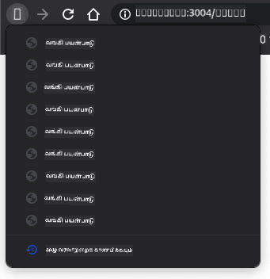

<!--
CO_OP_TRANSLATOR_METADATA:
{
  "original_hash": "8a07db14e75ac62f013b7de5df05981d",
  "translation_date": "2025-10-11T12:05:02+00:00",
  "source_file": "7-bank-project/1-template-route/README.md",
  "language_code": "ta"
}
-->
# வங்கி பயன்பாட்டை உருவாக்குதல் பகுதி 1: HTML டெம்ப்ளேட்கள் மற்றும் வலை பயன்பாட்டில் வழிகள்

## முன்-வகுப்பு வினாடி வினா

[முன்-வகுப்பு வினாடி வினா](https://ff-quizzes.netlify.app/web/quiz/41)

### அறிமுகம்

உலாவிகளில் JavaScript உருவாக்கப்பட்டதிலிருந்து, இணையதளங்கள் முந்தையதை விட அதிக இடைமுகம் கொண்டதாகவும் சிக்கலானதாகவும் மாறி வருகின்றன. இணைய தொழில்நுட்பங்கள் தற்போது முழுமையான செயல்பாடுகளைக் கொண்ட பயன்பாடுகளை உருவாக்குவதற்கு பொதுவாகப் பயன்படுத்தப்படுகின்றன, அவை நேரடியாக உலாவியில் இயங்குகின்றன, இதை [வலை பயன்பாடுகள்](https://en.wikipedia.org/wiki/Web_application) என்று அழைக்கிறோம். வலை பயன்பாடுகள் மிகவும் இடைமுகம் கொண்டவை என்பதால், பயனர்கள் ஒவ்வொரு செயல்பாடும் செய்யப்படும் போது முழு பக்கம் மீண்டும் ஏற்றப்படுவதற்காக காத்திருக்க விரும்பவில்லை. அதனால், JavaScript HTML ஐ நேரடியாக DOM ஐப் பயன்படுத்தி புதுப்பிக்கப்படுகிறது, இது மென்மையான பயனர் அனுபவத்தை வழங்குகிறது.

இந்த பாடத்தில், முழு HTML பக்கத்தை மீண்டும் ஏற்றாமல் புதுப்பிக்கவும், பல திரைகளை உருவாக்க HTML டெம்ப்ளேட்களைப் பயன்படுத்தி வங்கி வலை பயன்பாட்டை உருவாக்க அடிப்படைகளை அமைக்கப் போகிறோம்.

### முன்-தரவு

இந்த பாடத்தில் நாம் உருவாக்கும் வலை பயன்பாட்டை சோதிக்க உங்களுக்கு உள்ளூர் வலை சேவையகம் தேவை. உங்களிடம் இல்லையெனில், [Node.js](https://nodejs.org) ஐ நிறுவி உங்கள் திட்ட கோப்பகத்தில் இருந்து `npx lite-server` கட்டளையைப் பயன்படுத்தலாம். இது ஒரு உள்ளூர் வலை சேவையகத்தை உருவாக்கி உங்கள் பயன்பாட்டை உலாவியில் திறக்கும்.

### தயாரிப்பு

உங்கள் கணினியில், `bank` என்ற கோப்பகத்தை உருவாக்கி அதில் `index.html` என்ற கோப்பை சேர்க்கவும். இந்த HTML [boilerplate](https://en.wikipedia.org/wiki/Boilerplate_code) இலிருந்து தொடங்குவோம்:

```html
<!DOCTYPE html>
<html lang="en">
  <head>
    <meta charset="UTF-8">
    <meta name="viewport" content="width=device-width, initial-scale=1.0">
    <title>Bank App</title>
  </head>
  <body>
    <!-- This is where you'll work -->
  </body>
</html>
```

---

## HTML டெம்ப்ளேட்கள்

ஒரு வலைப்பக்கத்திற்கான பல திரைகளை உருவாக்க விரும்பினால், நீங்கள் காட்ட விரும்பும் ஒவ்வொரு திரைக்கும் ஒரு HTML கோப்பை உருவாக்குவது ஒரு தீர்வாக இருக்கும். ஆனால், இந்த தீர்வு சில சிக்கல்களுடன் வருகிறது:

- திரையை மாற்றும்போது முழு HTML ஐ மீண்டும் ஏற்ற வேண்டும், இது மெதுவாக இருக்கலாம்.
- வெவ்வேறு திரைகளுக்கு இடையில் தரவைப் பகிர்வது கடினமாக இருக்கும்.

மற்றொரு அணுகுமுறை என்பது ஒரு HTML கோப்பை மட்டுமே வைத்திருப்பது மற்றும் `<template>` கூறுகளைப் பயன்படுத்தி பல [HTML டெம்ப்ளேட்களை](https://developer.mozilla.org/docs/Web/HTML/Element/template) வரையறுப்பது. டெம்ப்ளேட் என்பது உலாவியால் காட்டப்படாத மறுபயன்பாட்டு HTML தொகுதி ஆகும், இது JavaScript ஐப் பயன்படுத்தி இயக்க நேரத்தில் உருவாக்கப்பட வேண்டும்.

### பணிகள்

நாம் இரண்டு திரைகளைக் கொண்ட வங்கி பயன்பாட்டை உருவாக்கப் போகிறோம்: உள்நுழைவு பக்கம் மற்றும் டாஷ்போர்டு. முதலில், HTML உடலுக்குள் ஒரு இடதுசாரி கூறைச் சேர்ப்போம், இது நமது பயன்பாட்டின் வெவ்வேறு திரைகளை உருவாக்க பயன்படுத்தப்படும்:

```html
<div id="app">Loading...</div>
```

JavaScript மூலம் பின்னர் இதை எளிதாகக் கண்டறிய `id` ஐ வழங்குகிறோம்.

> குறிப்புகள்: இந்த கூறின் உள்ளடக்கம் மாற்றப்படும் என்பதால், பயன்பாடு ஏற்றப்படும் போது காட்டப்படும் ஒரு ஏற்றும் செய்தி அல்லது குறியீட்டை வைத்திருக்கலாம்.

அடுத்ததாக, உள்நுழைவு பக்கத்திற்கான HTML டெம்ப்ளேட்டை கீழே சேர்ப்போம். தற்போது, அதில் ஒரு தலைப்பு மற்றும் வழிசெலுத்தலைச் செய்ய பயன்படுத்தப்படும் ஒரு இணைப்பைக் கொண்ட ஒரு பிரிவை மட்டும் சேர்ப்போம்.

```html
<template id="login">
  <h1>Bank App</h1>
  <section>
    <a href="/dashboard">Login</a>
  </section>
</template>
```

பின்னர் டாஷ்போர்டு பக்கத்திற்கான மற்றொரு HTML டெம்ப்ளேட்டைச் சேர்ப்போம். இந்த பக்கம் பல பிரிவுகளை கொண்டிருக்கும்:

- தலைப்பு மற்றும் வெளியேறும் இணைப்புடன் ஒரு தலைப்பு
- வங்கி கணக்கின் தற்போதைய இருப்பு
- ஒரு அட்டவணையில் காட்டப்படும் பரிவர்த்தனைகளின் பட்டியல்

```html
<template id="dashboard">
  <header>
    <h1>Bank App</h1>
    <a href="/login">Logout</a>
  </header>
  <section>
    Balance: 100$
  </section>
  <section>
    <h2>Transactions</h2>
    <table>
      <thead>
        <tr>
          <th>Date</th>
          <th>Object</th>
          <th>Amount</th>
        </tr>
      </thead>
      <tbody></tbody>
    </table>
  </section>
</template>
```

> குறிப்புகள்: HTML டெம்ப்ளேட்களை உருவாக்கும்போது, ​​அது எப்படி தோன்றும் என்பதைப் பார்க்க விரும்பினால், `<template>` மற்றும் `</template>` வரிகளை `<!-- -->` மூலம் மறைக்கலாம்.

✅ டெம்ப்ளேட்களில் `id` பண்புகளைப் பயன்படுத்துவதற்கான காரணம் என்ன? இதற்கு பதிலாக வகுப்புகளைப் பயன்படுத்த முடியுமா?

## JavaScript மூலம் டெம்ப்ளேட்களை காட்டுதல்

உங்கள் தற்போதைய HTML கோப்பை உலாவியில் முயற்சித்தால், அது `Loading...` என்பதை மட்டுமே காட்டி சிக்கிக்கொள்கிறது. அதனால், HTML டெம்ப்ளேட்களை உருவாக்கி காட்ட JavaScript குறியீட்டைச் சேர்க்க வேண்டும்.

டெம்ப்ளேட்டை உருவாக்குவது பொதுவாக 3 படிகளில் செய்யப்படுகிறது:

1. DOM இல் டெம்ப்ளேட் கூறை பெறுதல், உதாரணமாக [`document.getElementById`](https://developer.mozilla.org/docs/Web/API/Document/getElementById) ஐப் பயன்படுத்துதல்.
2. டெம்ப்ளேட் கூறை நகலெடுப்பது, [`cloneNode`](https://developer.mozilla.org/docs/Web/API/Node/cloneNode) ஐப் பயன்படுத்துதல்.
3. அதை ஒரு காட்சிப்படுத்தக்கூடிய கூறின் கீழ் DOM இல் இணைத்தல், உதாரணமாக [`appendChild`](https://developer.mozilla.org/docs/Web/API/Node/appendChild) ஐப் பயன்படுத்துதல்.

✅ டெம்ப்ளேட்டை DOM இல் இணைக்கும் முன் நகலெடுக்க வேண்டியதன் காரணம் என்ன? இந்த படியை தவிர்த்தால் என்ன நடக்கும்?

### பணிகள்

உங்கள் திட்ட கோப்பகத்தில் `app.js` என்ற புதிய கோப்பை உருவாக்கி, அந்த கோப்பை HTML இன் `<head>` பிரிவில் இறக்குமதி செய்யுங்கள்:

```html
<script src="app.js" defer></script>
```

இப்போது `app.js` இல், `updateRoute` என்ற புதிய செயல்பாட்டை உருவாக்குவோம்:

```js
function updateRoute(templateId) {
  const template = document.getElementById(templateId);
  const view = template.content.cloneNode(true);
  const app = document.getElementById('app');
  app.innerHTML = '';
  app.appendChild(view);
}
```

இங்கே நாம் மேலே விவரிக்கப்பட்ட 3 படிகளைச் செய்கிறோம். `templateId` ஐ கொண்ட டெம்ப்ளேட்டை உருவாக்கி, அதன் நகலெடுக்கப்பட்ட உள்ளடக்கத்தை நமது பயன்பாட்டின் இடதுசாரி கூறுக்குள் வைக்கிறோம். முழு துணைமரத்தை நகலெடுக்க `cloneNode(true)` ஐப் பயன்படுத்த வேண்டும்.

இப்போது இந்த செயல்பாட்டை ஒரு டெம்ப்ளேட்டுடன் அழைத்து முடிவைப் பாருங்கள்.

```js
updateRoute('login');
```

✅ இந்த குறியீட்டின் நோக்கம் என்ன `app.innerHTML = '';`? இதை இல்லாமல் என்ன நடக்கும்?

## வழிகளை உருவாக்குதல்

ஒரு வலை பயன்பாட்டைப் பற்றி பேசும்போது, ​​**URLகளை** காட்ட வேண்டிய குறிப்பிட்ட திரைகளுடன் இணைப்பது *Routing* என்று அழைக்கப்படுகிறது. பல HTML கோப்புகளைக் கொண்ட ஒரு வலைத்தளத்தில், இது தானாகவே செய்யப்படுகிறது, ஏனெனில் கோப்பு பாதைகள் URL இல் பிரதிபலிக்கப்படுகின்றன. உதாரணமாக, உங்கள் திட்ட கோப்பகத்தில் இந்த கோப்புகள் இருந்தால்:

```
mywebsite/index.html
mywebsite/login.html
mywebsite/admin/index.html
```

நீங்கள் `mywebsite` ஐ மூலமாகக் கொண்ட ஒரு வலை சேவையகத்தை உருவாக்கினால், URL வரைபடம் இதுவாக இருக்கும்:

```
https://site.com            --> mywebsite/index.html
https://site.com/login.html --> mywebsite/login.html
https://site.com/admin/     --> mywebsite/admin/index.html
```

எனினும், நமது வலை பயன்பாட்டிற்காக, அனைத்து திரைகளையும் கொண்ட ஒரு HTML கோப்பைப் பயன்படுத்துகிறோம், எனவே இந்த இயல்புநிலை நடத்தை நமக்கு உதவாது. இந்த வரைபடத்தை கையேடாக உருவாக்கி, JavaScript ஐப் பயன்படுத்தி காட்டப்படும் டெம்ப்ளேட்டை புதுப்பிக்க வேண்டும்.

### பணிகள்

URL பாதைகள் மற்றும் நமது டெம்ப்ளேட்களுக்கு இடையிலான [map](https://en.wikipedia.org/wiki/Associative_array) ஐ செயல்படுத்த ஒரு எளிய பொருளைப் பயன்படுத்துவோம். உங்கள் `app.js` கோப்பின் மேல் இந்த பொருளைச் சேர்க்கவும்.

```js
const routes = {
  '/login': { templateId: 'login' },
  '/dashboard': { templateId: 'dashboard' },
};
```

இப்போது `updateRoute` செயல்பாட்டை சிறிது மாற்றுவோம். `templateId` ஐ நேரடியாக வாதமாக வழங்குவதற்குப் பதிலாக, தற்போதைய URL ஐ முதலில் பார்க்க, பின்னர் நமது வரைபடத்தைப் பயன்படுத்தி தொடர்புடைய டெம்ப்ளேட் ID மதிப்பை பெற வேண்டும். URL இல் பாதை பிரிவை மட்டும் பெற [`window.location.pathname`](https://developer.mozilla.org/docs/Web/API/Location/pathname) ஐப் பயன்படுத்தலாம்.

```js
function updateRoute() {
  const path = window.location.pathname;
  const route = routes[path];

  const template = document.getElementById(route.templateId);
  const view = template.content.cloneNode(true);
  const app = document.getElementById('app');
  app.innerHTML = '';
  app.appendChild(view);
}
```

இங்கே நாம் அறிவித்த வழிகளை தொடர்புடைய டெம்ப்ளேட்டுடன் இணைத்தோம். உலாவியில் URL ஐ கையேடாக மாற்றி சரியாக வேலை செய்கிறதா என்பதை முயற்சிக்கலாம்.

✅ URL இல் தெரியாத பாதையை நீங்கள் உள்ளிடினால் என்ன நடக்கும்? இதை எப்படி தீர்க்கலாம்?

## வழிசெலுத்தல் சேர்த்தல்

நமது பயன்பாட்டின் அடுத்த படி, URL ஐ கையேடாக மாற்றாமல் பக்கங்களுக்கு இடையே செல்லும் திறனைச் சேர்ப்பது. இது இரண்டு விஷயங்களை உள்ளடக்கியது:

  1. தற்போதைய URL ஐ புதுப்பித்தல்
  2. புதிய URL அடிப்படையில் காட்டப்படும் டெம்ப்ளேட்டை புதுப்பித்தல்

இரண்டாவது பகுதியை `updateRoute` செயல்பாட்டுடன் நாம் ஏற்கனவே கவனித்துள்ளோம், எனவே தற்போதைய URL ஐ புதுப்பிக்க எப்படி என்பதை கண்டறிய வேண்டும்.

JavaScript மற்றும் குறிப்பாக [`history.pushState`](https://developer.mozilla.org/docs/Web/API/History/pushState) ஐப் பயன்படுத்த வேண்டும், இது HTML ஐ மீண்டும் ஏற்றாமல் URL ஐ புதுப்பித்து உலாவி வரலாற்றில் புதிய நுழைவுகளை உருவாக்க உதவுகிறது.

> குறிப்புகள்: HTML இணைப்பு கூறு [`<a href>`](https://developer.mozilla.org/docs/Web/HTML/Element/a) தனியாக URL களுக்கான ஹைப்பர்லிங்க்களை உருவாக்க பயன்படுத்தப்படலாம், ஆனால் இது இயல்பாக HTML ஐ மீண்டும் ஏற்றும். preventDefault() செயல்பாட்டை கிளிக் நிகழ்வில் பயன்படுத்தி வழிசெலுத்தலை கையாளும்போது இந்த நடத்தை தவிர்க்க வேண்டும்.

### பணிகள்

நமது பயன்பாட்டில் வழிசெலுத்த பயன்படுத்தக்கூடிய புதிய செயல்பாட்டை உருவாக்குவோம்:

```js
function navigate(path) {
  window.history.pushState({}, path, path);
  updateRoute();
}
```

இந்த முறை முதலில் கொடுக்கப்பட்ட பாதையின் அடிப்படையில் தற்போதைய URL ஐ புதுப்பித்து, பின்னர் டெம்ப்ளேட்டை புதுப்பிக்கிறது. சொத்து `window.location.origin` URL மூலத்தைத் திருப்புகிறது, கொடுக்கப்பட்ட பாதையிலிருந்து முழு URL ஐ மீண்டும் உருவாக்க உதவுகிறது.

இப்போது இந்த செயல்பாடு இருப்பதால், எந்த பாதை அறிவிக்கப்பட்ட வழியைப் பொருந்தவில்லை என்றால் நாம் எதிர்கொள்ளும் பிரச்சினையை கவனிக்க முடியும். பொருந்தக்கூடியதை கண்டறிய முடியாவிட்டால், `updateRoute` செயல்பாட்டை மாற்றி, அறிவிக்கப்பட்ட வழிகளில் ஒன்றுக்கு மீண்டும் செல்லலாம்.

```js
function updateRoute() {
  const path = window.location.pathname;
  const route = routes[path];

  if (!route) {
    return navigate('/login');
  }

  ...
```

ஒரு வழியை கண்டறிய முடியாவிட்டால், இப்போது `login` பக்கத்திற்கு திருப்புவோம்.

இப்போது ஒரு இணைப்பு கிளிக் செய்யப்படும் போது URL ஐப் பெற மற்றும் உலாவியின் இயல்புநிலை இணைப்பு நடத்தை தவிர்க்க ஒரு செயல்பாட்டை உருவாக்குவோம்:

```js
function onLinkClick(event) {
  event.preventDefault();
  navigate(event.target.href);
}
```

நமது *Login* மற்றும் *Logout* இணைப்புகளுக்கு HTML இல் பிணைப்புகளைச் சேர்த்து வழிசெலுத்தல் அமைப்பை முடிக்கலாம்.

```html
<a href="/dashboard" onclick="onLinkClick(event)">Login</a>
...
<a href="/login" onclick="onLinkClick(event)">Logout</a>
```

மேலே உள்ள `event` பொருள், `click` நிகழ்வைப் பிடித்து அதை நமது `onLinkClick` செயல்பாட்டிற்கு அனுப்புகிறது.

[`onclick`](https://developer.mozilla.org/docs/Web/API/GlobalEventHandlers/onclick) பண்பை பயன்படுத்தி `click` நிகழ்வை JavaScript குறியீட்டுடன் பிணைக்கவும், இங்கு `navigate()` செயல்பாட்டை அழைக்கவும்.

இந்த இணைப்புகளை கிளிக் செய்ய முயற்சிக்கவும், உங்கள் பயன்பாட்டின் வெவ்வேறு திரைகளுக்கு இடையே செல்ல முடியும்.

✅ `history.pushState` முறை HTML5 தரநிலையின் ஒரு பகுதியாகும் மற்றும் [அனைத்து நவீன உலாவிகளில்](https://caniuse.com/?search=pushState) செயல்படுத்தப்பட்டுள்ளது. நீங்கள் பழைய உலாவிகளுக்கான வலை பயன்பாட்டை உருவாக்கினால், இந்த API க்கு பதிலாக நீங்கள் பயன்படுத்தக்கூடிய ஒரு தந்திரம் உள்ளது: பாதைக்கு முன் [hash (`#`)](https://en.wikipedia.org/wiki/URI_fragment) ஐப் பயன்படுத்தி வழிசெலுத்தலை செயல்படுத்தலாம், இது வழக்கமான இணைப்பு வழிசெலுத்தலுடன் வேலை செய்கிறது மற்றும் பக்கத்தை மீண்டும் ஏற்றாது, அதன் நோக்கம் பக்கத்திற்குள் உள் இணைப்புகளை உருவாக்குவது.

## உலாவியின் பின் மற்றும் முன்னோக்கி பொத்தான்களை கையாளுதல்

`history.pushState` ஐப் பயன்படுத்துவது உலாவி வழிசெலுத்தல் வரலாற்றில் புதிய நுழைவுகளை உருவாக்குகிறது. உலாவியின் *பின் பொத்தானை* அழுத்தி வைத்தால், இது இதுபோன்ற ஒன்றை காட்ட வேண்டும்:



பின் பொத்தானை சில முறை கிளிக் செய்ய முயற்சித்தால், தற்போதைய URL மாறுகிறது மற்றும் வரலாறு புதுப்பிக்கப்படுகிறது, ஆனால் அதே டெம்ப்ளேட் தொடர்ந்து காட்டப்படுகிறது.

அதனால், வரலாறு மாறும் ஒவ்வொரு முறையும் `updateRoute()` ஐ அழைக்க வேண்டும் என்பதை பயன்பாடு அறியவில்லை. [`history.pushState` ஆவணத்தில்](https://developer.mozilla.org/docs/Web/API/History/pushState) நீங்கள் பார்க்கலாம், மாநிலம் மாறினால் - அதாவது நாம் வேறொரு URL க்கு நகர்ந்தோம் - [`popstate`](https://developer.mozilla.org/docs/Web/API/Window/popstate_event) நிகழ்வு தூண்டப்படுகிறது. இந்த பிரச்சினையை சரிசெய்ய அதை பயன்படுத்துவோம்.

### பணிகள்

உலாவி வரலாறு மாறும்போது காட்டப்படும் டெம்ப்ளேட் புதுப்பிக்கப்படுவதை உறுதிப்படுத்த, `updateRoute()` ஐ அழைக்கும் புதிய செயல்பாட்டை இணைப்போம். `app.js` கோப்பின் கீழே அதைச் செய்வோம்:

```js
window.onpopstate = () => updateRoute();
updateRoute();
```

> குறிப்புகள்: நமது `popstate` நிகழ்வு கையாளுநரை சுருக்கமாக அறிவிக்க [arrow function](https://developer.mozilla.org/docs/Web/JavaScript/Reference/Functions/Arrow_functions) ஐப் பயன்படுத்தினோம், ஆனால் ஒரு வழக்கமான செயல்பாடு ஒரே மாதிரியான வேலை செய்யும்.

arrow functions பற்றிய வீடியோ:

[](https://youtube.com/watch?v=OP6eEbOj2sc "Arrow Functions")

> 🎥 மேலே உள்ள படத்தை கிளிக் செய்து arrow functions பற்றிய வீடியோவைப் பாருங்கள்.

இப்போது உலாவியின் பின் மற்றும் முன்னோக்கி பொத்தான்களை பயன்படுத்த முயற்சிக்கவும், இந்த முறை காட்டப்படும் வழி சரியாக புதுப்பிக்கப்படுகிறதா என்பதைச் சரிபார்க்கவும்.

---

## 🚀 சவால்

இந்த பயன்பாட்டிற்கான கிரெடிட்களை காட்டும் மூன்றாவது பக்கத்திற்கான புதிய டெம்ப்ளேட் மற்றும் வழியைச் சேர்க்கவும்.

## வகுப்புக்குப் பின் வினாடி வினா

[வகுப்புக்குப் பின் வினாடி வினா](https://ff-quizzes.netlify.app/web/quiz/42)

## மதிப்பீடு & சுயபடிப்பு

வழிசெலுத்தல் வலை வளர்ச்சியின் ஆச்சரியமாக சிக்கலான பகுதிகளில் ஒன்றாகும், குறிப்பாக வலை பக்கம் புதுப்பிப்பு நடத்தை இருந்து Single Page Application பக்கம் புதுப்பிப்புகளுக்கு நகரும் போது. [Azure Static Web App சேவை](https://docs.microsoft.com/azure/static-web-apps/routes/?WT.mc_id=academic-77807-sagibbon) வழிசெலுத்தலை எப்படி கையாளுகிறது என்பதைப் பற்றி கொஞ்சம் படிக்கவும். அந்த ஆவணத்தில் விவரிக்கப்பட்ட சில முடிவுகள் ஏன் அவசியம் என்பதை நீங்கள் விளக்க முடியுமா?

## பணிக்கட்டளை

[வழிசெலுத்தலை மேம்படுத்தவும்](assignment.md)

---

**குறிப்பு**:  
இந்த ஆவணம் [Co-op Translator](https://github.com/Azure/co-op-translator) என்ற AI மொழிபெயர்ப்பு சேவையைப் பயன்படுத்தி மொழிபெயர்க்கப்பட்டுள்ளது. நாங்கள் துல்லியத்திற்காக முயற்சிக்கிறோம், ஆனால் தானியங்கி மொழிபெயர்ப்புகளில் பிழைகள் அல்லது தவறான தகவல்கள் இருக்கக்கூடும் என்பதை கவனத்தில் கொள்ளவும். அதன் தாய்மொழியில் உள்ள மூல ஆவணம் அதிகாரப்பூர்வ ஆதாரமாக கருதப்பட வேண்டும். முக்கியமான தகவல்களுக்கு, தொழில்முறை மனித மொழிபெயர்ப்பு பரிந்துரைக்கப்படுகிறது. இந்த மொழிபெயர்ப்பைப் பயன்படுத்துவதால் ஏற்படும் எந்த தவறான புரிதல்கள் அல்லது தவறான விளக்கங்களுக்கு நாங்கள் பொறுப்பல்ல.